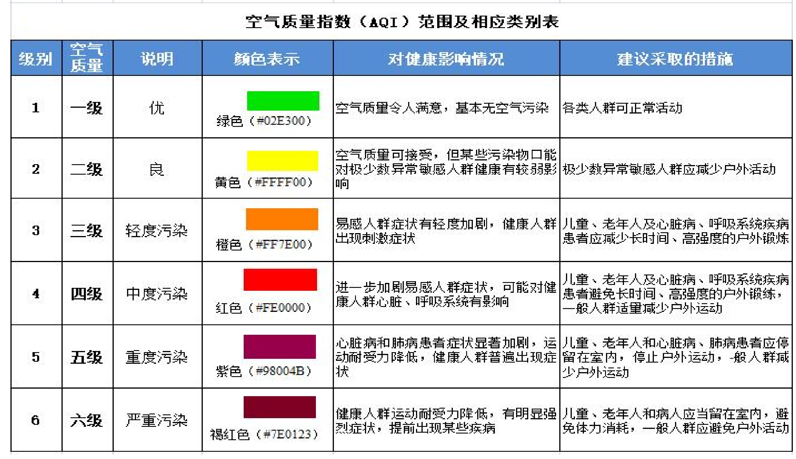
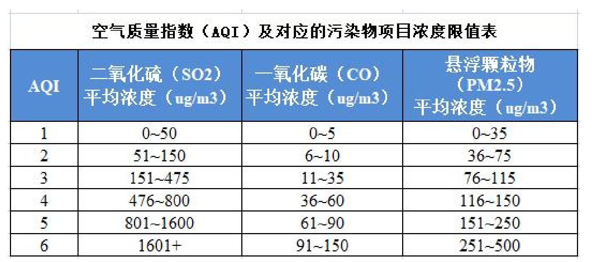
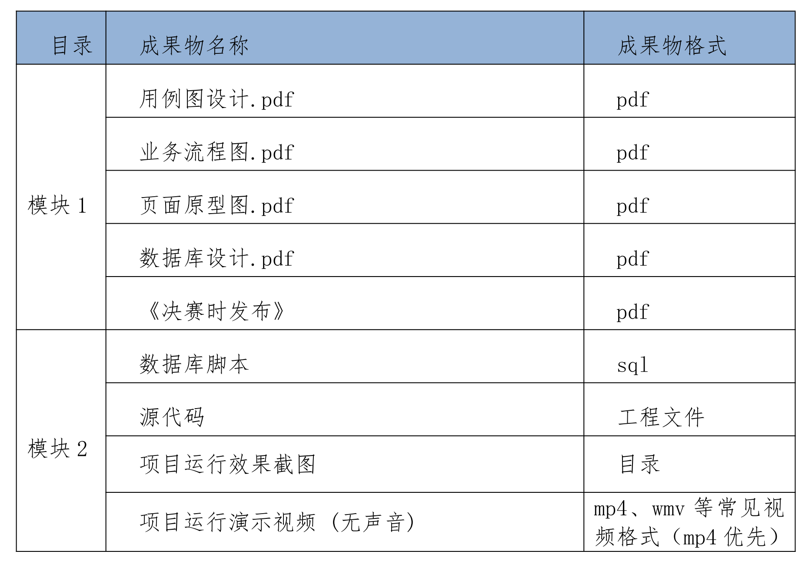

# 需求描述

本系统主要功能为：汇总不同地区的公众监督员提供的空气质量信息，由系统管理员将这些信息指派给专业的环保检测网格员，进行实地考察和检测，从而得到不同地区的空气质量 AQI（空气质量指数）的实时数据。再将这些 AQI 数据进行统计，统计结果最终成为环保方面决策者进行决策的依据。

地区使用网格化形式进行管理。最小网格单位为大城市（2022年发布 106 个大城市名单。包括 7 个超大城市、14 个特大城市、14个 I 型大城市、71 个 II 型大城市）

本系统使用者为：公众监督员、AQI 检测网格员、系统管理员。

本系统分为三端：

NEPS 端：**公众监督员端**。使用者：公众监督员。

NEPG 端：**AQI 检测网格员端**。使用者：AQI 检测网格员。 

NEPM 端：**系统管理端**。使用者：系统管理员

# 空气质量标准

AQI（Air Quality Index 空气质量指数）描述了空气清洁或者污染的程度。是 2012 年 3 月国家发布的新空气质量评价标准，污染物监测项为：空气悬浮颗粒物 PM2.5、二氧化硫、一氧化碳等主要指标。

 注意：AQI 三级以上（包含三级）即为超标 

 【空气质量指数 AQI 计算】 AQI = MAX（SO2AQI，COAQI，PM2.5AQI）  

# 竞赛要求

## 系统功能要求

要求设计和实现环保公众监督系统，本系统有三个角色：公众监督员、AQI 检测网格员、系统管理员；

1.**公众监督员端功能**：任何一个具有中国公民资格的人员都可以注册成为环保公众监督员。当发现当地空气质量存在异常时，可以通过本系统提供的公众监督员端程序，向本系统提交空气质量异常信息。

2.**系统管理员端功能**：系统管理员可以通过本系统提供的系统管理员端程序，查看**公众监督员**提交的空气质量异常信息，并将此信息指派给相应的 **AQI 检测网格员**；还能够查看网格员经过实地监测后，提交的空气质量 AQI 实测数据；

\3. **AQI 检测网格员端功能**：网格员可以通过本系统提供的网格员员端程序，查看指派给自己的空气质量异常信息。并根据此信息进行实地监测，并将 AQI 实测数据提交给系统

## 编码规范要求

1.项目名，包名，文件名，代码注释等任何位置不能体现学校和作者信息。

2.包名统一以 com.neu 开头，例如 com.neu.xxx.xxx。

3.类注释、方法注释，去掉 @author 信息。

## 竞赛成果物要求

项目成果物按照以下目录结构组织（mp4 时长在5分钟以内）

# 竞赛任务

## 模块一：需求分析与系统设计

本模块重点考查参赛选手的系统分析与设计能力，包括编写用例图，业务流程图，页面原型图，设计数据库，编写类图等 UML 图表。

【成果物要求】

本阶段涉及的成果物包括：用例图设计、业务流程图、页面原型图、数据库设计。

### 任务 1：需求分析-编写用例图

【任务要求】

编写系统用例。首先绘制总用例图，包含角色：**公众监督员角色**、**AQI 检测网格员角色**、**系统管理员角色**，然后绘制各个角色所属具体用例图。

1.编写系统总用例图

2.编写公众监督员端子用例图。

3.编写 AQI 检测网格员端子用例图。

4.编写系统管理员端子用例图。

【成果物要求】

文档内容：将以上用例图汇总到一个文档中，并做必要的文字说明。

文件命名：用例图设计.pdf

### 任务 2：需求分析-编写业务流程图

【任务要求】

绘制业务功能流程图。包括从公众监督员提交空气质量异常信息开始，系统管理员将提交信息指派给 AQI 检测网格员，AQI 检测网格员进行实地检测，并将实测数据提交给系统管理，系统管理端将实测

数据进行统计结束。

【成果物要求】

文档内容：将以上用例图汇总到一个文档中，并做必要的文字说明。

文件命名：业务流程图.pdf

### 任务 3：原型设计-页面原型图

【任务要求】

1. 绘制公众**监督员端**所需页面的原型图。包括：登录、注册页面、选择当前所在网格区域页面、预估当前空气质量 AQI 等级页面并提交信息页面、历史反馈信息列表页面。

1. 绘制**系统管理员端**所需页面的原型图。包括：登录页面、浏览公众监督员提交信息页面、将提交信息指派给网格员页面、浏览 AQI网格员提交信息页面。
2. 绘制**网格员端**所需页面的原型图。包括：登录页面、指派给自己的任务列表页面、天下空气质量 AQI 实测数据并提交页面。

【成果物要求】

文档内容：将以上原型图汇总到一个文档中，并做必要的文字说明。

文件命名：页面原型图.pdf

### 任务 4：系统设计-数据库设计

【任务要求】

1.分析系统中的实体以及实体之间的关系，然后绘制 ER 图。

2、根据 ER 图，分析每个实体的属性，以及实体之间的映射关系，

完成数据库的详细设计。

【成果物要求】

文档内容：将以上 ER 图和数据库设计汇总到一个文档中，并做必要的文字说明。

文件命名：数据库设计.pdf

### 任务 5：《决赛时发布》

本任务在决赛时发布

## 模块二：软件系统开发

本模块重点考查参赛选手的基于前后端分离架构应用程序开发的能力，具体包括：

1.基于给定的系统需求，使用 HTML5、CSS3、JavaScript、Vue.js等技术完成前端工程开发，要求编码符合前端工程化开发技术规范。

2.基于给定的系统需求，使用 MySql 数据库，使用 SpringBoot、MyBatis 等企业级框架技术实现后端工程开发，要求设计符合 MVC 的分层架构模式，编码符合命名和注释规范。

【成果物要求】

本阶段涉及的成果物包括：数据库脚本、项目源代码、项目运行效果截图、项目运行效果视频。

### 任务 1：公众监督员反馈空气质量异常信息

【任务要求】

1.创建公众监督员的前后端工程，需要登录才能进入应用程序。

2.登录之后，公众监督员可以选择当前所处网格地址（直接输入大城市名称），然后填写当前网格地址的空气质量异常信息。包括：空气质量异常状况的描述、预估 AQI 等级。

3.上述内容填写完毕后，将信息提交给系统管理员服务端。

### 任务 2：系统管理员将异常信息指派给网格员

【任务要求】

1.创建系统管理员的前后端工程，需要登录才能进入应用程序。

2.系统管理员可以浏览公众监督员提交的空气质量异常信息。

3.系统管理员可以将提交信息指派给某个 AQI 检测网格员。

### 任务 3：AQI 检测网格员进行实地检测，并将实测数据提交系统

【任务要求】

1.创建网格员端的前后端工程，需要登录才能进入应用程序。

2.网格员可以浏览指派给自己的任务列表，网格员选取某项任务，根据任务信息，到达指定网格区域。

3.网格员在指定网格区域进行实地检测。内容包括：PM2.5 浓度检测、二氧化硫浓度检测、一氧化碳浓度检测。

\4. 网格员将实地检测数据提交给系统管理员服务端。

### 任务 4：系统管理员浏览查看网格员提交的实测数据

【任务要求】

\1. 系统管理员可以浏览查看 AQI 实测网格员提交的实测数据。

\2. 在提交的实测数据中包括：所有网格地址的 AQI 实测数据、以及详细的 PM2.5 浓度、二氧化硫浓度、一氧化碳浓度实测数据。

### 任务 5：《决赛时发布》

本任务在决赛时发
