# 服务器的基本概念与初识Ajax

## 1. 客户端与服务器

### 1.1 上网的目的

上网的本质目的：通过互联网的形式来获取和消费资源

### 1.2 服务器

上网过程中，负责存放和对外提供资源的电脑，叫做服务器。

[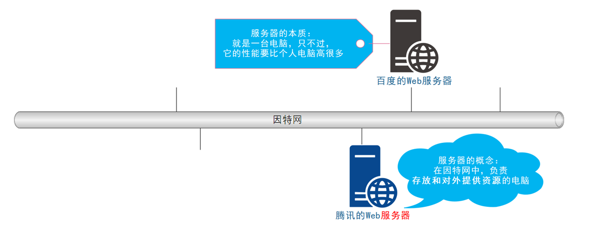](https://xiaobaicai350.github.io/pic/image-20230526101412839.png)

### 1.3 客户端

上网过程中，负责获取和消费资源的电脑，叫做客户端。

[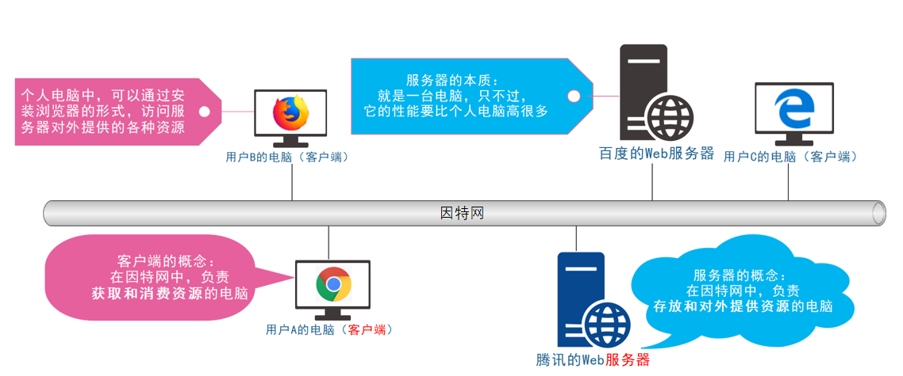](https://xiaobaicai350.github.io/pic/image-20230526101435536.png)

## 2. URL地址

### 2.1 URL地址的概念

URL（全称是UniformResourceLocator）中文叫统一资源定位符，用于标识互联网上每个资源的唯一存放位置。浏览器只有通过URL地址，才能正确定位资源的存放位置，从而成功访问到对应的资源。

常见的URL举例：

[http://www.baidu.com](http://www.baidu.com/)
[http://www.taobao.com](http://www.taobao.com/)
http://www.cnblogs.com/liulongbinblogs/p/11649393.html

### 2.2 URL地址的组成部分

URL地址一般由三部组成：

① 客户端与服务器之间的通信协议
② 存有该资源的服务器名称
③ 资源在服务器上具体的存放位置

[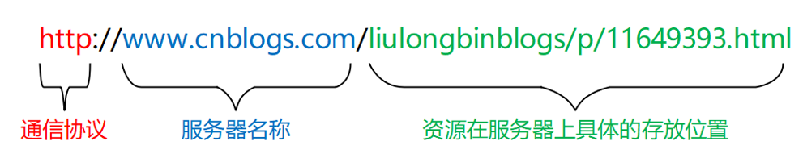](https://xiaobaicai350.github.io/pic/image-20230526101559722.png)

## 3. 客户端与服务器的通信过程

### 3.1 图解客户端与服务器的通信过程

[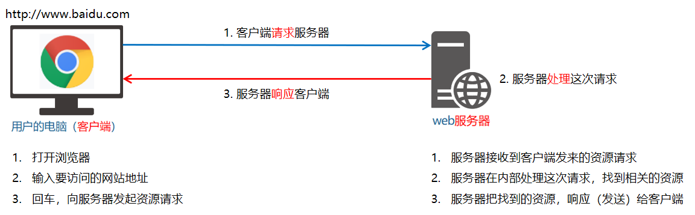](https://xiaobaicai350.github.io/pic/image-20230526101621315.png)

注意：

1. 客户端与服务器之间的通信过程，分为 请求 – 处理 – 响应 三个步骤。
2. 网页中的每一个资源，都是通过 请求 – 处理 – 响应 的方式从服务器获取回来的。

### 3.2 基于浏览器的开发者工具分析通信过程

1. 打开 Chrome 浏览器
2. Ctrl+Shift+I 打开 Chrome 的开发者工具
3. 切换到 Network 面板
4. 选中 Doc 页签
5. 刷新页面，分析客户端与服务器的通信过程

[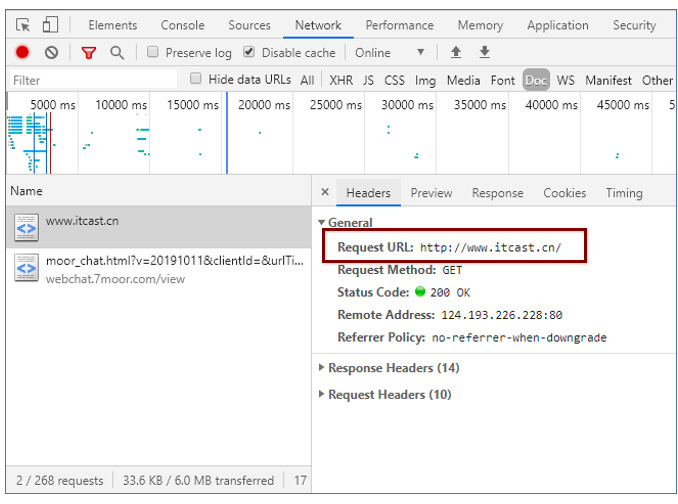](https://xiaobaicai350.github.io/pic/image-20230526101747648.png)

[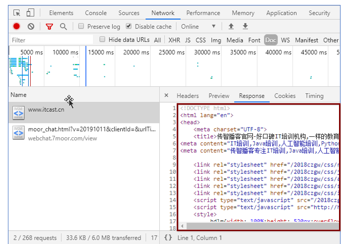](https://xiaobaicai350.github.io/pic/image-20230526101802754.png)

## 4. 服务器对外提供了哪些资源

### 4.1 例举网页中常见的资源

[](https://xiaobaicai350.github.io/pic/image-20230526101828874.png)

### 4.2 数据也是资源

**网页中的数据，也是服务器对外提供的一种资源。**例如股票数据、各行业排行榜等。

### 4.3 数据是网页的灵魂

- HTML是网页的骨架
- CSS是网页的颜值
- Javascript是网页的行为
- 数据，则是网页的灵魂

骨架、颜值、行为皆为数据服务

数据，在网页中无处不在

### 4.4 网页中如何请求数据

数据，也是**服务器**对外提供的一种资源。只要是资源，必然要通过 **请求 – 处理 – 响应** 的方式进行获取。

[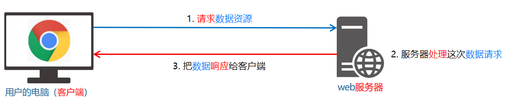](https://xiaobaicai350.github.io/pic/image-20230526101940440.png)

如果要在网页中请求服务器上的数据资源，则需要用到 XMLHttpRequest 对象。

XMLHttpRequest（简称 xhr）是浏览器提供的 js 成员，通过它，可以请求服务器上的数据资源。

最简单的用法 var xhrObj = new XMLHttpRequest()

### 4.5 资源的请求方式

客户端请求服务器时，请求的方式有很多种，最常见的两种请求方式分别为 get 和 post 请求。

get 请求通常用于获取服务端资源（向服务器要资源）

 例如：根据 URL 地址，从服务器获取 HTML 文件、css 文件、js文件、图片文件、数据资源等

post 请求通常用于向服务器提交数据（往服务器发送资源）

 例如：登录时向服务器提交的登录信息、注册时向服务器提交的注册信息、添加用户时向服务器提交的用户信息等各种数据提交操作

## 5. 了解Ajax

### 5.1 什么是Ajax

Ajax 的全称是 Asynchronous Javascript And XML（异步 JavaScript 和 XML）。

通俗的理解：在网页中利用 XMLHttpRequest 对象和服务器进行数据交互的方式，就是Ajax。

### 5.2 为什么要学Ajax

之前所学的技术，**只能把网页做的更美观漂亮**，或添加一些动画效果

**但是**，Ajax能让我们轻松实现网页与服务器之间的数据交互。

[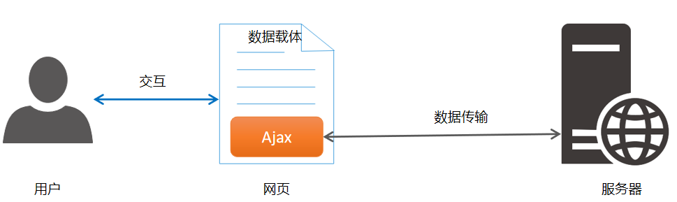](https://xiaobaicai350.github.io/pic/image-20230526102119817.png)

### 5.3 Ajax的典型应用场景

用户名检测：注册用户时，通过 ajax 的形式，动态检测用户名是否被占用(注意是占用，这里已经到后端请求数据库里面的数据了)

[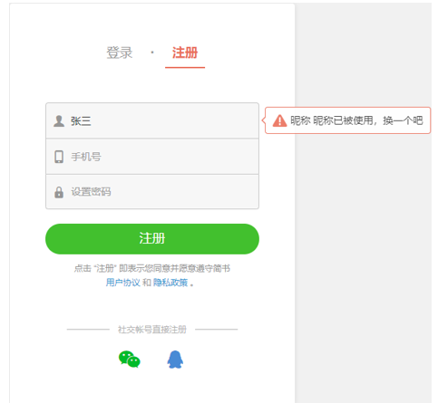](https://xiaobaicai350.github.io/pic/image-20230526102213338.png)

搜索提示：当输入搜索关键字时，通过 ajax 的形式，动态加载搜索提示列表

[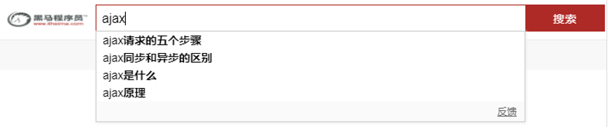](https://xiaobaicai350.github.io/pic/image-20230526102248965.png)

数据分页显示：当点击页码值的时候，通过 ajax 的形式，根据页码值动态刷新表格的数据

[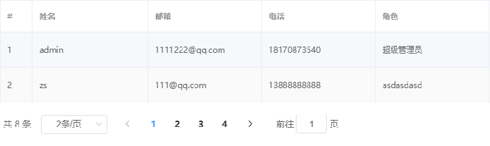](https://xiaobaicai350.github.io/pic/image-20230526102258444.png)

数据的增删改查：数据的添加、删除、修改、查询操作，都需要通过 ajax 的形式，来实现数据的交互

[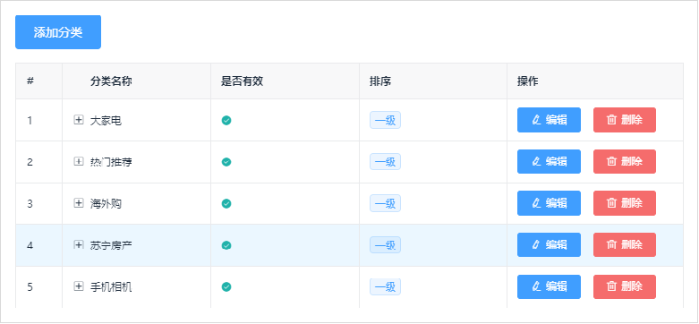](https://xiaobaicai350.github.io/pic/image-20230526102314933.png)

## 6. jQuery中的Ajax

### 6.1 了解jQuery中的Ajax

**浏览器中提供**的 XMLHttpRequest 用法比较复杂，所以 **jQuery 对 XMLHttpRequest 进行了封装**，提供了一系列 Ajax 相关的函数，极大地降低了 Ajax 的使用难度。

jQuery 中发起 Ajax 请求最常用的三个方法如下：

- $.get()
- $.post()
- $.ajax()

### 6.2 $.get()函数的语法

jQuery 中 $.get() 函数的功能单一，专门用来发起 get 请求，从而将服务器上的资源请求到客户端来进行使用。$.get() 函数的语法如下：

```
$.get(url, [data], [callback])
```

其中，三个参数各自代表的含义如下：

[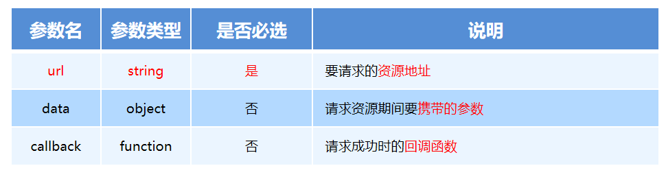](https://xiaobaicai350.github.io/pic/image-20230526102546278.png)

#### $.get()发起不带参数的请求

使用 $.get() 函数发起不带参数的请求时，直接提供请求的 URL 地址和请求成功之后的回调函数即可，示例代码如下：

```
PLAINTEXT
$.get('http://www.liulongbin.top:3006/api/getbooks', function(res) {
    console.log(res) // 这里的 res 是服务器返回的数据
})
```

[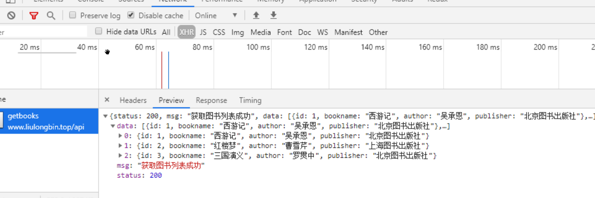](https://xiaobaicai350.github.io/pic/image-20230526102716618.png)

#### $.get()发起带参数的请求

使用 $.get() 函数发起带参数的请求时，示例代码如下：

```
PLAINTEXT
$.get('http://www.liulongbin.top:3006/api/getbooks', { id: 1 }, function(res) {
    console.log(res)
})
```

[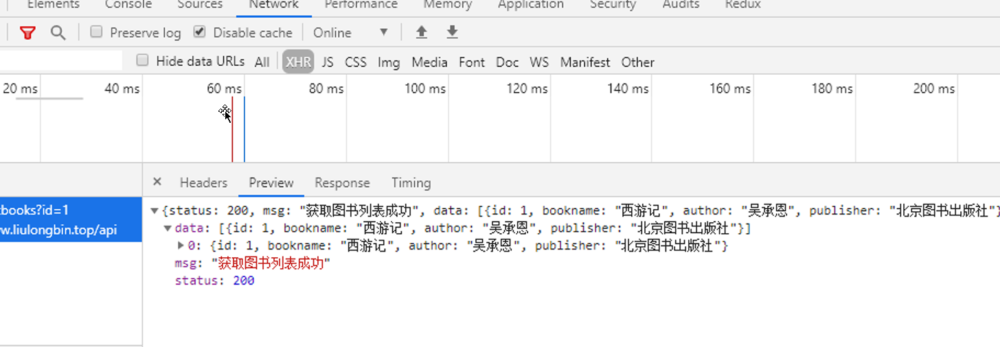](https://xiaobaicai350.github.io/pic/image-20230526102758002.png)

### 6.3 $.post()函数的语法

jQuery 中 $.post() 函数的功能单一，专门用来发起 post 请求，从而向服务器提交数据。$.post() 函数的语法如下：

```
$.post(url, [data], [callback])
```

其中，三个参数各自代表的含义如下：

[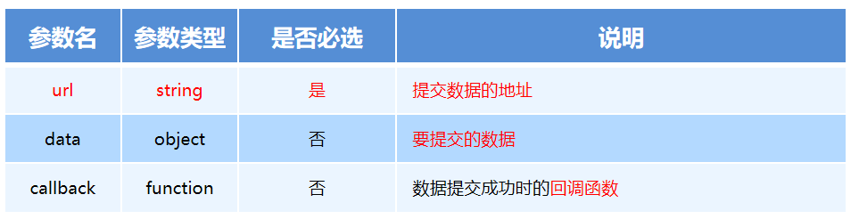](https://xiaobaicai350.github.io/pic/image-20230526102829414.png)

#### $.post()向服务器提交数据

使用 $post() 向服务器提交数据的示例代码如下：

```
PLAINTEXT
$.post(
   'http://www.liulongbin.top:3006/api/addbook', // 请求的URL地址
   { bookname: '水浒传', author: '施耐庵', publisher: '上海图书出版社' }, // 提交的数据
   function(res) { // 回调函数
      console.log(res)
   }
)
```

[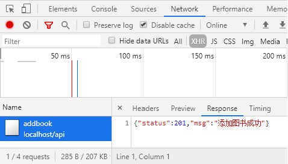](https://xiaobaicai350.github.io/pic/image-20230526102857469.png)

### 6.4 $.ajax()函数的语法

相比于 $.get() 和 $.post() 函数，jQuery 中提供的 $.ajax() 函数，是一个功能比较综合的函数，它允许我们对 Ajax 请求进行更详细的配置。

$.ajax() 函数的基本语法如下：

```
PLAINTEXT
$.ajax({
   type: '', // 请求的方式，例如 GET 或 POST
   url: '',  // 请求的 URL 地址
   data: { },// 这次请求要携带的数据
   success: function(res) { } // 请求成功之后的回调函数
})
```

#### 使用$.ajax()发起GET请求

使用 $.ajax() 发起 GET 请求时，只需要将 type 属性的值设置为 ‘GET’ 即可：

```
PLAINTEXT
$.ajax({
   type: 'GET', // 请求的方式
   url: 'http://www.liulongbin.top:3006/api/getbooks',  // 请求的 URL 地址
   data: { id: 1 },// 这次请求要携带的数据
   success: function(res) { // 请求成功之后的回调函数
       console.log(res)
   }
})
```

[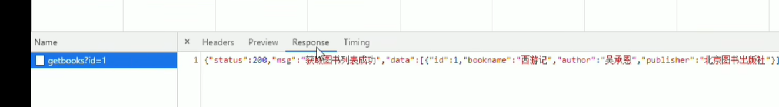](https://xiaobaicai350.github.io/pic/image-20230526102958108.png)

注意看参数拼接 在url后面拼接?id=1

#### 使用$.ajax()发起POST请求

使用 $.ajax() 发起 POST 请求时，只需要将 type 属性的值设置为 ‘POST’ 即可：

```
PLAINTEXT
$.ajax({
   type: 'POST', // 请求的方式
   url: 'http://www.liulongbin.top:3006/api/addbook',  // 请求的 URL 地址
   data: { // 要提交给服务器的数据
      bookname: '水浒传',
      author: '施耐庵',
      publisher: '上海图书出版社'
    },
   success: function(res) { // 请求成功之后的回调函数
       console.log(res)
   }
})
```

[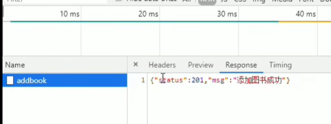](https://xiaobaicai350.github.io/pic/image-20230526103045935.png)

这里的参数是在请求体里面

## 7. 接口

### 7.1 接口的概念

使用 Ajax 请求数据时，被请求的 URL 地址，就叫做数据接口（简称接口）。同时，每个接口必须有请求方式。

例如：

- http://www.liulongbin.top:3006/api/getbooks 获取图书列表的接口(GET请求)
- http://www.liulongbin.top:3006/api/addbook 添加图书的接口（POST请求）

### 7.2 分析接口的请求过程

通过GET方式请求接口的过程

[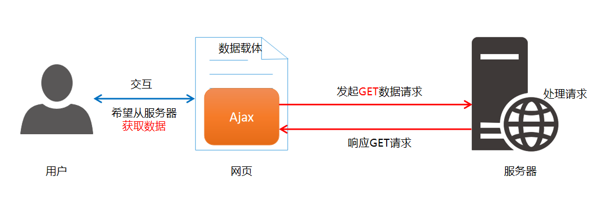](https://xiaobaicai350.github.io/pic/image-20230526103306639.png)

通过POST方式请求接口的过程

[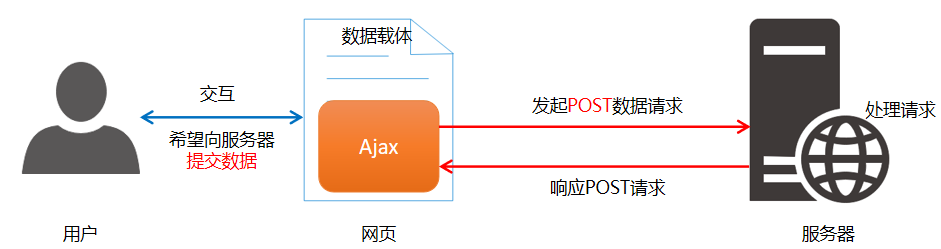](https://xiaobaicai350.github.io/pic/image-20230526103156829.png)

### 7.3 接口测试工具

#### 1. 什么是接口测试工具

为了验证接口能否被正常被访问，我们常常需要使用接口测试工具，来对数据接口进行检测。好处：接口测试工具能让我们在不写任何代码的情况下，对接口进行调用和测试。

[](https://xiaobaicai350.github.io/pic/image-20230526103415659.png)

#### 2. 下载并安装PostMan

访问 PostMan 的官方下载网址 https://www.getpostman.com/downloads/，下载所需的安装程序后，直接安装即可。

#### 3. 了解PostMan界面的组成部分

PostMan界面的组成部分，从上到下，从左到右，分别是：

- 菜单栏
- 工具栏
- 左侧历史记录与集合面板
- 请求页签
- 请求地址区域
- 请求参数区域
- 响应结果区域
- 状态栏

[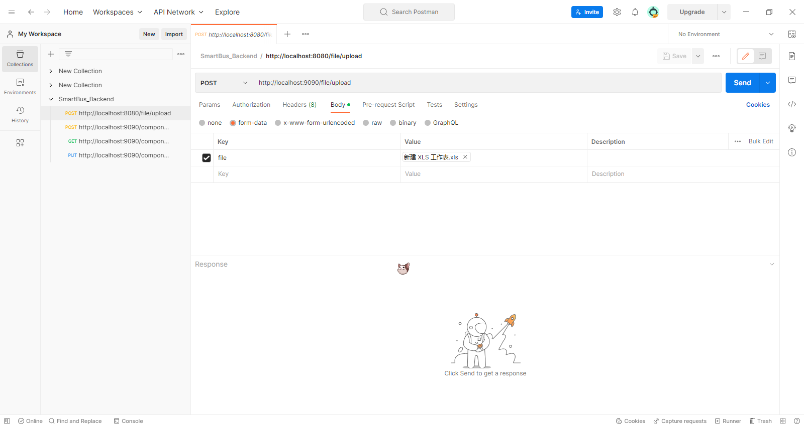](https://xiaobaicai350.github.io/pic/image-20230526103546383.png)

### 7.4 使用PostMan测试GET接口

步骤：

1. 选择请求的方式
2. 填写请求的URL地址
3. 填写请求的参数
4. 点击 Send 按钮发起 GET 请求
5. 查看服务器响应的结果

[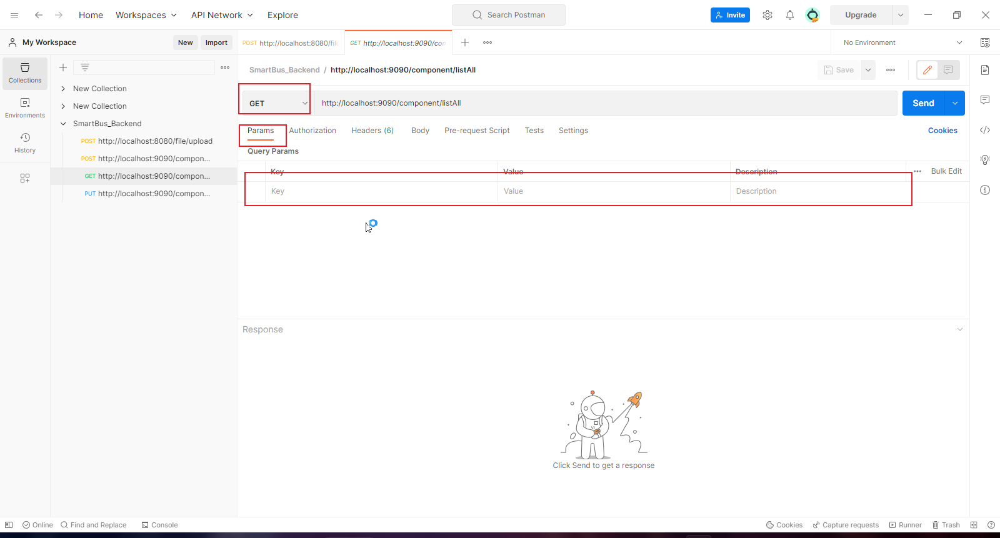](https://xiaobaicai350.github.io/pic/image-20230526103713249.png)

### 7.5 使用PostMan测试POST接口

步骤：

1. 选择请求的方式
2. 填写请求的URL地址
3. 选择 Body 面板并勾选数据格式
4. 填写要发送到服务器的数据
5. 点击 Send 按钮发起 POST 请求
6. 查看服务器响应的结果

[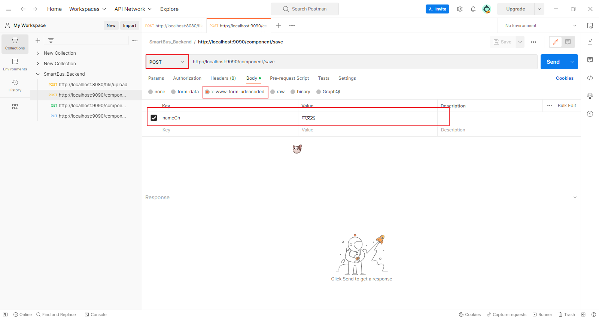](https://xiaobaicai350.github.io/pic/image-20230526103844503.png)

### 7.6 接口文档

#### 1. 什么是接口文档

接口文档，顾名思义就是接口的说明文档，它是我们调用接口的依据。好的接口文档包含了**对接口URL**，**参数**以及**输出内容的说明**，我们参照接口文档就能方便的知道接口的作用，以及接口如何进行调用。

#### 2. 接口文档的组成部分

接口文档可以包含很多信息，也可以按需进行精简，不过，一个合格的接口文档，应该包含以下6项内容，从而为接口的调用提供依据：

1. 接口名称：用来标识各个接口的简单说明，如登录接口，获取图书列表接口等。
2. 接口URL：接口的调用地址。
3. 调用方式：接口的调用方式，如 GET 或 POST。
4. 参数格式：接口需要传递的参数，每个参数必须包含参数名称、参数类型、是否必选、参数说明这4项内容。
5. 响应格式：接口的返回值的详细描述，一般包含数据名称、数据类型、说明3项内容。
6. 返回示例（可选）：通过对象的形式，例举服务器返回数据的结构。

#### 3. 接口文档示例

> ### 请求的根路径
>
> > [http://www.liulongbin.top:3006](http://www.liulongbin.top:3006/)
>
> ### 图书列表
>
> - 接口URL： /api/getbooks
> - 调用方式： GET
> - 参数格式：
>
> | 参数名称  | 参数类型 | 是否必选 | 参数说明 |
> | --------- | -------- | -------- | -------- |
> | id        | Number   | 否       | 图书Id   |
> | bookname  | String   | 否       | 图书名称 |
> | author    | String   | 否       | 作者     |
> | publisher | String   | 否       | 出版社   |
>
> - 响应格式：
>
> | 数据名称   | 数据类型 | 说明                     |
> | ---------- | -------- | ------------------------ |
> | status     | Number   | 200 成功；500 失败；     |
> | msg        | String   | 对 status 字段的详细说明 |
> | data       | Array    | 图书列表                 |
> | +id        | Number   | 图书Id                   |
> | +bookname  | String   | 图书名称                 |
> | +author    | String   | 作者                     |
> | +publisher | String   | 出版社                   |
>
> - 返回示例：
>
> ```
> JSON
> {
>   "status": 200,
>   "msg": "获取图书列表成功",
>   "data": [
>     { "id": 1, "bookname": "西游记", "author": "吴承恩", "publisher": "北京图书出版社" },
>     { "id": 2, "bookname": "红楼梦", "author": "曹雪芹", "publisher": "上海图书出版社" },
>     { "id": 3, "bookname": "三国演义", "author": "罗贯中", "publisher": "北京图书出版社" }
>   ]
> }
> ```
>
> ### 添加图书
>
> - 接口URL： /api/addbook
> - 调用方式： POST
> - 参数格式：
>
> | 参数名称  | 参数类型 | 是否必选 | 参数说明 |
> | --------- | -------- | -------- | -------- |
> | bookname  | String   | 是       | 图书名称 |
> | author    | String   | 是       | 作者     |
> | publisher | String   | 是       | 出版社   |
>
> - 响应格式：
>
> | 数据名称 | 数据类型 | 说明                         |
> | -------- | -------- | ---------------------------- |
> | status   | Number   | 201 添加成功；500 添加失败； |
> | msg      | String   | 对 status 字段的详细说明     |
>
> - 返回示例：
>
> ```
> JSON
> {
>     "status": 201,
>     "msg": "添加图书成功"
> }
> ```
>
> ### 删除图书
>
> - 接口URL： /api/delbook
> - 调用方式： GET
> - 参数格式：
>
> | 参数名称 | 参数类型 | 是否必选 | 参数说明 |
> | -------- | -------- | -------- | -------- |
> | id       | Number   | 是       | 图书Id   |
>
> - 响应格式：
>
> | 数据名称 | 数据类型 | 说明                                                         |
> | -------- | -------- | ------------------------------------------------------------ |
> | status   | Number   | 200 删除成功；500 未指定要删除的图书Id；501 执行Sql报错；502 要删除的图书不存在； |
> | msg      | String   | 对 status 字段的详细说明                                     |
>
> - 返回示例：
>
> ```
> JSON
> {
>     "status": 200,
>     "msg": "删除图书成功！"
> }
> ```
