# 服务器的基本概念与初识Ajax

## 1. 客户端与服务器

### 1.1 上网的目的

上网的本质目的：通过互联网的形式来获取和消费资源

### 1.2 服务器

上网过程中，负责存放和对外提供资源的电脑，叫做服务器。

[](https://xiaobaicai350.github.io/pic/image-20230526101412839.png)

### 1.3 客户端

上网过程中，负责获取和消费资源的电脑，叫做客户端。

[](https://xiaobaicai350.github.io/pic/image-20230526101435536.png)

## 2. URL地址

### 2.1 URL地址的概念

URL（全称是UniformResourceLocator）中文叫统一资源定位符，用于标识互联网上每个资源的唯一存放位置。浏览器只有通过URL地址，才能正确定位资源的存放位置，从而成功访问到对应的资源。

常见的URL举例：

[http://www.baidu.com](http://www.baidu.com/)
[http://www.taobao.com](http://www.taobao.com/)
http://www.cnblogs.com/liulongbinblogs/p/11649393.html

### 2.2 URL地址的组成部分

URL地址一般由三部组成：

① 客户端与服务器之间的通信协议
② 存有该资源的服务器名称
③ 资源在服务器上具体的存放位置

[](https://xiaobaicai350.github.io/pic/image-20230526101559722.png)

## 3. 客户端与服务器的通信过程

### 3.1 图解客户端与服务器的通信过程

[](https://xiaobaicai350.github.io/pic/image-20230526101621315.png)

注意：

1. 客户端与服务器之间的通信过程，分为 请求 – 处理 – 响应 三个步骤。
2. 网页中的每一个资源，都是通过 请求 – 处理 – 响应 的方式从服务器获取回来的。

### 3.2 基于浏览器的开发者工具分析通信过程

1. 打开 Chrome 浏览器
2. Ctrl+Shift+I 打开 Chrome 的开发者工具
3. 切换到 Network 面板
4. 选中 Doc 页签
5. 刷新页面，分析客户端与服务器的通信过程

[](https://xiaobaicai350.github.io/pic/image-20230526101747648.png)

[](https://xiaobaicai350.github.io/pic/image-20230526101802754.png)

## 4. 服务器对外提供了哪些资源

### 4.1 例举网页中常见的资源

[](https://xiaobaicai350.github.io/pic/image-20230526101828874.png)

### 4.2 数据也是资源

**网页中的数据，也是服务器对外提供的一种资源。**例如股票数据、各行业排行榜等。

### 4.3 数据是网页的灵魂

- HTML是网页的骨架
- CSS是网页的颜值
- Javascript是网页的行为
- 数据，则是网页的灵魂

骨架、颜值、行为皆为数据服务

数据，在网页中无处不在

### 4.4 网页中如何请求数据

数据，也是**服务器**对外提供的一种资源。只要是资源，必然要通过 **请求 – 处理 – 响应** 的方式进行获取。

[](https://xiaobaicai350.github.io/pic/image-20230526101940440.png)

如果要在网页中请求服务器上的数据资源，则需要用到 XMLHttpRequest 对象。

XMLHttpRequest（简称 xhr）是浏览器提供的 js 成员，通过它，可以请求服务器上的数据资源。

最简单的用法 var xhrObj = new XMLHttpRequest()

### 4.5 资源的请求方式

客户端请求服务器时，请求的方式有很多种，最常见的两种请求方式分别为 get 和 post 请求。

get 请求通常用于获取服务端资源（向服务器要资源）

 例如：根据 URL 地址，从服务器获取 HTML 文件、css 文件、js文件、图片文件、数据资源等

post 请求通常用于向服务器提交数据（往服务器发送资源）

 例如：登录时向服务器提交的登录信息、注册时向服务器提交的注册信息、添加用户时向服务器提交的用户信息等各种数据提交操作

## 5. 了解Ajax

### 5.1 什么是Ajax

Ajax 的全称是 Asynchronous Javascript And XML（异步 JavaScript 和 XML）。

通俗的理解：在网页中利用 XMLHttpRequest 对象和服务器进行数据交互的方式，就是Ajax。

### 5.2 为什么要学Ajax

之前所学的技术，**只能把网页做的更美观漂亮**，或添加一些动画效果

**但是**，Ajax能让我们轻松实现网页与服务器之间的数据交互。

[](https://xiaobaicai350.github.io/pic/image-20230526102119817.png)

### 5.3 Ajax的典型应用场景

用户名检测：注册用户时，通过 ajax 的形式，动态检测用户名是否被占用(注意是占用，这里已经到后端请求数据库里面的数据了)

[](https://xiaobaicai350.github.io/pic/image-20230526102213338.png)

搜索提示：当输入搜索关键字时，通过 ajax 的形式，动态加载搜索提示列表

[](https://xiaobaicai350.github.io/pic/image-20230526102248965.png)

数据分页显示：当点击页码值的时候，通过 ajax 的形式，根据页码值动态刷新表格的数据

[](https://xiaobaicai350.github.io/pic/image-20230526102258444.png)

数据的增删改查：数据的添加、删除、修改、查询操作，都需要通过 ajax 的形式，来实现数据的交互

[](https://xiaobaicai350.github.io/pic/image-20230526102314933.png)

## 6. jQuery中的Ajax

### 6.1 了解jQuery中的Ajax

**浏览器中提供**的 XMLHttpRequest 用法比较复杂，所以 **jQuery 对 XMLHttpRequest 进行了封装**，提供了一系列 Ajax 相关的函数，极大地降低了 Ajax 的使用难度。

jQuery 中发起 Ajax 请求最常用的三个方法如下：

- $.get()
- $.post()
- $.ajax()

### 6.2 $.get()函数的语法

jQuery 中 $.get() 函数的功能单一，专门用来发起 get 请求，从而将服务器上的资源请求到客户端来进行使用。$.get() 函数的语法如下：

```
$.get(url, [data], [callback])
```

其中，三个参数各自代表的含义如下：

[](https://xiaobaicai350.github.io/pic/image-20230526102546278.png)

#### $.get()发起不带参数的请求

使用 $.get() 函数发起不带参数的请求时，直接提供请求的 URL 地址和请求成功之后的回调函数即可，示例代码如下：

```
PLAINTEXT
$.get('http://www.liulongbin.top:3006/api/getbooks', function(res) {
    console.log(res) // 这里的 res 是服务器返回的数据
})
```

[](https://xiaobaicai350.github.io/pic/image-20230526102716618.png)

#### $.get()发起带参数的请求

使用 $.get() 函数发起带参数的请求时，示例代码如下：

```
PLAINTEXT
$.get('http://www.liulongbin.top:3006/api/getbooks', { id: 1 }, function(res) {
    console.log(res)
})
```

[](https://xiaobaicai350.github.io/pic/image-20230526102758002.png)

### 6.3 $.post()函数的语法

jQuery 中 $.post() 函数的功能单一，专门用来发起 post 请求，从而向服务器提交数据。$.post() 函数的语法如下：

```
$.post(url, [data], [callback])
```

其中，三个参数各自代表的含义如下：

[](https://xiaobaicai350.github.io/pic/image-20230526102829414.png)

#### $.post()向服务器提交数据

使用 $post() 向服务器提交数据的示例代码如下：

```
PLAINTEXT
$.post(
   'http://www.liulongbin.top:3006/api/addbook', // 请求的URL地址
   { bookname: '水浒传', author: '施耐庵', publisher: '上海图书出版社' }, // 提交的数据
   function(res) { // 回调函数
      console.log(res)
   }
)
```

[](https://xiaobaicai350.github.io/pic/image-20230526102857469.png)

### 6.4 $.ajax()函数的语法

相比于 $.get() 和 $.post() 函数，jQuery 中提供的 $.ajax() 函数，是一个功能比较综合的函数，它允许我们对 Ajax 请求进行更详细的配置。

$.ajax() 函数的基本语法如下：

```
PLAINTEXT
$.ajax({
   type: '', // 请求的方式，例如 GET 或 POST
   url: '',  // 请求的 URL 地址
   data: { },// 这次请求要携带的数据
   success: function(res) { } // 请求成功之后的回调函数
})
```

#### 使用$.ajax()发起GET请求

使用 $.ajax() 发起 GET 请求时，只需要将 type 属性的值设置为 ‘GET’ 即可：

```
PLAINTEXT
$.ajax({
   type: 'GET', // 请求的方式
   url: 'http://www.liulongbin.top:3006/api/getbooks',  // 请求的 URL 地址
   data: { id: 1 },// 这次请求要携带的数据
   success: function(res) { // 请求成功之后的回调函数
       console.log(res)
   }
})
```

[](https://xiaobaicai350.github.io/pic/image-20230526102958108.png)

注意看参数拼接 在url后面拼接?id=1

#### 使用$.ajax()发起POST请求

使用 $.ajax() 发起 POST 请求时，只需要将 type 属性的值设置为 ‘POST’ 即可：

```
PLAINTEXT
$.ajax({
   type: 'POST', // 请求的方式
   url: 'http://www.liulongbin.top:3006/api/addbook',  // 请求的 URL 地址
   data: { // 要提交给服务器的数据
      bookname: '水浒传',
      author: '施耐庵',
      publisher: '上海图书出版社'
    },
   success: function(res) { // 请求成功之后的回调函数
       console.log(res)
   }
})
```

[](https://xiaobaicai350.github.io/pic/image-20230526103045935.png)

这里的参数是在请求体里面

## 7. 接口

### 7.1 接口的概念

使用 Ajax 请求数据时，被请求的 URL 地址，就叫做数据接口（简称接口）。同时，每个接口必须有请求方式。

例如：

- http://www.liulongbin.top:3006/api/getbooks 获取图书列表的接口(GET请求)
- http://www.liulongbin.top:3006/api/addbook 添加图书的接口（POST请求）

### 7.2 分析接口的请求过程

通过GET方式请求接口的过程

[](https://xiaobaicai350.github.io/pic/image-20230526103306639.png)

通过POST方式请求接口的过程

[](https://xiaobaicai350.github.io/pic/image-20230526103156829.png)

### 7.3 接口测试工具

#### 1. 什么是接口测试工具

为了验证接口能否被正常被访问，我们常常需要使用接口测试工具，来对数据接口进行检测。好处：接口测试工具能让我们在不写任何代码的情况下，对接口进行调用和测试。

[](https://xiaobaicai350.github.io/pic/image-20230526103415659.png)

#### 2. 下载并安装PostMan

访问 PostMan 的官方下载网址 https://www.getpostman.com/downloads/，下载所需的安装程序后，直接安装即可。

#### 3. 了解PostMan界面的组成部分

PostMan界面的组成部分，从上到下，从左到右，分别是：

- 菜单栏
- 工具栏
- 左侧历史记录与集合面板
- 请求页签
- 请求地址区域
- 请求参数区域
- 响应结果区域
- 状态栏

[](https://xiaobaicai350.github.io/pic/image-20230526103546383.png)

### 7.4 使用PostMan测试GET接口

步骤：

1. 选择请求的方式
2. 填写请求的URL地址
3. 填写请求的参数
4. 点击 Send 按钮发起 GET 请求
5. 查看服务器响应的结果

[](https://xiaobaicai350.github.io/pic/image-20230526103713249.png)

### 7.5 使用PostMan测试POST接口

步骤：

1. 选择请求的方式
2. 填写请求的URL地址
3. 选择 Body 面板并勾选数据格式
4. 填写要发送到服务器的数据
5. 点击 Send 按钮发起 POST 请求
6. 查看服务器响应的结果

[](https://xiaobaicai350.github.io/pic/image-20230526103844503.png)

### 7.6 接口文档

#### 1. 什么是接口文档

接口文档，顾名思义就是接口的说明文档，它是我们调用接口的依据。好的接口文档包含了**对接口URL**，**参数**以及**输出内容的说明**，我们参照接口文档就能方便的知道接口的作用，以及接口如何进行调用。

#### 2. 接口文档的组成部分

接口文档可以包含很多信息，也可以按需进行精简，不过，一个合格的接口文档，应该包含以下6项内容，从而为接口的调用提供依据：

1. 接口名称：用来标识各个接口的简单说明，如登录接口，获取图书列表接口等。
2. 接口URL：接口的调用地址。
3. 调用方式：接口的调用方式，如 GET 或 POST。
4. 参数格式：接口需要传递的参数，每个参数必须包含参数名称、参数类型、是否必选、参数说明这4项内容。
5. 响应格式：接口的返回值的详细描述，一般包含数据名称、数据类型、说明3项内容。
6. 返回示例（可选）：通过对象的形式，例举服务器返回数据的结构。

#### 3. 接口文档示例

> ### 请求的根路径
>
> > [http://www.liulongbin.top:3006](http://www.liulongbin.top:3006/)
>
> ### 图书列表
>
> - 接口URL： /api/getbooks
> - 调用方式： GET
> - 参数格式：
>
> | 参数名称  | 参数类型 | 是否必选 | 参数说明 |
> | --------- | -------- | -------- | -------- |
> | id        | Number   | 否       | 图书Id   |
> | bookname  | String   | 否       | 图书名称 |
> | author    | String   | 否       | 作者     |
> | publisher | String   | 否       | 出版社   |
>
> - 响应格式：
>
> | 数据名称   | 数据类型 | 说明                     |
> | ---------- | -------- | ------------------------ |
> | status     | Number   | 200 成功；500 失败；     |
> | msg        | String   | 对 status 字段的详细说明 |
> | data       | Array    | 图书列表                 |
> | +id        | Number   | 图书Id                   |
> | +bookname  | String   | 图书名称                 |
> | +author    | String   | 作者                     |
> | +publisher | String   | 出版社                   |
>
> - 返回示例：
>
> ```
> JSON
> {
>   "status": 200,
>   "msg": "获取图书列表成功",
>   "data": [
>     { "id": 1, "bookname": "西游记", "author": "吴承恩", "publisher": "北京图书出版社" },
>     { "id": 2, "bookname": "红楼梦", "author": "曹雪芹", "publisher": "上海图书出版社" },
>     { "id": 3, "bookname": "三国演义", "author": "罗贯中", "publisher": "北京图书出版社" }
>   ]
> }
> ```
>
> ### 添加图书
>
> - 接口URL： /api/addbook
> - 调用方式： POST
> - 参数格式：
>
> | 参数名称  | 参数类型 | 是否必选 | 参数说明 |
> | --------- | -------- | -------- | -------- |
> | bookname  | String   | 是       | 图书名称 |
> | author    | String   | 是       | 作者     |
> | publisher | String   | 是       | 出版社   |
>
> - 响应格式：
>
> | 数据名称 | 数据类型 | 说明                         |
> | -------- | -------- | ---------------------------- |
> | status   | Number   | 201 添加成功；500 添加失败； |
> | msg      | String   | 对 status 字段的详细说明     |
>
> - 返回示例：
>
> ```
> JSON
> {
>     "status": 201,
>     "msg": "添加图书成功"
> }
> ```
>
> ### 删除图书
>
> - 接口URL： /api/delbook
> - 调用方式： GET
> - 参数格式：
>
> | 参数名称 | 参数类型 | 是否必选 | 参数说明 |
> | -------- | -------- | -------- | -------- |
> | id       | Number   | 是       | 图书Id   |
>
> - 响应格式：
>
> | 数据名称 | 数据类型 | 说明                                                         |
> | -------- | -------- | ------------------------------------------------------------ |
> | status   | Number   | 200 删除成功；500 未指定要删除的图书Id；501 执行Sql报错；502 要删除的图书不存在； |
> | msg      | String   | 对 status 字段的详细说明                                     |
>
> - 返回示例：
>
> ```
> JSON
> {
>     "status": 200,
>     "msg": "删除图书成功！"
> }
> ```

# form表单与模板引擎

## 1. form表单的基本使用

### 1.1 什么是表单

表单在网页中主要负责数据采集功能。HTML中的`<form>`标签，就是用于采集用户输入的信息，并通过<form>标签的提交操作，把采集到的信息提交到服务器端进行处理。

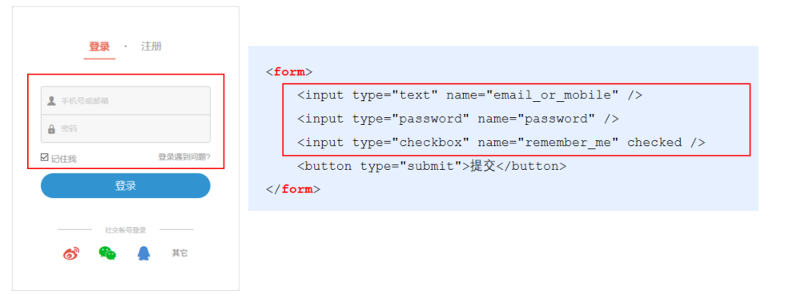

### 1.2 表单的组成部分

注意：表单域：包含了文本框、密码框、隐藏域、多行文本框、复选框、单选框、下拉选择框和文件上传框等。

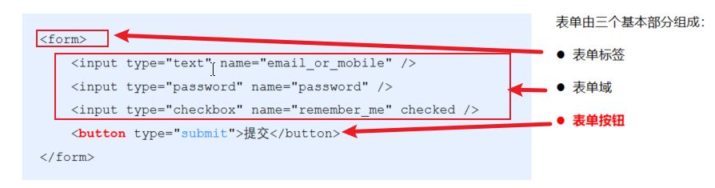

### 1.3 `<form>`标签的属性

`<form>`标签用来采集数据，`<form>`标签的属性则是用来规定如何把采集到的数据发送到服务器。

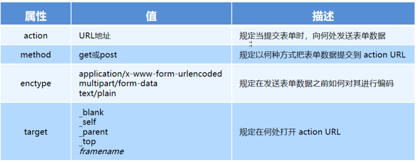

#### 1. action

action 属性用来规定当提交表单时，向何处发送表单数据。

action 属性的值应该是后端提供的一个 URL 地址，这个 URL 地址专门负责接收表单提交过来的数据。

当` <form> `表单在未指定 action 属性值的情况下，action 的默认值为当前页面的 URL 地址。


注意：当提交表单后，页面会立即跳转到 action 属性指定的 URL 地址(所以之后我们要禁用提交跳转)

#### 2. target

target 属性用来规定在何处打开 action URL。

它的可选值有5个，默认情况下，target 的值是 _self，表示在相同的框架中打开 action URL。

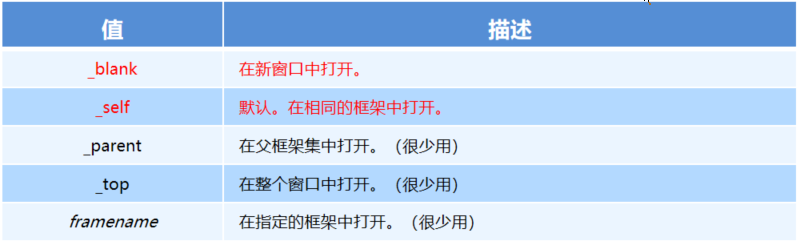

#### 3. method

method 属性用来规定以何种方式把表单数据提交到 action URL。

它的可选值有两个，分别是 get 和 post。

默认情况下，method 的值为 get，表示通过URL地址的形式，把表单数据提交到 action URL。


注意：

get 方式适合用来提交少量的、简单的数据。

post 方式适合用来提交大量的、复杂的、或包含文件上传的数据。

在实际开发中，`<form> `表单的 post 提交方式用的最多，很少用 get。例如登录、注册、添加数据等表单操作，都需要使用 post 方式来提交表单。

#### 4. enctype

enctype 属性用来规定在发送表单数据之前如何对数据进行编码。

它的可选值有三个，默认情况下，enctype 的值为 application/x-www-form-urlencoded，表示在发送前编码所有的字符。

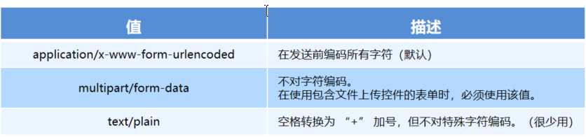

注意：

在涉及到文件上传的操作时，必须将 enctype 的值设置为 multipart/form-data

如果表单的提交不涉及到文件上传操作，则直接将 enctype 的值设置为 application/x-www-form-urlencoded 即可！

### 1.4 表单的同步提交及缺点

#### 什么是表单的同步提交

通过点击 submit 按钮，触发表单提交的操作，从而使页面跳转到 action URL 的行为，叫做表单的同步提交。

#### 表单同步提交的缺点

`<form>`表单同步提交后，整个页面会发生跳转，跳转到 action URL 所指向的地址，用户体验很差。

`<form>`表单同步提交后，页面之前的状态和数据会丢失。

#### 如何解决表单同步提交的缺点

如果使用表单提交数据，则会导致以下两个问题：

1.  页面会发生跳转
2.  页面之前的状态和数据会丢失


解决方案：表单只负责采集数据，Ajax 负责将数据提交到服务器。

## 2. 通过Ajax提交表单数据

### 2.1 监听表单提交事件

在 jQuery 中，可以使用如下两种方式，监听到表单的提交事件：

```
$('#form1').submit(function(e) {
   alert('监听到了表单的提交事件')
})

$('#form1').on('submit', function(e) {
   alert('监听到了表单的提交事件')
})
```

### 2.2 阻止表单默认提交行为

当监听到表单的提交事件以后，可以调用事件对象的 event.preventDefault() 函数，来阻止表单的提交和页面的跳转，示例代码如下：

```
$('#form1').submit(function(e) {
   // 阻止表单的提交和页面的跳转
   e.preventDefault()
})

$('#form1').on('submit', function(e) {
   // 阻止表单的提交和页面的跳转
   e.preventDefault()
})
```

### 2.3 快速获取表单中的数据

#### 1. serialize()函数

为了简化表单中数据的获取操作，jQuery 提供了 serialize() 函数，其语法格式如下：

```
$(selector).serialize()
```

serialize() 函数的好处：可以一次性获取到表单中的所有的数据。

#### 2. serialize()函数示例

```
<form id="form1">
    <input type="text" name="username" />
    <input type="password" name="password" />
    <button type="submit">提交</button>
</form>
```

```
$('#form1').serialize()
// 调用的结果：
// username=用户名的值&password=密码的值
```

注意：在使用 serialize() 函数快速获取表单数据时，必须为每个表单元素添加 name 属性！

## 3. 案例 - 评论列表

### 3.1 渲染UI结构

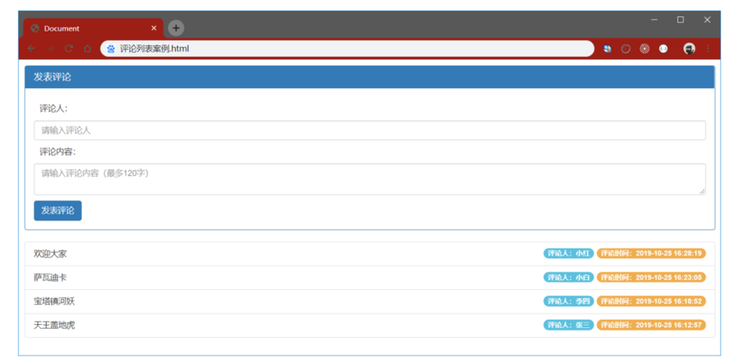

### 3.2 获取评论列表

```
 function getCmtList() {
    $.get('http://www.liulongbin.top:3006/api/cmtlist', function (res) {  
      if(res.status !== 200) {
        return alert('获取评论列表失败！')
      }
      var rows = []
      $.each(res.data, function (i, item) { // 循环拼接字符串
        rows.push('<li class="list-group-item">'+ item.content +'<span class="badge cmt-date">评论时间：'+ item.time +'</span><span class="badge cmt-person">评论人：'+ item.username +'</span></li>')
      })
      $('#cmt-list').empty().append(rows.join('')) // 渲染列表的UI结构
    })
  }
```

### 3.3 发表评论

```
 $('#formAddCmt').submit(function(e) {
    e.preventDefault() // 阻止表单的默认提交行为
    // 快速得到表单中的数据
    var data = $(this).serialize()
    $.post('http://www.liulongbin.top:3006/api/addcmt', data, function(res) {
      if (res.status !== 201) {
        return alert('发表评论失败！')
      }
      // 刷新评论列表
      getCmtList()
      // 快速清空表单内容
      $('#formAddCmt')[0].reset()
    })
  })
```

## 4. 模板引擎的基本概念

### 4.1 渲染UI结构时遇到的问题

```
var rows = []
$.each(res.data, function (i, item) { // 循环拼接字符串
    rows.push('<li class="list-group-item">'+ item.content +'<span class="badge cmt-date">评论时间：'+ item.time +'</span><span class="badge cmt-person">评论人：'+ item.username +'</span></li>')
})
$('#cmt-list').empty().append(rows.join('')) // 渲染列表的UI结构
```

上述代码是通过字符串拼接的形式，来渲染UI结构。

如果UI结构比较复杂，则拼接字符串的时候需要格外注意引号之前的嵌套。且一旦需求发生变化，修改起来也非常麻烦。

### 4.2 什么是模板引擎

模板引擎，顾名思义，它可以根据程序员指定的模板结构和数据，自动生成一个完整的HTML页面。

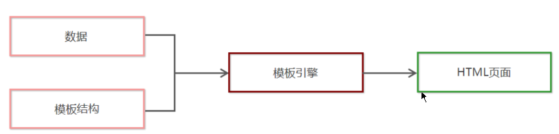

### 4.3 模板引擎的好处

1. 减少了字符串的拼接操作
2. 使代码结构更清晰
3. 使代码更易于阅读与维护

## 5. art-template模板引擎

### 5.1 art-template简介

art-template 是一个简约、超快的模板引擎。中文官网首页为 http://aui.github.io/art-template/zh-cn/index.html

### 5.2 art-template的安装

在浏览器中访问 http://aui.github.io/art-template/zh-cn/docs/installation.html 页面，找到下载链接后，鼠标右键，选择“链接另存为”，将 art-template 下载到本地，然后，通过` <script>` 标签加载到网页上进行使用。

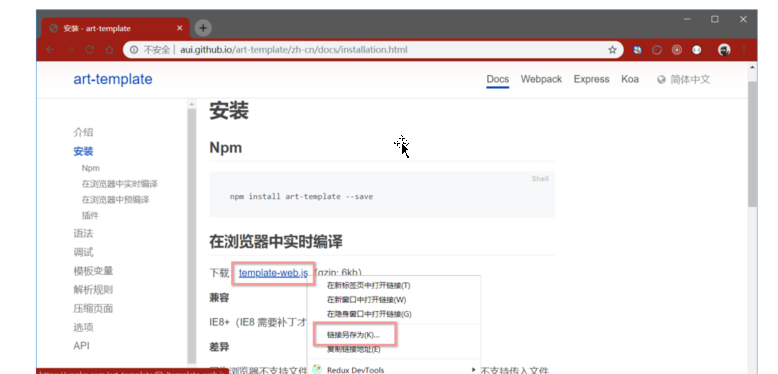

### 5.3 art-template模板引擎的基本使用

art-template的使用步骤

1. 导入 art-template
2. 定义数据
3. 定义模板
4. 调用 template 函数
5. 渲染HTML结构

```html
<!DOCTYPE html>
<html lang="en">

<head>
  <meta charset="UTF-8">
  <meta name="viewport" content="width=device-width, initial-scale=1.0">
  <meta http-equiv="X-UA-Compatible" content="ie=edge">
  <title>Document</title>
  <!-- 1. 导入模板引擎 -->
  <!-- 在 window 全局，多一个函数，叫做 template('模板的Id', 需要渲染的数据对象) -->
  <script src="./lib/template-web.js"></script>
  <script src="./lib/jquery.js"></script>
</head>

<body>

  <div id="container"></div>

  <!-- 3. 定义模板 -->
  <!-- 3.1 模板的 HTML 结构，必须定义到 script 中 -->
  <script type="text/html" id="tpl-user">
    <h1>{{name}}    ------    {{age}}</h1>
    <!-- 原文输出 -->
    {{@ test}}

    <div>
      {{if flag === 0}}
      flag的值是0
      {{else if flag === 1}}
      flag的值是1
      {{/if}}
    </div>

    <ul>
      {{each hobby}}
      <li>索引是:{{$index}}，循环项是:{{$value}}</li>
      {{/each}}
    </ul>

    <h3>{{regTime | dateFormat}}</h3>
  </script>

  <script>
    // 定义处理时间的过滤器
    template.defaults.imports.dateFormat = function (date) {
      var y = date.getFullYear()
      var m = date.getMonth() + 1
      var d = date.getDate()

      return y + '-' + m + '-' + d
    }


    // 2. 定义需要渲染的数据
    var data = { name: 'zs', age: 20, test: '<h3>测试原文输出</h3>', flag: 1, hobby: ['吃饭', '睡觉', '写代码'], regTime: new Date() }

    // 4. 调用 template 函数
    var htmlStr = template('tpl-user', data)
    console.log(htmlStr)
    // 5. 渲染HTML结构
    $('#container').html(htmlStr)
  </script>
</body>

</html>
```

显示效果：

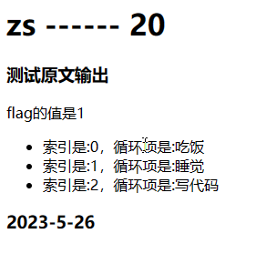

### 5.4 art-template标准语法

#### 1. 什么是标准语法

```
art-template 提供了 {{ }} 这种语法格式，在 {{ }} 内可以进行变量输出，或循环数组等操作，这种 {{ }} 语法在 art-template 中被称为标准语法。
```


#### 2. 标准语法 - 输出

```
{{value}}
{{obj.key}}
{{obj['key']}}
{{a ? b : c}}
{{a || b}}
{{a + b}}
```

```
在 {{ }} 语法中，可以进行变量的输出、对象属性的输出、三元表达式输出、逻辑或输出、加减乘除等表达式输出。
```

#### 3. 标准语法 – 原文输出

```
{{@ value }}
```

如果要输出的 value 值中，包含了 HTML 标签结构，则需要使用原文输出语法，才能保证 HTML 标签被正常渲染。 

#### 4. 标准语法 – 条件输出

```
如果要实现条件输出，则可以在 {{ }} 中使用 if … else if … /if 的方式，进行按需输出。
```


```
{{if value}} 按需输出的内容 {{/if}}

{{if v1}} 按需输出的内容 {{else if v2}} 按需输出的内容 {{/if}}
```

#### 5. 标准语法 – 循环输出

```
如果要实现循环输出，则可以在 {{ }} 内，通过 each 语法循环数组，当前循环的索引使用 $index 进行访问，当前的循环项使用 $value 进行访问。
```


```
{{each arr}}
    {{$index}} {{$value}}
{{/each}}
```

#### 6. 标准语法 – 过滤器

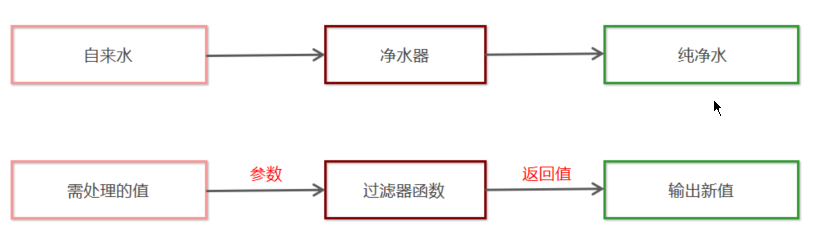

过滤器的本质，就是一个 function 处理函数。

```
{{value | filterName}}
```

过滤器语法类似管道操作符，它的上一个输出作为下一个输入。

定义过滤器的基本语法如下：

```
template.defaults.imports.filterName = function(value){/*return处理的结果*/}
```


举例：

```
<div>注册时间：{{regTime | dateFormat}}</div>
```

定义一个格式化时间的过滤器 dateFormat 如下：

```
 template.defaults.imports.dateFormat = function(date) {
    var y = date.getFullYear()
    var m = date.getMonth() + 1
    var d = date.getDate()

    return y + '-' + m + '-' + d // 注意，过滤器最后一定要 return 一个值
 }
```

## 6. 模板引擎的实现原理

```
<!DOCTYPE html>
<html lang="en">

<head>
  <meta charset="UTF-8">
  <meta name="viewport" content="width=device-width, initial-scale=1.0">
  <meta http-equiv="X-UA-Compatible" content="ie=edge">
  <title>Document</title>
  <script src="./js/template.js"></script>
</head>

<body>

  <div id="user-box"></div>

  <script type="text/html" id="tpl-user">
    <div>姓名：{{name}}</div>
    <div>年龄：{{ age }}</div>
    <div>性别：{{  gender}}</div>
    <div>住址：{{address  }}</div>
  </script>

  <script>
    // 定义数据
    var data = { name: 'zs', age: 28, gender: '男', address: '北京顺义马坡' }

    // 调用模板引擎
    var htmlStr = template('tpl-user', data)

    // 渲染HTML结构
    document.getElementById('user-box').innerHTML = htmlStr
  </script>
</body>

</html>
```

```
function template(id, data) {
  var str = document.getElementById(id).innerHTML
  var pattern = /{{\s*([a-zA-Z]+)\s*}}/

  var pattResult = null
  while (pattResult = pattern.exec(str)) {
    str = str.replace(pattResult[0], data[pattResult[1]])
  }

  return str
}
```

# Ajax加强

## 1. XMLHttpRequest的基本使用

### 1.1 什么XMLHttpRequest

XMLHttpRequest（简称 xhr）是浏览器提供的 Javascript 对象，通过它，可以请求服务器上的数据资源。之前所学的 jQuery 中的 Ajax 函数，就是基于 xhr 对象封装出来的。

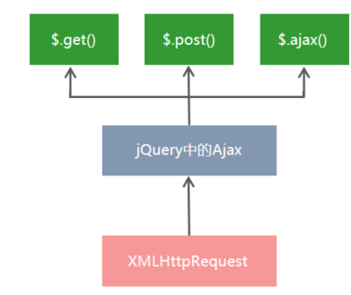

### 1.2 使用xhr发起无参GET请求

步骤：

1. 创建 xhr 对象
2. 调用 xhr.open() 函数
3. 调用 xhr.send() 函数
4. 监听 xhr.onreadystatechange 事件

```
// 1. 创建 XHR 对象
var xhr = new XMLHttpRequest()
// 2. 调用 open 函数，指定 请求方式 与 URL地址
xhr.open('GET', 'http://www.liulongbin.top:3006/api/getbooks')
// 3. 调用 send 函数，发起 Ajax 请求
xhr.send()
// 4. 监听 onreadystatechange 事件
xhr.onreadystatechange = function() {
    // 4.1 监听 xhr 对象的请求状态 readyState ；与服务器响应的状态 status
//这一行是一个固定写法...这个200是浏览器的响应码，跟404那个一样
    if (xhr.readyState === 4 && xhr.status === 200) {
        // 4.2 打印服务器响应回来的数据
        console.log(xhr.responseText)
    }
}
```

### 1.3 了解xhr对象的readyState属性

XMLHttpRequest 对的 readyState 属性，用来表示当前 Ajax 请求所处的状态。每个 Ajax 请求必然处于以下状态中的一个：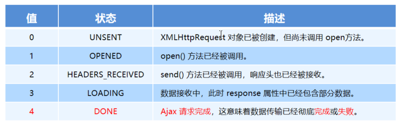

### 1.4 使用xhr发起带参数的GET请求

使用 xhr 对象发起带参数的 GET 请求时，只需在调用 xhr.open 期间，为 URL 地址指定参数即可：

```
// ...省略不必要的代码
xhr.open('GET', 'http://www.liulongbin.top:3006/api/getbooks?id=1')
// ...省略不必要的代码
```

这种在 URL 地址后面拼接的参数，叫做查询字符串。

### 1.5 查询字符串

#### 1. 什么是查询字符串

定义：查询字符串（URL 参数）是指在 URL 的末尾加上用于向服务器发送信息的字符串（变量）。

格式：将英文的 ? 放在URL 的末尾，然后再加上 参数＝值 ，想加上多个参数的话，使用 & 符号进行分隔。以这个形式，可以将想要发送给服务器的数据添加到 URL 中。

```
// 不带参数的 URL 地址
http://www.liulongbin.top:3006/api/getbooks
// 带一个参数的 URL 地址
http://www.liulongbin.top:3006/api/getbooks?id=1
// 带两个参数的 URL 地址
http://www.liulongbin.top:3006/api/getbooks?id=1&bookname=西游记
```

#### 2. GET请求携带参数的本质

无论使用 $.ajax()，还是使用 $.get()，又或者直接使用 xhr 对象发起 GET 请求，当需要携带参数的时候，本质上，都是直接将参数以查询字符串的形式，追加到 URL 地址的后面，发送到服务器的。

```
$.get('url', {name: 'zs', age: 20}, function() {})
// 等价于
$.get('url?name=zs&age=20', function() {})


$.ajax({ method: 'GET', url: 'url', data: {name: 'zs', age: 20}, success: function() {} })
// 等价于
$.ajax({ method: 'GET', url: 'url?name=zs&age=20', success: function() {} })
```

### 1.6 URL编码与解码

#### 1. 什么是URL编码

URL 地址中，只允许出现英文相关的字母、标点符号、数字，因此，在 URL 地址中不允许出现中文字符（现在是可以出现中文字符了，但是还是建议将中文进行编码）。

如果 URL 中需要包含中文这样的字符，则必须对中文字符进行编码（转义）。

URL编码的原则：使用安全的字符（没有特殊用途或者特殊意义的可打印字符）去表示那些不安全的字符。

URL编码原则的通俗理解：使用英文字符去表示非英文字符。

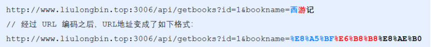

#### 2. 如何对URL进行编码与解码

浏览器提供了 URL 编码与解码的 API，分别是：

encodeURI()  编码的函数

decodeURI()  解码的函数

```
encodeURI('黑马程序员')// 输出字符串  %E9%BB%91%E9%A9%AC%E7%A8%8B%E5%BA%8F%E5%91%98

decodeURI('%E9%BB%91%E9%A9%AC')// 输出字符串  黑马
```

#### 3. URL编码的注意事项

由于浏览器会自动对 URL 地址进行编码操作，因此，大多数情况下，程序员不需要关心 URL 地址的编码与解码操作。


更多关于 URL 编码的知识，请参考如下博客：
https://blog.csdn.net/Lxd_0111/article/details/78028889

### 1.7 使用xhr发起POST请求

步骤：

1. 创建 xhr 对象
2. 调用 xhr.open() 函数
3. **设置 Content-Type 属性（固定写法）**
4. 调用 xhr.send() 函数，同时指定要发送的数据
5. 监听 xhr.onreadystatechange 事件

注意第三步，Post请求要比Get请求多这一步

```
// 1. 创建 xhr 对象
var xhr = new XMLHttpRequest()
// 2. 调用 open()
xhr.open('POST', 'http://www.liulongbin.top:3006/api/addbook')
// 3. 设置 Content-Type 属性（固定写法）
xhr.setRequestHeader('Content-Type', 'application/x-www-form-urlencoded')
// 4. 调用 send()，同时将数据以查询字符串的形式，提交给服务器
xhr.send('bookname=水浒传&author=施耐庵&publisher=天津图书出版社')
// 5. 监听 onreadystatechange 事件
xhr.onreadystatechange = function() {
    if (xhr.readyState === 4 && xhr.status === 200) {
        console.log(xhr.responseText)
    }
}
```

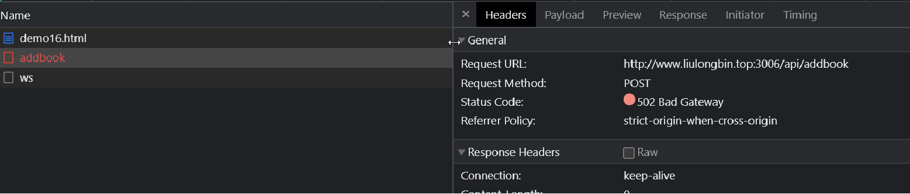

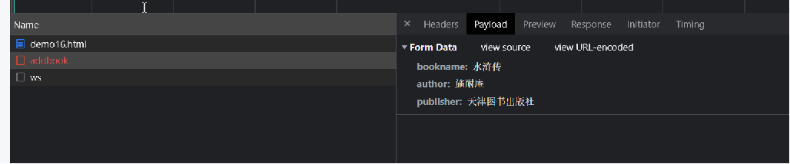

## 2. 数据交换格式

### 2.1 什么是数据交换

数据交换格式，就是服务器端与客户端之间进行数据传输与交换的格式。

前端领域，经常提及的两种数据交换格式分别是 XML 和 JSON。其中 XML 用的非常少，所以，我们重点要学习的数据交换格式就是 JSON。

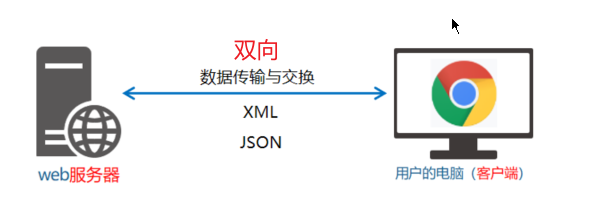

### 2.2 XML

#### 1. 什么是XML

XML 的英文全称是 EXtensible Markup Language，即可扩展标记语言。因此，XML 和 HTML 类似，也是一种标记语言。

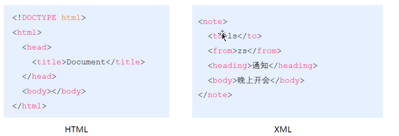

#### 2. XML和HTML的区别

XML 和 HTML 虽然都是标记语言，但是，它们两者之间没有任何的关系。

- HTML 被设计用来描述网页上的内容，是网页内容的载体
- XML 被设计用来传输和存储数据，是数据的载体

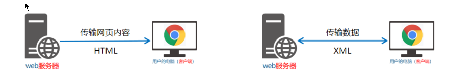

#### 3. XML的缺点

XML 格式臃肿，和数据无关的代码多（标签比数据还多），体积大，传输效率低

在 Javascript 中解析 XML 比较麻烦

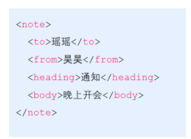

### 2.3 JSON

#### 1. 什么是JSON

概念：JSON 的英文全称是 JavaScript Object Notation，即“JavaScript 对象表示法”。简单来讲，JSON 就是 Javascript 对象和数组的字符串表示法，它使用文本表示一个 JS 对象或数组的信息，因此，JSON 的本质是字符串。

作用：JSON 是一种轻量级的文本数据交换格式，在作用上类似于 XML，专门用于存储和传输数据，但是 JSON 比 XML 更小、更快、更易解析。

现状：JSON 是在 2001 年开始被推广和使用的数据格式，到现今为止，JSON 已经成为了主流的数据交换格式。

#### 2. JSON的两种结构

JSON 就是用字符串来表示 Javascript 的对象和数组。所以，JSON 中包含对象和数组两种结构，通过这两种结构的相互嵌套，可以表示各种复杂的数据结构。

1. 对象结构：对象结构在 JSON 中表示为 { } 括起来的内容。数据结构为 { key: value, key: value, … } 的键值对结构。其中，key 必须是使用英文的双引号包裹的字符串，value 的数据类型可以是数字、字符串、布尔值、null、数组、对象6种类型。

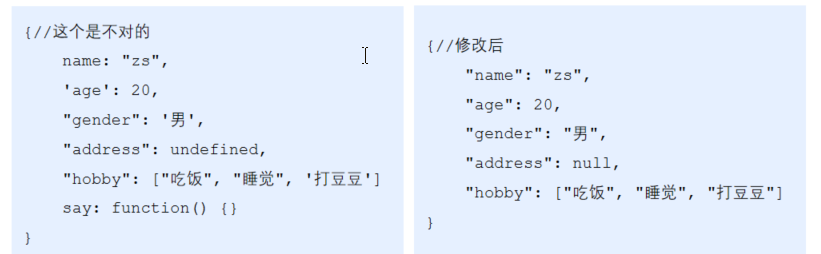


2. 数组结构：数组结构在 JSON 中表示为 [ ] 括起来的内容。数据结构为 [ "java", "javascript", 30, true … ] 。数组中数据的类型可以是数字、字符串、布尔值、null、数组、对象6种类型。

```
[ "java", "python", "php" ]
[ 100, 200, 300.5 ]
[ true, false, null ]
[ { "name": "zs", "age": 20}, { "name": "ls", "age": 30} ]
[ [ "苹果", "榴莲", "椰子" ], [ 4, 50, 5 ] ]
```

#### 3. JSON语法注意事项

1. 属性名必须使用双引号包裹
2. 字符串类型的值必须使用双引号包裹
3. JSON 中不允许使用单引号表示字符串
4. JSON 中不能写注释
5. JSON 的最外层必须是对象或数组格式
6. 不能使用 undefined 或函数作为 JSON 的值

JSON 的作用：在计算机与网络之间存储和传输数据。

JSON 的本质：用字符串来表示 Javascript 对象数据或数组数据

#### 4. JSON和JS对象的关系

JSON 是 JS 对象的字符串表示法，它使用文本表示一个 JS 对象的信息，本质是一个字符串。例如：

```
//这是一个对象
var obj = {a: 'Hello', b: 'World'}

//这是一个 JSON 字符串，本质是一个字符串
var json = '{"a": "Hello", "b": "World"}' 
```

#### 5. JSON和JS对象的互转

要实现从 JSON 字符串转换为 JS 对象，使用 JSON.parse() 方法：

```
var obj = JSON.parse('{"a": "Hello", "b": "World"}')
//结果是 {a: 'Hello', b: 'World'}
```

要实现从 JS 对象转换为 JSON 字符串，使用 JSON.stringify() 方法：

```
var json = JSON.stringify({a: 'Hello', b: 'World'})
//结果是 '{"a": "Hello", "b": "World"}'
```

#### 6. 序列化和反序列化

把数据对象转换为字符串的过程，叫做序列化，例如：调用 JSON.stringify() 函数的操作，叫做 JSON 序列化。

把字符串转换为数据对象的过程，叫做反序列化，例如：调用 JSON.parse() 函数的操作，叫做 JSON 反序列化。

## 3. 封装自己的Ajax函数

### 3.1 要实现的效果

```
<!-- 1. 导入自定义的ajax函数库 -->
<script src="./itheima.js"></script>

<script>
    // 2. 调用自定义的 itheima 函数，发起 Ajax 数据请求
    itheima({
        method: '请求类型',
        url: '请求地址',
        data: { /* 请求参数对象 */ },
        success: function(res) { // 成功的回调函数
            console.log(res)     // 打印数据
        }
    })
</script>
```

### 3.2 定义options参数选项

itheima() 函数是我们自定义的 Ajax 函数，它接收一个配置对象作为参数，配置对象中可以配置如下属性：

- method   请求的类型
- url           请求的 URL 地址
- data        请求携带的数据
- success   请求成功之后的回调函数

### 3.3 实现

测试页面：

```
<!DOCTYPE html>
<html lang="en">

<head>
  <meta charset="UTF-8">
  <meta name="viewport" content="width=device-width, initial-scale=1.0">
  <meta http-equiv="X-UA-Compatible" content="ie=edge">
  <title>Document</title>
  <script src="./js/itheima.js"></script>
</head>

<body>
  <script>
    // itheima({
    //   method: 'GET',
    //   url: 'http://www.liulongbin.top:3006/api/getbooks',
    //   data: {
    //     id: 1
    //   },
    //   success: function (res) {
    //     console.log(res)
    //   }
    // })

    itheima({
      method: 'post',
      url: 'http://www.liulongbin.top:3006/api/addbook',
      data: {
        bookname: '水浒传',
        author: '施耐庵',
        publisher: '北京图书出版社'
      },
      success: function (res) {
        console.log(res)
      }
    })
  </script>
</body>

</html>
```


itheima.js：

```
function resolveData(data) {
  var arr = []
  for (var k in data) {
    var str = k + '=' + data[k]
    arr.push(str)
  }

  return arr.join('&')
}

// var res = resolveData({ name: 'zs', age: 20 })
// console.log(res)

function itheima(options) {
  var xhr = new XMLHttpRequest()

  // 把外界传递过来的参数对象，转换为 查询字符串
  var qs = resolveData(options.data)

  if (options.method.toUpperCase() === 'GET') {
    // 发起GET请求
    xhr.open(options.method, options.url + '?' + qs)
    xhr.send()
  } else if (options.method.toUpperCase() === 'POST') {
    // 发起POST请求
    xhr.open(options.method, options.url)
    xhr.setRequestHeader('Content-Type', 'application/x-www-form-urlencoded')
    xhr.send(qs)
  }

  xhr.onreadystatechange = function () {
    if (xhr.readyState === 4 && xhr.status === 200) {
      var result = JSON.parse(xhr.responseText)
      options.success(result)
    }
  }
}
```

## 4. XMLHttpRequest Level2的新特性

### 4.1 认识XMLHttpRequest Level2

#### 1. 旧版XMLHttpRequest的缺点

只支持文本数据的传输，无法用来读取和上传文件

传送和接收数据时，没有进度信息，只能提示有没有完成

#### 2. XMLHttpRequest Level2的新功能

1. 可以设置 HTTP 请求的时限
2. 可以使用 FormData 对象管理表单数据
3. 可以上传文件
4. 可以获得数据传输的进度信息

### 4.2 设置HTTP请求时限

有时，Ajax 操作很耗时，而且无法预知要花多少时间。如果网速很慢，用户可能要等很久。新版本的 XMLHttpRequest 对象，增加了 timeout 属性，可以设置 HTTP 请求的时限：

```
 xhr.timeout = 3000
```

上面的语句，将最长等待时间设为 3000 毫秒。过了这个时限，就自动停止HTTP请求。与之配套的还有一个 timeout 事件，用来指定回调函数：

```
 xhr.ontimeout = function(event){
     alert('请求超时！')
 }
```

### 4.3 FormData对象管理表单数据

Ajax 操作往往用来提交表单数据。为了方便表单处理，HTML5 新增了一个 FormData 对象，可以模拟表单操作：

```javascript
// 1. 新建 FormData 对象
var fd = new FormData()
// 2. 为 FormData 添加表单项
fd.append('uname', 'zs')
fd.append('upwd', '123456')
// 3. 创建 XHR 对象
var xhr = new XMLHttpRequest()
// 4. 指定请求类型与URL地址
xhr.open('POST', 'http://www.liulongbin.top:3006/api/formdata')
// 5. 直接提交 FormData 对象，这与提交网页表单的效果，完全一样
xhr.send(fd)
//下面可以绑定响应成功的事件，这里就不写了

```

FormData对象也可以用来获取网页表单的值，示例代码如下：

```js
// 获取表单元素
var form = document.querySelector('#form1')
// 监听表单元素的 submit 事件
form.addEventListener('submit', function(e) {
    //禁用自动提交跳转
    e.preventDefault()
    // 根据 form 表单创建 FormData 对象，会自动将表单数据填充到 FormData 对象中
    var fd = new FormData(form)
    //发送ajax请求
    var xhr = new XMLHttpRequest()
    xhr.open('POST', 'http://www.liulongbin.top:3006/api/formdata')
    xhr.send(fd)
    //还是监听响应成功的回调函数，这里就不写了
    xhr.onreadystatechange = function() {}
})
```

### 4.4 上传文件

新版 XMLHttpRequest 对象，不仅可以发送文本信息，还可以上传文件。

实现步骤：

1. 定义 UI 结构
2. 验证是否选择了文件
3. 向 FormData 中追加文件
4. 使用 xhr 发起上传文件的请求
5. 监听 onreadystatechange 事件

```js
<!DOCTYPE html>
<html lang="en">

<head>
  <meta charset="UTF-8">
  <meta name="viewport" content="width=device-width, initial-scale=1.0">
  <meta http-equiv="X-UA-Compatible" content="ie=edge">
  <title>Document</title>
</head>

<body>
  <!-- 1. 文件选择框 -->
  <input type="file" id="file1" />
  <!-- 2. 上传文件的按钮 -->
  <button id="btnUpload">上传文件</button>
  <br />
  <!-- 3. img 标签，来显示上传成功以后的图片 -->
  

  <script>
    // 1. 获取到文件上传按钮
    var btnUpload = document.querySelector('#btnUpload')
    // 2. 为按钮绑定单击事件处理函数
    btnUpload.addEventListener('click', function () {
      // 3. 获取到用户选择的文件列表
      var files = document.querySelector('#file1').files
      if (files.length <= 0) {
        return alert('请选择要上传的文件！')
      }
      var fd = new FormData()
      // 将用户选择的文件，添加到 FormData 中
      fd.append('avatar', files[0])

      var xhr = new XMLHttpRequest()
      xhr.open('POST', 'http://www.liulongbin.top:3006/api/upload/avatar')
      xhr.send(fd)

      xhr.onreadystatechange = function () {
        if (xhr.readyState === 4 && xhr.status === 200) {
          var data = JSON.parse(xhr.responseText)
          if (data.status === 200) {
            // 上传成功
            document.querySelector('#img').src = 'http://www.liulongbin.top:3006' + data.url
          } else {
            // 上传失败
            console.log('图片上传失败！' + data.message)
          }
        }
      }
    })
  </script>
</body>

</html>
```

### 4.5 显示文件上传进度

新版本的 XMLHttpRequest 对象中，可以通过监听 xhr.upload.onprogress 事件，来获取到文件的上传进度。语法格式如下：

```
 // 创建 XHR 对象
 var xhr = new XMLHttpRequest()
 // 监听 xhr.upload 的 onprogress 事件
 xhr.upload.onprogress = function(e) {
    // e.lengthComputable 是一个布尔值，表示当前上传的资源是否具有可计算的长度
    if (e.lengthComputable) {
        // e.loaded 已传输的字节
        // e.total  需传输的总字节
        var percentComplete = Math.ceil((e.loaded / e.total) * 100)
    }
 }
```

