# RPC

RPC协议实际上就是约定了**远程调用过程中**

1.数据的格式

2.数据如何传输

RPC协议是应用层之上的协议，可扩展性很强

# Dubbo用法示例

## version版本号

在provider里面有两个不同的实现类

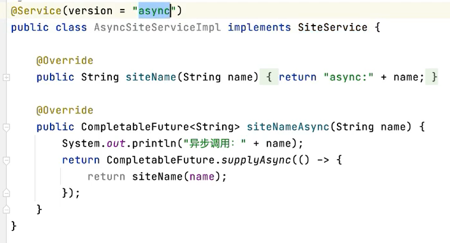

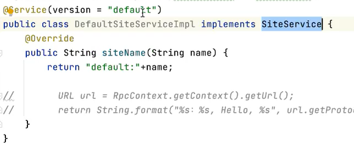

在consumer里面可以指定不同的提供者版本，获得不同的方法

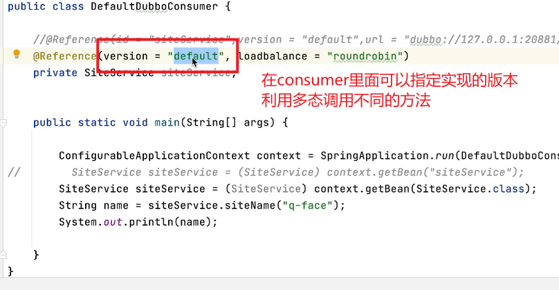

## 指定protocol协议

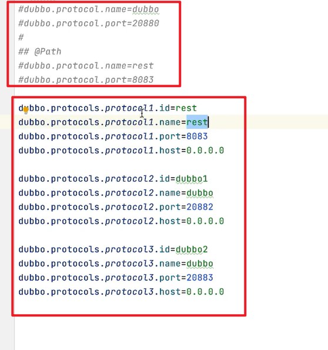

可以指明需要用到的是哪一种协议

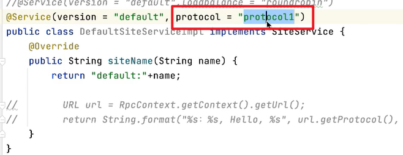

## 使用rest协议调用服务

创建使用rest的类

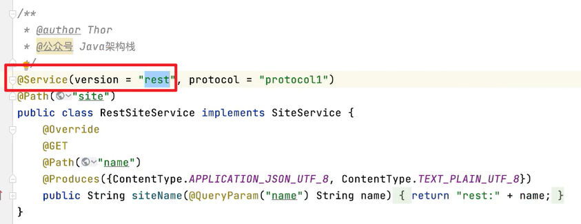

之后就可以用这个服务，调用这个协议

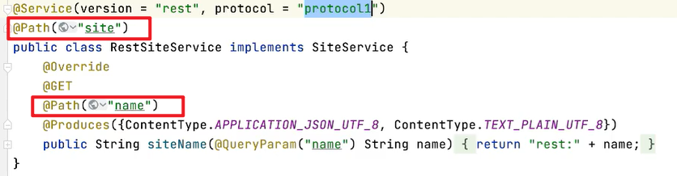

根据这个

rest协议在8083端口

所以可以发送`localhost:8083/site/name?name=haohao`

## 消费者通过url直连指定的服务提供者

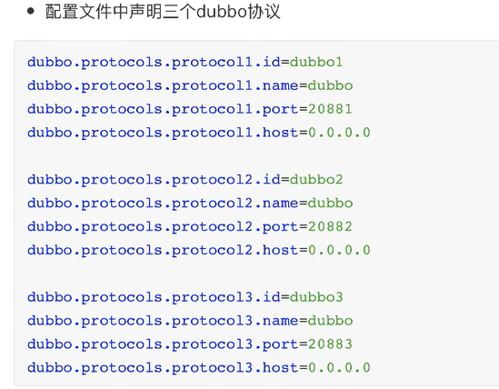

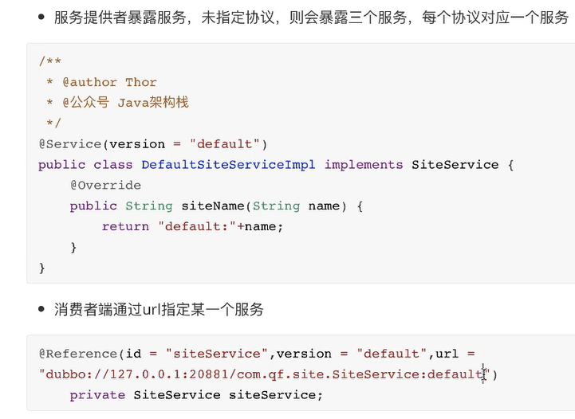

## 服务超时

**服务提供者**和**服务消费者**都可以配置服务超时时间（默认时间为1秒，当然可以指定超时时间）

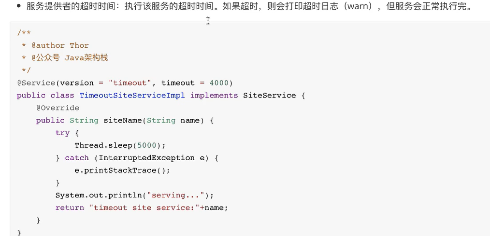

## 集群容错

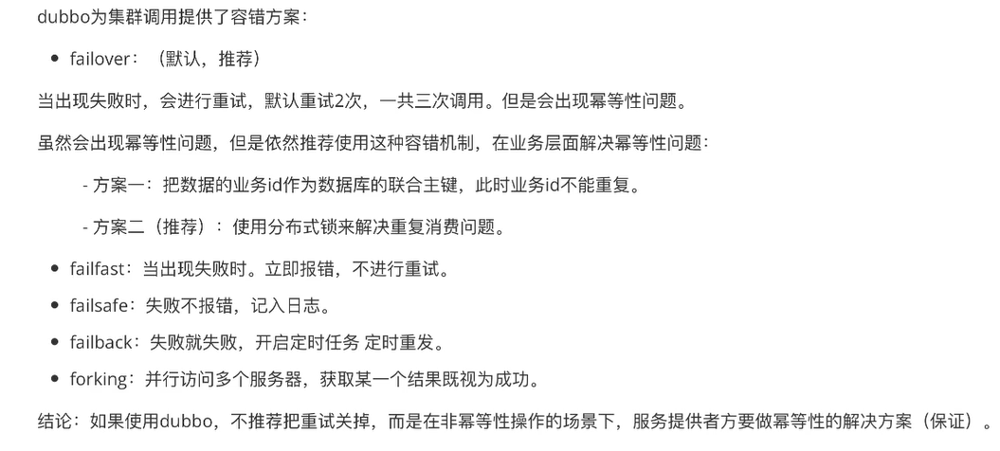

## 服务降级

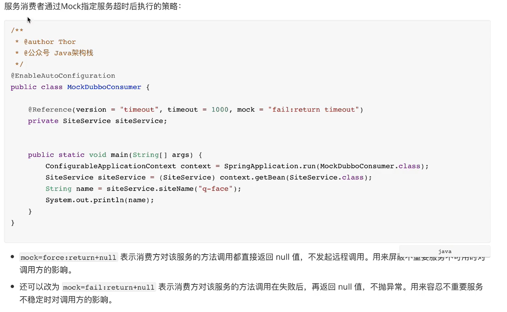
