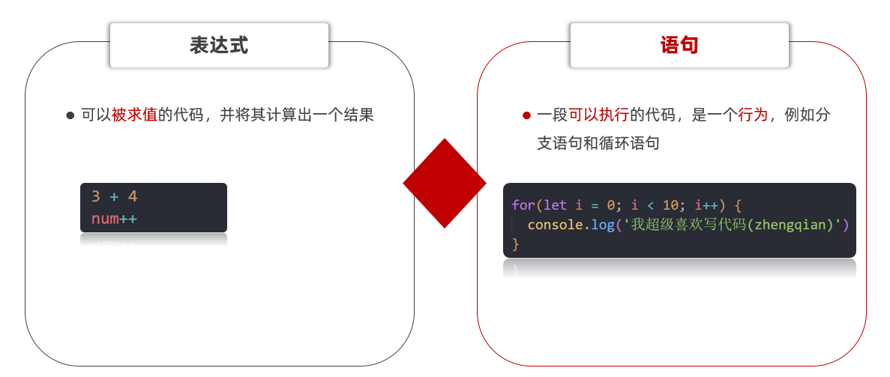
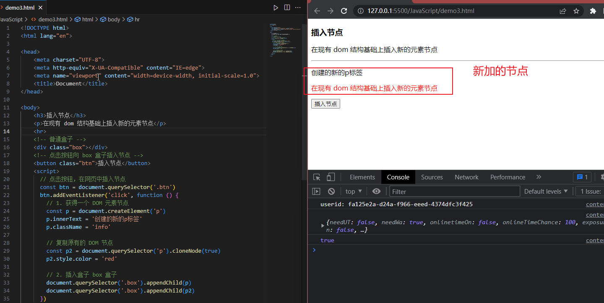
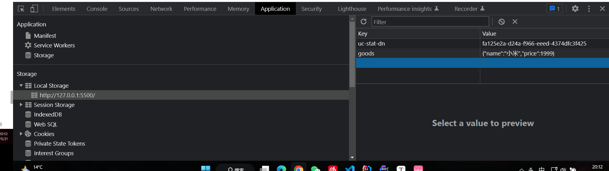
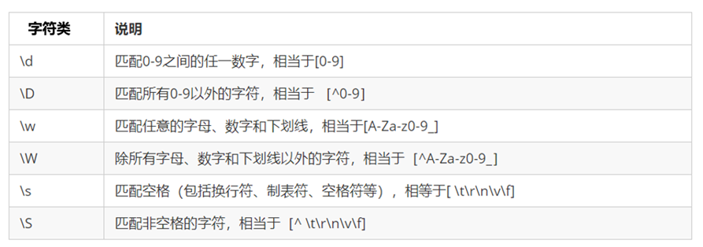
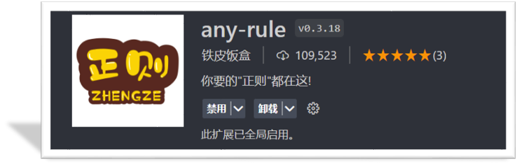
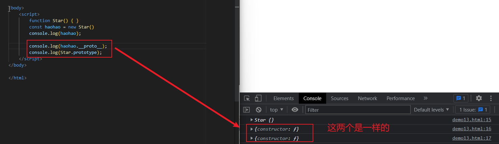
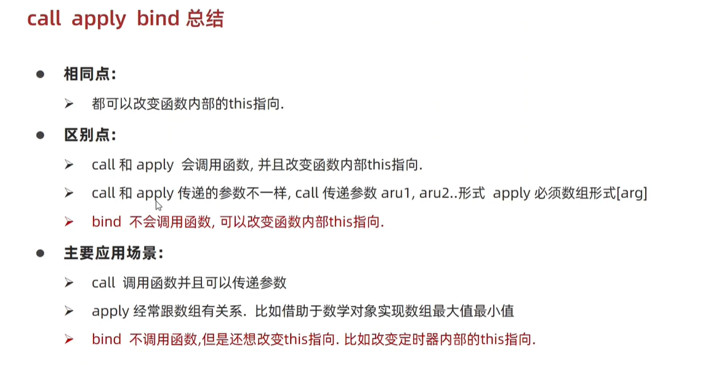
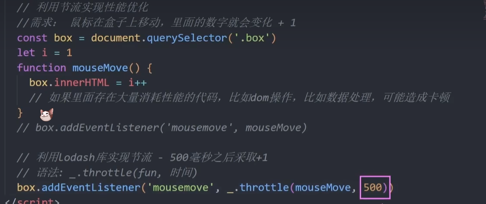

# JavaScript 基础 - 第1天

## 介绍

###  引入方式

JavaScript 程序 不能独立运行，它需要被嵌入 HTML 中，然后浏览器才能执行 JavaScript 代码。通过 `script` 标签将 JavaScript 代码引入到 HTML 中，有两种方式：

#### 内部方式

通过 `script` 标签包裹 JavaScript 代码

```html
<!DOCTYPE html>
<html lang="en">
<head>
  <meta charset="UTF-8">
  <title>JavaScript 基础 - 引入方式</title>
</head>
<body>
  <!-- 内联形式：通过 script 标签包裹 JavaScript 代码 -->
  <script>
    alert('嗨，欢迎来传智播学习前端技术！')
  </script>
</body>
</html>
```

#### 外部形式

一般将 JavaScript 代码写在独立的以 .js 结尾的文件中，然后通过 `script` 标签的 `src` 属性引入

```javascript
// demo.js
document.write('嗨，欢迎来传智播学习前端技术！')
```

```html
<!DOCTYPE html>
<html lang="en">
<head>
  <meta charset="UTF-8">
  <title>JavaScript 基础 - 引入方式</title>
</head>
<body>
  <!-- 外部形式：通过 script 的 src 属性引入独立的 .js 文件 -->
  <script src="demo.js"></script>
</body>
</html>
```

如果 script 标签使用 src 属性引入了某 .js 文件，那么 标签的代码会被忽略！！！如下代码所示：

```html
<!DOCTYPE html>
<html lang="en">
<head>
  <meta charset="UTF-8">
  <title>JavaScript 基础 - 引入方式</title>
</head>
<body>
  <!-- 外部形式：通过 script 的 src 属性引入独立的 .js 文件 -->
  <script src="demo.js">
  	alert(666);  // 此处的代码会被忽略掉！！！！
  </script>
</body>
</html>
```

###  注释和结束符

通过注释可以屏蔽代码被执行或者添加备注信息，JavaScript 支持两种形式注释语法：

#### 单行注释

使用 `// ` 注释单行代码

```html
<!DOCTYPE html>
<html lang="en">
<head>
  <meta charset="UTF-8">
  <title>JavaScript 基础 - 注释</title>
</head>
<body>
  
  <script>
    // 这种是单行注释的语法
    // 一次只能注释一行
    // 可以重复注释
    document.write('嗨，欢迎来传智播学习前端技术！');
  </script>
</body>
</html>
```

#### 多行注释

使用 `/* */` 注释多行代码

```html
<!DOCTYPE html>
<html lang="en">
<head>
  <meta charset="UTF-8">
  <title>JavaScript 基础 - 注释</title>
</head>
<body>
  
  <script>
    /* 这种的是多行注释的语法 */
    /*
    	更常见的多行注释是这种写法
    	在些可以任意换行
    	多少行都可以
      */
    document.write('嗨，欢迎来传智播学习前端技术！')
  </script>
</body>
</html>
```

**注：编辑器中单行注释的快捷键为 `ctrl + /`**

### 结束符

在 JavaScript 中 `;` 代表一段代码的结束，多数情况下可以省略 `;` 使用回车（enter）替代。

```html
<!DOCTYPE html>
<html lang="en">
<head>
  <meta charset="UTF-8">
  <title>JavaScript 基础 - 结束符</title>
</head>
<body>
  
  <script> 
    alert(1);
    alert(2);
    alert(1)
    alert(2)
  </script>
</body>
</html>
```

实际开发中有许多人主张书写 JavaScript 代码时省略结束符 `;`

### 输入和输出

输出和输入也可理解为人和计算机的交互，用户通过键盘、鼠标等向计算机输入信息，计算机处理后再展示结果给用户，这便是一次输入和输出的过程。

举例说明：如按键盘上的方向键，向上/下键可以滚动页面，按向上/下键这个动作叫作输入，页面发生了滚动了这便叫输出。

#### 输出

JavaScript 可以接收用户的输入，然后再将输入的结果输出：

`alert()`、`document.wirte()`

以数字为例，向 `alert()` 或 `document.write()`输入任意数字，他都会以弹窗形式展示（输出）给用户。

####  输入

向 `prompt()` 输入任意内容会以弹窗形式出现在浏览器中，一般提示用户输入一些内容。

```html
<!DOCTYPE html>
<html lang="en">
<head>
  <meta charset="UTF-8">
  <title>JavaScript 基础 - 输入输出</title>
</head>
<body>
  
  <script> 
    // 1. 输入的任意数字，都会以弹窗形式展示
    document.write('要输出的内容')
    document.write('<h1>我是一级标题</h1>')
    alert('要输出的内容');

    // 2. 以弹窗形式提示用户输入姓名，注意这里的文字使用英文的引号
    prompt('请输入您的姓名:')
  </script>
</body>
</html>
```

## 变量

> 理解变量是计算机存储数据的“容器”，掌握变量的声明方式

变量是计算机中用来存储数据的“容器”，它可以让计算机变得有记忆，通俗的理解变量就是使用【某个符号】来代表【某个具体的数值】（数据）

```html
<script>
  // x 符号代表了 5 这个数值
  x = 5
  // y 符号代表了 6 这个数值
  y = 6
    
  //举例： 在 JavaScript 中使用变量可以将某个数据（数值）记录下来！

  // 将用户输入的内容保存在 num 这个变量（容器）中
  num = prompt('请输入一数字!')

  // 通过 num 变量（容器）将用户输入的内容输出出来
  alert(num)
  document.write(num)
</script>
```


### 声明

声明(定义)变量有两部分构成：声明关键字、变量名（标识）

```html
<!DOCTYPE html>
<html lang="en">
<head>
  <meta charset="UTF-8">
  <title>JavaScript 基础 - 声明和赋值</title>
</head>
<body>
  
  <script> 
    // let 变量名
    // 声明(定义)变量有两部分构成：声明关键字、变量名（标识）
    // let 即关键字，所谓关键字是系统提供的专门用来声明（定义）变量的词语
    // age 即变量的名称，也叫标识符
    let age
  </script>
</body>
</html>
```

关键字是 JavaScript 中内置的一些英文词汇（单词或缩写），它们代表某些特定的含义，如 `let` 的含义是声明变量的，看到 `let`  后就可想到这行代码的意思是在声明变量，如 `let age;` 

`let` 和 `var` 都是 JavaScript 中的声明变量的关键字，推荐使用 `let` 声明变量！！！

### 赋值

声明（定义）变量相当于创造了一个空的“容器”，通过赋值向这个容器中添加数据。

```html
<!DOCTYPE html>
<html lang="en">
<head>
  <meta charset="UTF-8">
  <title>JavaScript 基础 - 声明和赋值</title>
</head>
<body>
  
  <script> 
    // 声明(定义)变量有两部分构成：声明关键字、变量名（标识）
    // let 即关键字，所谓关键字是系统提供的专门用来声明（定义）变量的词语
    // age 即变量的名称，也叫标识符
    let age
    // 赋值，将 18 这个数据存入了 age 这个“容器”中
    age = 18
    // 这样 age 的值就成了 18
    document.write(age)
    
    // 也可以声明和赋值同时进行
    let str = 'hello world!'
    alert(str);
  </script>
</body>
</html>
```

### 关键字

JavaScript 使用专门的关键字 `let` 和 `var` 来声明（定义）变量，在使用时需要注意一些细节：

以下是使用 `let` 时的注意事项：

1. 允许声明和赋值同时进行
2. 不允许重复声明
3. 允许同时声明多个变量并赋值
4. JavaScript 中内置的一些关键字不能被当做变量名

以下是使用 `var` 时的注意事项：

2. 允许声明和赋值同时进行
3. 允许重复声明
4. 允许同时声明多个变量并赋值

大部分情况使用 `let` 和 `var` 区别不大，但是 `let` 相较 `var` 更严谨，因此推荐使用 `let`，后期会更进一步介绍二者间的区别。

### 变量名命名规则

关于变量的名称（标识符）有一系列的规则需要遵守：

1. 只能是字母、数字、下划线、$，且不能能数字开头
2. 字母区分大小写，如 Age 和 age 是不同的变量
3. JavaScript 内部已占用于单词（关键字或保留字）不允许使用
4. 尽量保证变量具有一定的语义，见字知义

注：所谓关键字是指 JavaScript 内部使用的词语，如 `let` 和`var`，保留字是指 JavaScript 内部目前没有使用的词语，但是将来可能会使用词语。

```html
<!DOCTYPE html>
<html lang="en">
<head>
  <meta charset="UTF-8">
  <title>JavaScript 基础 - 变量名命名规则</title>
</head>
<body>
  
  <script> 
    let age = 18 // 正确
    let age1 = 18 // 正确
    let _age = 18 // 正确

    // let 1age = 18; // 错误，不可以数字开头
    let $age = 18 // 正确
    let Age = 24 // 正确，它与小写的 age 是不同的变量
    // let let = 18; // 错误，let 是关键字
    let int = 123 // 不推荐，int 是保留字
  </script>
</body>
</html>
```

## 常量

概念：使用 const 声明的变量称为“常量”。

使用场景：当某个变量永远不会改变的时候，就可以使用 const 来声明，而不是let。

命名规范：和变量一致

~~~javascript
const PI = 3.14
~~~

>注意： 常量不允许重新赋值,声明的时候必须赋值（初始化）

## 数据类型

> 计算机世界中的万事成物都是数据。

计算机程序可以处理大量的数据，为了方便数据的管理，将数据分成了不同的类型：

注：通过 typeof 关键字检测数据类型

```html
<!DOCTYPE html>
<html lang="en">
<head>
  <meta charset="UTF-8">
  <title>JavaScript 基础 - 数据类型</title>
</head>
<body>
  
  <script> 
    // 检测 1 是什么类型数据，结果为 number
    document.write(typeof 1)
  </script>
</body>
</html>
```

### 数值类型

即我们数学中学习到的数字，可以是整数、小数、正数、负数

```html
<!DOCTYPE html>
<html lang="en">
<head>
  <meta charset="UTF-8">
  <title>JavaScript 基础 - 数据类型</title>
</head>
<body>
  
  <script> 
    let score = 100 // 正整数
    let price = 12.345 // 小数
    let temperature = -40 // 负数

    document.write(typeof score) // 结果为 number
    document.write(typeof price) // 结果为 number
    document.write(typeof temperature) // 结果为 number
  </script>
</body>
</html>
```

JavaScript 中的数值类型与数学中的数字是一样的，分为正数、负数、小数等。

### 字符串类型

通过单引号（ `''`） 、双引号（ `""`）或反引号包裹的数据都叫字符串，单引号和双引号没有本质上的区别，推荐使用单引号。

注意事项：

1. 无论单引号或是双引号必须成对使用
2. 单引号/双引号可以互相嵌套，但是不以自已嵌套自已
3. 必要时可以使用转义符 `\`，输出单引号或双引号

```html
<!DOCTYPE html>
<html lang="en">
<head>
  <meta charset="UTF-8">
  <title>JavaScript 基础 - 数据类型</title>
</head>
<body>
  
  <script> 
    let user_name = '小明' // 使用单引号
    let gender = "男" // 使用双引号
    let str = '123' // 看上去是数字，但是用引号包裹了就成了字符串了
    let str1 = '' // 这种情况叫空字符串
		
    documeent.write(typeof user_name) // 结果为 string
    documeent.write(typeof gender) // 结果为 string
    documeent.write(typeof str) // 结果为 string
  </script>
</body>
</html>
```

### 布尔类型

表示肯定或否定时在计算机中对应的是布尔类型数据，它有两个固定的值 `true` 和 `false`，表示肯定的数据用 `true`，表示否定的数据用 `false`。

```html
<!DOCTYPE html>
<html lang="en">
<head>
  <meta charset="UTF-8">
  <title>JavaScript 基础 - 数据类型</title>
</head>
<body>
  
  <script> 
    //  pink老师帅不帅？回答 是 或 否
    let isCool = true // 是的，摔死了！
    isCool = false // 不，套马杆的汉子！

    document.write(typeof isCool) // 结果为 boolean
  </script>
</body>
</html>
```

### undefined

未定义是比较特殊的类型，只有一个值 undefined，只声明变量，不赋值的情况下，**变量的默认值为 undefined**，一般很少【直接】为某个变量赋值为 undefined。

```html
<!DOCTYPE html>
<html lang="en">
<head>
  <meta charset="UTF-8">
  <title>JavaScript 基础 - 数据类型</title>
</head>
<body>
  
  <script> 
    // 只声明了变量，并末赋值
    let tmp;
    document.write(typeof tmp) // 结果为 undefined
  </script>
</body>
</html>
```

**注：JavaScript 中变量的值决定了变量的数据类型。**

## 类型转换

> 理解弱类型语言的特征，掌握显式类型转换的方法

在 JavaScript 中数据被分成了不同的类型，如数值、字符串、布尔值、undefined，在实际编程的过程中，不同数据类型之间存在着转换的关系。

### 隐式转换

某些运算符被执行时，系统内部自动将数据类型进行转换，这种转换称为隐式转换。

```html
<!DOCTYPE html>
<html lang="en">
<head>
  <meta charset="UTF-8">
  <title>JavaScript 基础 - 隐式转换</title>
</head>
<body>
  <script> 
    let num = 13 // 数值
    let num2 = '2' // 字符串

    // 结果为 132
    // 原因是将数值 num 转换成了字符串，相当于 '13'
    // 然后 + 将两个字符串拼接到了一起
    console.log(num + num2)

    // 结果为 11
    // 原因是将字符串 num2 转换成了数值，相当于 2
    // 然后数值 13 减去 数值 2
    console.log(num - num2)

      
    let a = prompt('请输入一个数字')
    let b = prompt('请再输入一个数字')
    //输入1
    //输入2
    //结果为12
    alert(a + b);
  </script>
</body>
</html>
```

注：数据类型的隐式转换是 JavaScript 的特征，后续学习中还会遇到，目前先需要理解什么是隐式转换。

补充介绍模板字符串的拼接的使用

```html
<!DOCTYPE html>
<html lang="en">
<head>
    <meta charset="UTF-8">
    <meta http-equiv="X-UA-Compatible" content="IE=edge">
    <meta name="viewport" content="width=device-width, initial-scale=1.0">
    <title>模板字符串的拼接</title>
</head>
<body>
    <script>
        let age=18;
        //外面用``包含
        //里面用${变量名}
        document.write(`我今年${age}岁了`)
    </script>
</body>
</html>
```


### 显式转换

编写程序时过度依靠系统内部的隐式转换是不严禁的，因为隐式转换规律并不清晰，大多是靠经验总结的规律。为了避免因隐式转换带来的问题，通常根逻辑需要对数据进行显示转换。

#### Number

通过 `Number` 显示转换成数值类型，当转换失败时结果为 `NaN`（Not a Number）即不是一个数字。

```html
<!DOCTYPE html>
<html lang="en">
<head>
  <meta charset="UTF-8">
  <title>JavaScript 基础 - 隐式转换</title>
</head>
<body>
  <script>
    let t = '12'
    let f = 8

    // 显式将字符串 12 转换成数值 12
    t = Number(t)

    // 检测转换后的类型
    // console.log(typeof t);
    console.log(t + f) // 结果为 20

    // 并不是所有的值都可以被转成数值类型
    let str = 'hello'
    // 将 hello 转成数值是不现实的，当无法转换成
    // 数值时，得到的结果为 NaN （Not a Number）
    console.log(Number(str))
  </script>
</body>
</html>
```

# JavaScript 基础 - 第2天

- 运算符
- 语句
- 综合案例


## 运算符

### 算术运算符

数字是用来计算的，比如：乘法 * 、除法 / 、加法 + 、减法 - 等等，所以经常和算术运算符一起。

算术运算符：也叫数学运算符，主要包括加、减、乘、除、取余（求模）等

| 运算符 | 作用                                                 |
| ------ | ---------------------------------------------------- |
| +      | 求和                                                 |
| -      | 求差                                                 |
| *      | 求积                                                 |
| /      | 求商                                                 |
| **%**  | 取模（取余数），开发中经常用于作为某个数字是否被整除 |

> 注意：在计算失败时，显示的结果是 NaN （not a number）

```javascript
// 算术运算符
console.log(1 + 2 * 3 / 2) //  4 
let num = 10
console.log(num + 10)  // 20
console.log(num + num)  // 20

// 1. 取模(取余数)  使用场景：  用来判断某个数是否能够被整除
console.log(4 % 2) //  0  
console.log(6 % 3) //  0
console.log(5 % 3) //  2
console.log(3 % 5) //  3

// 2. 注意事项 : 如果我们计算失败，则返回的结果是 NaN (not a number)
console.log('pink老师' - 2)   // NaN
console.log('pink老师' * 2)   // NaN
console.log('pink老师' + 2)   // pink老师2
```

### 赋值运算符

赋值运算符：对变量进行赋值的运算符

 =     将等号右边的值赋予给左边, 要求左边必须是一个容器

| 运算符 | 作用     |
| ------ | -------- |
| +=     | 加法赋值 |
| -+     | 减法赋值 |
| *=     | 乘法赋值 |
| /=     | 除法赋值 |
| %=     | 取余赋值 |

```javascript
<script>
let num = 1
// num = num + 1
// 采取赋值运算符
// num += 1
num += 3
console.log(num)//4
</script>
```

### 自增/自减运算符

| 符号 | 作用 | 说明                       |
| ---- | ---- | -------------------------- |
| ++   | 自增 | 变量自身的值加1，例如: x++ |
| --   | 自减 | 变量自身的值减1，例如: x-- |

1. ++在前和++在后在单独使用时二者并没有差别，而且一般开发中我们都是独立使用
2. ++在后（后缀式）我们会使用更多

> 注意：
>
> 1. 只有变量能够使用自增和自减运算符
> 2. ++、-- 可以在变量前面也可以在变量后面，比如: x++  或者  ++x 

```javascript
<script>
    // // 1. 前置自增
    // let i = 1
    // ++i
    // console.log(i)//2

    // let i = 1
    // console.log(++i + 1)//3
    // 2. 后置自增
    // let i = 1
    // i++
    // console.log(i)//2

    // let i = 1
    // console.log(i++ + 1)//2

    // 了解 
    let i = 1
	console.log(i++ + ++i + i)//7
</script>
```

### 比较运算符

使用场景：比较两个数据大小、是否相等，根据比较结果返回一个布尔值（true / false）

| 运算符 | 作用                                   |
| ------ | -------------------------------------- |
| >      | 左边是否大于右边                       |
| <      | 左边是否小于右边                       |
| >=     | 左边是否大于或等于右边                 |
| <=     | 左边是否小于或等于右边                 |
| ===    | 左右两边是否`类型`和`值`都相等（重点） |
| ==     | 左右两边`值`是否相等                   |
| !=     | 左右值不相等                           |
| !==    | 左右两边是否不全等                     |

```javascript
<script>
    console.log(3 > 5)//false
    console.log(3 >= 3)//true
    console.log(2 == 2)//true
    // 比较运算符有隐式转换 把'2' 转换为 2  双等号 只判断值
    console.log(2 == '2')  // true
    console.log(undefined === null)//false
    // === 全等 判断 值 和 数据类型都一样才行
    // 以后判断是否相等 请用 ===  
    console.log(2 === '2')//false
    console.log(NaN === NaN) //false NaN 不等于任何人，包括他自己
    console.log(2 !== '2')  // true  
    console.log(2 != '2') // false 说明是相等的
    console.log('-------------------------')
    console.log('a' < 'b') // true   b的ASCII码比a要大
    console.log('aa' < 'ab') // true
    console.log('aa' < 'aac') // true
    console.log('-------------------------')
</script>

```

### 逻辑运算符

使用场景：可以把多个布尔值放到一起运算，最终返回一个布尔值

| 符号 | 名称   | 日常读法 | 特点                       | 口诀           |
| ---- | ------ | -------- | -------------------------- | -------------- |
| &&   | 逻辑与 | 并且     | 符号两边有一个假的结果为假 | 一假则假       |
| \|\| | 逻辑或 | 或者     | 符号两边有一个真的结果为真 | 一真则真       |
| !    | 逻辑非 | 取反     | true变false  false变true   | 真变假，假变真 |

| A     | B     | A && B | A \|\| B | !A    |
| ----- | ----- | ------ | -------- | ----- |
| false | false | false  | false    | true  |
| false | true  | false  | true     | true  |
| true  | false | false  | true     | false |
| true  | true  | true   | true     | false |

```javascript
    <script>
        // 逻辑与 一假则假
        console.log(true && true)//true
        console.log(false && true)//false
        console.log(3 < 5 && 3 > 2)//true
        console.log(3 < 5 && 3 < 2)//false
        console.log('-----------------')
        // 逻辑或 一真则真
        console.log(true || true)//true
        console.log(false || true)//true
        console.log(false || false)//false
        console.log('-----------------')
        // 逻辑非  取反
        console.log(!true)//false
        console.log(!false)//true
        console.log('-----------------')
        let num = 6
        console.log(num > 5 && num < 10)//true
        console.log('-----------------')
    </script>
```

### 运算符优先级


> 逻辑运算符优先级： ！> && >  ||  

## 语句

### 表达式和语句

**表达式**是可以被求值的代码，JavaScript引擎会将其计算出一个结果

**语句**是一句可以执行的代码，if语句 for语句




### 分支语句

分支语句可以根据条件判定真假，来选择性的执行想要的代码

分支语句包含：

1. if分支语句（重点）
2. 三元运算符
3. switch语句

#### if 分支语句

语法：

~~~javascript
if(条件表达式) {
  // 满足条件要执行的语句
}
~~~

小括号内的条件结果是布尔值，为 true 时，进入大括号里执行代码；为false，则不执行大括号里面代码

小括号内的结果若不是布尔类型时，会发生类型转换为布尔值，类似Boolean()

如果大括号只有一个语句，大括号可以省略。但是，不提倡这么做，因为这样会看着不优雅，如果改还容易出bug

~~~javascript
    <script>
        // 单分支语句
        if (false) {
          console.log('执行语句')//不执行
        }
        if (3 > 5) {
          console.log('执行语句')//不执行
        }
        if (2 === '2') {
          console.log('执行语句')//不执行
        }
        // 1. 除了0 所有的数字都为真
          if (0) {
            console.log('执行语句')//不执行
          }
        // 2.除了 '' 所有的字符串都为真 true
        if ('pink老师') {
          console.log('执行语句')//执行
        }
        if ('') {
          console.log('执行语句')//不执行
        }
        if ('') 
          console.log('执行语句')//不执行 只有一句语句不用大括号也行

        // 1. 用户输入
        let score = +prompt('请输入成绩')
        // 2. 进行判断输出
        if (score >= 700) {
            //执行
            alert('恭喜考入黑马程序员')
        }
        console.log('-----------------')

    </script>
~~~

#### if双分支语句

如果有两个条件的时候，可以使用 if else 双分支语句

~~~javascript
if (条件表达式){
  // 满足条件要执行的语句
} else {
  // 不满足条件要执行的语句
}
~~~

例如：

~~~javascript
 <script>
    // 1. 用户输入
    let uname = prompt('请输入用户名:')
    let pwd = prompt('请输入密码:')
    // 2. 判断输出
    if (uname === 'pink' && pwd === '123456') {
      alert('恭喜登录成功')
    } else {
      alert('用户名或者密码错误')
    }
  </script>
~~~

#### if 多分支语句

使用场景： 适合于有多个条件的时候

~~~javascript
    <script>
        // 1. 用户输入
        let score = prompt('请输入成绩：')
        // 2. 判断输出
        if (score >= 90) {
            alert('成绩优秀，宝贝，你是我的骄傲')
        } else if (score >= 70) {
            alert('成绩良好，宝贝，你要加油哦~~')
        } else if (score >= 60) {
            alert('成绩及格，宝贝，你很危险~')
        } else {
            alert('成绩不及格，宝贝，我不想和你说话，我只想用鞭子和你说话~')
        }
    </script>
~~~

#### 三元运算符（三元表达式）

**使用场景**： 一些简单的双分支，可以使用  三元运算符（三元表达式），写起来比 if  else双分支 更简单

**符号**：? 与 : 配合使用

语法：

~~~javascript
条件 ? 表达式1 ： 表达式2
~~~

例如：

~~~javascript
    <script>
        // 如果条件为真，则执行表达式1
        // 如果条件为假，则执行表达式2
        console.log(5 > 3 ? '真的' : '假的')//真的

        // 1. 用户输入 
        let num = prompt('请您输入一个数字:')
        // 2. 判断输出- 小于10才补0
        //注意，这里的num是字符串
        num = num >= 10 ? num : 0 + num
        alert(typeof num)//string
        alert(num)
    </script>
~~~

#### switch语句（了解）

使用场景： 适合于有多个条件的时候，也属于分支语句，大部分情况下和 if多分支语句 功能相同

注意：

1. switch case语句一般用于等值判断, if适合于区间判断
2. switch case一般需要配合break关键字使用 没有break会造成case穿透
3. if 多分支语句开发要比switch更重要，使用也更多

例如：

~~~javascript
// switch分支语句
// 1. 语法
// switch (表达式) {
//   case 值1:
//     代码1
//     break

//   case 值2:
//     代码2
//     break
//   ...
//   default:
//     代码n
// }

<script>
  switch (2) {
    case 1:
    console.log('您选择的是1')
    break  // 退出switch
    case 2:
    console.log('您选择的是2')
    break  // 退出switch
    case 3:
    console.log('您选择的是3')
    break  // 退出switch
    default:
    console.log('没有符合条件的')
  }
</script>
~~~

#### 断点调试

**作用：**学习时可以帮助更好的理解代码运行，工作时可以更快找到bug

浏览器打开调试界面

1. 按F12打开开发者工具
2. 点到源代码一栏 （ sources ）
3. 选择代码文件

**断点：**在某句代码上加的标记就叫断点，当程序执行到这句有标记的代码时会暂停下来


### 循环语句

使用场景：重复执行 指定的一段代码，比如我们想要输出10次 '我学的很棒'

学习路径：

1.while循环

2.for 循环（重点）

#### while循环

while :  在…. 期间， 所以 while循环 就是在满足条件期间，重复执行某些代码。

**语法：**

~~~javascript
while (条件表达式) {
   // 循环体    
}
~~~

例如：

~~~javascript
// while循环: 重复执行代码

// 1. 需求: 利用循环重复打印3次 '月薪过万不是梦，毕业时候见英雄'
let i = 1
while (i <= 3) {
  document.write('月薪过万不是梦，毕业时候见英雄~<br>')
  i++   // 这里千万不要忘了变量自增否则造成死循环
}
~~~

循环三要素：

1.初始值 （经常用变量）

2.终止条件

3.变量的变化量

例如：

~~~javascript
    <script>
        // 1. 变量的起始值
        let i = 1
        // 2. 终止条件
        while (i <= 3) {
          document.write('我要循环三次 <br>')
          // 3. 变量的变化量
          i++
        }


        // 1. 变量的起始值
        let end = +prompt('请输入次数:')
        let i1 = 1
        // 2. 终止条件
        while (i1 <= end) {
            document.write('我要循环三次 <br>')
            // 3. 变量的变化量
            i++
        }
    </script>
~~~

#### 中止循环

`break`   中止整个循环，一般用于结果已经得到, 后续的循环不需要的时候可以使用（提高效率）  

`continue`  中止本次循环，一般用于排除或者跳过某一个选项的时候

~~~javascript
    <script>
        let i = 1
        while (i <= 5) {
          console.log(i)//1 2 3 
          if (i === 3) {
            break  // 退出循环
          }
          i++
        }


        let i1 = 1
        while (i1 <= 5) {
            if (i1 === 3) {
                i1++
                continue
            }
            console.log(i1)//1 2 4 5
            i1++
        }
    </script>
~~~

#### 无限循环

1.while(true) 来构造“无限”循环，需要使用break退出循环。（常用）

2.for(;;) 也可以来构造“无限”循环，同样需要使用break退出循环。

~~~javascript
    <script>
        // 无限循环  
        // 需求： 页面会一直弹窗询问你爱我吗？
        // (1). 如果用户输入的是 '爱'，则退出弹窗
        // (2). 否则一直弹窗询问

        // 1. while(true) 无限循环
        while (true) {
            let love = prompt('你爱我吗?')
            if (love === '爱') {
                break
            }
        }

        // 2. for(;;) 无限循环
        for (; ;) {
            let love = prompt('你爱我吗?')
            if (love === '爱') {
                break
            }
        }
    </script>
~~~

## 综合案例-ATM存取款机


分析：

①：提示输入框写到循环里面（无限循环）

②：用户输入4则退出循环 break

③：提前准备一个金额预先存储一个数额 money

④：根据输入不同的值，做不同的操作

​     (1)  取钱则是减法操作， 存钱则是加法操作，查看余额则是直接显示金额

​     (2) 可以使用 if else if 多分支 来执行不同的操作

完整代码：

~~~javascript
    <script>
        // 1. 开始循环 输入框写到 循环里面
        // 3. 准备一个总的金额
        let money = 100
        while (true) {
            let re = +prompt(`
            请您选择操作：
            1.存钱
            2.取钱
            3.查看余额
            4.退出
            `)
            // 2. 如果用户输入的 4 则退出循环， break  写到if 里面，没有写到switch里面， 因为4需要break退出循环
            if (re === 4) {
                break
            }
            // 4. 根据输入做操作
            switch (re) {
                case 1:
                    // 存钱
                    let cun = +prompt('请输入存款金额')
                    money = money + cun
                    break
                case 2:
                    // 存钱
                    let qu = +prompt('请输入取款金额')
                    money = money - qu
                    break
                case 3:
                    // 存钱
                    alert(`您的银行卡余额是${money}`)
                    break
            }
        }
    </script>
~~~


#  JavaScript 基础 - 第3天

**if 多分支语句和 switch的区别：**

1. 共同点

   - 都能实现多分支选择， 多选1 
   - 大部分情况下可以互换

2. 区别：

   - switch…case语句通常处理case为比较**确定值**的情况，而if…else…语句更加灵活，通常用于**范围判断**(大于，等于某个范围)。
   - switch 语句进行判断后直接执行到程序的语句，效率更高，而if…else语句有几种判断条件，就得判断多少次
   - switch 一定要注意 必须是 ===  全等，一定注意 数据类型，同时注意break否则会有穿透效果
   - 结论：
     - 当分支比较少时，if…else语句执行效率高。
     - 当分支比较多时，switch语句执行效率高，而且结构更清晰。

   

## for 语句

> 掌握 for 循环语句，让程序具备重复执行能力

`for` 是 JavaScript 提供的另一种循环控制的话句，它和 `while` 只是语法上存在差异。

### for语句的基本使用

1. 实现循环的 3 要素

```html
    <script>
        // 示例：在网页中输入标题标签
        // 起始值为 1
        // 变化量 i++
        // 终止条件 i <= 6
        for(let i = 1; i <= 6; i++) {
          document.write(`<h${i}>循环控制，即重复执行<h${i}>`)
        }
      </script>
```

2. 变化量和死循环，`for` 循环和 `while` 一样，如果不合理设置增量和终止条件，便会产生死循环。


3. 跳出和终止循环

```html
<script>
    // 1. continue 
    for (let i = 1; i <= 5; i++) {
        if (i === 3) {
            continue  // 结束本次循环，继续下一次循环
        }
        console.log(i)
    }
    // 2. break
    for (let i = 1; i <= 5; i++) {
        if (i === 3) {
            break  // 退出结束整个循环
        }
        console.log(i)
    }
</script>
```

结论：

- `JavaScript` 提供了多种语句来实现循环控制，但无论使用哪种语句都离不开循环的3个特征，即起始值、变化量、终止条件，做为初学者应着重体会这3个特征，不必过多纠结三种语句的区别。
- 起始值、变化量、终止条件，由开发者根据逻辑需要进行设计，规避死循环的发生。
- 当如果明确了循环的次数的时候推荐使用`for`循环,当不明确循环的次数的时候推荐使用`while`循环

>注意：`for` 的语法结构更简洁，故 `for` 循环的使用频次会更多。


### 循环嵌套

利用循环的知识来对比一个简单的天文知识，我们知道地球在自转的同时也在围绕太阳公转，如果把自转和公转都看成是循环的话，就相当于是循环中又嵌套了另一个循环。


实际上 JavaScript 中任何一种循环语句都支持循环的嵌套，如下代码所示：


```html
// 1. 外面的循环 记录第n天 
for (let i = 1; i < 4; i++) {
    document.write(`第${i}天 <br>`)
    // 2. 里层的循环记录 几个单词
    for (let j = 1; j < 6; j++) {
        document.write(`记住第${j}个单词<br>`)
    }
}
```

结果：


记住，外层循环循环一次，里层循环循环全部

#### 倒三角

~~~javascript
 // 外层打印几行
for (let i = 1; i <= 5; i++) {
    // 里层打印几个星星
    for (let j = 1; j <= i; j++) {
        document.write('★')
    }
    document.write('<br>')
}
~~~

 

#### 九九乘法表

样式css

~~~css
span {
    display: inline-block;
    width: 100px;
    padding: 5px 10px;
    border: 1px solid pink;
    margin: 2px;
    border-radius: 5px;
    box-shadow: 2px 2px 2px rgba(255, 192, 203, .4);
    background-color: rgba(255, 192, 203, .1);
    text-align: center;
    color: hotpink;
}
~~~

javascript 

~~~javascript
 // 外层打印几行
for (let i = 1; i <= 9; i++) {
    // 里层打印几个星星
    for (let j = 1; j <= i; j++) {
        // 只需要吧 ★ 换成  1 x 1 = 1   
        document.write(`
		<div> ${j} x ${i} = ${j * i} </div>
     `)
    }
    document.write('<br>')
}
~~~


## 数组

> 知道什么是数组及其应用的场景，掌握数组声明及访问的语法。

### 数组是什么？

**数组：**(Array)是一种可以按顺序保存数据的数据类型

**使用场景：**如果有多个数据可以用数组保存起来，然后放到一个变量中，管理非常方便

### 数组的基本使用

#### 定义数组和数组单元

```html
<script>
  // 1. 语法，使用 [] 来定义一个空数组
  // 定义一个空数组，然后赋值给变量 classes
  // let classes = [];

  // 2. 定义非空数组
  let classes = ['小明', '小刚', '小红', '小丽', '小米']
</script>
```

通过 `[]` 定义数组，数据中可以存放真正的数据，如小明、小刚、小红等这些都是数组中的数据，我们这些数据称为数组单元，数组单元之间使用英文逗号分隔。

#### 访问数组和数组索引

使用数组存放数据并不是最终目的，关键是能够随时的**访问**到数组中的数据（单元）。其实 JavaScript 为数组中的每一个数据单元都编了号，通过数据单元在数组中的编号便可以轻松访问到数组中的数据单元了。

我们将数据单元在数组中的编号称为索引值，也有人称其为下标。

索引值实际是按着数据单元在数组中的位置依次排列的，注意是从` 0` 开始的，如下图所示：


观察上图可以数据单元【小明】对应的索引值为【0】，数据单元【小红】对应的索引值为【2】

```html
<script>
  let classes = ['小明', '小刚', '小红', '小丽', '小米']
  
  // 1. 访问数组，语法格式为：变量名[索引值]
      document.write(classes[0]) // 结果为：小明
      document.write(classes[1]) // 结果为：小刚
      document.write(classes[4]) // 结果为：小米
  
  // 2. 通过索引值还可以为数组单重新赋值
      document.write(classes[3]) // 结果为：小丽
      // 重新为索引值为 3 的单元赋值
      classes[3] = '小小丽'
      document.wirte(classes[3]); // 结果为： 小小丽
</script>
```

#### 数据单元值类型

数组做为数据的集合，它的单元值可以是任意数据类型

```html
<script>
  //  数组单值类型可以是任意数据类型

  // a) 数组单元值的类型为字符类型
  let list = ['HTML', 'CSS', 'JavaScript']
  // b) 数组单元值的类型为数值类型
  let scores = [78, 84, 70, 62, 75]
  // c) 混合多种类型
  let mixin = [true, 1, false, 'hello']
</script>
```

#### 数组长度属性

重申一次，数组在 JavaScript 中并不是新的数据类型，它属于对象类型。

```html
<script>
  // 定义一个数组
  let arr = ['html', 'css', 'javascript']
  // 数组对应着一个 length 属性，它的含义是获取数组的长度
  console.log(arr.length) // 3
</script>
```

### 操作数组

数组做为对象数据类型，不但有 `length` 属性可以使用，还提供了许多方法：

1. push 动态向数组的尾部添加一个单元
2. unshit 动态向数组头部添加一个单元
3. pop 删除最后一个单元
4. shift 删除第一个单元
5. splice 动态删除任意单元

使用以上4个方法时，都是直接在原数组上进行操作，即成功调任何一个方法，原数组都跟着发生相应的改变。并且在添加或删除单元时 `length` 并不会发生错乱。

```html
    <script>
        // 定义一个数组
        let arr = ['html', 'css', 'javascript']
        // 1. push 动态向数组的尾部添加一个单元
        arr.push('Nodejs')
        console.log(arr)// ['html', 'css', 'javascript', 'Nodejs']
        arr.push('Vue')

        // 2. unshit 动态向数组头部添加一个单元
        arr.unshift('VS Code')
        console.log(arr)//['VS Code', 'html', 'css', 'javascript', 'Nodejs', 'Vue']

        // 3. splice 动态删除任意单元
        arr.splice(2, 1) // 从索引值为2的位置开始删除1个单元,也就是删除'css'
        console.log(arr)//['VS Code', 'html', 'javascript', 'Nodejs', 'Vue']

        // 4. pop 删除最后一个单元
        arr.pop()
        console.log(arr)//['VS Code', 'html', 'javascript', 'Nodejs']

        // 5. shift 删除第一个单元
        arr.shift()
        console.log(arr)//['html', 'javascript', 'Nodejs']
    </script>
```


# JavaScript 基础 - 第4天

## 函数

### 声明和调用

函数可以把具有相同或相似逻辑的代码“包裹”起来，通过函数调用执行这些被“包裹”的代码逻辑，这么做的优势是有利于精简代码方便复用。

#### 声明（定义）

声明（定义）一个完整函数包括关键字、函数名、形式参数、函数体、返回值5个部分


#### 调用

声明（定义）的函数必须调用才会真正被执行，使用 `()` 调用函数。

```html
<!DOCTYPE html>
<html lang="en">
<head>
  <meta charset="UTF-8">
  <title>JavaScript 基础 - 声明和调用</title>
</head>
<body>
  <script>
    // 声明（定义）了最简单的函数，既没有形式参数，也没有返回值
    function sayHi() {
      console.log('嗨~')
    }
    // 函数调用，这些函数体内的代码逻辑会被执行
    // 函数名()
        
    sayHi()
    // 可以重复被调用，多少次都可以
    sayHi()
  </script>
</body>
</html>
```

> 注：函数名的命名规则与变量是一致的，并且尽量保证函数名的语义。

小案例： 小星星

~~~javascript
<script>
        // 函数声明
        function sayHi() {
            // document.write('hai~')
            document.write(`*<br>`)
            document.write(`**<br>`)
            document.write(`***<br>`)
            document.write(`****<br>`)
            document.write(`*****<br>`)
            document.write(`******<br>`)
            document.write(`*******<br>`)
            document.write(`********<br>`)
            document.write(`*********<br>`)
        }
        // 函数调用
        sayHi()
        sayHi()
        sayHi()
        sayHi()
        sayHi()
    </script>
~~~

###  参数

通过向函数传递参数，可以让函数更加灵活多变，参数可以理解成是一个变量。

声明（定义）一个功能为打招呼的函数

- 传入数据列表
- 声明这个函数需要传入几个数据
- 多个数据用逗号隔开

```html
    <script>
        function sayHi(name) {
            // 参数 name 可以被理解成是一个变量
            console.log(name)
        }
        // 调用 sayHi 函数，括号中多了 '小明'
        // 这时相当于为参数 name 赋值了
        sayHi('小明')// 结果为 小明

        // 再次调用 sayHi 函数，括号中多了 '小红'
        // 这时相当于为参数 name 赋值了
        sayHi('小红') // 结果为 小红
    </script>
```

总结：

1. 声明（定义）函数时的形参没有数量限制，当有多个形参时使用 `,` 分隔
2. 调用函数传递的实参要与形参的顺序一致

#### 形参和实参

形参：声明函数时写在函数名右边小括号里的叫形参（形式上的参数）

实参：调用函数时写在函数名右边小括号里的叫实参（实际上的参数）

形参可以理解为是在这个函数内声明的变量（比如 num1 = 10）实参可以理解为是给这个变量赋值

开发中尽量保持形参和实参个数一致

```html
<!DOCTYPE html>
<html lang="en">
<head>
  <meta charset="UTF-8">
  <title>JavaScript 基础 - 函数参数</title>
</head>
<body>
  <script>
    // 声明（定义）一个计算任意两数字和的函数
    // 形参 x 和 y 分别表示任意两个数字，它们是两个变量
    function count(x, y) {
      console.log(x + y);
    }
    // 调用函数，传入两个具体的数字做为实参
    // 此时 10 赋值给了形参 x
    // 此时 5  赋值给了形参 y
    count(10, 5); // 结果为 15
  </script>
</body>
</html>
```

### 返回值

函数的本质是封装（包裹），函数体内的逻辑执行完毕后，函数外部如何获得函数内部的执行结果呢？要想获得函数内部逻辑的执行结果，需要通过 `return` 这个关键字，将内部执行结果传递到函数外部，这个被传递到外部的结果就是返回值。

```html
<!DOCTYPE html>
<html lang="en">
<head>
  <meta charset="UTF-8">
  <title>JavaScript 基础 - 函数返回值</title>
</head>
<body>

  <script>
    // 定义求和函数
    function count(a, b) {
      let s = a + b
      // s 即为 a + b 的结果
      // 通过 return 将 s 传递到外部
      return s
    }

    // 调用函数，如果一个函数有返回值
    // 那么可将这个返回值赋值给外部的任意变量
    let total = count(5, 12)
  </script>
</body>
</html>
```

总结：

1. 在函数体中使用return 关键字能将内部的执行结果交给函数外部使用
2. 函数内部只能出现1 次 return，并且 return 下一行代码不会再被执行，所以return 后面的数据不要换行写
3. return会立即结束当前函数
4. 函数可以没有return，这种情况默认返回值为 undefined

### 作用域

通常来说，一段程序代码中所用到的名字并不总是有效和可用的，而限定这个名字的可用性的代码范围就是这个名字的作用域。

作用域的使用提高了程序逻辑的局部性，增强了程序的可靠性，减少了名字冲突。


#### 全局作用域

作用于所有代码执行的环境(整个 script 标签内部)或者一个独立的 js 文件

处于全局作用域内的变量，称为全局变量

#### 局部作用域

作用于函数内的代码环境，就是局部作用域。 因为跟函数有关系，所以也称为函数作用域。

处于局部作用域内的变量称为局部变量

>如果函数内部，变量没有声明，直接赋值，也当**全局变量**看，但是强烈不推荐
>
>

### 匿名函数

函数可以分为具名函数和匿名函数

匿名函数：没有名字的函数,无法直接使用。

#### 函数表达式

~~~javascript
// 声明
let fn = function() { 
   console.log('函数表达式')
}
// 调用
fn()
~~~

#### 立即执行函数

~~~javascript
(function(){ 
    xxx  
})();
(function(){
    xxxx
}());
~~~

>无需调用，立即执行，其实本质已经调用了
>
>多个立即执行函数之间用分号隔开


# JavaScript 基础 - 第5天

## 对象

> 对象是 JavaScript 数据类型的一种，之前已经学习了数值类型、字符串类型、布尔类型、undefined。对象数据类型可以被理解成是一种数据集合。它由属性和方法两部分构成。

### 语法

声明一个对象类型的变量与之前声明一个数值或字符串类型的变量没有本质上的区别。

```html
<!DOCTYPE html>
<html lang="en">
<head>
  <meta charset="UTF-8">
  <title>JavaScript 基础 - 对象语法</title>
</head>
<body>

  <script>
    // 声明字符串类型变量
    let str = 'hello world!'
    
    // 声明数值类型变量
    let num = 199

    // 声明对象类型变量，使用一对花括号
    // user 便是一个对象了，目前它是一个空对象
    let user = {}
  </script>
</body>
</html>
```

### 属性和访问

数据描述性的信息称为属性，如人的姓名、身高、年龄、性别等，一般是名词性的。

1. 属性都是成 对出现的，包括属性名和值，它们之间使用英文 `:` 分隔
2. 多个属性之间使用英文 `,` 分隔
3. 属性就是依附在对象上的变量
4. 属性名可以使用 `""` 或 `''`，一般情况下省略，除非名称遇到特殊符号如空格、中横线等

```html
<!DOCTYPE html>
<html lang="en">
<head>
  <meta charset="UTF-8">
  <title>JavaScript 基础 - 对象语法</title>
</head>
<body>

  <script>
    // 通过对象描述一个人的数据信息
    // person 是一个对象，它包含了一个属性 name
    // 属性都是成对出现的，属性名 和 值，它们之间使用英文 : 分隔
    let person = {
      name: '小明', // 描述人的姓名
      age: 18, // 描述人的年龄
      stature: 185, // 描述人的身高
      gender: '男', // 描述人的性别
    }
  </script>
</body>
</html>
```

声明对象，并添加了若干属性后，可以使用 `.` 或 `[]` 获得对象中属性对应的值，我称之为属性访问。

```html
<!DOCTYPE html>
<html lang="en">
<head>
  <meta charset="UTF-8">
  <title>JavaScript 基础 - 对象语法</title>
</head>
<body>

  <script>
    // 通过对象描述一个人的数据信息
    // person 是一个对象，它包含了一个属性 name
    // 属性都是成对出现的，属性名 和 值，它们之间使用英文 : 分隔
    let person = {
      name: '小明', // 描述人的姓名
      age: 18, // 描述人的年龄
      stature: 185, // 描述人的身高
      gender: '男', // 描述人的性别
    };
    
    // 访问人的名字
    console.log(person.name) // 结果为 小明
    // 访问人性别
    console.log(person.gender) // 结果为 男
    // 访问人的身高
    console.log(person['stature']) // 结果为 185
   // 或者
    console.log(person.stature) // 结果同为 185
  </script>
</body>
</html>
```

扩展：也可以动态为对象添加属性，动态添加与直接定义是一样的，只是语法上更灵活。

```html
<!DOCTYPE html>
<html lang="en">
<head>
  <meta charset="UTF-8">
  <title>JavaScript 基础 - 对象语法</title>
</head>
<body>

  <script>
    // 声明一个空的对象（没有任何属性）
	let user = {}
    // 动态追加属性
    user.name = '小明'
    user['age'] = 18
    
    // 动态添加与直接定义是一样的，只是语法上更灵活
  </script>
</body>
</html>
```

### 方法和调用

数据行为性的信息称为方法，如跑步、唱歌等，一般是动词性的，其本质是函数。

1. 方法是由方法名和函数两部分构成，它们之间使用 : 分隔
2. 多个属性之间使用英文 `,` 分隔
3. 方法是依附在对象中的函数
4. 方法名可以使用 `""` 或 `''`，一般情况下省略，除非名称遇到特殊符号如空格、中横线等

```html
<!DOCTYPE html>
<html lang="en">
<head>
  <meta charset="UTF-8">
  <title>JavaScript 基础 - 对象方法</title>
</head>
<body>

  <script>
    // 方法是依附在对象上的函数
    let person = {
      //这里是属性
      name: '小红',
      age: 18,

      // 方法是由方法名和函数两部分构成，它们之间使用 : 分隔
      singing: function () {
        console.log('两只老虎，两只老虎，跑的快，跑的快...')
      },
      run: function () {
        console.log('我跑的非常快...')
      }
    }
  </script>
</body>
</html>
```

声明对象，并添加了若干方法后，可以使用 `.` 或 `[]` 调用对象中函数，我称之为方法调用。

```html
<!DOCTYPE html>
<html lang="en">
<head>
  <meta charset="UTF-8">
  <title>JavaScript 基础 - 对象方法</title>
</head>
<body>

  <script>
    // 方法是依附在对象上的函数
    let person = {
      name: '小红',
      age: 18,
      // 方法是由方法名和函数两部分构成，它们之间使用 : 分隔
      singing: function () {
        console.log('两只老虎，两只老虎，跑的快，跑的快...')
      },
      run: function () {
        console.log('我跑的非常快...')
      }
    }
    
    // 调用对象中 singing 方法
    person.singing()
    // 调用对象中的 run 方法
    person.run()

  </script>
</body>
</html>
```

扩展：也可以动态为对象添加方法，动态添加与直接定义是一样的，只是语法上更灵活。

```html
    <script>
        // 声明一个空的对象（没有任何属性，也没有任何方法）
        let user = {}
        // 动态追加属性
        user.name = '小明'
        user['age'] = 18

        // 动态添加方法
        // 注意，这里是不能给move加括号的，因为JavaScript会自动识别后面赋值的是个函数
        user.move = function () {
            console.log('移动一点距离...')
        };

        //调用方法
        user.move();
    </script>
```


**注：无论是属性或是方法，同一个对象中出现名称一样的，后面的会覆盖前面的。**


### null

null 也是 JavaScript 中数据类型的一种，通常只用它来表示不存在的对象。使用 typeof 检测类型它的类型时，结果为 `object`。

#### 遍历对象

通过增强for循环来**遍历对象**，增强for不推荐来遍历数组

~~~javascript
    <script>
        let obj = {
            uname: '昊昊',
            age:18,
            say:function(){
                console.log("这个是say函数");
            }
        }
        for (let k in obj) {
            console.log(k)		//k是字符串，k的每一个值都是属性名，或者说函数名称
            //只有这一种方式可以取到属性值
            console.log(obj[k]) //由于k是字符串，所以直接可以用这种方式：obj['uname']
            console.log('-------------')
        }
    </script>
~~~


## 内置对象

回想一下我们曾经使用过的 `console.log`，`console`其实就是 JavaScript 中内置的对象，该对象中存在一个方法叫 `log`，然后调用 `log` 这个方法，即 `console.log()`。

除了 `console` 对象外，JavaScritp 还有其它的内置的对象

### Math

`Math` 是 JavaScript 中内置的对象，称为数学对象，这个对象下即包含了属性，也包含了许多的方法。

#### 属性

- Math.PI，获取圆周率

```javascript
// 圆周率
console.log(Math.PI);//3.141592653589793
```

#### 方法

- Math.random，生成 0 到 1 间的随机数

```javascript
// 0 ~ 1 之间的随机数, 包含 0 不包含 1
console.log(Math.random())//0.9622262040945511
```

- Math.ceil，数字向上取整

```javascript
// 舍弃小数部分，整数部分加1
console.log(Math.ceil(3.4))//4
```

- Math.floor，数字向下取整

```javascript
// 舍弃小数部分，整数部分不变
console.log(Math.floor(3.4))//3
```

- Math.round，四舍五入取整

```javascript
// 取整，四舍五入原则
console.log(Math.round(3.4))//3
console.log(Math.round(3.5))//4
```

- Math.max，在一组数中找出最大的

```javascript
// 找出最大值
console.log(Math.max(10, 21, 7, 24, 13))//24
```

- Math.min，在一组数中找出最小的

```javascript
// 找出最小值
console.log(Math.min(10, 21, 7, 24, 13))//7
```

- Math.pow，幂方法

```javascript
// 求某个数的多少次方

// 求 4 的 2 次方
console.log(Math.pow(4, 2) )//16
// 求 2 的 3 次方
console.log(Math.pow(2, 3) )//8
```

- Math.sqrt，平方根

```javascript
// 求某数的平方根
Math.sqrt(16)//4
```

数学对象提供了比较多的方法，这里不要求强记，通过演示数学对象的使用，加深对对象的理解。

复习：

splice() 方法用于添加或删除数组中的元素。

**注意：**这种方法会改变原始数组。

1. **删除数组：**

splice(起始位置， 删除的个数)

比如：1

~~~javascript
let arr = ['red', 'green', 'blue']
arr.splice(1,1) // 删除green元素
console.log(arr) // ['red, 'blue']
~~~

2. **添加元素**

splice(起始位置，删除个数，添加数组元素)

~~~javascript
let arr = ['red', 'green', 'blue']
//arr.splice(1, 0, 'pink') // 在索引号是1的位置添加 pink
//console.log(arr) // ['red', 'pink', 'green', 'blue']
arr.splice(1, 0, 'pink', 'hotpink') // 在索引号是1的位置添加 pink  hotpink
console.log(arr) // ['red', 'pink', 'hotpink', 'green', 'blue']
~~~

# Web APIs - 第1天笔记

## 介绍

严格意义上讲，我们在 JavaScript 阶段学习的知识绝大部分属于 **ECMAScript** 的知识体系，ECMAScript 简称 ES 它提供了一套语言标准规范，如变量、数据类型、表达式、语句、函数等语法规则都是由 ECMAScript 规定的。浏览器将 ECMAScript 大部分的规范加以实现，并且在此基础上又扩展一些实用的功能，这些被扩展出来的内容我们称为 Web APIs。


ECMAScript 运行在浏览器中然后再结合 Web APIs 才是真正的 JavaScript，Web APIs 的核心是 DOM 和 BOM。

扩展阅读：ECMAScript 规范在不断的更新中，存在多个不同的版本，早期的版本号采用数字顺序编号如 ECMAScript3、ECMAScript5，后来由于更新速度较快便采用年份做为版本号，如 ECMAScript2017、ECMAScript2018 这种格式，ECMAScript6 是 2015 年发布的，常叫做 EMCAScript2015。

关于 JavaScript 历史的[扩展阅读](https://javascript.ruanyifeng.com/introduction/history.html)。


> 知道 DOM 相关的概念，建立对 DOM 的初步认识，学习 DOM 的基本操作，体会 DOM 的作用

DOM（Document Object Model）是将整个 HTML 文档的**每一个标签元素**视为**一个对象**，这个对象下包含了许多的属性和方法，通过操作这些属性或者调用这些方法实现对 HTML 的动态更新，为实现网页特效以及用户交互提供技术支撑。

简言之 DOM 是用来动态修改 HTML 的，其目的是开发网页特效及用户交互。

观察一个小例子：


上述的例子中当用户分分别点击【开始】或【结束】按钮后，通过右侧调试窗口可以观察到 html 标签的内容在不断的发生改变，这便是通过 DOM 实现的。

### 概念

#### DOM 树

```html
<!DOCTYPE html>
<html lang="en">
<head>
  <meta charset="UTF-8">
  <meta name="viewport" content="width=device-width, initial-scale=1.0">
  <title>标题</title>
</head>
<body>
  文本
  <a href="">链接名</a>
  <div id="" class="">文本</div>
</body>
</html>
```

如下图所示，将 HTML 文档以树状结构直观的表现出来，我们称之为文档树或 DOM 树，**文档树直观的体现了标签与标签之间的关系。**


#### DOM 节点

节点是文档树的组成部分，**每一个节点都是一个 DOM 对象**，主要分为*元素节点、属性节点、文本节点*等。

1. 【元素节点】其实就是 HTML 标签，如上图中 `head`、`div`、`body` 等都属于元素节点。
2. 【属性节点】是指 HTML 标签中的属性，如上图中 `a` 标签的 `href` 属性、`div` 标签的 `class` 属性。
3. 【文本节点】是指 HTML 标签的文字内容，如 `title` 标签中的文字。
4. 【根节点】特指 `html` 标签。
5. 其它...

#### document

  **document 是JavaScript内置的对象**

`document` 是 JavaScript 内置的专门用于 DOM 的对象，该对象包含了若干的属性和方法，`document` 是学习 DOM 的核心。


```html
<script>
  // document 是内置的对象
  console.log(typeof document);

  // 1. 通过 document 获取根节点
  console.log(document.documentElement); // 对应 html 标签

  // 2. 通过 document 节取 body 节点
  console.log(document.body); // 对应 body 标签

  // 3. 通过 document.write 方法向网页输出内容
  document.write('Hello World!');
</script>
```

上述列举了 `document` 对象的部分属性和方法，我们先对 `document` 有一个整体的认识。

## 获取DOM对象

1. querySelector   满足条件（括号里面填的是选择器，可以是根据标签名、id、class，下面的同理）的第一个元素
2. querySelectorAll  满足条件的元素集合 返回伪数组
3. 了解其他方式
   1. getElementById
   2. getElementsByTagName

```html
<!DOCTYPE html>
<html lang="en">
<head>
  <meta charset="UTF-8">
  <meta name="viewport" content="width=device-width, initial-scale=1.0">
  <title>DOM - 查找节点</title>
</head>
<body>
  <h3>查找元素类型节点</h3>
  <p>从整个 DOM 树中查找 DOM 节点是学习 DOM 的第一个步骤。</p>
  <ul>
      <li>元素</li>
      <li>元素</li>
      <li>元素</li>
      <li>元素</li>
  </ul>
  <script>
  	const p = document.querySelector('p')  // 获取第一个p元素
  	const lis = document.querySelectorAll('li')  // 获取全部li
    console.log(p)
    console.log(lis)
</script>
</body>
</html>
```


总结：

- document.getElementById 专门获取元素类型节点，根据标签的 `id`  属性查找
- 任意 DOM 对象都包含 nodeType 属性，用来检检测节点类型

## 操作元素内容

通过修改 DOM 的文本内容，动态改变网页的内容。

1. `innerText` 将文本内容添加/更新到任意标签位置，**文本中包含的标签不会被解析。**

```html
<script>
  // innerText 将文本内容添加/更新到任意标签位置
  const intro = document.querySelector('.intro')
  // intro.innerText = '嗨~ 我叫李雷！'
  // intro.innerText = '<h4>嗨~ 我叫李雷！</h4>'
</script>
```

2. `innerHTML` 将文本内容添加/更新到任意标签位置，**文本中包含的标签会被解析。**

```html
<script>
  // innerHTML 将文本内容添加/更新到任意标签位置
  const intro = document.querySelector('.intro')
  intro.innerHTML = '嗨~ 我叫韩梅梅！'
  intro.innerHTML = '<h4>嗨~ 我叫韩梅梅！</h4>'
</script>
```

总结：如果文本内容中包含 `html` 标签时推荐使用 `innerHTML`，否则建议使用 `innerText` 属性。

## 操作元素属性 

有3种方式可以实现对属性的修改：

### 常用属性修改

1. 直接能过属性名修改，最简洁的语法

   

```html
<!DOCTYPE html>
<html lang="en">

<head>
    <meta charset="UTF-8">
    <meta name="viewport" content="width=device-width, initial-scale=1.0">
    <title>DOM </title>
</head>

<body>
    <p class="intro">从整个 DOM 树中查找 DOM 节点是学习 DOM 的第一个步骤。</p>
    <script>
        // 1. 获取 img 对应的 DOM 元素
        const p = document.querySelector('.intro')
        // 2. 修改属性
        p.id='hahahah'
        console.log(p.id)
    </script>
</body>

</html>
```

### 控制样式属性

1. 应用【修改样式】，通过修改行内样式 `style` 属性，实现对样式的动态修改。

通过元素节点获得的 `style` 属性本身的数据类型也是对象，如 `box.style.color`、`box.style.width` 分别用来获取元素节点 CSS 样式的 `color` 和 `width` 的值。


```html
<!DOCTYPE html>
<html lang="en">
<head>
  <meta charset="UTF-8">
  <meta name="viewport" content="width=device-width, initial-scale=1.0">
  <title>练习 - 修改样式</title>
</head>
<body>
  <div class="intro">随便一些文本内容</div>
  <script>
    // 获取 DOM 节点
    const box = document.querySelector('.intro')
    box.style.color = 'red'
    box.style.width = '300px'
    // css 属性的 - 连接符与 JavaScript 的 减运算符
    // 冲突，所以要改成驼峰法
    box.style.backgroundColor = 'pink'
  </script>
</body>
</html>
```

任何标签都有 `style` 属性，通过 `style` 属性可以动态更改网页标签的样式，如要遇到 `css` 属性中包含字符 `-` 时，要将 `-` 去掉并将其后面的字母改成大写，如 `background-color` 要写成 `box.style.backgroundColor`

2. 操作类名(className) 操作CSS

如果修改的样式比较多，直接通过style属性修改比较繁琐，我们可以通过借助于css类名的形式。

~~~html
<!DOCTYPE html>
<html lang="en">
<head>
  <meta charset="UTF-8">
  <meta name="viewport" content="width=device-width, initial-scale=1.0">
  <title>练习 - 修改样式</title>
    <style>
        .pink {
            background: pink;
            color: hotpink;
        }
    </style>
</head>
<body>
  <div class="intro">随便一些文本内容</div>
  <script>
    // 获取 DOM 节点
    const box = document.querySelector('.intro')
    //1.由于class是关键字, 所以使用className去代替
    box.className = 'pink'
  </script>
</body>
</html>
~~~

>注意：
>
>1.由于class是关键字, 所以使用className去代替
>
>2.className是使用新值换旧值, 如果需要添加一个类,需要保留之前的类名

3. 通过 classList 操作类控制CSS

为了解决className 容易覆盖以前的类名，我们可以通过classList方式追加和删除类名


~~~html
<!DOCTYPE html>
<html lang="en">

<head>
    <meta charset="UTF-8">
    <meta http-equiv="X-UA-Compatible" content="IE=edge">
    <meta name="viewport" content="width=device-width, initial-scale=1.0">
    <title>Document</title>
    <style>
        .box {
            width: 200px;
            height: 200px;
            background-color: pink;
        }

        .active {
            width: 300px;
            height: 300px;
            background-color: hotpink;
            margin-left: 100px;
        }
    </style>
</head>

<body>

    <div class="box"></div>
    <script>
        // 1.获取元素
        let box = document.querySelector('.box')
        // // add是个方法 添加class属性，因为这个只能添加class，所以不用加.
        // box.classList.add('active')
        // // remove() 移除 类
        // box.classList.remove('box')
        // 切换类 
        // 有就删掉class属性中的这个参数，没有就加上
        box.classList.toggle('active')
    </script>
</body>

</html>
~~~

### 操作表单元素属性

表单很多情况，也需要修改属性，比如点击眼睛，可以看到密码，本质是把表单类型转换为文本框

正常的有属性有取值的跟其他的标签属性没有任何区别

获取:DOM对象.属性名

设置:DOM对象.属性名= 新值


~~~html
<!DOCTYPE html>
<html lang="en">

<head>
    <meta charset="UTF-8">
    <meta http-equiv="X-UA-Compatible" content="IE=edge">
    <meta name="viewport" content="width=device-width, initial-scale=1.0">
    <title>Document</title>

</head>

<body>
    <input type="text" value="请输入">
    <button disabled>按钮</button>
    <input type="checkbox" name="" id="" class="agree">
    <script>
        // 1. 获取元素
        let input = document.querySelector('input')
        // 2.1 取值或者设置值  得到input里面的值可以用 value
        // console.log(input.value)
        input.value = '小米手机'
        input.type = 'password'

        // 2.2 启用按钮
        let btn = document.querySelector('button')
        // disabled 不可用   =  false  这样可以让按钮启用
        btn.disabled = false


        // 2.3 勾选复选框
        let checkbox = document.querySelector('.agree')
        checkbox.checked = true
    </script>
</body>

</html>
~~~

### 自定义属性

标准属性: 标签天生自带的属性 比如class id title等, 可以直接使用点语法操作比如： disabled、checked、selected

自定义属性：

在html5中推出来了专门的data-自定义属性  

在标签上一律以data-开头

在DOM对象上一律以dataset对象方式获取


~~~html
<!DOCTYPE html>
<html lang="en">

<head>
    <meta charset="UTF-8">
    <meta http-equiv="X-UA-Compatible" content="IE=edge">
    <meta name="viewport" content="width=device-width, initial-scale=1.0">
    <title>Document</title>

</head>

<body>
   <div data-id="1"> 自定义属性 </div>
    <script>

        // 在html5中推出来了专门的data-自定义属性  
        // 在标签上一律以data-开头
        // 在DOM对象上一律以dataset对象方式获取

        // 1. 获取元素
        let div = document.querySelector('div')
        // 2. 获取自定义属性值
         console.log(div.dataset.id)
      
    </script>
</body>

</html>
~~~

## 间歇函数

> 知道间歇函数的作用，利用间歇函数创建定时任务。

`setInterval` 是 JavaScript 中内置的函数，它的作用是间隔固定的时间自动重复执行另一个函数，也叫定时器函数。


```html
<!DOCTYPE html>
<html lang="en">

<head>
    <meta charset="UTF-8">
    <meta http-equiv="X-UA-Compatible" content="IE=edge">
    <meta name="viewport" content="width=device-width, initial-scale=1.0">
    <title>Document</title>
</head>

<body>
    <script>
        // 1. 定义一个普通函数
        function myrepeatMethod() {
            console.log('不知疲倦的执行下去....')
        }

        // 2. 使用 setInterval 调用 myrepeatMethod 函数
        // 间隔 1000 毫秒，重复调用 myrepeatMethod
        setInterval(myrepeatMethod, 1000)
    </script>
</body>

</html>
```


## 今日单词

| 单词        | 说明   | 解释                      |
| ----------- | ------ | ------------------------- |
| setInterval | 定时器 | setInterval(repeat, 1000) |
|             |        |                           |
|             |        |                           |
|             |        |                           |
|             |        |                           |
|             |        |                           |
|             |        |                           |

# Web APIs - 第2天

> 学会通过为DOM注册事件来实现可交互的网页特效。

- 能够判断函数运行的环境并确字 this 所指代的对象
- 理解事件的作用，知道应用事件的 3 个步骤


> 学习会为 DOM 注册事件，实现简单可交互的网页特交。

## 事件

事件是编程语言中的术语，它是用来描述程序的行为或状态的，**一旦行为或状态发生改变，便立即调用一个函数。**

例如：用户使用【鼠标点击】网页中的一个按钮、用户使用【鼠标拖拽】网页中的一张图片

###  事件监听

结合 DOM 使用事件时，需要为 DOM 对象添加事件监听，等待事件发生（触发）时，便立即调用一个函数。

`addEventListener` 是 DOM 对象专门用来添加事件监听的方法，它的两个参数分别为【事件类型】和【事件回调】。

```html
<!DOCTYPE html>
<html lang="en">

<head>
    <meta charset="UTF-8">
    <meta name="viewport" content="width=device-width, initial-scale=1.0">
    <title>事件监听</title>
</head>

<body>
    <h3>事件监听</h3>
    <p id="text">为 DOM 元素添加事件监听，等待事件发生，便立即执行一个函数。</p>
    <button id="btn">点击改变文字颜色</button>
    <script>
        // 1. 获取 button 对应的 DOM 对象
        const btn = document.querySelector('#btn')

        // 2. 添加事件监听
        btn.addEventListener('click', function () {
            // 改变 p 标签的文字颜色
            let text = document.getElementById('text')
            text.style.color = 'red'
        })
        // 3. 只要用户点击了按钮，事件便触发了！！！
    </script>
</body>

</html>
```

完成事件监听分成3个步骤：

1. 获取 DOM 元素
2. 通过 `addEventListener` 方法为 DOM 节点添加事件监听
3. 等待事件触发，如用户点击了某个按钮时便会触发 `click` 事件类型
4. 事件触发后，相对应的回调函数会被执行

大白话描述：所谓的事件无非就是找个机会（事件触发）调用一个函数（回调函数）。

### 事件类型

`click` 译成中文是【点击】的意思，它的含义是监听（等着）用户鼠标的单击操作，除了【单击】还有【双击】`dblclick`

```html
<script>
  // 双击事件类型
  btn.addEventListener('dblclick', function () {
    // 改变 p 标签的文字颜色
    const text = document.querySelector('.text')
    text.style.color = 'red'
  })

  // 只要用户双击击了按钮，事件便触发了！！！
</script>
```

结论：【事件类型】决定了事件被触发的方式，如 `click` 代表鼠标单击，`dblclick` 代表鼠标双击。

### 事件处理程序

`addEventListener` 的第2个参数是函数，这个函数会在事件被触发时立即被调用，在这个函数中可以编写任意逻辑的代码，如改变 DOM 文本颜色、文本内容等。

```html
<script>
  // 双击事件类型
  btn.addEventListener('dblclick', function () {
    console.log('等待事件被触发...')
    
    const text = document.querySelector('.text')
    // 改变 p 标签的文字颜色
    text.style.color = 'red'
    // 改变 p 标签的文本内容
    text.style.fontSize = '20px'
  })
</script>
```

结论：【事件处理程序】决定了事件触发后应该执行的逻辑。


## 事件类型

将众多的事件类型分类可分为：鼠标事件、键盘事件、表单事件、焦点事件等，我们逐一展开学习。

### 鼠标事件

鼠标事件是指跟鼠标操作相关的事件，如单击、双击、移动等。

1. `mouseenter` 监听鼠标是否移入 DOM 元素
1. 

```html
<!DOCTYPE html>
<html lang="en">

<head>
    <meta charset="UTF-8">
    <meta name="viewport" content="width=device-width, initial-scale=1.0">
    <title>事件监听</title>
    <style>
        .box{
            border-style: dotted solid dashed solid;
            border-color: pink;
        }
    </style>
</head>

<body>
    <h3>鼠标事件</h3>
    <p>监听与鼠标相关的操作</p>
    <hr>

    <div class="box">注意看这里！！！！！！！！！！！！！</div>
    <script>
        // 需要事件监听的 DOM 元素
        const box = document.querySelector('.box');

        // 监听鼠标是移入当前 DOM 元素
        box.addEventListener('mouseenter', function () {
            // 修改文本内容
            this.innerText = '鼠标移入了...';
            // 修改光标的风格
            this.style.cursor = 'move';
        })
    </script>
</body>

</html>
```

1. `mouseleave`监听鼠标是否移出 DOM 元素

```html
<body>
  <h3>鼠标事件</h3>
  <p>监听与鼠标相关的操作</p>
  <hr>
  <div class="box"></div>
  <script>
    // 需要事件监听的 DOM 元素
    const box = document.querySelector('.box');

    // 监听鼠标是移出当前 DOM 元素
    box.addEventListener('mouseleave', function () {
      // 修改文本内容
      this.innerText = '鼠标移出了...';
    })
  </script>
</body>
```

###  键盘事件

keydown   键盘按下触发
keyup   键盘抬起触发

```html
<!DOCTYPE html>
<html lang="en">

<head>
    <meta charset="UTF-8">
    <meta name="viewport" content="width=device-width, initial-scale=1.0">
    <title>事件监听</title>
</head>

<body>
    <input type="text">
    <script>
        const input=document.querySelector('input')
        input.addEventListener('keydown',function(){
            console.log('键盘按下了')
        })
        input.addEventListener('keyup',function(){
            console.log('键盘弹起了')
        })
    </script>
</body>

</html>
```


### 焦点事件

focus  获得焦点

blur 失去焦点

```html
<!DOCTYPE html>
<html lang="en">

<head>
    <meta charset="UTF-8">
    <meta name="viewport" content="width=device-width, initial-scale=1.0">
    <title>事件监听</title>
</head>

<body>

    <input type="text">
    <script>
        const input=document.querySelector('input')
        input.addEventListener('focus',function(){
            console.log('获取焦点')
        })
        input.addEventListener('blur',function(){
            console.log('失去焦点')
        })
    </script>
</body>

</html>
```


### 文本框输入事件

input  

```html
<!DOCTYPE html>
<html lang="en">

<head>
    <meta charset="UTF-8">
    <meta name="viewport" content="width=device-width, initial-scale=1.0">
    <title>事件监听</title>
</head>

<body>

    <input class="my" type="text">
    <script>
        const d=document.querySelector('.my')
        d.addEventListener('input',function(){
            console.log(d.value)
        })

    </script>
</body>

</html>
```


## 事件对象

任意事件类型被触发时与事件相关的信息会被以对象的形式记录下来，我们称这个对象为事件对象。

简单来说事件对象就是个对象，这个对象里面存储着事件触发时的信息（比如说在鼠标点击事件中，事件对象中存储了鼠标点击的位置）


```html
<!DOCTYPE html>
<html lang="en">

<head>
    <meta charset="UTF-8">
    <meta name="viewport" content="width=device-width, initial-scale=1.0">
    <title>事件监听</title>
</head>

<body>
    <div class="box">box</div>
    <script>
      // 获取 .box 元素
      const box = document.querySelector('.box')
      // 添加事件监听
      box.addEventListener('click', function (e) {
        // 事件回调函数的第1个参数即所谓的事件对象
        console.log(e)
      })
    </script>
  </body>

</html>
```

事件回调函数的【第1个参数】即所谓的事件对象，通常习惯性的将这个对数命名为 `event`、`ev` 、`ev` 。

接下来简单看一下事件对象中包含了哪些有用的信息：

1. `e.type` 当前事件的类型
2. `e.clientX/Y`         光标相对浏览器窗口的位置
3. `e.offsetX/Y`         光标相于当前 DOM 元素的位置
4. `e.key `                      获取按下键盘的按键是什么

> 注：在事件回调函数内部通过 window.event 同样可以获取事件对象。
>
> 

## 环境对象

> 能够分析判断函数运行在不同环境中 this 所指代的对象。

每个函数里面都有：this函数对象   。不过普通函数里面的this指向的是window。

但是总的来说，this的指向就是谁调用这个函数，this就指向谁

环境对象指的是函数内部特殊的变量 `this` ，它代表着当前函数运行时所处的环境。

```html
<body>
    <button>我是一个按钮</button>
<script>
      const btn=document.querySelector('button')
      btn.addEventListener('click',function(){
        console.log(this)//打印出来：<button>我是一个按钮</button>。也就是btn对象
        // 如果像使用btn对象，可以直接使用this关键字
        // btn.style.color='red'
        this.style.color='red'//这两句是等价的
      })
    </script>
  </body>

</html>
```

结论：

1. `this` 本质上是一个变量，数据类型为对象
2. 函数的调用方式不同 `this` 变量的值也不同
3. 【谁调用 `this` 就是谁】是判断 `this` 值的粗略规则
4. 函数直接调用时实际上 `window.sayHi()` 所以 `this` 的值为 `window`


## 回调函数

如果将函数 A 做为参数传递给函数 B 时，我们称函数 A 为回调函数。

其实最简单的理解就是**回过头来调用函数**

比如`setInterval(fn,1000)`这个函数，意思是每隔1秒执行一下fn函数，fn就是回调函数，每隔1秒钟回过头来调用fn


```html
<script>
  // 声明 foo 函数
  function foo(arg) {
    console.log(arg);
  }

  // 普通的值做为参数
  foo(10);
  foo('hello world!');
  foo(['html', 'css', 'javascript']);

  function bar() {
    console.log('函数也能当参数...');
  }
  // 函数也可以做为参数！！！！
  //这里的bar函数就是回调函数
  foo(bar);
</script>
```

函数 `bar` 做参数传给了 `foo` 函数，`bar` 就是所谓的回调函数了！！！

我们回顾一下间歇函数 `setInterval` 

```html
<script>
	function fn() {
    console.log('我是回调函数...');
  }
  // 调用定时器
  setInterval(fn, 1000);
</script>
```

`fn` 函数做为参数传给了 `setInterval` ，这便是回调函数的实际应用了，结合刚刚学习的函数表达式上述代码还有另一种更常见写法。

```html
<script>
  // 调用定时器，匿名函数做为参数
  setInterval(function () {
    console.log('我是回调函数...');
  }, 1000);
</script>
```

结论：

1. 回调函数本质还是函数，只不过把它当成参数使用
2. 使用匿名函数做为回调函数比较常见

# Web APIs - 第3天

## 事件流

**事件流**指的是事件完整执行过程中的流动路径（像水一样）

事件流是对事件执行过程的描述，了解事件的执行过程有助于加深对事件的理解，提升开发实践中对事件运用的灵活度。


如上图所示，任意事件被触发时总会经历两个阶段：【捕获阶段】和【冒泡阶段】。

简言之，捕获阶段是【从父到子】的传导过程，冒泡阶段是【从子向父】的传导过程。

### 捕获和冒泡

了解了什么是事件流之后，我们来看事件流是如何影响事件执行的：

```html
<!DOCTYPE html>
<html lang="en">

<head>
    <meta charset="UTF-8">
    <meta name="viewport" content="width=device-width, initial-scale=1.0">
    <title>事件监听</title>
</head>

<body>
    <div class="outer">
      <div class="inner">
        <div class="child">
            我是嵌套盒子
        </div>
      </div>
    </div>
    <script>
      // 获取嵌套的3个节点
      const outer = document.querySelector('.outer');
      const inner = document.querySelector('.inner');
      const child = document.querySelector('.child');
          
      // 外层的盒子添加事件
      outer.addEventListener('click', function () {
        console.log('outer...')
      },true)
      
      // 中间的盒子添加事件
      inner.addEventListener('click', function () {
        console.log('inner...')
      },true)
      
      // 内层的盒子添加事件
      child.addEventListener('click', function () {
        console.log('child...')
      },true)
    </script>
  </body>

</html>
```


执行上述代码后发现，当单击事件触发时，其祖先元素的单击事件也【相继触发】，这是为什么呢？

结合事件流的特征，我们知道当某个元素的事件被触发时，事件总是会先经过其祖先才能到达当前元素，然后再由当前元素向祖先传递，事件在流动的过程中遇到相同的事件便会被触发。

再来关注一个细节就是事件相继触发的【执行顺序】，事件的执行顺序是可控制的，即可以在捕获阶段被执行，也可以在冒泡阶段被执行。

如果事件是在冒泡阶段执行的，我们称为冒泡模式，它会先执行子盒子事件再去执行父盒子事件，**默认是冒泡模式（第三个参数为false）**。

如果事件是在捕获阶段执行的，我们称为捕获模式，它会先执行父盒子事件再去执行子盒子事件。

```html
<!DOCTYPE html>
<html lang="en">

<head>
    <meta charset="UTF-8">
    <meta name="viewport" content="width=device-width, initial-scale=1.0">
    <title>事件监听</title>
</head>

<body>
    <div class="outer">
      <div class="inner">
        <div class="child">
            我是嵌套盒子
        </div>
      </div>
    </div>
    <script>
      // 获取嵌套的3个节点
      const outer = document.querySelector('.outer');
      const inner = document.querySelector('.inner');
      const child = document.querySelector('.child');
          
      // 外层的盒子添加事件
      outer.addEventListener('click', function () {
        console.log('outer...')
      },false)
      
      // 中间的盒子添加事件
      inner.addEventListener('click', function () {
        console.log('inner...')
      },false)
      
      // 内层的盒子添加事件
      child.addEventListener('click', function () {
        console.log('child...')
      },false)
    </script>
  </body>

</html>
```


结论：

1. `addEventListener` 第3个参数决定了事件是在捕获阶段触发还是在冒泡阶段触发
2. `addEventListener` 第3个参数为  `true` 表示捕获阶段触发，`false` 表示冒泡阶段触发，默认值为 `false`
3. 事件流只会在父子元素具有**相同事件类型（比如说子类的点击，不会触发父类的鼠标事件）**时才会产生影响
4. 绝大部分场景都采用默认的冒泡模式（其中一个原因是早期 IE 不支持捕获）

### 阻止冒泡


阻止冒泡是指阻断事件的流动，保证事件只在当前元素被执行，而不再去影响到其对应的祖先/子代元素。

```html
<!DOCTYPE html>
<html lang="en">

<head>
    <meta charset="UTF-8">
    <meta name="viewport" content="width=device-width, initial-scale=1.0">
    <title>事件监听</title>
</head>

<body>
    <div class="outer">
      <div class="inner">
        <div class="child">
            我是嵌套盒子
        </div>
      </div>
    </div>
    <script>
      // 获取嵌套的3个节点
      const outer = document.querySelector('.outer');
      const inner = document.querySelector('.inner');
      const child = document.querySelector('.child');
          
      // 外层的盒子添加事件
      outer.addEventListener('click', function (e) {
        console.log('outer...')
        //在这里阻止的是事件捕获下去
        e.stopPropagation()
      },true)
      
      // 中间的盒子添加事件
      inner.addEventListener('click', function () {
        console.log('inner...')
      },true)
      
      // 内层的盒子添加事件
      child.addEventListener('click', function () {
        console.log('child...')
      },true)
    </script>
  </body>

</html>
```

结论：事件对象中的 `ev.stopPropagation` 方法，专门用来阻止事件冒泡。


## 解绑事件

第一种方式：

```html
<!DOCTYPE html>
<html lang="en">
<head>
    <meta charset="UTF-8">
    <meta http-equiv="X-UA-Compatible" content="IE=edge">
    <meta name="viewport" content="width=device-width, initial-scale=1.0">
    <title>Document</title>
</head>
<body>
    <button>我是一个按钮</button>
    <script>
        const btn = document.querySelector('button')
        btn.onclick=function(){
            console.log('我是点击事件')
        }
        //解绑事件
        btn.onclick=null
    </script>
</body>
</html>
```

第二种方式

```html
<!DOCTYPE html>
<html lang="en">
<head>
    <meta charset="UTF-8">
    <meta http-equiv="X-UA-Compatible" content="IE=edge">
    <meta name="viewport" content="width=device-width, initial-scale=1.0">
    <title>Document</title>
</head>
<body>
    <button>我是一个按钮</button>
    <script>
        function fn(){
            console.log("我是一个函数")
        }
        const btn = document.querySelector('button')
        //添加点击事件
        btn.addEventListener('click',fn)
        //移除点击事件
        btn.removeEventListener('click',fn)//但是需要注意的是，匿名函数不能被解绑
    </script>
</body>
</html>
```

## 鼠标经过事件的区别

鼠标经过事件：

mouseover 和 mouseout 会有冒泡效果

mouseenter  和 mouseleave   没有冒泡效果 (推荐)

所以直接用下面这俩就行啦

## L0和L2两种注册事件的区别


## 事件委托

委托就是有些时候子类太多了，我们可以把事件委托给父类进行执行

事件委托是利用事件流的特征解决一些现实开发需求的知识技巧，主要的作用是**提升程序效率。**

大量的事件监听是比较耗费性能的，如下代码所示

```html
<script>
  // 假设页面中有 10000 个 button 元素
  const buttons = document.querySelectorAll('table button');

  for(let i = 0; i <= buttons.length; i++) {
    // 为 10000 个 button 元素添加了事件
    buttons.addEventListener('click', function () {
      // 省略具体执行逻辑...
    })
  }
</script>
```

利用事件流的特征，可以对上述的代码进行优化，**事件的的冒泡模式（委托正是利用了事件冒泡的特点）**总是会将事件流向其父元素的，如果父元素监听了相同的事件类型，那么父元素的事件就会被触发并执行，正是利用这一特征对上述代码进行优化，如下代码所示：

```html
<script>
  // 假设页面中有 10000 个 button 元素
  let buttons = document.querySelectorAll('table button');
  
  // 假设上述的 10000 个 buttom 元素共同的祖先元素是 table
  let parents = document.querySelector('table');
  parents.addEventListener('click', function () {
    console.log('点击任意子元素都会触发事件...');
  })
</script>
```

我们的最终目的是保证只有点击 button 子元素才去执行事件的回调函数，如何判断用户点击是哪一个子元素呢？


事件对象中的属性 `target` 或 `srcElement`属性表示真正触发事件的元素，它是一个元素类型的节点。

```html
<script>
  // 假设页面中有 10000 个 button 元素
  const buttons = document.querySelectorAll('table button')
  
  // 假设上述的 10000 个 buttom 元素共同的祖先元素是 table
  const parents = document.querySelector('table')
  parents.addEventListener('click', function (ev) {
    // console.log(ev.target);//这个得到的就是那个点击的li
      
      
       
    // 只有 button 元素才会真正去执行逻辑
    if(ev.target.tagName === 'BUTTON') {
      // 执行的逻辑
    }
  })
</script>
```

优化过的代码只对祖先元素添加事件监听，相比对 10000 个元素添加事件监听执行效率要高许多！！！

## 阻止元素默认行为


阻止表单的提交行为

## 其他事件

### 页面加载事件


-------------------------


加载外部资源（如图片、外联CSS和JavaScript等）加载完毕时触发的事件

有些时候需要等页面资源全部处理完了做一些事情

**事件名：load**

监听页面所有资源加载完毕：

~~~javascript
window.addEventListener('load', function() {
    // xxxxx
})
~~~

事件名：DOMcontentLoaded


区别：


### 元素滚动事件

滚动条在滚动的时候持续触发的事件，所以首先得有滚动条

~~~javascript
window.addEventListener('scroll', function() {
    // xxxxx
})
~~~

如果要给整个页面加的话：给window或者document对象加都可以 


```html
<!DOCTYPE html>
<html lang="en">
<head>
    <meta charset="UTF-8">
    <meta http-equiv="X-UA-Compatible" content="IE=edge">
    <meta name="viewport" content="width=device-width, initial-scale=1.0">
    <title>Document</title>
    <style>
        button{
            /* 先隐藏按钮 */
            display: none;
            /* 让按钮往下移一点 */
            margin-top: 300px;
        }
        body{
            /* 专门弄出来滚动条 */
            height: 3000px;
        }
    </style>
</head>
<body>
    <button>我是一个按钮</button>
    <script>
        window.addEventListener('scroll',function () {
            //得到html标签（他就是这样获取的）：document.documentElement
            //滚动条滚动的是html标签。。。。
            //获取html标签距离顶部的距离：document.documentElement.scrollTop
            const n =document.documentElement.scrollTop
            //获取button标签
            const b=document.querySelector('button')
            if(n>=100){
                // 如果滚动了超过100了，就显示
                b.style.display='block'
            }else{
                //否则就隐藏
                b.style.display='none'
            }
        
        })
      
    </script>
</body>
</html>
```

上面的第三条性质，可读写：

意思是可以读取值和给它赋值，这里可以实现回到顶部/电梯的功能，其实这俩功能都比较常用

```javascript
document.documentElement.scrollTop=0
//这两个是等价的
window.scollTo(0,0)
```

### 页面尺寸事件

浏览器窗口大小发生变化的时候触发的事件 

~~~javascript
window.addEventListener('resize', function() {
    // xxxxx
})
~~~

一些属性：


## 元素尺寸与位置


offsetLeft比较重要

```html
<!DOCTYPE html>
<html lang="en">
<head>
    <meta charset="UTF-8">
    <meta http-equiv="X-UA-Compatible" content="IE=edge">
    <meta name="viewport" content="width=device-width, initial-scale=1.0">
    <title>Document</title>
    <style>
        .haha{
            margin-left: 50px;
            height: 200px;
            width: 200px;
            background-color: pink;
        }
        p{
            height: 100px;
            width: 100px;
            background-color: purple;
        }
    </style>
</head>
<body>
    <div class="haha">
        <p></p>
    </div>
    <script>
        const div=document.querySelector('.haha')
        const p=document.querySelector('p')
        console.log(p.offsetLeft)//58,因为body有一个magin值为8
    </script>
    
</body>
</html>
```


```html
<!DOCTYPE html>
<html lang="en">
<head>
    <meta charset="UTF-8">
    <meta http-equiv="X-UA-Compatible" content="IE=edge">
    <meta name="viewport" content="width=device-width, initial-scale=1.0">
    <title>Document</title>
    <style>
        .haha{
            /*加上了相对定位*/
            position: relative;
            margin-left: 50px;
            height: 200px;
            width: 200px;
            background-color: pink;
        }
        p{
            height: 100px;
            width: 100px;
            background-color: purple;
        }
    </style>
</head>
<body>
    <div class="haha">
        <p></p>
    </div>
    <script>
        const div=document.querySelector('.haha')
        const p=document.querySelector('p')
        //检测盒子的位置，最近一级带有定位的祖先元素
        console.log(p.offsetLeft)//0，因为父类相对定位了
    </script>
    
</body>
</html>
```


# Web APIs - 第4天

## 日期对象


掌握 Date 日期对象的使用，动态获取当前计算机的时间。


ECMAScript 中内置了获取系统时间的对象 Date，使用 Date 时与之前学习的内置对象 console 和 Math 不同，它需要借助 new 关键字才能使用。

### 实例化

~~~javascript
  // 1. 实例化
  // const date = new Date(); // 系统默认时间
  const date = new Date('2020-05-01') // 指定时间
  // date 变量即所谓的时间对象
  console.log(typeof date)
~~~


### 方法


 ~~~javascript
  // 1. 实例化
 const date = new Date();
 // 2. 调用时间对象方法
 // 通过方法分别获取年、月、日，时、分、秒
 const year = date.getFullYear(); // 四位年份
 const month = date.getMonth(); // 0 ~ 11
 ~~~

实例：


```html
<!DOCTYPE html>
<html lang="en">
<head>
    <meta charset="UTF-8">
    <meta http-equiv="X-UA-Compatible" content="IE=edge">
    <meta name="viewport" content="width=device-width, initial-scale=1.0">
    <title>Document</title>
</head>
<body>
    <div class="haha"></div>
    <script>
        const div=document.querySelector('.haha')
        function getMyDate() {
            const date=new Date()
            let h=date.getHours()
            let m=date.getMinutes()
            let s=date.getSeconds()
            h=h<10?'0'+h:h
            m=m<10?'0'+m:m
            s=s<10?'0'+s:s
            return `现在是：
            ${date.getFullYear()}年
            ${date.getMonth()+1}月
            ${date.getDate()}日 
            ${h}:${m}:${s}`
        }
        div.innerHTML=getMyDate()
    </script>
</body>
</html>
```

上面这个是我们自己写的，太麻烦了！！

所以有现成的api给我们调用,比较方便，不过还是要根据情况看需要什么格式的

```html
<!DOCTYPE html>
<html lang="en">
<head>
    <meta charset="UTF-8">
    <meta http-equiv="X-UA-Compatible" content="IE=edge">
    <meta name="viewport" content="width=device-width, initial-scale=1.0">
    <title>Document</title>
    <style>

    </style>
</head>
<body>
    <div class="haha"></div>
    <script>
        const div=document.querySelector('.haha')
        const date=new Date()
        div.innerHTML=date.toLocaleString()//2023/5/21 14:54:49
        div.innerHTML=date.toDateString()//Sun May 21 2023
        div.innerHTML=date.toISOString()//2023-05-21T06:55:31.833Z
        div.innerHTML=date.toLocaleDateString()//2023/5/21
        div.innerHTML=date.toLocaleTimeString()//14:56:23
        div.innerHTML=date.toString()//Sun May 21 2023 14:56:51 GMT+0800 (中国标准时间)
    </script>
</body>
</html>
```

### 时间戳

时间戳是指1970年01月01日00时00分00秒起至现在的总秒数或毫秒数，它是一种特殊的计量时间的方式。


> 注：ECMAScript 中时间戳是以毫秒计的。

获取时间戳的方法，分别为 getTime 和 Date.now 和  +new Date()

~~~javascript
    // 1. 实例化
  const date = new Date()
  // 2. 获取时间戳
  console.log(date.getTime())
  // 还有一种获取时间戳的方法
  console.log(+new Date())
  // 还有一种获取时间戳的方法
  console.log(Date.now())//这玩意好像静态方法

~~~

指定时间的时间戳

```html
    <script>
        const div=document.querySelector('.haha')
        const date=new Date('2023-6-1')
        console.log(+date)
    </script>
```


那比如我要根据获取日期0-6显示星期一、星期二....等

可以这样


## DOM 节点


### 查找节点

查找节点之前其实讲过了，但是这里就是根据关系来进行查找的

DOM 树中的任意节点都不是孤立存在的，它们要么是父子关系，要么是兄弟关系，不仅如此，我们可以依据节点之间的关系查找节点。

#### 父子关系

```html
<!DOCTYPE html>
<html lang="en">
<head>
    <meta charset="UTF-8">
    <meta http-equiv="X-UA-Compatible" content="IE=edge">
    <meta name="viewport" content="width=device-width, initial-scale=1.0">
    <title>Document</title>
</head>
<body>
    <button class="btn1">所有的子节点</button>
    <!-- 获取 ul 的子节点 -->
    <ul>
      <li>HTML</li>
      <li>CSS</li>
      <li>JavaScript 基础</li>
      <li>Web APIs</li>
    </ul>
    <script>
      const btn1 = document.querySelector('.btn1')
      btn1.addEventListener('click', function () {
        // 父节点
        const ul = document.querySelector('ul')
  
        // 所有的子节点，包括文本节点（空格换行）
        console.log(ul.childNodes)
        // 只包含元素子节点
        console.log(ul.children)
      })
    </script>
  </body>
</html>
```


结论：

- `childNodes` 获取全部的子节点，回车换行会被认为是空白文本节点
- `children` 只获取元素类型节点

```html
<body>
  <table>
    <tr>
      <td width="60">序号</td>
      <td>课程名</td>
      <td>难度</td>
      <td width="80">操作</td>
    </tr>
    <tr>
      <td>1</td>
      <td><span>HTML</span></td>
      <td>初级</td>
      <td><button>变色</button></td>
    </tr>
    <tr>
      <td>2</td>
      <td><span>CSS</span></td>
      <td>初级</td>
      <td><button>变色</button></td>
    </tr>
    <tr>
      <td>3</td>
      <td><span>Web APIs</span></td>
      <td>中级</td>
      <td><button>变色</button></td>
    </tr>
  </table>
  <script>
    // 获取所有 button 节点，并添加事件监听
    const buttons = document.querySelectorAll('table button')
    for(let i = 0; i < buttons.length; i++) {
      buttons[i].addEventListener('click', function () {
        // console.log(this.parentNode); // 父节点 td
        // console.log(this.parentNode.parentNode); // 爷爷节点 tr
        this.parentNode.parentNode.style.color = 'red'
      })
    }
  </script>
</body>
```

结论：`parentNode` 获取父节点，以相对位置查找节点，实际应用中非常灵活。

#### 兄弟关系


```html
<!DOCTYPE html>
<html lang="en">

<head>
    <meta charset="UTF-8">
    <meta http-equiv="X-UA-Compatible" content="IE=edge">
    <meta name="viewport" content="width=device-width, initial-scale=1.0">
    <title>Document</title>
</head>

<body>
    <ul>
        <li>HTML</li>
        <li>CSS</li>
        <li>JavaScript 基础</li>
        <li>Web APIs</li>
    </ul>
    <script>
        // 获取所有 li 节点
        const lis = document.querySelectorAll('ul li')

        // 对所有的 li 节点添加事件监听
        for (let i = 0; i < lis.length; i++) {
            lis[i].addEventListener('click', function () {
                // 前一个节点
                //   console.log(this.previousSibling)
                console.log(this.previousElementSibling)
                
                // 下一下节点
                //   console.log(this.nextSibling)
                console.log(this.nextElementSibling)

            })
        }
    </script>
</body>

</html>
```

结论：

- `previousSibling` 获取前一个节点，以相对位置查找节点，实际应用中非常灵活。
- `nextSibling` 获取后一个节点，以相对位置查找节点，实际应用中非常灵活。

### 插入节点

在已有的 DOM 节点中插入新的 DOM 节点时，需要关注两个关键因素：首先要得到新的 DOM 节点，其次在哪个位置插入这个节点。

如下代码演示：



```html
<!DOCTYPE html>
<html lang="en">

<head>
    <meta charset="UTF-8">
    <meta http-equiv="X-UA-Compatible" content="IE=edge">
    <meta name="viewport" content="width=device-width, initial-scale=1.0">
    <title>Document</title>
</head>

<body>
    <h3>插入节点</h3>
    <p class="haha">在现有 dom 结构基础上插入新的元素节点</p>
    <hr>
    <!-- 普通盒子 -->
    <div class="box"></div>
    <!-- 点击按钮向 box 盒子插入节点 -->
    <button class="btn">插入节点</button>
    <script>
      // 点击按钮，在网页中插入节点
      const btn = document.querySelector('.btn')
      btn.addEventListener('click', function () {
        // 1. 获得一个 DOM 元素节点
        const p = document.createElement('p')
        p.innerText = '创建的新的p标签'
        p.className = 'info'
        
        // 复制原有的 DOM 节点
        const p2 = document.querySelector('.haha').cloneNode(true)
        //复制后的节点设置为红色
        p2.style.color = 'red'
  
        // 2. 插入盒子 box 盒子
        document.querySelector('.box').appendChild(p)
        document.querySelector('.box').appendChild(p2)
      })
    </script>
  </body>

</html>
```

结论：

- `createElement` 动态创建任意 DOM 节点

- `cloneNode` 复制现有的 DOM 节点，传入参数 true 会复制所有子节点，如果为false，则克隆时不包含后代节点（默认就是false）

- `appendChild` 在末尾（结束标签前）插入节点

再来看另一种情形的代码演示：


```html
<!DOCTYPE html>
<html lang="en">

<head>
    <meta charset="UTF-8">
    <meta http-equiv="X-UA-Compatible" content="IE=edge">
    <meta name="viewport" content="width=device-width, initial-scale=1.0">
    <title>Document</title>
</head>

<body>
    <button class="btn1">在任意节点前插入</button>
    <ul>
        <li>HTML</li>
        <li>CSS</li>
        <li>JavaScript</li>
    </ul>
    <script>
        // 点击按钮，在已有 DOM 中插入新节点
        const btn1 = document.querySelector('.btn1')
        btn1.addEventListener('click', function () {

            // 选择第 2 个 li 元素
            const relative = document.querySelector('li:nth-child(2)')

            // 1. 动态创建新的节点
            const li1 = document.createElement('li')
            li1.style.color = 'red'
            li1.innerText = 'Web APIs'

            // 复制现有的节点（这里复制的是第一个标签）
            const li2 = document.querySelector('li:first-child').cloneNode(true)
            li2.style.color = 'blue'

            // 2. 在 relative 节点前插入li1和li2
            document.querySelector('ul').insertBefore(li1, relative)
            document.querySelector('ul').insertBefore(li2, relative)
        })
    </script>
</body>

</html>
```

结论：

- `createElement` 动态创建任意 DOM 节点

- `cloneNode` 复制现有的 DOM 节点，传入参数 true 会复制所有子节点

- `insertBefore` 在父节点中任意子节点之前插入新节点

### 删除节点

删除现有的 DOM 节点，也需要关注两个因素：首先由父节点删除子节点，其次是要删除哪个子节点。

```html
<body>
  <!-- 点击按钮删除节点 -->
  <button>删除节点</button>
  <ul>
    <li>HTML</li>
    <li>CSS</li>
    <li>Web APIs</li>
  </ul>

  <script>
    const btn = document.querySelector('button')
    btn.addEventListener('click', function () {
      // 获取 ul 父节点
      let ul = document.querySelector('ul')
      // 待删除的子节点
      let lis = document.querySelectorAll('li')

      // 通过爸爸删除儿子：删除节点
      ul.removeChild(lis[0])
    })
  </script>
</body>
```

结论：`removeChild` 删除节点时一定是由父子关系。

## M端（移动端）事件


## 学生信息案例

```html
<!DOCTYPE html>
<html lang="en">

<head>
  <meta charset="UTF-8" />
  <meta name="viewport" content="width=device-width, initial-scale=1.0" />
  <meta http-equiv="X-UA-Compatible" content="ie=edge" />
  <title>学生信息管理</title>
  <link rel="stylesheet" href="css/index.css" />
</head>

<body>
  <h1>新增学员</h1>
  <form class="info" autocomplete="off">
    姓名：<input type="text" class="uname" name="uname" />
    年龄：<input type="text" class="age" name="age" />
    性别:
    <select name="gender" class="gender">
      <option value="男">男</option>
      <option value="女">女</option>
    </select>
    薪资：<input type="text" class="salary" name="salary" />
    就业城市：<select name="city" class="city">
      <option value="北京">北京</option>
      <option value="上海">上海</option>
      <option value="广州">广州</option>
      <option value="深圳">深圳</option>
      <option value="曹县">曹县</option>
    </select>
    <!-- 默认是submit -->
    <button class="add">录入</button>
  </form>

  <h1>就业榜</h1>
  <table>
    <thead>
      <tr>
        <th>学号</th>
        <th>姓名</th>
        <th>年龄</th>
        <th>性别</th>
        <th>薪资</th>
        <th>就业城市</th>
        <th>操作</th>
      </tr>
    </thead>
    <tbody>
      <!-- 
        <tr>
          <td>1001</td>
          <td>欧阳霸天</td>
          <td>19</td>
          <td>男</td>
          <td>15000</td>
          <td>上海</td>
          <td>
            <a href="javascript:">删除</a>
          </td>
        </tr> 
        -->
    </tbody>
  </table>
  <script>
    // 获取元素
    const uname = document.querySelector('.uname')
    const age = document.querySelector('.age')
    const gender = document.querySelector('.gender')
    const salary = document.querySelector('.salary')
    const city = document.querySelector('.city')
    const tbody = document.querySelector('tbody')
    // 获取所有带有name属性的 元素
    const items = document.querySelectorAll('[name]')
    // 声明一个空的数组， 增加和删除都是对这个数组进行操作
    const arr = []

    // 1. 录入模块
    // 1.1 表单提交事件
    const info = document.querySelector('.info')
    info.addEventListener('submit', function (e) {
      // 阻止默认行为  不跳转
      e.preventDefault()
      // console.log(11)

      // 这里进行表单验证  如果不通过，直接中断，不需要添加数据
      // 先遍历循环
      for (let i = 0; i < items.length; i++) {
        if (items[i].value === '') {
          return alert('输入内容不能为空')
        }
      }
      // 创建新的对象
      const obj = {
        stuId: arr.length + 1,
        uname: uname.value,
        age: age.value,
        gender: gender.value,
        salary: salary.value,
        city: city.value
      }
      // console.log(obj)
      // 追加给数组里面
      arr.push(obj)
      // console.log(arr)
      // 清空表单  重置 
      this.reset()
      // 调用渲染函数，这个玩意可以重新渲染页面
      render()
    })


    // 2. 渲染函数 因为增加和删除都需要渲染
    function render() {
      // 先清空tbody 以前的行 ，把最新数组里面的数据渲染完毕 
      tbody.innerHTML = ''
      // 遍历arr数组
      for (let i = 0; i < arr.length; i++) {
        // 生成 tr 
        const tr = document.createElement('tr')
        tr.innerHTML = `
          <td>${arr[i].stuId}</td>
          <td>${arr[i].uname}</td>
          <td>${arr[i].age}</td>
          <td>${arr[i].gender}</td>
          <td>${arr[i].salary}</td>
          <td>${arr[i].city}</td>
          <td>
            <a href="javascript:" data-id=${i}>删除</a>
          </td>
        `
        // 追加元素  父元素.appendChild(子元素)
        tbody.appendChild(tr)
      }
    }


    // 3. 删除操作
    // 3.1 事件委托 tbody
    tbody.addEventListener('click', function (e) {
      if (e.target.tagName === 'A') {
        // 得到当前元素的自定义属性 data-id
        // console.log(e.target.dataset.id)
        // 删除arr 数组里面对应的数据
        arr.splice(e.target.dataset.id, 1)
        console.log(arr)
        // 从新渲染一次
        render()
      }
    })
  </script>

</body>

</html>
```

```css
* {
  margin: 0;
  padding: 0;
}

a {
  text-decoration: none;
  color:#721c24;
}
h1 {
  text-align: center;
  color:#333;
  margin: 20px 0;
 
}
table {
  margin:0 auto;
  width: 800px;
  border-collapse: collapse;
  color:#004085;
}
th {
  padding: 10px;
  background: #cfe5ff;
  
  font-size: 20px;
  font-weight: 400;
}
td,th {
  border:1px solid #b8daff;
}
td {
  padding:10px;
  color:#666;
  text-align: center;
  font-size: 16px;
}
tbody tr {
  background: #fff;
}
tbody tr:hover {
  background: #e1ecf8;
}
.info {
  width: 900px;
  margin: 50px auto;
  text-align: center;
}
.info  input, .info select {
  width: 80px;
  height: 27px;
  outline: none;
  border-radius: 5px;
  border:1px solid #b8daff;
  padding-left: 5px;
  box-sizing: border-box;
  margin-right: 15px;
}
.info button {
  width: 60px;
  height: 27px;
  background-color: #004085;
  outline: none;
  border: 0;
  color: #fff;
  cursor: pointer;
  border-radius: 5px;
}
.info .age {
  width: 50px;
}
```


# Web APIs - 第5天笔记

> 目标： 能够利用JS操作浏览器,具备利用本地存储实现学生就业表的能力

- BOM操作
- 综合案例


## js组成

JavaScript的组成

- ECMAScript:
  - 规定了js基础语法核心知识。
  - 比如：变量、分支语句、循环语句、对象等等


- Web APIs :
  - DOM   文档对象模型， 定义了一套操作HTML文档的API
  - BOM   浏览器对象模型，定义了一套操作浏览器窗口的API

 

## window对象

BOM对象里面包含了DOM

**BOM** (Browser Object Model ) 是浏览器对象模型

- window对象是一个全局对象，也可以说是JavaScript中的顶级对象
- 像document、alert()、console.log()这些都是window的属性，基本BOM的属性和方法都是window的
- 所有通过var定义在全局作用域中的变量、函数都会变成window对象的属性和方法
- window对象下的属性和方法调用的时候可以省略window（包括document和其他对象）。老师说了一个很经典的例子：你是哪的人 ---我是河南人 你肯定不说自己是中国河南人啊

 

## 定时器-延迟函数

JavaScript 内置的一个用来让代码延迟执行的函数，叫 setTimeout，这个代码属于window对象，但是我们一般省略这个对象

**语法：**

~~~JavaScript
setTimeout(回调函数, 延迟时间)
~~~

setTimeout 仅仅只执行一次，所以可以理解为就是把一段代码延迟执行,   平时省略window

间歇函数 setInterval : 每隔一段时间就执行一次，   平时省略window

清除延时函数：

~~~JavaScript
clearTimeout(timerId)
~~~

>注意点
>
>1. 延时函数需要等待,所以后面的代码先执行
>2. 返回值是一个正整数，表示定时器的编号

~~~html
<body>
  <script>
    // 定时器之延迟函数

    // 1. 开启延迟函数
    let timerId = setTimeout(function () {
      console.log('我只执行一次')
    }, 3000)

    // 1.1 延迟函数返回的还是一个正整数数字，表示延迟函数的编号
    console.log(timerId)

    // 1.2 延迟函数需要等待时间，所以下面的代码优先执行

    // 2. 关闭延迟函数
    clearTimeout(timerId)

  </script>
</body>
~~~

## JS的执行机制


为了解决这个问题，利用多核CPU的计算能力，HTML5提出 Web worker标准，允许JavaScript脚本创建多个线程。于是，JS中出现了同步和异步。


执行机制：

1. 先执行**执行栈**中的同步任务
2. 异步任务先放在任务队列中（因为这些任务不会立即触发）
3. 一旦**执行栈**中的所有同步任务执行完毕，系统就会按次序读取**任务队列**中的异步任务，于是被读取的**异步任务**结束等待状态，进入执行栈，开始执行。


由于主线程不断的重复获得任务、执行任务、再获取任务、再执行，所以这种机制被称为事件循环（event loop)。


## location对象 

location (地址) 它拆分并保存了 URL 地址的各个组成部分， 它是一个对象

| 属性/方法 | 说明                                                 |
| --------- | ---------------------------------------------------- |
| href      | 属性，获取完整的 URL 地址，赋值时用于地址的跳转      |
| search    | 属性，获取地址中携带的参数，符号 ？后面部分          |
| hash      | 属性，获取地址中的啥希值，符号 # 后面部分            |
| reload()  | 方法，用来刷新当前页面，传入参数 true 时表示强制刷新 |

~~~html
<body>
  <form>
    <input type="text" name="search"> <button>搜索</button>
  </form>
  <a href="#/music">音乐</a>
  <a href="#/download">下载</a>

  <button class="reload">刷新页面</button>
  <script>
    // location 对象  
    // 1. href属性 （重点） 得到完整地址，赋值则是跳转到新地址
    console.log(location.href)
    // location.href = 'http://www.itcast.cn'

    // 2. search属性  得到 ? 后面的地址 
    console.log(location.search)  // ?search=笔记本

    // 3. hash属性  得到 # 后面的地址
    console.log(location.hash) // #music  

    // 4. reload 方法  刷新页面
    const btn = document.querySelector('.reload')
    btn.addEventListener('click', function () {
      // location.reload() // f5   页面刷新
      location.reload(true) // 强制页面刷新(不从本地拿数据，从网络上拿数据) ctrl+f5
    })
  </script>
</body>
~~~

## navigator对象

navigator是对象，该对象下记录了浏览器自身的相关信息

常用属性和方法：


- 通过 userAgent 检测浏览器的版本及平台

~~~javascript
// 检测 userAgent（浏览器信息）
(function () {
  const userAgent = navigator.userAgent
  // 验证是否为Android或iPhone
  const android = userAgent.match(/(Android);?[\s\/]+([\d.]+)?/)
  const iphone = userAgent.match(/(iPhone\sOS)\s([\d_]+)/)
  // 如果是Android或iPhone，则跳转至移动站点
  if (android || iphone) {
    location.href = 'http://m.itcast.cn'
  }})();
~~~


## histroy对象

history (历史)是对象，主要管理历史记录， 该对象与浏览器地址栏的操作相对应，如前进、后退等

**使用场景**

history对象一般在实际开发中比较少用，但是会在一些OA 办公系统中见到。

 

其实就是这两个箭头哈哈哈哈


**常见方法：**

 

~~~html
<body>
  <button class="back">←后退</button>
  <button class="forward">前进→</button>
  <script>
    // histroy对象

    // 1.前进
    const forward = document.querySelector('.forward')
    forward.addEventListener('click', function () {
      // history.forward() 
      history.go(1)//这两个是等价的
    })
    // 2.后退
    const back = document.querySelector('.back')
    back.addEventListener('click', function () {
      // history.back()
      history.go(-1)
    })
  </script>
</body>

~~~

## 本地存储（今日重点）

也是属于window的一个对象，直接用就行

本地存储：将数据存储在本地浏览器中

常见的使用场景：

<https://todomvc.com/examples/vanilla-es6/>    这是个备忘录网站，把信息存入了浏览器中（其实是存在了用户的本地硬盘中） 页面刷新数据不丢失

好处：

1、页面刷新或者关闭不丢失数据，实现数据持久化

2、容量较大，sessionStorage和 localStorage 约 5M 左右

###  localStorage（重点）

**作用:** 数据可以长期保留在本地浏览器中，刷新页面和关闭页面，数据也不会丢失

**特性：**以键值对的形式存储，并且存储的是字符串， 省略了window


~~~html
<!DOCTYPE html>
<html lang="en">

<head>
  <meta charset="UTF-8">
  <meta http-equiv="X-UA-Compatible" content="IE=edge">
  <meta name="viewport" content="width=device-width, initial-scale=1.0">
  <title>本地存储-localstorage</title>
</head>

<body>
  <script>
    // 本地存储 - localstorage 存储的是字符串 
    // 1. 存储
    localStorage.setItem('age', 18)

    // 2. 获取  
      //这里可以得到一条非常重要的信息，存储到本地的是字符串，就算存的时候是int数字，还是会转换成字符串
    console.log(typeof localStorage.getItem('age'))//string

    // 3. 删除
    localStorage.removeItem('age')
      
    // 4.修改
    localStorage.setItem('age', 20)
  </script>
</body>

</html>
~~~

### sessionStorage（了解）

生命周期为关闭浏览器窗口

特性：

- 用法跟localStorage基本相同
- 区别是：当页面浏览器被关闭时，存储在 sessionStorage 的数据会被清除

存储：sessionStorage.setItem(key,value)

获取：sessionStorage.getItem(key)

删除：sessionStorage.removeItem(key)

### localStorage 存储复杂数据类型

**问题：**本地只能存储字符串,无法存储复杂数据类型.

**解决：**需要将复杂数据类型转换成 JSON字符串,在存储到本地

**语法：**JSON.stringify(复杂数据类型)

JSON字符串：

- 首先是1个字符串
- 属性名使用双引号引起来，不能单引号
- 属性值如果是字符串型也必须双引号

~~~html
<body>
  <script>
    // 本地存储复杂数据类型
    const goods = {
      name: '小米',
      price: 1999
    }
    //localStorage.setItem('goods', goods)//这样是不能存储进去的，无法直接使用，下面那种才能用
    //console.log(localStorage.getItem('goods'))//这样是不能存储进去的

    // 1. 把对象转换为JSON字符串  JSON.stringify
    localStorage.setItem('goods', JSON.stringify(goods))
    console.log(typeof localStorage.getItem('goods'))//string

  </script>
</body>
~~~


**问题：**因为本地存储里面取出来的是字符串，不是对象，无法直接使用

**解决： **把取出来的字符串转换为对象

**语法：**JSON.parse(JSON字符串)

~~~html
<body>
  <script>
    // 本地存储复杂数据类型
    const goods = {
      name: '小米',
      price: 1999
    }
    // localStorage.setItem('goods', goods)
    // console.log(localStorage.getItem('goods'))

    // 1. 把对象转换为JSON字符串  JSON.stringify
    localStorage.setItem('goods', JSON.stringify(goods))
    // console.log(typeof localStorage.getItem('goods'))//string

    // 2. 把JSON字符串转换为对象  JSON.parse
    console.log(JSON.parse(localStorage.getItem('goods')))//{name: '小米', price: 1999}

  </script>
</body>
~~~



## 综合案例

### 数组map 方法

**使用场景：**

map 可以遍历数组处理数据，并且返回新的数组

**语法：**

~~~javascript
<!DOCTYPE html>
<html lang="en">

<head>
    <meta charset="UTF-8">
    <meta http-equiv="X-UA-Compatible" content="IE=edge">
    <meta name="viewport" content="width=device-width, initial-scale=1.0">
    <title>Document</title>
</head>

<body>
    <script>
        const arr = ['red', 'blue', 'pink']
        // 1. 数组 map方法 处理数据并且 返回一个数组
        const newArr = arr.map(
            function (ele, index) {
                console.log(ele)  // 数组元素   red
                console.log(index) // 索引号    0
                return ele + '颜色' // 这个是个回调函数，返回到新数组
            }
        )
        console.log(newArr)//['red颜色', 'blue颜色', 'pink颜色']
    </script>
</body>

</html>
~~~


>map 也称为映射。映射是个术语，指两个元素的集之间元素相互“对应”的关系。
>
>map重点在于有返回值，forEach没有返回值（undefined）

### 数组join方法

**作用：**join() 方法用于把数组中的所有元素转换一个字符串

**语法：**

~~~html
<body>
  <script>
    const arr = ['red', 'blue', 'pink']

    // 1. 数组 map方法 处理数据并且 返回一个数组
    const newArr = arr.map(function (ele, index) {
      // console.log(ele)  // 数组元素
      // console.log(index) // 索引号
      return ele + '颜色'
    })
    console.log(newArr)

    // 2. 数组join方法  把数组转换为字符串
    // 小括号为空则逗号分割
    console.log(newArr.join())  // red颜色,blue颜色,pink颜色
    // 小括号是空字符串，则元素之间没有分隔符
    console.log(newArr.join(''))  //red颜色blue颜色pink颜色
    console.log(newArr.join('|'))  //red颜色|blue颜色|pink颜色
  </script>
</body>
~~~


# Web APIs - 第6天笔记


## 正则表达式

**正则表达式**（Regular Expression）是一种字符串匹配的模式（规则）

**使用场景：**

- 例如验证表单：手机号表单要求用户只能输入11位的数字 (匹配)
- 过滤掉页面内容中的一些敏感词(替换)，或从字符串中获取我们想要的特定部分(提取)等 

 


### 正则基本使用

1. 定义规则

   ~~~JavaScript
   const reg =  /表达式/
   ~~~

   - 其中` /   / `是正则表达式字面量
   - 正则表达式也是`对象 `

2. 使用正则

   - `test()方法`   用来查看正则表达式与指定的字符串是否匹配
   - 如果正则表达式与指定的字符串匹配 ，返回`true`，否则`false`

~~~html
<body>
  <script>
    // 正则表达式的基本使用
    const str = 'web前端开发'
    // 1. 定义规则
    const reg = /web/

    // 2. 使用正则  test()
    console.log(reg.test(str))  // true  如果符合规则匹配上则返回true
    console.log(reg.test('java开发'))  // false  如果不符合规则匹配上则返回 false
  </script>
</body>
~~~

还有一种方法叫exec().      如果找到返回数组，如果找不到返回null


### 元字符

1. **普通字符:**

- 大多数的字符仅能够描述它们本身，这些字符称作普通字符，例如所有的字母和数字。
- 普通字符只能够匹配字符串中与它们相同的字符。    
- 比如，规定用户只能输入英文26个英文字母，普通字符的话  /[abcdefghijklmnopqrstuvwxyz]/

2. **元字符(特殊字符）**

- 是一些具有特殊含义的字符，可以极大提高了灵活性和强大的匹配功能。
- 比如，规定用户只能输入英文26个英文字母，换成元字符写法： /[a-z]/  

#### 边界符

正则表达式中的边界符（位置符）用来提示字符所处的位置，主要有两个字符


>如果 ^ 和 $ 在一起，表示必须是精确匹配

~~~html
<body>
  <script>
    // 元字符之边界符
    // 1. 匹配开头的位置 ^
    const reg = /^web/
    console.log(reg.test('web前端'))  // true
    console.log(reg.test('前端web'))  // false
    console.log(reg.test('前端web学习'))  // false
    console.log(reg.test('we'))  // false

    // 2. 匹配结束的位置 $
    const reg1 = /web$/
    console.log(reg1.test('web前端'))  //  false
    console.log(reg1.test('前端web'))  // true
    console.log(reg1.test('前端web学习'))  // false
    console.log(reg1.test('we'))  // false  

    // 3. 精确匹配 ^ $
    const reg2 = /^web$/
    console.log(reg2.test('web前端'))  //  false
    console.log(reg2.test('前端web'))  // false
    console.log(reg2.test('前端web学习'))  // false
    console.log(reg2.test('we'))  // false 
    console.log(reg2.test('web'))  // true
    console.log(reg2.test('webweb'))  // flase 
  </script>
</body>
~~~

#### 量词

量词用来设定某个模式重复次数


> 注意： 逗号左右两侧千万不要出现空格

~~~html
<body>
  <script>
    // 元字符之量词
    // 1. * 重复次数 >= 0 次
    const reg1 = /^w*$/
    console.log(reg1.test(''))  // true
    console.log(reg1.test('w'))  // true
    console.log(reg1.test('ww'))  // true
    console.log('-----------------------')

    // 2. + 重复次数 >= 1 次
    const reg2 = /^w+$/
    console.log(reg2.test(''))  // false
    console.log(reg2.test('w'))  // true
    console.log(reg2.test('ww'))  // true
    console.log('-----------------------')

    // 3. ? 重复次数  0 || 1 
    const reg3 = /^w?$/
    console.log(reg3.test(''))  // true
    console.log(reg3.test('w'))  // true
    console.log(reg3.test('ww'))  // false
    console.log('-----------------------')


    // 4. {n} 重复 n 次
    const reg4 = /^w{3}$/
    console.log(reg4.test(''))  // false
    console.log(reg4.test('w'))  // flase
    console.log(reg4.test('ww'))  // false
    console.log(reg4.test('www'))  // true
    console.log(reg4.test('wwww'))  // false
    console.log('-----------------------')

    // 5. {n,} 重复次数 >= n 
    const reg5 = /^w{2,}$/
    console.log(reg5.test(''))  // false
    console.log(reg5.test('w'))  // false
    console.log(reg5.test('ww'))  // true
    console.log(reg5.test('www'))  // true
    console.log('-----------------------')

    // 6. {n,m}   n =< 重复次数 <= m
    const reg6 = /^w{2,4}$/
    console.log(reg6.test('w'))  // false
    console.log(reg6.test('ww'))  // true
    console.log(reg6.test('www'))  // true
    console.log(reg6.test('wwww'))  // true
    console.log(reg6.test('wwwww'))  // false

    // 7. 注意事项： 逗号两侧千万不要加空格否则会匹配失败

  </script>
~~~

#### 范围

表示字符的范围，定义的规则限定在某个范围，比如只能是英文字母，或者数字等等，用表示范围

 

~~~html
<body>
  <script>
    // 元字符之范围  []  
    // 1. [abc] 匹配包含的单个字符， 多选1
    const reg1 = /^[abc]$/
    console.log(reg1.test('a'))  // true
    console.log(reg1.test('b'))  // true
    console.log(reg1.test('c'))  // true
    console.log(reg1.test('d'))  // false
    console.log(reg1.test('ab'))  // false

    // 2. [a-z] 连字符 单个
    const reg2 = /^[a-z]$/
    console.log(reg2.test('a'))  // true
    console.log(reg2.test('p'))  // true
    console.log(reg2.test('0'))  // false
    console.log(reg2.test('A'))  // false
    // 想要包含小写字母，大写字母 ，数字
    const reg3 = /^[a-zA-Z0-9]$/
    console.log(reg3.test('B'))  // true
    console.log(reg3.test('b'))  // true
    console.log(reg3.test(9))  // true
    console.log(reg3.test(','))  // flase

    // 用户名可以输入英文字母，数字，可以加下划线，要求 6~16位
    const reg4 = /^[a-zA-Z0-9_]{6,16}$/
    console.log(reg4.test('abcd1'))  // false 
    console.log(reg4.test('abcd12'))  // true
    console.log(reg4.test('ABcd12'))  // true
    console.log(reg4.test('ABcd12_'))  // true

    // 3. [^a-z] 取反符
    const reg5 = /^[^a-z]$/
    console.log(reg5.test('a'))  // false 
    console.log(reg5.test('A'))  // true
    console.log(reg5.test(8))  // true

  </script>
</body>
~~~

#### 字符类

某些常见模式的简写方式，区分字母和数字



 

## 替换和修饰符

replace 替换方法，可以完成字符的替换

 

~~~html
<body>
  <script>
    // 替换和修饰符
    const str = '欢迎大家学习前端，相信大家一定能学好前端，都成为前端大神'
    // 1. 替换  replace  需求：把前端替换为 web
    // 1.1 replace 返回值是替换完毕的字符串 
    // const strEnd = str.replace(/前端/, 'web') 只能替换一个
  </script>
</body>
~~~

修饰符约束正则执行的某些细节行为，如是否区分大小写、是否支持多行匹配等

- i 是单词 ignore 的缩写，正则匹配时字母不区分大小写
- g 是单词 global 的缩写，匹配所有满足正则表达式的结果

~~~html
<body>
  <script>
    // 替换和修饰符
    const str = '欢迎大家学习前端，相信大家一定能学好前端，都成为前端大神'
    // 1. 替换  replace  需求：把前端替换为 web
    // 1.1 replace 返回值是替换完毕的字符串
    // const strEnd = str.replace(/前端/, 'web') 只能替换一个

    // 2. 修饰符 g 全部替换
    const strEnd = str.replace(/前端/g, 'web')
    console.log(strEnd) 
  </script>
</body>
~~~

## 正则插件

 


## change 事件

给input注册 change 事件，值被修改并且失去焦点后触发

## 判断是否有类

 

元素.classList.contains() 看看有没有包含某个类，如果有则返回true，么有则返回false

# Web APIs - 第7天个人实战文档

本次实战是对自己整个api阶段的总结。

参考效果如下地址：

http://erabbit.itheima.net/#/product/3995139

本次实战主要分为以下几个模块。

## 顶部导航模块


需求：

1. 顶部导航开始不显示
2. 等页面滑到主导航栏，这个**新顶部导航栏滑动下拉显示**，并且改为固定定位
3. 等页面滑到上面，新顶部导航栏隐藏

## 图片切换模块

 


## 放大镜效果


业务分析：

①：鼠标经过对应小盒子，左侧中等盒子显示对应中等图片

②： 鼠标经过中盒子，右侧会显示放大镜效果的大盒子

③： 黑色遮罩盒子跟着鼠标来移动

④： 鼠标在中等盒子上移动，大盒子的图片跟着显示对应位置


思路分析：

①：鼠标经过小盒子，左侧中等盒子显示对应中等图片

1. 获取对应的元素
2. 采取事件委托的形式，监听鼠标经过小盒子里面的图片， 注意此时需要使用 `mouseover` 事件，因为需要事件冒泡触发small 
3. 让鼠标经过小图片的爸爸li盒子，添加类，其余的li移除类（注意先移除，后添加）
4. 鼠标经过小图片，可以拿到小图片的src， 可以做两件事
   - 让中等盒子的图片换成这个 这个小图片的src
   - 让大盒子的背景图片，也换成这个小图片的 src （稍后做）


②： 鼠标经过中等盒子，右侧大盒子显示

1. 用到鼠标经过和离开，鼠标经过中盒子，大盒子 利用 display 来显示和隐藏

2. 鼠标离开不会立马消失，而是有200ms的延时，用户体验更好，所以尽量使用定时器做个延时 setTimeout

3. 显示和隐藏也尽量定义一个函数，因为鼠标经过离开中等盒子，会显示隐藏，同时，**鼠标经过大盒子，也会显示和隐藏**

4. 给大盒子里面的背景图片一个默认的第一张图片

   

③： 黑色遮罩盒子跟着鼠标来移动

1. 先做鼠标经过 中等盒子，显示隐藏 黑色遮罩 的盒子

2. 让黑色遮罩跟着鼠标来走, 需要用到鼠标移动事件  mousemove  

3. 让黑色盒子的移动的核心思想：不断把鼠标在中等盒子内的坐标给黑色遮罩层 let  top 值，这样遮罩层就可以跟着移动了

   - 需求

     - 我们要的是 鼠标在 中等盒子内的坐标， 没有办法直接得到
     - 得到1：  鼠标在页面中的坐标
     - 得到2：  中等盒子在页面中的坐标

   - 算法

     - 得到鼠标在页面中的坐标    利用事件对象的  pageX  
     - 得到middle中等盒子在页面中的坐标   middle.getBoundingClientRect()
     - 鼠标在middle 盒子里面的坐标   =   鼠标在页面中的坐标  -   middle 中等盒子的坐标
     - 黑色遮罩层不断得到       鼠标在middle 盒子中的坐标 就可以移动起来了

     >注意 y坐标特殊，需要减去 页面被卷去的头部 
     >
     >为什么不用 box.offsetLet 和 box.offsetTop  因为这俩属性跟带有定位的父级有关系，很容被父级影响，而getBoundingClientRect() 不受定位的父元素的影响

   - 限定遮罩的盒子只能在middle 内部移动，需要添加判断

     - 限定水平方向 大于等于0 并且小于等于 400
     - 限定垂直方向 大于等于0 并且小于等于 400

   - 遮罩盒子移动的坐标： 

     - 声明一个 mx 作为移动的距离
     - 水平坐标 x 如果 小于等于100 ，则移动的距离 mx 就是  0  不应该移动
     - 水平坐标 如果 大于等于100 并且小于300，移动的距离就是  mx - 100 （100是遮罩盒子自身宽度的一半）
     - 水平坐标 如果 大于等于300，移动的距离就是  mx   就是200  不应该在移动了
     - 其实我们发现水平移动， 就在 100 ~ 200 之间移动的
     - 垂直同理

   ~~~javascript
   let mx = 0, my = 0;
   if (x <= 100) mx = 0
   if (x > 100 && x < 300) mx = x - 100
   if (x >= 300) mx = 200
   
   if (y <= 100) my = 0
   if (y > 100 && y < 300) my = y - 100
   if (y >= 300) my = 200
   ~~~

   - 大盒子图片移动的计算方法：
     - 中等盒子是 400px  大盒子 是 800px 的图片
     - 中等盒子移动1px， 大盒子就应该移动2px， 只不过是负值

   ~~~JavaScript
   large.style.backgroundPositionX = - 2 * mx + 'px'
   large.style.backgroundPositionY = - 2 * my + 'px‘
   ~~~


## 其他模块

此模块可以根据自己时间添加

### 点击模块

 

### tab栏切换模块


### 返回顶部模块

页面滚动底部，可以出现一个侧边栏，点击返回顶部，可以返回顶部

# JavaScript 进阶 - 第1天

## 作用域

> 了解作用域对程序执行的影响及作用域链的查找机制，使用闭包函数创建隔离作用域避免全局变量污染。

作用域（scope）规定了变量能够被访问的“范围”，离开了这个“范围”变量便不能被访问，作用域分为全局作用域和局部作用域。

### 局部作用域

局部作用域分为函数作用域和块作用域。

#### 函数作用域

在函数内部声明的变量只能在函数内部被访问，外部无法直接访问。

```html
<script>
  // 声明 counter 函数
  function counter(x, y) {
    // 函数内部声明的变量
    const s = x + y
    console.log(s) // 18
  }
  // 设用 counter 函数
  counter(10, 8)
  // 访问变量 s
  console.log(s)// 报错
</script>
```

总结：

1. 函数内部声明的变量，在函数外部无法被访问
2. 函数的参数也是函数内部的局部变量
3. 不同函数内部声明的变量无法互相访问
4. 函数执行完毕后，函数内部的变量实际被清空了

#### 块作用域

在 JavaScript 中使用 `{}` 包裹的代码称为代码块，代码块内部声明的变量外部将【有可能】无法被访问。

**let**声明的变量会产生块作用域，**var**不会产生块作用域，**const声明的常量**也会产生块作用域

```html
<script>
  {
    // age 只能在该代码块中被访问
    let age = 18;
    console.log(age); // 正常
  }
  
  // 超出了 age 的作用域
  console.log(age) // 报错
  
  let flag = true;
  if(flag) {
    // str 只能在该代码块中被访问
    let str = 'hello world!'
    console.log(str); // 正常
  }
  
  // 超出了 str 的作用域
  console.log(str); // 报错
  
  for(let t = 1; t <= 6; t++) {
    // t 只能在该代码块中被访问
    console.log(t); // 正常
  }
  
  // 超出了 t 的作用域
  console.log(t); // 报错
</script>
```

JavaScript 中除了变量外还有常量，常量与变量本质的区别是【常量必须要有值且不允许被重新赋值】，常量值为对象时其属性和方法允许重新赋值。

```html
<script>
  // 必须要有值
  const version = '1.0.0';

  // 不能重新赋值
  // version = '1.0.1';

  // 常量值为对象类型
  const user = {
    name: '小明',
    age: 18
  }

  // 不能重新赋值
  user = {};

  // 属性和方法允许被修改
  user.name = '小小明';
  user.gender = '男';
</script>
```

总结：

1. `let` 声明的变量会产生块作用域，`var` 不会产生块作用域
2. `const` 声明的常量也会产生块作用域
3. 不同代码块之间的变量无法互相访问
4. 推荐使用 `let` 或 `const`

注：开发中 `let` 和 `const` 经常不加区分的使用，如果担心某个值会不小被修改时，则只能使用 `const` 声明成常量。

### 全局作用域

`<script>` 标签和 `.js` 文件的【最外层】就是所谓的全局作用域，在此声明的变量在函数内部也可以被访问。

```html
<script>
  // 此处是全局
  
  function sayHi() {
    // 此处为局部
  }

  // 此处为全局
</script>
```

全局作用域中声明的变量，任何其它作用域都可以被访问，如下代码所示：

```html
<script>
    // 全局变量 name
    const name = '小明'
  
  	// 函数作用域中访问全局
    function sayHi() {
      // 此处为局部
      console.log('你好' + name)
    }

    // 全局变量 flag 和 x
    const flag = true
    let x = 10
  
  	// 块作用域中访问全局
    if(flag) {
      let y = 5
      console.log(x + y) // x 是全局的
    }
</script>
```

总结：

1. 为 `window` 对象动态添加的属性默认也是全局的，不推荐！
2. 函数中未使用任何关键字声明的变量为全局变量，不推荐！！！
3. 尽可能少的声明全局变量，防止全局变量被污染

JavaScript 中的作用域是程序被执行时的底层机制，了解这一机制有助于规范代码书写习惯，避免因作用域导致的语法错误。

### 作用域链

在解释什么是作用域链前先来看一段代码：

```html
<script>
  // 全局作用域
  let a = 1
  let b = 2
  // 局部作用域
  function f() {
    let c
    // 局部作用域
    function g() {
      let d = 'yo'
    }
  }
</script>
```

函数内部允许创建新的函数，`f` 函数内部创建的新函数 `g`，会产生新的函数作用域，由此可知作用域产生了嵌套的关系。

如下图所示，父子关系的作用域关联在一起形成了链状的结构，作用域链的名字也由此而来。

作用域链本质上是底层的变量查找机制，在函数被执行时，会优先查找当前函数作用域中查找变量，如果当前作用域查找不到则会依次逐级查找父级作用域直到全局作用域，如下代码所示：

```html
<script>
  // 全局作用域
  let a = 1
  let b = 2

  // 局部作用域
  function f() {
    let c
    // let a = 10;
    console.log(a) // 1 或 10
    console.log(d) // 报错
    
    // 局部作用域
    function g() {
      let d = 'yo'
      // let b = 20;
      console.log(b) // 2 或 20
    }
    
    // 调用 g 函数
    g()
  }

  console.log(c) // 报错
  console.log(d) // 报错
  
  f();
</script>
```

总结：

1. 嵌套关系的作用域串联起来形成了作用域链
2. 相同作用域链中按着从小到大的规则查找变量
3. 子作用域能够访问父作用域，父级作用域无法访问子级作用域


变量查找机制：


### 垃圾回收机制

JS中内存的分配和回收都是自动完成的，内存在不使用的时候会被垃圾回收器自动回收

**内存的生命周期**


**说明：**

- 全局变量一般不会回收（除非是关闭页面才会回收。这也是为什么不建议过多声明全局变量的原因）
- 一般情况下局部变量不用的话就会被自动回收掉


**内存泄漏**：程序中分配的内存由于某种原因程序未释放或无法释放叫做内存泄漏

#### 垃圾回收机制算法说明

哈哈哈哈学了Java这个就好理解啦

堆栈空间分配区别:

1.栈（操作系统)︰由操作系统自动分配释放函数的参数值、局部变量等，基本数据类型放到栈里面。

2.堆（操作系统)∶一般由程序员分配释放，若程序员不释放，由垃圾回收机制回收。复杂数据类型放到堆里面。

##### 引用计数法

现在已经基本不怎么用了

IE采用的引用计数算法,定义“内存不再使用”，就是看一个对象是否有指向它的引用，没有引用了就回收对象算法:

1. 跟踪记录被引用的次数
2. 如果被引用了一次，那么就记录次数1,多次引用会累加
3. 如果减少一个引用就减1 
4. 如果引用次数是0，则释放内存

**无法解决循环引用的问题**

##### 标记清除法

现代的浏览器已经不再使用引用计数算法了。

现代浏览器通用的大多是**基于**标记清除算法的某些改进算法，总体思想都是一致的。核心:

1. 标记清除算法将“不再使用的对象”定义为“无法达到的对象”。
2. 就是从根部（在JS中就是全局对象）出发定的扫描内存中的对象。凡是能从根部到达的对象，都是还需要使用的。
3. 那些无法由根部出发触及到的对象被标记为不再使用，稍后进行回收。


### 闭包

简单理解：闭包 : 内层函数 + 外层函数变量

闭包的作用就是：外部可以访问使用函数内部的变量

闭包是一种比较特殊和函数，使用闭包能够访问函数作用域中的变量。从代码形式上看闭包是一个做为返回值的函数，如下代码所示：


```html
<body>
  <script>
    // 闭包的应用：  统计函数的调用次数
    function outer() {
      let count = 1
      function fn() {
        count++
        console.log(`函数被调用${count}次`)
      }
      return fn
    }
    //注意这里，re是全局变量，这样的话count变量也一直不会被回收！！！
    const re = outer()
    //上面的这个代码等于下面这个代码
    // const re = function fn() {
    //   count++
    //   console.log(`函数被调用${count}次`)
    // }
    re()
    re()
    // 闭包存在的问题： 可能会造成内存泄漏
  </script>
</body>
```

总结：

1.怎么理解闭包？

- 闭包 = 内层函数 + 外层函数的变量

2.闭包的作用？

- 封闭数据，实现数据私有，外部也可以访问函数内部的变量
- 闭包很有用，因为它允许将函数与其所操作的某些数据（环境）关联起来

3.闭包可能引起的问题？

- 内存泄漏

### 变量提升

变量提升是 JavaScript 中比较“奇怪”的现象，它允许在变量声明之前即被访问（**仅存在于var声明变量**）

```html
<script>
  // 访问变量 str
  console.log(str + 'world!');//undefinedworld
  // 声明变量 str
  var str = 'hello ';
</script>
```

上面这段代码相当于

```javascript
<script>
  // 把所有var声明的变量提升到 当前作用域的最前面
    //只声明，不赋值
  var str
  console.log(str + 'world!');//undefinedworld
  str = 'hello '; 
</script>
```


总结：

1. 变量在未声明即被访问时会报语法错误
2. 变量在声明之前即被访问，变量的值为 `undefined`
3. `let` 声明的变量不存在变量提升，推荐使用 `let`
4. 变量提升出现在相同作用域当中
5. 实际开发中推荐先声明再访问变量

注：关于变量提升的原理分析会涉及较为复杂的词法分析等知识，而开发中使用 `let` 可以轻松规避变量的提升，因此在此不做过多的探讨，有兴趣可[查阅资料](https://segmentfault.com/a/1190000013915935)。

## 函数

### 函数提升

之前讲了变量提升，就上一小节

函数提升与变量提升比较类似，是指函数在声明之前即可被调用。

```html
<script>
    //1.会把所有函数的声明提升到当前作用域的最前面
    //2.只提升函数声明，不提升函数调用
  // 调用函数
  foo()//打印：声明之前即被调用...
  // 声明函数
  function foo() {
    console.log('声明之前即被调用...')
  }
</script>
```

还有一种情况

```javascript
<script>
    // 不存在提升现象
    bar()  // 错误
    var bar = function () {
        console.log('函数表达式不存在提升现象...')
    }
</script>
```

因为这样写相当于

```javascript
<script>
    //这个相当于变量的提升，不属于函数提升
    var bar
    bar()  // 错误
    bar = function () {
        console.log('函数表达式不存在提升现象...')
    }
</script>
```


总结：

1. 函数提升能够使函数的声明调用更灵活
2. 函数表达式不存在提升的现象
3. 函数提升出现在相同作用域当中

### 函数参数

函数参数的使用细节，能够提升函数应用的灵活度。

#### 默认值

```html
<script>
  // 设置参数默认值
  function sayHi(name="小明", age=18) {
    document.write(`<p>大家好，我叫${name}，我今年${age}岁了。</p>`);
  }
  // 调用函数
  sayHi();
  sayHi('小红');
  sayHi('小刚', 21);
</script>
```

总结：

1. 声明函数时为形参赋值即为参数的默认值
2. 如果参数未自定义默认值时，参数的默认值为 `undefined`
3. 调用函数时没有传入对应实参时，参数的默认值被当做实参传入

#### 动态参数

`arguments` 是函数内部内置的伪数组变量，它包含了调用函数时传入的所有实参。

```html
<script>
  // 求生函数，计算所有参数的和
  function sum() {
    //arguments只存在于函数里面，这个玩意是个伪数组
    console.log(arguments)
    let s = 0
    for(let i = 0; i < arguments.length; i++) {
      s += arguments[i]
    }
    console.log(s)
  }
  // 调用求和函数
  sum(5, 10)// 两个参数
  sum(1, 2, 4) // 三个参数
</script>
```

总结：

1. `arguments` 是一个伪数组
2. `arguments` 的作用是动态获取函数的实参

#### 剩余参数

```html
<script>
  function config(baseURL, ...other) {
    console.log(baseURL) // 得到 'http://baidu.com'
    console.log(other)  // other  得到 ['get', 'json']
  }
  // 调用函数
  config('http://baidu.com', 'get', 'json');
</script>
```

总结：

1. `...` 是语法符号，置于最末函数形参之前，用于获取多余的实参
2. 借助 `...` 获取的剩余实参，是个**真数组**
3. 剩余参数比较灵活，提倡多用剩余参数

### 展开运算符

 数组没有直接求最大值的方法，所以这玩意就可以用上了


还可以用于合并数组


### 箭头函数

箭头函数是一种声明函数的简洁语法，它与普通函数并无本质的区别，差异性更多体现在语法格式上。

其实箭头函数更适用于那些本来需要写匿名函数的地方

```html
<!DOCTYPE html>
<html lang="en">

<head>
    <meta charset="UTF-8">
    <meta http-equiv="X-UA-Compatible" content="IE=edge">
    <meta name="viewport" content="width=device-width, initial-scale=1.0">
    <title>Document</title>
</head>

<body>
    <script>
        const fn1 = function () {
            console.log(123)
        }


        //   1. 箭头函数 基本语法
        const fn2 = () => {
            console.log(123)
        }
        fn2()//123


        const fn3 = (x) => {
            console.log(x)
        }
        fn3(1)//1


        //   2. 只有一个形参的时候，可以省略小括号
        const fn4 = x => {
            console.log(x)
        }
        fn4(1)//1


        // 3. 只有一行代码的时候，我们可以省略大括号
        const fn5 = x => console.log(x)
        fn5(1)//1


        //   4. 只有一行代码的时候，可以省略return
        const fn6 = x => x + x
        console.log(fn6(1))//2

        
        //   5. 箭头函数可以直接返回一个对象
        //和大括号冲突了所以用小括号
        const fn7 = (uname) => ({ uname: uname })
        console.log(fn7('刘德华'))//{uname: '刘德华'}

    </script>
</body>

</html>
```

总结：

1. 箭头函数属于表达式函数，因此不存在函数提升
2. 箭头函数只有一个参数时可以省略圆括号 `()`
3. 箭头函数函数体只有一行代码时可以省略花括号 `{}`，并自动做为返回值被返回

#### 箭头函数参数

箭头函数中没有 **arguments**，但是有**剩余参数**！！！

只能使用 `...` 动态获取实参

~~~html
<body>
  <script>
    // 1. 利用箭头函数来求和
    const getSum = (...arr) => {
      let sum = 0
      for (let i = 0; i < arr.length; i++) {
        sum += arr[i]
      }
      return sum
    }
    const result = getSum(2, 3, 4)
    console.log(result) // 9
  </script>
~~~

#### 箭头函数 this

在箭头函数出现之前，每一个新函数根据它是如何调用的来定义这个函数的this值。

箭头函数不会创建自己的this,它只会从自己的作用域链的上一层沿用this。

~~~html
<!DOCTYPE html>
<html lang="en">

<head>
    <meta charset="UTF-8">
    <meta http-equiv="X-UA-Compatible" content="IE=edge">
    <meta name="viewport" content="width=device-width, initial-scale=1.0">
    <title>Document</title>
</head>

<body>
    <script>
        // 以前this的指向：  谁调用的这个函数，this 就指向谁
        console.log(this)  // window


        // 普通函数
        function fn() {
          console.log(this)  // window
        }
        window.fn()


        // 对象方法里面的this
        const obj1 = {
          name: 'andy',
          sayHi: function () {
            console.log(this)  // obj
          }
        }
        obj1.sayHi()
    


        // 2. 箭头函数的this  是上一层作用域的this 指向
        const fn1 = () => {
          console.log(this)  // window
        }
        fn1()


        // 对象方法箭头函数 this
        const obj2 = {
          uname: 'pink老师',
          sayHi: () => {
            console.log(this)  // this 指向谁？ window
          }
        }
        obj2.sayHi()
    

        const obj3 = {
          uname: 'pink老师',
          sayHi: function () {
            console.log(this)  // obj
            let i = 10
            const count = () => {
              console.log(this)  // obj 
            }
            count()
          }
        }
        obj3.sayHi()
    
        
      </script>
</body>

</html>
~~~

## 解构赋值

> 知道解构的语法及分类，使用解构简洁语法快速为变量赋值。

解构赋值是一种快速为变量赋值的简洁语法，本质上仍然是为变量赋值，分为数组解构、对象解构两大类型。

### 数组解构

数组解构是将数组的单元值快速批量赋值给一系列变量的简洁语法，如下代码所示：


一般这样写：

```html
<script>
  // 普通的数组
  let arr = [1, 2, 3]
  // 批量声明变量 a b c 
  // 同时将数组单元值 1 2 3 依次赋值给变量 a b c
  let [a, b, c] = arr
  console.log(a); // 1
  console.log(b); // 2
  console.log(c); // 3
</script>
```

总结：

1. 赋值运算符 `=` 左侧的 `[]` 用于批量声明变量，右侧数组的单元值将被赋值给左侧的变量
2. 变量的顺序对应数组单元值的位置依次进行赋值操作
3. 变量的数量大于单元值数量时，多余的变量将被赋值为  `undefined`
4. 变量的数量小于单元值数量时，可以通过 `...` 获取剩余单元值，但只能置于最末位
5. 允许初始化变量的默认值，且只有单元值为 `undefined` 时默认值才会生效

注：支持多维解构赋值，比较复杂后续有应用需求时再进一步分析


所以现在交换变量很方便啦

```javascript
let a=1;
let b=2;
[b,a]=[a,b]
```

```
const [a=0,b=0]=[]
//这上面的两个参数会默认赋值为0而不是undefined
```


### 对象解构

对象解构是将对象属性和方法快速批量赋值给一系列变量的简洁语法，如下代码所示：

```html
<script>
  // 普通对象
  const user = {
    name: '小明',
    age: 18
  };
  // 批量声明变量 name age
  // 同时将数组单元值 小明  18 依次赋值给变量 name  age
    //必须要求属性名和变量名相同，但是一定不要有冲突，也就是外面不能已经有name或者age了！！！
  const {name, age} = user

  console.log(name) // 小明
  console.log(age) // 18
</script>
```

```html
<body>
    <script>
        // 对象解构的变量名，可以重新改名 旧变量名：新变量名
        const{uname:username,age}={uname:'昊昊',age:18}
        console.log(username)//昊昊
        console.log(age);//18
    </script>
</body>
```

```html
<body>
    <script>
        const pig = [
            {
                uname: '昊昊',
                age: 6
            },
            {
                uname:'瑶瑶',
                age: 8
            }
        ]
        const [{uname,age}]=pig
        //只能取到第一个数组的值
        console.log(uname);//昊昊
        console.log(age);//6
    </script>
</body>
```

```html
<!DOCTYPE html>
<html lang="en">

<head>
  <meta charset="UTF-8">
  <meta http-equiv="X-UA-Compatible" content="IE=edge">
  <meta name="viewport" content="width=device-width, initial-scale=1.0">
  <title>Document</title>
</head>

<body>
  <script>
    const pig = {
      name: '佩奇',
      family: {
        mother: '猪妈妈',
        father: '猪爸爸',
        brother: '乔治'
      },
      age: 6
    }
    //多级对象解构
    const { name, family: { mother, father, brother } } = pig
    console.log(name);//佩奇
    console.log(mother);//猪妈妈
    console.log(father);//猪爸爸
    console.log(brother);//乔治

  </script>
</body>

</html>
```

总结：

1. 赋值运算符 `=` 左侧的 `{}` 用于批量声明变量，右侧对象的属性值将被赋值给左侧的变量
2. 对象属性的值将被赋值给与属性名相同的变量
3. 对象中找不到与变量名一致的属性时变量值为 `undefined`
4. 允许初始化变量的默认值，属性不存在或单元值为 `undefined` 时默认值才会生效

注：支持多维解构赋值

~~~html
<body>
  <script>
    // 1. 这是后台传递过来的数据
    const msg = {
      "code": 200,
      "msg": "获取新闻列表成功",
      "data": [
        {
          "id": 1,
          "title": "5G商用自己，三大运用商收入下降",
          "count": 58
        },
        {
          "id": 2,
          "title": "国际媒体头条速览",
          "count": 56
        },
        {
          "id": 3,
          "title": "乌克兰和俄罗斯持续冲突",
          "count": 1669
        },

      ]
    }

    // 需求1： 请将以上msg对象  采用对象解构的方式 只选出  data 方面后面使用渲染页面
     const { data } = msg
     console.log(data)
    
    
    
    // 需求2： 上面msg是后台传递过来的数据，我们需要把data选出当做参数传递给函数
    function render({ data }) {
        //注意这里{data}
      // 内部处理
      console.log(data)
    }
    render(msg)

      
    // 需求3， 为了防止msg里面的data名字混淆，要求渲染函数里面的数据名改为 myData
    function render({ data: myData }) {
      // 要求将 获取过来的 data数据 更名为 myData
      // 内部处理
      console.log(myData)
    }
    render(msg)

  </script>
~~~

## 综合案例

### forEach遍历数组

forEach() 方法用于调用数组的每个元素，并将元素传递给回调函数

>注意：  
>
>1.forEach 主要是遍历数组
>
>2.参数当前数组元素是必须要写的， 索引号可选。
>
>3.只遍历，没有返回值

~~~html
<body>
  <script>
    // forEach 就是遍历  加强版的for循环  适合于遍历数组对象
    const arr = ['red', 'green', 'pink']
    const result = arr.forEach(function (item, index) {
      console.log(item)  // 数组元素 red  green pink
      console.log(index) // 索引号
    })
    console.log(result)//undefined
  </script>
</body>
~~~

### filter筛选数组

filter() 方法创建一个新的数组，新数组中的元素是通过检查指定数组中符合条件的所有元素

主要使用场景： 筛选数组符合条件的元素，并返回筛选之后元素的新数组

~~~html
<body>
  <script>
    const arr = [10, 20, 30]
    // 第一种写法
    const newArr1 = arr.filter(function (item, index) {
      console.log(item) //10 20 30 
      console.log(index)//0  1  2
      return item >= 20
    })
    console.log(newArr1)//(2) [20, 30]

    //第二种写法
    const newArr2 = arr.filter(item => item >= 20)
    console.log(newArr2)//(2) [20, 30]
  </script>
</body>
~~~

# JavaScript 进阶 - 第2天

## 深入对象

### 创建对象的三种方式

```html
<!DOCTYPE html>
<html lang="en">
<head>
    <meta charset="UTF-8">
    <meta http-equiv="X-UA-Compatible" content="IE=edge">
    <meta name="viewport" content="width=device-width, initial-scale=1.0">
    <title>Document</title>
</head>
<body>
    <script>
        //第一种方式，利用字面量创建对象
        const obj1={
            name:'昊昊'
        }
        console.log(obj1)//{name: '昊昊'}


        
        //第二种方式,利用new Object创建对象
        const obj2=new Object()
        obj2.name='昊昊'
        console.log(obj2)//{name: '昊昊'}
            //这个和上面的obj2其实是一种方法
        const obj3=new Object({name:'昊昊'})
        console.log(obj3);//{name: '昊昊'}


        //第三种方式，利用构造函数创建对象
        function People(name){
            this.name=name;
        }
        const obj4=new People('昊昊')
        console.log(obj4);//People {name: '昊昊'}
    </script>
</body>
</html>
```


### 构造函数

构造函数是专门用于创建对象的函数，如果一个函数使用 `new` 关键字调用，那么这个函数就是构造函数。

```html
<script>
  // 定义函数
  function foo() {
    console.log('通过 new 也能调用函数...');
  }
  // 调用函数
  new foo;
</script>
```

总结：

2. 使用 `new` 关键字调用函数的行为被称为实例化
3. 实例化构造函数时没有参数时可以省略 `()`
4. 构造函数的返回值即为新创建的对象
5. 构造函数内部的 `return` 返回的值无效，也不需要写`return`！

注：实践中为了从视觉上区分构造函数和普通函数，习惯将构造函数的首字母大写。

### 实例成员

通过构造函数创建的对象称为实例对象，实例对象中的属性和方法称为实例成员。

```html
<script>
  // 构造函数
  function Person() {
    // 构造函数内部的 this 就是实例对象
    // 实例对象中动态添加属性
    this.name = '小明'
    // 实例对象动态添加方法
    this.sayHi = function () {
      console.log('大家好~')
    }
  }
  // 实例化，p1 是实例对象
  // p1 实际就是 构造函数内部的 this
  const p1 = new Person()
  console.log(p1)
  console.log(p1.name) // 访问实例属性
  p1.sayHi() // 调用实例方法
</script>
```

总结：

1. 构造函数内部 `this` 实际上就是实例对象，为其动态添加的属性和方法即为实例成员
2. 为构造函数传入参数，动态创建结构相同但值不同的对象

注：构造函数创建的实例对象彼此独立互不影响。

### 静态成员

在 JavaScript 中底层函数本质上也是对象类型，因此允许直接为函数动态添加属性或方法，构造函数的属性和方法被称为静态成员。

```html
<!DOCTYPE html>
<html lang="en">

<head>
    <meta charset="UTF-8">
    <meta http-equiv="X-UA-Compatible" content="IE=edge">
    <meta name="viewport" content="width=device-width, initial-scale=1.0">
    <title>Document</title>
</head>

<body>
    <script>
        // 构造函数
        function Person() {}
        // 静态属性
        Person.eyes = 2
        Person.arms = 2
        // 静态方法
        Person.walk = function () {
            console.log('^_^人都会走路')
            // this 指向 Person
            console.log(this)
        }
        
        
        
        
        
        //访问静态属性
        console.log(Person.eyes)//2
        console.log(Person.arms)//2
        //访问静态方法
        Person.walk()//^_^人都会走路    Person
    </script>
</body>

</html>
```

总结：

1. 静态成员指的是添加到构造函数本身的属性和方法
2. 一般公共特征的属性或方法静态成员设置为静态成员
3. 静态成员方法中的 `this` 指向构造函数本身

## 内置构造函数

在 JavaScript 中**最主要**的数据类型有 6 种，分别是字符串、数值、布尔、undefined、null 和 对象，常见的对象类型数据包括数组和普通对象。其中字符串、数值、布尔、undefined、null 也被称为简单类型或基础类型，对象也被称为引用类型。

在 JavaScript 内置了一些构造函数，绝大部的数据处理都是基于这些构造函数实现的，JavaScript 基础阶段学习的 `Date` 就是内置的构造函数。

```html
<script>
  // 实例化
	let date = new Date();
  
  // date 即为实例对象
  console.log(date);
</script>
```

甚至字符串、数值、布尔、数组、普通对象也都有专门的构造函数，用于创建对应类型的数据。

### Object

`Object` 是内置的构造函数，用于创建普通对象。

```html
<script>
  // 通过构造函数创建普通对象
  const user = new Object({name: '小明', age: 15})

  // 这种方式声明的变量称为【字面量】
  let student = {name: '杜子腾', age: 21}
  
  // 对象语法简写
  let name = '小红';
  let people = {
    // 相当于 name: name
    name,
    // 相当于 walk: function () {}
    walk () {
      console.log('人都要走路...');
    }
  }

  console.log(student.constructor);
  console.log(user.constructor);
  console.log(student instanceof Object);
</script>
```

总结：

1. 推荐使用字面量方式声明对象，而不是 `Object` 构造函数
2. `Object.assign` 静态方法创建新的对象
3. `Object.keys` 静态方法获取对象中所有属性（key）
4. `Object.values` 表态方法获取对象中所有属性值（values）


### Array

`Array` 是内置的构造函数，用于创建数组。

```html
<script>
  // 构造函数创建数组
  let arr = new Array(5, 7, 8);

  // 字面量方式创建数组
  let list = ['html', 'css', 'javascript']

</script>
```

数组赋值后，无论修改哪个变量另一个对象的数据值也会相当发生改变。

**reduce方法：**

```html
<body>
    <script>
        //数组的reduce方法
        //arr.reduce(function(上一次值，当前值){},初始值)
        const arr=[1,3,2]

        //1.没有初始值
        const total1=arr.reduce(function (prev,current) {
            return prev+current
        })
        console.log(total1)//6
        
        //2.有初始值
        const total2=arr.reduce(function (prev,current) {
            return prev+current
        },10)
        console.log(total2)//16           加上了初始值

        //3.箭头函数的写法
        const total3=arr.reduce((prev,current)=> prev+current,10)
        console.log(total3);//16
    </script>
</body>
```

**reduce的执行过程：**


总结：


1. 推荐使用字面量方式声明数组，而不是 `Array` 构造函数

2. 实例方法 `forEach` 用于遍历数组，替代 `for` 循环 (重点)

3. 实例方法 `filter` 过滤之后返回满足条件的数组元素，生成新数组(重点)

4. 实例方法 `map` 迭代原数组，生成新数组(重点)

5. 实例方法 `join` 数组元素拼接为字符串，返回字符串(重点)

6. 实例方法  `find`  查找元素， 返回符合测试条件的第一个数组元素值，如果没有符合条件的则返回 undefined(重点)

7. 实例方法`every` 检测数组所有元素是否都符合指定条件，如果**所有元素**都通过检测返回 true，否则返回 false(重点)

8. 实例方法`some` 检测数组中的元素是否满足指定条件   **如果数组中有**元素满足条件返回 true，否则返回 false

9. 实例方法 `concat`  合并两个数组，返回生成新数组

10. 实例方法 `sort` 对原数组单元值排序

11. 实例方法 `splice` 删除或替换原数组单元

12. 实例方法 `reverse` 反转数组

13. 实例方法 `findIndex`  查找元素的索引值

14. Array.from(数组)   把伪数组转换成真数组 

### 包装类型

在 JavaScript 中的字符串、数值、布尔具有对象的使用特征，如具有属性和方法，如下代码举例：

```html
<script>
  // 字符串类型
  const str = 'hello world!'
 	// 统计字符的长度（字符数量）
  console.log(str.length)
  
  // 数值类型
  const price = 12.345
  // 保留两位小数
  price.toFixed(2) // 12.34
</script>
```

之所以具有对象特征的原因是字符串、数值、布尔类型数据是 JavaScript 底层使用 Object 构造函数“包装”来的，被称为包装类型。

#### String

`String` 是内置的构造函数，用于创建字符串。

```html
<script>
  // 使用构造函数创建字符串
  let str = new String('hello world!');
	//下面这个底层就是上面的这种，进行了一层包装，把基本数据类型包装成引用数据类型
  // 字面量创建字符串
  let str2 = '你好，世界！';

  // 检测是否属于同一个构造函数
  console.log(str.constructor === str2.constructor); // true
  console.log(str instanceof String); // false
</script>
```

总结：

1. 实例属性 `length` 用来获取字符串的度长(重点)
2. 实例方法 `split('分隔符')` 用来将字符串拆分成数组(重点)
3. 实例方法 `substring（需要截取的第一个字符的索引[,结束的索引号]）` 用于字符串截取(重点)
4. 实例方法 `startsWith(检测字符串[, 检测位置索引号])` 检测是否以某字符开头(重点)
5. 实例方法 `includes(搜索的字符串[, 检测位置索引号])` 判断一个字符串是否包含在另一个字符串中，根据情况返回 true 或 false(重点)
6. 实例方法 `toUpperCase` 用于将字母转换成大写
7. 实例方法 `toLowerCase` 用于将就转换成小写
8. 实例方法 `indexOf`  检测是否包含某字符
9. 实例方法 `endsWith` 检测是否以某字符结尾
10. 实例方法 `replace` 用于替换字符串，支持正则匹配
11. 实例方法 `match` 用于查找字符串，支持正则匹配

注：String 也可以当做普通函数使用，这时它的作用是强制转换成字符串数据类型。

#### Number

`Number` 是内置的构造函数，用于创建数值。

```html
<script>
  // 使用构造函数创建数值
  let x = new Number('10')
  let y = new Number(5)

  // 字面量创建数值
  let z = 20

</script>
```

总结：

1. 推荐使用字面量方式声明数值，而不是 `Number` 构造函数
2. 实例方法 `toFixed` 用于设置保留小数位的长度   四舍五入   10--10.00    11.2323--11.23

# JavaScript 进阶 - 第3天

## 编程思想

### 面向过程

面向过程就是分析出解决问题所需要的步骤，然后用函数把这些步骤一步一步实现，使用的时候再一个一个的依次

调用就可以了。

 举个栗子：蛋炒饭


### 面向对象

面向对象是把事务分解成为一个个对象，然后由对象之间分工与合作。


在面向对象程序开发思想中，每一个对象都是功能中心，具有明确分工。

面向对象编程具有灵活、代码可复用、容易维护和开发的优点，更适合多人合作的大型软件项目。

面向对象的特性：

- 封装性


- 继承性
- 多态性

## 构造函数

对比以下通过面向对象的构造函数实现的封装：

```html
<script>
  function Person() {
    this.name = '佚名'
    // 设置名字
    this.setName = function (name) {
      this.name = name
    }
    // 读取名字
    this.getName = () => {
      console.log(this.name)
    }
  }

  // 实例对像，获得了构造函数中封装的所有逻辑
  let p1 = new Person()
  p1.setName('小明')
  console.log(p1.name)

  // 实例对象
  let p2 = new Person()
  console.log(p2.name)
</script>
```

封装是面向对象思想中比较重要的一部分，js面向对象可以通过构造函数实现的封装。

同样的将变量和函数组合到了一起并能通过 this 实现数据的共享，所不同的是借助构造函数创建出来的实例对象之

间是彼此不影响的

>总结：
>
>1. 构造函数体现了面向对象的封装特性
>2. 构造函数实例创建的对象彼此独立、互不影响

封装是面向对象思想中比较重要的一部分，js面向对象可以通过构造函数实现的封装。

前面我们学过的构造函数方法很好用，但是 存在`浪费内存`的问题

主要是这种情况

## 原型对象

构造函数通过原型分配的函数是所有对象所 共享的。

- JavaScript 规定，每一个构造函数都有一个 prototype 属性，指向另一个对象，所以我们也称为原型对象
- 这个对象可以挂载函数，对象实例化不会多次创建原型上函数，节约内存
- 我们可以把那些不变的方法，直接定义在 prototype 对象上，这样所有对象的实例就可以共享这些方法。
- 构造函数和原型对象中的this 都指向 实例化的对象 

```html
<script>
  function Person() {
    
  }

  // 每个函数都有 prototype 属性
  console.log(Person.prototype)
</script>
```


了解了 JavaScript 中构造函数与原型对象的关系后，再来看原型对象具体的作用，如下代码所示：

```html
<script>
  function Person() {
    // 此处未定义任何方法
  }

  // 为构造函数的原型对象添加方法
  Person.prototype.sayHi = function () {
    console.log('Hi~');
  }
	
  // 实例化
  let p1 = new Person();
  p1.sayHi(); // 输出结果为 Hi~
</script>
```


构造函数 `Person` 中未定义任何方法，这时实例对象调用了原型对象中的方法 `sayHi`，接下来改动一下代码：

```html
<script>
  function Person() {
    // 此处定义同名方法 sayHi
    this.sayHi = function () {
      console.log('嗨!');
    }
  }

  // 为构造函数的原型对象添加方法
  Person.prototype.sayHi = function () {
    console.log('Hi~');
  }

  let p1 = new Person();
  p1.sayHi(); // 输出结果为 嗨!
</script>
```

构造函数 `Person` 中定义与原型对象中相同名称的方法，这时实例对象调用则是构造函中的方法 `sayHi`。

通过以上两个简单示例不难发现 JavaScript 中对象的工作机制：**当访问对象的属性或方法时，先在当前实例对象是查找，然后再去原型对象查找，并且原型对象被所有实例共享。**

```html
<script>
	function Person() {
    // 此处定义同名方法 sayHi
    this.sayHi = function () {
      console.log('嗨!' + this.name)
    }
  }

  // 为构造函数的原型对象添加方法
  Person.prototype.sayHi = function () {
    console.log('Hi~' + this.name)
  }
  // 在构造函数的原型对象上添加属性
  Person.prototype.name = '小明'

  let p1 = new Person()
  p1.sayHi(); // 输出结果为 嗨!
  
  let p2 = new Person()
  p2.sayHi()
</script>
```

总结：**结合构造函数原型的特征，实际开发重往往会将封装的功能函数添加到原型对象中。**


```html
<!DOCTYPE html>
<html lang="en">
<head>
    <meta charset="UTF-8">
    <meta http-equiv="X-UA-Compatible" content="IE=edge">
    <meta name="viewport" content="width=device-width, initial-scale=1.0">
    <title>Document</title>
</head>
<body>
    <script>
        //定义方法
        Array.prototype.myMax=function(){
            //展开运算符，把数组转换成[1,2,3]
            //this就是调用这个的对象
            return Math.max(...this)
        }


        //定义数组
        const arr =[1,2,3]
        //调用方法
        console.log(arr.myMax())//3
        console.log([2,4,6].myMax())//6
        const arr2=new Array(8,4,9)
        console.log(arr2.myMax())//9
</script>
    
</body>
</html>
```


### constructor 属性


在哪里？ 每个原型对象里面都有个constructor 属性（constructor 构造函数）

作用：该属性指向该原型对象的构造函数， 简单理解，就是指向我的爸爸，我是有爸爸的孩子


```javascript
    <script>
        function Star(){}
        console.log(Star.prototype.constructor===Star)//true
    </script>
```

**使用场景：**

如果有多个对象的方法，我们可以给原型对象采取对象形式赋值.

但是这样就会覆盖构造函数原型对象原来的内容，这样修改后的原型对象 constructor 就不再指向当前构造函数了

此时，我们可以在修改后的原型对象中，添加一个 constructor 指向原来的构造函数。


可以发现，这两个有区别，第二个没有构造器了就，所以需要重新指回去


### 对象原型


对象都会有一个属性 `__proto__ `指向构造函数的 prototype 原型对象，之所以我们对象可以使用构造函数 prototype 

原型对象的属性和方法，就是因为对象有` __proto__ `原型的存在。


注意看下面两个



注意：

- `__proto__ `是JS非标准属性
-  [[prototype]]和`__proto__`意义相同，也就是上面那个
- 用来表明当前实例对象指向哪个原型对象prototype
- `__proto__`对象原型里面也有一个 constructor属性，指向创建该实例对象的构造函数


对象都会有一个属性`__proto__`指向构造函数的prototype原型对象，之所以我们对象可以使用构造函数prototype原型对象的属性和方法，就是因为有`__proto__`原型的存在 


构造函数和原型对象里面的this都指向实例化的对象

### 原型继承

继承是面向对象编程的另一个特征，通过继承进一步提升代码封装的程度，JavaScript 中大多是借助原型对象实现继承

的特性。

龙生龙、凤生凤、老鼠的儿子会打洞描述的正是继承的含义。

```html
<!DOCTYPE html>
<html lang="en">

<head>
    <meta charset="UTF-8">
    <meta http-equiv="X-UA-Compatible" content="IE=edge">
    <meta name="viewport" content="width=device-width, initial-scale=1.0">
    <title>Document</title>
</head>

<body>
    <body>
        <script>
          // 构造函数  new 出来的对象 结构一样，但是对象不一样
          function Person() {
            this.eyes = 2
            this.head = 1
          }
          // 女人的构造函数   可以继承Person
          function Woman() {}
        //   第一种方法
          // Woman 通过原型来继承 Person
          //但是不推荐用这种方法，因为如果多个类都继承person的话，他们指向的是同一个原型
          Woman.prototype=Person
          // 指回原来的构造函数
          Woman.prototype.constructor = Woman


        //   第二种方法 （推荐这种方法！！）
          // 子类的原型 =  new 父类  
          Woman.prototype = new Person()   
          // 指回原来的构造函数
          Woman.prototype.constructor = Woman
      
          // 给女人添加一个方法  生孩子
          Woman.prototype.baby = function () {
            console.log('宝贝')
          }
          const red = new Woman()
          console.log(red)
          console.log(Woman.prototype)
        </script>
      </body>
</body>

</html>
```

### 原型链

基于原型对象的继承使得不同构造函数的原型对象关联在一起，并且这种关联的关系是一种链状的结构，我们将原型对象的链状结构关系称为原型链

Object对象是最顶层的对象了，他没有原型对象了。

**只要是`对象`就有`原型对象`**,所以每一个对象都可以往上找他的原型（除了Object）


```html

<body>
    <script>
        console.log(Object.prototype)//得到object的构造函数
        console.log(Object.prototype.__proto__)//null

        function Person() {}
        const ldh = new Person()
        console.log(ldh.__proto__ === Person.prototype)//true
        console.log(Person.prototype.__proto__ === Object.prototype)//true
        console.log(ldh instanceof Person)//true
        console.log(ldh instanceof Object)//true
        console.log(ldh instanceof Array)//false
        console.log([1, 2, 3] instanceof Array)//true
        console.log(Array instanceof Object)//true
    </script>
</body> 

```

① 当访问一个对象的属性（包括方法）时，首先查找这个对象自身有没有该属性。

② 如果没有就查找它的原型（也就是 `__proto__`指向的 prototype 原型对象）

③ 如果还没有就查找原型对象的原型（Object的原型对象）

④ 依此类推一直找到 Object 为止（null）

⑤ `__proto__`对象原型的意义就在于为对象成员查找机制提供一个方向，或者说一条路线

⑥ 可以使用 instanceof 运算符用于检测构造函数的 prototype 属性是否出现在某个实例对象的原型链上

# JavaScript 进阶 - 第4天

## 深浅拷贝

深浅拷贝是跟Java差不多的。。。

### 浅拷贝


首先浅拷贝和深拷贝只针对引用类型

浅拷贝：拷贝的是地址

常见方法：

1. 拷贝对象：Object.assgin() / 展开运算符 {...obj} 拷贝对象
2. 拷贝数组：Array.prototype.concat() 或者 [...arr]

>如果是简单数据类型拷贝值，引用数据类型拷贝的是地址 (简单理解： 如果是单层对象，没问题，如果有多层就有问题)

### 深拷贝

首先浅拷贝和深拷贝只针对引用类型

深拷贝：拷贝的是对象，不是地址

常见方法：

1. 通过递归实现深拷贝
2. lodash/cloneDeep
3. 通过JSON.stringify()实现

#### 递归实现深拷贝

函数递归：

如果一个函数在内部可以调用其本身，那么这个函数就是递归函数

- 简单理解:函数内部自己调用自己, 这个函数就是递归函数
- 递归函数的作用和循环效果类似
- 由于递归很容易发生“栈溢出”错误（stack overflow），所以必须要加退出条件 return

~~~html
<body>
  <script>
    const obj = {
      uname: 'pink',
      age: 18,
      hobby: ['乒乓球', '足球'],
      family: {
        baby: '小pink'
      }
    }
    const o = {}
    // 拷贝函数
    function deepCopy(newObj, oldObj) {
      debugger
      for (let k in oldObj) {
        // 处理数组的问题  一定先写数组 在写 对象 不能颠倒
        if (oldObj[k] instanceof Array) {
          newObj[k] = []
          //  newObj[k] 接收 []  hobby
          //  oldObj[k]   ['乒乓球', '足球']
          deepCopy(newObj[k], oldObj[k])
        } else if (oldObj[k] instanceof Object) {
          newObj[k] = {}
          deepCopy(newObj[k], oldObj[k])
        }
        else {
          //  k  属性名 uname age    oldObj[k]  属性值  18
          // newObj[k]  === o.uname  给新对象添加属性
          newObj[k] = oldObj[k]
        }
      }
    }
    deepCopy(o, obj) // 函数调用  两个参数 o 新对象  obj 旧对象
    console.log(o)
    o.age = 20
    o.hobby[0] = '篮球'
    o.family.baby = '老pink'
    console.log(obj)
    console.log([1, 23] instanceof Object)
    // 复习
    // const obj = {
    //   uname: 'pink',
    //   age: 18,
    //   hobby: ['乒乓球', '足球']
    // }
    // function deepCopy({ }, oldObj) {
    //   // k 属性名  oldObj[k] 属性值
    //   for (let k in oldObj) {
    //     // 处理数组的问题   k 变量
    //     newObj[k] = oldObj[k]
    //     // o.uname = 'pink'
    //     // newObj.k  = 'pink'
    //   }
    // }
  </script>
</body>
~~~

#### js库lodash里面cloneDeep内部实现了深拷贝

~~~html
<body>
  <!-- 先引用 -->
  <script src="./lodash.min.js"></script>
  <script>
    const obj = {
      uname: 'pink',
      age: 18,
      hobby: ['乒乓球', '足球'],
      family: {
        baby: '小pink'
      }
    }
    const o = _.cloneDeep(obj)
    console.log(o)
    o.family.baby = '老pink'
    console.log(obj)
  </script>
</body>
~~~

#### JSON序列化

~~~html
<body>
  <script>
    const obj = {
      uname: 'pink',
      age: 18,
      hobby: ['乒乓球', '足球'],
      family: {
        baby: '小pink'
      }
    }
    // 把对象转换为 JSON 字符串
    // console.log(JSON.stringify(obj))
    const o = JSON.parse(JSON.stringify(obj))//因为转换回来直接就是字符串，就没有引用的关系了
    console.log(o)
    o.family.baby = '123'
    console.log(obj)
  </script>
</body>
~~~

## 异常处理

### throw

异常处理是指预估代码执行过程中可能发生的错误，然后最大程度的避免错误的发生导致整个程序无法继续运行

总结：

1. throw 抛出异常信息，程序也会终止执行
2. throw 后面跟的是错误提示信息
3. Error 对象配合 throw 使用，能够设置更详细的错误信息

```html
<script>
  function counter(x, y) {

    if(!x || !y) {
      // throw '参数不能为空!';
        //这两个写法都是一样的，都可以抛异常
      throw new Error('参数不能为空!')//这个可以打印更详细的错误信息
    }

    return x + y
  }

  counter()
</script>
```

总结：

1. `throw` 抛出异常信息，程序也会终止执行
2. `throw` 后面跟的是错误提示信息
3. `Error` 对象配合 `throw` 使用，能够设置更详细的错误信息

### try ... catch

```html
<script>
   function foo() {
      try {
		//这里写可能发生错误的代码
        const p = document.querySelector('.p')
        p.style.color = 'red'
      } catch (error) {
        // try 代码段中执行有错误时，会执行 catch 代码段
        // 查看错误信息
        console.log(error.message)
        throw new Error("哈哈哈哈出错了吧")
        // 终止代码继续执行  
      }finally {
          alert('执行')
      }
      console.log('如果出现错误，我的语句不会执行')
    }
    foo()
</script>
```

总结：

1. `try...catch` 用于捕获错误信息
2. 将预估可能发生错误的代码写在 `try` 代码段中
3. 如果 `try` 代码段中出现错误后，会执行 `catch` 代码段，并截获到错误信息


### debugger

相当于断点调试


## 处理this


### 普通函数

**普通函数**的调用方式决定了 `this` 的值，即【谁调用 `this` 的值指向谁】，如下代码所示：

```html
<script>
  // 普通函数
  function sayHi() {
    console.log(this)  
  }
  // 函数表达式
  const sayHello = function () {
    console.log(this)
  }
  // 函数的调用方式决定了 this 的值
  sayHi() // window
  window.sayHi()
	

// 普通对象
  const user = {
    name: '小明',
    walk: function () {
      console.log(this)
    }
  }
  // 动态为 user 添加方法
  user.sayHi = sayHi
  uesr.sayHello = sayHello
  // 函数调用方式，决定了 this 的值
  user.sayHi()
  user.sayHello()
</script>
```

注： 普通函数没有明确调用者时 `this` 值为 `window`，严格模式下没有调用者时 `this` 的值为 `undefined`。

### 箭头函数

**箭头函数**中的 `this` 与普通函数完全不同，也不受调用方式的影响，事实上箭头函数中并不存在 `this` ！箭头函数中访问的 `this` 不过是箭头函数所在作用域的 `this` 变量。

箭头函数是：函数内部不存在this，沿用上一级的。过程：向外层作用域中，一层一层查找this，直到有this的定义。也就是说箭头函数自己没有this，需要依赖别人的this 

```html
<script>
    
  console.log(this) // 此处为 window
  // 箭头函数
  const sayHi = function() {
    console.log(this) // 该箭头函数中的 this 为函数声明环境中 this 一致
  }
  // 普通对象
  const user = {
    name: '小明',
    // 该箭头函数中的 this 为函数声明环境中 this 一致
    walk: () => {
      console.log(this)
    },
    
    sleep: function () {
      let str = 'hello'
      console.log(this)
      let fn = () => {
        console.log(str)
        console.log(this) // 该箭头函数中的 this 与 sleep 中的 this 一致
      }
      // 调用箭头函数
      fn();
    }
  }

  // 动态添加方法
  user.sayHi = sayHi
  
  // 函数调用
  user.sayHi()
  user.sleep()
  user.walk()
</script>
```

在开发中【使用箭头函数前需要考虑函数中 `this` 的值】，**事件回调函数**使用箭头函数时，`this` 为全局的 `window`，因此DOM事件回调函数不推荐使用箭头函数，如下代码所示：

```html
<script>
  // DOM 节点
  const btn = document.querySelector('.btn')
  // 箭头函数 此时 this 指向了 window
  btn.addEventListener('click', () => {
    console.log(this)
  })
  // 普通函数 此时 this 指向了 DOM 对象
  btn.addEventListener('click', function () {
    console.log(this)
  })
</script>
```

同样由于箭头函数 `this` 的原因，**基于原型的面向对象也不推荐采用箭头函数**，如下代码所示：

```html
<script>
  function Person() {
  }
  // 原型对像上添加了箭头函数
  Person.prototype.walk = () => {
    console.log('人都要走路...')
    console.log(this); // window
  }
  const p1 = new Person()
  p1.walk()
</script>
```

### 改变this指向

以上归纳了普通函数和箭头函数中关于 `this` 默认值的情形，不仅如此 JavaScript 中还允许指定函数中 `this` 的指向，有 3 个方法可以动态指定普通函数中 `this` 的指向：

#### call

使用 `call` 方法调用函数，同时指定函数中 `this` 的值，使用方法如下代码所示：

```html
<!DOCTYPE html>
<html lang="en">

<head>
    <meta charset="UTF-8">
    <meta http-equiv="X-UA-Compatible" content="IE=edge">
    <meta name="viewport" content="width=device-width, initial-scale=1.0">
    <title>Document</title>
</head>

<body>
    <script>
        // 普通函数
        function sayHi() {
            console.log(this);
        }

        let user = {
            name: '小明',
            age: 18
        }

        let student = {
            name: '小红',
            age: 16
        }

        // 调用函数并指定 this 的值
        sayHi.call(user); // this 值为 user
        sayHi.call(student); // this 值为 student

        // 求和函数
        function counter(x, y) {
            console.log(this)//
            return x + y;
        }

        // 调用 counter 函数，并传入参数
        //{name: '小明', age: 18}
        let result = counter.call(user, 5, 10);//让counter中的this指向user //
        console.log(result);//15
    </script>
</body>

</html>
```

总结：

1. `call` 方法能够在调用函数的同时指定 `this` 的值
2. 使用 `call` 方法调用函数时，第1个参数为 `this` 指定的值
3. `call` 方法的其余参数会依次自动传入函数做为函数的参数

#### apply

使用 `call` 方法**调用函数**，同时指定函数中 `this` 的值，使用方法如下代码所示：

```html
<script>
  // 普通函数
  function sayHi() {
    console.log(this)
  }

  let user = {
    name: '小明',
    age: 18
  }

  let student = {
    name: '小红',
    age: 16
  }

  // 调用函数并指定 this 的值
  sayHi.apply(user) // this 值为 user
  sayHi.apply(student) // this 值为 student

  // 求和函数
  function counter(x, y) {
    return x + y
  }
  // 调用 counter 函数，并传入参数
  let result = counter.apply(null, [5, 10])
  console.log(result)
</script>
```

总结：

1. `apply` 方法能够在调用函数的同时指定 `this` 的值
2. 使用 `apply` 方法调用函数时，第1个参数为 `this` 指定的值
3. **`apply` 方法第2个参数为数组**（这也是和call方法的主要区别，其实本质是参数的传递有区别 ），数组的单元值依次自动传入函数做为函数的参数


#### bind

这个是他们三个中最重要的 

`bind` 方法并**不会调用函数**（有没有发现，前两个直接就调用了），而是创建一个指定了 `this` 值的新函数，并且将这个新函数进行返回。使用方法如下代码所示： 

```html
<!DOCTYPE html>
<html lang="en">

<head>
    <meta charset="UTF-8">
    <meta http-equiv="X-UA-Compatible" content="IE=edge">
    <meta name="viewport" content="width=device-width, initial-scale=1.0">
    <title>Document</title>
</head>

<body>
    <script>
        // 普通函数
        function sayHi() {
            console.log(this)
        }
        let user = {
            name: '小明',
            age: 18
        }
        // 调用 bind 指定 this 的值
        let sayHello = sayHi.bind(user);
        // 调用使用 bind 创建的新函数
        sayHello()//{name: '小明', age: 18}
    </script>
</body>

</html>
```

注：`bind` 方法创建新的函数，与原函数的唯一的变化是改变了 `this` 的值。


应用场景：

```html
<body>
    <button class="haohao">
        我是一个按钮
    </button>
    <script>
        let b = document.querySelector(".haohao")
        b.addEventListener('click', function () {
            this.disabled = true
            setTimeout(function () {//设置两秒钟恢复
                //这个this是不可以用的，因为setTimeout是window调用的方法
                //所以我们要把this指向b，这样才能使用
                this.disabled = false
            // }.bind(b),2000)//使this指向b
            }.bind(this), 2000)//使this指向b,这两个是一样的上面的

        })
    </script>
</body>
```

#### 总结



## 防抖节流

### 防抖（debounce）

所谓防抖，就是指触发事件后在 n 秒内函数只能执行一次，如果在 n 秒内又触发了事件，则会重新计算函数执行时间


案例：

要求鼠标在盒子上移动，里面的数字就会+1

 

### 节流（throttle）


所谓节流，就是指连续触发事件但是在 n 秒中只执行一次函数

 




### 总结 


