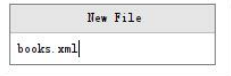
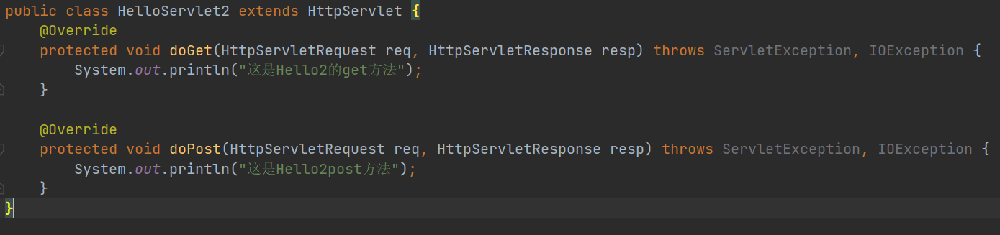
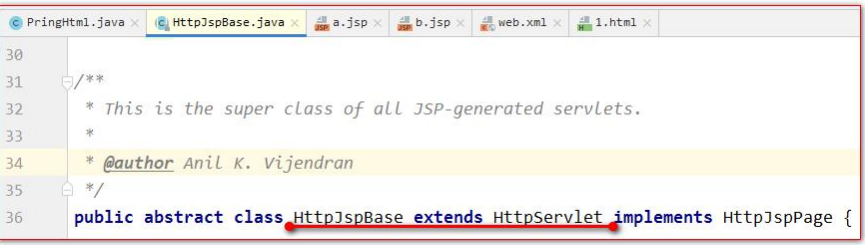
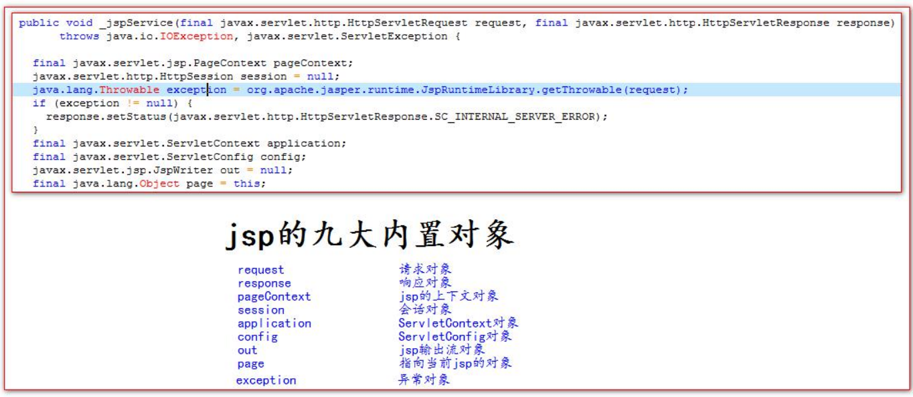
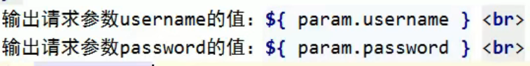
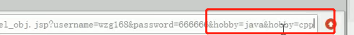

JaveWeb很重要，这份笔记留下复习....

# HTML文件的书写规范


<！--这是HTML的注释，可以在页面右键查看源代码看到-->

# **HTML** **标签介绍**

1.标签的格式: 

<标签名>封装的数据</标签名> 

2.标签名大小写不敏感。 

3.标签拥有自己的属性。 

i. 分为基本属性：bgcolor=*"red"*                   可以修改简单的样式效果 

ii. 事件属性： onclick="alert('你好！');"       可以直接设置事件响应后的代码。 

***注意属性必须有值，属性值必须加引号***

4.标签又分为，单标签和双标签。 

i. 单标签格式： <标签名 /> br 换行 hr 水平线 

ii. 双标签格式: <标签名> ...封装的数据...</标签名>

# 常用标签介绍

## font字体标签

*font* *标签是字体标签**,**它可以用来修改文本的字体**,**颜色**,**大小**(**尺寸*) 

*color* *属性修改颜色* 

*face* *属性修改字体* 

*size* *属性修改文本大小*

<**font** **color**="red" **face**="宋体" **size**="7"**>我是字体标签</**font>

## 特殊字符

有些特殊字符在html中不可以特别单独使用，所以我们需要用转义字符


要输入直接在body中用就行了

## 标题标签

标题标签是h1到h6的，就像是这个软件的标题

里面还有很多属性比如

*align* *属性是对齐属性* 

*left* 左对齐**(**默认)

*center* 居中

*right* *右对齐*


## 超链接

在网页中所有点击之后可以跳转的内容都是超链接

*a* *标签是 超链接* ，下面是它的属性

*href* *属性设置连接的地址* 

*target* *属性设置哪个目标进行跳转*

可以给target赋两个值

（1） *_self* *表示当前页面**(**默认值)* 

*（2）_blank* *表示打开新页面来进行跳转*


## 列表标签

ul是无序列表 type属性可以修改列表项前面的符号

li是列表项，可以填内容

## img图片标签

*src* *属性可以设置图片的路径* 

*width* *属性设置图片的宽度* 

*height* *属性设置图片的高度* 

*border* *属性设置图片边框大小* 

*alt* *属性设置当指定路径找不到图片时**,**用来代替显示的文本内容*

在web中分为相对路径和绝对路径两种

**相对路径：**

.                          表示当前文件所在的目录

..                         表示当前文件所在的上一级目录

文件名                表示当前文件所在目录的文件，相当于./文件名

**绝对路径：**

*正确格式是**: http://ip:port/**工程名**/**资源路径*


## 表格标签

**table标签是表格标签**

border 设置表格边框

width 设置表格宽度 

height 设置表格高度 

align 设置表格相对于页面的对齐方式

cellspacing 设置单元格间距

tr 是行标签 

th 是表头标签 

td 是单元格标签 

align 设置单元格文本对齐方式 


## 跨行跨列表格

colspan 属性设置跨列 

rowspan 属性设置跨行

```html
<table width="500" height="500" cellspacing="0" border="1">
    <tr>
        <td colspan="2">1.1</td>
        <td>1.3</td>
        <td>1.4</td>
        <td>1.5</td>
    </tr>
    <tr>
        <td rowspan="2">2.1</td>
        <td>2.2</td>
        <td>2.3</td>
        <td>2.4</td>
        <td>2.5</td>
    </tr>
    <tr>
        <td>3.2</td>
        <td>3.3</td>
        <td>3.4</td>
        <td>3.5</td>
    </tr>
    <tr>
        <td>4.1</td>
        <td>4.2</td>
        <td>4.3</td>
        <td colspan="2" rowspan="2">4.4</td>
    </tr>
    <tr>
        <td>5.1</td>
        <td>5.2</td>
        <td>5.3</td>
    </tr>
</table>
```


## **了解** **iframe** **框架标签** (内嵌窗口)


## 表单标签

表单就是html页面中，用来收集用户信息的所有元素集合，然后把这些元素信息发送给服务器，比如注册页面那种

**form**标签就是表单

input type=text                          是文件输入框					 value 设置默认显示内容 

input type=password               是密码输入框 					value 设置默认显示内容 

input type=radio                       是单选框 							name 属性可以对其进行分组   checked="checked"表示默认选中哪个

input type=checkbox                是复选框 							checked="checked"表示默认选中 

input type=reset                        是重置按钮 value    			属性修改按钮上的文本 

input type=submit                     是提交按钮 value     		 属性修改按钮上的文本 

input type=button                     是按钮 value 					属性修改按钮上的文本 

input type=file                            是文件上传域 

input type=hidden                     是隐藏域 当我们要发送某些信息，而这些信息，不需要用户参与，就可以使用隐藏域（提交的时候同时发送给服务器） 

select 标签                                   是下拉列表框 

option 标签                                  是下拉列表框中的选项 selected="selected"设置默认选中 

textarea标签                              多行文本输入框 （起始标签和结束标签中的内容是默认值） 

​                rows 属性设置可以显示几行的高度 

​                cols 属性设置每行可以显示几个字符宽度 


为了使它对齐，我们可以使用表格标签

```html
<form><h1 align="center">用户注册</h1><!--h1是标题标签-->
    <table align="center">
        <tr>
            <td> 用户名称：</td>
            <td><input type="text" value="默认值"/></td>
        </tr>
        <tr>
            <td> 用户密码：</td>
            <td><input type="password" value="abc"/></td>
        </tr>
        <tr>
            <td>确认密码：</td>
            <td><input type="password" value="abc"/></td>
        </tr>
        <tr>
            <td>性别：</td>
            <td><input type="radio" name="sex"/>男 <input type="radio" name="sex" checked="checked"/>女</td>
        </tr>
        <tr>
            <td> 兴趣爱好：</td>
            <td><input type="checkbox" checked="checked"/>Java <input type="checkbox"/>JavaScript <input
                    type="checkbox"/>C++
            </td>
        </tr>
        <tr>
            <td>国籍：</td>
            <td><select>
                <option>--请选择国籍--</option>
                <option selected="selected">中国</option>
                <option>美国</option>
                <option>小日本</option>
            </select></td>
        </tr>
        <tr>
            <td>自我评价：</td>
            <td><textarea rows="10" cols="20">我才是默认值</textarea></td>
        </tr>
        <tr>
            <td><input type="reset"/></td>
            <td align="center"><input type="submit"/></td>
        </tr>
    </table>
</form>
```

### 表单提交细节

form 标签是表单标签 

**action 属性设置提交的服务器地址** 

method 属性设置提交的方式 GET(默认值)或 POST 

#### 表单提交的时候，数据没有发送给服务器的三种情况： 

1、表单项没有 name 属性值 

2、单选、复选（下拉列表中的 option 标签）都需要添加 value 属性，以便发送给服务器 

3、表单项不在提交的 form 标签中 

## GET 请求的特点是： 

1、浏览器地址栏中的地址是：action 属性[+?+请求参数] 请求参数的格式是：name=value&name=value 

2、不安全 

3、它有数据长度的限制 

## POST 请求的特点是： 

1、浏览器地址栏中只有 action 属性值 

2、相对于 GET 请求要安全 

3、理论上没有数据长度的限制 

```html
<form action="http://localhost:8080" method="post"><input type="hidden" name="action" value="login"/>
    <h1 align="center">用户注册</h1>
    <table align="center">
        <tr>
            <td> 用户名称：</td>
            <td><input type="text" name="username" value="默认值"/></td>
        </tr>
        <tr>
            <td> 用户密码：</td>
            <td><input type="password" name="password" value="abc"/></td>
        </tr>
        <tr>
            <td>性别：</td>
            <td><input type="radio" name="sex" value="boy"/>男 <input type="radio" name="sex" checked="checked" value="girl"/>女
            </td>
        </tr>
        <tr>
            <td> 兴趣爱好：</td>
            <td>
                <input name="hobby" type="checkbox" checked="checked" value="java"/>Java <input name="hobby"  type="checkbox"
                                                                                                value="js"/>JavaScript
                <input name="hobby" type="checkbox" value="cpp"/>C++
            </td>
        </tr>
        <tr>
            <td>国籍：</td>
            <td><select name="country">
                <option value="none">--请选择国籍--</option>
                <option value="cn" selected="selected">中国</option>
                <option value="usa">美国</option>
                <option value="jp">小日本</option>
                </select></td>
        </tr>
        <tr>
            <td>自我评价：</td>
            <td><textarea name="desc" rows="10" cols="20">我才是默认值</textarea></td>
        </tr>
        <tr>
            <td><input type="reset"/></td>
            <td align="center"><input type="submit"/></td>
        </tr>
    </table>
</form>
```

## div span p 标签

div 标签 默认独占一行 

span 标签 它的长度是封装数据的长度 

p 段落标签 默认会在段落的上方或下方各空出一行来（如果已有就不再空） 


# CSS技术介绍

CSS 是「层叠样式表单」。是用于(增强)控制网页样式并允许将样式信息与网页内容分离的一种标记性语言。

# CSS语法规则


采用键值对的方式

**选择器**：浏览器根据“选择器”决定受 CSS 样式影响的 HTML 元素（标签）。

 **属性** (property) 是你要改变的样式名，并且每个属性都有一个值。属性和值被冒号分开，并 由花括号包围，这样就组成了一个完整的样式声明（declaration），例如：p {color: blue} 

**多个声明**：（大括号中的语句就是声明）如果要定义不止一个声明，则需要用分号将每个声明分开。虽然最后一条声明的 最后可以不加分号(但尽量在每条声明的末尾都加上分号)

CSS的注释是/* 我是块注释  */

# CSS和HTML的结合方式

## 第一种

**在标签的style属性上设置"key:value value;",修改标签样式**

```css
<div 
     style="border: 1px solid red;">div标签1
</div>
```

*这种方法是在body里面写的*

这种方法的*缺点*是

1.如果标签多了，样式多了，代码量庞大

2.可读性非常差

3.CSS代码没什么复用性

## 第二种

**在head标签中，使用style标签来定义自己需要的CSS样式**

格式如下

xxx{

key: value value;

}

这种方法是在head里面写的，利用style标签

```css
<style type="text/css">/*这个type是默认的*/
/* 需求 1：分别定义两个 div、span 标签，分别修改每个 div 标签的样式为：边框 1 个像素，实线，红色。*/
div{
border: 1px solid red;
}
span{
border: 1px solid red;
}
</style>
```


这种方法的缺点

1.只能在同一页面内复用代码，不能在多个页面

2.维护起来不方便，实际的项目会有成千上万的页面，要到每个页面去修改，工作量太大

## 第三种

**把css样式写成一个单独的css文件，再通过link标签引入即可完成复用**（***注意要引入到head***）

**使用 html 的  **

```css
<link rel="stylesheet" type="text/css" href="1.css"/>
```

**标签 导入 css 样 式文件**

href是导入的哪个css文件，这个是导入的名为1.css的文件


# CSS选择器

选择器CSS选择器**用于选择你想要的元素的样式的模式**标签名选择器

下面介绍几种常用的选择器

## 1.标签名选择器

格式为：

标签名{

属性：值;

}

标签名选择器，可以决定哪些标签使用这个样式


## 2.id选择器

id选择器的格式是：

#id属性值{

属性：值；

}

id选择器，可以让我们通过id属性选择性的去使用这个样式

```css
<html>
<head>
    <meta charset="UTF-8">
    <title>ID 选择器</title>
    <style type="text/css">
        #id001{
            color: blue;
            font-size: 30px;
            border: 1px yellow solid;
        }
        #id002{
            color: red;
            font-size: 20px;
            border: 5px blue dotted ;
        }
    </style>
</head>
<body>
<!-- 需求 1：分别定义两个 div 标签，
第一个 div 标签定义 id 为 id001 ，然后根据 id 属性定义 css 样式修改字体颜色为蓝色，
字体大小 30 个像素。边框为 1 像素黄色实线。
第二个 div 标签定义 id 为 id002 ，然后根据 id 属性定义 css 样式 修改的字体颜色为红色，字体大小 20 个像素。
边框为 5 像素蓝色点线。
-->
<div id="id002">div 标签 1</div>
<div id="id001">div 标签 2</div>
</body>
</html>
```

## 3.class选择器

class类型选择器的格式是:

.class{

属性值：值;

}

class类型选择器，可以通过class属性有效的选择去使用这个样式

```css
<html>
<head>
    <meta charset="UTF-8">
    <title>class 类型选择器</title>
    <style type="text/css">
        .class01{
            color: blue;
            font-size: 30px;
            border: 1px solid yellow;
        }
        .class02{
            color: grey;
            font-size: 26px;
            border: 1px solid red;
        }
    </style>
</head>
<body>
<!--需求 1：修改 class 属性值为 class01 的 span 或 div 标签，字体颜色为蓝色，字体大小 30 个像素。边框为 1 像素黄色实线。
需求 2：修改 class 属性值为 class02 的 div 标签，字体颜色为灰色，字体大小 26 个像素。边框为 1 像素红色实线。
-->
<div class="class02">div 标签 class01</div>
<div class="class02">div 标签</div>
<span class="class02">span 标签 class01</span>
<span>span 标签 2</span>
</body>
</html>
```

## 4.组合选择器

组合选择器的格式是： 选择器 1，选择器 2，选择器 n{ 

属性：值; 

}

组合选择器可以让多个选择器公用同一个样式

**注意，是并集的关系**

```css
<html>
<head>
<meta charset="UTF-8">
<title>class 类型选择器</title>
<style type="text/css">
.class01 , #id01{
color: blue;
font-size: 20px;
border: 1px yellow solid;
}
</style>
</head>
<body>
<!-- 修改 class="class01" 的 div 标签 和 id="id01" 所有的 span 标签，
字体颜色为蓝色，字体大小 20 个像素。边框为 1 像素黄色实线。
-->
<div id="id01">div 标签 class01</div> <br />
<span >span 标签</span> <br />
<div>div 标签</div> <br />
<div>div 标签 id01</div> <br />
</body>
</html>
```

# 常用样式

## 1.字体颜色

color:red;

颜色可以写颜色名如：black, blue, red, green 等 

颜色也可以写 rgb 值和十六进制表示值：如 rgb(255,0,0)，#00F6DE，如果写十六进制值必 须加#

## 2.宽度

width：19px;

宽度可以写像素值：19px

也可以写百分比值：20%

## 3.高度

height：20px；

和宽度一样

高度可以写像素值：19px

也可以写百分比值：20%

## 4.背景颜色

background_color：#0F2D4C

## 5.字体样式

color:#FF0000；字体颜色

font-size：20px；字体大小

## 6.边框

border：1px solid red;

## 7.框框居中

margin-left: auto; 

margin-right: auto

auto代表样式自动适应；margin代表边距，

margin-right:auto和margin-left:auto意思是左右边距自动适应；

## 8.文本居中

text-align：center

## 9.超链接去下划线

text-decoration：none；

decoration装潢；装饰品；勋章；奖章

## 10.表格细线

table {

 border: 1px solid black; /*设置边框*/

 border-collapse: collapse; /*将边框合并*/

 } 

collapse崩溃；折叠；坍塌；暴跌

td,th {

 border: 1px solid black; /*设置边框*/

}

## 11.列表去除修饰

ul{

list-style:none;

}

原本ul列表是


这个样子

用过便会让前面的符号去掉

```javascript
<!DOCTYPE html>
<html lang="en">
<head>
    <meta charset="UTF-8">
    <title>Title</title>
    <script type="text/javascript">
        // 定义一个无参函数
        function fun(){
            alert("无参函数 fun()被调用了");
        }
        // 函数调用===才会执行
        // fun();
        function fun2(a ,b) {
            alert("有参函数 fun2()被调用了 a=>" + a + ",b=>"+b);
        }
        // fun2(12,"abc");
        // 定义带有返回值的函数
        function sum(num1,num2) {
            var result = num1 + num2;
            return result;
        }
        alert( sum(100,50) );
    </script>
</head>
<body>
</body>
</html>
```

# JavaScript介绍

JavaScript语言诞生主要是完成页面的数据验证，因此它运行在客户端，需要运行浏览器来解析执行JavaScript代码

**JS是弱类型，Java是强类型**

特点：

1.交互性（信息的动态交互）

2.安全性（不允许直接访问本地硬盘）

3.跨平台性（只要是可以解释JS的浏览器都可以执行，和平台无关）

# JavaScript和html代码的结合方式

## 第一种方式

**只需要在head标签中，或者在body标签中，使用*script标签*来书写JavaScript代码**

```javascript
<!DOCTYPE html>
<html lang="en">
<head>
<meta charset="UTF-8">
<title>Title</title>
<script type="text/javascript">
        // alert 是 JavaScript 语言提供的一个警告框函数。
        // 它可以接收任意类型的参数，这个参数就是警告框的提示信息
        alert("hello javaScript!");
</script>
</head>
<body>
</body>
</html>
```

这个是写在头部的，body没有东西

## 第二种方式

**使用 script 标签引入 单独的 JavaScript 代码文件**


```javascript
<!DOCTYPE html>
<html lang="en">
<head>
<meta charset="UTF-8">
<title>Title</title>
<script type="text/javascript" src="1.js"></script>
<script type="text/javascript">
alert("胥天昊爱你~");
</script>
</head>
<body>
</body>
</html>
```

src 属性专门用来引入 js 文件路径（可以是相对路径，也可以是绝对路径）
script 标签可以用来定义 js 代码，也可以用来引入 js 文件

# 变量

变量是可以存放某些值的内存的命名

## JavaScript的变量类型

|            |          |
| ---------- | -------- |
| 数值类型   | number   |
| 字符串类型 | string   |
| 对象类型   | object   |
| 布尔类型   | boolean  |
| 函数类型   | function |

## JavaScript里特殊的值

|           |                                                           |
| --------- | --------------------------------------------------------- |
| undefined | 未定义，所有js变量为赋于初始值的时候，默认值都是undefined |
| null      | 空值                                                      |
| NaN       | Not A Number 非数字非数值                                 |

## JS种的定义变量格式

var 变量名；

var 变量名=值；

# 关系（比较）运算

等于： == 等于是简单的做字面值的比较

全等于： === 除了做字面值的比较之外，还会比较两个变量的数据类型

# 逻辑运算

&& 且运算（和Java中略有不同）

 第一种：当表达式全为真的时候。返回最后一个表达式的值。

 第二种：当表达式中，有一个为假的时候。返回第一个为假的表达式的值 

|| 或运算 （和Java中略有不同）

第一种情况：当表达式全为假时，返回最后一个表达式的值

第二种情况：只要有一个表达式为真。就会返回第一个为真的表达式的值 

并且 && 与运算 和 ||或运算 有短路。 

短路就是说，当这个&&或||运算有结果了之后 。后面的表达式不再执行

# 数组

## 数组定义方式

**格式：**

var 数组名 = []; // 空数组

var 数组名 = [1 , ’abc’ , true]; // 定义数组同时赋值元素

 **javaScript 语言中的数组，只要我们通过数组下标赋值，那么最大的下标值，就会自动的给数组做扩容操作。**

数组还可以使用.length属性，来遍历数组

# 函数

## 函数的两种定义方式

### 第一种，可以用function关键字来定义函数

格式：

function 函数名(形参列表){

函数体

}

如果需要返回值，直接在函数体内使用return语句返回值即可

```javascript
<!DOCTYPE html>
<html lang="en">
<head>
    <meta charset="UTF-8">
    <title>Title</title>
    <script type="text/javascript">
        // 定义一个无参函数
        function fun(){
            alert("无参函数 fun()被调用了");
        }

        // 函数调用===才会执行
        // fun();
        function fun2(a ,b) {
            alert("有参函数 fun2()被调用了 a=>" + a + ",b=>"+b);
        }
        // fun2(12,"abc");
        // 定义带有返回值的函数
        function sum(num1,num2) {
            var result = num1 + num2;
            return result;
        }
        alert( sum(100,50) );
    </script>
</head>
<body>
</body>
</html>
```

**函数只有在script块中被调用才会被执行**

### 第二种定义方式

格式如下：

var 函数名 = function(形参列表){函数体}

```javascript
<!DOCTYPE html>
<html lang="en">
<head>
    <meta charset="UTF-8">
    <title>Title</title>
    <script type="text/javascript">
        var fun = function () {
            alert("无参函数");
        }
        // fun();
        var fun2 = function (a,b) {
            alert("有参函数 a=" + a + ",b=" + b);
        }
        // fun2(1,2);
        var fun3 = function (num1,num2) {
            return num1 + num2;
        }
        alert( fun3(100,200) );
    </script>
</head>
<body>
</body>
</html>
```

注：**在 Java 中函数允许重载。但是在 JS 中函数的重载会直接覆盖掉上一次的定义**

这两种函数定义的方式其实是差不多的，只是变量名和参数的位置不一样了

## 函数的arguments隐形参数（只在function函数内）

就是在function函数种不需要定义，但却可以直接用来获取所有参数的变量，我们管他叫隐形参数，像java中的变长数组

public void fun( Object ... args ); 

可变长参数是一个数组。

那么 js 中的隐形参数也跟 java的可变长参数一样，操作类似数组

# JS中的自定义对象

## 第一种

**对象的定义：**

var 变量名=new Object();         //对象实例（空对象）

变量名.属性名=值；                  //定义一个属性

变量名.函数名=function(){}      //定义一个函数

**对象的访问：**

变量名.属性/函数名(参数)；

```javascript
<!DOCTYPE html>
<html lang="en">
<head>
<meta charset="UTF-8">
<title>Title</title>
<script type="text/javascript">
// 对象的定义：
// var 变量名 = new Object(); // 对象实例（空对象）
// 变量名.属性名 = 值; // 定义一个属性
// 变量名.函数名 = function(){} // 定义一个函数
var obj = new Object();
obj.name = "郭瑶瑶~";
obj.age = 18;
obj.fun = function () {
alert("姓名：" + this.name + " , 年龄：" + this.age);
}
// 对象的访问：
// 变量名.属性 / 函数名();
// alert( obj.age );
obj.fun();
</script>
</head>
<body>
</body>
</html>

```

## 第二种

{}花括号形式的自定义对象

对象的定义：

var 变量名={

属性名：值，//注意是冒号和逗号

函数名：function(){}   //定义一个函数（如果后面没有属性了不要再加逗号了）

}

```javascript
<!DOCTYPE html>
<html lang="en">
<head>
<meta charset="UTF-8">
<title>Title</title>
<script type="text/javascript">
// 对象的定义：
// var 变量名 = { // 空对象
// 属性名：值, // 定义一个属性
// 属性名：值, // 定义一个属性
// 函数名：function(){} // 定义一个函数
// };
var obj = {
name:"郭瑶瑶~",
age:18,
fun : function () {
alert("姓名：" + this.name + " , 年龄：" + this.age);
}
};
// 对象的访问：
// 变量名.属性 / 函数名();
alert(obj.name);
obj.fun();
</script>
</head>
<body>
</body>
</html>
```

# JS中的事件

**事件就是电脑输入设备与页面进行交互的相应**


**常用的事件：**

onload 加载完成事件： 

页面加载完成之后，常用于做页面 js 代码初始化操作


onclick 单击事件： 

常用于按钮的点击响应操作。


onblur 失去焦点事件：

 常用用于输入框失去焦点后验证其输入内容是否合法。


onchange 内容发生改变事件： 

常用于下拉列表和输入框内容发生改变后操作


onsubmit 表单提交事件： 

常用于表单提交前，验证所有表单项是否合法

## 事件的注册（绑定）

**注册是告诉浏览器，当事件响应后要执行哪些操作代码，叫事件注册或事件绑定**

事件的注册又分为静态注册和动态注册两种（注册也叫绑定）

静态注册事件：通过 html 标签的事件属性直接赋于事件响应后的代码，这种方式我们叫静态注册。 

动态注册事件：是指先通过 js 代码得到标签的 dom 对象，然后再通过 dom 对象.事件名 = function(){} 这种形式赋于事件 响应后的代码，叫动态注册。

 动态注册基本步骤： 

1、获取标签对象 

2、标签对象.事件名 =function(){}

## onload加载完成事件

onload 事件是浏览器解析完页面之后就会自动触发的事件

静态注册


改良版静态注册


动态注册

onload 事件动态注册。是固定写法


## onclick 单击事件

静态注册


动态注册


## onblur事件

onblur 失去焦点事件：

常用用于输入框失去焦点后验证其输入内容是否合法。

静态注册


动态注册


## onchange事件

onchange 内容发生改变事件： 

常用于下拉列表和输入框内容发生改变后操作


静态注册


动态注册


## onsubmit表单提交事件

onsubmit 表单提交事件： 

常用于表单提交前，验证所有表单项是否合法


静态注册


动态注册


# DOM模型

## DOM介绍

DOM全称是Document Object Model 文档对象模型

意思就是**把文档中的标签 属性 文本 转换成对象来管理** （注意还有文本哦）


Document对象的理解：

1. 它管理了所有的HTML文档内容
2. 它是一种树结构的文档，有层级关系
3. 它让我们把所有的标签都对象化
4. 我们可以通过它访问所有的标签对象


## Document对象中的方法介绍

1. **document.getElementById(elementId)** 

   通过标签的 id 属性查找标签 dom 对象，elementId 是标签的 id 属性值

2. **document.getElementsByName(elementName)**

   通过标签的 name 属性查找标签 dom 对象，elementName 标签的 name 属性值

3. **document.getElementsByTagName(tagname)**

   通过标签名查找标签 dom 对象。tagname 是标签名

4. **document.createElement( tagName)**

   通过给定的标签名，创建一个标签对象，tagName是要创建的标签名

document 对象的三个查询方法，如果有 id 属性，优先使用 getElementById 方法来进行查询 如果没有 id 属性，则优先使用 getElementsByName 方法来进行查询 如果 id 属性和 name 属性都没有最后再按标签名查 getElementsByTagNam

以上三个方法，一定要在页面加载完成之后执行，才能查询到标签对象

### getElementById 方法示例代码

**document.getElementById(elementId)** 

通过标签的 id 属性查找标签 dom 对象，elementId 是标签的 id 属性值


如果要插入图片，可以把usernameSpanObj.innerHTML="里面是img标签"

### getElementsByName 方法示例代码

**document.getElementsByName(elementName)**

通过标签的 name 属性查找标签 dom 对象，elementName 标签的 name 属性值


这个示例是实现三个按钮，实现全选，全不选，反选

```javascript
<!DOCTYPE html>
<html lang="en">
<head>
    <meta charset="UTF-8">
    <title>Title</title>
    <script>
        function checkAll() {
            var hobbies=document.getElementsByName("hobby");
            for (var i = 0; i < hobbies.length; i++) {
                hobbies[i].checked=true;
            }
        }
        function checkNo() {
            var hobbies=document.getElementsByName("hobby");
            for (var i = 0; i < hobbies.length; i++) {
                hobbies[i].checked=false;
            }
        }
        function checkReverse() {
            var hobbies=document.getElementsByName("hobby");
            for (var i = 0; i < hobbies.length; i++) {
                hobbies[i].checked=!hobbies[i].checked;
            }
        }
    </script>
</head>
<body>
<input type="checkbox" name="hobby" value="cpp" checked="checked">C++
<input type="checkbox" name="hobby" value="java">Java
<input type="checkbox" name="hobby" value="js">JavaScript
<br/>
<button onclick="checkAll()">全选</button>
<button onclick="checkNo()">全不选</button>
<button onclick="checkReverse()">反选</button>
</body>
</html>
```

### getElementsByTagName 方法示例代码

**document.getElementsByTagName(tagname)**

通过标签名查找标签 dom 对象。tagname 是标签名

```javascript
<!DOCTYPE html>
<html lang="en">
<head>
    <meta charset="UTF-8">
    <title>Title</title>
    <script type="text/javascript">
        // 全选
        function checkAll() {
            // document.getElementsByTagName("input");
            // 是按照指定标签名来进行查询并返回集合
            // 这个集合的操作跟数组 一样
            // 集合中都是 dom 对象
            // 集合中元素顺序 是他们在 html 页面中从上到下的顺序。
            var inputs = document.getElementsByTagName("input");
            for (var i = 0; i < inputs.length; i++) {
                inputs[i].checked = true;
            }
        }
    </script>
</head>
<body>
兴趣爱好：
<input type="checkbox" value="cpp" checked="checked">C++
<input type="checkbox" value="java">Java
<input type="checkbox" value="js">JavaScript
<br/>
<button onclick="checkAll()">全选</button>
</body>
</html>
```

### createElement 方法示例代码

**document.createElement( tagName)**

通过给定的标签名，创建一个标签对象，tagName是要创建的标签名

```
现在需要我们使用 js 代码来创建 html 标签，并显示在页面上
```

```javascript
<!DOCTYPE html>
<html lang="en">
<head>
    <meta charset="UTF-8">
    <title>Title</title>
    <script type="text/javascript">
        window.onload = function () {
            // 标签的内容就是：<div>瑶瑶~我想你啦</div>
            var divObj = document.createElement("div"); //在内存中 <div></div>
            var textNodeObj = document.createTextNode("瑶瑶~我想你啦"); // 创建一个文本节点对象
            divObj.appendChild(textNodeObj); // 把文本节点对象添加进入div标签的子类
            document.body.appendChild(divObj);//把body添加一个div子类，这个是dom里面的属性哦
        }
    </script>
</head>
<body>
<!--就是我就是我-->
</body>
</html>
```

## 节点常用属性和方法

节点就是标签对象

### 方法

这些方法要通过具体的元素节点调用 

**getElementsByTagName() 方法**

获取当前节点的指定标签名孩子节点 

**appendChild( oChildNode ) 方法**

可以添加一个子节点，oChildNode 是要添加的孩子节点

### 属性

**childNodes**                                               获取当前节点的所有子节点

**fristChild**                                                   获取当前节点的第一个子节点

**lastChild**                                                    获取当前节点的最后一个子节点

**parentNode**                                             获取当前节点的父节点

**nextSibling**                                               获取当前节点的下一个节点（同级哦）

**previousSibling**                                       获取当前节点的上一个节点

**className**                                               获取或设置标签的class属性值

**innerHTML**                                              获取/设置起始标签和结束标签中的内容

**innerText**                                                 获取/设置起始标签和结束标签中的文本

# jQuery介绍

**jQuery，也就是JavaScript和查询（query），它是辅助JavaScript开发的js类库**

**jQuery的核心思想是write less，do more（写的更少 做的更多），所以它实现了很多浏览器的兼容问题**


要用首先得导入这些


和引入src


之后就可以用啦

# jQuery和原生方法的比较


**注意DOM方法和jQuery方法传入的参数不是相同的哦**

# jQuery核心函数

$是jQuery的核心函数，能完成jQuery的很多功能，$()就是调用这个核心函数

**1.传入参数为【函数】时：**

表示页面加载完成之后，相当于window.onload=function(){}

**2.传入参数为【HTML字符串】时**：

会为我们创建这个HTML标签

**3.传入参数为【选择器字符串】时：**

$("#id属性名")；   id选择器，根据id查询标签对象

$("标签名");           标签名选择器，根据指定的标签名查询标签对象

$(".class属性值")   类型选择器，可以根据class属性查询标签对象

**4.传入参数为【DOM对象】时：**

会把这个DOM对象转换为jQuery对象

# jQuery对象与DOM对象区分

| DOM对象                                                    |
| ---------------------------------------------------------- |
| 1.通过 getElementById()查询出来的标签对象是 Dom 对象       |
| 2.通过 getElementsByName()查询出来的标签对象是 Dom 对象    |
| 3.通过 getElementsByTagName()查询出来的标签对象是 Dom 对象 |
| 4.通过 createElement() 方法创建的对象，是 Dom 对象         |

**DOM 对象 Alert 出来的效果是：[object HTML 标签名**]

| jQuery对象                                    |
| --------------------------------------------- |
| 1.通过jQuery提供的API创建的对象，是jQuery对象 |
| 2.通过jQuery包装的DOM对象，也是jQuery对象     |
| 3.通过jQuery提供API查询到的对象，是jQuery对象 |

**jQuery 对象 Alert 出来的效果是：[object Object]**

## jQuery对象的本质

jQuery对象是DOM对象的数组+jQuery提供的一系列功能函数

## jQuery 对象和 Dom 对象使用

jQuery 对象不能使用 DOM 对象的属性和方法

DOM 对象也不能使用 jQuery 对象的属性和方法

## Dom 对象和 jQuery 对象互转

**1.DOM转化为jQuery**

（1）现有DOM对象

（2）$(DOM对象)就可以转换成为jQuery对象

**2.jQuery转化为DOM**

（1）现有jQuery对象

（2）jQuery对象[下标]取出相应的DOM对象

# jQuery选择器

## 1.基本选择器

\#ID 选择器：根据 id 查找标签对象

 .class 选择器：根据 class 查找标签对象 

element 选择器：根据标签名查找标签对象 

*选择器：表示任意的，所有的元素 

selector1，selector2 组合选择器：合并选择器 1，选择器 2的结果并返回


**组合eg：** 

p,.myClass 表示标签名必须是p标签 而且class类型还要是myClass

//这个要和css的区分开，这个是取的并集，两个都要满足


## 2.层级选择器

1.ancestor descendant 后代选择器 ：在给定的祖先元素下匹配所有的后代元素 

2.parent > child 子元素选择器：在给定的父元素下匹配所有的子元素 ,（注意子元素和后代元素不一样）

3.prev + next 相邻元素选择器：匹配所有紧接在 prev 元素后的 next 元素（同级的）

4.prev ~ sibings 之后的兄弟元素选择器：匹配 prev 元素之后的所有 siblings 元素（同级的）

```javascript
            //1.选择 body 内的所有 div 元素
            $("#btn1").click(function(){
                $("body div").css("background", "#bbffaa");
            });

            //2.在 body 内, 选择div子元素
            $("#btn2").click(function(){
                $("body > div").css("background", "#bbffaa");
            });

            //3.选择 id 为 one 的下一个 div 元素
            $("#btn3").click(function(){
                $("#one+div").css("background", "#bbffaa");
            });

            //4.选择 id 为 two 的元素后面的所有 div 兄弟元素
            $("#btn4").click(function(){
                $("#two~div").css("background", "#bbffaa");
            });
            //btn1...都是按钮的id，得到的都是jQuery对象
```

## 3.过滤选择器（挑选出来的对象再进一步筛选）

### 基本过滤器

这些都不考虑父子标签

| 基本过滤器     |                                                        |
| -------------- | ------------------------------------------------------ |
| :first         | 获取第一个元素                                         |
| :last          | 获取最后一个元素                                       |
| :not(selector) | 去除所有与给定选择器匹配的元素（这个比较复杂）         |
| :even          | 匹配所有索引值为偶数的元素，从0开始计数                |
| :odd           | 匹配所有索引值为奇数的元素，从0开始计数                |
| :eq(index)     | 匹配一个给定索引值的元素                               |
| :gt(index)     | 匹配所有大于给定索引值的元素（指的是筛选出再重新排序） |
| :lt(index)     | 匹配所有小于给定索引值的元素                           |
| :header        | 匹配标题元素                                           |
| :animate       | 匹配所有正在执行动画效果的元素                         |

```javascript
//1.选择第一个 div 元素
            $("#btn1").click(function(){
                $("div:first").css("background", "#bbffaa");
            });

            //2.选择最后一个 div 元素
            $("#btn2").click(function(){
                $("div:last").css("background", "#bbffaa");
            });

            //3.选择class不为 one 的所有 div 元素
            $("#btn3").click(function(){
                $("div:not(.one)").css("background", "#bbffaa");
            });

            //4.选择索引值为偶数的 div 元素
            $("#btn4").click(function(){
                $("div:even").css("background", "#bbffaa");
            });

            //5.选择索引值为奇数的 div 元素
            $("#btn5").click(function(){
                $("div:odd").css("background", "#bbffaa");
            });

            //6.选择索引值为大于 3 的 div 元素
            $("#btn6").click(function(){
                $("div:gt(3)").css("background", "#bbffaa");
            });

            //7.选择索引值为等于 3 的 div 元素
            $("#btn7").click(function(){
                $("div:eq(3)").css("background", "#bbffaa");
            });

            //8.选择索引值为小于 3 的 div 元素
            $("#btn8").click(function(){
                $("div:lt(3)").css("background", "#bbffaa");
            });

            //9.选择所有的标题元素
            $("#btn9").click(function(){
                $(":header").css("background", "#bbffaa");
            });

            //10.选择当前正在执行动画的所有元素
            $("#btn10").click(function(){
                $(":animated").css("background", "#bbffaa");
            });
            //11.选择没有执行动画的最后一个div
            $("#btn11").click(function(){
                $("div:not(:animated):last").css("background", "#bbffaa");
            });
```

### 内容过滤器

注意JavaScript中单引号和双引号的意思是一样的

| 内容过滤器：    |                                      |
| --------------- | ------------------------------------ |
| :contains(text) | 匹配包含给定文本的元素               |
| :empty          | 匹配所有不包含子元素或者文本的空元素 |
| :parent         | 匹配含有子元素或者文本的元素         |
| :has(selector)  | 匹配含有选择器所匹配的元素的元素     |

```JavaScript
				//1.选择 含有文本 'di' 的 div 元素
				$("#btn1").click(function(){
					$("div:contains('di')").css("background", "#bbffaa");
				});
				//2.选择不包含子元素(或者文本元素) 的 div 空元素
				$("#btn2").click(function(){
					$("div:empty").css("background", "#bbffaa");
				});
				//3.选择含有子元素(或者文本元素)的div元素
				$("#btn4").click(function(){
					$("div:parent").css("background", "#bbffaa");
				});
				//4.选择含有 class 为 mini 元素的 div 元素
				$("#btn3").click(function(){
					$("div:has(.mini)").css("background", "#bbffaa");
				});
```

### 属性过滤器

这里的属性，指的是标签的属性

attribute  属性；象征

| 属性过滤器：                     |                                                              |
| -------------------------------- | ------------------------------------------------------------ |
| attribute                        | 匹配包含给定属性的元素                                       |
| attribute=value                  | 匹配给定的属性是某个特定值的元素                             |
| attribute!=value                 | 匹配所有不含有指定的属性，或者属性不等于特定值的元素         |
| attribute^=value                 | 匹配给定的属性是以某些值开始的元素                           |
| attribute$=value                 | 匹配给定的属性是以某些值结尾的元素                           |
| attribute*=value                 | 匹配给定的属性是以包含某些值的元素                           |
| \[attrSel1]\[attrSel2][attrSel3] | 复合属性选择器，需要同时满足多个条件时使用（也是都得满足的条件） |


```javascript
		//1.选取含有 属性title 的div元素
		$("#btn1").click(function() {
			$("div[title]").css("background", "#bbffaa");
		});
		//2.选取 属性title值等于'test'的div元素
		$("#btn2").click(function() {
			$("div[title='test']").css("background", "#bbffaa");
		});
		//3.选取 属性title值不等于'test'的div元素(*没有属性title的也将被选中)
		$("#btn3").click(function() {
			$("div[title!='test']").css("background", "#bbffaa");
		});
		//4.选取 属性title值 以'te'开始 的div元素
		$("#btn4").click(function() {
			$("div[title^='te']").css("background", "#bbffaa");
		});
		//5.选取 属性title值 以'est'结束 的div元素
		$("#btn5").click(function() {
			$("div[title$='est']").css("background", "#bbffaa");
		});
		//6.选取 属性title值 含有'es'的div元素
		$("#btn6").click(function() {
			$("div[title*='es']").css("background", "#bbffaa");
		});
		
		//7.首先选取有属性id的div元素，然后在结果中 选取属性title值 含有'es'的 div 元素
		$("#btn7").click(function() {
			$("div[id][title*='es']").css("background", "#bbffaa");
		});
		//8.选取 含有 title 属性值, 且title 属性值不等于 test 的 div 元素
		$("#btn8").click(function() {
			$("div[title][title!='test']").css("background", "#bbffaa");
		});
```

### 表单过滤器

| 表单过滤器: |                                                      |
| ----------- | ---------------------------------------------------- |
| :input      | 匹配所有 input, textarea, select 和 button 元素      |
| :text       | 匹配所有 文本输入                                    |
| :password   | 匹配所有的密码输入框                                 |
| :radio      | 匹配所有的单选框                                     |
| :checkbox   | 匹配所有的复选框                                     |
| :submit     | 匹配所有提交按钮                                     |
| :image      | 匹配所有 img 标签                                    |
| :reset      | 匹配所有重置按钮                                     |
| :button     | 匹配所有 input type=button 按钮                      |
| :file       | 匹配所有 input type=file 文件上传                    |
| :hidden     | 匹配所有不可见元素 display:none 或 input type=hidden |

| 表单对象属性过滤器 |                                                              |
| ------------------ | ------------------------------------------------------------ |
| :enabled           | 匹配所有可用元素                                             |
| :disabled          | 匹配所有不可用元素                                           |
| :checked           | 匹配所有选中的单选，复选，和下拉列表中选中的 option 标签对象 |
| :selected          | 匹配所有选中的option                                         |

```javascript
				//1.对表单内 可用的input 赋值操作
				$("#btn1").click(function(){
					// val()可以操作表单项的value属性值
					// 它可以设置和获取
					$(":text:enabled").val("我是万能的程序员");//也是并且的关系，都得满足
				});
				//2.对表单内 不可用的input 赋值操作
				$("#btn2").click(function(){
					$(":text:disabled").val("管你可用不可用，反正我是万能的程序员");
				});
				//3.获取多选框 选中 的个数  使用size()方法获取选取到的元素集合的元素个数
				$("#btn3").click(function(){
					alert( $(":checkbox:checked").length );
				});
				//4.获取多选框，每个选中的value值
				$("#btn4").click(function(){
					// 获取全部选中的复选框标签对象
					var $checkboies = $(":checkbox:checked");
					// 老式遍历
					// for (var i = 0; i < $checkboies.length; i++){
					// 	alert( $checkboies[i].value );
					// }

					// each方法是jQuery对象提供用来遍历元素的方法
					// 在遍历的function函数中，有一个this对象，这个this对象，就是当前遍历到的dom对象
					$checkboies.each(function () {
						alert( this.value );
					});
				});
				//5.获取下拉框选中的内容  
				$("#btn5").click(function(){
					// 获取选中的option标签对象
					var $options = $("select option:selected");//用了层级选择器
					// 遍历，获取option标签中的文本内容
					$options.each(function () {
						// 在each遍历的function函数中，有一个this对象。这个this对象是当前正在遍历到的dom对象
						alert(this.innerHTML);
					});
				});
```

# jQuery元素筛选

| jQuery 元素筛选 |                                                    |                               |
| --------------- | -------------------------------------------------- | ----------------------------- |
| eq()            | 获取给定索引的元素                                 | 功能跟eq一样                  |
| first()         | 获取第一个元素                                     | 功能跟first一样               |
| last()          | 获取最后一个元素                                   | 功能跟last一样                |
| filter(exp)     | 留下匹配的元素                                     |                               |
| is(exp)         | 判断是否匹配给定的选择器，只要有一个匹配就返回true |                               |
| has(exp)        | 返回包含有匹配选择器的元素的元素                   | 功能跟has一样                 |
| not(exp)        | 删除匹配选择器的元素                               | 功能跟not一样                 |
| children(exp)   | 返回匹配给定选择器的子元素                         | 功能跟parent>child一样        |
| find(exp)       | 返回匹配给定选择器的后代元素                       | 功能跟ancestor descendant一样 |
| next()          | 返回当前元素的下一个兄弟元素                       | 功能跟prev+next功能一样       |
| nextAll()       | 返回当前元素后面所有的兄弟元素                     | 功能跟prev~siblings功能一样   |
| nextUntil()     | 返回当前元素到指定匹配的元素为止的后面元素         |                               |
| parent()        | 返回父元素                                         |                               |
| prev(exp)       | 返回当前元素的上一个兄弟元素                       |                               |
| prevAll()       | 返回当前元素前面的所有兄弟元素                     |                               |
| prevUnit(exp)   | 返回当前元素到指定匹配的元素为止的前面元素         |                               |
| siblings(exp)   | 返回所有兄弟元素                                   |                               |
| add()           | 把add匹配的选择器的元素添加到当前的jQuery对象中    |                               |

```JavaScript
			//(1)eq()  选择索引值为等于 3 的 div 元素
            $("#btn1").click(function(){
                $("div").eq(3).css("background-color","#bfa");
            });
            //(2)first()选择第一个 div 元素
            $("#btn2").click(function(){
                //first()   选取第一个元素
                $("div").first().css("background-color","#bfa");
            });
            //(3)last()选择最后一个 div 元素
            $("#btn3").click(function(){
                //last()  选取最后一个元素
                $("div").last().css("background-color","#bfa");
            });
            //(4)filter()在div中选择索引为偶数的
            $("#btn4").click(function(){
                //filter()  过滤   传入的是选择器字符串
                $("div").filter(":even").css("background-color","#bfa");
            });
            //(5)is()判断#one是否为:empty或:parent
            //is用来检测jq对象是否符合指定的选择器
            $("#btn5").click(function(){
                alert( $("#one").is(":empty") );
            });

            //(6)has()选择div中包含.mini的
            $("#btn6").click(function(){
                //has(selector)  选择器字符串    是否包含selector
                $("div").has(".mini").css("background-color","#bfa");
            });
            //(7)not()选择div中class不为one的
            $("#btn7").click(function(){
                //not(selector)  选择不是selector的元素
                $("div").not('.one').css("background-color","#bfa");
            });
            //(8)children()在body中选择所有class为one的div子元素
            $("#btn8").click(function(){
                //children()  选出所有的子元素
                $("body").children("div.one").css("background-color","#bfa");
            });
            //(9)find()在body中选择所有class为mini的div元素
            $("#btn9").click(function(){
                //find()  选出所有的后代元素
                $("body").find("div.mini").css("background-color","#bfa");
            });
            //(10)next() #one的下一个div
            $("#btn10").click(function(){
                //next()  选择下一个兄弟元素
                $("#one").next("div").css("background-color","#bfa");
            });
            //(11)nextAll() #one后面所有的span元素
            $("#btn11").click(function(){
                //nextAll()   选出后面所有的元素
                $("#one").nextAll("span").css("background-color","#bfa");
            });
            //(12)nextUntil() #one和span之间的元素
            $("#btn12").click(function(){
                //
                $("#one").nextUntil("span").css("background-color","#bfa")
            });
            //(13)parent() .mini的父元素
            $("#btn13").click(function(){
                $(".mini").parent().css("background-color","#bfa");
            });
            //(14)prev() #two的上一个div
            $("#btn14").click(function(){
                //prev()
                $("#two").prev("div").css("background-color","#bfa")
            });
            //(15)prevAll() span前面所有的div
            $("#btn15").click(function(){
                //prevAll()   选出前面所有的元素
                $("span").prevAll("div").css("background-color","#bfa")
            });
            //(16)prevUntil() span向前直到#one的元素
            $("#btn16").click(function(){
                //prevUntil(exp)   找到之前所有的兄弟元素直到找到exp停止
                $("span").prevUntil("#one").css("background-color","#bfa")
            });
            //(17)siblings() #two的所有兄弟元素
            $("#btn17").click(function(){
                //siblings()    找到所有的兄弟元素，包括前面的和后面的
                $("#two").siblings().css("background-color","#bfa")
            });
            //(18)add()选择所有的 span 元素和id为two的元素
            $("#btn18").click(function(){
                //   $("span,#two,.mini,#one")
                $("span").add("#two").add("#one").css("background-color","#bfa");
            });
            
```

# jQuery的属性操作

| jQuery的属性操作 |                                                              |                            |
| ---------------- | ------------------------------------------------------------ | -------------------------- |
| html()           | 设置和获取起始标签和结束标签中的内容                         | 跟dom属性的innerHTML一样   |
| text()           | 设置和获取起始标签的结束标签中的文本                         | 跟 dom 属性 innerText 一样 |
| val()            | 设置和获取表单项的 value 属性值                              | 跟 dom 属性 value 一样     |
| attr()           | 可以设置和获取属性的值。不推荐操作checked。readonly。selected。disabled等等，attr还可以操作非标准的属性，比如：abc，bbj |                            |
| prop()           | 可以设置和获取属性的值，推荐操作checked。readonly。selected。disabled等等 |                            |

html()方法


text()方法


value

```JavaScript
<!DOCTYPE html>
<html lang="zh_CN">
<head>
    <meta charset="UTF-8">
    <title>Title</title>
    <script type="text/javascript" src="scripts/jquery-1.7.2.js"></script>
    <script type="text/javascript">
        $(function () {
            /*
            // 批量操作单选
            $(":radio").val(["radio2"]);
            // 批量操作筛选框的选中状态
            $(":checkbox").val(["checkbox3","checkbox2"]);
            // 批量操作多选的下拉框选中状态
            $("#multiple").val(["mul2","mul3","mul4"]);
            // 操作单选的下拉框选中状态
            $("#single").val(["sin2"]);
            */
            $("#multiple,#single,:radio,:checkbox").val(["radio1", "checkbox1", "checkbox3", "mul1", "mul4", "sin3"]);//不考虑顺序
        });
    </script>
</head>
<body>
单选：
<input name="radio" type="radio" value="radio1"/>radio1
<input name="radio" type="radio" value="radio2"/>radio2
<br/>
多选：
<input name="checkbox" type="checkbox" value="checkbox1"/>checkbox1
<input name="checkbox" type="checkbox" value="checkbox2"/>checkbox2
<input name="checkbox" type="checkbox" value="checkbox3"/>checkbox3
<br/>
下拉多选 ：
<select id="multiple" multiple="multiple" size="4">
    <option value="mul1">mul1</option>
    <option value="mul2">mul2</option>
    <option value="mul3">mul3</option>
    <option value="mul4">mul4</option>
</select>
<br/>
下拉单选 ：
<select id="single">
    <option value="sin1">sin1</option>
    <option value="sin2">sin2</option>
    <option value="sin3">sin3</option>
</select>
</body>
</html>
```

attr()


prop()

因为是操作的checked类似的属性，一般返回的是是否选中之类的，如果是未选中则返回false


赋值操作就是这些

# 实现反转，全选，全不选和提交

```javascript
<!DOCTYPE html PUBLIC "-//W3C//DTD HTML 4.01 Transitional//EN" "http://www.w3.org/TR/html4/loose.dtd">
<html>
<head>
    <meta http-equiv="Content-Type" content="text/html; charset=UTF-8">
    <title>Insert title here</title>
    <script type="text/javascript" src="scripts/jquery-1.7.2.js"></script>
    <script type="text/javascript">
        $(function () {
            // 给全选绑定单击事件
            $("#checkedAllBtn").click(function () {
                $(":checkbox").prop("checked", true);//匹配所有复选框，并把复选框里面的值全部设置为真
            });
            // 给全不选绑定单击事件
            $("#checkedNoBtn").click(function () {
                $(":checkbox").prop("checked", false);//匹配所有复选框，并把复选框里面的值全部设置为假
            });
            // 反选单击事件
            $("#checkedRevBtn").click(function () {
                // 查询全部的球类的复选框
                $(":checkbox[name='items']").each(function () {
                // 在 each 遍历的 function 函数中，有一个 this 对象。这个 this 对象是当前正在遍历到的 dom 对象
                    this.checked = !this.checked;
                });
                // 要检查 是否满选
                // 获取全部的球类个数
                var allCount = $(":checkbox[name='items']").length;
                // 再获取选中的球类个数
                var checkedCount = $(":checkbox[name='items']:checked").length;
                // if (allCount == checkedCount) {
                // $("#checkedAllBox").prop("checked",true);
                // } else {
                // $("#checkedAllBox").prop("checked",false);
                // }
                $("#checkedAllBox").prop("checked", allCount == checkedCount);
            });
                // 【提交】按钮单击事件
            $("#sendBtn").click(function () {
                // 获取选中的球类的复选框
                $(":checkbox[name='items']:checked").each(function () {
                    alert(this.value);
                });
            });
            // 给【全选/全不选】绑定单击事件
            $("#checkedAllBox").click(function () {
            // 在事件的 function 函数中，有一个 this 对象，这个 this 对象是当前正在响应事件的 dom 对象
            // alert(this.checked);
                $(":checkbox[name='items']").prop("checked", this.checked);
            });
            // 给全部球类绑定单击事件
            $(":checkbox[name='items']").click(function () {
                // 要检查 是否满选
                // 获取全部的球类个数
                var allCount = $(":checkbox[name='items']").length;
                // 再获取选中的球类个数
                var checkedCount = $(":checkbox[name='items']:checked").length;
                $("#checkedAllBox").prop("checked", allCount == checkedCount);
            });
        });
    </script>
</head>
<body>
<form method="post" action="">
    你爱好的运动是？<input type="checkbox" id="checkedAllBox"/>全选/全不选
    <br/>
    <input type="checkbox" name="items" value="足球"/>足球
    <input type="checkbox" name="items" value="篮球"/>篮球
    <input type="checkbox" name="items" value="羽毛球"/>羽毛球
    <input type="checkbox" name="items" value="乒乓球"/>乒乓球
    <br/>
    <input type="button" id="checkedAllBtn" value="全 选"/>
    <input type="button" id="checkedNoBtn" value="全不选"/>
    <input type="button" id="checkedRevBtn" value="反 选"/>
    <input type="button" id="sendBtn" value="提 交"/>
</form>
</body>
</html>
```


# DOM的增删改

## 内部插入：

| 内部插入：  |                |                                            |
| ----------- | -------------- | ------------------------------------------ |
| appendTo()  | a.appendTo(b)  | 把a插入到b子元素末尾，成为最后一个元素     |
| prependTo() | a.prependTo(b) | 把a插入到b所有子元素的前面，成为第一个元素 |

## 外部插入：

| 外部插入：   |                   |        |
| ------------ | ----------------- | ------ |
| insertAfter  | a.inserttAfter(b) | 得到ba |
| insertBefore | a.insertBefore(b) | 得到ab |

## 替换：

| 替换：        |                  |                |
| ------------- | ---------------- | -------------- |
| replaceWith() | a.replaceWith(b) | 用b替换掉a     |
| replaceAll()  | a.replaceAll(b)  | 用a替换掉所有b |

## 删除：

| 删除：   |            |                   |
| -------- | ---------- | ----------------- |
| remove() | a.remove() | 删除a标签         |
| empty()  | a.empty()  | 清空a标签里的内容 |

这些操作一般都和选择器进行结合，通过选择器得到dom对象，之后再调用函数进行对html进行操作

# 选择器练习

<!--2.从左到右，从右到左练习-->

```JavaScript
<!--2.从左到右，从右到左练习-->
<!DOCTYPE html PUBLIC "-//W3C//DTD HTML 4.01 Transitional//EN" "http://www.w3.org/TR/html4/loose.dtd">
<html>
<head>
    <meta http-equiv="Content-Type" content="text/html; charset=UTF-8">
    <title>Insert title here</title>
    <style type="text/css">
        select {
            width: 100px;
            height: 140px;
        }
        div {
            width: 130px;
            float: left;
            text-align: center;
        }
    </style>
    <script type="text/javascript" src="scripts/jquery-1.7.2.js"></script>
    <script type="text/javascript">
        // 页面加载完成
        $(function () {
            // 第一个按钮 【选中添加到右边】
            $("button:eq(0)").click(function () {//匹配所有按钮标签并且索引为0的对象
                $("select:eq(0) option:selected").appendTo($("select:eq(1)"));//匹配到所有select标签索引为0中选项被选中的元素
            });
            // 第二个按钮 【全部添加到右边】
            $("button:eq(1)").click(function () {
                $("select:eq(0) option").appendTo($("select:eq(1)"));//把索引为零的select标签中的所有元素都添加到索引为1的select
            });
            // 第三个按钮 【选中删除到左边】
            $("button:eq(2)").click(function () {
                $("select:eq(1) option:selected").appendTo($("select:eq(0)"));
            });
            // 第四个按钮 【全部删除到左边】
            $("button:eq(3)").click(function () {
                $("select:eq(1) option").appendTo($("select:eq(0)"));
            });
        });
    </script>
</head>
<body>
<div id="left">
    <select multiple="multiple" name="sel01">
        <option value="opt01">选项 1</option>
        <option value="opt02">选项 2</option>
        <option value="opt03">选项 3</option>
        <option value="opt04">选项 4</option>
        <option value="opt05">选项 5</option>
        <option value="opt06">选项 6</option>
        <option value="opt07">选项 7</option>
        <option value="opt08">选项 8</option>
    </select>
    <button>选中添加到右边</button>
    <button>全部添加到右边</button>
</div>
<div id="rigth">
    <select multiple="multiple" name="sel02">
    </select>
    <button>选中删除到左边</button>
    <button>全部删除到左边</button>
</div>
</body>
```

动态添加、删除表格记录

```javascript
<!DOCTYPE HTML PUBLIC "-//W3C//DTD HTML 4.01//EN" "http://www.w3.org/TR/html4/strict.dtd">
<html>
<head>
    <meta http-equiv="Content-Type" content="text/html; charset=UTF-8">
    <title>Untitled Document</title>
    <link rel="stylesheet" type="text/css" href="styleB/css.css"/>
    <script type="text/javascript" src="scripts/jquery-1.7.2.js"></script>
    <script type="text/javascript">
        $(function () {
            // 创建一个用于复用的删除的 function 函数
            var deleteFun = function () {
                // alert("删除 操作 的 function : " + this);
                // 在事件响应的 function 函数中，有一个 this 对象。这个 this 对象是当前正在响应事件的 dom 对象。
                var $trObj = $(this).parent().parent();//得到的是行对象
                var name = $trObj.find("td:first").text();//这个标签对象的第一个元素是name，寻找td标签的第一个元素并取出其中的内容
                /**
                 * confirm 是 JavaScript 语言提供的一个确认提示框函数。你给它传什么，它就提示什么<br/>
                 * 当用户点击了确定，就返回 true。当用户点击了取消，就返回 false
                 */
                if (confirm("你确定要删除[" + name + "]吗？")) {
                    $trObj.remove();
                }
                // return false; 可以阻止 元素的默认行为。
                return false;
            };
            // 给【Submit】按钮绑定单击事件
            $("#addEmpButton").click(function () {
                // 获取输入框，姓名，邮箱，工资的内容
                var name = $("#empName").val();
                var email = $("#email").val();
                var salary = $("#salary").val();
                // 创建一个行标签对象，添加到显示数据的表格中
                var $trObj = $("<tr>" +
                    "<td>" + name + "</td>" +
                    "<td>" + email + "</td>" +
                    "<td>" + salary + "</td>" +
                    "<td><a href=\"deleteEmp?id=002\">Delete</a></td>" +
                    "</tr>");
                // 添加到显示数据的表格中
                $trObj.appendTo($("#employeeTable"));
                // 给添加的行的 a 标签绑上事件
                $trObj.find("a").click(deleteFun);
            });
            // 给删除的 a 标签绑定单击事件
            $("a").click(deleteFun);
        });
    </script>
</head>
<body>
<table id="employeeTable">
    <tr>
        <th>Name</th>
        <th>Email</th>
        <th>Salary</th>
        <th>&nbsp;</th>
    </tr>
    <tr>
        <td>Tom</td>
        <td>tom@tom.com</td>
        <td>5000</td>
        <td><a href="deleteEmp?id=001">Delete</a></td>
    </tr>
    <tr>
        <td>Jerry</td>
        <td>jerry@sohu.com</td>
        <td>8000</td>
        <td><a href="deleteEmp?id=002">Delete</a></td>
    </tr>
    <tr>
        <td>Bob</td>
        <td>bob@tom.com</td>
        <td>10000</td>
        <td><a href="deleteEmp?id=003">Delete</a></td>
    </tr>
</table>
<div id="formDiv">
    <h4>添加新员工</h4>
    <table>
        <tr>
            <td class="word">name:</td>
            <td class="inp">
                <input type="text" name="empName" id="empName"/>
            </td>
        </tr>
        <tr>
            <td class="word">email:</td>
            <td class="inp">
                <input type="text" name="email" id="email"/>
            </td>
        </tr>
        <tr>
            <td class="word">salary:</td>
            <td class="inp">
                <input type="text" name="salary" id="salary"/>
            </td>
        </tr>
        <tr>
            <td colspan="2" align="center">
                <button id="addEmpButton" value="abc">
                    Submit
                </button>
            </td>
        </tr>
    </table>
</div>
</body>
</html>
```


# CSS样式操作

|               |                          |
| ------------- | ------------------------ |
| addClass()    | 添加样式                 |
| removeClass() | 删除样式                 |
| toggleClass() | 有就删除，没有就添加样式 |
| offset()      | 获取和设置元素的坐标     |

toggle 转换

```JavaScript
<!DOCTYPE html PUBLIC "-//W3C//DTD HTML 4.01 Transitional//EN" "http://www.w3.org/TR/html4/loose.dtd">
<html>
<head>
    <meta http-equiv="Content-Type" content="text/html; charset=UTF-8">
    <title>Insert title here</title>
    <style type="text/css">
        组合选择器可以让多个选择器公用同一个样式
		**注意，是并集的关系**
        div {
            width: 100px;
            height: 260px;
        }
        div.border {
            border: 2px white solid;
        }
        div.redDiv {
            background-color: red;
        }
        div.blackDiv {
            border: 5px blue solid;
        }
    </style>
    <script type="text/javascript" src="scripts/jquery-1.7.2.js"></script>
    <script type="text/javascript">
        $(function () {
            /*
    CSS
    css(name|pro|[,val|fn])       读写匹配元素的样式属性。
                                    a.css('color')取出a元素的color
                                    a.css('color',"red")设置a元素的color为red
    CSS 类
    addClass(class|fn) 			为元素添加一个class值;<div class="mini big">
    removeClass([class|fn]) 	删除元素的class值；传递一个具体的class值，就会删除具体的某个class
                                a.removeClass()：移除所有的class值
    **/
            var $divEle = $('div:first');
            $('#btn01').click(function () {
                //addClass() - 向被选元素添加一个或多个类
                $divEle.addClass("redDiv blackDiv");//添加红背景，黑边框，这些属性可以组合添加
            });
            $('#btn02').click(function () {
                //removeClass() - 从被选元素删除一个或多个类
                $divEle.removeClass()
            });
            $('#btn03').click(function () {
                //toggleClass() - 对被选元素进行添加/删除类的切换操作
                //切换就是如果具有该类那么删除，如果没有那么添加上
                $divEle.toggleClass("redDiv");
            });
            $('#btn04').click(function () {
                //offset() - 返回第一个匹配元素相对于文档的位置。
                var os = $divEle.offset();
                //注意通过offset获取到的是一个对象，这个对象有两个属性top表示顶边距，left表示左边距
                alert("顶边距：" + os.top + " 左边距：" + os.left);
                //调用offset设置元素位置时，也需要传递一个js对象，对象有两个属性top和left
                //offset({ top: 10, left: 30 });
                //对这个div对象设置坐标
                $divEle.offset({
                    top: 50,
                    left: 60
                });
            });
        })
    </script>
</head>
<body>

<table align="center">
    <tr>
        <td>
            <div class="border">
            </div>
        </td>

        <td>
            <div class="btn">
                <input type="button" value="addClass()" id="btn01"/>
                <input type="button" value="removeClass()" id="btn02"/>
                <input type="button" value="toggleClass()" id="btn03"/>
                <input type="button" value="offset()" id="btn04"/>
            </div>
        </td>
    </tr>
</table>
<br/> <br/>
<br/> <br/>
</body>
</html>
```

# jQuery动画

| 基本动画： |                            |
| ---------- | -------------------------- |
| show()     | 将隐藏的元素显示           |
| hide()     | 将可见的元素隐藏           |
| toggle()   | 可见就隐藏，不可见就显示。 |

以上的动画方法都是可以添加参数

1.第一个参数是动画的执行时长

2.第二个参数是动画的回调函数（动画完成后自动调用的函数）

| 淡入淡出动画： |                                                              |
| -------------- | ------------------------------------------------------------ |
| fadeIn()       | 淡入（慢慢可见）                                             |
| fadeOut()      | 淡出（慢慢消失）                                             |
| fadeTo()       | 在指定时长内慢慢的将透明度修改到指定的值。0 透明，1 完成可见，0.5 半透 |
| fadeToggle()   | 淡入/淡出 切换                                               |

```javascript
<!DOCTYPE HTML PUBLIC "-//W3C//DTD HTML 4.01//EN" "http://www.w3.org/TR/html4/strict.dtd">
<html>
<head>
    <meta http-equiv="Content-Type" content="text/html; charset=UTF-8">
    <title>Untitled Document</title>
    <link href="css/style.css" type="text/css" rel="stylesheet"/>
    <script type="text/javascript" src="scripts/jquery-1.7.2.js"></script>
    <script type="text/javascript">
        $(function () {
            //显示   show()
            $("#btn1").click(function () {
                $("#div1").show(1000);
            });
            //隐藏  hide()
            $("#btn2").click(function () {
                $("#div1").hide(1000);
            });
            //切换   toggle()
            $("#btn3").click(function () {
                $("#div1").toggle(1000);
            });
            //实现动态的伸缩图像
            // var a=function () {
            //     $("#div1").toggle(1000,a);
            // }
            // a();
            //淡入   fadeIn()
            $("#btn4").click(function () {
                $("#div1").fadeIn(500);
            });
            //淡出  fadeOut()
            $("#btn5").click(function () {
                $("#div1").fadeOut(500);
            });
            //淡化到  fadeTo()
            $("#btn6").click(function () {
                $("#div1").fadeTo("slow", Math.random());
            });
            //淡化切换  fadeToggle()
            $("#btn7").click(function () {
                $("#div1").fadeToggle("slow", "linear");
            });
        })
    </script>
</head>
<body>
<table style="float: left;">
    <tr>
        <td>
            <button id="btn1">显示show()</button>
        </td>
    </tr>
    <tr>
        <td>
            <button id="btn2">隐藏hide()</button>
        </td>
    </tr>
    <tr>
        <td>
            <button id="btn3">显示/隐藏切换 toggle()</button>
        </td>
    </tr>
    <tr>
        <td>
            <button id="btn4">淡入fadeIn()</button>
        </td>
    </tr>
    <tr>
        <td>
            <button id="btn5">淡出fadeOut()</button>
        </td>
    </tr>
    <tr>
        <td>
            <button id="btn6">淡化到fadeTo()</button>
        </td>
    </tr>
    <tr>
        <td>
            <button id="btn7">淡化切换fadeToggle()</button>
        </td>
    </tr>
</table>

<div id="div1" style="float:left;border: 1px solid;background-color: blue;width: 300px;height: 200px;">
    jquery动画定义了很多种动画效果，可以很方便的使用这些动画效果
</div>
</body>

</html>

```

## 练习：品牌展示

**需求：
1.点击按钮的时候，隐藏和显示卡西欧之后的品牌。
2.当显示全部内容的时候，按钮文本为“显示精简品牌”
然后，小三角形向上。所有品牌产品为默认颜色。
3.当只显示精简品牌的时候，要隐藏卡西欧之后的品牌，按钮文本为“显示全部品牌”
然后小三形向下。并且把 佳能，尼康的品牌颜色改为红色（给 li 标签添加 promoted 样式即可**

```javascript
<!DOCTYPE html PUBLIC "-//W3C//DTD XHTML 1.0 Transitional//EN"
        "http://www.w3.org/TR/xhtml1/DTD/xhtml1-transitional.dtd">
<html xmlns="http://www.w3.org/1999/xhtml">
<head>
    <meta http-equiv="Content-Type" content="text/html; charset=utf-8"/>
    <title>品牌展示练习</title>
    <style type="text/css">
        * {
            margin: 0;
            padding: 0;
        }

        body {
            font-size: 12px;
            text-align: center;
        }

        a {
            color: #04D;
            text-decoration: none;
        }

        a:hover {
            color: #F50;
            text-decoration: underline;
        }

        .SubCategoryBox {
            width: 600px;
            margin: 0 auto;
            text-align: center;
            margin-top: 40px;
        }

        .SubCategoryBox ul {
            list-style: none;
        }

        .SubCategoryBox ul li {
            display: block;
            float: left;
            width: 200px;
            line-height: 20px;
        }

        .showmore, .showless {
            clear: both;
            text-align: center;
            padding-top: 10px;
        }

        .showmore a, .showless a {
            display: block;
            width: 120px;
            margin: 0 auto;
            line-height: 24px;
            border: 1px solid #AAA;
        }

        .showmore a span {
            padding-left: 15px;
            background: url(img/down.gif) no-repeat 0 0;
        }

        .showless a span {
            padding-left: 15px;
            background: url(img/up.gif) no-repeat 0 0;
        }

        .promoted a {
            color: #F50;
        }
    </style>
    <script type="text/javascript" src="scripts/jquery-1.7.2.js"></script>
    <script type="text/javascript">
        $(function () {
            // 基本初始状态
            $("li:gt(5):not(:last)").hide();//匹配所有索引大于5的元素，并去除最后一个元素，筛选出来的隐藏
            // 给功能的按钮绑定单击事件
            $("div div a").click(function () {//筛选出标签名符合div div 和a的标签，得到的是最后一个a的标签，绑定一个点击事件
                // 让某些品牌，显示，或隐藏
                $("li:gt(5):not(:last)").toggle();//反转
                // 判断 品牌，当前是否可见
                if ($("li:gt(5):not(:last)").is(":hidden")) {//如果是隐藏，is是如果符合选择器返回true
                    // 品牌隐藏的状态 ：1 显示全部品牌 == 角标向下 showmore
                    $("div div a span").text("显示全部品牌");//修改文本内容
                    $("div div").removeClass();//删除标签的样式
                    $("div div").addClass("showmore");//给样式
                    // 去掉高亮
                    $("li:contains('索尼')").removeClass("promoted");
                } else {
                    // 品牌可见的状态：2 显示精简品牌 == 角标向上 showless
                    $("div div a span").text("显示精简品牌");
                    $("div div").removeClass();
                    $("div div").addClass("showless");
                    // 加高亮
                    $("li:contains('索尼')").addClass("promoted");
                }
                return false;//为了不跳转
            });
        });
    </script>
</head>
<body>
<div class="SubCategoryBox">
    <ul>
        <li><a href="#">佳能</a><i>(30440) </i></li>
        <li><a href="#">索尼</a><i>(27220) </i></li>
        <li><a href="#">三星</a><i>(20808) </i></li>
        <li><a href="#">尼康</a><i>(17821) </i></li>
        <li><a href="#">松下</a><i>(12289) </i></li>
        <li><a href="#">卡西欧</a><i>(8242) </i></li>
        <li><a href="#">富士</a><i>(14894) </i></li>
        <li><a href="#">柯达</a><i>(9520) </i></li>
        <li><a href="#">宾得</a><i>(2195) </i></li>
        <li><a href="#">理光</a><i>(4114) </i></li>
        <li><a href="#">奥林巴斯</a><i>(12205) </i></li>
        <li><a href="#">明基</a><i>(1466) </i></li>
        <li><a href="#">爱国者</a><i>(3091) </i></li>
        <li><a href="#">其它品牌相机</a><i>(7275) </i></li>
    </ul>
    <div class="showmore">
        <a href="more.html"><span>显示全部品牌</span></a>
    </div>
</div>
</body>
</html>
```


# 事件的操作

## $( function(){} ); 和 window.onload = function(){} 的区别

**他们在什么时候触发**

1、jQuery 的页面加载完成之后是浏览器的内核解析完页面的标签创建好 DOM 对象之后就会马上执行。

 2、原生 js 的页面加载完成之后，除了要等浏览器内核解析完标签创建好 DOM 对象，还要等标签显示时需要的内容加载 完成

**他们的触发顺序**

jQuery比原生js要触发的时间早

**他们执行的次数**

1、原生 js 的页面加载完成之后，只会执行最后一次的赋值函数。

 2、jQuery 的页面加载完成之后是全部把注册的 function 函数，依次顺序全部执行

## jQuery中的其他事件处理方法

|             |                                                              |
| ----------- | ------------------------------------------------------------ |
| click()     | 它可以绑定单击事件，以及触发单击事件                         |
| mouseover() | 鼠标移入事件                                                 |
| mouseout()  | 鼠标移出事件                                                 |
| bind()      | 可以给元素一次性绑定一个或者多个事件                         |
| one()       | 使用上跟 bind 一样。但是 one 方法绑定的事件只会响应一次，注意是每个事件只能相应一次 |
| unbind()    | 跟 bind 方法相反的操作，解除事件的绑定                       |
| live        | 也是用来绑定事件。它可以用来绑定选择器匹配的所有元素的事件。哪怕这个元素是后面动态创建出 来的也有效 |

```JavaScript
<!DOCTYPE HTML PUBLIC "-//W3C//DTD HTML 4.01//EN" "http://www.w3.org/TR/html4/strict.dtd">
<html>
<head>
    <meta http-equiv="Content-Type" content="text/html; charset=UTF-8">
    <title>Untitled Document</title>
    <link href="css/style.css" type="text/css" rel="stylesheet"/>
    <script type="text/javascript" src="scripts/jquery-1.7.2.js"></script>
    <script type="text/javascript">

        $(function () {
            $("h5").click(function () {//click传function是绑定事件
                alert("h5的单击事件，click方法绑定");
            })
            //利用button使用h5的点击事件
            $("button").click(function (){
                $("h5").click();//不传function是触发事件
            })
        });

    </script>
</head>
<body>
<div id="panel">
    <h5 class="head">什么是jQuery?</h5>
    <div class="content">
        jQuery是继Prototype之后又一个优秀的JavaScript库，它是一个由 John Resig
        创建于2006年1月的开源项目。jQuery凭借简洁的语法和跨平台的兼容性，极大地简化了JavaScript开发人员遍历HTML文档、操作DOM、处理事件、执行动画和开发Ajax。它独特而又优雅的代码风格改变了JavaScript程序员的设计思路和编写程序的方式。
    </div>
    <button>按钮</button>
</div>
</body>

</html>

```

| mouseover() | 鼠标移入事件 |
| ----------- | ------------ |
| mouseout()  | 鼠标移出事件 |

和click同理

bind()


bind里面可以添加多个事件，用空格隔开

live()


## 事件的冒泡

事件的冒泡是指，父子元素同时监听同一个事件。当触发子元素的事件的时候，同一个事件也被传递到了父元素的事件里去响应

想要阻止事件冒泡，

可以在子元素事件函数体内，return false

```JavaScript
<!DOCTYPE HTML PUBLIC "-//W3C//DTD HTML 4.01//EN" "http://www.w3.org/TR/html4/strict.dtd">
<html>
<head>
    <meta http-equiv="Content-Type" content="text/html; charset=UTF-8">
    <title>Untitled Document</title>
<!--    当点击span如果不在函数内返回false就会触发我是div的函数-->
    <script type="text/javascript" src="scripts/jquery-1.7.2.js"></script>
    <script type="text/javascript">
        $(function () {
            $("#content").click(function () {
                alert('我是div');
            });
            $("span").click(function () {
                alert('我是span');
                return false;
            });
        })
    </script>
</head>
<body>
<div id="content">
        外层div元素
        <span>内层span元素</span>
        外层div元素
</div>
<div id="msg"></div>
<br><br>
<a href="http://www.hao123.com">WWW.HAO123.COM</a>
</body>
</html>


```

## JavaScript事件对象

事件对象，是封装有触发信息的一个JavaScript对象

如何获取呢 javascript 事件对象呢？

 在给元素绑定事件的时候，在事件的 function( event ) 参数列表中添加一个参数，这个参数名，我们习惯取名为 event。 这个 event 就是JavaScript传递参事件处理函数的事件对象

//1.原生 javascript 获取 事件对

```javascript
window.onload = function () { document.getElementById("areaDiv").onclick = function (event) { console.log(event); } }
```

//2.jQuery 代码获取事件对象


//3.使用 bind 同时对多个事件绑定同一个函数。怎么获取当前操作是什么事件。


```JavaScript
  鼠标放在小照片上会变成大照片的效果
  $(function(){//查询id为small的图片，并绑定事件
            $("#small").bind("mouseover mouseout mousemove",function (event) {//绑定鼠标移入/出事件，和鼠标移动事件
                if (event.type == "mouseover") {//显示图片
                    $("#showBig").show();//如果移入便给他绑定可以看见的show事件
                } else if (event.type == "mousemove") {//如果进行移动
                    $("#showBig").offset({//修改图片坐标，为了不使他断断续续的显现
                        left: event.pageX + 10,
                        top: event.pageY + 10
                    });
                } else if (event.type == "mouseout") {//如果出去了
                    $("#showBig").hide();//将大图片隐藏
                }
            });
        });
```

# XML简介

xml是可扩展的标记性语言

xml的主要作用有：

1. 用来保存数据，而且这些数据具有自我描述性
2. 它还可以作为项目或者模块的配置文件
3. 还可以作为网络传输数据的格式（现在以JSON为主）

# XML语法

## 文档声明

1.创建一个xml文件




<?xml version="1.0" encoding="UTF-8"?\>xml声明

xml声明 version是版本的意思 encoding是编码

2.可以自定义标签名和属性名

在浏览器中可以查看到文档

## 元素

元素是指从开始标签到结束标签的内容

我们可以把元素理解为标签

element 标签

## XML命名规则

1. 名称可以含字母，数字，以及其他字符（中文也可以）

2. 名称不能以数字或者标点符号开始

3. 名称不能以字符 “xml”（或者 XML、Xml）开始 （它是可以的），但是我们不这样写

4. 标签名称不能包含空格，因为会把它当成属性

5. xml 中的元素（标签）也 分成 单标签和双标签

   单标签 格式： <标签名 属性=”值” 属性=”值” ...... /> 

   双标签 格式：< 标签名 属性=”值” 属性=”值” ......>文本数据或子标签</标签名>

6. XML文档必须有根元素（是指文档里面只能有一个顶级父标签）

   根元素就是顶级元素，没有父标签的元素，而且是唯一一个才行

7. XML中的特殊字符需要进行转义，跟HTML一样

8. 可以有文本区域（CDATA区）

   CDATA 语法可以告诉 xml 解析器，我 CDATA 里的文本内容，只是纯文本，不需要 xml 语法解析 CDATA 格式：

   ​	<!\[CDATA][文本区域]>

   

# dom4j解析技术

## dom4j 编程步骤

第一步： 先加载 xml 文件创建 Document 对象

第二步：通过 Document 对象拿到根元素对象 

第三步：通过根元素.elelemts(标签名); 可以返回一个集合，这个集合里放着。所有你指定的标签名的元素对象 

第四步：找到你想要修改、删除的子元素，进行相应在的操作 

第五步，保存到硬盘上


创建一个lib目录，加入dom4j的jar包

### 举例

第一步： 先加载 xml 文件创建 Document 对象

```java
z
// 要创建一个 Document 对象，需要我们先创建一个 SAXReader 对象
SAXReader reader = new SAXReader();
// 这个对象用于读取 xml 文件，然后返回一个 Document。
Document document = reader.read("src/books.xml");
```

第二步：通过 Document 对象拿到根元素对象 

```java
// 第二步，通过 Document 对象。拿到 XML 的根元素对象
Element root = document.getRootElement()
```

第三步：通过根元素.elelemts(标签名); 可以返回一个集合，这个集合里放着。所有你指定的标签名的元素对象 

```
第三步，通过根元素对象。获取所有的 book 标签对象
// Element.elements(标签名)它可以拿到当前元素下的指定的子元素的集合
List<Element> books = root.elements("book")//这个是xml里面的名字
```

第四步：找到你想要修改、删除的子元素，进行相应在的操作 

```Java
第四小，遍历每个 book 标签对象。然后获取到 book 标签对象内的每一个元素，
for (Element book : books) {
// 拿到 book 下面的 name 元素对象
Element nameElement = book.element("name");
// 拿到 book 下面的 price 元素对象
Element priceElement = book.element("price");
// 拿到 book 下面的 author 元素对象
Element authorElement = book.element("author");
// 再通过 getText() 方法拿到起始标签和结束标签之间的文本内容
System.out.println("书名" + nameElement.getText() + " , 价格:"
+ priceElement.getText() + ", 作者：" + authorElement.getText());
}
```

#   JavaWeb概念

JavaWeb是指，所有通过Java语言编写可以通过浏览器访问的程序的总称，叫做JavaWeb

JavaWeb是基于请求和响应来开发的

**请求**是指客户端给服务端发送数据，叫做请求request

**响应**是指服务器给客户端回传数据，叫做响应response

请求和响应是成对出现的，有请求就有响应


# Web资源的分类

web 资源按实现的技术和呈现的效果的不同，又分为静态资源和动态资源两种

静态资源： html、css、js、txt、mp4 视频 , jpg 图片

动态资源： jsp 页面、Servlet 程序

# Tomcat的使用

导入一个新的tomcat工程


之后修改


就欧克了

## 目录介绍

|         |                                                              |
| ------- | ------------------------------------------------------------ |
| bin     | 存放Tomcat服务器的可执行程序                                 |
| conf    | 存放Tomcat服务器的配置文件                                   |
| lib     | 存放Tomcat服务器的jar包                                      |
| logs    | 存放Tomcat服务器运行时输出的日记信息                         |
| temp    | 存放Tomcat服务器运行时产生的临时数据                         |
| webapps | 存放部署的Web工程                                            |
| work    | 是Tomcat工作时的目录，用来存放Tomcat运行时jsp翻译为servlet的源码，和session钝化（序列化）的目录 |

## 启动 Tomcat 服务

找到 Tomcat 目录下的 bin 目录下的 startup.bat 文件，双击，就可以启动 Tomcat 服务器。

打开浏览器，在浏览器地址栏中输入以下地址测试：

1、http://localhost:8080 

2、http://127.0.0.1:8080 

3、http://真实 ip:8080 

当出现猫猫，说明 Tomcat 服务器启动成功！！

## Tomcat 的停止

1、点击 tomcat 服务器窗口的 x 关闭按钮 

2、把 Tomcat 服务器窗口置为当前窗口，然后按快捷键 Ctrl+C

**3、找到 Tomcat 的 bin 目录下的 shutdown.bat 双击，就可以停止 Tomcat 服务器**

HTTP 协议默认的端口号是：80

# 部署web工程到Tomcat服务器中

## 第一种部署方法

**只需要把 web 工程的目录拷贝到 Tomcat 的 webapps 目录下 即可**

访问就这个样子访问


只需要在浏览器中输入访问地址格式如下： http://ip:port/工程名/目录下/文件名

## 第二种部署方法

**找到 Tomcat 下的 conf 目录\Catalina\localhost\ 下,创建如下的配置文件：**


Context 表示一个工程上下文 

path 表示工程的访问路径:/abc

docBase 表示你的工程目录在哪里

访问这个工程的路径如下:http://ip:port/abc/ 

# ROOT的工程的访问

当我们在浏览器地址栏中输入访问地址如下：

http://ip:port/ ====>>>> 没有工程名的时候，默认访问的是 ROOT 工程

当我们在浏览器地址栏中输入的访问地址如下：

http://ip:port/工程名/ ====>>>> 没有资源名，默认访问 index.html

# 创建一个web工程

首先创建一个普通的Java工程

之后加入框架


选择这个


之后项目变成了这个样子


# IDEA整合Tomcat服务器


# Servlet技术

1. servlet技术是JavaEE规范之一，规范就是接口
2. servlet就是javaweb三大组件之一，三大组件分别是：servlet程序，filter过滤器，listener监听器
3. servlet是运行在服务器上的一个Java小程序，它可以接收服务端发送过来的请求，并响应数据给客户端

## 手动实现servlet程序

1. 编写一个类去实现servlet接口（现在大多数用的是httpservlet）
2. 实现service方法，处理请求，并响应数据
3. 到web.xml中去配置servlet程序的访问地址

编写一个类去实现servlet接口（现在大多数用的是httpservlet）

实现service方法，处理请求，并响应数据


到web.xml中去配置servlet程序的访问地址


## url地址到servlet程序的访问


## servlet的生命周期

1. 执行servlet构造器方法，这个是继承servlet接口的类实现的构造器方法

2. 执行init初始化方法

   第一二步，是在第一次访问的时候**创建servlet程序**会调用

3. 执行service

   第三步，每次访问这个类都会调用这个方法

4. 执行destory销毁方法

   第四步，在web工程停止的时候调用

   

   service 方法是专门用来处理请求和响应的

   

```java
	public void service(ServletRequest servletRequest, ServletResponse servletResponse) throws ServletException, IOException {                                                                                     System.out.println("3 service === Hello Servlet 被访问了");
        // 向下类型转换（因为它有 getMethod()方法）
        HttpServletRequest httpServletRequest = (HttpServletRequest) servletRequ··est;
        // 获取请求的方式
        String method = httpServletRequest.getMethod();
        if ("GET".equals(method)) {
            doGet();
        } else if ("POST".equals(method)) {
            doPost();
        }
    }

    /**
     * 做 get 请求的操作
     * 大部分get操作都可以在这里面实现
     */
    public void doGet() {
        System.out.println("get 请求");
        System.out.println("get 请求");
    }

    /**
     * 做 post 请求的操作
     * post操作同理
     */
    public void doPost() {
        System.out.println("post 请求");
        System.out.println("post 请求");
    }

```

## 通过继承HttpServlet实现servlet程序

一般在实际项目开发中，都是使用**继承 HttpServlet 类**的方式去实现 Servlet程序

1、编写一个类去继承 HttpServlet 类

2、根据业务需要重写 doGet 或 doPost 方法 

3、到 web.xml 中的配置 Servlet 程序的访问地址


1、编写一个类去继承 HttpServlet 类

2、根据业务需要重写 doGet 或 doPost 方法 



和上面的一样

3、到 web.xml 中的配置 Servlet 程序的访问地址


## Servlet类的继承体系


# ServletConfig类

ServletConfig类从类名上看，是servlet程序的**配置信息类**

Config 配置configuration的缩略形式

servlet程序和ServletConfig对象都是由Tomcat负责创建，我们负责使用

Servlet程序默认是第一次访问的时候创建，ServletConfig是每个Servlet程序创建时，就创建一个对应的ServletConfig对象

## ServletConfig 类的三大作用

1. 可以获取Servlet程序的别名servlet-name的值
2. 初始化参数init-param
3. 获取ServletContext对象


## 注意：

每一个ServletConfig对应的是他自己的Servlet对象

并且可以直接在继承httpservlet的类中使用getServletConfig方法返回对应的值

继承HttpServlet的类如果重写了init方法


# ServletContext类

1. ServletContext是一个接口，它表示Servlet上下文对象
2. 一个web工程，只有一个ServletContext对象实例
3. ServletContext对象是一个域对象
4. ServletContext在web工程部署启动的时候创建，在web工程停止的时候销毁

域对象，是可以像 Map 一样存取数据的对象，叫域对象。 

这里的域指的是存取数据的操作范围，整个 web 工程。

|        | 存数据         | 取数据         | 删除数据          |
| ------ | -------------- | -------------- | ----------------- |
| Map    | put()          | get()          | remove()          |
| 域对象 | setAttribute() | getAttribute() | removeAttribute() |

## ServletContext类的四个作用

1、获取 web.xml 中配置的上下文参数 context-param

2、获取当前的工程路径，格式: /工程路径 

3、获取工程部署后在服务器硬盘上的绝对路径 

4、像 Map 一样存取数据

web.xml


继承HttpServlet的类

注意条件注释里面的一句话，**映射到IDEA代码的web目录**

http：//localhost：8080/Javaweb这个Javaweb是映射到idea中可见的Web包下的，

并且web包里面的WEB-INF不让浏览器访问，但是可以用请求转发访问


工程路径是哪个web工程

# HTTP协议

协议是指双方，或多方，相互约定好，大家都要遵守的规则，叫协议

HTTP协议中的数据又叫报文

## 请求的HTTP协议格式

客户端给服务器发送数据叫请求

服务器给客户端回传数据叫响应


**请求又分为GET请求,和POST请求两种**

### GET请求

1.请求行

（1）请求的方式             GET

（2）请求的资源路径[+?+请求参数]

（3）请求的协议的版本号     HTTP/1.1

2.请求头

​      key：value 组成   不同的键值对，表示不同的含义


### POST请求

1.请求行

（1）请求的方式           POST

（2）请求的资源路径[+?+请求参数]

（3）请求的协议的版本号     HTTP/1.1

2.请求头

​     key:value 不同的请求头，有不同的含义

**空行**

3.请求体      就是发送给服务器的数据（一般会进行封装）


## GET 请求的特点是： 

1、浏览器地址栏中的地址是：action 属性[+?+请求参数] 请求参数的格式是：name=value&name=value 

2、不安全 

3、它有数据长度的限制 

## POST 请求的特点是： 

1、浏览器地址栏中只有 action 属性值 

2、相对于 GET 请求要安全 

3、理论上没有数据长度的限制 

## 常见请求头的说明

Accept: 表示客户端可以接收的数据类型 

Accpet-Languege: 表示客户端可以接收的语言类型 

User-Agent: 表示客户端浏览器的信息 

Host： 表示请求时的服务器 ip 和端口号

## 哪些是GET/POST请求

**GET 请求有哪些：** 

1、form 标签 method=get 

2、a 标签 

3、link 标签引入 css 

4、Script 标签引入 js 文件 

5、img 标签引入图片 

6、iframe 引入 html 页面 

7、在浏览器地址栏中输入地址后敲回车 

**POST 请求有哪些：**

8、form 标签 method=post

## 响应的HTTP协议格式

1、响应行 

(1) 响应的协议和版本号

(2) 响应状态码 

(3) 响应状态描述符

2、响应头 

(1) key : value 不同的响应头，有其不同含义

**空行**

3.响应体 就是回传给客户端的数据


## 常用的响应码

200 表示请求成功 

302 表示请求重定向（表示已搬迁网址）

404 表示请求服务器已经收到了，但是你要的数据不存在（请求地址错误） 

500 表示服务器已经收到请求，但是服务器内部错误（代码错误）

## MIME类型说明

MIME是HTTP协议中的数据类型

MIME 的英文全称是"Multipurpose Internet Mail Extensions" 多功能 Internet 邮件扩充服务。MIME 类型的格式是“大类型/小类型”，并与某一种文件的扩展名相对应。

常见的MIME类型

| 文件               | MIME类型                                          |
| ------------------ | ------------------------------------------------- |
| 超文本标记语言文本 | .html , .htm      text/html                       |
| 普通文本           | .txt                     text/plain               |
| RTF文本            | .rtf                      application/rtf         |
| GIF图形            | .gif                      image/gif               |
| JPEG图形           | .jpeg,.jpg           image/jpeg                   |
| au声音文件         | .au          audio/basic                          |
| MIDI音乐文件       | mid,.midi                 audio/midi,audio/x-midi |
| RealAudio音乐文件  | .ra, .ram         audio/x-pn-realaudio            |
| MPEG文件           | .mpg,.mpeg         video/mpeg                     |
| AVI文件            | .avi                   video/x-msvideo            |
| GZIP文件           | .gz                     application/x-gzip        |
| TAR文件            | .tar                   application/x-tar          |

# HttpServletRequest类

每次只要有请求进入Tomcat服务器，Tomcat服务器就会把请求过来的HTTP协议信息解析好封装到Request对象中，然后传递到service（doGet和doPost）中给我们使用，我们可以通过HttpServletRequest对象，获取到所有请求的信息

## HttpServletRequest类的常用方法

|                         |                                      |
| ----------------------- | ------------------------------------ |
| getRequestURI()         | 获取请求的资源路径                   |
| getRequestURL()         | 获取请求的统一资源定位符（绝对路径） |
| getRemoteHost()         | 获取客户端的ip地址                   |
| getHeader()             | 获取请求头                           |
| getParameter()          | 获取请求的参数                       |
| getParameterValues()    | （跟上个的一样，多个值的时候使用）   |
| getMethod()             | 获取method方法对象                   |
| setAttribute(key,value) | 设计域数据                           |
| getAttribute(key)       | 获取域数据                           |
| getRequestDispatcher()  | 获取请求转发对象                     |

```java
public class RequestAPIServlet extends HttpServlet {
    @Override
    protected void doGet(HttpServletRequest req, HttpServletResponse resp) throws ServletException, IOException {
// i.getRequestURI() 获取请求的资源路径
        System.out.println("URI => " + req.getRequestURI());
// ii.getRequestURL() 获取请求的统一资源定位符（绝对路径）
        System.out.println("URL => " + req.getRequestURL());
// iii.getRemoteHost() 获取客户端的 ip 地址
/**
 * 在 IDEA 中，使用 localhost 访问时，得到的客户端 ip 地址是 ===>>> 127.0.0.1<br/>
 * 在 IDEA 中，使用 127.0.0.1 访问时，得到的客户端 ip 地址是 ===>>> 127.0.0.1<br/>
 * 在 IDEA 中，使用 真实 ip 访问时，得到的客户端 ip 地址是 ===>>> 真实的客户端 ip 地址<br/>
 */
        System.out.println("客户端 ip 地址 => " + req.getRemoteHost());
// iv.getHeader() 获取请求头
        System.out.println("请求头 User-Agent ==>> " + req.getHeader("User-Agent"));
// vii.getMethod() 获取请求的方式 GET 或 POST
        System.out.println("请求的方式 ==>> " + req.getMethod());
    }
}
```


## 获取请求参数（把前端数据送给后端）

```html
<!DOCTYPE html>
<html lang="en">
<head>
    <meta charset="UTF-8">
    <title>Title</title>
</head>
<body>
<form action="http://localhost:8080/Javaweb/parameterServlet" method="get">
    用户名:<input type="text" name="username"><br/>
    密码:<input type="password" name="password"><br/>
    兴趣爱好:
    <input type="checkbox" name="hobby" value="cpp">c++
    <input type="checkbox" name="hobby" value="java">java
    <input type="checkbox" name="hobby" value="js">JavaScript
    <br/>
    <input type="submit">

</form>
</body>
</html>
```

```java
public class ParameterServlet extends HttpServlet {
    @Override
    protected void doGet(HttpServletRequest request, HttpServletResponse response) throws ServletException, IOException {
        String username = request.getParameter("username");
        String password = request.getParameter("password");
        String[] hobby = request.getParameterValues("hobby");
        System.out.println(username);
        System.out.println(password);
        System.out.println(Arrays.asList(hobby));
    }
}
```

```xml
	 <servlet>
        <servlet-name>ParameterServlet</servlet-name>
        <servlet-class>xth.ParameterServlet</servlet-class>
    </servlet>
    <servlet-mapping>
        <servlet-name>ParameterServlet</servlet-name>
        <url-pattern>/parameterServlet</url-pattern>
    </servlet-mapping>
```

## doGet请求的中文乱码解决

```java
// 获取请求参数
String username = req.getParameter("username");
//1 先以 iso8859-1 进行编码
//2 再以 utf-8 进行解码
username = new String(username.getBytes("iso-8859-1"), "UTF-8");
```

## POST请求的中文乱码解决

```java
protected void doPost(HttpServletRequest req, HttpServletResponse resp) throws ServletException,IOException{
        // 设置请求体的字符集为 UTF-8，从而解决 post 请求的中文乱码问题
        req.setCharacterEncoding("UTF-8");
        System.out.println("-------------doPost------------");
        // 获取请求参数
        String username = req.getParameter("username");
        String password = req.getParameter("password");
        String[] hobby = req.getParameterValues("hobby");
        System.out.println("用户名：" + username);
        System.out.println("密码：" + password);
        System.out.println("兴趣爱好：" + Arrays.asList(hobby));
}
```

# 请求的转发

请求转发是指，服务器收到请求后，从一个资源跳转到另一个资源的操作（**可能会导致表单重复提交**）


servlet1的代码：

```java
public class Servlet1 extends HttpServlet {
    @Override
    protected void doGet(HttpServletRequest req, HttpServletResponse resp) throws ServletExceptio, IOException {
// 获取请求的参数（办事的材料）查看
        String username = req.getParameter("username");
        //这个参数是访问网址的时候传进去的  具体看GET请求的
        System.out.println("在 Servlet1（柜台 1）中查看参数（材料）：" + username);
// 给材料 盖一个章，并传递到 Servlet2（柜台 2）去查看
        req.setAttribute("key1","柜台 1 的章");
// 问路：Servlet2（柜台 2）怎么走
/**
 * 请求转发必须要以斜杠打头，/ 斜杠表示地址为：http://ip:port/工程名/ , 映射到 IDEA 代码的 web 目录
 */
        RequestDispatcher requestDispatcher = req.getRequestDispatcher("/servlet2");
// RequestDispatcher requestDispatcher = req.getRequestDispatcher("http://www.baidu.com");//不可以访问外部地址
// 走向 Sevlet2（柜台 2）
        requestDispatcher.forward(req,resp);
    }
}
```

servlet2的代码

```Java
public class Servlet2 extends HttpServlet {
    @Override
    protected void doGet(HttpServletRequest req, HttpServletResponse resp) throws ServletException,
            IOException {
// 获取请求的参数（办事的材料）查看
        String username = req.getParameter("username");
        System.out.println("在 Servlet2（柜台 2）中查看参数（材料）：" + username);
// 查看 柜台 1 是否有盖章
        Object key1 = req.getAttribute("key1");
        System.out.println("柜台 1 是否有章：" + key1);
// 处理自己的业务
        System.out.println("Servlet2 处理自己的业务 ");
    }
}
```


# base标签的作用

base标签可以设置当前页面中所有相对路径工作时，参照哪个路径来进行跳转

这个是index.html页面

```html
<!DOCTYPE html>
<html lang="en">
<head>
    <meta charset="UTF-8">
    <title>首页</title>
</head>
<body>
这是首页
<a href="a/b/c.html">普通跳转</a></br>
<a href="http://localhost:8080/Javaweb/forwardC">这是请求转发</a>
</body>
</html>
```

这个是c.html

```html
<!DOCTYPE html>
<html lang="en">
<head>
    <meta charset="UTF-8">
    <title>Title</title>
<!--    base标签设置页面的相对路径工作时的地址
        href属性就是参数的地址值
        b后面的文件名可以省略但是斜杠不能省略，省略编译器会认为是一个文件-->
    <base href="http://localhost:8080/Javaweb/a/b/">
</head>
<body>
这是a下的b下的c.html页面<br/>
<!--默认跳转是根据这个页面的地址进行跳转的，但是有base标签会重新改变相对路径-->
<a href="../../index.html">返回首页</a>
</body>
</html>
```

ForwardC代码，已经配置好了xml文件，可以通过forwardC访问

```java
public class ForwardC extends HttpServlet {
    @Override
    protected void doGet(HttpServletRequest req, HttpServletResponse resp) throws ServletException, IOException {
        req.getRequestDispatcher("/a/b/c.html").forward(req,resp);
    }
}
```


# Web中的相对路径和绝对路径

**相对路径**是：

 . 表示当前目录 

.. 表示上一级目录 

资源名 表示当前目录/资源名

**绝对路径**：

 http://ip:port/工程路径/资源路径

在实际开发中，

尽量使用绝对路径，不写相对路径

1、绝对路径

2、base+相对

# Web中/斜杠的不同意义

在 web 中 / 斜杠 是一种绝对路径

/ 斜杠 如果被浏览器解析，得到的地址是：http://ip:prot/

```html
<a href="/">斜杠</a>
```

/ 斜杠 如果被服务器解析，得到的地址是：http://ip:port/工程路径

```
<url-pattern>/servlet1</url-pattern>//xml
servletContext.getRealPath(“/”);//java后端
request.getRequestDispatcher(“/”);//java后端
```

特殊情况： response.sendRediect(“/”); 把斜杠发送给浏览器解析。得到 http://ip:port

# HttpServletResponse类

HttpServletResponse 类和 HttpServletRequest 类一样。每次请求进来，Tomcat 服务器都会创建一个 Response 对象传递给 Servlet 程序去使用。HttpServletRequest 表示请求过来的信息，HttpServletResponse 表示所有响应的信息

我们如果需要设置返回给客户端的信息，都可以通过HttpServletResponse 对象来进行设置

## 两个输出流

由于是服务器返回给客户端的数据，我们可以得到两个输出流

字节流      getOutputStream();     常用于下载（传递二进制数据） 

字符流       getWriter();                   常用于回传字符串（常用）


**两个流同时只能使用一个。**

 使用了字节流，就不能再使用字符流，反之亦然，否则就会报错。

## 向客户端回传数据

```Java
public class ResponseIOServlet extends HttpServlet {
    @Override
    protected void doGet(HttpServletRequest req, HttpServletResponse resp) throws ServletException,
            IOException {
// 要求 ： 往客户端回传 字符串 数据。
        PrintWriter writer = resp.getWriter();
        writer.write("response's content!!!");
    }
}
```

## 响应的乱码解决

一

通过设置为响应头来解决

```java
// 设置服务器字符集为 UTF-8
resp.setCharacterEncoding("UTF-8");
// 通过响应头，设置浏览器也使用 UTF-8 字符集
resp.setHeader("Content-Type", "text/html; charset=UTF-8");

```

二

把服务器和客户端都封装到一个方法setContentType

```Java
// 它会同时设置服务器和客户端都使用 UTF-8 字符集，还设置了响应头
// 此方法一定要在获取流对象之前调用才有效
resp.setContentType("text/html; charset=UTF-8");
```

# 请求重定向

请求重定向是指 客户端给服务器发请求，然后服务器告诉客户端说：我给你一些地址。你去新地址访问。叫请求重定向（因为之前的地址可能已经被废弃）

**这个可以和请求的转发进行对比**


注意这个可以访问外部网站

请求重定向的第一种方案： 

// 设置响应状态码 302 ，表示重定向，（已搬迁） resp.setStatus(302); 

// 设置响应头，说明 新的地址在哪里 resp.setHeader("Location", "http://www.baidu.com"); 

请求重定向的第二种方案（推荐使用）： 

resp.sendRedirect("http://www.baidu.com") ;//默认设置了302


### 重定向方法sendRedirect()

一、使用绝对路径
  response.sendRedirect(“绝对路径的URL地址”)；
  如http://www.baidu.com，直接跳转到该地址(注意，http头不可省略)。
  也可以使用本地服务器绝对路径地址http://localhost:8080/项目名/文件名
  这个是最简单的，可以访问到任何你可以访问的HTTP资源。

# JavaEE的三层架构


有的框架还未学习

分层是为了解耦，解耦是为了降低代码的耦合度，方便项目后期的维护和升级


#  Listener 监听器

1、Listener 监听器它是 JavaWeb 的三大组件之一。JavaWeb 的三大组件分别是：Servlet 程序、Filter 过滤器、Listener 监 听器。 

2、Listener 它是 JavaEE 的规范，就是接口 

3、监听器的作用是，监听某种事物的变化。然后通过回调函数，反馈给客户（程序）去做一些相应的处理。

## ServletContextListener 监听器

ServletContextListener 它可以监听 ServletContext 对象的创建和销毁。 

ServletContext 对象在 web 工程启动的时候创建，在 web 工程停止的时候销毁。 

监听到创建和销毁之后都会分别调用 ServletContextListener 监听器的方法反馈。

```java
public interface ServletContextListener extends EventListener {
/**
* 在 ServletContext 对象创建之后马上调用，做初始化
*/
public void contextInitialized(ServletContextEvent sce);
/**
* 在 ServletContext 对象销毁之后调用
*/
public void contextDestroyed(ServletContextEvent sce);
}
```

如何使用 ServletContextListener 监听器监听 ServletContext 对象。 使用步骤如下： 

1、编写一个类去实现 ServletContextListener 

2、实现其两个回调方法 

3、到 web.xml 中去配置监听器

监听器实现类：

```java
public class MyServletContextListenerImpl implements ServletContextListener {
@Override
public void contextInitialized(ServletContextEvent sce) {
System.out.println("ServletContext 对象被创建了");
}
@Override
public void contextDestroyed(ServletContextEvent sce) {
System.out.println("ServletContext 对象被销毁了");
}
}
```

web.xml中的配置

```xml
<!--配置监听器-->
<listener>
    <listener-class>com.atguigu.listener.MyServletContextListenerImpl</listener-class>
</listener>
```

com.atguigu.listener.MyServletContextListenerImpl这是类名的完整类名

# JSP

jsp 的全换是 java server pages。Java 的服务器页面。 

jsp 的主要作用是代替 Servlet 程序回传 html 页面的数据。 

因为 Servlet 程序回传 html 页面数据是一件非常繁锁的事情。开发成本和维护成本都极高。

# 一个实例

Servlet 回传 html 页面数据的代码：

```java
public class PringHtml extends HttpServlet {
@Override
protected void doGet(HttpServletRequest req, HttpServletResponse resp) throws ServletException,
IOException {
        // 通过响应的回传流回传 html 页面数据
        resp.setContentType("text/html; charset=UTF-8");
        PrintWriter writer = resp.getWriter();
        writer.write("<!DOCTYPE html>\r\n");
        writer.write(" <html lang=\"en\">\r\n");
        writer.write(" <head>\r\n");
        writer.write(" <meta charset=\"UTF-8\">\r\n");
        writer.write(" <title>Title</title>\r\n");
        writer.write(" </head>\r\n");
        writer.write(" <body>\r\n");
        writer.write(" 这是 html 页面数据 \r\n");
        writer.write(" </body>\r\n");
        writer.write("</html>\r\n");
        writer.write("\r\n");
}
}

```

jsp 回传一个简单 html 页面的代码：

```jsp
<%@ page contentType="text/html;charset=UTF-8" language="java" %>
<html>
<head>
	<title>Title</title>
</head>
<body>
	这是 html 页面数据
</body>
</html>
```

# 创建jsp的页面


# JSP的访问

jsp 页面和 html 页面一样，都是存放在 web 目录下。访问也跟访问 html 页面一样

比如： 在 web 目录下有如下的文件：

 web 目录 

a.html 页面 访问地址是 =======>>>>>> http://ip:port/工程路径/a.html 

b.jsp 页面 访问地址是 =======>>>>>> http://ip:port/工程路径/b.jsp

# JSP的本质

jsp 页面本质上是一个 Servlet 程序。 

当我们第一次访问 jsp 页面的时候。Tomcat 服务器会帮我们把 jsp 页面翻译成为一个 java 源文件。并且对它进行编译成 为.class 字节码程序。我们打开 java 源文件不难发现其里面的内容是


HttpJspBase 类。

它直接地继承了 HttpServlet 类。也就是说。jsp 翻译出来的 java 类，它间接了继 承了 HttpServlet 类。也就是说，翻译出来的是一个 Servlet 程序



通过翻译的 java 源代码我们就可以得到结果：**jsp 就是 Servlet 程序。**

并且需要知道的是，**servlet程序也是通过输出流，把html页面的数据回传给客户端**

# JSP的三种语法

## jsp 头部的 page 指令

jsp 的 page 指令可以修改 jsp 页面中一些重要的属性，或者行为。

比如之前我们写的第一个jsp程序里面


|                                                              |                                                              |
| ------------------------------------------------------------ | ------------------------------------------------------------ |
| language 属性                                                | 表示 jsp 翻译后是什么语言文件。暂时只支持 java。             |
| contentType 属性                                             | 表示 jsp 返回的数据类型是什么。也是源码中 response.setContentType()参数 |
| pageEncoding 属性                                            | 表示当前 jsp 页面文件本身的字符集                            |
| import 属性                                                  | 跟 java 源代码中一样。用于导包，导类                         |
| **两个属性是给out输出流使用**                                |                                                              |
| autoFlush 属性                                               | 设置当 out 输出流缓冲区满了之后，是否自动刷新冲级区。默认值是 true。 |
| buffer 属性                                                  | 设置 out 缓冲区的大小。默认是 8kb                            |
| **两个属性是给out输出流使用**                                |                                                              |
| errorPage 属性                                               | 设置当 jsp 页面运行时出错，自动跳转去的错误页面路径。        |
| errorPage 表示错误后自动跳转去的路径 <br/> 这个路径一般都是以斜杠打头，它表示请求地址为 http://ip:port/工程路径/ 映射到代码的 Web 目录 |                                                              |
| isErrorPage                                                  | 设置当前jsp页面是否是错误信息页面，默认是false，如果是true可以获取异常信息 |
| session                                                      | 设置访问当前jsp页面，是否会创建httpsession对象，默认是true   |
| extends                                                      | 设置jsp翻译出来的java类默认继承                              |

## jsp中的常用脚本

### 声明脚本（很少用）

声明脚本的格式是： **<%! 声明 java代码  %>**

作用：可以给jsp翻译出来的Java类定义属性和方法甚至是静态代码块，内部类

```jsp
<%--1、声明类属性--%>
<%!
	private Integer id;	
    private String name;
    private static Map<String,Object> map;
%>
<%--2、声明 static 静态代码块--%>
<%!
static {
    map = new HashMap<String,Object>();
    map.put("key1", "value1");
    map.put("key2", "value2");
    map.put("key3", "value3");
}
%>
<%--3、声明类方法--%>
<%!
    public int abc(){
    	return 12;
    }
%>
<%--4、声明内部类--%>
<%!
    public static class A {
        private Integer id = 12;
        private String abc = "abc";
    }
%>
```


### 表达式脚本（常用）

表达式脚本的格式是：**<%= 表达式 %>**

表达式脚本的作用：**在jsp页面上输出数据**，（也就是前端页面）

这些都是表达式脚本

```jsp
<%=12 %> <br>
<%=12.12 %> <br>
<%="我是字符串" %> <br>
<%=map%> <br>
<%=request.getParameter("username")%>
```


**表达式脚本的特点：** 

1、所有的表达式脚本都会被翻译到_jspService() 方法中 

2、表达式脚本都会被翻译成为 out.print()输出到页面上 

3、由于表达式脚本翻译的内容都在_jspService() 方法中,所以_jspService()方法中的对象都可以直接使用。 

4、表达式脚本中的表达式**不能以分号**结束。

### 代码脚本

**代码脚本的格式是：**

<%

​		java语句

%>

代码脚本的作用是：

可以在jsp页面中，编写我们需要的功能

```jsp
<%--1.代码脚本----if 语句--%>

<%
int i = 13 ;
if (i == 12) {
%>

<h1>国哥好帅</h1>

<%
} else {
%>

<h1>国哥又骗人了！</h1>

<%
}
%>

<br>
```


```jsp
<%--2.代码脚本----for 循环语句--%>
<table border="1" cellspacing="0">
<%
for (int j = 0; j < 10; j++) {
%>
<tr>
<td>第 <%=j + 1%>行</td>
</tr>
<%
}
%>
</table>
```

```jsp
<%--3.翻译后 java 文件中_jspService 方法内的代码都可以写--%>
<%
String username = request.getParameter("username");//这个参数可以在网址栏中得到
System.out.println("用户名的请求参数值是：" + username);
%>
```

**代码脚本的特点是**： 

1、代码脚本翻译之后都在_jspService 方法中

2、代码脚本由于翻译到\_jspService()方法中，所以在_jspService()方法中的现有对象都可以直接使用

3、还可以由多个代码脚本块组合完成一个完整的 java 语句。 

4、代码脚本还可以和表达式脚本一起组合使用，在 jsp 页面上输出数


## jsp中的三种注释

###  html 注释

```html
<!-- 这是html注释 -->
```

html 注释会被翻译到 java 源代码中。在_jspService 方法里，以 out.writer输出到客户端

###  java 注释

```java
<%
// 单行 java 注释
/* 多行 java 注释 */
%>
```

java 注释会被翻译到 java 源代码中。

### jsp 注释

```jsp
<%-- 这是 jsp 注释 --%>
```

jsp 注释可以注掉，jsp 页面中所有代码。

# jsp 九大内置对象

jsp中的内置对象，是指tomcat在翻译jsp页面成为源代码后，内部提供的九大对象，叫内置对象



# jsp 四大域对象

| 四个域对象  |                         |                                                            |
| ----------- | ----------------------- | ---------------------------------------------------------- |
| pageContext | (PageContextImpl 类)    | 当前 jsp 页面范围内有效                                    |
| request     | (HttpServletRequest 类) | 一次请求内有效                                             |
| session     | (HttpSession 类)        | 一个会话范围内有效（打开浏览器访问服务器，直到关闭浏览器） |
| application | (ServletContext 类)     | 整个 web 工程范围内都有效（只要 web 工程不停止，数据都在） |

注意！！session中的数据跟服务器是否关闭没有关系，只跟浏览器是否关闭有关系，session中的数据会进行钝化和活化

application和servletContext对象一样，只创建一次，是在服务器开启和关闭才操作的

域对象是可以像 Map 一样存取数据的对象。四个域对象功能一样。不同的是它们对数据的存取范围。

在web下我也提到过域对象，**ServletContext类**就是域对象


虽然四个域对象都可以存取数据。在使用上它们是有优先顺序的。


 四个域在使用的时候，优先顺序分别是，他们从小到大的范围的顺序。 

pageContext ====>>> request ====>>> session ======>>>>application

scope

```jsp
<body>
<h1>scope.jsp 页面</h1>
<%
// 往四个域中都分别保存了数据
pageContext.setAttribute("key", "pageContext");
request.setAttribute("key", "request");
session.setAttribute("key", "session");
application.setAttribute("key", "application");
%>
pageContext 域是否有值：<%=pageContext.getAttribute("key")%> <br>
request 域是否有值：<%=request.getAttribute("key")%> <br>
session 域是否有值：<%=session.getAttribute("key")%> <br>
application 域是否有值：<%=application.getAttribute("key")%> <br>
<%
request.getRequestDispatcher("/scope2.jsp").forward(request,response);
%>
</body>
```

scope2

```jsp
<body>
<h1>scope2.jsp 页面</h1>
pageContext 域是否有值：<%=pageContext.getAttribute("key")%> <br>
request 域是否有值：<%=request.getAttribute("key")%> <br>
session 域是否有值：<%=session.getAttribute("key")%> <br>
application 域是否有值：<%=application.getAttribute("key")%> <br>
</body>
```


# jsp 中的 out 输出和 response.getWriter 输出的区别

response 中表示响应，我们经常用于设置返回给客户端的内容（输出） out 也是给用户做输出使用的。


由于 jsp 翻译之后，底层源代码都是使用 out 来进行输出，所以一般情况下。我们在 jsp 页面中统一使用 out 来进行输出。避 免打乱页面输出内容的顺序。 

out.write() 输出字符串没有问题 

out.print() 输出任意数据都没有问题（都转换成为字符串后调用的 write 输出） 

深入源码，浅出结论：**在 jsp 页面中，可以统一使用 out.print()来进行输出**

# jsp 的常用标签

## jsp静态包含

```jsp
<%--
<%@ include file=""%> 就是静态包含
file 属性指定你要包含的 jsp 页面的路径
地址中第一个斜杠 / 表示为 http://ip:port/工程路径/ 映射到代码的 web 目录
静态包含的特点：
1、静态包含不会翻译被包含的 jsp 页面。
2、静态包含其实是把被包含的 jsp 页面的代码拷贝到包含的位置执行输出。
--%>
<%@ include file="/include/footer.jsp"%>
```


## jsp动态包含

```
<%--
<jsp:include page=""></jsp:include> 这是动态包含
page 属性是指定你要包含的 jsp 页面的路径
动态包含也可以像静态包含一样。把被包含的内容执行输出到包含位置
动态包含的特点：
1、动态包含会把包含的 jsp 页面也翻译成为 java 代码
2、动态包含底层代码使用如下代码去调用被包含的 jsp 页面执行输出。
JspRuntimeLibrary.include(request, response, "/include/footer.jsp", out, false);
3、动态包含，还可以传递参数
--%>
<jsp:include page="/include/footer.jsp">
<jsp:param name="username" value="bbj"/>
<jsp:param name="password" value="root"/>
</jsp:include>
```


## jsp标签 转发

```jsp
<%--
<jsp:forward page=""></jsp:forward> 是请求转发标签，它的功能就是请求转发
page 属性设置请求转发的路径
--%>
<jsp:forward page="/scope2.jsp"></jsp:forward>
```

# EL表达式

EL 表达式的全称是：Expression Language。是表达式语言。

 EL 表达式的什么作用：EL 表达式主要是代替 jsp 页面中的表达式脚本在 jsp 页面中进行数据的输出。

因为 EL 表达式在输出数据的时候，要比 jsp 的表达式脚本要简洁很多。

# 一个实例

```jsp
<body>
<%
    request.setAttribute("key","值");
%>
表达式脚本输出 key 的值是：
<%=request.getAttribute("key")%><br/>
EL 表达式输出 key 的值是：${key}
</body>
```

**EL 表达式的格式是：${表达式}** 

EL 表达式在输出 null 值的时候，输出的是空串。jsp 表达式脚本输出 null 值的时候，输出的是 null 

# EL 表达式搜索域数据的顺序

EL 表达式主要是**在 jsp 页面中输出数据。** 

主要是输出域对象中的数据。 

当四个域中都有相同的 key 的数据的时候，EL 表达式会按照四个域的从小到大的顺序去进行搜索（跟定义的顺序没有关系），找到就输出。

```jsp
<body>
<%
//往四个域中都保存了相同的 key 的数据。
application.setAttribute("key", "application");
session.setAttribute("key", "session");
request.setAttribute("key", "request");
pageContext.setAttribute("key", "pageContext");
%>
${ key }
</body>
```

需要注意的是四大域对象对数据的存取范围。

# EL 表达式输出 类的属性值

EL 表达式输出 Bean 的普通属性，数组属性。List 集 合属性，map 集合属性

Person类

```java
import java.util.List;
import java.util.Map;

public class Person {
    private String name;
    private String[] phones;
    private List<String> cities;
    private Map<String, Object> map;
    private int age;

    public Person() {
    }

    public String getName() {
        return name;
    }

    public String[] getPhones() {
        return phones;
    }

    public List<String> getCities() {
        return cities;
    }

    public Map<String, Object> getMap() {
        return map;
    }

    public int getAge() {
        return age;
    }

    public Person(String name, String[] phones, List<String> cities, Map<String, Object> map, int age) {
        this.name = name;
        this.phones = phones;
        this.cities = cities;
        this.map = map;
        this.age = age;
    }

    public void setName(String name) {
        this.name = name;
    }

    public void setPhones(String[] phones) {
        this.phones = phones;
    }

    public void setCities(List<String> cities) {
        this.cities = cities;
    }

    public void setMap(Map<String, Object> map) {
        this.map = map;
    }

    public void setAge(int age) {
        this.age = age;
    }
}

```

jsp代码

```jsp
<body>
<%
    Person person = new Person();
    person.setName("郭瑶瑶~！");
    person.setPhones(new String[]{"18610541354", "18688886666", "18699998888"});
    List<String> cities = new ArrayList<String>();
    cities.add("北京");
    cities.add("上海");
    cities.add("深圳");
    person.setCities(cities);
    Map<String, Object> map = new HashMap<>();
    map.put("key1", "value1");
    map.put("key2", "value2");
    map.put("key3", "value3");
    person.setMap(map);
    pageContext.setAttribute("p", person);
%>
        输出 Person：${ p }<br/>
        输出 Person 的 name 属性：${p.name} <br>
        输出 Person 的 pnones 数组属性值：${p.phones[2]} <br>
        输出 Person 的 cities 集合中的元素值：${p.cities} <br>
        输出 Person 的 List 集合中个别元素值：${p.cities[2]} <br>
        输出 Person 的 Map 集合: ${p.map} <br>
        输出 Person 的 Map 集合中某个 key 的值: ${p.map.key3} <br>
        输出 Person 的 age ${p.age}
</body>
```

需要注意的是p后面跟的其实是**属性的get方法**，如果没有get方法是表达不出来属性的

# EL 表达式——运算

语法：${ 运算表达式 } ， EL 表达式支持如下运算符：

## 关系运算

| **关系运算符** | **说** 明 | **范** 例                    | 结果  |
| -------------- | --------- | ---------------------------- | ----- |
| ==或eq         | 等于      | ${5==5}或${5eq5}             | true  |
| !=或ne         | 不等于    | ${ 5 !=5 } 或 ${ 5 ne 5 }    | false |
| <或lt          | 小于      | ${ 3 < 5 } 或 ${ 3 lt 5 }    | true  |
| >或gt          | 大于      | ${ 2 > 10 } 或 ${ 2 gt 10 }  | false |
| <= 或 le       | 小于等于  | ${ 5 <= 12 } 或 ${ 5 le 12 } | true  |
| >=或ge         | 大于等于  | ${ 3 >= 5 } 或 ${ 3 ge 5 }   | false |

## 逻辑运算

| 逻辑运算符 | 说明     | 范例                                                  | 结果  |
| ---------- | -------- | ----------------------------------------------------- | ----- |
| &&或and    | 与运算   | ${ 12 == 12 && 12 < 11 } 或 ${ 12 == 12 and 12 < 11 } | false |
| \|\|或or   | 或运算   | ${12==12\|\|12<11}或${12==12 or 12<11}                | true  |
| !或not     | 取反运算 | ${ !true } 或 ${not true }                            | false |

## **算数运算**

| 算术运算符 | 说明 | 范例                     | 结果 |
| ---------- | ---- | ------------------------ | ---- |
| +          | 加法 | ${12+18}                 | 30   |
| -          | 减法 | ${18-8}                  | 10   |
| *          | 乘法 | ${12*12}                 | 144  |
| /或div     | 除法 | ${144/12}或${144 div 12} | 12   |
| %或mod     | 取模 | ${144%10}或${144%10}     | 4    |

## **empty** **运算**

empty 运算可以判断一个数据是否为空，如果为空，则输出 true,不为空输出 false。 

以下几种情况为空： 

1、值为 null 值的时候，为空 

2、值为空串的时候，为空 

3、值是 Object 类型数组，长度为零的时候 

4、list 集合，元素个数为零 

5、map 集合，元素个数为零

```jsp
<body>
<%
// 1、值为 null 值的时候，为空
request.setAttribute("emptyNull", null);
// 2、值为空串的时候，为空
request.setAttribute("emptyStr", "");
// 3、值是 Object 类型数组，长度为零的时候
request.setAttribute("emptyArr", new Object[]{});
// 4、list 集合，元素个数为零
List<String> list = new ArrayList<>();
// list.add("abc");
request.setAttribute("emptyList", list);
// 5、map 集合，元素个数为零
Map<String,Object> map = new HashMap<String, Object>();
// map.put("key1", "value1");
request.setAttribute("emptyMap", map);
%>
${ empty emptyNull } <br/>
${ empty emptyStr } <br/>
${ empty emptyArr } <br/>
${ empty emptyList } <br/>
${ empty emptyMap } <br/>
</body>
```

## **三元运算**

和java一样

表达式 1？表达式 2：表达式 3 

如果表达式 1 的值为真，返回表达式 2 的值，如果表达式 1 的值为假，返回表达式 3 的值

```jsp
${ 12 != 12 ? "爱你哦瑶瑶":"瑶瑶我爱你" }
```

## "."点运算和[]中括号运算符

**.点运算，**

可以输出 Bean 对象中某个属性的值。（点运算默认是调用bean对象的get方法） 

**[]中括号运算，**

可以输出有序集合中某个元素的值。 

**并且**[]中括号运算，

还可以输出 map 集合中 key 里含有**特殊字符**的 key 的值。 

```jsp
<body>
<%
Map<String,Object> map = new HashMap<String, Object>();
map.put("a.a.a", "aaaValue");
map.put("b+b+b", "bbbValue");
map.put("c-c-c", "cccValue");
request.setAttribute("map", map);
%>
${ map['a.a.a'] } <br>
${ map["b+b+b"] } <br>
${ map['c-c-c'] } <br>
</body>
```

# **EL** **表达式的** **11** **个隐含对象**

EL 个达式中 11 个隐含对象，是 EL 表达式中自己定义的，可以直接使用。

| 变量             | 类型                 | 作用                                                   |
| ---------------- | -------------------- | ------------------------------------------------------ |
| pageContext      | PageContextImpl      | 它可以获取 jsp 中的九大内置对象                        |
|                  |                      |                                                        |
| pageScope        | Map<String,Object>   | 它可以获取 pageContext 域中的数据                      |
| requestScope     | Map<String,Object>   | 它可以获取 Request 域中的数据                          |
| sessionScope     | Map<String,Object>   | 它可以获取 Session 域中的数据                          |
| applicationScope | Map<String,Object>   | 它可以获取 ServletContext 域中的数据                   |
|                  |                      |                                                        |
| param            | Map<String,String>   | 它可以获取请求参数的值                                 |
| paramValues      | Map<String,String[]> | 它也可以获取请求参数的值，获取多个值的时候使用。       |
|                  |                      |                                                        |
| header           | Map<String,String>   | 它可以获取请求头的信息                                 |
| headerValues     | Map<String,String[]> | 它可以获取请求头的信息，它可以获取多个值的情况         |
|                  |                      |                                                        |
| cookie           | Map<String,Cookie>   | 它可以获取当前请求的 Cookie 信息                       |
| initParam        | Map<String,String>   | 它可以获取在 web.xml 中配置的<context-param>上下文参数 |

## **EL** **获取四个特定域中的属性**

pageScope ====== pageContext 域 

requestScope ====== Request 域 

sessionScope ====== Session 域 

applicationScope ====== ServletContext 域 

```jsp
<body>
<%
pageContext.setAttribute("key1", "pageContext1");
pageContext.setAttribute("key2", "pageContext2");
request.setAttribute("key2", "request");
session.setAttribute("key2", "session");
application.setAttribute("key2", "application");
%>
${ applicationScope.key2 }
	//需要注意的是
    //如果我们直接使用
    //${key2}
    // 默认是从小到大取的，如果想准确取，需要加上前置的文本域
</body>
```

## **pageContext** **对象的使用**

```jsp
<body>
<%--
request.getScheme() 它可以获取请求的协议
request.getServerName() 获取请求的服务器 ip 或域名
request.getServerPort() 获取请求的服务器端口号
getContextPath() 获取当前工程路径
request.getMethod() 获取请求的方式（GET 或 POST）
request.getRemoteHost() 获取客户端的 ip 地址
session.getId() 获取会话的唯一标识
--%>
    
<%
    pageContext.setAttribute("req", request);
%>
<%=request.getScheme() %> <br>
    
<%--你可能会问，为什么el比jsp还要长呢
企业中我们一般会使用pageContext.setAttribute("req", request)
这样之后我们就可以这样（像下面一条的这样）取出数据了，这样就比较简单了--%>
    
        1.协议： ${ req.scheme }<br>
        2.服务器 ip：${ pageContext.request.serverName }<br>
        3.服务器端口：${ pageContext.request.serverPort }<br>
        4.获取工程路径：${ pageContext.request.contextPath }<br>
        5.获取请求方法：${ pageContext.request.method }<br>
        6.获取客户端 ip 地址：${ pageContext.request.remoteHost }<br>
        7.获取会话的 id 编号：${ pageContext.session.id }<br>
</body>
```

## 获取请求参数的值

param Map 它可以获取请求参数的值 

paramValues Map 它也可以获取请求参数的值，获取多个值的时候使用。

下面的地址栏中的数据就是参数





当有多个值时，使用这种方式取




## 获取请求头的信息

| header       | Map<String,String>   | 它可以获取请求头的信息                         |
| ------------ | -------------------- | ---------------------------------------------- |
| headerValues | Map<String,String[]> | 它可以获取请求头的信息，它可以获取多个值的情况 |

 

请求头的信息


由于有特殊字符

我们需要用到中括号运算符


如果是获取多个请求头的信息的话


## cookie

cookie  Map<String,Cookie>  它可以获取当前请求的 Cookie 信息

 这个还没学，之后回过头来再看看

```jsp
获取 Cookie 的名称：${ cookie.JSESSIONID.name } <br>
获取 Cookie 的值：${ cookie.JSESSIONID.value } <br>
```

initParam Map 它可以获取在 web.xml 中配置的上下文参数

web.xml 中的配置：

```xml
<context-param>
<param-name>username</param-name>
<param-value>root</param-value>
</context-param>

<context-param>
<param-name>url</param-name>
<param-value>jdbc:mysql:///test</param-value>
</context-param>
```

注意和init初始化参数区分开


实例

```jsp
输出&lt;Context-param&gt;username 的值：${ initParam.username } <br>
输出&lt;Context-param&gt;url 的值：${ initParam.url } <br>
```

#  JSTL 标签库

JSTL 标签库 全称是指 JSP Standard Tag Library JSP 标准标签库。是一个不断完善的开放源代码的 JSP 标签库

EL 表达式主要是为了替换 jsp 中的表达式脚本，而标签库则是为了替换代码脚本（java代码）。这样使得整个 jsp 页面 变得更佳简洁。

JSTL由五个不同功能的标签库组成

功能范围 URI 前缀
核心标签库--重点 http://java.sun.com/jsp/jstl/core c
格式化 http://java.sun.com/jsp/jstl/fmt fmt
函数 http://java.sun.com/jsp/jstl/functions fn
数据库(不使用) http://java.sun.com/jsp/jstl/sql sql
XML(不使用) http://java.sun.com/jsp/jstl/xml x

| 功能范围         | URI                                    | 前缀 |
| ---------------- | -------------------------------------- | ---- |
| 核心标签库--重点 | http://java.sun.com/jsp/jstl/core      | c    |
| 格式化           | http://java.sun.com/jsp/jstl/fmt       | fmt  |
| 函数             | http://java.sun.com/jsp/jstl/functions | fn   |
| 数据库(不使用）  | http://java.sun.com/jsp/jstl/sql       | sql  |
| XML(不使用)      | http://java.sun.com/jsp/jstl/xml       | x    |

在 jsp 标签库中使用 taglib 指令引入标签库

```jsp
CORE 标签库 

<%@ taglib prefix="c" uri="http://java.sun.com/jsp/jstl/core" %> 

XML 标签库 

<%@ taglib prefix="x" uri="http://java.sun.com/jsp/jstl/xml" %> 

FMT 标签库 

<%@ taglib prefix="fmt" uri="http://java.sun.com/jsp/jstl/fmt" %> 

SQL 标签库 

<%@ taglib prefix="sql" uri="http://java.sun.com/jsp/jstl/sql" %> 

FUNCTIONS 标签库 

<%@ taglib prefix="fn" uri="http://java.sun.com/jsp/jstl/functions" %>
```

# JSTL标签库使用步骤

1.先导入jstl标签库的jar包

taglibs-standard-impl-1.2.1.jar 

taglibs-standard-spec-1.2.1.jar


2.使用 taglib 指令引入标签库。

（当使用JSTL标签就会自动导入）

```jsp
<%@ taglib prefix="c" uri="http://java.sun.com/jsp/jstl/core" %>
```

如果在头部出现这些就说明是导入成功了

# core 核心库使用

## \<c:set/>（使用很少)

作用：set标签可以往域中保存数据

```jsp
<%--
i.<c:set />
作用：set 标签可以往域中保存数据
域对象.setAttribute(key,value);
scope 属性设置保存到哪个域
page 表示 PageContext 域（默认值）
request 表示 Request 域
session 表示 Session 域
application 表示 ServletContext 域
var 属性设置 key 是多少
value 属性设置值
--%>
	保存之前：${ sessionScope.abc } <br>
	<c:set scope="session" var="abc" value="abcValue"/>
	保存之后：${ sessionScope.abc } <br
```

## <c:if />

if 标签用来做 if 判断,基本原理是

根据test=“条件” 根据条件为真为假判断是否执行

```jsp
<%--
ii.<c:if />
if 标签用来做 if 判断。
test 属性表示判断的条件（使用 EL 表达式输出）
--%>
    <c:if test="${ 12 == 12 }">
    <h1>12 等于 12</h1>
    </c:if>
    <c:if test="${ 12 != 12 }">
    <h1>12 不等于 12</h1>
    </c:if>
```

##   \<c:choose>\<c:when>\<c:otherwise>标签

作用：多路判断。跟 switch ... case .... default 非常接近

区别，swith如果不break会一直往下面执行，而choose满足一个就直接跳出

```jsp
<body>
<%--
iii.<c:choose> <c:when> <c:otherwise>标签
作用：多路判断。跟 switch ... case .... default 非常接近
choose 标签开始选择判断
when 标签表示每一种判断情况
test 属性表示当前这种判断情况的值
otherwise 标签表示剩下的情况
<c:choose> <c:when> <c:otherwise>标签使用时需要注意的点：
1、标签里不能使用 html 注释，要使用 jsp 注释
2、when 标签的父标签一定要是 choose 标签
--%>
<%
    request.setAttribute("height", 180);
%>
<c:choose>
    <%-- 这里面如果由html注释是不可以的哦 --%>
    <c:when test="${ requestScope.height > 190 }">
        <h2>小巨人</h2>
    </c:when>
    <c:when test="${ requestScope.height > 180 }">
        <h2>很高</h2>
    </c:when>
    <c:when test="${ requestScope.height > 170 }">
        <h2>还可以</h2>
    </c:when>
    <c:otherwise>
        <c:choose><%-- when 标签的父标签一定要是 choose 标签，这也要加choose --%>
            <c:when test="${requestScope.height > 160}">
                <h3>大于 160</h3>
            </c:when>
            <c:when test="${requestScope.height > 150}">
                <h3>大于 150</h3>
            </c:when>
            <c:when test="${requestScope.height > 140}">
                <h3>大于 140</h3>
            </c:when>
            <c:otherwise>
                其他小于 140
            </c:otherwise>
        </c:choose>
    </c:otherwise>
</c:choose>
</body>
```

## <c:forEach />

作用：遍历输出使用

### 遍历1到10，输出到html页面上

简单的遍历


这是加过边框后的代码

```jsp
<body>
<%--1.遍历 1 到 10，输出
begin 属性设置开始的索引
end 属性设置结束的索引
var 属性表示循环的变量(也是当前正在遍历到的数据)
for (int i = 1; i < 10; i++)
--%>
<table border="1"><%-- 这是使用表格标签进行格式处理  --%>
    <c:forEach begin="1" end="10" var="i">
        <tr>
            <td>第${i}行</td>
        </tr>
    </c:forEach>
</table>
</body>
```

### 遍历 Object 数组

```jsp
<%-- 2.遍历 Object 数组
for (Object item: arr)
items 表示遍历的数据源（遍历的集合）
var 表示当前遍历到的数据
--%>
<%
    request.setAttribute("arr", new String[]{"18610541354","18688886666","18699998888"});
%>
<c:forEach items="${ requestScope.arr }" var="item">
    ${ item } <br>
</c:forEach>
```

### 遍历 Map 集合

```jsp
<%
    Map<String,Object> map = new HashMap<String, Object>();
    map.put("key1", "value1");
    map.put("key2", "value2");
    map.put("key3", "value3");
    request.setAttribute("map", map);
%>
// for ( Map.Entry<String,Object> entry : map.entrySet()) {
// }
<c:forEach items="${ requestScope.map }" var="entry">
    <h1>${entry.key} = ${entry.value}</h1>
</c:forEach>
```

得到的结果为


### 遍历List集合

list中存放着student类，有属性：编号，用户名，密码，年龄， 电话信息

```java
public class Student {
//4.编号，用户名，密码，年龄，电话信息
private Integer id;
private String username;
private String password;
private Integer age;
private String phone;
...一些方法
}
```

```jsp
<%--4.遍历 List 集合---list 中存放 Student 类，有属性：编号，用户名，密码，年龄，电话信息--%>
<%
    List<Student> studentList = new ArrayList<Student>();
    for (int i = 1; i <= 10; i++) {
        studentList.add(new Student(i,"username"+i ,"pass"+i,18+i,"phone"+i));
    }
    request.setAttribute("stus", studentList);
%>
<table>
    <tr>
        <th>编号</th>
        <th>用户名</th>
        <th>密码</th>
        <th>年龄</th>
        <th>电话</th>
        <th>操作</th>
    </tr>
    <%--
    items 表示遍历的集合
    var 表示遍历到的数据
    begin 表示遍历的开始索引值
    end 表示结束的索引值
    step 属性表示遍历的步长值
    varStatus 属性表示当前遍历到的数据的状态
    for（int i = 1; i < 10; i+=2）
    --%>
    <c:forEach begin="2" end="7" step="2" varStatus="status" items="${requestScope.stus}" var="stu">
        <tr>
            <td>${stu.id}</td>
            <td>${stu.username}</td>
            <td>${stu.password}</td>
            <td>${stu.age}</td>
            <td>${stu.phone}</td>
            <td>${status.step}</td>
        </tr>
    </c:forEach>
```

这是status的值可以为


得到的效果（边框是额外加的css样式）


<font color='red'>这里可以填写需要改变颜色的字体</font>

# Cookie 饼干

1、Cookie 翻译过来是饼干的意思。 

2、Cookie 是**服务器**通知**客户端**保存 键值对 的一种技术。 

3、客户端有了 Cookie 后，每次请求都发送给服务器。 

4、**每个** Cookie 的大小不能超过 4kb

## Cookie的创建


Servlet 程序中的代码：（注意这个方法是依赖于baseservlet类中的方法的）

副解决响应中文乱码


```java
protected void createCookie(HttpServletRequest req, HttpServletResponse resp) throws ServletException,
IOException {
        //1 创建 Cookie 对象
        Cookie cookie = new Cookie("key1", "value1");
        //2 通知客户端保存 Cookie
        resp.addCookie(cookie);
        //1 创建 Cookie 对象
        Cookie cookie1 = new Cookie("key2", "value2");
        //2 通知客户端保存 Cookie
        resp.addCookie(cookie1);
        resp.getWriter().write("Cookie 创建成功");
}
```

 resp.addCookie(cookie);是不可以省略的

## 服务器获取 Cookie

服务器获取客户端的 Cookie 只需要一行代码：

req.getCookies()之后会返回Cookie[]


### Cookie 的工具类

通过cookie的key得到值，cookie不可以跟集合一样可以直接通过key得到值

```java
public class CookieUtils {
    /**
     * 查找指定名称的 Cookie 对象
     * @param name
     * @param cookies
     * @return
     */
    public static Cookie findCookie(String name , Cookie[] cookies){
        if (name == null || cookies == null || cookies.length == 0) {
            return null;
        }
        for (Cookie cookie : cookies) {
            if (name.equals(cookie.getName())) {
                return cookie;
            }
        }
        return null;
    }
}
```

Servlet 程序中的代码：

```java
 protected void getCookie(HttpServletRequest req, HttpServletResponse resp) throws ServletException,IOException {
        Cookie[] cookies = req.getCookies();
        for (Cookie cookie : cookies) {
        // getName 方法返回 Cookie 的 key（名）
        // getValue 方法返回 Cookie 的 value 值
            resp.getWriter().write("Cookie[" + cookie.getName() + "=" + cookie.getValue() + "] <br/>");
        }
        Cookie iWantCookie = CookieUtils.findCookie("key1", cookies);
        // 如果不等于 null，说明赋过值，也就是找到了需要的 Cookie
        if (iWantCookie != null) {
            resp.getWriter().write("找到了需要的 Cookie");
        }
    }
```

## Cookie 值的修改

```java
方案一：
// 1、先创建一个要修改的同名的 Cookie 对象
// 2、在构造器，同时赋于新的 Cookie 值。
Cookie cookie = new Cookie("key1","newValue1");
// 3、调用 response.addCookie( Cookie ); 通知 客户端 保存修改
resp.addCookie(cookie);
```

```java
方案二：
    // 1、先查找到需要修改的 Cookie 对象
    Cookie cookie = CookieUtils.findCookie("key2", req.getCookies());
if (cookie != null) {
    // 2、调用 setValue()方法赋于新的 Cookie 值。
    cookie.setValue("newValue2");
    // 3、调用 response.addCookie()通知客户端保存修改
    resp.addCookie(cookie);
}
```

## Cookie 生命控制

Cookie 的生命控制指的是如何管理 Cookie 什么时候被销毁（删除） 

```
setMaxAge() 正数，表示在指定的秒数后过期 

负数，表示浏览器一关，Cookie 就会被删除（默认值是-1） 

零，表示马上删除 Cookie
```

eg：

```java
  /**
     * 设置存活 1 个小时的 Cooie
     */
    protected void life3600(HttpServletRequest req, HttpServletResponse resp) throws ServletException,
            IOException {
        Cookie cookie = new Cookie("life3600", "life3600");
        cookie.setMaxAge(60 * 60); // 设置 Cookie 一小时之后被删除。无效
        resp.addCookie(cookie);
        resp.getWriter().write("已经创建了一个存活一小时的 Cookie");
    }
    /**
     * 马上删除一个 Cookie
     */
    protected void deleteNow(HttpServletRequest req, HttpServletResponse resp) throws ServletException,
            IOException {
// 先找到你要删除的 Cookie 对象
        Cookie cookie = CookieUtils.findCookie("key4", req.getCookies());
        if (cookie != null) {
// 调用 setMaxAge(0);
            cookie.setMaxAge(0); // 表示马上删除，都不需要等待浏览器关闭
// 调用 response.addCookie(cookie);
            resp.addCookie(cookie);
            resp.getWriter().write("key4 的 Cookie 已经被删除");
        }
    }
    /**
     * 默认的会话级别的 Cookie
     */
    protected void defaultLife(HttpServletRequest req, HttpServletResponse resp) throws ServletException,
            IOException {
        Cookie cookie = new Cookie("defalutLife","defaultLife");
        cookie.setMaxAge(-1);//设置存活时间
        resp.addCookie(cookie);
    }
```

## Cookie 有效路径 Path 的设置

Cookie 的 path 属性可以有效的过滤哪些 Cookie 可以发送给服务器。哪些不发。
path 属性是通过请求的地址来进行有效的过滤。

CookieA path=/工程路径
CookieB path=/工程路径/abc

请求地址如下：
	http://ip:port/工程路径/a.html
		CookieA 发送
		CookieB 不发送
	http://ip:port/工程路径/abc/a.html
		CookieA 发送
		CookieB 发送

注意，**发送cookie是在对应的path页面才可以查询到**

```java
 protected void testPath(HttpServletRequest req, HttpServletResponse resp) throws ServletException,
            IOException {
        Cookie cookie = new Cookie("path1", "path1");
// getContextPath() ===>>>> 得到工程路径
        cookie.setPath( req.getContextPath() + "/abc" ); // ===>>>> /工程路径/abc
        resp.addCookie(cookie);
        resp.getWriter().write("创建了一个带有 Path 路径的 Cookie");
    }
```

## Cookie 练习---免输入用户名登录


login.jsp 页面

```html
<form action="http://localhost:8080/13_cookie_session/loginServlet" method="get">
    用户名：<input type="text" name="username" value="${cookie.username.value}"> <br>
    密码：<input type="password" name="password"> <br>
    <input type="submit" value="登录">
</form>
```

**value="${cookie.username.value}"> <br>这里调用了cookie**

LoginServlet 程序

```java
 @Override
    protected void doGet(HttpServletRequest req, HttpServletResponse resp) throws ServletException,
            IOException {
        String username = req.getParameter("username");
        String password = req.getParameter("password");
        if ("haohao".equals(username) && "123456".equals(password)) {//这里写死
            //登录 成功
            Cookie cookie = new Cookie("username", username);
            cookie.setMaxAge(60 * 60 * 24 * 7);//当前 Cookie 一周内有效
            resp.addCookie(cookie);
            System.out.println("登录 成功");
        } else {
            // 登录 失败
            System.out.println("登录 失败");
        }
    }
```

# Session 会话


一个session的概念需要包括特定的客户端，特定的服务器端以及不中断的操作时间。

A用户和C服务器建立连接时所处的session同B用户和C服务器建立连接时所处的Session是两个不同的session。

**session是在服务器端**

1、Session 就一个接口（HttpSession）。
2、Session 就是会话。它是用来维护一个客户端和**服务器**之间关联的一种技术。
3、每个客户端都有自己的一个 Session 会话。
4、Session 会话中，我们经常用来保存用户登录之后的信息。

## 创建 Session 和获取

如何创建和获取 Session。它们的 API 是一样的。
request.getSession()
    第一次调用是：创建 Session 会话
    之后调用都是：获取前面创建好的 Session 会话对象。
isNew(); 判断到底是不是刚创建出来的（新的）
    true 表示刚创建
    false 表示获取之前创建
**每个会话都有一个身份证号。也就是 ID 值。**而且这个 ID 是**唯一**的。
getId() 得到 Session 的会话 id 值。

```java
public class SessionServlet extends BaseServlet{
    //创建或获取session对象
    protected void createOrGetSession(HttpServletRequest req, HttpServletResponse resp) throws ServletException, IOException {
        HttpSession session = req.getSession();
        //判断当前session是否是新创建出来的
        boolean isNew = session.isNew();
        //获取该session的id
        String id = session.getId();
    }
}
```


## Session 域数据的存取

session也是四大域对象之一

```java
 /**
     * 往 Session 中保存数据
     */
    protected void setAttribute(HttpServletRequest req, HttpServletResponse resp) throws ServletException,
            IOException {
        req.getSession().setAttribute("key1", "value1");
        resp.getWriter().write("已经往 Session 中保存了数据");
    }
    /**
     * 获取 Session 域中的数据
     */
    protected void getAttribute(HttpServletRequest req, HttpServletResponse resp) throws ServletException,
            IOException {
        Object attribute = req.getSession().getAttribute("key1");
        resp.getWriter().write("从 Session 中获取出 key1 的数据是：" + attribute);
    }
```

## Session 生命周期控制

​		public void setMaxInactiveInterval(int interval) 设置 Session 的超时时间（以秒为单位），超过指定的时长，Session
就会被销毁。
​		值为正数的时候，设定 Session 的超时时长。
​		负数表示永不超时（极少使用）

public int getMaxInactiveInterval()获取 Session 的超时时间

public void invalidate() 让当前 Session 会话马上超时无效。

**Session 默认的超时时间长为 30 分钟。**

因为在 Tomcat 服务器的配置文件 web.xml中默认有以下的配置，它就表示配置了当前 Tomcat 服务器下所有的 Session
超时配置默认时长为：30 分钟。

```xml
<session-config>
    <session-timeout>30</session-timeout>
</session-config>
```

如果说。你希望你的 web 工程，默认的 Session 的超时时长为其他时长。你可以在你自己的 web.xml 配置文件中做 以上相同的配置。就可以修改你的 web工程所有的session的默认超时时长

```xml
<!--表示当前 web 工程。创建出来 的所有 Session 默认是 20 分钟 超时时长-->
<session-config>
	<session-timeout>20</session-timeout>
</session-config>
```

如果你想只修改个别 Session 的超时时长。就可以使用上面的 API。setMaxInactiveInterval(int interval)来进行单独的设置。 

```java
session.setMaxInactiveInterval(int interval)//单独设置超时时长。
```

 

Session 超时的概念介绍：

**session的超时指的是，客户端两次请求的最大间隔时长**

timeout是session对象的计时器

如果一直请求，这三秒一直不会超时，因为timeout一直被重置为三


Session 马上被超时示例：

```java
   protected void deleteNow(HttpServletRequest req, HttpServletResponse resp) throws ServletException,
            IOException {
// 先获取 Session 对象
        HttpSession session = req.getSession();
// 让 Session 会话马上超时
        session.invalidate();
        resp.getWriter().write("Session 已经设置为超时（无效）");
    }
```

## 浏览器和 Session 之间关联的技术内幕

关闭浏览器，会使生命周期为session的cookie信息被删除

Session 技术，底层其实是基于 Cookie 技术来实现的


下面的Session1，Session2....等等，里面包含的是kv类型的结构，比如Session1里面存储了phoneNumber=11111


第一次请求的cookie返回的是session的id

# 表单重复提交之-----验证码

表单重复提交有三种常见的情况：
	一：提交完表单。服务器使用请求转发来进行页面跳转。这个时候，用户按下功能键 F5，就会发起最后一次的请求。
造成表单重复提交问题。解决方法：**使用重定向来进行跳转**
	二：用户正常提交服务器，但是由于网络延迟等原因，迟迟未收到服务器的响应，这个时候，用户以为提交失败，
就会着急，然后多点了几次提交操作，也会造成表单重复提交。
	三：用户正常提交服务器。服务器也没有延迟，但是提交完成后，用户回退浏览器。重新提交。也会造成表单重复
提交


## 谷歌 kaptcha 图片验证码的使用

谷歌验证码 kaptcha 使用步骤如下：
1、导入谷歌验证码的 jar 包
		kaptcha-2.3.2.jar
2、在 web.xml 中去配置用于生成验证码的 Servlet 程序

```xml
<servlet>
    <servlet-name>KaptchaServlet</servlet-name>
    <servlet-class>com.google.code.kaptcha.servlet.KaptchaServlet</servlet-class>
</servlet>
<servlet-mapping>
    <servlet-name>KaptchaServlet</servlet-name>
    <url-pattern>/kaptcha.jpg</url-pattern>
</servlet-mapping>
```

3、在表单中使用 img 标签去显示验证码图片并使用它

```html
<form action="http://localhost:8080/tmp/registServlet" method="get">
    用户名：<input type="text" name="username" > <br>
    验证码：<input type="text" style="width: 80px;" name="code">
     <br>
    <input type="submit" value="登录">
</form>
```

4、在服务器获取谷歌生成的验证码和客户端发送过来的验证码比较使用。

```java
 @Override
    protected void doGet(HttpServletRequest req, HttpServletResponse resp) throws ServletException,
            IOException {
		// 获取 Session 中的验证码
        String token = (String) req.getSession().getAttribute(KAPTCHA_SESSION_KEY);
		// 删除 Session 中的验证码
        req.getSession().removeAttribute(KAPTCHA_SESSION_KEY);
        String code = req.getParameter("code");
		// 获取用户名
        String username = req.getParameter("username");
        if (token != null && token.equalsIgnoreCase(code)) {
            System.out.println("保存到数据库：" + username);
            resp.sendRedirect(req.getContextPath() + "/ok.jsp");
        } else {
            System.out.println("请不要重复提交表单");
        }
    }
```

点击图片切换验证码

```js
// 给验证码的图片，绑定单击事件
$("#code_img").click(function () {
    // 在事件响应的 function 函数中有一个 this 对象。这个 this 对象，是当前正在响应事件的 dom 对象
    // src 属性表示验证码 img 标签的 图片路径。它可读，可写
    // 赋值之后会再次发起
    //${basePath}是取出域中key为basePath的value，是之前存储到域中的
    this.src = "${basePath}kaptcha.jpg?d=" + new Date();
});
```

**为什么要加d=" + new Date();呢**

因为浏览器的缓存机制


# Filter 过滤器


1、Filter 过滤器它是 JavaWeb 的三大组件之一。

​		三大组件分别是：Servlet 程序、Listener 监听器、Filter 过滤器

2、Filter 过滤器它是 JavaEE 的规范。也就是接口

3、Filter 过滤器它的作用是：**拦截请求**，过滤响应。

​    拦截请求常见的应用场景有：
​        1、权限检查
​        2、日记操作
​        3、事务管理
​        ……等等

# 一个栗子

要求：在你的 web 工程下，有一个 admin 目录。这个 admin 目录下的所有资源（html 页面、jpg 图片、jsp 文件、等等）都必 须是用户登录之后才允许访问。 

思考：根据之前我们学过内容。我们知道，用户登录之后都会把用户登录的信息保存到 Session 域中。所以要检查用户是否登录，可以判断 Session 中否包含有用户登录的信息即可！！！

```jsp
<%
    Object user = session.getAttribute("user");
    // 如果等于 null，说明还没有登录
    if (user == null) {
        //重定向回登录页面
        request.getRequestDispatcher("/login.jsp").forward(request,response);
        return;
    }
%>
	。。。之后下面才是这一页该执行的代码，也就是说先进行安全性校验，再执行后面的代码
```

# Filter 的工作流程图


## Filter 过滤器的使用步骤：

1、编写一个类去实现 Filter 接口
2、实现过滤方法 doFilter()
3、到 web.xml 中去配置 Filter 的拦截路径

**注意：上面那个栗子可以放在Filter里面的doFilter接口里面执行**

Filter 的代码：

```java
public class AdminFilter implements Filter {
    /**
     * doFilter 方法，专门用于拦截请求。可以做权限检查
     */
    @Override
    public void doFilter(ServletRequest servletRequest, ServletResponse servletResponse, FilterChain
            filterChain) throws IOException, ServletException {
        
        HttpServletRequest httpServletRequest = (HttpServletRequest) servletRequest;
        HttpSession session = httpServletRequest.getSession();
        Object user = session.getAttribute("user");
        // 如果等于 null，说明还没有登录
        if (user == null) {
            servletRequest.getRequestDispatcher("/login.jsp").forward(servletRequest,servletResponse);
            return;
        } else {
			// 让程序继续往下访问用户的目标资源
            filterChain.doFilter(servletRequest,servletResponse);
        }
    }
}
```

**让程序继续往下访问用户的目标资源**
            filterChain.doFilter(servletRequest,servletResponse);

**可能会问，这个类是对谁进行检查呢，这里可以通过xml文件配置需要检查的路径**

web.xml 中的配置：

```xml
<!--filter 标签用于配置一个 Filter 过滤器-->
<filter>
    <!--给 filter 起一个别名-->
    <filter-name>AdminFilter</filter-name>
    <!--配置 filter 的全类名-->
    <filter-class>com.atguigu.filter.AdminFilter</filter-class>
</filter>

   <!--filter-mapping 配置 Filter 过滤器的拦截路径-->
<filter-mapping>
    <!--filter-name 表示当前的拦截路径给哪个 filter 使用-->
    <filter-name>AdminFilter</filter-name>
    <!--url-pattern 配置拦截路径（具体看拦截路径，可以看我的分支“Filter 的拦截路径”）

    / 表示请求地址为：http://ip:port/工程路径/ 映射到 IDEA 的 web 目录
    /admin/* 表示请求地址为：http://ip:port/工程路径/admin/*

    -->
    <url-pattern>/admin/*</url-pattern>
</filter-mapping>
```


# 完整的用户登录

login.jsp 页面 == 登录表单**，是在 /admin/* 目录下的**

```html
这是登录页面。login.jsp 页面 <br>
<form action="http://localhost:8080/15_filter/loginServlet" method="get">
    用户名：<input type="text" name="username"/> <br>
    密 码：<input type="password" name="password"/> <br>
    <input type="submit" />
</form>
```

LoginServlet 程序

```java
public class LoginServlet extends HttpServlet {
    @Override
    protected void doGet(HttpServletRequest req, HttpServletResponse resp) throws ServletException,
            IOException {
                //解决响应乱码
        resp.setContentType("text/html; charset=UTF-8");
                
        String username = req.getParameter("username");
        String password = req.getParameter("password");
                
                //这里写死是为了做案例演示，
        if ("wzg168".equals(username) && "123456".equals(password)) {//如果登录成功
            //往session域中加入数据，是给的 filter过滤器的
            
            req.getSession().setAttribute("user",username);
            
            resp.getWriter().write("登录 成功！！！");
            
        } else {//如果登录不成功就跳转到登录页面
            req.getRequestDispatcher("/login.jsp").forward(req,resp);
        }
    }
}
```

再加上上面的过滤器，就可以进行过滤登录验证了

# Filter 的生命周期

Filter 的生命周期包含几个方法

**执行的发生顺序为：**

1、构造器方法
2、init 初始化方法
	第 1，2 步，在 web 工程启动的时候执行（Filter 已经创建）
3、doFilter 过滤方法
	第 3 步，**每次**拦截到请求，就会执行
4、destroy 销毁
	第 4 步，停止 web 工程的时候，就会执行（停止 web 工程，也会销毁 Filter过滤器）

# FilterConfig 类

FilterConfig 类见名知义，它是 Filter 过滤器的配置文件类。
Tomcat 每次创建 Filter 的时候，也会同时创建一个 FilterConfig 类，这里包含了 Filter 配置文件的配置信息。


FilterConfig 类的作用是获取 filter 过滤器的配置内容
	1、获取 Filter 的名称 filter-name 的内容
	2、获取在 Filter 中配置的 init-param 初始化参数
	3、获取 ServletContext 对象


java 代码：

```java
 @Override
    public void init(FilterConfig filterConfig) throws ServletException {
        System.out.println("2.Filter 的 init(FilterConfig filterConfig)初始化");
// 1、获取 Filter 的名称 filter-name 的内容
        System.out.println("filter-name 的值是：" + filterConfig.getFilterName());//AdminFilter
// 2、获取在 web.xml 中配置的 init-param 初始化参数
        System.out.println("初始化参数 username 的值是：" + filterConfig.getInitParameter("username"));//root
        System.out.println("初始化参数 url 的值是：" + 			
                           filterConfig.getInitParameter("url"));//jdbc:mysql://localhost3306/test
// 3、获取 ServletContext 对象
        System.out.println(filterConfig.getServletContext());
    }
```

web.xml 配置：

```xml
 <!--filter 标签用于配置一个 Filter 过滤器-->
    <filter>
        
        <!--给 filter 起一个别名-->
        <filter-name>AdminFilter</filter-name>
        <!--配置 filter 的全类名-->
        <filter-class>com.atguigu.filter.AdminFilter</filter-class>
        
        
        <init-param>
            <param-name>username</param-name>
            <param-value>root</param-value>
        </init-param>
        
        
        <init-param>
            <param-name>url</param-name>
            <param-value>jdbc:mysql://localhost3306/test</param-value>
        </init-param>
        
        
    </filter>
```

注意 	**这个过滤器还是举得栗子那个过滤器**

# FilterChain 过滤器链

Filter 过滤器 

Chain 链，链条 

FilterChain 就是过滤器链（多个过滤器如何一起工作)


上面那个图片的chain其实是filterChain，具体实现是这个样子


 注意dofilter这个方法有奇效，如果请求的是servlet程序请求参数而且含有调用的方法名，就默认调用这个方法，我们就可以通过这些在这里开启事务，利用这个思路进行对server服务进行事务操作，大大简化代码

比如


# Filter 的拦截路径

## --精确匹配

```xml
<url-pattern>/target.jsp</url-pattern>
```

以上配置的路径，表示请求地址必须为：http://ip:port/工程路径/target.jsp

## --目录匹配

```xml
<url-pattern>/admin/*</url-pattern>
```

以上配置的路径，表示请求地址必须为：http://ip:port/工程路径/admin/*

## --后缀名匹配

```xml
<url-pattern>*.html</url-pattern>
以上配置的路径，表示请求地址必须以.html 结尾才会拦截到
<url-pattern>*.do</url-pattern>
以上配置的路径，表示请求地址必须以.do 结尾才会拦截到
<url-pattern>*.action</url-pattern>
以上配置的路径，表示请求地址必须以.action 结尾才会拦截到
```

Filter 过滤器它只关心请求的地址是否匹配，不关心请求的资源是否存在！！

# ThreadLocal 

ThreadLocal 的作用，它可以解决多线程的数据安全问题。

ThreadLocal 它可以给当前线程关联一个数据（可以是普通变量，可以是对象，也可以是数组，集合）

ThreadLocal 的特点：
	1、ThreadLocal 可以为当前线程关联一个数据。（它可以像 Map 一样存取数据，key 为当前线程）
	2、每一个 ThreadLocal 对象，只能为当前线程关联一个数据，如果要为当前线程关联多个数据，就需要使用多个
ThreadLocal 对象实例。
	3、每个 ThreadLocal 对象实例定义的时候，一般都是 static 类型
	4、ThreadLocal 中保存数据，在线程销毁后。会由 JVM 虚拟自动释放。

## **ThreadLocal的示例**

这是两个示例类

```java
public class OrderService {
    public void createOrder(){
        String name = Thread.currentThread().getName();
        System.out.println("OrderService 当前线程[" + name + "]中保存的数据是：" +
                ThreadLocalTest.threadLocal.get());
        new OrderDao().saveOrder();//这里要注意，调用后仍然是同一个线程
    }
}
```


```java
public class OrderDao {
    public void saveOrder(){
        String name = Thread.currentThread().getName();
        System.out.println("OrderDao 当前线程[" + name + "]中保存的数据是：" +
                ThreadLocalTest.threadLocal.get());
    }
}
```

这是一个测试类

```java
public class ThreadLocalTest {
    public static ThreadLocal<Object> threadLocal = new ThreadLocal<Object>();
    private static Random random = new Random();
    public static class Task implements Runnable {
        @Override
        public void run() {
			// 在 Run 方法中，随机生成一个变量（线程要关联的数据），然后以当前线程名为 key 保存到 map 中
            Integer i = random.nextInt(1000);
			// 获取当前线程名
            String name = Thread.currentThread().getName();
            System.out.println("线程["+name+"]生成的随机数是：" + i);
            //给threadLocal里面设置数据
            threadLocal.set(i);
            try {
                Thread.sleep(3000);
            } catch (InterruptedException e) {
                e.printStackTrace();
            }
            new OrderService().createOrder();
			// 在 Run 方法结束之前，以当前线程名获取出数据并打印。查看是否可以取出操作
            Object o = threadLocal.get();
            System.out.println("在线程["+name+"]快结束时取出关联的数据是：" + o);
        }
    }
    public static void main(String[] args) {
        for (int i = 0; i < 3; i++){
            new Thread(new Task()).start();
        }
    }
}
```


# error-page 标签配置


```xml
<!--error-page 标签配置，服务器出错之后，自动跳转的页面-->
<error-page>
    <!--error-code 是错误类型-->
    <error-code>404</error-code>
    <!--location 标签表示。要跳转去的页面路径-->
    <location>/pages/error/error404.jsp</location>
</error-page>
```

# JSON、AJAX、i18n

# JSON简介

JSON (JavaScript Object Notation) 是一种轻量级的数据交换格式。易于人阅读和编写。同时也易于机器解析和生成。JSON
采用**完全独立于语言**的文本格式，而且很多语言都提供了对 json 的支持（包括 C, C++, C#, Java, JavaScript, Perl, Python
等）。 这样就使得 JSON 成为理想的数据交换格式。

json 是一种**轻量级**的数据交换格式。

轻量级指的是跟 xml 做比较。

数据交换指的是客户端和服务器之间业务数据的传递格式

# JSON 在 JavaScript 中的使用

## json 的定义

json 是由键值对组成，并且由花括号（大括号）包围。每个键由引号引起来，键和值之间使用**冒号**进行分隔， 多组键值对之间进行**逗号**进行分隔。

json定义示例：

```js
 var jsonObj = {
            "key1":12,
            "key2":"abc",
            "key3":true,
            "key4":[11,"arr",false],
            "key5":{
                "key5_1" : 551,
                "key5_2" : "key5_2_value"
            },
            "key6":[{
                "key6_1_1":6611,
                "key6_1_2":"key6_1_2_value"
            },{
                "key6_2_1":6621,
                "key6_2_2":"key6_2_2_value"
            }]
        };
```

## json 的访问

​	**json 本身是一个对象。**
​	json 中的 key 我们可以理解为是**对象中的一个属性**。
​	json 中的 key 访问就跟访问对象的属性一样： json 对象.key
​	json 访问示例

**这里面的jsonObj是上面的那个**

```js
alert(typeof(jsonObj));// object json 就是一个对象
        alert(jsonObj.key1); //12
        alert(jsonObj.key2); // abc
        alert(jsonObj.key3); // true
        alert(jsonObj.key4);// 得到数组[11,"arr",false]
        // json 中 数组值的遍历
        for(var i = 0; i < jsonObj.key4.length; i++) {
            alert(jsonObj.key4[i]);
        }
        alert(jsonObj.key5.key5_1);//551
        alert(jsonObj.key5.key5_2);//key5_2_value
        alert( jsonObj.key6 );// 得到 json 数组
        // 取出来每一个元素都是 json 对象
        var jsonItem = jsonObj.key6[0];
        // alert( jsonItem.key6_1_1 ); //6611
        alert( jsonItem.key6_1_2 );
```

## json 的两个常用方法

json 的存在有两种形式。
一种是：**对象**的形式存在，我们叫它 json 对象。
一种是：**字符串**的形式存在，我们叫它 json 字符串。

一般我们要操作 json 中的数据的时候，需要 json 对象的格式。
一般我们要在客户端和服务器之间进行数据交换的时候，使用 json 字符串。

​	**JSON.stringify()** 	 把 json 对象转换成为 json 字符串
​	**JSON.parse()**			 把 json 字符串转换成为 json 对象


**示例代码：**

```js
// 把 json 对象转换成为 json 字符串
var jsonObjString = JSON.stringify(jsonObj); // 特别像 Java 中对象的 toString
alert(jsonObjString)
// 把 json 字符串。转换成为 json 对象
var jsonObj2 = JSON.parse(jsonObjString);
alert(jsonObj2.key1);// 12
alert(jsonObj2.key2);// abc
```

=======上面的是json在JavaScript中的应用==

# JSON 在 java 中的使用

如果要在java中使用json，首先得导入json的jar包


### javaBean 和 json 的互转

Person类

```java
public class Person {
    private Integer id;
    private String name;

}
```


```java
  @Test
    public void test1(){
        Person person = new Person(1,"郭瑶瑶~!");
		// 创建 Gson 对象实例
        Gson gson = new Gson();
		// toJson 方法可以把 java 对象转换成为 json 字符串
        String personJsonString = gson.toJson(person);
        System.out.println(personJsonString);
        // fromJson 把 json 字符串转换回 Java 对象
        // 第一个参数是 json 字符串
        // 第二个参数是转换回去的 Java 对象类型
        Person person1 = gson.fromJson(personJsonString, Person.class);
        System.out.println(person1);
    }
```

### List 和 json 的互转

如果是json字符串转换回简单的javabean，用**gson.fromJson(personJsonString, Person.class);**这个方法就可以了，但是如果我们转换的是集合这种非简单的JavaBean，需要创建一个PersonListType类，里面什么都不需要写,具体实现是这个样子

需要注意的是里面的泛型，里面是需要转成的具体类型，比较一下就知道了


```java
  // List 和 json 的互转
    @Test
    public void test2() {
        List<Person> personList = new ArrayList<>();
        personList.add(new Person(1, "郭瑶瑶"));
        personList.add(new Person(2, "胥天昊"));
        Gson gson = new Gson();
		// 把 List 转换为 json 字符串
        String personListJsonString = gson.toJson(personList);
        System.out.println(personListJsonString);
        //把json字符串转换回List数组，需要一些些转换，转换为typy类型，具体看上方
        List<Person> list = gson.fromJson(personListJsonString, new PersonListType().getType());
        System.out.println(list);
        Person person = list.get(0);
        System.out.println(person);
    }
```

### map 和 json 的互转

```java
  // 1.2.3、map 和 json 的互转
    @Test
    public void test3(){
        Map<Integer,Person> personMap = new HashMap<>();
        personMap.put(1, new Person(1, "国哥好帅"));
        personMap.put(2, new Person(2, "康师傅也好帅"));
        Gson gson = new Gson();
// 把 map 集合转换成为 json 字符串
        String personMapJsonString = gson.toJson(personMap);
        System.out.println(personMapJsonString);
        //这种写法需要多添加一个PersonMapType这个空白类，占用资源，所以我们不采取这种方法
// Map<Integer,Person> personMap2 = gson.fromJson(personMapJsonString, new PersonMapType().getType());
        //我们可以通过构建内部类的方法来实现类型的转换，这里也是空类，但是用过一次就不用了，很方便
        Map<Integer,Person> personMap2 = gson.fromJson(personMapJsonString, new
                TypeToken<HashMap<Integer,Person>>(){}.getType());
        System.out.println(personMap2);
        Person p = personMap2.get(1);
        System.out.println(p);
    }
```

# AJAX 请求

## AJAX请求简介

AJAX 即“Asynchronous Javascript And XML”（异步 JavaScript 和 XML），是指一种创建交互式网页应用的网页开发
技术。

​	**ajax 是一种浏览器通过 js 异步发起请求，局部更新页面的技术。**

ajax的特征是：

​	Ajax 请求的局部更新，浏览器地址栏**不会发生变化**

​	局部更新不会舍弃**原来页面的内容**

异步会让用户体验特别好，比如点按钮

## 同步请求和异步请求的区别

同步请求：浏览器窗口发出的请求，响应信息返回到浏览器窗口，所以会进行全局刷新

异步请求：ajax发出的请求，响应信息返回到ajax的回调函数，既可以进行全局刷新，也可以进行局部刷新


小结：如果需要进行全局刷新，推荐使用同步请求，当然也可以使用异步请求

​     		如果需要进行局部刷新，只能使用异步刷新

​			 如果既可能进行全局刷新，也可能进行局部刷新，只能使用异步请求

## 原生 AJAX 请求

AjaxServlet继承BaseServlet

```java
public abstract class BaseServlet extends HttpServlet {

    @Override
    protected void doGet(HttpServletRequest req, HttpServletResponse resp) throws ServletException, IOException {
        //不管是get请求还是post请求，都执行一个方法
        doPost(req, resp);
    }

    protected void doPost(HttpServletRequest req, HttpServletResponse resp) throws ServletException, IOException {
        // 解决post请求中文乱码问题
        // 一定要在获取请求参数之前调用才有效
        req.setCharacterEncoding("UTF-8");
        // 解决响应的中文乱码
        resp.setContentType("text/html; charset=UTF-8");
        //获取响应中的参数，一般得到的是方法名
        String action = req.getParameter("action");
        try {
            // 获取action业务鉴别字符串，获取相应的业务 方法反射对象
            Method method = this.getClass().getDeclaredMethod(action, HttpServletRequest.class, HttpServletResponse.class);
            // 通过反射调用目标业务方法
            method.invoke(this, req, resp);
        } catch (Exception e) {
            e.printStackTrace();
            throw new RuntimeException(e);// 把异常抛给Filter过滤器
        }
    }
}
```

XMLHttpRequest对象用于和服务器交换数据


AjaxServlet里面的方法，回显到前端


```html
<!DOCTYPE html PUBLIC "-//W3C//DTD HTML 4.01 Transitional//EN" "http://www.w3.org/TR/html4/loose.dtd">
<html>
    <head>
        <meta http-equiv="pragma" content="no-cache" />
        <meta http-equiv="cache-control" content="no-cache" />
        <meta http-equiv="Expires" content="0" />
        <meta http-equiv="Content-Type" content="text/html; charset=UTF-8">
        <title>Insert title here</title>
        <script type="text/javascript">
            // 在这里使用 javaScript 语言发起 Ajax 请求，访问服务器 AjaxServlet 中 javaScriptAjax
            function ajaxRequest() {
                // 1、我们首先要创建 XMLHttpRequest
                var xmlhttprequest = new XMLHttpRequest();
                // 2、调用 open 方法设置请求参数
                xmlhttprequest.open("GET","http://localhost:8080/16_json_ajax_i18n/ajaxServlet?action=javaScriptAjax",true)

                //onreadystatechange事件
                //当请求发送到服务器是，我们需要执行一些基于响应的任务，每当readyState改变时，就会触发onreadystatechange事件

                // 4、在 send 方法前绑定 onreadystatechange 事件，处理请求完成后的操作。
                xmlhttprequest.onreadystatechange = function(){
                    if (xmlhttprequest.readyState == 4 && xmlhttprequest.status == 200) {
                        //把json字符串转换为json对象
                        var jsonObj = JSON.parse(xmlhttprequest.responseText);
                        // 把响应的数据显示在页面上，也就是修改div里面的值
                        document.getElementById("div01").innerHTML = "编号：" + jsonObj.id + " , 姓名：" +
                            jsonObj.name;
                    }
                }
                // 3、调用 send 方法发送请求
                xmlhttprequest.send();
            }
        </script>
    </head>
    <body>
        <button onclick="ajaxRequest()">ajax request</button>
        <div id="div01">
        </div>
    </body>
</html>
```

## jQuery 中的 AJAX 请求

### $.ajax 方法

​        url 表示请求的地址
​        type 表示请求的类型 GET 或 POST 请求
​        data 表示发送给服务器的数据（是json字符串）
​			格式有两种：
​                一：name=value&name=value
​                二：{key:value}
success 请求成功，响应的回调函数
dataType 响应的数据类型
​                常用的数据类型有：
​                text 表示纯文本
​                xml 表示 xml 数据
​                json 表示 json 对象


```js
$("#ajaxBtn").click(function(){
    $.ajax({
        url:"http://localhost:8080/16_json_ajax_i18n/ajaxServlet",

        data:{action:"jQueryAjax"},
        type:"GET",
        success:function (data) {
            //把数据写道div里面
            $("#msg").html("编号：" + data.id + " , 姓名：" + data.name);
        },
        dataType : "json"
    });
});
```

### $.get 方法和$.post 方法

**封装的是$.ajax**

​    url                   请求的 url 地址
​    data                发送的数据
​    callback  		成功的回调函数
​    type 				返回的数据类型

```js
// ajax--get 请求
$("#getBtn").click(function(){
    $.get("http://localhost:8080/16_json_ajax_i18n/ajaxServlet","action=jQueryGet",function (data) {
        $("#msg").html(" get 编号：" + data.id + " , 姓名：" + data.name);
    },"json");
});
// ajax--post 请求
$("#postBtn").click(function(){
    $.post("http://localhost:8080/16_json_ajax_i18n/ajaxServlet","action=jQueryPost",function (data){
        $("#msg").html(" post 编号：" + data.id + " , 姓名：" + data.name);
    },"json");
});
```

### $.getJSON 方法

通过HTTP GET 请求载入json数据

​    url 		请求的 url 地址
​    data 		发送给服务器的数据，也就是参数
​    callback 	成功的回调函数

```js
// ajax--getJson 请求
$("#getJSONBtn").click(function(){
    $.getJSON("http://localhost:8080/16_json_ajax_i18n/ajaxServlet","action=jQueryGetJSON",function(data) {
        $("#msg").html(" getJSON 编号：" + data.id + " , 姓名：" + data.name);
    });
});
```

### 表单序列化 serialize() serialize()

可以把表单中所有表单项的内容都获取到，并以 name=value&name=value


```js
 // ajax 请求
        $("#submit").click(function(){
// 把参数序列化
            $.getJSON("http://localhost:8080/16_json_ajax_i18n/ajaxServlet",
                      //通过id值得到表单项，得到表单的参数，之后域
                      "action=jQuerySerialize&" + $("#form01").serialize(),
                      function (data) {//这个data对象是json对象，可以通过json的方法操作json字符串
               			 $("#msg").html(" Serialize 编号：" + data.id + " , 姓名：" + data.name);
            		  });
        });

```

注意action参数后面有一个连字符

# i18n 国际化（非重点）

 国际化（Internationalization）指的是同一个网站可以支持多种不同的语言，以方便不同国家，不同语种的用户访问。

 关于国际化我们想到的最简单的方案就是为不同的国家创建不同的网站，比如苹果公司，他的英文官网是：
http://www.apple.com 而中国官网是 http://www.apple.com/cn

 苹果公司这种方案并不适合全部公司，而我们希望相同的一个网站，而不同人访问的时候可以根据用户所在的区域显示
不同的语言文字，而网站的布局样式等不发生改变。

 于是就有了我们说的国际化，国际化总的来说就是同一个网站不同国家的人来访问可以显示出不同的语言。但实际上这
种需求并不强烈，一般真的有国际化需求的公司，主流采用的依然是苹果公司的那种方案，为不同的国家创建不同的页
面。所以国际化的内容我们了解一下即可。

 国际化的英文 Internationalization，但是由于拼写过长，老外想了一个简单的写法叫做 I18N，代表的是 Internationalization
这个单词，以 I 开头，以 N 结尾，而中间是 18 个字母，所以简写为 I18N。以后我们说 I18N 和国际化是一个意思

## 国际化相关要素介绍


## 测试

```java
@Test
public void testI18n(){
    // 得到我们需要的 Locale 对象
    Locale locale = Locale.CHINA;
    // 通过指定的 basename 和 Locale 对象，读取 相应的配置文件
    ResourceBundle bundle = ResourceBundle.getBundle("i18n", locale);
    System.out.println("username：" + bundle.getString("username"));
    System.out.println("password：" + bundle.getString("password"));
    System.out.println("Sex：" + bundle.getString("sex"));
    System.out.println("age：" + bundle.getString("age"));
}
```

两个配置文件


beanUtiles的使用

这些太繁琐了


