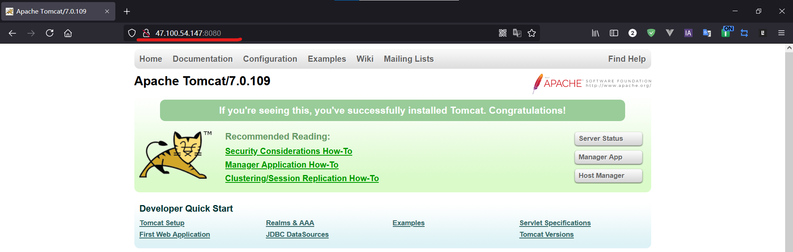

# 一、Nginx简介

##  Nginx概述

Nginx(“engine x”)是一个高性能的HTTP和反向代理服务器，特点是占有内存少，并发能力强，事实上nginx的并发能力确实在同类型的网页服务器中表现较好，中国大陆使用 nginx网站用户有:百度、京东、新浪、网易、腾讯、淘宝等

Nginx专为性能优化而开发，性能是其最重要的考量，实现上非常注重效率，能经受高负载的考验，有报告表明能支持高达50000个并发连接数

##  正向代理

在客户端（浏览器）配置代理服务器，通过代理服务器进行互联网访问


##  反向代理

反向代理，其实客户端对代理是无感知的，因为客户端不需要任何配置就可以访问，我们只需要将请求发送到反向代理服务器，由反向代理服务器去选择目标服务器获取数据后，在返回给客户端，此时反向代理服务器和目标服务器对外就是一个服务器，暴露的是代理服务器地址，隐藏了真实服务器IP地址


##  正向代理和反向代理总结

正向代理即是客户端代理， 代理客户端， 服务端不知道实际发起请求的客户端.

反向代理即是服务端代理， 代理服务端， 客户端不知道实际提供服务的服务端

##  负载均衡

单个服务器解决不了，我们增加服务器的数量，然后将请求分发到各个服务器上，将原先请求集中到单个服务器上的情况改为将请求分发到多个服务器上，将负载分发到不同的服务器，也就是我们所说的负载均衡


##  动静分离

为了加快网站的解析速度，可以把动态页面和静态页面由不同的服务器来解析，加快解析速度，降低原来单个服务器的压力


# 二、Nginx安装

##  进入Nginx官网下载


##  安装相关依赖以及Nginx

1. 安装nginx需要的素材（依赖）


1. 安装prce

   

- - 将下载好的压缩包传输到linux服务器

  - 解压安装包

    ```shell
    tar -xvf pcre2-10.37.tar.gz 
    ```

  - 进入解压后的目录#执行以下命令 

    ```shell
    ./configure 
    # 编译并安装 
    make && make install 
    ```

    

2. 安装其他的依赖 

```shell
yum -y install make zlib zlib-devel gcc-c++ libtool openssl openssl-devel 
```


3. 安装nginx

1. 1. 将下载好的压缩包传输到linux服务器

   2. 解压安装包

      ```shell
      tar -xvf nginx-1.20.1.tar.gz 
      ```

   3. 进入解压后文件夹#执行以下命令 

      ```shell
      ./configure 
      # 编译并安装 
      make && make install 
      ```

   4. 检验是否安装完成安装成功之后，在usr多出来一个文件夹 local/nginx，在 nginx 有 sbin 有启动脚本

   5. 测试

1. 1. 1. 启动

         ```shell
         cd /usr/local/nginx/sbin/ 
         # 启动 
         ./nginx
         ```

         

      2. 访问 ip:80默认端口 80

## 扩展（linux系统端口号开启访问）

- 查看开放的端口号

  ```shell
  firewall-cmd --list-all
  ```

  


- 设置开放的端口号添加后要重启防火墙才能生效

  ```shell
  firewall-cmd --add-service=http --permanent sudo firewall-cmd --add-port=80/tcp --permanent 
  ```

  

- 重启防火墙

  ```shell
  firewall-cmd --reload
  ```

  ​	


# 三、基本使用

##  nginx常用命令

使用这下面的命令要先将目录切换到 /usr/local/nginx/sbin(如果不知道可以用whereis nginx指令搜索)

1. 查看 nginx 的版本号

   ```
   ./nginx -v 
   ```

2. 启动 nginx

   ```
   ./nginx
   ```

3. 指定配置文件启动

   ```
   ./nginx -t -c 主配置文件路径 
   ```

4. 关闭 nginx

   ```
   ./nginx -s stop
   ```

   

5. 重新加载 nginx如果只是更改配置文件，可以使用这个命令

   ```
   ./nginx -s reload
   ```

###  nginx 配置文件组成

配置文件位置：/usr/local/nginx/conf/nginx.conf

```shell
#全局块
#user  nobody;
worker_processes  1;

#event块
events {
    worker_connections  1024;
}

#http块
http {
    #http全局块
    include       mime.types;
    default_type  application/octet-stream;
    sendfile        on;
    keepalive_timeout  65;
    #server块
    server {
        #server全局块
        listen       8000;
        server_name  localhost;
        #location块
        location / {
            root   html;
            index  index.html index.htm;
        }
        error_page   500 502 503 504  /50x.html;
        location = /50x.html {
            root   html;
        }
    }
    #这边可以有多个server块
    server {
      ...
    }
}
```

nginx 配置文件有三部分组成

1. 第一部分 全局块从配置文件开始到 events 块之间的内容，主要会设置一些影响 nginx 服务器整体运行的配置指令
   比如 worker_processes 1; 

   worker_processes 值越大，可以支持的并发处理量也越多

2. 第二部分 events 块events 块涉及的指令主要影响 Nginx 服务器与用户的网络连接
   比如 worker_connections 1024； 支持的最大连接数

3. 第三部分 http块Nginx 服务器配置中最频繁的部分
   http 块也可以包括 http全局块、server块

- http全局块http全局块配置的指令包括文件引入、MIME-TYPE定义、日志自定义、连接超时时间、单链接请求数上限等（其实这个不经常改动）


- server块

- - 这块和虚拟主机有密切关系，虚拟主机从用户角度看，和一台独立的硬件主机是完全一样的，该技术的产生是为了节省互联网服务器硬件成本
  - 每个 http 块包括多个 server 块，而==**每个 server 块就相当于一个虚拟主机**==
  - 而每个 server 块也分为全局 server 块，以及可以同时包含多个 location 块


1. 全局server块

- - 最常见的配置是本虚拟机主机的监听配置和本虚拟主机的名称或IP配置

1. location块

- - 一个server块可以配置多个location块
  - 这块的主要作用是基于 Nginx 服务器接收到的请求字符串（例如 server_name/url-string），对虚拟主机名称（也可以是 IP 别名）之外的字符串（例如 前面的 /uri-string）进行匹配，对特定的请求进行处理。地址定向、数据缓存和应答控制等功能，还有许多第三方模块的配置也在这里进行

# 四、Nginx配置实例-反向代理

##  反向代理（一）

实现效果

- - 打开浏览器，在浏览器地址输入地址 [www.123.com](http://www.123.com/)，跳转到 linux 系统 tomcat 主页面中

- 准备工作

- - 在 liunx 系统安装 tomcat ，使用默认端口 8080

- 对外开放访问的端口

  ```
  firewall-cmd --add-port=8080/tcp --permanen
  ```

- 测试在本机是否能正常访问tomcat页面 

1. 过程分析


1. 具体配置

- - 第一步 在windows系统的host文件进行域名和ip对应关系的配置


- **在文件最后添加这一条，47.100.54.147是我服务器的公网ip**

  47.100.54.147 www.123.com 

- **添加后能访问到服务器的 tomcat**


- **修改配置文件**/usr/local/nginx/conf/nginx.conf


**效果**


##  反向代理（二）

1. 实现效果

- - 使用nginx反向代理，根据访问的路径跳转到不同端口的服务中，nginx监听端口为9001

- - - 访问 http://127.0.0.1:9001/edu/ 直接跳转到 127.0.0.1:8081
    - 访问 http://127.0.0.1:9001/vod/ 直接跳转到 127.0.0.1:8082

1. 准备工作

1. 1. 准备两个 tomcat 服务器，一个8080端口，一个8081端口

1. 1. 1. 先创建两个文件夹

         ```
         mkdir tomcat8080 
         mkdir tomcat8081
         ```

      2. 将tomcat压缩包分别拷贝到两个文件夹中，解压

      3. 将之前的tomcat进程关闭

      4. 启动 tomcat8080

      5. 将 tomcat8081 的默认端口修改

- - - - 8081需要修改默认端口与8080不同
      - 修改位置：解压后位置/conf/server.xml

1. 1. 1. 启动 tomcat8081

1. 1. 测试 tomcat8080，8081



1. 添加html文件

- - tomcat8080

    cd tomcat8080文件夹路径/apache-tomcat-7.0.109/webapps 

    ```
    mkdir edu 
    cd edu 
    vim a.html 
    ```

    ```
    <!--添加到 a.html 的内容-->
    <h1>8080</h1> 
    ```

    

- - - 测试

- - tomcat8081cd tomcat8081文件夹路径/apache-tomcat-7.0.109/webapps mkdir edu cd edu vim a.html 

    ```
    <!--添加到 a.html 的内容-->
    <h1>8081</h1> 
    ```

- - - 测试

1. 具体配置/usr/local/nginx/conf/nginx.conf 的配置文件

- - location ~ /edu/: 高版本的nginx 后面可以不用加 ~ ，更复杂点的配置甚至能得到参数，具体百度

  - 对外开放 9001 端口

  - /usr/local/nginx/sbin重加载nginx

    ```
    cd /usr/local/nginx/sbin  
    ./nginx -s reload 
    ```

  - 如果出现服务器响应超时那就是，端口开启问题，打开阿里云看服务器的防火墙是否有9001，没有就是没开启，firewall开启出现过这一问题，用firewall的命令重启防火墙也没用，实在没办法就阿里云面板添加也行，如果出现404，那就是路径问题，location后面的路径别忘了加 “/”


最终测试


### location 指令说明

1. = : 用于不含正则表达式的 uri 前，要求请求字符串与 uri 严格匹配，如果匹配成功，就停止继续向下搜索并立即处理该请求
2. ~ : 用于表示 uri 包含正则表达式，并且区分大小写。
3. ~ : 用于表示 uri 包含正则表达式，并且不区分大小写。
4. ^~: 用于不含正则表达式的 uri 前，要求 Nginx 服务器找到标识 uri 和请求字符串匹配度最高的 location 后，立即使用此 location 处理请求，而不再使用 location块中的正则 uri 和请求字符串做匹配

注意: 如果 uri 包含正则表达式，则必须要有 ~ 或者 ~* 标识。

# 五、Nginx配置实例-负载均衡

概述：

  	增加服务器数量，然后将请求分发到各个服务器上，将原先请求集中到**单个**服务器上的情况改为将请求分发到**多个**服务器上，将负载分发到不同服务器，也就是我们所说的**负载均衡**

1. 实现效果

- - 浏览器地址栏输入地址 http://47.100.54.147/edu/a.html，负载均衡效果，平均 8080 和 8081 端口中

1. 准备工作

- - 准备两台 tomcat 服务器，一台 8080，一台 8081使用上面准备的 tomcat8080 和 tomcat8081
  - 在两台 tomcat 里面 webapps 目录中，创建名称是 edu 文件夹，在 edu 文件夹中创建页面 a.html，用于测试**测试**

1. 具体配置

   

- - 在`/usr/local/nginx/conf/nginx.conf `修改
  - 添加 upstream

- - - 后面的名字随意 大括号里面的就是需要负载均衡的ip

- - 修改 location 中的 proxy_pass : htp:// (对应upstream 后面取的名称)

1. 重启 nginx

   ```
   # 要重启 nginx，使配置文件生效 
   cd /usr/local/nginx/sbin     
   ./nginx -s stop   
   ./nginx
   ```

   

2. 测试

- - 访问==ip/edu/a.html==

- - - 多刷新几次可以看到 8080 和 8081 的切换


##  nginx分配服务器策略

1. 轮询（默认）每个请求按时间顺序逐一分配到不同的后端服务器，如果后端服务器down掉，能自动剔除
2. weight (权重)weight 代表权重默认为1，权重越高被分配的客户端越多
3. ip_hash（可以解决session共享问题）每个请求按访问 ip 的 hash 结果分配，这样每个访客固定访问一个后端服务器
4. fair (第三方)按后端服务器的响应时间来分配请求，响应时间短的优先分配

# 六、Nginx配置实例-动静分离

纯粹把静态文件独立成单独的域名，放在独立的服务器上，也是目前主流推崇的方案


- 
