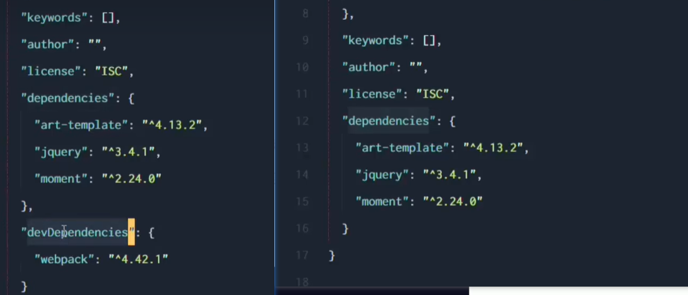
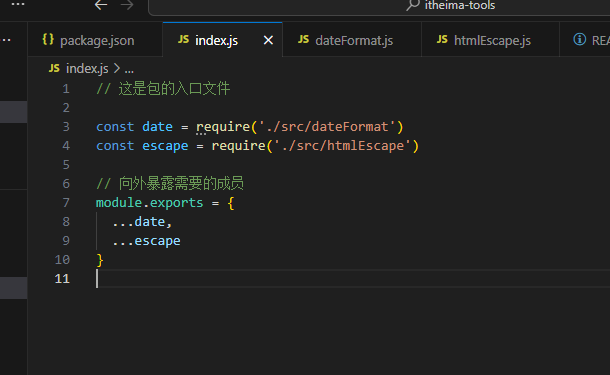
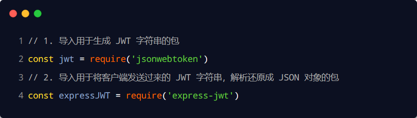

# 初识Node.js与内置模块

## 1. 初识 Node.js

### 1.1 回顾与思考

#### 1. 已经掌握了哪些技术


#### 2. 浏览器中的 JavaScript 的组成部分


#### 3. 思考：为什么 JavaScript 可以在浏览器中被执行


不同的浏览器使用不同的 JavaScript 解析引擎：

-  Chrome 浏览器  =>  V8
-  Firefox 浏览器    =>  OdinMonkey（奥丁猴）
-  Safri 浏览器        =>  JSCore
-  IE 浏览器            =>  Chakra（查克拉）
-  etc...

其中，Chrome 浏览器的 V8 解析引擎性能最好！

#### 4. 思考：为什么 JavaScript 可以操作 DOM 和 BOM


每个浏览器都**内置了** DOM、BOM 这样的 API 函数，因此，浏览器中的 JavaScript 才可以调用它们。

#### 5. 浏览器中的 JavaScript 运行环境

运行环境是指代码正常运行所需的必要环境。


总结：

1. V8 引擎负责解析和执行 JavaScript 代码。
2. 内置 API 是由运行环境提供的特殊接口，只能在所属的运行环境中被调用。

#### 6. 思考：JavaScript 能否做后端开发


当然可以咯，不过需要借助Node.js的运行环境

### 1.2 Node.js 简介

#### 1. 什么是 Node.js

Node.js 是一个基于 Chrome V8 引擎的 JavaScript 运行环境。

Node.js 的官网地址： https://nodejs.org/zh-cn/

#### 2. Node.js 中的 JavaScript 运行环境


注意：

1. 浏览器是 JavaScript 的前端运行环境。
2. Node.js 是 JavaScript 的后端运行环境。
3. Node.js 中无法调用 DOM 和 BOM 等浏览器内置 API。

#### 3. Node.js 可以做什么

Node.js 作为一个 JavaScript 的运行环境，仅仅提供了基础的功能和 API。然而，基于 Node.js 提供的这些基础能，很多强大的工具和框架如雨后春笋，层出不穷，所以学会了 Node.js ，可以让前端程序员胜任更多的工作和岗位：

- 基于 Express 框架（http://www.expressjs.com.cn/），可以快速构建 Web 应用
- 基于 Electron 框架（https://electronjs.org/），可以构建跨平台的桌面应用
- 基于 restify 框架（http://restify.com/），可以快速构建 API 接口项目
- 读写和操作数据库、创建实用的命令行工具辅助前端开发、etc…

总之：Node.js 是大前端时代的“大宝剑”，有了 Node.js 这个超级 buff 的加持，前端程序员的行业竞争力会越来越强！

#### 4. Node.js 怎么学

浏览器中的 JavaScript 学习路径：
JavaScript 基础语法 + 浏览器内置 API（DOM + BOM） + 第三方库（jQuery、art-template 等）

Node.js 的学习路径：
JavaScript 基础语法 + Node.js 内置 API 模块（fs、path、http等）+ 第三方 API 模块（express、mysql 等）

### 1.3 Node.js 环境的安装

如果希望通过 Node.js 来运行 Javascript 代码，则必须在计算机上安装 Node.js 环境才行。

安装包可以从 Node.js 的官网首页直接下载，进入到 Node.js 的官网首页（https://nodejs.org/en/），点击绿色的按钮，下载所需的版本后，双击直接安装即可。

#### 1. 区分 LTS 版本和 Current 版本的不同

1. LTS 为长期稳定版，对于追求稳定性的企业级项目来说，推荐安装 LTS 版本的 Node.js。
2. Current 为新特性尝鲜版，对热衷于尝试新特性的用户来说，推荐安装 Current 版本的 Node.js。但是，Current 版本中可能存在隐藏的 Bug 或安全性漏洞，因此不推荐在企业级项目中使用 Current 版本的 Node.js。

#### 2. 查看已安装的 Node.js 的版本号

打开终端，在终端输入命令 node –v 后，按下回车键，即可查看已安装的 Node.js 的版本号。

Windows 系统快速打开终端的方式：
使用快捷键（Windows徽标键 + R）打开运行面板，输入 cmd 后直接回车，即可打开终端。

#### 3. 什么是终端

终端（英文：Terminal）是专门为开发人员设计的，用于实现人机交互的一种方式。

作为一名合格的程序员，我们有必要识记一些常用的终端命令，来辅助我们更好的操作与使用计算机。


### 1.4 在 Node.js 环境中执行 JavaScript 代码

1. 打开终端
2. 切换所处目录 然后执行命令
3. 输入 node 要执行的js文件的路径

#### 终端中的快捷键

在 Windows 的 powershell 或 cmd 终端中，我们可以通过如下快捷键，来提高终端的操作效率：

1. 使用 ↑ 键，可以快速定位到上一次执行的命令
2. 使用 tab 键，能够快速补全路径
3. 使用 esc 键，能够快速清空当前已输入的命令
4. 输入 cls 命令，可以清空终端

## 2. fs 文件系统模块

### 2.1 什么是 fs 文件系统模块

fs 模块是 Node.js 官方提供的、用来操作文件的模块。它提供了一系列的方法和属性，用来满足用户对文件的操作需求。

例如：

-  fs.readFile() 方法，用来读取指定文件中的内容
-  fs.writeFile() 方法，用来向指定的文件中写入内容

如果要在 JavaScript 代码中，使用 fs 模块来操作文件，则需要使用如下的方式先导入它：


### 2.2 读取指定文件中的内容

#### 1. fs.readFile() 的语法格式

使用 fs.readFile() 方法，可以读取指定文件中的内容，语法格式如下：


参数解读：

- 参数1：必选参数，字符串，表示文件的路径。
- 参数2：可选参数，表示以什么编码格式来读取文件。
- 参数3：必选参数，文件读取完成后，通过回调函数拿到读取的结果。

#### 2. fs.readFile() 的示例代码

以 utf8 的编码格式，读取指定文件的内容，并打印 err 和 dataStr 的值：


#### 3. 判断文件是否读取成功

可以判断 err 对象是否为 null，从而知晓文件读取的结果：


### 2.3 向指定的文件中写入内容

fs.writeFile() 方法只能用来创建文件，不能用来创建路径(文件夹...)重复调用 

fs.writeFile() 写入同一个文件，新写入的内容会覆盖之前的旧内容（没有追加的功能...）

#### 1. fs.writeFile() 的语法格式

使用 fs.writeFile() 方法，可以向指定的文件中写入内容，语法格式如下：


参数解读：

- 参数1：必选参数，需要指定一个文件路径的字符串，表示文件的存放路径。
- 参数2：必选参数，表示要写入的内容。
- 参数3：可选参数，表示以什么格式写入文件内容，默认值是 utf8。
- 参数4：必选参数，文件写入完成后的回调函数。

#### 2. fs.writeFile() 的示例代码

向指定的文件路径中，写入文件内容：


#### 3. 判断文件是否写入成功

可以判断 err 对象是否为 null，从而知晓文件写入的结果：


### 2.4 练习 - 考试成绩整理

使用 fs 文件系统模块，将素材目录下成绩.txt文件中的考试数据，整理到成绩-ok.txt文件中。

整理前，成绩.txt文件中的数据格式如下：


整理完成之后，希望得到的成绩-ok.txt文件中的数据格式如下：


核心实现步骤 

1. 导入需要的 fs 文件系统模块
2. 使用 fs.readFile() 方法，读取素材目录下的 成绩.txt 文件
3. 判断文件是否读取失败
4. 文件读取成功后，处理成绩数据
5. 将处理完成的成绩数据，调用 fs.writeFile() 方法，写入到新文件 成绩-ok.txt 中

```js
// 1. 导入 fs 模块
const fs = require('fs')

// 2. 调用 fs.readFile() 读取文件的内容
fs.readFile('../素材/成绩.txt', 'utf8', function(err, dataStr) {
  // 3. 判断是否读取成功
  if (err) {
    return console.log('读取文件失败！' + err.message)
  }
  // console.log('读取文件成功！' + dataStr)

  // 4.1 先把成绩的数据，按照空格进行分割
  const arrOld = dataStr.split(' ')
  // 4.2 循环分割后的数组，对每一项数据，进行字符串的替换操作
  const arrNew = []
  arrOld.forEach(item => {
    arrNew.push(item.replace('=', '：'))
  })
  // 4.3 把新数组中的每一项，进行合并，得到一个新的字符串
  const newStr = arrNew.join('\r\n')

  // 5. 调用 fs.writeFile() 方法，把处理完毕的成绩，写入到新文件中
  fs.writeFile('./files/成绩-ok.txt', newStr, function(err) {
    if (err) {
      return console.log('写入文件失败！' + err.message)
    }
    console.log('成绩写入成功！')
  })
})

```


### 2.5 fs 模块 - 路径动态拼接的问题

> 这个比较奇怪，这个是根据你执行的node指令路径来算的相对路径，不像Java一样是根据代码文件的位置来判断相对路径的下面的解决办法就是拼接了一个代码文件所处位置才来加相对路径的，这个就和Java的一样了

在使用 fs 模块操作文件时，如果提供的操作路径是以 ./ 或 ../ 开头的相对路径时，很容易出现路径动态拼接错误的问题。

原因：代码在运行的时候，会以执行 node 命令时所处的目录，动态拼接出被操作文件的完整路径。

解决方案：在使用 fs 模块操作文件时，直接提供完整的路径，不要提供 ./ 或 ../ 开头的相对路径，从而防止路径动态拼接的问题。

(如果要解决这个问题，直接提供一个完整的文件存放路径就可以了,如下)


## 3. path 路径模块

### 3.1 什么是 path 路径模块

path 模块是 Node.js 官方提供的、用来处理路径的模块。它提供了一系列的方法和属性，用来满足用户对路径的处理需求。

例如：

-  path.join() 方法，用来将多个路径片段拼接成一个完整的路径字符串
-  path.basename() 方法，用来从路径字符串中，将文件名解析出来

如果要在 JavaScript 代码中，使用 path 模块来处理路径，则需要使用如下的方式先导入它：


### 3.2 路径拼接

#### 1. path.join() 的语法格式

使用 path.join() 方法，可以把多个路径片段拼接为完整的路径字符串，语法格式如下：


参数解读：

- ...paths `<string> `路径片段的序列
- 返回值:` <string>`

#### 2. path.join() 的代码示例

使用 path.join() 方法，可以把多个路径片段拼接为完整的路径字符串：


注意：今后凡是涉及到路径拼接的操作，都要使用 path.join() 方法进行处理。不要直接使用 + 进行字符串的拼接。

### 3.3 获取路径中的文件名

#### 1. path.basename() 的语法格式

使用 path.basename() 方法，可以获取路径中的最后一部分，经常通过这个方法获取路径中的文件名，语法格式如下：


参数解读：

path` <string>` 必选参数，表示一个路径的字符串

ext `<string> `可选参数，表示文件扩展名,加了这个参数会移除扩展名 

返回: `<string>` 表示路径中的最后一部分

#### 2. path.basename() 的代码示例

使用 path.basename() 方法，可以从一个文件路径中，获取到文件的名称部分：


### 3.4 获取路径中的文件扩展名

#### 1. path.extname() 的语法格式

使用 path.extame() 方法，可以获取路径中的扩展名部分，语法格式如下：


参数解读：

- path `<string>`必选参数，表示一个路径的字符串
- 返回:` <string>` 返回得到的扩展名字符串

#### 2. path.extname() 的代码示例

使用 path.extname() 方法，可以获取路径中的扩展名部分：


## 4. http 模块

### 4.1 什么是 http 模块

回顾：什么是客户端、什么是服务器？

在网络节点中，负责消费资源的电脑，叫做客户端；负责对外提供网络资源的电脑，叫做服务器。


http 模块是 Node.js 官方提供的、用来创建 web 服务器的模块。通过 http 模块提供的 http.createServer() 方法，就能方便的把一台普通的电脑，变成一台 Web 服务器，从而对外提供 Web 资源服务。


如果要希望使用 http 模块创建 Web 服务器，则需要先导入它：


### 4.2 进一步理解 http 模块的作用

服务器和普通电脑的区别在于，服务器上安装了 web 服务器软件，例如：IIS、Apache 等。通过安装这些服务器软件，就能把一台普通的电脑变成一台 web 服务器。

在 Node.js 中，我们不需要使用 IIS、Apache 等这些第三方 web 服务器软件。因为我们可以基于 Node.js 提供的 http 模块，通过几行简单的代码，就能轻松的手写一个服务器软件，从而对外提供 web 服务。

### 4.3 服务器相关的概念

#### 1. IP 地址

IP 地址就是互联网上每台计算机的唯一地址，因此 IP 地址具有唯一性。如果把“个人电脑”比作“一台电话”，那么“IP地址”就相当于“电话号码”，只有在知道对方 IP 地址的前提下，才能与对应的电脑之间进行数据通信。

IP 地址的格式：通常用“点分十进制”表示成（a.b.c.d）的形式，其中，a,b,c,d 都是 0~255 之间的十进制整数。例如：用点分十进表示的 IP地址（192.168.1.1）

注意：

1. 互联网中每台 Web 服务器，都有自己的 IP 地址，例如：大家可以在 Windows 的终端中运行 ping www.baidu.com 命令，即可查看到百度服务器的 IP 地址。
2. 在开发期间，自己的电脑既是一台服务器，也是一个客户端，为了方便测试，可以在自己的浏览器中输入 127.0.0.1 这个 IP 地址，就能把自己的电脑当做一台服务器进行访问了。

#### 2. 域名和域名服务器

尽管 IP 地址能够唯一地标记网络上的计算机，但IP地址是一长串数字，不直观，而且不便于记忆，于是人们又发明了另一套字符型的地址方案，即所谓的域名（Domain Name）地址。

IP地址和域名是一一对应的关系，这份对应关系存放在一种叫做域名服务器(DNS，Domain name server)的电脑中。使用者只需通过好记的域名访问对应的服务器即可，对应的转换工作由域名服务器实现。因此，域名服务器就是提供 IP 地址和域名之间的转换服务的服务器。


注意：

1. 单纯使用 IP 地址，互联网中的电脑也能够正常工作。但是有了域名的加持，能让互联网的世界变得更加方便。
2. 在开发测试期间， 127.0.0.1 对应的域名是 localhost，它们都代表我们自己的这台电脑，在使用效果上没有任何区别。

#### 3. 端口号

计算机中的端口号，就好像是现实生活中的门牌号一样。通过门牌号，外卖小哥可以在整栋大楼众多的房间中，准确把外卖送到你的手中。

同样的道理，在一台电脑中，可以运行成百上千个 web 服务。每个 web 服务都对应一个唯一的端口号。客户端发送过来的网络请求，通过端口号，可以被准确地交给对应的 web 服务进行处理。


注意：

1. 每个端口号不能同时被多个 web 服务占用。
2. 在实际应用中，URL 中的 80 端口可以被省略。

### 4.4 创建最基本的 web 服务器

#### 1. 创建 web 服务器的基本步骤

1. 导入 http 模块
2. 创建 web 服务器实例
3. 为服务器实例绑定 request 事件，监听客户端的请求
4. 启动服务器

#### 2. 代码示例

步骤1 - 导入 http 模块

如果希望在自己的电脑上创建一个 web 服务器，从而对外提供 web 服务，则需要导入 http 模块：


步骤2 - 创建 web 服务器实例

调用 http.createServer() 方法，即可快速创建一个 web 服务器实例：


步骤3 - 为服务器实例绑定 request 事件

为服务器实例绑定 request 事件，即可监听客户端发送过来的网络请求：


步骤4 - 启动服务器

调用服务器实例的 .listen() 方法，即可启动当前的 web 服务器实例：


#### 3. req 请求对象

只要服务器接收到了客户端的请求，就会调用通过 server.on() 为服务器绑定的 request 事件处理函数。

如果想在事件处理函数中，访问与客户端相关的数据或属性，可以使用如下的方式：


这个url是从端口号后面的开始的

比如:

1./
2./index.html

#### 4. res 响应对象

在服务器的 request 事件处理函数中，如果想访问与服务器相关的数据或属性，可以使用如下的方式：


#### 5. 解决中文乱码问题

当调用 res.end() 方法，向客户端发送中文内容的时候，会出现乱码问题，此时，需要手动设置内容的编码格式：


### 4.5 根据不同的 url 响应不同的 html 内容

#### 1. 核心实现步骤

1. 获取请求的 url 地址
2. 设置默认的响应内容为 404 Not found
3. 判断用户请求的是否为 / 或 /index.html 首页
4. 判断用户请求的是否为 /about.html 关于页面
5. 设置 Content-Type 响应头，防止中文乱码
6. 使用 res.end() 把内容响应给客户端

#### 2. 动态响应内容


# 模块化

## 1. 模块化的基本概念

### 1.1 什么是模块化

模块化是指解决一个复杂问题时，自顶向下逐层把系统划分成若干模块的过程。对于整个系统来说，模块是可组合、分解和更换的单元。


编程领域中的模块化，就是遵守固定的规则，把一个大文件拆成独立并互相依赖的多个小模块。

把代码进行模块化拆分的好处：

1. 提高了代码的复用性
2. 提高了代码的可维护性
3. 可以实现按需加载

### 1.2 模块化规范

模块化规范就是对代码进行模块化的拆分与组合时，需要遵守的那些规则。

例如：

- 使用什么样的语法格式来引用模块
- 在模块中使用什么样的语法格式向外暴露成员

模块化规范的好处：大家都遵守同样的模块化规范写代码，降低了沟通的成本，极大方便了各个模块之间的相互调用，利人利己。

## 2. Node.js 中的模块化

### 2.1 Node.js 中模块的分类

Node.js 中根据模块来源的不同，将模块分为了 3 大类，分别是：

-  内置模块（内置模块是由 Node.js 官方提供的，例如 fs、path、http 等）

-  自定义模块（用户创建的每个 .js 文件，都是自定义模块）

-  第三方模块（由第三方开发出来的模块，并非官方提供的内置模块，也不是用户创建的自定义模块，使用前需要先下载）

  

前两个模块都是放到用户的电脑上的，第三个模块如果想用的话还得下载

### 2.2 加载模块

使用强大的 require() 方法，可以加载需要的内置模块、用户自定义模块、第三方模块进行使用。例如：


注意：使用 require() 方法加载其它模块时，会执行被加载模块中的代码（所有代码，从上往下依次执行）。

### 2.3 Node.js 中的模块作用域

#### 1. 什么是模块作用域

和函数作用域类似，在自定义模块中定义的变量、方法等成员，只能在当前模块内被访问，这种模块级别的访问限制，叫做模块作用域。


#### 2. 模块作用域的好处

防止了全局变量污染的问题


还有这种


### 2.4 向外共享模块作用域中的成员

#### 1. module 对象

在每个 .js 自定义模块中都有一个 module 对象，它里面存储了和当前模块有关的信息，打印如下：


#### 2. module.exports 对象

在自定义模块中，可以使用 module.exports 对象，将模块内的成员共享出去，供外界使用。

外界用 require() 方法导入自定义模块时，得到的就是 module.exports 所指向的对象。


#### 3. 共享成员时的注意点

使用 require() 方法导入模块时，导入的结果，永远以 module.exports 指向的对象为准。


#### 4. exports 对象

由于 module.exports 单词写起来比较复杂，为了简化向外共享成员的代码，Node 提供了 exports 对象。默认情况下，exports 和 module.exports 指向同一个对象。最终共享的结果，还是以 module.exports 指向的对象为准（其实这两都是一样的，只是exports写的比较简单而已）。


#### 5. exports 和 module.exports 的使用误区

时刻谨记，require() 模块时，得到的永远是 module.exports 指向的对象：

例子一：


例子二：


例子三：


例子四：


注意：为了防止混乱，建议大家不要在同一个模块中同时使用 exports 和 module.exports

### 2.5 Node.js 中的模块化规范

Node.js 遵循了 CommonJS 模块化规范，CommonJS 规定了模块的特性和各模块之间如何相互依赖。


CommonJS 规定：

1. 每个模块内部，module 变量代表当前模块。
2. module 变量是一个对象，它的 exports 属性（即 module.exports）是对外的接口。
3. 加载某个模块，其实是加载该模块的 module.exports 属性。require() 方法用于加载模块。

## 3. npm与包

### 3.1 包

#### 1. 什么是包

Node.js 中的第三方模块又叫做包。

就像电脑和计算机指的是相同的东西，第三方模块和包指的是同一个概念，只不过叫法不同。

#### 2. 包的来源

不同于 Node.js 中的内置模块与自定义模块，包是由第三方个人或团队开发出来的，免费供所有人使用。

注意：Node.js 中的包都是免费且开源的，不需要付费即可免费下载使用。

#### 3. 为什么需要包

由于 Node.js 的内置模块仅提供了一些底层的 API，导致在基于内置模块进行项目开发的时，效率很低。

包是基于内置模块封装出来的，提供了更高级、更方便的 API，极大的提高了开发效率。

包和内置模块之间的关系，类似于 jQuery 和 浏览器内置 API 之间的关系。

#### 4. 从哪里下载包

国外有一家 IT 公司，叫做 npm, Inc. 这家公司旗下有一个非常著名的网站： https://www.npmjs.com/ ，它是全球最大的包共享平台，你可以从这个网站上搜索到任何你需要的包，只要你有足够的耐心！

到目前位置，全球约 1100 多万的开发人员，通过这个包共享平台，开发并共享了超过 120 多万个包 供我们使用。

npm, Inc. 公司提供了一个地址为 https://registry.npmjs.org/ 的服务器，来对外共享所有的包，我们可以从这个服务器上下载自己所需要的包。


注意：

-  从 https://www.npmjs.com/ 网站上搜索自己所需要的包                  （搜包）
-  从 https://registry.npmjs.org/  服务器上下载自己需要的包	          （下包）

#### 5. 如何下载包

npm, Inc. 公司提供了一个包管理工具，我们可以使用这个包管理工具，从 https://registry.npmjs.org/ 服务器把需要的包下载到本地使用。

这个包管理工具的名字叫做 Node Package Manager（简称 npm 包管理工具），这个包管理工具随着 Node.js 的安装包一起被安装到了用户的电脑上。

大家可以在终端中执行 npm -v 命令，来查看自己电脑上所安装的 npm 包管理工具的版本号：


### 3.2 npm 初体验

#### 1. 格式化时间的传统做法


1. 创建格式化时间的自定义模块
2. 定义格式化时间的方法
3. 创建补零函数
4. 从自定义模块中导出格式化时间的函数
5. 导入格式化时间的自定义模块
6. 调用格式化时间的函数

#### 2. 格式化时间的高级做法

1. 使用 npm 包管理工具，在项目中安装格式化时间的包 moment
2. 使用 require() 导入格式化时间的包
3. 参考 moment 的官方 API 文档对时间进行格式化


#### 3. 在项目中安装包的命令

如果想在项目中安装指定名称的包，需要运行如下的命令：

```
npm install 包的完整名称
```

上述的装包命令，可以简写成如下格式：

```
npm i 包的完整名称
```

#### 4. 初次装包后多了哪些文件

初次装包完成后，在项目文件夹下多一个叫做 node_modules 的文件夹和 package-lock.json 的配置文件。


其中：
node_modules 文件夹用来存放所有已安装到项目中的包。require() 导入第三方包时，就是从这个目录中查找并加载包。

package-lock.json 配置文件用来记录 node_modules 目录下的每一个包的下载信息，例如包的名字、版本号、下载地址等。


注意：程序员不要手动修改 node_modules 或 package-lock.json 文件中的任何代码，npm 包管理工具会自动维护它们。

#### 5. 安装指定版本的包

默认情况下，使用 npm install 命令安装包的时候，会自动安装最新版本的包。如果需要安装指定版本的包，可以在包名之后，通过 @ 符号指定具体的版本，例如：


#### 6. 包的语义化版本规范

包的版本号是以“点分十进制”形式进行定义的，总共有三位数字，例如 2.24.0


其中每一位数字所代表的的含义如下：

- 第1位数字：大版本
- 第2位数字：功能版本
- 第3位数字：Bug修复版本

版本号提升的规则：只要前面的版本号增长了，则后面的版本号归零。

### 3.3 包管理配置文件

npm 规定，在项目根目录中，必须提供一个叫做 package.json 的包管理配置文件。用来记录与项目有关的一些配置信息。例如：

- 项目的名称、版本号、描述等
- 项目中都用到了哪些包
- 哪些包只在开发期间会用到
- 那些包在开发和部署时都需要用到

#### 1. 多人协作的问题


整个项目的体积是 30.4M

第三方包的体积是 28.8M

项目源代码的体积 1.6M


遇到的问题：第三方包的体积过大，不方便团队成员之间共享项目源代码。


解决方案：共享时剔除node_modules

#### 2. 如何记录项目中安装了哪些包

在项目根目录中，创建一个叫做 package.json 的配置文件，即可用来记录项目中安装了哪些包。从而方便剔除 node_modules 目录之后，在团队成员之间共享项目的源代码。


注意：今后在项目开发中，一定要把 node_modules 文件夹，添加到 .gitignore 忽略文件中。

#### 3. 快速创建 package.json

npm 包管理工具提供了一个快捷命令，可以在执行命令时所处的目录中，快速创建 package.json 这个包管理配置文件：


注意：

上述命令只能在英文的目录下成功运行！所以，项目文件夹的名称一定要使用英文命名，不要使用中文，不能出现空格。

运行 npm install 命令安装包的时候，npm 包管理工具会自动把包的名称和版本号，记录到 package.json 中。

#### 4. dependencies 节点

package.json 文件中，有一个 dependencies 节点，专门用来记录您使用 npm install 命令安装了哪些包。

#### 5. 一次性安装所有的包

当我们拿到一个剔除了 node_modules 的项目之后，需要先把所有的包下载到项目中，才能将项目运行起来。

否则会报类似于下面的错误：


可以运行 npm install 命令（或 npm i）一次性安装所有的依赖包：


#### 6. 卸载包

可以运行 npm uninstall 命令，来卸载指定的包：


注意：npm uninstall 命令执行成功后，会把卸载的包，自动从 package.json 的 dependencies 中移除掉。

#### 7. devDependencies 节点

如果某些包只在项目开发阶段会用到，在项目上线之后不会用到，则建议把这些包记录到 devDependencies 节点中。

与之对应的，如果某些包在开发和项目上线之后都需要用到，则建议把这些包记录到 dependencies 节点中。


您可以使用如下的命令，将包记录到 devDependencies 节点中：


添加dev包的效果如下：



### 3.4 解决下包速度慢的问题

#### 1. 为什么下包速度慢

在使用 npm 下包的时候，默认从国外的 https://registry.npmjs.org/ 服务器进行下载，此时，网络数据的传输需要经过漫长的海底光缆，因此下包速度会很慢。


扩展阅读 - 海底光缆：
https://baike.baidu.com/item/%E6%B5%B7%E5%BA%95%E5%85%89%E7%BC%86/4107830
https://baike.baidu.com/item/%E4%B8%AD%E7%BE%8E%E6%B5%B7%E5%BA%95%E5%85%89%E7%BC%86/10520363
https://baike.baidu.com/item/APG/23647721?fr=aladdin

#### 2. 淘宝 NPM 镜像服务器


淘宝在国内搭建了一个服务器，专门把国外官方服务器上的包同步到国内的服务器，然后在国内提供下包的服务。从而极大的提高了下包的速度。

扩展：
镜像（Mirroring）是一种文件存储形式，一个磁盘上的数据在另一个磁盘上存在一个完全相同的副本即为镜像。

#### 3. 切换 npm 的下包镜像源

下包的镜像源，指的就是下包的服务器地址。


#### 4. nrm

npm install -g nrm open@8.4.2 --save

为了更方便的切换下包的镜像源，我们可以安装 nrm 这个小工具，利用 nrm 提供的终端命令，可以快速查看和切换下包的镜像源。


### 3.5 包的分类

使用 npm 包管理工具下载的包，共分为两大类，分别是：

- 项目包
- 全局包

#### 1. 项目包

那些被安装到项目的 node_modules 目录中的包，都是项目包。


项目包又分为两类，分别是：

-  开发依赖包（被记录到 devDependencies 节点中的包，只在开发期间会用到）
-  核心依赖包（被记录到 dependencies 节点中的包，在开发期间和项目上线之后都会用到）


#### 2. 全局包

在执行 npm install 命令时，如果提供了 -g 参数，则会把包安装为全局包。

全局包会被安装到 C:\Users\用户目录\AppData\Roaming\npm\node_modules 目录下。


注意：

只有工具性质的包，才有全局安装的必要性。因为它们提供了好用的终端命令。

判断某个包是否需要全局安装后才能使用，可以参考官方提供的使用说明即可。

#### 3. i5ting_toc

i5ting_toc 是一个可以把 md 文档转为 html 页面的小工具，使用步骤如下：


### 3.6 规范的包结构

在清楚了包的概念、以及如何下载和使用包之后，接下来，我们深入了解一下包的内部结构。


一个规范的包，它的组成结构，必须符合以下 3 点要求：

1. 包必须以单独的目录而存在
2. 包的顶级目录下要必须包含 package.json 这个包管理配置文件
3. package.json 中必须包含 name，version，main 这三个属性，分别代表包的名字、版本号、包的入口。

注意：以上 3 点要求是一个规范的包结构必须遵守的格式，关于更多的约束，可以参考如下网址：https://yarnpkg.com/zh-Hans/docs/package-json

### 3.7 开发属于自己的包

#### 1. 需要实现的功能

1.  格式化日期
2.  转义 HTML 中的特殊字符
3.  还原 HTML 中的特殊字符

#### 2. 初始化包的基本结构

1. 新建 itheima-tools 文件夹，作为包的根目录

2. 在 itheima-tools 文件夹中，新建如下三个文件：

   - package.json （包管理配置文件）

   - index.js          （包的入口文件）

   - README.md  （包的说明文档）

#### 3. 将不同的功能进行模块化拆分

1. 将格式化时间的功能，拆分到 src -> dateFormat.js 中
2. 将处理 HTML 字符串的功能，拆分到 src -> htmlEscape.js 中
3. 在 index.js 中，导入两个模块，得到需要向外共享的方法
4. 在 index.js 中，使用 module.exports 把对应的方法共享出去

#### 4. 编写包的说明文档

包根目录中的 READ

ME.md 文件，是包的使用说明文档。通过它，我们可以事先把包的使用说明，以 markdown 的格式写出来，方便用户参考。

README 文件中具体写什么内容，没有强制性的要求；只要能够清晰地把包的作用、用法、注意事项等描述清楚即可。

我们所创建的这个包的 README.md 文档中，会包含以下 6 项内容：

安装方式、导入方式、格式化时间、转义 HTML 中的特殊字符、还原 HTML 中的特殊字符、开源协议

#### 5. 完整代码结构

测试代码

test.js

```js
const itheima = require('./itheima-tools')

// 格式化时间的功能
const dtStr = itheima.dateFormat(new Date())
console.log(dtStr)
console.log('-----------')

const htmlStr = '<h1 title="abc">这是h1标签<span>123&nbsp;</span></h1>'
const str = itheima.htmlEscape(htmlStr)
console.log(str)
console.log('-----------')

const str2 = itheima.htmlUnEscape(str)
console.log(str2)
```

自定义目录结构





### 3.8 发布包

#### 1. 注册 npm 账号

1. 访问 https://www.npmjs.com/ 网站，点击 sign up 按钮，进入注册用户界面
2. 填写账号相关的信息：Full Name、Public Email、Username、Password
3. 点击 Create an Account 按钮，注册账号
4. 登录邮箱，点击验证链接，进行账号的验证

#### 2. 登录 npm 账号

npm 账号注册完成后，可以在终端中执行 npm login 命令，依次输入用户名、密码、邮箱后，即可登录成功。


注意：在运行 npm login 命令之前，必须先把下包的服务器地址切换为 npm 的官方服务器。否则会导致发布包失败！

#### 3. 把包发布到 npm 上

将终端切换到包的根目录之后，运行 npm publish 命令，即可将包发布到 npm 上（注意：包名不能雷同）。


#### 4. 删除已发布的包

运行 npm unpublish 包名 --force 命令，即可从 npm 删除已发布的包。


注意：

1. npm unpublish 命令只能删除 72 小时以内发布的包
2. npm unpublish 删除的包，在 24 小时内不允许重复发布
3. 发布包的时候要慎重，尽量不要往 npm 上发布没有意义的包！

## 4. 模块的加载机制

### 4.1 优先从缓存中加载

模块在第一次加载后会被缓存。 这也意味着多次调用 require() 不会导致模块的代码被执行多次。

注意：不论是内置模块、用户自定义模块、还是第三方模块，它们都会优先从缓存中加载，从而提高模块的加载效率。

### 4.2 内置模块的加载机制

内置模块是由 Node.js 官方提供的模块，内置模块的加载优先级最高。

例如，require('fs') 始终返回内置的 fs 模块，即使在 node_modules 目录下有名字相同的包也叫做 fs。

### 4.3 自定义模块的加载机制

使用 require() 加载自定义模块时，必须指定以 ./ 或 ../ 开头的路径标识符。在加载自定义模块时，如果没有指定 ./ 或 ../ 这样的路径标识符，则 node 会把它当作内置模块或第三方模块进行加载。


同时，在使用 require() 导入自定义模块时，如果省略了文件的扩展名，则 Node.js 会按顺序分别尝试加载以下的文件：

1. 按照确切的文件名进行加载
2. 补全 .js 扩展名进行加载
3. 补全 .json 扩展名进行加载
4. 补全 .node 扩展名进行加载
5. 加载失败，终端报错

### 4.4 第三方模块的加载机制

如果传递给 require() 的模块标识符不是一个内置模

如果没有找到对应的第三方模块，则移动到再上一层父目录中，进行加载，直到文件系统的根目录。


例如，假设在 'C:\Users\itheima\project\foo.js' 文件里调用了 require('tools')，则 Node.js 会按以下顺序查找：

1.  C:\Users\itheima\project\node_modules\tools
2.  C:\Users\itheima\node_modules\tools
3.  C:\Users\node_modules\tools
4.  C:\node_modules\tools
5. 还是找不到，就会报错了

### 4.5 目录作为模块

当把目录作为模块标识符，传递给 require() 进行加载的时候，有三种加载方式：

1. 在被加载的目录下查找一个叫做 package.json 的文件，并寻找 main 属性，作为 require() 加载的入口
2. 如果目录里没有 package.json 文件，或者 main 入口不存在或无法解析，则 Node.js 将会试图加载目录下的 index.js 文件。
3. 如果以上两步都失败了，则 Node.js 会在终端打印错误消息，报告模块的缺失：Error: Cannot find module 'xxx'

# Express

## 1. 初识 Express

### 1.1 Express 简介

#### 1. 什么是 Express

官方给出的概念：Express 是基于 Node.js 平台，快速、开放、极简的 Web 开发框架。

通俗的理解：Express 的作用和 Node.js 内置的 http 模块类似，是专门用来创建 Web 服务器的。

Express 的本质：就是一个 npm 上的第三方包，提供了快速创建 Web 服务器的便捷方法。


Express 的中文官网： http://www.expressjs.com.cn/

#### 2. 进一步理解 Express

思考：不使用 Express 能否创建 Web 服务器？
答案：能，使用 Node.js 提供的原生 http 模块即可。

思考：既生瑜何生亮（有了 http 内置模块，为什么还有用 Express）？
答案：http 内置模块用起来很复杂，开发效率低；Express 是基于内置的 http 模块进一步封装出来的，能够极大的提高开发效率。

思考：http 内置模块与 Express 是什么关系？
答案：类似于浏览器中 Web API 和 jQuery 的关系。后者是基于前者进一步封装出来的。

#### 3. Express 能做什么

对于前端程序员来说，最常见的两种服务器，分别是：

-  Web 网站服务器：专门对外提供 Web 网页资源的服务器。
-  API 接口服务器：专门对外提供 API 接口的服务器。

使用 Express，我们可以方便、快速的创建 Web 网站的服务器或 API 接口的服务器。

### 1.2 Express 的基本使用

#### 1. 安装

在项目所处的目录中，运行如下的终端命令，即可将 express 安装到项目中使用：


#### 2. 创建基本的 Web 服务器


#### 3. 监听 GET 请求

通过 app.get() 方法，可以监听客户端的 GET 请求，具体的语法格式如下：


#### 4. 监听 POST 请求

通过 app.post() 方法，可以监听客户端的 POST 请求，具体的语法格式如下：


#### 5. 把内容响应给客户端

通过 res.send() 方法，可以把处理好的内容，发送给客户端：


#### 6. 获取 URL 中携带的查询参数

通过 req.query 对象，可以访问到客户端通过查字符串的形式，发送到服务器的参数：


#### 7. 获取 URL 中的动态参数

通过 req.params 对象，可以访问到 URL 中，通过 : 匹配到的动态参数：


并且使用这个方法，可以匹配多个参数。`/:id/:haha`

### 1.3 托管静态资源

#### 1. express.static()

express 提供了一个非常好用的函数，叫做 express.static()，通过它，我们可以非常方便地创建一个静态资源服务器，例如，通过如下代码就可以将 public 目录下的图片、CSS 文件、JavaScript 文件对外开放访问了：

如如下的目录

public
    -images
   	 	bg.jpg
    -css
    	style.css
    -js
    	login.js


现在，你就可以访问 public 目录中的所有文件了：
http://localhost:3000/images/bg.jpg
http://localhost:3000/css/style.css
http://localhost:3000/js/login.js

注意：Express 在指定的静态目录中查找文件，并对外提供资源的访问路径。因此，存放静态文件的目录名不会出现在 URL 中。


举例：


#### 2. 托管多个静态资源目录

如果要托管多个静态资源目录，请多次调用 express.static() 函数：


访问静态资源文件时，express.static() 函数会根据目录的添加顺序查找所需的文件。（比如public目录下和files目录下都有一个index.html页面，如果你访问localhost/index.html页面，会依次查找public目录下有没有index.html，如果没有就去files目录下，如果有的话就直接访问了，因为是按照定义顺序来定义查找顺序的）

#### 3. 挂载路径前缀

如果希望在托管的静态资源访问路径之前，挂载路径前缀，则可以使用如下的方式：


现在，你就可以通过带有 /public 前缀地址来访问 public 目录中的文件了：
http://localhost:3000/public/images/kitten.jpg
http://localhost:3000/public/css/style.css
http://localhost:3000/public/js/app.js

### 1.4 nodemon

#### 1. 为什么要使用 nodemon

在编写调试 Node.js 项目的时候，如果修改了项目的代码，则需要频繁的手动 close 掉，然后再重新启动，非常繁琐。

现在，我们可以使用 nodemon（https://www.npmjs.com/package/nodemon） 这个工具，它能够监听项目文件的变动，当代码被修改后，nodemon 会自动帮我们重启项目，极大方便了开发和调试。

#### 2. 安装 nodemon

在终端中，运行如下命令，即可将 nodemon 安装为全局可用的工具：


#### 3. 使用 nodemon

当基于 Node.js 编写了一个网站应用的时候，传统的方式，是运行 node app.js (app.js是需要启动的文件名称\路径)命令，来启动项目。这样做的坏处是：代码被修改之后，需要手动重启项目。

现在，我们可以将 node 命令替换为 nodemon 命令，使用 nodemon app.js 来启动项目。这样做的好处是：代码被修改之后，会被 nodemon 监听到，从而实现自动重启项目的效果。


## 2. Express 路由

### 2.1 路由的概念

#### 1. 什么是路由

广义上来讲，路由就是映射关系。

#### 2. 现实生活中的路由


按键 1  ->  业务查询
按键 2  ->  手机充值
按键 3  ->  业务办理
按键 4  ->  密码服务与停复机
按键 5  ->  家庭宽带
按键 6  ->  话费流量
按键 8  ->  集团业务
按键 0  ->  人工服务

在这里，路由是按键与服务之间的映射关系

#### 3. Express 中的路由

在 Express 中，路由指的是客户端的请求与服务器处理函数之间的映射关系。

Express 中的路由分 3 部分组成，分别是请求的类型、请求的 URL 地址、处理函数，格式如下：


#### 4. Express 中的路由的例子


#### 5. 路由的匹配过程

每当一个请求到达服务器之后，需要先经过路由的匹配，只有匹配成功之后，才会调用对应的处理函数。

在匹配时，会按照路由的顺序进行匹配，如果请求类型和请求的 URL 同时匹配成功，则 Express 会将这次请求，转交给对应的 function 函数进行处理。


路由匹配的注意点：

按照定义的先后顺序进行匹配

请求类型和请求的URL同时匹配成功，才会调用对应的处理函数

### 2.2 路由的使用

#### 1. 最简单的用法

在 Express 中使用路由最简单的方式，就是把路由挂载到 app 上，示例代码如下：


#### 2. 模块化路由

为了方便对路由进行模块化的管理，Express 不建议将路由直接挂载到 app 上，而是推荐将路由抽离为单独的模块。

将路由抽离为单独模块的步骤如下：

1. 创建路由模块对应的 .js 文件
2. 调用 express.Router() 函数创建路由对象
3. 向路由对象上挂载具体的路由
4. 使用 module.exports 向外共享路由对象
5. 使用 app.use() 函数注册路由模块

#### 3. 创建路由模块

下面是router/user.js


#### 4. 注册路由模块

测试页面


#### 5. 为路由模块添加前缀

类似于托管静态资源时，为静态资源统一挂载访问前缀一样，路由模块添加前缀的方式也非常简单：


## 3. Express 中间件

### 3.1 中间件的概念

#### 1. 什么是中间件

中间件（Middleware ），特指业务流程的中间处理环节。

#### 2. 现实生活中的例子

在处理污水的时候，一般都要经过三个处理环节，从而保证处理过后的废水，达到排放标准。


处理污水的这三个中间处理环节，就可以叫做中间件。

#### 3. Express 中间件的调用流程

当一个请求到达 Express 的服务器之后，可以连续调用多个中间件，从而对这次请求进行预处理。


#### 4. Express 中间件的格式

Express 的中间件，本质上就是一个 function 处理函数，Express 中间件的格式如下：


注意：中间件函数的形参列表中，必须包含 next 参数。而路由处理函数中只包含 req 和 res。

#### 5. next 函数的作用

next 函数是实现多个中间件连续调用的关键，它表示把流转关系转交给下一个中间件或路由。


### 3.2 Express 中间件的初体验

#### 1. 定义中间件函数

可以通过如下的方式，定义一个最简单的中间件函数：


#### 2. 全局生效的中间件

客户端发起的任何请求，到达服务器之后，都会触发的中间件，叫做全局生效的中间件。

通过调用 app.use(中间件函数)，即可定义一个全局生效的中间件，示例代码如下：


#### 3. 定义全局中间件的简化形式


#### 4. 中间件的作用

多个中间件之间，共享同一份 req 和 res。基于这样的特性，我们可以在上游的中间件中，统一为 req 或 res 对象添加自定义的属性或方法，供下游的中间件或路由进行使用。


#### 5. 定义多个全局中间件

可以使用 app.use() 连续定义多个全局中间件。客户端请求到达服务器之后，会按照中间件定义的先后顺序依次进行调用，示例代码如下：


#### 6. 局部生效的中间件

不使用 app.use() 定义的中间件，叫做局部生效的中间件，示例代码如下：


#### 7. 定义多个局部中间件

可以在路由中，通过如下两种等价的方式，使用多个局部中间件：

#### 8. 了解中间件的5个使用注意事项

1. 一定要在路由之前注册中间件
2. 客户端发送过来的请求，可以连续调用多个中间件进行处理
3. 执行完中间件的业务代码之后，不要忘记调用 next() 函数
4. 为了防止代码逻辑混乱，调用 next() 函数后不要再写额外的代码
5. 连续调用多个中间件时，多个中间件之间，共享 req 和 res 对象

### 3.3 中间件的分类

为了方便大家理解和记忆中间件的使用，Express 官方把常见的中间件用法，分成了 5 大类，分别是：

1.  应用级别的中间件
2.  路由级别的中间件
3.  错误级别的中间件
4.  Express 内置的中间件
5.  第三方的中间件

#### 1. 应用级别的中间件

通过 app.use() 或 app.get() 或 app.post() ，绑定到 app 实例上的中间件，叫做应用级别的中间件，代码示例如下：


#### 2. 路由级别的中间件

绑定到 express.Router() 实例上的中间件，叫做路由级别的中间件。它的用法和应用级别中间件没有任何区别。只不过，应用级别中间件是绑定到 app 实例上，路由级别中间件绑定到 router 实例上，代码示例如下：


#### 3. 错误级别的中间件

错误级别中间件的作用：专门用来捕获整个项目中发生的异常错误，从而防止项目异常崩溃的问题。

格式：错误级别中间件的 function 处理函数中，必须有 4 个形参，形参顺序从前到后，分别是 (err, req, res, next)。


```js
// 导入 express 模块
const express = require('express')
// 创建 express 的服务器实例
const app = express()

// 1. 定义路由
app.get('/', (req, res) => {
  // 1.1 人为的制造错误
  throw new Error('服务器内部发生了错误！')
  res.send('Home page.')
})

// 2. 定义错误级别的中间件，捕获整个项目的异常错误，从而防止程序的崩溃
app.use((err, req, res, next) => {
  console.log('发生了错误！' + err.message)
  res.send('Error：' + err.message)
})

// 调用 app.listen 方法，指定端口号并启动web服务器
app.listen(80, function () {
  console.log('Express server running at http://127.0.0.1')
})
```

注意：错误级别的中间件，必须注册在所有路由之后！

#### 4. Express内置的中间件

自 Express 4.16.0 版本开始，Express 内置了 3 个常用的中间件，极大的提高了 Express 项目的开发效率和体验：

1.  express.static 快速托管静态资源的内置中间件，例如： HTML 文件、图片、CSS 样式等（无兼容性）
2.  express.json 解析 JSON 格式的请求体数据（有兼容性，仅在 4.16.0+ 版本中可用）
3.  express.urlencoded 解析 URL-encoded 格式的请求体数据（有兼容性，仅在 4.16.0+ 版本中可用）


```js
// 导入 express 模块
const express = require('express')
// 创建 express 的服务器实例
const app = express()

// 注意：除了错误级别的中间件，其他的中间件，必须在路由之前进行配置
// 通过 express.json() 这个中间件，解析表单中的 JSON 格式的数据
app.use(express.json())
// 通过 express.urlencoded() 这个中间件，来解析 表单中的 url-encoded 格式的数据
app.use(express.urlencoded({ extended: false }))

app.post('/user', (req, res) => {
  // 在服务器，可以使用 req.body 这个属性，来接收客户端发送过来的请求体数据
  // 默认情况下，如果不配置解析表单数据的中间件，则 req.body 默认等于 undefined
  console.log(req.body)
  res.send('ok')
})

app.post('/book', (req, res) => {
  // 在服务器端，可以通过 req,body 来获取 JSON 格式的表单数据和 url-encoded 格式的数据
  console.log(req.body)
  res.send('ok')
})

// 调用 app.listen 方法，指定端口号并启动web服务器
app.listen(80, function () {
  console.log('Express server running at http://127.0.0.1')
})
```

#### 5. 第三方的中间件

非 Express 官方内置的，而是由第三方开发出来的中间件，叫做第三方中间件。在项目中，大家可以按需下载并配置第三方中间件，从而提高项目的开发效率。

例如：在 express@4.16.0 之前的版本中，经常使用 body-parser 这个第三方中间件，来解析请求体数据。使用步骤如下：

1. 运行 npm install body-parser 安装中间件
2. 使用 require 导入中间件
3. 调用 app.use() 注册并使用中间件


注意：Express 内置的 express.urlencoded 中间件，就是基于 body-parser 这个第三方中间件进一步封装出来的。

这样发送数据

```js
// 导入 express 模块
const express = require('express')
// 创建 express 的服务器实例
const app = express()

// 1. 导入解析表单数据的中间件 body-parser
const parser = require('body-parser')
// 2. 使用 app.use() 注册中间件
app.use(parser.urlencoded({ extended: false }))
// app.use(express.urlencoded({ extended: false }))//这个是express内置的，是基于上面的封装的

app.post('/user', (req, res) => {
  // 如果没有配置任何解析表单数据的中间件，则 req.body 默认等于 undefined
  console.log(req.body)
  res.send('ok')
})

// 调用 app.listen 方法，指定端口号并启动web服务器
app.listen(80, function () {
  console.log('Express server running at http://127.0.0.1')
})
```

### 3.4 自定义中间件

#### 1. 需求描述与实现步骤

自己手动模拟一个类似于 express.urlencoded 这样的中间件，来解析 POST 提交到服务器的表单数据。

实现步骤：

1. 定义中间件
2. 监听 req 的 data 事件
3. 监听 req 的 end 事件
4. 使用 querystring 模块解析请求体数据
5. 将解析出来的数据对象挂载为 req.body
6. 将自定义中间件封装为模块

#### 2. 定义中间件

使用 app.use() 来定义全局生效的中间件，代码如下：


#### 3. 监听 req 的 data 事件

在中间件中，需要监听 req 对象的 data 事件，来获取客户端发送到服务器的数据。

如果数据量比较大，无法一次性发送完毕，则客户端会把数据切割后，分批发送到服务器。所以 data 事件可能会触发多次，每一次触发 data 事件时，获取到数据只是完整数据的一部分，需要手动对接收到的数据进行拼接。


#### 4. 监听 req 的 end 事件

当请求体数据接收完毕之后，会自动触发 req 的 end 事件。

因此，我们可以在 req 的 end 事件中，拿到并处理完整的请求体数据。示例代码如下：


#### 5. 使用 querystring 模块解析请求体数据

Node.js 内置了一个 querystring 模块，专门用来处理查询字符串。通过这个模块提供的 parse() 函数，可以轻松把查询字符串，解析成对象的格式。示例代码如下：


#### 6. 将解析出来的数据对象挂载为 req.body

上游的中间件和下游的中间件及路由之间，共享同一份 req 和 res。因此，我们可以将解析出来的数据，挂载为 req 的自定义属性，命名为 req.body，供下游使用。示例代码如下：


```js
// 导入 express 模块
const express = require('express')
// 创建 express 的服务器实例
const app = express()
// 导入 Node.js 内置的 querystring 模块
const qs = require('querystring')

// 这是解析表单数据的中间件
app.use((req, res, next) => {
  // 定义中间件具体的业务逻辑
  // 1. 定义一个 str 字符串，专门用来存储客户端发送过来的请求体数据
  let str = ''
  // 2. 监听 req 的 data 事件
  req.on('data', (chunk) => {
    str += chunk
  })
  // 3. 监听 req 的 end 事件
  req.on('end', () => {
    // 在 str 中存放的是完整的请求体数据
    // console.log(str)
    // TODO: 把字符串格式的请求体数据，解析成对象格式
    const body = qs.parse(str)
    req.body = body
    next()
  })
})

app.post('/user', (req, res) => {
  res.send(req.body)
})

// 调用 app.listen 方法，指定端口号并启动web服务器
app.listen(80, function () {
  console.log('Express server running at http://127.0.0.1')
})

```

#### 7. 将自定义中间件封装为模块

为了优化代码的结构，我们可以把自定义的中间件函数，封装为独立的模块，示例代码如下：


```js
// 导入 express 模块
const express = require('express')
// 创建 express 的服务器实例
const app = express()

// 1. 导入自己封装的中间件模块
const customBodyParser = require('./14.custom-body-parser')
// 2. 将自定义的中间件函数，注册为全局可用的中间件
app.use(customBodyParser)

app.post('/user', (req, res) => {
  res.send(req.body)
})

// 调用 app.listen 方法，指定端口号并启动web服务器
app.listen(80, function () {
  console.log('Express server running at http://127.0.0.1')
})
```

14.custom-body-parser.js

```js
// 导入 Node.js 内置的 querystring 模块
const qs = require('querystring')

const bodyParser = (req, res, next) => {
  // 定义中间件具体的业务逻辑
  // 1. 定义一个 str 字符串，专门用来存储客户端发送过来的请求体数据
  let str = ''
  // 2. 监听 req 的 data 事件
  req.on('data', (chunk) => {
    str += chunk
  })
  // 3. 监听 req 的 end 事件
  req.on('end', () => {
    // 在 str 中存放的是完整的请求体数据
    // console.log(str)
    // TODO: 把字符串格式的请求体数据，解析成对象格式
    const body = qs.parse(str)
    req.body = body
    next()
  })
}
module.exports = bodyParser
```

## 4. 使用 Express 写接口

### 4.1 创建基本的服务器


### 4.2 创建 API 路由模块


### 4.3 编写 GET 接口


### 4.4 编写 POST 接口


注意：如果要获取 URL-encoded 格式的请求体数据，必须配置中间件 app.use(express.urlencoded({ extended: false }))

### 4.5 CORS 跨域资源共享

#### 1. 接口的跨域问题

刚才编写的 GET 和 POST接口，存在一个很严重的问题：不支持跨域请求。

解决接口跨域问题的方案主要有两种：

1.  CORS（主流的解决方案，推荐使用）
2.  JSONP（有缺陷的解决方案：只支持 GET 请求）

#### 2. 使用 cors 中间件解决跨域问题

cors 是 Express 的一个第三方中间件。通过安装和配置 cors 中间件，可以很方便地解决跨域问题。

使用步骤分为如下 3 步：

1. 运行 npm install cors 安装中间件
2. 使用 const cors = require('cors') 导入中间件
3. 在路由之前调用 app.use(cors()) 配置中间件

#### 3. 什么是 CORS

CORS （Cross-Origin Resource Sharing，跨域资源共享）由一系列 HTTP 响应头组成，这些 HTTP 响应头决定浏览器是否阻止前端 JS 代码跨域获取资源。

浏览器的同源安全策略默认会阻止网页“跨域”获取资源。但如果接口服务器配置了 CORS 相关的 HTTP 响应头，就可以解除浏览器端的跨域访问限制。


#### 4. CORS 的注意事项

CORS 主要在服务器端进行配置。客户端浏览器无须做任何额外的配置，即可请求开启了 CORS 的接口。

CORS 在浏览器中有兼容性。只有支持 XMLHttpRequest Level2 的浏览器，才能正常访问开启了 CORS 的服务端接口（例如：IE10+、Chrome4+、FireFox3.5+）。

#### 5. CORS 响应头部 - Access-Control-Allow-Origin 

响应头部中可以携带一个 Access-Control-Allow-Origin 字段，其语法如下:


其中，origin 参数的值指定了允许访问该资源的外域 URL。

例如，下面的字段值将只允许来自 http://itcast.cn 的请求：


如果指定了 Access-Control-Allow-Origin 字段的值为通配符 *，表示允许来自任何域的请求，示例代码如下：


#### 6. CORS 响应头部 - Access-Control-Allow-Headers

默认情况下，CORS 仅支持客户端向服务器发送如下的 9 个请求头：

Accept、Accept-Language、Content-Language、DPR、Downlink、Save-Data、Viewport-Width、Width 、Content-Type （值仅限于 text/plain、multipart/form-data、application/x-www-form-urlencoded 三者之一）

如果客户端向服务器发送了额外的请求头信息，则需要在服务器端，通过 Access-Control-Allow-Headers 对额外的请求头进行声明，否则这次请求会失败！


#### 7. CORS 响应头部 - Access-Control-Allow-Methods

默认情况下，CORS 仅支持客户端发起 GET、POST、HEAD 请求。

如果客户端希望通过 PUT、DELETE 等方式请求服务器的资源，则需要在服务器端，通过 Access-Control-Alow-Methods来指明实际请求所允许使用的 HTTP 方法。

示例代码如下：


#### 8. CORS请求的分类

客户端在请求 CORS 接口时，根据请求方式和请求头的不同，可以将 CORS 的请求分为两大类，分别是：

1. 简单请求
2. 预检请求

#### 9. 简单请求

同时满足以下两大条件的请求，就属于简单请求：

1.  请求方式：GET、POST、HEAD 三者之一
2.  HTTP 头部信息不超过以下几种字段：无自定义头部字段、Accept、Accept-Language、Content-Language、DPR、Downlink、Save-Data、Viewport-Width、Width 、Content-Type（只有三个值application/x-www-form-urlencoded、multipart/form-data、text/plain）

#### 10. 预检请求

只要符合以下任何一个条件的请求，都需要进行预检请求：

1.  请求方式为 GET、POST、HEAD 之外的请求 Method 类型
2.  请求头中包含自定义头部字段
3.  向服务器发送了 application/json 格式的数据


在浏览器与服务器正式通信之前，浏览器会先发送 OPTION 请求进行预检，以获知服务器是否允许该实际请求，所以这一次的 OPTION 请求称为“预检请求”。服务器成功响应预检请求后，才会发送真正的请求，并且携带真实数据。


#### 11. 简单请求和预检请求的区别

简单请求的特点：客户端与服务器之间只会发生一次请求。

预检请求的特点：客户端与服务器之间会发生两次请求，OPTION 预检请求成功之后，才会发起真正的请求。

### 4.6 JSONP 接口

#### 1. 回顾 JSONP 的概念与特点

概念：浏览器端通过 `<script> `标签的 src 属性，请求服务器上的数据，同时，服务器返回一个函数的调用。这种请求数据的方式叫做 JSONP。

特点：

1. JSONP 不属于真正的 Ajax 请求，因为它没有使用 XMLHttpRequest 这个对象。
2. JSONP 仅支持 GET 请求，不支持 POST、PUT、DELETE 等请求。

#### 2. 创建 JSONP 接口的注意事项

如果项目中已经配置了 CORS 跨域资源共享，为了防止冲突，必须在配置 CORS 中间件之前声明 JSONP 的接口。否则 JSONP 接口会被处理成开启了 CORS 的接口。示例代码如下：


#### 3. 实现 JSONP 接口的步骤

1. 获取客户端发送过来的回调函数的名字
2. 得到要通过 JSONP 形式发送给客户端的数据
3. 根据前两步得到的数据，拼接出一个函数调用的字符串
4. 把上一步拼接得到的字符串，响应给客户端的` <script> `标签进行解析执行

#### 4. 实现 JSONP 接口的具体代码


#### 5. 在网页中使用 jQuery 发起 JSONP 请求

调用 $.ajax() 函数，提供 JSONP 的配置选项，从而发起 JSONP 请求，示例代码如下：


```js
// 导入 express
const express = require('express')
// 创建服务器实例
const app = express()

// 配置解析表单数据的中间件
app.use(express.urlencoded({ extended: false }))

// 必须在配置 cors 中间件之前，配置 JSONP 的接口
app.get('/api/jsonp', (req, res) => {
  // TODO: 定义 JSONP 接口具体的实现过程
  // 1. 得到函数的名称
  const funcName = req.query.callback
  // 2. 定义要发送到客户端的数据对象
  const data = { name: 'zs', age: 22 }
  // 3. 拼接出一个函数的调用
  const scriptStr = `${funcName}(${JSON.stringify(data)})`
  // 4. 把拼接的字符串，响应给客户端
  res.send(scriptStr)
})

// 一定要在路由之前，配置 cors 这个中间件，从而解决接口跨域的问题
const cors = require('cors')
app.use(cors())

// 导入路由模块
const router = require('./16.apiRouter')
// 把路由模块，注册到 app 上
app.use('/api', router)

// 启动服务器
app.listen(80, () => {
  console.log('express server running at http://127.0.0.1')
})
```

# 数据库与身份认证

## 1. 在项目中操作 MySQL

### 1.1 在项目中操作数据库的步骤

1. 安装操作 MySQL 数据库的第三方模块（mysql）
2. 通过 mysql 模块连接到 MySQL 数据库
3. 通过 mysql 模块执行 SQL 语句


### 1.2 安装与配置 mysql 模块

#### 1. 安装 mysql 模块

mysql 模块是托管于 npm 上的第三方模块。它提供了在 Node.js 项目中连接和操作 MySQL 数据库的能力。

想要在项目中使用它，需要先运行如下命令，将 mysql 安装为项目的依赖包：


#### 2. 配置 mysql 模块

在使用 mysql 模块操作 MySQL 数据库之前，必须先对 mysql 模块进行必要的配置，主要的配置步骤如下：


#### 3. 测试 mysql 模块能否正常工作

调用 db.query() 函数，指定要执行的 SQL 语句，通过回调函数拿到执行的结果：


### 1.3 使用 mysql 模块操作 MySQL 数据库

#### 1. 查询数据

查询 users 表中所有的数据：


#### 2. 插入数据

向 users 表中新增数据， 其中 username 为 Spider-Man，password 为 pcc321。示例代码如下：


#### 3. 插入数据的便捷方式

向表中新增数据时，如果数据对象的每个属性和数据表的字段一一对应，则可以通过如下方式快速插入数据：


#### 4. 更新数据

可以通过如下方式，更新表中的数据：


#### 5. 更新数据的便捷方式

更新表数据时，如果数据对象的每个属性和数据表的字段一一对应，则可以通过如下方式快速更新表数据：


#### 6. 删除数据

在删除数据时，推荐根据 id 这样的唯一标识，来删除对应的数据。示例如下：


#### 7. 标记删除

使用 DELETE 语句，会把真正的把数据从表中删除掉。为了保险起见，推荐使用标记删除的形式，来模拟删除的动作。

所谓的标记删除，就是在表中设置类似于 status 这样的状态字段，来标记当前这条数据是否被删除。

当用户执行了删除的动作时，我们并没有执行 DELETE 语句把数据删除掉，而是执行了 UPDATE 语句，将这条数据对应的 status 字段标记为删除即可。


## 2. 前后端的身份认证

### 2.1 Web 开发模式

目前主流的 Web 开发模式有两种，分别是：

1. 基于服务端渲染的传统 Web 开发模式
2. 基于前后端分离的新型 Web 开发模式

#### 1. 服务端渲染的 Web 开发模式

服务端渲染的概念：服务器发送给客户端的 HTML 页面，是在服务器通过字符串的拼接，动态生成的。因此，客户端不需要使用 Ajax 这样的技术额外请求页面的数据。代码示例如下：


#### 2. 服务端渲染的优缺点

优点：

1.  前端耗时少。因为服务器端负责动态生成 HTML 内容，浏览器只需要直接渲染页面即可。尤其是移动端，更省电。
2.  有利于SEO。因为服务器端响应的是完整的 HTML 页面内容，所以爬虫更容易爬取获得信息，更有利于 SEO。


缺点：

1.  占用服务器端资源。即服务器端完成 HTML 页面内容的拼接，如果请求较多，会对服务器造成一定的访问压力。
2.  不利于前后端分离，开发效率低。使用服务器端渲染，则无法进行分工合作，尤其对于前端复杂度高的项目，不利于项目高效开发。

#### 3. 前后端分离的 Web 开发模式

前后端分离的概念：前后端分离的开发模式，依赖于 Ajax 技术的广泛应用。简而言之，前后端分离的 Web 开发模式，就是后端只负责提供 API 接口，前端使用 Ajax 调用接口的开发模式。

#### 4. 前后端分离的优缺点

优点：

1.  开发体验好。前端专注于 UI 页面的开发，后端专注于api 的开发，且前端有更多的选择性。
2.  用户体验好。Ajax 技术的广泛应用，极大的提高了用户的体验，可以轻松实现页面的局部刷新。
3.  减轻了服务器端的渲染压力。因为页面最终是在每个用户的浏览器中生成的。


缺点：

1. 不利于 SEO。因为完整的 HTML 页面需要在客户端动态拼接完成，所以爬虫对无法爬取页面的有效信息。（解决方案：利用 Vue、React 等前端框架的 SSR （server side render）技术能够很好的解决 SEO 问题！）

#### 5. 如何选择 Web 开发模式

不谈业务场景而盲目选择使用何种开发模式都是耍流氓。

- 比如企业级网站，主要功能是展示而没有复杂的交互，并且需要良好的 SEO，则这时我们就需要使用服务器端渲染(因为官网网站不需要修改数据库并且交互比较少)；
- 而类似后台管理项目，交互性比较强，不需要考虑 SEO，那么就可以使用前后端分离的开发模式。


另外，具体使用何种开发模式并不是绝对的，为了同时兼顾了首页的渲染速度和前后端分离的开发效率，一些网站采用了首屏服务器端渲染 + 其他页面前后端分离的开发模式。

### 2.2 身份认证

#### 1. 什么是身份认证

身份认证（Authentication）又称“身份验证”、“鉴权”，是指通过一定的手段，完成对用户身份的确认。

- 日常生活中的身份认证随处可见，例如：高铁的验票乘车，手机的密码或指纹解锁，支付宝或微信的支付密码等。
- 在 Web 开发中，也涉及到用户身份的认证，例如：各大网站的手机验证码登录、邮箱密码登录、二维码登录等。

#### 2. 为什么需要身份认证

身份认证的目的，是为了确认当前所声称为某种身份的用户，确实是所声称的用户。例如，你去找快递员取快递，你要怎么证明这份快递是你的。

在互联网项目开发中，如何对用户的身份进行认证，是一个值得深入探讨的问题。例如，如何才能保证网站不会错误的将“马云的存款数额”显示到“马化腾的账户”上。

#### 3. 不同开发模式下的身份认证

对于服务端渲染和前后端分离这两种开发模式来说，分别有着不同的身份认证方案：

1.  服务端渲染推荐使用 Session 认证机制
2.  前后端分离推荐使用 JWT 认证机制

### 2.3 Session 认证机制

#### 1. HTTP 协议的无状态性

了解 HTTP 协议的无状态性是进一步学习 Session 认证机制的必要前提。

HTTP 协议的无状态性，指的是客户端的每次 HTTP 请求都是独立的，连续多个请求之间没有直接的关系，服务器不会主动保留每次 HTTP 请求的状态。


#### 2. 如何突破 HTTP 无状态的限制

对于超市来说，为了方便收银员在进行结算时给 VIP 用户打折，超市可以为每个 VIP 用户发放会员卡。


注意：现实生活中的会员卡身份认证方式，在 Web 开发中的专业术语叫做 Cookie。

#### 3. 什么是 Cookie

Cookie 是存储在用户浏览器中的一段不超过 4 KB 的字符串。它由一个名称（Name）、一个值（Value）和其它几个用于控制 Cookie 有效期、安全性、使用范围的可选属性组成。

不同域名下的 Cookie 各自独立，每当客户端发起请求时，会自动把当前域名下所有未过期的 Cookie 一同发送到服务器。


Cookie的几大特性：

1. 自动发送
2. 域名独立
3. 过期时限
4. 4KB 限制

#### 4. Cookie 在身份认证中的作用

客户端第一次请求服务器的时候，服务器通过响应头的形式，向客户端发送一个身份认证的 Cookie，客户端会自动将 Cookie 保存在浏览器中。

随后，当客户端浏览器每次请求服务器的时候，浏览器会自动将身份认证相关的 Cookie，通过请求头的形式发送给服务器，服务器即可验明客户端的身份。


注意这里，cookie是浏览器自动发送给服务端的


> cookie在浏览器中的存储：
>
> 
>
> 

#### 5. Cookie 不具有安全性

由于 Cookie 是存储在浏览器中的，而且浏览器也提供了读写 Cookie 的 API，因此 Cookie 很容易被伪造，不具有安全性。因此不建议服务器将重要的隐私数据，通过 Cookie 的形式发送给浏览器。


注意：千万不要使用 Cookie 存储重要且隐私的数据！比如用户的身份信息、密码等。

#### 6. 提高身份认证的安全性

为了防止客户伪造会员卡，收银员在拿到客户出示的会员卡之后，可以在收银机上进行刷卡认证。只有收银机确认存在的会员卡，才能被正常使用。


这种“会员卡 + 刷卡认证”的设计理念，就是 Session 认证机制的精髓。

#### 7. Session 的工作原理


### 2.4 在 Express 中使用 Session 认证

#### 1. 安装 express-session 中间件

在 Express 项目中，只需要安装 express-session 中间件，即可在项目中使用 Session 认证：


#### 2. 配置 express-session 中间件

express-session 中间件安装成功后，需要通过 app.use() 来注册 session 中间件，示例代码如下：


#### 3. 向 session 中存数据

当 express-session 中间件配置成功后，即可通过 req.session 来访问和使用 session 对象，从而存储用户的关键信息：


#### 4. 从 session 中取数据

可以直接从 req.session 对象上获取之前存储的数据，示例代码如下：

#### 5. 清空 session

调用 req.session.destroy() 函数，即可清空服务器保存的 session 信息。


### 2.5 JWT 认证机制

#### 1. 了解 Session 认证的局限性

Session 认证机制需要配合 Cookie 才能实现。由于 Cookie 默认不支持跨域访问，所以，当涉及到前端跨域请求后端接口的时候，需要做很多额外的配置，才能实现跨域 Session 认证。


注意：

- 当前端请求后端接口不存在跨域问题的时候，推荐使用 Session 身份认证机制。
- 当前端需要跨域请求后端接口的时候，不推荐使用 Session 身份认证机制，推荐使用 JWT 认证机制。

#### 2. 什么是 JWT

JWT（英文全称：JSON Web Token）是目前最流行的跨域认证解决方案。

#### 3. JWT 的工作原理


总结：用户的信息通过 Token 字符串的形式，保存在客户端浏览器中。服务器通过还原 Token 字符串的形式来认证用户的身份。

#### 4. JWT 的组成部分

JWT 通常由三部分组成，分别是 Header（头部）、Payload（有效荷载）、Signature（签名）。

三者之间使用英文的“.”分隔，格式如下：


下面是 JWT 字符串的示例：


#### 5. JWT 的三个部分各自代表的含义

JWT 的三个组成部分，从前到后分别是 Header、Payload、Signature。

其中：

-  Payload 部分才是真正的用户信息，它是用户信息经过加密之后生成的字符串。
-  Header 和 Signature 是安全性相关的部分，只是为了保证 Token 的安全性。


#### 6. JWT 的使用方式

客户端收到服务器返回的 JWT 之后，通常会将它储存在 localStorage 或 sessionStorage 中。

此后，客户端每次与服务器通信，都要带上这个 JWT 的字符串，从而进行身份认证。推荐的做法是把 JWT 放在 HTTP 请求头的 Authorization 字段中，格式如下：


注意上面的格式是：Bearer(空格)+token字符串

比如我们手动发请求：


### 2.6 在 Express 中使用 JWT

#### 1. 安装 JWT 相关的包

运行如下命令，安装如下两个 JWT 相关的包：


其中：

- jsonwebtoken 用于生成 JWT 字符串
- express-jwt 用于将 JWT 字符串解析还原成 JSON 对象

#### 2. 导入 JWT 相关的包

使用 require() 函数，分别导入 JWT 相关的两个包：



#### 3. 定义 secret 密钥

为了保证 JWT 字符串的安全性，防止 JWT 字符串在网络传输过程中被别人破解，我们需要专门定义一个用于加密和解密的 secret 密钥：

1. 当生成 JWT 字符串的时候，需要使用 secret 密钥对用户的信息进行加密，最终得到加密好的 JWT 字符串（这个密钥可以随便定义！！）
2. 当把 JWT 字符串解析还原成 JSON 对象的时候，需要使用 secret 密钥进行解密


#### 4. 在登录成功后生成 JWT 字符串

调用 jsonwebtoken 包提供的 sign() 方法，将用户的信息加密成 JWT 字符串，响应给客户端：

```
jwt.sign(参数1，参数2，参数3)
参数1：用户的信息对象
参数2：加密的密钥
参数3：配置对象，可以配置token的有效期
```


#### 5. 将 JWT 字符串还原为 JSON 对象

客户端每次在访问那些有权限接口的时候，都需要主动通过请求头中的 Authorization 字段，将 Token 字符串发送到服务器进行身份认证。

此时，服务器可以通过 express-jwt 这个中间件，自动将客户端发送过来的 Token 解析还原成 JSON 对象：


只要配置成功了上面这个中间件，就可以把解析出来的用户信息挂载到req.user身上，至于为什么是**user**..还不知道

#### 6. 使用 req.user 获取用户信息

当 express-jwt 这个中间件配置成功之后，即可在那些有权限的接口中，使用 req.user 对象，来访问从 JWT 字符串中解析出来的用户信息了，示例代码如下：


以这个例子而言，可以通过req.user.username访问到用户名（之前定义过）

#### 7. 捕获解析 JWT 失败后产生的错误

当使用 express-jwt 解析 Token 字符串时，如果客户端发送过来的 Token 字符串过期或不合法，会产生一个解析失败的错误，影响项目的正常运行。我们可以通过定义一个全局的 Express 的错误中间件，捕获这个错误并进行相关的处理，示例代码如下：


# 大事件项目

## Headline

> 大事件后台 API 项目，API 接口文档请参考 https://www.showdoc.cc/escook?page_id=3707158761215217

## 1. 初始化

目录结构


### 1.1 创建项目

1. 新建 `api_server` 文件夹作为项目根目录，并在项目根目录中运行如下的命令，初始化包管理配置文件：

```bash
npm init -y
```

2. 运行如下的命令，安装特定版本的 `express`：

```bash
npm i express@4.17.1
```

3. 在项目根目录中新建 `app.js` 作为整个项目的入口文件，并初始化如下的代码：

```js
// 导入 express 模块
const express = require('express')
// 创建 express 的服务器实例
const app = express()

// write your code here...

// 调用 app.listen 方法，指定端口号并启动web服务器
app.listen(3007, function () {
  console.log('api server running at http://127.0.0.1:3007')
})
```

### 1.2 配置 cors 跨域

1. 运行如下的命令，安装 `cors` 中间件：

```bash
npm i cors@2.8.5
```

2. 在 `app.js` 中导入并配置 `cors` 中间件：

```js
// 导入 cors 中间件
const cors = require('cors')
// 将 cors 注册为全局中间件
app.use(cors())
```

### 1.3 配置解析表单数据的中间件

1. 通过如下的代码，配置解析 `application/x-www-form-urlencoded` 格式的表单数据的中间件：

```js
app.use(express.urlencoded({ extended: false }))
```

### 1.4 初始化路由相关的文件夹

1. 在项目根目录中，新建 `router` 文件夹，用来存放所有的`路由`模块

   > 路由模块中，只存放客户端的请求与处理函数之间的映射关系

2. 在项目根目录中，新建 `router_handler` 文件夹，用来存放所有的 `路由处理函数模块`

   > 路由处理函数模块中，专门负责存放每个路由对应的处理函数


### 1.5 初始化用户路由模块

1. 在 `router` 文件夹中，新建 `user.js` 文件，作为用户的路由模块，并初始化代码如下：

```js
const express = require('express')
// 创建路由对象
const router = express.Router()

// 注册新用户(下面的单词是：reg user)
router.post('/reguser', (req, res) => {
  res.send('reguser OK')
})

// 登录
router.post('/login', (req, res) => {
  res.send('login OK')
})

// 将路由对象共享出去
module.exports = router
```

2. 在 `app.js` 中，导入并使用 `用户路由模块` ：

```js
// 导入并注册用户路由模块
const userRouter = require('./router/user')
app.use('/api', userRouter)
```

### 1.6 抽离用户路由模块中的处理函数

> 目的：为了保证 `路由模块` 的纯粹性，所有的 `路由处理函数`，必须抽离到对应的 `路由处理函数模块` 中

1. 在 `/router_handler/user.js` 中，使用 `exports` 对象，分别向外共享如下两个 `路由处理函数` ：

```js
/**
 * 在这里定义和用户相关的路由处理函数，供 /router/user.js 模块进行调用
 */

// 注册用户的处理函数
exports.regUser = (req, res) => {
  res.send('reguser OK')
}

// 登录的处理函数
exports.login = (req, res) => {
  res.send('login OK')
}
```

2. 将 `/router/user.js` 中的代码修改为如下结构：

```js
const express = require('express')
const router = express.Router()

// 导入用户路由处理函数模块
const userHandler = require('../router_handler/user')

// 注册新用户
router.post('/reguser', userHandler.regUser)
// 登录
router.post('/login', userHandler.login)

module.exports = router
```

## 2. 登录注册

### 2.1 新建 ev_users 表

1. 在 `my_db_01` 数据库中，新建 `ev_users` 表如下：
   

### 2.2 安装并配置 mysql 模块

> 在 API 接口项目中，需要安装并配置 `mysql` 这个第三方模块，来连接和操作 MySQL 数据库

1. 运行如下命令，安装 `mysql` 模块：

```bash
npm i mysql@2.18.1
```

2. 在项目根目录中新建 `/db/index.js` 文件，在此自定义模块中创建数据库的连接对象：

```js
// 导入 mysql 模块
const mysql = require('mysql')

// 创建数据库连接对象
const db = mysql.createPool({
  host: '127.0.0.1',
  user: 'root',
  password: 'admin123',
  database: 'my_db_01',
})

// 向外共享 db 数据库连接对象
module.exports = db
```

### 2.3 注册

#### 2.3.0 实现步骤

1. 检测表单数据是否合法
2. 检测用户名是否被占用
3. 对密码进行加密处理
4. 插入新用户

#### 2.3.1 检测表单数据是否合法

1. 判断用户名和密码是否为空

```js
// 接收表单数据
const userinfo = req.body
// 判断数据是否合法
if (!userinfo.username || !userinfo.password) {
  return res.send({ status: 1, message: '用户名或密码不能为空！' })
}
```

#### 2.3.2 检测用户名是否被占用

1. 导入数据库操作模块：

```js
const db = require('../db/index')
```

2. 定义 SQL 语句：

```js
const sql = `select * from ev_users where username=?`
```

3. 执行 SQL 语句并根据结果判断用户名是否被占用：

```js
db.query(sql, [userinfo.username], function (err, results) {
  // 执行 SQL 语句失败
  if (err) {
    return res.send({ status: 1, message: err.message })
  }
  // 用户名被占用
  if (results.length > 0) {
    return res.send({ status: 1, message: '用户名被占用，请更换其他用户名！' })
  }
  // TODO: 用户名可用，继续后续流程...
})
```

#### 2.3.3 对密码进行加密处理

> 为了保证密码的安全性，不建议在数据库以 `明文` 的形式保存用户密码，推荐对密码进行 `加密存储`

---

在当前项目中，使用 `bcryptjs` 对用户密码进行加密，优点：

- 加密之后的密码，**无法被逆向破解**
- 同一明文密码多次加密，得到的**加密结果各不相同**，保证了安全性

---

1. 运行如下命令，安装指定版本的 `bcryptjs` ：

```bash
npm i bcryptjs@2.4.3
```

2. 在 `/router_handler/user.js` 中，导入 `bcryptjs` ：

```js
const bcrypt = require('bcryptjs')
```

3. 在注册用户的处理函数中，确认用户名可用之后，调用 `bcrypt.hashSync(明文密码, 随机盐的长度)` 方法，对用户的密码进行加密处理：

```js
// 对用户的密码,进行 bcrype 加密，返回值是加密之后的密码字符串
userinfo.password = bcrypt.hashSync(userinfo.password, 10)
```

#### 2.3.4 插入新用户

1. 定义插入用户的 SQL 语句：

```js
const sql = 'insert into ev_users set ?'
```

2. 调用 `db.query()` 执行 SQL 语句，插入新用户：

```js
db.query(sql, { username: userinfo.username, password: userinfo.password }, function (err, results) {
  // 执行 SQL 语句失败
  if (err) return res.send({ status: 1, message: err.message })
  // SQL 语句执行成功，但影响行数不为 1
  if (results.affectedRows !== 1) {
    return res.send({ status: 1, message: '注册用户失败，请稍后再试！' })
  }
  // 注册成功
  res.send({ status: 0, message: '注册成功！' })
})
```

### 2.4 优化 res.send() 代码

> 在处理函数中，需要多次调用 `res.send()` 向客户端响应 `处理失败` 的结果，为了简化代码，可以手动封装一个 res.cc() 函数

1. 在 `app.js` 中，所有路由之前，声明一个全局中间件，为 res 对象挂载一个 `res.cc()` 函数 ：

```js
// 响应数据的中间件
app.use(function (req, res, next) {
  // status = 0 为成功； status = 1 为失败； 默认将 status 的值设置为 1，方便处理失败的情况
  res.cc = function (err, status = 1) {
    res.send({
      // 状态
      status,
      // 状态描述，判断 err 是 错误对象 还是 字符串
      message: err instanceof Error ? err.message : err,
    })
  }
  next()
})
```

### 2.5 优化表单数据验证

> 表单验证的原则：前端验证为辅，后端验证为主，后端**永远不要相信**前端提交过来的**任何内容**

在实际开发中，前后端都需要对表单的数据进行合法性的验证，而且，**后端做为数据合法性验证的最后一个关口**，在拦截非法数据方面，起到了至关重要的作用。

单纯的使用 `if...else...` 的形式对数据合法性进行验证，效率低下、出错率高、维护性差。因此，推荐使用**第三方数据验证模块**，来降低出错率、提高验证的效率与可维护性，**让后端程序员把更多的精力放在核心业务逻辑的处理上**。

1. 安装 `@escook/express-joi` 中间件，来实现自动对表单数据进行验证的功能：

```bash
npm i @escook/express-joi
```

2. 安装 `@hapi/joi` 包，为表单中携带的每个数据项，定义验证规则：

```bash
npm install @hapi/joi@17.1.0
```

3. 新建 `/schema/user.js` 用户信息验证规则模块，并初始化代码如下：

```js
const joi = require('@hapi/joi')

/**
 * string() 值必须是字符串
 * alphanum() 值只能是包含 a-zA-Z0-9 的字符串
 * min(length) 最小长度
 * max(length) 最大长度
 * required() 值是必填项，不能为 undefined
 * pattern(正则表达式) 值必须符合正则表达式的规则
 */

// 用户名的验证规则
const username = joi.string().alphanum().min(1).max(10).required()
// 密码的验证规则
const password = joi.string().pattern(/^[\S]{6,12}$/).required()

// 注册和登录表单的验证规则对象
exports.reg_login_schema = {
  // 表示需要对 req.body 中的数据进行验证
  body: {
    username,
    password,
  },
}
```

4. 修改 `/router/user.js` 中的代码如下：

```js
const express = require('express')
const router = express.Router()

// 导入用户路由处理函数模块
const userHandler = require('../router_handler/user')

// 1. 导入验证表单数据的中间件
const expressJoi = require('@escook/express-joi')
// 2. 导入需要的验证规则对象
const { reg_login_schema } = require('../schema/user')

// 注册新用户
// 3. 在注册新用户的路由中，声明局部中间件，对当前请求中携带的数据进行验证
// 3.1 数据验证通过后，会把这次请求流转给后面的路由处理函数
// 3.2 数据验证失败后，终止后续代码的执行，并抛出一个全局的 Error 错误，进入全局错误级别中间件中进行处理
router.post('/reguser', expressJoi(reg_login_schema), userHandler.regUser)
// 登录
router.post('/login', userHandler.login)

module.exports = router
```

5. 在 `app.js` 的全局错误级别中间件中，捕获验证失败的错误，并把验证失败的结果响应给客户端：

```js
const joi = require('@hapi/joi')

// 错误中间件
app.use(function (err, req, res, next) {
  // 数据验证失败
  if (err instanceof joi.ValidationError) return res.cc(err)
  // 未知错误
  res.cc(err)
})
```

### 2.6 登录

#### 2.6.0 实现步骤

1. 检测表单数据是否合法
2. 根据用户名查询用户的数据
3. 判断用户输入的密码是否正确
4. 生成 JWT 的 Token 字符串

#### 2.6.1 检测登录表单的数据是否合法

1. 将 `/router/user.js` 中 `登录` 的路由代码修改如下：

```js
// 登录的路由
router.post('/login', expressJoi(reg_login_schema), userHandler.login)
```

#### 2.6.2 根据用户名查询用户的数据

1. 接收表单数据：

```js
const userinfo = req.body
```

2. 定义 SQL 语句：

```js
const sql = `select * from ev_users where username=?`
```

3. 执行 SQL 语句，查询用户的数据：

```js
db.query(sql, userinfo.username, function (err, results) {
  // 执行 SQL 语句失败
  if (err) return res.cc(err)
  // 执行 SQL 语句成功，但是查询到数据条数不等于 1
  if (results.length !== 1) return res.cc('登录失败！')
  // TODO：判断用户输入的登录密码是否和数据库中的密码一致
})
```

#### 2.6.3 判断用户输入的密码是否正确

> 核心实现思路：调用 `bcrypt.compareSync(用户提交的密码, 数据库中的密码)` 方法比较密码是否一致

> 返回值是布尔值（true 一致、false 不一致） 

具体的实现代码如下：

```js
// 拿着用户输入的密码,和数据库中存储的密码进行对比
const compareResult = bcrypt.compareSync(userinfo.password, results[0].password)

// 如果对比的结果等于 false, 则证明用户输入的密码错误
if (!compareResult) {
  return res.cc('登录失败！')
}

// TODO：登录成功，生成 Token 字符串
```

#### 2.6.4 生成 JWT 的 Token 字符串

> 核心注意点：在生成 Token 字符串的时候，一定要剔除 **密码** 和 **头像** 的值

1. 通过 ES6 的高级语法，快速剔除 `密码` 和 `头像` 的值：

```js
// 剔除完毕之后，user 中只保留了用户的 id, username, nickname, email 这四个属性的值（这里的剔除，就是赋值为空，但是我觉得完全没有必要欸，直接要用哪个字段就取哪个字段不就得了）
const user = { ...results[0], password: '', user_pic: '' }
```

2. 运行如下的命令，安装生成 Token 字符串的包：

```bash
npm i jsonwebtoken@8.5.1
```

3. 在 `/router_handler/user.js` 模块的头部区域，导入 `jsonwebtoken` 包：

```js
// 用这个包来生成 Token 字符串
const jwt = require('jsonwebtoken')
```

4. 创建 `config.js` 文件，并向外共享 **加密** 和 **还原** Token 的 `jwtSecretKey` 字符串：

```js
module.exports = {
  jwtSecretKey: 'itheima No1. ^_^',
}
```

5. 将用户信息对象加密成 Token 字符串：

```js
// 导入配置文件
const config = require('../config')

// 生成 Token 字符串
const tokenStr = jwt.sign(user, config.jwtSecretKey, {
  expiresIn: '10h', // token 有效期为 10 个小时
})
```

6. 将生成的 Token 字符串响应给客户端：

```js
res.send({
  status: 0,
  message: '登录成功！',
  // 为了方便客户端使用 Token，在服务器端直接拼接上 Bearer 的前缀
  token: 'Bearer ' + tokenStr,
})
```

### 2.7 配置解析 Token 的中间件

1. 运行如下的命令，安装解析 Token 的中间件：

```js
npm i express-jwt@5.3.3
```

2. 在 `app.js` 中注册路由之前，配置解析 Token 的中间件：

```js
// 导入配置文件
const config = require('./config')

// 解析 token 的中间件
const expressJWT = require('express-jwt')

// 使用 .unless({ path: [/^\/api\//] }) 指定哪些接口不需要进行 Token 的身份认证
app.use(expressJWT({ secret: config.jwtSecretKey }).unless({ path: [/^\/api\//] }))
```

3. 在 `app.js` 中的 `错误级别中间件` 里面，捕获并处理 Token 认证失败后的错误：

```js
// 错误中间件
app.use(function (err, req, res, next) {
  // 省略其它代码...

  // 捕获身份认证失败的错误
  if (err.name === 'UnauthorizedError') return res.cc('身份认证失败！')

  // 未知错误...
})
```

## 3. 个人中心

### 3.1 获取用户的基本信息

#### 3.1.0 实现步骤

1. 初始化 **路由** 模块
2. 初始化 **路由处理函数** 模块
3. 获取用户的基本信息

#### 3.1.1 初始化路由模块

1. 创建 `/router/userinfo.js` 路由模块，并初始化如下的代码结构：

```js
// 导入 express
const express = require('express')
// 创建路由对象
const router = express.Router()

// 获取用户的基本信息
router.get('/userinfo', (req, res) => {
  res.send('ok')
})

// 向外共享路由对象
module.exports = router
```

2. 在 `app.js` 中导入并使用个人中心的路由模块：

```js
// 导入并使用用户信息路由模块
const userinfoRouter = require('./router/userinfo')
// 注意：以 /my 开头的接口，都是有权限的接口，需要进行 Token 身份认证
app.use('/my', userinfoRouter)
```

#### 3.1.2 初始化路由处理函数模块

1. 创建 `/router_handler/userinfo.js` 路由处理函数模块，并初始化如下的代码结构：

```js
// 获取用户基本信息的处理函数
exports.getUserInfo = (req, res) => {
  res.send('ok')
}
```

2. 修改 `/router/userinfo.js` 中的代码如下：

```js
const express = require('express')
const router = express.Router()

// 导入用户信息的处理函数模块
const userinfo_handler = require('../router_handler/userinfo')

// 获取用户的基本信息
router.get('/userinfo', userinfo_handler.getUserInfo)

module.exports = router
```

#### 3.1.3 获取用户的基本信息

1. 在 `/router_handler/userinfo.js` 头部导入数据库操作模块：

```js
// 导入数据库操作模块
const db = require('../db/index')
```

2. 定义 SQL 语句：

```js
// 根据用户的 id，查询用户的基本信息
// 注意：为了防止用户的密码泄露，需要排除 password 字段
const sql = `select id, username, nickname, email, user_pic from ev_users where id=?`
```

3. 调用 `db.query()` 执行 SQL 语句：

```js
// 注意：req 对象上的 user 属性，是 Token 解析成功，express-jwt 中间件帮我们挂载上去的
db.query(sql, req.user.id, (err, results) => {
  // 1. 执行 SQL 语句失败
  if (err) return res.cc(err)

  // 2. 执行 SQL 语句成功，但是查询到的数据条数不等于 1
  if (results.length !== 1) return res.cc('获取用户信息失败！')

  // 3. 将用户信息响应给客户端
  res.send({
    status: 0,
    message: '获取用户基本信息成功！',
    data: results[0],
  })
})
```

### 3.2 更新用户的基本信息

#### 3.2.0 实现步骤

1. 定义路由和处理函数
2. 验证表单数据
3. 实现更新用户基本信息的功能

#### 3.2.1 定义路由和处理函数

1. 在 `/router/userinfo.js` 模块中，新增 `更新用户基本信息` 的路由：

```js
// 更新用户的基本信息
router.post('/userinfo', userinfo_handler.updateUserInfo)
```

2. 在 `/router_handler/userinfo.js` 模块中，定义并向外共享 `更新用户基本信息` 的路由处理函数：

```js
// 更新用户基本信息的处理函数
exports.updateUserInfo = (req, res) => {
  res.send('ok')
}
```

#### 3.2.2 验证表单数据

1. 在 `/schema/user.js` 验证规则模块中，定义 `id`，`nickname`，`email` 的验证规则如下：

```js
// 定义 id, nickname, emial 的验证规则
const id = joi.number().integer().min(1).required()
const nickname = joi.string().required()
const email = joi.string().email().required()
```

2. 并使用 `exports` 向外共享如下的 `验证规则对象`：

```js
// 验证规则对象 - 更新用户基本信息
exports.update_userinfo_schema = {
  body: {
    id,
    nickname,
    email,
  },
}
```

3. 在 `/router/userinfo.js` 模块中，导入验证数据合法性的中间件：

```js
// 导入验证数据合法性的中间件
const expressJoi = require('@escook/express-joi')
```

4. 在 `/router/userinfo.js` 模块中，导入需要的验证规则对象：

```js
// 导入需要的验证规则对象
const { update_userinfo_schema } = require('../schema/user')
```

5. 在 `/router/userinfo.js` 模块中，修改 `更新用户的基本信息` 的路由如下：

```js
// 更新用户的基本信息
router.post('/userinfo', expressJoi(update_userinfo_schema), userinfo_handler.updateUserInfo)
```

#### 3.2.3 实现更新用户基本信息的功能

1. 定义待执行的 SQL 语句：

```js
const sql = `update ev_users set ? where id=?`
```

2. 调用 `db.query()` 执行 SQL 语句并传参：

```js
db.query(sql, [req.body, req.body.id], (err, results) => {
  // 执行 SQL 语句失败
  if (err) return res.cc(err)

  // 执行 SQL 语句成功，但影响行数不为 1
  if (results.affectedRows !== 1) return res.cc('修改用户基本信息失败！')

  // 修改用户信息成功
  return res.cc('修改用户基本信息成功！', 0)
})
```

### 3.3 重置密码

#### 3.3.0 实现步骤

1. 定义路由和处理函数
2. 验证表单数据
3. 实现重置密码的功能

#### 3.3.1 定义路由和处理函数

1. 在 `/router/userinfo.js` 模块中，新增 `重置密码` 的路由：

```js
// 重置密码的路由
router.post('/updatepwd', userinfo_handler.updatePassword)
```

2. 在 `/router_handler/userinfo.js` 模块中，定义并向外共享 `重置密码` 的路由处理函数：

```js
// 重置密码的处理函数
exports.updatePassword = (req, res) => {
  res.send('ok')
}
```

#### 3.3.2 验证表单数据

> 核心验证思路：旧密码与新密码，必须符合密码的验证规则，并且新密码不能与旧密码一致！

1. 在 `/schema/user.js` 模块中，使用 `exports` 向外共享如下的 `验证规则对象`：

```js
// 验证规则对象 - 重置密码
exports.update_password_schema = {
  body: {
    // 使用 password 这个规则，验证 req.body.oldPwd 的值
    oldPwd: password,
    // 使用 joi.not(joi.ref('oldPwd')).concat(password) 规则，验证 req.body.newPwd 的值
    // 解读：
    // 1. joi.ref('oldPwd') 表示 newPwd 的值必须和 oldPwd 的值保持一致
    // 2. joi.not(joi.ref('oldPwd')) 表示 newPwd 的值不能等于 oldPwd 的值
    // 3. .concat() 用于合并 joi.not(joi.ref('oldPwd')) 和 password 这两条验证规则
    newPwd: joi.not(joi.ref('oldPwd')).concat(password),
  },
}
```

2. 在 `/router/userinfo.js` 模块中，导入需要的验证规则对象：

```js
// 导入需要的验证规则对象
const { update_userinfo_schema, update_password_schema } = require('../schema/user')
```

3. 并在 `重置密码的路由` 中，使用 `update_password_schema` 规则验证表单的数据，示例代码如下：

```js
router.post('/updatepwd', expressJoi(update_password_schema), userinfo_handler.updatePassword)
```

#### 3.3.3 实现重置密码的功能

1. 根据 `id` 查询用户是否存在：

```js
// 定义根据 id 查询用户数据的 SQL 语句
const sql = `select * from ev_users where id=?`

// 执行 SQL 语句查询用户是否存在
db.query(sql, req.user.id, (err, results) => {
  // 执行 SQL 语句失败
  if (err) return res.cc(err)

  // 检查指定 id 的用户是否存在
  if (results.length !== 1) return res.cc('用户不存在！')

  // TODO：判断提交的旧密码是否正确
})
```

2. 判断提交的 **旧密码** 是否正确：

```js
// 在头部区域导入 bcryptjs 后，
// 即可使用 bcrypt.compareSync(提交的密码，数据库中的密码) 方法验证密码是否正确
// compareSync() 函数的返回值为布尔值，true 表示密码正确，false 表示密码错误
const bcrypt = require('bcryptjs')

// 判断提交的旧密码是否正确
const compareResult = bcrypt.compareSync(req.body.oldPwd, results[0].password)
if (!compareResult) return res.cc('原密码错误！')
```

3. 对新密码进行 `bcrypt` 加密之后，更新到数据库中：

```js
// 定义更新用户密码的 SQL 语句
const sql = `update ev_users set password=? where id=?`

// 对新密码进行 bcrypt 加密处理
const newPwd = bcrypt.hashSync(req.body.newPwd, 10)

// 执行 SQL 语句，根据 id 更新用户的密码
db.query(sql, [newPwd, req.user.id], (err, results) => {
  // SQL 语句执行失败
  if (err) return res.cc(err)

  // SQL 语句执行成功，但是影响行数不等于 1
  if (results.affectedRows !== 1) return res.cc('更新密码失败！')

  // 更新密码成功
  res.cc('更新密码成功！', 0)
})
```

### 3.4 更新用户头像

#### 3.4.0 实现步骤

1. 定义路由和处理函数
2. 验证表单数据
3. 实现更新用户头像的功能

#### 3.4.1 定义路由和处理函数

1. 在 `/router/userinfo.js` 模块中，新增 `更新用户头像` 的路由：

```js
// 更新用户头像的路由
router.post('/update/avatar', userinfo_handler.updateAvatar)
```

2. 在 `/router_handler/userinfo.js` 模块中，定义并向外共享 `更新用户头像` 的路由处理函数：

```js
// 更新用户头像的处理函数
exports.updateAvatar = (req, res) => {
  res.send('ok')
}
```

#### 3.4.2 验证表单数据

1. 在 `/schema/user.js` 验证规则模块中，定义 `avatar` 的验证规则如下：

```js
// dataUri() 指的是如下格式的字符串数据：
// data:image/png;base64,VE9PTUFOWVNFQ1JFVFM=
const avatar = joi.string().dataUri().required()
```

2. 并使用 `exports` 向外共享如下的 `验证规则对象`：

```js
// 验证规则对象 - 更新头像
exports.update_avatar_schema = {
  body: {
    avatar,
  },
}
```

3. 在 `/router/userinfo.js` 模块中，导入需要的验证规则对象：

```js
const { update_avatar_schema } = require('../schema/user')
```

4. 在 `/router/userinfo.js` 模块中，修改 `更新用户头像` 的路由如下：

```js
router.post('/update/avatar', expressJoi(update_avatar_schema), userinfo_handler.updateAvatar)
```

#### 3.4.3 实现更新用户头像的功能

1. 定义更新用户头像的 SQL 语句：

```js
const sql = 'update ev_users set user_pic=? where id=?'
```

2. 调用 `db.query()` 执行 SQL 语句，更新对应用户的头像：

```js
db.query(sql, [req.body.avatar, req.user.id], (err, results) => {
  // 执行 SQL 语句失败
  if (err) return res.cc(err)

  // 执行 SQL 语句成功，但是影响行数不等于 1
  if (results.affectedRows !== 1) return res.cc('更新头像失败！')

  // 更新用户头像成功
  return res.cc('更新头像成功！', 0)
})
```

## 4. 文章分类管理

### 4.1 新建 ev_article_cate 表

#### 4.1.1 创建表结构


#### 4.1.2 新增两条初始数据


### 4.2 获取文章分类列表

#### 4.2.0 实现步骤

1. 初始化路由模块
2. 初始化路由处理函数模块
3. 获取文章分类列表数据

#### 4.2.1 初始化路由模块

1. 创建 `/router/artcate.js` 路由模块，并初始化如下的代码结构：

```js
// 导入 express
const express = require('express')
// 创建路由对象
const router = express.Router()

// 获取文章分类的列表数据
router.get('/cates', (req, res) => {
  res.send('ok')
})

// 向外共享路由对象
module.exports = router
```

2. 在 `app.js` 中导入并使用文章分类的路由模块：

```js
// 导入并使用文章分类路由模块
const artCateRouter = require('./router/artcate')
// 为文章分类的路由挂载统一的访问前缀 /my/article
app.use('/my/article', artCateRouter)
```

#### 4.2.2 初始化路由处理函数模块

1. 创建 `/router_handler/artcate.js` 路由处理函数模块，并初始化如下的代码结构：

```js
// 获取文章分类列表数据的处理函数
exports.getArticleCates = (req, res) => {
  res.send('ok')
}
```

2. 修改 `/router/artcate.js` 中的代码如下：

```js
const express = require('express')
const router = express.Router()

// 导入文章分类的路由处理函数模块
const artcate_handler = require('../router_handler/artcate')

// 获取文章分类的列表数据
router.get('/cates', artcate_handler.getArticleCates)

module.exports = router
```

#### 4.2.3 获取文章分类列表数据

1. 在 `/router_handler/artcate.js` 头部导入数据库操作模块：

```js
// 导入数据库操作模块
const db = require('../db/index')
```

2. 定义 SQL 语句：

```js
// 根据分类的状态，获取所有未被删除的分类列表数据
// is_delete 为 0 表示没有被 标记为删除 的数据
const sql = 'select * from ev_article_cate where is_delete=0 order by id asc'
```

3. 调用 `db.query()` 执行 SQL 语句：

```js
db.query(sql, (err, results) => {
  // 1. 执行 SQL 语句失败
  if (err) return res.cc(err)

  // 2. 执行 SQL 语句成功
  res.send({
    status: 0,
    message: '获取文章分类列表成功！',
    data: results,
  })
})
```

### 4.3 新增文章分类

#### 4.3.0 实现步骤

1. 定义路由和处理函数
2. 验证表单数据
3. 查询 `分类名称` 与 `分类别名` 是否被占用
4. 实现新增文章分类的功能

#### 4.3.1 定义路由和处理函数

1. 在 `/router/artcate.js` 模块中，添加 `新增文章分类` 的路由：

```js
// 新增文章分类的路由
router.post('/addcates', artcate_handler.addArticleCates)
```

2. 在 `/router_handler/artcate.js` 模块中，定义并向外共享 `新增文章分类` 的路由处理函数：

```js
// 新增文章分类的处理函数
exports.addArticleCates = (req, res) => {
  res.send('ok')
}
```

#### 4.3.2 验证表单数据

1. 创建 `/schema/artcate.js` 文章分类数据验证模块，并定义如下的验证规则：

```js
// 导入定义验证规则的模块
const joi = require('@hapi/joi')

// 定义 分类名称 和 分类别名 的校验规则
const name = joi.string().required()
const alias = joi.string().alphanum().required()

// 校验规则对象 - 添加分类
exports.add_cate_schema = {
  body: {
    name,
    alias,
  },
}
```

2. 在 `/router/artcate.js` 模块中，使用 `add_cate_schema` 对数据进行验证：

```js
// 导入验证数据的中间件
const expressJoi = require('@escook/express-joi')
// 导入文章分类的验证模块
const { add_cate_schema } = require('../schema/artcate')

// 新增文章分类的路由
router.post('/addcates', expressJoi(add_cate_schema), artcate_handler.addArticleCates)
```

#### 4.3.3 查询分类名称与别名是否被占用

1. 定义查重的 SQL 语句：

```js
// 定义查询 分类名称 与 分类别名 是否被占用的 SQL 语句
const sql = `select * from ev_article_cate where name=? or alias=?`
```

2. 调用 `db.query()` 执行查重的操作：

```js
// 执行查重操作
db.query(sql, [req.body.name, req.body.alias], (err, results) => {
  // 执行 SQL 语句失败
  if (err) return res.cc(err)

  // 判断 分类名称 和 分类别名 是否被占用
  if (results.length === 2) return res.cc('分类名称与别名被占用，请更换后重试！')
  // 分别判断 分类名称 和 分类别名 是否被占用
  if (results.length === 1 && results[0].name === req.body.name) return res.cc('分类名称被占用，请更换后重试！')
  if (results.length === 1 && results[0].alias === req.body.alias) return res.cc('分类别名被占用，请更换后重试！')

  // TODO：新增文章分类
})
```

#### 4.3.4 实现新增文章分类的功能

1. 定义新增文章分类的 SQL 语句：

```js
const sql = `insert into ev_article_cate set ?`
```

2. 调用 `db.query()` 执行新增文章分类的 SQL 语句：

```js
db.query(sql, req.body, (err, results) => {
  // SQL 语句执行失败
  if (err) return res.cc(err)

  // SQL 语句执行成功，但是影响行数不等于 1
  if (results.affectedRows !== 1) return res.cc('新增文章分类失败！')

  // 新增文章分类成功
  res.cc('新增文章分类成功！', 0)
})
```

### 4.4 根据 Id 删除文章分类

#### 4.4.0 实现步骤

1. 定义路由和处理函数
2. 验证表单数据
3. 实现删除文章分类的功能

#### 4.4.1 定义路由和处理函数

1. 在 `/router/artcate.js` 模块中，添加 `删除文章分类` 的路由：

```js
// 删除文章分类的路由
router.get('/deletecate/:id', artcate_handler.deleteCateById)
```

2. 在 `/router_handler/artcate.js` 模块中，定义并向外共享 `删除文章分类` 的路由处理函数：

```js
// 删除文章分类的处理函数
exports.deleteCateById = (req, res) => {
  res.send('ok')
}
```

#### 4.4.2 验证表单数据

1. 在 `/schema/artcate.js` 验证规则模块中，定义 id 的验证规则如下：

```js
// 定义 分类Id 的校验规则
const id = joi.number().integer().min(1).required()
```

2. 并使用 `exports` 向外共享如下的 `验证规则对象`：

```js
// 校验规则对象 - 删除分类
exports.delete_cate_schema = {
  params: {
    id,
  },
}
```

3. 在 `/router/artcate.js` 模块中，导入需要的验证规则对象，并在路由中使用：

```js
// 导入删除分类的验证规则对象
const { delete_cate_schema } = require('../schema/artcate')

// 删除文章分类的路由
router.get('/deletecate/:id', expressJoi(delete_cate_schema), artcate_handler.deleteCateById)
```

#### 4.4.3 实现删除文章分类的功能

1. 定义删除文章分类的 SQL 语句：

```js
const sql = `update ev_article_cate set is_delete=1 where id=?`
```

2. 调用 `db.query()` 执行删除文章分类的 SQL 语句：

```js
db.query(sql, req.params.id, (err, results) => {
  // 执行 SQL 语句失败
  if (err) return res.cc(err)

  // SQL 语句执行成功，但是影响行数不等于 1
  if (results.affectedRows !== 1) return res.cc('删除文章分类失败！')

  // 删除文章分类成功
  res.cc('删除文章分类成功！', 0)
})
```

### 4.5 根据 Id 获取文章分类数据

#### 4.5.0 实现步骤

1. 定义路由和处理函数
2. 验证表单数据
3. 实现获取文章分类的功能

#### 4.5.1 定义路由和处理函数

1. 在 `/router/artcate.js` 模块中，添加 `根据 Id 获取文章分类` 的路由：

```js
router.get('/cates/:id', artcate_handler.getArticleById)
```

2. 在 `/router_handler/artcate.js` 模块中，定义并向外共享 `根据 Id 获取文章分类` 的路由处理函数：

```js
// 根据 Id 获取文章分类的处理函数
exports.getArticleById = (req, res) => {
  res.send('ok')
}
```

#### 4.5.2 验证表单数据

1. 在 `/schema/artcate.js` 验证规则模块中，使用 `exports` 向外共享如下的 `验证规则对象`：

```js
// 校验规则对象 - 根据 Id 获取分类
exports.get_cate_schema = {
  params: {
    id,
  },
}
```

2. 在 `/router/artcate.js` 模块中，导入需要的验证规则对象，并在路由中使用：

```js
// 导入根据 Id 获取分类的验证规则对象
const { get_cate_schema } = require('../schema/artcate')

// 根据 Id 获取文章分类的路由
router.get('/cates/:id', expressJoi(get_cate_schema), artcate_handler.getArticleById)
```

#### 4.5.3 实现获取文章分类的功能

1. 定义根据 Id 获取文章分类的 SQL 语句：

```js
const sql = `select * from ev_article_cate where id=?`
```

2. 调用 `db.query()` 执行 SQL 语句：

```js
db.query(sql, req.params.id, (err, results) => {
  // 执行 SQL 语句失败
  if (err) return res.cc(err)

  // SQL 语句执行成功，但是没有查询到任何数据
  if (results.length !== 1) return res.cc('获取文章分类数据失败！')

  // 把数据响应给客户端
  res.send({
    status: 0,
    message: '获取文章分类数据成功！',
    data: results[0],
  })
})
```

### 4.6 根据 Id 更新文章分类数据

#### 4.6.0 实现步骤

1. 定义路由和处理函数
2. 验证表单数据
3. 查询 `分类名称` 与 `分类别名` 是否被占用
4. 实现更新文章分类的功能

#### 4.6.1 定义路由和处理函数

1. 在 `/router/artcate.js` 模块中，添加 `更新文章分类` 的路由：

```js
// 更新文章分类的路由
router.post('/updatecate', artcate_handler.updateCateById)
```

2. 在 `/router_handler/artcate.js` 模块中，定义并向外共享 `更新文章分类` 的路由处理函数：

```js
// 更新文章分类的处理函数
exports.updateCateById = (req, res) => {
  res.send('ok')
}
```

#### 4.6.2 验证表单数据

1. 在 `/schema/artcate.js` 验证规则模块中，使用 `exports` 向外共享如下的 `验证规则对象`：

```js
// 校验规则对象 - 更新分类
exports.update_cate_schema = {
  body: {
    Id: id,
    name,
    alias,
  },
}
```

2. 在 `/router/artcate.js` 模块中，导入需要的验证规则对象，并在路由中使用：

```js
// 导入更新文章分类的验证规则对象
const { update_cate_schema } = require('../schema/artcate')

// 更新文章分类的路由
router.post('/updatecate', expressJoi(update_cate_schema), artcate_handler.updateCateById)
```

#### 4.5.4 查询分类名称与别名是否被占用

1. 定义查重的 SQL 语句：

```js
// 定义查询 分类名称 与 分类别名 是否被占用的 SQL 语句
const sql = `select * from ev_article_cate where Id<>? and (name=? or alias=?)`
```

2. 调用 `db.query()` 执行查重的操作：

```js
// 执行查重操作
db.query(sql, [req.body.Id, req.body.name, req.body.alias], (err, results) => {
  // 执行 SQL 语句失败
  if (err) return res.cc(err)

  // 判断 分类名称 和 分类别名 是否被占用
  if (results.length === 2) return res.cc('分类名称与别名被占用，请更换后重试！')
  if (results.length === 1 && results[0].name === req.body.name) return res.cc('分类名称被占用，请更换后重试！')
  if (results.length === 1 && results[0].alias === req.body.alias) return res.cc('分类别名被占用，请更换后重试！')

  // TODO：更新文章分类
})
```

#### 4.5.5 实现更新文章分类的功能

1. 定义更新文章分类的 SQL 语句：

```js
const sql = `update ev_article_cate set ? where Id=?`
```

2. 调用 `db.query()` 执行 SQL 语句：

```js
db.query(sql, [req.body, req.body.Id], (err, results) => {
  // 执行 SQL 语句失败
  if (err) return res.cc(err)

  // SQL 语句执行成功，但是影响行数不等于 1
  if (results.affectedRows !== 1) return res.cc('更新文章分类失败！')

  // 更新文章分类成功
  res.cc('更新文章分类成功！')
})
```

## 5. 文章管理

### 5.1 新建 ev_articles 表


### 5.2 发布新文章

#### 5.2.0 实现步骤

1. 初始化路由模块
2. 初始化路由处理函数模块
3. 使用 multer 解析表单数据
4. 验证表单数据
5. 实现发布文章的功能

#### 5.2.1 初始化路由模块

1. 创建 `/router/article.js` 路由模块，并初始化如下的代码结构：

```js
// 导入 express
const express = require('express')
// 创建路由对象
const router = express.Router()

// 发布新文章
router.post('/add', (req, res) => {
  res.send('ok')
})

// 向外共享路由对象
module.exports = router
```

2. 在 `app.js` 中导入并使用文章的路由模块：

```js
// 导入并使用文章路由模块
const articleRouter = require('./router/article')
// 为文章的路由挂载统一的访问前缀 /my/article
app.use('/my/article', articleRouter)
```

#### 5.2.2 初始化路由处理函数模块

1. 创建 `/router_handler/article.js` 路由处理函数模块，并初始化如下的代码结构：

```js
// 发布新文章的处理函数
exports.addArticle = (req, res) => {
  res.send('ok')
}
```

2. 修改 `/router/artcate.js` 中的代码如下：

```js
const express = require('express')
const router = express.Router()

// 导入文章的路由处理函数模块
const article_handler = require('../router_handler/article')

// 发布新文章
router.post('/add', article_handler.addArticle)

module.exports = router
```

#### 5.2.3 使用 multer 解析表单数据

> 注意：使用 `express.urlencoded()` 中间件无法解析 `multipart/form-data` 格式的请求体数据。

> 当前项目，推荐使用 multer 来解析 `multipart/form-data` 格式的表单数据。https://www.npmjs.com/package/multer

1. 运行如下的终端命令，在项目中安装 `multer`：

```bash
npm i multer@1.4.2
```

2. 在 `/router_handler/article.js` 模块中导入并配置 `multer`：

```js
// 导入解析 formdata 格式表单数据的包
const multer = require('multer')
// 导入处理路径的核心模块
const path = require('path')

// 创建 multer 的实例对象，通过 dest 属性指定文件的存放路径
const upload = multer({ dest: path.join(__dirname, '../uploads') })
```

3. 修改 `发布新文章` 的路由如下：

```js
// 发布新文章的路由
// upload.single() 是一个局部生效的中间件，用来解析 FormData 格式的表单数据
// 将文件类型的数据，解析并挂载到 req.file 属性中
// 将文本类型的数据，解析并挂载到 req.body 属性中
router.post('/add', upload.single('cover_img'), article_handler.addArticle)
```

4. 在 `/router_handler/article.js` 模块中的 `addArticle` 处理函数中，将 `multer` 解析出来的数据进行打印：

```js
// 发布新文章的处理函数
exports.addArticle = (req, res) => {
  console.log(req.body) // 文本类型的数据
  console.log('--------分割线----------')
  console.log(req.file) // 文件类型的数据

  res.send('ok')
})
```

#### 5.2.4 验证表单数据

> 实现思路：通过 express-joi **自动验证** req.body 中的文本数据；通过 if 判断**手动验证** req.file 中的文件数据；

1. 创建 `/schema/article.js` 验证规则模块，并初始化如下的代码结构：

```js
// 导入定义验证规则的模块
const joi = require('@hapi/joi')

// 定义 标题、分类Id、内容、发布状态 的验证规则
const title = joi.string().required()
const cate_id = joi.number().integer().min(1).required()
const content = joi.string().required().allow('')
const state = joi.string().valid('已发布', '草稿').required()

// 验证规则对象 - 发布文章
exports.add_article_schema = {
  body: {
    title,
    cate_id,
    content,
    state,
  },
}
```

2. 在 `/router/article.js` 模块中，导入需要的验证规则对象，并在路由中使用：

```js
// 导入验证数据的中间件
const expressJoi = require('@escook/express-joi')
// 导入文章的验证模块
const { add_article_schema } = require('../schema/article')

// 发布新文章的路由
// 注意：在当前的路由中，先后使用了两个中间件：
//       先使用 multer 解析表单数据
//       再使用 expressJoi 对解析的表单数据进行验证
router.post('/add', upload.single('cover_img'), expressJoi(add_article_schema), article_handler.addArticle)
```

3. 在 `/router_handler/article.js` 模块中的 `addArticle` 处理函数中，通过 `if` 判断客户端是否提交了 `封面图片`：

```js
// 发布新文章的处理函数
exports.addArticle = (req, res) => {
    // 手动判断是否上传了文章封面
  if (!req.file || req.file.fieldname !== 'cover_img') return res.cc('文章封面是必选参数！')

  // TODO：表单数据合法，继续后面的处理流程...
})
```

#### 5.2.5 实现发布文章的功能

1. 整理要插入数据库的文章信息对象：

```js
// 导入处理路径的 path 核心模块
const path = require('path')

const articleInfo = {
  // 标题、内容、状态、所属的分类Id
  ...req.body,
  // 文章封面在服务器端的存放路径
  cover_img: path.join('/uploads', req.file.filename),
  // 文章发布时间
  pub_date: new Date(),
  // 文章作者的Id
  author_id: req.user.id,
}
```

2. 定义发布文章的 SQL 语句：

```js
const sql = `insert into ev_articles set ?`
```

3. 调用 `db.query()` 执行发布文章的 SQL 语句：

```js
// 导入数据库操作模块
const db = require('../db/index')

// 执行 SQL 语句
db.query(sql, articleInfo, (err, results) => {
  // 执行 SQL 语句失败
  if (err) return res.cc(err)

  // 执行 SQL 语句成功，但是影响行数不等于 1
  if (results.affectedRows !== 1) return res.cc('发布文章失败！')

  // 发布文章成功
  res.cc('发布文章成功', 0)
})
```

4. 在 `app.js` 中，使用 `express.static()` 中间件，将 `uploads` 目录中的图片托管为静态资源：

```js
// 托管静态资源文件
app.use('/uploads', express.static('./uploads'))
```
