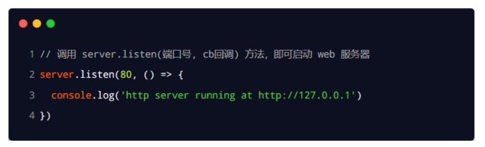

# 初识Node.js与内置模块

## 1. 初识 Node.js

### 1.1 回顾与思考

#### 1. 已经掌握了哪些技术


#### 2. 浏览器中的 JavaScript 的组成部分


#### 3. 思考：为什么 JavaScript 可以在浏览器中被执行


不同的浏览器使用不同的 JavaScript 解析引擎：

-  Chrome 浏览器  =>  V8
-  Firefox 浏览器    =>  OdinMonkey（奥丁猴）
-  Safri 浏览器        =>  JSCore
-  IE 浏览器            =>  Chakra（查克拉）
-  etc...

其中，Chrome 浏览器的 V8 解析引擎性能最好！

#### 4. 思考：为什么 JavaScript 可以操作 DOM 和 BOM


每个浏览器都**内置了** DOM、BOM 这样的 API 函数，因此，浏览器中的 JavaScript 才可以调用它们。

#### 5. 浏览器中的 JavaScript 运行环境

运行环境是指代码正常运行所需的必要环境。


总结：

1. V8 引擎负责解析和执行 JavaScript 代码。
2. 内置 API 是由运行环境提供的特殊接口，只能在所属的运行环境中被调用。

#### 6. 思考：JavaScript 能否做后端开发


当然可以咯，不过需要借助Node.js的运行环境

### 1.2 Node.js 简介

#### 1. 什么是 Node.js

Node.js 是一个基于 Chrome V8 引擎的 JavaScript 运行环境。

Node.js 的官网地址： https://nodejs.org/zh-cn/

#### 2. Node.js 中的 JavaScript 运行环境


注意：

1. 浏览器是 JavaScript 的前端运行环境。
2. Node.js 是 JavaScript 的后端运行环境。
3. Node.js 中无法调用 DOM 和 BOM 等浏览器内置 API。

#### 3. Node.js 可以做什么

Node.js 作为一个 JavaScript 的运行环境，仅仅提供了基础的功能和 API。然而，基于 Node.js 提供的这些基础能，很多强大的工具和框架如雨后春笋，层出不穷，所以学会了 Node.js ，可以让前端程序员胜任更多的工作和岗位：

- 基于 Express 框架（http://www.expressjs.com.cn/），可以快速构建 Web 应用
- 基于 Electron 框架（https://electronjs.org/），可以构建跨平台的桌面应用
- 基于 restify 框架（http://restify.com/），可以快速构建 API 接口项目
- 读写和操作数据库、创建实用的命令行工具辅助前端开发、etc…

总之：Node.js 是大前端时代的“大宝剑”，有了 Node.js 这个超级 buff 的加持，前端程序员的行业竞争力会越来越强！

#### 4. Node.js 怎么学

浏览器中的 JavaScript 学习路径：
JavaScript 基础语法 + 浏览器内置 API（DOM + BOM） + 第三方库（jQuery、art-template 等）

Node.js 的学习路径：
JavaScript 基础语法 + Node.js 内置 API 模块（fs、path、http等）+ 第三方 API 模块（express、mysql 等）

### 1.3 Node.js 环境的安装

如果希望通过 Node.js 来运行 Javascript 代码，则必须在计算机上安装 Node.js 环境才行。

安装包可以从 Node.js 的官网首页直接下载，进入到 Node.js 的官网首页（https://nodejs.org/en/），点击绿色的按钮，下载所需的版本后，双击直接安装即可。

#### 1. 区分 LTS 版本和 Current 版本的不同

1. LTS 为长期稳定版，对于追求稳定性的企业级项目来说，推荐安装 LTS 版本的 Node.js。
2. Current 为新特性尝鲜版，对热衷于尝试新特性的用户来说，推荐安装 Current 版本的 Node.js。但是，Current 版本中可能存在隐藏的 Bug 或安全性漏洞，因此不推荐在企业级项目中使用 Current 版本的 Node.js。

#### 2. 查看已安装的 Node.js 的版本号

打开终端，在终端输入命令 node –v 后，按下回车键，即可查看已安装的 Node.js 的版本号。

Windows 系统快速打开终端的方式：
使用快捷键（Windows徽标键 + R）打开运行面板，输入 cmd 后直接回车，即可打开终端。

#### 3. 什么是终端

终端（英文：Terminal）是专门为开发人员设计的，用于实现人机交互的一种方式。

作为一名合格的程序员，我们有必要识记一些常用的终端命令，来辅助我们更好的操作与使用计算机。


### 1.4 在 Node.js 环境中执行 JavaScript 代码

1. 打开终端
2. 切换所处目录 然后执行命令
3. 输入 node 要执行的js文件的路径

#### 终端中的快捷键

在 Windows 的 powershell 或 cmd 终端中，我们可以通过如下快捷键，来提高终端的操作效率：

1. 使用 ↑ 键，可以快速定位到上一次执行的命令
2. 使用 tab 键，能够快速补全路径
3. 使用 esc 键，能够快速清空当前已输入的命令
4. 输入 cls 命令，可以清空终端

## 2. fs 文件系统模块

### 2.1 什么是 fs 文件系统模块

fs 模块是 Node.js 官方提供的、用来操作文件的模块。它提供了一系列的方法和属性，用来满足用户对文件的操作需求。

例如：

-  fs.readFile() 方法，用来读取指定文件中的内容
-  fs.writeFile() 方法，用来向指定的文件中写入内容

如果要在 JavaScript 代码中，使用 fs 模块来操作文件，则需要使用如下的方式先导入它：


### 2.2 读取指定文件中的内容

#### 1. fs.readFile() 的语法格式

使用 fs.readFile() 方法，可以读取指定文件中的内容，语法格式如下：


参数解读：

- 参数1：必选参数，字符串，表示文件的路径。
- 参数2：可选参数，表示以什么编码格式来读取文件。
- 参数3：必选参数，文件读取完成后，通过回调函数拿到读取的结果。

#### 2. fs.readFile() 的示例代码

以 utf8 的编码格式，读取指定文件的内容，并打印 err 和 dataStr 的值：


#### 3. 判断文件是否读取成功

可以判断 err 对象是否为 null，从而知晓文件读取的结果：


### 2.3 向指定的文件中写入内容

fs.writeFile() 方法只能用来创建文件，不能用来创建路径(文件夹...)重复调用 

fs.writeFile() 写入同一个文件，新写入的内容会覆盖之前的旧内容（没有追加的功能...）

#### 1. fs.writeFile() 的语法格式

使用 fs.writeFile() 方法，可以向指定的文件中写入内容，语法格式如下：


参数解读：

- 参数1：必选参数，需要指定一个文件路径的字符串，表示文件的存放路径。
- 参数2：必选参数，表示要写入的内容。
- 参数3：可选参数，表示以什么格式写入文件内容，默认值是 utf8。
- 参数4：必选参数，文件写入完成后的回调函数。

#### 2. fs.writeFile() 的示例代码

向指定的文件路径中，写入文件内容：


#### 3. 判断文件是否写入成功

可以判断 err 对象是否为 null，从而知晓文件写入的结果：


### 2.4 练习 - 考试成绩整理

使用 fs 文件系统模块，将素材目录下成绩.txt文件中的考试数据，整理到成绩-ok.txt文件中。

整理前，成绩.txt文件中的数据格式如下：


整理完成之后，希望得到的成绩-ok.txt文件中的数据格式如下：


核心实现步骤 

1. 导入需要的 fs 文件系统模块
2. 使用 fs.readFile() 方法，读取素材目录下的 成绩.txt 文件
3. 判断文件是否读取失败
4. 文件读取成功后，处理成绩数据
5. 将处理完成的成绩数据，调用 fs.writeFile() 方法，写入到新文件 成绩-ok.txt 中

```js
// 1. 导入 fs 模块
const fs = require('fs')

// 2. 调用 fs.readFile() 读取文件的内容
fs.readFile('../素材/成绩.txt', 'utf8', function(err, dataStr) {
  // 3. 判断是否读取成功
  if (err) {
    return console.log('读取文件失败！' + err.message)
  }
  // console.log('读取文件成功！' + dataStr)

  // 4.1 先把成绩的数据，按照空格进行分割
  const arrOld = dataStr.split(' ')
  // 4.2 循环分割后的数组，对每一项数据，进行字符串的替换操作
  const arrNew = []
  arrOld.forEach(item => {
    arrNew.push(item.replace('=', '：'))
  })
  // 4.3 把新数组中的每一项，进行合并，得到一个新的字符串
  const newStr = arrNew.join('\r\n')

  // 5. 调用 fs.writeFile() 方法，把处理完毕的成绩，写入到新文件中
  fs.writeFile('./files/成绩-ok.txt', newStr, function(err) {
    if (err) {
      return console.log('写入文件失败！' + err.message)
    }
    console.log('成绩写入成功！')
  })
})

```


### 2.5 fs 模块 - 路径动态拼接的问题

> 这个比较奇怪，这个是根据你执行的node指令路径来算的相对路径，不像Java一样是根据代码文件的位置来判断相对路径的下面的解决办法就是拼接了一个代码文件所处位置才来加相对路径的，这个就和Java的一样了

在使用 fs 模块操作文件时，如果提供的操作路径是以 ./ 或 ../ 开头的相对路径时，很容易出现路径动态拼接错误的问题。

原因：代码在运行的时候，会以执行 node 命令时所处的目录，动态拼接出被操作文件的完整路径。

解决方案：在使用 fs 模块操作文件时，直接提供完整的路径，不要提供 ./ 或 ../ 开头的相对路径，从而防止路径动态拼接的问题。

(如果要解决这个问题，直接提供一个完整的文件存放路径就可以了,如下)


## 3. path 路径模块

### 3.1 什么是 path 路径模块

path 模块是 Node.js 官方提供的、用来处理路径的模块。它提供了一系列的方法和属性，用来满足用户对路径的处理需求。

例如：

-  path.join() 方法，用来将多个路径片段拼接成一个完整的路径字符串
-  path.basename() 方法，用来从路径字符串中，将文件名解析出来

如果要在 JavaScript 代码中，使用 path 模块来处理路径，则需要使用如下的方式先导入它：


### 3.2 路径拼接

#### 1. path.join() 的语法格式

使用 path.join() 方法，可以把多个路径片段拼接为完整的路径字符串，语法格式如下：


参数解读：

- ...paths `<string> `路径片段的序列
- 返回值:` <string>`

#### 2. path.join() 的代码示例

使用 path.join() 方法，可以把多个路径片段拼接为完整的路径字符串：


注意：今后凡是涉及到路径拼接的操作，都要使用 path.join() 方法进行处理。不要直接使用 + 进行字符串的拼接。

### 3.3 获取路径中的文件名

#### 1. path.basename() 的语法格式

使用 path.basename() 方法，可以获取路径中的最后一部分，经常通过这个方法获取路径中的文件名，语法格式如下：


参数解读：

path` <string>` 必选参数，表示一个路径的字符串

ext `<string> `可选参数，表示文件扩展名,加了这个参数会移除扩展名 

返回: `<string>` 表示路径中的最后一部分

#### 2. path.basename() 的代码示例

使用 path.basename() 方法，可以从一个文件路径中，获取到文件的名称部分：


### 3.4 获取路径中的文件扩展名

#### 1. path.extname() 的语法格式

使用 path.extame() 方法，可以获取路径中的扩展名部分，语法格式如下：


参数解读：

- path `<string>`必选参数，表示一个路径的字符串
- 返回:` <string>` 返回得到的扩展名字符串

#### 2. path.extname() 的代码示例

使用 path.extname() 方法，可以获取路径中的扩展名部分：


## 4. http 模块

### 4.1 什么是 http 模块

回顾：什么是客户端、什么是服务器？

在网络节点中，负责消费资源的电脑，叫做客户端；负责对外提供网络资源的电脑，叫做服务器。


http 模块是 Node.js 官方提供的、用来创建 web 服务器的模块。通过 http 模块提供的 http.createServer() 方法，就能方便的把一台普通的电脑，变成一台 Web 服务器，从而对外提供 Web 资源服务。


如果要希望使用 http 模块创建 Web 服务器，则需要先导入它：


### 4.2 进一步理解 http 模块的作用

服务器和普通电脑的区别在于，服务器上安装了 web 服务器软件，例如：IIS、Apache 等。通过安装这些服务器软件，就能把一台普通的电脑变成一台 web 服务器。

在 Node.js 中，我们不需要使用 IIS、Apache 等这些第三方 web 服务器软件。因为我们可以基于 Node.js 提供的 http 模块，通过几行简单的代码，就能轻松的手写一个服务器软件，从而对外提供 web 服务。

### 4.3 服务器相关的概念

#### 1. IP 地址

IP 地址就是互联网上每台计算机的唯一地址，因此 IP 地址具有唯一性。如果把“个人电脑”比作“一台电话”，那么“IP地址”就相当于“电话号码”，只有在知道对方 IP 地址的前提下，才能与对应的电脑之间进行数据通信。

IP 地址的格式：通常用“点分十进制”表示成（a.b.c.d）的形式，其中，a,b,c,d 都是 0~255 之间的十进制整数。例如：用点分十进表示的 IP地址（192.168.1.1）

注意：

1. 互联网中每台 Web 服务器，都有自己的 IP 地址，例如：大家可以在 Windows 的终端中运行 ping www.baidu.com 命令，即可查看到百度服务器的 IP 地址。
2. 在开发期间，自己的电脑既是一台服务器，也是一个客户端，为了方便测试，可以在自己的浏览器中输入 127.0.0.1 这个 IP 地址，就能把自己的电脑当做一台服务器进行访问了。

#### 2. 域名和域名服务器

尽管 IP 地址能够唯一地标记网络上的计算机，但IP地址是一长串数字，不直观，而且不便于记忆，于是人们又发明了另一套字符型的地址方案，即所谓的域名（Domain Name）地址。

IP地址和域名是一一对应的关系，这份对应关系存放在一种叫做域名服务器(DNS，Domain name server)的电脑中。使用者只需通过好记的域名访问对应的服务器即可，对应的转换工作由域名服务器实现。因此，域名服务器就是提供 IP 地址和域名之间的转换服务的服务器。


注意：

1. 单纯使用 IP 地址，互联网中的电脑也能够正常工作。但是有了域名的加持，能让互联网的世界变得更加方便。
2. 在开发测试期间， 127.0.0.1 对应的域名是 localhost，它们都代表我们自己的这台电脑，在使用效果上没有任何区别。

#### 3. 端口号

计算机中的端口号，就好像是现实生活中的门牌号一样。通过门牌号，外卖小哥可以在整栋大楼众多的房间中，准确把外卖送到你的手中。

同样的道理，在一台电脑中，可以运行成百上千个 web 服务。每个 web 服务都对应一个唯一的端口号。客户端发送过来的网络请求，通过端口号，可以被准确地交给对应的 web 服务进行处理。


注意：

1. 每个端口号不能同时被多个 web 服务占用。
2. 在实际应用中，URL 中的 80 端口可以被省略。

### 4.4 创建最基本的 web 服务器

#### 1. 创建 web 服务器的基本步骤

1. 导入 http 模块
2. 创建 web 服务器实例
3. 为服务器实例绑定 request 事件，监听客户端的请求
4. 启动服务器

#### 2. 代码示例

步骤1 - 导入 http 模块

如果希望在自己的电脑上创建一个 web 服务器，从而对外提供 web 服务，则需要导入 http 模块：


步骤2 - 创建 web 服务器实例

调用 http.createServer() 方法，即可快速创建一个 web 服务器实例：


步骤3 - 为服务器实例绑定 request 事件

为服务器实例绑定 request 事件，即可监听客户端发送过来的网络请求：


步骤4 - 启动服务器

调用服务器实例的 .listen() 方法，即可启动当前的 web 服务器实例：



#### 3. req 请求对象

只要服务器接收到了客户端的请求，就会调用通过 server.on() 为服务器绑定的 request 事件处理函数。

如果想在事件处理函数中，访问与客户端相关的数据或属性，可以使用如下的方式：


这个url是从端口号后面的开始的

比如:

1./
2./index.html

#### 4. res 响应对象

在服务器的 request 事件处理函数中，如果想访问与服务器相关的数据或属性，可以使用如下的方式：


#### 5. 解决中文乱码问题

当调用 res.end() 方法，向客户端发送中文内容的时候，会出现乱码问题，此时，需要手动设置内容的编码格式：


### 4.5 根据不同的 url 响应不同的 html 内容

#### 1. 核心实现步骤

1. 获取请求的 url 地址
2. 设置默认的响应内容为 404 Not found
3. 判断用户请求的是否为 / 或 /index.html 首页
4. 判断用户请求的是否为 /about.html 关于页面
5. 设置 Content-Type 响应头，防止中文乱码
6. 使用 res.end() 把内容响应给客户端

#### 2. 动态响应内容


# 模块化
