# NoSql与Sql的区别

## 认识NoSQL

**NoSql**可以翻译做Not Only Sql（不仅仅是SQL），或者是No Sql（非Sql的）数据库。是相对于传统关系型数据库而言，有很大差异的一种特殊的数据库，因此也称之为**非关系型数据库**。

## 结构化与非结构化

传统关系型数据库是**结构化数据**，每一张表都有**严格的约束信息**：字段名.字段数据类型.字段约束等等信息，插入的数据必须遵守这些约束：


而NoSql则对数据库格式**没有严格约束**，往往形式松散，自由。

可以是键值型：


也可以是文档型：


甚至可以是图格式：


## 关联和非关联

传统数据库的表与表之间往往存在关联，例如外键：


而**非关系型数据库不存在关联关系**，要维护关系要么靠代码中的**业务逻辑**（最好靠业务逻辑），要么靠数据之间的耦合：

```json
{
  id: 1,
  name: "张三",
  orders: [
    {
       id: 1,
       item: {
	 id: 10, title: "荣耀6", price: 4999
       }
    },
    {
       id: 2,
       item: {
	 id: 20, title: "小米11", price: 3999
       }
    }
  ]
}
```

此处要维护“张三”的订单与商品“荣耀”和“小米11”的关系，不得不冗余的将这两个商品保存在张三的订单文档中，不够优雅。**还是建议用业务来维护关联关系。**


## 查询方式

传统关系型数据库会基于Sql语句做查询，语法有统一标准；

而**不同的非关系数据库查询语法差异极大**，五花八门各种各样。


## 事务

传统关系型数据库能满足事务ACID的原则。


而非关系型数据库往往不支持事务，或者不能严格保证ACID的特性，只能实现基本的一致性。


## 总结

除了上述四点以外，在存储方式.扩展性.查询性能上关系型与非关系型也都有着显著差异，总结如下：


- 存储方式
  - 关系型数据库基于磁盘进行存储，会有大量的磁盘IO，对性能有一定影响
  - 非关系型数据库，他们的操作**更多的是依赖于内存**来操作，内存的读写速度会非常快，性能自然会好一些

* 扩展性
  * 关系型数据库集群模式一般是主从，主从数据一致，起到数据备份的作用，称为垂直扩展。
  * 非关系型数据库可以将数据拆分，存储在不同机器上，可以保存海量数据，解决内存大小有限的问题。称为水平扩展。
  * 关系型数据库因为表之间存在关联关系，如果做水平扩展会给数据查询带来很多麻烦

# Redis

## Redis概述

### Redis介绍

- Redis是一个开源的key-value存储系统。
- 和Memcached类似，它支持存储的value类型相对更多，包括string(字符串)、list(链表)、set(集合)、zset(sorted set –有序集合)和hash（哈希类型）。
- 这些数据类型都支持push/pop、add/remove及取交集并集和差集及更丰富的操作，而且这些操作都是原子性的。
- 在此基础上，Redis支持各种不同方式的排序。
- 与memcached一样，为了保证效率，数据都是缓存在内存中。
- 区别的是Redis会周期性的把更新的数据写入磁盘或者把修改操作写入追加的记录文件。
- 并且在此基础上实现了master-slave(主从)同步。

### 应用场景

**配合关系型数据库做高速缓存**

- 高频次，热门访问的数据，降低数据库IO。
- 分布式架构，做session共享。


**多样的数据结构存储持久化数据**


### 相关技术

**Redis使用的是单线程+多路IO复用技术：**

多路复用是指使用一个线程来检查多个文件描述符（Socket）的就绪状态，比如调用select和poll函数，传入多个文件描述符，如果有一个文件描述符就绪，则返回，否则阻塞直到超时。得到就绪状态后进行真正的操作可以在同一个线程里执行，也可以启动线程执行（比如使用线程池）。

**串行 vs 多线程+锁（memcached） vs 单线程+多路IO复用(Redis)**（与Memcache三点不同: 支持多数据类型，支持持久化，单线程+多路IO复用） 。

## Redis数据类型

### **Redis**字符串(String)

#### 概述

1. String是Redis最基本的类型，你可以理解成与Memcached一模一样的类型，一个key对应一个value。
2. String类型是二进制安全的。意味着Redis的string可以包含任何数据。比如jpg图片或者序列化的对象。
3. String类型是Redis最基本的数据类型，一个Redis中字符串value最多可以是512M。

#### 数据结构

String的数据结构为简单动态字符串(Simple Dynamic String,缩写SDS)，是可以修改的字符串，内部结构实现上类似于Java的ArrayList，采用预分配冗余空间的方式来减少内存的频繁分配.


如图中所示，内部为当前字符串实际分配的空间capacity一般要高于实际字符串长度len。当字符串长度小于1M时，扩容都是加倍现有的空间，如果超过1M，扩容时一次只会多扩1M的空间。需要注意的是字符串最大长度为512M。

### Redis列表（List)

#### 概述

单键多值：Redis 列表是简单的字符串列表，按照插入顺序排序。你可以添加一个元素到列表的头部（左边）或者尾部（右边）。它的底

层实际是个**双向链表**，对两端的操作性能很高，通过索引下标的操作中间的节点性能会较差。


#### 数据结构

- List的数据结构为快速链表quickList。

- 首先在列表元素较少的情况下会使用一块连续的内存存储，这个结构是ziplist，也即是压缩列表。它将所有的元素紧挨着一起存储，分配的是一块连续的内存。

- 当数据量比较多的时候才会改成quicklist。因为普通的链表需要的附加指针空间太大，会比较浪费空间。比如这个列表里存的只是int类型的数据，结构上还需要两个额外的指针prev和next。

  

- Redis将链表和ziplist结合起来组成了quicklist。也就是将多个ziplist使用双向指针串起来使用。这样既满足了快速的插入删除性能，又不会出现太大的空间冗余。

### Redis集合（Set）

#### 概述

- Redis set对外提供的功能与list类似，是一个列表的功能，特殊之处在于set是可以**自动排重**的，当你需要存储一个列表数据，又不希望出现重复数据时，set是一个很好的选择，并且set提供了判断某个成员是否在一个set集合内的重要接口，这个也是list所不能提供的。
- Redis的Set是string类型的无序集合。它底层其实是一个value为null的hash表，所以添加，删除，查找的**复杂度都是O(1)**。
- 一个算法，随着数据的增加，执行时间的长短，如果是O(1)，数据增加，查找数据的时间不变。

#### 数据结构

- Set数据结构是dict字典，字典是用哈希表实现的。
- Java中HashSet的内部实现使用的是HashMap，只不过所有的value都指向同一个对象。Redis的set结构也是一样，它的内部也使用hash结构，所有的value都指向同一个内部值。

### Redis哈希（Hash）

#### 概述

- Redis hash 是一个键值对集合。

- Redis hash是一个string类型的field和value的映射表，hash特别适合用于存储对象。

- 类似Java里面的Map<String,Object>。

- 用户ID为查找的key，存储的value用户对象包含姓名，年龄，生日等信息，如果用普通的key/value结构来存储，主要有以下2种存储方式：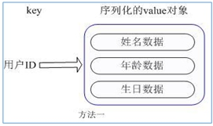

  方法一：每次修改用户的某个属性需要，先反序列化改好后再序列化回去。开销较大。

  方法二：用户ID数据冗余。

  

通过 key(用户ID) + field(属性标签) 就可以操作对应属性数据了，既不需要重复存储数据，也不会带来序列化和并发修改控制的问题。

#### 数据结构

Hash类型对应的数据结构是两种：ziplist（压缩列表），hashtable（哈希表）。当field-value长度较短且个数较少时，使用ziplist，否则使用hashtable。

### Redis有序集合Zset（Sorted set）

#### 概述

- Redis有序集合zset与普通集合set非常相似，是一个没有重复元素的字符串集合。
- 不同之处是有序集合的每个成员都关联了一个**评分（**score），这个评分（score）被用来按照从最低分到最高分的方式排序集合中的成员。集合的成员是唯一的，但是评分可以是重复了 。
- 因为元素是有序的，所以你也可以很快的根据评分（score）或者次序（position）来获取一个范围的元素。
- 访问有序集合的中间元素也是非常快的，因此你能够使用有序集合作为一个没有重复成员的智能列表。

#### 数据结构

SortedSet(zset)是Redis提供的一个非常特别的数据结构，一方面它等价于Java的数据结构Map<String, Double>，可以给每一个元素value赋予一个权重score，另一方面它又类似于TreeSet，内部的元素会按照权重score进行排序，可以得到每个元素的名次，还可以通过score的范围来获取元素的列表。

zset底层使用了两个数据结构：

1. hash，hash的作用就是关联元素value和权重score，保障元素value的唯一性，可以通过元素value找到相应的score值。
2. 跳跃表，跳跃表的目的在于给元素value排序，根据score的范围获取元素列表。

#### 跳跃表

**简介**

有序集合在生活中比较常见，例如根据成绩对学生排名，根据得分对玩家排名等。对于有序集合的底层实现，可以用数组、平衡树、链表等。数组不便元素的插入、删除；平衡树或红黑树虽然效率高但结构复杂；链表查询需要遍历所有效率低。Redis采用的是跳跃表，跳跃表效率堪比红黑树，实现远比红黑树简单。

**实例**

对比有序链表和跳跃表，从链表中查询出51：

1. 有序链表


要查找值为51的元素，需要从第一个元素开始依次查找、比较才能找到。共需要6次比较。

1. 跳跃表


- 从第2层开始，1节点比51节点小，向后比较；
- 21节点比51节点小，继续向后比较，后面就是NULL了，所以从21节点向下到第1层；
- 在第1层，41节点比51节点小，继续向后，61节点比51节点大，所以从41向下；
- 在第0层，51节点为要查找的节点，节点被找到，共查找4次。

从此可以看出跳跃表比有序链表效率要高。

### Redis Bitmaps

#### 概述

Redis提供了Bitmaps这个“数据类型”可以实现对位的操作：

- Bitmaps本身不是一种数据类型， 实际上它就是字符串（key-value） ， 但是它可以对字符串的位进行操作。
- Bitmaps单独提供了一套命令， 所以在Redis中使用Bitmaps和使用字符串的方法不太相同。 可以把Bitmaps想象成一个以位为单位的数组， 数组的每个单元只能存储0和1， 数组的下标在Bitmaps中叫做偏移量。

#### **Bitmaps**与set对比

假设网站有1亿用户， 每天独立访问的用户有5千万， 如果每天用集合类型和Bitmaps分别存储活跃用户可以得到表：

| set和Bitmaps存储一天活跃用户对比 |                    |                  |                        |
| -------------------------------- | ------------------ | ---------------- | ---------------------- |
| 数据类型                         | 每个用户id占用空间 | 需要存储的用户量 | 全部内存量             |
| 集合                             | 64位               | 50000000         | 64位*50000000 = 400MB  |
| Bitmaps                          | 1位                | 100000000        | 1位*100000000 = 12.5MB |

很明显， 这种情况下使用Bitmaps能节省很多的内存空间， 尤其是随着时间推移节省的内存还是非常可观的。

| set和Bitmaps存储独立用户空间对比 |        |        |       |
| -------------------------------- | ------ | ------ | ----- |
| 数据类型                         | 一天   | 一个月 | 一年  |
| 集合                             | 400MB  | 12GB   | 144GB |
| Bitmaps                          | 12.5MB | 375MB  | 4.5GB |

但Bitmaps并不是万金油， 假如该网站每天的独立访问用户很少， 例如只有10万（大量的僵尸用户） ， 那么两者的对比如下表所示， 很显然， 这时候使用Bitmaps就不太合适了， 因为基本上大部分位都是0。

| set和Bitmaps存储一天活跃用户对比（用户比较少） |                    |                  |                        |
| ---------------------------------------------- | ------------------ | ---------------- | ---------------------- |
| 数据类型                                       | 每个userid占用空间 | 需要存储的用户量 | 全部内存量             |
| 集合                                           | 64位               | 100000           | 64位*100000 = 800KB    |
| Bitmaps                                        | 1位                | 100000000        | 1位*100000000 = 12.5MB |

### **HyperLogLog**

在工作当中，我们经常会遇到与统计相关的功能需求，比如统计网站PV（PageView页面访问量），可以使用Redis的incr、incrby轻松实现。但像UV（UniqueVisitor独立访客）、独立IP数、搜索记录数等需要去重和计数的问题如何解决？这种求集合中不重复元素个数的问题称为基数问题。

解决基数问题有很多种方案：

1. 数据存储在MySQL表中，使用distinct count计算不重复个数。
2. 使用Redis提供的hash、set、bitmaps等数据结构来处理。

以上的方案结果精确，但随着数据不断增加，导致占用空间越来越大，对于非常大的数据集是不切实际的。能否能够降低一定的精度来平衡存储空间？Redis推出了HyperLogLog。

- Redis HyperLogLog 是用来做基数统计的算法，HyperLogLog 的优点是：在输入元素的数量或者体积非常非常大时，计算基数所需的空间总是固定的、并且是很小的。
- 在 Redis 里面，每个 HyperLogLog 键只需要花费 12 KB 内存，就可以计算接近 2^64 个不同元素的基数。这和计算基数时，元素越多耗费内存就越多的集合形成鲜明对比。
- 但是，因为 HyperLogLog 只会根据输入元素来计算基数，而不会储存输入元素本身，所以 HyperLogLog 不能像集合那样，返回输入的各个元素。

什么是基数?

比如数据集 {1, 3, 5, 7, 5, 7, 8}，那么这个数据集的基数集为 {1, 3, 5 ,7, 8}，基数(不重复元素)为5。 基数估计就是在误差可接受的范围内，快速计算基数。

### **Geospatial**

Redis 3.2 中增加了对GEO类型的支持。GEO，Geographic，地理信息的缩写。该类型，就是元素的2维坐标，在地图上就是经纬度。redis基于该类型，提供了经纬度设置，查询，范围查询，距离查询，经纬度Hash等常见操作。

## Redis的发布和订阅

### 什么是发布和订阅

- Redis 发布订阅 (pub/sub) 是一种消息通信模式：发送者 (pub) 发送消息，订阅者 (sub) 接收消息。
- Redis 客户端可以订阅任意数量的频道。

### **Redis**的发布和订阅

1. 客户端可以订阅频道如下图：

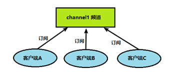

1. 当给这个频道发布消息后，消息就会发送给订阅的客户端：


### **发布订阅命令行实现**

1. 打开一个客户端订阅channel1：
2. 打开另一个客户端，给channel1发布消息hello：
3. 打开第一个客户端可以看到发送的消息：


## Redis事务、锁机制秒杀

### Redis事务定义

Redis事务是一个单独的隔离操作：事务中的所有命令都会序列化、按顺序地执行。事务在执行的过程中，不会被其他客户端发送来的命令请求所打断。

Redis事务的主要作用就是**串联多个命令**防止别的命令插队。

### Multi、Exec、discard

Redis事务中有Multi、Exec和discard三个指令，在Redis中，从输入Multi命令开始，输入的命令都会依次进入命令队列中，但不会执行，直到输入Exec后，Redis会将之前的命令队列中的命令依次执行。而组队的过程中可以通过discard来放弃组队。


案例说明：


组队成功，提交成功。


组队阶段报错，提交失败。


组队成功，提交有成功有失败情况。

### 事务的错误处理

组队中某个命令出现了报告错误，执行时整个的所有队列都会被取消。


如果执行阶段某个命令报出了错误，则只有报错的命令不会被执行，而其他的命令都会执行，不会回滚。


### **为什么要做成事务**

想想一个场景：有很多人有你的账户，同时去参加双十一抢购。

### **事务冲突的问题**

**例子**

- 一个请求想给金额减8000；
- 一个请求想给金额减5000；
- 一个请求想给金额减1000。最终我们可以发现，总共金额是10000，如果请求全部执行，那最后的金额变为-4000，很明显不合理。

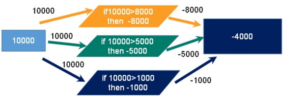

**悲观锁**


**悲观锁(Pessimistic Lock)**，顾名思义，就是很悲观，每次去拿数据的时候都认为别人会修改，所以每次在拿数据的时候都会上锁，这样别人想拿这个数据就会block直到它拿到锁。传统的关系型数据库里边就用到了很多这种锁机制，比如行锁**，**表锁等，读锁，写锁等，都是在做操作之前先上锁。

**乐观锁**


**乐观锁(Optimistic Lock)****，顾名思义，就是很乐观，每次去拿数据的时候都认为别人不会修改，所以不会上锁，但是在更新的时候会判断一下在此期间别人有没有去更新这个数据，可以使用版本号等机制。****乐观锁适用于多读的应用类型，这样可以提高吞吐量**。Redis就是利用这种**check-and-set机制**实现事务的。

**WATCH** **key** **[key …]**

在执行multi之前，先执行watch key1 [key2]，可以监视一个(或多个) key ，如果在事务**执行之前这个(或这些) key被其他命令所改动，那么事务将被打断。**


**unwatch**

取消 WATCH 命令对所有 key 的监视。如果在执行 WATCH 命令之后，EXEC 命令或DISCARD 命令先被执行了的话，那么就不需要再执行UNWATCH 了。

### Redis事务三特性

- 单独的隔离操作 ：事务中的所有命令都会序列化、按顺序地执行。事务在执行的过程中，不会被其他客户端发送来的命令请求所打断。
- 没有隔离级别的概念 ：队列中的命令没有提交之前都不会实际被执行，因为事务提交前任何指令都不会被实际执行。
- 不保证原子性 ：事务中如果有一条命令执行失败，其后的命令仍然会被执行，没有回滚 。

## Redis_事务秒杀案例

### **解决计数器和人员记录的事务操作**


### Redis事务—秒杀并发模拟

**使用工具ab模拟测试：**

- CentOS6 默认安装
- CentOS7需要手动安装

**通过ab测试**

im postfile 模拟表单提交参数， 以&符号结尾，存放当前目录。

内容：prodid=0101&

执行：ab -n 2000 -c 200 -k -p ~/postfile -T application/x-www-form-urlencoded

访问：http://192.168.2.115:8081/Seckill/doseckill

**超卖**

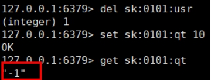

### 超卖问题


**利用乐观锁淘汰用户，解决超卖问题。**


**主要代码：**

```java
public class SecKill_redis {

	public static void main(String[] args) {
		Jedis jedis =new Jedis("192.168.44.168",6379);
		System.out.println(jedis.ping());
		jedis.close();
	}

	//秒杀过程
	public static boolean doSecKill(String uid,String prodid) throws IOException {
		//1 uid和prodid非空判断
		if(uid == null || prodid == null) {
			return false;
		}

		//2 连接redis
		//Jedis jedis = new Jedis("192.168.44.168",6379);
		//通过连接池得到jedis对象
		JedisPool jedisPoolInstance = JedisPoolUtil.getJedisPoolInstance();
		Jedis jedis = jedisPoolInstance.getResource();

		//3 拼接key
		// 3.1 库存key
		String kcKey = "sk:"+prodid+":qt";
		// 3.2 秒杀成功用户key
		String userKey = "sk:"+prodid+":user";

		//监视库存
		jedis.watch(kcKey);

		//4 获取库存，如果库存null，秒杀还没有开始
		String kc = jedis.get(kcKey);
		if(kc == null) {
			System.out.println("秒杀还没有开始，请等待");
			jedis.close();
			return false;
		}

		// 5 判断用户是否重复秒杀操作
		if(jedis.sismember(userKey, uid)) {
			System.out.println("已经秒杀成功了，不能重复秒杀");
			jedis.close();
			return false;
		}

		//6 判断如果商品数量，库存数量小于1，秒杀结束
		if(Integer.parseInt(kc)<=0) {
			System.out.println("秒杀已经结束了");
			jedis.close();
			return false;
		}

		//7 秒杀过程
		//使用事务
		Transaction multi = jedis.multi();

		//组队操作
		multi.decr(kcKey);
		multi.sadd(userKey,uid);

		//执行
		List<Object> results = multi.exec();

		if(results == null || results.size()==0) {
			System.out.println("秒杀失败了....");
			jedis.close();
			return false;
		}

		//7.1 库存-1
		//jedis.decr(kcKey);
		//7.2 把秒杀成功用户添加清单里面
		//jedis.sadd(userKey,uid);

		System.out.println("秒杀成功了..");
		jedis.close();
		return true;
	}
}
```


### 继续增加并发测试

**连接有限制**

增加-r参数，-r Don’t exit on socket receive errors。

**已经秒光，可是还有库存**

已经秒光，可是还有库存。原因：乐观锁导致很多请求都失败。先点的没秒到，后点的可能秒到了。


**连接超时，通过连接池解决**

节省每次连接redis服务带来的消耗，把连接好的实例反复利用。通过参数管理连接的行为，代码见项目中：

连接池参数：

- MaxTotal：控制一个pool可分配多少个jedis实例，通过pool.getResource()来获取；如果赋值为-1，则表示不限制；如果pool已经分配了MaxTotal个jedis实例，则此时pool的状态为exhausted。
- maxIdle：控制一个pool最多有多少个状态为idle(空闲)的jedis实例；
- MaxWaitMillis：表示当borrow一个jedis实例时，最大的等待毫秒数，如果超过等待时间，则直接抛JedisConnectionException；
- testOnBorrow：获得一个jedis实例的时候是否检查连接可用性（ping()）；如果为true，则得到的jedis实例均是可用的。

### **解决库存遗留问题**

**LUA脚本在Redis中的优势**

- 将复杂的或者多步的redis操作，写为一个脚本，一次提交给redis执行，减少反复连接redis的次数，提升性能。

- LUA脚本是类似redis事务，有一定的原子性，不会被其他命令插队，可以完成一些redis事务性的操作。

- 但是注意redis的lua脚本功能，只有在Redis 2.6以上的版本才可以使用。

- 利用lua脚本淘汰用户，解决超卖问题，redis 2.6版本以后，通过lua脚本解决**争抢问题**，实际上是**redis** **利用其单线程的特性，用任务队列的方式解决多任务并发问题**。

  

## **Redis**持久化之RDB

### **总体介绍**

官网介绍：[http://www.redis.io](http://www.redis.io/)

Redis 提供了2个不同形式的持久化方式：

- RDB（Redis DataBase）
- AOF（Append Of File）

### **RDB**

#### **简介**

在指定的时间间隔内将内存中的数据集快照写入磁盘， 也就是行话讲的Snapshot快照，它恢复时是将快照文件直接读到内存里。

#### **备份是如何执行的**

Redis会单独创建（fork）一个子进程来进行持久化，首先会将数据写入到一个临时文件中，待持久化过程都结束了，再用这个临时文件替换上次持久化好的文件。整个过程中，主进程是不进行任何IO操作的，这就确保了极高的性能。如果需要进行大规模数据的恢复，且对于数据恢复的完整性不是非常敏感，那RDB方式要比AOF方式更加的高效。**RDB的缺点是最后一次持久化后的数据可能丢失**。

#### Fork

- Fork的作用是复制一个与当前进程一样的进程。新进程的所有数据（变量、环境变量、程序计数器等） 数值都和原进程一致，但是是一个全新的进程，并作为原进程的子进程。
- 在Linux程序中，fork()会产生一个和父进程完全相同的子进程，但子进程在此后多会exec系统调用，出于效率考虑，Linux中引入了“**写时复制技术**”。
- **一般情况父进程和子进程会共用同一段物理内存**，只有进程空间的各段的内容要发生变化时，才会将父进程的内容复制一份给子进程。

#### **RDB**持久化流程


#### **dump.rdb**文件

在redis.conf中配置文件名称，默认为dump.rdb。

rdb文件的保存路径，也可以修改。默认为Redis启动时命令行所在的目录下 “dir ./”

#### **如何触发RDB快照；保持策略**

**配置文件中默认的快照配置**


**命令save VS bgsave**

- save ：save时只管保存，其它不管，全部阻塞。手动保存，不建议。
- **bgsave：Redis会在后台异步进行快照操作，** **快照同时还可以响应客户端请求。**
- 可以通过lastsave 命令获取最后一次成功执行快照的时间。

**flushall命令**

执行flushall命令，也会产生dump.rdb文件，但里面是空的，无意义。

#### 优势

- 适合大规模的数据恢复
- 对数据完整性和一致性要求不高更适合使用
- 节省磁盘空间
- 恢复速度快


#### 劣势

- Fork的时候，内存中的数据被克隆了一份，大致2倍的膨胀性需要考虑。
- 虽然Redis在fork时使用了**写时拷贝技术**，但是如果数据庞大时还是比较消耗性能。
- 在备份周期在一定间隔时间做一次备份，所以如果Redis意外down掉的话，就会丢失最后一次快照后的所有修改。

#### 如何停止

动态停止RDB：redis-cli config set save “”#save后给空值，表示禁用保存策略。

#### 小总结

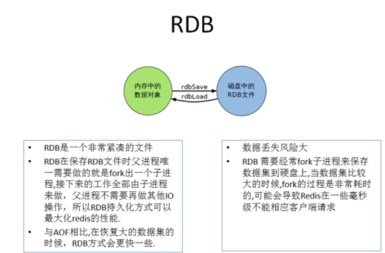

## Redis持久化之AOF

### AOF**（Append Only File）**

以**日志**的形式来记录每个写操作（增量保存），将Redis执行过的所有写指令记录下来(**读操作不记录**)， **只许追加文件但不可以改写文件**，redis启动之初会读取该文件重新构建数据，换言之，redis 重启的话就根据日志文件的内容将写指令从前到后执行一次以完成数据的恢复工作。

#### **AOF**持久化流程

1. 客户端的请求写命令会被append追加到AOF缓冲区内；
2. AOF缓冲区根据AOF持久化策略[always,everysec,no]将操作sync同步到磁盘的AOF文件中；
3. AOF文件大小超过重写策略或手动重写时，会对AOF文件rewrite重写，压缩AOF文件容量；
4. Redis服务重启时，会重新load加载AOF文件中的写操作达到数据恢复的目的。


#### **AOF**默认不开启

可以在redis.conf中配置文件名称默认为 appendonly.aof文件中开启，AOF文件的保存路径，同RDB的路径一致。

#### AOF和RDB同时开启，redis听谁的？

AOF和RDB同时开启，系统默认取AOF的数据（数据不会存在丢失）。

#### **AOF**启动、修复、恢复

- AOF的备份机制和性能虽然和RDB不同，但是备份和恢复的操作同RDB一样，都是拷贝备份文件，需要恢复时再拷贝到Redis工作目录下，启动系统即加载。
- 正常恢复

- - 修改默认的appendonly no，改为yes。
  - 将有数据的aof文件复制一份保存到对应目录(查看目录：config get dir)。
  - 恢复：重启redis然后重新加载。

- 异常恢复

- - 修改默认的appendonly no，改为yes。
  - 如遇到**AOF文件损坏**，通过/usr/local/bin/**redis-check-aof–fix appendonly.aof**进行恢复。
  - 备份被写坏的AOF文件。
  - 恢复：重启redis，然后重新加载。

#### AOF同步频率设置

- appendfsync always：始终同步，每次Redis的写入都会立刻记入日志；性能较差但数据完整性比较好。
- appendfsync everysec：每秒同步，每秒记入日志一次，如果宕机，本秒的数据可能丢失。
- appendfsync no：redis不主动进行同步，把同步时机交给操作系统。

#### **Rewrite**压缩

**Rewrite压缩是什么**

AOF采用文件追加方式，文件会越来越大为避免出现此种情况，新增了重写机制，当AOF文件的大小超过所设定的阈值时，Redis就会启动AOF文件的内容压缩，只保留可以恢复数据的最小指令集，可以使用命令bgrewriteaof。

**重写原理，如何实现重写**

AOF文件持续增长而过大时，会fork出一条新进程来将文件重写(也是先写临时文件最后再rename)，redis4.0版本后的重写，是指把rdb 的快照，以二进制的形式附在新的aof头部，作为已有的历史数据，替换掉原来的流水账操作。

**no-appendfsync-on-rewrite：**

- 如果 no-appendfsync-on-rewrite=yes ，不写入aof文件只写入缓存，用户请求不会阻塞，但是在这段时间如果宕机会丢失这段时间的缓存数据。（降低数据安全性，提高性能）
- 如果 no-appendfsync-on-rewrite=no，还是会把数据往磁盘里刷，但是遇到重写操作，可能会发生阻塞。（数据安全，但是性能降低）

**触发机制，何时重写**

Redis会记录上次重写时的AOF大小，默认配置是当AOF文件大小是上次rewrite后大小的一倍且文件大于64M时触发。

重写虽然可以节约大量磁盘空间，减少恢复时间。但是每次重写还是有一定的负担的，因此设定Redis要满足一定条件才会进行重写。

- auto-aof-rewrite-percentage：设置重写的基准值，文件达到100%时开始重写（文件是原来重写后文件的2倍时触发）。
- auto-aof-rewrite-min-size：设置重写的基准值，最小文件64MB。达到这个值开始重写。
- 系统载入时或者上次重写完毕时，Redis会记录此时AOF大小，设为base_size,
- 如果Redis的AOF当前大小>= base_size +base_size*100% (默认)且当前大小>=64mb(默认)的情况下，Redis会对AOF进行重写。
- 例如：文件达到70MB开始重写，降到50MB，下次什么时候开始重写？100MB

**重写流程**

1. bgrewriteaof触发重写，判断是否当前有bgsave或bgrewriteaof在运行，如果有，则等待该命令结束后再继续执行；
2. 主进程fork出子进程执行重写操作，保证主进程不会阻塞；
3. 子进程遍历redis内存中数据到临时文件，客户端的写请求同时写入aof_buf缓冲区和aof_rewrite_buf重写缓冲区，保证原AOF文件完整以及新AOF文件生成期间的新的数据修改动作不会丢失；
4. 子进程写完新的AOF文件后，向主进程发信号，父进程更新统计信息。主进程把aof_rewrite_buf中的数据写入到新的AOF文件；
5. 使用新的AOF文件覆盖旧的AOF文件，完成AOF重写。


#### 优势


- 备份机制更稳健，丢失数据概率更低。
- 可读的日志文本，通过操作AOF稳健，可以处理误操作。

#### 劣势

- 比起RDB占用更多的磁盘空间。
- 恢复备份速度要慢。
- 每次读写都同步的话，有一定的性能压力。
- 存在个别Bug，造成恢复不能。

#### 小总结


### **总结**(Which one)

#### **用哪个好**

官方推荐两个都启用：

- 如果对数据不敏感，可以选单独用RDB。
- 不建议单独用 AOF，因为可能会出现Bug。
- 如果只是做纯内存缓存，可以都不用。

#### 官网建议

- RDB持久化方式能够在指定的时间间隔能对你的数据进行快照存储。
- AOF持久化方式记录每次对服务器写的操作，当服务器重启的时候会重新执行这些命令来恢复原始的数据，AOF命令以redis协议追加保存每次写的操作到文件末尾。
- Redis还能对AOF文件进行后台重写，使得AOF文件的体积不至于过大。
- 只做缓存：如果你只希望你的数据在服务器运行的时候存在，你也可以不使用任何持久化方式。
- 同时开启两种持久化方式：在这种情况下，当redis重启的时候会优先载入AOF文件来恢复原始的数据，因为在通常情况下AOF文件保存的数据集要比RDB文件保存的数据集要完整。
- RDB的数据不实时，同时使用两者时服务器重启也只会找AOF文件。那要不要只使用AOF呢？
- 建议不要，因为RDB更适合用于备份数据库(AOF在不断变化不好备份)，快速重启，而且不会有AOF可能潜在的bug，留着作为一个万一的手段。
- 性能建议：

- - 因为RDB文件只用作后备用途，建议只在Slave上持久化RDB文件，而且只要15分钟备份一次就够了，只保留save 9001这条规则。
  - 如果使用AOF，好处是在最恶劣情况下也只会丢失不超过两秒数据，启动脚本较简单，只load自己的AOF文件就可以了。
  - aof代价：一是带来了持续的IO，二是AOF rewrite的最后，将rewrite过程中产生的新数据写到新文件造成的阻塞几乎是不可避免的。
  - 只要硬盘许可，应该尽量减少AOF rewrite的频率，AOF重写的基础大小默认值64M太小了，可以设到5G以上。默认超过原大小100%大小时重写可以改到适当的数值。

## Redis主从复制

主机数据更新后根据配置和策略， 自动同步到备机的master/slaver机制，**Master以写为主，Slave以读为主**，主从复制节点间数据是全量的。

作用：

- 读写分离，性能扩展

- 容灾快速恢复

  

### **复制原理**

- Slave启动成功连接到master后会发送一个sync命令；

- Master接到命令启动后台的存盘进程，同时收集所有接收到的用于修改数据集命令，在后台进程执行完毕之后，master将传送整个数据文件到slave，以完成一次完全同步。

- 全量复制：slave服务器在接收到数据库文件数据后，将其存盘并加载到内存中。

- 增量复制：Master继续将新的所有收集到的修改命令依次传给slave，完成同步。

- 但是只要是重新连接master，一次完全同步（全量复制)将被自动执行。

  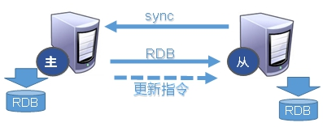

### **哨兵模式**(sentinel)

反客为主：当一个master宕机后，后面的slave可以立刻升为master，其后面的slave不用做任何修改。用 slaveof no one 指令将从机变为主机。而哨兵模式是**反客为主的自动版**，能够后台监控主机是否故障，如果故障了根据投票数自动将从库转换为主库。

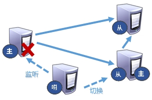

**当主机挂掉，从机选举产生新的主机**

- 哪个从机会被选举为主机呢？根据优先级别：slave-priority 。
- 原主机重启后会变为从机。

**复制延时**

由于所有的写操作都是先在Master上操作，然后同步更新到Slave上，所以从Master同步到Slave机器有一定的延迟，当系统很繁忙的时

候，延迟问题会更加严重，Slave机器数量的增加也会使这个问题更加严重。

**故障恢复**


优先级：在redis.conf中默认 slave-priority 100，值越小优先级越高。

偏移量：指获得原主机数据最全的概率。

runid：每个redis实例启动后都会随机生成一个40位的runid。

## Redis集群（cluster模式）

Redis 集群（包括很多小集群）实现了对Redis的水平扩容，即启动N个redis节点，将整个数据库分布存储在这N个节点中，每个节点存储总数据的1/N，即一个小集群存储1/N的数据，每个小集群里面维护好自己的1/N的数据。

Redis 集群通过分区（partition）来提供一定程度的可用性（availability）： 即使集群中有一部分节点失效或者无法进行通讯， 集群也可以继续处理命令请求。

该模式的redis集群特点是：分治、分片。

### 问题

1. 容量不够，redis如何进行扩容？
2. 并发写操作， redis如何分摊？
3. 另外，主从模式，薪火相传模式，主机宕机，导致ip地址发生变化，应用程序中配置需要修改对应的主机地址、端口等信息。
4. 之前通过代理主机来解决，但是redis3.0中提供了解决方案。就是无中心化集群配置。

### 集群连接

普通方式登录：可能直接进入读主机，存储数据时，会出现MOVED重定向操作，所以，应该以集群方式登录。

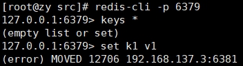

集群登录：redis-cli -c -p 6379 采用集群策略连接，设置数据会自动切换到相应的写主机.

### **redis cluster** **如何分配这六个节点?**

- 一个集群至少要有三个主节点。
- 选项 –cluster-replicas 1 ：表示我们希望为集群中的每个主节点创建一个从节点。
- 分配原则尽量保证每个主数据库运行在不同的IP地址，每个从库和主库不在一个IP地址上。

### 什么是slots

一个 Redis 集群包含 16384 个插槽（hash slot），数据库中的每个键都属于这 16384 个插槽的其中一个。集群使用公式 CRC16(key) % 16384 来计算键 key 属于哪个槽， 其中 CRC16(key) 语句用于计算键 key 的 CRC16 校验和 。

集群中的每个节点负责处理一部分插槽。 举个例子， 如果一个集群可以有主节点， 其中：

- 节点 A 负责处理 0 号至 5460 号插槽。
- 节点 B 负责处理 5461 号至 10922 号插槽。
- 节点 C 负责处理 10923 号至 16383 号插槽。

### **在集群中录入值**

在redis-cli每次录入、查询键值，redis都会计算出该key应该送往的插槽，如果不是该客户端对应服务器的插槽，redis会报错，并告知应前往的redis实例地址和端口。

redis-cli客户端提供了 –c 参数实现自动重定向。如 redis-cli -c –p 6379 登入后，再录入、查询键值对可以自动重定向。不在一个slot下的键值，是不能使用mget,mset等多键操作。

### **故障恢复**

- 如果主节点下线？从节点能否自动升为主节点？注意：**15**秒超时
- 主节点恢复后，主从关系会如何？主节点回来变成从机。

如果所有某一段插槽的主从节点都宕掉，redis服务是否还能继续?

- 如果某一段插槽的主从都挂掉，而cluster-require-full-coverage 为yes ，那么整个集群都挂掉。
- 如果某一段插槽的主从都挂掉，而cluster-require-full-coverage 为no ，那么，该插槽数据全都不能使用，也无法存储。

### **Redis** **集群优点**

- 实现扩容
- 分摊压力
- 无中心配置相对简单

### **Redis** **集群不足**

- 多键操作是不被支持的。
- 多键的Redis事务是不被支持的，lua脚本不被支持。
- 由于集群方案出现较晚，很多公司已经采用了其他的集群方案，而代理或者客户端分片的方案想要迁移至redis cluster，需要整体迁移而不是逐步过渡，复杂度较大。

## Redis应用问题解决

### 缓存穿透

#### 问题描述

key对应的数据在数据源并不存在，每次针对此key的请求从缓存获取不到，请求都会压到数据源（数据库），从而可能压垮数据源。比如

用一个不存在的用户id获取用户信息，不论缓存还是数据库都没有，若黑客利用此漏洞进行攻击可能压垮数据库。

缓存穿透发生的条件：

1. 应用服务器压力变大
2. redis命中率降低
3. 一直查询数据库，使得数据库压力太大而压垮

其实redis在这个过程中一直平稳运行，崩溃的是我们的数据库（如MySQL）。

缓存穿透发生的原因：黑客或者其他非正常用户频繁进行很多非正常的url访问，使得redis查询不到数据库。

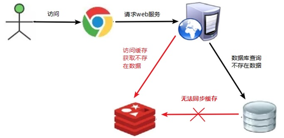

#### 解决方案

1. **对空值缓存：**如果一个查询返回的数据为空（不管是数据是否不存在），我们仍然把这个空结果（null）进行缓存，设置空结果的过期时间会很短，最长不超过五分钟。
2. **设置可访问的名单（白名单）：**使用bitmaps类型定义一个可以访问的名单，名单id作为bitmaps的偏移量，每次访问和bitmap里面的id进行比较，如果访问id不在bitmaps里面，进行拦截，不允许访问。
3. **采用布隆过滤器**：布隆过滤器（Bloom Filter）是1970年由布隆提出的。它实际上是一个很长的二进制向量(位图)和一系列随机映射函数（哈希函数）。布隆过滤器可以用于检索一个元素是否在一个集合中。它的优点是空间效率和查询时间都远远超过一般的算法，缺点是有一定的误识别率和删除困难。
4. **进行实时监控：**当发现Redis的命中率开始急速降低，需要排查访问对象和访问的数据，和运维人员配合，可以设置黑名单限制服务。

### 缓存击穿

#### 问题描述

key对应的数据存在，但在redis中过期，此时若有大量并发请求过来，这些请求发现缓存过期一般都会从后端数据库加载数据并回设到缓存，这个时候大并发的请求可能会瞬间把后端数据库压垮。

缓存击穿的现象：

1. 数据库访问压力瞬时增加，数据库崩溃
2. redis里面没有出现大量key过期
3. redis正常运行

缓存击穿发生的原因：redis某个key过期了，大量访问使用这个key（热门key）。


#### 解决方案

key可能会在某些时间点被超高并发地访问，是一种非常“热点”的数据。

1. **预先设置热门数据：**在redis高峰访问之前，把一些热门数据提前存入到redis里面，加大这些热门数据key的时长。
2. **实时调整：**现场监控哪些数据热门，实时调整key的过期时长。
3. **使用锁：**

1. 1. 就是在缓存失效的时候（判断拿出来的值为空），不是立即去load db。
   2. 先使用缓存工具的某些带成功操作返回值的操作（比如Redis的SETNX）去set一个mutex key。
   3. 当操作返回成功时，再进行load db的操作，并回设缓存，最后删除mutex key；
   4. 当操作返回失败，证明有线程在load db，当前线程睡眠一段时间再重试整个get缓存的方法。

2. 

### 缓存雪崩

#### 问题描述

key对应的数据存在，但在redis中过期，此时若有大量并发请求过来，这些请求发现缓存过期一般都会从后端数据库加载数据并回设到缓存，这个时候大并发的请求可能会瞬间把后端数据库压垮。

缓存雪崩与缓存击穿的区别在于这里针对很多key缓存，前者则是某一个key正常访问。


**缓存失效瞬间：**


#### 解决方案

1. **构建多级缓存架构：**nginx缓存 + redis缓存 +其他缓存（ehcache等）。
2. **使用锁或队列：**用加锁或者队列的方式来保证不会有大量的线程对数据库一次性进行读写，从而避免失效时大量的并发请求落到底层存储系统上，该方法不适用高并发情况。
3. **设置过期标志更新缓存：**记录缓存数据是否过期（设置提前量），如果过期会触发通知另外的线程在后台去更新实际key的缓存。
4. **将缓存失效时间分散开：**比如可以在原有的失效时间基础上增加一个随机值，比如1-5分钟随机，这样每一个缓存的过期时间的重复率就会降低，就很难引发集体失效的事件。

### 分布式锁

#### 问题描述

随着业务发展的需要，原单体单机部署的系统被演化成分布式集群系统后，由于分布式系统多线程的特点以及分布在不同机器上，这将使原单机部署情况下的并发控制锁策略失效，单纯的Java API并不能提供分布式锁的能力。为了解决这个问题就需要一种跨JVM的互斥机制来控制共享资源的访问，这就是分布式锁要解决的问题！

分布式锁主流的实现方案：

1. 基于数据库实现分布式锁
2. 基于缓存（Redis等）
3. 基于Zookeeper

根据实现方式，分布式锁还可以分为类CAS自旋式分布式锁以及event事件类型分布式锁：

- 类CAS自旋式分布式锁：询问的方式，类似java并发编程中的线程获询问的方式尝试加锁，如mysql、redis。
- 另外一类是event事件通知进程后续锁的变化，轮询向外的过程，如zookeeper、etcd。

每一种分布式锁解决方案都有各自的优缺点：

1. 性能：redis最高
2. 可靠性：zookeeper最高

#### **解决方案：使用redis实现分布式锁**


setnx：通过该命令尝试获得锁，没有获得锁的线程会不断等待尝试。

set key ex 3000nx：设置过期时间，自动释放锁，解决当某一个业务异常而导致锁无法释放的问题。但是当业务运行超过过期时间时，开辟监控线程增加该业务的运行时间，直到运行结束，释放锁。

uuid：设置uuid，释放前获取这个值，判断是否自己的锁，防止误删锁，造成没锁的情况。

### RedLock

Redlock是一种算法，Redlock也就是 Redis Distributed Lock，可用实现多节点redis的分布式锁。RedLock官方推荐，Redisson完成了对Redlock算法封装。

此种方式具有以下特性：

- 互斥访问：即永远只有一个 client 能拿到锁。
- 避免死锁：最终 client 都可能拿到锁，不会出现死锁的情况，即使锁定资源的服务崩溃或者分区，仍然能释放锁。
- 容错性：只要大部分 Redis 节点存活（一半以上），就可以正常提供服务

RedLock原理（了解）

1. 获取当前Unix时间，以毫秒为单位。
2. 依次尝试从N个实例，使用相同的key和随机值获取锁。在步骤2，当向Redis设置锁时，客户端应该设置一个网络连接和响应超时时间，这个超时时间应该小于锁的失效时间。例如你的锁自动失效时间为10秒，则超时时间应该在5-50毫秒之间。这样可以避免服务器端Redis已经挂掉的情况下，客户端还在死死地等待响应结果。如果服务器端没有在规定时间内响应，客户端应该尽快尝试另外一个Redis实例。
3. 客户端使用当前时间减去开始获取锁时间（步骤1记录的时间）就得到获取锁使用的时间。当且仅当从大多数（这里是3个节点）的Redis节点都取到锁，并且使用的时间小于锁失效时间时，锁才算获取成功。
4. 如果取到了锁，key的真正有效时间等于有效时间减去获取锁所使用的时间（步骤3计算的结果）。
5. 如果因为某些原因，获取锁失败（没有在至少N/2+1个Redis实例取到锁或者取锁时间已经超过了有效时间），客户端应该在所有的Redis实例上进行解锁（即便某些Redis实例根本就没有加锁成功）。

## Redis IO多线程

### 简介

Redis6终于支撑多线程了，告别单线程了吗？

IO多线程其实指**客户端交互部分**的**网络IO**交互处理模块**多线程**，而非**执行命令多线程**。Redis6执行命令依然是单线程。

### **原理架构**

Redis 6 加入多线程，但跟 Memcached 这种从 IO处理到数据访问多线程的实现模式有些差异。Redis 的多线程部分只是用来处理网络数据的读写和协议解析，执行命令仍然是单线程。之所以这么设计是不想因为多线程而变得复杂，需要去控制 key、lua、事务，LPUSH/LPOP 等等的并发问题。整体的设计大体如下:


另外，多线程IO默认也是不开启的，需要再配置文件中配置：

- io-threads-do-reads yes
- io-threads 4


# 以下是在微服务中学到的

# Redis分布式缓存

单机的 Redis 存在以下四大问题，我们将学着去解决。

[](https://cdn.xn2001.com/img/2022/202206142215082.png)


## Redis持久化

Redis持久化分为两种：

- RDB 持久化
- AOF 持久化

### RDB持久化

RDB 全称 Redis Database Backup file（Redis数据备份文件），也被叫做 Redis 数据快照。简单来说就是把内存中的所有数据都记录到磁盘中。当 Redis 实例故障重启后，从磁盘读取快照文件，恢复数据。快照文件称为 RDB 文件，**默认是保存在当前运行目录。**

RDB 持久化在四种情况下会执行

- 执行 save 命令
- 执行 bgsave 命令
- Redis 停机时
- 触发 RDB 条件时

**save 命令**

执行下面的命令，可以立即执行一次 RDB

[](https://cdn.xn2001.com/img/2022/202206142216902.png)


save 命令会导致**主进程**执行 RDB，这个过程中**其它所有命令都会被阻塞**。只有在数据迁移时可能用到。

**bgsave 命令**

这种方法比较适合在运行的过程中使用

下面的命令可以**异步**执行 RDB

[](https://cdn.xn2001.com/img/2022/202206142216906.png)

这个命令执行后会开启独立进程完成 RDB，主进程可以持续处理用户请求，不受影响。

**停机时**

Redis 停机时会执行一次 save 命令，实现 RDB 持久化。

**自动触发 RDB 条件**

Redis 内部有触发 RDB 的机制，可以在 redis.conf 文件中找到，格式如下：

```properties
# 900秒内，如果至少有1个key被修改，则执行bgsave
# save "" 则表示禁用RDB
save 900 1  


#举例，可以理解一下
save 300 10  
save 60 10000 
```

RDB 的其它配置也可以在 redis.conf 文件中设置

```properties
# 是否压缩 ,建议不开启，压缩也会消耗cpu，磁盘的话不值钱
rdbcompression yes
# RDB文件名称
dbfilename dump.rdb  
# 文件保存的路径目录
dir ./ 
```

bgsave 开始时会 **fork** 主进程得到子进程，子进程共享主进程的内存数据。完成 fork 后读取内存数据并写入 RDB 文件。

fork 采用的是 copy-on-write 技术：当主进程执行读操作时，访问共享内存；当主进程执行写操作时，则会拷贝一份数据，执行写操作。

[](https://cdn.xn2001.com/img/2022/202206142216920.png)


RDB 方式 bgsave 的基本流程？

- fork主进程得到一个子进程，共享内存空间
- 子进程读取内存数据并写入新 的RDB 文件
- 用新 RDB 文件替换旧的 RDB 文件

RDB 会在什么时候自动执行？save 60 1000代表什么含义？

- 默认是服务停止时
- 代表 60s 内至少执行 1000 次修改则触发 RDB

RDB 的缺点？

- RDB 执行间隔时间长，两次 RDB 之间写入数据有丢失的风险
- fork 子进程、压缩、写出 RDB 文件都比较耗时

### AOF持久化

AOF 全称为 Append Only File（追加文件），Redis 处理的每一个写命令都会记录在 AOF 文件，可以看做是命令日志文件。

[](https://cdn.xn2001.com/img/2022/202206142216922.png)


AOF 默认是关闭的，需要修改 redis.conf 配置文件来开启 AOF

```properties
# 是否开启AOF功能，默认是no
appendonly yes
# AOF文件的名称
appendfilename "appendonly.aof"
```

AOF 的命令记录的频率也可以通过 redis.conf 文件来配

**下面三种方法放开一种就可以了**

```properties
# 表示每执行一次写命令，立即记录到AOF文件
appendfsync always 
# 写命令执行完先放入AOF缓冲区，然后表示每隔1秒将缓冲区数据写到AOF文件，是默认方案
appendfsync everysec 
# 写命令执行完先放入AOF缓冲区，由操作系统决定何时将缓冲区内容写回磁盘
appendfsync no
```

三种策略对比

[](https://cdn.xn2001.com/img/2022/202206142216924.png)


**AOF文件重写**

因为是记录命令，AOF 文件会比 RDB 文件大的多。而且 AOF **会记录对同一个 key 的多次**写操作，但只有最后一次写操作才有意义。通过执行 bgrewriteaof 命令，可以让 AOF 文件执行重写功能，用最少的命令达到相同效果。

[](https://cdn.xn2001.com/img/2022/202206142216934.png)


如图，AOF 原本有三个命令，但是这三个都是对 num 的操作，第二次会覆盖第一次的值，因此第一个命令记录下来没有意义。

所以重写命令后，AOF文件内容就是：`mset name jack num 666`

1. 可以自己手动触发这个命令


2. Redis 也会在触发阈值时自动去重写 AOF 文件。阈值也可以在 redis.conf 中配置

```properties
# AOF文件比上次文件 增长超过多少百分比则触发重写
auto-aof-rewrite-percentage 100
# AOF文件体积最小多大以上才触发重写 
auto-aof-rewrite-min-size 64mb 
```


### RDB和AOF对比

RDB 和 AOF 各有自己的优缺点，如果对数据安全性要求较高，在实际开发中往往会结合两者来使用。

[](https://cdn.xn2001.com/img/2022/202206142216414.png)


Redis 支持同时开启 RDB 和 AOF，在这种情况下当 Redis 重启的时候会优先载入 AOF 文件来恢复原始的数据，因为在通常情况下 AOF 文件保存的数据集要比 RDB 文件保存的数据集完整。

## Redis主从复制

单节点 Redis 的并发能力是有上限的，要进一步提高 Redis 的并发能力，就需要搭建主从集群，实现读写分离。

[](https://cdn.xn2001.com/img/2022/202206142243954.png)


### 搭建主从

> 跳过部署三个 Redis，很简单。

共包含三个节点，一个主节点，两个从节点。

这里我们在同一台虚拟机中开启 3 个 Redis 实例，模拟主从集群，信息如下：

|       IP        | PORT |  角色  |
| :-------------: | :--: | :----: |
| 192.168.150.101 | 7001 | master |
| 192.168.150.101 | 7002 | slave  |
| 192.168.150.101 | 7003 | slave  |

为了方便查看日志，我们打开 3 个 ssh 窗口，分别启动 Redis 实例，启动命令：

```sh
# 第1个
redis-server 7001/redis.conf
# 第2个
redis-server 7002/redis.conf
# 第3个
redis-server 7003/redis.conf
```

[](https://cdn.xn2001.com/img/2022/202206150213482.png)


如果要一键停止，可以运行下面命令：

```sh
printf '%s\n' 7001 7002 7003 | xargs -I{} -t redis-cli -p {} shutdown
```


**开启主从关系**

现在三个实例还没有任何关系，要配置主从可以使用 `replicaof` 或者 `slaveof`（5.0以前）命令。

有临时和永久两种模式：

1.修改配置文件（永久生效）

在 redis.conf 中添加一行配置：`slaveof <masterip> <masterport>`


2.使用 redis-cli 客户端连接到redis服务，执行slaveof命令（重启后失效）

```
slaveof <masterip> <masterport>
```

> 在 5.0 以后新增命令 replicaof，与 salveof 效果一致。

这里我们为了演示方便，使用方式二。通过 redis-cli 命令连接 7002，执行下面命令

```sh
# 连接 7002
redis-cli -p 7002
# 执行slaveof
slaveof 192.168.150.101 7001
```

通过 redis-cli 命令连接 7003，执行下面命令

```sh
# 连接 7003
redis-cli -p 7003
# 执行slaveof
slaveof 192.168.150.101 7001
```

然后连接 7001 节点，查看集群状态：

```sh
# 连接 7001
redis-cli -p 7001
# 查看状态
info replication
```

[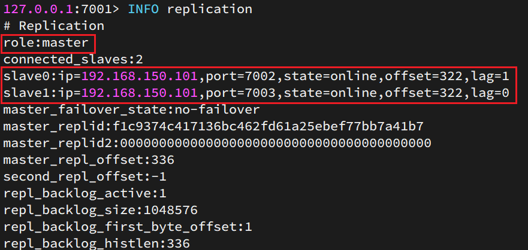](https://cdn.xn2001.com/img/2022/202206150213485.png)


执行下列操作以测试

- 利用 redis-cli 连接7001，执行`set num 123`
- 利用 redis-cli 连接7002，执行`get num`，再执行`set num 666`
- 利用 redis-cli 连接7003，执行`get num`，再执行`set num 888`

可以发现，只有在 7001 这个 master 节点上可以执行写操作，7002 和 7003 这两个 slave 节点只能执行读操作。

### 同步原理

#### 全量同步

主从第一次建立连接时，会执行**全量同步**，将 master 节点的所有数据都拷贝给 slave 节点，流程如下

[](https://cdn.xn2001.com/img/2022/202206150222378.png)


有几个概念需要知道：

- **Replication Id**：简称 replid，是数据集的标记，id 一致则说明是同一数据集。每一个 master 都有唯一的replid，slave 则会继承 master 节点的 replid；
- **offset**：偏移量，随着记录在 repl_baklog 中的数据增多而逐渐增大。slave 完成同步时也会记录当前同步的offset，即 slave 的 offset 永远小于等于 master 的 offset；当 slave 的 offset 小于 master 的 offset，说明 slave 数据落后于 master，需要更新。

因此 slave 做数据同步，必须向 master 声明自己的 replid 和 offset，master 才可以判断到底需要同步哪些数据。而 slave 原本也是一个 master，有自己的 replid 和 offset，当第一次变成 slave，与 master 建立连接时，发送的 replid 和 offset 是自己的 replid 和 offset。master 判断发现 slave 发送来的 replid 与自己的不一致，说明这是一个全新的 slave，就知道要做全量同步了。master 会将自己的 replid 和 offset 都发送给这个 slave，slave 保存这些信息。以后 slave 的replid 就与 master 一致了。因此，**master判断一个节点是否是第一次同步的依据，就是看 replid 是否一致**。

[](https://cdn.xn2001.com/img/2022/202206150222382.png)


完整流程描述：

- slave 节点请求增量同步
- master 节点判断 replid，发现不一致，拒绝增量同步，选择全量同步
- master 将完整内存数据生成 RDB，发送 RDB 到 slave
- slave 清空本地数据，加载 master 的 RDB
- master 将 RDB 期间的命令记录在 repl_baklog，并持续将 log 中的命令发送给 slave
- slave 执行接收到的命令，保持与 master 之间的同步

#### 增量同步

全量同步需要先做 RDB，然后将 RDB 文件通过网络传输给 slave，成本太高。因此除了第一次做全量同步，其它大多数时候 slave 与 master 都是做**增量同步**。

什么是增量同步？就是只更新 slave 与 master 存在差异的部分数据。

[](https://cdn.xn2001.com/img/2022/202206150222386.png)


**repl_backlog 原理**

master 怎么知道 slave 与自己的数据差异在哪里？

这就要说到全量同步时的 repl_baklog 文件了。

这个文件是一个固定大小的数组，只不过数组是环形，也就是说**角标到达数组末尾后，会再次从 0 开始读写**，这样数组头部的数据就会被覆盖。repl_baklog 中会记录 Redis 处理过的命令日志及 offset，包括 master 当前的 offset 和 slave 已经拷贝到的 offset

[](https://cdn.xn2001.com/img/2022/202206150222384.png)


slave 与 master 的 offset 之间的差异，就是 salve 需要增量拷贝的数据了。

随着不断有数据写入，master 的 offset 逐渐变大，slave 也不断的拷贝，追赶 master 的 offset，直到数组被填满：

[](https://cdn.xn2001.com/img/2022/202206150222403.png)


[](https://cdn.xn2001.com/img/2022/202206150222407.png)


此时，如果有新的数据写入，就会覆盖数组中的旧数据。不过，旧的数据只要是绿色的，说明是已经被同步到slave 的数据，即便被覆盖了也没什么影响。因为未同步的仅仅是红色部分。但是，如果 slave 出现网络阻塞，导致 master 的 offset 远远超过了 slave 的 offset，如下图

[](https://cdn.xn2001.com/img/2022/202206150222063.png)


如果 master 继续写入新数据，其 offset 就会覆盖旧的数据，直到将 slave 现在的 offset 也覆盖了

[](https://cdn.xn2001.com/img/2022/202206150222082.png)


棕色框中的红色部分，就是尚未同步，但是却已经被覆盖的数据。此时如果 slave 恢复，需要同步，却发现自己的 offset 都没有了，**无法完成增量同步了，只能做全量同步。**

[](https://cdn.xn2001.com/img/2022/202206150222104.png)


### 主从同步优化

主从同步可以保证主从数据的一致性，非常重要。可以从以下几个方面来优化 Redis 主从集群

- 在 master 中配置 `repl-diskless-sync yes` 启用无磁盘复制，避免全量同步时的磁盘 IO
- Redis 单节点上的内存占用不要太大，减少 RDB 导致的过多磁盘IO
- 适当提高 repl_baklog 的大小，发现 slave 宕机时尽快实现故障恢复，尽可能避免全量同步
- 限制一个 master 上的 slave 节点数量，如果实在是太多 slave，则可以采用**主-从-从**链式结构，减少 master 压力

[](https://cdn.xn2001.com/img/2022/202206150222112.png)


简述全量同步和增量同步区别？

- 全量同步：master 将完整内存数据生成 RDB，发送 RDB 到 slave。后续命令则记录在 repl_baklog，逐个发送给slave
- 增量同步：slave 提交自己的 offset 到 master，master 获取 repl_baklog 中从 offset 之后的命令给slave

什么时候执行全量同步？

- slave 节点第一次连接 master 节点时
- slave 节点断开时间太久，repl_baklog 中的 offset 已经被覆盖时

什么时候执行增量同步？

- slave 节点断开又恢复，并且在 repl_baklog 中能找到 offset 时

## Redis哨兵

思考一下：slave节点宕机恢复后可以找master节点同步数据，那master节点宕机怎么办?

和之前的MySQL一样，如果搭建集群，master节点挂了，在剩下的slave节点中选出一个做master就好了

### 哨兵的作用和原理


Sentinel基于心跳机制监测服务状态，每隔1秒向集群的每个实例发送ping命令（众所周知会得到pong）:

- 主观下线:如果某sentinel节点发现某实例未在规定时间响应，则认为该实例主观下线。
- 客观下线:若超过**指定数量(quorum)**的sentinel都认为该实例主观下线，则该实例客观下线。quorum值最好超
  过Sentinel实例数量的一半。


一旦发现master故障，sentinel需要在salve中选择一个作为新的master，选择依据是这样的

- 首先会判断slave节点与master节点断开时间长短，如果超过指定值(down-after-milliseconds *10）则会排除该
  slave节点
- 然后判断slave节点的slave-priority值，越小优先级越高，如果是0则永不参与选举。
- 如果slave-prority一样，则判断slave节点的offset值，越大说明数据越新，优先级越高。
- 最后是判断slave节点的运行id大小，越小优先级越高。


总结

Sentinel的三个作用是什么?

- 监控
- 故障转移
- 通知

Sentinel如何判断一个redis实例是否健康?

- 每隔1秒发送一次ping命令，如果超过一定时间没有相向则认为是主
  观下线

如果大多数sentinel都认为实例主观下线，则判定服务下线故障转移步骤有哪些?

- 首先选定一个slave作为新的master，执行slaveof no one
- 然后让所有节点都执行slaveof新master
- 修改故障节点配置，添加slaveof 新master


### 搭建哨兵集群

#### 集群结构

这里我们搭建一个三节点形成的Sentinel集群，来监管之前的Redis主从集群。如图：


三个sentinel实例信息如下：

| 节点 |       IP        | PORT  |
| ---- | :-------------: | :---: |
| s1   | 192.168.150.101 | 27001 |
| s2   | 192.168.150.101 | 27002 |
| s3   | 192.168.150.101 | 27003 |

#### 准备实例和配置

要在同一台虚拟机开启3个实例，必须准备三份不同的配置文件和目录，配置文件所在目录也就是工作目录。

我们创建三个文件夹，名字分别叫s1、s2、s3：

```sh
# 进入/tmp目录
cd /tmp
# 创建目录
mkdir s1 s2 s3
```

如图：


然后我们在s1目录创建一个sentinel.conf文件，添加下面的内容：

```ini
port 27001
sentinel announce-ip 192.168.150.101
sentinel monitor mymaster 192.168.150.101 7001 2
sentinel down-after-milliseconds mymaster 5000
sentinel failover-timeout mymaster 60000
dir "/tmp/s1"
```

解读：

- `port 27001`：是当前sentinel实例的端口
- `sentinel monitor mymaster 192.168.150.101 7001 2`：指定主节点信息
  - `mymaster`：主节点名称，自定义，任意写
  - `192.168.150.101 7001`：主节点的ip和端口
  - `2`：选举master时的quorum值


然后将s1/sentinel.conf文件拷贝到s2、s3两个目录中（在/tmp目录执行下列命令）：

```sh
# 方式一：逐个拷贝
cp s1/sentinel.conf s2
cp s1/sentinel.conf s3
# 方式二：管道组合命令，一键拷贝
echo s2 s3 | xargs -t -n 1 cp s1/sentinel.conf
```


修改s2、s3两个文件夹内的配置文件，将端口分别修改为27002、27003：

```sh
sed -i -e 's/27001/27002/g' -e 's/s1/s2/g' s2/sentinel.conf
sed -i -e 's/27001/27003/g' -e 's/s1/s3/g' s3/sentinel.conf
```


#### 启动

为了方便查看日志，我们打开3个ssh窗口，分别启动3个redis实例，启动命令：

```sh
# 第1个
redis-sentinel s1/sentinel.conf
# 第2个
redis-sentinel s2/sentinel.conf
# 第3个
redis-sentinel s3/sentinel.conf
```


启动后：


#### 测试

尝试让master节点7001宕机，查看sentinel日志：


查看7003的日志：


查看7002的日志：


### RedisTemplate的哨兵模式

在Sentinel集群监管下的Redis主从集群，其节点会因为自动故障转移而发生变化，Redis的客户端必须感知这种变化，及时更新连接信息。Spring的RedisTemplate底层利用lettuce实现了节点的感知和自动切换。

#### 引入依赖

在项目的pom文件中引入依赖：

```xml
<dependency>
    <groupId>org.springframework.boot</groupId>
    <artifactId>spring-boot-starter-data-redis</artifactId>
</dependency>
```

#### 配置Redis地址

然后在配置文件application.yml中指定redis的sentinel相关信息：

```java
spring:
  redis:
    sentinel:
      master: mymaster
      nodes:
        - 192.168.150.101:27001
        - 192.168.150.101:27002
        - 192.168.150.101:27003
```

#### 配置读写分离

在项目的启动类中，添加一个新的bean：

```java
@Bean
public LettuceClientConfigurationBuilderCustomizer clientConfigurationBuilderCustomizer(){
    return clientConfigurationBuilder -> clientConfigurationBuilder.readFrom(ReadFrom.REPLICA_PREFERRED);
}
```

>非lamda表达式写法
>
>

这个bean中配置的就是读写策略，包括四种：

- MASTER：从主节点读取
- MASTER_PREFERRED：优先从master节点读取，master不可用才读取replica
- REPLICA：从slave（replica）节点读取
- REPLICA _PREFERRED：优先从slave（replica）节点读取，所有的slave都不可用才读取master


至于为什么不配置redis集群的地址，这个不需要我们关系，相当于我们只要知道注册中心的地址就可以了，注册中心会自动帮我们映射到redis上，这种思路就很清晰了


## Redis分片集群

### 搭建分片集群

主从和哨兵可以解决高可用、高并发读的问题。但是依然有两个问题没有解决：

- 海量数据存储问题

- 高并发写的问题

使用分片集群可以解决上述问题，如图:


分片集群特征：

- 集群中有多个master，每个master保存不同数据

- 每个master都可以有多个slave节点

- master之间通过ping监测彼此健康状态

- 客户端请求可以访问集群任意节点，最终都会被转发到正确节点


#### 集群结构

分片集群需要的节点数量较多，这里我们搭建一个最小的分片集群，包含3个master节点，每个master包含一个slave节点，结构如下：


这里我们会在同一台虚拟机中开启6个redis实例，模拟分片集群，信息如下：

|       IP        | PORT |  角色  |
| :-------------: | :--: | :----: |
| 192.168.150.101 | 7001 | master |
| 192.168.150.101 | 7002 | master |
| 192.168.150.101 | 7003 | master |
| 192.168.150.101 | 8001 | slave  |
| 192.168.150.101 | 8002 | slave  |
| 192.168.150.101 | 8003 | slave  |


#### 准备实例和配置

删除之前的7001、7002、7003这几个目录，重新创建出7001、7002、7003、8001、8002、8003目录：

```sh
# 进入/tmp目录
cd /tmp
# 删除旧的，避免配置干扰
rm -rf 7001 7002 7003
# 创建目录
mkdir 7001 7002 7003 8001 8002 8003
```


在/tmp下准备一个新的redis.conf文件，内容如下：

```ini
port 6379
# 开启集群功能
cluster-enabled yes
# 集群的配置文件名称，不需要我们创建，由redis自己维护(只需要指明该文件的位置就可以了)
cluster-config-file /tmp/6379/nodes.conf
# 节点心跳失败的超时时间
cluster-node-timeout 5000
# 持久化文件存放目录
dir /tmp/6379
# 绑定地址
bind 0.0.0.0
# 让redis后台运行
daemonize yes
# 注册的实例ip
replica-announce-ip 192.168.150.101
# 保护模式
protected-mode no
# 数据库数量
databases 1
# 日志
logfile /tmp/6379/run.log
```

将这个文件拷贝到每个目录下：

```sh
# 进入/tmp目录
cd /tmp
# 执行拷贝
echo 7001 7002 7003 8001 8002 8003 | xargs -t -n 1 cp redis.conf
```


修改每个目录下的redis.conf，将其中的6379修改为与所在目录一致：

```sh
# 进入/tmp目录
cd /tmp
# 修改配置文件
printf '%s\n' 7001 7002 7003 8001 8002 8003 | xargs -I{} -t sed -i 's/6379/{}/g' {}/redis.conf
```


#### 启动

因为已经配置了后台启动模式，所以可以直接启动服务：

```sh
# 进入/tmp目录
cd /tmp
# 一键启动所有服务
printf '%s\n' 7001 7002 7003 8001 8002 8003 | xargs -I{} -t redis-server {}/redis.conf
```

通过ps查看状态：

```sh
ps -ef | grep redis
```

发现服务都已经正常启动：


如果要关闭所有进程，可以执行命令：

```sh
ps -ef | grep redis | awk '{print $2}' | xargs kill
```

或者（推荐这种方式）：

```sh
printf '%s\n' 7001 7002 7003 8001 8002 8003 | xargs -I{} -t redis-cli -p {} shutdown
```


#### 创建集群

虽然服务启动了，但是目前每个服务之间都是独立的，没有任何关联。

我们需要执行命令来创建集群，在Redis5.0之前创建集群比较麻烦，5.0之后集群管理命令都集成到了redis-cli中。


1）Redis 5.0之前

Redis5.0之前集群命令都是用redis安装包下的src/redis-trib.rb来实现的。因为redis-trib.rb是有ruby语言编写的所以需要安装ruby环境。

 ```sh
# 安装依赖
yum -y install zlib ruby rubygems
gem install redis
 ```


然后通过命令来管理集群：

```sh
# 进入redis的src目录
cd /tmp/redis-6.2.4/src
# 创建集群
./redis-trib.rb create --replicas 1 192.168.150.101:7001 192.168.150.101:7002 192.168.150.101:7003 192.168.150.101:8001 192.168.150.101:8002 192.168.150.101:8003
```


2）Redis 5.0以后

我们使用的是Redis 6.2.4版本，集群管理以及集成到了redis-cli中，格式如下：

```sh
redis-cli --cluster create --cluster-replicas 1 192.168.150.101:7001 192.168.150.101:7002 192.168.150.101:7003 192.168.150.101:8001 192.168.150.101:8002 192.168.150.101:8003
```

命令说明：

- `redis-cli --cluster`或者`./redis-trib.rb`：代表集群操作命令
- `create`：代表是创建集群
- `--replicas 1`或者`--cluster-replicas 1` ：指定集群中每个master的副本个数为1，此时`节点总数 ÷ (replicas + 1)` 得到的就是master的数量。因此节点列表中的前n个就是master，其它节点都是slave节点，随机分配到不同master


运行后的样子：


这里输入yes，则集群开始创建：


通过命令可以查看集群状态：

```sh
redis-cli -p 7001 cluster nodes
```


#### 测试

尝试连接7001节点，存储一个数据：

```sh
# 连接
redis-cli -p 7001
# 存储数据
set num 123
# 读取数据
get num
# 再次存储
set a 1
```

结果悲剧了：


注意：！！！集群操作时，需要给`redis-cli`加上`-c`参数才可以：

```sh
redis-cli -c -p 7001
```

这次可以了：


### 散列插槽

#### 插槽原理

Redis会把每一个master节点映射到0~16383共16384个插槽（hash slot）上，查看集群信息时就能看到：


数据key不是与节点绑定，而是与插槽绑定。redis会根据key的有效部分计算插槽值，分两种情况：

- key中**包含"{}"**，且“{}”中至少包含1个字符，“{}”中的部分是有效部分
- key中**不包含“{}”**，整个key都是有效部分


例如：key是num，那么就根据num计算，如果是{itcast}num，则根据itcast计算。计算方式是利用CRC16算法得到一个hash值，然后对16384取余，得到的结果就是slot值。

 

如图，在7001这个节点执行set a 1时，对a做hash运算，对16384取余，得到的结果是15495，因此要存储到103节点。

到了7003后，执行`get num`时，对num做hash运算，对16384取余，得到的结果是2765，因此需要切换到7001节点


#### 小结

Redis如何判断某个key应该在哪个实例？

- 将16384个插槽分配到不同的实例
- 根据key的有效部分计算哈希值，对16384取余
- 余数作为插槽，寻找插槽所在实例即可

如何将同一类数据固定的保存在同一个Redis实例？

- 这一类数据使用相同的有效部分，例如key都以{typeId}为前缀


### 集群伸缩

redis-cli --cluster提供了很多操作集群的命令，可以通过下面方式查看：


比如，添加节点的命令：


#### 需求分析

需求：向集群中添加一个新的master节点，并向其中存储 num = 10

- 启动一个新的redis实例，端口为7004
- 添加7004到之前的集群，并作为一个master节点
- 给7004节点分配插槽，使得num这个key可以存储到7004实例


这里需要两个新的功能：

- 添加一个节点到集群中
- 将部分插槽分配到新插槽


#### 创建新的redis实例

创建一个文件夹：

```sh
mkdir 7004
```

拷贝配置文件：

```sh
cp redis.conf /7004
```

修改配置文件：

```sh
sed /s/6379/7004/g 7004/redis.conf
```

启动

```sh
redis-server 7004/redis.conf
```


#### 添加新节点到redis

添加节点的语法如下：


执行命令：

```sh
redis-cli --cluster add-node  192.168.150.101:7004 192.168.150.101:7001
```


通过命令查看集群状态：

```sh
redis-cli -p 7001 cluster nodes
```


如图，7004加入了集群，并且默认是一个master节点：


但是，可以看到7004节点的插槽数量为0，因此没有任何数据可以存储到7004上


#### 转移插槽

我们要将num存储到7004节点，因此需要先看看num的插槽是多少：


如上图所示，num的插槽为2765.


我们可以将0~3000的插槽从7001转移到7004，命令格式如下：


具体命令如下：

建立连接：


得到下面的反馈：


询问要移动多少个插槽，我们计划是3000个：

新的问题来了：


那个node来接收这些插槽？？

显然是7004，那么7004节点的id是多少呢？


复制这个id，然后拷贝到刚才的控制台后：

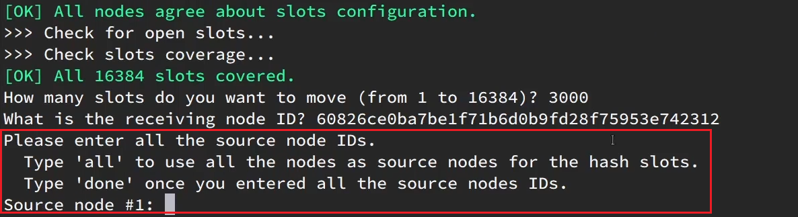

这里询问，你的插槽是从哪里移动过来的？

- all：代表全部，也就是三个节点各转移一部分
- 具体的id：目标节点的id
- done：没有了


这里我们要从7001获取，因此填写7001的id：


填完后，点击done，这样插槽转移就准备好了：


确认要转移吗？输入yes：

然后，通过命令查看结果：

 

可以看到： 


目的达成。


### 故障转移

集群初识状态是这样的：


其中7001、7002、7003都是master，我们计划让7002宕机。


#### 自动故障转移

当集群中有一个master宕机会发生什么呢？

直接停止一个redis实例，例如7002：

```sh
redis-cli -p 7002 shutdown
```


1）首先是该实例与其它实例失去连接

2）然后是疑似宕机：


3）最后是确定下线，自动提升一个slave为新的master：


4）当7002再次启动，就会变为一个slave节点了：


#### 手动故障转移

利用cluster failover命令可以手动让集群中的某个master宕机，切换到执行cluster failover命令的这个slave节点，实现无感知的数据迁移。其流程如下：


这种failover命令可以指定三种模式：

- 缺省：默认的流程，如图1~6歩
- force：省略了对offset的一致性校验
- takeover：直接执行第5歩，忽略数据一致性、忽略master状态和其它master的意见


**案例需求**：在7002这个slave节点执行手动故障转移，重新夺回master地位

步骤如下：

1）利用redis-cli连接7002这个节点

2）执行cluster failover命令

如图：


效果：


### RedisTemplate访问分片集群

RedisTemplate底层同样基于lettuce实现了分片集群的支持，而使用的步骤与哨兵模式基本一致：

1）引入redis的starter依赖

2）配置分片集群地址

3）配置读写分离

>之前已经配置过1，3步骤了，这里就不写了

与哨兵模式相比，其中**只有分片集群的配置方式**略有差异，如下：

配置的是每一个节点的地址，注意是每一个都要写上

```yaml
spring:
  redis:
    cluster:
      nodes:
        - 192.168.150.101:7001
        - 192.168.150.101:7002
        - 192.168.150.101:7003
        - 192.168.150.101:8001
        - 192.168.150.101:8002
        - 192.168.150.101:8003
```


