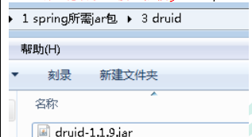
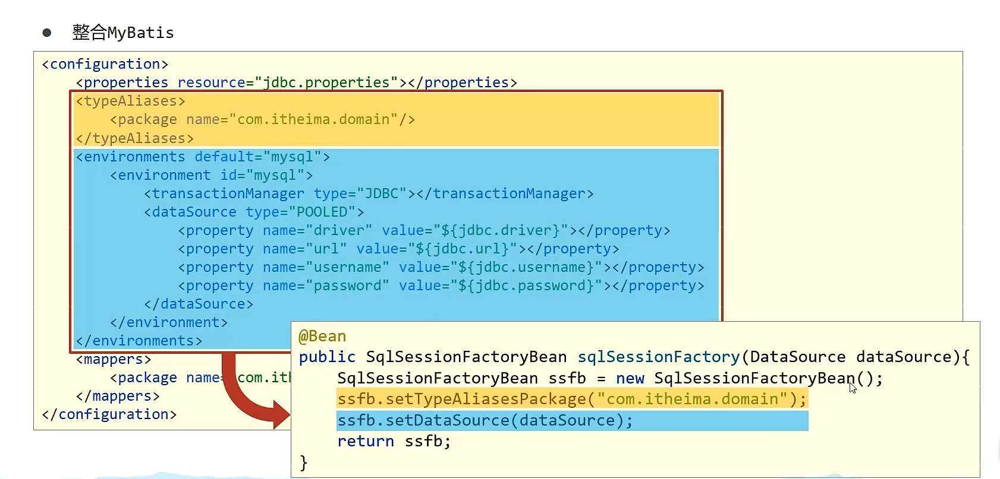
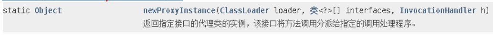
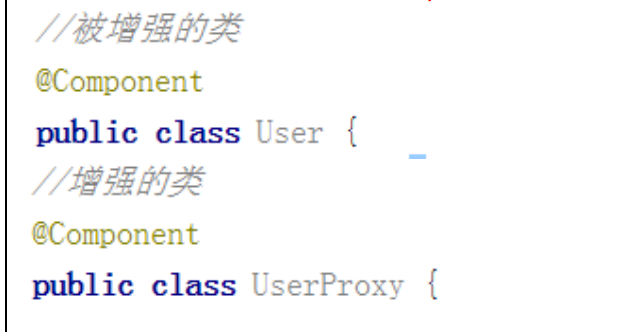
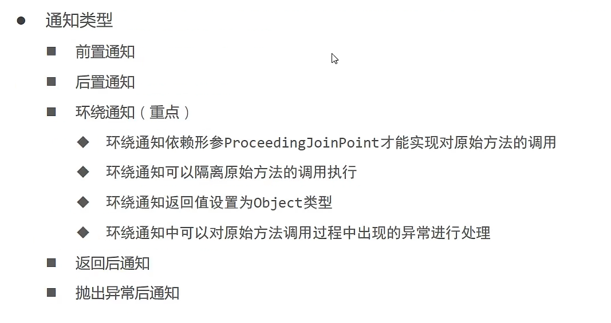
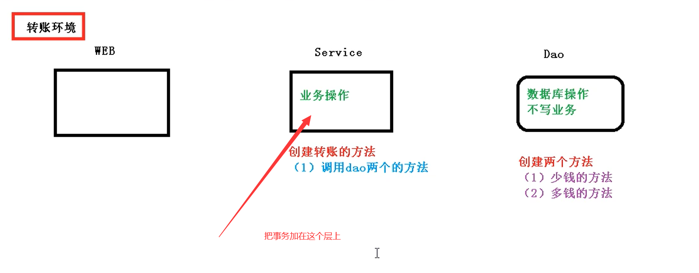
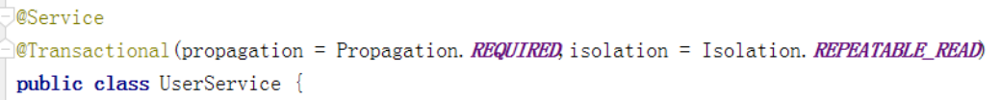
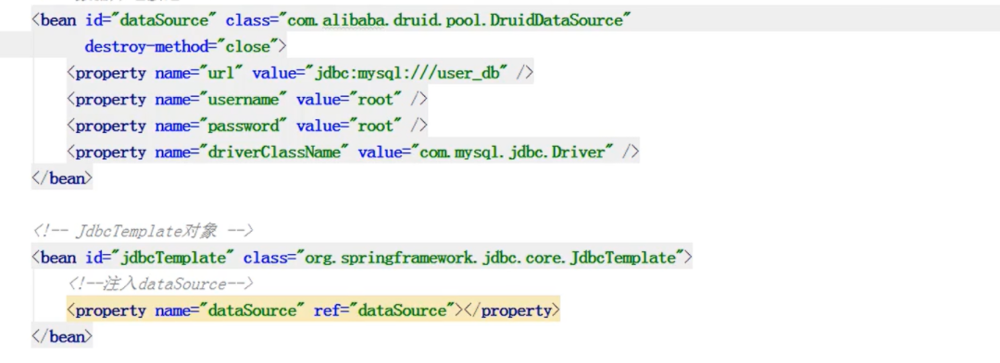

Spring5 框架概述


1、Spring 是轻量级的开源的 JavaEE 框架
2、Spring 可以解决企业应用开发的复杂性
3、Spring 有两个核心部分：IOC 和 Aop
（1）IOC：控制反转，把创建对象过程交给 Spring 进行管理
（2）Aop：面向切面，不修改源代码进行功能增强

4、Spring 特点

（1）方便解耦，简化开发
（2）Aop 编程支持
（3）方便程序测试
（4）方便和其他框架进行整合
（5）方便进行事务操作
（6）降低 API 开发难度

# IOC（概念和原理）

1、什么是 IOC
（1）控制反转：由主动new产生对象转换为由**外部**提供对象，此过程中对象创建控制权转移到**外部**
（2）使用 IOC 目的：为了耦合度降低
（3）做入门案例就是 IOC 实现

（4）spring技术提供了一个容器，称为**IOC容器**，用来充当IOC思想的**“外部”**

（5）IOC管理了对象的创建和初始化的工作，被创建或被管理的对象在IOC容器内统称为**Bean**

2、IOC 底层原理
（1）xml 解析、工厂模式、反射 
3、画图讲解 IOC 底层原理


## DI(Dependency Injection)依赖注入

在容器中建立bean和bean之间的依赖关系的整个过程，称为依赖注入

## IOC核心概念


## IOC（BeanFactory 接口）

1、IOC 思想基于 IOC 容器完成，IOC 容器底层就是对象工厂
2、Spring 提供 IOC 容器实现两种方式：（两个接口）

（1）BeanFactory：IOC 容器基本实现，是 Spring 内部的使用接口，不提供开发人员进行使用

特点是：加载配置文件时候不会创建对象，在获取对象（使用）才去创建对象

  （2）ApplicationContext：BeanFactory 接口的子接口，提供更多更强大的功能，一般由开发人员进行使用

特点是：加载配置文件时候就会把在配置文件对象进行创建
3、ApplicationContext 接口有实现类


他们的区别是：

FileSystemXmlApplicationContext的参数写的是盘路径，也就是绝对路径

ClassPathXmlApplicationContext的参数写的是类路径，是src下的，从根路径开始找的

## **IOC** **操作** **Bean** **管理（概念）**

```
1、什么是 Bean 管理
	Bean 管理指的是两个操作
        （1）Spring 创建对象
        （2）Spirng 注入属性
2、Bean 管理操作有两种方式
（1）基于 xml 配置文件方式实现
（2）基于注解方式实现
```

### **IOC** **操作** **Bean** **管理（基于** **xml** **方式）**

#### 1.基于XML创建对象


​		（1）在 spring的xml 配置文件中，使用 bean 标签，标签里面添加对应属性，就可以实现对象创建
​		（2）在 bean 标签有很多属性，介绍常用的属性

* id 属性：	 唯一标识

* class 属性：类的全路径（包和类的路径）

  （3）创建对象时候，默认也是执行无参数构造方法完成对象创建

#### 2.基于XML注入属性

（1）DI： DI是IOC的一种具体实现，表示依赖注入，就是注入属性


##### 第一种注入方式：使用 set 方法进行注入(重点)

（1） 创建类，定义属性和对应的 set 方法

```java
/**

演示使用 set 方法进行注入属性
*/
public class Book {
     //创建属性
     private String bname;
     private String bauthor;
     //创建属性对应的 set 方法
     public void setBname(String bname) {
   		  	this.bname = bname;
     }
     public void setBauthor(String bauthor) {
        	this.bauthor = bauthor;
     } 
}
```

 （2）在 spring 配置文件配置对象创建，配置属性注入

```xml
<!--2 set 方法注入属性--> 
<bean id="book" class="com.atguigu.spring5.Book">
     <!--
        使用 property 完成属性注入 property就是属性
             name：类里面属性名称
             value：向属性注入的值
			这些默认调用的是成员变量的set方法
     -->
     <property name="bname" value="易筋经"></property>
     <property name="bauthor" value="达摩老祖"></property>
</bean> 
```


##### 第二种注入方式：使用有参数构造（构造器）进行注入（无set方法用这个）

（1）创建类，定义属性，创建属性对应有参数构造方法

```java
/*
使用有参数构造注入
*/
public class Orders {
    //属性
    private String oname;
    private String address;
    //有参数构造
    public Orders(String oname,String address) {
        this.oname = oname;
        this.address = address;
    } 
}
```

（2）在 spring 配置文件中进行配置

```xml
<!--3 有参数构造注入属性--> 
<bean id="orders" class="com.atguigu.spring5.Orders">
     <constructor-arg name="oname" value="电脑"></constructor-arg>
     <constructor-arg name="address" value="China"></constructor-arg>
</bean> 
```

##### 第三种注入方式：p 名称空间注入（了解）

（1）使用 p 名称空间注入，可以简化基于 xml 配置方式
第一步 添加 p 名称空间在配置文件中
第二步 进行属性注入，在 bean 标签里面进行操作

```xml
<!--2 set 方法注入属性--> 
<bean id="book" class="com.atguigu.spring5.Book" p:bname="九阳神功" p:bauthor="无名氏"></bean>
```

### **IOC** **操作** **Bean** 管理（XML注入其他类型属性）

#### 1、字面量

可以在成员属性后直接赋值

#### （1）null 值（给属性赋空值）

利用null标签

```xml
<!--null 值--> 
<property name="address">
 <null/>
</property> 
```

#### （2）属性值包含特殊符号

如果要把《南京》赋值给成员属性，我们不可以直接用大于小于号，需要重新想办法

```xml
<!--属性值包含特殊符号
 1 把<>进行转义 &lt; &gt;这两个是大于小于号的转义符号
 2 把带特殊符号内容写到 CDATA结构里面
-->
<property name="address">
    <value>
        <![CDATA[<<南京>>]]>
    </value>
</property> 
```

#### 2、注入属性-外部 bean

（1）创建两个类 service 类和 dao 类 

（2）在 service 调用 dao 里面的方法

（3）在 spring 配置文件中进行配置

```java
public class UserService {
    //创建 UserDao 类型属性，生成 set 方法
    private UserDao userDao;
    public void setUserDao(UserDao userDao) {
        this.userDao = userDao;
    }
    public void add() {
        System.out.println("service add...............");
        //调用dao的方法
        userDao.update();
    } 
}
```


在 spring 配置文件中进行配置

```xml
<!--先创建dao对象--> 
<bean id="userDaoImpl" class="com.atguigu.spring5.dao.UserDaoImpl"></bean> 


<!-- service 的创建-->
<bean id="userService" class="com.atguigu.spring5.service.UserService">
    <!--		注入 userDao 对象
        		 name 属性：类里面属性名称
        		 ref 属性：创建 userDao 对象 bean 标签 id 值
 	-->
    <property name="userDao" ref="userDaoImpl"></property>
</bean> 


```


#### 3、注入属性-内部 bean


#### （1）举个例子

一对多关系：部门和员工
一个部门有多个员工，一个员工属于一个部门
部门是一，员工是多


#### （2）在实体类之间表示一对多关系，员工表示所属部门，使用对象类型属性进行表示

```java
//部门类
public class Dept {
    private String dname;
    public void setDname(String dname) {
        this.dname = dname;
    } 
}


//员工类
public class Emp {
    private String ename;//员工姓名
    private String gender;//员工性别
    
    //员工属于某一个部门，使用对象形式表示
    private Dept dept;
    
    
    
    
    public void setDept(Dept dept) {
        this.dept = dept;
    }
    public void setEname(String ename) {
        this.ename = ename;
    }
    public void setGender(String gender) {
        this.gender = gender;
    } 
}
```


#### （3）在 spring 配置文件中进行配置

```xml
<!--内部 bean--> 
<bean id="emp" class="com.atguigu.spring5.bean.Emp">
    
    
    <!--设置两个普通属性-->
    <property name="ename" value="lucy"></property>
    <property name="gender" value="女"></property>
    
    
    
    <!--设置对象类型属性-->
    <property name="dept">
        <bean id="dept" class="com.atguigu.spring5.bean.Dept">
            <property name="dname" value="安保部"></property>
        </bean>
    </property>
    
    
</bean> 
```


#### 4、注入属性-级联赋值 

##### （1）第一种写法 

```xml
<!--级联赋值--> 
<bean id="dept" class="com.atguigu.spring5.bean.Dept">
    <property name="dname" value="财务部"></property>
</bean> 


<bean id="emp" class="com.atguigu.spring5.bean.Emp">
    <!--设置两个普通属性-->
    <property name="ename" value="lucy"></property>
    <property name="gender" value="女"></property>
    
    
    
    <!--级联赋值-->
    <property name="dept" ref="dept"></property>
</bean> 
```


##### （2）第二种写法

**dept.dname默认调用的是下面的这个方法**


```xml
<!--级联赋值--> 
<bean id="emp" class="com.atguigu.spring5.bean.Emp">
    <!--设置两个普通属性-->
    <property name="ename" value="lucy"></property>
    <property name="gender" value="女"></property>
    <!--级联赋值-->
    <property name="dept" ref="dept"></property>
    <property name="dept.dname" value="技术部"></property>
</bean> 


<bean id="dept" class="com.atguigu.spring5.bean.Dept">
    <property name="dname" value="财务部"></property>
</bean>
```

### IOC操作Bean管理（XML注入集合类型）

#### 1、注入数组类型属性

#### 2、注入 List 集合类型属性

#### 3、注入 Map 集合类型属性

（1）创建类，定义数组、list、map、set 类型属性，生成对应 set 方法

```java
public class Stu {
    //1 数组类型属性
    private String[] courses;
    //2 list 集合类型属性
    private List<String> list;
    //3 map 集合类型属性
    private Map<String,String> maps;
    //4 set 集合类型属性
    private Set<String> sets;
    
    
    
    
    public void setSets(Set<String> sets) {
        this.sets = sets;
    }
    public void setCourses(String[] courses) {
        this.courses = courses;
    }
    public void setList(List<String> list) {
        this.list = list;
    }
    public void setMaps(Map<String, String> maps) {
        this.maps = maps;
    } 
}
```

（2）在 spring 配置文件进行配置

```xml
<!--1 集合类型属性注入--> 

<bean id="stu" class="com.atguigu.spring5.collectiontype.Stu">
    <!--数组类型属性注入-->
    <property name="courses">
        <array>
            <value>java 课程</value>
            <value>数据库课程</value>
        </array>
    </property>
    
    
    <!--list 类型属性注入-->
    <property name="list">
        <list>
            <value>张三</value>
            <value>小三</value>
        </list>
    </property>
    
    
    
    
    <!--map 类型属性注入-->
    <property name="maps">
        <map>
            <entry key="JAVA" value="java"></entry>
            <entry key="PHP" value="php"></entry>
        </map>
    </property>
    
    
    
    <!--set 类型属性注入-->
    <property name="sets">
        <set>
            <value>MySQL</value>
            <value>Redis</value>
        </set>
    </property>
    
    
</bean>
```

####  4、在集合里面设置对象类型值


```xml
<!--创建多个 course 对象--> 
<bean id="course1" class="com.atguigu.spring5.collectiontype.Course">
    <property name="cname" value="Spring5 框架"></property>
</bean> 
<bean id="course2" class="com.atguigu.spring5.collectiontype.Course">
    <property name="cname" value="MyBatis 框架"></property>
</bean>


<!--注入 list 集合类型，值是对象--> 
<property name="courseList">
    <list>
        <ref bean="course1"></ref>
        <ref bean="course2"></ref>
    </list>
</property>
```

####  5、把集合注入部分提取出来

**注入部分可以直接注入一个集合！！！**


步骤是：

（1）在 spring 配置文件中引入**名称空间** util

```xml
<?xml version="1.0" encoding="UTF-8"?>
<beans xmlns="http://www.springframework.org/schema/beans"
       xmlns:xsi="http://www.w3.org/2001/XMLSchema-instance"
       xmlns:p="http://www.springframework.org/schema/p"
       xmlns:util="http://www.springframework.org/schema/util"
       xsi:schemaLocation="http://www.springframework.org/schema/beans 
                           http://www.springframework.org/schema/beans/spring-beans.xsd
                           http://www.springframework.org/schema/util 
                           http://www.springframework.org/schema/util/spring-util.xsd"> 
```

（2）使用 util 标签完成 list 集合注入提取

```xml
<!--1 提取 list 集合类型属性注入--> 
<util:list id="bookList">
    <value>易筋经</value>
    <value>九阴真经</value>
    <value>九阳神功</value>
</util:list>


<!--2 提取 list 集合类型属性注入使用--> 
<bean id="book" class="com.atguigu.spring5.collectiontype.Book">
    <property name="list" ref="bookList"></property>
</bean>
```

# IOC 操作 Bean 管理（FactoryBean）

1、Spring 有两种类型 bean，一种普通 bean，另外一种工厂 bean（FactoryBean）
2、普通 bean：在配置文件中定义 bean 类型就是返回类型
3、工厂 bean：在配置文件定义 bean 类型可以和返回类型不一样（比如Connection）

第一步 创建类，让这个类作为工厂 bean，实现接口 FactoryBean
第二步 实现接口里面的方法，在实现的方法中定义返回的 bean 类型

```java
public class MyBean implements FactoryBean<Course> {
    //定义返回 bean
    @Override
    public Course getObject() throws Exception {
        Course course = new Course();
        course.setCname("abc");
        return course;
    }
    @Override
    public Class<?> getObjectType() {
        return null;
    }
    @Override
    public boolean isSingleton() {
        return false;
    }
}
```

```xml
<bean id="myBean" class="com.atguigu.spring5.factorybean.MyBean">
</bean>
```


```java
@Test
public void test3() {
    ApplicationContext context =new ClassPathXmlApplicationContext("bean3.xml");
    //注意这里返回的是course类
    Course course = context.getBean("myBean", Course.class);
    System.out.println(course);
}
```


# IOC 操作 Bean 管理（bean 作用域）

1、在 Spring 里面，设置创建 bean 实例是单实例还是多实例

2、在 Spring 里面，默认情况下，bean 是单实例对象


3、如何设置单实例还是多实例 

（1）在 spring 配置文件 bean 标签里面有属性（scope）用于设置单实例还是多实例 

（2）scope 属性值 				  第一个值 默认值，singleton，表示是单实例对象 

​													第二个值 prototype，表示是多实例对象


（3）singleton 和 prototype 区别
第一 singleton 单实例，prototype 多实例
第二 设置 scope 值是 singleton 时候，加载 spring 配置文件时候就会创建单实例对象

 设置 scope 值是 prototype 时候，不是在加载 spring 配置文件时候创建 对象，在调用getBean 方法时候创建多实例对象

# IOC 操作 Bean 管理（bean 生命周期）

## 1、生命周期

（1）从对象创建到对象销毁的过程

## 2、bean 生命周期

（1）通过构造器创建 bean 实例（无参数构造）
（2）为 bean 的属性设置 值和对 引用其他 bean （调用 set 方法）
（3）调用 bean 的初始化的方法（需要进行配置初始化的方法）
（4）bean 可以使用了（对象获取到了）
（5）当容器关闭时候，调用 bean 的销毁的方法（需要进行配置销毁的方法）

## 3、演示 bean 生命周期

```java
public class Orders {//无参数构造
    
    public Orders() {
        System.out.println("第一步 执行无参数构造创建 bean 实例");
    }
    
    private String oname;
    
    public void setOname(String oname) {
        this.oname = oname;
        System.out.println("第二步 调用 set 方法设置属性值");
    }
    
    //创建执行的初始化的方法
    public void initMethod() {
        System.out.println("第三步 执行初始化的方法");
    }
    
    //创建执行的销毁的方法
    public void destroyMethod() {
        System.out.println("第五步 执行销毁的方法");
    }
}
```

```xml
<bean id="orders" class="com.atguigu.spring5.bean.Orders" init-method="initMethod" destroy-method="destroyMethod">
    <property name="oname" value="手机"></property>
</bean>
```

```java
@Test
public void testBean3() {
    ClassPathXmlApplicationContext context =new ClassPathXmlApplicationContext("bean4.xml");
    Orders orders = context.getBean("orders", Orders.class);
    System.out.println("第四步 获取创建 bean 实例对象");
    System.out.println(orders);
    //手动让 bean 实例销毁
    context.close();
}
```


除此之外，还有一种方法可以初始化bean，那就是initializingBean


## 4、加入bean 的后置处理器，bean 生命周期有七步

（1）通过构造器创建 bean 实例（无参数构造）
（2）为 bean 的属性设置值和对其他 bean 引用（调用 set 方法）
（3）把 bean 实例传递 bean 后置处理器的方法 postProcessBeforeInitialization 

----在这里还可以加一个！！！initializingBean接口方法的执行，不知道为啥尚硅谷没讲 

（4）调用 bean 的初始化的方法（需要进行配置初始化的方法）
（5）把 bean 实例传递 bean 后置处理器的方法 postProcessAfterInitialization
（6）bean 可以使用了（对象获取到了）
（7）当容器关闭时候，调用 bean 的销毁的方法（需要进行配置销毁的方法）

## 5、演示添加后置处理器效果

（1）创建类，实现接口 BeanPostProcessor，创建后置处理器

```java
public class MyBeanPost implements BeanPostProcessor {
    @Override
    public Object postProcessBeforeInitialization(Object bean, String beanName) 
        throws BeansException {
        System.out.println("在初始化之前执行的方法");
        return bean;
    }
    @Override
    public Object postProcessAfterInitialization(Object bean, String beanName) 
        throws BeansException {
        System.out.println("在初始化之后执行的方法");
        return bean;
    }
}
```

```xml
<!--配置后置处理器-->
<bean id="myBeanPost" class="com.atguigu.spring5.bean.MyBeanPost"></bean>
```


# IOC 操作 Bean 管理（xml 自动装配）

## 1、什么是自动装配

（1）根据指定装配规则（属性名称或者属性类型），Spring 自动将匹配的属性值进行操作


## 2、演示自动装配过程


（1）根据属性名称自动注入

这种最好用标准命名

```xml
<!--实现自动装配
 bean 标签属性 autowire，配置自动装配
 autowire 属性常用两个值：


 byName 根据属性名称注入 ，注入值 bean的id值和类属性名称一样

 byType 根据属性类型注入（最常用）
-->
<bean id="dept" class="com.atguigu.spring5.autowire.Dept"></bean>


 <!--根据名字自动装配-->
<bean id="emp" class="com.atguigu.spring5.autowire.Emp" autowire="byName">
    <!--这个是手动装配-->
    <!--<property name="dept" ref="dept">
		</property>-->
</bean>

```


（2）根据属性类型（重点）自动注入

连名字（id）都可以不起这个，

```xml
<!--实现自动装配
 bean 标签属性 autowire，配置自动装配
 autowire 属性常用两个值：
 byName 根据属性名称注入 ，注入值 bean 的 id 值和类属性名称一样
 byType 根据属性类型注入
-->
<bean id="dept" class="com.atguigu.spring5.autowire.Dept"></bean>


 <!--根据类型自动装配-->
<bean id="emp" class="com.atguigu.spring5.autowire.Emp" autowire="byType">
 <!--<property name="dept" ref="dept"></property>-->
</bean>
```


# IOC 操作 Bean 管理(外部属性文件)

## 1、直接配置数据库信息

（1）配置德鲁伊连接池
（2）引入德鲁伊连接池依赖 jar 包



```xml
<!--直接配置连接池-->
<bean id="dataSource" class="com.alibaba.druid.pool.DruidDataSource">
    <property name="driverClassName" value="com.mysql.jdbc.Driver"></property>
    <property name="url" value="jdbc:mysql://localhost:3306/userDb"></property>
    <property name="username" value="root"></property>
    <property name="password" value="root"></property>
</bean>
```

## 2、可以引入外部属性文件配置数据库连接池

（1）创建外部属性文件，properties 格式文件，写数据库信息


（2）把外部 properties 属性文件引入到 spring 配置文件中

**开启context命名空间**

```xml
引入 context 名称空间
<beans xmlns="http://www.springframework.org/schema/beans" 
       xmlns:xsi="http://www.w3.org/2001/XMLSchema-instance" 
       xmlns:p="http://www.springframework.org/schema/p" 
       xmlns:util="http://www.springframework.org/schema/util" 
       
       
       
       
       
       xmlns:context="http://www.springframework.org/schema/context" 
       
       
       
       
       
       xsi:schemaLocation="http://www.springframework.org/schema/beans 
                           http://www.springframework.org/schema/beans/spring-beans.xsd 
                           http://www.springframework.org/schema/util 
                           http://www.springframework.org/schema/util/spring-util.xsd 
                           
                           
                           
                           
                           
                           
                           
                           
                           
                           http://www.springframework.org/schema/context 
                           http://www.springframework.org/schema/context/spring-context.xsd">
```

 在 spring 配置文件使用标签引入外部属性文件

```xml
<!--引入外部属性文件-->
<context:property-placeholder location="classpath:jdbc.properties"/>
<!--配置连接池-->
<bean id="dataSource" class="com.alibaba.druid.pool.DruidDataSource">
    <property name="driverClassName" value="${prop.driverClass}"></property>
    <property name="url" value="${prop.url}"></property>
    <property name="username" value="${prop.userName}"></property>
    <property name="password" value="${prop.password}"></property>
</bean>
```


# IOC（xml版本）总结


# IOC 操作 Bean 管理(基于注解方式)

## 1、什么是注解

（1）注解是代码特殊标记，格式：@注解名称(属性名称=属性值, 属性名称=属性值..          //可以用逗号隔开
（2）使用注解，注解作用在类上面，方法上面，属性上面
（3）使用注解目的：简化 xml 配置

## 2、Spring 针对 Bean 管理中创建对象提供注解

（1）@ Component（组件）
（2）@Service（业务层）
（3）@Controller（表现层）
（4）@Repository（数据层）

上面四个注解功能是一样的，都可以用来创建 bean 实例

## 3、基于注解方式实现对象创建

第一步 引入依赖


第二步 开启组件扫描(让spring的IOC容器知道有这个组件，所以开启扫描组件)

```xml
<!--开启组件扫描
 1 如果扫描多个包，多个包使用逗号隔开
 2 扫描包上层目录
-->

扫描包上层目录，找到里面的所有类
<context:component-scan base-package="com.atguigu"></context:component-scan>
```

第三步 创建类，在类上面添加创建对象注解

```java
//在注解里面 value 属性值可以省略不写，value是等于配置文件中的id
//默认值是类名称，首字母小写
//比如UserService -- userService
@Component(value = "userService") //等于   <bean id="userService" class=".."/>
public class UserService {
    public void add() {
        System.out.println("service add.......");
    }
}
```

额外的功能


## 4、开启组件扫描细节配置

```xml
<!--示例 1
 use-default-filters="false" 表示现在不使用默认 filter，使用自己自己配置 filter
 context:include-filter ，设置扫描哪些内容，作为一个过滤器
-->

<context:component-scan base-package="com.atguigu" use-default-filters="false">
    扫描带Controller注解的类
    <context:include-filter type="annotation" expression="org.springframework.stereotype.Controller"/>
</context:component-scan>
```

```xml
<!--示例 2
 下面配置扫描包所有内容
 context:exclude-filter： 设置哪些内容不进行扫描
-->
<context:component-scan base-package="com.atguigu">
     扫描不带Controller注解的类
    <context:exclude-filter type="annotation" expression="org.springframework.stereotype.Controller"/>
</context:component-scan>
```

## 5、基于注解方式实现属性注入

### （1）@Autowired：根据属性类型进行自动装配

Autowired不用提供set方法也能用，是反射的暴力破解 

第一步 把 service 和 dao 对象创建，在 service 和 dao 类添加创建对象注解
第二步 在 service 注入 dao 对象，在 service 类添加 dao 类型属性，在属性上面使用注解

```JAVA
@Service
public class UserService {
    
    
    //在 service 注入 dao 对象，在 service 类添加 dao 类型属性，在属性上面使用注解
    
    
    //定义 dao 类型属性
    //不需要添加 set 方法
    //添加注入属性注解
    @Autowired //根据类型注入，注入的是实现类UserDaoImpl
    private UserDao userDao;
    
    
    
    
    
    public void add() {
        System.out.println("service add.......");
        userDao.add();
    }
}
```

```java
@Repository
public class UserDaoImpl implements UserDao{
		public void add(){
            sout("dao add")
        }
}
```


### （2）@Qualifier：根据名称进行注入

这个@Qualifier 注解的使用，和上面@Autowired **一起使用**

```JAVA
//定义 dao 类型属性
//不需要添加 set 方法
//添加注入属性注解
@Autowired //根据类型进行注入
@Qualifier(value = "userDaoImpl") //根据名称进行注入，搜寻创建id为userDaoImpl的类
private UserDao userDao;
```

```java
@Repository//（默认的值是类名的首字母小写）
public class UserDaoImpl implements UserDao{
		public void add(){
            sout("dao add")
        }
}
```


### （3）@Resource：可以根据类型注入，可以根据名称注入（这个是不推荐用的！！用上面两个就行）

这个注解是javax的java的扩展包中提供的，所以在spring中最好用上面的两种方法

```JAVA
//@Resource //根据类型进行注入
@Resource(name = "userDaoImpl") //根据名称进行注入，这个也是根据上面的那个Qualifier
private UserDao userDao;
```

### （4）@Value：注入普通类型属性

注入简单类型比如8种基本类型+String

value属性里面的值是自己装配的，这个值可以来自于外部的配置文件哦

```JAVA
@Value(value = "abc")
private String name;
```

要是想通过外部属性加载value值的话

需要先配置

（1）


（2）

## 6、完全注解开发 


下面的配置是为了替代上面的那个的


 


@Configuration 																		作为标记，说明为配置类

@ComponentScan(basePackages = {"com.atguigu"})		 组件扫描，扫描的范围

（1）创建**配置类**，替代 xml 配置文件，用类替代xml！！！！！！！！！！！！

```JAVA
@Configuration //作为配置类，替代 xml 配置文件
@ComponentScan(basePackages = {"com.atguigu"})
public class SpringConfig {//这个类名是随意起的
}
```

（2）编写测试类

AnnotationConfigApplicationContext，**注解**的配置类，里面的参数加入配置类的class


```JAVA
@Test
public void testService2() {
    //加载配置类
    ApplicationContext context= new AnnotationConfigApplicationContext(SpringConfig.class);
    
    
    UserService userService = context.getBean("userService", UserService.class);
    System.out.println(userService);
    userService.add();
}
```

# 通过注解的方式管理第三方bean

## 不导入其他的bean


测试类

 

额外的，如果都写到springconfig类中这些方法会显得比较拥挤，我们可以对他们进行分类


## 导入其他的bean

### 简单类型bean


### 引用类型 bean


总结


# 注解总结与xml的对比


# Spring整合MyBatis

首先导入依赖


对mybatisConfig进行配置

原来的mybatis-config.xml


与spring进行整合


jdbc中的数据源


测试


总结对比




# Spring整合Junit

第一步

第二步


# AOP（概念）


1、什么是 AOP
（1）面向切面编程（面向方面编程），利用 AOP 可以对业务逻辑的各个部分进行隔离，从而使得业务逻辑各部分之间的耦合度降低，提高程序的可重用性，同时提高了开发的效率。
（2）通俗描述：<font color="red">**不通过修改源代码方式，在主干功能里面添加新功能，**</font>（代理）
（3）使用登录栗子说明AOP


# AOP（底层原理）

## 1、AOP 底层使用动态代理

（1）有两种情况动态代理

#### 第一种 **有接口情况**，使用 JDK 动态代理

创建接口实现类代理对象，增强类的方法

两者实现同样的接口


#### 第二种 **没有接口情况**，使用 CGLIB 动态代理

 创建子类的代理对象，增强类的方法


## AOP（JDK 动态代理）

### 1.使用JDK动态代理，使用Proxy类里面的方法创建代理对象


（1）调用 newProxyInstance 方法



方法有三个参数：
第一参数，类加载器
第二参数，增强方法所在的类，这个类实现的接口，**支持多个接口**
第三参数，实现这个接口 InvocationHandler，创建代理对象，写增强的部分

### 2、编写 JDK 动态代理代码

（1）创建接口，定义方法

```java
public interface UserDao {
    public int add(int a,int b);
    public String update(String id);
}
```

（2）创建接口实现类，实现方法

```java
public class UserDaoImpl implements UserDao {
    @Override
    public int add(int a, int b) {
        return a+b;
    }
    @Override
    public String update(String id) {
        return id;
    }
}
```

（3）使用 Proxy 类创建接口代理对象

```java
  //创建代理对象代码
class UserDaoProxy implements InvocationHandler {
    //1 把创建的是谁的代理对象，把谁传递过来


    //有参数构造传递
    private Object obj;
    //传过来的是userdao对象
    public UserDaoProxy(Object obj) {
        this.obj = obj;
    }
    //增强的逻辑
    @Override
    public Object invoke(Object proxy, Method method, Object[] args) throws Throwable {
        //方法之前

        //这是额外的功能
        System.out.println("方法之前执行...."+method.getName()+" :传递的参数..."+ Arrays.toString(args));
        //被增强的方法执行


        Object res = method.invoke(obj, args);


        //方法之后
        //这也是额外的功能
        System.out.println("方法之后执行...."+obj);
        return res;
    } 
}
```

创建userdao的代理对象

```java
public class JDKProxy {
    public static void main(String[] args) {
        //创建接口实现类代理对象
        Class[] interfaces = {UserDao.class};


        UserDaoImpl userDao = new UserDaoImpl();
        
        
//这里得到的是代理对象
        UserDao dao = 
            (UserDao)Proxy.newProxyInstance(JDKProxy.class.getClassLoader(), interfaces, new UserDaoProxy(userDao));
        int result = dao.add(1, 2);
        System.out.println("result:"+result);
    }
}                          
```

# AOP（操作术语）

## 连接点

```
类里面哪些方法可以被增强，这些方法称为连接点
```


## 切入点

```
实际被真正增强的方法，称为切入点
```


## 通知（增强）

增强的意思是进行额外操作

并且额外操作可以在不同的位置 

    （1）实际增强的逻辑部分称为通知（增强）
    （2）通知有多种类型
    	前置通知
        后置通知
        环绕通知
        异常通知
        最终通知（try catch finally）

## 切面

```
切面是动作

把通知应用到切入点过程
```


# AOP 操作（准备工作）

1、Spring 框架一般都是基于 AspectJ 实现 AOP 操作
（1）AspectJ 不是 Spring 组成部分，独立 AOP 框架，一般把 AspectJ 和 Spirng 框架一起使用，进行 AOP 操作

2、基于 AspectJ 实现 AOP 操作
（1）基于 xml 配置文件实现
（2）基于注解方式实现（使用）

3、在项目工程里面引入 AOP 相关依赖


4、切入点表达式
（1）切入点表达式作用：知道对哪个类里面的哪个方法进行增强
（2）语法结构：

```
 execution([权限修饰符] [返回类型] [类全路径] [方法名称]([参数列表]) )
```

举例 1：对 com.atguigu.dao.BookDao 类里面的 add 进行增强

```
execution(* com.atguigu.dao.BookDao.add(..))
```

举例 2：对 com.atguigu.dao.BookDao 类里面的所有的方法进行增强

```
execution(* com.atguigu.dao.BookDao.* (..))
```

举例 3：对 com.atguigu.dao 包里面所有类，类里面所有方法进行增强

```
execution(* com.atguigu.dao.*.* (..))
```

# AOP 操作（AspectJ 注解）

## 1、创建类，在类里面定义方法

```java
public class User {
    public void add() {
        System.out.println("add.......");
    }
}
```

## 2、创建增强类（编写增强逻辑）

（1）在增强类里面，创建方法，让不同方法代表不同通知类型

```java
//增强的类
public class UserProxy {
    public void before() {//前置通知
        System.out.println("before......");
    }
}
```

## 3、进行通知的配置

（1）在 spring 配置文件中，开启注解扫描

```xml
<?xml version="1.0" encoding="UTF-8"?>
<beans xmlns="http://www.springframework.org/schema/beans" 
       xmlns:xsi="http://www.w3.org/2001/XMLSchema-instance" 
       xmlns:context="http://www.springframework.org/schema/context" 
       xmlns:aop="http://www.springframework.org/schema/aop" 
       xsi:schemaLocation="http://www.springframework.org/schema/beans 
                           http://www.springframework.org/schema/beans/spring-beans.xsd 
                           http://www.springframework.org/schema/context 
                           http://www.springframework.org/schema/context/spring-context.xsd 
                           http://www.springframework.org/schema/aop 
                           http://www.springframework.org/schema/aop/spring-aop.xsd">
    <!-- 开启注解扫描 -->
    <context:component-scan base-package="com.atguigu.spring5.aopanno"></context:component-scan>
```

（2）使用注解创建 User 和 UserProxy 对象



（3）在增强类上面添加注解 @Aspect

```java
//增强的类
@Component
@Aspect //生成代理对象
public class UserProxy {
    public void add(){
		sout("add")
    }
}
```

（4）在 spring 配置文件中开启生成代理对象

```xml
<!-- 开启 Aspect 生成代理对象-->
<aop:aspectj-autoproxy></aop:aspectj-autoproxy>
```

## 4、配置不同类型的通知

（1）在增强类的里面，在作为通知方法上面添加通知类型注解，使用切入点表达式配置,等调用add方法使就会添加上去

```java
//增强的类
@Component
@Aspect //生成代理对象
public class UserProxy {
    //前置通知
    //@Before 注解表示作为前置通知
    @Before(value = "execution(* com.atguigu.spring5.aopanno.User.add(..))")
    public void before() {
        System.out.println("before.........");
    }
    
    
    
    
    //后置通知（返回通知）//在方法返回之后执行
    @AfterReturning(value = "execution(* com.atguigu.spring5.aopanno.User.add(..))")
        public void afterReturning() {
        System.out.println("afterReturning.........");
    }
    
    
    
    //最终通知//核心方法执行之后执行，和上面那个区别开
    @After(value = "execution(* com.atguigu.spring5.aopanno.User.add(..))")
    public void after() {
        System.out.println("after.........");
    }
    
    
    
    
    //异常通知（抛出异常才执行）
    @AfterThrowing(value = "execution(* com.atguigu.spring5.aopanno.User.add(..))")
    public void afterThrowing() {
        System.out.println("afterThrowing.........");
    }
    
    
    
    //环绕通知(重点)
    @Around(value = "execution(* com.atguigu.spring5.aopanno.User.add(..))")
    public void around(ProceedingJoinPoint proceedingJoinPoint) throws Throwable {
        System.out.println("环绕之前.........");
        
        
        //被增强的方法执行
        proceedingJoinPoint.proceed();
        
        
        System.out.println("环绕之后.........");
    }
}
```

<font color="red">ProceedingJoinPoint</font>

可以调用它里面的proceedingJoinPoint.getSignature()方法，得到执行的签名信息，签名信息里面含有对应方法的信息，比如方法名和类名


重要的是它


## 5、相同的切入点抽取

```java
//相同切入点抽取
@Pointcut(value = "execution(* com.atguigu.spring5.aopanno.User.add(..))")
public void pointdemo() {
}


//前置通知
//@Before 注解表示作为前置通知
@Before(value = "pointdemo()")
public void before() {
    System.out.println("before.........");
}
```

6、比如有多个增强类多同一个方法进行增强，设置增强类优先级
（1）在增强类上面添加注解 @Order(数字类型值)，数字类型值越小优先级越高 

```java
@Component
@Aspect
@Order(1)
public class PersonProxy{}
```

7、完全使用注解开发 
创建配置类，不需要创建 xml 配置文件 

```java
@Configuration
@ComponentScan(basePackages = {"com.atguigu"})//开启组件扫描
@EnableAspectJAutoProxy(proxyTargetClass = true)//生成代理对象
public class ConfigAop {
}
```

# AOP 操作（AspectJ 配置文件）

1、创建两个类，增强类和被增强类，创建方法
2、在 spring 配置文件中创建两个类对象

```xml
<!--创建对象-->
<bean id="book" class="com.atguigu.spring5.aopxml.Book"></bean>
<bean id="bookProxy" class="com.atguigu.spring5.aopxml.BookProxy"></bean>
```

3、在 spring 配置文件中配置切入点

```xml
<!--配置 aop 增强-->
<aop:config>
    <!--切入点-->
    <aop:pointcut id="p" expression="execution(* com.atguigu.spring5.aopxml.Book.buy(..))"/>
    
    
    <!--配置切面-->
    <aop:aspect ref="bookProxy">
        <!--增强作用在具体的方法上//这个是前置通知，method里面是增强的方法，作用到切点上-->
        <aop:before method="before" pointcut-ref="p"/>
    </aop:aspect>
</aop:config>
```


# AOP注解步骤


# AOP总结





# JdbcTemplate(概念和准备)

## 1、什么是 JdbcTemplate

（1）Spring 框架对 JDBC 进行封装，使用 JdbcTemplate 方便实现对数据库操作

## 2、准备工作

（1）引入相关 jar 包


（2）在 spring 配置文件配置数据库连接池

这个是一个模板，需要具体情况具体改

```xml
<!-- 数据库连接池 -->
<bean id="dataSource" class="com.alibaba.druid.pool.DruidDataSource" destroy-method="close">
    <property name="url" value="jdbc:mysql:///user_db" />
    <property name="username" value="root" />
    <property name="password" value="root" />
    <property name="driverClassName" value="com.mysql.jdbc.Driver" />
</bean>
```

（3）配置 JdbcTemplate 对象，注入 DataSource

注入数据源，数据

用set方法注入

```xml
<!-- JdbcTemplate 对象 -->
<bean id="jdbcTemplate" class="org.springframework.jdbc.core.JdbcTemplate">
    <!--注入 dataSource-->
    <property name="dataSource" ref="dataSource"></property>
</bean>
```

（4）创建 service 类，创建 dao 类，在 dao 注入 jdbcTemplate 对象

**首先配置文件组件扫描**

```xml
<!-- 组件扫描 -->
<context:component-scan base-package="com.atguigu"></context:component-scan>
```

**Service层**

```java
@Service
public class BookService {
    //注入 dao
    @Autowired
    private BookDao bookDao;
}
```

**DAO层**

JdbcTemplate已经在配置文件中创建好了

```java
@Repository
public class BookDaoImpl implements BookDao {
    //注入 JdbcTemplate
    @Autowired
    private JdbcTemplate jdbcTemplate;
}
```

# JdbcTemplate 操作数据库（添加）

## 1、对应数据库创建实体类

这个本来是Book的，下面忽略他


## 2、编写 service 和 dao

（1）在 dao 进行数据库添加操作
（2）调用 JdbcTemplate 对象里面 update 方法实现添加操作


```java
@Repository
public class BookDaoImpl implements BookDao {
    //注入 JdbcTemplate
    @Autowired
    private JdbcTemplate jdbcTemplate;
    //添加的方法
    @Override
    public void add(Book book) {
        //1 创建 sql 语句
        String sql = "insert into t_book values(?,?,?)";
        //2 调用方法实现
        Object[] args = {book.getUserId(), book.getUsername(), book.getUstatus()};
        int update = jdbcTemplate.update(sql,args);
        System.out.println(update);
    }
}
```

## 3、测试类

```java
@Test
public void testJdbcTemplate() {
    ApplicationContext context =new ClassPathXmlApplicationContext("bean1.xml");
 	BookService bookService = context.getBean("bookService", BookService.class);//新建service
    
    
    //得到图书
    Book book = new Book();
    book.setUserId("1");
    book.setUsername("java");
    book.setUstatus("a");
    
    
    
    bookService.addBook(book);
}
```

添加成功啦


# JdbcTemplate 操作数据库（修改和删除）


这两个方法都是写在DAO里面的 

1、修改

```java
@Override
public void updateBook(Book book) {
    String sql = "update t_book set username=?,ustatus=? where user_id=?";
    Object[] args = {book.getUsername(), book.getUstatus(),book.getUserId()};
    int update = jdbcTemplate.update(sql, args);
    System.out.println(update);
}
```

2、删除

```java
@Override
public void delete(String id) {
    String sql = "delete from t_book where user_id=?";
    int update = jdbcTemplate.update(sql, id);
    System.out.println(update);
}
```

# JdbcTemplate 操作数据库（查询）

## JdbcTemplate 操作数据库（查询返回某个值）

1、查询表里面有多少条记录，返回是某个值
2、使用 JdbcTemplate 实现查询返回某个值代码


​												⚫ 有两个参数 
​												⚫ 第一个参数：sql 语句
​												⚫ 第二个参数：返回类型 Class

```java
//查询表记录数
@Override
public int selectCount() {
    String sql = "select count(*) from t_book";
    Integer count = jdbcTemplate.queryForObject(sql, Integer.class);
    return count;
}
```

## JdbcTemplate 操作数据库（查询返回对象）

1、场景：查询图书详情
2、JdbcTemplate 实现查询返回对象


⚫ 有三个参数 

​															⚫ 第一个参数：sql 语句
​															⚫ 第二个参数：RowMapper 是接口，针对返回不同类型数据，使用这个接口里面实现类完成数据封装
​															⚫ 第三个参数：sql 语句值

```java
//查询返回对象
@Override
public Book findBookInfo(String id) {
    String sql = "select * from t_book where user_id=?";
    //调用方法
    Book book = jdbcTemplate.queryForObject(sql, new BeanPropertyRowMapper<Book>(Book.class), id);
    return book;
}
```


## JdbcTemplate 操作数据库（查询返回集合）

1、场景：查询图书列表分页…
2、调用 JdbcTemplate 方法实现查询返回集合


⚫ 有三个参数 
																				⚫ 第一个参数：sql 语句
																				⚫ 第二个参数：RowMapper 是接口，针对返回不同类型数据，使用这个接口里面实现类完成数据封装
																				⚫ 第三个参数：sql 语句值

```java
//查询返回集合
@Override
public List<Book> findAllBook() {
    String sql = "select * from t_book";
    //调用方法
    List<Book> bookList = jdbcTemplate.query(sql, new BeanPropertyRowMapper<Book>(Book.class));
    return bookList;
}
```


## JdbcTemplate 操作数据库（批量操作）

1、批量操作：操作表里面多条记录

### JdbcTemplate 实现批量添加操作


⚫ 有两个参数 
																	⚫ 第一个参数：sql 语句
																	⚫ 第二个参数：List 集合，添加多条记录数据


```java
//批量添加
@Override
public void batchAddBook(List<Object[]> batchArgs) {
    String sql = "insert into t_book values(?,?,?)";
    jdbcTemplate.batchUpdate(sql, batchArgs);//这个方法做了封装
}
```

```java
这里是在测试类里面，显示怎么用的

//批量添加测试
List<Object[]> batchArgs = new ArrayList<>();
Object[] o1 = {"3","java","a"};
Object[] o2 = {"4","c++","b"};
Object[] o3 = {"5","MySQL","c"};
batchArgs.add(o1);
batchArgs.add(o2);
batchArgs.add(o3);
//调用批量添加
bookService.batchAdd(batchArgs);
```


### JdbcTemplate 实现批量修改操作


⚫ 有两个参数 
																	⚫ 第一个参数：sql 语句
																	⚫ 第二个参数：List 集合，添加多条记录数据

```java
//批量修改
@Override
public void batchUpdateBook(List<Object[]> batchArgs) {
    String sql = "update t_book set username=?,ustatus=? where user_id=?";
    jdbcTemplate.batchUpdate(sql, batchArgs);
}
```


```java
//批量修改
List<Object[]> batchArgs = new ArrayList<>();
Object[] o1 = {"java0909","a3","3"};
Object[] o2 = {"c++1010","b4","4"};
Object[] o3 = {"MySQL1111","c5","5"};
batchArgs.add(o1);
batchArgs.add(o2);
batchArgs.add(o3);
//调用方法实现批量修改
bookService.batchUpdate(batchArgs);
```


### JdbcTemplate 实现批量删除操作

```java
//批量删除
@Override
public void batchDeleteBook(List<Object[]> batchArgs) {
    String sql = "delete from t_book where user_id=?";
    jdbcTemplate.batchUpdate(sql, batchArgs);
}
```

```java
//批量删除
List<Object[]> batchArgs = new ArrayList<>();
Object[] o1 = {"3"};
Object[] o2 = {"4"};
batchArgs.add(o1);
batchArgs.add(o2);
//调用方法实现批量删除
bookService.batchDelete(batchArgs);
```

# 事务操作（事务概念）

1、什么事务
（1）事务是数据库操作最基本单元

意思是：逻辑上一组操作，要么都成功，如果有一个失败所有操作都失败
（2）典型场景：银行转账

* lucy 转账 100 元 给 mary
* lucy 少 100，mary 多 100

2、事务四个特性（ACID）
（1）原子性                    要么都成功,要么都失败
（2）一致性                    操作之前和操作之后总量是一样的
（3）隔离性                    多事务操作时不会互相影响
（4）持久性                    提交之后，表中数据真正发生了变化


# 事务操作（搭建事务操作环境）


## 1、创建数据库user_db和表t_account，添加记录


## 2、创建 service，搭建 dao，完成对象创建和注入关系

（1）service 注入 dao，在 dao 注入 JdbcTemplate，在 JdbcTemplate 注入 DataSource

```java
@Service
public class UserService {
    //注入 dao
    @Autowired
    private UserDao userDao;
} 
```


```java
@Repository
public class UserDaoImpl implements UserDao {
    @Autowired
    private JdbcTemplate jdbcTemplate;
}
```


## 3、在 dao 创建两个方法：多钱和少钱的方法，在 service 创建方法（转账的方法）

```java
@Repository
public class UserDaoImpl implements UserDao {
    @Autowired
    private JdbcTemplate jdbcTemplate;
    //lucy 转账 100 给 mary
    //少钱
    @Override
    public void reduceMoney() {
        String sql = "update t_account set money=money-? where username=?";
        jdbcTemplate.update(sql,100,"lucy");
    }
    //多钱
    @Override
    public void addMoney() {
        String sql = "update t_account set money=money+? where username=?";
        jdbcTemplate.update(sql,100,"mary");
    }
}
```

```java
@Service
public class UserService {
    //注入 dao
    @Autowired
    private UserDao userDao;
    
    
    //转账的方法
    public void accountMoney() {
        //lucy 少 100
        userDao.reduceMoney();
        //mary 多 100
        userDao.addMoney();
    }
}
```

## 4、上面代码，如果正常执行没有问题的，但是如果代码执行过程中出现异常，有问题的话，就会出现问题，解决办法


（1）上面问题如何解决呢？

​					使用事务进行解决

（2）事务操作过程，加在service层中！！！！


# 事务操作（Spring 事务管理介绍）



1、事务添加到 JavaEE 三层结构里面 Service 层（业务逻辑层）

2、在 Spring 进行事务管理操作
	有两种方式：编程式事务管理（很少使用）和声明式事务管理（使用）

3、声明式事务管理
（1）基于注解方式（使用）
（2）基于 xml 配置文件方式

4、在 Spring 进行声明式事务管理，底层使用 AOP 原理

5、Spring 事务管理 API
提供一个接口，代表事务管理器，这个接口针对不同的框架提供不同的实现类


##  事务操作（注解声明式事务管理）

### 1、在 spring 配置文件配置事务管理器

dataSource数据源在之前搭建环境的时候创建过了


```xml
<!--创建事务管理器-->
<bean id="transactionManager" class="org.springframework.jdbc.datasource.DataSourceTransactionManager">
    <!--注入数据源-->
    <property name="dataSource" ref="dataSource"></property>
</bean>
```

### 2、在 spring 配置文件，**开启事务注解**

（1）在 spring 配置文件引入名称空间 tx

```xml
<beans xmlns="http://www.springframework.org/schema/beans" 
       xmlns:xsi="http://www.w3.org/2001/XMLSchema-instance" 
       xmlns:context="http://www.springframework.org/schema/context" 
       xmlns:aop="http://www.springframework.org/schema/aop" 
       xmlns:tx="http://www.springframework.org/schema/tx" 
       xsi:schemaLocation="http://www.springframework.org/schema/beans 
                           http://www.springframework.org/schema/beans/spring-beans.xsd 
                           http://www.springframework.org/schema/context 
                           http://www.springframework.org/schema/context/spring-context.xsd 
                           http://www.springframework.org/schema/aop 
                           http://www.springframework.org/schema/aop/spring-aop.xsd 
                           http://www.springframework.org/schema/tx 
                           http://www.springframework.org/schema/tx/spring-tx.xsd">
```

（2）开启事务注解


```xml
<!--开启事务注解-->
<tx:annotation-driven transaction-manager="transactionManager">
</tx:annotation-driven>
```

### 3、在 service 类上面（或者 service 类里面方法上面）添加事务注解

（1）@Transactional，这个注解添加到类上面，也可以添加方法上面(**一般写在接口的方法上**)

（2）如果把这个注解添加类上面，这个类里面所有的方法都添加事务

（3）如果把这个注解添加方法上面，为这个方法添加事务

```java
@Service
@Transactional
public class UserService {}
```


# 事务操作（声明式事务管理参数配置）

1、在 service 类上面添加注解@Transactional，在这个注解里面可以配置事务相关参数


## propagation：事务传播行为

多方法之间进行调用， 这个过程中**事务**是如何进行管理的


​																									上面这两个用的比较多一些


如何使用呢：


## ioslation：事务隔离级别

（1）事务有特性成为隔离性，多事务操作之间不会产生影响。不考虑隔离性产生很多问题

（2）有三个读问题：脏读、不可重复读、虚（幻）读

### 脏读：一个未提交事务读取到另一个未提交事务的数据

假如两个人同时操作一组数据


### 不可重复读：一个未提交事务读取到另一提交事务修改数据


### 虚读：一个未提交事务读取到另一提交事务添加数据

解决：通过设置事务隔离级别，解决读问题




## timeout：超时时间

（1）事务需要在**一定时间**内进行提交，如果不提交则会进行回滚
（2）默认值是 -1 ，也就是不会超时，我们可以设置时间以秒单位进行计算


## readOnly：是否只读

（1）读：查询操作，写：添加修改删除操作
（2）readOnly 默认值 false，表示可以查询，可以添加修改删除操作
（3）设置 readOnly 值是 true，设置成 true 之后，只能查询

## rollbackFor：回滚

设置

**出现哪些异常**

进行事务回滚

## noRollbackFor：不回滚

设置

出现哪些异常

不进行事务回滚


# 事务操作（XML 声明式事务管理）

1、在 spring 配置文件中进行配置
第一步 配置事务管理器
第二步 配置通知（增强的那一部分就叫通知    AOP中说到过）
第三步 配置切入点和切面

前面我们还需要提前配置这些


还有一个组件扫描




```xml
<!--1 创建事务管理器-->
<bean id="transactionManager" class="org.springframework.jdbc.datasource.DataSourceTransactionManager">
    <!--注入数据源-->
    <property name="dataSource" ref="dataSource"></property>
</bean>


<!--2 配置通知-->
<tx:advice id="txadvice">
    <!--配置事务参数-->
    <tx:attributes>
        <!--指定哪种规则的方法上面添加事务-->
        <tx:method name="accountMoney" propagation="REQUIRED"/><!--后面可以加属性 -->
        <!--<tx:method name="account*"/>只要是account开头的方法就加上-->
    </tx:attributes>
</tx:advice>


<!--3 配置切入点和切面-->
<aop:config>
    <!--配置切入点-->
    <aop:pointcut id="pt" expression="execution(* com.atguigu.spring5.service.UserService.*(..))"/>
    <!--配置切面-->
    <aop:advisor advice-ref="txadvice" pointcut-ref="pt"/>
</aop:config>
```


# 事务操作（完全注解声明式事务管理）


#  

创建配置类，使用配置类替代 xml 配置文件（完全替代了）

```java
@Configuration //配置类
@ComponentScan(basePackages = "com.atguigu") //组件扫描
@EnableTransactionManagement //开启事务
public class TxConfig {
    
    
    //创建数据库连接池
    @Bean//利用bean注解，返回值必须是那个类
    public DruidDataSource getDruidDataSource() {
        DruidDataSource dataSource = new DruidDataSource();
        dataSource.setDriverClassName("com.mysql.jdbc.Driver");
        dataSource.setUrl("jdbc:mysql:///user_db");
        dataSource.setUsername("root");
        dataSource.setPassword("root");
        return dataSource;
    }
    
    
    
    //创建 JdbcTemplate 对象
    //由于IOC容器中已经存在了DataSource dataSource对象，可以直接用，根据类型直接找到这个对象
    @Bean
    public JdbcTemplate getJdbcTemplate(DataSource dataSource) {
     
        JdbcTemplate jdbcTemplate = new JdbcTemplate();
        //到 ioc 容器中根据类型找到 dataSource
        //注入 dataSource
        jdbcTemplate.setDataSource(dataSource);
        return jdbcTemplate;
    }
    
    
    //创建事务管理器
    @Bean
    public DataSourceTransactionManager getDataSourceTransactionManager(DataSource dataSource) {
        DataSourceTransactionManager transactionManager = new DataSourceTransactionManager();
        transactionManager.setDataSource(dataSource);
        return transactionManager;
    }
}
```

测试的时候要用**AnnotationConfigApplicationContext**这个类哦


# 事务操作具体步骤


