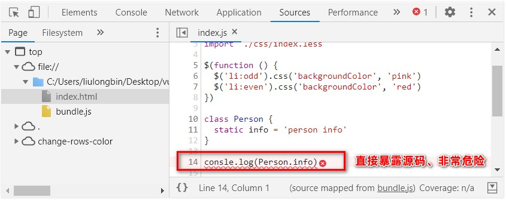
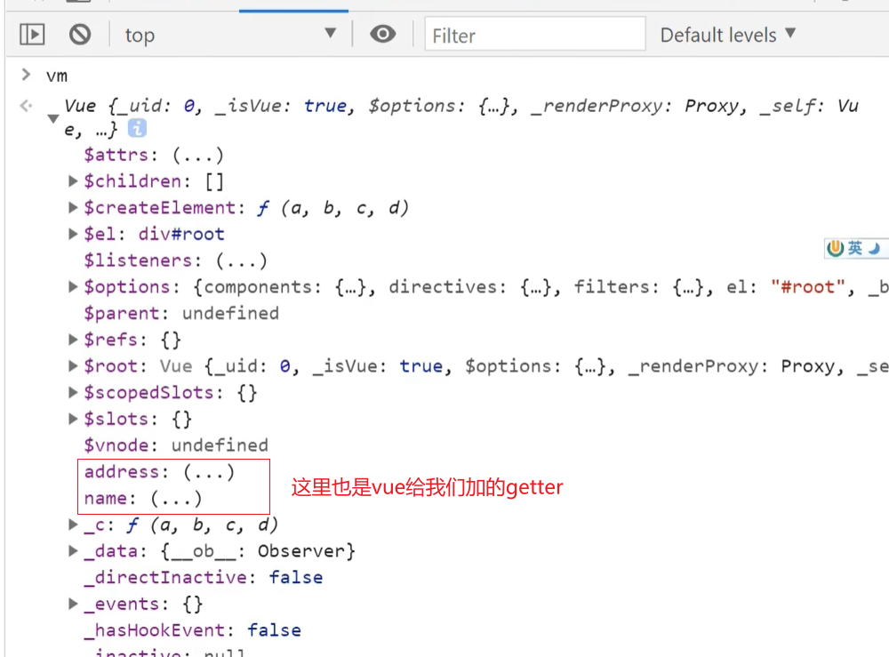
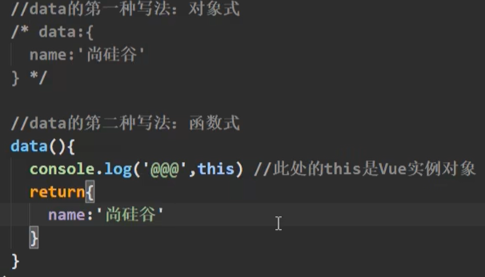
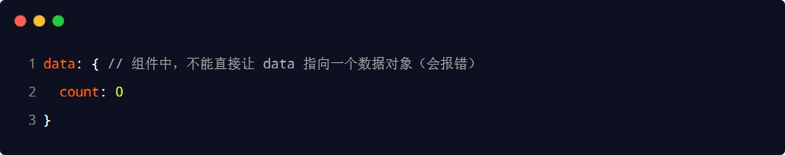
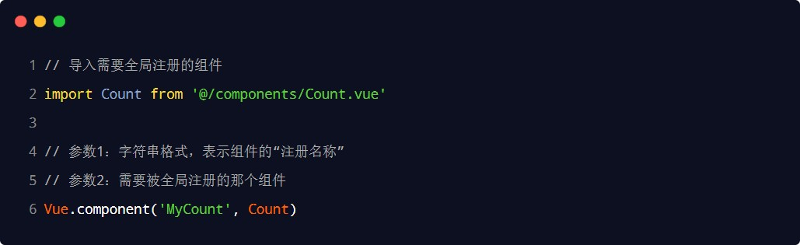
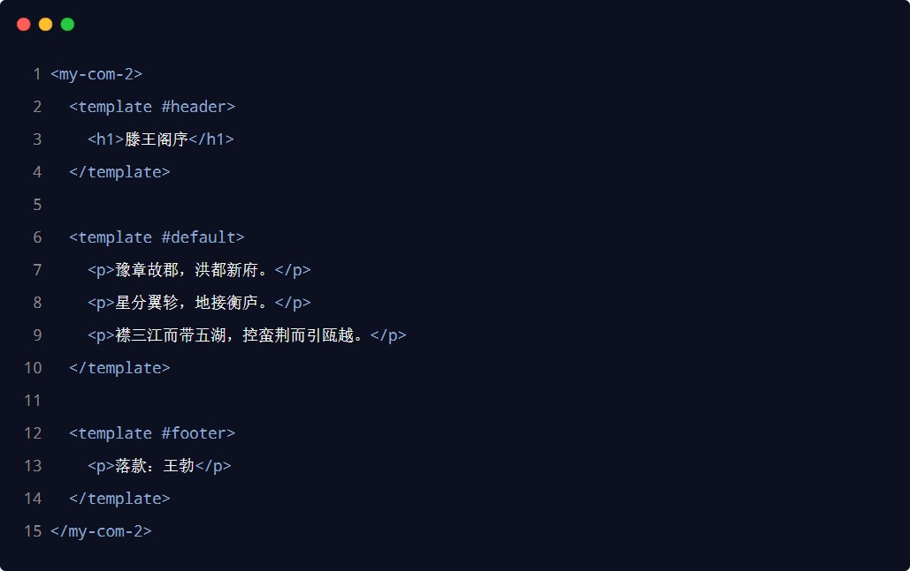
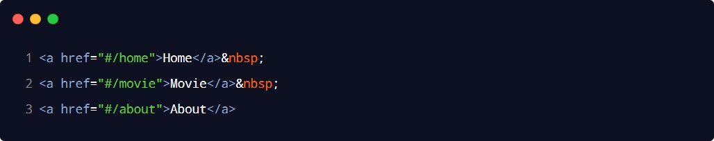
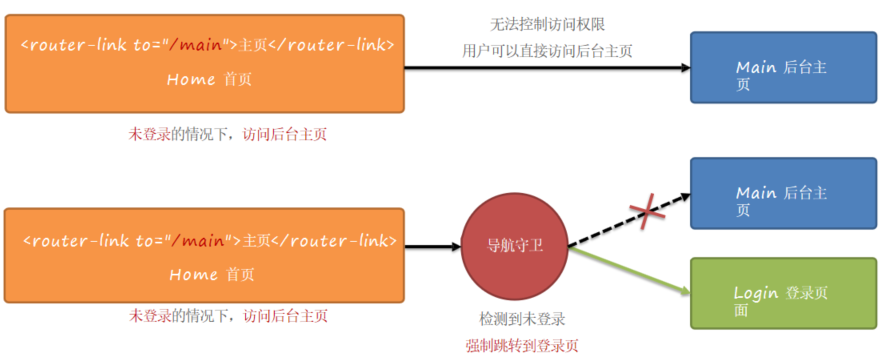

# 前端工程化与 webpack

## 前端工程化

### 1.小白眼中的前端开发 vs 实际的前端开发

小白眼中的前端开发：

- 会写HTML + CSS + JavaScript 就会前端开发
- 需要美化页面样式，就拽一个bootstrap 过来
- 需要操作 DOM 或发起 Ajax 请求，再拽一个 jQuery 过来
- 需要快速实现网页布局效果，就拽一个 Layui 过来 


实际的前端开发：

- 模块化（js 的模块化、css 的模块化、资源的模块化）
- 组件化（复用现有的 UI 结构、样式、行为）
- 规范化（目录结构的划分、编码规范化、接口规范化、文档规范化、 Git 分支管理）
- 自动化（自动化构建、自动部署、自动化测试）

### 2.什么是前端工程化

前端工程化指的是：在企业级的前端项目开发中，把前端开发所需的工具、技术、流程、经验等进行规范化、标准化。

企业中的 Vue 项目和 React 项目，都是基于工程化的方式进行开发的。

好处：前端开发自成体系，有一套标准的开发方案和流程。

### 3.前端工程化的解决方案

早期的前端工程化解决方案：
grunt（ https://www.gruntjs.net/ ）
gulp（ https://www.gulpjs.com.cn/ ）


目前主流的前端工程化解决方案：
webpack（ https://www.webpackjs.com/ ）
parcel（ https://zh.parceljs.org/ ）

## webpack 的基本使用

### 1.什么是 webpack

概念：webpack 是前端项目工程化的具体解决方案。

主要功能：它提供了友好的前端模块化开发支持，以及代码压缩混淆、处理浏览器端 JavaScript 的兼容性、性能优化等强大的功能。


好处：让程序员把工作的重心放到具体功能的实现上，提高了前端开发效率和项目的可维护性。

注意：目前Vue，React 等前端项目，基本上都是基于webpack 进行工程化开发的。

### 2.创建列表隔行变色项目

① 新建项目空白目录，并运行npm init –y 命令(运行这个目录的前提，必须是纯英文目录)，初始化包管理配置文件package.json

② 新建 src 源代码目录

③ 新建 src -> index.html 首页和 src -> index.js 脚本文件

④ 初始化首页基本的结构

⑤ 运行npm install jquery –S （这个参数的意思是把jquery添加到dependencies目录下，不过不加这个指令也会安装到这个目录下，我个人感觉没有必要加)命令，安装 jQuery

⑥ 通过 ES6 模块化的方式导入 jQuery，实现列表隔行变色效果

### 3.在项目中安装 webpack

在终端运行如下的命令，安装webpack 相关的两个包：

`npm install webpack@5.42.1 webpack-cli@4.7.2 -D`(这个D的意思是安装到devDependencies)


至于为什么这样安装，可以看npm的官方


注意：

- -S是 --save的简写
- -D是 --save-dev的简写

### 4.在项目中配置 webpack

①  在项目根目录中，创建名为 webpack.config.js 的 webpack 配置文件，并初始化如下的基本配置：


② 在 package.json 的 scripts 节点下，新增 dev 脚本如下：


上面后面这个webpack是固定的

③ 在终端中运行npm run dev 命令，启动webpack 进行项目的打包构建

#### mode 的可选值

mode 节点的可选值有两个，分别是：

①	development

- 开发环境
- 不会对打包生成的文件进行代码压缩和性能优化
- 打包速度快，适合在开发阶段使用

②	production

- 生产环境
- 会对打包生成的文件进行代码压缩和性能优化
- 打包速度很慢，仅适合在项目发布阶段使用


#### webpack.config.js 文件的作用

webpack.config.js 是 webpack 的配置文件。webpack 在真正开始打包构建之前，会先读取这个配置文件，从而基于给定的配置，对项目进行打包。（也就是说，当我们运行npm run dev 的时候，先会读取webpack.config.js中的配置选项，之后会根据模式运行webpack命令）

注意：由于 webpack 是基于 node.js 开发出来的打包工具，因此在它的配置文件中，支持使用 node.js 相关的语法和模块进行webpack 的个性化配置。

#### webpack 中的默认约定

在 webpack 4.x 和 5.x 的版本中，有如下的默认约定：

① 默认的打包入口文件为 src -> index.js(src下面的index.js文件)

② 默认的输出文件路径为dist -> main.js（dist下面的main.js文件）


注意：可以在webpack.config.js 中修改打包的默认约定

#### 自定义打包的入口与出口

在 webpack.config.js 配置文件中，通过entry 节点指定打包的入口。通过output 节点指定打包的出口。示例代码如下：


## webpack 中的插件

### webpack 插件的作用

通过安装和配置第三方的插件，可以拓展webpack 的能力，从而让webpack 用起来更方便。最常用的webpack 插件有如下两个：

①	webpack-dev-server

- 类似于node.js 阶段用到的 nodemon 工具
- 每当修改了源代码，然后ctrl+s，webpack 会自动进行项目的打包和构建,这样我们就可以实时看到我们修改的效果咯

②	html-webpack-plugin

- webpack 中的HTML 插件（类似于一个模板引擎插件）
- 可以通过此插件自定制 index.html 页面的内容

### webpack-dev-server

webpack-dev-server 可以让webpack 监听项目源代码的变化，从而进行自动打包构建。

#### 安装 webpack-dev-server

运行如下的命令，即可在项目中安装此插件：

`npm install webpack-dev-server@3.11.2 -D`

#### 配置 webpack-dev-server

① 修改package.json -> scripts 中的dev 命令如下：（之前是dev:webpack,现在加了一个serve）


② 再次运行npm run dev 命令，重新进行项目的打包

③  在浏览器中访问http://localhost:8080 地址，查看自动打包效果（这个是项目的根目录）


注意：webpack-dev-server 会启动一个实时打包的http 服务器

#### 打包生成的文件哪儿去了？

① 不配置webpack-dev-server 的情况下，webpack 打包生成的文件，会存放到实际的物理磁盘上

- 严格遵守开发者在webpack.config.js 中指定配置
- 根据output 节点指定路径进行存放

② 配置了 webpack-dev-server 之后，打包生成的文件存放到了内存中

- 不再根据output 节点指定的路径，存放到实际的物理磁盘上
- 提高了实时打包输出的性能，因为内存比物理磁盘速度快很多

#### 生成到内存中的文件该如何访问？

webpack-dev-server 生成到内存中的文件，默认放到了项目的根目录中，而且是虚拟的、不可见的。

- 可以直接用/ 表示项目根目录，后面跟上要访问的文件名称，即可访问内存中的文件
- 例如/bundle.js 就表示要访问webpack-dev-server 生成到内存中的bundle.js 文件

### html-webpack-plugin

html-webpack-plugin 是 webpack 中的HTML 插件，可以通过此插件自定制 index.html 页面的内容。

需求：通过html-webpack-plugin 插件，将 src 目录下的 index.html 首页，复制到项目根目录中一份！

#### 安装 html-webpack-plugin

运行如下的命令，即可在项目中安装此插件：

`npm install html-webpack-plugin@5.3.2 -D`

#### 配置 html-webpack-plugin

下面的配置是在webpack.config.js配置文件中进行配置的


插件是在webpack指令执行期间会加载并调用这些插件

#### 解惑 html-webpack-plugin

① 通过HTML 插件复制到项目根目录中的 index.html 页面，也被放到了内存中

② HTML 插件在生成的 index.html 页面，自动注入了打包的bundle.js （不一定一定是这个文件，这个文件是我们自己配置的名字）文件

### devServer 节点

在 webpack.config.js 配置文件中，可以通过devServer 节点对webpack-dev-server 插件进行更多的配置，示例代码如下：


修改端口号也是在这修改的

注意：凡是修改了 webpack.config.js 配置文件，或修改了 package.json 配置文件，必须重启实时打包的服务器，否则最新的配置文件无法生效！

## webpack 中的 loader

### loader 概述

在实际开发过程中，webpack 默认只能打包处理以.js 后缀名结尾的模块。其他非.js 后缀名结尾的模块，webpack 默认处理不了，需要调用 loader 加载器才可以正常打包，否则会报错！


loader 加载器的作用：协助 webpack 打包处理特定的文件模块。比如：

- css-loader 可以打包处理.css 相关的文件
- less-loader 可以打包处理.less 相关的文件
- babel-loader 可以打包处理webpack 无法处理的高级 JS 语法

###  loader 的调用过程


### 打包处理 css 文件

①  运行npm i style-loader@3.0.0 css-loader@5.2.6 -D 命令，安装处理css 文件的 loader

② 在 webpack.config.js 的module -> rules 数组中，添加 loader 规则如下：


其中，test 表示匹配的文件类型， use 表示对应要调用的 loader

注意：

- use 数组中指定的 loader 顺序是固定的
- 多个 loader 的调用顺序是：从后往前调用


### 打包处理 less 文件

① 运行`npm i less-loader@10.0.1 less@4.1.1 -D`命令

② 在 webpack.config.js 的module -> rules 数组中，添加 loader 规则如下：


### 打包处理样式表中与 url 路径相关的文件

首先学一下base64怎么加载图片的：


打包处理样式表中与 url 路径相关的文件：

①  运行`npm i url-loader@4.1.1 file-loader@6.2.0 -D `命令

② 在 webpack.config.js 的module -> rules 数组中，添加 loader 规则如下：


其中? 之后的是 loader 的参数项：

- limit 用来指定图片的大小，单位是字节（byte）
- 只有≤ limit 大小的图片，才会被转为base64 格式的图片，如果大于这个值，不会转成bese64格式，还是图片的格式


### 打包处理 js 文件中的高级语法

webpack 只能打包处理一部分高级的 JavaScript 语法。对于那些webpack 无法处理的高级 js 语法，需要借助于babel-loader 进行打包处理。例如webpack 无法处理下面的 JavaScript 代码：


#### 安装 babel-loader 相关的包

运行如下的命令安装对应的依赖包：

`npm i babel-loader@8.2.2 @babel/core@7.14.6 @babel/plugin-proposal-decorators@7.14.5 -D`


在 webpack.config.js 的 module -> rules 数组中，添加 loader 规则如下：


至于为什么要指定排除项：因为第三方包中的JS兼容性，不需要我们关心，人家已经处理好了...

#### 配置 babel-loader

> 这里其实是配置插件的插件

在项目根目录下，创建名为 babel.config.js 的配置文件，定义 Babel 的配置项如下：


详情请参考Babel 的官网https://babeljs.io/docs/en/babel-plugin-proposal-decorators

## 打包发布

### 为什么要打包发布

项目开发完成之后，需要使用webpack 对项目进行打包发布，主要原因有以下两点：

①  开发环境下，打包生成的文件存放于内存中，无法获取到最终打包生成的文件

② 开发环境下，打包生成的文件不会进行代码压缩和性能优化


为了让项目能够在生产环境中高性能的运行，因此需要对项目进行打包发布。

### 配置 webpack 的打包发布

在 package.json 文件的 scripts 节点下，新增build 命令如下：


--model 是一个参数项，用来指定webpack 的运行模式。production 代表生产环境，会对打包生成的文件进行代码压缩和性能优化（记不记得之前我们在webpack.config.js中配置模式为development，这里的--model就是覆盖那里的配置文件，改成了生产环境）

注意：通过 --model 指定的参数项，会覆盖webpack.config.js 中的model 选项。

### 把 JavaScript 文件统一生成到 js 目录中

在 webpack.config.js 配置文件的output 节点中，进行如下的配置：


### 把图片文件统一生成到 image 目录中

修改webpack.config.js 中的 url-loader 配置项，新增outputPath 选项即可指定图片文件的输出路径：


### 自动清理 dist 目录下的旧文件

为了在每次打包发布时自动清理掉dist 目录中的旧文件，可以安装并配置clean-webpack-plugin 插件：


## Source Map

### 生产环境遇到的问题

前端项目在投入生产环境之前，都需要对 JavaScript 源代码进行压缩混淆，从而减小文件的体积，提高文件的加载效率。此时就不可避免的产生了另一个问题：

对压缩混淆之后的代码除错（debug）是一件极其困难的事情，下面是压缩过的代码：


有如下的问题：

- 变量被替换成没有任何语义的名称
- 空行和注释被剔除

### 什么是 Source Map

Source Map 就是一个信息文件，里面储存着位置信息。也就是说，Source Map 文件中存储着压缩混淆后的代码，所对应的转换前的位置。

有了它，出错的时候，除错工具将直接显示原始代码，而不是转换后的代码，能够极大的方便后期的调试。

### webpack 开发环境下的 Source Map

在开发环境下，webpack 默认启用了 Source Map 功能。当程序运行出错时，可以直接在控制台提示错误行的位置，并定位到具体的源代码：


### 解决默认 Source Map 的问题

开发环境下，推荐在webpack.config.js 中添加如下的配置，即可保证运行时报错的行数与源代码的行数保持一致：


### webpack 生产环境下的 Source Map

在生产环境下，如果省略了devtool 选项，则最终生成的文件中不包含 Source Map。这能够防止原始代码通过 Source Map 的形式暴露给别有所图之人。


### 只定位行数不暴露源码

在生产环境下，如果只想定位报错的具体行数，且不想暴露源码。此时可以将 devtool 的值设置为
nosources-source-map。实际效果如图所示：


### 定位行数且暴露源码

在生产环境下，如果想在定位报错行数的同时，展示具体报错的源码。此时可以将devtool 的值设置为
source-map。实际效果如图所示：




采用此选项后：你应该将你的服务器配置为，不允许普通用户访问 source map 文件！

### Source Map 的最佳实践

① 开发环境下：

- 建议把devtool 的值设置为eval-source-map
- 好处：可以精准定位到具体的错误行

② 生产环境下：

- 建议关闭 Source Map 或将devtool 的值设置为nosources-source-map
- 好处：防止源码泄露，提高网站的安全性

### 实际开发中需要自己配置 webpack 吗？

答案：不需要！

- 实际开发中会使命令行工具（俗称 CLI）一键生成带有 webpack 的项目

- 开箱即用，所有 webpack 配置项都是现成的！

- 我们只需要知道 webpack 中的基本概念即可！

# @符号的作用


配置@指向的位置，但是在学了vue后他会默认给我们配置了


# Vue2

## vue2 基础入门

### Vue的特性

vue 框架的特性，主要体现在如下两方面：

①	数据驱动视图

②	双向数据绑定

#### 数据驱动视图

在使用了vue 的页面中，vue 会监听数据的变化，从而自动重新渲染页面的结构。示意图如下：


好处：当页面数据发生变化时，页面会自动重新渲染！

注意：数据驱动视图是单向的数据绑定。

#### 双向数据绑定

在填写表单时，双向数据绑定可以辅助开发者在不操作 DOM 的前提下，自动把用户填写的内容同步到数据源中。示意图如下：


好处：开发者不再需要手动操作 DOM 元素，来获取表单元素最新的值！

#### MVVM

MVVM 是 vue 实现数据驱动视图和双向数据绑定的核心原理。MVVM 指的是Model、View 和 ViewModel，它把每个HTML 页面都拆分成了这三个部分，如图所示：


在 MVVM 概念中：

Model 表示当前页面渲染时所依赖的数据源（也就是数据对象）。

View	表示当前页面所渲染的 DOM 结构（页面）。

ViewModel 表示 vue 的实例，它是MVVM 的核心。

#### MVVM 的工作原理

ViewModel 作为 MVVM 的核心，是它把当前页面的数据源（Model）和页面的结构（View）连接在了一起。


当数据源发生变化时，会被 ViewModel 监听到，VM 会根据最新的数据源自动更新页面的结构

当表单元素的值发生变化时，也会被VM 监听到，VM 会把变化过后最新的值自动同步到Model 数据源中

### vue 的基本使用

#### 基本使用步骤

①	导入 vue.js 的 script 脚本文件

②	在页面中声明一个将要被vue 所控制的 DOM 区域

③	创建 vm 实例对象（vue 实例对象）

#### 基本代码与 MVVM 的对应关系


注意el的value是一个选择器，这里使用了id选择器选择id为app的节点

配置对象，axios的那个语法其实也是配置对象，这个对于任何的这样形式都是适用的：


#### 第一个vue程序

快捷：html 5导入模板

```html
<!DOCTYPE html>
<html lang="en">
<head>
    <meta charset="UTF-8">
    <meta http-equiv="X-UA-Compatible" content="IE=edge">
    <meta name="viewport" content="width=device-width, initial-scale=1.0">
    <title>Vue基础</title>
</head>
<body>
    <div id="app">
        {{ message }}
    </div>
    <script src="https://cdn.jsdelivr.net/npm/vue/dist/vue.js"></script>
    <script>
        var app =new Vue({
            el:"#app",
            data:{
                message:"hello Vue!"
            }
        })
    </script>
</body>
</html>
```

#### **创建代码片段**

文件 => 首选项 => 用户代码片段 => 新建全局代码片段/或文件夹代码片段：

名称为：vue-html.code-snippets

```js
{
	"vue htm": {
		"scope": "html",
		"prefix": "!v",
		"body": [
			"<!DOCTYPE html>",
			"<html lang=\"en\">",
			"",
			"<head>",
			" <meta charset=\"UTF-8\">",
			" <meta name=\"viewport\" content=\"width=device-width, initial-scale=1.0\">",
			" <meta http-equiv=\"X-UA-Compatible\" content=\"ie=edge\">",
			" <title>Document</title>",
			"</head>",
			"",
			"<body>",
			" <div id=\"app\">",
			"",
			" </div>",
			" <script src=\"https://cdn.jsdelivr.net/npm/vue/dist/vue.js\"></script>",
			" <script>",
			" new Vue({",
			" el: '#app',",
			" data: {",
			" $1",
			" }",
			" })",
			" </script>",
			"</body>",
			"",
			"</html>",
		],
		"description": "my vue template in html"
	}
}
```

我设置的快捷键是:  `!v ` 如果有需要可以自己改

#### el挂载点

el是用来设置Vue实例挂载（管理）的元素

**1.vue的作用范围是什么**

在el命中的元素内部可以被渲染

Vue会管理el选项 **命中的元素**及其**内部的后代元素**


**2.这里使用了id选择器，那么是否可以选用其他的选择器**

可以，但是建议使用id选择器

**3.是否可以设置其他的dom元素**

可以使用其他的双标签，但是不能使用HTML和BODY标签


#### data 数据对象

1.Vue中用到的数据定义在data中

2.data中可以写复杂类型的数据

3.渲染复杂类型数据时，遵循js的语法即可。语法，数组的索引语法

```html
<!DOCTYPE html>
<html lang="en">
<head>
    <meta charset="UTF-8">
    <meta http-equiv="X-UA-Compatible" content="IE=edge">
    <meta name="viewport" content="width=<device-width>, initial-scale=1.0">
    <title>Document</title>
</head>
<body>
    <div id="app">
        {{ message }}
        <h2>{{school.name}} {{school.mobile}}</h2>
        <ul>
         <li>{{campus[[0]]}}</li>
         <li>{{campus[[1]]}}</li>
        </ul>
    </div>

    <script src="https://cdn.jsdelivr.net/npm/vue/dist/vue.js"></script>
    <script>
     var app =new Vue({
         el:"#app",
         data:{
             message:"hello,vue",
             school:{
                 name:"小黑",
                 mobile:"130302030302020"
             },
             campus:["北京","上海"]
         }
     })
    </script>
</body>
</html>

```


### 回顾Object.defineproperty方法

当我们通过控制台访问data里面的属性，在主界面不会立即显示，需要我们手动点击，当我们手动点击这个，就会自动触发getter方法



```html
<!DOCTYPE html>
<html>
	<head>
		<meta charset="UTF-8" />
		<title>回顾Object.defineproperty方法</title>
	</head>
	<body>
		<script type="text/javascript" >
			let number = 18
			let person = {
				name:'张三',
				sex:'男',
			}

			Object.defineProperty(person,'age',{
				// value:18,
				// enumerable:true, //控制属性是否可以枚举，默认值是false
				// writable:true, //控制属性是否可以被修改，默认值是false
				// configurable:true //控制属性是否可以被删除，默认值是false

				//当有人读取person的age属性时，get函数(getter)就会被调用，且返回值就是age的值
				get(){
					console.log('有人读取age属性了')
					return number
				},

				//当有人修改person的age属性时，set函数(setter)就会被调用，且会收到修改的具体值
				set(value){
					console.log('有人修改了age属性，且值是',value)
					number = value
				}

			})

			// console.log(Object.keys(person))

			console.log(person)
		</script>
	</body>
</html>
```

vue里面的数据代理！！！这也是为什么vue把data里面的数据直接提到外面一层，是为了更方便访问属性


​    1.Vue中的数据代理：

​       通过vm对象来代理data对象中属性的操作（读/写）

​    2.Vue中数据代理的好处：

​       更加方便的操作data中的数据

​    3.基本原理：

​       通过Object.defineProperty()把data对象中所有属性添加到vm上。

​       为每一个添加到vm上的属性，都指定一个getter/setter。

​       在getter/setter内部去操作（读/写）data中对应的属性。


### vue 的指令

#### js表达式

怎么区分`js表达式`和`js语句(js代码)`的区别

表达式一定会生成一个值！！！无论是函数的调用还是四则运算，都会生成值


#### 指令的概念

指令（Directives）是 vue 为开发者提供的模板语法，用于辅助开发者渲染页面的基本结构。

vue 中的指令按照不同的用途可以分为如下 6 大类：

①	内容渲染指令

②	属性绑定指令

③	事件绑定指令

④	双向绑定指令

⑤	条件渲染指令

⑥	列表渲染指令


注意：指令是vue 开发中最基础、最常用、最简单的知识点。

#### 内容渲染指令

内容渲染指令用来辅助开发者渲染 DOM 元素的文本内容。常用的内容渲染指令有如下 3 个：

```
1.v-text

2.{{ }}

3.v-html
```

##### v-text

1.v-text指令的作用：设置标签的内容（textContent）

2.默认写法会替换全部内容，使用差值表达式`{{}}`可以替换指定内容,(也就是说，不管你标签里面写了啥，都会覆盖标签中原有的内容)所以说这种写法基本上都不使用。

3.内部支持写表达式（如字符串拼接）


##### 插值表达式

在这里面可以写我们创建的Vue对象身上的任何属性，不需要加Vue,也就是说你可以在插值表达式里面通过属性名字访问所有属性，不用加任何前缀


```
vue 提供的 `{{ }} `语法，专门用来解决v-text 会覆盖默认文本内容的问题。这种 {{ }} 语法的专业名称是插值表达式（英文名为：Mustache）。
```


注意：相对于v-text 指令来说，插值表达式在开发中更常用一些！因为它不会覆盖元素中默认的文本内容。

##### v-html指令


​      1.与插值语法的区别：

​         (1).v-html会替换掉节点中所有的内容，{{xx}}则不会。

​         (2).v-html可以识别html结构。

​      2.严重注意：v-html有安全性问题！！！！

​         (1).在网站上动态渲染任意HTML是非常危险的，容易导致XSS攻击。

​         (2).一定要在可信的内容上使用v-html，永不要用在用户提交的内容上！


1. v-html指令的作用是:设置元素的innerHTML

2. 内容中有html结构会被解析为标签

3. v-text指令无论内容是什么,只会解析为文本

4. 解析文本使用v-text

5. 需要解析html结构使用v-html


#### 属性绑定指令

如果需要为元素的属性动态绑定属性值（注意是属性，之前的插值表达式是写到**标签体**里面的，而这个是写到标签的属性上的），则需要用到v-bind 属性绑定指令。用法示例如下：

##### v-bind指令

加了v-bind指令，引号中的就是一个js表达式了！！！！至于js表达式是什么，在上面提到过！这个必须要注意，用到的有很多


可以直接省略v-bind


1.v-bind：属性名=表达式

2.v-bind指令的作用是:为元素绑定属性

3.完整写法是v-bind:属性名

4.简写的话可以直接省略v-bind,只保留:属性名

5.需要动态的增删class建议使用对象的方式


```html
<!DOCTYPE html>
<html lang="en">
    <head>
        <meta charset="UTF-8">
        <meta http-equiv="X-UA-Compatible" content="IE=edge">
        <meta name="viewport" content="width=device-width, initial-scale=1.0">
        <title>Document</title>
        <style>
            .active{
                border: 2px solid red;
            }
        </style>
    </head>
    <body>
        <div id="app">
            
            <!-- <br>         ？   ：  如果 是   就怎么 -->
            
            
            <!-- 点击变色                         active取值依赖于isactive是否取值 -->
        </div>
        <!-- 开发环境版本，包含了有帮助的命令行警告 -->
        <script src="https://cdn.jsdelivr.net/npm/vue/dist/vue.js"></script>
        <script>
            var app=new Vue({
                el:"#app",
                data:{
                    imgSrc:"https://img0.baidu.com/it/u=2753883117,2936626650&fm=26&fmt=auto",
                    imgTitle:"壁纸",
                    isActive:false
                },
                methods:{
                    toggleActive:function(){
                        this.isActive=!this.isActive;
                    }
                }
            })
        </script>
    </body>
</html>

```


在使用v-bind属性绑定期间，如果绑定内容需要进行动态的字符串拼接，则字符串的外面应该包括单引号，后面可以拼接一个变量，这个变量要去data里面去找


#### 事件绑定指令

vue 提供了v-on 事件绑定指令，用来辅助程序员为 DOM 元素绑定事件监听。语法格式如下：

注意：原生 DOM 对象有onclick、oninput、onkeyup 等原生事件，替换为vue 的事件绑定形式后，分别为：v-on:click、v-on:input、v-on:keyup

##### v-on指令

示例代码：


举例子

 

1. v-on指令的作用是:为元素绑定事件(点击，移入....)

2. 事件名不需要写on

3. 指令可以简写为@

4. 绑定的方法定义在methods属性中

5. 方法内部通过this关键字可以访问定义在data中数据


##### 事件参数对象

在原生的 DOM 事件绑定中，可以在事件处理函数的形参处，接收事件参数对象 event。（但是，仅限于没有传参的函数，如果传参了，这个e就不会传进来了）同理，在v-on 指令（简写为@ ）所绑定的事件处理函数中，同样可以接收到事件参数对象event，（这个e对象就是触发事件对象，比如点击事件对象，e.target就是事件源，也就是那个触发事件的dom元素，这里是button按钮）示例代码如下：


##### 绑定事件并传参

在使用v-on 指令绑定事件时，可以使用 ( ) 进行传参，示例代码如下：


##### $event

$event 是 vue 提供的特殊变量，用来表示原生的事件参数对象event。$event 可以解决事件参数对象event被覆盖的问题。示例用法如下：


##### 事件修饰符

在原生的JavaScript中，事件处理函数中调用event.preventDefault() 或 event.stopPropagation() 是非常常见的需求。因此，
vue 提供了事件修饰符的概念，来辅助程序员更方便的对事件的触发进行控制。常用的 5 个事件修饰符如下：

| 事件修饰符 | 说明                                                      |
| ---------- | --------------------------------------------------------- |
| .prevent   | 阻止默认行为（例如：阻止 a 连接的跳转、阻止表单的提交等） |
| .stop      | 阻止事件冒泡                                              |
| .capture   | 以捕获模式触发当前的事件处理函数                          |
| .once      | 绑定的事件只触发1次                                       |
| .self      | 只有在 event.target 是当前元素自身时触发事件处理函数      |

修饰符 (Modifiers) 是以半角句号（.）指明的特殊后缀，用于指出一个指令应该以特殊方式绑定。

> 例如  :   
>
>   .prevent 修饰符告诉 v-on 指令对于触发的事件调用 event.preventDefault(),即阻止事件原本的默认行为

语法格式如下：


阻止默认行为然后触发onLinkClick函数，这个函数是我们自己定义的。。。

```html
<!DOCTYPE html>
<html lang="en">

    <head>
        <meta charset="UTF-8">
        <meta name="viewport" content="width=device-width, initial-scale=1.0">
        <meta http-equiv="X-UA-Compatible" content="ie=edge">
        <title>Document</title>
    </head>

    <body>
        <div id="app">
			<!--阻止表单的默认提交行为，然后触发onSubmit函数-->
            <form action="localhost:8080/save" v-on:submit.prevent="onSubmit">
                <input type="text" id="name" v-model="user.username" />
            	<button type="submit">保存</button>
            </form>
        </div>
    <script src="https://cdn.jsdelivr.net/npm/vue/dist/vue.js"></script>
    <script>
        new Vue({
            el: '#app',
            data: {
                user:{
                    username:"请输入你的密码"
                }
            },
            methods:{
                onSubmit(){
                    if(this.user.username){
                        console.log('提交表单')
                    }else{
                        alert("请输入用户名")
                    }
                }
            }
        })
    </script>
    </body>

</html>
```

按下按钮后，阻止表单提交到指定地址，并且，触发onSubmit()方法

##### 按键修饰符

（tab键必须配合keydown使用，因为按下tab键会失去焦点）

在监听键盘事件时，我们经常需要判断详细的按键。此时，可以为键盘相关的事件添加按键修饰符，例如：


submit 和clearInput这两个函数都是我们两个自己定义的

**模板**


```html
<!DOCTYPE html>
<html lang="en">
    <head>
        <meta charset="UTF-8">
        <meta http-equiv="X-UA-Compatible" content="IE=edge">
        <meta name="viewport" content="width=device-width, initial-scale=1.0">
        <title>Document</title>
    </head>
    <body>

        <!-- 2.html结构 -->
        <div id="app">
            <input type="button" value="点击" @click="doIt(666,'老铁')">
            <input type="text" @keyup.enter="sayHi">

        </div>
        <!-- 1.开发环境版本，包含了有帮助的命令行警告 -->
        <script src="https://cdn.jsdelivr.net/npm/vue/dist/vue.js"></script>
        <!-- 3.创建Vue实例 -->
        <script>
            var app=new Vue({
                el:"#app",
                methods:{
                    doIt:function(p1,p2){
                        console.log("做it");
                        console.log(p1,p2);
                        alert("吃了没");
                        alert(p1,p2);
                    },
                    sayHi:function(){
                        alert("吃了没");
                    }
                }
            })
        </script>

    </body>
</html>

```


#### 双向绑定指令

vue 提供了v-model 双向数据绑定指令，用来辅助开发者在不操作 DOM 的前提下，快速获取表单的数据。

> 只有表单元素才能使用v-model指令，其他标签用它没意义
>
> 比如：
>
> - input
> - select
> - textarea


##### v-model

<font color="red">v-model一般都应用在表单类元素上（input、select这种有value属性的标签上）</font>


简单来说双向绑定就是指修改文本框中的message，也会改变data中的message。

1. v-model：获取和设置表单元素的值(双向数据绑定)


2. v-model指令的作用是：便捷的设置、获取表单元素的值

3. 绑定的数据会和表单元素值相关联

```html
<!-- 2.html结构 -->
<div id="app">
    <input type="text" v-model="message" @keyup.enter="getMessage" />
    <input type="button" v-model="message" @click="setMessage" />
    <h3>{{message}}</h3>
</div>
<script src="https://cdn.jsdelivr.net/npm/vue/dist/vue.js"></script>
<!-- 3.创建Vue实例 -->
<script>
    var app=new Vue({
        el:"#app",
        data:{
            message:"沙丁鱼"
        },
        methods:{
            getMessage:function(){
                alert(this.message)
            },
            setMessage:function(){
                this.message="酷丁鱼";
            }
        }
    })
</script>
```


##### v-model 指令的修饰符

为了方便对用户输入的内容进行处理，vue 为 v-model 指令提供了 3 个修饰符，分别是：

| 修饰符  | 作用                           | 示例                           |
| ------- | ------------------------------ | ------------------------------ |
| .number | 自动将用户的输入值转为数值类型 | <input v-model.number="age" /> |
| .trim   | 自动过滤用户输入的首尾空白字符 | <input v-model.trim="msg" />   |
| .lazy   | 在“change”时而非“input”时更新  | <input v-model.lazy="msg" />   |


##### 利用v-model手机表单数据

```html
<!DOCTYPE html>
<html>
	<head>
		<meta charset="UTF-8" />
		<title>收集表单数据</title>
		<script type="text/javascript" src="../js/vue.js"></script>
	</head>
	<body>
		<!-- 
			收集表单数据：
					若：<input type="text"/>，则v-model收集的是value值，用户输入的就是value值。
					若：<input type="radio"/>，则v-model收集的是value值，且要给标签配置value值。
					若：<input type="checkbox"/>
							1.没有配置input的value属性，那么收集的就是checked（勾选 or 未勾选，是布尔值）
							2.配置input的value属性:
									(1)v-model的初始值是非数组，那么收集的就是checked（勾选 or 未勾选，是布尔值）
									(2)v-model的初始值是数组，那么收集的的就是value组成的数组
					备注：v-model的三个修饰符：
									lazy：失去焦点再收集数据
									number：输入字符串转为有效的数字
									trim：输入首尾空格过滤
		-->
		<!-- 准备好一个容器-->
		<div id="root">
			<form @submit.prevent="demo">
				账号：<input type="text" v-model.trim="userInfo.account"> <br/><br/>
				密码：<input type="password" v-model="userInfo.password"> <br/><br/>
				年龄：<input type="number" v-model.number="userInfo.age"> <br/><br/>
				性别：
				男<input type="radio" name="sex" v-model="userInfo.sex" value="male">
				女<input type="radio" name="sex" v-model="userInfo.sex" value="female"> <br/><br/>
				爱好：
				学习<input type="checkbox" v-model="userInfo.hobby" value="study">
				打游戏<input type="checkbox" v-model="userInfo.hobby" value="game">
				吃饭<input type="checkbox" v-model="userInfo.hobby" value="eat">
				<br/><br/>
				所属校区
				<select v-model="userInfo.city">
					<option value="">请选择校区</option>
					<option value="beijing">北京</option>
					<option value="shanghai">上海</option>
					<option value="shenzhen">深圳</option>
					<option value="wuhan">武汉</option>
				</select>
				<br/><br/>
				其他信息：
				<textarea v-model.lazy="userInfo.other"></textarea> <br/><br/>
				<input type="checkbox" v-model="userInfo.agree">阅读并接受<a href="http://www.atguigu.com">《用户协议》</a>
				<button>提交</button>
			</form>
		</div>
	</body>

	<script type="text/javascript">
		Vue.config.productionTip = false

		new Vue({
			el:'#root',
			data:{
				userInfo:{
					account:'',
					password:'',
					age:18,
					sex:'female',
					hobby:[],
					city:'beijing',
					other:'',
					agree:''
				}
			},
			methods: {
				demo(){
					console.log(JSON.stringify(this.userInfo))
				}
			}
		})
	</script>
</html>
```


#### 条件渲染指令

条件渲染指令用来辅助开发者按需控制 DOM 的显示与隐藏。条件渲染指令有如下两个，分别是：

- v-if
- v-show

示例用法如下：

下面的networkState也是我们自己定义的一个变量


##### v-show指令

1. show指令的作用

根据**真假**进行切换元素的显示

**状态原理**是修改元素的**display**,实现显示隐藏

2. 指令后面的内容,最终都会解析为布尔值 

3. true元素显示，值为false元素隐藏

4. 改变之后，对应元素的显示状态会同步更新

```html
<!DOCTYPE html>
<html lang="en">
<head>
    <meta charset="UTF-8">
    <meta http-equiv="X-UA-Compatible" content="IE=edge">
    <meta name="viewport" content="width=device-width, initial-scale=1.0">
    <title>Document</title>
</head>
<body>
    <div id="app">
        <input type="button" value="切换显示状态" @click="changeIsShow">
        <input type="button" value="累加年龄" @click="addAge">
        
        =18" src="./1.jpg">
    </div>
    <script src="https://cdn.jsdelivr.net/npm/vue/dist/vue.js"></script>
    <script>
        var app =new Vue({
            el: "#app",
            data:{
                isShow:false,
                age:17
            },
            methods:{
                changeIsShow:function(){
                    this.isShow=!this.isShow;
                },
                addAge:function(){
                    this.age++;
            }
          }
        })
    </script>

</body>
</html>

```

##### v-if指令

1. v-if指令的作用是:**根据表达式的真假切换元素的显示状态**
2. 本质是通过操纵dom元素来切换显示状态
3. 表达式的值为true,把dom元素添加到dom树中。如果值为false,则从dom树中移除
4. 频繁的切换使用v-show。反之使用v-if，v-show如果多次进行切换消耗的资源小

v-if和v-show的区别：v-show直接修改display ，而v-if是直接抹除dom标签


```html
<!DOCTYPE html>
<html lang="en">
<head>
    <meta charset="UTF-8">
    <meta http-equiv="X-UA-Compatible" content="IE=edge">
    <meta name="viewport" content="width=device-width, initial-scale=1.0">
    <title>Document</title>
</head>
<body>
    <div id="app">
        <input type="button" value="切换显示" @click="change">
        <p v-if="true">我是一个p标签</p>
        <p v-if="isShow">我是一个p标签</p>
       

    </div>
    <script src="https://cdn.jsdelivr.net/npm/vue/dist/vue.js"></script>
    <script>
        var app=new Vue({
            el:"#app",
            data:{
                isShow:false
            },
            methods:{  
                change:function(){
                    this.isShow=!this.isShow;
                }
            }
        })
    </script>
</body>
</html>

```


在实际开发中，绝大多数情况，不用考虑性能，直接使用v-if就行了


v-if和template的配合使用


渲染到页面上只有三个h2标签（不过只能配合v-if使用）


###### v-else

v-if 可以单独使用，或配合v-else 指令一起使用：


注意：v-else 指令必须配合v-if 指令一起使用，否则它将不会被识别！

###### v-else-if

v-else-if 指令，顾名思义，充当v-if 的“else-if 块”，可以连续使用：


注意：v-else-if 指令必须配合v-if 指令一起使用，否则它将不会被识别！

这玩意一般都不用。。。

#### 列表渲染指令

vue 提供了v-for 列表渲染指令，用来辅助开发者基于一个数组来循环渲染一个列表结构。v-for 指令需要使用 item in items 形式的特殊语法，其中：

- items 是待循环的数组
- item 是被循环的每一项


##### v-for


```html
<!DOCTYPE html>
<html lang="en">

<head>
    <meta charset="UTF-8">
    <meta name="viewport" content="width=device-width, initial-scale=1.0">
    <meta http-equiv="X-UA-Compatible" content="ie=edge">
    <title>Document</title>
</head>

<body>
    <div id="app">

        <ul>
            <li v-for="n in 10">{{n}}</li>
        </ul>
        <ol>
            <li v-for="(n,index) in 10">{{n}}----{{index}}</li>
        </ol>
    </div>
    <script src="https://cdn.jsdelivr.net/npm/vue/dist/vue.js"></script>
    <script>
        new Vue({
            el: '#app',
            data: {

            }
        })
    </script>
</body>

</html>
```

遍历表格（其中的user可以随便起名字。改成haohao都行）


1. v-for指令的作用是:根据数据生成列表结构

2. 数组经常和v-for结合使用

3. 语法是( item,index ) in数据

4. item和index可以结合其他指令- -起使用

5. 数组长度的更新会同步到页面上，是响应式的

###### 利用v-for遍历各种东西

```html
<!DOCTYPE html>
<html>
	<head>
		<meta charset="UTF-8" />
		<title>基本列表</title>
		<script type="text/javascript" src="../js/vue.js"></script>
	</head>
	<body>
		<!-- 
				v-for指令:
						1.用于展示列表数据
						2.语法：v-for="(item, index) in xxx" :key="yyy"
						3.可遍历：数组、对象、字符串（用的很少）、指定次数（用的很少）
		-->
		<!-- 准备好一个容器-->
		<div id="root">
			<!-- 遍历数组 -->
			<h2>人员列表（遍历数组）</h2>
			<ul>
				<li v-for="(p,index) of persons" :key="index">
					{{p.name}}-{{p.age}}
				</li>
			</ul>

			<!-- 遍历对象 -->
			<h2>汽车信息（遍历对象）</h2>
			<ul>
				<li v-for="(value,k) of car" :key="k">
					{{k}}-{{value}}
				</li>
			</ul>

			<!-- 遍历字符串 -->
			<h2>测试遍历字符串（用得少）</h2>
			<ul>
				<li v-for="(char,index) of str" :key="index">
					{{char}}-{{index}}
				</li>
			</ul>
			
			<!-- 遍历指定次数 -->
			<h2>测试遍历指定次数（用得少）</h2>
			<ul>
				<li v-for="(number,index) of 5" :key="index">
					{{index}}-{{number}}
				</li>
			</ul>
		</div>

		<script type="text/javascript">
			Vue.config.productionTip = false
			
			new Vue({
				el:'#root',
				data:{
					persons:[
						{id:'001',name:'张三',age:18},
						{id:'002',name:'李四',age:19},
						{id:'003',name:'王五',age:20}
					],
					car:{
						name:'奥迪A8',
						price:'70万',
						color:'黑色'
					},
					str:'hello'
				}
			})
		</script>
</html>
```


###### v-for 中的索引

v-for 指令还支持一个可选的第二个参数，即当前项的索引。语法格式为(item, index) in items，示例代码如下：


注意：v-for 指令中的 item 项和 index 索引都是形参，可以根据需要进行重命名。例如(user, i) in userlist

###### 使用 key 维护列表的状态

当列表的数据变化时，默认情况下，vue 会尽可能的复用已存在的 DOM 元素，从而提升渲染的性能。但这种默认的性能优化策略，会导致有状态的列表无法被正确更新。

为了给vue一个提示，以便它能跟踪每个节点的身份，从而在保证有状态的列表被正确更新的前提下，提升渲染的性能。此时，需要为每项提供一个唯一的key 属性。

官方建议：只要用到了v-for指令，那么一定要绑定一个`:key`属性


key 的注意事项

①	key 的值只能是字符串或数字类型
②	key 的值必须具有唯一性（即：key 的值不能重复）
③	建议把数据项 id（我们data里面的数据中的key） 属性的值作为key 的值（因为 id 属性的值具有唯一性）
④	使用 index 的值当作 key 的值没有任何意义（因为 index 的值不具有唯一性）
⑤	建议使用v-for 指令时一定要指定key 的值（既提升性能、又防止列表状态紊乱）

###### key的原理

```html
<!DOCTYPE html>
<html>
	<head>
		<meta charset="UTF-8" />
		<title>key的原理</title>
		<script type="text/javascript" src="../js/vue.js"></script>
	</head>
	<body>
		<!-- 
				面试题：react、vue中的key有什么作用？（key的内部原理）
						
						1. 虚拟DOM中key的作用：
										key是虚拟DOM对象的标识，当数据发生变化时，Vue会根据【新数据】生成【新的虚拟DOM】, 
										随后Vue进行【新虚拟DOM】与【旧虚拟DOM】的差异比较，比较规则如下：
										
						2.对比规则：
									(1).旧虚拟DOM中找到了与新虚拟DOM相同的key：
												①.若虚拟DOM中内容没变, 直接使用之前的真实DOM！
												②.若虚拟DOM中内容变了, 则生成新的真实DOM，随后替换掉页面中之前的真实DOM。

									(2).旧虚拟DOM中未找到与新虚拟DOM相同的key
												创建新的真实DOM，随后渲染到到页面。
												
						3. 用index作为key可能会引发的问题：
											1. 若对数据进行：逆序添加、逆序删除等破坏顺序操作:
															会产生没有必要的真实DOM更新 ==> 界面效果没问题, 但效率低。

											2. 如果结构中还包含输入类的DOM：
															会产生错误DOM更新 ==> 界面有问题。

						4. 开发中如何选择key?:
											1.最好使用每条数据的唯一标识作为key, 比如id、手机号、身份证号、学号等唯一值。
											2.如果不存在对数据的逆序添加、逆序删除等破坏顺序操作，仅用于渲染列表用于展示，
												使用index作为key是没有问题的。
		-->
		<!-- 准备好一个容器-->
		<div id="root">
			<!-- 遍历数组 -->
			<h2>人员列表（遍历数组）</h2>
			<button @click.once="add">添加一个老刘</button>
			<ul>
				<li v-for="(p,index) of persons" :key="index">
					{{p.name}}-{{p.age}}
					<input type="text">
				</li>
			</ul>
		</div>

		<script type="text/javascript">
			Vue.config.productionTip = false
			
			new Vue({
				el:'#root',
				data:{
					persons:[
						{id:'001',name:'张三',age:18},
						{id:'002',name:'李四',age:19},
						{id:'003',name:'王五',age:20}
					]
				},
				methods: {
					add(){
						const p = {id:'004',name:'老刘',age:40}
						this.persons.unshift(p)
					}
				},
			})
		</script>
</html>
```

#### 其他指令

##### v-cloak

这个指令是防止js文件没有加载完，然后浏览器页面出现一些用户不想看到的页面

```html
<!DOCTYPE html>
<html>
	<head>
		<meta charset="UTF-8" />
		<title>v-cloak指令</title>
		<style>
            /*
            	让有v-cloak指令的标签全不显示
            	等js全部加载完，vue对象创建后就会自动删除标签里面的v-cloak指令
            */
			[v-cloak]{
				display:none;
			}
		</style>
		<!-- 引入Vue -->
	</head>
	<body>
		<!-- 
				v-cloak指令（没有值）：
						1.本质是一个特殊属性，Vue实例创建完毕并接管容器后，会删掉v-cloak属性。
						2.使用css配合v-cloak可以解决网速慢时页面展示出{{xxx}}的问题。
		-->
		<!-- 准备好一个容器-->
		<div id="root">
			<h2 v-cloak>{{name}}</h2>
		</div>
		<script type="text/javascript" src="http://localhost:8080/resource/5s/vue.js"></script>
	</body>
	
	<script type="text/javascript">
		console.log(1)
		Vue.config.productionTip = false //阻止 vue 在启动时生成生产提示。
		
		new Vue({
			el:'#root',
			data:{
				name:'尚硅谷'
			}
		})
	</script>
</html>
```

##### v-once

当我们有需求，只渲染初始时候的数据，后面数据不管怎么变，前端页面都不会变的需求可以用这个指令

```html
<!DOCTYPE html>
<html>
	<head>
		<meta charset="UTF-8" />
		<title>v-once指令</title>
		<!-- 引入Vue -->
		<script type="text/javascript" src="../js/vue.js"></script>
	</head>
	<body>
		<!-- 
			v-once指令：
						1.v-once所在节点在初次动态渲染后，就视为静态内容了。
						2.以后数据的改变不会引起v-once所在结构的更新，可以用于优化性能。
		-->
		<!-- 准备好一个容器-->
		<div id="root">
			<h2 v-once>初始化的n值是:{{n}}</h2>
			<h2>当前的n值是:{{n}}</h2>
			<button @click="n++">点我n+1</button>
		</div>
	</body>

	<script type="text/javascript">
		Vue.config.productionTip = false //阻止 vue 在启动时生成生产提示。
		
		new Vue({
			el:'#root',
			data:{
				n:1
			}
		})
	</script>
</html>
```

##### v-pre

这个玩意可以提升vue编译的性能（因为跳过这个节点vue对他不解析了）。但是最好不要用

```vue
<!DOCTYPE html>
<html>
	<head>
		<meta charset="UTF-8" />
		<title>v-pre指令</title>
		<!-- 引入Vue -->
		<script type="text/javascript" src="../js/vue.js"></script>
	</head>
	<body>
		<!-- 
			v-pre指令：
					1.跳过其所在节点的编译过程。
					2.可利用它跳过：没有使用指令语法、没有使用插值语法的节点，会加快编译。
		-->
		<!-- 准备好一个容器-->
		<div id="root">
			<h2 v-pre>Vue其实很简单</h2>
			<h2 >当前的n值是:{{n}}</h2>
			<button @click="n++">点我n+1</button>
		</div>
	</body>

	<script type="text/javascript">
		Vue.config.productionTip = false //阻止 vue 在启动时生成生产提示。

		new Vue({
			el:'#root',
			data:{
				n:1
			}
		})
	</script>
</html>
```

#### 自定义指令

```html
<!DOCTYPE html>
<html>
	<head>
		<meta charset="UTF-8" />
		<title>自定义指令</title>
		<script type="text/javascript" src="../js/vue.js"></script>
	</head>
	<body>
		<!-- 
				需求1：定义一个v-big指令，和v-text功能类似，但会把绑定的数值放大10倍。
				需求2：定义一个v-fbind指令，和v-bind功能类似，但可以让其所绑定的input元素默认获取焦点。
				自定义指令总结：
						一、定义语法：
									(1).局部指令：
												new Vue({															new Vue({
													directives:{指令名:配置对象}   或   		directives{指令名:回调函数}
												}) 																		})
									(2).全局指令：
													Vue.directive(指令名,配置对象) 或   Vue.directive(指令名,回调函数)

						二、配置对象中常用的3个回调：
									(1).bind：指令与元素成功绑定时调用。
									(2).inserted：指令所在元素被插入页面时调用。
									(3).update：指令所在模板结构被重新解析时调用。

						三、备注：
									1.指令定义时不加v-，但使用时要加v-；
									2.指令名如果是多个单词，要使用kebab-case命名方式，不要用camelCase命名。
		-->
		<!-- 准备好一个容器-->
		<div id="root">
			<h2>{{name}}</h2>
			<h2>当前的n值是：<span v-text="n"></span> </h2>
			<!-- <h2>放大10倍后的n值是：<span v-big-number="n"></span> </h2> -->
			<h2>放大10倍后的n值是：<span v-big="n"></span> </h2>
			<button @click="n++">点我n+1</button>
			<hr/>
			<input type="text" v-fbind:value="n">
		</div>
	</body>
	
	<script type="text/javascript">
		Vue.config.productionTip = false

		//定义全局指令
		/* Vue.directive('fbind',{
			//指令与元素成功绑定时（一上来）
			bind(element,binding){
				element.value = binding.value
			},
			//指令所在元素被插入页面时
			inserted(element,binding){
				element.focus()
			},
			//指令所在的模板被重新解析时
			update(element,binding){
				element.value = binding.value
			}
		}) */

		new Vue({
			el:'#root',
			data:{
				name:'尚硅谷',
				n:1
			},
			directives:{
				//big函数何时会被调用？1.指令与元素成功绑定时（一上来）。2.指令所在的模板被重新解析时。
				/* 'big-number'(element,binding){
					// console.log('big')
					element.innerText = binding.value * 10
				}, */
				big(element,binding){
					console.log('big',this) //注意此处的this是window,这里需要注意别取错了
					// console.log('big')
					element.innerText = binding.value * 10
				},
				fbind:{
					//指令与元素成功绑定时（一上来）
					bind(element,binding){
						element.value = binding.value
					},
					//指令所在元素被插入页面时
					inserted(element,binding){
						element.focus()
					},
					//指令所在的模板被重新解析时
					update(element,binding){
						element.value = binding.value
					}
				}
			}
		})
		
	</script>
</html>
```


### vue中的数据检测

```html
<!DOCTYPE html>
<html>
	<head>
		<meta charset="UTF-8" />
		<title>总结数据监视</title>
		<style>
			button{
				margin-top: 10px;
			}
		</style>
		<!-- 引入Vue -->
		<script type="text/javascript" src="../js/vue.js"></script>
	</head>
	<body>
		<!--
			Vue监视数据的原理：
				1. vue会监视data中所有层次的数据。

				2. 如何监测对象中的数据？
								通过setter实现监视，且要在new Vue时就传入要监测的数据。
									(1).对象中后追加的属性，Vue默认不做响应式处理
									(2).如需给后添加的属性做响应式，请使用如下API：
													Vue.set(target，propertyName/index，value) 或 
													vm.$set(target，propertyName/index，value)

				3. 如何监测数组中的数据？
									通过包裹数组更新元素的方法实现，本质就是做了两件事：
										(1).调用原生对应的方法对数组进行更新。
										(2).重新解析模板，进而更新页面。

				4.在Vue修改数组中的某个元素一定要用如下方法：
							1.使用这些API:push()、pop()、shift()、unshift()、splice()、sort()、reverse()
							2.Vue.set() 或 vm.$set()
				
				特别注意：Vue.set() 和 vm.$set() 不能给vm 或 vm的根数据对象 添加属性！！！
		-->
		<!-- 准备好一个容器-->
		<div id="root">
			<h1>学生信息</h1>
			<button @click="student.age++">年龄+1岁</button> <br/>
			<button @click="addSex">添加性别属性，默认值：男</button> <br/>
			<button @click="student.sex = '未知' ">修改性别</button> <br/>
			<button @click="addFriend">在列表首位添加一个朋友</button> <br/>
			<button @click="updateFirstFriendName">修改第一个朋友的名字为：张三</button> <br/>
			<button @click="addHobby">添加一个爱好</button> <br/>
			<button @click="updateHobby">修改第一个爱好为：开车</button> <br/>
			<button @click="removeSmoke">过滤掉爱好中的抽烟</button> <br/>
			<h3>姓名：{{student.name}}</h3>
			<h3>年龄：{{student.age}}</h3>
			<h3 v-if="student.sex">性别：{{student.sex}}</h3>
			<h3>爱好：</h3>
			<ul>
				<li v-for="(h,index) in student.hobby" :key="index">
					{{h}}
				</li>
			</ul>
			<h3>朋友们：</h3>
			<ul>
				<li v-for="(f,index) in student.friends" :key="index">
					{{f.name}}--{{f.age}}
				</li>
			</ul>
		</div>
	</body>

	<script type="text/javascript">
		Vue.config.productionTip = false //阻止 vue 在启动时生成生产提示。

		const vm = new Vue({
			el:'#root',
			data:{
				student:{
					name:'tom',
					age:18,
					hobby:['抽烟','喝酒','烫头'],
					friends:[
						{name:'jerry',age:35},
						{name:'tony',age:36}
					]
				}
			},
			methods: {
				addSex(){
					// Vue.set(this.student,'sex','男')
					this.$set(this.student,'sex','男')
				},
				addFriend(){
					this.student.friends.unshift({name:'jack',age:70})
				},
				updateFirstFriendName(){
					this.student.friends[0].name = '张三'
				},
				addHobby(){
					this.student.hobby.push('学习')
				},
				updateHobby(){
					// this.student.hobby.splice(0,1,'开车')
					// Vue.set(this.student.hobby,0,'开车')
					this.$set(this.student.hobby,0,'开车')
				},
				removeSmoke(){
					this.student.hobby = this.student.hobby.filter((h)=>{
						return h !== '抽烟'
					})
				}
			}
		})
	</script>
</html>
```


### vue动态绑定样式

```html
<!DOCTYPE html>
<html>
	<head>
		<meta charset="UTF-8" />
		<title>绑定样式</title>
		<style>
			.basic{
				width: 400px;
				height: 100px;
				border: 1px solid black;
			}
			
			.happy{
				border: 4px solid red;;
				background-color: rgba(255, 255, 0, 0.644);
				background: linear-gradient(30deg,yellow,pink,orange,yellow);
			}
			.sad{
				border: 4px dashed rgb(2, 197, 2);
				background-color: gray;
			}
			.normal{
				background-color: skyblue;
			}

			.atguigu1{
				background-color: yellowgreen;
			}
			.atguigu2{
				font-size: 30px;
				text-shadow:2px 2px 10px red;
			}
			.atguigu3{
				border-radius: 20px;
			}
		</style>
		<script type="text/javascript" src="../js/vue.js"></script>
	</head>
	<body>
		<!-- 
			绑定样式：
					1. class样式
								写法:class="xxx" xxx可以是字符串、对象、数组。
										字符串写法适用于：类名不确定，要动态获取。
										对象写法适用于：要绑定多个样式，个数不确定，名字也不确定。
										数组写法适用于：要绑定多个样式，个数确定，名字也确定，但不确定用不用。
					2. style样式
								:style="{fontSize: xxx}"其中xxx是动态值。
								:style="[a,b]"其中a、b是样式对象。
		-->
		<!-- 准备好一个容器-->
		<div id="root">
			<!-- 绑定class样式--字符串写法，适用于：样式的类名不确定，需要动态指定 -->
			<div class="basic" :class="mood" @click="changeMood">{{name}}</div> <br/><br/>

			<!-- 绑定class样式--数组写法，适用于：要绑定的样式个数不确定、名字也不确定 -->
			<div class="basic" :class="classArr">{{name}}</div> <br/><br/>

			<!-- 绑定class样式--对象写法，适用于：要绑定的样式个数确定、名字也确定，但要动态决定用不用 -->
			<div class="basic" :class="classObj">{{name}}</div> <br/><br/>

			<!-- 绑定style样式--对象写法 -->
			<div class="basic" :style="styleObj">{{name}}</div> <br/><br/>
			<!-- 绑定style样式--数组写法 -->
			<div class="basic" :style="styleArr">{{name}}</div>
		</div>
	</body>

	<script type="text/javascript">
		Vue.config.productionTip = false
		
		const vm = new Vue({
			el:'#root',
			data:{
				name:'尚硅谷',
				mood:'normal',
				classArr:['atguigu1','atguigu2','atguigu3'],
				classObj:{
					atguigu1:false,
					atguigu2:false,
				},
				styleObj:{
					fontSize: '40px',
					color:'red',
				},
				styleObj2:{
					backgroundColor:'orange'
				},
				styleArr:[
					{
						fontSize: '40px',
						color:'blue',
					},
					{
						backgroundColor:'gray'
					}
				]
			},
			methods: {
				changeMood(){
					const arr = ['happy','sad','normal']
					const index = Math.floor(Math.random()*3)
					this.mood = arr[index]
				}
			},
		})
	</script>
	
</html>
```


### 过滤器

#### 过滤器的使用

过滤器（Filters）是 vue 为开发者提供的功能，常用于文本的格式化。过滤器可以用在两个地方：插值表达式和 v-bind 属性绑定。

过滤器应该被添加在 JavaScript 表达式的尾部，由“管道符”进行调用，示例代码如下：

下面的capitalize和formatId都是需要我们自定义的函数，至于格式，往下看


示例代码:

```html
<!DOCTYPE html>
<html lang="en">

    <head>
        <meta charset="UTF-8">
        <meta http-equiv="X-UA-Compatible" content="IE=edge">
        <meta name="viewport" content="width=device-width, initial-scale=1.0">
        <title>Document</title>
    </head>

    <body>
        <div id="app">
            <p>message 的值是：{{ message | capi }}</p>
        </div>
        <script src="./lib/vue-2.6.12.js"></script>
        <script>
            const vm = new Vue({
                el: '#app',
                data: {
                    message: 'hello vue.js'
                },
                // 过滤器函数，必须被定义到 filters 节点之下
                // 过滤器本质上是函数
                filters: {
                    // 注意：过滤器函数形参中的 val，永远都是“管道符”前面的那个值
                    //这个函数的作用是把首字母变为大写
                    capi(val) {
                        // 字符串有 charAt 方法，这个方法接收索引值，表示从字符串中把索引对应的字符，获取出来
                        // val.charAt(0)
                        const first = val.charAt(0).toUpperCase()
                        // 字符串的 slice 方法，可以截取字符串，从指定索引往后截取
                        const other = val.slice(1)
                        // 强调：过滤器中，一定要有一个返回值
                        return first + other
                    }
                }
            })
        </script>
    </body>

</html>
```


#### 私有过滤器和全局过滤器

在 filters 节点下定义的过滤器，也就是上面我们自己定义的过滤器，称为“私有过滤器”，因为它只能在当前vm 实例所控制的el 区域内使用。如果希望在多个vue 实例之间共享过滤器，则可以按照如下的格式定义全局过滤器：


示例代码：

```html
<!DOCTYPE html>
<html lang="en">

<head>
  <meta charset="UTF-8">
  <meta http-equiv="X-UA-Compatible" content="IE=edge">
  <meta name="viewport" content="width=device-width, initial-scale=1.0">
  <title>Document</title>
</head>

<body>
  <div id="app">
    <p>message 的值是：{{ message | capi }}</p>
  </div>

  <div id="app2">
    <p>message 的值是：{{ message | capi }}</p>
  </div>

  <script src="./lib/vue-2.6.12.js"></script>
  <script>
    // 使用 Vue.filter() 定义全局过滤器
    //如果全局过滤器和私有过滤器名字一致，此时就按照就近原则，调用的是私有过滤器
    Vue.filter('capi', function (str) {
      const first = str.charAt(0).toUpperCase()
      const other = str.slice(1)
      return first + other + '~~~'
    })

    const vm = new Vue({
      el: '#app',
      data: {
        message: 'hello vue.js'
      },
      filters: {
        capi(val) {
          const first = val.charAt(0).toUpperCase()
          const other = val.slice(1)
          return first + other
        }
      }
    })

    // ----------------------------------

    // 第二个vue示例，这里没有配置过滤器
    const vm2 = new Vue({
      el: '#app2',
      data: {
        message: 'Haohao'
      }
    })
  </script>
</body>

</html>
```

运行效果：第一个调用了私有过滤器，第二个调用了全局过滤器


#### 连续调用多个过滤器

过滤器可以串联地进行调用，例如：


#### 过滤器传参

过滤器的本质是 JavaScript 函数，因此可以接收参数，格式如下：


#### 过滤器的兼容性

过滤器仅在vue 2.x 和 1.x 中受支持，在vue 3.x 的版本中剔除了过滤器相关的功能。在企业级项目开发中：

如果使用的是 2.x 版本的 vue，则依然可以使用过滤器相关的功能

如果项目已经升级到了 3.x 版本的vue，官方建议使用计算属性或方法代替被剔除的过滤器功能


具体的迁移指南，请参考vue 3.x 的官方文档给出的说明：https://v3.vuejs.org/guide/migration/filters.html#migration-strategy


### watch 侦听器

#### 什么是 watch 侦听器

侦听器watch 侦听器允许开发者监视数据的变化，从而针对数据的变化做特定的操作。语法格式如下：


举例：

```html
<!DOCTYPE html>
<html lang="en">

<head>
  <meta charset="UTF-8">
  <meta http-equiv="X-UA-Compatible" content="IE=edge">
  <meta name="viewport" content="width=device-width, initial-scale=1.0">
  <title>Document</title>
</head>

<body>
  <div id="app">
    <input type="text" v-model="username">
  </div>
  <script src="./lib/vue-2.6.12.js"></script>
  <script>
    const vm = new Vue({
      el: '#app',
      data: {
        username: 'admin'
      },
      // 所有的侦听器，都应该被定义到 watch 节点下
      watch: {
        // 侦听器本质上是一个函数，要监视哪个数据的变化，就把数据名作为方法名即可
        // 新值在前，旧值在后
        username(newVal,oldVal) {
          console.log("检测到了数值的变化");
          console.log(`output->newVal`,newVal)
          console.log(`output->oldVal`,oldVal)    
        }
      }
    })
  </script>
</body>

</html>
```

实现效果：


#### 监听器的应用场景

可以用来检测用户名是否被占用，每一次修改都发送一次axios请求去看用户名是否被占用。

#### immediate 选项

默认情况下，组件在初次加载完毕后不会调用 watch 侦听器。如果想让 watch 侦听器立即被调用，则需要使用 immediate 选项。示例代码如下：

```html
<!DOCTYPE html>
<html lang="en">

<head>
  <meta charset="UTF-8">
  <meta http-equiv="X-UA-Compatible" content="IE=edge">
  <meta name="viewport" content="width=device-width, initial-scale=1.0">
  <title>Document</title>
</head>

<body>
  <div id="app">
    <input type="text" v-model="username">
  </div>

  <script src="./lib/vue-2.6.12.js"></script>
  <script src="./lib/jquery-v3.6.0.js"></script>

  <script>
    const vm = new Vue({
      el: '#app',
      data: {
        username: 'admin'
      },
      // 所有的侦听器，都应该被定义到 watch 节点下
      watch: {
        // 定义对象格式的侦听器
        username: {
          // 侦听器的处理函数
          handler(newVal, oldVal) {
            console.log(newVal, oldVal)
          },
          // immediate 选项的默认值是 false
          // immediate 的作用是：控制侦听器是否自动触发一次！
          // 如果为真，则说明是进入浏览器默认触发一次handler
          immediate: true
        }
      }
    })
  </script>
</body>

</html>
```

#### deep 选项

如果 watch 侦听的是一个对象，如果对象中的属性值发生了变化，则无法被监听到。此时需要使用 deep 选项，代码示例如下：

```html
<!DOCTYPE html>
<html lang="en">

<head>
  <meta charset="UTF-8">
  <meta http-equiv="X-UA-Compatible" content="IE=edge">
  <meta name="viewport" content="width=device-width, initial-scale=1.0">
  <title>Document</title>
</head>

<body>
  <div id="app">
    <input type="text" v-model="info.username">
    <input type="text" v-model="info.address.city">
  </div>

  <script src="./lib/vue-2.6.12.js"></script>
  <script src="./lib/jquery-v3.6.0.js"></script>

  <script>
    const vm = new Vue({
      el: '#app',
      data: {
        // 用户的信息对象
        info: {
          username: 'admin',
          address: {
            city: '北京'
          }
        }
      },
      // 所有的侦听器，都应该被定义到 watch 节点下
      watch: {
        info: {
          handler(newVal) {
            console.log(newVal)
          },
          // 开启深度监听，只要对象中任何一个属性变化了，都会触发“对象的侦听器”
          deep: true
        },
      }
    })
  </script>
</body>
</html>
```

#### 监听对象单个属性的变化

如果只想监听对象中单个属性的变化，则可以按照如下的方式定义 watch 侦听器：

```html
<!DOCTYPE html>
<html lang="en">

<head>
  <meta charset="UTF-8">
  <meta http-equiv="X-UA-Compatible" content="IE=edge">
  <meta name="viewport" content="width=device-width, initial-scale=1.0">
  <title>Document</title>
</head>

<body>
  <div id="app">
    <input type="text" v-model="info.username">
    <input type="text" v-model="info.address.city">
  </div>

  <script src="./lib/vue-2.6.12.js"></script>
  <script src="./lib/jquery-v3.6.0.js"></script>

  <script>
    const vm = new Vue({
      el: '#app',
      data: {
        // 用户的信息对象
        info: {
          username: 'admin',
          address: {
            city: '北京'
          }
        }
      },
      watch: {
        // 如果要侦听的是对象的子属性（只监听这一个的）的变化，则必须包裹一层单引号
        // 这里只监听了info对象的username属性
        'info.username'(newVal) {
          console.log(newVal)
        }
      }
    })
  </script>
</body>

</html>
```


#### 对象监听器和方法监听器的区别

1. 方法格式的侦听器
   + 缺点1：无法在刚进入页面的时候，自动触发！！！
   + 缺点2：如果侦听的是一个对象，如果对象中的属性发生了变化，不会触发侦听器！！！
   + 好处1：定义简单，使用简单。。。
2. 对象格式的侦听器
   + 好处1：可以通过 **immediate** 选项，让侦听器自动触发！！！
   + 好处2：可以通过 **deep** 选项，让侦听器深度监听对象中每个属性的变化！！！

### 计算属性

#### 什么是计算属性

计算属性指的是通过一系列运算之后，最终得到一个属性值。

这个动态计算出来的属性值可以被模板结构或methods 方法使用。

计算属性也是属性，计算属性的返回值也会成为data的一部分，不过和data又有一些不一样，下面的computed方法里面的就是计算属性，计算属性会以：方法名为key,返回值为value挂载到Vue对象(vm)身上。访问这个属性也是通过this.方法名，就可以访问到这个属性了，这个就是计算属性。

下面是三种语法实现计算姓名拼接的功能，注意区别：！！

##### 插值语法实现

```html
<!DOCTYPE html>
<html>
	<head>
		<meta charset="UTF-8" />
		<title>姓名案例_插值语法实现</title>
		<!-- 引入Vue -->
		<script type="text/javascript" src="../js/vue.js"></script>
	</head>
	<body>
		<!-- 准备好一个容器-->
		<div id="root">
			姓：<input type="text" v-model="firstName"> <br/><br/>
			名：<input type="text" v-model="lastName"> <br/><br/>
			全名：<span>{{firstName}}-{{lastName}}</span>
		</div>
	</body>

	<script type="text/javascript">
		Vue.config.productionTip = false //阻止 vue 在启动时生成生产提示。

		new Vue({
			el:'#root',
			data:{
				firstName:'张',
				lastName:'三'
			}
		})
	</script>
</html>
```

##### methods实现

```html
<!DOCTYPE html>
<html>
	<head>
		<meta charset="UTF-8" />
		<title>姓名案例_methods实现</title>
		<!-- 引入Vue -->
		<script type="text/javascript" src="../js/vue.js"></script>
	</head>
	<body>
		<!-- 准备好一个容器-->
		<div id="root">
			姓：<input type="text" v-model="firstName"> <br/><br/>
			名：<input type="text" v-model="lastName"> <br/><br/>
			全名：<span>{{fullName()}}</span>
		</div>
	</body>

	<script type="text/javascript">
		Vue.config.productionTip = false //阻止 vue 在启动时生成生产提示。

		new Vue({
			el:'#root',
			data:{
				firstName:'张',
				lastName:'三'
			},
			methods: {
				fullName(){
					console.log('@---fullName')
					return this.firstName + '-' + this.lastName
				}
			},
		})
	</script>
</html>
```

##### 计算属性实现

```html
<!DOCTYPE html>
<html>
	<head>
		<meta charset="UTF-8" />
		<title>姓名案例_计算属性实现</title>
		<!-- 引入Vue -->
		<script type="text/javascript" src="../js/vue.js"></script>
	</head>
	<body>
		<!-- 
			计算属性：
					1.定义：要用的属性不存在，要通过已有属性计算得来。
					2.原理：底层借助了Objcet.defineproperty方法提供的getter和setter。
					3.get函数什么时候执行？
								(1).初次读取时会执行一次。
								(2).当依赖的数据发生改变时会被再次调用。
					4.优势：与methods实现相比，内部有缓存机制（复用），效率更高，调试方便。
					5.备注：
							1.计算属性最终会出现在vm上，直接读取使用即可。
							2.如果计算属性要被修改，那必须写set函数去响应修改，且set中要引起计算时依赖的数据发生改变。
		 -->
		<!-- 准备好一个容器-->
		<div id="root">
			姓：<input type="text" v-model="firstName"> <br/><br/>
			名：<input type="text" v-model="lastName"> <br/><br/>
			测试：<input type="text" v-model="x"> <br/><br/>
			全名：<span>{{fullName}}</span> <br/><br/>
			<!-- 全名：<span>{{fullName}}</span> <br/><br/>
			全名：<span>{{fullName}}</span> <br/><br/>
			全名：<span>{{fullName}}</span> -->
		</div>
	</body>

	<script type="text/javascript">
		Vue.config.productionTip = false //阻止 vue 在启动时生成生产提示。

		const vm = new Vue({
			el:'#root',
			data:{
				firstName:'张',
				lastName:'三',
				x:'你好'
			},
			methods: {
				demo(){
					
				}
			},
			computed:{
				fullName:{
					//get有什么作用？当有人读取fullName时，get就会被调用，且返回值就作为fullName的值
					//get什么时候调用？1.初次读取fullName时。2.所依赖的数据发生变化时。
					get(){
						console.log('get被调用了')
						// console.log(this) //此处的this是vm
						return this.firstName + '-' + this.lastName
					},
					//set什么时候调用? 当fullName被修改时。
					set(value){
						console.log('set',value)
						const arr = value.split('-')
						this.firstName = arr[0]
						this.lastName = arr[1]
					}
				}
			}
		})
	</script>
</html>
```

##### 监听器实现

 

```html
<!DOCTYPE html>
<html>
	<head>
		<meta charset="UTF-8" />
		<title>姓名案例_watch实现</title>
		<!-- 引入Vue -->
		<script type="text/javascript" src="../js/vue.js"></script>
	</head>
	<body>
		<!-- 
				computed和watch之间的区别：
                    1.computed能完成的功能，watch都可以完成。
                    2.watch能完成的功能，computed不一定能完成，例如：watch可以进行异步操作。
				两个重要的小原则：
                    1.所被Vue管理的函数，最好写成普通函数，这样this的指向才是vm 或 组件实例对象。
                    2.所有不被Vue所管理的函数（定时器的回调函数、ajax的回调函数等、Promise的回调函数），最好写成箭头函数，
								这样this的指向才是vm 或 组件实例对象。
		-->
		<!-- 准备好一个容器-->
		<div id="root">
			姓：<input type="text" v-model="firstName"> <br/><br/>
			名：<input type="text" v-model="lastName"> <br/><br/>
			全名：<span>{{fullName}}</span> <br/><br/>
		</div>
	</body>

	<script type="text/javascript">
		Vue.config.productionTip = false //阻止 vue 在启动时生成生产提示。

		const vm = new Vue({
			el:'#root',
			data:{
				firstName:'张',
				lastName:'三',
				fullName:'张-三'
			},
			watch:{
				firstName(val){
					setTimeout(()=>{
						console.log(this)
						this.fullName = val + '-' + this.lastName
					},1000);
				},
				lastName(val){
					this.fullName = this.firstName + '-' + val
				}
			}
		})
	</script>
</html>
```


#### 计算属性简写

```html
<!DOCTYPE html>
<html>

<head>
	<meta charset="UTF-8" />
	<title>姓名案例_计算属性实现</title>
	<!-- 引入Vue -->
	<script type="text/javascript" src="../js/vue.js"></script>
</head>

<body>
	<!-- 准备好一个容器-->
	<div id="root">
		姓：<input type="text" v-model="firstName"> <br /><br />
		名：<input type="text" v-model="lastName"> <br /><br />
		全名：<span>{{fullName}}</span> <br /><br />
	</div>
</body>

<script type="text/javascript">
	Vue.config.productionTip = false //阻止 vue 在启动时生成生产提示。

	const vm = new Vue({
		el: '#root',
		data: {
			firstName: '张',
			lastName: '三',
		},
		computed: {
			//完整写法
			/* fullName:{
				get(){
					console.log('get被调用了')
					return this.firstName + '-' + this.lastName
				},
				set(value){
					console.log('set',value)
					const arr = value.split('-')
					this.firstName = arr[0]
					this.lastName = arr[1]
				}
			} */
			//简写
			//这个函数就当那个getter使用
			//只有考虑读取，不考虑修改的情况下才能使用简写形式 
			fullName() {
				console.log('get被调用了')
				return this.firstName + '-' + this.lastName
			}
		}
	})
</script>

</html>
```


#### 计算属性的特点

①  虽然计算属性在声明的时候被定义为方法，但是计算属性的本质是一个属性

②  计算属性会缓存计算的结果，只有计算属性依赖的数据变化时，才会重新进行运算

#### 利用计算属性编写小案例

示例代码如下：

[](https://xiaobaicai350.github.io/pic/image-20230604222130917.png)

案例代码：

```html
<!DOCTYPE html>
<html lang="en">

<head>
  <meta charset="UTF-8">
  <meta name="viewport" content="width=device-width, initial-scale=1.0">
  <meta http-equiv="X-UA-Compatible" content="ie=edge">
  <title>Document</title>
  <script src="./lib/vue-2.6.12.js"></script>
  <style>
    .box {
      width: 200px;
      height: 200px;
      border: 1px solid #ccc;
    }
  </style>
</head>

<body>
  <div id="app">
    <div>
      <span>R：</span>
      <input type="text" v-model.number="r">
    </div>
    <div>
      <span>G：</span>
      <input type="text" v-model.number="g">
    </div>
    <div>
      <span>B：</span>
      <input type="text" v-model.number="b">
    </div>
    <hr>

    <!-- 专门用户呈现颜色的 div 盒子 -->
    <!-- 在属性身上，: 代表  v-bind: 属性绑定 -->
    <!-- 这里的style里面写的是一个js对象，里面是backgroundColor为key，后面的为值 -->
    <div class="box" :style="{ backgroundColor: `rgb(${r}, ${g}, ${b})` }">
      <!-- 这里面写的是js表达式，也就是说可以用js的语法 -->
      {{ `rgb(${r}, ${g}, ${b})` }}
    </div>
    <button @click="show">按钮</button>
  </div>

  <script>
    // 创建 Vue 实例，得到 ViewModel
    var vm = new Vue({
      el: '#app',
      data: {
        // 红色
        r: 0,
        // 绿色
        g: 0,
        // 蓝色
        b: 0
      },
      methods: {
        // 点击按钮，在终端显示最新的颜色
        show() {
          console.log(`rgb(${this.r}, ${this.g}, ${this.b})`)
        }
      },
    });
  </script>
</body>

</html>
```

实现效果：

[](https://xiaobaicai350.github.io/pic/动画-1685888450312112.gif)

需求：使用计算属性改造案例，不改变原有的效果。

改造后的代码：

```html
<!DOCTYPE html>
<html lang="en">

<head>
  <meta charset="UTF-8">
  <meta name="viewport" content="width=device-width, initial-scale=1.0">
  <meta http-equiv="X-UA-Compatible" content="ie=edge">
  <title>Document</title>
  <script src="./lib/vue-2.6.12.js"></script>
  <style>
    .box {
      width: 200px;
      height: 200px;
      border: 1px solid #ccc;
    }
  </style>
</head>

<body>
  <div id="app">
    <div>
      <span>R：</span>
      <input type="text" v-model.number="r">
    </div>
    <div>
      <span>G：</span>
      <input type="text" v-model.number="g">
    </div>
    <div>
      <span>B：</span>
      <input type="text" v-model.number="b">
    </div>
    <hr>

    <!-- 专门用户呈现颜色的 div 盒子 -->
    <!-- 在属性身上，: 代表  v-bind: 属性绑定 -->
    <!-- :style 代表动态绑定一个样式对象，它的值是一个 {  } 样式对象 -->
    <!-- 当前的样式对象中，只包含 backgroundColor 背景颜色 -->
    <div class="box" :style="{ backgroundColor: rgb }">
      {{ rgb }}
    </div>
    <button @click="show">按钮</button>
  </div>

  <script>
    // 创建 Vue 实例，得到 ViewModel
    var vm = new Vue({
      el: '#app',
      data: {
        // 红色
        r: 0,
        // 绿色
        g: 0,
        // 蓝色
        b: 0
      },
      methods: {
        // 点击按钮，在终端显示最新的颜色
        show() {
          console.log(this.rgb)
        }
      },
      // 所有的计算属性，都要定义到 computed 节点之下
      // 计算属性在定义的时候，要定义成“方法格式”
      computed: {
        // rgb 作为一个计算属性，被定义成了方法格式，
        // 最终，在这个方法中，要返回一个生成好的 rgb(x,x,x) 的字符串
        
        // 这个返回的字符串，会默认的成为Vue对象身上的一个属性  
        // 比如说你方法名为rgb 返回值为rgb(0,0,0) 那Vue对象就会有一个属性叫rgb，值为rgb(0,0,0)
        rgb() {
          return `rgb(${this.r}, ${this.g}, ${this.b})`
        }
      }
    });

    console.log(vm)
  </script>
</body>

</html>
```


## Vue-Cli

### 单页面应用程序

#### 什么是单页面应用程序

单页面应用程序（英文名：Single Page Application）简称 SPA，顾名思义，指的是一个Web 网站中只有唯一的一个HTML 页面，所有的功能与交互都在这唯一的一个页面内完成。

例如资料中的这个Demo 项目：


以下页面的功能，都是基于一个html页面实现的：


#### 什么是 vue-cli

vue-cli 是 Vue.js 开发的标准工具。它简化了程序员基于webpack 创建工程化的 Vue 项目的过程。

引用自 vue-cli 官网上的一句话：程序员可以专注在撰写应用上，而不必花好几天去纠结 webpack 配置的问题。

中文官网：https://cli.vuejs.org/zh/

#### 安装和使用

vue-cli 是 npm 上的一个全局包，使用 npm install 命令，即可方便的把它安装到自己的电脑上：

`npm install -g @vue/cli`

基于 vue-cli 快速生成工程化的 Vue 项目：

`vue create 项目的名称`(项目名称尽量中文)

1. 
2. 
3. 
4. 
5. 
6. 
7. 

#### vue 项目的运行流程

在工程化的项目中，vue 要做的事情很单纯：通过main.js 把 App.vue 渲染到index.html 的指定区域中。其中：

①	App.vue 用来编写待渲染的模板结构

②	index.html 中需要预留一个el 区域

③	main.js 把 App.vue 渲染到了index.html 所预留的区域中


此外，关于el挂载点，还有一种书写方式，名叫：`$mount('')`

 

对于render函数的理解：

### 脚手架文件结构

	├── node_modules 
	├── public
	│   ├── favicon.ico: 页签图标
	│   └── index.html: 主页面
	├── src
	│   ├── assets: 存放静态资源
	│   │   └── logo.png
	│   │── component: 存放组件
	│   │   └── HelloWorld.vue
	│   │── App.vue: 汇总所有组件
	│   │── main.js: 入口文件
	├── .gitignore: git版本管制忽略的配置
	├── babel.config.js: babel的配置文件
	├── package.json: 应用包配置文件 
	├── README.md: 应用描述文件
	├── package-lock.json：包版本控制文件

### 关于不同版本的Vue

1. vue.js与vue.runtime.xxx.js的区别：
    1. vue.js是完整版的Vue，包含：核心功能 + 模板解析器。
    2. vue.runtime.xxx.js是运行版的Vue，只包含：核心功能；没有模板解析器。
2. 因为vue.runtime.xxx.js没有模板解析器，所以不能使用template这个配置项，需要使用render函数接收到的createElement函数去指定具体内容。

### vue.config.js配置文件

1. 使用vue inspect > output.js可以查看到Vue脚手架的默认配置。
2. 使用vue.config.js可以对脚手架进行个性化定制，详情见：https://cli.vuejs.org/zh

### vue 组件

#### 什么是组件化开发

组件化开发指的是：根据封装的思想，把页面上可重用的UI 结构封装为组件，从而方便项目的开发和维护。


组件（Component）是 Vue.js 最强大的功能之一。

组件可以扩展 HTML 元素，封装可重用的代码。

组件系统让我们可以用独立可复用的小组件来构建大型应用，几乎任意类型的应用的界面都可以抽象为

一个组件树：


#### vue 中的组件化开发

vue 是一个支持组件化开发的前端框架。

vue 中规定：**组件**的后缀名是 .vue。之前接触到的 App.vue 文件本质上就是一个 vue 的组件。

#### vue 组件的三个组成部分

每个 .vue 组件都由 3 部分构成，分别是：

- template -> 组件的模板结构
- script -> 组件的JavaScript 行为
- style -> 组件的样式

##### template

vue 规定：每个组件对应的模板结构，需要定义到` <template> `节点中。

其中，每个组件中必须包含template 模板结构，而script 行为和style 样式是可选的组成部分。


注意：

template 是 vue 提供的容器标签，只起到包裹性质的作用，它不会被渲染为真正的 DOM 元素

template 中只能包含唯一的根节点,也就是说必须在里面先写一个root根标签...

##### script

vue 规定：开发者可以在 `<script> `节点中封装组件的JavaScript 业务逻辑。

`<script > `节点的基本结构如下：


文件为.vue为结尾的， 组件中的 data 必须是函数，而不能是对象




**并且以vue管理的函数，一定不要写箭头函数，要不然会出错，因为箭头函数没有自己的this，框架内部调用会出现错误！！！**


vue 规定：.vue 组件中的data 必须是一个函数，不能直接指向一个数据对象。因此在组件中定义data 数据节点时，下面的方式是错误的：



```js
//下面的写法是正确的
//组件中的data必须是一个函数
data(){
    //在这里定义我们需要的数据
    return {
        username:’admin’
    }
}

```

##### style

vue 规定：组件内的` <style> `节点是可选的，开发者可以在 `<style> `节点中编写样式美化当前组件的UI 结构。

`<script > `节点的基本结构如下：


让 style 中支持 less 语法

在` <style> `标签上添加lang="less" 属性，即可使用less 语法编写组件的样式：


#### 组件之间的父子关系


组件在被封装好之后，彼此之间是相互独立的，不存在父子关系


在使用组件的时候，根据彼此的嵌套关系，形成了父子关系、兄弟关系

##### 使用组件的三个步骤


还有一个例子，下面这个例子是直接把简单的模板写到components对象中了，但是一般我们不这样：


定义组件

```vue
 new Vue({
            el: '#app',
            // 定义局部组件，这里可以定义多个局部组件
            components: {
                //组件的名字
                'haohao': {
                    //组件的内容
                    template: '<ul><li>首页</li><li>学员管理</li></ul>'
                }
            }
})
```

使用组件

```html
<haohao></haohao>
```


##### 私有组件

通过 components 注册的是私有子组件

例如：

在组件A 的components 节点下，注册了组件F。则组件F 只能用在组件A 中；不能被用在组件C 中。

<font color="red">上面的例子都是注册的是私有组件，下面的例子全都是注册的全局组件</font>


##### 注册全局组件

###### 第一种方法：

创建js文件

 

```vue
// 定义全局组件
Vue.component('haohao', {
    template: '<ul><li>首页</li><li>学员管理</li><li>讲师管理</li></ul>'
})
```


引入并使用

###### 第二种方法：

还有一种方法：

在 vue 项目的main.js 入口文件中，通过Vue.component() 方法，可以注册全局组件。示例代码如下：

下面的代码是写在main.js中的：



#### 组件的 props

props 是组件的自定义属性，在封装通用组件的时候，合理地使用 props 可以极大的提高组件的复用性！它的语法格式如下：


##### props 是只读的

vue 规定：组件中封装的自定义属性是只读的，程序员不能直接修改 props 的值。否则会直接报错：


要想修改props 的值，可以把 props 的值转存到 data 中，因为 data 中的数据都是可读可写的！


可以这样理解，props的值我们只做**初始值**，如果想修改他，就把他添加到data里面就可以了

##### props 的 default 默认值

在声明自定义属性时，可以通过default 来定义属性的默认值。示例代码如下：


##### props 的 type 值类型

在声明自定义属性时，可以通过type 来定义属性的值类型。示例代码如下：


##### props 的 required 必填项

在声明自定义属性时，可以通过 required 选项，将属性设置为必填项，强制用户必须传递属性的值。示例代码如下：


##### 具体代码

封装者：

Count.vue

```vue
<template>
  <div>
    <h5>Count 组件</h5>
    <p>count 的值是：{{ count }}</p>
    <button @click="count += 1">+1</button>

    <button @click="show">打印 this</button>
  </div>
</template>

<script>
export default {
  // props 是"自定义属性"，允许使用者通过自定义属性，为当前组件指定初始值
  // 自定义属性的名字，是封装者自定义的（只要名称合法即可）
  // props 中的数据，可以直接在模板结构中被使用
  // 注意：props 是只读的，不要直接修改 props 的值，否则终端会报错！
  // props: ['init'],
  props: {
    // 自定义属性A : { /* 配置选项 */ },
    // 自定义属性B : { /* 配置选项 */ },
    // 自定义属性C : { /* 配置选项 */ },
    init: {
      // 如果外界使用 Count 组件的时候，没有传递 init 属性，则默认值生效
      default: 0,
      // init 的值类型必须是 Number 数字
      // 这里vue帮我们做了校验，如果传参不正确就会终端报错！
      type: Number,
      // 必填项校验，就算有默认值，但是调用者没传参，还是会报错
      required: true
    },
  },

  data() {
    return {
      // 把 props 中的 init 值，转存到 count 上
      count: this.init
    }
  },
  methods: {
    show() {
      console.log(this)
    }
  }
}
</script>

<style lang="less"></style>

```

使用者：

Left.vue

```vue
<template>
  <div class="left-container">
    <h3>Left 组件</h3>
    <hr />
    <!-- 这里使用了v-bind ，保证传参是个数字 -->
    <MyCount :init="9"></MyCount>
  </div>
</template>
```

#### 组件之间的样式冲突问题

默认情况下，写在 .vue 组件中的样式会全局生效，因此很容易造成多个组件之间的样式冲突问题。导致组件之间样式冲突的根本原因是：

①  单页面应用程序中，所有组件的DOM 结构，都会渲染到唯一的index.html 页面进行呈现

② 每个组件中的样式，都会影响整个index.html 页面中的DOM 元素

##### 思考：如何解决组件样式冲突的问题

为每个组件分配唯一的自定义属性，在编写组件样式时，通过属性选择器来控制样式的作用域，示例代码如下：


##### style 节点的 scoped 属性

为了提高开发效率和开发体验，vue 为 style 节点提供了scoped 属性，从而防止组件之间的样式冲突问题（原理就是上面的加一个自定义属性。。。可以在开发者页面上面看到）：


##### /deep/ 样式穿透

如果给当前组件的style 节点添加了scoped 属性，则当前组件的样式对其子组件是不生效的。如果想让某些样式对子组件生效，可以使用/deep/ 深度选择器。


上面红框里面一个是并集选择器，一个是子代选择器

这个玩意可以修改组件库的样式，等到后面用到了我再回来填坑。。。

#### 组件的构造函数

```html
<!DOCTYPE html>
<html>
	<head>
		<meta charset="UTF-8" />
		<title>VueComponent</title>
		<script type="text/javascript" src="../js/vue.js"></script>
	</head>
	<body>
		<!-- 
			关于VueComponent：
						1.school组件本质是一个名为VueComponent的构造函数，且不是程序员定义的，是Vue.extend生成的。

						2.我们只需要写<school/>或<school></school>，Vue解析时会帮我们创建school组件的实例对象，
							即Vue帮我们执行的：new VueComponent(options)。

						3.特别注意：每次调用Vue.extend，返回的都是一个全新的VueComponent！！！！

						4.关于this指向：
								(1).组件配置中：
											data函数、methods中的函数、watch中的函数、computed中的函数 它们的this均是【VueComponent实例对象】。
								(2).new Vue(options)配置中：
											data函数、methods中的函数、watch中的函数、computed中的函数 它们的this均是【Vue实例对象】。

						5.VueComponent的实例对象，以后简称vc（也可称之为：组件实例对象）。
							Vue的实例对象，以后简称vm。
		-->
		<!-- 准备好一个容器-->
		<div id="root">
			<school></school>
			<hello></hello>
		</div>
	</body>

	<script type="text/javascript">
		Vue.config.productionTip = false
		
		//定义school组件
		const school = Vue.extend({
			name:'school',
			template:`
				<div>
					<h2>学校名称：{{name}}</h2>	
					<h2>学校地址：{{address}}</h2>	
					<button @click="showName">点我提示学校名</button>
				</div>
			`,
			data(){
				return {
					name:'尚硅谷',
					address:'北京'
				}
			},
			methods: {
				showName(){
					console.log('showName',this)
				}
			},
		})

		const test = Vue.extend({
			template:`<span>atguigu</span>`
		})

		//定义hello组件
		const hello = Vue.extend({
			template:`
				<div>
					<h2>{{msg}}</h2>
					<test></test>	
				</div>
			`,
			data(){
				return {
					msg:'你好啊！'
				}
			},
			components:{test}
		})


		// console.log('@',school)
		// console.log('#',hello)

		//创建vm
		const vm = new Vue({
			el:'#root',
			components:{school,hello}
		})
	</script>
</html>
```


#### Vue和VueComponent的内置关系

```vue
<!DOCTYPE html>
<html>
	<head>
		<meta charset="UTF-8" />
		<title>一个重要的内置关系</title>
		<!-- 引入Vue -->
		<script type="text/javascript" src="../js/vue.js"></script>
	</head>
	<body>
		<!-- 
				1.一个重要的内置关系：VueComponent.prototype.__proto__ === Vue.prototype
				2.为什么要有这个关系：让组件实例对象（vc）可以访问到 Vue原型上的属性、方法。
		-->
		<!-- 准备好一个容器-->
		<div id="root">
			<school></school>
		</div>
	</body>

	<script type="text/javascript">
		Vue.config.productionTip = false //阻止 vue 在启动时生成生产提示。
		Vue.prototype.x = 99

		//定义school组件
		const school = Vue.extend({
			name:'school',
			template:`
				<div>
					<h2>学校名称：{{name}}</h2>	
					<h2>学校地址：{{address}}</h2>	
					<button @click="showX">点我输出x</button>
				</div>
			`,
			data(){
				return {
					name:'尚硅谷',
					address:'北京'
				}
			},
			methods: {
				showX(){
					console.log(this.x)
				}
			},
		})

		//创建一个vm
		const vm = new Vue({
			el:'#root',
			data:{
				msg:'你好'
			},
			components:{school}
		})

		
		//定义一个构造函数
		/* function Demo(){
			this.a = 1
			this.b = 2
		}
		//创建一个Demo的实例对象
		const d = new Demo()

		console.log(Demo.prototype) //显示原型属性

		console.log(d.__proto__) //隐式原型属性

		console.log(Demo.prototype === d.__proto__)

		//程序员通过显示原型属性操作原型对象，追加一个x属性，值为99
		Demo.prototype.x = 99

		console.log('@',d) */

	</script>
</html>
```


## 生命周期

- 生命周期（Life Cycle）是指一个组件从创建 -> 运行-> 销毁的整个阶段，强调的是一个时间段。
- 生命周期函数：是由 vue 框架提供的内置函数，会伴随着组件的生命周期，自动按次序执行。

注意：生命周期强调的是时间段，生命周期函数强调的是时间点。

### 实例生命周期

我们主要了解的是在渲染页面之前会执行`created()`方法，在渲染完成后执行`mounted()`方法，那么如何查看呢，我们了解了这两个方法就可以了，因为主要用的就是这两个。

前端也有debug模式，通过`debugger`关键字来使用


```html
<body>
    <div id="app">
        <h1>hahahahha</h1>
    </div>
    <script src="https://cdn.jsdelivr.net/npm/vue/dist/vue.js"></script>
    <script>
        new Vue({
            el: '#app',
            data: {

            },
            created() { 
                debugger
                alert("created")
            },
            mounted() {
                debugger
                alert("mounted")
            }
        })
    </script>
</body>
```

直接启动之后运行一下点刷新就可以进入debug模式了。


### 组件生命周期函数的分类


#### 生命周期的八大钩子函数

什么是钩子函数，官方文档：

> 每个 Vue 实例在被创建时都要经过一系列的初始化过程——例如，需要设置数据监听、编译模板、将实例挂载到 DOM 并在数据变化时更新 DOM 等。同时在这个过程中也会运行一些叫做**生命周期钩子**的函数，这给了用户在不同阶段添加自己的代码的机会。

简单来说，钩子函数就算创建Vue在初始化、更新数据、销毁时会自动被调用的函数

[[API — Vue.js (vuejs.org)](https://v2.cn.vuejs.org/v2/api/#选项-生命周期钩子)](https://cn.vuejs.org/api/composition-api-lifecycle.html#onupdated)

八大钩子数分别是：

- beforeCreate,
- created,


- beforeMount,
- mounted,


- beforeUpdate,
- updated,


- beforeDestory,
- destoryed

官网的还多了几个其他的，但是目前我们用不太到，只需要了解即可


用图片来表示，下图新增了两个新的方法：beforeUpdate()和updated()方法


##### 一、beforeCreate,created

beforeCreate可以简单的理解为在数据初始化的之前被调用，**这时候data和methods尚未没有数据**。

created可以理解为在数据初始化之后被调用，**这时候data和methods已经被填充了相应的数据**。

```vue
<body>
    <div id="app"></div>
    <script>
        var vm=new Vue({
            el: "#app",
            data: {
                msg:"在这之间"       //添加msg数据
            },
            beforeCreate() {
                console.log("this= "+this)  
                console.log("this.msg= "+this.msg)
                console.log("this.md= "+this.md)
                console.log("")
                },
            created() {
                console.log("this= "+this)  
                console.log("this.msg= "+this.msg)
                console.log("this.md= "+this.md)              
                console.log("")
                
                },
            methods: {
                md: function(){},        //空方法
            }
            });
    </script>
</body>
```

结果：


在beforeCreate方法与create方法之间完成了资源的注入

##### 二、beforeMount,mounted

上面实验已经证明Vue中数据已经注入完毕，beforeMount,mounted则是与页面渲染有关

beforeMount在页面尚未被渲染时使用，也就是Vue的数据没有传到页面。

mounted在页面渲染完成之后使用，也就是此时页面已完全取出Vue中的数据。

实验测试：

```vue
<body>
    <div id="app">
        <h1 id="ren">{{msg}}</h1>
    </div>
    <script>
        var vm=new Vue({
            el: "#app",
            data: {
                msg:"在这之间"       //添加msg数据
            },
            beforeMount() {
                let doc = document.querySelector("#ren");//查询到id名为ren的节点
                console.log(doc)   
                console.log("")
            },
            mounted() {
                let doc = document.querySelector("#ren");
                console.log(doc)   
            },
            });
    </script>
</body>
```

结果如下：


**此时，Vue对象中资源已注入完毕，页面也已经渲染完毕，上述四个方法在页面被加载时自动被执行**

##### 三、beforeUpdate,updated

- beforeUpdate在页面更新渲染完成后，DOM树发生改变前被调用
- updated在页面DOM树改变后被调用


需要注意的是如果只是改变了dom中的数据（data），未对页面造成任何影响，就不会触发beforeUpdate,updated方法。

```vue
<body>
    <div id="app">
        <h1 id="ren">
            <p v-if="msg"></p>
        </h1>
    </div>
    <script>
        var vm=new Vue({
            el: "#app",
            data: {
                msg:true       //添加msg数据
            },
            beforeUpdate() {
                let a = document.getElementById("ren"); 
                console.log(a.childElementCount)
                console.log("")
            },
            updated() {
                let a = document.getElementById("ren"); 
                console.log(a.childElementCount)
            },
            });
    </script>
</body>
```

结果显示：


##### 四、beforeDestory,destoryed

**beforeDestory是在Vue组件销毁之前被调用**

**destoryed在Vue组件销毁之后被调用**

这里为了搭建环境，引入了组件的概念（注意由于解析时自上而下，所以组件写在Vue对象前)


```vue
<body>
    <div id="app">
        <mytest id="child" v-if="flag">
        </mytest>
    </div>
    <script>
        
        let myname = Vue.component('mytest', {
                template: '<p>yes</p>',
 
                beforeDestroy() {
                    console.log("beforeDestroy被执行")
                },
                destroyed() {
                    console.log("destroyed被执行")
                },
            });
        var vm=new Vue({
            el: "#app",
            data: {
                flag: true
            },
            components:{
                "mytest" : myname,
            },
            });
 
    </script>
</body>
```


## 组件之间的数据共享

### 组件之间的关系

在项目开发中，组件之间的最常见的关系分为如下两种：

① 父子关系

② 兄弟关系


### 父子组件之间的数据共享

父子组件之间的数据共享又分为：

①	父 -> 子共享数据

②	子 -> 父共享数据

#### 父组件向子组件共享数据

父组件向子组件共享数据需要使用自定义属性。示例代码如下：


#### 子组件向父组件共享数据

子组件向父组件共享数据使用自定义事件。示例代码如下：


组件的自定义事件

1. 一种组件间通信的方式，适用于：<strong style="color:red">子组件 ===> 父组件</strong>

2. 使用场景：A是父组件，B是子组件，B想给A传数据，那么就要在A中给B绑定自定义事件（<span style="color:red">事件的回调在A中</span>）。

3. 绑定自定义事件：

    1. 第一种方式，在父组件中：```<Demo @atguigu="test"/>```  或 ```<Demo v-on:atguigu="test"/>```

    2. 第二种方式，在父组件中：

        ```js
        <Demo ref="demo"/>
        ......
        mounted(){
           this.$refs.xxx.$on('atguigu',this.test)
        }
        ```

    3. 若想让自定义事件只能触发一次，可以使用```once```修饰符，或```$once```方法。

4. 触发自定义事件：```this.$emit('atguigu',数据)```		

5. 解绑自定义事件```this.$off('atguigu')```

6. 组件上也可以绑定原生DOM事件，需要使用```native```修饰符。

7. 注意：通过```this.$refs.xxx.$on('atguigu',回调)```绑定自定义事件时，回调<span style="color:red">要么配置在methods中</span>，<span style="color:red">要么用箭头函数</span>，否则this指向会出问题！

### 兄弟组件之间的数据共享

在 vue2.x 中，兄弟组件之间数据共享的方案是 EventBus。


EventBus 的使用步骤

① 创建eventBus.js 模块，并向外共享一个 Vue 的实例对象
② 在数据发送方，调用bus.$emit('事件名称', 要发送的数据) 方法触发自定义事件
③ 在数据接收方，调用bus.$on('事件名称', 事件处理函数) 方法注册一个自定义事件


### 全局事件总线

这个玩意可以实现任意组件间的通信（GlobalEventBus）

1. 一种组件间通信的方式，适用于<span style="color:red">任意组件间通信</span>。

2. 安装全局事件总线：

   ```js
   new Vue({
      ......
      beforeCreate() {
         Vue.prototype.$bus = this //安装全局事件总线，$bus就是当前应用的vm
      },
       ......
   }) 
   ```

3. 使用事件总线：

   1. 接收数据：A组件想接收数据，则在A组件中给$bus绑定自定义事件，事件的<span style="color:red">回调留在A组件自身。</span>

      ```js
      methods(){
        demo(data){......}
      }
      ......
      mounted() {
        this.$bus.$on('xxxx',this.demo)
      }
      ```

   2. 提供数据：```this.$bus.$emit('xxxx',数据)```

4. 最好在beforeDestroy钩子中，用$off去解绑<span style="color:red">当前组件所用到的</span>事件。


具体代码示例：

main.js

```js
<template>
  <div class="student">
    <h2>学生姓名：{{ name }}</h2>
    <h2>学生性别：{{ sex }}</h2>
    <button @click="sendStudentName">把学生名给School组件</button>
  </div>
</template>

<script>
export default {
  name: "Student",
  data() {
    return {
      name: "张三",
      sex: "男",
    };
  },
  methods: {
    sendStudentName() {
      this.$bus.$emit("hello", this.name);
    },
  },
};
</script>

<style lang="less" scoped>
.student {
  background-color: pink;
  padding: 5px;
  margin-top: 30px;
}
</style>

```

school.vue

```vue
<template>
  <div class="school">
    <h2>学校名称：{{ name }}</h2>
    <h2>学校地址：{{ address }}</h2>
  </div>
</template>

<script>
export default {
  name: "School",
  data() {
    return {
      name: "尚硅谷",
      address: "北京",
    };
  },
  //在数据初始化完成阶段，给$bus绑定自定义事件
  mounted() {
    this.$bus.$on("hello", (data) => {
      console.log("我是School组件，收到了数据", data);
    });
  },
    //在组件将要被销毁的时候需要把这个自定义事件解绑，正如我轻轻的来，轻轻的走，不带走一片云彩
  beforeDestroy() {
    this.$bus.$off("hello");
  },
};
</script>

<style scoped>
.school {
  background-color: skyblue;
  padding: 5px;
}
</style>
```

student.vue

```vue
<template>
  <div class="student">
    <h2>学生姓名：{{ name }}</h2>
    <h2>学生性别：{{ sex }}</h2>
    <button @click="sendStudentName">把学生名给School组件</button>
  </div>
</template>

<script>
export default {
  name: "Student",
  data() {
    return {
      name: "张三",
      sex: "男",
    };
  },
  methods: {
    sendStudentName() {
      this.$bus.$emit("hello", this.name);
    },
  },
};
</script>

<style lang="less" scoped>
.student {
  background-color: pink;
  padding: 5px;
  margin-top: 30px;
}
</style>
```

### 消息订阅与发布（pubsub）

1.   一种组件间通信的方式，适用于<span style="color:red">任意组件间通信</span>。

2. 使用步骤：

   1. 安装pubsub：```npm i pubsub-js```

   2. 引入: ```import pubsub from 'pubsub-js'```

   3. 接收数据：A组件想接收数据，则在A组件中订阅消息，订阅的<span style="color:red">回调留在A组件自身。</span>

      ```js
      methods(){
        demo(data){......}
      }
      ......
      mounted() {
        this.pid = pubsub.subscribe('xxx',this.demo) //订阅消息
      }
      ```

   4. 提供数据：```pubsub.publish('xxx',数据)```

   5. 最好在beforeDestroy钩子中，用```PubSub.unsubscribe(pid)```去<span style="color:red">取消订阅。</span>


School.vue

```vue
<template>
	<div class="school">
		<h2>学校名称：{{name}}</h2>
		<h2>学校地址：{{address}}</h2>
	</div>
</template>

<script>
	import pubsub from 'pubsub-js'
	export default {
		name:'School',
		data() {
			return {
				name:'尚硅谷',
				address:'北京',
			}
		},
		mounted() {
            //这里把pubid挂载到vc对象身上，但是我感觉这种方法不太优雅，因为这个组件可能有多个消息
			this.pubId = pubsub.subscribe('hello',(msgName,data)=>{
				console.log(this)//这里是vc对象，因为这个是箭头函数，并且是外部的api进行调用的，所以vc-》外部api-》这个函数，所以这个this就是vc对象
			    console.log('有人发布了hello消息，hello消息的回调执行了',msgName,data)
			})
		},
		beforeDestroy() {
			//这里通过id进行解绑对象，很想定时器
			pubsub.unsubscribe(this.pubId)
		},
	}
</script>

<style scoped>
	.school{
		background-color: skyblue;
		padding: 5px;
	}
</style>
```

student.vue

```vue
<template>
	<div class="student">
		<h2>学生姓名：{{name}}</h2>
		<h2>学生性别：{{sex}}</h2>
		<button @click="sendStudentName">把学生名给School组件</button>
	</div>
</template>

<script>
	import pubsub from 'pubsub-js'
	export default {
		name:'Student',
		data() {
			return {
				name:'张三',
				sex:'男',
			}
		},
		methods: {
			sendStudentName(){
                //这里写你要输入的消息
				pubsub.publish('hello',666)
			}
		},
	}
</script>

<style lang="less" scoped>
	.student{
		background-color: pink;
		padding: 5px;
		margin-top: 30px;
	}
</style>

```


## Vue封装的过度与动画

1. 作用：在插入、更新或移除 DOM元素时，在合适的时候给元素添加样式类名。

3. 写法：

   - 元素在进入的时候会加三个class：
  1. v-enter：进入的起点
     2. v-enter-active：进入过程中
     3. v-enter-to：进入的终点
   - 元素在离开的时候会加三个class：
     1. v-leave：离开的起点
     2. v-leave-active：离开过程中
     3. v-leave-to：离开的终点
   - 不过需要注意的是，v-leave和v-enter这两个class只会存在一帧，就会被vue删除，因为已经达到使用样式的效果了

1. 使用```<transition>```包裹要过度的元素，并配置name属性：
   
   ```vue
      <transition name="hello">
         <h1 v-show="isShow">你好啊！</h1>
      </transition>
   ```
   
2. 备注：若有多个元素需要过度，则需要使用：```<transition-group>```，且每个元素都要指定```key```值。

### 动画

```vue
<template>
  <div>
    <button @click="isShow = !isShow">显示/隐藏</button>
    <!-- 这里添加一个appear属性是初始的时候需要加载一个enter动画 -->
    <transition name="hello" appear>
      <h1 v-show="isShow">你好啊！</h1>
    </transition>
  </div>
</template>

<script>
export default {
  name: "Test",
  data() {
    return {
      isShow: true,
    };
  },
};
</script>

<style scoped>
h1 {
  background-color: orange;
}
/* 
	下面这两个样式的命名规则是，如果你上面的标签加了name属性，这里的名字就是 
	name属性值-enter-active
	name属性值-leave-active
	*/
.hello-enter-active {
  animation: atguigu 0.5s linear;
}

.hello-leave-active {
  animation: atguigu 0.5s linear reverse;
}

@keyframes atguigu {
  from {
    transform: translateX(-100%);
  }
  to {
    transform: translateX(0px);
  }
}
</style>

```

### 过度

利用过度也可以实现同样的效果

```vue
<template>
  <div>
    <button @click="isShow = !isShow">显示/隐藏</button>
    <transition name="hello" appear>
      <h1 v-show="isShow">尚硅谷！</h1>
    </transition>
  </div>
</template>

<script>
export default {
  name: "Test",
  data() {
    return {
      isShow: true,
    };
  },
};
</script>

<style scoped>
h1 {
  background-color: orange;
}
/* 进入的起点、离开的终点 */
.hello-enter,
.hello-leave-to {
  transform: translateX(-100%);
}
/* 进入的终点、离开的起点 */
.hello-enter-to,
.hello-leave {
  transform: translateX(0);
}

/* 给这进入和离开这两个阶段设置样式，离开花费0.5s，并且效果是匀速 */
.hello-enter-active,
.hello-leave-active {
  transition: 0.5s linear;
}
</style>

```

### 引入第三方库完成过度和动画

```vue
<template>
  <div>
    <button @click="isShow = !isShow">显示/隐藏</button>
    <!-- 引入第三方库，就不用我们自己写进入动画和出动画的效果了 直接在属性上配置就行 -->
    <!-- enter-active-class 进入动画 -->
    <!-- leave-active-class 离开动画 -->
    <transition-group
      appear
      name="animate__animated animate__bounce"
      enter-active-class="animate__swing"
      leave-active-class="animate__backOutUp"
    >
      <h1 v-show="!isShow" key="1">你好啊！</h1>
      <h1 v-show="isShow" key="2">尚硅谷！</h1>
    </transition-group>
  </div>
</template>

<script>
import "animate.css";
export default {
  name: "Test",
  data() {
    return {
      isShow: true,
    };
  },
};
</script>

<style scoped>
h1 {
  background-color: orange;
}
</style>

```


## nextTick

1. 语法：```this.$nextTick(回调函数)```
2. 作用：在下一次 DOM 更新结束后执行其指定的回调。
3. 什么时候用：当改变数据后，要基于更新后的新DOM进行某些操作时，要在nextTick所指定的回调函数中执行。

比如说你要显示一个输入框并获取焦点，首先在函数里面你先把显示输入框改为true，这时候dom还没更新，你就调用focus是不好使的，所以这个api就是让渲染完dom才会执行这里面的语句


## 利用代理解决跨域问题

[配置参考 | Vue CLI (vuejs.org)](https://cli.vuejs.org/zh/config/#devserver-proxy)


### 方法一

  在vue.config.js中添加如下配置：

```js
//下面这个是代理服务器需要转发到的地址，如果发请求就直接发送给前端的端口就行了
devServer:{
  proxy:"http://localhost:5000"
}
```

说明：

1. 优点：配置简单，请求资源时直接发给前端（8080）即可。
2. 缺点：不能配置多个代理，不能灵活的控制请求是否走代理。
3. 工作方式：若按照上述配置代理，当请求了前端不存在的资源时，那么该请求会转发给服务器 （优先匹配前端资源）

### 方法二

  编写vue.config.js配置具体代理规则：

```js
module.exports = {
   devServer: {
      proxy: {
      '/api1': {// 匹配所有以 '/api1'开头的请求路径
        target: 'http://localhost:5000',// 代理目标的基础路径
        changeOrigin: true,
        pathRewrite: {'^/api1': ''}//给前缀去除
      },
      '/api2': {// 匹配所有以 '/api2'开头的请求路径
        target: 'http://localhost:5001',// 代理目标的基础路径
        changeOrigin: true,
        pathRewrite: {'^/api2': ''}
      }
    }
  }
}
/*
   changeOrigin设置为true时，服务器收到的请求头中的host为：localhost:5000   撒谎
   changeOrigin设置为false时，服务器收到的请求头中的host为：localhost:8080  不撒谎
   changeOrigin默认值为true
*/
```

说明：

1. 优点：可以配置多个代理，且可以灵活的控制请求是否走代理。
2. 缺点：配置略微繁琐，请求资源时必须加前缀。

## ref 引用

### 什么是 ref 引用

ref应用在html标签上获取的是真实DOM元素，应用在组件标签上是组件实例对象（vc）


ref 用来辅助开发者在不依赖于jQuery 的情况下，获取DOM 元素或组件的引用。

每个 vue 的组件实例上，都包含一个$refs 对象，里面存储着对应的DOM 元素或组件的引用。默认情况下，组件的$refs 指向一个空对象。


上面打印的this，就是当前的vue实例对象，里面有一个$refs属性，默认为空，如果我们需要用到他，需要自己定义

### 使用 ref 引用 DOM 元素

如果想要使用 ref 引用页面上的DOM 元素，则可以按照如下的方式进行操作：


### 使用 ref 引用组件实例

不光能获得html的标签，还能获得我们自定义的标签（也就是组件实例）

如果想要使用 ref 引用页面上的组件实例，则可以按照如下的方式进行操作：


### 控制文本框和按钮的按需切换

下面是一个案例，要求点击按钮显示输入框并选中输入框，然后按钮消失，如果失去焦点就删除输入框，出现按钮

通过布尔值inputVisible 来控制组件中的文本框与按钮的按需切换。示例代码如下：


### 让文本框自动获得焦点

当文本框展示出来之后，如果希望它立即获得焦点，则可以为其添加 ref 引用，并调用原生DOM 对象的.focus() 方法即可。示例代码如下：

**但是这种写法是不正确的，因为v-if是通过修改增加dom元素节点来完成显示的，如果像下面的代码一样，还没有进行重新渲染页面就取不到this.$refs.ipt这个对象，所以我们要延迟到渲染页面之后才能执行下面这段代码**


### this.$nextTick(cb) 方法

组件的$nextTick(cb) 方法，会把cb 回调推迟到下一个DOM 更新周期之后执行。通俗的理解是：等组件的DOM 更新完成之后，再执行cb 回调函数。从而能保证cb 回调函数可以操作到最新的DOM 元素。


你可能会问，为啥不用生命周期里面的update()呢：

因为每一次数据的改变都会触发update()方法，如果到时候失去焦点的时候，我们就没有那个元素了，也就为null了，但是这个可以在逻辑代码里面自己判断，所以update总的来说还是可以的，但是使用的话比较复杂而已

## 动态组件

### 什么是动态组件

动态组件指的是动态切换组件的显示与隐藏。

### 如何实现动态组件渲染

vue 提供了一个内置的 `<component>`组件，专门用来实现动态组件的渲染。示例代码如下：


is属性里面填的是组件的名字，注意，这两个图片是不一样的,上面的使用了动态绑定，下面的是初始的版本


### 使用 keep-alive 保持状态

默认情况下，切换动态组件时无法保持组件的状态（也就是说这里面的组件如果切换了，就会重新渲染页面（其实底层是组件的创建和销毁，这个东西是Vue帮我们实现的），包括里面的数据也会重置为原始的数据）。此时可以使用vue 内置的 `<keep-alive> `组件保持动态组件的状态。示例代码如下：


keep-alive可以把内部的组件进行缓存（可以通过Vue的调试工具看到，标记为inactive了），而不是销毁！！

### keep-alive 对应的生命周期函数

当组件被缓存时，会自动触发组件的deactivated 生命周期函数。当组件被激活时，会自动触发组件的 activated 生命周期函数。


当组件第一次被创建的时候，既会执行created 生命周期，也会执行activated 生命周期

当组件被激活的时候，只会触发activated 生命周期，不再触发created。 因为组件没有被重新创建

### keep-alive 的 include 属性

默认的情况下，被keep-alive标签包括的组件都会被缓存，但是，我们可以指定只缓存哪几个组件，这样就比较灵活了

include 属性用来指定：只有名称匹配的组件会被缓存。多个组件名之间使用英文的逗号分隔：


keep-alive标签还有一个exclude属性来标识不缓存哪个组件，用法和include一样，但是，这两个属性不能同时使用


还有一点是这个include属性里面填的是组件的名称，是在这里定义的


## mixin(混入)

说简单点混入的作用就是复用代码

1. 功能：可以把多个组件共用的配置提取成一个混入对象

2. 使用方式：

    第一步定义混合：

    ```
    {
        data(){....},
        methods:{....}
        ....
    }
    ```

    第二步使用混入：

     全局混入：```Vue.mixin(xxx)```
     局部混入：```mixins:['xxx']  ```


第一步：定义混合：

下面是mixin.js的代码

```js
export const hunhe = {
	methods: {
		showName(){
			alert(this.name)
		}
	},
	mounted() {
		console.log('你好啊！')
	},
}
export const hunhe2 = {
	data() {
		return {
			x:100,
			y:200
		}
	},
}
```

第二步：下面使用mixin

```vue
<template>
	<div>
		<h2 @click="showName">学校名称：{{name}}</h2>
		<h2>学校地址：{{address}}</h2>
	</div>
</template>

<script>
	//引入mixin
	 import {hunhe,hunhe2} from '../mixin'

	export default {
		name:'School',
		data() {
			return {
				name:'尚硅谷',
				address:'北京',
				x:666
			}
		},
		 mixins:[hunhe,hunhe2],
	}
</script>
```

或者使用全局引入


不过需要注意的是，如果在mixin文件里面服用了生命周期函数，但是你在引用的组件里面仍然编写了生命周期函数，这两个不会发生覆盖，这两个都会执行。。。但是如果是普通的函数或者属性的话，以你引用的组件里面的为准

## 自定义插件

1. 功能：用于增强Vue

2. 本质：包含install方法的一个对象，install的第一个参数是Vue，第二个以后的参数是插件使用者传递的数据。

3. 定义插件：

    ```js
    对象.install = function (Vue, options) {
        // 1. 添加全局过滤器
        Vue.filter(....)
    
        // 2. 添加全局指令
        Vue.directive(....)
    
        // 3. 配置全局混入(合)
        Vue.mixin(....)
    
        // 4. 添加实例方法
        Vue.prototype.$myMethod = function () {...}
        Vue.prototype.$myProperty = xxxx
    }
    ```


示例：

第一步：定义插件

plugins.js ，里面的内容就是我们要实现的功能

```js
export default {
	install(Vue,x,y,z){
		console.log(x,y,z)
		//全局过滤器
		Vue.filter('mySlice',function(value){
			return value.slice(0,4)
		})

		//定义全局指令
		Vue.directive('fbind',{
			//指令与元素成功绑定时（一上来）
			bind(element,binding){
				element.value = binding.value
			},
			//指令所在元素被插入页面时
			inserted(element,binding){
				element.focus()
			},
			//指令所在的模板被重新解析时
			update(element,binding){
				element.value = binding.value
			}
		})

		//定义混入
		Vue.mixin({
			data() {
				return {
					x:100,
					y:200
				}
			},
		})

		//给Vue原型上添加一个方法（vm和vc就都能用了）
		Vue.prototype.hello = ()=>{alert('你好啊')}
	}
}
```

第二步：使用插件

main.js

```js
//引入Vue
import Vue from 'vue'
//引入App
import App from './App.vue'
//引入插件
import plugins from './plugins'

//应用（使用）插件，这里还可以进行传参
Vue.use(plugins,1,2,3)
//创建vm
new Vue({
	el:'#app',
	render: h => h(App)
})
```


## 插槽

### 什么是插槽

插槽（Slot）是 vue 为组件的封装者提供的能力。允许开发者在封装组件时，把不确定的、希望由用户指定的部分定义为插槽。


可以把插槽认为是组件封装期间，为用户预留的内容的占位符。

### 体验插槽的基础用法

在封装组件时，可以通过`<slot>` 元素定义插槽，从而为用户预留内容占位符。示例代码如下：


我们在使用这个组件的时候，可以自定义内容到插槽里面，如下代码：


#### 没有预留插槽的内容会被丢弃

如果在封装组件时没有预留任何` <slot>` 插槽，则用户提供的任何自定义内容都会被丢弃。示例代码如下：


如果没有预留插槽，我们的内容会丢失，如下代码使用：


#### 后备内容

封装组件时，可以为预留的 `<slot>` 插槽提供后备内容（默认内容）。如果组件的使用者没有为插槽提供任何内容，则后备内容会生效。示例代码如下：


### 具名插槽

如果在封装组件时需要预留**多个插槽节点**，则需要为每个` <slot> `插槽指定具体的name 名称。这种带有具体名称的插槽叫做“具名插槽”。示例代码如下：


注意：没有指定 name 名称的插槽，会有隐含的名称叫做 “default”。

#### 为具名插槽提供内容

在向具名插槽提供内容的时候，我们可以在一个 `<template> `元素上使用v-slot 指令（但是注意：v-slot 指令只能用在template标签上或者是我们自定义的组件上！！！），并以v-slot 的参数的形式提供其名称。示例代码如下：


template这个标签，它是一个虚拟的标签，不会渲染到页面上，只起到标识渲染到的位置的作用

#### 具名插槽的简写形式

跟 v-on 和 v-bind 一样，v-slot 也有缩写，即把参数之前的所有内容(v-slot:) 替换为字符#。

例如v-slot:header可以被重写为#header，所以上面的代码可以改成：



### 作用域插槽

在封装组件的过程中，可以为预留的` <slot>` 插槽绑定props 数据，这种带有props 数据的 `<slot> `叫做“作用域插槽”。示例代码如下：


#### 使用作用域插槽

可以使用v-slot: 的形式，**接收**作用域插槽对外提供的数据。示例代码如下：


#### 解构插槽

Prop作用域插槽对外提供的数据对象，可以使用解构赋值简化数据的接收过程。示例代码如下：


## 自定义指令

### 什么是自定义指令

vue 官方提供了v-text、v-for、v-model、v-if 等常用的指令。除此之外vue 还允许开发者自定义指令。

### 自定义指令的分类

vue 中的自定义指令分为两类，分别是：

1. 私有自定义指令
2. 全局自定义指令

### 私有自定义指令

在每个vue 组件中，可以在directives 节点（这个节点和data，methods节点都是平级的）下声明私有自定义指令。示例代码如下：


这个bind函数的触发时机就是当使用这个自定义指令的时候会执行

### 使用自定义指令

在使用自定义指令时，需要加上v- 前缀。示例代码如下：


### 为自定义指令动态绑定参数值

在 template 结构中使用自定义指令时，可以通过等号（=）的方式，为当前指令动态绑定参数值：


### 通过 binding 获取指令的参数值

在声明自定义指令时，可以通过形参中的第二个参数，来接收指令的参数值：


### update 函数

之前我们不是把颜色的值放在了data里面嘛，如果我们想改这个值，那我们可以正常改，但是发现颜色并不会改变，因为bind函数里面的逻辑只在初始化的时候执行

bind 函数只在初始化的时候调用 1 次：当指令第一次绑定到元素时调用，当 DOM 更新时bind 函数不会被触发。 update 函数（这个update函数跟生命周期那个函数不一样）会在每次 DOM 更新时被调用。示例代码如下：


### 函数简写

如果 bind和update 函数中的逻辑完全相同，则对象格式的自定义指令可以简写成函数格式：


### 全局自定义指令

全局共享的自定义指令需要通过“Vue.directive()”进行声明，示例代码如下：


上面是简化写法，这个是完整写法


这个和定义全局过滤器差不多


axios补充，还没弄完


## 路由

### 前端路由的概念与原理

路由（英文：router）就是页面hash与组件的对应关系。

#### SPA 与前端路由

SPA 指的是一个web 网站只有唯一的一个HTML 页面，所有组件的展示与切换都在这唯一的一个页面内完成。此时，不同组件之间的切换需要通过前端路由来实现。

结论：在 SPA 项目中，不同功能之间的切换，要依赖于前端路由来完成！

#### 锚链接实现

```html
锚链接：
<!DOCTYPE html>
<html lang="en">

<head>
  <meta charset="UTF-8">
  <meta http-equiv="X-UA-Compatible" content="IE=edge">
  <meta name="viewport" content="width=device-width, initial-scale=1.0">
  <title>Document</title>
  <style>
    .box {
      height: 800px;
    }

    #b1 {
      background-color: pink;
    }

    #b2 {
      background-color: red;
    }

    #b3 {
      background-color: orange;
    }

    #b4 {
      background-color: skyblue;
    }

    .side-bar {
      position: fixed;
      top: 0;
      right: 0;
      background: white;
    }
  </style>
</head>

<body>
  <div class="side-bar">
    <a href="#b1">b1</a>
    <a href="#b2">b2</a>
    <a href="#b3">b3</a>
    <a href="#b4">b4</a>
  </div>

  <div class="box" id="b1"></div>
  <div class="box" id="b2"></div>
  <div class="box" id="b3"></div>
  <div class="box" id="b4"></div>
</body>

</html>

```

#### 前端路由的工作方式

①	用户点击了页面上的路由链接

②	导致了 URL 地址栏中的Hash 值发生了变化

③	前端路由监听了到Hash 地址的变化

④	前端路由把当前 Hash 地址对应的组件渲染都浏览器中


结论：前端路由，指的是Hash 地址与组件之间的对应关系！

#### 实现简易的前端路由

步骤1：通过 `<component>` 标签，结合comName 动态渲染组件。示例代码如下：


步骤2：在App.vue 组件中，为`<a>` 链接添加对应的hash 值：



步骤3：在created 生命周期函数中，监听浏览器地址栏中hash 地址的变化，动态切换要展示的组件的名称：


代码实现：

```vue
<template>
  <div class="app-container">
    <h1>App 根组件</h1>

    <a href="#/home">首页</a>
    <a href="#/movie">电影</a>
    <a href="#/about">关于</a>
    <hr />

    <component :is="comName"></component>
  </div>
</template>

<script>
// 导入组件
import Home from "@/components/Home.vue";
import Movie from "@/components/Movie.vue";
import About from "@/components/About.vue";

export default {
  name: "App",
  data() {
    return {
      // 在动态组件的位置，要展示的组件的名字，值必须是字符串
      comName: "Home",
    };
  },
  created() {
    // 只要当前的 App 组件一被创建，就立即监听 window 对象的 onhashchange 事件
    window.onhashchange = () => {
      console.log("监听到了 hash 地址的变化", location.hash);
      switch (location.hash) {
        case "#/home":
          this.comName = "Home";
          break;
        case "#/movie":
          this.comName = "Movie";
          break;
        case "#/about":
          this.comName = "About";
          break;
      }
    };
  },
  // 注册组件
  components: {
    Home,
    Movie,
    About,
  },
};
</script>

<style lang="less" scoped>
.app-container {
  background-color: #efefef;
  overflow: hidden;
  margin: 10px;
  padding: 15px;
  > a {
    margin-right: 10px;
  }
}
</style>

```

### vue-router 的基本用法

#### 在项目中安装 vue-router

在 vue2 的项目中，安装vue-router 的命令如下：


#### 创建路由模块

在 src 源代码目录下，新建router/index.js 路由模块，并初始化如下的代码：


#### 导入并挂载路由模块

在 src/main.js 入口文件中，导入并挂载路由模块。示例代码如下：


#### 声明路由链接和占位符

在 src/App.vue 组件中，使用vue-router 提供的 `<router-link>` 和 `<router-view>` 声明**路由链接**和**占位符**：


#### 声明路由的匹配规则

在 src/router/index.js 路由模块中，通过routes 数组声明路由的匹配规则。示例代码如下：


### vue-router 的常见用法

#### 路由重定向

路由重定向指的是：用户在访问地址 A 的时候，强制用户跳转到地址C ，从而展示特定的组件页面。通过路由规则的redirect 属性，指定一个新的路由地址，可以很方便地设置路由的重定向：


#### 嵌套路由

通过路由实现组件的嵌套展示，叫做嵌套路由。

简单来说就是路由里面又有路由（套娃）


##### 声明子路由链接和子路由占位符

在 About.vue 组件中，声明tab1 和 tab2 的子路由链接以及子路由占位符。示例代码如下：


##### 通过 children 属性声明子路由规则

在 src/router/index.js 路由模块中，导入需要的组件，并使用children 属性声明子路由规则：


配置子路由的默认跳转页面：


#### 动态路由匹配

思考：有如下 3 个路由链接：


定义如下 3 个路由规则，是否可行? 

- 是可行的，就是复用性太差了，所以我们需要动态路由


##### 动态路由的概念

动态路由指的是：把Hash 地址中可变的部分定义为参数项，从而提高路由规则的复用性。在 vue-router 中使用英文的冒号（:）来定义路由的参数项。示例代码如下：


##### $route.params 参数对象

在动态路由渲染出来的组件中，可以使用this.$route.params 对象访问到动态匹配的参数值。


但是这样取到的值很麻烦，下面还有一种方法可以简便的获取传过来的参数值

##### 使用 props 接收路由参数

为了简化路由参数的获取形式，vue-router 允许在路由规则中开启props 传参。示例代码如下：


在这里需要补充一点，万一url后面还加的有查询参数（?name=zs&age=18这种）的话，可以通过这种方式来进行接收


#### 声明式导航 & 编程式导航

在浏览器中，点击链接实现导航的方式，叫做声明式导航。例如：

- 普通网页中点击`<a>` 链接、vue 项目中点击 `<router-link>` 都属于声明式导航

  

在浏览器中，调用 API 方法实现导航的方式，叫做编程式导航。例如：

- 普通网页中调用 location.href 跳转到新页面的方式，属于编程式导航

##### vue-router 中的编程式导航 API

vue-router 提供了许多编程式导航的API，其中最常用的导航 API 分别是：

①	this.$router.push('hash 地址')

- 跳转到指定hash 地址，并增加一条历史记录


②	this.$router.replace('hash 地址')

- 跳转到指定的hash 地址，并替换掉当前的历史记录


③	this.$router.go(数值 n)

- 实现导航历史前进、后退

###### $router.push

调用this.$router.push() 方法，可以跳转到指定的hash 地址，从而展示对应的组件页面。示例代码如下：


###### $router.replace

调用this.$router.replace() 方法，可以跳转到指定的hash 地址，从而展示对应的组件页面。


push 和 replace 的区别：

- push 会增加一条历史记录
- replace 不会增加历史记录，而是替换掉当前的历史记录

###### $router.go

调用this.$router.go() 方法，可以在浏览历史中前进和后退。示例代码如下：


注意：如果后退的次数超过上限，会原地不动。。。所以一般都后退一步或者前进一步

###### $router.go 的简化用法

在实际开发中，一般只会前进和后退一层页面。因此vue-router 提供了如下两个便捷方法：

①	$router.back()

在历史记录中，后退到上一个页面


②	$router.forward()

在历史记录中，前进到下一个页面


#### 导航守卫

导航守卫可以控制路由的访问权限。示意图如下：



##### 全局前置守卫

每次发生路由的导航跳转时，都会触发全局前置守卫。因此，在全局前置守卫中，程序员可以对每个路由进行访问权限的控制：


##### 守卫方法的 3 个形参

全局前置守卫的回调函数中接收 3 个形参，格式为：


##### next 函数的 3 种调用方式

参考示意图，分析next 函数的 3 种调用方式最终导致的结果：


- 当前用户拥有后台主页的访问权限，直接放行：next()
- 当前用户没有后台主页的访问权限，强制其跳转到登录页面：next('/login')
- 当前用户没有后台主页的访问权限，不允许跳转到后台主页：next(false)

##### 控制后台主页的访问权限

查看to和from的有关属性可以直接console.log进行打印查看，这个玩意是记不住的，不如手动打印出来看看


 

# Vue3

## ES6模块化与异步编程高级用法

### ES6 模块化

#### 回顾：node.js 中如何实现模块化

node.js 遵循了 CommonJS 的模块化规范。其中：

- 导入其它模块使用require() 方法
- 模块对外共享成员使用module.exports 对象


模块化的好处：

大家都遵守同样的模块化规范写代码，降低了沟通的成本，极大方便了各个模块之间的相互调用，利人利己。

#### 前端模块化规范的分类

在 ES6 模块化规范诞生之前，JavaScript 社区已经尝试并提出了AMD、CMD、CommonJS 等模块化规范。但是，这些由社区提出的模块化标准，还是存在一定的差异性与局限性、并不是浏览器与服务器通用的模块化标准，例如：

- AMD 和 CMD 适用于浏览器端的 Javascript 模块化
- CommonJS 适用于服务器端的 Javascript 模块化


太多的模块化规范给开发者增加了学习的难度与开发的成本。因此，大一统的ES6 模块化规范诞生了！

#### 什么是 ES6 模块化规范

ES6 模块化规范是浏览器端与服务器端通用的模块化开发规范。它的出现极大的降低了前端开发者的模块化学习成本，开发者不需再额外学习AMD、CMD 或 CommonJS 等模块化规范。


ES6 模块化规范中定义：

- 每个 js 文件都是一个独立的模块
- 导入其它模块成员使用 import 关键字
- 向外共享模块成员使用export 关键字


#### 在 node.js 中体验 ES6 模块化

node.js 中默认仅支持 CommonJS 模块化规范，若想基于node.js 体验与学习ES6 的模块化语法，可以按照如下两个步骤进行配置：

①	确保安装了v14.15.1 或更高版本的node.js

②	在 package.json 的根节点中添加 "type": "module" 节点

#### ES6 模块化的基本语法

ES6 的模块化主要包含如下 3 种用法：

①	默认导出与默认导入

②	按需导出与按需导入

③	直接导入并执行模块中的代码

##### 默认导出

默认导出的语法： export default 默认导出的成员


##### 默认导入

默认导入的语法： import 接收名称 from '模块标识符'


##### 默认导出的注意事项

每个模块中，只允许使用唯一的一次export default，否则会报错！


##### 默认导入的注意事项

默认导入时的接收名称可以任意名称，只要是合法的成员名称即可：


##### 按需导出

按需导出的语法： export 按需导出的成员


##### 按需导入

按需导入的语法： import { s1 } from '模块标识符'


##### 按需导出与按需导入的注意事项

①	每个模块中可以使用多次按需导出

②	按需导入的成员名称必须和按需导出的名称保持一致

③	按需导入时，可以使用 as 关键字进行重命名

④	按需导入可以和默认导入一起使用

##### 直接导入并执行模块中的代码

如果只想单纯地执行某个模块中的代码，并不需要得到模块中向外共享的成员。此时，可以直接导入并执行模块代码，示例代码如下：


### Promise

#### 回调地狱

多层回调函数的相互嵌套，就形成了回调地狱。示例代码如下：


回调地狱的缺点：

- 代码耦合性太强，牵一发而动全身，难以维护
- 大量冗余的代码相互嵌套，代码的可读性变差

##### 如何解决回调地狱的问题

为了解决回调地狱的问题，ES6（ECMAScript 2015）中新增了 Promise 的概念。

##### Promise 的基本概念

①	Promise 是一个构造函数

- 我们可以创建 Promise 的实例const p = new Promise()
- new 出来的 Promise 实例对象，代表一个异步操作

②	Promise.prototype 上包含一个.then() 方法

- 每一次new Promise() 构造函数得到的实例对象，都可以通过原型链的方式访问到.then() 方法，例如p.then()

③	.then() 方法用来预先指定成功和失败的回调函数

- p.then(成功的回调函数，失败的回调函数)
- p.then(result => { }, error => { })
- 调用.then() 方法时，成功的回调函数是必选的、失败的回调函数是可选的

#### 基于回调函数按顺序读取文件内容


#### 基于 then-fs 读取文件内容

由于node.js 官方提供的fs 模块仅支持以回调函数的方式读取文件，不支持 Promise 的调用方式。因此，需要先运行如下的命令，安装then-fs 这个第三方包，从而支持我们基于 Promise 的方式读取文件的内容：


##### then-fs 的基本使用

调用then-fs 提供的readFile() 方法，可以异步地读取文件的内容，它的返回值是 Promise 的实例对象。因此可以调用.then() 方法为每个 Promise 异步操作指定成功和失败之后的回调函数。示例代码如下：


注意：上述的代码无法保证文件的读取顺序(也就是说没有办法保证先读文件1，再读文件2，再读文件3.。。)，需要做进一步的改进！

##### .then() 方法的特性

如果上一个 .then() 方法中返回了一个新的 Promise 实例对象，则可以通过下一个 .then() 继续进行处理。通过 .then() 方法的链式调用，就解决了回调地狱的问题。

##### 基于 Promise 按顺序读取文件的内容

Promise 支持链式调用，从而来解决回调地狱的问题。示例代码如下：


解决了回调里面套回调的问题。

##### 通过 .catch 捕获错误

在 Promise 的链式操作中如果发生了错误，可以使用 Promise.prototype.catch 方法进行捕获和处理：


如果不希望前面的错误导致后续的 .then 无法正常执行，则可以将 .catch 的调用提前，示例代码如下：


##### Promise.all() 方法

Promise.all() 方法会发起并行的 Promise 异步操作，等所有的异步操作全部结束后才会执行下一步的 .then
操作（等待机制）。示例代码如下：


注意：数组中 Promise 实例的顺序，就是最终结果的顺序！

##### Promise.race() 方法

Promise.race() 方法会发起并行的 Promise 异步操作，只要任何一个异步操作完成，就立即执行下一步的.then 操作（赛跑机制）。示例代码如下：


#### 基于 Promise 封装读文件的方法

方法的封装要求：

①	方法的名称要定义为getFile

②	方法接收一个形参fpath，表示要读取的文件的路径

③	方法的返回值为 Promise 实例对象

##### getFile 方法的基本定义


注意：第 5 行代码中的new Promise() 只是创建了一个形式上的异步操作。

##### 创建具体的异步操作

如果想要创建具体的异步操作，则需要在new Promise() 构造函数期间，传递一个function 函数，将具体的异步操作定义到function 函数内部。示例代码如下：


##### 获取 .then 的两个实参

通过.then() 指定的成功和失败的回调函数，可以在function 的形参中进行接收，示例代码如下：


##### 调用 resolve 和 reject 回调函数

Promise 异步操作的结果，可以调用resolve 或 reject 回调函数进行处理。示例代码如下：


### async/await

#### 什么是 async/await

async/await 是 ES8（ECMAScript 2017）引入的新语法，用来简化 Promise 异步操作。在 async/await 出现之前，开发者只能通过链式.then() 的方式处理 Promise 异步操作。示例代码如下：


.then 链式调用的优点：解决了回调地狱的问题

.then 链式调用的缺点：代码冗余、阅读性差、不易理解

#### async/await 的基本使用

使用 async/await 简化 Promise 异步操作的示例代码如下：


#### async/await 的使用注意事项

①	如果在function 中使用了 await，则 function 必须被 async 修饰

②	在 async 方法中，第一个 await 之前的代码会同步执行，await 之后的代码会异步执行（也就会退出方法的执行，然后执行主线程后面的代码）


输出结果：


### EventLoop

#### JavaScript 是单线程的语言

JavaScript 是一门单线程执行的编程语言。也就是说，同一时间只能做一件事情。


单线程执行任务队列的问题：

如果前一个任务非常耗时，则后续的任务就不得不一直等待，从而导致程序假死的问题。

#### 同步任务和异步任务

为了防止某个耗时任务导致程序假死的问题，JavaScript 把待执行的任务分为了两类：

①	同步任务（synchronous）

- 又叫做非耗时任务，指的是在主线程上排队执行的那些任务
- 只有前一个任务执行完毕，才能执行后一个任务

②	异步任务（asynchronous）

- 又叫做耗时任务，异步任务由 JavaScript 委托给宿主环境（浏览器/node）进行执行
- 当异步任务执行完成后，会通知 JavaScript 主线程执行异步任务的回调函数

#### 同步任务和异步任务的执行过程


①	同步任务由 JavaScript 主线程次序执行

②	异步任务委托给宿主环境执行

③	已完成的异步任务对应的回调函数，会被加入到任务队列中等待执行

④	JavaScript 主线程的执行栈被清空后，会读取任务队列中的回调函数，次序执行

⑤	JavaScript 主线程不断重复上面的第 4 步

#### EventLoop 的基本概念

JavaScript 主线程从“任务队列”中读取异步任务的回调函数，放到执行栈中依次执行。这个过程是循环不断的，所以整个的这种运行机制又称为EventLoop（事件循环）。

#### 结合 EventLoop 分析输出的顺序


正确的输出结果：ADCB。其中：

- A 和 D 属于同步任务。会根据代码的先后顺序依次被执行
- C 和 B 属于异步任务。它们的回调函数会被加入到任务队列中，等待主线程空闲时再执行

### 宏任务和微任务

#### 什么是宏任务和微任务

JavaScript 把异步任务又做了进一步的划分，异步任务又分为两类，分别是：

①	宏任务（macrotask）

- 异步Ajax 请求、
- setTimeout、setInterval、
- 文件操作
- 其它宏任务

②	微任务（microtask）

- Promise.then、.catch 和 .finally
- process.nextTick
- 其它微任务


#### 宏任务和微任务的执行顺序


每一个宏任务执行完之后，都会检查是否存在待执行的微任务，如果有，则执行完所有微任务之后，再继续执行下一个宏任务。

#### 去银行办业务的场景

①	小云和小腾去银行办业务。首先，需要取号之后进行排队

- 宏任务队列

②	假设当前银行网点只有一个柜员，小云在办理存款业务时，小腾只能等待

- 单线程，宏任务按次序执行

③	小云办完存款业务后，柜员询问他是否还想办理其它业务？

- 当前宏任务执行完，检查是否有微任务

④	小云告诉柜员：想要买理财产品、再办个信用卡、最后再兑换点马年纪念币？

- 执行微任务，后续宏任务被推迟

⑤	小云离开柜台后，柜员开始为小腾办理业务

- 所有微任务执行完毕，开始执行下一个宏任务

#### 分析以下代码输出的顺序


正确的输出顺序是：2431

分析：

①	先执行所有的同步任务

- 执行第 6 行、第 12 行代码

②	再执行微任务

- 执行第 9 行代码

③	再执行下一个宏任务

- 执行第 2 行代码

#### 经典面试题

请分析以下代码输出的顺序（代码较长，截取成了左中右 3 个部分） ：

****

正确的输出顺序是：156234789


## Vue引入第三方

> awesome-vue，一些vue的第三方组件.

[GitHub - vuejs/awesome-vue: 🎉 A curated list of awesome things related to Vue.js](https://github.com/vuejs/awesome-vue)
**下面介绍swiper**
**安装swiper **`cnpm install --save swiper`
使用

```vue
<template>
    <div>
        <Swiper>
            <SwiperSlide>
                
            </SwiperSlide>
            <SwiperSlide>
                
            </SwiperSlide>
            <SwiperSlide>
                
            </SwiperSlide>
        </Swiper>
    </div>
</template>
<script>
import { Swiper,SwiperSlide } from 'swiper/vue';
import 'swiper/css';


export default{
    name:'SwiperDemo',
    components:{
        Swiper,
        SwiperSlide
    }
}
</script>
```

## Vue状态管理（Vuex）

状态管理可以理解成：为了更方便的管理组件之间的数据交互，提供了一个**集中式**的管理方案，任何组件都可以按照指定的方式进行读取和改变数据


项目结构：

**第一步：**
安装vuex `npm install --save vuex`
**第二步：**
创建store目录，并且创建一个地方存放所有数据

```javascript
import {createStore} from "vuex"
//vuex的核心作用就是帮我们管理组件之间的状态/数据
const store =createStore({
    //所有的数据都放在这里
    state:{
        counter:0
    }
})
export default store;
```

**第三步：**
在main.js中引入vuex

```javascript
import { createApp } from 'vue'
import App from './App.vue'
import './registerServiceWorker'
//添加vuex
import store from "./store"

const app=createApp(App)
//应用vuex
app.use(store)
app.config.globalProperties.$axios=axios
app.mount('#app')
```

**第四步：**
在主页面获取数据
方法一：

```vue
<template>
      <!-- 通过这种方式取到变量 -->
      <h1>{{ $store.state.counter }}</h1>
</template>


<script>
export default {
}
</script>
```

方法二：

```vue
<template>
      <!-- 通过这种方式取到变量 -->
      <h1>{{ counter }}</h1>
</template>


<script>
import {mapState} from "vuex"
export default {
  //这个方法专门用来读取vuex的数据
  computed:{
    ...mapState(["counter"])
  }
}
</script>
```

## Vue状态管理核心（Vuex）

### getters的方法

```javascript
import {createStore} from "vuex"
//vuex的核心作用就是帮我们管理组件之间的状态/数据
const store =createStore({
    //所有的数据都放在这里
    state:{
        counter:0
    },
    getters:{
        getCounter(state){
            return state.counter>0?state.counter:"小于等于0了的效果"
        }
    }
})
export default store;
```

他也有两种获取方法

```vue
<template>
<!--   第一种方式 -->
      <h1>{{$store.getters.getCounter}}</h1>
<!--   第二种方式，需要导入mapGetters -->
      <h1>{{getCounter}}</h1> 
</template>
<script>
import {mapGetters} from "vuex"
export default {
  //这个方法专门用来读取vuex的数据
  computed:{
    ...mapGetters(["getCounter"])
  }
}
</script>
```

### Mutation

更改Vuex的store中的状态的唯一方法是提交mutation,vuex中的mutation非常类似于事件:每个mutation都有一个字符串的事件类型type和一个回调函数(handler)。这个回调函数就是我们实际进行状态更改的地方，并且它会接受state 作为第一个参数

```javascript
import {createStore} from "vuex"

//vuex的核心作用就是帮我们管理组件之间的状态/数据
const store =createStore({
      //所有的数据都放在这里
      state:{
          counter:10
      },
      mutations:{
          addCounter(state,num){
              state.counter=state.counter+num;
          }
      }
    }
})


export default store;
```

```vue
<template>
      <button @click="addClickHandler">+10</button>
</template>


<script>
import {mapState,mapGetters} from "vuex"


export default {
  methods:{
    addClickHandler(){
      this.$store.commit("addCounter",10)
    }
  }
}
</script>
```

### Action

```javascript
import {createStore} from "vuex"
import {axios} from "axios"

//vuex的核心作用就是帮我们管理组件之间的状态/数据
const store =createStore({
    actions:{
        asyncAddCounter({commit}){
            axios.get("").then(res=>{
                commit("addCounter",res.data[0])
            })
        }
    }

})


export default store;
```

## Vue3新特性

主要是组合API

### ref和reactive

```vue
<template>
  <div>
      <h1>{{message}}</h1>
    	<ul>
      	<li v-for="(item,index) in names.list" :key="index">{{ item }}</li>
    	</ul>
 </div>

</template>


<script>
import { ref,reactive } from 'vue';
export default {
  setup(){
    //用于基本数据
    const message=ref("消息在此")
    //用于复杂数据
    const names=reactive({
      list:["haohao","xth"]
    })
    //注意需要返回
    return{
      message,
      names
    }
  }
}
</script>
```

### 在setup中定义函数

```vue
<template>
  <div>
    <h1>{{message}}</h1>
    <button @click="function1">函数</button>
 </div>
</template>


<script>
import { ref } from 'vue';
export default {
  setup(){
    //用于基本数据
    const message=ref("消息在此")
    function function1(){
      console.log("我是在setup里面定义的函数1")
      //需要注意的是这种方式需要利用value属性修改！！
      message.value="我是新的消息"
    }
    return{
      message,
      function1
    }
  }
}
</script>
```

## 引入Element-UI

第一步：安装依赖`npm i element-ui -S`	`npm install element-plus --save`

### 完整引用

这种方式的特点就是文件大小会比较大

在main.js中引入：

```javascript
import Vue from 'vue'
import App from './App.vue'
import ElementPlus from 'element-plus'
import 'element-plus/dist/index.css'


Vue.config.productionTip = false


const app=new Vue({
  render: h => h(App)
})
app.use(ElementPlus)
app.$mount('#app')
```

