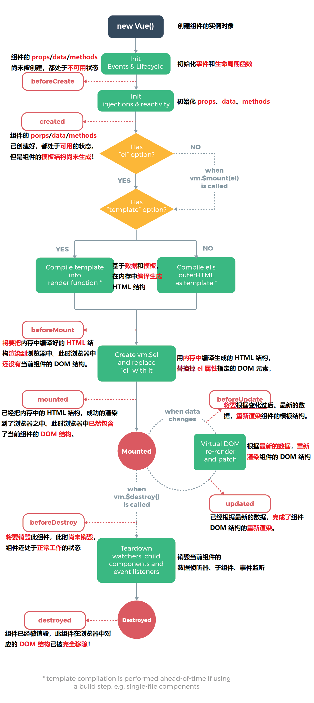
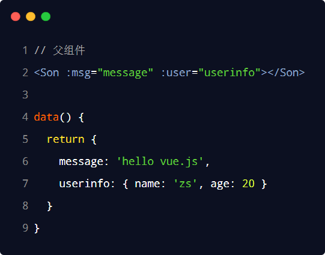
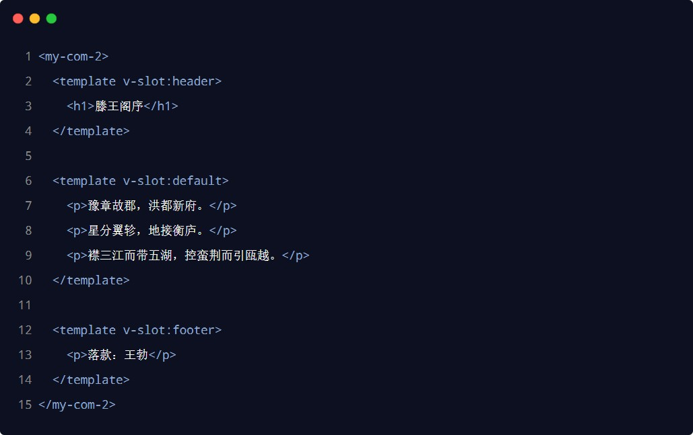
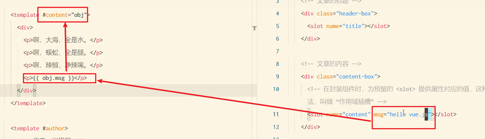

# 前端工程化与 webpack

## 前端工程化

### 1.小白眼中的前端开发 vs 实际的前端开发

小白眼中的前端开发：

- 会写HTML + CSS + JavaScript 就会前端开发
- 需要美化页面样式，就拽一个bootstrap 过来
- 需要操作 DOM 或发起 Ajax 请求，再拽一个 jQuery 过来
- 需要快速实现网页布局效果，就拽一个 Layui 过来


实际的前端开发：

- 模块化（js 的模块化、css 的模块化、资源的模块化）
- 组件化（复用现有的 UI 结构、样式、行为）
- 规范化（目录结构的划分、编码规范化、接口规范化、文档规范化、 Git 分支管理）
- 自动化（自动化构建、自动部署、自动化测试）

### 2.什么是前端工程化

前端工程化指的是：在企业级的前端项目开发中，把前端开发所需的工具、技术、流程、经验等进行规范化、标准化。

企业中的 Vue 项目和 React 项目，都是基于工程化的方式进行开发的。

好处：前端开发自成体系，有一套标准的开发方案和流程。

### 3.前端工程化的解决方案

早期的前端工程化解决方案：
grunt（ https://www.gruntjs.net/ ）
gulp（ https://www.gulpjs.com.cn/ ）


目前主流的前端工程化解决方案：
webpack（ https://www.webpackjs.com/ ）
parcel（ https://zh.parceljs.org/ ）

## webpack 的基本使用

### 1.什么是 webpack

概念：webpack 是前端项目工程化的具体解决方案。

主要功能：它提供了友好的前端模块化开发支持，以及代码压缩混淆、处理浏览器端 JavaScript 的兼容性、性能优化等强大的功能。


好处：让程序员把工作的重心放到具体功能的实现上，提高了前端开发效率和项目的可维护性。

注意：目前Vue，React 等前端项目，基本上都是基于webpack 进行工程化开发的。

### 2.创建列表隔行变色项目

① 新建项目空白目录，并运行npm init –y 命令(运行这个目录的前提，必须是纯英文目录)，初始化包管理配置文件package.json

② 新建 src 源代码目录

③ 新建 src -> index.html 首页和 src -> index.js 脚本文件

④ 初始化首页基本的结构

⑤ 运行npm install jquery –S （这个参数的意思是把jquery添加到dependencies目录下，不过不加这个指令也会安装到这个目录下，我个人感觉没有必要加)命令，安装 jQuery

⑥ 通过 ES6 模块化的方式导入 jQuery，实现列表隔行变色效果

### 3.在项目中安装 webpack

在终端运行如下的命令，安装webpack 相关的两个包：

`npm install webpack@5.42.1 webpack-cli@4.7.2 -D`(这个D的意思是安装到devDependencies)


至于为什么这样安装，可以看npm的官方


注意：

- -S是 --save的简写
- -D是 --save-dev的简写

### 4.在项目中配置 webpack

①  在项目根目录中，创建名为 webpack.config.js 的 webpack 配置文件，并初始化如下的基本配置：


② 在 package.json 的 scripts 节点下，新增 dev 脚本如下：


上面后面这个webpack是固定的

③ 在终端中运行npm run dev 命令，启动webpack 进行项目的打包构建

#### mode 的可选值

mode 节点的可选值有两个，分别是：

①	development

- 开发环境
- 不会对打包生成的文件进行代码压缩和性能优化
- 打包速度快，适合在开发阶段使用

②	production

- 生产环境
- 会对打包生成的文件进行代码压缩和性能优化
- 打包速度很慢，仅适合在项目发布阶段使用


#### webpack.config.js 文件的作用

webpack.config.js 是 webpack 的配置文件。webpack 在真正开始打包构建之前，会先读取这个配置文件，从而基于给定的配置，对项目进行打包。（也就是说，当我们运行npm run dev 的时候，先会读取webpack.config.js中的配置选项，之后会根据模式运行webpack命令）

注意：由于 webpack 是基于 node.js 开发出来的打包工具，因此在它的配置文件中，支持使用 node.js 相关的语法和模块进行webpack 的个性化配置。

#### webpack 中的默认约定

在 webpack 4.x 和 5.x 的版本中，有如下的默认约定：

① 默认的打包入口文件为 src -> index.js(src下面的index.js文件)

② 默认的输出文件路径为dist -> main.js（dist下面的main.js文件）


注意：可以在webpack.config.js 中修改打包的默认约定

#### 自定义打包的入口与出口

在 webpack.config.js 配置文件中，通过entry 节点指定打包的入口。通过output 节点指定打包的出口。示例代码如下：


## webpack 中的插件

### webpack 插件的作用

通过安装和配置第三方的插件，可以拓展webpack 的能力，从而让webpack 用起来更方便。最常用的webpack 插件有如下两个：

①	webpack-dev-server

- 类似于node.js 阶段用到的 nodemon 工具
- 每当修改了源代码，然后ctrl+s，webpack 会自动进行项目的打包和构建,这样我们就可以实时看到我们修改的效果咯

②	html-webpack-plugin

- webpack 中的HTML 插件（类似于一个模板引擎插件）
- 可以通过此插件自定制 index.html 页面的内容

### webpack-dev-server

webpack-dev-server 可以让webpack 监听项目源代码的变化，从而进行自动打包构建。

#### 安装 webpack-dev-server

运行如下的命令，即可在项目中安装此插件：

`npm install webpack-dev-server@3.11.2 -D`

#### 配置 webpack-dev-server

① 修改package.json -> scripts 中的dev 命令如下：（之前是dev:webpack,现在加了一个serve）


② 再次运行npm run dev 命令，重新进行项目的打包

③  在浏览器中访问http://localhost:8080 地址，查看自动打包效果（这个是项目的根目录）


注意：webpack-dev-server 会启动一个实时打包的http 服务器

#### 打包生成的文件哪儿去了？

① 不配置webpack-dev-server 的情况下，webpack 打包生成的文件，会存放到实际的物理磁盘上

- 严格遵守开发者在webpack.config.js 中指定配置
- 根据output 节点指定路径进行存放

② 配置了 webpack-dev-server 之后，打包生成的文件存放到了内存中

- 不再根据output 节点指定的路径，存放到实际的物理磁盘上
- 提高了实时打包输出的性能，因为内存比物理磁盘速度快很多

#### 生成到内存中的文件该如何访问？

webpack-dev-server 生成到内存中的文件，默认放到了项目的根目录中，而且是虚拟的、不可见的。

- 可以直接用/ 表示项目根目录，后面跟上要访问的文件名称，即可访问内存中的文件
- 例如/bundle.js 就表示要访问webpack-dev-server 生成到内存中的bundle.js 文件

### html-webpack-plugin

html-webpack-plugin 是 webpack 中的HTML 插件，可以通过此插件自定制 index.html 页面的内容。

需求：通过html-webpack-plugin 插件，将 src 目录下的 index.html 首页，复制到项目根目录中一份！

#### 安装 html-webpack-plugin

运行如下的命令，即可在项目中安装此插件：

`npm install html-webpack-plugin@5.3.2 -D`

#### 配置 html-webpack-plugin

下面的配置是在webpack.config.js配置文件中进行配置的


插件是在webpack指令执行期间会加载并调用这些插件

#### 解惑 html-webpack-plugin

① 通过HTML 插件复制到项目根目录中的 index.html 页面，也被放到了内存中

② HTML 插件在生成的 index.html 页面，自动注入了打包的bundle.js （不一定一定是这个文件，这个文件是我们自己配置的名字）文件

### devServer 节点

在 webpack.config.js 配置文件中，可以通过devServer 节点对webpack-dev-server 插件进行更多的配置，示例代码如下：


修改端口号也是在这修改的

注意：凡是修改了 webpack.config.js 配置文件，或修改了 package.json 配置文件，必须重启实时打包的服务器，否则最新的配置文件无法生效！

## webpack 中的 loader

### loader 概述

在实际开发过程中，webpack 默认只能打包处理以.js 后缀名结尾的模块。其他非.js 后缀名结尾的模块，webpack 默认处理不了，需要调用 loader 加载器才可以正常打包，否则会报错！


loader 加载器的作用：协助 webpack 打包处理特定的文件模块。比如：

- css-loader 可以打包处理.css 相关的文件
- less-loader 可以打包处理.less 相关的文件
- babel-loader 可以打包处理webpack 无法处理的高级 JS 语法

###  loader 的调用过程


### 打包处理 css 文件

①  运行npm i style-loader@3.0.0 css-loader@5.2.6 -D 命令，安装处理css 文件的 loader

② 在 webpack.config.js 的module -> rules 数组中，添加 loader 规则如下：


其中，test 表示匹配的文件类型， use 表示对应要调用的 loader

注意：

- use 数组中指定的 loader 顺序是固定的
- 多个 loader 的调用顺序是：从后往前调用


### 打包处理 less 文件

① 运行`npm i less-loader@10.0.1 less@4.1.1 -D`命令

② 在 webpack.config.js 的module -> rules 数组中，添加 loader 规则如下：


### 打包处理样式表中与 url 路径相关的文件

首先学一下base64怎么加载图片的：


打包处理样式表中与 url 路径相关的文件：

①  运行`npm i url-loader@4.1.1 file-loader@6.2.0 -D `命令

② 在 webpack.config.js 的module -> rules 数组中，添加 loader 规则如下：


其中? 之后的是 loader 的参数项：

- limit 用来指定图片的大小，单位是字节（byte）
- 只有≤ limit 大小的图片，才会被转为base64 格式的图片，如果大于这个值，不会转成bese64格式，还是图片的格式


### 打包处理 js 文件中的高级语法

webpack 只能打包处理一部分高级的 JavaScript 语法。对于那些webpack 无法处理的高级 js 语法，需要借助于babel-loader 进行打包处理。例如webpack 无法处理下面的 JavaScript 代码：


#### 安装 babel-loader 相关的包

运行如下的命令安装对应的依赖包：

`npm i babel-loader@8.2.2 @babel/core@7.14.6 @babel/plugin-proposal-decorators@7.14.5 -D`


在 webpack.config.js 的 module -> rules 数组中，添加 loader 规则如下：


至于为什么要指定排除项：因为第三方包中的JS兼容性，不需要我们关心，人家已经处理好了...

#### 配置 babel-loader

> 这里其实是配置插件的插件

在项目根目录下，创建名为 babel.config.js 的配置文件，定义 Babel 的配置项如下：


详情请参考Babel 的官网https://babeljs.io/docs/en/babel-plugin-proposal-decorators

## 打包发布

### 为什么要打包发布

项目开发完成之后，需要使用webpack 对项目进行打包发布，主要原因有以下两点：

①  开发环境下，打包生成的文件存放于内存中，无法获取到最终打包生成的文件

② 开发环境下，打包生成的文件不会进行代码压缩和性能优化


为了让项目能够在生产环境中高性能的运行，因此需要对项目进行打包发布。

### 配置 webpack 的打包发布

在 package.json 文件的 scripts 节点下，新增build 命令如下：


--model 是一个参数项，用来指定webpack 的运行模式。production 代表生产环境，会对打包生成的文件进行代码压缩和性能优化（记不记得之前我们在webpack.config.js中配置模式为development，这里的--model就是覆盖那里的配置文件，改成了生产环境）

注意：通过 --model 指定的参数项，会覆盖webpack.config.js 中的model 选项。

### 把 JavaScript 文件统一生成到 js 目录中

在 webpack.config.js 配置文件的output 节点中，进行如下的配置：


### 把图片文件统一生成到 image 目录中

修改webpack.config.js 中的 url-loader 配置项，新增outputPath 选项即可指定图片文件的输出路径：


### 自动清理 dist 目录下的旧文件

为了在每次打包发布时自动清理掉dist 目录中的旧文件，可以安装并配置clean-webpack-plugin 插件：


## Source Map

### 生产环境遇到的问题

前端项目在投入生产环境之前，都需要对 JavaScript 源代码进行压缩混淆，从而减小文件的体积，提高文件的加载效率。此时就不可避免的产生了另一个问题：

对压缩混淆之后的代码除错（debug）是一件极其困难的事情，下面是压缩过的代码：


有如下的问题：

- 变量被替换成没有任何语义的名称
- 空行和注释被剔除

### 什么是 Source Map

Source Map 就是一个信息文件，里面储存着位置信息。也就是说，Source Map 文件中存储着压缩混淆后的代码，所对应的转换前的位置。

有了它，出错的时候，除错工具将直接显示原始代码，而不是转换后的代码，能够极大的方便后期的调试。

### webpack 开发环境下的 Source Map

在开发环境下，webpack 默认启用了 Source Map 功能。当程序运行出错时，可以直接在控制台提示错误行的位置，并定位到具体的源代码：


### 解决默认 Source Map 的问题

开发环境下，推荐在webpack.config.js 中添加如下的配置，即可保证运行时报错的行数与源代码的行数保持一致：


### webpack 生产环境下的 Source Map

在生产环境下，如果省略了devtool 选项，则最终生成的文件中不包含 Source Map。这能够防止原始代码通过 Source Map 的形式暴露给别有所图之人。


### 只定位行数不暴露源码

在生产环境下，如果只想定位报错的具体行数，且不想暴露源码。此时可以将 devtool 的值设置为
nosources-source-map。实际效果如图所示：


### 定位行数且暴露源码

在生产环境下，如果想在定位报错行数的同时，展示具体报错的源码。此时可以将devtool 的值设置为
source-map。实际效果如图所示：


采用此选项后：你应该将你的服务器配置为，不允许普通用户访问 source map 文件！

### Source Map 的最佳实践

① 开发环境下：

- 建议把devtool 的值设置为eval-source-map
- 好处：可以精准定位到具体的错误行

② 生产环境下：

- 建议关闭 Source Map 或将devtool 的值设置为nosources-source-map
- 好处：防止源码泄露，提高网站的安全性

### 实际开发中需要自己配置 webpack 吗？

答案：不需要！

- 实际开发中会使命令行工具（俗称 CLI）一键生成带有 webpack 的项目

- 开箱即用，所有 webpack 配置项都是现成的！

- 我们只需要知道 webpack 中的基本概念即可！

# @符号的作用


配置@指向的位置，但是在学了vue后他会默认给我们配置了


# Vue2

## vue2 基础入门

### Vue的特性

vue 框架的特性，主要体现在如下两方面：

①	数据驱动视图

②	双向数据绑定

#### 数据驱动视图

在使用了vue 的页面中，vue 会监听数据的变化，从而自动重新渲染页面的结构。示意图如下：


好处：当页面数据发生变化时，页面会自动重新渲染！

注意：数据驱动视图是单向的数据绑定。

#### 双向数据绑定

在填写表单时，双向数据绑定可以辅助开发者在不操作 DOM 的前提下，自动把用户填写的内容同步到数据源中。示意图如下：


好处：开发者不再需要手动操作 DOM 元素，来获取表单元素最新的值！

#### MVVM

MVVM 是 vue 实现数据驱动视图和双向数据绑定的核心原理。MVVM 指的是Model、View 和 ViewModel，它把每个HTML 页面都拆分成了这三个部分，如图所示：


在 MVVM 概念中：

Model 表示当前页面渲染时所依赖的数据源。

View	表示当前页面所渲染的 DOM 结构。

ViewModel 表示 vue 的实例，它是MVVM 的核心。

#### MVVM 的工作原理

ViewModel 作为 MVVM 的核心，是它把当前页面的数据源（Model）和页面的结构（View）连接在了一起。


当数据源发生变化时，会被 ViewModel 监听到，VM 会根据最新的数据源自动更新页面的结构

当表单元素的值发生变化时，也会被VM 监听到，VM 会把变化过后最新的值自动同步到Model 数据源中

### vue 的基本使用

#### 基本使用步骤

①	导入 vue.js 的 script 脚本文件

②	在页面中声明一个将要被vue 所控制的 DOM 区域

③	创建 vm 实例对象（vue 实例对象）

#### 基本代码与 MVVM 的对应关系


#### 第一个vue程序

快捷：html 5导入模板

```html
<!DOCTYPE html>
<html lang="en">
<head>
    <meta charset="UTF-8">
    <meta http-equiv="X-UA-Compatible" content="IE=edge">
    <meta name="viewport" content="width=device-width, initial-scale=1.0">
    <title>Vue基础</title>
</head>
<body>
    <div id="app">
        {{ message }}
    </div>
    <script src="https://cdn.jsdelivr.net/npm/vue/dist/vue.js"></script>
    <script>
        var app =new Vue({
            el:"#app",
            data:{
                message:"hello Vue!"
            }
        })
    </script>
</body>
</html>
```

#### **创建代码片段**

文件 => 首选项 => 用户代码片段 => 新建全局代码片段/或文件夹代码片段：

名称为：vue-html.code-snippets

```js
{
	"vue htm": {
		"scope": "html",
		"prefix": "!v",
		"body": [
			"<!DOCTYPE html>",
			"<html lang=\"en\">",
			"",
			"<head>",
			" <meta charset=\"UTF-8\">",
			" <meta name=\"viewport\" content=\"width=device-width, initial-scale=1.0\">",
			" <meta http-equiv=\"X-UA-Compatible\" content=\"ie=edge\">",
			" <title>Document</title>",
			"</head>",
			"",
			"<body>",
			" <div id=\"app\">",
			"",
			" </div>",
			" <script src=\"https://cdn.jsdelivr.net/npm/vue/dist/vue.js\"></script>",
			" <script>",
			" new Vue({",
			" el: '#app',",
			" data: {",
			" $1",
			" }",
			" })",
			" </script>",
			"</body>",
			"",
			"</html>",
		],
		"description": "my vue template in html"
	}
}
```

我设置的快捷键是:  `!v ` 如果有需要可以自己改

#### el挂载点

el是用来设置Vue实例挂载（管理）的元素

**1.vue的作用范围是什么**

在el命中的元素内部可以被渲染

Vue会管理el选项 **命中的元素**及其**内部的后代元素**


**2.这里使用了id选择器，那么是否可以选用其他的选择器**

可以，但是建议使用id选择器

**3.是否可以设置其他的dom元素**

可以使用其他的双标签，但是不能使用HTML和BODY标签


#### data 数据对象

1.Vue中用到的数据定义在data中

2.data中可以写复杂类型的数据

3.渲染复杂类型数据时，遵循js的语法即可。语法，数组的索引语法

```html
<!DOCTYPE html>
<html lang="en">
<head>
    <meta charset="UTF-8">
    <meta http-equiv="X-UA-Compatible" content="IE=edge">
    <meta name="viewport" content="width=<device-width>, initial-scale=1.0">
    <title>Document</title>
</head>
<body>
    <div id="app">
        {{ message }}
        <h2>{{school.name}} {{school.mobile}}</h2>
        <ul>
         <li>{{campus[[0]]}}</li>
         <li>{{campus[[1]]}}</li>
        </ul>
    </div>

    <script src="https://cdn.jsdelivr.net/npm/vue/dist/vue.js"></script>
    <script>
     var app =new Vue({
         el:"#app",
         data:{
             message:"hello,vue",
             school:{
                 name:"小黑",
                 mobile:"130302030302020"
             },
             campus:["北京","上海"]
         }
     })
    </script>
</body>
</html>

```


### vue 的指令

#### 指令的概念

指令（Directives）是 vue 为开发者提供的模板语法，用于辅助开发者渲染页面的基本结构。

vue 中的指令按照不同的用途可以分为如下 6 大类：

①	内容渲染指令

②	属性绑定指令

③	事件绑定指令

④	双向绑定指令

⑤	条件渲染指令

⑥	列表渲染指令


注意：指令是vue 开发中最基础、最常用、最简单的知识点。

#### 内容渲染指令

内容渲染指令用来辅助开发者渲染 DOM 元素的文本内容。常用的内容渲染指令有如下 3 个：

```
1.v-text

2.{{ }}

3.v-html
```

##### v-text

1.v-text指令的作用：设置标签的内容（textContent）

2.默认写法会替换全部内容，使用差值表达式`{{}}`可以替换指定内容,(也就是说，不管你标签里面写了啥，都会覆盖标签中原有的内容)所以说这种写法基本上都不使用。

3.内部支持写表达式（如字符串拼接）


##### 插值表达式

```
vue 提供的 `{{ }} `语法，专门用来解决v-text 会覆盖默认文本内容的问题。这种 {{ }} 语法的专业名称是插值表达式（英文名为：Mustache）。
```


注意：相对于v-text 指令来说，插值表达式在开发中更常用一些！因为它不会覆盖元素中默认的文本内容。

##### v-html指令

1. v-html指令的作用是:设置元素的innerHTML

2. 内容中有html结构会被解析为标签

3. v-text指令无论内容是什么,只会解析为文本

4. 解析文本使用v-text

5. 需要解析html结构使用v-html


#### 属性绑定指令

如果需要为元素的属性动态绑定属性值，则需要用到v-bind 属性绑定指令。用法示例如下：

##### v-bind指令


可以直接省略v-bind


1.v-bind：属性名=表达式

2.v-bind指令的作用是:为元素绑定属性

3.完整写法是v-bind:属性名

4.简写的话可以直接省略v-bind,只保留:属性名

5.需要动态的增删class建议使用对象的方式


```html
<!DOCTYPE html>
<html lang="en">
    <head>
        <meta charset="UTF-8">
        <meta http-equiv="X-UA-Compatible" content="IE=edge">
        <meta name="viewport" content="width=device-width, initial-scale=1.0">
        <title>Document</title>
        <style>
            .active{
                border: 2px solid red;
            }
        </style>
    </head>
    <body>
        <div id="app">
            
            <!-- <br>         ？   ：  如果 是   就怎么 -->
            
            
            <!-- 点击变色                         active取值依赖于isactive是否取值 -->
        </div>
        <!-- 开发环境版本，包含了有帮助的命令行警告 -->
        <script src="https://cdn.jsdelivr.net/npm/vue/dist/vue.js"></script>
        <script>
            var app=new Vue({
                el:"#app",
                data:{
                    imgSrc:"https://img0.baidu.com/it/u=2753883117,2936626650&fm=26&fmt=auto",
                    imgTitle:"壁纸",
                    isActive:false
                },
                methods:{
                    toggleActive:function(){
                        this.isActive=!this.isActive;
                    }
                }
            })
        </script>
    </body>
</html>

```


在使用v-bind属性绑定期间，如果绑定内容需要进行动态的字符串拼接，则字符串的外面应该包括单引号，后面可以拼接一个变量，这个变量要去data里面去找


#### 事件绑定指令

vue 提供了v-on 事件绑定指令，用来辅助程序员为 DOM 元素绑定事件监听。语法格式如下：

注意：原生 DOM 对象有onclick、oninput、onkeyup 等原生事件，替换为vue 的事件绑定形式后，分别为：v-on:click、v-on:input、v-on:keyup

##### v-on指令

示例代码：


举例子

 

1. v-on指令的作用是:为元素绑定事件(点击，移入....)

2. 事件名不需要写on

3. 指令可以简写为@

4. 绑定的方法定义在methods属性中

5. 方法内部通过this关键字可以访问定义在data中数据


##### 事件参数对象

在原生的 DOM 事件绑定中，可以在事件处理函数的形参处，接收事件参数对象 event。（但是，仅限于没有传参的函数，如果传参了，这个e就不会传进来了）同理，在v-on 指令（简写为@ ）所绑定的事件处理函数中，同样可以接收到事件参数对象event，（这个e对象就是触发事件对象，比如点击事件对象，e.target就是事件源，也就是那个触发事件的dom元素，这里是button按钮）示例代码如下：


##### 绑定事件并传参

在使用v-on 指令绑定事件时，可以使用 ( ) 进行传参，示例代码如下：


##### $event

$event 是 vue 提供的特殊变量，用来表示原生的事件参数对象event。$event 可以解决事件参数对象event被覆盖的问题。示例用法如下：


##### 事件修饰符

在原生的JavaScript中，事件处理函数中调用event.preventDefault() 或 event.stopPropagation() 是非常常见的需求。因此，
vue 提供了事件修饰符的概念，来辅助程序员更方便的对事件的触发进行控制。常用的 5 个事件修饰符如下：

| 事件修饰符 | 说明                                                      |
| ---------- | --------------------------------------------------------- |
| .prevent   | 阻止默认行为（例如：阻止 a 连接的跳转、阻止表单的提交等） |
| .stop      | 阻止事件冒泡                                              |
| .capture   | 以捕获模式触发当前的事件处理函数                          |
| .once      | 绑定的事件只触发1次                                       |
| .self      | 只有在 event.target 是当前元素自身时触发事件处理函数      |

修饰符 (Modifiers) 是以半角句号（.）指明的特殊后缀，用于指出一个指令应该以特殊方式绑定。

> 例如  :   
>
>   .prevent 修饰符告诉 v-on 指令对于触发的事件调用 event.preventDefault(),即阻止事件原本的默认行为

语法格式如下：


阻止默认行为然后触发onLinkClick函数，这个函数是我们自己定义的。。。

```html
<!DOCTYPE html>
<html lang="en">

    <head>
        <meta charset="UTF-8">
        <meta name="viewport" content="width=device-width, initial-scale=1.0">
        <meta http-equiv="X-UA-Compatible" content="ie=edge">
        <title>Document</title>
    </head>

    <body>
        <div id="app">
			<!--阻止表单的默认提交行为，然后触发onSubmit函数-->
            <form action="localhost:8080/save" v-on:submit.prevent="onSubmit">
                <input type="text" id="name" v-model="user.username" />
            	<button type="submit">保存</button>
            </form>
        </div>
    <script src="https://cdn.jsdelivr.net/npm/vue/dist/vue.js"></script>
    <script>
        new Vue({
            el: '#app',
            data: {
                user:{
                    username:"请输入你的密码"
                }
            },
            methods:{
                onSubmit(){
                    if(this.user.username){
                        console.log('提交表单')
                    }else{
                        alert("请输入用户名")
                    }
                }
            }
        })
    </script>
    </body>

</html>
```

按下按钮后，阻止表单提交到指定地址，并且，触发onSubmit()方法

##### 按键修饰符

在监听键盘事件时，我们经常需要判断详细的按键。此时，可以为键盘相关的事件添加按键修饰符，例如：


submit 和clearInput这两个函数都是我们两个自己定义的

**模板**


```html
<!DOCTYPE html>
<html lang="en">
    <head>
        <meta charset="UTF-8">
        <meta http-equiv="X-UA-Compatible" content="IE=edge">
        <meta name="viewport" content="width=device-width, initial-scale=1.0">
        <title>Document</title>
    </head>
    <body>

        <!-- 2.html结构 -->
        <div id="app">
            <input type="button" value="点击" @click="doIt(666,'老铁')">
            <input type="text" @keyup.enter="sayHi">

        </div>
        <!-- 1.开发环境版本，包含了有帮助的命令行警告 -->
        <script src="https://cdn.jsdelivr.net/npm/vue/dist/vue.js"></script>
        <!-- 3.创建Vue实例 -->
        <script>
            var app=new Vue({
                el:"#app",
                methods:{
                    doIt:function(p1,p2){
                        console.log("做it");
                        console.log(p1,p2);
                        alert("吃了没");
                        alert(p1,p2);
                    },
                    sayHi:function(){
                        alert("吃了没");
                    }
                }
            })
        </script>

    </body>
</html>

```


#### 双向绑定指令

vue 提供了v-model 双向数据绑定指令，用来辅助开发者在不操作 DOM 的前提下，快速获取表单的数据。

> 只有表单元素才能使用v-model指令，其他标签用它没意义
>
> 比如：
>
> - input
> - select
> - textarea


##### v-model

简单来说双向绑定就是指修改文本框中的message，也会改变data中的message。

1. v-model：获取和设置表单元素的值(双向数据绑定)


2. v-model指令的作用是：便捷的设置、获取表单元素的值

3. 绑定的数据会和表单元素值相关联

```html
<!-- 2.html结构 -->
<div id="app">
    <input type="text" v-model="message" @keyup.enter="getMessage" />
    <input type="button" v-model="message" @click="setMessage" />
    <h3>{{message}}</h3>
</div>
<script src="https://cdn.jsdelivr.net/npm/vue/dist/vue.js"></script>
<!-- 3.创建Vue实例 -->
<script>
    var app=new Vue({
        el:"#app",
        data:{
            message:"沙丁鱼"
        },
        methods:{
            getMessage:function(){
                alert(this.message)
            },
            setMessage:function(){
                this.message="酷丁鱼";
            }
        }
    })
</script>
```


##### v-model 指令的修饰符

为了方便对用户输入的内容进行处理，vue 为 v-model 指令提供了 3 个修饰符，分别是：

| 修饰符  | 作用                           | 示例                           |
| ------- | ------------------------------ | ------------------------------ |
| .number | 自动将用户的输入值转为数值类型 | <input v-model.number="age" /> |
| .trim   | 自动过滤用户输入的首尾空白字符 | <input v-model.trim="msg" />   |
| .lazy   | 在“change”时而非“input”时更新  | <input v-model.lazy="msg" />   |


#### 条件渲染指令

条件渲染指令用来辅助开发者按需控制 DOM 的显示与隐藏。条件渲染指令有如下两个，分别是：

- v-if
- v-show

示例用法如下：

下面的networkState也是我们自己定义的一个变量


##### v-show指令

1. show指令的作用

根据**真假**进行切换元素的显示

**状态原理**是修改元素的**display**,实现显示隐藏

2. 指令后面的内容,最终都会解析为布尔值 

3. true元素显示，值为false元素隐藏

4. 改变之后，对应元素的显示状态会同步更新

```html
<!DOCTYPE html>
<html lang="en">
<head>
    <meta charset="UTF-8">
    <meta http-equiv="X-UA-Compatible" content="IE=edge">
    <meta name="viewport" content="width=device-width, initial-scale=1.0">
    <title>Document</title>
</head>
<body>
    <div id="app">
        <input type="button" value="切换显示状态" @click="changeIsShow">
        <input type="button" value="累加年龄" @click="addAge">
        
        =18" src="./1.jpg">
    </div>
    <script src="https://cdn.jsdelivr.net/npm/vue/dist/vue.js"></script>
    <script>
        var app =new Vue({
            el: "#app",
            data:{
                isShow:false,
                age:17
            },
            methods:{
                changeIsShow:function(){
                    this.isShow=!this.isShow;
                },
                addAge:function(){
                    this.age++;
            }
          }
        })
    </script>

</body>
</html>

```

##### v-if指令

1. v-if指令的作用是:**根据表达式的真假切换元素的显示状态**
2. 本质是通过操纵dom元素来切换显示状态
3. 表达式的值为true,把dom元素添加到dom树中。如果值为false,则从dom树中移除
4. 频繁的切换使用v-show。反之使用v-if，v-show如果多次进行切换消耗的资源小

v-if和v-show的区别：v-show直接修改display ，而v-if是直接抹除dom标签


```html
<!DOCTYPE html>
<html lang="en">
<head>
    <meta charset="UTF-8">
    <meta http-equiv="X-UA-Compatible" content="IE=edge">
    <meta name="viewport" content="width=device-width, initial-scale=1.0">
    <title>Document</title>
</head>
<body>
    <div id="app">
        <input type="button" value="切换显示" @click="change">
        <p v-if="true">我是一个p标签</p>
        <p v-if="isShow">我是一个p标签</p>
       

    </div>
    <script src="https://cdn.jsdelivr.net/npm/vue/dist/vue.js"></script>
    <script>
        var app=new Vue({
            el:"#app",
            data:{
                isShow:false
            },
            methods:{  
                change:function(){
                    this.isShow=!this.isShow;
                }
            }
        })
    </script>
</body>
</html>

```


在实际开发中，绝大多数情况，不用考虑性能，直接使用v-if就行了

###### v-else

v-if 可以单独使用，或配合v-else 指令一起使用：


注意：v-else 指令必须配合v-if 指令一起使用，否则它将不会被识别！

###### v-else-if

v-else-if 指令，顾名思义，充当v-if 的“else-if 块”，可以连续使用：


注意：v-else-if 指令必须配合v-if 指令一起使用，否则它将不会被识别！

这玩意一般都不用。。。

#### 列表渲染指令

vue 提供了v-for 列表渲染指令，用来辅助开发者基于一个数组来循环渲染一个列表结构。v-for 指令需要使用 item in items 形式的特殊语法，其中：

- items 是待循环的数组
- item 是被循环的每一项


##### v-for


```html
<!DOCTYPE html>
<html lang="en">

<head>
    <meta charset="UTF-8">
    <meta name="viewport" content="width=device-width, initial-scale=1.0">
    <meta http-equiv="X-UA-Compatible" content="ie=edge">
    <title>Document</title>
</head>

<body>
    <div id="app">

        <ul>
            <li v-for="n in 10">{{n}}</li>
        </ul>
        <ol>
            <li v-for="(n,index) in 10">{{n}}----{{index}}</li>
        </ol>
    </div>
    <script src="https://cdn.jsdelivr.net/npm/vue/dist/vue.js"></script>
    <script>
        new Vue({
            el: '#app',
            data: {

            }
        })
    </script>
</body>

</html>
```

遍历表格（其中的user可以随便起名字。改成haohao都行）


1. v-for指令的作用是:根据数据生成列表结构

2. 数组经常和v-for结合使用

3. 语法是( item,index ) in数据

4. item和index可以结合其他指令- -起使用

5. 数组长度的更新会同步到页面上，是响应式的

###### v-for 中的索引

v-for 指令还支持一个可选的第二个参数，即当前项的索引。语法格式为(item, index) in items，示例代码如下：


注意：v-for 指令中的 item 项和 index 索引都是形参，可以根据需要进行重命名。例如(user, i) in userlist

###### 使用 key 维护列表的状态

当列表的数据变化时，默认情况下，vue 会尽可能的复用已存在的 DOM 元素，从而提升渲染的性能。但这种默认的性能优化策略，会导致有状态的列表无法被正确更新。

为了给vue一个提示，以便它能跟踪每个节点的身份，从而在保证有状态的列表被正确更新的前提下，提升渲染的性能。此时，需要为每项提供一个唯一的key 属性。

官方建议：只要用到了v-for指令，那么一定要绑定一个`:key`属性


key 的注意事项

①	key 的值只能是字符串或数字类型
②	key 的值必须具有唯一性（即：key 的值不能重复）
③	建议把数据项 id（我们data里面的数据中的key） 属性的值作为key 的值（因为 id 属性的值具有唯一性）
④	使用 index 的值当作 key 的值没有任何意义（因为 index 的值不具有唯一性）
⑤	建议使用v-for 指令时一定要指定key 的值（既提升性能、又防止列表状态紊乱）

### 过滤器

#### 过滤器的使用

过滤器（Filters）是 vue 为开发者提供的功能，常用于文本的格式化。过滤器可以用在两个地方：插值表达式和 v-bind 属性绑定。

过滤器应该被添加在 JavaScript 表达式的尾部，由“管道符”进行调用，示例代码如下：

下面的capitalize和formatId都是需要我们自定义的函数，至于格式，往下看


示例代码:

```html
<!DOCTYPE html>
<html lang="en">

    <head>
        <meta charset="UTF-8">
        <meta http-equiv="X-UA-Compatible" content="IE=edge">
        <meta name="viewport" content="width=device-width, initial-scale=1.0">
        <title>Document</title>
    </head>

    <body>
        <div id="app">
            <p>message 的值是：{{ message | capi }}</p>
        </div>
        <script src="./lib/vue-2.6.12.js"></script>
        <script>
            const vm = new Vue({
                el: '#app',
                data: {
                    message: 'hello vue.js'
                },
                // 过滤器函数，必须被定义到 filters 节点之下
                // 过滤器本质上是函数
                filters: {
                    // 注意：过滤器函数形参中的 val，永远都是“管道符”前面的那个值
                    //这个函数的作用是把首字母变为大写
                    capi(val) {
                        // 字符串有 charAt 方法，这个方法接收索引值，表示从字符串中把索引对应的字符，获取出来
                        // val.charAt(0)
                        const first = val.charAt(0).toUpperCase()
                        // 字符串的 slice 方法，可以截取字符串，从指定索引往后截取
                        const other = val.slice(1)
                        // 强调：过滤器中，一定要有一个返回值
                        return first + other
                    }
                }
            })
        </script>
    </body>

</html>
```


#### 私有过滤器和全局过滤器

在 filters 节点下定义的过滤器，也就是上面我们自己定义的过滤器，称为“私有过滤器”，因为它只能在当前vm 实例所控制的el 区域内使用。如果希望在多个vue 实例之间共享过滤器，则可以按照如下的格式定义全局过滤器：


示例代码：

```html
<!DOCTYPE html>
<html lang="en">

<head>
  <meta charset="UTF-8">
  <meta http-equiv="X-UA-Compatible" content="IE=edge">
  <meta name="viewport" content="width=device-width, initial-scale=1.0">
  <title>Document</title>
</head>

<body>
  <div id="app">
    <p>message 的值是：{{ message | capi }}</p>
  </div>

  <div id="app2">
    <p>message 的值是：{{ message | capi }}</p>
  </div>

  <script src="./lib/vue-2.6.12.js"></script>
  <script>
    // 使用 Vue.filter() 定义全局过滤器
    //如果全局过滤器和私有过滤器名字一致，此时就按照就近原则，调用的是私有过滤器
    Vue.filter('capi', function (str) {
      const first = str.charAt(0).toUpperCase()
      const other = str.slice(1)
      return first + other + '~~~'
    })

    const vm = new Vue({
      el: '#app',
      data: {
        message: 'hello vue.js'
      },
      filters: {
        capi(val) {
          const first = val.charAt(0).toUpperCase()
          const other = val.slice(1)
          return first + other
        }
      }
    })

    // ----------------------------------

    // 第二个vue示例，这里没有配置过滤器
    const vm2 = new Vue({
      el: '#app2',
      data: {
        message: 'Haohao'
      }
    })
  </script>
</body>

</html>
```

运行效果：第一个调用了私有过滤器，第二个调用了全局过滤器


#### 连续调用多个过滤器

过滤器可以串联地进行调用，例如：


#### 过滤器传参

过滤器的本质是 JavaScript 函数，因此可以接收参数，格式如下：


#### 过滤器的兼容性

过滤器仅在vue 2.x 和 1.x 中受支持，在vue 3.x 的版本中剔除了过滤器相关的功能。在企业级项目开发中：

如果使用的是 2.x 版本的 vue，则依然可以使用过滤器相关的功能

如果项目已经升级到了 3.x 版本的vue，官方建议使用计算属性或方法代替被剔除的过滤器功能


具体的迁移指南，请参考vue 3.x 的官方文档给出的说明：https://v3.vuejs.org/guide/migration/filters.html#migration-strategy


### watch 侦听器

#### 什么是 watch 侦听器

侦听器watch 侦听器允许开发者监视数据的变化，从而针对数据的变化做特定的操作。语法格式如下：


举例：

```html
<!DOCTYPE html>
<html lang="en">

<head>
  <meta charset="UTF-8">
  <meta http-equiv="X-UA-Compatible" content="IE=edge">
  <meta name="viewport" content="width=device-width, initial-scale=1.0">
  <title>Document</title>
</head>

<body>
  <div id="app">
    <input type="text" v-model="username">
  </div>
  <script src="./lib/vue-2.6.12.js"></script>
  <script>
    const vm = new Vue({
      el: '#app',
      data: {
        username: 'admin'
      },
      // 所有的侦听器，都应该被定义到 watch 节点下
      watch: {
        // 侦听器本质上是一个函数，要监视哪个数据的变化，就把数据名作为方法名即可
        // 新值在前，旧值在后
        username(newVal,oldVal) {
          console.log("检测到了数值的变化");
          console.log(`output->newVal`,newVal)
          console.log(`output->oldVal`,oldVal)    
        }
      }
    })
  </script>
</body>

</html>
```

实现效果：


#### 监听器的应用场景

可以用来检测用户名是否被占用，每一次修改都发送一次axios请求去看用户名是否被占用。

#### immediate 选项

默认情况下，组件在初次加载完毕后不会调用 watch 侦听器。如果想让 watch 侦听器立即被调用，则需要使用 immediate 选项。示例代码如下：

```html
<!DOCTYPE html>
<html lang="en">

<head>
  <meta charset="UTF-8">
  <meta http-equiv="X-UA-Compatible" content="IE=edge">
  <meta name="viewport" content="width=device-width, initial-scale=1.0">
  <title>Document</title>
</head>

<body>
  <div id="app">
    <input type="text" v-model="username">
  </div>

  <script src="./lib/vue-2.6.12.js"></script>
  <script src="./lib/jquery-v3.6.0.js"></script>

  <script>
    const vm = new Vue({
      el: '#app',
      data: {
        username: 'admin'
      },
      // 所有的侦听器，都应该被定义到 watch 节点下
      watch: {
        // 定义对象格式的侦听器
        username: {
          // 侦听器的处理函数
          handler(newVal, oldVal) {
            console.log(newVal, oldVal)
          },
          // immediate 选项的默认值是 false
          // immediate 的作用是：控制侦听器是否自动触发一次！
          // 如果为真，则说明是进入浏览器默认触发一次handler
          immediate: true
        }
      }
    })
  </script>
</body>

</html>
```

#### deep 选项

如果 watch 侦听的是一个对象，如果对象中的属性值发生了变化，则无法被监听到。此时需要使用 deep 选项，代码示例如下：

```html
<!DOCTYPE html>
<html lang="en">

<head>
  <meta charset="UTF-8">
  <meta http-equiv="X-UA-Compatible" content="IE=edge">
  <meta name="viewport" content="width=device-width, initial-scale=1.0">
  <title>Document</title>
</head>

<body>
  <div id="app">
    <input type="text" v-model="info.username">
    <input type="text" v-model="info.address.city">
  </div>

  <script src="./lib/vue-2.6.12.js"></script>
  <script src="./lib/jquery-v3.6.0.js"></script>

  <script>
    const vm = new Vue({
      el: '#app',
      data: {
        // 用户的信息对象
        info: {
          username: 'admin',
          address: {
            city: '北京'
          }
        }
      },
      // 所有的侦听器，都应该被定义到 watch 节点下
      watch: {
        info: {
          handler(newVal) {
            console.log(newVal)
          },
          // 开启深度监听，只要对象中任何一个属性变化了，都会触发“对象的侦听器”
          deep: true
        },
      }
    })
  </script>
</body>
</html>
```

#### 监听对象单个属性的变化

如果只想监听对象中单个属性的变化，则可以按照如下的方式定义 watch 侦听器：

```html
<!DOCTYPE html>
<html lang="en">

<head>
  <meta charset="UTF-8">
  <meta http-equiv="X-UA-Compatible" content="IE=edge">
  <meta name="viewport" content="width=device-width, initial-scale=1.0">
  <title>Document</title>
</head>

<body>
  <div id="app">
    <input type="text" v-model="info.username">
    <input type="text" v-model="info.address.city">
  </div>

  <script src="./lib/vue-2.6.12.js"></script>
  <script src="./lib/jquery-v3.6.0.js"></script>

  <script>
    const vm = new Vue({
      el: '#app',
      data: {
        // 用户的信息对象
        info: {
          username: 'admin',
          address: {
            city: '北京'
          }
        }
      },
      watch: {
        // 如果要侦听的是对象的子属性（只监听这一个的）的变化，则必须包裹一层单引号
        // 这里只监听了info对象的username属性
        'info.username'(newVal) {
          console.log(newVal)
        }
      }
    })
  </script>
</body>

</html>
```


#### 对象监听器和方法监听器的区别

1. 方法格式的侦听器
   + 缺点1：无法在刚进入页面的时候，自动触发！！！
   + 缺点2：如果侦听的是一个对象，如果对象中的属性发生了变化，不会触发侦听器！！！
   + 好处1：定义简单，使用简单。。。
2. 对象格式的侦听器
   + 好处1：可以通过 **immediate** 选项，让侦听器自动触发！！！
   + 好处2：可以通过 **deep** 选项，让侦听器深度监听对象中每个属性的变化！！！

### 计算属性

#### 什么是计算属性

计算属性指的是通过一系列运算之后，最终得到一个属性值。

这个动态计算出来的属性值可以被模板结构或methods 方法使用。

计算属性也是属性，计算属性的返回值也会成为data的一部分，不过和data又有一些不一样，下面的computed方法里面的就是计算属性，计算属性会以：方法名为key,返回值为value挂载到Vue对象(vm)身上。访问这个属性也是通过this.方法名，就可以访问到这个属性了，这个就是计算属性。

示例代码如下：


#### 代码案例

案例代码：

```html
<!DOCTYPE html>
<html lang="en">

<head>
  <meta charset="UTF-8">
  <meta name="viewport" content="width=device-width, initial-scale=1.0">
  <meta http-equiv="X-UA-Compatible" content="ie=edge">
  <title>Document</title>
  <script src="./lib/vue-2.6.12.js"></script>
  <style>
    .box {
      width: 200px;
      height: 200px;
      border: 1px solid #ccc;
    }
  </style>
</head>

<body>
  <div id="app">
    <div>
      <span>R：</span>
      <input type="text" v-model.number="r">
    </div>
    <div>
      <span>G：</span>
      <input type="text" v-model.number="g">
    </div>
    <div>
      <span>B：</span>
      <input type="text" v-model.number="b">
    </div>
    <hr>

    <!-- 专门用户呈现颜色的 div 盒子 -->
    <!-- 在属性身上，: 代表  v-bind: 属性绑定 -->
    <!-- 这里的style里面写的是一个js对象，里面是backgroundColor为key，后面的为值 -->
    <div class="box" :style="{ backgroundColor: `rgb(${r}, ${g}, ${b})` }">
      <!-- 这里面写的是js表达式，也就是说可以用js的语法 -->
      {{ `rgb(${r}, ${g}, ${b})` }}
    </div>
    <button @click="show">按钮</button>
  </div>

  <script>
    // 创建 Vue 实例，得到 ViewModel
    var vm = new Vue({
      el: '#app',
      data: {
        // 红色
        r: 0,
        // 绿色
        g: 0,
        // 蓝色
        b: 0
      },
      methods: {
        // 点击按钮，在终端显示最新的颜色
        show() {
          console.log(`rgb(${this.r}, ${this.g}, ${this.b})`)
        }
      },
    });
  </script>
</body>

</html>
```

实现效果：


需求：使用计算属性改造案例，不改变原有的效果。

改造后的代码：

```html
<!DOCTYPE html>
<html lang="en">

<head>
  <meta charset="UTF-8">
  <meta name="viewport" content="width=device-width, initial-scale=1.0">
  <meta http-equiv="X-UA-Compatible" content="ie=edge">
  <title>Document</title>
  <script src="./lib/vue-2.6.12.js"></script>
  <style>
    .box {
      width: 200px;
      height: 200px;
      border: 1px solid #ccc;
    }
  </style>
</head>

<body>
  <div id="app">
    <div>
      <span>R：</span>
      <input type="text" v-model.number="r">
    </div>
    <div>
      <span>G：</span>
      <input type="text" v-model.number="g">
    </div>
    <div>
      <span>B：</span>
      <input type="text" v-model.number="b">
    </div>
    <hr>

    <!-- 专门用户呈现颜色的 div 盒子 -->
    <!-- 在属性身上，: 代表  v-bind: 属性绑定 -->
    <!-- :style 代表动态绑定一个样式对象，它的值是一个 {  } 样式对象 -->
    <!-- 当前的样式对象中，只包含 backgroundColor 背景颜色 -->
    <div class="box" :style="{ backgroundColor: rgb }">
      {{ rgb }}
    </div>
    <button @click="show">按钮</button>
  </div>

  <script>
    // 创建 Vue 实例，得到 ViewModel
    var vm = new Vue({
      el: '#app',
      data: {
        // 红色
        r: 0,
        // 绿色
        g: 0,
        // 蓝色
        b: 0
      },
      methods: {
        // 点击按钮，在终端显示最新的颜色
        show() {
          console.log(this.rgb)
        }
      },
      // 所有的计算属性，都要定义到 computed 节点之下
      // 计算属性在定义的时候，要定义成“方法格式”
      computed: {
        // rgb 作为一个计算属性，被定义成了方法格式，
        // 最终，在这个方法中，要返回一个生成好的 rgb(x,x,x) 的字符串
        
        // 这个返回的字符串，会默认的成为Vue对象身上的一个属性  
        // 比如说你方法名为rgb 返回值为rgb(0,0,0) 那Vue对象就会有一个属性叫rgb，值为rgb(0,0,0)
        rgb() {
          return `rgb(${this.r}, ${this.g}, ${this.b})`
        }
      }
    });

    console.log(vm)
  </script>
</body>

</html>
```

#### 计算属性的特点

①  虽然计算属性在声明的时候被定义为方法，但是计算属性的本质是一个属性

②  计算属性会缓存计算的结果，只有计算属性依赖的数据变化时，才会重新进行运算

## Vue-Cli

### 单页面应用程序

#### 什么是单页面应用程序

单页面应用程序（英文名：Single Page Application）简称 SPA，顾名思义，指的是一个Web 网站中只有唯一的一个HTML 页面，所有的功能与交互都在这唯一的一个页面内完成。

例如资料中的这个Demo 项目：


以下页面的功能，都是基于一个html页面实现的：


#### 什么是 vue-cli

vue-cli 是 Vue.js 开发的标准工具。它简化了程序员基于webpack 创建工程化的 Vue 项目的过程。

引用自 vue-cli 官网上的一句话：程序员可以专注在撰写应用上，而不必花好几天去纠结 webpack 配置的问题。

中文官网：https://cli.vuejs.org/zh/

#### 安装和使用

vue-cli 是 npm 上的一个全局包，使用 npm install 命令，即可方便的把它安装到自己的电脑上：

`npm install -g @vue/cli`

基于 vue-cli 快速生成工程化的 Vue 项目：

`vue create 项目的名称`(项目名称尽量中文)

1. 
2. 
3. 
4. 
5. 
6. 
7. 

#### vue 项目的运行流程

在工程化的项目中，vue 要做的事情很单纯：通过main.js 把 App.vue 渲染到index.html 的指定区域中。其中：

①	App.vue 用来编写待渲染的模板结构

②	index.html 中需要预留一个el 区域

③	main.js 把 App.vue 渲染到了index.html 所预留的区域中


此外，关于el挂载点，还有一种书写方式，名叫：`$mount('')`


### vue 组件

#### 什么是组件化开发

组件化开发指的是：根据封装的思想，把页面上可重用的UI 结构封装为组件，从而方便项目的开发和维护。


组件（Component）是 Vue.js 最强大的功能之一。

组件可以扩展 HTML 元素，封装可重用的代码。

组件系统让我们可以用独立可复用的小组件来构建大型应用，几乎任意类型的应用的界面都可以抽象为

一个组件树：


#### vue 中的组件化开发

vue 是一个支持组件化开发的前端框架。

vue 中规定：**组件**的后缀名是 .vue。之前接触到的 App.vue 文件本质上就是一个 vue 的组件。

#### vue 组件的三个组成部分

每个 .vue 组件都由 3 部分构成，分别是：

- template -> 组件的模板结构
- script -> 组件的JavaScript 行为
- style -> 组件的样式

##### template

vue 规定：每个组件对应的模板结构，需要定义到` <template> `节点中。

其中，每个组件中必须包含template 模板结构，而script 行为和style 样式是可选的组成部分。


注意：

template 是 vue 提供的容器标签，只起到包裹性质的作用，它不会被渲染为真正的 DOM 元素

template 中只能包含唯一的根节点,也就是说必须在里面先写一个root根标签...

##### script

vue 规定：开发者可以在 `<script> `节点中封装组件的JavaScript 业务逻辑。

`<script > `节点的基本结构如下：


文件为.vue为结尾的， 组件中的 data 必须是函数，而不能是对象

vue 规定：.vue 组件中的data 必须是一个函数，不能直接指向一个数据对象。因此在组件中定义data 数据节点时，下面的方式是错误的：


```js
//下面的写法是正确的
//组件中的data必须是一个函数
data(){
    //在这里定义我们需要的数据
    return {
        username:’admin’
    }
}

```

##### style

vue 规定：组件内的` <style> `节点是可选的，开发者可以在 `<style> `节点中编写样式美化当前组件的UI 结构。

`<script > `节点的基本结构如下：


让 style 中支持 less 语法

在` <style> `标签上添加lang="less" 属性，即可使用less 语法编写组件的样式：


#### 组件之间的父子关系


组件在被封装好之后，彼此之间是相互独立的，不存在父子关系


在使用组件的时候，根据彼此的嵌套关系，形成了父子关系、兄弟关系

##### 使用组件的三个步骤


还有一个例子，下面这个例子是直接把简单的模板写到components对象中了，但是一般我们不这样：


定义组件

```vue
 new Vue({
            el: '#app',
            // 定义局部组件，这里可以定义多个局部组件
            components: {
                //组件的名字
                'haohao': {
                    //组件的内容
                    template: '<ul><li>首页</li><li>学员管理</li></ul>'
                }
            }
})
```

使用组件

```html
<haohao></haohao>
```


##### 私有组件

通过 components 注册的是私有子组件

例如：

在组件A 的components 节点下，注册了组件F。则组件F 只能用在组件A 中；不能被用在组件C 中。

<font color="red">上面的例子都是注册的是私有组件，下面的例子全都是注册的全局组件</font>


##### 注册全局组件

###### 第一种方法：

创建js文件


```vue
// 定义全局组件
Vue.component('haohao', {
    template: '<ul><li>首页</li><li>学员管理</li><li>讲师管理</li></ul>'
})
```


引入并使用

###### 第二种方法：

还有一种方法：

在 vue 项目的main.js 入口文件中，通过Vue.component() 方法，可以注册全局组件。示例代码如下：

下面的代码是写在main.js中的：


#### 组件的 props

props 是组件的自定义属性，在封装通用组件的时候，合理地使用 props 可以极大的提高组件的复用性！它的语法格式如下：


##### props 是只读的

vue 规定：组件中封装的自定义属性是只读的，程序员不能直接修改 props 的值。否则会直接报错：


要想修改props 的值，可以把 props 的值转存到 data 中，因为 data 中的数据都是可读可写的！


可以这样理解，props的值我们只做**初始值**，如果想修改他，就把他添加到data里面就可以了

##### props 的 default 默认值

在声明自定义属性时，可以通过default 来定义属性的默认值。示例代码如下：


##### props 的 type 值类型

在声明自定义属性时，可以通过type 来定义属性的值类型。示例代码如下：


##### props 的 required 必填项

在声明自定义属性时，可以通过 required 选项，将属性设置为必填项，强制用户必须传递属性的值。示例代码如下：


##### 具体代码

封装者：

Count.vue

```vue
<template>
  <div>
    <h5>Count 组件</h5>
    <p>count 的值是：{{ count }}</p>
    <button @click="count += 1">+1</button>

    <button @click="show">打印 this</button>
  </div>
</template>

<script>
export default {
  // props 是"自定义属性"，允许使用者通过自定义属性，为当前组件指定初始值
  // 自定义属性的名字，是封装者自定义的（只要名称合法即可）
  // props 中的数据，可以直接在模板结构中被使用
  // 注意：props 是只读的，不要直接修改 props 的值，否则终端会报错！
  // props: ['init'],
  props: {
    // 自定义属性A : { /* 配置选项 */ },
    // 自定义属性B : { /* 配置选项 */ },
    // 自定义属性C : { /* 配置选项 */ },
    init: {
      // 如果外界使用 Count 组件的时候，没有传递 init 属性，则默认值生效
      default: 0,
      // init 的值类型必须是 Number 数字
      // 这里vue帮我们做了校验，如果传参不正确就会终端报错！
      type: Number,
      // 必填项校验，就算有默认值，但是调用者没传参，还是会报错
      required: true
    },
  },

  data() {
    return {
      // 把 props 中的 init 值，转存到 count 上
      count: this.init
    }
  },
  methods: {
    show() {
      console.log(this)
    }
  }
}
</script>

<style lang="less"></style>

```

使用者：

Left.vue

```vue
<template>
  <div class="left-container">
    <h3>Left 组件</h3>
    <hr />
    <!-- 这里使用了v-bind ，保证传参是个数字 -->
    <MyCount :init="9"></MyCount>
  </div>
</template>
```

#### 组件之间的样式冲突问题

默认情况下，写在 .vue 组件中的样式会全局生效，因此很容易造成多个组件之间的样式冲突问题。导致组件之间样式冲突的根本原因是：

①  单页面应用程序中，所有组件的DOM 结构，都会渲染到唯一的index.html 页面进行呈现

② 每个组件中的样式，都会影响整个index.html 页面中的DOM 元素

##### 思考：如何解决组件样式冲突的问题

为每个组件分配唯一的自定义属性，在编写组件样式时，通过属性选择器来控制样式的作用域，示例代码如下：


##### style 节点的 scoped 属性

为了提高开发效率和开发体验，vue 为 style 节点提供了scoped 属性，从而防止组件之间的样式冲突问题（原理就是上面的加一个自定义属性。。。可以在开发者页面上面看到）：


##### /deep/ 样式穿透

如果给当前组件的style 节点添加了scoped 属性，则当前组件的样式对其子组件是不生效的。如果想让某些样式对子组件生效，可以使用/deep/ 深度选择器。


上面红框里面一个是并集选择器，一个是子代选择器

这个玩意可以修改组件库的样式，等到后面用到了我再回来填坑。。。

## 生命周期

- 生命周期（Life Cycle）是指一个组件从创建 -> 运行-> 销毁的整个阶段，强调的是一个时间段。
- 生命周期函数：是由 vue 框架提供的内置函数，会伴随着组件的生命周期，自动按次序执行。

注意：生命周期强调的是时间段，生命周期函数强调的是时间点。

### 实例生命周期

我们主要了解的是在渲染页面之前会执行`created()`方法，在渲染完成后执行`mounted()`方法，那么如何查看呢，我们了解了这两个方法就可以了，因为主要用的就是这两个。

前端也有debug模式，通过`debugger`关键字来使用


```html
<body>
    <div id="app">
        <h1>hahahahha</h1>
    </div>
    <script src="https://cdn.jsdelivr.net/npm/vue/dist/vue.js"></script>
    <script>
        new Vue({
            el: '#app',
            data: {

            },
            created() { 
                debugger
                alert("created")
            },
            mounted() {
                debugger
                alert("mounted")
            }
        })
    </script>
</body>
```

直接启动之后运行一下点刷新就可以进入debug模式了。


### 组件生命周期函数的分类


#### 生命周期的八大钩子函数

什么是钩子函数，官方文档：

> 每个 Vue 实例在被创建时都要经过一系列的初始化过程——例如，需要设置数据监听、编译模板、将实例挂载到 DOM 并在数据变化时更新 DOM 等。同时在这个过程中也会运行一些叫做**生命周期钩子**的函数，这给了用户在不同阶段添加自己的代码的机会。

简单来说，钩子函数就算创建Vue在初始化、更新数据、销毁时会自动被调用的函数

[[API — Vue.js (vuejs.org)](https://v2.cn.vuejs.org/v2/api/#选项-生命周期钩子)](https://cn.vuejs.org/api/composition-api-lifecycle.html#onupdated)

八大钩子数分别是：

- beforeCreate,
- created,


- beforeMount,
- mounted,


- beforeUpdate,
- updated,


- beforeDestory,
- destoryed

官网的还多了几个其他的，但是目前我们用不太到，只需要了解即可


用图片来表示，下图新增了两个新的方法：beforeUpdate()和updated()方法



##### 一、beforeCreate,created

beforeCreate可以简单的理解为在数据初始化的之前被调用，**这时候data和methods尚未没有数据**。

created可以理解为在数据初始化之后被调用，**这时候data和methods已经被填充了相应的数据**。

```vue
<body>
    <div id="app"></div>
    <script>
        var vm=new Vue({
            el: "#app",
            data: {
                msg:"在这之间"       //添加msg数据
            },
            beforeCreate() {
                console.log("this= "+this)  
                console.log("this.msg= "+this.msg)
                console.log("this.md= "+this.md)
                console.log("")
                },
            created() {
                console.log("this= "+this)  
                console.log("this.msg= "+this.msg)
                console.log("this.md= "+this.md)              
                console.log("")
                
                },
            methods: {
                md: function(){},        //空方法
            }
            });
    </script>
</body>
```

结果：


在beforeCreate方法与create方法之间完成了资源的注入

##### 二、beforeMount,mounted

上面实验已经证明Vue中数据已经注入完毕，beforeMount,mounted则是与页面渲染有关

beforeMount在页面尚未被渲染时使用，也就是Vue的数据没有传到页面。

mounted在页面渲染完成之后使用，也就是此时页面已完全取出Vue中的数据。

实验测试：

```vue
<body>
    <div id="app">
        <h1 id="ren">{{msg}}</h1>
    </div>
    <script>
        var vm=new Vue({
            el: "#app",
            data: {
                msg:"在这之间"       //添加msg数据
            },
            beforeMount() {
                let doc = document.querySelector("#ren");//查询到id名为ren的节点
                console.log(doc)   
                console.log("")
            },
            mounted() {
                let doc = document.querySelector("#ren");
                console.log(doc)   
            },
            });
    </script>
</body>
```

结果如下：


**此时，Vue对象中资源已注入完毕，页面也已经渲染完毕，上述四个方法在页面被加载时自动被执行**

##### 三、beforeUpdate,updated

- beforeUpdate在页面更新渲染完成后，DOM树发生改变前被调用
- updated在页面DOM树改变后被调用


需要注意的是如果只是改变了dom中的数据（data），未对页面造成任何影响，就不会触发beforeUpdate,updated方法。

```vue
<body>
    <div id="app">
        <h1 id="ren">
            <p v-if="msg"></p>
        </h1>
    </div>
    <script>
        var vm=new Vue({
            el: "#app",
            data: {
                msg:true       //添加msg数据
            },
            beforeUpdate() {
                let a = document.getElementById("ren"); 
                console.log(a.childElementCount)
                console.log("")
            },
            updated() {
                let a = document.getElementById("ren"); 
                console.log(a.childElementCount)
            },
            });
    </script>
</body>
```

结果显示：


##### 四、beforeDestory,destoryed

**beforeDestory是在Vue组件销毁之前被调用**

**destoryed在Vue组件销毁之后被调用**

这里为了搭建环境，引入了组件的概念（注意由于解析时自上而下，所以组件写在Vue对象前)


```vue
<body>
    <div id="app">
        <mytest id="child" v-if="flag">
        </mytest>
    </div>
    <script>
        
        let myname = Vue.component('mytest', {
                template: '<p>yes</p>',
 
                beforeDestroy() {
                    console.log("beforeDestroy被执行")
                },
                destroyed() {
                    console.log("destroyed被执行")
                },
            });
        var vm=new Vue({
            el: "#app",
            data: {
                flag: true
            },
            components:{
                "mytest" : myname,
            },
            });
 
    </script>
</body>
```


## 组件之间的数据共享

### 组件之间的关系

在项目开发中，组件之间的最常见的关系分为如下两种：

① 父子关系

② 兄弟关系


### 父子组件之间的数据共享

父子组件之间的数据共享又分为：

①	父 -> 子共享数据

②	子 -> 父共享数据

#### 父组件向子组件共享数据

父组件向子组件共享数据需要使用自定义属性。示例代码如下：



#### 子组件向父组件共享数据

子组件向父组件共享数据使用自定义事件。示例代码如下：


### 兄弟组件之间的数据共享

在 vue2.x 中，兄弟组件之间数据共享的方案是 EventBus。


EventBus 的使用步骤

① 创建eventBus.js 模块，并向外共享一个 Vue 的实例对象
② 在数据发送方，调用bus.$emit('事件名称', 要发送的数据) 方法触发自定义事件
③ 在数据接收方，调用bus.$on('事件名称', 事件处理函数) 方法注册一个自定义事件

## ref 引用

### 什么是 ref 引用

ref 用来辅助开发者在不依赖于jQuery 的情况下，获取DOM 元素或组件的引用。

每个 vue 的组件实例上，都包含一个$refs 对象，里面存储着对应的DOM 元素或组件的引用。默认情况下，组件的$refs 指向一个空对象。


上面打印的this，就是当前的vue实例对象，里面有一个$refs属性，默认为空，如果我们需要用到他，需要自己定义

### 使用 ref 引用 DOM 元素

如果想要使用 ref 引用页面上的DOM 元素，则可以按照如下的方式进行操作：


### 使用 ref 引用组件实例

不光能获得html的标签，还能获得我们自定义的标签（也就是组件实例）

如果想要使用 ref 引用页面上的组件实例，则可以按照如下的方式进行操作：


### 控制文本框和按钮的按需切换

下面是一个案例，要求点击按钮显示输入框并选中输入框，然后按钮消失，如果失去焦点就删除输入框，出现按钮

通过布尔值inputVisible 来控制组件中的文本框与按钮的按需切换。示例代码如下：


### 让文本框自动获得焦点

当文本框展示出来之后，如果希望它立即获得焦点，则可以为其添加 ref 引用，并调用原生DOM 对象的.focus() 方法即可。示例代码如下：

**但是这种写法是不正确的，因为v-if是通过修改增加dom元素节点来完成显示的，如果像下面的代码一样，还没有进行重新渲染页面就取不到this.$refs.ipt这个对象，所以我们要延迟到渲染页面之后才能执行下面这段代码**


### this.$nextTick(cb) 方法

组件的$nextTick(cb) 方法，会把cb 回调推迟到下一个DOM 更新周期之后执行。通俗的理解是：等组件的DOM 更新完成之后，再执行cb 回调函数。从而能保证cb 回调函数可以操作到最新的DOM 元素。


你可能会问，为啥不用生命周期里面的update()呢：

因为每一次数据的改变都会触发update()方法，如果到时候失去焦点的时候，我们就没有那个元素了，也就为null了，但是这个可以在逻辑代码里面自己判断，所以update总的来说还是可以的，但是使用的话比较复杂而已

## 动态组件

### 什么是动态组件

动态组件指的是动态切换组件的显示与隐藏。

### 如何实现动态组件渲染

vue 提供了一个内置的 `<component>`组件，专门用来实现动态组件的渲染。示例代码如下：


is属性里面填的是组件的名字，注意，这两个图片是不一样的,上面的使用了动态绑定，下面的是初始的版本


### 使用 keep-alive 保持状态

默认情况下，切换动态组件时无法保持组件的状态（也就是说这里面的组件如果切换了，就会重新渲染页面（其实底层是组件的创建和销毁，这个东西是Vue帮我们实现的），包括里面的数据也会重置为原始的数据）。此时可以使用vue 内置的 `<keep-alive> `组件保持动态组件的状态。示例代码如下：


keep-alive可以把内部的组件进行缓存（可以通过Vue的调试工具看到，标记为inactive了），而不是销毁！！

### keep-alive 对应的生命周期函数

当组件被缓存时，会自动触发组件的deactivated 生命周期函数。当组件被激活时，会自动触发组件的 activated 生命周期函数。


当组件第一次被创建的时候，既会执行created 生命周期，也会执行activated 生命周期

当组件被激活的时候，只会触发activated 生命周期，不再触发created。 因为组件没有被重新创建

### keep-alive 的 include 属性

默认的情况下，被keep-alive标签包括的组件都会被缓存，但是，我们可以指定只缓存哪几个组件，这样就比较灵活了

include 属性用来指定：只有名称匹配的组件会被缓存。多个组件名之间使用英文的逗号分隔：


keep-alive标签还有一个exclude属性来标识不缓存哪个组件，用法和include一样，但是，这两个属性不能同时使用


还有一点是这个include属性里面填的是组件的名称，是在这里定义的


## 插槽

### 什么是插槽

插槽（Slot）是 vue 为组件的封装者提供的能力。允许开发者在封装组件时，把不确定的、希望由用户指定的部分定义为插槽。


可以把插槽认为是组件封装期间，为用户预留的内容的占位符。

### 体验插槽的基础用法

在封装组件时，可以通过`<slot>` 元素定义插槽，从而为用户预留内容占位符。示例代码如下：


我们在使用这个组件的时候，可以自定义内容到插槽里面，如下代码：


#### 没有预留插槽的内容会被丢弃

如果在封装组件时没有预留任何` <slot>` 插槽，则用户提供的任何自定义内容都会被丢弃。示例代码如下：


如果没有预留插槽，我们的内容会丢失，如下代码使用：


#### 后备内容

封装组件时，可以为预留的 `<slot>` 插槽提供后备内容（默认内容）。如果组件的使用者没有为插槽提供任何内容，则后备内容会生效。示例代码如下：


### 具名插槽

如果在封装组件时需要预留**多个插槽节点**，则需要为每个` <slot> `插槽指定具体的name 名称。这种带有具体名称的插槽叫做“具名插槽”。示例代码如下：


注意：没有指定 name 名称的插槽，会有隐含的名称叫做 “default”。

#### 为具名插槽提供内容

在向具名插槽提供内容的时候，我们可以在一个 `<template> `元素上使用v-slot 指令（但是注意：v-slot 指令只能用在template标签上或者是我们自定义的组件上！！！），并以v-slot 的参数的形式提供其名称。示例代码如下：



template这个标签，它是一个虚拟的标签，不会渲染到页面上，只起到标识渲染到的位置的作用

#### 具名插槽的简写形式

跟 v-on 和 v-bind 一样，v-slot 也有缩写，即把参数之前的所有内容(v-slot:) 替换为字符#。

例如v-slot:header可以被重写为#header，所以上面的代码可以改成：


### 作用域插槽

在封装组件的过程中，可以为预留的` <slot>` 插槽绑定props 数据，这种带有props 数据的 `<slot> `叫做“作用域插槽”。示例代码如下：




#### 使用作用域插槽

可以使用v-slot: 的形式，**接收**作用域插槽对外提供的数据。示例代码如下：


#### 解构插槽

Prop作用域插槽对外提供的数据对象，可以使用解构赋值简化数据的接收过程。示例代码如下：


## 自定义指令


## 路由

Vue.js 路由允许我们通过不同的 URL 访问不同的内容。

通过 Vue.js 可以实现多视图的单页Web应用（single page web application，SPA）。

Vue.js 路由需要载入 vue-router 库


```html
<!DOCTYPE html>
<html lang="en">
<head>
    <meta charset="UTF-8">
    <meta http-equiv="X-UA-Compatible" content="IE=edge">
    <meta name="viewport" content="width=device-width, initial-scale=1.0">
    <title>Vue基础</title>
</head>
<body>

    <div id="app">
        <div id="app">
            <h1>Hello App!</h1>
            <p>
                <!-- 使用 router-link 组件来导航. -->
                <!-- 通过传入 `to` 属性指定链接. -->
                <!-- <router-link> 默认会被渲染成一个 `<a>` 标签 -->
                <router-link to="/">首页</router-link>
                <router-link to="/student">会员管理</router-link>
                <router-link to="/teacher">讲师管理</router-link>
            </p>
            <!-- 路由出口 -->
            <!-- 路由匹配到的组件将渲染在这里 -->
            <router-view></router-view>
        </div>
    </div>

    <script src="https://cdn.staticfile.org/vue/2.4.2/vue.min.js"></script>
    <!-- 低版本，也可以使用 -->
    <!-- <script src="https://cdn.staticfile.org/vue-router/2.7.0/vue-router.min.js"></script> -->
    <script src="https://cdn.jsdelivr.net/npm/vue-router@3.5.1/dist/vue-router.min.js"></script>
    
    <script>
        // 1. 定义（路由）组件。
        // 可以从其他文件 import 进来
        const Welcome = { template: '<div>欢迎</div>' }
        const Student = { template: '<div>student list</div>' }
        const Teacher = { template: '<div>teacher list</div>' }
        
        
        // 2. 定义路由
        // 每个路由应该映射一个组件。
        const routes = [
            { path: '/', redirect: '/welcome' }, //设置默认指向的路径
            { path: '/welcome', component: Welcome },
            { path: '/student', component: Student },
            { path: '/teacher', component: Teacher }
        ]
        
        
        // 3. 创建 router 实例，然后传 `routes` 配置
        const router = new VueRouter({
            routes // （缩写）相当于 routes: routes
        })
        

        // 4. 创建和挂载根实例。
        // 从而让整个应用都有路由功能
        const app = new Vue({
            el: '#app',
            router
        })
        // 现在，应用已经启动了！
    </script>
</body>
</html>
```


点击超链接会改变下面文字的内容


基本结构


## 网络应用- axios基本使用

基本应用

编写data.json

```json
{
    "success":true ,
    "code" :20000,
    "message":"成功",
    "data":{
        "items":[
            {"name":"lucy","age":20},
            {"name":"mary","age":100},
            {"name":"jack","age":200}
        ]
    }
}
```

编写html和axios

```html
    <script src="https://cdn.jsdelivr.net/npm/vue/dist/vue.js"></script>
    <script src="https://unpkg.com/axios/dist/axios.min.js"></script>
    <script>
        new Vue({
            el: '#app',
            data: {

                //定义变量。由于在json中写的是数组结构，我们也创建成数组结构
                memberList: []
            },
            created(){
                this.getList()
            },
            methods: {
                getList(id) {
                    //axios.提交方式(请求的接口的路径或者地址).then().catch()
                    axios.get('data.json')
                        .then(response => {//请求成功会执行then方法（response是一个变量，里面封装着返回回来的数据）
                            console.log(response)
                        	//把值赋值给memberList
                            this.memberList = response.data.data.items
                        })
                        .catch(error => {//请求失败会执行catch方法（error是一个变量名）
                            console.log(error)
                        })
                }
            }
        })
    </script>
```

**得到的结果**


是封装到data里面的

**利用vue循环输出**

```html
<div id="app">
    <table border="1">
        <tr v-for="user in memberList">
            <td>{{user.name}}</td>
            <td>{{user.age}}</td>
        </tr>
    </table>
</div>
```


### 要点

1. axios：功能强大的网络请求库
2. axios必须先导入才可以使用
3. 使用get或post方法即可发送对应的请求
4. then方法中的回调函数会在请求成功或失败时触发（请求成功是第一个函数，请求失败是执行的第二个函数）
5. 通过回调函数的形参可以获取响应内容,或错误信息
6. 文档传送门：https://github.com/axios/axios
7. axios官网文档：http://www.axios-js.com/zh-cn/docs/

```
<script src="https://unpkg.com/axios/dist/axios.min.js"></script>
```

**模板：**

```
axios.get(地址?key=value&key2=values).then(function(response){},function(err){})
axios.post(地址,{key:value,key2:value2}).then(function(response){},function(err){})
```


第二个请求：


```html
<!DOCTYPE html>
<html lang="en">
<head>
    <meta charset="UTF-8">
    <meta name="viewport" content="width=device-width, initial-scale=1.0">
    <title>25-网络应用- axios基本使用</title>
</head>
<body>
    <input type="button" value="get请求" class="get">
    <input type="button" value="post请求" class="post">
    <!-- 官网提供的 axios 在线地址 -->
    <script src="https://unpkg.com/axios/dist/axios.min.js"></script>
    <script>
        /*
            接口1:随机笑话
            请求地址:https://autumnfish.cn/api/joke/list
            请求方法:get
            请求参数:num(笑话条数,数字)
            响应内容:随机笑话
        */
        document.querySelector(".get").onclick=function(){
            axios.get("https://autumnfish.cn/api/joke/list?num=3")
            .then(function(response){
                console.log(response);
            },function(err){
                console.log(err);
            })
        }
        /*
             接口2:用户注册
             请求地址:https://autumnfish.cn/api/user/reg
             请求方法:post
             请求参数:username(用户名,字符串)
             响应内容:注册成功或失败
         */
         document.querySelector(".post").onclick=function(){
            axios.post("https://autumnfish.cn/api/user/reg",{username:"阿香"})
            .then(function(response){
                console.log(response);
            },function(err){
                console.log(err);
            })
        }

    </script>
</body>
</html>


```


# Vue3

创建项目
vue create vue-demo


选项
然后安装
运行：

1. 先进入你要的目录 cd vue-demo
2. npm run serve

或者根据

然后生成这个


## 组件模板

components

可以自定义组件
那么如何引入组件呢？

这样就可以引入啦
还可以这样写

需要注意的是：

组件树！


## Props组件交互

组件交互其实就是组件之间可以进行数据传输，起到一个数据公共的情况

**实现组件交互**
文件结构：

代码：

```vue
<template>
  <!-- title是传过去的参数的key，t是本页面的属性，不过最好写一样 -->
  <Prop :title="t" :age="a" :names="names"/>
</template>

<script>
import Prop from './components/Prop'
export default {
  name: 'App',
  data(){
    return{
      t:"t标题在这",
      a:20,
      names:["haohao","yaoyao"]
    }
  },
  components:{
    Prop
  }
}
</script>
```

```vue
<template>
    <h1>{{ title }}</h1>
    <h1>{{ age }}</h1>
    <h1>{{ names }}</h1>
</template>
<script>
export default{
props:{
    title:{
        type:String,
        default:"hahh"
    },
    age:{
        type:Number,
        default:0
    },
    names:{
        type:Array,
        //数组和对象需要使用函数来进行返回
        default:function(){
            return []
        }
    }
}
}
</script>
```

页面效果：


## 自定义事件的组件交互

自定义事件可以在组件中反向传递数据，`prop`可以将数据从父组件传递到子组件，那么反向如何操作呢?答案是：可以利用自定义事件实现`$emit`
现在是`从工具人向老板传递数据`

```vue
<template>
  <!-- 需要注意的是 getData是下面的方法，不能加括号-->
  <!--并且这个haohaoEvent要注意相对应-->
  <Prop @haohaoEvent="getData"></Prop>
  <h1>{{ mess }}</h1>
</template>

<script>
import Prop from './components/Prop'
export default {
  name: 'App',
  data(){
    return{
      mess:""
    }
  },
  components:{
    Prop
  },
  methods:{
    getData(data){
      this.mess=data;
    }
  }
}
</script>
```

```vue
<template>
  <!-- 需要注意的是 sendData是下面的方法，不能加括号-->
    <button @click="sendData">必须要点击才能发送数据</button>
</template>
<script>
export default{
    data(){
        return{
            mess:"我是传输过来的数据"
        }
    },
    methods:{
        sendData(){
            //参数1：字符串，理论上是随便的，但是需要有对应关系
            //参数2，传递的数据
            //这里的$emit是固定的
            this.$emit("haohaoEvent",this.mess)
        }
    }
}
</script>
```

效果：

点击按钮后


## 组件生命周期

每个组件在创建时都要经过一系列的初始化过程，在这个过程中会运行一些叫做**生命周期钩子**的函数，这给了用户在不同阶段添加自己的代码的机会。
一共有八个生命周期钩子函数...之前用到过

网络请求就放到mounted就行了。

## Vue引入第三方

> awesome-vue，一些vue的第三方组件.

[GitHub - vuejs/awesome-vue: 🎉 A curated list of awesome things related to Vue.js](https://github.com/vuejs/awesome-vue)
**下面介绍swiper**
**安装swiper **`cnpm install --save swiper`
使用

```vue
<template>
    <div>
        <Swiper>
            <SwiperSlide>
                
            </SwiperSlide>
            <SwiperSlide>
                
            </SwiperSlide>
            <SwiperSlide>
                
            </SwiperSlide>
        </Swiper>
    </div>
</template>
<script>
import { Swiper,SwiperSlide } from 'swiper/vue';
import 'swiper/css';


export default{
    name:'SwiperDemo',
    components:{
        Swiper,
        SwiperSlide
    }
}
</script>
```

## 在Vue中使用axios

首先切换到你的vue项目中安装axios`npm install --save axios`
如果报错试试	`npm install --save axios --location=global`

### get请求

```vue
<template>
  
 <h1>{{ data.title }}</h1>
</template>


<script>


import axios from "axios"


export default {
  name: 'App',
  data(){
    return{
      data:{}
    }
  },


  mounted(){
    axios({
      //get请求....
      method:"get",
      url:"http://iwenwiki.com/api/blueberrypai/getChengpinDetails.php"
    }).then(res=>{


      this.data=res.data.chengpinDetails[0]
    })
  }
}
</script>


<style>
#app {
  font-family: Avenir, Helvetica, Arial, sans-serif;
  -webkit-font-smoothing: antialiased;
  -moz-osx-font-smoothing: grayscale;
  text-align: center;
  color: #2c3e50;
  margin-top: 60px;
}
</style>
```

效果：

### Post请求

先安装转换字符串格式的东西`cnpm install --save querystring`

```vue
<template>
  
</template>


<script>


import axios from "axios"
import querystring from "querystring"


export default {
  name: 'App',
  data(){
    return{
      data:{}
    }
  },


  mounted(){
    axios({
      method:"post",
      url:"http://iwenwiki.com/api/blueberrypai/login.php",
      data:querystring.stringify({
        user_id:"iwen@qq.com",
        password:"iwen123",
        verification_code:"crfvw"
      })
    }).then(res=>{
      console.log(res.data)
    })
  }
}
</script>


<style>
#app {
  font-family: Avenir, Helvetica, Arial, sans-serif;
  -webkit-font-smoothing: antialiased;
  -moz-osx-font-smoothing: grayscale;
  text-align: center;
  color: #2c3e50;
  margin-top: 60px;
}
</style>
```

得到结果


### 简化方式

```vue
<template>
  
</template>

<script>
  import axios from "axios"
  import querystring from "querystring"
  
  
  export default {
    name: 'App',
    data(){
      return{
        data:{}
      }
    },
  
  
    mounted(){
      axios.get("http://iwenwiki.com/api/blueberrypai/getChengpinDetails.php")
      .then(res=>{
        console.log(res);
      })
      axios.post("http://iwenwiki.com/api/blueberrypai/login.php",querystring.stringify({
        user_id:"iwen@qq.com",
          password:"iwen123",
          verification_code:"crfvw"
      })).then(res=>{
        console.log(res)
      })
    }
  }
</script>


<style>
#app {
  font-family: Avenir, Helvetica, Arial, sans-serif;
  -webkit-font-smoothing: antialiased;
  -moz-osx-font-smoothing: grayscale;
  text-align: center;
  color: #2c3e50;
  margin-top: 60px;
}
</style>
```

### 全局引入axios


之后就可以这样调用了：

具体是为啥老师也没讲

### Axios网络请求封装

把网络请求进行封装，更好找，有利于维护
用到的目录结构

代码:

```javascript
import axios from 'axios'
import querystring from "querystring"


//instance1 是一个 axios 实例化对象，通过调用 create() 方法创建，可以设置一些请求的配置项，比如超时时间。
const instance1=axios.create({
    //设置超时时间
    timeout:5000
})


//通过 interceptors 对象，
//我们可以在数据发送前和数据接收后对数据进行一些拦截和处理操作，比如将 post 请求的数据格式转化为 querystring 格式，
//或者在返回结果时判断返回状态码是否为 200。


//发送数据之前
instance1.interceptors.request.use(
    config=>{
        if(config.method==="post"){
            config.data=querystring.stringify(config.data)
        }
        //config中包含着网络请求的所有信息
        return config;
    },
    error=>{
        return Promise.reject(error)
    }
)
instance1.interceptors.response.use(
    response=>{
        return response.status===200?Promise.resolve(response):Promise.reject(response);
    },
    error=>{
        console.log("error")
    }
)


//通过 export default 将 instance1 对象导出供其他模块使用。
export default instance1;
```

```javascript
const base={
    baseUrl:"http://iwenwiki.com",
    chengpin:"/api/blueberrypai/getChengpinDetails.php"
}
//导出base
export default base;
```

```javascript
import axios from "../utils/request"
import path from "./path"
const api={
   getChengpin(){
    return axios.get(path.baseUrl+path.chengpin);
   } 
}
export default api;
```

```vue
<template>
  
</template>


<script>


import api from "./api/index"
export default {
  name: 'App',
  mounted(){
    api.getChengpin().then(res=>{
      console.log(res.data)
    })
  }
}
</script>


<style>
#app {
  font-family: Avenir, Helvetica, Arial, sans-serif;
  -webkit-font-smoothing: antialiased;
  -moz-osx-font-smoothing: grayscale;
  text-align: center;
  color: #2c3e50;
  margin-top: 60px;
}
</style>
```

结果：

## 路由

通过路由的方式**管理页面之间的关系**
**Vue Router是Vue的官方路由！**
安装路由！`cnpm install --save vue-router`

其中不用新创建的是App.vue和main.js

```vue
<template>
    <h1>首页</h1>
</template>
```

```vue
<template>
    <h1>about页面</h1>
</template>
```

```javascript
import {createRouter,createWebHashHistory} from 'vue-router'
import HomeView from "../views/HomeView"
import AboutView from "../views/AboutView"


const routes=[
    {
        path:"/",
        component:HomeView
    },
    {
        path:"/about",
        // component:AboutView
        // 也可以下面这样写
        // 这样的是异步加载的方式，性能比较好
        component:()=>import('../views/AboutView.vue')
    }
]
const router=createRouter({
    history:createWebHashHistory(),
    routes
})
//导出
export default router;
```

```javascript
import { createApp } from 'vue'
import App from './App.vue'
import './registerServiceWorker'
import axios from "axios"
import router from "./router"


const app=createApp(App)
//再主入口用路由，用.use的方式明确路由功能,
//这里添加的只有两句，一句是下面这个，一句是上面的import语句
app.use(router)
app.config.globalProperties.$axios=axios
app.mount('#app')
```

```vue
<template>
  <router-link to="/">首页</router-link>
  <br/>
  <router-link to="/about">about</router-link>


  <!-- 路由的样式就在这里显示 -->
  <router-view></router-view>
</template>


<script>
// 这里啥都可以不写哈哈哈哈

export default {
}
</script>
```

需要注意的是：


## 路由传递参数

目录结构：

代码实现：

```javascript
import {createRouter,createWebHashHistory} from 'vue-router'
const routes=[ 
    //第一步，在路由配置种指定参数的key，注意这个name和后面详情页的name相对应
    {
        path:"/list/:name",
        name:"list",
        component:()=>import("../views/NewsView.vue")
    }
]
const router=createRouter({
    history:createWebHashHistory(),
    routes
})
//导出
export default router;
```

```vue
<!-- 第二步：在跳转过程中携带参数 -->
<template>
    <li><router-link to="/list/网易新闻">网易新闻</router-link></li>
    <li><router-link to="/list/百度新闻">百度新闻</router-link></li>
    <li><router-link to="/list/阿里新闻">阿里新闻</router-link></li>
  <!-- 路由的样式就在这里显示 -->
  <router-view></router-view>
</template>


<script>


export default {
}
</script>
```

```vue
<!-- 第三步：在详情页中获取数据 -->
<template>
    <h1>{{ $route.params.name }}</h1>
</template>
```

效果：


## 嵌套路由配置

嵌套路由就是这玩意：

目录结构：


```vue
<template>
	<router-link to="/list">新闻</router-link>
  <!-- 路由的样式就在这里显示 -->
  <router-view></router-view>
</template>
<script>
export default {
}
</script>
```

```vue
<template>
    <router-link to="/list/news1">news1</router-link>|
    <router-link to="/list/news2">news2</router-link>
    <router-view></router-view>
</template>
```

```javascript
import {createRouter,createWebHashHistory} from 'vue-router'
const routes=[ 
    {
        path:"/list",
        name:"list",
        component:()=>import("../views/NewsView.vue"),
        //重定向，默认访问子页面的哪个路由
        redirect:"/list/news1",
        children:[
            {
                //注意这个不是文件名称，不要加杠
                path:"news1",
                component:()=>import("../views/BaiduNews/News1.vue"),
            },    
            {
                //注意这个不是文件名称
                path:"news2",
                component:()=>import("../views/BaiduNews/News2.vue"),
            }
        ]
    }
]
const router=createRouter({
    history:createWebHashHistory(),
    routes
})
//导出
export default router;
```

```vue
<template>
    <h1>news1</h1>
</template>
```

```vue
<template>
    <h1>news2</h1>
</template>
```

页面效果：


## Vue状态管理（Vuex）

状态管理可以理解成：为了更方便的管理组件之间的数据交互，提供了一个**集中式**的管理方案，任何组件都可以按照指定的方式进行读取和改变数据


项目结构：

**第一步：**
安装vuex `npm install --save vuex`
**第二步：**
创建store目录，并且创建一个地方存放所有数据

```javascript
import {createStore} from "vuex"
//vuex的核心作用就是帮我们管理组件之间的状态/数据
const store =createStore({
    //所有的数据都放在这里
    state:{
        counter:0
    }
})
export default store;
```

**第三步：**
在main.js中引入vuex

```javascript
import { createApp } from 'vue'
import App from './App.vue'
import './registerServiceWorker'
//添加vuex
import store from "./store"

const app=createApp(App)
//应用vuex
app.use(store)
app.config.globalProperties.$axios=axios
app.mount('#app')
```

**第四步：**
在主页面获取数据
方法一：

```vue
<template>
      <!-- 通过这种方式取到变量 -->
      <h1>{{ $store.state.counter }}</h1>
</template>


<script>
export default {
}
</script>
```

方法二：

```vue
<template>
      <!-- 通过这种方式取到变量 -->
      <h1>{{ counter }}</h1>
</template>


<script>
import {mapState} from "vuex"
export default {
  //这个方法专门用来读取vuex的数据
  computed:{
    ...mapState(["counter"])
  }
}
</script>
```

## Vue状态管理核心（Vuex）

### getters的方法

```javascript
import {createStore} from "vuex"
//vuex的核心作用就是帮我们管理组件之间的状态/数据
const store =createStore({
    //所有的数据都放在这里
    state:{
        counter:0
    },
    getters:{
        getCounter(state){
            return state.counter>0?state.counter:"小于等于0了的效果"
        }
    }
})
export default store;
```

他也有两种获取方法

```vue
<template>
<!--   第一种方式 -->
      <h1>{{$store.getters.getCounter}}</h1>
<!--   第二种方式，需要导入mapGetters -->
      <h1>{{getCounter}}</h1> 
</template>
<script>
import {mapGetters} from "vuex"
export default {
  //这个方法专门用来读取vuex的数据
  computed:{
    ...mapGetters(["getCounter"])
  }
}
</script>
```

### Mutation

更改Vuex的store中的状态的唯一方法是提交mutation,vuex中的mutation非常类似于事件:每个mutation都有一个字符串的事件类型type和一个回调函数(handler)。这个回调函数就是我们实际进行状态更改的地方，并且它会接受state 作为第一个参数

```javascript
import {createStore} from "vuex"

//vuex的核心作用就是帮我们管理组件之间的状态/数据
const store =createStore({
      //所有的数据都放在这里
      state:{
          counter:10
      },
      mutations:{
          addCounter(state,num){
              state.counter=state.counter+num;
          }
      }
    }
})


export default store;
```

```vue
<template>
      <button @click="addClickHandler">+10</button>
</template>


<script>
import {mapState,mapGetters} from "vuex"


export default {
  methods:{
    addClickHandler(){
      this.$store.commit("addCounter",10)
    }
  }
}
</script>
```

### Action

```javascript
import {createStore} from "vuex"
import {axios} from "axios"

//vuex的核心作用就是帮我们管理组件之间的状态/数据
const store =createStore({
    actions:{
        asyncAddCounter({commit}){
            axios.get("").then(res=>{
                commit("addCounter",res.data[0])
            })
        }
    }

})


export default store;
```

## Vue3新特性

主要是组合API

### ref和reactive

```vue
<template>
  <div>
      <h1>{{message}}</h1>
    	<ul>
      	<li v-for="(item,index) in names.list" :key="index">{{ item }}</li>
    	</ul>
 </div>

</template>


<script>
import { ref,reactive } from 'vue';
export default {
  setup(){
    //用于基本数据
    const message=ref("消息在此")
    //用于复杂数据
    const names=reactive({
      list:["haohao","xth"]
    })
    //注意需要返回
    return{
      message,
      names
    }
  }
}
</script>
```

### 在setup中定义函数

```vue
<template>
  <div>
    <h1>{{message}}</h1>
    <button @click="function1">函数</button>
 </div>
</template>


<script>
import { ref } from 'vue';
export default {
  setup(){
    //用于基本数据
    const message=ref("消息在此")
    function function1(){
      console.log("我是在setup里面定义的函数1")
      //需要注意的是这种方式需要利用value属性修改！！
      message.value="我是新的消息"
    }
    return{
      message,
      function1
    }
  }
}
</script>
```

## 引入Element-UI

第一步：安装依赖`npm i element-ui -S`	`npm install element-plus --save`

### 完整引用

这种方式的特点就是文件大小会比较大
在main.js中引入：

```javascript
import Vue from 'vue'
import App from './App.vue'
import ElementPlus from 'element-plus'
import 'element-plus/dist/index.css'


Vue.config.productionTip = false


const app=new Vue({
  render: h => h(App)
})
app.use(ElementPlus)
app.$mount('#app')
```

