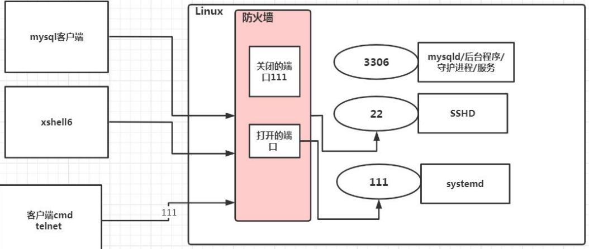

# Linux的应用领域

## 个人桌面领域的应用

此领域是传统linux应用薄弱的环节，近年来随着ubuntu、fedora等优秀桌面环境的兴起。linux在个人桌面领域的占有率在逐渐升高服务器领域

linux在服务器领域的应用是最强的

linux**免费、稳定、高效**等特点在这里得到了很好的体现

尤其是在一些高端领域尤为广泛（c/c++/php/java/python/go）

## 嵌入式领域

linux运行稳定、对网络的良好支持性、低成本，且可以根据需要进行**软件裁剪**，内核最小可以达到几百KB。使其近些年来在嵌入式领域的应用得到非常大的提高

**主要应用：**

机顶盒、数字电视、网络电话、程控交换机、手机、PDA、智能家居、智能硬件等都是其应用领域。

linux在**物联网中的应用会更加广泛**

# Linux目录结构

1. linux的文件系统是采用级层式的树状目录结构，在此结构中的最上层是根目录“/”，然后在此目录下再创建其他的目录
2. 在Linux世界里，**一切皆文件**

## 具体的目录结构

1.  /bin [常用] (/usr/bin 、 /usr/local/bin)是 Binary 的缩写, 这个目录存放着最经常使用的命令  
2.  /sbin (/usr/sbin 、 /usr/local/sbin) s 就是 Super User 的意思，这里存放的是系统管理员使用的系统管理程序
3.  /home [常用] 存放普通用户的主目录，在 Linux 中每个用户都有一个自己的目录，一般该目录名是以用户的账号命名,  
4.  /root [常用] 该目录为系统管理员，也称作超级权限者的用户主目录  
5.  /lib 系统开机所需要最基本的动态连接共享库，其作用类似于 Windows 里的 DLL 文件。几乎所有的应用程序都需要 用到这些共享库
6.  /lost+found 这个目录一般情况下是空的，当系统非法关机后，这里就存放了一些文件    
7.  /etc [常用] 所有的系统管理所需要的配置文件和子目录, 比如安装 mysql 数据库 my.con  
8.  /usr [常用] 这是一个非常重要的目录，用户的很多应用程序和文件都放在这个目录下，类似与 windows 下的 program files 目录  
9.  /boot [常用] 存放的是启动 Linux 时使用的一些核心文件，包括一些连接文件以及镜像文件  
10.  /proc [不能动] 这个目录是一个虚拟的目录，它是系统内存的映射，访问这个目录来获取系统信息  
11.  /srv [不能动] service 缩写，该目录存放一些服务启动之后需要提取的数据  
12.  /sys [不能动]这是 linux2.6 内核的一个很大的变化。该目录下安装了 2.6 内核中新出现的一个文件系统 sysfs =》【别 动】  
13.  /tmp 这个目录是用来存放一些临时文件的  
14.  /dev 类似于 windows 的设备管理器，把所有的硬件用文件的形式存储  
15.  /media [常用] linux 系统会自动识别一些设备，例如 U 盘、光驱等等，当识别后，linux 会把识别的设备挂载到这个 目录下  
16.   /mnt [常用] 系统提供该目录是为了让用户临时挂载别的文件系统的，我们可以将外部的存储挂载在/mnt/上，然后进入该目录就  

# Vi和Vim编辑器

Linux内置了Vi文本编辑器

Vim具有程序编辑的能力，可以看作是Vi的增强版本，可以主动的以字体颜色辨别语法的正确性，方便程序设计，代码补全、编译及错误跳转等方便编程的功能特别丰富，在程序员中被广泛使用

## Vi和Vim常用的三种模式

**正常模式**

  以 vim 打开一个档案就直接进入一般模式了(这是默认的模式)。在这个模式中，你可以使用『上下左右』按键来移动光标，你可以使用『删除字符』或『删除整行』来处理档案内容， 也可以使用『复制、粘贴』来处理你的文件数 据。  

**插入模式**

按i进入插入模式，可以在里面写代码

**命令行模式**

输入esc再输入“：（冒号）”

在这个模式中，可以使用相关的指令，完成存盘、读取、替换、离开vim、显示行号等的动作

## 三种模式的切换


## Vi和Vim快捷键


# 终端指令

## 开机、重启、用户登录注销

### 关机和重启

\1) shutdown –h now 立该进行关机 

\2) shudown -h 1 "hello, 1 分钟后会关机了" 

\3) shutdown –r now 现在重新启动计算机 

\4) halt 关机，作用和上面一样. 

\5) reboot 现在重新启动计算机

\6) sync 把内存的数据同步到磁盘.  

我们需要注意的是！！要记得关机前保存哦，虽然现在关机前会自动保存

### 用户的登录和注销

登录时尽量少用root登录

因为是管理员，为了避免操作失误，可以用普通用户登录，登录后再用`su- 用户名` 命令切换程系统管理员身份

`logout`指令注销用来注销用户

## 用户管理

Linux系统是一个多用户多任务的操作系统，任何一个要使用系统资源的用户，都必须首先向系统管理员申请一个账号，然后以这个账号进入系统

###  添加用户  

```
useradd 用户名
```

默认这个用户的**家目录**在/home/用户名

如果成功创建这个用户，会自动创建这个**家目录**


如果想指定家目录在哪个位置

可以通过`useradd -d 目录`给这个用户指定家目录

### 修改用户密码

```
passwd 用户名
```

给这个用户修改密码

###  删除用户  

```
userdel 用户名
```

这个指令是不会删除这个家目录里面的文件的，只是使这个用户登不上这个账号了而已

### 查询用户信息

```
id 用户名
```

 当用户不存在时，返回无此用户  

### 切换用户

```
su - 切换用户名
```

\1) 从权限高的用户切换到权限低的用户，不需要输入密码，反之需要。 

\2) 当需要返回到原来用户时，使用 `exit`或者`logout`  指令  

###  查看当前用户/登录用户 

```
whoami
```

### 用户组

系统可以对有共性或者权限的多个用户进行统一的管理

#### 新增组

```
groupadd 组名
```

#### 删除组

```
groupdel 组名
```

#### 修改用户的组

```
usermod -g 组名 用户名
```

比如：

把胥天昊放进河南组

usermod -g 河南 胥天昊

## 文件目录类

### pwd指令

```
pwd
```

这个指令可以显示当前工作目录的绝对路径

### ls指令

```
ls [选项] [目录或文件]
```

常用的选项

-a : 显示当前目录所有的文件和目录，包括隐藏的

-l : 以列表的方式显示信息

### cd指令

 基本语法：cd  目录

(功能描述：切换到指定目录)  


cd ~ 或者直接cd ：回到自己的家目录, 比如 你是 root 

cd ~ 到 /root 

cd .. 回到当前目录的上一级目录  

### mkdir指令

```
 mkdir [选项] 目录  
```

 常用选项 -p ：创建多级目录  

 案例 1:创建一个目录 /home/dog 

mkdir /home/dog

 案例 2:创建多级目录 /home/animal/tiger 

mkdir -p /home/animal/tiger  

###  rmdir指令删除空目录 

```
 rmdir [选项]  目录
```

如果不加选项默认删除的是空目录

如果想删除非空目录

可以加上选项-rf


```
redir -rf 目录
```

### touch指令

```
touch 文件名称
```

touch指令用来创建空文件

### cp指令

```
cp [选项] 需要复制的文件地址 复制到的文件地址
```

选项中可以填

-r : 递归复制整个文件夹 

### rm指令

```
rm [选项] 要删除的文件或目录
```

 rm 指令移除文件或目录  

 选项中可以填写

-r ：递归删除整个文件夹 

-f ： 强制删除不提示  

### mv指令

`mv 【旧地址】 【需要改成的新地址】`这个是重命名

`mv [需要移动的地址] [新地址] `移动文件

### cat指令

```
cat [选项] 文件的地址
```

常用选项

-n : 显示行号

cat用来查看文件的内容 注意！只能查看文件的内容,而不能修改文件，为了浏览方便，一般会带上管道命令|more 

比如

`cat -n /etc/profile | more`（分页查看/etc/profile这个文件并且显示行号 ）

### more指令

```
more 文件地址
```

more指令是一个基于Vi编辑器的文本过滤器，可以按页显示文本文件的内容

可以在这个页面里面使用快捷键


### less指令

```
 less 文件地址
```

 less 指令用来分屏查看文件内容，它的功能与 more 指令类似，但是比 more 指令更加强大，支持各种显示终端。less 指令在显示文件内容时，并不是一次将整个文件加载之后才显示，而是根据显示需要加载内容，对于显示大型文件具有较高的效率。  


###  echo 指令  

```
 echo [选项] [输出内容]  
```

echo可以输出内容到控制台

比如


### head指令

```
head 文件
```

查看从头开始10行的内容

也可以

```
head -n 5 文件
```

查看从头开始5行的内容

### tail指令

```
tail 文件名
```

查看文件尾10行的内容（和head原理是一样的）

```
tail -f 文件名
```

实时监控该文档的更新

### >指令和>>指令

 \>输出重定向（覆写） 

 \>>追加  

```
ls -al > 文件名
```

将本列表的内容写入到后面的文件中

```
ls -al >>文件
```

将本列表的内容追加到文件的末尾

```
cat 文件1 > 文件2
```

将文件1的内容覆盖到文件2中

### ln指令

```
ln -s [原文件或者目录] [软连接名]
```

给原文件创建了一个软连接

软连接也叫符号连接，类似于快捷方式


 在/home 目录下创建一个软连接 myroot，连接到 /root 目录 

```
ln -s /root /home/myroot  
```


需要注意的是：

 当我们使用 pwd 指令查看目录时，仍然看到的是软链接所在目录。  

### history指令

```
history
```

查看已经执行过的历史命令，也可以执行历史指令


执行历史编号为5的指令

```
!5
```

## 时间日期类

### date指令-显示当前日期  

\1) date （功能描述：显示当前时间） 

\2) date +%Y（功能描述：显示当前年份） 

\3) date +%m（功能描述：显示当前月份） 

\4) date +%d （功能描述：显示当前是哪一天） 

\5) date "+%Y-%m-%d %H:%M:%S"（功能描述：显示年月日时分秒）  

###  date 指令-设置日期  

```
date -s 字符串里面填写时间
```

可以设置当前的系统时间 

```
date -s "2022-11-14" 
```

###  cal 指令 

```
cal
```

cal指令可以查看日历

默认查看的是当前的日历

也可以显示指定年份的日历

```
cal 2022
```

##  搜索查找类  

### find指令

```
find [搜索范围] [选项]
```


**从指定目录乡下递归的遍历其各个子目录，将满足条件的文件或者目录显示出来**


案例 1: 按文件名：根据名称查找/home 目录下的 hello.txt 文件 

find /home -name hello.txt 

案例 2：按拥有者：查找/opt 目录下，用户名称为 nobody 的文件 

find /opt -user nobody 

案例 3：查找整个 linux 系统下大于 200M 的文件（+n 大于 -n 小于 n 等于, 单位有 k,M,G） 

find / -size +200M  

###  grep 指令和 管道符号 |  

```
 grep [选项]  查找内容 源文件
```

选项：

-n : 显示匹配行和行号

-i : 忽略字母大小写


 grep 过滤查找 ， 管道符，“|”，表示将前一个命令的处理结果输出传递给后面的命令处理。  


**实例：**

 在 hello.txt 文件中，查找 "yes" 所在行，并且显示行号 

写法 1: cat /home/hello.txt | grep "yes" 

写法 2: grep -n "yes" /home/hello.txt  

## 压缩和解压类

### gzig/gunzip指令

```
gzip 文件
```

压缩文件，将文件压缩为*.gz文件

```
gunzip 文件.gz
```

解压缩文件命令


 gzip 用于压缩文件， gunzip 用于解压


### zip/unzip指令

```
zip [选项] 压缩之后的名称 要压缩的内容路径
```

zip用于压缩文件

zip常用选项

-r : 递归压缩 即压缩目录


```
unzip [选项]xxx.zip
```

unzip用于解压缩文件

unzip常用选项

-d<目录> ：指定解压后文件的存放目录

例如：

将/home目录下的所有文件/文件夹压缩为myhome.zip

```
zip -r myhome.zip /home/
```

将myhome.zip 解压到/opt/tmp目录下

```
mkdir /opt/tmp
unzip -d /opt/tmp /home/myhome.zip
```

### tar指令

`  tar [选项] 打包后的名称 打包的内容`(功能描述：打包目录，压缩后的文件格式.tar.gz)  


 案例 1: 

压缩多个文件，将 /home/pig.txt 和 /home/cat.txt 压缩成 pc.tar.gz 

tar -zcvf pc.tar.gz /home/pig.txt /home/cat.txt 

案例 2:

 将/home 的文件夹 压缩成 myhome.tar.gz 

tar -zcvf myhome.tar.gz /home/ 

案例 3: 

将 pc.tar.gz 解压到当前目录 

tar -zxvf pc.tar.gz 

案例4:

将myhome.tar.gz 解压到 /opt/tmp2目录下 

(1) mkdir /opt/tmp2 (2) tar -zxvf /home/myhome.tar.gz -C /opt/tmp  


#  组管理和权限管理  

在linux中的每个用户必须属于一个组，不能独立于组外，在linux中每个文件都有**所有者**、**所在组**、**其他组**的概念

所有者一般是文件的创建者

查看文件的所有者

```
ls -ahl
```

修改文件的所有者

```
chown 用户名 文件名
```

注意需要用root用户修改

## 组的创建

```
groupadd 组名
```


 当某个用户创建了一个文件后，这个文件的所在组就是该用户所在的组(默认)。  

 查看文件/目录所在组  

 `ls - ahl`

##  修改文件/目录所在的组  

```
chgrp 组名 文件名
```

## 其他组

除文件的所有者和所在组的用户外，系统的其他用户都是文件的其他组

## 改变用户所在组

在添加用户时，可以指定将该用户添加到哪个组中，同样的用root的管理权限可以改变某个用户所在的组

### 改变用户所在组

`usermod -g 新组名 用户名`改变用户的组

`usermod -d 目录名 用户名`改变用户登录的初始目录 

！用户需要有进入到新目录的权限

## 权限的基本介绍

ls -l 中显示的内容如下：

```
 -rwxrw-r-- 1 root root 1213 Feb 2 09:39 abc  
```

 0-9 位说明 

第 0 位确定文件类型(d, - , l , c , b)

 l 是链接，相当于 windows 的快捷方式 

d 是目录，相当于 windows 的文件夹 

c 是字符设备文件，鼠标，键盘 b 是块设备，比如硬盘 

第 1-3 位确定所有者（该文件的所有者）拥有该文件的权限。---User 

第 4-6 位确定所属组（同用户组的）拥有该文件的权限，---Group 

第 7-9 位确定其他用户拥有该文件的权限 ---Other  

###  rwx 作用到文件  

\1) [ r ]代表可读(read): 可以读取,查看 

\2) [ w ]代表可写(write): 可以修改,但是不代表可以删除该文件,删除一个文件的前提条件是对该文件所在的目录有写权限，才能删除该文件. 

\3) [ x ]代表可执行(execute):可以被执行  

###  rwx 作用到目录  

\1) [ r ]代表可读(read): 可以读取，ls 查看目录内容 

\2) [ w ]代表可写(write): 可以修改, 对目录内创建+删除+重命名目录 

\3) [ x ]代表可执行(execute):可以进入该目录  

###  文件及目录权限  

 ls -l 中显示的内容如下：  

 -rwxrw-r-- 1 root root 1213 Feb 2 09:39 abc  

 10 个字符确定不同用户能对文件干什么 

第一个字符代表文件类型： - l d c b 

其余字符每 3 个一组(rwx) 读(r) 写(w) 执行(x) 

第一组 rwx : 文件拥有者的权限是读、写和执行 

第二组 rw- : 与文件拥有者同一组的用户的权限是读、写但不能执行 

第三组 r-- : 不与文件拥有者同组的其他用户的权限是读不能写和执行  

 可用数字表示为: r=4,w=2,x=1 因此 rwx=4+2+1=7 , 数字可以进行组合  

后面的

 1 文件：硬连接数或目录：子目录数 

root 用户 

root 组  

1213 文件大小(字节)，如果是文件夹，显示 4096 字节 

Feb 2 09:39 最后修改日期 

abc 文件名 

##  修改权限-chmod  

 通过 chmod 指令，可以修改文件或者目录的权限。  

###  + 、-、= 变更权限  

 u:所有者 g:所有组 o:其他人 a:所有人(u、g、o 的总和) 

\1) chmod u=rwx,g=rx,o=x 文件/目录名 

\2) chmod o+w 文件/目录名 

\3) chmod a-x 文件/目录名  


 案例演示 

\1) 给 abc 文件 的所有者读写执行的权限，给所在组读执行权限，给其它组读执行权限。 

chmod u=rwx,g=rx,o=rx abc 

\2) 给 abc 文件的所有者除去执行的权限，增加组写的权限 

chmod u-x,g+w abc 

\3) 给 abc 文件的所有用户添加读的权限 

chmod a+r abc  

### 通过数字变更权限  

 r=4 w=2 x=1 rwx=4+2+1=7

chmod u=rwx,g=rx,o=x 文件目录名 

相当于 

chmod 751 文件/目录 

## 修改文件所有者或者组

` chown [选项] newowner 文件/目录 `改变所有者 

`chown [选项] newowner:newgroup` 文件/目录 改变所有者和所在组 

常用的选项：

-R 如果是目录 则使其下所有子文件或目录递归生效  

## 修改文件/目录所在组

```
 chgrp 新组名 文件/目录 
```

改变所在组


# 定时任务调度

## crond任务调度

crontab 进行 定时任务的设置

任务调度：是指系统再某个时间执行的特定的命令或程序

任务调度分类：

系统工作：有些重要的任务必须周而复始的执行，比如病毒扫描

个别任务工作：个别用户可能希望执行某些程序，比如对mysql数据库的备份 

语法！！：

```
contab [选项]
```

contab可以定时调用**脚本**或者**简单的任务**，比如一条指令

常用选项：

-e : 编辑contab 定时任务

-l : 查询crontab任务
-r : 删除当前用户所有的crontab任务

设置crond任务步骤

1.设置任务调度文件 /etc/crontab

2.设置个人任务调度 ：执行crontab -e 命令

3.输入任务到调度文件

任务是下面这个格式


对于上面第一个方框中的占位符


特殊符号的说明


 特殊时间执行案例  


## at定时任务

1. at命令是一次性定时计划任务,at的守护进程atd会以后台模式运行，检查作业队列来运行
2. 默认情况下， atd 守护进程每 60 秒检查作业队列，有作业时，会检查作业运行时间，如果时间与当前时间匹配，则运行此作业。
3. at 命令是一次性定时计划任务，执行完一个任务后不再执行此任务了 
4.  在使用 at 命令的时候，一定要保证 atd 进程的启动 , 可以使用相关指令来查看  

` ps -ef | grep atd ` 这个指令可以检测atd是否再运行 

### at命令格式

```
at [选项][时间] 
```

输入这个后会显示一个页面，之后需要写需要定时操作的命令，写完可以使用两次ctrl+d结束at命令的输入

常用选项：


 时间的格式：

1.  接受在当天的 hh:mm（小时:分钟）式的时间指定。假如该时间已过去，那么就放在第二天执行。 例如：04:00  
2.  使用 midnight（深夜），noon（中午），teatime（饮茶时间，一般是下午 4 点）等比较模糊的词语来指定时间。  
3.  采用 12 小时计时制，即在时间后面加上 AM（上午）或 PM（下午）来说明是上午还是下午。 例如：12pm 
4.   指定命令执行的具体日期，指定格式为 month day（月 日）或 mm/dd/yy（月/日/年）或 dd.mm.yy（日.月.年），指 定的日期必须跟在指定时间的后面。 例如：04:00 2021-03-1  
5.  使用相对计时法。指定格式为：now + count time-units ，now 就是当前时间，time-units 是时间单位，这里能够是 minutes （分钟）、hours（小时）、days（天）、weeks（星期）。count 是时间的数量，几天，几小时。 例如：now + 5 minutes  
6.  直接使用 today（今天）、tomorrow（明天）来指定完成命令的时间。  


# 磁盘分区、挂载

## 分区原理

1. Linux无论有几个分区，分给哪一目录使用，它归根到底就只有一个根目录，一个独立且唯一的文件结构，Linux中每个分区都是用来组成文件系统的一部分
2. Linux采用了一种叫“载入”的处理方法，它的整个文件系统包含了一整套的文件和目录，且将一个分区和一个目录联系起来，这时要载入的一个分区将使它的存储空间在一个目录下获得（目录下的文件存储的位置其实还是在磁盘上面）
3. 


## Linux中的硬盘类型

1.  Linux 硬盘分 IDE 硬盘和 SCSI 硬盘，目前基本上是 SCSI 硬盘  
2.  对于 IDE 硬盘，驱动器标识符为“hdx~”,其中“hd”表明分区所在设备的类型，这里是指 IDE 硬盘了。“x”为盘号（a 为 基本盘，b 为基本从属盘，c 为辅助主盘，d 为辅助从属盘）,“~”代表分区，前四个分区用数字 1 到 4 表示，它们是主分区或扩展分区，从 5 开始就是逻辑分区。例，hda3 表示为第一个 IDE 硬盘上的第三个主分区或扩展分区,hdb2 表示为第二个 IDE 硬盘上的第二个主分区或扩展分区。  
3.  对于 SCSI 硬盘则标识为“sdx~”，SCSI 硬盘是用“sd”来表示分区所在设备的类型的，其余则和 IDE 硬盘的表示方法 一样  

 

##  查看所有设备挂载情况  

命令：lsblk 或者 lsblk -f

**使用lsblk**


 **lsblk -f**


##  增加一块硬盘到虚拟机（模拟分区）  

\1) 虚拟机添加硬盘 

\2) 分区 

\3) 格式化 

\4) 挂载 

\5) 设置可以自动挂载  

### 增加硬盘

1.

 在【虚拟机】菜单中，选择【设置】，然后设备列表里添加硬盘，然后一路【下一步】，中间只有选择磁盘大小的地方 需要修改，至到完成。然后重启系统（才能识别）！  


2.

 分区命令 

`fdisk /dev/sdb` 开始对/sdb 分区  

 m 显示命令列表 

p 显示磁盘分区 同 fdisk –l 

n 新增分区 

d 删除分区 

w 写入并退出  

 开始分区后输入 n，新增分区，然后选择 p ，分区类型为主分区。两次回车默认剩余全部空间。最后输入 w 写入分区并退出，若不保存退出输入 q。  


3.

 格式化磁盘  

 分区命令:mkfs -t ext4 /dev/sdb1 

其中 ext4 是分区类  

4.

 挂载: 将一个分区与一个目录联系起来

mount 设备名称 挂载目录  

 例如： mount /dev/sdb1 /newdisk  

取消挂载是 umount 挂载目录

 用命令行挂载,重启后会失效  ，所以我们可以使用永久挂载

5.

永久挂载可以通过修改etc/fstab实现挂载

（通过vim进去修改原文件，格式按照里面相应的格式改就行）

添加完成后 执行mount -a 生效

## 磁盘情况查询

### 查询系统所有磁盘使用情况

```
df -h
```


### 查询指定目录的磁盘使用情况

```
du [选项]
```

常用的选项

-s 指定目录占用大小汇总

-h 带计量单位

-a 含文件

--max-depth=1 子目录深度

-c 列出明细的同时，增加汇总值

比如

 查询 /opt 目录的磁盘占用情况，深度为 1  


## 统计磁盘情况的指令

 \1) 统计/opt 文件夹下文件的个数 

```
ls -l /opt | grep "^-" | wc -l 
```

\2) 统计/opt 文件夹下目录的个数 

```
ls -l /opt | grep "^d" | wc -l 
```

\3) 统计/opt 文件夹下文件的个数，包括子文件夹里的 

```
 ls -lR /opt | grep "^-" | wc -l 
```

\4) 统计/opt 文件夹下目录的个数，包括子文件夹里的 

```
ls -lR /opt | grep "^d" | wc -l 
```

\5) 以树状显示目录结构 tree 目录  

```
tree 目录名
```

# 进程管理

1. 在Linux中，每个执行的程序都称为一个进程，每一个进程都分配一个ID号（pid,进程号）
2. 每个进程都可能以两种方式存在的，前台与后台，所谓前台进程就是用户目前的屏幕上可以进行操作的进程，后台进程则是实际在操作，但是屏幕上无法看到的进程，通常使用后台方式执行
3. 一般系统的服务都是以后台进程的方式存在，而且都会常驻在系统中，直到关机才结束
4. 

## 显示系统执行的进程

```
ps -aux|grep xx
```

 ps 命令是用来查看目前系统中，有哪些正在执行，以及它们执行的状况。可以不加任何参数.  


参数的具体介绍

 System V 展示风格

 USER：用户名称

 PID：进程号

 %CPU：进程占用 CPU 的百分比

 %MEM：进程占用物理内存的百分比

 VSZ：进程占用的虚拟内存大小（单位：KB）

 RSS：进程占用的物理内存大小（单位：KB）

 TT：终端名称,缩写 .  STAT：进程状态，其中 S-睡眠，s-表示该进程是会话的先导进程，N-表示进程拥有比普通优先级更低的优先级，R- 正在运行，D-短期等待，Z-僵死进程，T-被跟踪或者被停止等等

 STARTED：进程的启动时间

 TIME：CPU 时间，即进程使用 CPU 的总时间

 COMMAND：启动进程所用的命令和参数，如果过长会被截断显示

```
ps -ef
```

 ps -ef 是以全格式显示当前所有的进程  


 -e 显示所有进程。-f 全格式

 并且可以筛选`ps -ef|grep sshd `

 参数说明：

 UID：用户 ID 

PID：进程 ID 

PPID：父进程 ID    

C：CPU 用于计算执行优先级的因子。数值越大，表明进程是 CPU 密集型运算，执行优先级会降低；数值越小，表 明进程是 I/O 密集型运算，执行优先级会提高 

STIME：进程启动的时间 

TTY：完整的终端名称 

TIME：CPU 时间 

CMD：启动进程所用的命令和参数  

## 终止进程

```
kill [选项] 进程号
```

通过进程号终止进程

```
killall 进程名称
```

通过进程名终止进程，支持通配符


常用选项

-9 ：强迫进程强制停止


若是某个进程执行一半需要停止时，或是已消耗了很大的系统资源时，此时可以考虑停止该进程。使用 kill 命令来完成此项任务  


示例：

强制杀掉一个终端：

```
kill -9 bash 对应的进程号
```

## 查看进程树

```
pstree [选项] 
```

可以更加直观的来看进程信息

常用选项

-p : 显示进程的pid

-u ：显示进程的所属用户

## 服务管理（service）

服务（service）本质就是进程，但是是运行在后台的，通常都会监听某个端口，等待其它程序的请求，比如（mysqld，sshd，防火墙），因此我们又称为守护进程

### service管理指令

```
service 服务名 [start|stop|restart|reload|status]
```

现在我们基本不用这个了 用**systemctl**

 service 指令管理的服务在 /etc/init.d 查看  


## systemctl设置服务的自启动状态

·`systemctl list-unit-files [|grep 服务名]`

查看服务开机启动状态，grep可以进行过滤

```
systemctl enable 服务名
```

设置服务开机启动

```
systemctl disable 服务名
```

关闭服务开机启动

```
systemctl is-enabled 服务名
```

查询某个服务是否是自启动的


## 打开或者关闭指定的端口

 在真正的生产环境，往往需要将防火墙打开，但问题来了，如果我们把防火墙关闭，那么外部请求数据包就不能跟 服务器监听端口通讯。这时，需要打开指定的端口。  




###  firewall 指令  

```
 firewall-cmd --permanent --add-port=端口号/协议  
```

打开端口


```
 firewall-cmd --permanent --remove-port=端口号/协议  
```

关闭端口


```
 firewall-cmd --reload  
```

重新载入（使用前面两个指令使用这个指令后才能生效）


```
 firewall-cmd --query-port=端口/协议  
```

查询端口是否开放

## 动态监控进程

```
top [选项]
```

top 指令与ps指令很相似，他们都用来显示正在执行的进程 top与ps最大的不同之处在于，**top可以实时更新**

**常用选项**


在进入top页面中可以进行交互操作


## 监控网络状态

查看网络状况

```
netstat [选项]
```

常用选项

-an 按一定顺序排列输出

-p 显示那个进程在调用


这个指令也可以筛选

比如

 请查看服务名为 sshd 的服务的信息。 netstat  

# RPM与YUM

 rpm 用于互联网下载包的打包及安装工具，它包含在某些 Linux 分发版中。它生成具有.RPM 扩展名的文件。RPM 是 RedHat Package Manager（RedHat 软件包管理工具）的缩写，类似 windows 的 setup.exe，这一文件格式名称虽然打上 了 RedHat 的标志，但理念是通用的。

 Linux 的分发版本都有采用（suse,redhat, centos 等等），可以算是公认的行业标准了。 

##   rpm 包的简单查询指令  

 查询已安装的 rpm 列表 rpm –qa|grep xx 

举例： 看看当前系统，是否安装了 firefox 

指令: rpm -qa |  greo firefox

##  rpm 包名基本格式  

 一个 rpm 包名：firefox-60.2.2-1.el7.centos.x86_64 

名称:firefox 

版本号：60.2.2-1 

适用操作系统: el7.centos.x86_64 表示 centos7.x 的 64 位系统 如果是 i686、i386 表示 32 位系统，noarch 表示通用  

##  rpm 包的其它查询指令

rpm -qa :查询所安装的所有rpm 软件包 

rpm -qa | more 

也可以进行筛选rpm -qa | grep X     比如 rpm -qa | grep firefox

 rpm -q 软件包名 :查询软件包是否安装 

案例：rpm -q firefox 

rpm -qi 软件包名 ：查询软件包信息 

案例: rpm -qi firefox rpm -ql 软件包名 :查询软件包中的文件 

比如： rpm -ql firefox 

rpm -qf 文件全路径名 查询文件所属的软件包 

rpm -qf /etc/passwd 

rpm -qf /root/install.log  

## 卸载rpm包

```
rpm -e RPM包的名称
```

比如删除火狐

```
rpm -e firefox
```

## 安装rpm包

```
rpm -ivh RPM包全路径名称
```

 参数说明

i=install 安装 

v=verbose 提示 

h=hash 进度条  

## yum

 Yum 是一个 Shell 前端软件包管理器。基于 RPM 包管理，能够从指定的服务器自动 下载 RPM 包并且安装，可以自动处理依赖性关系，并且一次安装所有依赖的软件包。 

### yum基本指令  

```
yum list|grep xx软件列表
```

查询yum服务器是否有需要安装的软件

```
yum install xxx
```

下载安装指定的yum包

yum举例：

 使用 yum 的方式来安装 firefox  

rpm -e firefox （卸载火狐）

yum list | grep firefox （从yum中搜索火狐）

yum install firefox （下载火狐）

#  Shell 编程  

Linux运维工程师在进行服务器集群管理时，需要编写shell程序来进行服务器管理

shell是一个命令行解释器，它为用户提供了一个向Linux内核发送请求以便运行程序的界面系统级程序，用户可以用shell来启动、挂起、停止甚至是编写一些程序

## shell脚本的执行方式

1. 脚本以#!/bin/bash开头
2. 脚本需要有可执行权限
3. 脚本名称最好以.sh结尾

## 编写Shell脚本

创建一个Shell脚本，输出hello world

1. 在命令行中输入vim hello,sh （创建了一个hello.sh的文件）

里面的内容写

\#!/bin/bash

echo "hello,world"

## 脚本的常用执行方式

### 方式1

输入脚本的绝对路径或者相对路径

（这个方法首先要赋予这个脚本x权限也就是可执行权限）

比如

./hello.sh

或者使用绝对路径

/root/shcode/hello.sh

### 方式2 

sh+脚本文件名

(这个方法不用赋予脚本可执行权限，可以直接用这个指令执行哦)

比如

sh hello.sh 这个也可以使用绝对路径哦

## Shell的变量 

Linux Shell中的变量分为

系统变量和用户自定义变量

**系统变量：**

$HOME $PWD  $SHELL $USER

使用echo $HOME可以使用

## Shell变量的定义

定义变量：变量名=值

撤销变量：unset 变量

声明静态变量：readonly 变量（这个变量之后就不能撤销了）

```shell
#!/bin/bash
#案例 1：定义变量 A
A=100
#输出变量需要加上$
echo A=$A
echo "A=$A" 
#案例 2：撤销变量 A
unset A
echo "A=$A" 
#案例 3：声明静态的变量 B=2，不能 unset readonly B=2
echo "B=$B" #unset B
#将指令返回的结果赋给变量
:<<!
C=`date` D=$(date) echo "C=$C" echo "D=$D"
!
#使用环境变量 TOMCAT_HOME
echo "tomcat_home=$TOMCAT_HOME"
```

### 定义变量的规则

变量名称可以由字母、数字、下划线组成，但是不能以数字开头

等号两侧不能有空格

变量名称一般习惯大写，这个是规范！

我们还可以将命令的返回值赋给变量

比如date指令返回当前时间

A=`date`反引号，把结果赋值给A

A=$(date)等价于反引号上面那个

## 设置环境变量

\1) export 变量名=变量值 （功能描述：将 shell 变量输出为环境变量/全局变量） (这个是在/etc/profile配置文件中输入的语句)(变量值可以是一个值也可以是一个可执行程序)

\2) source 配置文件 （功能描述：让修改后的配置信息立即生效） 

\3) echo $变量名 （功能描述：查询环境变量的值）  

## 位置参数变量（命令行参数）

 当我们执行一个 shell 脚本时，如果希望获取到命令行的参数信息，就可以使用到位置参数变量 

比如 ： ./myshell.sh 100 200 , 这个就是一个执行 shell 的命令行，可以在 myshell 脚本中获取到参数信息  

**语法：**  

 $n （功能描述：n 为数字，$0 代表命令本身，$1-$9 代表第一到第九个参数，十以上的参数，十以上的参数需要用 大括号包含，如${10}） 

$* （功能描述：这个变量代表命令行中所有的参数，$*把所有的参数看成一个整体） 

$@（功能描述：这个变量也代表命令行中所有的参数，不过$@把每个参数区分对待） 

$#（功能描述：这个变量代表命令行中所有参数的个数）  

## 预定义变量

预定义变量是Shell设计者事先就已经定义好的变量，可以直接在shell脚本中使用

**语法：**

 \1) $$ （功能描述：当前进程的进程号（PID）） 

\2) $! （功能描述：后台运行的最后一个进程的进程号（PID）） 

\3) $？（功能描述：最后一次执行的命令的返回状态。如果这个变量的值为 0，证明上一个命令正确执行；如果这个变 量的值为非 0（具体是哪个数，由命令自己来决定），则证明上一个命令执行不正确了。）  

```shell
#!/bin/bash
echo "当前执行的进程 id=$$" #以后台的方式运行一个脚本，并获取他的进程号
/root/shcode/myshell.sh &
echo "最后一个后台方式运行的进程 id=$!" echo "执行的结果是=$?"
```

## 运算符

\1) “$((运算式))”或“$[运算式]”或者 expr m + n //expression 表达式

\2) 注意 expr 运算符间要有空格, 如果希望将 expr 的结果赋给某个变量，使用 `` 

\3) expr m - n

\4) expr \*, /, % 乘，除，取余

## 条件判断

判断语句

```
[ 条件 ]
```

非空返回true

```shell
常用判断条件
1) = 字符串比较
2) 两个整数的比较
  -lt 小于
  -le 小于等于 little equal -eq 等于
  -gt 大于
  -ge 大于等于
  -ne 不等于
3) 按照文件权限进行判断
  -r 有读的权限
  -w 有写的权限
  -x 有执行的权限
4) 按照文件类型进行判断
  -f 文件存在并且是一个常规的文件
  -e 文件存在
  -d 文件存在并是一个目
```


### 流程控制

####  if 判断  

if [ 条件判断式 ]

then

代码

elif [ 条件判断式 ]

then

代码

fi


！！！ [ 条件判断式 ]，中括号和条件判断式之间必须有空格  

#### case 语句

case $变量名 in

"值1"

 如果变量的值等于值 1，则执行程序 1 

;;

"值 2"）

如果变量的值等于值 2，则执行程序 2 

;;  

 *） 

如果变量的值都不是以上的值，则执行此程序 

;;

esac

#### for循环

**语法1**

for 变量 in 值 1 值 2 值 3… 

do

程序/代码 

done  

**语法2**   

 for (( 初始值;循环控制条件;变量变化 ))  

 do

程序/代码 

done  


#### while循环

 while [ 条件判断式 ]  

 do

程序 /代码 

done 


注意：while 和 [有空格，条件判断式和 [也有空格  

```shell
#!/bin/bash
#案例 1 ：从命令行输入一个数 n，统计从 1+..+ n 的值是多少？
SUM=0
i=0 while [ $i -le $1 ]
do SUM=$[$SUM+$i]
#i 自增
i=$[$i+1]
done
echo "执行结果=$SUM"
```

#### read 读取控制台输入

read(选项)(参数)

选项： 

-p：指定读取值时的提示符； 

-t：指定读取值时等待的时间（秒），如果没有在指定的时间内输入，就不再等待了。。 

参数 

变量：指定读取值的变量名  

```shell
#!/bin/bash
#案例 1：读取控制台输入一个 NUM1 值
read -p "请输入一个数 NUM1=" NUM1
echo "你输入的 NUM1=$NUM1" 
#案例 2：读取控制台输入一个 NUM2 值，在 10 秒内输入。
read -t 10 -p "请输入一个数 NUM2=" NUM2
echo "你输入的 NUM2=$NUM2"
```

#### 函数

shell和其他编程语言一样有系统函数和自定义函数

**系统函数：**

basename 基本语法

功能：返回完整路径最后 / 的部分，常用于获取文件名

basename [pathname] [suffix]

basename [string] [suffix] （功能描述：basename 命令会删掉所有的前缀包括最后一个（‘/’）字符，然后将字符串

显示出来。

选项：

suffix 为后缀，如果 suffix 被指定了，basename 会将 pathname 或 string 中的 suffix 去掉。


请返回 /home/aaa/test.txt 的 "test.txt" 部分

```
basename /home/aaa/test.txt
```


dirname 基本语法

功能：返回完整路径最后 / 的前面的部分，常用于返回路径部分

dirname 文件绝对路径 （功能描述：从给定的包含绝对路径的文件名中去除文件名（非目录的部分），然后返回剩下的路径（目录的部分））

请返回 /home/aaa/test.txt 的 /home/aaa 

dirname /home/aaa/test.txt

#### 自定义函数

[ function ] funname[()]

{

Action;

[return int;]

}

调用直接写函数名：funname [值]

```shell
#!/bin/bash
#案例 1：计算输入两个参数的和(动态的获取)， getSum
#定义函数 getSum
function getSum() {
SUM=$[$n1+$n2] echo "和是=$SUM" }
#输入两个值
read -p "请输入一个数 n1=" n1
read -p "请输入一个数 n2=" n2
#调用自定义函数
getSum $n1 $n2
```

#### Shell 编程综合案例   

```shell
1) 每天凌晨 2:30 备份 数据库 hspedu 到 /data/backup/db
2) 备份开始和备份结束能够给出相应的提示信息
3) 备份后的文件要求以备份时间为文件名，并打包成 .tar.gz 的形式，
比如：2021-03-12_230201.tar.gz 
4) 在备份的同时，检查是否有 10 天前备份的数据库文件，如果有就将其删除

#备份目录
BACKUP=/data/backup/db
#当前时间
DATETIME=$(date +%Y-%m-%d_%H%M%S) echo $DATETIME
#数据库的地址
HOST=localhost
#数据库用户名
DB_USER=root
#数据库密码
DB_PW=hspedu100
#备份的数据库名
DATABASE=hspedu
#创建备份目录, 如果不存在，就创建
[ ! -d "${BACKUP}/${DATETIME}" ] && mkdir -p "${BACKUP}/${DATETIME}"
#备份数据库
mysqldump -u${DB_USER} -p${DB_PW} --host=${HOST} -q -R --databases ${DATABASE} | gzip >
${BACKUP}/${DATETIME}/$DATETIME.sql.gz #将文件处理成 tar.gz
cd ${BACKUP}
tar -zcvf $DATETIME.tar.gz ${DATETIME}
#删除对应的备份目录
rm -rf ${BACKUP}/${DATETIME}
#删除 10 天前的备份文件
find ${BACKUP} -atime +10 -name "*.tar.gz" -exec rm -rf {} \; echo "备份数据库${DATABASE} 成功~"
#备份数据库
mysqldump -u${DB_USER} -p${DB_PW} --host=${HOST} -q -R --databases ${DATABASE} | gzip >
${BACKUP}/${DATETIME}/$DATETIME.sql.gz #将文件处理成 tar.gz
cd ${BACKUP}
tar -zcvf $DATETIME.tar.gz ${DATETIME}
#删除对应的备份目录
rm -rf ${BACKUP}/${DATETIME}
#删除 10 天前的备份文件
find ${BACKUP} -atime +10 -name "*.tar.gz" -exec rm -rf {} \; 
echo "备份数据库${DATABASE} 成功~"
```

# 日志管理

日志文件是重要的系统信息文件，其中记录了许多重要的系统事件，包括用户的登录信息、系统的启动信息、系统的安全信息、邮件相关信息、各种服务相关信息等

日志对于安全来说也很重要，他记录了系统每天发生的各种事情，通过日志来检查错误发生的原因，或者受到攻击时攻击者留下的痕迹

日志是用来记录重大事件的工具

## 系统常用的日志

`/var/log/`目录就是系统日志文件的保存位置


##  日志管理服务 rsyslogd  

 CentOS7.6 日志服务是 rsyslogd ， CentOS6.x 日志服务是 syslogd 。rsyslogd 功能更强大。rsyslogd 的使用、日志 文件的格式，和 syslogd 服务兼容的。  


查询Linux中的rsyslogd服务是否启动

```
ps aux|grep "rsylogd" |grep resyslog
```

 查询 rsyslogd 服务的自启动状态  

```
  systemctl list-unit-files | grep rsyslog  
```

 配置文件：/etc/rsyslog.conf  

 编辑文件时的格式为： *.*  

 其中第一个*代表日志类型，第二个*代表日志级别  

```shell
1) 日志类型分为：
  auth ##pam 产生的日志
  authpriv ##ssh、ftp 等登录信息的验证信息
  corn ##时间任务相关
  kern ##内核
  lpr ##打印
  mail ##邮件
  mark(syslog)-rsyslog##服务内部的信息，时间标识
  news ##新闻组
  user ##用户程序产生的相关信息
  uucp ##unix to nuix copy 主机之间相关的通信
  local 1-7 ##自定义的日志设备
2) 日志级别分为：
  debug ##有调试信息的，日志通信最多
  info ##一般信息日志，最常用
  notice ##最具有重要性的普通条件的信息
  warning ##警告级别
  err ##错误级别，阻止某个功能或者模块不能正常工作的信息
  crit ##严重级别，阻止整个系统或者整个软件不能正常工作的信息
  alert ##需要立刻修改的信息
  emerg ##内核崩溃等重要信息
  none ##什么都不记录
    注意：从上到下，级别从低到高，记录信息越来越少
```

 由日志服务 rsyslogd 记录的日志文件，日志文件的格式包含以下 4 列：

\1) 事件产生的时间

\2) 产生事件的服务器的主机名

\3) 产生事件的服务名或程序名

\4) 事件的具体信息

## 日志论题

日志轮替就是把旧的日志文件移动并改名，同时建立新的空日志文件，当旧日志文件超出保存的范围之后，就会进行删除

###  日志轮替文件命名  

 \1) centos7 使用 logrotate 进行日志轮替管理，要想改变日志轮替文件名字，通过 /etc/logrotate.conf 配置文件中“dateext” 参数：  

 \2) 如果配置文件中有“dateext”参数，那么日志会用日期来作为日志文件的后缀，例如 “secure-20201010”。这样日 志文件名不会重叠，也就不需要日志文件的改名， 只需要指定保存日志个数，删除多余的日志文件即可。 

\3) 如果配置文件中没有“dateext”参数，日志文件就需要进行改名了。当第一次进行日志轮替时，当前的“secure”日 志会自动改名为“secure.1”，然后新建“secure”日志， 用来保存新的日志。当第二次进行日志轮替时，“secure.1” 会自动改名为“secure.2”， 当前的“secure”日志会自动改名为“secure.1”，然后也会新建“secure”日志，用来 保存新的日志，以此类推。  

# 运行级别


 运行级别说明： 

0 ：关机 

1 ：单用户【找回丢失密码】 

2：多用户状态没有网络服务 

3：多用户状态有网络服务 

4：系统未使用保留给用户 

5：图形界面 

6：系统重启 

常用运行级别是 3 和 5 ，

还可以指定默认运行级别

```shell
#!/bin/sh
#项目的git地址
git_path="https://gitee.com/xu_tian_hao1/ruiji-takeout-project.git"
#本地代码位置代码路径
code_path="/usr/local/app"
#项目名称
projectName="reggie_take_out"
env="master"
#如果项目文件夹不存在说明没有下载过改项目代码，需要检出该项目
if [ ! -d ${code_path}/${projectName} ];
  then
echo ${projectName}"不存在,检出该项目"
cd $code_path
git clone "仓库地址"
  else
echo ${projectName}"项目存在，更新代码"
cd ${code_path}/${projectName}
git reset --hard
git pull
fi
#删除项目
echo "删除项目下target"
rm -rf "${code_path}/${projectName}/${projectName}/target"
#maven 再打项目包
echo "maven打包${projectName}"
cd ${code_path}/${projectName}
mvn install -Dmaven.test.skip=true -Denv=$env -U
#如果打包出错直接退出
if [ $? -ne 0 ]; then
      exit 1
fi
#关闭jar服务
echo "关闭jar服务"
#查询jar包服务进程ID，并杀掉该进程
pidList=$(ps aux | grep $projectName | grep -v grep | awk '{print $2}')
for pid in $pidList
do
kill -9 $pid
echo 'kill pid '$pid
done

echo "删除${projectName}.jar和${projectName}.log文件"
cd ${code_path}
rm -rf "${projectName}.jar"
rm -rf "${projectName}.log"
echo "复制打包的jar包到/home下"
cp "${code_path}/${projectName}/target/${projectName}.jar" ${code_path}
#启动jar包
echo "加载指定配置,运行jar包"
#加载外部配置文件也可以使用这种:java -jar xxx.jar --spring.config.location="路径+文件名"
nohup java -jar -Dspring.config.location="application.properties" ${code_path}/${projectName}.jar > ${code_path}/${projectName}.log 2>&1 &
echo "查看启动日志"
tail -f ${code_path}/${projectName}.log
```
