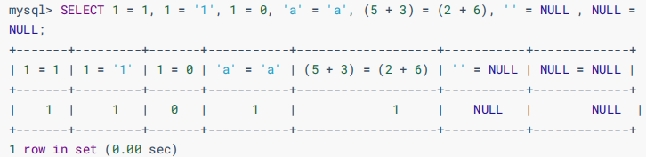
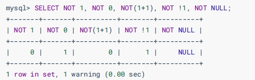
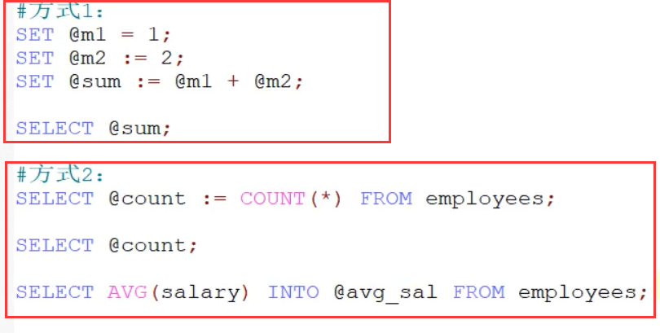

# sql、DB、DBMS之间的关系

| DB:                                                      | DBMS:                                                        | SQL:                                                         |
| -------------------------------------------------------- | ------------------------------------------------------------ | ------------------------------------------------------------ |
| DataBase（数据库，数据库实际上在硬盘上以文件的形式存在） | DataBase Management System（数据库管理系统，常见的有：MySQL Oracle DB2 Sybase SqlServer...） | 结构化查询语言，是一门标准通用的语言。标准的sql适合于所有的数据库产品。<br/>	SQL属于高级语言。只要能看懂英语单词的，写出来的sql语句，可以读懂什么意思。<br/>	SQL语句在执行的时候，实际上内部也会先进行编译，然后再执行sql。（sql语句的编译由DBMS完成。） |

DBMS负责执行sql语句，通过执行sql语句来操作DB当中的数据。
DBMS -(执行)-> SQL -(操作)-> DB

# 表

**表：table**

表：table是数据库的基本组成单元，所有的数据都以表格的形式组织，目的是可读性强。

一个表包括行和列：
	行：被称为数据/记录(data)
	列：被称为字段(column)

	学号(int)	   姓名(varchar)	  年龄(int)
	------------------------------------
	110			张三				20
	120			李四				21

每一个字段应该包括哪些属性？
字段名、数据类型、相关的约束。

# SQL语句的分类

DQL（数据查询语言）: 查询语句，凡是select语句都是DQL。
DML（数据操作语言）：insert delete update，对**表当中的数据**进行增删改。
DDL（数据定义语言）：create drop alter，对**表结构**的增删改。
TCL（事务控制语言）：commit提交事务，rollback回滚事务。(TCL中的T是Transaction)
DCL（数据控制语言）: grant授权、revoke撤销权限等。

# 导入数据

	第一步：登录mysql数据库管理系统
		dos命令窗口：
			mysql -uroot -p333
	第二步：查看有哪些数据库
		show databases; (这个不是SQL语句，属于MySQL的命令。)
	第三步：创建属于我们自己的数据库
	    create database bjpowernode; (这个不是SQL语句，属于MySQL的命令。)
	第四步：使用bjpowernode数据
	    use bjpowernode; (这个不是SQL语句，属于MySQL的命令。)
	第五步：查看当前使用的数据库中有哪些表？
	    show tables; (这个不是SQL语句，属于MySQL的命令。)
	第六步：初始化数据（导入外部数据）
	    mysql> source D:\course\05-MySQL\resources\bjpowernode.sql（这个是外部数据的地址）

# sql脚本

bjpowernode.sql，这个文件以sql结尾，这样的文件被称为“sql脚本”。什么是sql脚本呢？

​	当一个文件的扩展名是.sql，并且该文件中编写了大量的sql语句，我们称这样的文件为sql脚本。
​	注意：直接使用source命令可以执行sql脚本。

**格式**

**mysql>source (sql脚本的绝对路径)**

​	sql脚本中的数据量太大的时候，无法打开，请使用source命令完成初始化。

# 删除数据库

drop database 数据库名;

# 查看表结构

desc 表名;

# 常用命令

 select database(); 查看当前使用的是哪个数据库

select version(); 查看mysql的版本号。

\c   命令，结束一条语句。

exit 命令，退出mysql。

# 简单的查询语句（DQL）

语法格式：
	select 字段名1,字段名2,字段名3,.... from 表名;

提示：
	1、任何一条sql语句以“;”结尾。
	2、sql语句不区分大小写。
	

**查询员工的年薪？**（字段可以参与数学运算。）
select ename,sal * 12 from emp;

 **给查询结果的列 重命名？**
    select ename,sal * 12 as yearsal from emp;
**别名中有中文，但是需要单引号括起来，（实测不用单引号仍然可以使用）**
	select ename,sal * 12 as 年薪 from emp; // 错误
	select ename,sal * 12 as '年薪' from emp;
	注意：标准sql语句中要求字符串使用单引号括起来。虽然mysql支持双引号，尽量别用。	
**as关键字可以省略**（可以 加一个空格）
	mysql> select empno,ename,sal * 12 yearsal from emp;

**查询所有字段？**
	select * from emp; // 实际开发中不建议使用*，效率较低。


SELECT 查询还可以对常数进行查询。

对的，就是在 SELECT 查询结果中增加一列固定的常数列。这列的 取值是我们指定的，而不是从数据表中动态取出的。 

你可能会问为什么我们还要对常数进行查询呢？

SQL 中的 SELECT 语法的确提供了这个功能，一般来说我们只从一个表中查询数据，通常不需要增加一个 固定的常数列，但如果我们想整合不同的数据源，用常数列作为这个表的标记，就需要查询常数。 

比如说，我们想对 employees 数据表中的员工姓名进行查询，同时增加一列字段 corporation ，这个 字段固定值为“尚硅谷”，可以这样写：


# 条件查询

​	语法格式：
​		select 
​			字段,字段...
​		from
​			表名
​		where
​			条件;

执行顺序：先from，然后where，最后select

## 等于=

查询工资等于5000的员工姓名？
		select ename from emp where sal = 5000;

查询SMITH的工资？
		select sal from emp where ename = 'SMITH'; // 字符串使用单引号括起来。

找出工资高于3000的员工？
		select ename,sal from emp where sal > 3000;

****

等号运算符（=）判断等号两边的值、字符串或表达式是否相等，如果相等则返回1，不相等则返回0。

在使用等号运算符时，遵循如下规则：

- 如果等号两边的值、字符串或表达式都为字符串，则MySQL会按照字符串进行比较，其比较的是每个字符串中字符的ANSI编码是否相等。
- 如果等号两边的值都是整数，则MySQL会按照整数来比较两个值的大小。
- 如果等号两边的值一个是整数，另一个是字符串，则MySQL会将字符串转化为数字进行比较。
- 如果等号两边的值、字符串或表达式中有一个为NULL，则比较结果为NULL。

对比：SQL中赋值符号使用 := 




\#查询salary=10000，注意在Java中比较是== 

SELECT employee_id,salary FROM employees WHERE salary = 10000;

## 	不等于！<>

找出工资不等于3000的？
		select ename,sal from emp where sal <> 3000;
		select ename,sal from emp where sal != 3000;

## between and

找出工资在1100和3000之间的员工，包括1100和3000？
		select ename,sal from emp where sal >= 1100 and sal <= 3000;
		select ename,sal from emp where sal between 1100 and 3000; // between...and...是闭区间 [1100 ~ 3000]

​		select ename,sal from emp where sal between 3000 and 1100; // 查询不到任何数据

*between and在使用的时候必须左小右大。*

between and除了可以使用在数字方面之外，还可以使用在字符串方面。
		select ename from emp where ename between 'A' and 'C';

## 为null

**找出哪些人津贴为NULL？**
			在数据库当中NULL不是一个值，代表什么也没有，为空。
			空不是一个值，不能用等号衡量。
			必须使用 is null或者is not null

select ename,sal,comm from emp where comm is null;

## 不是is not

找出哪些人津贴不为NULL？
			select ename,sal,comm from emp where comm is not null;

找出哪些人没有津贴？
			select ename,sal,comm from emp where comm is null or comm = 0;


## **逻辑非运算符**

逻辑非（NOT或!）运算符表示当给定的值为0时返回1；当给定的值为非0值时返回0；

当给定的值为NULL时，返回NULL。



## **逻辑与运算符**

逻辑与（AND或&&）运算符是当给定的所有值均为**非0值**，并且都**不为NULL**时，返回

1；当给定的一个值或者多个值为0时则返回0；否则返回NULL。


## or

找出工作岗位是MANAGER和SALESMAN的员工？
			select ename,job from emp where job = 'MANAGER' or job = 'SALESMAN';

and和or联合起来用：找出薪资大于1000的并且部门编号是20或30部门的员工。
			select ename,sal,deptno from emp where sal > 1000 and deptno = 20 or deptno = 30; // 错误的
			select ename,sal,deptno from emp where sal > 1000 and (deptno = 20 or deptno = 30); // 正确的。
			注意：当运算符的优先级不确定的时候加小括号。


注意：

OR可以和AND一起使用，但是在使用时要注意两者的优先级，由于AND的优先级高于OR，因此先对AND两边的操作数进行操作，再与OR中的操作数结合

## in

in等同于or：找出工作岗位是MANAGER和SALESMAN的员工？
			select ename,job from emp where job = 'SALESMAN' or job = 'MANAGER';
			select ename,job from emp where job in('SALESMAN', 'MANAGER')；

​			select ename,job from emp where sal in(800, 5000); // in后面的值不是区间，是具体的值。


## not in

not in: 不在这几个值当中。
			select ename,job from emp where sal not in(800, 5000);


## 模糊查询like 

​			找出名字当中含有O的？
​				（在模糊查询当中，必须掌握两个特殊的符号，一个是%，一个是_）
​				%代表任意多个字符，_代表任意1个字符。
​				select ename from emp where ename like '%O%';

找出名字中第二个字母是A的？
				select ename from emp where ename like '_A%';

找出名字中有下划线的？

select name from t_user where name like '%_%';（这样是错误的）

需要转义字符

select name from t_user where name like '%\\_%';

找出名字中最后一个字母是T的？
				select ename from emp where ename like '%T';

 

## REGEXP运算符

REGEXP运算符用来匹配字符串，语法格式为： expr REGEXP 匹配条件 。如果expr满足匹配条件，返回1

```
（1）‘^’匹配以该字符后面的字符开头的字符串。 
（2）‘$’匹配以该字符前面的字符结尾的字符串。 
（3）‘.’匹配任何一个单字符。 
（4）“[...]”匹配在方括号内的任何字符。例如，“[abc]”匹配“a”或“b”或“c”。为了命名字符的范围，使用一 个‘-’。“[a-z]”匹配任何字母，而“[0-9]”匹配任何数字。 
（5）‘*’匹配零个或多个在它前面的字符。例如，“x*”匹配任何数量的‘x’字符，“[0-9]*”匹配任何数量的数字， 而“*”匹配任何数量的任何字符。
```


# 排序order by

按照工资升序，找出员工名和薪资？
	select 
		ename,sal 
	from 
		emp 
	order by
		sal;

注意：默认是升序。怎么指定升序或者降序呢？asc表示升序，desc表示降序。
	select ename , sal from emp order by sal; // 升序
	select ename , sal from emp order by sal asc; // 升序
	select ename , sal from emp order by sal desc; // 降序。

按照工资的降序排列，当工资相同的时候再按照名字的升序排列。
	select ename,sal from emp order by sal desc;
	select ename,sal from emp order by sal desc , ename asc;
	注意：**越靠前的字段越能起到主导作用。只有当前面的字段无法完成排序的时候，才会启用后面的字段**。

找出工作岗位是SALESMAN的员工，并且要求按照薪资的降序排列。
	select 
		ename,job,sal
	from
		emp
	where 
		job = 'SALESMAN'
	order by
		sal desc;

# 单行处理函数

什么是单行处理函数？
		输入一行，输出一行。

计算每个员工的年薪？
		select ename,(sal+comm)*12 as yearsal from emp;
		重点：**所有数据库都是这样规定的，只要有NULL参与的运算结果一定是NULL。**

## now

可以获取系统的当前时间

## ifnull

​		使用ifnull函数：
​		select ename,(sal+ifnull(comm,0))12 as yearsal from emp;

ifnull() 空处理函数？
		ifnull(可能为NULL的数据,被当做什么处理) ： 属于单行处理函数。
		select ename,ifnull(comm,0) as comm from emp；

ifnull函数的用法ifnull（数据，被当作哪个值）

如果“数据”为null的时候，把这个数据结构当作哪个值

## format

格式化数字 ：format(数字，'格式')

select ename ,format(sal,'$999,999')as sal from emp

## str_to_data

| MySQL日期格式 |
| ------------- |
| %Y   年       |
| %m  月        |
| %d  日        |
| %h 时         |
| %i 分         |
| %s 秒         |

将字符串varchar类型转换乘date类型

str_to_data('字符串日期',‘日期格式’)

如果你提供的日期字符串是这个格式，str_to_data函数就不需要啦，也就是说直接在插入的时候就是这个格式'2003-01-12'这个格式，会进行自动类型转换

## date_format

将data类型转换成具有一定格式的varchar字符串类型

data_format（日期类型数据，'日期格式'） 通常在查询日期时使用

select id,name,data_format(birth,'%m/%d/%Y')as birth from t_user;


# 分组函数


分组函数还有另一个名字：多行处理函数。
	多行处理函数的特点：输入多行，最终输出的结果是1行。	

​	count 计数
​	sum 求和
​	avg 平均值
​	max 最大值
​	min 最小值

**所有的分组函数都是对“某一组”数据进行操作的，分组函数在使用的时候必须先进行分组，然后才能使用**

**如果没有对数据进行分组整张表默认为一组**

找出工资总和？
	select sum(sal) from emp;
找出最高工资？
	select max(sal) from emp;
找出最低工资？
	select min(sal) from emp;
找出平均工资？
	select avg(sal) from emp;
找出总人数？
	select count(*) from emp;
	select count(ename) from emp;

分组函数一共5个。
	

**分组函数自动忽略NULL。**

<font color="red">**分组函数不能直接使用在where子句中**</font>

select ename,sal from emp where sal > avg(sal); //ERROR 1111 (HY000): Invalid use of group function
			思考以上的错误信息：无效的使用了分组函数？
				原因：SQL语句当中有一个语法规则，分组函数不可直接使用在where子句当中。why????
				怎么解释？
					因为group by是在where执行之后才会执行的。
				

为什么select sum（comm）from emp 可以用

因为默认分为了一张表，select最后执行，已经分好组了

count(*)和count(具体的某个字段)，他们有什么区别？
	count(\*):不是统计某个字段中数据的个数，而是统计总记录条数。（和某个字段无关），可以算上null

因为每一行记录不可能都为null，一列数据中有一列不为null，则这行数据就是有效的

​	count(comm): 表示统计comm字段中不为NULL的数据总数量。

**分组函数也能组合起来用：**
	select count(*),sum(sal),avg(sal),max(sal),min(sal) from emp;  

找出工资高于平均工资的员工？
		第一步：找出平均工资
			select avg(sal) from emp;

第二步：找出高于平均工资的员工
			select ename,sal from emp where sal > 2073.214286;

select ename,sal from emp where sal > (select avg(sal) from emp);

# group by 和 having

group by ： 按照某个字段或者某些字段进行分组。
	having : having是对分组之后的数据进行再次过滤。但是having不能单独使用

where和having的区别，where是筛选出来再分组，having是分组之后再筛选

**having不可以单独使用**

优化策略：where和having，优先选择where，where实在完成不了了，再使用having  

找出每个工作岗位的最高薪资。
	select max(sal),job from emp group by job;

注意：分组函数一般都会和group by联合使用，这也是为什么它被称为分组函数的原因。
	==**并且任何一个分组函数（count sum avg max min）都是在group by语句执行结束之后才会执行的。**==
	当一条sql语句没有group by的话，整张表的数据会自成一组。
	

select ename,max(sal),job from emp group by job;
以上在mysql当中，查询结果是有的，但是结果没有意义，在Oracle数据库当中会报错。语法错误。
Oracle的语法规则比MySQL语法规则严谨。
记住一个规则**：当一条语句中有group by的话，select后面只能跟分组函数和参与分组的字段(就是根据某个字段分组那个字段)**

每个工作岗位的平均薪资？
	select job,avg(sal) from emp group by job;

多个字段能不能联合起来一块分组？


​	案例：找出每个部门不同工作岗位的最高薪资。
​	

```sql
	select 
		deptno,job,max(sal)
	from
		emp
	group by
		deptno,job;
```

技巧：两个字段联合分组（在分组中分组）也就是套娃

 


**找出每个部门的最高薪资，要求显示薪资大于2900的数据。**

​	第一步：找出每个部门的最高薪资

```sql
select max(sal),deptno from emp group by deptno;
```

第二步：找出薪资大于2900
	

```sql
select max(sal),deptno from emp group by deptno having max(sal) > 2900; # 这种方式效率低。

select max(sal),deptno from emp where sal > 2900 group by deptno;  #效率较高，建议能够使用where过滤的尽量使用where。
```

找出每个部门的平均薪资，要求显示薪资大于2000的数据。
	

第一步：找出每个部门的平均薪资

```sql
select deptno,avg(sal) from emp group by deptno;
```

第二步：要求显示薪资大于2000的数据

```sql
select deptno,avg(sal) from emp group by deptno having avg(sal) > 2000;	
```

where后面不能使用分组函数：

```sql
select deptno,avg(sal) from emp where avg(sal) > 2000 group by deptno;	// 错误了。
```

这种情况只能使用having过滤。

## WITH ROLLUP关键字


注意：

==使用 WITH ROLLUP，此函数是对聚合函数进行求和，注意 with rollup是对 group by 后的**第一个字段**，进行分组求和。==


# 一个完整的DQL语句怎么写

```
	select		5
​		..
​	from			1	
​		..
​	where			2
​		..
​	group by		3
​		..
​	having		4
​		..
​	order by		6
​		..
```


# 查询结果集的去重（distinct）

```sql
select distinct job from emp; # distinct关键字去除重复记录。

select ename,distinct job from emp; # 这个sql语句是错误的。
```

记住：**distinct只能出现在所有字段的最前面**（所有记录联合起来去重复记录）

统计岗位的数量？
select count(distinct job) from emp;

# 连接查询

​	在实际开发中，大部分的情况下都不是从单表中查询数据，一般都是多张表联合查询取出最终的结果。
​	在实际开发中，一般一个业务都会对应多张表，比如：学生和班级，起码两张表。

## 连接查询的分类

​	根据语法出现的年代来划分的话，包括：
​		SQL92（一些老的DBA可能还在使用这种语法。DBA：DataBase Administrator，数据库管理员）
​		SQL99（比较新的语法）
​	

根据表的连接方式来划分，包括：
	内连接：
		等值连接
		非等值连接
		自连接
	外连接：
		左外连接（左连接）
		右外连接（右连接）
	全连接（这个不讲，很少用！）

## 笛卡尔积

在表的连接查询方面有一种现象被称为：笛卡尔积现象。（笛卡尔乘积现象）

笛卡尔积现象：当两张表进行连接查询的时候，没有任何条件进行限制，最终的查询结果条数是两张表记录条数的乘积。

关于表的别名：
	select 

​		e.ename,d.dname 

​		from emp e,dept d;
​	表的别名有什么好处？
​		第一：执行效率高。
​		第二：可读性好。

怎么避免笛卡尔积现象？当然是加条件进行过滤。
思考：避免了笛卡尔积现象，会减少记录的匹配次数吗？
	不会，次数还是那么多次。只不过显示的是有效记录。

案例：找出每一个员工的部门名称，要求显示员工名和部门名。
	select	
		e.ename,d.dname
	from
		emp e , dept d
	where
		e.deptno = d.deptno; //SQL92，以后不用。

# 内连接

## 等值连接

等值连接：最大特点是：条件是等量关系。

例如

```
on
		e.deptno = d.deptno;
```

案例：查询每个员工的部门名称，要求显示员工名和部门名。

SQL92:（太老，不用了）

SQL92的缺点：结构不清晰，表的连接条件，和后期进一步筛选的条件，都放在了where后面

```sql
	select 
		e.ename,d.dname
	from
		emp e, dept d
	where
		e.deptno = d.deptno;
```

SQL99：（常用的）
	

```sql
select 
		e.ename,d.dname
	from
		emp e
	join
		dept d
	on
		e.deptno = d.deptno;
```

// inner可以省略的，带着inner目的是可读性好一些。（这两个是等价的）

```sql
select 
	e.ename,d.dname
from
	emp e
inner join
	dept d
on
	e.deptno = d.deptno;
```


sql99的优点：表连接的条件是独立的，连接之后，如果还需要进一步筛选，再往后继续添加where

语法：

```sql
	select
	...
	from
		A
	join
		B
	on
		连接条件
	where
		筛选条件
```

SQL99语法结构更清晰一些：表的连接条件和后来的where条件分离了。


sql92:使用(+)创建连接(这个了解就行)

在 SQL92 中采用（+）代表从表所在的位置。即左或右外连接中，(+) 表示哪个是从表。 Oracle 对 SQL92 支持较好，而 MySQL 则不支持 SQL92 的外连接。

```sql
#左外连接
SELECT last_name,department_name
FROM employees ,departments
WHERE employees.department_id = departments.department_id(+);
#右外连接
SELECT last_name,department_name
FROM employees ,departments
WHERE employees.department_id(+) = departments.department_id;

```

而且在 SQL92 中，只有左外连接和右外连接，没有满（或全）外连接。

## 非等值连接 

最大的特点是：连接条件中的关系是非等量关系。

```sql
on
	e.sal between s.losal and s.hisal;
```

案例：找出每个员工的工资等级，要求显示员工名、工资、工资等级。
select ename,sal from emp; 
+--------+---------+
| ename  | sal     |
+--------+---------+
| SMITH  |  800.00 |
| ALLEN  | 1600.00 |
| WARD   | 1250.00 |
| JONES  | 2975.00 |
| MARTIN | 1250.00 |
| BLAKE  | 2850.00 |
| CLARK  | 2450.00 |
| SCOTT  | 3000.00 |
| KING   | 5000.00 |
| TURNER | 1500.00 |
| ADAMS  | 1100.00 |
| JAMES  |  950.00 |
| FORD   | 3000.00 |
| MILLER | 1300.00 |
+--------+---------+

mysql> select * from salgrade; s
+-------+-------+-------+ 
| GRADE | LOSAL | HISAL |
+-------+-------+-------+
|     1 |   700 |  1200 |
|     2 |  1201 |  1400 |
|     3 |  1401 |  2000 |
|     4 |  2001 |  3000 |
|     5 |  3001 |  9999 |
+-------+-------+-------+

```sql
select 
	e.ename,e.sal,s.grade
from
	emp e
join
	salgrade s
on
	e.sal between s.losal and s.hisal;
```

// inner可以省略

```sql
select 
	e.ename,e.sal,s.grade
from
	emp e
inner join
	salgrade s
on
	e.sal between s.losal and s.hisal;
```

+--------+---------+-------+
| ename  | sal     | grade |
+--------+---------+-------+
| SMITH  |  800.00 |     1 |
| ALLEN  | 1600.00 |     3 |
| WARD   | 1250.00 |     2 |
| JONES  | 2975.00 |     4 |
| MARTIN | 1250.00 |     2 |
| BLAKE  | 2850.00 |     4 |
| CLARK  | 2450.00 |     4 |
| SCOTT  | 3000.00 |     4 |
| KING   | 5000.00 |     5 |
| TURNER | 1500.00 |     3 |
| ADAMS  | 1100.00 |     1 |
| JAMES  |  950.00 |     1 |
| FORD   | 3000.00 |     4 |
| MILLER | 1300.00 |     2 |
+--------+---------+-------+

## 自连接

最大的特点是：**一张表看做两张表**。自己连接自己。

案例：找出每个员工的上级领导，要求显示员工名和对应的领导名。
 select empno,ename,mgr from emp;
emp a 员工表
+-------+--------+------+
| empno | ename  | mgr  |
+-------+--------+------+
|  7369 | SMITH  | 7902 |
|  7499 | ALLEN  | 7698 |
|  7521 | WARD   | 7698 |
|  7566 | JONES  | 7839 |
|  7654 | MARTIN | 7698 |
|  7698 | BLAKE  | 7839 |
|  7782 | CLARK  | 7839 |
|  7788 | SCOTT  | 7566 |
|  7839 | KING   | NULL |
|  7844 | TURNER | 7698 |
|  7876 | ADAMS  | 7788 |
|  7900 | JAMES  | 7698 |
|  7902 | FORD   | 7566 |
|  7934 | MILLER | 7782 |
+-------+--------+------+
emp b 领导表
+-------+--------+
| empno | ename  |
+-------+--------+
|  7566 | JONES  |
|  7698 | BLAKE  |
|  7782 | CLARK  |
|  7788 | SCOTT  |
|  7839 | KING   |
|  7902 | FORD   |
+-------+--------+

员工的领导编号 = 领导的员工编号

```sql 
select 
	a.ename as '员工名',b.ename as '领导名'
from
	emp a
inner join
	emp b
on
	a.mgr = b.empno;//员工的领导编号等于领导的编号
```

+--------+--------+
| 员工名 | 领导名 |
+--------+--------+
| SMITH  | FORD   |
| ALLEN  | BLAKE  |
| WARD   | BLAKE  |
| JONES  | KING   |
| MARTIN | BLAKE  |
| BLAKE  | KING   |
| CLARK  | KING   |
| SCOTT  | JONES  |
| TURNER | BLAKE  |
| ADAMS  | SCOTT  |
| JAMES  | BLAKE  |
| FORD   | JONES  |
| MILLER | CLARK  |
+--------+--------+

没有king

# 外连接

​	
什么是外连接，和内连接有什么区别？

内连接：
	假设A和B表进行连接，使用内连接的话，凡是A表和B表能够匹配上的记录查询出来，这就是内连接。
	AB两张表没有主副之分，两张表是平等的。

外连接：
	假设A和B表进行连接，使用外连接的话，AB两张表中有一张表是主表，一张表是副表，主要查询主表中
	的数据，捎带着查询副表，当副表中的数据没有和主表中的数据匹配上，副表自动模拟出NULL与之匹配。

外连接的分类？
	左外连接（左连接）：表示左边的这张表是主表。
	右外连接（右连接）：表示右边的这张表是主表。

​	左连接有右连接的写法，右连接也会有对应的左连接的写法。

案例：找出每个员工的上级领导？（所有员工必须全部查询出来。）

emp a 员工表
+-------+--------+------+
| empno | ename  | mgr  |
+-------+--------+------+
|  7369 | SMITH  | 7902 |
|  7499 | ALLEN  | 7698 |
|  7521 | WARD   | 7698 |
|  7566 | JONES  | 7839 |
|  7654 | MARTIN | 7698 |
|  7698 | BLAKE  | 7839 |
|  7782 | CLARK  | 7839 |
|  7788 | SCOTT  | 7566 |
|  7839 | KING   | NULL |
|  7844 | TURNER | 7698 |
|  7876 | ADAMS  | 7788 |
|  7900 | JAMES  | 7698 |
|  7902 | FORD   | 7566 |
|  7934 | MILLER | 7782 |
+-------+--------+------+
emp b 领导表
+-------+--------+
| empno | ename  |
+-------+--------+
|  7566 | JONES  |
|  7698 | BLAKE  |
|  7782 | CLARK  |
|  7788 | SCOTT  |
|  7839 | KING   |
|  7902 | FORD   |
+-------+--------+

内连接：

```sql
select 
	a.ename '员工', b.ename '领导'
from
	emp a
join
	emp b
on
	a.mgr = b.empno;
```

外连接：（左外连接/左连接）

```sql
select 
	a.ename '员工', b.ename '领导'
from
	emp a
left join//left代表将join关键字左边的这张表看成主表，主要是为了将这张表的数据全部查询出来，捎带着查询右边的表
	emp b
on
	a.mgr = b.empno;
```

// join前面的outer是可以省略的。带着可读性强

```sql
select 
	a.ename '员工', b.ename '领导'
from
	emp a
left outer join
	emp b
on
	a.mgr = b.empno;
```

外连接：（右外连接/右连接）

```sql
select 
	a.ename '员工', b.ename '领导'
from
	emp b
right join
	emp a
on
	a.mgr = b.empno;
```

// outer可以省略。

```sql
select 
	a.ename '员工', b.ename '领导'
from
	emp b
right outer join
	emp a
on
	a.mgr = b.empno;
```

+--------+-------+
| 员工      | 领导    |
+--------+-------+
| SMITH  | FORD  |
| ALLEN  | BLAKE |
| WARD   | BLAKE |
| JONES  | KING  |
| MARTIN | BLAKE |
| BLAKE  | KING  |
| CLARK  | KING  |
| SCOTT  | JONES |
| KING   | NULL  |
| TURNER | BLAKE |
| ADAMS  | SCOTT |
| JAMES  | BLAKE |
| FORD   | JONES |
| MILLER | CLARK |
+--------+-------+

外连接最重要的特点是：主表的数据无条件的全部查询出来。

案例：找出哪个部门没有员工？
EMP表
+-------+--------+-----------+------+------------+---------+---------+--------+
| EMPNO | ENAME  | JOB       | MGR  | HIREDATE   | SAL     | COMM    | DEPTNO |
+-------+--------+-----------+------+------------+---------+---------+--------+
|  7369 | SMITH  | CLERK     | 7902 | 1980-12-17 |  800.00 |    NULL |     20 |
|  7499 | ALLEN  | SALESMAN  | 7698 | 1981-02-20 | 1600.00 |  300.00 |     30 |
|  7521 | WARD   | SALESMAN  | 7698 | 1981-02-22 | 1250.00 |  500.00 |     30 |
|  7566 | JONES  | MANAGER   | 7839 | 1981-04-02 | 2975.00 |    NULL |     20 |
|  7654 | MARTIN | SALESMAN  | 7698 | 1981-09-28 | 1250.00 | 1400.00 |     30 |
|  7698 | BLAKE  | MANAGER   | 7839 | 1981-05-01 | 2850.00 |    NULL |     30 |
|  7782 | CLARK  | MANAGER   | 7839 | 1981-06-09 | 2450.00 |    NULL |     10 |
|  7788 | SCOTT  | ANALYST   | 7566 | 1987-04-19 | 3000.00 |    NULL |     20 |
|  7839 | KING   | PRESIDENT | NULL | 1981-11-17 | 5000.00 |    NULL |     10 |
|  7844 | TURNER | SALESMAN  | 7698 | 1981-09-08 | 1500.00 |    0.00 |     30 |
|  7876 | ADAMS  | CLERK     | 7788 | 1987-05-23 | 1100.00 |    NULL |     20 |
|  7900 | JAMES  | CLERK     | 7698 | 1981-12-03 |  950.00 |    NULL |     30 |
|  7902 | FORD   | ANALYST   | 7566 | 1981-12-03 | 3000.00 |    NULL |     20 |
|  7934 | MILLER | CLERK     | 7782 | 1982-01-23 | 1300.00 |    NULL |     10 |
+-------+--------+-----------+------+------------+---------+---------+--------+
DEPT
+--------+------------+----------+
| DEPTNO | DNAME      | LOC      |
+--------+------------+----------+
|     10 | ACCOUNTING | NEW YORK |
|     20 | RESEARCH   | DALLAS   |
|     30 | SALES      | CHICAGO  |
|     40 | OPERATIONS | BOSTON   |
+--------+------------+----------+

```sql
select 
	d.*
from
	emp e
right join
	dept d
on
	e.deptno = d.deptno
where
	e.empno is null;
```


## 三张表连接查询

```sql
select 
...
from
	A
join
	B
on
    A和B的连接条件
join
	C
on
	A和C的连接条件
```

一条sql中内连接和外连接可以混合，都可以出现


案例：找出每一个员工的部门名称以及工资等级。
EMP e
+-------+--------+---------+--------+
| empno | ename  | sal     | deptno |
+-------+--------+---------+--------+
|  7369 | SMITH  |  800.00 |     20 |
|  7499 | ALLEN  | 1600.00 |     30 |
|  7521 | WARD   | 1250.00 |     30 |
|  7566 | JONES  | 2975.00 |     20 |
|  7654 | MARTIN | 1250.00 |     30 |
|  7698 | BLAKE  | 2850.00 |     30 |
|  7782 | CLARK  | 2450.00 |     10 |
|  7788 | SCOTT  | 3000.00 |     20 |
|  7839 | KING   | 5000.00 |     10 |
|  7844 | TURNER | 1500.00 |     30 |
|  7876 | ADAMS  | 1100.00 |     20 |
|  7900 | JAMES  |  950.00 |     30 |
|  7902 | FORD   | 3000.00 |     20 |
|  7934 | MILLER | 1300.00 |     10 |
+-------+--------+---------+--------+
DEPT d
+--------+------------+----------+
| DEPTNO | DNAME      | LOC      |
+--------+------------+----------+
|     10 | ACCOUNTING | NEW YORK |
|     20 | RESEARCH   | DALLAS   |
|     30 | SALES      | CHICAGO  |
|     40 | OPERATIONS | BOSTON   |
+--------+------------+----------+
SALGRADE s
+-------+-------+-------+
| GRADE | LOSAL | HISAL |
+-------+-------+-------+
|     1 |   700 |  1200 |
|     2 |  1201 |  1400 |
|     3 |  1401 |  2000 |
|     4 |  2001 |  3000 |
|     5 |  3001 |  9999 |
+-------+-------+-------+ 

表示：A表和B表先进行表连接，连接之后A表继续和C表进行连接。

```sql
select 
	e.ename,d.dname,s.grade
from
	emp e
join
	dept d
on
	e.deptno = d.deptno
join
	salgrade s
on
	e.sal between s.losal and s.hisal;
```

+--------+------------+-------+
| ename  | dname      | grade |
+--------+------------+-------+
| SMITH  | RESEARCH   |     1 |
| ALLEN  | SALES      |     3 |
| WARD   | SALES      |     2 |
| JONES  | RESEARCH   |     4 |
| MARTIN | SALES      |     2 |
| BLAKE  | SALES      |     4 |
| CLARK  | ACCOUNTING |     4 |
| SCOTT  | RESEARCH   |     4 |
| KING   | ACCOUNTING |     5 |
| TURNER | SALES      |     3 |
| ADAMS  | RESEARCH   |     1 |
| JAMES  | SALES      |     1 |
| FORD   | RESEARCH   |     4 |
| MILLER | ACCOUNTING |     2 |
+--------+------------+-------+

案例：找出每一个员工的部门名称、工资等级、以及上级领导。

```sql
	select 
		e.ename '员工',d.dname,s.grade,e1.ename '领导'
	from
		emp e
	join
		dept d
	on
		e.deptno = d.deptno
	join
		salgrade s
	on
		e.sal between s.losal and s.hisal
	left join//注意这个left
		emp e1
	on
		e.mgr = e1.empno;
```


+--------+------------+-------+-------+
| 员工      | dname      | grade | 领导    |
+--------+------------+-------+-------+
| SMITH  | RESEARCH   |     1 | FORD  |
| ALLEN  | SALES      |     3 | BLAKE |
| WARD   | SALES      |     2 | BLAKE |
| JONES  | RESEARCH   |     4 | KING  |
| MARTIN | SALES      |     2 | BLAKE |
| BLAKE  | SALES      |     4 | KING  |
| CLARK  | ACCOUNTING |     4 | KING  |
| SCOTT  | RESEARCH   |     4 | JONES |
| KING   | ACCOUNTING |     5 | NULL  |
| TURNER | SALES      |     3 | BLAKE |
| ADAMS  | RESEARCH   |     1 | SCOTT |
| JAMES  | SALES      |     1 | BLAKE |
| FORD   | RESEARCH   |     4 | JONES |
| MILLER | ACCOUNTING |     2 | CLARK |
+--------+------------+-------+-------+

# 子查询

​	**select语句当中嵌套select语句，被嵌套的select语句是子查询。**

思路：**把查询到的结果也当成一张新表**


 

​	子查询可以出现在哪里？
​			这三个位置都是可以的

​	

```sql
	select
			..(select).
		from
			..(select).
		where
			..(select).
```


## where子句中使用子查询

案例：找出高于平均薪资的员工信息。
select * from emp where sal > avg(sal); //错误的写法，where后面不能直接使用分组函数。


第一步：找出平均薪资

```sql
select avg(sal) from emp;
```

> ​	+-------------+
> ​	| avg(sal)    |
> ​	+-------------+
> ​	| 2073.214286 |
> ​	+-------------+

第二步：where过滤

```
select * from emp where sal > 2073.214286;
```

> ​	+-------+-------+-----------+------+------------+---------+------+--------+
> ​	| EMPNO | ENAME | JOB       | MGR  | HIREDATE   | SAL     | COMM | DEPTNO |
> ​	+-------+-------+-----------+------+------------+---------+------+--------+
> ​	|  7566 | JONES | MANAGER   | 7839 | 1981-04-02 | 2975.00 | NULL |     20 |
> ​	|  7698 | BLAKE | MANAGER   | 7839 | 1981-05-01 | 2850.00 | NULL |     30 |
> ​	|  7782 | CLARK | MANAGER   | 7839 | 1981-06-09 | 2450.00 | NULL |     10 |
> ​	|  7788 | SCOTT | ANALYST   | 7566 | 1987-04-19 | 3000.00 | NULL |     20 |
> ​	|  7839 | KING  | PRESIDENT | NULL | 1981-11-17 | 5000.00 | NULL |     10 |
> ​	|  7902 | FORD  | ANALYST   | 7566 | 1981-12-03 | 3000.00 | NULL |     20 |
> ​	+-------+-------+-----------+------+------------+---------+------+--------+

第一步和第二步合并：

```sql
select * from emp where sal > (select avg(sal) from emp);
```

## from后面嵌套子查询

案例：找出每个部门平均薪水的等级。
第一步：找出每个部门平均薪水（按照部门编号分组，求sal的平均值）

```sql
select deptno,avg(sal) as avgsal from emp group by deptno;
```

>+--------+-------------+
>| deptno | avgsal      |
>+--------+-------------+
>|     10 | 2916.666667 |
>|     20 | 2175.000000 |
>|     30 | 1566.666667 |
>+--------+-------------+


第二步：将以上的查询结果当做临时表t，让t表和salgrade s表连接，条件是：t.avgsal between s.losal and s.hisalz

```sql
select 
	t.*,s.grade
from
	(select deptno,avg(sal) as avgsal from emp group by deptno) t
join
	salgrade s
on
	t.avgsal between s.losal and s.hisal;
```

>+--------+-------------+-------+
>| deptno | avgsal      | grade |
>+--------+-------------+-------+
>|     30 | 1566.666667 |     3 |
>|     10 | 2916.666667 |     4 |
>|     20 | 2175.000000 |     4 |
>+--------+-------------+-------+

案例：找出每个部门平均的薪水等级。
第一步：找出每个员工的薪水等级。

```sql
select e.ename,e.sal,e.deptno,s.grade 
from emp e 
join salgrade s 
on e.sal between s.losal and s.hisal;
```

>+--------+---------+--------+-------+
>| ename  | sal     | deptno | grade |
>+--------+---------+--------+-------+
>| SMITH  |  800.00 |     20 |     1 |
>| ALLEN  | 1600.00 |     30 |     3 |
>| WARD   | 1250.00 |     30 |     2 |
>| JONES  | 2975.00 |     20 |     4 |
>| MARTIN | 1250.00 |     30 |     2 |
>| BLAKE  | 2850.00 |     30 |     4 |
>| CLARK  | 2450.00 |     10 |     4 |
>| SCOTT  | 3000.00 |     20 |     4 |
>| KING   | 5000.00 |     10 |     5 |
>| TURNER | 1500.00 |     30 |     3 |
>| ADAMS  | 1100.00 |     20 |     1 |
>| JAMES  |  950.00 |     30 |     1 |
>| FORD   | 3000.00 |     20 |     4 |
>| MILLER | 1300.00 |     10 |     2 |
>+--------+---------+--------+-------+

```sql
第二步：基于以上结果，继续按照deptno分组，求grade平均值。
select 
	e.deptno,avg(s.grade)
from 
	emp e 
join 
	salgrade s 
on 
	e.sal between s.losal and s.hisal
group by
	e.deptno;
```

> +--------+--------------+
> | deptno | avg(s.grade) |
> +--------+--------------+
> |     10 |       3.6667 |
> |     20 |       2.8000 |
> |     30 |       2.5000 |
> +--------+--------------+

## 在select后面嵌套子查询。

（了解即可）

案例：找出每个员工所在的部门名称，要求显示员工名和部门名。

```sql
select 
	e.ename,d.dname
from
	emp e
join
	dept d
on
	e.deptno = d.deptno;
```

这两个是等价的

```sql
select 
	e.ename,(select d.dname from dept d where e.deptno = d.deptno) as dname 
from 
	emp e;
```

> +--------+------------+
> | ename  | dname      |
> +--------+------------+
> | SMITH  | RESEARCH   |
> | ALLEN  | SALES      |
> | WARD   | SALES      |
> | JONES  | RESEARCH   |
> | MARTIN | SALES      |
> | BLAKE  | SALES      |
> | CLARK  | ACCOUNTING |
> | SCOTT  | RESEARCH   |
> | KING   | ACCOUNTING |
> | TURNER | SALES      |
> | ADAMS  | RESEARCH   |
> | JAMES  | SALES      |
> | FORD   | RESEARCH   |
> | MILLER | ACCOUNTING |
> +--------+------------+

# union （可以将查询结果集合并）

union的效率要高一些，对于表连接来说，每连接一次新表，则匹配的次数要成倍的翻

但是union可以减少匹配的次数，再减少匹配的次数的情况下，还可以完成两个结果集的拼接


案例：找出工作岗位是SALESMAN和MANAGER的员工？

第一种：

```
select ename,job from emp where job = 'MANAGER' or job = 'SALESMAN';
```

第二种：

```
select ename,job from emp where job in('MANAGER','SALESMAN');
```

> +--------+----------+
> | ename  | job      |
> +--------+----------+
> | ALLEN  | SALESMAN |
> | WARD   | SALESMAN |
> | JONES  | MANAGER  |
> | MARTIN | SALESMAN |
> | BLAKE  | MANAGER  |
> | CLARK  | MANAGER  |
> | TURNER | SALESMAN |
> +--------+----------+

第三种：union

```sql
select ename,job from emp where job = 'MANAGER'
union
select ename,job from emp where job = 'SALESMAN';
```

> +--------+----------+
> | ename  | job      |
> +--------+----------+
> | JONES  | MANAGER  |
> | BLAKE  | MANAGER  |
> | CLARK  | MANAGER  |
> | ALLEN  | SALESMAN |
> | WARD   | SALESMAN |
> | MARTIN | SALESMAN |
> | TURNER | SALESMAN |
> +--------+----------+


两张不相干的表中的数据拼接在一起显示？

```sql
select ename from emp
union
select dname from dept;
```

> +------------+
> | ename      |
> +------------+
> | SMITH      |
> | ALLEN      |
> | WARD       |
> | JONES      |
> | MARTIN     |
> | BLAKE      |
> | CLARK      |
> | SCOTT      |
> | KING       |
> | TURNER     |
> | ADAMS      |
> | JAMES      |
> | FORD       |
> | MILLER     |
> | ACCOUNTING |
> | RESEARCH   |
> | SALES      |
> | OPERATIONS |
> +------------+

union在进行结果集合并的时候，要求两个结果的结果集的**列数**相同，数据结构的**类型**也要相同

```sql
mysql> select ename,sal from emp
    -> union
    -> select dname from dept;
ERROR 1222 (21000): The used SELECT statements have a different number of columns
#翻译 ：使用的 SELECT 语句具有不同的列数
```

# limit (分页查询)

limit是mysql特有的，其他数据库中没有，不通用。（Oracle中有一个相同的机制，叫做rownum）

limit取结果集中的部分数据，这时它的作用。


==MySQL 8.0中可以使用“LIMIT 3 OFFSET 4”，意思是获取从第5条记录开始后面的3条记录，和“LIMIT 4,3;”返回的结果相同。==

## 语法机制：

```sql
limit startIndex, length
		# startIndex表示起始位置，从0开始，0表示第一条数据。
		# length表示取几个
	# 也可以limit lenth 
```


案例：取出工资前5名的员工（思路：降序取前5个）

```sql
select ename,sal from emp order by sal desc;
```

取前5个：

```sql
select ename,sal from emp order by sal desc limit 0, 5;
select ename,sal from emp order by sal desc limit 5;
```

## **limit是sql语句最后执行的 一个环节**：

​	

```sql
select		5
		...
	from			1
		...		
	where			2
		...	
	group by		3
		...
	having		4
		...
	order by		6
		...
        limit			7
        ...;
```

案例：找出工资排名在第4到第9名的员工？

```sql
select ename,sal from emp order by sal desc limit 3,6;
```

> +--------+---------+
> ​| ename  | sal     |
> ​+--------+---------+
> ​| JONES  | 2975.00 |
> ​| BLAKE  | 2850.00 |
> ​| CLARK  | 2450.00 |
> ​| ALLEN  | 1600.00 |
> ​| TURNER | 1500.00 |
> ​| MILLER | 1300.00 |
> ​+--------+---------+

## 通用的标准分页sql

每页显示3条记录：
第1页：0, 3
第2页：3, 3
第3页：6, 3
第4页：9, 3
第5页：12, 3

每页显示pageSize条记录：
第pageNo页：(pageNo - 1) * pageSize, pageSize

pageSize是什么？是每页显示多少条记录
pageNo是什么？显示第几页

java代码{
	int pageNo = 2; // 页码是2
	int pageSize = 10; // 每页显示10条

} 

**公式为**

```sql
limit (pageNo - 1) * pageSize, pageSize
```

# 创建表：

表名在数据库当中一般建议以：`t_或者tbl_`开始。

## 建表语句的语法格式

```sql
create table 表名(
		字段名1 数据类型,
		字段名2 数据类型,
		字段名3 数据类型,
		....
	);
```

## 字段的数据类型

关于MySQL当中字段的数据类型？以下只说常见的

> ​	int		整数型(java中的int)最长11位
> ​	bigint	长整型(java中的long)
> ​	float		浮点型(java中的float double)最长255
> ​	char		定长字符串(String)最长255
> ​	varchar	可变长字符串(StringBuffer/StringBuilder)
> ​	date		日期类型 （对应Java中的java.sql.Date类型）
> ​	BLOB		二进制大对象（存储图片、视频等流媒体信息） Binary Large OBject （对应java中的Object）
> ​	CLOB		字符大对象（存储较大文本，比如，可以存储4G的字符串。） Character Large OBject（对应java中的Object）
> ​	......

### char和varchar

char和varchar怎么选择？
	在实际的开发中，当某个字段中的数据长度不发生改变的时候，是定长的，例如：性别、生日等都是采用char。
	当一个字段的数据长度不确定，例如：简介、姓名等都是采用varchar。

## date和datetime

date是短日期，只包含年月日信息

datetime是长日期，包括年月日时分秒信息


# 删除表

​	drop table 表名; // 这个通用。
​	drop table if exists 表名; // oracle不支持这种写法。

# insert语句插入数据

语法格式：

```sql
insert into 表名(字段名1,字段名2,字段名3,....) values(值1,值2,值3,....)；
```

​	要求：字段的数量和值的数量相同，并且数据类型要对应相同。
​	**字段名和值要一一对应。**

```sql
insert into t_student(name) values('wangwu'); // 除name字段之外，剩下的所有字段自动插入NULL。
```

需要注意的地方：
	当一条insert语句执行成功之后，表格当中必然会多一行记录。
	即使多的这一行记录当中某些字段是NULL，后期也没有办法在执行
	insert语句插入数据了，只能使用update进行更新。

```sql
// 字段可以省略不写，但是后面的value对数量和顺序都有要求。
insert into t_student values(1,'jack','0','gaosan2ban','1986-10-23');

insert into t_student values(1,'jack','0','gaosan2ban');
ERROR 1136 (21S01): Column count doesn't match value count at row 1
```


```sql
# 一次插入多行数据,用逗号隔开(最常用的方法)
insert into t_student
	(no,name,sex,classno,birth) 
values
	(3,'rose','1','gaosi2ban','1952-12-14'),(4,'laotie','1','gaosi2ban','1955-12-14');
```

## 表的复制（快速创建表）

​	语法：
​		

```sql
create table 表名 as select语句;
```

​		将查询结果当做表创建出来。 


## 将查询结果插入到一张表中

```sql
insert into dept1 select * from dept;
```

# 修改数据：update

语法格式：

```sql
update 表名 set 字段名1=值1,字段名2=值2... where 条件;
```


字段名如果是中文也不需要加单引号，直接用就行

```
 让字段的值在原来的基础上加1

set (字段名)=(字段名)+1
```

案例：将部门10的LOC修改为SHANGHAI，将部门名称修改为RENSHIBU

```sql
update dept1 set loc = 'SHANGHAI', dname = 'RENSHIBU' where deptno = 10;
update dept1 set loc = 'x', dname = 'y';
```

注意：**没有条件整张表数据全部更新。**

# 删除数据：delete 

​	语法格式：
​		

```sql
delete from 表名 where 条件;	
```

注意：**没有条件全部删除。**


删除部门号等于10的数据

```sql
delete from dept1 where deptno = 10;
```

删除所有记录

```sql
delete from dept1;
```

## 快速删除表中的数据

```sql
delete from dept1    # 这种删除数据的方式比较慢
```

delete 语句删除数据的原理是 表中的数据被删除了，但是这个数据在硬盘上的真实存储空间不会被释放

这种删除的缺点是：删除效率比较低

这种删除的优点是：支持回滚，后悔了可以再恢复

### 物理删除（快速）

```sql
truncate table 表名;   # 表被截断，不可回滚。永久丢失。
```

当我们想要清空某张表时，往往会使用truncate语句

**truncate截短的；被删节的**

truncate不能删除单条数据


delete属于dml 

truncate 属于ddl

# 对于表结构的修改

使用工具完成即可，因为在实际开发中表一旦设计好之后，对表结构的修改是很少的，修改表结构就是对之前的设计进行了否定，即使
需要修改表结构，我们也可以直接使用工具操作。修改表结构的语句不会出现在Java代码当中。
出现在java代码当中的sql包括：insert delete update select（这些都是表中的数据操作。）

# 增删改查

CRUD操作
Create（增） Retrieve（检索） Update（修改） Delete（删除）

# 约束(Constraint)

​	在创建表的时候，可以给表的字段添加相应的约束，添加约束的目的是为了保证表中数据的
​	合法性、有效性、完整性。


​	常见的约束
​		非空约束(not null)：约束的字段不能为NULL
​		唯一约束(unique)：约束的字段不能重复
​		主键约束(primary key)：约束的字段既不能为NULL，也不能重复（简称PK）
​		外键约束(foreign key)：...（简称FK）
​		检查约束(check)：注意Oracle数据库有check约束，但是mysql没有，目前mysql不支持该约束。

## 非空约束 not null

```sql
	create table t_user(
		id int,
		username varchar(255) not null,
		password varchar(255)
	);
```


```sql
insert into t_user(id,password) values(1,'123');
ERROR 1364 (HY000): Field 'username' doesn't have a default value
```


```sql
insert into t_user(id,username,password) values(1,'lisi','123');  # 这个是OK的
```

## 唯一性约束（unique）

​	

**唯一约束修饰的字段具有唯一性，不能重复。但可以为NULL。**（可以有多个null）

案例：给某一列添加unique

注意：not null约束只有列级约束。没有表级约束。

### 联合唯一

新需求：name和email两个字段联合起来具有唯一性

需要这样子创建表

```sql
create table t(

id int,
name varchar(255),
email varchar(255),
unique(name,email)   # **约束没有添加到列的后面，这种约束被称为表级约束**

)
```

name 和email联合起来唯一！

**什么时候使用表级约束呢**

需要给多个字段联合起来添加某一个约束的时候，需要使用表级约束

在mysql种，如果一个字段同时被not null和unique约束的话，该字段自动变成主键字段

## 主键约束

主键的作用：主键值是这行记录在这张表当中的唯一标识。（就像一个人的**身份证号码**一样。）	

任何一张表都应该有主键。 


给一张表添加主键约束呢？

```sql
drop table if exists t_user;
create table t_user(
	id int primary key,  // 列级约束
	username varchar(255),
	email varchar(255)
);
insert into t_user(id,username,email) values(1,'zs','zs@123.com');
insert into t_user(id,username,email) values(2,'ls','ls@123.com');
insert into t_user(id,username,email) values(3,'ww','ww@123.com');
select * from t_user;
+----+----------+------------+
| id | username | email      |
+----+----------+------------+
|  1 | zs       | zs@123.com |
|  2 | ls       | ls@123.com |
|  3 | ww       | ww@123.com |
+----+----------+------------+

insert into t_user(id,username,email) values(1,'jack','jack@123.com');
ERROR 1062 (23000): Duplicate entry '1' for key 'PRIMARY'

insert into t_user(username,email) values('jack','jack@123.com');
ERROR 1364 (HY000): Field 'id' doesn't have a default value
```

根据以上的测试得出：id是主键，因为添加了主键约束，主键字段中的数据不能为NULL，也不能重复。
主键的特点：不能为NULL，也不能重复。

* 主键相关的术语？
  主键约束 : primary key
  主键字段 : id字段添加primary key之后，id叫做主键字段
  主键值 : id字段中的每一个值都是主键值。

* 主键有什么作用？

  - 表的设计三范式中有要求，第一范式就要求任何一张表都应该有主键。
  - 主键的作用：主键值是这行记录在这张表当中的唯一标识。（就像一个人的身份证号码一样。）

* 主键的分类？
  根据主键字段的字段数量来划分：
  	单一主键（推荐的，常用的。）
  	复合主键(多个字段联合起来添加一个主键约束)（复合主键不建议使用，因为复合主键违背三范式。）
  根据主键性质来划分：
  	自然主键：主键值最好就是一个和业务没有任何关系的自然数。（这种方式是推荐的）
  	业务主键：主键值和系统的业务挂钩，例如：拿着银行卡的卡号做主键，拿着身份证号码作为主键。（不推荐用）
  				  最好不要拿着和业务挂钩的字段作为主键。因为以后的业务一旦发生改变的时候，主键值可能也需要随着发生变化，但有的时候没有办法变化，因为变化可能会导致主键值重复。

* 一张表的主键约束只能有1个。（必须记住）

* 使用表级约束方式定义主键：
  
  ```sql
  drop table if exists t_user;
  create table t_user(
  	id int,
  	username varchar(255),
  	primary key(id)
  );
  insert into t_user(id,username) values(1,'zs');
  insert into t_user(id,username) values(2,'ls');
  insert into t_user(id,username) values(3,'ws');
  insert into t_user(id,username) values(4,'cs');
  select * from t_user;
  
  
  
  insert into t_user(id,username) values(4,'cx');
  ERROR 1062 (23000): Duplicate entry '4' for key 'PRIMARY'
  ```
  
  以下内容是演示以下复合主键，不需要掌握：
  	
  
  ```sql
  drop table if exists t_user;
  	create table t_user(
  		id int,
  		username varchar(255),
  		password varchar(255),
  		primary key(id,username)
  	);
  	insert .......
  ```
  
  
  
* mysql提供主键值自增：（非常重要。）
  
  ```sql
  drop table if exists t_user;
  create table t_user(
  	id int primary key **auto_increment,** // id字段自动维护一个自增的数字，从1开始，以1递增。
  	username varchar(255)
  );
  insert into t_user(username) values('a');
  insert into t_user(username) values('b'); 
  insert into t_user(username) values('c');
  insert into t_user(username) values('d');
  insert into t_user(username) values('e');
  insert into t_user(username) values('f');
  select * from t_user;
  ```
  
  提示:Oracle当中也提供了一个自增机制，叫做：序列（sequence）对象。

## 外键约束

* 关于外键约束的相关术语：
  外键约束: foreign key一种约束
  外键字段：添加有外键约束的字段
  外键值：外键字段中的每一个值。

* 业务背景：
  请设计数据库表，用来维护学生和班级的信息？
  	第一种方案：一张表存储所有数据

  ​	no(pk)			name			classno			classname

  ​	1					zs1				101				北京大兴区经济技术开发区亦庄二中高三1班
  ​	2					zs2				101				北京大兴区经济技术开发区亦庄二中高三1班
  ​	3					zs3				102				北京大兴区经济技术开发区亦庄二中高三2班
  ​	4					zs4				102				北京大兴区经济技术开发区亦庄二中高三2班
  ​	5					zs5				102				北京大兴区经济技术开发区亦庄二中高三2班
  ​	缺点：冗余。【不推荐】

  ​	第二种方案：两张表（班级表和学生表）
  ​	t_class 班级表

  ​	cno(pk)		cname

  ​	101		北京大兴区经济技术开发区亦庄二中高三1班
  ​	102		北京大兴区经济技术开发区亦庄二中高三2班

  ​	t_student 学生表

  ​	sno(pk)		sname				classno(该字段添加外键约束fk)

  ​	1				zs1				101
  ​	2				zs2				101
  ​	3				zs3				102
  ​	4				zs4				102
  ​	5				zs5				102

* 将以上表的建表语句写出来：

  **t_student中的classno字段引用t_class表中的cno字段，此时t_student表叫做子表。t_class表叫做父表。**

  子表用着父表的东西，所以要先删除子表

  顺序要求：
  	删除数据的时候，先删除子表，再删除父表。
  	添加数据的时候，先添加父表，在添加子表。
  	创建表的时候，先创建父表，再创建子表。
  	删除表的时候，先删除子表，在删除父表。

  

  

  外键也是有约束的：

  对于外键约束，最好是采用: ON UPDATE CASCADE ON DELETE RESTRICT 的方式。

  

  

  

  

  ```sql
  drop table if exists t_student;
  drop table if exists t_class;
  
  create table t_class(
  	cno int,
  	cname varchar(255),
  	primary key(cno)
  );
  
  create table t_student(
  	sno int,
  	sname varchar(255),
  	classno int,
  	primary key(sno),
  	**foreign key(classno) references t_class(cno)**
  );
  
  
  insert into t_class values(101,'xxxxxxxxxxxxxxxxxxxxxxxxxxxxxxxxxxxxxxxxxxxxx');
  insert into t_class values(102,'yyyyyyyyyyyyyyyyyyyyyyyyyyyyyyyyyyyyyyyyyyyy');
  
  insert into t_student values(1,'zs1',101);
  insert into t_student values(2,'zs2',101);
  insert into t_student values(3,'zs3',102);
  insert into t_student values(4,'zs4',102);
  insert into t_student values(5,'zs5',102);
  insert into t_student values(6,'zs6',102);
  select * from t_class;
  select * from t_student;
  
  insert into t_student values(7,'lisi',103);//没有这个班级
  ERROR 1452 (23000): Cannot add or update a child row: a foreign key constraint fails (`bjpowernode`.INT `t_student_ibfk_1` FOREIGN KEY (`classno`) REFERENCES `t_class` (`cno`))//报错信息
  ```

  

* 外键值可以为NULL？
  外键可以为NULL。

* 外键字段引用其他表的某个字段的时候，被引用的字段必须是主键吗？
  注意：被引用的字段不一定是主键，但至少具有unique约束。

# 存储引擎

​	（整个内容属于了解内容）

​	存储引擎这个名字只有在mysql中存在。（Oracle中有对应的机制，但是不叫做存储引擎。Oracle中没有特殊的名字，
​	就是“表的存储方式”）

​	mysql支持很多存储引擎，每一个存储引擎都对应了一种不同的存储方式。
​	每一个存储引擎都有自己的优缺点，需要在合适的时机选择合适的存储引擎。


2.1、完整的建表语句
	CREATE TABLE `t_x` (
	  `id` int(11) DEFAULT NULL
	) ENGINE=InnoDB DEFAULT CHARSET=utf8;

​	注意：在MySQL当中，凡是标识符是可以使用飘号括起来的。最好别用，不通用。

​	建表的时候可以指定存储引擎，也可以指定字符集。

​	mysql默认使用的存储引擎是InnoDB方式。
​	默认采用的字符集是UTF8

## 		Engine: MyISAM

​			  Support: YES
​			  Comment: MyISAM storage engine
​		Transactions: NO
​					 XA: NO
​		  Savepoints: NO
​		
​		MyISAM这种存储引擎不支持事务。
​		MyISAM是mysql最常用的存储引擎，但是这种引擎不是默认的。
​		MyISAM采用三个文件组织一张表：
​			xxx.frm（存储格式的文件）
​			xxx.MYD（存储表中数据的文件）
​			xxx.MYI（存储表中索引的文件）

**对于一张表来说，只要是主键，或者加有unique约束的字段上会自动创建索引**

​		优点：可被压缩，节省存储空间。并且可以转换为只读表，提高检索效率。
​		缺点：不支持事务。

-----------------------------------------------------------------------------

## 			  Engine: InnoDB

​			  Support: DEFAULT
​			  Comment: Supports transactions, row-level locking, and foreign keys
​		Transactions: YES
​					 XA: YES
​		  Savepoints: YES
​			InnoDB存储引擎：提供一组用来记录事务性活动的日志文件
​		优点：支持**事务**、行级锁、外键等。这种存储引擎数据的安全得到保障。
​		InnoDB存储引擎的特点是：**非常安全！！**
​		表的结构存储在xxx.frm文件中
​		数据存储在tablespace这样的表空间中（逻辑概念），无法被压缩，无法转换成只读。

​			（表空间是一个逻辑名称，表空间存储数据+索引）
​		这种InnoDB存储引擎在MySQL数据库崩溃之后提供自动恢复机制。
​		InnoDB支持级联删除和级联更新。
​	

-------------------------------------------------------------------------------------

## 				Engine: MEMORY

​			  Support: YES
​			  Comment: Hash based, stored in memory, useful for temporary tables
​		Transactions: NO
​					 XA: NO
​		  Savepoints: NO
​		
​		缺点：不支持事务。数据容易丢失。因为所有数据和索引都是存储在内存当中的。（目的就是快）
​		优点：查询速度最快。
​		以前叫做HEPA(堆)引擎。

# 事务（Transaction）

## 什么是事务？

​	**一个事务是一个完整的业务逻辑单元，是一个最小的工作单元,不可再分。**

什么是完整的业务逻辑：

​	比如：银行账户转账，从A账户向B账户转账10000.需要执行两条update语句：
​		update t_act set balance = balance - 10000 where actno = 'act-001';
​		update t_act set balance = balance + 10000 where actno = 'act-002';
​	
​	以上两条DML语句必须同时成功，或者同时失败，不可再分，这样才能保证钱是正确的，不允许出现一条成功，一条失败。

​	要想保证以上的两条DML语句同时成功或者同时失败，那么就需要使用数据库的“事务机制”。


## **mysql事务默认情况下是自动提交的。**

（什么是自动提交？只要执行任意一条DML语句则提交一次。）

这种自动提交实际上是不符合我们的开发习惯，因为一个业务通常是需要多条DML语句共同执行才能完成的，为了保证数据的安全，必须要求同时成功后再提交，所以不能执行一条就提交一条

怎么关闭自动提交？start transaction;（开启事务）

**提交一次就需要开启一次事务**


## 只有DML语句才有事务

insert delete update	

为什么？

因为它们这三个语句都是和数据库表当中的“数据”相关的。

动数据的东西

​	事务的存在是为了保证数据的完整性，安全性。


## 存在事务的目的

假设所有的业务都能使用1条DML语句搞定，还需要事务机制吗？
	**不需要事务。**
	但实际情况不是这样的，通常一个“事儿（事务【业务】）”需要多条DML语句共同联合完成。

说到底，一个事务其实就是多条DML语句同时成功，或者同时失败

## 事务是如何做到同时成功和同时失败的

InnoDB存储引擎：提供一组用来记录**事务性活动的日志文件**

事务开始了；

insert

insert

update

事务结束了

在事务的执行过程中，每一条DML的操作都会记录到‘事务性活动的日志文件’中，在事务的执行过程中，我们可以提交事务，也可以回滚事务

### 提交事务

**commit;语句**

清空事务性活动的日志文件，将数据全部彻底持久化到数据库表中，提交事务标志着事务的结束，并且是一种全部成功的结束

### 回滚事务

**rollback;语句**

将之前的DML操作全部撤销，并且清空事务性活动的日志文件，回滚事务标志着事务的结束，并且是一种全部失败的结束

## 事务的特性

​	事务包括四大特性：ACID
​	A: 原子性：事务是最小的工作单元，不可再分。
​	C: 一致性：事务必须保证多条DML语句同时成功或者同时失败。
​	I：隔离性：事务A与事务B之间具有隔离。A事务再操作一张表的时候，另一个事务B也操作这张表会怎摸样

隔离性涉及到隔离级别，具体看下一小节

​	D：持久性：持久性说的是最终数据必须持久化到硬盘文件中，事务才算成功的结束。

## 事务之间的隔离性

A教室和B教室中间有一道墙，这道墙可以很厚，也可以很薄，这就是事务的隔离级别，这道墙越厚，表示隔离级别越高	


事务隔离性存在隔离级别，理论上隔离级别包括4个：

### 		**第一级别：读未提交（read uncommitted）**

​			对方事务还没有提交，我们当前事务可以读取到对方未提交的数据。
​			读未提交存在脏读（Dirty Read）现象：表示读到了脏的数据。

### 		第二级别：读已提交（read committed）

​			对方**事务提交**之后的数据我方可以读取到。
​			这种隔离级别解决了: 脏读现象没有了。
​			读已提交存在的问题是：不可重复读。

不可重复读：

​		在事务开启之后，第一次读到的数据是3条，当前事务还没有结束，可能第二次再读的时候，读到的数据是4条，3不等于4，称为不可重复读取

这种隔离级别是比较真实的数据，每一次读到的数据是绝对的真实

Oracle数据库默认的隔离级别就是read committed

### 		第三级别：可重复读（repeatable read）

可重复读取：事务A开启之后，不管是多久，每一次在事务A中读取到的数据都是一致的，即使B将数据已经修改，并且提交了，事务A读取到的数据还是没有发生改变，这就是可重复读.			

银行合计问题：从1点select到3点，得到的还是1点前的数据


​			这种隔离级别解决了：不可重复读问题。
​			这种隔离级别存在的问题是：读取到的数据是幻象。


### 		第四级别：序列化读/串行化读（serializable） 

​			解决了所有问题。
​			效率低。需要事务排队。
synchronized，线程同步（这个是事务同步）		

这种隔离级别表示事务排队，不能并发

（不能两个客户端同时操作一张表）


​		oracle数据库默认的隔离级别是：读已提交。
​		mysql数据库默认的隔离级别是：可重复读。

3.6、演示事务


* 准备表：
  drop table if exists t_user;
  create table t_user(
  	id int primary key auto_increment,
  	username varchar(255)
  );

* 演示：使用start transaction;关闭自动提交机制。
  mysql> start transaction;
  Query OK, 0 rows affected (0.00 sec)

  mysql> insert into t_user(username) values('lisi');
  Query OK, 1 row affected (0.00 sec)

  mysql> select * from t_user;
  +----+----------+
  | id | username |
  +----+----------+
  |  1 | zs       |
  |  2 | lisi     |
  +----+----------+
  2 rows in set (0.00 sec)

  mysql> insert into t_user(username) values('wangwu');
  Query OK, 1 row affected (0.00 sec)

  mysql> select * from t_user;
  +----+----------+
  | id | username |
  +----+----------+
  |  1 | zs       |
  |  2 | lisi     |
  |  3 | wangwu   |
  +----+----------+
  3 rows in set (0.00 sec)

  mysql> rollback;
  Query OK, 0 rows affected (0.02 sec)

  mysql> select * from t_user;
  +----+----------+
  | id | username |
  +----+----------+
  |  1 | zs       |
  +----+----------+

  1 row in set (0.00 sec)

  mysql> start transaction;
  Query OK, 0 rows affected (0.00 sec)

  mysql> insert into t_user(username) values('wangwu');
  Query OK, 1 row affected (0.00 sec)

  mysql> insert into t_user(username) values('rose');
  Query OK, 1 row affected (0.00 sec)

  mysql> insert into t_user(username) values('jack');
  Query OK, 1 row affected (0.00 sec)

  mysql> select * from t_user;
  +----+----------+
  | id | username |
  +----+----------+
  |  1 | zs       |
  |  4 | wangwu   |
  |  5 | rose     |
  |  6 | jack     |
  +----+----------+
  4 rows in set (0.00 sec)

  mysql> commit;
  Query OK, 0 rows affected (0.04 sec)

  mysql> select * from t_user;
  +----+----------+
  | id | username |
  +----+----------+
  |  1 | zs       |
  |  4 | wangwu   |
  |  5 | rose     |
  |  6 | jack     |
  +----+----------+
  4 rows in set (0.00 sec)

  mysql> rollback;
  Query OK, 0 rows affected (0.00 sec)

  mysql> select * from t_user;
  +----+----------+
  | id | username |
  +----+----------+
  |  1 | zs       |
  |  4 | wangwu   |
  |  5 | rose     |
  |  6 | jack     |
  +----+----------+
  4 rows in set (0.00 sec)

* 演示两个事务，假如隔离级别
  演示第1级别：读未提交
  	set global transaction isolation level read uncommitted;
  演示第2级别：读已提交
  	set global transaction isolation level read committed;
  演示第3级别：可重复读
  	set global transaction isolation level repeatable read;

* mysql远程登录：mysql -h192.168.151.18 -uroot -p444

# 索引

注意：**主键和具有unique约束的字段自动会添加索引。**
根据主键查询效率较高。尽量根据主键检索。

## 创建索引对象,怎么删除索引对象

​	创建索引对象：
​		create index 索引名称 on 表名(字段名);
​	删除索引对象：
​		drop index 索引名称 on 表名;

## 索引的分类

​	单一索引：给单个字段添加索引
​	复合索引: 给多个字段联合起来添加1个索引
​	主键索引：主键上会自动添加索引
​	唯一索引：有unique约束的字段上会自动添加索引
​	....

唯一性比较弱的字段上添加索引用处不大

越唯一，效率越高

## 什么是索引？有什么用？

​	索引是在数据库表的字段上添加的，是为了提高查询效率存在的一种机制，

一张表的一个字段可以添加一个索引，多个字段联合起来也可以添加索引

**索引就相当于一本书的目录，是为了缩小扫描范围而存在的一种机制。通过目录可以快速的找到对应的资源。**


```
对于一本字典来说，查找某个汉字有两种方式：

第一种方式：一页一页挨着找，知道找到为止，这种属于全表扫描，效率比较低

第二种方式：先通过目录去定位一个大概的位置，然后直接定位到这个位置，做局域性扫描，缩小扫描的范围，快速的查找这种属于根据索引检索，效率很高；
```


​	在数据库方面，查询一张表的时候有两种检索方式：
​		第一种方式：全表扫描
​		第二种方式：根据索引检索（效率很高）

## 什么时候考虑给字段添加索引？（满足什么条件）

 * 数据量庞大。（根据客户的需求，根据线上的环境）
 * 该字段很少的DML操作。（因为字段进行修改操作，索引也需要维护。DML之后，索引需要重新排序）
 * 该字段经常出现在where子句中。（经常根据哪个字段查询）	

## 索引的实现原理

在任何数据库中，任何一张表的任何记录在硬盘存储上都有一个硬盘的物理存储编号

​	

通过B Tree缩小扫描范围，底层索引进行了排序，分区，索引会携带数据在表中的“物理地址”，
	最终通过索引检索到数据之后，获取到关联的物理地址，通过物理地址定位表中的数据，效率
	是最高的。
		select ename from emp where ename = 'SMITH';
		通过索引转换为：
		select ename from emp where 物理地址 = 0x3;


 

**索引底层采用的数据结构是：B + Tree**(多路搜索二叉树)

 

索引为什么可以提高检索效率呢？

​		**其实最根本的原理是缩小了扫描的范围。**
​	


​	索引虽然可以提高检索效率，但是不能随意的添加索引，因为索引也是数据库当中
​	的对象，也需要数据库不断的维护。是有维护成本的。比如，表中的数据经常被修改
​	这样就不适合添加索引，因为数据一旦修改，索引需要重新排序，进行维护。

​	添加索引是给某一个字段，或者说某些字段添加索引。

​	select ename,sal from emp where ename = 'SMITH';
​	当ename字段上没有添加索引的时候，以上sql语句会进行全表扫描，扫描ename字段中所有的值。
​	当ename字段上添加索引的时候，以上sql语句会根据索引扫描，快速定位。


## 索引什么时候失效？

​	select ename from emp where ename like '%A%';
1.模糊查询的时候，第一个通配符使用的是%，这个时候索引是失效的。

尽量避免模糊查询的时候以“%”开始


2.使用or的时候会失效，如果使用or，那么要求or两边的条件字段都要有索引，才能走索引，如果其中一边有一个字段没有索引，那么另一个字段上的索引也会失效

3.复合索引的时候没有使用左侧的列查找，索引失效

复合索引就是两个字段或者更多的字段联合起来添加一个索引，叫做复合索引

4.where当中索引列参加了数学运算，索引失效

字段参加数学运算！！

select * from emp where sal-1=1000;

5.在where当中，索引列使用了函数

select * from emp where lower(ename);


# 视图(view)

视图的创建和删除只影响视图本身，不影响对应的基表。但是当对视图中的数据进行增加、删除和 修改操作时，数据表中的数据会相应地发生变化，反之亦然。


**站在不同的角度去看到数据。（同一张表的数据，通过不同的角度去看待）。**

对视图进行增删改查，会影响到原表数据。（通过视图影响原表数据的，不是直接操作的原表）
可以对视图进行CRUD操作。

**引用原表的数据，进行映射**

## 创建视图，删除视图


```sql
	create view myview as select empno,ename from emp;
	drop view myview;
```

​	注意：只有DQL语句才能以视图对象的方式创建出来。


## 视图的作用

​	视图可以隐藏表的实现细节。保密级别较高的系统，数据库只对外提供相关的视图，java程序员
​	只对视图对象进行CRUD。


# 存储过程与函数

含义：

存储过程的英文是 Stored Procedure 。它的思想很简单，就是一组经过 预先编译 的 SQL 语句 的封装。 

执行过程：存储过程预先存储在 MySQL 服务器上，需要执行的时候，客户端只需要向服务器端发出调用 存储过程的命令，服务器端就可以把预先存储好的这一系列 SQL 语句全部执行。

好处：

1、简化操作，提高了sql语句的重用性，减少了开发程序员的压力 

2、减少操作过程中的失误，提高效率 

3、减少网络传输量（客户端不需要把所有的 SQL 语句通过网络发给服务器） 

4、减少了 SQL 语句暴露在 网上的风险，也提高了数据查询的安全性


分类：

存储过程的参数类型可以是IN、OUT和INOUT。根据这点分类如下：

 1、没有参数（无参数无返回） 

2、仅仅带 IN 类型（有参数无返回） 

3、仅仅带 OUT 类型（无参数有返 回） 

4、既带 IN 又带 OUT（有参数有返回） 

5、带 INOUT（有参数有返回） 

注意：IN、OUT、INOUT 都可以在一个存储过程中带多个。

## 存储过程

语法：

```sql
CREATE PROCEDURE 存储过程名(IN|OUT|INOUT 参数名 参数类型,...)
[characteristics ...]
BEGIN
存储过程体
END
```


举例：

### 1.无参数无返回值


### 2.无参数有返回值


### 3.有参数无返回值


### 4.有参数有返回值


调用


有参数多个返回值


### 5.inout的有参数有返回值的类型


## 存储函数

语法：

```sql
CREATE FUNCTION 函数名(参数名 参数类型,...)
RETURNS 返回值类型
[characteristics ...]
BEGIN
函数体 #函数体中肯定有 RETURN 语句
END
```

参数列表相对于存储过程的区别是，函数只有in类型，也就是说参数只有输入的值


首先我们先知道，有的场景下是不需要加characteristics参数的，但是sql的语法就很扯淡，你不加他给你报错。

### 不加characteristics出现报错情况

若在创建存储函数中报错“ you might want to use the less safelog_bin_trust_function_creators variable ”，有两种处理方法：

方式1：

加上必要的函数特性“[NOT] DETERMINISTIC”和“{CONTAINS SQL | NO SQL | READS SQL DATA | MODIFIES SQL DATA}”

方式2：

执行`SET GLOBAL log_bin_trust_function_creators = 1;`这条语句

### 无参数

举例：


调用


### 有参数


调用


## 存储过程/函数的查看

==1== ` SHOW CREATE {PROCEDURE | FUNCTION} 存储过程名或函数名`

举例


==2==使用SHOW STATUS语句查看存储过程/函数 的状态信息

` SHOW {PROCEDURE | FUNCTION} STATUS [LIKE 'pattern']`

这个语句返回子程序的特征，如数据库、名字、类型、创建者及创建和修改日期。

举例


## 存储过程/函数的修改

改动的方式比较有限,**不能修改这个存储过程/函数的功能**

修改存储过程或函数，不影响存储过程或函数功能，只是修改相关特性。使用ALTER语句实现。

```sql
ALTER {PROCEDURE | FUNCTION} 存储过程或函数的名 [characteristic ...]
```

其中，characteristic指定存储过程或函数的特性，其取值信息与创建存储过程、函数时的取值信息略有 不同。

```sql
{ CONTAINS SQL | NO SQL | READS SQL DATA | MODIFIES SQL DATA }
| SQL SECURITY { DEFINER | INVOKER }
| COMMENT 'string'
```


举例


## 存储过程/函数的删除

删除存储过程和函数，可以使用DROP语句，其语法结构如下：

```sql
DROP {PROCEDURE | FUNCTION} [IF EXISTS] 存储过程或函数的名字
```

IF EXISTS：如果程序或函数不存储，它可以防止发生错误（进行一个判断，如果没有就不删除）


# 变量、流程控制与游标

## 变量

变量分为系统变量和用户变量

### 系统变量

系统变量分为全局系统变量（需要添加 global 关键字）以及会话系统变量（需要添加 session 关键字）

每一个MySQL客户机成功连接MySQL服务器后，都会产生与之对应的会话。会话期间，MySQL服务实例 会在MySQL服务器内存中生成与该会话对应的会话系统变量，这些会话系统变量的初始值是全局系统变量值的复制

在MySQL中有些系统变量只能是全局的，例如 max_connections 用于限制服务器的最大连接数；有些系 统变量作用域既可以是全局又可以是会话，例如 character_set_client 用于设置客户端的字符集；有些系 统变量的作用域只能是当前会话，例如 pseudo_thread_id 用于标记当前会话的 MySQL 连接 ID。

#### 查看系统变量

查看所有或部分系统变量

```sql
#查看所有全局变量
SHOW GLOBAL VARIABLES;
#查看所有会话变量
SHOW SESSION VARIABLES;
或
SHOW VARIABLES;
```

```sql
#查看满足条件的部分系统变量。
SHOW GLOBAL VARIABLES LIKE '%变量名称%';
#查看满足条件的部分会话变量
SHOW SESSION VARIABLES LIKE '%变量名称%';
```


查看指定系统变量

作为 MySQL 编码规范，MySQL 中的系统变量以 两个“@” 开头，其中“@@global”仅用于标记全局系统变 量，“@@session”仅用于标记会话系统变量。“@@”首先标记会话系统变量，如果会话系统变量不存在， 则标记全局系统变量。

```sql
#查看指定的系统变量的值
SELECT @@global.变量名;
#查看指定的会话变量的值
SELECT @@session.变量名;
#或者
SELECT @@变量名; #这种方法会先去session中找，再去全局中找
```

#### 修改系统变量的值

有些时候，数据库管理员需要修改系统变量的默认值，以便修改当前会话或者MySQL服务实例的属性、 特征。具体方法： 

方式1：修改MySQL 配置文件 ，继而修改MySQL系统变量的值（该方法需要重启MySQL服务） （my.ini）

方式2：在MySQL服务运行期间，使用“set”命令重新设置系统变量的值（这种方法改动修改是暂时改动，因为重启还是会加载配置文件中的变量数值）

```sql
SET  max_connections = 1000; #这种是万金油改法
```


### 用户变量

用户变量是用户自己定义的，作为 MySQL 编码规范，MySQL 中的用户变量以 **一个“@”** 开头。根据作用 范围不同，又分为 **会话用户变量**（主要是用@修饰的） 和 **局部变量**（不用@） 。


会话用户变量：作用域和会话变量一样，只对 当前连接 会话有效。 

局部变量：只在 BEGIN 和 END 语句块中有效。局部变量只能在 存储过程和函数 中使用。

#### 会话用户变量

```sql
#方式1：“=”或“:=”
SET @用户变量 = 值;
SET @用户变量 := 值;
#方式2：“:=” 或 INTO关键字(这种方式来源于一个sql语句查询的字段)
SELECT @用户变量 := 表达式 [FROM 等子句];
SELECT 表达式 INTO @用户变量 [FROM 等子句];
```

举例



#### 局部变量

定义：可以使用 DECLARE 语句定义一个局部变量

作用域：仅仅在定义它的 BEGIN ... END 中有效 

位置：只能放在 BEGIN ... END 中，而且只能放在首部(如果有多个，可以往后排)

注意 ==局部变量需要指明变量类型==

```sql
BEGIN
#声明局部变量
DECLARE 变量名1 变量数据类型 [DEFAULT 变量默认值]; # 如果没有DEFAULT子句，初始值为NULL
DECLARE 变量名2,变量名3,... 变量数据类型 [DEFAULT 变量默认值];
#为局部变量赋值
SET 变量名1 = 值;
SELECT 值 INTO 变量名2 [FROM 子句];
#查看局部变量的值
SELECT 变量1,变量2,变量3;
END
```


## 定义条件与处理程序（和异常捕获类似）

### 定义条件

==定义条件== 是事先定义程序执行过程中可能遇到的问题， 处理程序 定义了在遇到问题时应当采取的处理方式，并且保证存储过程或函数在遇到警告或错误时能继续执行。这样可以增强存储程序处理问题的能 力，避免程序异常停止运行。（和java中的异常类似）

说明：定义条件和处理程序在存储过程、存储函数中都是支持的。


定义条件就是给MySQL中的错误码命名，这有助于存储的程序代码更清晰。它将一个 错误名字 和 指定的 错误条件 关联起来。这个名字可以随后被用在定义处理程序的 `DECLARE HANDLER `语句中。

定义条件使用DECLARE语句，语法格式如下：

```sql
DECLARE 错误名称 CONDITION FOR 错误码（或错误条件）
```


例子：

定义“Field_Not_Be_NULL”错误名与MySQL中违反非空约束的错误类型是“ERROR 1048 (23000)”对应。

```sql
#使用MySQL_error_code
DECLARE Field_Not_Be_NULL CONDITION FOR 1048;
#使用sqlstate_value
DECLARE Field_Not_Be_NULL CONDITION FOR SQLSTATE '23000';
```

### 定义处理程序

可以为SQL执行过程中发生的某种类型的错误定义特殊的处理程序（也就是发生错误后，调用这些相应的语句）。定义处理程序时，使用DECLARE语句 的语法如下：

```sql
DECLARE 处理方式 HANDLER FOR 错误类型 处理语句
```

其中处理方式，错误类型，处理语句分别的解释为：

==处理方式==：处理方式有3个取值：CONTINUE、EXIT、UNDO。
	CONTINUE ：表示遇到错误不处理，继续执行。
	EXIT ：表示遇到错误马上退出。
	UNDO ：表示遇到错误后撤回之前的操作。MySQL中暂时不支持这样的操作。

==错误类型==（即条件）可以有如下取值：

​	SQLSTATE '字符串错误码' ：表示长度为5的sqlstate_value类型的错误代码；
​	MySQL_error_code ：匹配数值类型错误代码；
​	错误名称：表示DECLARE ... CONDITION定义的错误条件名称。

**上面这上面分别指代的是错误码/错误条件/错误名称**

​	SQLWARNING ：匹配所有以01开头的SQLSTATE错误代码；
​	NOT FOUND ：匹配所有以02开头的SQLSTATE错误代码；
​	SQLEXCEPTION ：匹配所有没有被SQLWARNING或NOT FOUND捕获的SQLSTATE错误代码；

==处理语句==：如果出现上述条件之一，则采用对应的处理方式，并执行指定的处理语句。语句可以是
像“ SET 变量 = 值 ”这样的简单语句，也可以是使用 BEGIN ... END 编写的复合语句。


具体的使用例子


## 流程控制

解决复杂问题不可能通过一个 SQL 语句完成，我们需要执行多个 SQL 操作。流程控制语句的作用就是控 制存储过程中 SQL 语句的执行顺序，是我们完成复杂操作必不可少的一部分。只要是执行的程序，流程 就分为三大类：

顺序结构 ：程序从上往下依次执行
分支结构 ：程序按条件进行选择执行，从两条或多条路径中选择一条执行
循环结构 ：程序满足一定条件下，重复执行一组语句


针对于MySQL 的流程控制语句主要有 3 类。注意：只能用于存储程序。

条件判断语句 ：IF 语句和 CASE 语句
循环语句 ：LOOP、WHILE 和 REPEAT 语句
跳转语句 ：ITERATE 和 LEAVE 语句


### 分支结构之 IF

IF 语句的语法结构是：

```sql
IF 表达式1 THEN 操作1
[ELSEIF 表达式2 THEN 操作2]……
[ELSE 操作N]
END IF
```

根据表达式的结果为TRUE或FALSE执行相应的语句。这里“[]”中的内容是可选的。

举例


### 分支结构之CASE

CASE 语句的语法结构1：

```sql
#情况一：类似于switch
CASE 表达式
	WHEN 值1 THEN 结果1或语句1(如果是语句，需要加分号)
	WHEN 值2 THEN 结果2或语句2(如果是语句，需要加分号)
	...
	ELSE 结果n或语句n(如果是语句，需要加分号)
	END [case]（如果是放在begin end中需要加上case，如果放在select后面不需要）

```


CASE 语句的语法结构2：

```sql
#情况二：类似于多重if
CASE
	WHEN 条件1 THEN 结果1或语句1(如果是语句，需要加分号)
	WHEN 条件2 THEN 结果2或语句2(如果是语句，需要加分号)
    ...
    ELSE 结果n或语句n(如果是语句，需要加分号)
    END [case]（如果是放在begin end中需要加上case，如果放在select后面不需要）
```


### 循环结构之LOOP

LOOP循环语句用来重复执行某些语句。LOOP内的语句一直重复执行直到循环被退出（使用LEAVE子句），跳出循环过程。

```sql
[loop_lobel:]LOOP
	循环执行的语句
END LOOP [loop_label]
```

其中，loop_label表示LOOP语句的标注名称（就是这个循环的名字），该参数可以省略。

举例：

使用LOOP语句进行循环操作，id值小于10时将重复执行循环过程。

**下面的代码块是写在BEGIN ...END代码块中的**

```sql
DECLARE id INT DEFAULT 0;
    add_loop:LOOP
        SET id = id +1;
            IF id >= 10 THEN LEAVE add_loop;
            END IF;
    END LOOP add_loop;
```

### 循环结构之WHILE

WHILE语句创建一个带条件判断的循环过程。WHILE在执行语句执行时，先对指定的表达式进行判断，如果为真，就执行循环内的语句，否则退出循环。（和Java语法一样）WHILE语句的基本格式如下：

```sql
[while_label:] WHILE 循环条件 DO
循环体
END WHILE [while_label];
```

==while_label==为WHILE语句的标注名称

举例


### 循环结构之REPEAT

REPEAT语句创建一个带条件判断的循环过程。与WHILE循环不同的是，REPEAT 循环首先会执行一次循环，然后在 UNTIL 中进行表达式的判断，如果满足条件就退出，即 END REPEAT；如果条件不满足，则会 就继续执行循环，直到满足退出条件为止。(和dowhile类似)

```sql
[repeat_label:]REPEAT
			循环体的语句
UNTIL 结束循环的条件表达式
END REPEAT [repeat_label]
```

repeat_label为REPEAT语句的标注名称，该参数可以省略；


### 跳转语句之LEAVE语句

LEAVE语句：可以用在循环语句内，或者以 BEGIN 和 END 包裹起来的程序体内，表示跳出循环或者跳出 程序体的操作。如果你有面向过程的编程语言的使用经验，你可以把 LEAVE 理解为 break。


举例：

可以leave ，begin..end，不过要加标签名


也可以leave循环


### 跳转语句之ITERATE语句

ITERATE语句：只能用在循环语句（LOOP、REPEAT和WHILE语句）内，表示重新开始循环，将执行顺序 转到语句段开头处。

如果你有面向过程的编程语言的使用经验，你可以把 ITERATE 理解为 continue，意思为“再次循环”。


## 游标

虽然我们也可以通过筛选条件 WHERE 和 HAVING，或者是限定返回记录的关键字 LIMIT 返回一条记录， 但是，却无法在结果集中像指针一样，向前定位一条记录、向后定位一条记录，或者是 随意定位到某一 条记录 ，并对记录的数据进行处理。

这个时候，就可以用到游标。游标，提供了一种灵活的操作方式，让我们能够对结果集中的每一条记录 进行定位，并对指向的记录中的数据进行操作的数据结构。游标让 SQL 这种面向集合的语言有了面向过 程开发的能力。

在 SQL 中，游标是一种临时的数据库对象，可以指向存储在数据库表中的数据行指针。这里游标 充当了 指针的作用 ，我们可以通过操作游标来对数据行进行操作。

MySQL中游标可以在存储过程和函数中使用。


### 使用游标需要四个步骤

#### 第一步，声明游标

在MySQL中，使用DECLARE关键字来声明游标，其语法的基本形式如下：

```SQL
DECLARE cursor_name CURSOR FOR select_statement;
```

Oracle中发生了一些变化：

```sql
DECLARE cursor_name CURSOR IS select_statement
```

其中的

cursor_name代表的是游标名称

select_statement代表的是sql的查询语句，返回一个用于创建游标的结果集

例如

```sql
DECLARE cur_emp CURSOR FOR
SELECT employee_id,salary FROM employees;
```

#### 第二步，打开游标

打开游标的语法如下：

```sql
OPEN cursor_name
```

当我们定义好游标之后，如果想要使用游标，必须先打开游标。打开游标的时候 SELECT 语句的查询结果集就会送到游标工作区，为后面游标的==逐条读取==结果集中的记录做准备。

#### 第三步，使用游标（从游标中取得数据）

语法如下：

```sql
FETCH cursor_name INTO var_name [, var_name] ...
```


这句的作用是使用 cursor_name 这个游标来读取当前行，并且将数据保存到 var_name 这个变量中，游标指针指到下一行。如果游标读取的数据行有多个列名，则在 INTO 关键字后面赋值给多个变量名即可。

注意：var_name必须在声明游标之前就定义好。

注意：游标的查询结果集中的字段数，必须跟 INTO 后面的变量数一致，否则，在存储过程执行的时 候，MySQL 会提示错误。

#### 第四步，关闭游标

语法：

```sql
CLOSE cursor_name
```

有 OPEN 就会有 CLOSE，也就是打开和关闭游标。当我们使用完游标后需要关闭掉该游标。因为游标会 占用系统资源 ，如果不及时关闭，游标会一直保持到存储过程结束，影响系统运行的效率。而关闭游标的操作，会释放游标占用的系统资源。

关闭游标之后，我们就不能再检索查询结果中的数据行，如果需要再次检索需要再次打开游标。

### 举例

创建存储过程“get_count_by_limit_total_salary()”，声明IN参数 limit_total_salary，DOUBLE类型；声明 OUT参数total_count，INT类型。函数的功能可以实现累加薪资最高的几个员工的薪资值，直到薪资总和 达到limit_total_salary参数的值，返回累加的人数给total_count。

```sql
DELIMITER //
    CREATE PROCEDURE get_count_by_limit_total_salary(IN limit_total_salary DOUBLE,OUT total_count INT)
        BEGIN
            DECLARE sum_salary DOUBLE DEFAULT 0; #记录累加的总工资
            DECLARE cursor_salary DOUBLE DEFAULT 0; #记录某一个工资值
            DECLARE emp_count INT DEFAULT 0; #记录循环个数
            #定义游标
            DECLARE emp_cursor CURSOR FOR SELECT salary FROM employees ORDER BY salary DESC;
            
            
            #打开游标
            OPEN emp_cursor;
            REPEAT
            #使用游标（从游标中获取数据）
            FETCH emp_cursor INTO cursor_salary;
            SET sum_salary = sum_salary + cursor_salary;
            SET emp_count = emp_count + 1;
            UNTIL sum_salary >= limit_total_salary
            END REPEAT;
            
            
            SET total_count = emp_count;
            #关闭游标
            CLOSE emp_cursor;
        END //
DELIMITER ;
```

### 小结

游标是 MySQL 的一个重要的功能，为 逐条读取 结果集中的数据，提供了完美的解决方案。跟在应用层 面实现相同的功能相比，游标可以在存储程序中使用，效率高，程序也更加简洁。 

但同时也会带来一些性能问题，比如在使用游标的过程中，会对数据行进行 加锁 ，这样在业务并发量大 的时候，不仅会影响业务之间的效率，还会 消耗系统资源 ，造成内存不足，这是因为游标是在内存中进 行的处理。 

建议：养成用完之后就关闭的习惯，这样才能提高系统的整体效率。

# 触发器

在实际开发中，我们经常会遇到这样的情况：有 2 个或者多个相互关联的表，如 商品信息 和 库存信息 分 别存放在 2 个不同的数据表中，我们在添加一条新商品记录的时候，为了保证数据的完整性，必须同时 在库存表中添加一条库存记录。

这样一来，我们就必须把这两个关联的操作步骤写到程序里面，而且要用 事务 包裹起来，确保这两个操作成为一个 原子操作（不可以再继续细分） ，要么全部执行，要么全部不执行。要是遇到特殊情况，可能还需要对数据进行手动维护，这样就很 容易忘记其中的一步 ，导致数据缺失。

这个时候，咱们可以使用触发器。**你可以创建一个触发器，让商品信息数据的插入操作自动触发库存数据的插入操作。**这样一来，就不用担心因为忘记添加库存数据而导致的数据缺失了。


触发器是由事件来触发某个操作，这些事件包括 INSERT 、 UPDATE 、 DELETE 事件。所谓事件就是指 用户的动作或者触发某项行为。如果定义了触发程序，当数据库执行这些语句时候，就相当于事件发生了，就会自动激发触发器执行相应的操作。 

当对数据表中的数据执行插入、更新和删除操作，需要自动执行一些数据库逻辑时，可以使用触发器来 实现。

## 触发器的创建

每个触发器是和表有高耦合关系的

创建触发器的语法结构是：

```sql
CREATE TRIGGER 触发器名称
{BEFORE|AFTER} {INSERT|UPDATE|DELETE} ON 表名
FOR EACH ROW
触发器执行的语句块;
```


## 代码举例

1.创建数据表

```sql
CREATE TABLE test_trigger (
    id INT PRIMARY KEY AUTO_INCREMENT,
    t_note VARCHAR(30)
);
CREATE TABLE test_trigger_log (
    id INT PRIMARY KEY AUTO_INCREMENT,
    t_log VARCHAR(30)
);
```

2.创建触发器：创建名称为before_insert的触发器，向test_trigger数据表插入数据之前，向 test_trigger_log数据表中插入before_insert的日志信息。

```sql
DELIMITER //

CREATE TRIGGER before_insert
BEFORE INSERT ON test_trigger
FOR EACH ROW
BEGIN
    INSERT INTO test_trigger_log (t_log)
    VALUES('before_insert');
END //

DELIMITER ;
```

在向test_trigger插入数据后会发现日志表也会插入一条数据


对于

我的理解是，如果在插入之前触发触发器，如果在触发器中抛出异常，那么执行的语句也不会执行。如果是插入之后执行，就不会有这种效果。

比如说下面这个例题

举例：定义触发器“salary_check_trigger”，基于员工表“employees”的INSERT事件，在INSERT之前检查 将要添加的新员工薪资是否大于他领导的薪资，如果大于领导薪资，则报sqlstate_value为'HY000'的错 误，从而使得添加失败。

```sql
DELIMITER //
CREATE TRIGGER salary_check_trigger
BEFORE INSERT ON employees FOR EACH ROW
BEGIN
    DECLARE mgrsalary DOUBLE;
    SELECT salary INTO mgrsalary FROM employees WHERE employee_id = NEW.manager_id;
    IF NEW.salary > mgrsalary THEN
    	SIGNAL SQLSTATE 'HY000' SET MESSAGE_TEXT = '薪资高于领导薪资错误';
    END IF;
END //
DELIMITER ;
```

## 查看触发器

查看触发器是查看数据库中已经存在的触发器的定义、状态和语法信息等。

方式1：查看当前数据库的所有触发器的定义

```sql
SHOW TRIGGERS;
```

方式2：查看当前数据库中某个触发器的定义

```sql
SHOW CREATE TRIGGER 触发器名
```

方式3：从系统库information_schema的TRIGGERS表中查询“salary_check_trigger”触发器的信息。

```sql
SELECT * FROM information_schema.TRIGGERS;
```

## 删除触发器

触发器也是数据库对象，删除触发器也用DROP语句，语法格式如下：

```sql
DROP TRIGGER IF EXISTS 触发器名称;
```

# DBA命令

**重点了解数据的备份**

## 将数据库当中的数据导出

​	在windows的dos命令窗口中执行：（导出整个库）
​		mysqldump 数据库名>D:文件名.sql -u 账号名 -p 密码

	
	在windows的dos命令窗口中执行：（导出指定数据库当中的指定表)
		mysqldump bjpowernode emp>D:\bjpowernode.sql -uroot –p123

## 导入数据

需要先登录上mysql，

之后创建数据库	

create database bjpowernode;

使用数据库

​	use bjpowernode;

	

source D:\文件名.sql

# 数据库设计三范式*

​	

## 什么是设计范式？

​	设计表的依据。按照这个三范式设计的表不会出现数据冗余。


## 	第一范式

​	**任何一张表都应该有主键，并且每一个字段原子性不可再分。**


## 	第二范式

​	**建立在第一范式的基础之上，所有非主键字段完全依赖主键，不能产生部分依赖。**


 


### 多对多怎么设计

多对多，三张表，关系表两个外键

## 	第三范式

​	**建立在第二范式的基础之上，所有非主键字段直接依赖主键，不能产生传递依赖。**


### 一对多怎么设计

 一对多，两张表，多的表加外键

## 一对一怎么设计


#   牢记

数据库设计三范式是理论上的

实践和理论有时候有偏差

最终的目的都是为了满足客户的需求，有的时候会拿冗余换速度

因为在sql中，表和表的连接次数越多，效率越低（笛卡尔积）


有的时候可能会存在冗余，但是为了减少表的连接次数，这样做也是合理的，

并且对于开发人员来说，**sql语句的编写难度也会降低**
