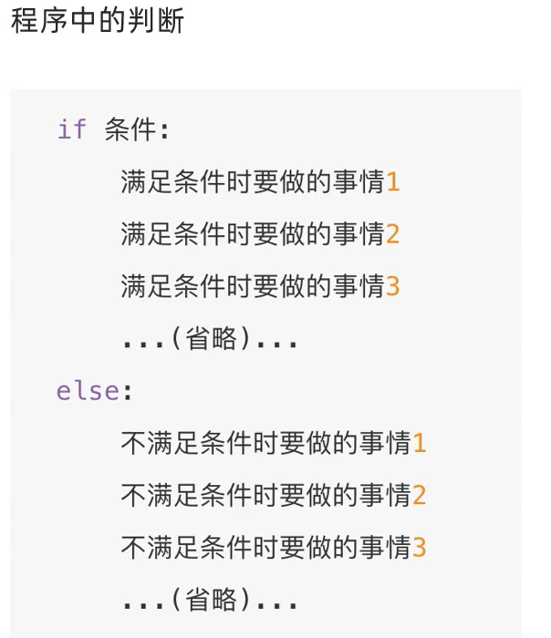
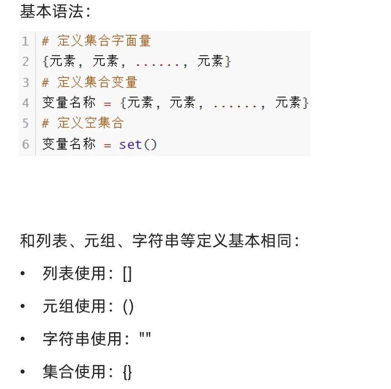
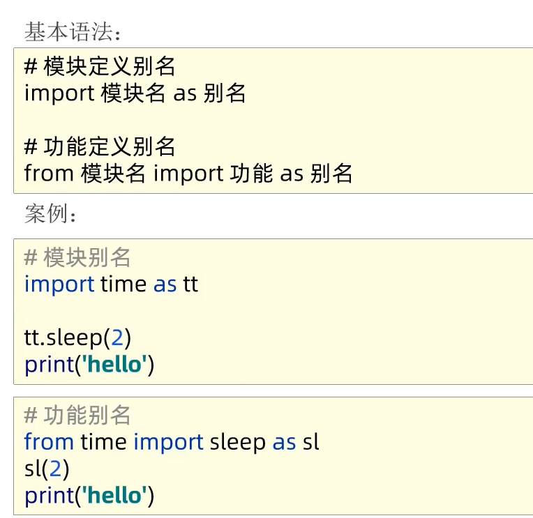

---

因为最近python大火 ，并且python好像可以写自动化程序，所以去了解一下python的相关知识

python官方文档[Python 教程 — Python 3.10.6 文档](https://docs.python.org/zh-cn/3/tutorial/index.html)

也总结了关于python语法与java的区别

## python简介

Python 是一门易于学习、功能强大的编程语言。它提供了高效的高级数据结构，还能简单有效地面向对象编程。Python 优雅的语法和动态类型以及解释型语言的本质，使它成为多数平台上写脚本和快速开发应用的理想语言。

# 第一章

## 变量

python定义变量

## 注释


需要注意的是`# 文字`(中间)会有一个空格（这是一种规范）

## print函数

打印函数


中间可以加逗号进行拼接


## 数据类型


根据type()函数得到数据类型，这个数据类型可以被变量所保存（我猜想保存的是字符串）

对于变量的类型也依然可以查看


不管我们查看的是变量的类型还是数据的类型，本质上其实都是**数据**的类型，因为变量里面存储的就是数据

## 数据类型转换

认识三个函数 

int()

float()

str()

里面可以放相应的变量或字面量，其他需要注意的和java一样

## 标识符

给类。变量。方法起的名字就叫标识符

起名字的限制


而且数字不能用在开头（和java一样）

python也是大小写敏感的（和java一样）

不能用关键字（和java一样）

## 算数运算符


需要注意的是python中仍然支持+=等复合运算符

## 字符串拓展

### 取出字符串中的字符


### 字符串的三种定义方式


需要注意的是第三种方法的支持换行操作

语法是这样的格式


并且对于引号里面有引号的情况，对于java来说我们可以用转义字符\来使用，python仍然可以，并且python同样支持以下两种方法


打印结果为


### 字符串的拼接

同样可以根据+进行字符串与字符串的拼接，整型浮点型不能通过+与字符串进行拼接

### 字符串格式化一


上面这个图片中的数字其实是整数类型，被转换成了字符串类型了而已

如果想直接用整型占位，可以用这些


### 字符串格式化方式二


这种方法不能做精度控制，不能控制位数

f代表format

## 数据输入（input函数）


需要注意的是input语句里面可以填写参数（比如字符串）会给输入程序启动前给出提示的内容（参数中填写的字符串）

并且无论在input（键盘）中输入的是数字还是字符串，都把输入的内容当成字符串

# 第二章

## 布尔类型和比较运算符

### 布尔值

真True 值为1（python特有）

假False 值为0（和c一样）

### 运算符


## if判断语句

### 单if


和java的区别是条件没有括号括着，并且后面有冒号

**并且python通过缩进判断代码块的归属关系!!!!!**

### if else



### if elif else

和java中的else if一样


### 总结

if中可以嵌套，但最重要的是python是根据缩进完成的配套，没有大括号这一说

# 第三章

## while循环


条件+：

通过**缩进**确定逻辑层次关系

同时while也支持嵌套哦

## for循环

while与for的区别


for的语法


这个语法跟Java中的加强for一样

需要注意的是字符串也可以被循环处理（这个是python特有的）


# 第四章

## 函数

函数是组织好的，可重复使用的，用来实现特定功能的代码段

为了得到一个针对特定需求，减少代码冗余，提高代码复用性

自定义函数的语法


**函数使用步骤：**

**先定义**函数（写在前面）

后调用函数

**注意事项:**

参数不需要，可以省略

返回值不需要，可以省略（跟Java不太一样，java需要单独写return）

### 函数的返回值None


这个None是python特别的返回值，一共有两种方式得到None，和java中的null很像

并且None有很多应用的场景


### 函数的文档注释

用法和Java的文档注释一样，不一样的是python用多行注释代替了文档注释，并且写在了**函数里面**（java是写在函数外面的）

****

### 作用域

需要注意的是变量分为局部变量以及全局变量，如果在函数里面创建的变量叫局部变量，在函数外创建的叫全局变量，如果全局变量与局部变量有相同名字的变量，在函数内使用默认使用局部变量的值，函数内修改不会改变全局变量的值（这是跟java不一样的）如果想修改全局变量的值，需要进行声明

声明的语法是

函数：

  global 全局变量名称 # 声明了这个变量是全局变量，这样就一样啦

### 多返回值

语法


### 位置参数与关键字参数


### 缺省参数（默认值）


需要注意的是

### 不定长参数


取出数据是根据元组或者字典的规则取出的，其他操作同理

### 匿名函数

#### 函数作为参数传递


函数本身是可以作为参数，传入另一个函数中进行使用的

将函数传入的作用在于：传入计算逻辑，而非平时传入数据

#### lambda匿名函数


匿名函数的语法：


lambda定义的函数主要是用于作为其他函数的参数进行传递

注意事项：

匿名函数用于临时构建一个函数，只用一次的场景

匿名函数的定义中，函数体只能写一行代码，如果函数体要写多行代码，不可以用lambda匿名函数，可以使用def定义带名函数

# 第五章

## 数据容器

数据容器就是一种可以存储多个元素的Python数据类型（像Java中的数组与集合的合成体）


### list列表

基本的语法


示例


注意和Java一样，这里面也是可以嵌套的，嵌套的语法为


#### list列表支持用下表索引取出相应的元素


支持反向索引（python特有）


#### list列表的方法

具体用法在[第六章-04-列表的常用操作方法_哔哩哔哩_bilibili](https://www.bilibili.com/video/BV1qW4y1a7fU?p=55&vd_source=2259e5459a8cfd21bcf92bc46bf3beda)


### tuple元组


元组是不可以修改的

相当于只读不可写

**元组定义方法：**


注意是小括号，list的中括号

**定义元组的注意事项：**


**特别的：**

元组的内容不可以修改，但是如果元组里面嵌套了list列表，list列表内的内容可以修改


并且 元组之间可以进行拼接

比如： tuple3=tuple1+tuple2

### 字符串


同样支持正向索引以及反向索引

#### 字符串相关的方法


### 序列的切片操作


### set集合

set集合的特点是内容无序且不可重复

基本语法



因为set集合是无序的，所以不支持下标索引访问，但是集合和列表一样，是允许修改的

set集合的遍历


集合常用方法


### 字典

和java的map一样

是key-value结构

字典的定义语法


字典不允许key重复，但是value可能会重复（和java一样）

字典的常用方法


字典的特点


## 数据容器总结


具体应用场景


容器通用功能


# 第六章

## 文件操作

### 文件读取操作


读操作相关方法


readline方法可以一次读取一行


读取整个文件（这个方法目前还不知道为什么可以，f是文件类型也可以遍历欸）


如果在一个程序中多次调用read或者readlines方法，会在上一次读取的结尾处继续读取下一次read，跟文件指针有关

with open语法


操作汇总


### 文件写入操作


需要注意的是close方法内置了flush方法，也就是说close之前先进行了一次flush操作

注意事项


### 文件追加写入操作


写入方法和w模式一样

# 第七章

## 异常

当检测到一个错误时，解释器就无法继续执行了，出现了报错信息，这就是BUG

异常就是程序运行的过程中出现了错误
世界上没有完美的程序，任何程序在运行的过程中，都有可能出现异常，也就是出现bug导致程序无法完美运行下去。
我们要做的，不是力求程序完美运行。
而是在力所能及的范围内，对可能出现的bug，进行提前准备、提前处理
这种行为我们称之为:异常处理（捕获异常)


**当我们的程序遇到了BUG，那么接下来有两种情况:**
①整个程序因为一个BUG停止运行
②对BUG进行提醒，整个程序继续运行
显然在之前的学习中，我们所有的程序遇到BUG就会出现①的这种情况，也就是整个程序直接奔溃.
但是在真实工作中，我们肯定不能因为一个小的BUG就让整个程序全部奔溃，也就是我们希望的是达到②的这种情况那这里我们就需要使用到捕获异常
捕获异常的作用在于:提前假设某处会出现异常，做好提前准备，当真的出现异常的时候，可以有后续手段。

### 捕获所有异常

基本语法


下面这个也是捕获所有的异常哦


### 捕获指定的异常


上面这个e就是相当于java异常那个e

### 捕获多个异常


### 异常else


### 异常的finally


### 异常的传递


和Java的一样

执行结果是


## python的模块

和c语言很像嘿嘿


### 也可以只导入功能（方法/函数）


这种方法可以直接用方法名调用方法

### 导入一个模块下的所有功能


*表示全部

这样的方式也可以直接用方法名直接调用方法

### as定义别名



因为有些模块名字实在是太长了，我们可以用as给它改个名字

上面只导入功能的模式也可以改名


### 自定义模块


如果不想在导入模块中执行导入模块中的语句时

可以加入这段话


这句话的意思是这个运行程序是主函数才会执行，如果是导入进去的话就不执行

### \__all变量__


上面的只能导入test_A方法，没有导入test_B方法

\_\_all__变量可以控制import *的时候哪些功能可以被导入(因为星号代表的是全部，跟英文表达意思是一样的哦)

all变量是一个列表，里面可以添加方法名称

## python的包

基于Python模块，我们可以在编写代码的时候，导入许多外部代码来丰富功能。
但是，如果Python的模块太多了，就可能造成一定的混乱，所以我们可以用python的包管理机制

从物理上看，包就是一个文件夹，在该文件夹下包含了一个\_init\_.py 文件，该文件夹可用于包含多个模块文件从逻辑上看，包的本质依然是模块

\__init\_\_的作用

创建包会默认自动创建这个文件，通过这个文件来表示一个文件夹是Python的包，而非普通的文件夹。


和java的包一样

### 通过import导入


### 通过from导入


甚至可以采取这种方式


### 导入第三方包

#### 第一种方法

首先我们得下载这个包哦，相当于java的jar包


上面的下载速度太慢啦，可以配置镜像

```shell
pip install -i https://pypi.tuna.tsinghua.edu.cn/simple 包名
```

#### 第二种方法

pycharm内置下载


之后就可以搜索第三方包下载了


# 第八章

python案例

python数据和json数据的相互转化


