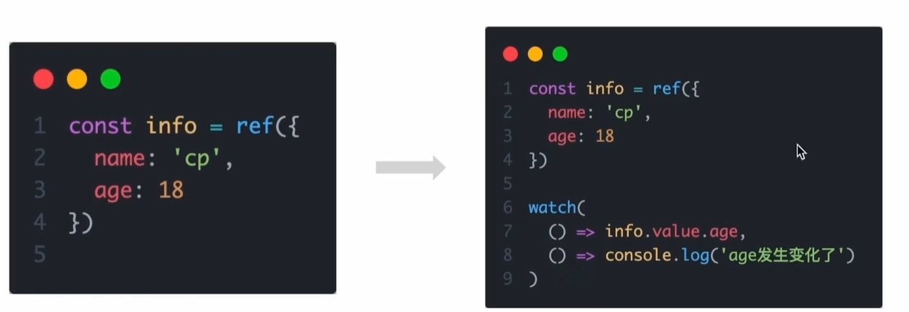
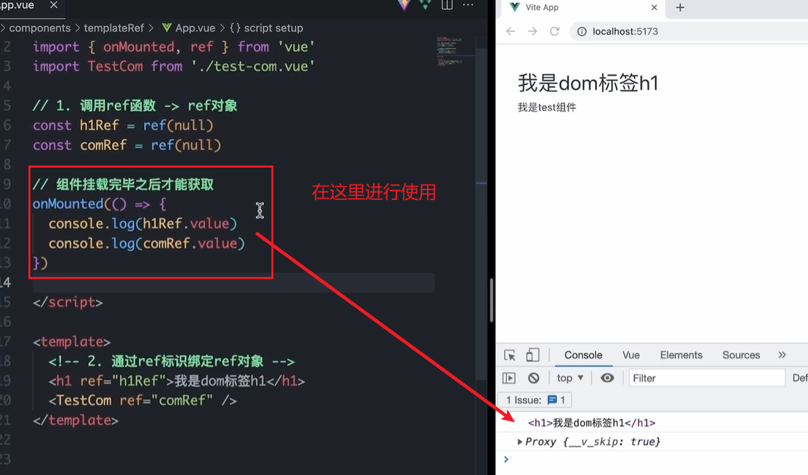
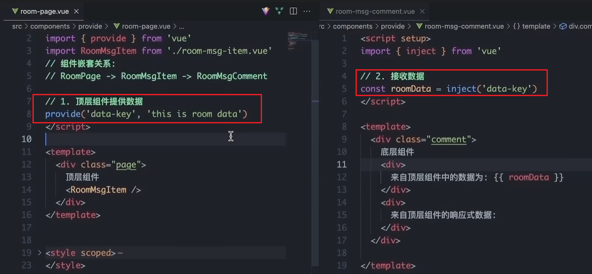
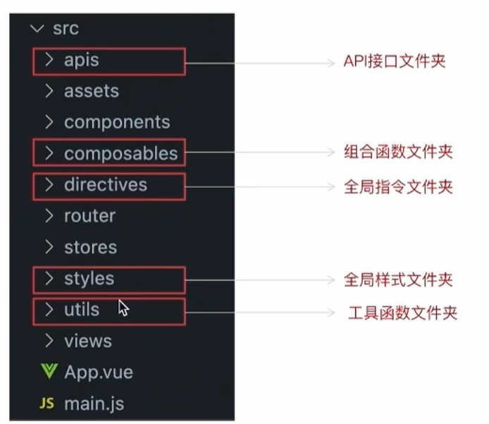
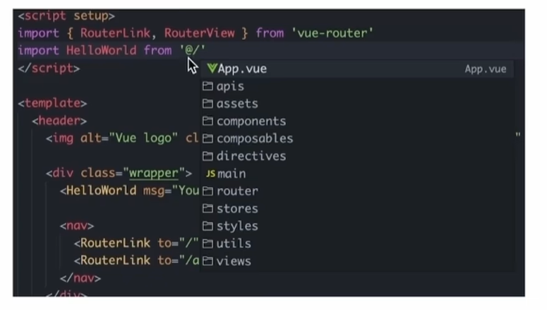

# Vue3入门

## 认识Vue3

### 1. Vue3组合式API体验

> 通过 Counter 案例 体验Vue3新引入的组合式API
>
> 并且需要注意的是Vue3是向下兼容的，也就是说你可以在Vue3的项目中继续写Vue2的代码

```vue
<script>
export default {
  data(){
    return {
      count:0
    }
  },
  methods:{
    addCount(){
      this.count++
    }
  }
}
</script>
```

```vue
<script setup>
import { ref } from 'vue'
const count = ref(0)
const addCount = ()=> count.value++
</script>
```

特点：

1. 代码量变少
2. 分散式维护变成集中式维护

### 2. Vue3更多的优势


## 使用create-vue搭建Vue3项目

### 1. 认识create-vue

> create-vue是Vue官方新的脚手架工具，底层切换到了 vite （下一代前端工具链），为开发提供极速响应


### 2. 使用create-vue创建项目

> 前置条件 - 已安装16.0或更高版本的Node.js，
>
> C:\Users\Xu>node -v
> v16.16.0
>
> 可以看到这里我是16.16版本，希望不会出现依赖冲突

执行如下命令，这一指令将会安装并执行 create-vue

```bash
npm init vue@latest
```


我去，这看着比vue2页面高级多了


## 熟悉项目和关键文件


## 组合式API - setup选项

### 1. setup选项的写法和执行时机

写法

```vue
<script>
  export default {
    setup(){
      
    },
    beforeCreate(){
      
    }
  }
</script>
```

执行时机

> 在beforeCreate钩子之前执行


### 2. setup中写代码的特点

> 在setup函数中写的数据和方法需要在末尾以对象的方式return，才能给模版使用

```vue
<script>
  export default {
    setup(){
      const message = 'this is message'
      const logMessage = ()=>{
        console.log(message)
      }
      // 必须return才可以
      return {
        message,
        logMessage
      }
    }
  }
</script>
```

### 3. `<script setup>`语法糖

> script标签添加 setup标记，不需要再写导出语句，默认会添加导出语句


```vue
<script setup>
  const message = 'this is message'
  const logMessage = ()=>{
    console.log(message)
  }
</script>
```

需要注意的是。setup中的this已经不指向组件实例啦，指向的undefined。

## 组合式API - reactive和ref函数

### 1. reactive

> 接受**对象类型数据**的参数传入并返回一个响应式的对象


```vue
<script setup>
 // 导入
 import { reactive } from 'vue'
 // 执行函数 传入参数 变量接收
 const state = reactive({
   msg:'this is msg'
 })
 const setSate = ()=>{
   // 修改数据更新视图
   state.msg = 'this is new msg'
 }
</script>

<template>
  {{ state.msg }}
  <button @click="setState">change msg</button>
</template>
```

### 2. ref

> 接收**简单类型**或者**对象类型**的数据传入并返回一个响应式的对象

```vue
<script setup>
 // 导入
 import { ref } from 'vue'
 // 执行函数 传入参数 变量接收
 const count = ref(0)
 const setCount = ()=>{
   // 修改数据更新视图必须加上.value
   count.value++
 }
</script>

<template>
  <button @click="setCount">{{count}}</button>
</template>
```

### 3. reactive 对比 ref

1. 都是用来生成响应式数据
2. 不同点
   1. reactive不能处理简单类型的数据
   2. ref参数类型支持更好，但是必须通过.value做访问修改
   3. ref函数内部的实现依赖于reactive函数
3. 在实际工作中的推荐
   1. 推荐使用ref函数，减少记忆负担，小兔鲜项目都使用**ref**

## 组合式API - computed

> 计算属性基本思想和Vue2保持一致，组合式API下的计算属性只是修改了API写法

下面这个计算属性会检测原始数据的变化，如果原始数据改变了，那么计算属性也会被调用！


## 组合式API - watch

> 侦听一个或者多个数据的变化，数据变化时执行回调函数，两个额外参数
>
> -  immediate控制立刻执行
> - deep开启深度侦听

### 1. 侦听单个数据

```vue
<script setup>
  // 1. 导入watch
  import { ref, watch } from 'vue'
  const count = ref(0)
  // 2. 调用watch 侦听变化
  watch(count, (newValue, oldValue)=>{//一个是变化之前的老值，一个是变化之后的新值
    console.log(`count发生了变化，老值为${oldValue},新值为${newValue}`)
  })
</script>
```

### 2. 侦听多个数据

> 侦听多个数据，第一个参数可以改写成数组的写法
>
> 这两个数据任何一个变化都会引起函数的触发！

```vue
<script setup>
  // 1. 导入watch
  import { ref, watch } from 'vue'
  const count = ref(0)
  const name = ref('cp')
  // 2. 调用watch 侦听变化
  watch([count, name], ([newCount, newName],[oldCount,oldName])=>{
    console.log(`count或者name变化了，[newCount, newName],[oldCount,oldName])
  })
</script>
```

### 3. immediate

> 在侦听器创建时立即触发回调（第一次就执行），响应式数据变化之后继续执行回调


```vue
<script setup>
  // 1. 导入watch
  import { ref, watch } from 'vue'
  const count = ref(0)
  // 2. 调用watch 侦听变化
  watch(count, (newValue, oldValue)=>{
    console.log(`count发生了变化，老值为${oldValue},新值为${newValue}`)
  },{
    immediate: true
  })
</script>
```

### 4. deep

> 通过watch监听的ref对象默认是浅层侦听的，直接修改嵌套的对象属性不会触发回调执行，需要开启deep
>
> 需要注意的是deep有性能损耗，尽量不要使用deep

```vue
<script setup>
  // 1. 导入watch
  import { ref, watch } from 'vue'
  const state = ref({ count: 0 })
  // 2. 监听对象state
  watch(state, ()=>{
    console.log('数据变化了')
  })
  const changeStateByCount = ()=>{
    // 直接修改不会引发回调执行
    state.value.count++
  }
</script>
```

添加deep属性就可以触发了

```vue
<script setup>
  // 1. 导入watch
  import { ref, watch } from 'vue'
  const state = ref({ count: 0 })
  // 2. 监听对象state 并开启deep
  watch(state, ()=>{
    console.log('数据变化了')
  },{deep:true})
  const changeStateByCount = ()=>{
    // 此时修改可以触发回调
    state.value.count++
  }
</script>
```

### 5.精确侦听对象的某个属性

需求：在不开启deep的前提下，侦听age的变化，只有age变化时才执行回调



## 组合式API - 生命周期函数

### 1. 选项式对比组合式


### 2. 生命周期函数基本使用

> 1. 导入生命周期函数
> 2. 执行生命周期函数，传入回调

```vue
<scirpt setup>
import { onMounted } from 'vue'
onMounted(()=>{
  // 自定义逻辑
})
</script>
```

### 3. 执行多次

> 生命周期函数执行多次的时候，会按照顺序依次执行

```vue
<scirpt setup>
import { onMounted } from 'vue'
onMounted(()=>{
  // 自定义逻辑
})

onMounted(()=>{
  // 自定义逻辑
})
</script>
```

## 组合式API - 父子通信

### 1. 父传子

这里注意setup语法糖自动为我们注册了组件，所以我们不用在写components进行注册啦

> 基本思想
>
> 1. 父组件中给子组件绑定属性
> 2. 子组件内部通过props选项接收数据


### 2. 子传父

> 基本思想
>
> 1. 父组件中给子组件标签通过@绑定事件
> 2. 子组件内部通过 emit 方法触发事件


## 组合式API - 模版引用

> 概念：通过 ref标识 获取真实的 dom对象或者组件实例对象

### 1. 基本使用

> 实现步骤：
>
> 1. 调用ref函数生成一个ref对象
> 2. 通过ref标识绑定ref对象到标签


之后这个dom就被绑定到h1Ref对象身上了，同理也可以得到组件实例对象



### 2. defineExpose

> 默认情况下在` <script setup>`语法糖下组件内部的属性和方法是不开放给**父组件**(也就是说这个defineExpose是写在子组件里面的)访问的，可以通过defineExpose编译宏指定哪些属性和方法容许访问

说明：下面的代码将子组件里面的testMessage属性暴露出来，使之可以被父组件访问到


## 组合式API - provide和inject

### 1. 作用和场景

> 顶层组件向任意的底层组件传递数据和方法，实现跨层组件通信


### 2. 跨层传递普通数据

> 实现步骤
>
> 1. 顶层组件通过 `provide` 函数提供数据
> 2. 底层组件通过 `inject` 函数提供数据




### 3. 跨层传递响应式数据

> 在调用provide函数时，第二个参数设置为ref对象


### 4. 跨层传递方法

> 顶层组件可以向底层组件传递方法，底层组件调用方法修改顶层组件的数据


# Pinia入门

## 什么是pinia

Pinia 是 Vue 的专属状态管理库，可以实现跨组件或页面共享状态，是 vuex 状态管理工具的替代品，和 Vuex相比，具备以下优势

1. 提供更加简单的API （去掉了 mutation ）
2. 提供符合组合式API风格的API （和 Vue3 新语法统一）
3. 去掉了modules的概念，每一个store都是一个独立的模块
4. 搭配 TypeScript 一起使用提供可靠的类型推断

## 创建空Vue项目并安装Pinia

### 1. 创建空Vue项目

```bash
npm init vue@latest
```

### 2. 安装Pinia并注册

```bash
npm i pinia
```

```javascript
import { createPinia } from 'pinia'

const app = createApp(App)
// 以插件的形式注册
app.use(createPinia())
app.use(router)
app.mount('#app')
```

## 实现counter

> 核心步骤：
>
> 1. 定义store
> 2. 组件使用store

1- 定义store

@/stores/counter.js

```javascript
import { defineStore } from 'pinia'
import { ref } from 'vue'

//这里导出方法。这个方法最好以use开头....
export const useCounterStore = defineStore('counter', ()=>{
  // 数据 （state）
  const count = ref(0)

  // 修改数据的方法 （action,这里既支持同步又支持异步）
  const increment = ()=>{
    count.value++
  }

  // 以对象形式返回
  return {
    count,
    increment
  }
})

```

2- 组件使用store

```vue
<script setup>
  // 1. 导入use方法
  import { useCounterStore } from '@/stores/counter'
  // 2. 执行方法得到store， store里有数据和方法
  const counterStore = useCounterStore()
</script>

<template>
	<button @click="counterStore.increment">
    {{ counterStore.count }}
  </button>
</template>
```

## 实现getters

> getters直接使用计算属性即可实现

```javascript
// 数据（state）
const count = ref(0)
// getter (computed)
const doubleCount = computed(() => count.value * 2)
```

## 异步action

> 思想：action函数既支持同步也支持异步，和在组件中发送网络请求写法保持一致
> 步骤：
>
> 1. store中定义action
> 2. 组件中触发action

1- store中定义action

```javascript
const API_URL = 'http://geek.itheima.net/v1_0/channels'

export const useCounterStore = defineStore('counter', ()=>{
  // 数据
  const list = ref([])
  // 异步action
  const loadList = async ()=>{
    const res = await axios.get(API_URL)
    list.value = res.data.data.channels
  }
  
  return {
    list,
    loadList
  }
})
```

2- 组件中调用action

```vue
<script setup>
	import { useCounterStore } from '@/stores/counter'
  const counterStore = useCounterStore()
  // 调用异步action
  counterStore.loadList()
</script>

<template>
	<ul>
    <li v-for="item in counterStore.list" :key="item.id">{{ item.name }}</li>
  </ul>
</template>
```

## storeToRefs保持响应式解构

> 直接基于store进行解构赋值，响应式数据（state和getter）会丢失响应式特性。
>
> 但是我们还是想用解构赋值，那么我们就可以使用storeToRefs辅助保持响应式

```vue
<script setup>
  import { storeToRefs } from 'pinia'
  import { useCounterStore } from '@/stores/counter'
  const counterStore = useCounterStore()
  // 使用它storeToRefs包裹之后解构保持响应式，
  // 注意，这里只能解构赋值数据，不管是对象类型还是基本数据类型都可以，但是不能解构赋值方法
  const { count } = storeToRefs(counterStore)
  // 如果想要解构赋值方法，使用这种方法解构就好啦
  const { increment } = counterStore
  
</script>

<template>
	<button @click="increment">
    {{ count }}
  </button>
</template>
```

# 项目起步

## 创建项目并整理目录

```bash
npm init vue@latest
```


### src目录调整



## jsconfig.json配置别名路径

> 配置别名路径可以在写代码时联想提示路径，也就是说，在编写代码的过程中，一旦输入@/，VSCode会立刻联想出src下的所有子目录和文件，统一文件路径访问不容易出错



那么如何进行配置呢？

1. 在项目的根目录下新增jsconfig.json文件
2. 添加json格式的配置项，如下：

```json
{
  "compilerOptions" : {
    "baseUrl" : "./",
    "paths" : {
      "@/*":["src/*"]
    }
  }
}
```

## elementPlus引入

### 1. 安装elementPlus和自动导入插件

```bash
npm i elementPlus
npm install -D unplugin-vue-components unplugin-auto-import
```

### 2. 配置自动按需导入

```javascript
// 引入插件
import AutoImport from 'unplugin-auto-import/vite'
import Components from 'unplugin-vue-components/vite'
import { ElementPlusResolver } from 'unplugin-vue-components/resolvers'


export default defineConfig({
  plugins: [
    // 配置插件
    AutoImport({
      resolvers: [ElementPlusResolver()],
    }),
    Components({
      resolvers: [ElementPlusResolver()],
    }),
  ]
})
```

### 3. 测试组件

```vue
<template>
  <el-button type="primary">i am button</el-button>
</template>
```

## 定制elementPlus主题

### 1. 安装sass

> 基于vite的项目默认不支持css预处理器，需要开发者单独安装

```bash
npm i sass -D
```

### 2. 准备定制化的样式文件

```javascript
/* 只需要重写你需要的即可 */
@forward 'element-plus/theme-chalk/src/common/var.scss' with (
  $colors: (
    'primary': (
      // 主色
      'base': #27ba9b,
    ),
    'success': (
      // 成功色
      'base': #1dc779,
    ),
    'warning': (
      // 警告色
      'base': #ffb302,
    ),
    'danger': (
      // 危险色
      'base': #e26237,
    ),
    'error': (
      // 错误色
      'base': #cf4444,
    ),
  )
)
```

### 3. 自动导入配置

> 这里自动导入需要深入到elementPlus的组件中，按照官方的配置文档来
>
> 1. 自动导入定制化样式文件进行样式覆盖
> 2. 按需定制主题配置 （需要安装 unplugin-element-plus）

```javascript
import { fileURLToPath, URL } from 'node:url'
import { defineConfig } from 'vite'
import vue from '@vitejs/plugin-vue'
import AutoImport from 'unplugin-auto-import/vite'
import Components from 'unplugin-vue-components/vite'
import { ElementPlusResolver } from 'unplugin-vue-components/resolvers'
// 导入对应包
import ElementPlus from 'unplugin-element-plus/vite'
export default defineConfig({
  plugins: [
    vue(),
    AutoImport({
      resolvers: [ElementPlusResolver()],
    }),
    Components({
      resolvers: [ElementPlusResolver()],
    }),
    // 按需定制主题配置
    ElementPlus({
      useSource: true,
    }),
  ],
  resolve: {
    alias: {
      '@': fileURLToPath(new URL('./src', import.meta.url))
    }
  },
  css: {
    preprocessorOptions: {
      scss: {
        // 自动导入定制化样式文件进行样式覆盖
        additionalData: `
          @use "@/styles/element/index.scss" as *;
        `,
      }
    }
  }
})
```

## axios安装并简单封装

### 1. 安装axios

```bash
npm i axios
```

### 2. 基础配置

> 官方文档地址：[https://axios-http.com/zh/docs/intro](https://axios-http.com/zh/docs/intro)
> 基础配置通常包括：
>
> 1. 实例化 - baseURL + timeout
> 2. 拦截器 - 携带token 401拦截等

```javascript
import axios from 'axios'

// 创建axios实例
const http = axios.create({
  baseURL: 'http://pcapi-xiaotuxian-front-devtest.itheima.net',
  timeout: 5000
})

// axios请求拦截器
instance.interceptors.request.use(config => {
  return config
}, e => Promise.reject(e))

// axios响应式拦截器
instance.interceptors.response.use(res => res.data, e => {
  return Promise.reject(e)
})


export default http
```

### 3. 封装请求函数并测试

```javascript
import http from '@/utils/http'

export function getCategoryAPI () {
  return http({
    url: 'home/category/head'
  })
}
```

## 路由整体设计

路由设计原则：找页面的切换方式，如果是整体切换，则为一级路由，如果是在一级路由的内部进行的内容切换，则为二级路由

```html
<template>
  我是登录页
</template>
```

```html
<template>
  我是首页
</template>
```

```html
<template>
  我是home
</template>
```

```html
<template>
  我是分类
</template>
```

```javascript
// createRouter：创建router实例对象
// createWebHistory：创建history模式的路由

import { createRouter, createWebHistory } from 'vue-router'
import Login from '@/views/Login/index.vue'
import Layout from '@/views/Layout/index.vue'
import Home from '@/views/Home/index.vue'
import Category from '@/views/Category/index.vue'

const router = createRouter({
  history: createWebHistory(import.meta.env.BASE_URL),
  // path和component对应关系的位置
  routes: [
    {
      path: '/',
      component: Layout,
      children: [
        {
          path: '',
          component: Home
        },
        {
          path: 'category',
          component: Category
        }
      ]
    },
    {
      path: '/login',
      component: Login
    }
  ]
})

export default router
```

## 静态资源引入和Error Lens安装

### 1. 静态资源引入

1. 图片资源 - 把 images 文件夹放到 assets 目录下
2. 样式资源 - 把 common.scss 文件放到 styles 目录下

### 2. Error Lens插件安装


## scss变量自动导入

```css
$xtxColor: #27ba9b;
$helpColor: #e26237;
$sucColor: #1dc779;
$warnColor: #ffb302;
$priceColor: #cf4444;
```

```json
css: {
    preprocessorOptions: {
      scss: {
        // 自动导入scss文件
        additionalData: `
          @use "@/styles/element/index.scss" as *;
          @use "@/styles/var.scss" as *;
        `,
      }
    }
}
```

