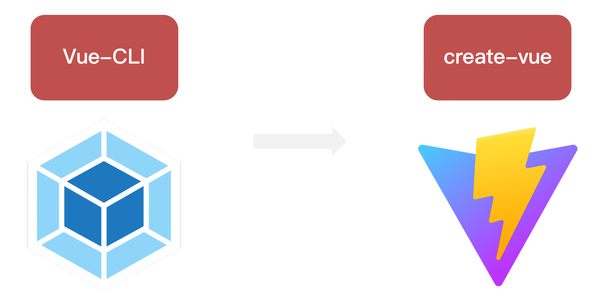
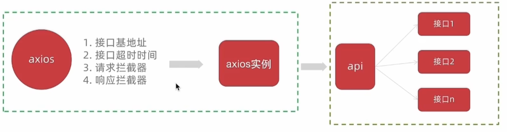
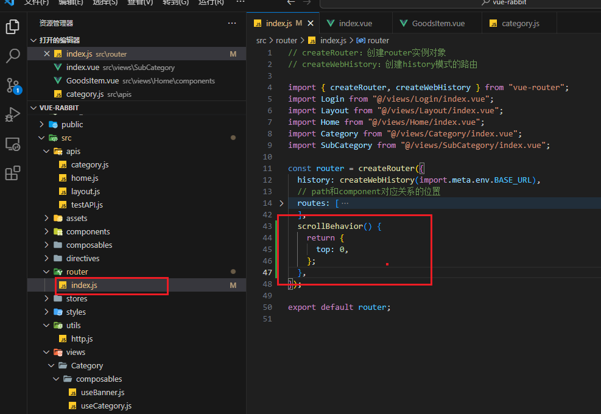
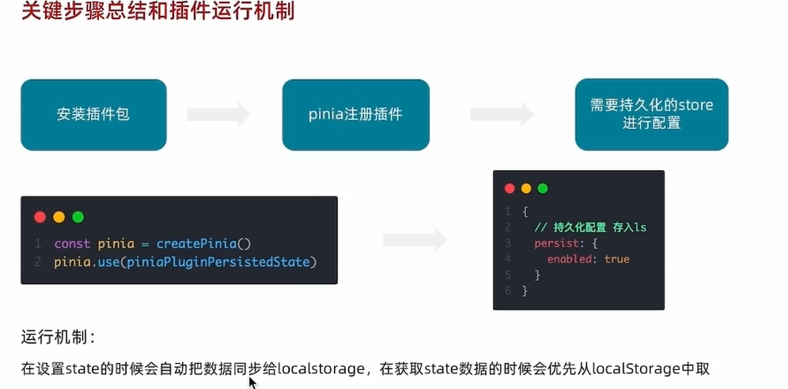

# Vue3入门

## 认识Vue3

### 1. Vue3组合式API体验

> 通过 Counter 案例 体验Vue3新引入的组合式API
>
> 并且需要注意的是Vue3是向下兼容的，也就是说你可以在Vue3的项目中继续写Vue2的代码

```vue
<script>
export default {
  data(){
    return {
      count:0
    }
  },
  methods:{
    addCount(){
      this.count++
    }
  }
}
</script>
```

```vue
<script setup>
import { ref } from 'vue'
const count = ref(0)
const addCount = ()=> count.value++
</script>
```

特点：

1. 代码量变少
2. 分散式维护变成集中式维护

### 2. Vue3更多的优势


## 使用create-vue搭建Vue3项目

### 1. 认识create-vue

> create-vue是Vue官方新的脚手架工具，底层切换到了 vite （下一代前端工具链），为开发提供极速响应




### 2. 使用create-vue创建项目

> 前置条件 - 已安装16.0或更高版本的Node.js，
>
> C:\Users\Xu>node -v
> v16.16.0
>
> 可以看到这里我是16.16版本，希望不会出现依赖冲突

执行如下命令，这一指令将会安装并执行 create-vue

```bash
npm init vue@latest
```


我去，这看着比vue2页面高级多了


## 熟悉项目和关键文件


## 组合式API - setup选项

### 1. setup选项的写法和执行时机

写法

```vue
<script>
  export default {
    setup(){
      
    },
    beforeCreate(){
      
    }
  }
</script>
```

执行时机

> 在beforeCreate钩子之前执行


### 2. setup中写代码的特点

> 在setup函数中写的数据和方法需要在末尾以对象的方式return，才能给模版使用

```vue
<script>
  export default {
    setup(){
      const message = 'this is message'
      const logMessage = ()=>{
        console.log(message)
      }
      // 必须return才可以
      return {
        message,
        logMessage
      }
    }
  }
</script>
```

### 3. `<script setup>`语法糖

> script标签添加 setup标记，不需要再写导出语句，默认会添加导出语句


```vue
<script setup>
  const message = 'this is message'
  const logMessage = ()=>{
    console.log(message)
  }
</script>
```

需要注意的是。setup中的this已经不指向组件实例啦，指向的undefined。

## 组合式API - reactive和ref函数

### 1. reactive

> 接受**对象类型数据**的参数传入并返回一个响应式的对象


```vue
<script setup>
 // 导入
 import { reactive } from 'vue'
 // 执行函数 传入参数 变量接收
 const state = reactive({
   msg:'this is msg'
 })
 const setSate = ()=>{
   // 修改数据更新视图
   state.msg = 'this is new msg'
 }
</script>

<template>
  {{ state.msg }}
  <button @click="setState">change msg</button>
</template>
```

### 2. ref

> 接收**简单类型**或者**对象类型**的数据传入并返回一个响应式的对象

```vue
<script setup>
 // 导入
 import { ref } from 'vue'
 // 执行函数 传入参数 变量接收
 const count = ref(0)
 const setCount = ()=>{
   // 修改数据更新视图必须加上.value
   count.value++
 }
</script>

<template>
  <button @click="setCount">{{count}}</button>
</template>
```

### 3. reactive 对比 ref

1. 都是用来生成响应式数据
2. 不同点
   1. reactive不能处理简单类型的数据
   2. ref参数类型支持更好，但是必须通过.value做访问修改
   3. ref函数内部的实现依赖于reactive函数
3. 在实际工作中的推荐
   1. 推荐使用ref函数，减少记忆负担，小兔鲜项目都使用**ref**

## 组合式API - computed

> 计算属性基本思想和Vue2保持一致，组合式API下的计算属性只是修改了API写法

下面这个计算属性会检测原始数据的变化，如果原始数据改变了，那么计算属性也会被调用！


## 组合式API - watch

> 侦听一个或者多个数据的变化，数据变化时执行回调函数，两个额外参数
>
> -  immediate控制立刻执行
> - deep开启深度侦听

### 1. 侦听单个数据

```vue
<script setup>
  // 1. 导入watch
  import { ref, watch } from 'vue'
  const count = ref(0)
  // 2. 调用watch 侦听变化
  watch(count, (newValue, oldValue)=>{//一个是变化之前的老值，一个是变化之后的新值
    console.log(`count发生了变化，老值为${oldValue},新值为${newValue}`)
  })
</script>
```

### 2. 侦听多个数据

> 侦听多个数据，第一个参数可以改写成数组的写法
>
> 这两个数据任何一个变化都会引起函数的触发！

```vue
<script setup>
  // 1. 导入watch
  import { ref, watch } from 'vue'
  const count = ref(0)
  const name = ref('cp')
  // 2. 调用watch 侦听变化
  watch([count, name], ([newCount, newName],[oldCount,oldName])=>{
    console.log(`count或者name变化了，[newCount, newName],[oldCount,oldName])
  })
</script>
```

### 3. immediate

> 在侦听器创建时立即触发回调（第一次就执行），响应式数据变化之后继续执行回调


```vue
<script setup>
  // 1. 导入watch
  import { ref, watch } from 'vue'
  const count = ref(0)
  // 2. 调用watch 侦听变化
  watch(count, (newValue, oldValue)=>{
    console.log(`count发生了变化，老值为${oldValue},新值为${newValue}`)
  },{
    immediate: true
  })
</script>
```

### 4. deep

> 通过watch监听的ref对象默认是浅层侦听的，直接修改嵌套的对象属性不会触发回调执行，需要开启deep
>
> 需要注意的是deep有性能损耗，尽量不要使用deep

```vue
<script setup>
  // 1. 导入watch
  import { ref, watch } from 'vue'
  const state = ref({ count: 0 })
  // 2. 监听对象state
  watch(state, ()=>{
    console.log('数据变化了')
  })
  const changeStateByCount = ()=>{
    // 直接修改不会引发回调执行
    state.value.count++
  }
</script>
```

添加deep属性就可以触发了

```vue
<script setup>
  // 1. 导入watch
  import { ref, watch } from 'vue'
  const state = ref({ count: 0 })
  // 2. 监听对象state 并开启deep
  watch(state, ()=>{
    console.log('数据变化了')
  },{deep:true})
  const changeStateByCount = ()=>{
    // 此时修改可以触发回调
    state.value.count++
  }
</script>
```

### 5.精确侦听对象的某个属性

需求：在不开启deep的前提下，侦听age的变化，只有age变化时才执行回调


## 组合式API - 生命周期函数

### 1. 选项式对比组合式


### 2. 生命周期函数基本使用

> 1. 导入生命周期函数
> 2. 执行生命周期函数，传入回调

```vue
<scirpt setup>
import { onMounted } from 'vue'
onMounted(()=>{
  // 自定义逻辑
})
</script>
```

### 3. 执行多次

> 生命周期函数执行多次的时候，会按照顺序依次执行

```vue
<scirpt setup>
import { onMounted } from 'vue'
onMounted(()=>{
  // 自定义逻辑
})

onMounted(()=>{
  // 自定义逻辑
})
</script>
```

## 组合式API - 父子通信

### 1. 父传子

这里注意setup语法糖自动为我们注册了组件，所以我们不用在写components进行注册啦

> 基本思想
>
> 1. 父组件中给子组件绑定属性
> 2. 子组件内部通过props选项接收数据


### 2. 子传父

> 基本思想
>
> 1. 父组件中给子组件标签通过@绑定事件
> 2. 子组件内部通过 emit 方法触发事件


## 组合式API - 模版引用

> 概念：通过 ref标识 获取真实的 dom对象或者组件实例对象

### 1. 基本使用

> 实现步骤：
>
> 1. 调用ref函数生成一个ref对象
> 2. 通过ref标识绑定ref对象到标签


之后这个dom就被绑定到h1Ref对象身上了，同理也可以得到组件实例对象


### 2. defineExpose

> 默认情况下在` <script setup>`语法糖下组件内部的属性和方法是不开放给**父组件**(也就是说这个defineExpose是写在子组件里面的)访问的，可以通过defineExpose编译宏指定哪些属性和方法容许访问

说明：下面的代码将子组件里面的testMessage属性暴露出来，使之可以被父组件访问到


## 组合式API - provide和inject

### 1. 作用和场景

> 顶层组件向任意的底层组件传递数据和方法，实现跨层组件通信


### 2. 跨层传递普通数据

> 实现步骤
>
> 1. 顶层组件通过 `provide` 函数提供数据
> 2. 底层组件通过 `inject` 函数提供数据


### 3. 跨层传递响应式数据

> 在调用provide函数时，第二个参数设置为ref对象


### 4. 跨层传递方法

> 顶层组件可以向底层组件传递方法，底层组件调用方法修改顶层组件的数据


# Pinia入门

## 什么是pinia

Pinia 是 Vue 的专属状态管理库，可以实现跨组件或页面共享状态，是 vuex 状态管理工具的替代品，和 Vuex相比，具备以下优势

1. 提供更加简单的API （去掉了 mutation ）
2. 提供符合组合式API风格的API （和 Vue3 新语法统一）
3. 去掉了modules的概念，每一个store都是一个独立的模块
4. 搭配 TypeScript 一起使用提供可靠的类型推断

## 创建空Vue项目并安装Pinia

### 1. 创建空Vue项目

```bash
npm init vue@latest
```

### 2. 安装Pinia并注册

```bash
npm i pinia
```

```javascript
import { createPinia } from 'pinia'

const app = createApp(App)
// 以插件的形式注册
app.use(createPinia())
app.use(router)
app.mount('#app')
```

## 实现counter

> 核心步骤：
>
> 1. 定义store
> 2. 组件使用store

1- 定义store

@/stores/counter.js

```javascript
import { defineStore } from 'pinia'
import { ref } from 'vue'

//这里导出方法。这个方法最好以use开头....
export const useCounterStore = defineStore('counter', ()=>{
  // 数据 （state）
  const count = ref(0)

  // 修改数据的方法 （action,这里既支持同步又支持异步）
  const increment = ()=>{
    count.value++
  }

  // 以对象形式返回
  return {
    count,
    increment
  }
})

```

2- 组件使用store

```vue
<script setup>
  // 1. 导入use方法
  import { useCounterStore } from '@/stores/counter'
  // 2. 执行方法得到store， store里有数据和方法
  const counterStore = useCounterStore()
</script>

<template>
	<button @click="counterStore.increment">
    {{ counterStore.count }}
  </button>
</template>
```

## 实现getters

> getters直接使用计算属性即可实现

```javascript
// 数据（state）
const count = ref(0)
// getter (computed)
const doubleCount = computed(() => count.value * 2)
```

## 异步action

> 思想：action函数既支持同步也支持异步，和在组件中发送网络请求写法保持一致
> 步骤：
>
> 1. store中定义action
> 2. 组件中触发action

1- store中定义action

```javascript
const API_URL = 'http://geek.itheima.net/v1_0/channels'

export const useCounterStore = defineStore('counter', ()=>{
  // 数据
  const list = ref([])
  // 异步action
  const loadList = async ()=>{
    const res = await axios.get(API_URL)
    list.value = res.data.data.channels
  }
  
  return {
    list,
    loadList
  }
})
```

2- 组件中调用action

```vue
<script setup>
	import { useCounterStore } from '@/stores/counter'
  const counterStore = useCounterStore()
  // 调用异步action
  counterStore.loadList()
</script>

<template>
	<ul>
    <li v-for="item in counterStore.list" :key="item.id">{{ item.name }}</li>
  </ul>
</template>
```

## storeToRefs保持响应式解构

> 直接基于store进行解构赋值，响应式数据（state和getter）会丢失响应式特性。
>
> 但是我们还是想用解构赋值，那么我们就可以使用storeToRefs辅助保持响应式

```vue
<script setup>
  import { storeToRefs } from 'pinia'
  import { useCounterStore } from '@/stores/counter'
  const counterStore = useCounterStore()
  // 使用它storeToRefs包裹之后解构保持响应式，
  // 注意，这里只能解构赋值数据，不管是对象类型还是基本数据类型都可以，但是不能解构赋值方法
  const { count } = storeToRefs(counterStore)
  // 如果想要解构赋值方法，使用这种方法解构就好啦
  const { increment } = counterStore
  
</script>

<template>
	<button @click="increment">
    {{ count }}
  </button>
</template>
```

# 项目起步

## 创建项目并整理目录

```bash
npm init vue@latest
```


### src目录调整


## jsconfig.json配置别名路径

> 配置别名路径可以在写代码时联想提示路径，也就是说，在编写代码的过程中，一旦输入@/，VSCode会立刻联想出src下的所有子目录和文件，统一文件路径访问不容易出错
>
> 不过我下载了插件，这个就不用配置了


那么如何进行配置呢？

1. 在项目的根目录下新增jsconfig.json文件
2. 添加json格式的配置项，如下：

```json
{
  "compilerOptions" : {
    "baseUrl" : "./",
    "paths" : {
      "@/*":["src/*"]
    }
  }
}
```

## elementPlus引入

### 1. 安装elementPlus和自动导入插件

```bash
npm install element-plus --save
npm install -D unplugin-vue-components unplugin-auto-import
```

### 2. 配置自动按需导入

```javascript
// vite.config.ts
import { defineConfig } from 'vite'
import AutoImport from 'unplugin-auto-import/vite'
import Components from 'unplugin-vue-components/vite'
import { ElementPlusResolver } from 'unplugin-vue-components/resolvers'

export default defineConfig({
  // ...
  plugins: [
    // ...
    AutoImport({
      resolvers: [ElementPlusResolver()],
    }),
    Components({
      resolvers: [ElementPlusResolver()],
    }),
  ],
})
```

### 3. 测试组件

```vue
<template>
  <el-button type="primary">i am button</el-button>
</template>
```

## 定制elementPlus主题

### 1. 安装sass

> 基于vite的项目默认不支持css预处理器，需要开发者单独安装

```bash
npm i sass -D
```

### 2. 准备定制化的样式文件

styles/element/index.scss

```javascript
/* 只需要重写你需要的即可 */
@forward 'element-plus/theme-chalk/src/common/var.scss' with (
  $colors: (
    'primary': (
      // 主色
      'base': #27ba9b,
    ),
    'success': (
      // 成功色
      'base': #1dc779,
    ),
    'warning': (
      // 警告色
      'base': #ffb302,
    ),
    'danger': (
      // 危险色
      'base': #e26237,
    ),
    'error': (
      // 错误色
      'base': #cf4444,
    ),
  )
)
```

### 3. 自动导入配置

> 这里自动导入需要深入到elementPlus的组件中，按照官方的配置文档来
>
> 1. 自动导入定制化样式文件进行样式覆盖
> 2. 按需定制主题配置 （需要安装 unplugin-element-plus）

vite.config.js

```javascript
import { fileURLToPath, URL } from "node:url";

import { defineConfig } from "vite";
import vue from "@vitejs/plugin-vue";

import AutoImport from "unplugin-auto-import/vite";
import Components from "unplugin-vue-components/vite";
import { ElementPlusResolver } from "unplugin-vue-components/resolvers";

// https://vitejs.dev/config/
export default defineConfig({
  plugins: [
    vue(),
    AutoImport({
      resolvers: [ElementPlusResolver()],
    }),
    Components({
      resolvers: [ElementPlusResolver({ importStyle: "sass" })],
    }),
  ],
  resolve: {
    alias: {
      "@": fileURLToPath(new URL("./src", import.meta.url)),
    },
  },
  css: {
    preprocessorOptions: {
      scss: {
        // 自动导入定制化样式文件进行样式覆盖
        additionalData: `
          @use "@/styles/element/index.scss" as *;
        `,
      },
    },
  },
});

```

## axios安装并简单封装

### 1. 安装axios

```bash
npm i axios
```

### 2. 基础配置

> 官方文档地址：[https://axios-http.com/zh/docs/intro](https://axios-http.com/zh/docs/intro)
> 基础配置通常包括：
>
> 1. 实例化 - baseURL + timeout
> 2. 拦截器 - 携带token 401拦截等



utils/http.js

```javascript
import axios from 'axios'

// 创建axios实例
const httpInstance = axios.create({
  baseURL: 'http://pcapi-xiaotuxian-front-devtest.itheima.net',
  timeout: 5000
})

//目前这两个没啥用，以后再用
// axios请求拦截器
httpInstance.interceptors.request.use(config => {
  return config
}, e => Promise.reject(e))

// axios响应式拦截器
httpInstance.interceptors.response.use(res => res.data, e => {
  return Promise.reject(e)
})


export default httpInstance
```

### 3. 封装请求函数

apis/testAPI.js

```javascript
import httpInstance from '@/utils/http'

export function getCategoryAPI () {
  return httpInstance({
    url: 'home/category/head'
  })
}
```

### 4.进行测试

测试在哪进行都可以

```js
import { getCategoryAPI } from "@/apis/testAPI.js";

getCategoryAPI().then((res) => {
  console.log(res);
});
```


## 添加不在强制组件重命名的配置

这个是对eslint的配置

.eslintrc.cjs

```js
/* eslint-env node */
module.exports = {
  root: true,
  'extends': [
    'plugin:vue/vue3-essential',
    'eslint:recommended'
  ],
  parserOptions: {
    ecmaVersion: 'latest'
  },
  //添加不再强制要求组件重命名的配置
  rules:{
    'vue/multi-word-component-names':0,
  }
}

```

## 路由整体设计


路由设计原则：找页面的切换方式，如果是**整体切换**，则为一级路由，如果是在一级路由的内部进行的内容切换，则为二级路由


view/Login/index.vue

```html
<template>
  我是Login
</template>
```

views/Layout/index.vue

```html
<template>
  我是Layout
</template>
```


二级路由：如果是在一级路由的内部进行的内容切换，则为二级路由

views/Home/index.vue

```html
<template>
  我是home
</template>
```

views/Category/index.vue

```html
<template>
  我是Category
</template>
```


router/index.js

```javascript
// createRouter：创建router实例对象
// createWebHistory：创建history模式的路由

import { createRouter, createWebHistory } from "vue-router";
import Login from "@/views/Login/index.vue";
import Layout from "@/views/Layout/index.vue";
import Home from "@/views/Home/index.vue";
import Category from "@/views/Category/index.vue";

const router = createRouter({
  history: createWebHistory(import.meta.env.BASE_URL),
  // path和component对应关系的位置
  routes: [
    {
      path: "/",
      component: Layout,
      children: [
        {
          path: "",
          component: Home,
        },
        {
          path: "category",
          component: Category,
        },
      ],
    },
    {
      path: "/login",
      component: Login,
    },
  ],
});

export default router;

```


添加一级路由出口

App.vue

```vue
<script setup></script>
<template>
  <!-- 添加一级路由出口 -->
  <router-view></router-view>
</template>

<style scoped></style>

```

添加二级路由出口

view/Layout/index.vue

```vue
<template>
  <div>我是layout</div>
  <!-- 添加二级路由出口 -->
  <router-view />
</template>

<script>
export default {};
</script>

<style></style>

```


## 静态资源引入和Error Lens安装

### 1. 静态资源引入

1. 图片资源 - 把 images 文件夹放到 assets 目录下
2. 样式资源 - 把 common.scss 文件放到 styles 目录下，然后在main.js中引入

### 2. Error Lens插件安装

error lens是一个试试提供错误警告信息的VSCode插件，方便开发


## scss变量自动导入

为什么要自动导入？

在项目里一些组件共享的色值会以scss变量的方式统一放到一个名叫var.scss的文件中，正常组件中使用这些变量的时候，需要先导入var.scss文件。再使用内部的变量，比较繁琐，自动导入可以免去手动导入的步骤，直接使用内部的变量


styles/var.scss

```css
$xtxColor: #27ba9b;
$helpColor: #e26237;
$sucColor: #1dc779;
$warnColor: #ffb302;
$priceColor: #cf4444;
```

vite.config.js

```json
css: {
    preprocessorOptions: {
      scss: {
        // 自动导入scss文件
        additionalData: `
          @use "@/styles/element/index.scss" as *;
          @use "@/styles/var.scss" as *;
        `,
      }
    }
}
```

测试：

```vue
<template>
  <div class="test">我是layout</div>
  <!-- 添加二级路由出口 -->
  <router-view />
</template>

<script>
export default {};
</script>

<!-- 这里注意要加lang -->
<style scoped lang="scss">
.test {
  // 直接在这里使用就可以了
  color: $priceColor;
}
</style>
```

# Layout页


## 组件结构快速搭建

view/Latout/components/LayoutNav.vue

```vue
<script setup>

</script>

<template>
  <nav class="app-topnav">
    <div class="container">
      <ul>
        <template v-if="true">
          <li><a href="javascript:;"><i class="iconfont icon-user"></i>周杰伦</a></li>
          <li>
            <el-popconfirm title="确认退出吗?" confirm-button-text="确认" cancel-button-text="取消">
              <template #reference>
                <a href="javascript:;">退出登录</a>
              </template>
            </el-popconfirm>
          </li>
          <li><a href="javascript:;">我的订单</a></li>
          <li><a href="javascript:;">会员中心</a></li>
        </template>
        <template v-else>
          <li><a href="javascript:;">请先登录</a></li>
          <li><a href="javascript:;">帮助中心</a></li>
          <li><a href="javascript:;">关于我们</a></li>
        </template>
      </ul>
    </div>
  </nav>
</template>


<style scoped lang="scss">
.app-topnav {
  background: #333;
  ul {
    display: flex;
    height: 53px;
    justify-content: flex-end;
    align-items: center;
    li {
      a {
        padding: 0 15px;
        color: #cdcdcd;
        line-height: 1;
        display: inline-block;

        i {
          font-size: 14px;
          margin-right: 2px;
        }

        &:hover {
          color: $xtxColor;
        }
      }

      ~li {
        a {
          border-left: 2px solid #666;
        }
      }
    }
  }
}
</style>
```

view/Latout/components/LayoutHeader.vue

```vue
<script setup>

</script>

<template>
  <header class='app-header'>
    <div class="container">
      <h1 class="logo">
        <RouterLink to="/">小兔鲜</RouterLink>
      </h1>
      <ul class="app-header-nav">
        <li class="home">
          <RouterLink to="/">首页</RouterLink>
        </li>
        <li> <RouterLink to="/">居家</RouterLink> </li>
        <li> <RouterLink to="/">美食</RouterLink> </li>
        <li> <RouterLink to="/">服饰</RouterLink> </li>
      </ul>
      <div class="search">
        <i class="iconfont icon-search"></i>
        <input type="text" placeholder="搜一搜">
      </div>
      <!-- 头部购物车 -->
      
    </div>
  </header>
</template>


<style scoped lang='scss'>
.app-header {
  background: #fff;

  .container {
    display: flex;
    align-items: center;
  }

  .logo {
    width: 200px;

    a {
      display: block;
      height: 132px;
      width: 100%;
      text-indent: -9999px;
      background: url('@/assets/images/logo.png') no-repeat center 18px / contain;
    }
  }

  .app-header-nav {
    width: 820px;
    display: flex;
    padding-left: 40px;
    position: relative;
    z-index: 998;
  
    li {
      margin-right: 40px;
      width: 38px;
      text-align: center;
  
      a {
        font-size: 16px;
        line-height: 32px;
        height: 32px;
        display: inline-block;
  
        &:hover {
          color: $xtxColor;
          border-bottom: 1px solid $xtxColor;
        }
      }
  
      .active {
        color: $xtxColor;
        border-bottom: 1px solid $xtxColor;
      }
    }
  }

  .search {
    width: 170px;
    height: 32px;
    position: relative;
    border-bottom: 1px solid #e7e7e7;
    line-height: 32px;

    .icon-search {
      font-size: 18px;
      margin-left: 5px;
    }

    input {
      width: 140px;
      padding-left: 5px;
      color: #666;
    }
  }

  .cart {
    width: 50px;

    .curr {
      height: 32px;
      line-height: 32px;
      text-align: center;
      position: relative;
      display: block;

      .icon-cart {
        font-size: 22px;
      }

      em {
        font-style: normal;
        position: absolute;
        right: 0;
        top: 0;
        padding: 1px 6px;
        line-height: 1;
        background: $helpColor;
        color: #fff;
        font-size: 12px;
        border-radius: 10px;
        font-family: Arial;
      }
    }
  }
}
</style>
```

view/Latout/components/LayoutFooter.vue

```vue
<template>
  <footer class="app_footer">
    <!-- 联系我们 -->
    <div class="contact">
      <div class="container">
        <dl>
          <dt>客户服务</dt>
          <dd><i class="iconfont icon-kefu"></i> 在线客服</dd>
          <dd><i class="iconfont icon-question"></i> 问题反馈</dd>
        </dl>
        <dl>
          <dt>关注我们</dt>
          <dd><i class="iconfont icon-weixin"></i> 公众号</dd>
          <dd><i class="iconfont icon-weibo"></i> 微博</dd>
        </dl>
        <dl>
          <dt>下载APP</dt>
          <dd class="qrcode"></dd>
          <dd class="download">
            <span>扫描二维码</span>
            <span>立马下载APP</span>
            <a href="javascript:;">下载页面</a>
          </dd>
        </dl>
        <dl>
          <dt>服务热线</dt>
          <dd class="hotline">400-0000-000 <small>周一至周日 8:00-18:00</small></dd>
        </dl>
      </div>
    </div>
    <!-- 其它 -->
    <div class="extra">
      <div class="container">
        <div class="slogan">
          <a href="javascript:;">
            <i class="iconfont icon-footer01"></i>
            <span>价格亲民</span>
          </a>
          <a href="javascript:;">
            <i class="iconfont icon-footer02"></i>
            <span>物流快捷</span>
          </a>
          <a href="javascript:;">
            <i class="iconfont icon-footer03"></i>
            <span>品质新鲜</span>
          </a>
        </div>
        <!-- 版权信息 -->
        <div class="copyright">
          <p>
            <a href="javascript:;">关于我们</a>
            <a href="javascript:;">帮助中心</a>
            <a href="javascript:;">售后服务</a>
            <a href="javascript:;">配送与验收</a>
            <a href="javascript:;">商务合作</a>
            <a href="javascript:;">搜索推荐</a>
            <a href="javascript:;">友情链接</a>
          </p>
          <p>CopyRight © 小兔鲜儿</p>
        </div>
      </div>
    </div>
  </footer>
</template>

<style scoped lang='scss'>
.app_footer {
  overflow: hidden;
  background-color: #f5f5f5;
  padding-top: 20px;

  .contact {
    background: #fff;

    .container {
      padding: 60px 0 40px 25px;
      display: flex;
    }

    dl {
      height: 190px;
      text-align: center;
      padding: 0 72px;
      border-right: 1px solid #f2f2f2;
      color: #999;

      &:first-child {
        padding-left: 0;
      }

      &:last-child {
        border-right: none;
        padding-right: 0;
      }
    }

    dt {
      line-height: 1;
      font-size: 18px;
    }

    dd {
      margin: 36px 12px 0 0;
      float: left;
      width: 92px;
      height: 92px;
      padding-top: 10px;
      border: 1px solid #ededed;

      .iconfont {
        font-size: 36px;
        display: block;
        color: #666;
      }

      &:hover {
        .iconfont {
          color: $xtxColor;
        }
      }

      &:last-child {
        margin-right: 0;
      }
    }

    .qrcode {
      width: 92px;
      height: 92px;
      padding: 7px;
      border: 1px solid #ededed;
    }

    .download {
      padding-top: 5px;
      font-size: 14px;
      width: auto;
      height: auto;
      border: none;

      span {
        display: block;
      }

      a {
        display: block;
        line-height: 1;
        padding: 10px 25px;
        margin-top: 5px;
        color: #fff;
        border-radius: 2px;
        background-color: $xtxColor;
      }
    }

    .hotline {
      padding-top: 20px;
      font-size: 22px;
      color: #666;
      width: auto;
      height: auto;
      border: none;

      small {
        display: block;
        font-size: 15px;
        color: #999;
      }
    }
  }

  .extra {
    background-color: #333;
  }

  .slogan {
    height: 178px;
    line-height: 58px;
    padding: 60px 100px;
    border-bottom: 1px solid #434343;
    display: flex;
    justify-content: space-between;

    a {
      height: 58px;
      line-height: 58px;
      color: #fff;
      font-size: 28px;

      i {
        font-size: 50px;
        vertical-align: middle;
        margin-right: 10px;
        font-weight: 100;
      }

      span {
        vertical-align: middle;
        text-shadow: 0 0 1px #333;
      }
    }
  }

  .copyright {
    height: 170px;
    padding-top: 40px;
    text-align: center;
    color: #999;
    font-size: 15px;

    p {
      line-height: 1;
      margin-bottom: 20px;
    }

    a {
      color: #999;
      line-height: 1;
      padding: 0 10px;
      border-right: 1px solid #999;

      &:last-child {
        border-right: none;
      }
    }
  }
}
</style>
```

view/Latout/index.vue

```vue
<script setup>
import LayoutNav from './components/LayoutNav.vue'
import LayoutHeader from './components/LayoutHeader.vue'
import LayoutFooter from './components/LayoutFooter.vue'
</script>

<template>
  <LayoutNav />
  <LayoutHeader />
  <RouterView />
  <LayoutFooter />
</template>
```

## 字体图标渲染

> 字体图标采用的是阿里的字体图标库，样式文件已经准备好，在 `index.html`文件中引入即可
>
> 


```html
  <link rel="stylesheet" href="//at.alicdn.com/t/font_2143783_iq6z4ey5vu.css">
```


效果：


## 一级导航渲染

要把上面的导航信息根据后端传过来的数据进行渲染


**实现步骤**

1. 封装接口函数
2. 调用接口函数
3. v-for渲染模版

**代码落地**

apis/layout.js

```javascript
import httpInstance from '@/utils/http'

export function getCategoryAPI () {
  return httpInstance({
    url: '/home/category/head'
  })
}
```

views/components/LayoutHeader.vue

```vue
<script setup>
// 引入api
import { getCategoryAPI } from "@/apis/layout";
import { onMounted, ref } from "vue";

const categoryList = ref([]);
const getCategory = async () => {
  const res = await getCategoryAPI();
  // 赋值
  categoryList.value = res.result;
};

onMounted(() => getCategory());
</script>

<template>
  <header class="app-header">
    <div class="container">
      <h1 class="logo">
        <RouterLink to="/">小兔鲜</RouterLink>
      </h1>
      <ul class="app-header-nav">
        <!-- 遍历list中的数据，渲染列表 -->
        <li class="home" v-for="item in categoryList" :key="item.id">
          <RouterLink to="/">{{ item.name }}</RouterLink>
        </li>
      </ul>
      <div class="search">
        <i class="iconfont icon-search"></i>
        <input type="text" placeholder="搜一搜" />
      </div>
      <!-- 头部购物车 -->
    </div>
  </header>
</template>
```

## 吸顶导航交互实现

需求：浏览器在上下滚动的过程中，如果距离顶部的滚动距离大于78px，吸顶导航就显示，如果小于78px就隐藏 

### 1. 准备组件静态结构

view/Layout/components/LayoutFixed.vue

```vue
<script setup>

</script>

<template>
  <div class="app-header-sticky show">
    <div class="container">
      <RouterLink class="logo" to="/" />
      <!-- 导航区域 -->
      <ul class="app-header-nav ">
        <li class="home">
          <RouterLink to="/">首页</RouterLink>
        </li>
        <li>
          <RouterLink to="/">居家</RouterLink>
        </li>
        <li>
          <RouterLink to="/">美食</RouterLink>
        </li>
        <li>
          <RouterLink to="/">服饰</RouterLink>
        </li>
        <li>
          <RouterLink to="/">母婴</RouterLink>
        </li>
        <li>
          <RouterLink to="/">个护</RouterLink>
        </li>
        <li>
          <RouterLink to="/">严选</RouterLink>
        </li>
        <li>
          <RouterLink to="/">数码</RouterLink>
        </li>
        <li>
          <RouterLink to="/">运动</RouterLink>
        </li>
        <li>
          <RouterLink to="/">杂项</RouterLink>
        </li>
      </ul>

      <div class="right">
        <RouterLink to="/">品牌</RouterLink>
        <RouterLink to="/">专题</RouterLink>
      </div>
    </div>
  </div>
</template>


<style scoped lang='scss'>
.app-header-sticky {
  width: 100%;
  height: 80px;
  position: fixed;
  left: 0;
  top: 0;
  z-index: 999;
  background-color: #fff;
  border-bottom: 1px solid #e4e4e4;
  // 此处为关键样式!!!
  // 状态一：往上平移自身高度 + 完全透明
  transform: translateY(-100%);
  opacity: 0;

  // 状态二：移除平移 + 完全不透明
  &.show {
    transition: all 0.3s linear;
    transform: none;
    opacity: 1;
  }

  .container {
    display: flex;
    align-items: center;
  }

  .logo {
    width: 200px;
    height: 80px;
    background: url("@/assets/images/logo.png") no-repeat right 2px;
    background-size: 160px auto;
  }

  .right {
    width: 220px;
    display: flex;
    text-align: center;
    padding-left: 40px;
    border-left: 2px solid $xtxColor;

    a {
      width: 38px;
      margin-right: 40px;
      font-size: 16px;
      line-height: 1;

      &:hover {
        color: $xtxColor;
      }
    }
  }
}

.app-header-nav {
  width: 820px;
  display: flex;
  padding-left: 40px;
  position: relative;
  z-index: 998;

  li {
    margin-right: 40px;
    width: 38px;
    text-align: center;

    a {
      font-size: 16px;
      line-height: 32px;
      height: 32px;
      display: inline-block;

      &:hover {
        color: $xtxColor;
        border-bottom: 1px solid $xtxColor;
      }
    }

    .active {
      color: $xtxColor;
      border-bottom: 1px solid $xtxColor;
    }
  }
}
</style>
```


然后引入到

### 2. 获取滚动距离

安装vueuse

`npm i @vueuse/core`

用vueuse的函数来实现获取滚动的距离

### 3. 以滚动距离做判断条件控制组件盒子显示隐藏

> 核心逻辑：根据滚动距离判断当前show类名是否显示，大于78显示，小于78，不显示

view/Layout/components/LayoutFixed.vue

```vue
<script setup>
// vueUse
import { useScroll } from '@vueuse/core'
const { y } = useScroll(window)
</script>

<template>
  <!-- 以滚动距离做判断条件控制组件盒子显示隐藏 -->
  <div class="app-header-sticky" :class="{ show: y > 78 }">
    <!-- 省略部分代码 -->
  </div>
</template>
```

## Pinia优化重复请求


store/category.js

```javascript
import { ref } from 'vue'
import { defineStore } from 'pinia'
import { getCategoryAPI } from '@/apis/layout'
export const useCategoryStore = defineStore('category', () => {
  // 导航列表的数据管理
  // state 导航列表数据
  const categoryList = ref([])

  // action 获取导航数据的方法
  const getCategory = async () => {
    const res = await getCategoryAPI()
    categoryList.value = res.result
  }

  return {
    categoryList,
    getCategory
  }
})
```

在index页面中调用action初始化数据


然后就是在两个组件中使用了


另一个组件同理

# Home页

## 静态结构搭建和分类实现

### 1. 整体结构创建


1- 按照结构新增五个组件，准备最简单的模版，分别在Home模块的入口组件中引入

- HomeCategory  轮播图左侧分类
- HomeBanner 轮播图
- HomeNew 新鲜好物
- HomeHot 人气推荐
- HomeProduct 产品列表

```vue
<script setup>
</script>

<template>
  <div> HomeCategory </div>
</template>
```

剩下的四个省略

2- Home模块入口组件中引入并渲染

views/Home/index.vue

```vue
<script setup>
import HomeCategory from './components/HomeCategory.vue'
import HomeBanner from './components/HomeBanner.vue'
import HomeNew from './components/HomeNew.vue'
import HomeHot from './components/HomeHot.vue'
import homeProduct from './components/HomeProduct.vue'
</script>

<template>
  <div class="container">
    <HomeCategory />
    <HomeBanner />
  </div>
  <HomeNew />
  <HomeHot />
  <homeProduct />
</template>
```

### 2. 分类实现

1- 准备详细模版

HomeCategory.vue

```vue
<script setup>

</script>

<template>
  <div class="home-category">
    <ul class="menu">
      <li v-for="item in 9" :key="item">
        <RouterLink to="/">居家</RouterLink>
        <RouterLink v-for="i in 2" :key="i" to="/">南北干货</RouterLink>
        <!-- 弹层layer位置 -->
        <div class="layer">
          <h4>分类推荐 <small>根据您的购买或浏览记录推荐</small></h4>
          <ul>
            <li v-for="i in 5" :key="i">
              <RouterLink to="/">
                
                <div class="info">
                  <p class="name ellipsis-2">
                    男士外套
                  </p>
                  <p class="desc ellipsis">男士外套，冬季必选</p>
                  <p class="price"><i>¥</i>200.00</p>
                </div>
              </RouterLink>
            </li>
          </ul>
        </div>
      </li>
    </ul>
  </div>
</template>


<style scoped lang='scss'>
.home-category {
  width: 250px;
  height: 500px;
  background: rgba(0, 0, 0, 0.8);
  position: relative;
  z-index: 99;

  .menu {
    li {
      padding-left: 40px;
      height: 55px;
      line-height: 55px;

      &:hover {
        background: $xtxColor;
      }

      a {
        margin-right: 4px;
        color: #fff;

        &:first-child {
          font-size: 16px;
        }
      }

      .layer {
        width: 990px;
        height: 500px;
        background: rgba(255, 255, 255, 0.8);
        position: absolute;
        left: 250px;
        top: 0;
        display: none;
        padding: 0 15px;

        h4 {
          font-size: 20px;
          font-weight: normal;
          line-height: 80px;

          small {
            font-size: 16px;
            color: #666;
          }
        }

        ul {
          display: flex;
          flex-wrap: wrap;

          li {
            width: 310px;
            height: 120px;
            margin-right: 15px;
            margin-bottom: 15px;
            border: 1px solid #eee;
            border-radius: 4px;
            background: #fff;

            &:nth-child(3n) {
              margin-right: 0;
            }

            a {
              display: flex;
              width: 100%;
              height: 100%;
              align-items: center;
              padding: 10px;

              &:hover {
                background: #e3f9f4;
              }

              img {
                width: 95px;
                height: 95px;
              }

              .info {
                padding-left: 10px;
                line-height: 24px;
                overflow: hidden;

                .name {
                  font-size: 16px;
                  color: #666;
                }

                .desc {
                  color: #999;
                }

                .price {
                  font-size: 22px;
                  color: $priceColor;

                  i {
                    font-size: 16px;
                  }
                }
              }
            }
          }
        }
      }

      // 关键样式  hover状态下的layer盒子变成block
      &:hover {
        .layer {
          display: block;
        }
      }
    }
  }
}
</style>
```

2- 完成代码


HomeCategory.vue

```vue
<script setup>
import { useCategoryStore } from "@/stores/category";

const categoryStore = useCategoryStore();
</script>

<template>
  <div class="home-category">
    <ul class="menu">
      <li v-for="item in categoryStore.categoryList" :key="item.id">
        <!-- 一级标题 -->
        <RouterLink to="/">{{ item.name }}</RouterLink>
        <!-- 二级标题，但是只需要显示两个就可以了 -->
        <RouterLink v-for="i in item.children.slice(0, 2)" :key="i" to="/">{{
          i.name
        }}</RouterLink>
        <!-- 弹层layer位置 -->
        <div class="layer">
          <h4>分类推荐 <small>根据您的购买或浏览记录推荐</small></h4>
          <ul>
            <!-- 遍历goods信息 -->
            <li v-for="i in item.goods" :key="i.id">
              <RouterLink to="/">
                
                <div class="info">
                  <p class="name ellipsis-2">
                    {{ i.name }}
                  </p>
                  <p class="desc ellipsis">{{ i.desc }}</p>
                  <p class="price"><i>¥</i>{{ i.price }}</p>
                </div>
              </RouterLink>
            </li>
          </ul>
        </div>
      </li>
    </ul>
  </div>
</template>

```

## banner轮播图实现

### 1. 熟悉组件

这里直接使用elment-ui的组件进行完成

src\views\Home\components\HomeBanner.vue

```vue
<script setup>

</script>


<template>
  <div class="home-banner">
    <el-carousel height="500px">
      <el-carousel-item v-for="item in 4" :key="item">
        
      </el-carousel-item>
    </el-carousel>
  </div>
</template>


<style scoped lang='scss'>
.home-banner {
  width: 1240px;
  height: 500px;
  position: absolute;
  left: 0;
  top: 0;
  z-index: 98;

  img {
    width: 100%;
    height: 500px;
  }
}
</style>
```

### 2. 获取数据渲染组件

1- 封装接口

src\apis\home.js

```javascript
/**
 * @description: 获取banner图
 * @param {*}
 * @return {*}
 */
import httpInstance from "@/utils/http";
export function getBannerAPI() {
  return httpInstance({
    url: "home/banner",
  });
}

```

2- 获取数据渲染模版

src\views\Home\components\HomeBanner.vue

```vue
<script setup>
import { getBannerAPI } from '@/apis/home'
import { onMounted, ref } from 'vue'

const bannerList = ref([])

const getBanner = async () => {
  const res = await getBannerAPI()
  console.log(res)
  bannerList.value = res.result
}

onMounted(() => getBanner())

</script>


<template>
  <div class="home-banner">
    <el-carousel height="500px">
      <el-carousel-item v-for="item in bannerList" :key="item.id">
        
      </el-carousel-item>
    </el-carousel>
  </div>
</template>

```

## 面板组件封装


并且我们把需要改变的部分可以抽象成组件参数（插槽/props）


### 1. 纯静态结构

HomePanel.vue

```vue
<script setup>

</script>


<template>
  <div class="home-panel">
    <div class="container">
      <div class="head">
         <!-- 主标题和副标题 -->
        <h3>
          新鲜好物<small>新鲜出炉 品质靠谱</small>
        </h3>
      </div>
      <!-- 主体内容区域 -->
      <div> 主体内容 </div>
    </div>
  </div>
</template>

<style scoped lang='scss'>
.home-panel {
  background-color: #fff;

  .head {
    padding: 40px 0;
    display: flex;
    align-items: flex-end;

    h3 {
      flex: 1;
      font-size: 32px;
      font-weight: normal;
      margin-left: 6px;
      height: 35px;
      line-height: 35px;

      small {
        font-size: 16px;
        color: #999;
        margin-left: 20px;
      }
    }
  }
}
</style>
```

### 2. 完整代码

HomePanel.vue

```vue
<script setup>

defineProps({
  title: {
    type: String,
    default: ''
  },
  subTitle: {
    type: String,
    default: ''
  }
})

</script>


<template>
  <div class="home-panel">
    <div class="container">
      <div class="head">
        <!-- 主标题和副标题 -->
        <h3>
          {{ title }}
            <small>{{ subTitle }}</small>
        </h3>
      </div>
      <!-- 主体内容区域 -->
      <slot name="main" />
    </div>
  </div>
</template>


<style scoped lang='scss'>
.home-panel {
  background-color: #fff;

  .head {
    padding: 40px 0;
    display: flex;
    align-items: flex-end;

    h3 {
      flex: 1;
      font-size: 32px;
      font-weight: normal;
      margin-left: 6px;
      height: 35px;
      line-height: 35px;

      small {
        font-size: 16px;
        color: #999;
        margin-left: 20px;
      }
    }
  }
}
</style>
```

## 新鲜好物实现

### 1. 准备模版

src\views\Home\components\HomeNew.vue

```vue
<script setup>

</script>

<template>
  <div></div>
  <!-- 下面是插槽主体内容模版
  <ul class="goods-list">
    <li v-for="item in newList" :key="item.id">
      <RouterLink to="/">
        
        <p class="name">{{ item.name }}</p>
        <p class="price">&yen;{{ item.price }}</p>
      </RouterLink>
    </li>
  </ul>
  -->
</template>


<style scoped lang='scss'>
.goods-list {
  display: flex;
  justify-content: space-between;
  height: 406px;

  li {
    width: 306px;
    height: 406px;

    background: #f0f9f4;
    transition: all .5s;

    &:hover {
      transform: translate3d(0, -3px, 0);
      box-shadow: 0 3px 8px rgb(0 0 0 / 20%);
    }

    img {
      width: 306px;
      height: 306px;
    }

    p {
      font-size: 22px;
      padding-top: 12px;
      text-align: center;
      text-overflow: ellipsis;
      overflow: hidden;
      white-space: nowrap;
    }

    .price {
      color: $priceColor;
    }
  }
}
</style>
```

### 2. 封装接口

home.js

```javascript
/**
 * @description: 获取新鲜好物
 * @param {*}
 * @return {*}
 */
export const findNewAPI = () => {
  return httpInstance({
    url:'/home/new'
  })
}
```

### 3. 获取数据渲染模版 

src\views\Home\components\HomeNew.vue

```vue
<script setup>
import HomePanel from "./HomePanel.vue";
import { findNewAPI } from "@/apis/home";
import { ref } from "vue";
const newList = ref([]);
const getNewList = async () => {
  const res = await findNewAPI();
  newList.value = res.result;
};

getNewList();
</script>

<template>
  <HomePanel title="新鲜好物" sub-title="新鲜出炉 品质靠谱">
    <template #main>
      <ul class="goods-list">
        <li v-for="item in newList" :key="item.id">
          <RouterLink :to="`/detail/${item.id}`">
            
            <p class="name">{{ item.name }}</p>
            <p class="price">&yen;{{ item.price }}</p>
          </RouterLink>
        </li>
      </ul>
    </template>
  </HomePanel>
</template>

<style scoped lang="scss">
.goods-list {
  display: flex;
  justify-content: space-between;
  height: 406px;

  li {
    width: 306px;
    height: 406px;

    background: #f0f9f4;
    transition: all 0.5s;

    &:hover {
      transform: translate3d(0, -3px, 0);
      box-shadow: 0 3px 8px rgb(0 0 0 / 20%);
    }

    img {
      width: 306px;
      height: 306px;
    }

    p {
      font-size: 22px;
      padding-top: 12px;
      text-align: center;
      text-overflow: ellipsis;
      overflow: hidden;
      white-space: nowrap;
    }

    .price {
      color: $priceColor;
    }
  }
}
</style>

```

## 人气推荐实现

### 1. 封装接口

src\apis\home.js

```javascript
/**
 * @description: 获取人气推荐
 * @param {*}
 * @return {*}
 */
export const getHotAPI = () => {
  return  httpInstance('home/hot', 'get', {})
}
```

### 2. 获取数据渲染模版

src\views\Home\components\HomeHot.vue

```vue
<script setup>
import HomePanel from "./HomePanel.vue";
import { getHotAPI } from "@/apis/home";
import { ref } from "vue";
const hotList = ref([]);
const getHotList = async () => {
  const res = await getHotAPI();
  hotList.value = res.result;
};
getHotList();
</script>

<template>
  <HomePanel title="人气推荐" sub-title="人气爆款 不容错过">
    <template #main>
      <ul class="goods-list">
        <li v-for="item in hotList" :key="item.id">
          <RouterLink to="/">
            
            <p class="name">{{ item.title }}</p>
            <p class="desc">{{ item.alt }}</p>
          </RouterLink>
        </li>
      </ul>
    </template>
  </HomePanel>
</template>

<style scoped lang="scss">
.goods-list {
  display: flex;
  justify-content: space-between;
  height: 426px;

  li {
    width: 306px;
    height: 406px;
    transition: all 0.5s;

    &:hover {
      transform: translate3d(0, -3px, 0);
      box-shadow: 0 3px 8px rgb(0 0 0 / 20%);
    }

    img {
      width: 306px;
      height: 306px;
    }

    p {
      font-size: 22px;
      padding-top: 12px;
      text-align: center;
    }

    .desc {
      color: #999;
      font-size: 18px;
    }
  }
}
</style>

```

## 懒加载指令实现


### 1. 封装全局指令

```javascript
// 定义懒加载插件
import { useIntersectionObserver } from "@vueuse/core";

export const lazyPlugin = {
  install(app) {
    // 懒加载指令逻辑
    app.directive("img-lazy", {
      mounted(el, binding) {
        // el: 指令绑定的那个元素 img
        // binding: binding.value  指令等于号后面绑定的表达式的值  图片url
        console.log(el, binding.value);
        const { stop } = useIntersectionObserver(el, ([{ isIntersecting }]) => {
          console.log(isIntersecting);
          if (isIntersecting) {
            // 进入视口区域
            el.src = binding.value;
            // 停止监听器
            stop();
          }
        });
      },
    });
  },
};

```

### 2. 注册全局指令

```javascript
// 全局指令注册
import { lazyPlugin } from "@/directives";
app.use(lazyPlugin);
```

### 3.修改HomeHot

```vue
<template>
  <HomePanel title="人气推荐" sub-title="人气爆款 不容错过">
    <template #main>
      <ul class="goods-list">
        <li v-for="item in hotList" :key="item.id">
          <RouterLink to="/">
            <!-- 这里使用了懒加载 -->
            
            <p class="name">{{ item.title }}</p>
            <p class="desc">{{ item.alt }}</p>
          </RouterLink>
        </li>
      </ul>
    </template>
  </HomePanel>
</template>
```


## Product产品列表实现

### 1. 基础数据渲染

1- 准备静态模版

HomeProduct.vue

```vue
<script setup>
import HomePanel from './HomePanel.vue'

</script>

<template>
  <div class="home-product">
    <!-- <HomePanel :title="cate.name" v-for="cate in goodsProduct" :key="cate.id">
      <div class="box">
        <RouterLink class="cover" to="/">
          
          <strong class="label">
            <span>{{ cate.name }}馆</span>
            <span>{{ cate.saleInfo }}</span>
          </strong>
        </RouterLink>
        <ul class="goods-list">
          <li v-for="good in cate.goods" :key="good.id">
            <RouterLink to="/" class="goods-item">
              
              <p class="name ellipsis">{{ good.name }}</p>
              <p class="desc ellipsis">{{ good.desc }}</p>
              <p class="price">&yen;{{ good.price }}</p>
            </RouterLink>
          </li>
        </ul>
      </div>
    </HomePanel> -->
  </div>
</template>

<style scoped lang='scss'>
.home-product {
  background: #fff;
  margin-top: 20px;
  .sub {
    margin-bottom: 2px;

    a {
      padding: 2px 12px;
      font-size: 16px;
      border-radius: 4px;

      &:hover {
        background: $xtxColor;
        color: #fff;
      }

      &:last-child {
        margin-right: 80px;
      }
    }
  }

  .box {
    display: flex;

    .cover {
      width: 240px;
      height: 610px;
      margin-right: 10px;
      position: relative;

      img {
        width: 100%;
        height: 100%;
      }

      .label {
        width: 188px;
        height: 66px;
        display: flex;
        font-size: 18px;
        color: #fff;
        line-height: 66px;
        font-weight: normal;
        position: absolute;
        left: 0;
        top: 50%;
        transform: translate3d(0, -50%, 0);

        span {
          text-align: center;

          &:first-child {
            width: 76px;
            background: rgba(0, 0, 0, 0.9);
          }

          &:last-child {
            flex: 1;
            background: rgba(0, 0, 0, 0.7);
          }
        }
      }
    }

    .goods-list {
      width: 990px;
      display: flex;
      flex-wrap: wrap;

      li {
        width: 240px;
        height: 300px;
        margin-right: 10px;
        margin-bottom: 10px;

        &:nth-last-child(-n + 4) {
          margin-bottom: 0;
        }

        &:nth-child(4n) {
          margin-right: 0;
        }
      }
    }

    .goods-item {
      display: block;
      width: 220px;
      padding: 20px 30px;
      text-align: center;
      transition: all .5s;

      &:hover {
        transform: translate3d(0, -3px, 0);
        box-shadow: 0 3px 8px rgb(0 0 0 / 20%);
      }

      img {
        width: 160px;
        height: 160px;
      }

      p {
        padding-top: 10px;
      }

      .name {
        font-size: 16px;
      }

      .desc {
        color: #999;
        height: 29px;
      }

      .price {
        color: $priceColor;
        font-size: 20px;
      }
    }
  }
}
</style>
```

2- 封装接口

src\apis\home.js

```javascript
/**
 * @description: 获取所有商品模块
 * @param {*}
 * @return {*}
 */
export const getGoodsAPI = () => {
  return httpInstance({
    url: '/home/goods'
  })
}
```

3- 获取并渲染数据

```vue
<script setup>
import HomePanel from "./HomePanel.vue";
import { getGoodsAPI } from "@/apis/home";
import { ref, onMounted } from "vue";
const goodsProduct = ref([]);
const getGoods = async () => {
  const { result } = await getGoodsAPI();
  goodsProduct.value = result;
};
onMounted(() => getGoods());
</script>

<template>
  <div class="home-product">
    <HomePanel :title="cate.name" v-for="cate in goodsProduct" :key="cate.id">
      <template #main>
        <div class="box">
          <RouterLink class="cover" to="/">
            
            <strong class="label">
              <span>{{ cate.name }}馆</span>
              <span>{{ cate.saleInfo }}</span>
            </strong>
          </RouterLink>
          <ul class="goods-list">
            <li v-for="goods in cate.goods" :key="goods.id">
              <RouterLink to="/" class="goods-item">
                
                <p class="name ellipsis">{{ goods.name }}</p>
                <p class="desc ellipsis">{{ goods.desc }}</p>
                <p class="price">&yen;{{ goods.price }}</p>
              </RouterLink>
            </li>
          </ul>
        </div>
      </template>
    </HomePanel>
  </div>
</template>
```

### 2. 图片懒加载

```html
<div class="home-product">
  <HomePanel :title="cate.name" v-for="cate in goodsProduct" :key="cate.id">
    <div class="box">
      <RouterLink class="cover" to="/">
        <!-- 指令替换 -->
        
      </RouterLink>
      <ul class="goods-list">
        <li v-for="goods in cate.goods" :key="goods.id">
          <RouterLink to="/" class="goods-item">
             <!-- 指令替换 -->
            
          </RouterLink>
        </li>
      </ul>
    </div>
  </HomePanel>
</div>
```

## GoodsItem组件封装

由于下面这个组件经常用，所以我们可以给他封装成一个组件

### 1. 封装组件

src\views\Home\components\GoodsItem.vue

```vue
<script setup>
defineProps({
  goods: {
    type: Object,
    default: () => { }
  }
})
</script>

<template>
  <RouterLink to="/" class="goods-item">
    
    <p class="name ellipsis">{{ goods.name }}</p>
    <p class="desc ellipsis">{{ goods.desc }}</p>
    <p class="price">&yen;{{ goods.price }}</p>
  </RouterLink>
</template>


<style scoped lang="scss">
.goods-item {
  display: block;
  width: 220px;
  padding: 20px 30px;
  text-align: center;
  transition: all .5s;

  &:hover {
    transform: translate3d(0, -3px, 0);
    box-shadow: 0 3px 8px rgb(0 0 0 / 20%);
  }

  img {
    width: 160px;
    height: 160px;
  }

  p {
    padding-top: 10px;
  }

  .name {
    font-size: 16px;
  }

  .desc {
    color: #999;
    height: 29px;
  }

  .price {
    color: $priceColor;
    font-size: 20px;
  }
}
</style>
```

### 2. 使用组件

src\views\Home\components\GoodsItem.vue

下面就不写导入组件了

```vue
<ul class="goods-list">
    <li v-for="goods in cate.goods" :key="goods.id">
        <GoodsItem :goods="goods" />
    </li>
</ul>
```

# 一级分类页

## 静态结构搭建和路由配置

### 1. 准备分类组件

src\views\Category\index.vue

```vue
<script setup>

</script>

<template>
  <div class='top-category'>
    我是分类
  </div>
</template>
```

### 2. 配置路由

```javascript
// createRouter：创建router实例对象
// createWebHistory：创建history模式的路由

import { createRouter, createWebHistory } from "vue-router";
import Login from "@/views/Login/index.vue";
import Layout from "@/views/Layout/index.vue";
import Home from "@/views/Home/index.vue";
import Category from "@/views/Category/index.vue";

const router = createRouter({
  history: createWebHistory(import.meta.env.BASE_URL),
  // path和component对应关系的位置
  routes: [
    {
      path: "/",
      name: "layout",
      component: Layout,
      children: [
        {
          path: "",
          name: "home",
          component: Home,
        },
        {
          path: "category/:id",
          name: "category",
          component: Category,
        },
      ],
    },
    {
      path: "/login",
      name: "login",
      component: Login,
    },
  ],
});

export default router;

```

### 3. 配置导航区域链接

LayoutHeader.vue和LayoutFixed.vue

```html
<li v-for="item in categoryStore.categoryList" :key="item.id">
  <RouterLink active-class="active" :to="`/category/${item.id}`">
    {{ item.name }}
  </RouterLink>
</li>
```

## 面包屑导航渲染

### 1. 认识组件准备模版

```vue
<script setup>

</script>

<template>
  <div class="top-category">
    <div class="container m-top-20">
      <!-- 面包屑 -->
      <div class="bread-container">
        <el-breadcrumb separator=">">
          <el-breadcrumb-item :to="{ path: '/' }">首页</el-breadcrumb-item>
          <el-breadcrumb-item>居家</el-breadcrumb-item>
        </el-breadcrumb>
      </div>
    </div>
  </div>
</template>


<style scoped lang="scss">
.top-category {
  h3 {
    font-size: 28px;
    color: #666;
    font-weight: normal;
    text-align: center;
    line-height: 100px;
  }

  .sub-list {
    margin-top: 20px;
    background-color: #fff;

    ul {
      display: flex;
      padding: 0 32px;
      flex-wrap: wrap;

      li {
        width: 168px;
        height: 160px;


        a {
          text-align: center;
          display: block;
          font-size: 16px;

          img {
            width: 100px;
            height: 100px;
          }

          p {
            line-height: 40px;
          }

          &:hover {
            color: $xtxColor;
          }
        }
      }
    }
  }

  .ref-goods {
    background-color: #fff;
    margin-top: 20px;
    position: relative;

    .head {
      .xtx-more {
        position: absolute;
        top: 20px;
        right: 20px;
      }

      .tag {
        text-align: center;
        color: #999;
        font-size: 20px;
        position: relative;
        top: -20px;
      }
    }

    .body {
      display: flex;
      justify-content: space-around;
      padding: 0 40px 30px;
    }
  }

  .bread-container {
    padding: 25px 0;
  }
}
</style>
```

### 2. 封装接口

category.js

```javascript
import request from "@/utils/http.js";

/**
 * @description: 获取分类数据
 * @param {*} id 分类id
 * @return {*}
 */
export const getTopCategoryAPI = (id) => {
  return request({
    url: "/category",
    params: {
      id,
    },
  });
};

```

### 3. 渲染面包屑导航

```vue
<script setup>
import { ref, onMounted } from "vue";
import { useRoute } from "vue-router";
import { getTopCategoryAPI } from "@/apis/category";
const categoryData = ref({});
// 这里可以获取路由的参数，这里还没引入，注意一下
const route = useRoute();
const getCategory = async () => {
  // 如何在setup中获取路由参数 useRoute() -> route 等价于this.$route
  const res = await getTopCategoryAPI(route.params.id);
  categoryData.value = res.result;
};
onMounted(() => {
  console.log("这里是category");
  getCategory();
});
</script>

<template>
  <div class="bread-container">
    <el-breadcrumb separator=">">
      <el-breadcrumb-item :to="{ path: '/' }">首页</el-breadcrumb-item>
      <el-breadcrumb-item>{{ categoryData.name }}</el-breadcrumb-item>
    </el-breadcrumb>
  </div>
</template>

```

## 分类Banner渲染


### 1. 适配接口

apis/home.js

```javascript
export function getBannerAPI(params = {}) {
  // 默认为1 商品为2
  const { distributionSite = "1" } = params;
  return httpInstance({
    url: "/home/banner",
    params: {
      distributionSite,
    },
  });
}
```

### 2. 迁移首页Banner逻辑

```vue
<script setup>
// 部分代码省略
import { getBannerAPI } from '@/apis/home'

// 获取banner
const bannerList = ref([])

const getBanner = async () => {
  const res = await getBannerAPI({
    distributionSite: '2'
  })
  console.log(res)
  bannerList.value = res.result
}

onMounted(() => getBanner())

</script>

<template>
  <div class="top-category">
    <div class="container m-top-20">
      <!-- 面包屑 -->
      <div class="bread-container">
        <el-breadcrumb separator=">">
          <el-breadcrumb-item :to="{ path: '/' }">首页</el-breadcrumb-item>
          <el-breadcrumb-item>{{ categoryData.name }}</el-breadcrumb-item>
        </el-breadcrumb>
      </div>
      <!-- 轮播图 -->
      <div class="home-banner">
        <el-carousel height="500px">
          <el-carousel-item v-for="item in bannerList" :key="item.id">
            
          </el-carousel-item>
        </el-carousel>
      </div>
    </div>
  </div>
</template>


<style scoped lang="scss">
// 部分代码省略
.home-banner {
  width: 1240px;
  height: 500px;
  margin: 0 auto;
  img {
    width: 100%;
    height: 500px;
  }
}
</style>
```

## 导航激活设置分类列表渲染

### 1. 导航激活状态设置

其实就是如果点击导航，然后点击的这个导航就会一直高亮的效果


src\views\Layout\components\LayoutHeader.vue

```vue
<!-- 这个active-class="active"的value是一个需要激活的class样式，样式写在了下面 -->
<RouterLink active-class="active" :to="`/category/${item.id}`">{{ item.name }}</RouterLink>
```

### 2. 分类数据模版


src\views\Category\index.vue

```html
<div class="sub-list">
  <h3>全部分类</h3>
  <ul>
    <li v-for="i in categoryData.children" :key="i.id">
      <RouterLink to="/">
        
        <p>{{ i.name }}</p>
      </RouterLink>
    </li>
  </ul>
</div>
<div class="ref-goods" v-for="item in categoryData.children" :key="item.id">
  <div class="head">
    <h3>- {{ item.name }}-</h3>
  </div>
  <div class="body">
    <GoodsItem v-for="good in item.goods" :goods="good" :key="good.id" />
  </div>
</div>
```

## 路由缓存问题解决


> 解决方案：
>
> 1. 让组件实例不再复用，强制销毁重建
> 2. 监听路由变化，变化之后执行数据更新操作

具体实现：

### 第一种方法

给 routerv-view 添加key属性，强制不添加缓存，破坏缓存，所以这个方法性能会比较差


### 第二种方法

使用 onBeforeRouteUpdate钩子函数，做精确更新


src\views\Category\index.vue

```vue
<script setup>
import { ref, onMounted } from "vue";
import { getBannerAPI } from "@/apis/home";
import { useRoute, onBeforeRouteUpdate } from "vue-router";
import { getTopCategoryAPI } from "@/apis/category";
import GoodsItem from "../Home/components/GoodsItem.vue";
const categoryData = ref({});
// 这里可以获取路由的参数，这里还没引入，注意一下
const route = useRoute();
// 这里是给id付了一个初始值，是一种高级的写法，如果
const getCategory = async (id = route.params.id) => {
  // 如何在setup中获取路由参数 useRoute() -> route 等价于this.$route
  const res = await getTopCategoryAPI(id);
  categoryData.value = res.result;
};
// 获取banner
const bannerList = ref([]);

const getBanner = async () => {
  const res = await getBannerAPI({
    distributionSite: "2",
  });
  console.log(res);
  bannerList.value = res.result;
};

onMounted(() => {
  getBanner();
  console.log("这里是category");
  getCategory();
});
// 这里的to对象里面有跳转到指定网址的参数和信息
onBeforeRouteUpdate((to) => {
  console.log("hahha路由变化了");
  getCategory(to.params.id);
});
</script>

<template>
  <div class="top-category">
    <div class="container m-top-20">
      <!-- 面包屑 -->
      <div class="bread-container">
        <el-breadcrumb separator=">">
          <el-breadcrumb-item :to="{ path: '/' }">首页</el-breadcrumb-item>
          <el-breadcrumb-item>{{ categoryData.name }}</el-breadcrumb-item>
        </el-breadcrumb>
      </div>
      <!-- 轮播图 -->
      <div class="home-banner">
        <el-carousel height="500px">
          <el-carousel-item v-for="item in bannerList" :key="item.id">
            
          </el-carousel-item>
        </el-carousel>
      </div>
      <!--  -->
      <div class="sub-list">
        <h3>全部分类</h3>
        <ul>
          <li v-for="i in categoryData.children" :key="i.id">
            <RouterLink to="/">
              
              <p>{{ i.name }}</p>
            </RouterLink>
          </li>
        </ul>
      </div>
      <div
        class="ref-goods"
        v-for="item in categoryData.children"
        :key="item.id"
      >
        <div class="head">
          <h3>- {{ item.name }}-</h3>
        </div>
        <div class="body">
          <GoodsItem v-for="good in item.goods" :goods="good" :key="good.id" />
        </div>
      </div>
    </div>
  </div>
</template>

<style scoped lang="scss">
// 部分代码省略
.home-banner {
  width: 1240px;
  height: 500px;
  margin: 0 auto;
  img {
    width: 100%;
    height: 500px;
  }
}
.top-category {
  h3 {
    font-size: 28px;
    color: #666;
    font-weight: normal;
    text-align: center;
    line-height: 100px;
  }

  .sub-list {
    margin-top: 20px;
    background-color: #fff;

    ul {
      display: flex;
      padding: 0 32px;
      flex-wrap: wrap;

      li {
        width: 168px;
        height: 160px;

        a {
          text-align: center;
          display: block;
          font-size: 16px;

          img {
            width: 100px;
            height: 100px;
          }

          p {
            line-height: 40px;
          }

          &:hover {
            color: $xtxColor;
          }
        }
      }
    }
  }

  .ref-goods {
    background-color: #fff;
    margin-top: 20px;
    position: relative;

    .head {
      .xtx-more {
        position: absolute;
        top: 20px;
        right: 20px;
      }

      .tag {
        text-align: center;
        color: #999;
        font-size: 20px;
        position: relative;
        top: -20px;
      }
    }

    .body {
      display: flex;
      justify-content: space-around;
      padding: 0 40px 30px;
    }
  }

  .bread-container {
    padding: 25px 0;
  }
}
</style>

```


##  基于业务逻辑的函数拆分

> 基本思想：把组件内独立的业务逻辑通过 `useXXX` 函数做封装处理，在组件中做组合使用


实现步骤：

1. 按照业务 声明以use打头的逻辑函数
2. 把独立的业务逻辑封装到各个函数的内部
3. 函数内部把组件中需要用到的数据或者方法return出去
4. 在组件中调用函数然后把数据或者方法解构赋值进行使用

src\views\Category\composables\useBanner.js

```javascript
// 封装分类数据业务相关代码
import { onMounted, ref } from "vue";
import { getTopCategoryAPI } from "@/apis/category";
import { useRoute } from "vue-router";
import { onBeforeRouteUpdate } from "vue-router";

export function useCategory() {
  // 获取分类数据
  const categoryData = ref({});
  const route = useRoute();
  const getCategory = async (id = route.params.id) => {
    const res = await getTopCategoryAPI(id);
    categoryData.value = res.result;
  };
  onMounted(() => getCategory());

  // 目标:路由参数变化的时候 可以把分类数据接口重新发送
  onBeforeRouteUpdate((to) => {
    // 存在问题：使用最新的路由参数请求最新的分类数据
    getCategory(to.params.id);
  });
  return {
    categoryData,
  };
}

```

src\views\Category\composables\useBanner.js

```javascript
// 封装banner轮播图相关的业务代码
import { ref, onMounted } from 'vue'
import { getBannerAPI } from '@/apis/home'

export function useBanner () {
  const bannerList = ref([])

  const getBanner = async () => {
    const res = await getBannerAPI({
      distributionSite: '2'
    })
    console.log(res)
    bannerList.value = res.result
  }

  onMounted(() => getBanner())

  return {
    bannerList
  }
}
```

src\views\Category\index.vue

```vue
<script setup>

import { useBanner } from './composables/useBanner'
import { useCategory } from './composables/useCategory'
const { bannerList } = useBanner()
const { categoryData } = useCategory()

</script>
```

# 二级分类

## 整体业务认识和路由配置 


### 1. 准备组件模版

src\views\SubCategory\index.vue

```vue
<script setup></script>

<template>
  <div class="container">
    <!-- 面包屑 -->
    <div class="bread-container">
      <el-breadcrumb separator=">">
        <el-breadcrumb-item :to="{ path: '/' }">首页</el-breadcrumb-item>
        <el-breadcrumb-item :to="{ path: '/' }">居家 </el-breadcrumb-item>
        <el-breadcrumb-item>居家生活用品</el-breadcrumb-item>
      </el-breadcrumb>
    </div>
    <div class="sub-container">
      <el-tabs>
        <el-tab-pane label="最新商品" name="publishTime"></el-tab-pane>
        <el-tab-pane label="最高人气" name="orderNum"></el-tab-pane>
        <el-tab-pane label="评论最多" name="evaluateNum"></el-tab-pane>
      </el-tabs>
      <div class="body">
        <!-- 商品列表-->
      </div>
    </div>
  </div>
</template>

<style lang="scss" scoped>
.bread-container {
  padding: 25px 0;
  color: #666;
}

.sub-container {
  padding: 20px 10px;
  background-color: #fff;

  .body {
    display: flex;
    flex-wrap: wrap;
    padding: 0 10px;
  }

  .goods-item {
    display: block;
    width: 220px;
    margin-right: 20px;
    padding: 20px 30px;
    text-align: center;

    img {
      width: 160px;
      height: 160px;
    }

    p {
      padding-top: 10px;
    }

    .name {
      font-size: 16px;
    }

    .desc {
      color: #999;
      height: 29px;
    }

    .price {
      color: $priceColor;
      font-size: 20px;
    }
  }

  .pagination-container {
    margin-top: 20px;
    display: flex;
    justify-content: center;
  }
}
</style>

```

### 2. 配置路由关系

src\router\index.js

```javascript
import { createRouter, createWebHashHistory } from 'vue-router'
import Layout from '@/views/Layout/index.vue'
import Home from '@/views/Home/index.vue'
import Category from '@/views/Category/index.vue'
import SubCategory from '@/views/SubCategory/index.vue'
const router = createRouter({
  history: createWebHashHistory(import.meta.env.BASE_URL),
  routes: [
    {
      path: '/',
      name: 'layout',
      component: Layout,
      children: [
        {
          path: '',
          name: 'home',
          component: Home
        },
        {
          path: 'category/:id',
          name: 'category',
          component: Category
        },
        {
          path: 'category/sub/:id',
          name: 'subCategory',
          component: SubCategory
        },
      ]
    },
    {
      path: '/login',
      name: 'login',
      component: Login
    },

  ]
})

export default router
```

### 3. 跳转配置

src\views\Category\index.vue

```html
<div class="sub-list">
  <h3>全部分类</h3>
  <ul>
    <li v-for="i in categoryData.children" :key="i.id">
      <RouterLink :to="`/category/sub/${i.id}`">
        
        <p>{{ i.name }}</p>
      </RouterLink>
    </li>
  </ul>
</div>
```

## 面包屑导航实现

### 1. 准备接口

src\apis\category.js

```javascript
/**
 * @description: 获取二级分类列表数据
 * @param {*} id 二级分类id 
 * @return {*}
 */

export const getCategoryFilterAPI = (id) => {
  return request({
    url:'/category/sub/filter',
    params:{
      id
    }
  })
}

```

### 2. 获取数据渲染模版

src\views\SubCategory\index.vue

```vue
<script setup>
import { ref, onMounted } from "vue";
import { getCategoryFilterAPI } from "@/apis/category";
import { useRoute } from "vue-router";
// 获取面包屑导航数据
const route = useRoute();
const filterData = ref({});
const getFilterData = async () => {
  const res = await getCategoryFilterAPI(route.params.id);
  filterData.value = res.result;
};
onMounted(() => {
  getFilterData();
});
</script>

<template>
  <div class="container">
    <!-- 面包屑 -->
    <div class="bread-container">
      <el-breadcrumb separator=">">
        <el-breadcrumb-item :to="{ path: '/' }">首页</el-breadcrumb-item>
        <el-breadcrumb-item :to="{ path: `/category/${filterData.parentId}` }"
          >{{ filterData.parentName }}
        </el-breadcrumb-item>
        <el-breadcrumb-item>{{ filterData.name }}</el-breadcrumb-item>
      </el-breadcrumb>
    </div>
    <div class="sub-container">
      <el-tabs>
        <el-tab-pane label="最新商品" name="publishTime"></el-tab-pane>
        <el-tab-pane label="最高人气" name="orderNum"></el-tab-pane>
        <el-tab-pane label="评论最多" name="evaluateNum"></el-tab-pane>
      </el-tabs>
      <div class="body">
        <!-- 商品列表-->
      </div>
    </div>
  </div>
</template>

```

## 分类基础列表实现


这里我们先实现第一步，也就是得到基础的列表

### 1. 准备接口

@/apis/category.js

```javascript
/**
 * @description: 获取导航数据
 * @data { 
     categoryId: 1005000 ,
     page: 1,
     pageSize: 20,
     sortField: 'publishTime' | 'orderNum' | 'evaluateNum'
   } 
 * @return {*}
 */
export const getSubCategoryAPI = (data) => {
  return request({
    url:'/category/goods/temporary',
    method:'POST',
    data
  })
}
```

### 2. 获取数据列表

src\views\SubCategory\index.vue

```vue
<script setup>
import GoodsItem from "../Home/components/GoodsItem.vue";
import { getSubCategoryAPI } from "@/apis/category.js";
// 获取基础列表数据渲染
const goodList = ref([])
const reqData = ref({
  categoryId: route.params.id,
  page: 1,
  pageSize: 20,
  sortField: 'publishTime'
})
  
const getGoodList = async () => {
  const res = await getSubCategoryAPI(reqData.value)
  console.log(res)
  goodList.value = res.result.items
}
  
onMounted(() => getGoodList())
  
</script>


      <div class="body">
        <!-- 商品列表-->
        <GoodsItem v-for="goods in goodList" :goods="goods" :key="goods.id" />
      </div>
```

## 列表筛选实现

> 思路：tab组件切换时修改reqData中的sortField字段，重新拉取接口列表

src\views\SubCategory\index.vue

```vue
<script setup>
// tab切换回调
const tabChange = () => {
  console.log('tab切换了', reqData.value.sortField)
  reqData.value.page = 1
  getGoodList()
}
</script>

<template>
  <el-tabs v-model="reqData.sortField" @tab-change="tabChange">
    <el-tab-pane label="最新商品" name="publishTime"></el-tab-pane>
    <el-tab-pane label="最高人气" name="orderNum"></el-tab-pane>
    <el-tab-pane label="评论最多" name="evaluateNum"></el-tab-pane>
  </el-tabs>
</template>
```

## 无限加载实现

> 基础思路
>
> 1. 触底条件满足之后 page++，拉取下一页数据
> 2. 新老数据做数组拼接
> 3. 判断是否已经全部加载完毕，停止监听


src\views\SubCategory\index.vue

```javascript
// 加载更多
const disabled = ref(false)
const load = async () => {
  console.log('加载更多数据咯')
  // 获取下一页的数据
  reqData.value.page++
  const res = await getSubCategoryAPI(reqData.value)
  goodList.value = [...goodList.value, ...res.result.items]
  // 加载完毕 停止监听
  if (res.result.items.length === 0) {
    disabled.value = true
  }
}
```

在页面上监听load方法,并且设置如果到底的话不再加载新数据

```html
<div class="body" v-infinite-scroll="load" :infinite-scroll-disabled="disabled">
    <!-- 商品列表-->
    <GoodsItem v-for="goods in goodList" :goods="goods" :key="goods.id" />
</div>
```

## 定制路由行为

定制路由行为可以让我们在切换不同路由的时候，可以自动滚动到页面的任何一个部分（比如说顶部），如果不配置默认会停留到原先的位置

配置



# 新鲜好物商品详情

## 整体认识和路由配置


### 1. 准备组件模版

src\views\Detail\index.vue

```vue
<script setup>


</script>

<template>
  <div class="xtx-goods-page">
    <div class="container">
      <div class="bread-container">
        <el-breadcrumb separator=">">
          <el-breadcrumb-item :to="{ path: '/' }">首页</el-breadcrumb-item>
          <el-breadcrumb-item :to="{ path: '/' }">母婴
          </el-breadcrumb-item>
          <el-breadcrumb-item :to="{ path: '/' }">跑步鞋
          </el-breadcrumb-item>
          <el-breadcrumb-item>抓绒保暖，毛毛虫子儿童运动鞋</el-breadcrumb-item>
        </el-breadcrumb>
      </div>
      <!-- 商品信息 -->
      <div class="info-container">
        <div>
          <div class="goods-info">
            <div class="media">
              <!-- 图片预览区 -->

              <!-- 统计数量 -->
              <ul class="goods-sales">
                <li>
                  <p>销量人气</p>
                  <p> 100+ </p>
                  <p><i class="iconfont icon-task-filling"></i>销量人气</p>
                </li>
                <li>
                  <p>商品评价</p>
                  <p>200+</p>
                  <p><i class="iconfont icon-comment-filling"></i>查看评价</p>
                </li>
                <li>
                  <p>收藏人气</p>
                  <p>300+</p>
                  <p><i class="iconfont icon-favorite-filling"></i>收藏商品</p>
                </li>
                <li>
                  <p>品牌信息</p>
                  <p>400+</p>
                  <p><i class="iconfont icon-dynamic-filling"></i>品牌主页</p>
                </li>
              </ul>
            </div>
            <div class="spec">
              <!-- 商品信息区 -->
              <p class="g-name"> 抓绒保暖，毛毛虫儿童鞋 </p>
              <p class="g-desc">好穿 </p>
              <p class="g-price">
                <span>200</span>
                <span> 100</span>
              </p>
              <div class="g-service">
                <dl>
                  <dt>促销</dt>
                  <dd>12月好物放送，App领券购买直降120元</dd>
                </dl>
                <dl>
                  <dt>服务</dt>
                  <dd>
                    <span>无忧退货</span>
                    <span>快速退款</span>
                    <span>免费包邮</span>
                    <a href="javascript:;">了解详情</a>
                  </dd>
                </dl>
              </div>
              <!-- sku组件 -->

              <!-- 数据组件 -->

              <!-- 按钮组件 -->
              <div>
                <el-button size="large" class="btn">
                  加入购物车
                </el-button>
              </div>

            </div>
          </div>
          <div class="goods-footer">
            <div class="goods-article">
              <!-- 商品详情 -->
              <div class="goods-tabs">
                <nav>
                  <a>商品详情</a>
                </nav>
                <div class="goods-detail">
                  <!-- 属性 -->
                  <ul class="attrs">
                    <li v-for="item in 3" :key="item.value">
                      <span class="dt">白色</span>
                      <span class="dd">纯棉</span>
                    </li>
                  </ul>
                  <!-- 图片 -->

                </div>
              </div>
            </div>
            <!-- 24热榜+专题推荐 -->
            <div class="goods-aside">

            </div>
          </div>
        </div>
      </div>
    </div>
  </div>
</template>


<style scoped lang='scss'>
.xtx-goods-page {
  .goods-info {
    min-height: 600px;
    background: #fff;
    display: flex;

    .media {
      width: 580px;
      height: 600px;
      padding: 30px 50px;
    }

    .spec {
      flex: 1;
      padding: 30px 30px 30px 0;
    }
  }

  .goods-footer {
    display: flex;
    margin-top: 20px;

    .goods-article {
      width: 940px;
      margin-right: 20px;
    }

    .goods-aside {
      width: 280px;
      min-height: 1000px;
    }
  }

  .goods-tabs {
    min-height: 600px;
    background: #fff;
  }

  .goods-warn {
    min-height: 600px;
    background: #fff;
    margin-top: 20px;
  }

  .number-box {
    display: flex;
    align-items: center;

    .label {
      width: 60px;
      color: #999;
      padding-left: 10px;
    }
  }

  .g-name {
    font-size: 22px;
  }

  .g-desc {
    color: #999;
    margin-top: 10px;
  }

  .g-price {
    margin-top: 10px;

    span {
      &::before {
        content: "¥";
        font-size: 14px;
      }

      &:first-child {
        color: $priceColor;
        margin-right: 10px;
        font-size: 22px;
      }

      &:last-child {
        color: #999;
        text-decoration: line-through;
        font-size: 16px;
      }
    }
  }

  .g-service {
    background: #f5f5f5;
    width: 500px;
    padding: 20px 10px 0 10px;
    margin-top: 10px;

    dl {
      padding-bottom: 20px;
      display: flex;
      align-items: center;

      dt {
        width: 50px;
        color: #999;
      }

      dd {
        color: #666;

        &:last-child {
          span {
            margin-right: 10px;

            &::before {
              content: "•";
              color: $xtxColor;
              margin-right: 2px;
            }
          }

          a {
            color: $xtxColor;
          }
        }
      }
    }
  }

  .goods-sales {
    display: flex;
    width: 400px;
    align-items: center;
    text-align: center;
    height: 140px;

    li {
      flex: 1;
      position: relative;

      ~li::after {
        position: absolute;
        top: 10px;
        left: 0;
        height: 60px;
        border-left: 1px solid #e4e4e4;
        content: "";
      }

      p {
        &:first-child {
          color: #999;
        }

        &:nth-child(2) {
          color: $priceColor;
          margin-top: 10px;
        }

        &:last-child {
          color: #666;
          margin-top: 10px;

          i {
            color: $xtxColor;
            font-size: 14px;
            margin-right: 2px;
          }

          &:hover {
            color: $xtxColor;
            cursor: pointer;
          }
        }
      }
    }
  }
}

.goods-tabs {
  min-height: 600px;
  background: #fff;

  nav {
    height: 70px;
    line-height: 70px;
    display: flex;
    border-bottom: 1px solid #f5f5f5;

    a {
      padding: 0 40px;
      font-size: 18px;
      position: relative;

      >span {
        color: $priceColor;
        font-size: 16px;
        margin-left: 10px;
      }
    }
  }
}

.goods-detail {
  padding: 40px;

  .attrs {
    display: flex;
    flex-wrap: wrap;
    margin-bottom: 30px;

    li {
      display: flex;
      margin-bottom: 10px;
      width: 50%;

      .dt {
        width: 100px;
        color: #999;
      }

      .dd {
        flex: 1;
        color: #666;
      }
    }
  }

  >img {
    width: 100%;
  }
}

.btn {
  margin-top: 20px;

}

.bread-container {
  padding: 25px 0;
}
</style>
```

### 2. 配置路由

src\router\index.js

```javascript
const router = createRouter({
  history: createWebHistory(import.meta.env.BASE_URL),
  // path和component对应关系的位置
  routes: [
    {
      path: '/',
      component: Layout,
      children: [
        {
          path: '',
          component: Home
        },
        {
          path: 'category/:id',
          component: Category
        },
        {
          path: 'category/sub/:id',
          component: SubCategory
        },
        {
          path: 'detail/:id',
          component: Detail
        }
      ]
    },
    {
      path: '/login',
      component: Login
    }
  ],
  // 路由滚动行为定制
  scrollBehavior () {
    return {
      top: 0
    }
  }
})
```

### 3. 绑定模版测试跳转

src\views\Home\components\HomeNew.vue

```html
<RouterLink :to="`/detail/${item.id}`">
  
  <p class="name">{{ item.name }}</p>
  <p class="price">&yen;{{ item.price }}</p>
</RouterLink>
```

## 渲染基础数据

### 1. 封装接口  

src\apis\category.js

```javascript
import request from '@/utils/http'


export const getDetail = (id) => {
  return request({
    url: '/goods',
    params: {
      id
    }
  })
}
```

### 2. 获取数据渲染模版

src\views\Detail\index.vue

```vue
<script setup>
import { getDetail } from '@/apis/detail'
import { onMounted, ref } from 'vue'
import { useRoute } from 'vue-router'
const goods = ref({})
const route = useRoute()
const getGoods = async () => {
  const res = await getDetail(route.params.id)
  goods.value = res.result
}
onMounted(() => getGoods())
</script>

<template>
  <div class="xtx-goods-page">
    <div class="container" v-if="goods.details">
      <div class="bread-container">
        <el-breadcrumb separator=">">
          <el-breadcrumb-item :to="{ path: '/' }">首页</el-breadcrumb-item>
          <!-- 
            错误原因：goods一开始{}  {}.categories -> undefined  -> undefined[1]
            1. 可选链的语法?. 
            2. v-if手动控制渲染时机 保证只有数据存在才渲染
           -->
          <el-breadcrumb-item :to="{ path: `/category/${goods.categories[1].id}` }">{{ goods.categories[1].name }}
          </el-breadcrumb-item>
          <el-breadcrumb-item :to="{ path: `/category/sub/${goods.categories[0].id}` }">{{
            goods.categories[0].name
          }}
          </el-breadcrumb-item>
          <el-breadcrumb-item>抓绒保暖，毛毛虫子儿童运动鞋</el-breadcrumb-item>
        </el-breadcrumb>
      </div>
      <!-- 商品信息 -->
      <div class="info-container">
        <div>
          <div class="goods-info">
            <div class="media">
              <!-- 图片预览区 -->

              <!-- 统计数量 -->
              <ul class="goods-sales">
                <li>
                  <p>销量人气</p>
                  <p> {{ goods.salesCount }}+ </p>
                  <p><i class="iconfont icon-task-filling"></i>销量人气</p>
                </li>
                <li>
                  <p>商品评价</p>
                  <p>{{ goods.commentCount }}+</p>
                  <p><i class="iconfont icon-comment-filling"></i>查看评价</p>
                </li>
                <li>
                  <p>收藏人气</p>
                  <p>{{ goods.collectCount }}+</p>
                  <p><i class="iconfont icon-favorite-filling"></i>收藏商品</p>
                </li>
                <li>
                  <p>品牌信息</p>
                  <p>{{ goods.brand.name }}</p>
                  <p><i class="iconfont icon-dynamic-filling"></i>品牌主页</p>
                </li>
              </ul>
            </div>
            <div class="spec">
              <!-- 商品信息区 -->
              <p class="g-name"> {{ goods.name }} </p>
              <p class="g-desc">{{ goods.desc }} </p>
              <p class="g-price">
                <span>{{ goods.oldPrice }}</span>
                <span> {{ goods.price }}</span>
              </p>
              <div class="g-service">
                <dl>
                  <dt>促销</dt>
                  <dd>12月好物放送，App领券购买直降120元</dd>
                </dl>
                <dl>
                  <dt>服务</dt>
                  <dd>
                    <span>无忧退货</span>
                    <span>快速退款</span>
                    <span>免费包邮</span>
                    <a href="javascript:;">了解详情</a>
                  </dd>
                </dl>
              </div>
              <!-- sku组件 -->

              <!-- 数据组件 -->

              <!-- 按钮组件 -->
              <div>
                <el-button size="large" class="btn">
                  加入购物车
                </el-button>
              </div>

            </div>
          </div>
          <div class="goods-footer">
            <div class="goods-article">
              <!-- 商品详情 -->
              <div class="goods-tabs">
                <nav>
                  <a>商品详情</a>
                </nav>
                <div class="goods-detail">
                  <!-- 属性 -->
                  <ul class="attrs">
                    <li v-for="item in goods.details.properties" :key="item.value">
                      <span class="dt">{{ item.name }}</span>
                      <span class="dd">{{ item.value }}</span>
                    </li>
                  </ul>
                  <!-- 图片 -->
                  
                </div>
              </div>
            </div>
            <!-- 24热榜+专题推荐 -->
            <div class="goods-aside">

            </div>
          </div>
        </div>
      </div>
    </div>
  </div>
</template>
```

## 热榜区域


### 1. 渲染基础热榜数据

1- 准备模版

src\views\Detail\index.vue

```vue
<script setup>

</script>


<template>
  <div class="goods-hot">
    <h3>周日榜单</h3>
    <!-- 商品区块 -->
    <RouterLink to="/" class="goods-item" v-for="item in 3" :key="item.id">
      
      <p class="name ellipsis">一双男鞋</p>
      <p class="desc ellipsis">一双好穿的男鞋</p>
      <p class="price">&yen;200.00</p>
    </RouterLink>
  </div>
</template>


<style scoped lang="scss">
.goods-hot {
  h3 {
    height: 70px;
    background: $helpColor;
    color: #fff;
    font-size: 18px;
    line-height: 70px;
    padding-left: 25px;
    margin-bottom: 10px;
    font-weight: normal;
  }

  .goods-item {
    display: block;
    padding: 20px 30px;
    text-align: center;
    background: #fff;

    img {
      width: 160px;
      height: 160px;
    }

    p {
      padding-top: 10px;
    }

    .name {
      font-size: 16px;
    }

    .desc {
      color: #999;
      height: 29px;
    }

    .price {
      color: $priceColor;
      font-size: 20px;
    }
  }
}
</style>
```

2- 封装接口

src\apis\detail.js

```javascript
/**
 * 获取热榜商品
 * @param {Number} id - 商品id
 * @param {Number} type - 1代表24小时热销榜 2代表周热销榜
 * @param {Number} limit - 获取个数
 */
export const fetchHotGoodsAPI = ({ id, type, limit = 3 }) => {
  return request({
    url:'/goods/hot',
    params:{
      id, 
      type, 
      limit
    }
  })
}
```

3- 获取基础数据渲染模版

```vue
<script setup>
import { ref } from 'vue'
import { getHotGoodsAPI } from '@/apis/detail'
import { useRoute } from 'vue-router'

const goodList = ref([])
const route = useRoute()
const getHotList = async () => {
  const res = await getHotGoodsAPI({
    id: route.params.id,
    type: 1
  })
  goodList.value = res.result
}
getHotList()


</script>


<template>
  <div class="goods-hot">
    <h3> 24小时热榜 </h3>
    <!-- 商品区块 -->
    <RouterLink :to="`/detail/${item.id}`" class="goods-item" v-for="item in goodList" :key="item.id">
      
      <p class="name ellipsis">{{ item.name }}</p>
      <p class="desc ellipsis">{{ item.desc }}</p>
      <p class="price">&yen;{{ item.price }}</p>
    </RouterLink>
  </div>
</template>
```

### 2. 适配热榜类型

1- 设计props参数type

src\views\Detail\components\DetailHot.vue

```jsx
// type适配不同类型热榜数据
const props = defineProps({
  type: {
    type: Number, // 1代表24小时热销榜 2代表周热销榜 3代表总热销榜 可以使用type去适配title和数据列表
    default: 1
  }
})


 const res = await fetchHotGoodsAPI({
    id: route.params.id,
    type: props.type
})
```

2- 使用组件传入不同的type

src\views\Detail\index.vue

```vue
              <!-- 24小时热榜 -->
              <DetailHot :type="1" />
              <!-- 周热榜 -->
              <DetailHot :type="2" />
```

### 3. 适配热榜title

src\views\Detail\components\DetailHot.vue

```jsx
const TITLEMAP = {
  1: '24小时热榜',
  2: '周热榜', 
}
const title = computed(() => TITLEMAP[props.type])
```

在页面中使用

src\views\Detail\components\DetailHot.vue

```
<h3>{{ title }}</h3>
```

### 4.汇总热榜代码

src\views\Detail\components\DetailHot.vue

```vue
<script setup>
import { ref, computed } from "vue";
import { fetchHotGoodsAPI } from "@/apis/detail";
import { useRoute } from "vue-router";

const goodList = ref([]);
const route = useRoute();
// type适配不同类型热榜数据
const props = defineProps({
  type: {
    type: Number, // 1代表24小时热销榜 2代表周热销榜 3代表总热销榜 可以使用type去适配title和数据列表
    default: 1,
  },
});

const getHotList = async () => {
  const res = await fetchHotGoodsAPI({
    id: route.params.id,
    // 这里传入type类型，是为了传参用来区别周榜和日榜
    type: props.type,
  });
  goodList.value = res.result;
};
getHotList();
const TITLEMAP = {
  1: "24小时热榜",
  2: "周热榜",
};
const title = computed(() => TITLEMAP[props.type]);
</script>

<template>
  <div class="goods-hot">
    <h3>{{ title }}</h3>
    <!-- 商品区块 -->
    <RouterLink
      :to="`/detail/${item.id}`"
      class="goods-item"
      v-for="item in goodList"
      :key="item.id"
    >
      
      <p class="name ellipsis">{{ item.name }}</p>
      <p class="desc ellipsis">{{ item.desc }}</p>
      <p class="price">&yen;{{ item.price }}</p>
    </RouterLink>
  </div>
</template>
<style scoped lang="scss">
.goods-hot {
  h3 {
    height: 70px;
    background: $helpColor;
    color: #fff;
    font-size: 18px;
    line-height: 70px;
    padding-left: 25px;
    margin-bottom: 10px;
    font-weight: normal;
  }

  .goods-item {
    display: block;
    padding: 20px 30px;
    text-align: center;
    background: #fff;

    img {
      width: 160px;
      height: 160px;
    }

    p {
      padding-top: 10px;
    }

    .name {
      font-size: 16px;
    }

    .desc {
      color: #999;
      height: 29px;
    }

    .price {
      color: $priceColor;
      font-size: 20px;
    }
  }
}
</style>

```

## 图片预览组件封装


### 1. 小图切换大图显示

1- 准备模版

src\components\ImageView.vue

```vue
<script setup>
// 图片列表
const imageList = [
  "https://yanxuan-item.nosdn.127.net/d917c92e663c5ed0bb577c7ded73e4ec.png",
  "https://yanxuan-item.nosdn.127.net/e801b9572f0b0c02a52952b01adab967.jpg",
  "https://yanxuan-item.nosdn.127.net/b52c447ad472d51adbdde1a83f550ac2.jpg",
  "https://yanxuan-item.nosdn.127.net/f93243224dc37674dfca5874fe089c60.jpg",
  "https://yanxuan-item.nosdn.127.net/f881cfe7de9a576aaeea6ee0d1d24823.jpg"
]
</script>


<template>
  <div class="goods-image">
    <!-- 左侧大图-->
    <div class="middle" ref="target">
      
      <!-- 蒙层小滑块 -->
      <div class="layer" :style="{ left: `0px`, top: `0px` }"></div>
    </div>
    <!-- 小图列表 -->
    <ul class="small">
      <li v-for="(img, i) in imageList" :key="i">
        
      </li>
    </ul>
    <!-- 放大镜大图 -->
    <div class="large" :style="[
      {
        backgroundImage: `url(${imageList[0]})`,
        backgroundPositionX: `0px`,
        backgroundPositionY: `0px`,
      },
    ]" v-show="false"></div>
  </div>
</template>

<style scoped lang="scss">
.goods-image {
  width: 480px;
  height: 400px;
  position: relative;
  display: flex;

  .middle {
    width: 400px;
    height: 400px;
    background: #f5f5f5;
  }

  .large {
    position: absolute;
    top: 0;
    left: 412px;
    width: 400px;
    height: 400px;
    z-index: 500;
    box-shadow: 0 0 10px rgba(0, 0, 0, 0.1);
    background-repeat: no-repeat;
    // 背景图:盒子的大小 = 2:1  将来控制背景图的移动来实现放大的效果查看 background-position
    background-size: 800px 800px;
    background-color: #f8f8f8;
  }

  .layer {
    width: 200px;
    height: 200px;
    background: rgba(0, 0, 0, 0.2);
    // 绝对定位 然后跟随咱们鼠标控制left和top属性就可以让滑块移动起来
    left: 0;
    top: 0;
    position: absolute;
  }

  .small {
    width: 80px;

    li {
      width: 68px;
      height: 68px;
      margin-left: 12px;
      margin-bottom: 15px;
      cursor: pointer;

      &:hover,
      &.active {
        border: 2px solid $xtxColor;
      }
    }
  }
}
</style>
```

2- 实现逻辑

src\components\ImageView.vue

```vue
<script setup>
import { ref } from 'vue'

// 实现鼠标移入交互
const curIndex = ref(0)
const mouseEnterFn = (i) => curIndex.value = i


</script>


<template>
  <div class="goods-image">
    <!-- 小图列表 -->
    <ul class="small">
      <li v-for="(img, i) in imageList" 
        :key="i" 
        @mouseenter="mouseEnterFn(i)" 
        :class="{ active: i === curIndex }">
        
      </li>
    </ul>
  </div>
</template>
```

### 2. 放大镜效果实现

功能拆解：

1. 左侧滑块跟随鼠标移动（这里用到了vueuese）
2. 右侧大图放大效果实现
3. 鼠标移入控制滑块和大图显示隐藏

```vue
<script setup>
import { ref, watch } from 'vue'
import { useMouseInElement } from '@vueuse/core'

// 图片列表
const imageList = [
  "https://yanxuan-item.nosdn.127.net/d917c92e663c5ed0bb577c7ded73e4ec.png",
  "https://yanxuan-item.nosdn.127.net/e801b9572f0b0c02a52952b01adab967.jpg",
  "https://yanxuan-item.nosdn.127.net/b52c447ad472d51adbdde1a83f550ac2.jpg",
  "https://yanxuan-item.nosdn.127.net/f93243224dc37674dfca5874fe089c60.jpg",
  "https://yanxuan-item.nosdn.127.net/f881cfe7de9a576aaeea6ee0d1d24823.jpg"
]

// 1.小图切换大图显示
const activeIndex = ref(0)

const enterhandler = (i) => {
  activeIndex.value = i
}

// 2. 获取鼠标相对位置
const target = ref(null)
const { elementX, elementY, isOutside } = useMouseInElement(target)

// 3. 控制滑块跟随鼠标移动（监听elementX/Y变化，一旦变化 重新设置left/top）
const left = ref(0)
const top = ref(0)

const positionX = ref(0)
const positionY = ref(0)
watch([elementX, elementY, isOutside], () => {
  console.log('xy变化了')
  // 如果鼠标没有移入到盒子里面 直接不执行后面的逻辑
  if (isOutside.value) return
  console.log('后续逻辑执行了')
  // 有效范围内控制滑块距离
  // 横向
  if (elementX.value > 100 && elementX.value < 300) {
    left.value = elementX.value - 100
  }
  // 纵向
  if (elementY.value > 100 && elementY.value < 300) {
    top.value = elementY.value - 100
  }

  // 处理边界
  if (elementX.value > 300) { left.value = 200 }
  if (elementX.value < 100) { left.value = 0 }

  if (elementY.value > 300) { top.value = 200 }
  if (elementY.value < 100) { top.value = 0 }

  // 控制大图的显示
  positionX.value = -left.value * 2
  positionY.value = -top.value * 2

})

</script>


<template>
  <div class="goods-image">

    <!-- 左侧大图-->
    <div class="middle" ref="target">
      
      <!-- 蒙层小滑块 -->
      <div class="layer" v-show="!isOutside" :style="{ left: `${left}px`, top: `${top}px` }"></div>
    </div>
    <!-- 小图列表 -->
    <ul class="small">
      <li v-for="(img, i) in imageList" :key="i" @mouseenter="enterhandler(i)" :class="{ active: i === activeIndex }">
        
      </li>
    </ul>
    <!-- 放大镜大图 -->
    <div class="large" :style="[
      {
        backgroundImage: `url(${imageList[0]})`,
        backgroundPositionX: `${positionX}px`,
        backgroundPositionY: `${positionY}px`,
      },
    ]" v-show="!isOutside"></div>
  </div>
</template>

<style scoped lang="scss">
.goods-image {
  width: 480px;
  height: 400px;
  position: relative;
  display: flex;

  .middle {
    width: 400px;
    height: 400px;
    background: #f5f5f5;
  }

  .large {
    position: absolute;
    top: 0;
    left: 412px;
    width: 400px;
    height: 400px;
    z-index: 500;
    box-shadow: 0 0 10px rgba(0, 0, 0, 0.1);
    background-repeat: no-repeat;
    // 背景图:盒子的大小 = 2:1  将来控制背景图的移动来实现放大的效果查看 background-position
    background-size: 800px 800px;
    background-color: #f8f8f8;
  }

  .layer {
    width: 200px;
    height: 200px;
    background: rgba(0, 0, 0, 0.2);
    // 绝对定位 然后跟随咱们鼠标控制left和top属性就可以让滑块移动起来
    left: 0;
    top: 0;
    position: absolute;
  }

  .small {
    width: 80px;

    li {
      width: 68px;
      height: 68px;
      margin-left: 12px;
      margin-bottom: 15px;
      cursor: pointer;

      &:hover,
      &.active {
        border: 2px solid $xtxColor;
      }
    }
  }
}
</style>
```

## SKU组件熟悉

## 全局组件统一插件化

存货单位，也翻译为库存单元，是一个会计学名词，定义为库存管理中的最小可用单元，例如纺织品中一个SKU通常表示规格、颜色、款式，而在连锁零售门店中有时称单品为一个SKU


### 1. 插件化开发

```javascript
// 把components中的所组件都进行全局化注册
// 通过插件的方式
import ImageView from './ImageView/index.vue'
import Sku from './XtxSku/index.vue'
export const componentPlugin = {
  install (app) {
    // app.component('组件名字'，组件配置对象)
    app.component('XtxImageView', ImageView)
    app.component('XtxSku', Sku)
  }
}
```

### 2. 插件注册

```vue
// 引入全局组件插件
import { componentPlugin } from '@/components'

app.use(componentPlugin) 
```

# 登录页

## 整体认识和路由配置

### 1. 准备模版

src\views\Login\index.vue

```vue
<script setup>

</script>


<template>
  <div>
    <header class="login-header">
      <div class="container m-top-20">
        <h1 class="logo">
          <RouterLink to="/">小兔鲜</RouterLink>
        </h1>
        <RouterLink class="entry" to="/">
          进入网站首页
          <i class="iconfont icon-angle-right"></i>
          <i class="iconfont icon-angle-right"></i>
        </RouterLink>
      </div>
    </header>
    <section class="login-section">
      <div class="wrapper">
        <nav>
          <a href="javascript:;">账户登录</a>
        </nav>
        <div class="account-box">
          <div class="form">
            <el-form label-position="right" label-width="60px"
              status-icon>
              <el-form-item  label="账户">
                <el-input/>
              </el-form-item>
              <el-form-item label="密码">
                <el-input/>
              </el-form-item>
              <el-form-item label-width="22px">
                <el-checkbox  size="large">
                  我已同意隐私条款和服务条款
                </el-checkbox>
              </el-form-item>
              <el-button size="large" class="subBtn">点击登录</el-button>
            </el-form>
          </div>
        </div>
      </div>
    </section>

    <footer class="login-footer">
      <div class="container">
        <p>
          <a href="javascript:;">关于我们</a>
          <a href="javascript:;">帮助中心</a>
          <a href="javascript:;">售后服务</a>
          <a href="javascript:;">配送与验收</a>
          <a href="javascript:;">商务合作</a>
          <a href="javascript:;">搜索推荐</a>
          <a href="javascript:;">友情链接</a>
        </p>
        <p>CopyRight &copy; 小兔鲜儿</p>
      </div>
    </footer>
  </div>
</template>

<style scoped lang='scss'>
.login-header {
  background: #fff;
  border-bottom: 1px solid #e4e4e4;

  .container {
    display: flex;
    align-items: flex-end;
    justify-content: space-between;
  }

  .logo {
    width: 200px;

    a {
      display: block;
      height: 132px;
      width: 100%;
      text-indent: -9999px;
      background: url("@/assets/images/logo.png") no-repeat center 18px / contain;
    }
  }

  .sub {
    flex: 1;
    font-size: 24px;
    font-weight: normal;
    margin-bottom: 38px;
    margin-left: 20px;
    color: #666;
  }

  .entry {
    width: 120px;
    margin-bottom: 38px;
    font-size: 16px;

    i {
      font-size: 14px;
      color: $xtxColor;
      letter-spacing: -5px;
    }
  }
}

.login-section {
  background: url('@/assets/images/login-bg.png') no-repeat center / cover;
  height: 488px;
  position: relative;

  .wrapper {
    width: 380px;
    background: #fff;
    position: absolute;
    left: 50%;
    top: 54px;
    transform: translate3d(100px, 0, 0);
    box-shadow: 0 0 10px rgba(0, 0, 0, 0.15);

    nav {
      font-size: 14px;
      height: 55px;
      margin-bottom: 20px;
      border-bottom: 1px solid #f5f5f5;
      display: flex;
      padding: 0 40px;
      text-align: right;
      align-items: center;

      a {
        flex: 1;
        line-height: 1;
        display: inline-block;
        font-size: 18px;
        position: relative;
        text-align: center;
      }
    }
  }
}

.login-footer {
  padding: 30px 0 50px;
  background: #fff;

  p {
    text-align: center;
    color: #999;
    padding-top: 20px;

    a {
      line-height: 1;
      padding: 0 10px;
      color: #999;
      display: inline-block;

      ~a {
        border-left: 1px solid #ccc;
      }
    }
  }
}

.account-box {
  .toggle {
    padding: 15px 40px;
    text-align: right;

    a {
      color: $xtxColor;

      i {
        font-size: 14px;
      }
    }
  }

  .form {
    padding: 0 20px 20px 20px;

    &-item {
      margin-bottom: 28px;

      .input {
        position: relative;
        height: 36px;

        >i {
          width: 34px;
          height: 34px;
          background: #cfcdcd;
          color: #fff;
          position: absolute;
          left: 1px;
          top: 1px;
          text-align: center;
          line-height: 34px;
          font-size: 18px;
        }

        input {
          padding-left: 44px;
          border: 1px solid #cfcdcd;
          height: 36px;
          line-height: 36px;
          width: 100%;

          &.error {
            border-color: $priceColor;
          }

          &.active,
          &:focus {
            border-color: $xtxColor;
          }
        }

        .code {
          position: absolute;
          right: 1px;
          top: 1px;
          text-align: center;
          line-height: 34px;
          font-size: 14px;
          background: #f5f5f5;
          color: #666;
          width: 90px;
          height: 34px;
          cursor: pointer;
        }
      }

      >.error {
        position: absolute;
        font-size: 12px;
        line-height: 28px;
        color: $priceColor;

        i {
          font-size: 14px;
          margin-right: 2px;
        }
      }
    }

    .agree {
      a {
        color: #069;
      }
    }

    .btn {
      display: block;
      width: 100%;
      height: 40px;
      color: #fff;
      text-align: center;
      line-height: 40px;
      background: $xtxColor;

      &.disabled {
        background: #cfcdcd;
      }
    }
  }

  .action {
    padding: 20px 40px;
    display: flex;
    justify-content: space-between;
    align-items: center;

    .url {
      a {
        color: #999;
        margin-left: 10px;
      }
    }
  }
}

.subBtn {
  background: $xtxColor;
  width: 100%;
  color: #fff;
}
</style>
```

### 2. 配置路由跳转

src\views\Layout\components\LayoutNav.vue

```vue
 <li><a href="javascript:;" @click="router.push('/login')">请先登录</a></li>
```

## 表单校验实现


### 1. 校验要求

> 用户名：不能为空，字段名为 account
> 密码：不能为空且为6-14个字符，字段名为 password
> 同意协议：必选，字段名为 agree

### 2. 代码实现


这里用到了自定义校验规则


```vue
<script setup>
import { ref } from 'vue'
// 表单数据对象
const userInfo = ref({
  account: '1311111111',
  password: '123456',
  agree: true
})

// 规则数据对象
const rules = {
  account: [
    { required: true, message: '用户名不能为空' }
  ],
  password: [
    { required: true, message: '密码不能为空' },
    { min: 6, max: 24, message: '密码长度要求6-14个字符' }
  ],
  agree: [
    {
      validator: (rule, val, callback) => {
        return val ? callback() : new Error('请先同意协议')
      }
    }
  ]
}


</script>


<template>
    <div class="form">
      <el-form ref="formRef" :model="userInfo" :rules="rules" status-icon>
        <el-form-item prop="account" label="账户">
          <el-input v-model="userInfo.account" />
        </el-form-item>
        <el-form-item prop="password" label="密码">
          <el-input v-model="userInfo.password" />
        </el-form-item>
        <el-form-item prop="agree" label-width="22px">
          <el-checkbox v-model="userInfo.agree" size="large">
            我已同意隐私条款和服务条款
          </el-checkbox>
        </el-form-item>
        <el-button size="large" class="subBtn" @click="doLogin">点击登录</el-button>
      </el-form>
    </div>
</template>

```

## 登录基础业务实现


> 基础思想
>
> 1. 调用登录接口获取用户信息
> 2. 提示用户当前是否成功
> 3. 跳转到首页

封装接口

src\apis\user.js

```js
// 封装所有和用户相关的接口函数
import request from "@/utils/http";

export const loginAPI = ({ account, password }) => {
  return request({
    url: "/login",
    method: "POST",
    data: {
      account,
      password,
    },
  });
};

```

src\views\Login\index.vue

```jsx
import { ElMessage } from "element-plus";
import "element-plus/theme-chalk/el-message.css";
import { useRouter } from "vue-router";
import { loginAPI } from "@/apis/user.js";
const router = useRouter();

const formRef = ref(null);
const doLogin = () => {
  const { account, password } = userInfo.value;
  // 调用实例方法
  formRef.value.validate(async (valid) => {
    // valid: 所有表单都通过校验  才为true
    console.log(valid);
    // 以valid做为判断条件 如果通过校验才执行登录逻辑
    if (valid) {
      // TODO LOGIN
      await loginAPI({ account, password });
      // 这里其实很奇怪，不知道为什么登录出错就不执行这个了
      // 1. 提示用户
      ElMessage({ type: "success", message: "登录成功" });
      // 2. 跳转首页
      router.replace({ path: "/" });
    }
  });
};
```

这里其实我有点不理解，这里如果登录失败就不会执行后面的语句，然后就会执行拦截器里面的语句了

src\utils\http.js

```js

// axios响应式拦截器
httpInstance.interceptors.response.use(
  (res) => res.data,
  (e) => {
    // 这里通过拦截器的方式，来发送提示信息，
    // 这个response是拦截到响应码不是200了就会执行这个
    ElMessage({
      type: "warning",
      message: e.response.data.message,
    });
    return Promise.reject(e);
  }
);
```


## Pinia管理用户数据

> 基本思想：Pinia负责用户数据相关的state和action，组件中只负责触发action函数并传递参数

src\stores\user.js

```javascript
// 管理用户数据相关

import { defineStore } from 'pinia'
import { ref } from 'vue'
import { loginAPI } from '@/apis/user'

export const useUserStore = defineStore('user', () => {
  // 1. 定义管理用户数据的state
  const userInfo = ref({})
  // 2. 定义获取接口数据的action函数
  const getUserInfo = async ({ account, password }) => {
    const res = await loginAPI({ account, password })
    userInfo.value = res.result
  }
  // 3. 以对象的格式把state和action return
  return {
    getUserInfo
  }
}, {
  persist: true,
})
```

使用pinia替换原来的api形式

src\views\Login\index.vue

```js
import { ElMessage } from "element-plus";
import "element-plus/theme-chalk/el-message.css";
import { useRouter } from "vue-router";
import { useUserStore } from "@/stores/user.js";
const router = useRouter();
const userStore = useUserStore();
const formRef = ref(null);
const doLogin = () => {
  const { account, password } = userInfo.value;
  // 调用实例方法
  formRef.value.validate(async (valid) => {
    // valid: 所有表单都通过校验  才为true
    console.log(valid);
    // 以valid做为判断条件 如果通过校验才执行登录逻辑
    if (valid) {
      // TODO LOGIN
      await userStore.getUserInfo({ account, password });
      // 这里其实很奇怪，不知道为什么登录出错就不执行这个了
      // 1. 提示用户
      ElMessage({ type: "success", message: "登录成功" });
      // 2. 跳转首页
      router.replace({ path: "/" });
    }
  });
};
```

### 持久化用户数据


这个pinia的插件也是把token存储到localstorage中。只是更方便一些




## 请求拦截器携带token


> 基础思想：很多接口如果想要获取数据必须要带着有效的Token信息才可以，拦截器中做一次，用到axios实例的其他都可以拿到

```javascript
// axios请求拦截器
httpInstance.interceptors.request.use(config => {
  // 1. 从pinia获取token数据
  const userStore = useUserStore()
  // 2. 按照后端的要求拼接token数据
  const token = userStore.userInfo.token
  if (token) {
    config.headers.Authorization = `Bearer ${token}`
  }
  return config
}, e => Promise.reject(e))
```

## 退出登录实现

> 基础思想：
>
> 1. 清除用户信息
> 2. 跳转到登录页

1- 新增清除用户信息action

```javascript
 // 退出时清除用户信息
  const clearUserInfo = () => {
    userInfo.value = {}
  }
```

2- 组件中执行业务逻辑

```vue
<script setup>
import { useUserStore } from '@/stores/userStore'
import { useRouter } from 'vue-router'
const userStore = useUserStore()
const router = useRouter()
const confirm = () => {
  console.log('用户要退出登录了')
  // 退出登录业务逻辑实现
  // 1.清除用户信息 触发action
  userStore.clearUserInfo()
  // 2.跳转到登录页
  router.push('/login')
}
</script>
```

# 购物车


## 本地购物车

### 1. 添加购物车

> 基础思想：如果已经添加过相同的商品，就在其数量count上加一，如果没有添加过，就直接push到购物车列表中

```javascript
// 封装购物车模块

import { defineStore } from 'pinia'
import { ref } from 'vue'


export const useCartStore = defineStore('cart', () => {
  // 1. 定义state - cartList
  const cartList = ref([])
  // 2. 定义action - addCart
  const addCart = (goods) => {
    console.log('添加', goods)
    // 添加购物车操作
    // 已添加过 - count + 1
    // 没有添加过 - 直接push
    // 思路：通过匹配传递过来的商品对象中的skuId能不能在cartList中找到，找到了就是添加过
    const item = cartList.value.find((item) => goods.skuId === item.skuId)
    if (item) {
      // 找到了
      item.count++
    } else {
      // 没找到
      cartList.value.push(goods)
    }
  }
  return {
    cartList,
    addCart
  }
}, {
  persist: true,
})
```

### 2. 头部购物车

#### 2.1. 头部购物车组件模版

```vue
<script setup>

</script>

<template>
  <div class="cart">
    <a class="curr" href="javascript:;">
      <i class="iconfont icon-cart"></i><em>2</em>
    </a>
    <div class="layer">
      <div class="list">
        <!--
        <div class="item" v-for="i in cartList" :key="i">
          <RouterLink to="">
            
            <div class="center">
              <p class="name ellipsis-2">
                {{ i.name }}
              </p>
              <p class="attr ellipsis">{{ i.attrsText }}</p>
            </div>
            <div class="right">
              <p class="price">&yen;{{ i.price }}</p>
              <p class="count">x{{ i.count }}</p>
            </div>
          </RouterLink>
          <i class="iconfont icon-close-new" @click="store.delCart(i.skuId)"></i>
        </div>
        -->
      </div>
      <div class="foot">
        <div class="total">
          <p>共 10 件商品</p>
          <p>&yen; 100.00 </p>
        </div>
        <el-button size="large" type="primary" >去购物车结算</el-button>
      </div>
    </div>
</div>
</template>

<style scoped lang="scss">
.cart {
  width: 50px;
  position: relative;
  z-index: 600;

  .curr {
    height: 32px;
    line-height: 32px;
    text-align: center;
    position: relative;
    display: block;

    .icon-cart {
      font-size: 22px;
    }

    em {
      font-style: normal;
      position: absolute;
      right: 0;
      top: 0;
      padding: 1px 6px;
      line-height: 1;
      background: $helpColor;
      color: #fff;
      font-size: 12px;
      border-radius: 10px;
      font-family: Arial;
    }
  }

  &:hover {
    .layer {
      opacity: 1;
      transform: none;
    }
  }

  .layer {
    opacity: 0;
    transition: all 0.4s 0.2s;
    transform: translateY(-200px) scale(1, 0);
    width: 400px;
    height: 400px;
    position: absolute;
    top: 50px;
    right: 0;
    box-shadow: 0 0 10px rgba(0, 0, 0, 0.2);
    background: #fff;
    border-radius: 4px;
    padding-top: 10px;

    &::before {
      content: "";
      position: absolute;
      right: 14px;
      top: -10px;
      width: 20px;
      height: 20px;
      background: #fff;
      transform: scale(0.6, 1) rotate(45deg);
      box-shadow: -3px -3px 5px rgba(0, 0, 0, 0.1);
    }

    .foot {
      position: absolute;
      left: 0;
      bottom: 0;
      height: 70px;
      width: 100%;
      padding: 10px;
      display: flex;
      justify-content: space-between;
      background: #f8f8f8;
      align-items: center;

      .total {
        padding-left: 10px;
        color: #999;

        p {
          &:last-child {
            font-size: 18px;
            color: $priceColor;
          }
        }
      }
    }
  }

  .list {
    height: 310px;
    overflow: auto;
    padding: 0 10px;

    &::-webkit-scrollbar {
      width: 10px;
      height: 10px;
    }

    &::-webkit-scrollbar-track {
      background: #f8f8f8;
      border-radius: 2px;
    }

    &::-webkit-scrollbar-thumb {
      background: #eee;
      border-radius: 10px;
    }

    &::-webkit-scrollbar-thumb:hover {
      background: #ccc;
    }

    .item {
      border-bottom: 1px solid #f5f5f5;
      padding: 10px 0;
      position: relative;

      i {
        position: absolute;
        bottom: 38px;
        right: 0;
        opacity: 0;
        color: #666;
        transition: all 0.5s;
      }

      &:hover {
        i {
          opacity: 1;
          cursor: pointer;
        }
      }

      a {
        display: flex;
        align-items: center;

        img {
          height: 80px;
          width: 80px;
        }

        .center {
          padding: 0 10px;
          width: 200px;

          .name {
            font-size: 16px;
          }

          .attr {
            color: #999;
            padding-top: 5px;
          }
        }

        .right {
          width: 100px;
          padding-right: 20px;
          text-align: center;

          .price {
            font-size: 16px;
            color: $priceColor;
          }

          .count {
            color: #999;
            margin-top: 5px;
            font-size: 16px;
          }
        }
      }
    }
  }
}
</style>
```

#### 2.2 渲染头部购物车数据

```vue
<script setup>
import { useCartStore } from '@/stores/cartStore'
const cartStore = useCartStore()

</script>

<template>
  <div class="cart">
    <a class="curr" href="javascript:;">
      <i class="iconfont icon-cart"></i><em>{{ cartStore.cartList.length }}</em>
    </a>
    <div class="layer">
      <div class="list">

        <div class="item" v-for="i in cartStore.cartList" :key="i">
          <RouterLink to="">
            
            <div class="center">
              <p class="name ellipsis-2">
                {{ i.name }}
              </p>
              <p class="attr ellipsis">{{ i.attrsText }}</p>
            </div>
            <div class="right">
              <p class="price">&yen;{{ i.price }}</p>
              <p class="count">x{{ i.count }}</p>
            </div>
          </RouterLink>
          <i class="iconfont icon-close-new" @click="cartStore.delCart(i.skuId)"></i>
        </div>

      </div>
      <div class="foot">
        <div class="total">
          <p>共 {{ cartStore.allCount }} 件商品</p>
          <p>&yen; {{ cartStore.allPrice.toFixed(2) }} </p>
        </div>
        <el-button size="large" type="primary" @click="$router.push('/cartlist')">去购物车结算</el-button>
      </div>
    </div>
</div>
</template>
```

#### 2.3 删除功能实现

1- 添加删除action函数

```javascript
  // 删除购物车
  const delCart = async (skuId) => {
      // 思路：
      // 1. 找到要删除项的下标值 - splice
      // 2. 使用数组的过滤方法 - filter
      const idx = cartList.value.findIndex((item) => skuId === item.skuId)
      cartList.value.splice(idx, 1)
  }
```

2- 组件触发action函数并传递参数

```vue
 <i class="iconfont icon-close-new" @click="cartStore.delCart(i.skuId)"></i>
```

### 3. 列表购物车-基础内容渲染

#### 3.1. 准备模版

```vue
<script setup>
const cartList = []
</script>

<template>
  <div class="xtx-cart-page">
    <div class="container m-top-20">
      <div class="cart">
        <table>
          <thead>
            <tr>
              <th width="120">
                <el-checkbox/>
              </th>
              <th width="400">商品信息</th>
              <th width="220">单价</th>
              <th width="180">数量</th>
              <th width="180">小计</th>
              <th width="140">操作</th>
            </tr>
          </thead>
          <!-- 商品列表 -->
          <tbody>
            <tr v-for="i in cartList" :key="i.id">
              <td>
                <el-checkbox />
              </td>
              <td>
                <div class="goods">
                  <RouterLink to="/"></RouterLink>
                  <div>
                    <p class="name ellipsis">
                      {{ i.name }}
                    </p>
                  </div>
                </div>
              </td>
              <td class="tc">
                <p>&yen;{{ i.price }}</p>
              </td>
              <td class="tc">
                <el-input-number v-model="i.count" />
              </td>
              <td class="tc">
                <p class="f16 red">&yen;{{ (i.price * i.count).toFixed(2) }}</p>
              </td>
              <td class="tc">
                <p>
                  <el-popconfirm title="确认删除吗?" confirm-button-text="确认" cancel-button-text="取消" @confirm="delCart(i)">
                    <template #reference>
                      <a href="javascript:;">删除</a>
                    </template>
                  </el-popconfirm>
                </p>
              </td>
            </tr>
            <tr v-if="cartList.length === 0">
              <td colspan="6">
                <div class="cart-none">
                  <el-empty description="购物车列表为空">
                    <el-button type="primary">随便逛逛</el-button>
                  </el-empty>
                </div>
              </td>
            </tr>
          </tbody>

        </table>
      </div>
      <!-- 操作栏 -->
      <div class="action">
        <div class="batch">
          共 10 件商品，已选择 2 件，商品合计：
          <span class="red">¥ 200.00 </span>
        </div>
        <div class="total">
          <el-button size="large" type="primary" >下单结算</el-button>
        </div>
      </div>
    </div>
  </div>
</template>

<style scoped lang="scss">
.xtx-cart-page {
  margin-top: 20px;

  .cart {
    background: #fff;
    color: #666;

    table {
      border-spacing: 0;
      border-collapse: collapse;
      line-height: 24px;

      th,
      td {
        padding: 10px;
        border-bottom: 1px solid #f5f5f5;

        &:first-child {
          text-align: left;
          padding-left: 30px;
          color: #999;
        }
      }

      th {
        font-size: 16px;
        font-weight: normal;
        line-height: 50px;
      }
    }
  }

  .cart-none {
    text-align: center;
    padding: 120px 0;
    background: #fff;

    p {
      color: #999;
      padding: 20px 0;
    }
  }

  .tc {
    text-align: center;

    a {
      color: $xtxColor;
    }

    .xtx-numbox {
      margin: 0 auto;
      width: 120px;
    }
  }

  .red {
    color: $priceColor;
  }

  .green {
    color: $xtxColor;
  }

  .f16 {
    font-size: 16px;
  }

  .goods {
    display: flex;
    align-items: center;

    img {
      width: 100px;
      height: 100px;
    }

    >div {
      width: 280px;
      font-size: 16px;
      padding-left: 10px;

      .attr {
        font-size: 14px;
        color: #999;
      }
    }
  }

  .action {
    display: flex;
    background: #fff;
    margin-top: 20px;
    height: 80px;
    align-items: center;
    font-size: 16px;
    justify-content: space-between;
    padding: 0 30px;

    .xtx-checkbox {
      color: #999;
    }

    .batch {
      a {
        margin-left: 20px;
      }
    }

    .red {
      font-size: 18px;
      margin-right: 20px;
      font-weight: bold;
    }
  }

  .tit {
    color: #666;
    font-size: 16px;
    font-weight: normal;
    line-height: 50px;
  }

}
</style>
```

#### 3.2. 绑定路由

```javascript
import CartList from '@/views/CartList/index.vue'

{
  path: 'cartlist',
  component: CartList
}
```

#### 3.3. 渲染列表

```vue
<script setup>
import { useCartStore } from '@/stores/cartStore'
const cartStore = useCartStore()
</script>

<template>
  <div class="xtx-cart-page">
    <div class="container m-top-20">
      <div class="cart">
        <table>
          <thead>
            <tr>
              <th width="120">
                <el-checkbox />
              </th>
              <th width="400">商品信息</th>
              <th width="220">单价</th>
              <th width="180">数量</th>
              <th width="180">小计</th>
              <th width="140">操作</th>
            </tr>
          </thead>
          <!-- 商品列表 -->
          <tbody>
            <tr v-for="i in cartStore.cartList" :key="i.id">
              <td>
                <!-- 单选框 -->
                <el-checkbox/>
              </td>
              <td>
                <div class="goods">
                  <RouterLink to="/"></RouterLink>
                  <div>
                    <p class="name ellipsis">
                      {{ i.name }}
                    </p>
                  </div>
                </div>
              </td>
              <td class="tc">
                <p>&yen;{{ i.price }}</p>
              </td>
              <td class="tc">
                <el-input-number v-model="i.count" />
              </td>
              <td class="tc">
                <p class="f16 red">&yen;{{ (i.price * i.count).toFixed(2) }}</p>
              </td>
              <td class="tc">
                <p>
                  <el-popconfirm title="确认删除吗?" confirm-button-text="确认" cancel-button-text="取消" @confirm="delCart(i)">
                    <template #reference>
                      <a href="javascript:;">删除</a>
                    </template>
                  </el-popconfirm>
                </p>
              </td>
            </tr>
            <tr v-if="cartStore.cartList.length === 0">
              <td colspan="6">
                <div class="cart-none">
                  <el-empty description="购物车列表为空">
                    <el-button type="primary">随便逛逛</el-button>
                  </el-empty>
                </div>
              </td>
            </tr>
          </tbody>

        </table>
      </div>
      <!-- 操作栏 -->
      <div class="action">
        <div class="batch">
          共 10 件商品，已选择 2 件，商品合计：
          <span class="red">¥ 200.00 </span>
        </div>
        <div class="total">
          <el-button size="large" type="primary" >下单结算</el-button>
        </div>
      </div>
    </div>
  </div>
</template>
```

### 4. 列表购物车-单选功能实现

> 基本思想：通过skuId找到要进行单选操作的商品，把控制是否选中的selected字段修改为当前单选框的状态

1- 添加单选action

```javascript
// 单选功能
const singleCheck = (skuId, selected) => {
  // 通过skuId找到要修改的那一项 然后把它的selected修改为传过来的selected
  const item = cartList.value.find((item) => item.skuId === skuId)
  item.selected = selected
}
```

2- 触发action函数

```vue
<script setup>
// 单选回调
const singleCheck = (i, selected) => {
  console.log(i, selected)
  // store cartList 数组 无法知道要修改谁的选中状态？
  // 除了selected补充一个用来筛选的参数 - skuId
  cartStore.singleCheck(i.skuId, selected)
}
</script>

  
<template>
  <td>
    <!-- 单选框 -->
    <el-checkbox :model-value="i.selected" @change="(selected) => singleCheck(i, selected)" />
  </td>
</template>
```

### 5. 列表购物车-全选功能实现

> 基础思想：
>
> 1. 全选状态决定单选框状态 - 遍历cartList把每一项的selected都设置为何全选框状态一致
> 2. 单选框状态决定全选状态 - 只有所有单选框的selected都为true, 全选框才为true

1- store中定义action和计算属性

```javascript
// 全选功能action
const allCheck = (selected) => {
  // 把cartList中的每一项的selected都设置为当前的全选框状态
  cartList.value.forEach(item => item.selected = selected)
}


// 是否全选计算属性
const isAll = computed(() => cartList.value.every((item) => item.selected))
```

2- 组件中触发aciton和使用计算属性

```vue
<script setup>
const allCheck = (selected) => {
  cartStore.allCheck(selected)
}

</script>

  
<template>
  <!-- 全选框 -->
  <el-checkbox :model-value="cartStore.isAll" @change="allCheck" />
</template>
```

### 6. 列表购物车-统计数据功能实现

```javascript
// 3. 已选择数量
const selectedCount = computed(() => cartList.value.filter(item => item.selected).reduce((a, c) => a + c.count, 0))
// 4. 已选择商品价钱合计
const selectedPrice = computed(() => cartList.value.filter(item => item.selected).reduce((a, c) => a + c.count * c.price, 0))
```

## 接口购物车

#### 1. 加入购物车

1-接口封装

```javascript
// 加入购物车
export const insertCartAPI = ({ skuId, count }) => {
  return request({
    url: '/member/cart',
    method: 'POST',
    data: {
      skuId,
      count
    }
  })
}

```

2- action中适配登录和非登录

```javascript
import { defineStore } from 'pinia'
import { useUserStore } from './userStore'
import { insertCartAPI } from '@/apis/cart'
export const useCartStore = defineStore('cart', () => {
  const userStore = useUserStore()
  const isLogin = computed(() => userStore.userInfo.token)

  const addCart = async (goods) => {
    const { skuId, count } = goods
    // 登录
    if (isLogin.value) {
      // 登录之后的加入购车逻辑
      await insertCartAPI({ skuId, count })
      updateNewList()
    } else {
      // 未登录
      const item = cartList.value.find((item) => goods.skuId === item.skuId)
      if (item) {
        // 找到了
        item.count++
      } else {
        // 没找到
        cartList.value.push(goods)
      }
    }
  }
}, {
  persist: true,
})
```

#### 2. 删除购物车

1- 封装接口

```javascript
// 删除购物车
export const delCartAPI = (ids) => {
  return request({
    url: '/member/cart',
    method: 'DELETE',
    data: {
      ids
    }
  })
}
```

2- action中适配登录和非登录

```javascript
  // 删除购物车
  const delCart = async (skuId) => {
    if (isLogin.value) {
      // 调用接口实现接口购物车中的删除功能
      await delCartAPI([skuId])
      updateNewList()
    } else {
      // 思路：
      // 1. 找到要删除项的下标值 - splice
      // 2. 使用数组的过滤方法 - filter
      const idx = cartList.value.findIndex((item) => skuId === item.skuId)
      cartList.value.splice(idx, 1)
    }
  }
```

# 订单页

## 路由配置和基础数据渲染

### 1. 准备组件模版

```vue
<script setup>
const checkInfo = {}  // 订单对象
const curAddress = {}  // 地址对象

</script>

<template>
  <div class="xtx-pay-checkout-page">
    <div class="container">
      <div class="wrapper">
        <!-- 收货地址 -->
        <h3 class="box-title">收货地址</h3>
        <div class="box-body">
          <div class="address">
            <div class="text">
              <div class="none" v-if="!curAddress">您需要先添加收货地址才可提交订单。</div>
              <ul v-else>
                <li><span>收<i />货<i />人：</span>{{ curAddress.receiver }}</li>
                <li><span>联系方式：</span>{{ curAddress.contact }}</li>
                <li><span>收货地址：</span>{{ curAddress.fullLocation }} {{ curAddress.address }}</li>
              </ul>
            </div>
            <div class="action">
              <el-button size="large" @click="toggleFlag = true">切换地址</el-button>
              <el-button size="large" @click="addFlag = true">添加地址</el-button>
            </div>
          </div>
        </div>
        <!-- 商品信息 -->
        <h3 class="box-title">商品信息</h3>
        <div class="box-body">
          <table class="goods">
            <thead>
              <tr>
                <th width="520">商品信息</th>
                <th width="170">单价</th>
                <th width="170">数量</th>
                <th width="170">小计</th>
                <th width="170">实付</th>
              </tr>
            </thead>
            <tbody>
              <tr v-for="i in checkInfo.goods" :key="i.id">
                <td>
                  <a href="javascript:;" class="info">
                    
                    <div class="right">
                      <p>{{ i.name }}</p>
                      <p>{{ i.attrsText }}</p>
                    </div>
                  </a>
                </td>
                <td>&yen;{{ i.price }}</td>
                <td>{{ i.price }}</td>
                <td>&yen;{{ i.totalPrice }}</td>
                <td>&yen;{{ i.totalPayPrice }}</td>
              </tr>
            </tbody>
          </table>
        </div>
        <!-- 配送时间 -->
        <h3 class="box-title">配送时间</h3>
        <div class="box-body">
          <a class="my-btn active" href="javascript:;">不限送货时间：周一至周日</a>
          <a class="my-btn" href="javascript:;">工作日送货：周一至周五</a>
          <a class="my-btn" href="javascript:;">双休日、假日送货：周六至周日</a>
        </div>
        <!-- 支付方式 -->
        <h3 class="box-title">支付方式</h3>
        <div class="box-body">
          <a class="my-btn active" href="javascript:;">在线支付</a>
          <a class="my-btn" href="javascript:;">货到付款</a>
          <span style="color:#999">货到付款需付5元手续费</span>
        </div>
        <!-- 金额明细 -->
        <h3 class="box-title">金额明细</h3>
        <div class="box-body">
          <div class="total">
            <dl>
              <dt>商品件数：</dt>
              <dd>{{ checkInfo.summary?.goodsCount }}件</dd>
            </dl>
            <dl>
              <dt>商品总价：</dt>
              <dd>¥{{ checkInfo.summary?.totalPrice.toFixed(2) }}</dd>
            </dl>
            <dl>
              <dt>运<i></i>费：</dt>
              <dd>¥{{ checkInfo.summary?.postFee.toFixed(2) }}</dd>
            </dl>
            <dl>
              <dt>应付总额：</dt>
              <dd class="price">{{ checkInfo.summary?.totalPayPrice.toFixed(2) }}</dd>
            </dl>
          </div>
        </div>
        <!-- 提交订单 -->
        <div class="submit">
          <el-button type="primary" size="large" >提交订单</el-button>
        </div>
      </div>
    </div>
  </div>
  <!-- 切换地址 -->
  <!-- 添加地址 -->
</template>

<style scoped lang="scss">
.xtx-pay-checkout-page {
  margin-top: 20px;

  .wrapper {
    background: #fff;
    padding: 0 20px;

    .box-title {
      font-size: 16px;
      font-weight: normal;
      padding-left: 10px;
      line-height: 70px;
      border-bottom: 1px solid #f5f5f5;
    }

    .box-body {
      padding: 20px 0;
    }
  }
}

.address {
  border: 1px solid #f5f5f5;
  display: flex;
  align-items: center;

  .text {
    flex: 1;
    min-height: 90px;
    display: flex;
    align-items: center;

    .none {
      line-height: 90px;
      color: #999;
      text-align: center;
      width: 100%;
    }

    >ul {
      flex: 1;
      padding: 20px;

      li {
        line-height: 30px;

        span {
          color: #999;
          margin-right: 5px;

          >i {
            width: 0.5em;
            display: inline-block;
          }
        }
      }
    }

    >a {
      color: $xtxColor;
      width: 160px;
      text-align: center;
      height: 90px;
      line-height: 90px;
      border-right: 1px solid #f5f5f5;
    }
  }

  .action {
    width: 420px;
    text-align: center;

    .btn {
      width: 140px;
      height: 46px;
      line-height: 44px;
      font-size: 14px;

      &:first-child {
        margin-right: 10px;
      }
    }
  }
}

.goods {
  width: 100%;
  border-collapse: collapse;
  border-spacing: 0;

  .info {
    display: flex;
    text-align: left;

    img {
      width: 70px;
      height: 70px;
      margin-right: 20px;
    }

    .right {
      line-height: 24px;

      p {
        &:last-child {
          color: #999;
        }
      }
    }
  }

  tr {
    th {
      background: #f5f5f5;
      font-weight: normal;
    }

    td,
    th {
      text-align: center;
      padding: 20px;
      border-bottom: 1px solid #f5f5f5;

      &:first-child {
        border-left: 1px solid #f5f5f5;
      }

      &:last-child {
        border-right: 1px solid #f5f5f5;
      }
    }
  }
}

.my-btn {
  width: 228px;
  height: 50px;
  border: 1px solid #e4e4e4;
  text-align: center;
  line-height: 48px;
  margin-right: 25px;
  color: #666666;
  display: inline-block;

  &.active,
  &:hover {
    border-color: $xtxColor;
  }
}

.total {
  dl {
    display: flex;
    justify-content: flex-end;
    line-height: 50px;

    dt {
      i {
        display: inline-block;
        width: 2em;
      }
    }

    dd {
      width: 240px;
      text-align: right;
      padding-right: 70px;

      &.price {
        font-size: 20px;
        color: $priceColor;
      }
    }
  }
}

.submit {
  text-align: right;
  padding: 60px;
  border-top: 1px solid #f5f5f5;
}

.addressWrapper {
  max-height: 500px;
  overflow-y: auto;
}

.text {
  flex: 1;
  min-height: 90px;
  display: flex;
  align-items: center;

  &.item {
    border: 1px solid #f5f5f5;
    margin-bottom: 10px;
    cursor: pointer;

    &.active,
    &:hover {
      border-color: $xtxColor;
      background: lighten($xtxColor, 50%);
    }

    >ul {
      padding: 10px;
      font-size: 14px;
      line-height: 30px;
    }
  }
}
</style>
```

### 2. 配置路由

### 3. 封装接口

```javascript
import request from '@/utils/request'
/**
 * 获取结算信息
 */
export const getCheckoutInfoAPI = () => {
  return request({
    url:'/member/order/pre'
  })
}
```

### 4. 渲染数据

## 切换地址-打开弹框交互

### 1. 准备弹框模版

```html
<el-dialog title="切换收货地址" width="30%" center>
  <div class="addressWrapper">
    <div class="text item" v-for="item in checkInfo.userAddresses"  :key="item.id">
      <ul>
      <li><span>收<i />货<i />人：</span>{{ item.receiver }} </li>
      <li><span>联系方式：</span>{{ item.contact }}</li>
      <li><span>收货地址：</span>{{ item.fullLocation + item.address }}</li>
      </ul>
    </div>
  </div>
  <template #footer>
    <span class="dialog-footer">
      <el-button>取消</el-button>
      <el-button type="primary">确定</el-button>
    </span>
  </template>
</el-dialog>
```

### 2. 控制弹框打开

```vue
const showDialog = ref(false)

<el-button size="large" @click="showDialog = true">切换地址</el-button>

<el-dialog v-model="showDialog" title="切换收货地址" width="30%" center>
    <!-- 省略 -->
</el-dialog>
```

## 切换地址-地址切换交互

> 基础思想：记录当前点击项，通过动态class判断当前div是否有激活类名

```vue
<script setup>
// 切换地址
const activeAddress = ref({})
const switchAddress = (item) => {
  activeAddress.value = item
}
</script>

<template>
<div class="text item" 
  :class="{ active: activeAddress.id === item.id }" 
  @click="switchAddress(item)"
  :key="item.id">
  <!-- 省略... -->
</div>
</template>
```

## 创建订单生成订单ID

### 1. 准备支付页组件并绑定路由

```vue
<script setup>
const payInfo = {}
</script>


<template>
  <div class="xtx-pay-page">
    <div class="container">
      <!-- 付款信息 -->
      <div class="pay-info">
        <span class="icon iconfont icon-queren2"></span>
        <div class="tip">
          <p>订单提交成功！请尽快完成支付。</p>
          <p>支付还剩 <span>24分30秒</span>, 超时后将取消订单</p>
        </div>
        <div class="amount">
          <span>应付总额：</span>
          <span>¥{{ payInfo.payMoney?.toFixed(2) }}</span>
        </div>
      </div>
      <!-- 付款方式 -->
      <div class="pay-type">
        <p class="head">选择以下支付方式付款</p>
        <div class="item">
          <p>支付平台</p>
          <a class="btn wx" href="javascript:;"></a>
          <a class="btn alipay" :href="payUrl"></a>
        </div>
        <div class="item">
          <p>支付方式</p>
          <a class="btn" href="javascript:;">招商银行</a>
          <a class="btn" href="javascript:;">工商银行</a>
          <a class="btn" href="javascript:;">建设银行</a>
          <a class="btn" href="javascript:;">农业银行</a>
          <a class="btn" href="javascript:;">交通银行</a>
        </div>
      </div>
    </div>
  </div>
</template>

<style scoped lang="scss">
.xtx-pay-page {
  margin-top: 20px;
}

.pay-info {

  background: #fff;
  display: flex;
  align-items: center;
  height: 240px;
  padding: 0 80px;

  .icon {
    font-size: 80px;
    color: #1dc779;
  }

  .tip {
    padding-left: 10px;
    flex: 1;

    p {
      &:first-child {
        font-size: 20px;
        margin-bottom: 5px;
      }

      &:last-child {
        color: #999;
        font-size: 16px;
      }
    }
  }

  .amount {
    span {
      &:first-child {
        font-size: 16px;
        color: #999;
      }

      &:last-child {
        color: $priceColor;
        font-size: 20px;
      }
    }
  }
}

.pay-type {
  margin-top: 20px;
  background-color: #fff;
  padding-bottom: 70px;

  p {
    line-height: 70px;
    height: 70px;
    padding-left: 30px;
    font-size: 16px;

    &.head {
      border-bottom: 1px solid #f5f5f5;
    }
  }

  .btn {
    width: 150px;
    height: 50px;
    border: 1px solid #e4e4e4;
    text-align: center;
    line-height: 48px;
    margin-left: 30px;
    color: #666666;
    display: inline-block;

    &.active,
    &:hover {
      border-color: $xtxColor;
    }

    &.alipay {
      background: url(https://cdn.cnbj1.fds.api.mi-img.com/mi-mall/7b6b02396368c9314528c0bbd85a2e06.png) no-repeat center / contain;
    }

    &.wx {
      background: url(https://cdn.cnbj1.fds.api.mi-img.com/mi-mall/c66f98cff8649bd5ba722c2e8067c6ca.jpg) no-repeat center / contain;
    }
  }
}
</style>
```

### 2. 准备生成订单接口

```javascript
// 创建订单
export const createOrderAPI = (data) => {
  return request({
    url: '/member/order',
    method: 'POST',
    data
  })
}
```

### 3. 调用接口携带id跳转路由

```vue
<script setup>
import { createOrderAPI } from '@/apis/checkout'

// 创建订单
const createOrder = async () => {
  const res = await createOrderAPI({
    deliveryTimeType: 1,
    payType: 1,
    payChannel: 1,
    buyerMessage: '',
    goods: checkInfo.value.goods.map(item => {
      return {
        skuId: item.skuId,
        count: item.count
      }
    }),
    addressId: curAddress.value.id
  })
  const orderId = res.result.id
  router.push({
    path: '/pay',
    query: {
      id: orderId
    }
  })
}

</script>

<template>
    <!-- 提交订单 -->
    <div class="submit">
      <el-button @click="createOrder" type="primary" size="large">提交订单</el-button>
    </div>
</template>
```

# 支付页

# 

## 基础数据渲染

### 1. 准备接口

```javascript
import request from '@/utils/http'

export const getOrderAPI = (id) => {
  return request({
    url: `/member/order/${id}`
  })
}
```

### 2. 获取数据渲染内容

```vue
<script setup>
import { getOrderAPI } from '@/apis/pay'
import { onMounted, ref } from 'vue'
import { useRoute } from 'vue-router'
// 获取订单数据
const route = useRoute()
const payInfo = ref({})
const getPayInfo = async () => {
  const res = await getOrderAPI(route.query.id)
  payInfo.value = res.result
}
onMounted(() => getPayInfo())

</script>


<template>
  <div class="xtx-pay-page">
    <div class="container">
      <!-- 付款信息 -->
      <div class="pay-info">
        <span class="icon iconfont icon-queren2"></span>
        <div class="tip">
          <p>订单提交成功！请尽快完成支付。</p>
          <p>支付还剩 <span>{{ formatTime }}</span>, 超时后将取消订单</p>
        </div>
        <div class="amount">
          <span>应付总额：</span>
          <span>¥{{ payInfo.payMoney?.toFixed(2) }}</span>
        </div>
      </div>
      <!-- 付款方式 -->
      <div class="pay-type">
        <p class="head">选择以下支付方式付款</p>
        <div class="item">
          <p>支付平台</p>
          <a class="btn wx" href="javascript:;"></a>
          <a class="btn alipay" :href="payUrl"></a>
        </div>
        <div class="item">
          <p>支付方式</p>
          <a class="btn" href="javascript:;">招商银行</a>
          <a class="btn" href="javascript:;">工商银行</a>
          <a class="btn" href="javascript:;">建设银行</a>
          <a class="btn" href="javascript:;">农业银行</a>
          <a class="btn" href="javascript:;">交通银行</a>
        </div>
      </div>
    </div>
  </div>
</template>
```

## 支付功能实现


### 1. 支付携带参数

```javascript
// 支付地址
const baseURL = 'http://pcapi-xiaotuxian-front-devtest.itheima.net/'
const backURL = 'http://127.0.0.1:5173/paycallback'
const redirectUrl = encodeURIComponent(backURL)
const payUrl = `${baseURL}pay/aliPay?orderId=${route.query.id}&redirect=${redirectUrl}`
```

### 2. 支付宝沙箱账号信息

| 账号     | [jfjbwb4477@sandbox.com](mailto:jfjbwb4477@sandbox.com) |
| -------- | ------------------------------------------------------- |
| 登录密码 | 111111                                                  |
| 支付密码 | 111111                                                  |

## 支付结果页展示

### 1. 准备模版

```vue
<script setup>

</script>


<template>
  <div class="xtx-pay-page">
    <div class="container">
      <!-- 支付结果 -->
      <div class="pay-result">
        <span class="iconfont icon-queren2 green"></span>
        <span class="iconfont icon-shanchu red"></span>
        <p class="tit">支付成功</p>
        <p class="tip">我们将尽快为您发货，收货期间请保持手机畅通</p>
        <p>支付方式：<span>支付宝</span></p>
        <p>支付金额：<span>¥200.00</span></p>
        <div class="btn">
          <el-button type="primary" style="margin-right:20px">查看订单</el-button>
          <el-button>进入首页</el-button>
        </div>
        <p class="alert">
          <span class="iconfont icon-tip"></span>
          温馨提示：小兔鲜儿不会以订单异常、系统升级为由要求您点击任何网址链接进行退款操作，保护资产、谨慎操作。
        </p>
      </div>
    </div>
  </div>
</template>

<style scoped lang="scss">
.pay-result {
  padding: 100px 0;
  background: #fff;
  text-align: center;
  margin-top: 20px;

  >.iconfont {
    font-size: 100px;
  }

  .green {
    color: #1dc779;
  }

  .red {
    color: $priceColor;
  }

  .tit {
    font-size: 24px;
  }

  .tip {
    color: #999;
  }

  p {
    line-height: 40px;
    font-size: 16px;
  }

  .btn {
    margin-top: 50px;
  }

  .alert {
    font-size: 12px;
    color: #999;
    margin-top: 50px;
  }
}
</style>
```

### 2. 绑定路由

```javascript
{
  path: 'paycallback', // 注意路径，必须是paycallback
  component: PayBack
},
```

### 3. 渲染数据

```vue
<script setup>
import { getOrderAPI } from '@/apis/pay'
import { onMounted, ref } from 'vue'
import { useRoute } from 'vue-router'
const route = useRoute()
const orderInfo = ref({})

const getOrderInfo = async () => {
  const res = await getOrderAPI(route.query.orderId)
  orderInfo.value = res.result
}

onMounted(() => getOrderInfo())

</script>


<template>
  <div class="xtx-pay-page">
    <div class="container">
      <!-- 支付结果 -->
      <div class="pay-result">
        <!-- 路由参数获取到的是字符串而不是布尔值 -->
        <span class="iconfont icon-queren2 green" v-if="$route.query.payResult === 'true'"></span>
        <span class="iconfont icon-shanchu red" v-else></span>
        <p class="tit">支付{{ $route.query.payResult === 'true' ? '成功' : '失败' }}</p>
        <p class="tip">我们将尽快为您发货，收货期间请保持手机畅通</p>
        <p>支付方式：<span>支付宝</span></p>
        <p>支付金额：<span>¥{{ orderInfo.payMoney?.toFixed(2) }}</span></p>
        <div class="btn">
          <el-button type="primary" style="margin-right:20px">查看订单</el-button>
          <el-button>进入首页</el-button>
        </div>
        <p class="alert">
          <span class="iconfont icon-tip"></span>
          温馨提示：小兔鲜儿不会以订单异常、系统升级为由要求您点击任何网址链接进行退款操作，保护资产、谨慎操作。
        </p>
      </div>
    </div>
  </div>
</template>
```

## 倒计时逻辑函数封装

```javascript
// 封装倒计时逻辑函数
import { computed, onUnmounted, ref } from 'vue'
import dayjs from 'dayjs'
export const useCountDown = () => {
  // 1. 响应式的数据
  let timer = null
  const time = ref(0)
  // 格式化时间 为 xx分xx秒
  const formatTime = computed(() => dayjs.unix(time.value).format('mm分ss秒'))
  // 2. 开启倒计时的函数
  const start = (currentTime) => {
    // 开始倒计时的逻辑
    // 核心逻辑的编写：每隔1s就减一
    time.value = currentTime
    timer = setInterval(() => {
      time.value--
    }, 1000)
  }
  // 组件销毁时清除定时器
  onUnmounted(() => {
    timer && clearInterval(timer)
  })
  return {
    formatTime,
    start
  }
}
```

# 会员中心

# 

## 路由配置

### 1. 准备路由模版

```vue
<script setup> </script>

<template>
  <div class="container">
    <div class="xtx-member-aside">
      <div class="user-manage">
        <h4>我的账户</h4>
        <div class="links">
          <RouterLink to="/member/user">个人中心</RouterLink>
        </div>
        <h4>交易管理</h4>
        <div class="links">
          <RouterLink to="/member/order">我的订单</RouterLink>
        </div>
      </div>
    </div>
    <div class="article">
      <!-- 三级路由的挂载点 -->
      <!-- <RouterView /> -->
    </div>
  </div>
</template>

<style scoped lang="scss">
.container {
  display: flex;
  padding-top: 20px;

  .xtx-member-aside {
    width: 220px;
    margin-right: 20px;
    border-radius: 2px;
    background-color: #fff;

    .user-manage {
      background-color: #fff;

      h4 {
        font-size: 18px;
        font-weight: 400;
        padding: 20px 52px 5px;
        border-top: 1px solid #f6f6f6;
      }

      .links {
        padding: 0 52px 10px;
      }

      a {
        display: block;
        line-height: 1;
        padding: 15px 0;
        font-size: 14px;
        color: #666;
        position: relative;

        &:hover {
          color: $xtxColor;
        }

        &.active,
        &.router-link-exact-active {
          color: $xtxColor;

          &:before {
            display: block;
          }
        }

        &:before {
          content: '';
          display: none;
          width: 6px;
          height: 6px;
          border-radius: 50%;
          position: absolute;
          top: 19px;
          left: -16px;
          background-color: $xtxColor;
        }
      }
    }
  }

  .article {
    width: 1000px;
    background-color: #fff;
  }
}
</style>
```

### 2. 配置路由

```javascript
import Member from '@/views/Member/index.vue'


{
    path: '/member',
    component: Member,
}
```

### 3. 准备个人信息和我的订单路由组件

```vue
<script setup>
const userStore = {}
</script>

<template>
  <div class="home-overview">
    <!-- 用户信息 -->
    <div class="user-meta">
      <div class="avatar">
        
      </div>
      <h4>{{ userStore.userInfo?.account }}</h4>
    </div>
    <div class="item">
      <a href="javascript:;">
        <span class="iconfont icon-hy"></span>
        <p>会员中心</p>
      </a>
      <a href="javascript:;">
        <span class="iconfont icon-aq"></span>
        <p>安全设置</p>
      </a>
      <a href="javascript:;">
        <span class="iconfont icon-dw"></span>
        <p>地址管理</p>
      </a>
    </div>
  </div>
  <div class="like-container">
    <div class="home-panel">
      <div class="header">
        <h4 data-v-bcb266e0="">猜你喜欢</h4>
      </div>
      <div class="goods-list">
        <!-- <GoodsItem v-for="good in likeList" :key="good.id" :good="good" /> -->
      </div>
    </div>
  </div>
</template>

<style scoped lang="scss">
.home-overview {
  height: 132px;
  background: url(@/assets/images/center-bg.png) no-repeat center / cover;
  display: flex;

  .user-meta {
    flex: 1;
    display: flex;
    align-items: center;

    .avatar {
      width: 85px;
      height: 85px;
      border-radius: 50%;
      overflow: hidden;
      margin-left: 60px;

      img {
        width: 100%;
        height: 100%;
      }
    }

    h4 {
      padding-left: 26px;
      font-size: 18px;
      font-weight: normal;
      color: white;
    }
  }

  .item {
    flex: 1;
    display: flex;
    align-items: center;
    justify-content: space-around;

    &:first-child {
      border-right: 1px solid #f4f4f4;
    }

    a {
      color: white;
      font-size: 16px;
      text-align: center;

      .iconfont {
        font-size: 32px;
      }

      p {
        line-height: 32px;
      }
    }
  }
}

.like-container {
  margin-top: 20px;
  border-radius: 4px;
  background-color: #fff;
}

.home-panel {
  background-color: #fff;
  padding: 0 20px;
  margin-top: 20px;
  height: 400px;

  .header {
    height: 66px;
    border-bottom: 1px solid #f5f5f5;
    padding: 18px 0;
    display: flex;
    justify-content: space-between;
    align-items: baseline;

    h4 {
      font-size: 22px;
      font-weight: 400;
    }

  }

  .goods-list {
    display: flex;
    justify-content: space-around;
  }
}
</style>
```

```vue
<script setup>
// tab列表
const tabTypes = [
  { name: "all", label: "全部订单" },
  { name: "unpay", label: "待付款" },
  { name: "deliver", label: "待发货" },
  { name: "receive", label: "待收货" },
  { name: "comment", label: "待评价" },
  { name: "complete", label: "已完成" },
  { name: "cancel", label: "已取消" }
]
// 订单列表
const orderList = []

</script>

<template>
  <div class="order-container">
    <el-tabs>
      <!-- tab切换 -->
      <el-tab-pane v-for="item in tabTypes" :key="item.name" :label="item.label" />

      <div class="main-container">
        <div class="holder-container" v-if="orderList.length === 0">
          <el-empty description="暂无订单数据" />
        </div>
        <div v-else>
          <!-- 订单列表 -->
          <div class="order-item" v-for="order in orderList" :key="order.id">
            <div class="head">
              <span>下单时间：{{ order.createTime }}</span>
              <span>订单编号：{{ order.id }}</span>
              <!-- 未付款，倒计时时间还有 -->
              <span class="down-time" v-if="order.orderState === 1">
                <i class="iconfont icon-down-time"></i>
                <b>付款截止: {{order.countdown}}</b>
              </span>
            </div>
            <div class="body">
              <div class="column goods">
                <ul>
                  <li v-for="item in order.skus" :key="item.id">
                    <a class="image" href="javascript:;">
                      
                    </a>
                    <div class="info">
                      <p class="name ellipsis-2">
                        {{ item.name }}
                      </p>
                      <p class="attr ellipsis">
                        <span>{{ item.attrsText }}</span>
                      </p>
                    </div>
                    <div class="price">¥{{ item.realPay?.toFixed(2) }}</div>
                    <div class="count">x{{ item.quantity }}</div>
                  </li>
                </ul>
              </div>
              <div class="column state">
                <p>{{ order.orderState }}</p>
                <p v-if="order.orderState === 3">
                  <a href="javascript:;" class="green">查看物流</a>
                </p>
                <p v-if="order.orderState === 4">
                  <a href="javascript:;" class="green">评价商品</a>
                </p>
                <p v-if="order.orderState === 5">
                  <a href="javascript:;" class="green">查看评价</a>
                </p>
              </div>
              <div class="column amount">
                <p class="red">¥{{ order.payMoney?.toFixed(2) }}</p>
                <p>（含运费：¥{{ order.postFee?.toFixed(2) }}）</p>
                <p>在线支付</p>
              </div>
              <div class="column action">
                <el-button  v-if="order.orderState === 1" type="primary"
                  size="small">
                  立即付款
                </el-button>
                <el-button v-if="order.orderState === 3" type="primary" size="small">
                  确认收货
                </el-button>
                <p><a href="javascript:;">查看详情</a></p>
                <p v-if="[2, 3, 4, 5].includes(order.orderState)">
                  <a href="javascript:;">再次购买</a>
                </p>
                <p v-if="[4, 5].includes(order.orderState)">
                  <a href="javascript:;">申请售后</a>
                </p>
                <p v-if="order.orderState === 1"><a href="javascript:;">取消订单</a></p>
              </div>
            </div>
          </div>
          <!-- 分页 -->
          <div class="pagination-container">
            <el-pagination background layout="prev, pager, next" />
          </div>
        </div>
      </div>

    </el-tabs>
  </div>

</template>

<style scoped lang="scss">
.order-container {
  padding: 10px 20px;

  .pagination-container {
    display: flex;
    justify-content: center;
  }

  .main-container {
    min-height: 500px;

    .holder-container {
      min-height: 500px;
      display: flex;
      justify-content: center;
      align-items: center;
    }
  }
}

.order-item {
  margin-bottom: 20px;
  border: 1px solid #f5f5f5;

  .head {
    height: 50px;
    line-height: 50px;
    background: #f5f5f5;
    padding: 0 20px;
    overflow: hidden;

    span {
      margin-right: 20px;

      &.down-time {
        margin-right: 0;
        float: right;

        i {
          vertical-align: middle;
          margin-right: 3px;
        }

        b {
          vertical-align: middle;
          font-weight: normal;
        }
      }
    }

    .del {
      margin-right: 0;
      float: right;
      color: #999;
    }
  }

  .body {
    display: flex;
    align-items: stretch;

    .column {
      border-left: 1px solid #f5f5f5;
      text-align: center;
      padding: 20px;

      >p {
        padding-top: 10px;
      }

      &:first-child {
        border-left: none;
      }

      &.goods {
        flex: 1;
        padding: 0;
        align-self: center;

        ul {
          li {
            border-bottom: 1px solid #f5f5f5;
            padding: 10px;
            display: flex;

            &:last-child {
              border-bottom: none;
            }

            .image {
              width: 70px;
              height: 70px;
              border: 1px solid #f5f5f5;
            }

            .info {
              width: 220px;
              text-align: left;
              padding: 0 10px;

              p {
                margin-bottom: 5px;

                &.name {
                  height: 38px;
                }

                &.attr {
                  color: #999;
                  font-size: 12px;

                  span {
                    margin-right: 5px;
                  }
                }
              }
            }

            .price {
              width: 100px;
            }

            .count {
              width: 80px;
            }
          }
        }
      }

      &.state {
        width: 120px;

        .green {
          color: $xtxColor;
        }
      }

      &.amount {
        width: 200px;

        .red {
          color: $priceColor;
        }
      }

      &.action {
        width: 140px;

        a {
          display: block;

          &:hover {
            color: $xtxColor;
          }
        }
      }
    }
  }
}
</style>
```

### 4. 配置三级路由

```javascript
import MemberInfo from '@/views/Member/components/UserInfo.vue'
import MemberOrder from '@/views/Member/components/UserOrder.vue'


{
  path: '/member',
  component: Member,
  children: [
    {
      path: '',
      component: MemberInfo
    },
    {
      path: 'order',
      component: MemberOrder
    }
  ]
}
```

## 个人中心信息渲染

### 1. 使用Pinia数据渲染个人信息

```vue
<script setup>
// 导入userStore
import { useUserStore } from '@/stores/userStore'
const userStore = useUserStore()
</script>

<template>
  <!-- 用户信息 -->
  <div class="user-meta">
    <div class="avatar">
      
    </div>
    <h4>{{ userStore.userInfo?.account }}</h4>
  </div>
</template>
```

### 2. 封装猜你喜欢接口

```javascript
export const getLikeListAPI = ({ limit = 4 }) => {
  return request({
    url:'/goods/relevant',
    params: {
      limit 
    }
  })
}
```

### 3. 渲染猜你喜欢数据

```vue
<script setup>
import { onMounted, ref } from 'vue'
// 导入GoodsItem组件
import GoodsItem from '@/views/Home/components/GoodsItem.vue'
// 获取猜你喜欢列表
const likeList = ref([])
const getLikeList = async () => {
  const res = await getLikeListAPI({ limit: 4 })
  likeList.value = res.result
}

onMounted(() => getLikeList())
</script>

<template>
   <div class="goods-list">
      <GoodsItem v-for="good in likeList" :key="good.id" :goods="good" />
    </div>
</template>
```

## 我的订单

### 1. 基础列表渲染

```javascript
/*
params: {
	orderState:0,
  page:1,
  pageSize:2
}
*/


export const getUserOrder = (params) => {
  return request({
    url:'/member/order',
    method:'GET',
    params
  })
}
```

```vue
<script setup>
import { getUserOrder } from '@/apis/order'
import { onMounted, ref } from 'vue'

// 获取订单列表
const orderList = ref([])
const params = ref({
  orderState: 0,
  page: 1,
  pageSize: 2
})
const getOrderList = async () => {
  const res = await getUserOrder(params.value)
  orderList.value = res.result.items
  total.value = res.result.counts
}
onMounted(() => getOrderList())
</script>
```

### 2. tab切换实现

```vue
<script setup>
// tab列表
const tabTypes = [
  { name: "all", label: "全部订单" },
  { name: "unpay", label: "待付款" },
  { name: "deliver", label: "待发货" },
  { name: "receive", label: "待收货" },
  { name: "comment", label: "待评价" },
  { name: "complete", label: "已完成" },
  { name: "cancel", label: "已取消" }
]

// tab切换
const tabChange = (type) => {
  params.value.orderState = type
  getOrderList()
}

</script>

<template>
  <el-tabs @tab-change="tabChange">
    <!-- 省略... -->
  </el-tabs>
</template>
```

### 3. 分页逻实现

> 页数 = 总条数 / 每页条数

```vue
<script setup>
// 补充总条数
const total = ref(0)
const getOrderList = async () => {
  const res = await getUserOrder(params.value)
  // 存入总条数
  total.value = res.result.counts
}
// 页数切换
const pageChange = (page) => {
  params.value.page = page
  getOrderList()
}
</script>

<template>
   <el-pagination 
     :total="total" 
     @current-change="pageChange" 
     :page-size="params.pageSize" 
     background
     layout="prev, pager, next" />
</template>
```

## 细节优化

### 1. 默认三级路由设置

```javascript
  {
    path: 'member',
    component: Member,
    children: [
      {
        path: '', // 置空path
        component: UserInfo
      },
      {
        path: 'order',
        component: UserOrder
      }
    ]
  }
```

### 2. 订单状态显示适配

```vue
<script setup>
  // 创建格式化函数
  const fomartPayState = (payState) => {
    const stateMap = {
      1: '待付款',
      2: '待发货',
      3: '待收货',
      4: '待评价',
      5: '已完成',
      6: '已取消'
    }
    return stateMap[payState]
  }
</script>


<template>
  <!-- 调用函数适配显示 -->
  <p>{{ fomartPayState(order.orderState)}}</p>
</template>
```

# 拓展部分

## Sku组件封装

### 1. 准备模版渲染规格数据

> 使用Vite快速创建一个Vue项目，在项目中添加请求插件axios，然后新增一个SKU组件，在根组件中把它渲染出来，下面是规格内容的基础模板


```vue
<script setup>
import { onMounted, ref } from 'vue'
import axios from 'axios'
// 商品数据
const goods = ref({})
const getGoods = async () => {
  // 1135076  初始化就有无库存的规格
  // 1369155859933827074 更新之后有无库存项（蓝色-20cm-中国）
  const res = await axios.get('http://pcapi-xiaotuxian-front-devtest.itheima.net/goods?id=1369155859933827074')
  goods.value = res.data.result
}
onMounted(() => getGoods())

</script>

<template>
  <div class="goods-sku">
    <dl v-for="item in goods.specs" :key="item.id">
      <dt>{{ item.name }}</dt>
      <dd>
        <template v-for="val in item.values" :key="val.name">
          <!-- 图片类型规格 -->
          
          <!-- 文字类型规格 -->
          <span v-else>{{ val.name }}</span>
        </template>
      </dd>
    </dl>
  </div>
</template>

<style scoped lang="scss">
@mixin sku-state-mixin {
  border: 1px solid #e4e4e4;
  margin-right: 10px;
  cursor: pointer;

  &.selected {
    border-color: #27ba9b;
  }

  &.disabled {
    opacity: 0.6;
    border-style: dashed;
    cursor: not-allowed;
  }
}

.goods-sku {
  padding-left: 10px;
  padding-top: 20px;

  dl {
    display: flex;
    padding-bottom: 20px;
    align-items: center;

    dt {
      width: 50px;
      color: #999;
    }

    dd {
      flex: 1;
      color: #666;

      >img {
        width: 50px;
        height: 50px;
        margin-bottom: 4px;
        @include sku-state-mixin;
      }

      >span {
        display: inline-block;
        height: 30px;
        line-height: 28px;
        padding: 0 20px;
        margin-bottom: 4px;
        @include sku-state-mixin;
      }
    }
  }
}
</style>
```

### 2. 选中和取消选中实现

> 基本思路：
>
> 1. 每一个规格按钮都拥有自己的选中状态数据-selected，true为选中，false为取消选中
> 2. 配合动态class，把选中状态selected作为判断条件，true让active类名显示，false让active类名不显示
> 3. 点击的是未选中，把同一个规格的其他取消选中，当前点击项选中；点击的是已选中，直接取消

```vue
<script setup>
// 省略代码

// 选中和取消选中实现
const changeSku = (item, val) => {
  // 点击的是未选中，把同一个规格的其他取消选中，当前点击项选中，点击的是已选中，直接取消
  if (val.selected) {
    val.selected = false
  } else {
    item.values.forEach(valItem => valItem.selected = false)
    val.selected = true
  }
}

</script>

<template>
  <div class="goods-sku">
    <dl v-for="item in goods.specs" :key="item.id">
      <dt>{{ item.name }}</dt>
      <dd>
        <template v-for="val in item.values" :key="val.name">
          
          <span v-else 
            @click="changeSku(val)" 
            :class="{ selected: val.selected }">{{ val.name }}</span>
        </template>
      </dd>
    </dl>
  </div>
</template>
```

### 3. 规格禁用功能实现

#### 整体思路 分析


#### 生成路径字典

幂集算法

```javascript
export default function bwPowerSet (originalSet) {
  const subSets = []

  // We will have 2^n possible combinations (where n is a length of original set).
  // It is because for every element of original set we will decide whether to include
  // it or not (2 options for each set element).
  const numberOfCombinations = 2 ** originalSet.length

  // Each number in binary representation in a range from 0 to 2^n does exactly what we need:
  // it shows by its bits (0 or 1) whether to include related element from the set or not.
  // For example, for the set {1, 2, 3} the binary number of 0b010 would mean that we need to
  // include only "2" to the current set.
  for (let combinationIndex = 0; combinationIndex < numberOfCombinations; combinationIndex += 1) {
    const subSet = []

    for (let setElementIndex = 0; setElementIndex < originalSet.length; setElementIndex += 1) {
      // Decide whether we need to include current element into the subset or not.
      if (combinationIndex & (1 << setElementIndex)) {
        subSet.push(originalSet[setElementIndex])
      }
    }

    // Add current subset to the list of all subsets.
    subSets.push(subSet)
  }

  return subSets
}
```

```javascript
// 创建生成路径字典对象函数
const getPathMap = (goods) => {
  const pathMap = {}
  // 1. 得到所有有效的Sku集合 
  const effectiveSkus = goods.skus.filter(sku => sku.inventory > 0)
  // 2. 根据有效的Sku集合使用powerSet算法得到所有子集 [1,2] => [[1], [2], [1,2]]
  effectiveSkus.forEach(sku => {
    // 2.1 获取可选规格值数组
    const selectedValArr = sku.specs.map(val => val.valueName)
    // 2.2 获取可选值数组的子集
    const valueArrPowerSet = powerSet(selectedValArr)
    // 3. 根据子集生成路径字典对象
    // 3.1 遍历子集 往pathMap中插入数据
    valueArrPowerSet.forEach(arr => {
      // 根据Arr得到字符串的key，约定使用-分割 ['蓝色'，'美国'] => '蓝色-美国'
      const key = arr.join('-')
      // 给pathMap设置数据
      if (pathMap[key]) {
        pathMap[key].push(sku.id)
      } else {
        pathMap[key] = [sku.id]
      }
    })
  })
  return pathMap
}

// 数据获取完毕生成路径字典
let pathMap = {}
const getGoods = async () => {
  // 1135076  初始化就有无库存的规格
  // 1369155859933827074 更新之后有无库存项（蓝色-20cm-中国）
  const res = await axios.get('http://pcapi-xiaotuxian-front-devtest.itheima.net/goods?id=1135076')
  goods.value = res.data.result
  pathMap = getPathMap(goods.value)
  // 初始化更新按钮状态
  initDisabledState(goods.value.specs, pathMap)
}
```

#### 根据路径字典设置初始化状态

> 思路：判断规格的name属性是否能在有效路径字典中找到，如果找不到就禁用

```jsx
// 1. 定义初始化函数
// specs：商品源数据 pathMap：路径字典
const initDisabledState = (specs, pathMap) => {
  // 约定：每一个按钮的状态由自身的disabled进行控制
  specs.forEach(item => {
    item.values.forEach(val => {
      // 路径字典中查找是否有数据 有-可以点击 没有-禁用
      val.disabled = !pathMap[val.name]
    })
  })
}

// 2. 在数据返回后进行初始化处理
let patchMap = {}
const getGoods = async () => {
  // 1135076  初始化就有无库存的规格
  // 1369155859933827074 更新之后有无库存项（蓝色-20cm-中国）
  const res = await axios.get('http://pcapi-xiaotuxian-front-devtest.itheima.net/goods?id=1135076')
  goods.value = res.data.result
  pathMap = getPathMap(goods.value)
  // 初始化更新按钮状态
  initDisabledState(goods.value.specs, pathMap)
}

// 3. 适配模板显示

<span :class="{ selected: val.selected, disabled: val.disabled }">{{val.name }}</span>
```

#### 根据路径字典设置组合状态

> 思路：
>
> 1. 根据当前选中规格，生成顺序规格数组 =>  ['黑色', undefined, undefined ]
> 2. 遍历每一个规格按钮
>
> 如何规格按钮已经选中，忽略判断
> 如果规格按钮未选中，拿着按钮的name值按顺序套入匹配数组对应的位置，最后过滤掉没有值的选项，通过-进行拼接成字符串key, 去路径字典中查找，没有找到则把当前规格按钮禁用


```javascript
// 获取选中匹配数组 ['黑色',undefined,undefined]
const getSelectedValues = (specs) => {
  const arr = []
  specs.forEach(spec => {
    const selectedVal = spec.values.find(value => value.selected)
    arr.push(selectedVal ? selectedVal.name : undefined)
  })
  return arr
}

const updateDisabledState = (specs, pathMap) => {
  // 约定：每一个按钮的状态由自身的disabled进行控制
  specs.forEach((item, i) => {
    const selectedValues = getSelectedValues(specs)
    item.values.forEach(val => {
      if (val.selected) return
      const _seletedValues = [...selectedValues]
      _seletedValues[i] = val.name
      const key = _seletedValues.filter(value => value).join('*')
      // 路径字典中查找是否有数据 有-可以点击 没有-禁用
      val.disabled = !pathMap[key]
    })
  })  
}
```

### 4. 产出Prop数据

```javascript
const changeSku = (item, val) => {
  // 省略...
  // 产出SKU对象数据
  const index = getSelectedValues(goods.value.specs).findIndex(item => item === undefined)
  if (index > -1) {
    console.log('找到了，信息不完整')
  } else {
    console.log('没有找到，信息完整，可以产出')
    // 获取sku对象
    const key = getSelectedValues(goods.value.specs).join('*')
    const skuIds = pathMap[key]
    console.log(skuIds)
    // 以skuId作为匹配项去goods.value.skus数组中找
    const skuObj = goods.value.skus.find(item => item.id === skuIds[0])
    console.log('sku对象为', skuObj)
  }
}
```
