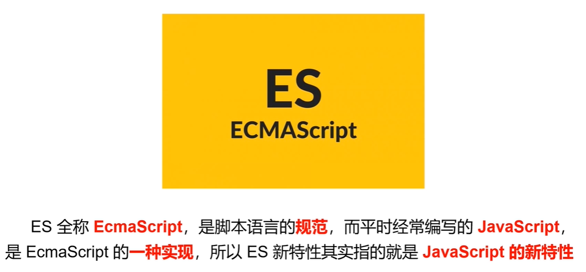
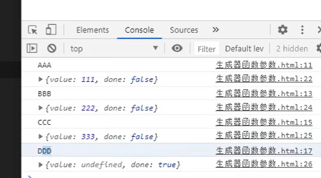
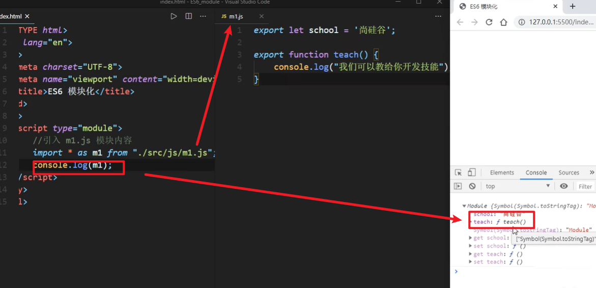
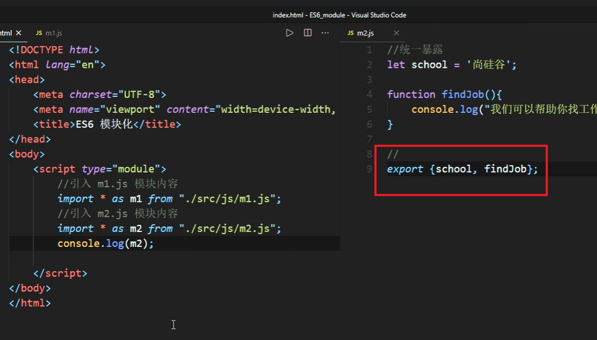
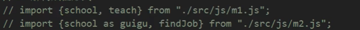
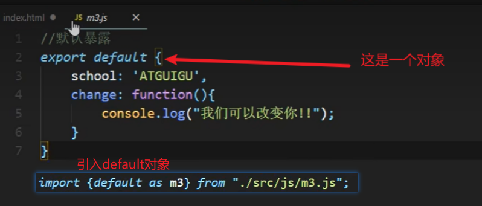
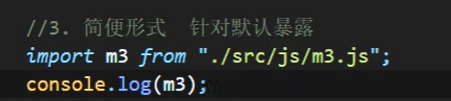

# 第 1 章 ECMASript 相关介绍

## 1.1.什么是 ECMA

ECMA（European Computer Manufacturers Association）中文名称为欧洲计算机制造商协会，这个组织的目标是评估、开发和认可电信和计算机标准。1994 年后该 组织改名为 Ecma 国际。

## 1.2.什么是 ECMAScript

ECMAScript 是由 Ecma 国际通过 ECMA-262 标准化的脚本程序设计语言。

## 1.3.什么是 ECMA-262

## 1.4.谁在维护 ECMA-262

TC39（Technical Committee 39）是推进 ECMAScript 发展的委员会。其会员都是公司（其中主要是浏览器厂商，有苹果、谷歌、微软、因特尔等）。TC39 定期 召开会议，会议由会员公司的代表与特邀专家出席

## 1.5.为什么要学习 ES6

⚫ ES6 的版本变动内容最多，具有里程碑意义
⚫ ES6 加入许多新的语法特性，编程实现更简单、高效
⚫ ES6 是前端发展趋势，就业必备技能

# 第 2 章 ECMASript 6 新特性

## 2.1.let 关键字

let 关键字用来声明变量，使用 let 声明的变量有几个特点：
1. 不允许重复声明

2. 块儿级作用域

3. 不存在变量提升

4. 不影响作用域链

  应用场景：以后声明变量使用 let 就对了

```js
<!DOCTYPE html>
<html lang="en">

<head>
    <meta charset="UTF-8">
    <meta name="viewport" content="width=device-width, initial-scale=1.0">
    <title>let</title>
</head>

<body>
    <script>
        //声明变量
        let a;
        let b, c, d;
        let e = 100;
        let f = 521, g = 'iloveyou', h = [];

        //1. 变量不能重复声明
        // let star = '罗志祥';
        // let star = '小猪';

        //2. 块儿级作用域  全局, 函数, eval
        {
            let girl = '周扬青';//如果是var的话，就可以访问的到
        }
        console.log(girl);//这个会报错

        //3. 不存在变量提升
        console.log(song);//这个会报错，因为在声明之前使用了
        let song = '恋爱达人';

        //4. 不影响作用域链
        {
            let school = '尚硅谷';
            function fn() {
                console.log(school);//向上一级查找school 输出尚硅谷
            }
            fn();
        }

    </script>
</body>

</html>
```

## 2.2. const 关键字

const 关键字用来声明常量，const 声明有以下特点
1. 声明必须赋初始值

2. 标识符一般为大写

3. 不允许重复声明

4. 值不允许修改

5. 块儿级作用域

  

  注意: 对象属性修改和数组元素变化不会出发 const 错误

  应用场景：声明对象类型使用 const，非对象类型声明选择 let

```js
<!DOCTYPE html>
<html lang="en">
<head>
    <meta charset="UTF-8">
    <meta name="viewport" content="width=device-width, initial-scale=1.0">
    <title>const 定义常量</title>
</head>
<body>
    <script>
        //声明常量
        const SCHOOL = '尚硅谷';

        //1. 一定要赋初始值
        const A;//这个会报错
        //2. 一般常量使用大写(潜规则)
        const B = 100;
        //3. 常量的值不能修改
        SCHOOL = 'ATGUIGU';//这个会报错
        //4. 块儿级作用域
        {
            const PLAYER = 'UZI';//这个对象在外部访问不到
        }
        // console.log(PLAYER);
        //5. 对于数组和对象的元素修改, 不算做对常量的修改, 不会报错
        const TEAM = ['UZI','MXLG','Ming','Letme'];
        TEAM.push('Meiko');//这个可以添加进去

        
    </script>
</body>
</html>
```

## 2.3.变量的解构赋值

ES6 允许按照一定模式，从数组和对象中提取值，对变量进行赋值，这被称 为解构赋值。

```js
<!DOCTYPE html>
<html lang="en">

<head>
    <meta charset="UTF-8">
    <meta name="viewport" content="width=device-width, initial-scale=1.0">
    <title>变量的解构赋值</title>
</head>

<body>
    <script>
        //ES6 允许按照一定模式从数组和对象中提取值，对变量进行赋值，
        //这被称为解构赋值。
        //1. 数组的结构
        const F4 = ['小沈阳', '刘能', '赵四', '宋小宝'];
        let [xiao, liu, zhaosi, song] = F4;
        console.log(xiao);//打印小沈阳
        console.log(liu);//打印刘能
        console.log(zhaosi);//打印赵四
        console.log(song);//打印宋小宝

        //2. 对象的解构
        const zhao = {
            name: '赵本山',
            age: '不详',
            xiaopin: function () {
                console.log("我可以演小品");
            }
        };

        let { name, age, xiaopin } = zhao;
        console.log(name);
        console.log(age);
        console.log(xiaopin);
        xiaopin();//调用函数


    </script>
</body>

</html>
```

## 2.4.模板字符串

模板字符串（template string）是增强版的字符串，用反引号（`）标识，

特点： 

1) 字符串中可以出现换行符 
2) 可以使用 ${xxx} 形式输出变量

```js
<!DOCTYPE html>
<html lang="en">

<head>
    <meta charset="UTF-8">
    <meta name="viewport" content="width=device-width, initial-scale=1.0">
    <title>模板字符串</title>
</head>

<body>
    <script>
        // ES6 引入新的声明字符串的方式 『``』 '' "" 
        //1. 声明
        let str1 = `我也是一个字符串哦!`;
        console.log(str, typeof str);

        //2. 内容中可以直接出现换行符
        let str2 = `<ul>
                    <li>沈腾</li>
                    <li>玛丽</li>
                    <li>魏翔</li>
                    <li>艾伦</li>
                    </ul>`;


        //3. 变量拼接
        let lovest = '魏翔';
        let out = `${lovest}是我心目中最搞笑的演员!!`;
        console.log(out);

    </script>
</body>

</html>
```

## 2.5.简化对象写法

ES6 允许在大括号里面，直接写入变量和函数，作为对象的属性和方法。这 样的书写更加简洁。

```js
<!DOCTYPE html>
<html lang="en">

<head>
    <meta charset="UTF-8">
    <meta name="viewport" content="width=device-width, initial-scale=1.0">
    <title>简化对象写法</title>
</head>

<body>
    <script>
        //ES6 允许在大括号里面，直接写入变量和函数，作为对象的属性和方法。
        //这样的书写更加简洁
        let name = '尚硅谷';
        let change = function () {
            console.log('我们可以改变你!!');
        }

        const school = {
            // 如果属性名和属性值都相同,可以直接赋值
            name,
            change,
            // 方法也可以进行简化,不用写function了
            improve() {
                console.log("我们可以提高你的技能");
            }
        }

        console.log(school);

    </script>
</body>

</html>
```

## 2.6.箭头函数

ES6 允许使用「箭头」（=>）定义函数。

箭头函数的注意点:
1) 如果形参只有一个，则小括号可以省略
2) 函数体如果只有一条语句，则花括号可以省略，函数的返回值为该条语句的执行结果
3) 箭头函数 this 指向声明时所在作用域下 this 的值
4) 箭头函数不能作为构造函数实例化
5) 不能使用 arguments

注意：箭头函数不会更改 this 指向，用来指定回调函数会非常合适

```js
<!DOCTYPE html>
<html lang="en">

<head>
    <meta charset="UTF-8">
    <meta name="viewport" content="width=device-width, initial-scale=1.0">
    <title>箭头函数</title>
</head>

<body>
    <script>
        // ES6 允许使用「箭头」（=>）定义函数。
        let fn = (a, b) => {
            return a + b;
        }
        //调用函数
        let result = fn(1, 2);
        console.log(result);


        //1. this 是静态的. this 始终指向函数声明时所在作用域下的 this 的值
        function getName() {
            console.log(this.name);//打印尚硅谷
        }
        let getName2 = () => {
            console.log(this.name);//打印尚硅谷
        }

        //设置 window 对象的 name 属性
        window.name = '尚硅谷';
        const school = {
            name: "ATGUIGU"
        }

        //直接调用
        getName();
        getName2();

        //call 方法调用
        getName.call(school);//this指向school下面的对象,打印ATGUIGU
        getName2.call(school);//this不改变,还是打印尚硅谷,1) 箭头函数 this 指向声明时所在作用域下 this 的值

        //2. 不能作为构造实例化对象
        let Person = (name, age) => {
            this.name = name;
            this.age = age;
        }
        let me = new Person('xiao', 30);
        console.log(me);//出错

        //3. 不能使用 arguments 变量
        let fn1 = () => {
            console.log(arguments);
        }
        fn1(1, 2, 3);//这个会报错

        //4. 箭头函数的简写
        //1) 省略小括号, 当形参有且只有一个的时候
        let add = n => {
            return n + n;
        }
        console.log(add(9));

        //2) 省略花括号, 当代码体只有一条语句的时候, 此时 return 必须省略
        // 而且语句的执行结果就是函数的返回值
        let pow = n => n * n;
        console.log(pow(8));

    </script>
</body>

</html>
```

## 参数默认值

```js
<!DOCTYPE html>
<html lang="en">
<head>
    <meta charset="UTF-8">
    <meta name="viewport" content="width=device-width, initial-scale=1.0">
    <title>函数参数默认值</title>
</head>
<body>
    <script>
        //ES6 允许给函数参数赋值初始值
        //1. 形参初始值 具有默认值的参数, 一般位置要靠后(潜规则)
        function add(a,b,c=10) {
            return a + b + c;
        }
        let result = add(1,2);
        console.log(result);//这样如果传入c的话，会用传入的，没有传入的话就用默认的

        //2. 与解构赋值结合
        function connect({host="127.0.0.1", username,password, port}){
            console.log(host)
            console.log(username)
            console.log(password)
            console.log(port)
        }
        connect({
            host: 'atguigu.com',//这里传入就不用担心这个问题了，因为这个是传入的对象形式
            username: 'root',
            password: 'root',
            port: 3306
        })
    </script>
</body>
</html>
```

## 2.7. rest 参数

ES6 引入 rest 参数，用于获取函数的实参，用来代替 arguments

```js
<!DOCTYPE html>
<html lang="en">
<head>
    <meta charset="UTF-8">
    <meta name="viewport" content="width=device-width, initial-scale=1.0">
    <title>rest参数</title>
</head>
<body>
    <script>
        // ES6 引入 rest 参数，用于获取函数的实参，用来代替 arguments
        // ES5 获取实参的方式
        function date(){
            console.log(arguments);
        }
        date('白芷','阿娇','思慧');//这个打印的是argments对象

        // rest 参数
        function date(...args){
            console.log(args);
        }
        date('阿娇','柏芝','思慧');//这个打印的是args数组

        // rest 参数必须要放到参数最后
        function fn(a,b,...args){
            console.log(a);
            console.log(b);
            console.log(args);
        }
        fn(1,2,3,4,5,6);//这里前两个会放到前两个形参上，后面的全都放到args数组中

    </script>
</body>
</html>
```

注意：rest 参数非常适合不定个数参数函数的场景

## 2.8. spread 扩展运算符

将一个数组转换为用逗号分割的参数序列

```js
<!DOCTYPE html>
<html lang="en">

<head>
    <meta charset="UTF-8">
    <meta name="viewport" content="width=device-width, initial-scale=1.0">
    <title>扩展运算符</title>
</head>

<body>
    <script>
        // 『...』 扩展运算符能将『数组』转换为逗号分隔的『参数序列』
        //声明一个数组 ...
        const tfboys = ['易烊千玺', '王源', '王俊凯'];
        // => '易烊千玺','王源','王俊凯'

        // 声明一个函数
        function chunwan() {
            console.log(arguments);
        }

        chunwan(...tfboys);// 相当于chunwan('易烊千玺','王源','王俊凯')


    </script>
</body>

</html>
```

综合应用

```js
<!DOCTYPE html>
<html lang="en">
<head>
    <meta charset="UTF-8">
    <meta name="viewport" content="width=device-width, initial-scale=1.0">
    <title>扩展运算符应用</title>
</head>
<body>
    <div></div>
    <div></div>
    <div></div>
    <script>
        //1. 数组的合并 情圣  误杀  唐探
        const kuaizi = ['王太利','肖央'];
        const fenghuang = ['曾毅','玲花'];
        // const zuixuanxiaopingguo = kuaizi.concat(fenghuang);//这个是之前的写法
        const zuixuanxiaopingguo = [...kuaizi, ...fenghuang];//这个是现在es6的写法
        console.log(zuixuanxiaopingguo);

        //2. 数组的克隆
        const sanzhihua = ['E','G','M'];
        const sanyecao = [...sanzhihua];//  ['E','G','M']
        console.log(sanyecao);

        //3. 将伪数组转为真正的数组
        const divs = document.querySelectorAll('div');
        const divArr = [...divs];
        console.log(divArr);// arguments
        
    </script>
</body>
</html>
```

## 2.9.Symbol

### 2.9.1.Symbol 基本使用

ES6 引入了一种新的原始数据类型 Symbol，表示独一无二的值。它是JavaScript 语言的第七种数据类型，是一种类似于字符串的数据类型。

Symbol 特点

1) Symbol 的值是唯一的，用来解决命名冲突的问题
2) Symbol 值不能与其他数据进行运算
3) Symbol 定义 的 对象属 性 不能 使 用 for…in 循 环遍 历 ，但 是可以使用Reflect.ownKeys 来获取对象的所有键名

```js
<!DOCTYPE html>
<html lang="en">

<head>
    <meta charset="UTF-8">
    <meta name="viewport" content="width=device-width, initial-scale=1.0">
    <title>symbol</title>
</head>

<body>
    <script>
        //创建Symbol

        let s2 = Symbol('尚硅谷');//这个不等于下面
        let s3 = Symbol('尚硅谷');
        //Symbol.for 创建
        let s4 = Symbol.for('尚硅谷');//这个等于下面
        let s5 = Symbol.for('尚硅谷');

        //不能与其他数据进行运算
        let result = s2 + 100;//报错
        let result = s2 > 100;//报错
        let result = s2 + s;//报错

        // JS的数据类型 USONB  you are so niubility 
        // u  undefined
        // s  string  symbol
        // o  object
        // n  null number
        // b  boolean

    </script>
</body>

</html>
```

注: 遇到唯一性的场景时要想到 Symbol


Symbol创建对象属性

```js
<!DOCTYPE html>
<html lang="en">
<head>
    <meta charset="UTF-8">
    <meta name="viewport" content="width=device-width, initial-scale=1.0">
    <title>Symbol 创建对象属性</title>
</head>
<body>
    <script>
        //向对象中添加方法 up down
        let game = {
            name:'俄罗斯方块',
            up: function(){},
            down: function(){}
        };
        
        //声明一个对象
        let methods = {
            up: Symbol(),
            down: Symbol()
        };

        //给game里面的方法赋值，赋值成method里面的方法
        game[methods.up] = function(){
            console.log("我可以改变形状");
        }

        game[methods.down] = function(){
            console.log("我可以快速下降!!");
        }

        console.log(game);

        //也可以这样赋值，跟上面性质一样
        let youxi = {
            name:"狼人杀",
            [Symbol('say')]: function(){
                console.log("我可以发言")
            },
            [Symbol('zibao')]: function(){
                console.log('我可以自爆');
            }
        }

        console.log(youxi)

        
    </script>
</body>
</html>
```

## 2.10. 迭代器

遍历器（Iterator）就是一种机制。它是一种接口，为各种不同的数据结构提供统一的访问机制。任何数据结构只要部署 Iterator 接口，就可以完成遍历操作。
1) ES6 创造了一种新的遍历命令 for...of 循环，Iterator 接口主要供 for...of 消费
2) 原生具备 iterator 接口的数据(可用 for of 遍历)
    a) Array
    b) Arguments
    c) Set
    d) Map
    e) String
    f) TypedArray
    g) NodeList
3) 工作原理
    a) 创建一个指针对象，指向当前数据结构的起始位置
    b) 第一次调用对象的 next 方法，指针自动指向数据结构的第一个成员
    c) 接下来不断调用 next 方法，指针一直往后移动，直到指向最后一个成员
    d) 每调用 next 方法返回一个包含 value 和 done 属性的对象
    注: 需要自定义遍历数据的时候，要想到迭代器。

```js
<!DOCTYPE html>
<html lang="en">

<head>
    <meta charset="UTF-8">
    <meta name="viewport" content="width=device-width, initial-scale=1.0">
    <title>迭代器</title>
</head>

<body>
    <script>
        //声明一个数组
        const xiyou = ['唐僧', '孙悟空', '猪八戒', '沙僧'];

        //使用 for...of 遍历数组
        for (let v of xiyou) {
            console.log(v);//唐僧。。
        }

        let iterator = xiyou[Symbol.iterator]();

        //调用对象的next方法
        console.log(iterator.next());
        console.log(iterator.next());
        console.log(iterator.next());
        console.log(iterator.next());
        console.log(iterator.next());
    </script>
</body>

</html>
```

迭代器自定义遍历对象

```html
<!DOCTYPE html>
<html lang="en">

<head>
    <meta charset="UTF-8">
    <meta name="viewport" content="width=device-width, initial-scale=1.0">
    <title>自定义遍历数据</title>
</head>

<body>
    <script>
        //声明一个对象
        const banji = {
            name: "终极一班",
            stus: [
                'xiaoming',
                'xiaoning',
                'xiaotian',
                'knight'
            ],
            [Symbol.iterator]() {
                //索引变量
                let index = 0;
                //
                let _this = this;
                return {
                    next: function () {
                        if (index < _this.stus.length) {
                            const result = { value: _this.stus[index], done: false };
                            //下标自增
                            index++;
                            //返回结果
                            return result;
                        } else {
                            return { value: undefined, done: true };
                        }
                    }
                };
            }
        }

        //遍历这个对象 
        for (let v of banji) {
            console.log(v);
        }
    </script>
</body>

</html>
```

## 2.11. 生成器

生成器函数是 ES6 提供的一种异步编程解决方案，语法行为与传统函数完全不同

代码说明：
1) * 的位置没有限制
2) 生成器函数返回的结果是迭代器对象，调用迭代器对象的 next 方法可以得到yield 语句后的值
3) yield 相当于函数的暂停标记，也可以认为是函数的分隔符，每调用一次 next方法，执行一段代码
4) next 方法可以传递实参，作为 yield 语句的返回值

```html
<!DOCTYPE html>
<html lang="en">
<head>
    <meta charset="UTF-8">
    <meta name="viewport" content="width=device-width, initial-scale=1.0">
    <title>生成器</title>
</head>
<body>
    <script>    
        //生成器其实就是一个特殊的函数
        //函数代码的分隔符
        function * gen(){
            console.log(111);
            yield '一只没有耳朵';
            console.log(222);
            yield '一只没有尾部';
            console.log(333);
            yield '真奇怪';
            console.log(444);
        }

        let iterator = gen();
        console.log(iterator.next());
        console.log(iterator.next());
        console.log(iterator.next());
        console.log(iterator.next());

    </script>
</body>
</html>
```


生成器函数参数

```html
<!DOCTYPE html>
<html lang="en">
<head>
    <meta charset="UTF-8">
    <meta name="viewport" content="width=device-width, initial-scale=1.0">
    <title>生成器函数参数</title>
</head>
<body>
    <script>
        function * gen(arg){
            console.log(arg);//AAA
            let one = yield 111;
            console.log(one);//BBB
            let two = yield 222;
            console.log(two);//CCC
            let three = yield 333;
            console.log(three);//DDD
        }

        //执行获取迭代器对象
        let iterator = gen('AAA');
        console.log(iterator.next());
        //next方法可以传入实参
        console.log(iterator.next('BBB'));
        console.log(iterator.next('CCC'));
        console.log(iterator.next('DDD'));
        
    </script>
</body>
</html>
```



实例1：

```html
<!DOCTYPE html>
<html lang="en">

<head>
    <meta charset="UTF-8">
    <meta name="viewport" content="width=device-width, initial-scale=1.0">
    <title>生成器函数实例</title>
</head>

<body>
    <script>
        // 异步编程  文件操作 网络操作(ajax, request) 数据库操作
        // 1s 后控制台输出 111  2s后输出 222  3s后输出 333 
        // 回调地狱
        // setTimeout(() => {
        //     console.log(111);
        //     setTimeout(() => {
        //         console.log(222);
        //         setTimeout(() => {
        //             console.log(333);
        //         }, 3000);
        //     }, 2000);
        // }, 1000);

        function one(){
            setTimeout(()=>{
                console.log(111);
                iterator.next();
            },1000)
        }

        function two(){
            setTimeout(()=>{
                console.log(222);
                iterator.next();
            },2000)
        }

        function three(){
            setTimeout(()=>{
                console.log(333);
                iterator.next();
            },3000)
        }

        function * gen(){
            yield one();
            yield two();
            yield three();
        }

        //调用生成器函数
        let iterator = gen();
        iterator.next();

    </script>
</body>

</html>
```

   


 模拟获取  用户数据  订单数据  商品数据 

```html
<!DOCTYPE html>
<html lang="en">
<head>
    <meta charset="UTF-8">
    <meta name="viewport" content="width=device-width, initial-scale=1.0">
    <title>生成器函数</title>
</head>
<body>
    <script>
        //模拟获取  用户数据  订单数据  商品数据 
        function getUsers(){
            setTimeout(()=>{
                let data = '用户数据';
                //调用 next 方法, 并且将数据传入
                iterator.next(data);
            }, 1000);
        }

        function getOrders(){
            setTimeout(()=>{
                let data = '订单数据';
                iterator.next(data);
            }, 1000)
        }

        function getGoods(){
            setTimeout(()=>{
                let data = '商品数据';
                iterator.next(data);
            }, 1000)
        }

        function * gen(){
            let users = yield getUsers();
            let orders = yield getOrders();
            let goods = yield getGoods();
        }

        //调用生成器函数
        let iterator = gen();
        iterator.next();

        

    </script>
</body>
</html>
```

## 2.12 Promise

Promise 是 ES6 引入的异步编程的新解决方案。语法上 Promise 是一个构造函数，用来封装异步操作并可以获取其成功或失败的结果。
1) Promise 构造函数: Promise (excutor) {}
2) Promise.prototype.then 方法
3) Promise.prototype.catch 方法

```html
<!DOCTYPE html>
<html lang="en">

<head>
    <meta charset="UTF-8">
    <meta name="viewport" content="width=device-width, initial-scale=1.0">
    <title>Promise基本语法</title>
</head>

<body>
    <script>
        //实例化 Promise 对象
        const p = new Promise(function (resolve, reject) {
            setTimeout(function () {
                // let data = '数据库中的用户数据';
                // resolve,调用resolve，会标记promise对象为成功，会执行value那个函数
                // resolve(data);

                //reject,调用reject，会标记promise对象为失败，会执行reason那个函数
                let err = '数据读取失败';
                reject(err);
            }, 1000);
        });

        //调用 promise 对象的 then 方法
        p.then(function (value) {
            console.log(value);
        }, function (reason) {
            console.error(reason);
        })
    </script>
</body>

</html>
```


用promise封装读取文件

```js
//1. 引入 fs 模块
const fs = require('fs');

//2. 调用方法读取文件
// fs.readFile('./resources/为学.md', (err, data)=>{
//     //如果失败, 则抛出错误
//     if(err) throw err;
//     //如果没有出错, 则输出内容
//     console.log(data.toString());
// });

//3. 使用 Promise 封装
const p = new Promise(function(resolve, reject){
    fs.readFile("./resources/为学.mda", (err, data)=>{
        //判断如果失败
        if(err) reject(err);
        //如果成功
        resolve(data);
    });
});

p.then(function(value){
    console.log(value.toString());
}, function(reason){
    console.log("读取失败!!");
});

```


用promise封装ajax

```html
<!DOCTYPE html>
<html lang="en">

<head>
    <meta charset="UTF-8">
    <meta name="viewport" content="width=device-width, initial-scale=1.0">
    <title>发送 AJAX 请求</title>
</head>

<body>
    <script>
        // 接口地址: https://api.apiopen.top/getJoke
        const p = new Promise((resolve, reject) => {
            //1. 创建对象
            const xhr = new XMLHttpRequest();

            //2. 初始化
            xhr.open("GET", "https://api.apiopen.top/getJ");

            //3. 发送
            xhr.send();

            //4. 绑定事件, 处理响应结果
            xhr.onreadystatechange = function () {
                //判断
                if (xhr.readyState === 4) {
                    //判断响应状态码 200-299
                    if (xhr.status >= 200 && xhr.status < 300) {
                        //表示成功
                        resolve(xhr.response);
                    } else {
                        //如果失败
                        reject(xhr.status);
                    }
                }
            }
        })
        
        //指定回调
        p.then(function(value){
            console.log(value);
        }, function(reason){
            console.error(reason);
        });
    </script>
</body>

</html>
```


promise的then方法

```html
<!DOCTYPE html>
<html lang="en">
<head>
    <meta charset="UTF-8">
    <meta name="viewport" content="width=device-width, initial-scale=1.0">
    <title>Promise.prototype.then</title>
</head>
<body>
    <script>
        //创建 promise 对象
        const p = new Promise((resolve, reject)=>{
            setTimeout(()=>{
                resolve('用户数据');
                // reject('出错啦');
            }, 1000)
        });

        //调用 then 方法  then方法的返回结果是 Promise 对象, 对象状态由回调函数的执行结果决定
        //如果回调函数中返回的结果是 非 promise 类型的属性, 状态为成功, 返回值为对象的成功的值

        const result = p.then(value => {
            console.log(value);
            //1. 非 promise 类型的属性
            // return 'iloveyou';
            //2. 是 promise 对象
            // return new Promise((resolve, reject)=>{
            //     // resolve('ok');
            //     reject('error');
            // });
            //3. 抛出错误
            // throw new Error('出错啦!');
        }, reason=>{
            console.warn(reason);
        });

        //链式调用
        p.then(value=>{

        }).then(value=>{

        });


    </script>
</body>
</html>
```


promise的catch方法

```html
<!DOCTYPE html>
<html lang="en">
<head>
    <meta charset="UTF-8">
    <meta name="viewport" content="width=device-width, initial-scale=1.0">
    <title>catch方法</title>
</head>
<body>
    <script>
        const p = new Promise((resolve, reject)=>{
            setTimeout(()=>{
                //设置 p 对象的状态为失败, 并设置失败的值
                reject("出错啦!");
            }, 1000)
        });
        p.catch(function(reason){
            console.warn(reason);
        });
    </script> 
</body>
</html>
```

## 2.13. Set

ES6 提供了新的数据结构 Set（集合）。它类似于数组，但成员的值都是唯一的，集合实现了 iterator 接口，所以可以使用『扩展运算符』和『for…of…』进行遍历，集合的属性和方法：
1) size 返回集合的元素个数
2) add 增加一个新元素，返回当前集合
3) delete 删除元素，返回 boolean 值
4) has 检测集合中是否包含某个元素，返回 boolean 值
5) clear 清空集合，返回 undefined

```html
<!DOCTYPE html>
<html lang="en">
<head>
    <meta charset="UTF-8">
    <meta name="viewport" content="width=device-width, initial-scale=1.0">
    <title>集合</title>
</head>
<body>
    <script>
        //声明一个 set
        let s = new Set();
        let s2 = new Set(['大事儿','小事儿','好事儿','坏事儿','小事儿']);

        //元素个数
        // console.log(s2.size);
        //添加新的元素
        // s2.add('喜事儿');
        //删除元素
        // s2.delete('坏事儿');
        //检测
        // console.log(s2.has('糟心事'));
        //清空
        // s2.clear();
        // console.log(s2);

        for(let v of s2){
            console.log(v);
        }
        
    </script>
</body>
</html>
```

## 2.14. Map

ES6 提供了 Map 数据结构。它类似于对象，也是键值对的集合。但是“键”的范围不限于字符串，各种类型的值（包括对象）都可以当作键。Map 也实现了iterator 接口，所以可以使用『扩展运算符』和『for…of…』进行遍历。Map 的属性和方法：
1) size 返回 Map 的元素个数
2) set 增加一个新元素，返回当前 Map
3) get 返回键名对象的键值
4) has 检测 Map 中是否包含某个元素，返回 boolean 值
5) clear 清空集合，返回 undefined

```html
<!DOCTYPE html>
<html lang="en">
<head>
    <meta charset="UTF-8">
    <meta name="viewport" content="width=device-width, initial-scale=1.0">
    <title>Map</title>
</head>
<body>
    <script>
        //声明 Map
        let m = new Map();

        //添加元素
        m.set('name','尚硅谷');
        m.set('change', function(){
            console.log("我们可以改变你!!");
        });
        let key = {
            school : 'ATGUIGU'
        };
        m.set(key, ['北京','上海','深圳']);

        //size
        // console.log(m.size);

        //删除
        // m.delete('name');

        //获取
        // console.log(m.get('change'));
        // console.log(m.get(key));

        //清空
        // m.clear();

        //遍历
        for(let v of m){
            console.log(v);
        }

        // console.log(m);

    </script>
</body>
</html>
```

## 2.15. class 类

ES6 提供了更接近传统语言的写法，引入了 Class（类）这个概念，作为对象的模板。通过 class 关键字，可以定义类。基本上，ES6 的 class 可以看作只是一个语法糖，它的绝大部分功能，ES5 都可以做到，新的 class 写法只是让对象原型的写法更加清晰、更像面向对象编程的语法而已。

知识点：

1) class 声明类
2) constructor 定义构造函数初始化
3) extends 继承父类
4) super 调用父级构造方法
5) static 定义静态方法和属性
6) 父类方法可以重写


class类

```html
<!DOCTYPE html>
<html lang="en">

<head>
    <meta charset="UTF-8">
    <meta name="viewport" content="width=device-width, initial-scale=1.0">
    <title>类声明</title>
</head>

<body>
    <script>
        //es5的类
        // //手机
        // function Phone(brand, price){
        //     this.brand = brand;
        //     this.price = price;
        // }

        // //添加方法
        // Phone.prototype.call = function(){
        //     console.log("我可以打电话!!");
        // }

        // //实例化对象
        // let Huawei = new Phone('华为', 5999);
        // Huawei.call();
        // console.log(Huawei);


        
        //class
        class Shouji {
            //构造方法 名字不能修改
            constructor(brand, price) {
                this.brand = brand;
                this.price = price;
            }

            //方法必须使用该语法, 不能使用 ES5 的对象完整形式
            call() {
                console.log("我可以打电话!!");
            }
        }

        let onePlus = new Shouji("1+", 1999);

        console.log(onePlus);
    </script>
</body>

</html>
```


类的静态成员

```html
<!DOCTYPE html>
<html lang="en">
<head>
    <meta charset="UTF-8">
    <meta name="viewport" content="width=device-width, initial-scale=1.0">
    <title>静态成员</title>
</head>
<body>
    <script>
        // function Phone(){

        // }
        // Phone.name = '手机';
        // Phone.change = function(){
        //     console.log("我可以改变世界");
        // }
        // Phone.prototype.size = '5.5inch';

        // let nokia = new Phone();

        // console.log(nokia.name);
        // // nokia.change();
        // console.log(nokia.size);

        class Phone{
            //静态属性
            static name = '手机';
            static change(){
                console.log("我可以改变世界");
            }
        }

        let nokia = new Phone();
        console.log(nokia.name);//undefined
        console.log(Phone.name);//手机
    </script>
</body>
</html>
```


class类继承，这个跟Java也太像了吧

```html
<!DOCTYPE html>
<html lang="en">
<head>
    <meta charset="UTF-8">
    <meta name="viewport" content="width=device-width, initial-scale=1.0">
    <title>类继承-2</title>
</head>
<body>
    <script>
        class Phone{
            //构造方法
            constructor(brand, price){
                this.brand = brand;
                this.price = price;
            }
            //父类的成员属性
            call(){
                console.log("我可以打电话!!");
            }
        }

        class SmartPhone extends Phone {
            //构造方法
            constructor(brand, price, color, size){
                super(brand, price);// Phone.call(this, brand, price)
                this.color = color;
                this.size = size;
            }

            photo(){
                console.log("拍照");
            }

            playGame(){
                console.log("玩游戏");
            }

            call(){
                console.log('我可以进行视频通话');
            }
        }

        const xiaomi = new SmartPhone('小米',799,'黑色','4.7inch');
        // console.log(xiaomi);
        xiaomi.call();
        xiaomi.photo();
        xiaomi.playGame();
    </script>
</body>
</html>
```


class的get set方法

```html
<!DOCTYPE html>
<html lang="en">
<head>
    <meta charset="UTF-8">
    <meta name="viewport" content="width=device-width, initial-scale=1.0">
    <title>get 和 set</title>
</head>
<body>
    <script>
        // get 和 set  
        class Phone{
            get price(){
                console.log("价格属性被读取了");
                //这个返回值就是平时的返回值
                return 'iloveyou';
            }

            //必须使用这个参数
            set price(newVal){
                console.log('价格属性被修改了');
            }
        }

        //实例化对象
        let s = new Phone();

        // console.log(s.price);
        s.price = 'free';
    </script>
</body>
</html>
```

## 2.16. 数值扩展

```html
<!DOCTYPE html>
<html lang="en">
<head>
    <meta charset="UTF-8">
    <meta name="viewport" content="width=device-width, initial-scale=1.0">
    <title>数值扩展</title>
</head>
<body>
    <script>
        //0. Number.EPSILON 是 JavaScript 表示的最小精度
        //EPSILON 属性的值接近于 2.2204460492503130808472633361816E-16
        // function equal(a, b){
        //     if(Math.abs(a-b) < Number.EPSILON){
        //         return true;
        //     }else{
        //         return false;
        //     }
        // }
        // console.log(0.1 + 0.2 === 0.3);
        // console.log(equal(0.1 + 0.2, 0.3))

        //1. 二进制和八进制
        // let b = 0b1010;
        // let o = 0o777;
        // let d = 100;
        // let x = 0xff;
        // console.log(x);

        //2. Number.isFinite  检测一个数值是否为有限数
        // console.log(Number.isFinite(100));
        // console.log(Number.isFinite(100/0));
        // console.log(Number.isFinite(Infinity));
        
        //3. Number.isNaN 检测一个数值是否为 NaN 
        // console.log(Number.isNaN(123)); 

        //4. Number.parseInt Number.parseFloat字符串转整数
        // console.log(Number.parseInt('5211314love'));
        // console.log(Number.parseFloat('3.1415926神奇'));

        //5. Number.isInteger 判断一个数是否为整数
        // console.log(Number.isInteger(5));
        // console.log(Number.isInteger(2.5));

        //6. Math.trunc 将数字的小数部分抹掉  
        // console.log(Math.trunc(3.5));

        //7. Math.sign 判断一个数到底为正数 负数 还是零
        console.log(Math.sign(100));
        console.log(Math.sign(0));
        console.log(Math.sign(-20000));

    </script>
</body>
</html>
```

## 2.17. 对象扩展

ES6 新增了一些 Object 对象的方法

1) Object.is 比较两个值是否严格相等，与『===』行为基本一致（+0 与 NaN）
2) Object.assign 对象的合并，将源对象的所有可枚举属性，复制到目标对象
3) __proto__、setPrototypeOf、 setPrototypeOf 可以直接设置对象的原型


```html
<!DOCTYPE html>
<html lang="en">
<head>
    <meta charset="UTF-8">
    <meta name="viewport" content="width=device-width, initial-scale=1.0">
    <title>对象方法扩展</title>
</head>
<body>
    <script>
        //1. Object.is 判断两个值是否完全相等 
        // console.log(Object.is(120, 120));// === 
        // console.log(Object.is(NaN, NaN));// === 
        // console.log(NaN === NaN);// === 

        //2. Object.assign 对象的合并
        // const config1 = {
        //     host: 'localhost',
        //     port: 3306,
        //     name: 'root',
        //     pass: 'root',
        //     test: 'test'
        // };
        // const config2 = {
        //     host: 'http://atguigu.com',
        //     port: 33060,
        //     name: 'atguigu.com',
        //     pass: 'iloveyou',
        //     test2: 'test2'
        // }
        // console.log(Object.assign(config1, config2));

        //3. Object.setPrototypeOf 设置原型对象  Object.getPrototypeof
        const school = {
            name: '尚硅谷'
        }
        const cities = {
            xiaoqu: ['北京','上海','深圳']
        }
        Object.setPrototypeOf(school, cities);
        console.log(Object.getPrototypeOf(school));
        console.log(school);


        
    </script>
</body>
</html>
```


## 2.18. 模块化

模块化是指将一个大的程序文件，拆分成许多小的文件，然后将小文件组合起来。

### 2.18.1. 模块化的好处

模块化的优势有以下几点：

1) 防止命名冲突
2) 代码复用
3) 高维护性

### 2.18.2. 模块化规范产品

ES6 之前的模块化规范有：

1) CommonJS => NodeJS、Browserify
2) AMD => requireJS
3) CMD => seaJS


## 2.18.3. ES6 模块化语法

模块功能主要由两个命令构成：export 和 import。
⚫ export 命令用于规定模块的对外接口
⚫ import 命令用于输入其他模块提供的功能

### 暴露

分别暴露




统一暴露




默认暴露


### 引入

通用

就是上面那一种


解构






简便形式 只能针对默认暴露



# 第 3 章 ECMASript 7 新特性

## 3.1.Array.prototype.includes

Includes 方法用来检测数组中是否包含某个元素，返回布尔类型值

## 3.2.指数操作符

在 ES7 中引入指数运算符「**」，用来实现幂运算，功能与 Math.pow 结果相同

```html
<!DOCTYPE html>
<html lang="en">
<head>
    <meta charset="UTF-8">
    <meta name="viewport" content="width=device-width, initial-scale=1.0">
    <title>ES7 新特性</title>
</head>
<body>
    <script>
        // includes   indexOf
        // const mingzhu = ['西游记','红楼梦','三国演义','水浒传'];

        //判断
        // console.log(mingzhu.includes('西游记'));//true
        // console.log(mingzhu.includes('金瓶梅'));//false

        // **
        console.log(2 ** 10);// 这个和下面的一样
        console.log(Math.pow(2, 10));
        
    </script>
</body>
</html>
```

# 第 4 章 ECMASript 8 新特性

## 4.1.async 和 await

async 和 await 两种语法结合可以让异步代码像同步代码一样

### 4.1.1.async 函数

1. async 函数的返回值为 promise 对象，
2. promise 对象的结果由 async 函数执行的返回值决定

```html
<!DOCTYPE html>
<html lang="en">

<head>
    <meta charset="UTF-8">
    <meta name="viewport" content="width=device-width, initial-scale=1.0">
    <title>async函数</title>
</head>

<body>
    <script>
        //async 函数
        async function fn() {
            // 返回一个字符串
            // return '尚硅谷';
            // 返回的结果不是一个 Promise 类型的对象, 返回的结果就是成功 Promise 对象
            // return;
            //抛出错误, 返回的结果是一个失败的 Promise
            // throw new Error('出错啦!');
            //返回的结果如果是一个 Promise 对象
            return new Promise((resolve, reject) => {
                resolve('成功的数据');
                // reject("失败的错误");
            });
        }

        const result = fn();

        //调用 then 方法
        result.then(value => {
            console.log(value);//如果是执行的resolve方法，会执行这个方法
        }, reason => {
            console.warn(reason);
        })
    </script>
</body>

</html>
```

### 4.1.2.await 表达式

1. await 必须写在 async 函数中，async可以没有await
2. await 右侧的表达式一般为 promise 对象
3. await 返回的是 promise 成功的值
4. await 的 promise 失败了, 就会抛出异常, 需要通过 try...catch 捕获处理

```html
<!DOCTYPE html>
<html lang="en">

<head>
    <meta charset="UTF-8">
    <meta name="viewport" content="width=device-width, initial-scale=1.0">
    <title>await</title>
</head>

<body>
    <script>
        //创建 promise 对象
        const p = new Promise((resolve, reject) => {
            // resolve("用户数据");
            reject("失败啦!");
        })

        // await 要放在 async 函数中.
        async function main() {
            try {
                let result = await p;
                //
                console.log(result);
            } catch (e) {
                console.log(e);
            }
        }
        //调用函数
        main();
    </script>
</body>

</html>
```


读取文件

```js
//1. 引入 fs 模块
const fs = require("fs");

//读取『为学』
function readWeiXue() {
    return new Promise((resolve, reject) => {
        fs.readFile("./resources/为学.md", (err, data) => {
            //如果失败
            if (err) reject(err);
            //如果成功
            resolve(data);
        })
    })
}

function readChaYangShi() {
    return new Promise((resolve, reject) => {
        fs.readFile("./resources/插秧诗.md", (err, data) => {
            //如果失败
            if (err) reject(err);
            //如果成功
            resolve(data);
        })
    })
}

function readGuanShu() {
    return new Promise((resolve, reject) => {
        fs.readFile("./resources/观书有感.md", (err, data) => {
            //如果失败
            if (err) reject(err);
            //如果成功
            resolve(data);
        })
    })
}

//声明一个 async 函数
async function main(){
    //获取为学内容
    let weixue = await readWeiXue();
    //获取插秧诗内容
    let chayang = await readChaYangShi();
    // 获取观书有感
    let guanshu = await readGuanShu();

    console.log(weixue.toString());
    console.log(chayang.toString());
    console.log(guanshu.toString());
}

main();
```


ajax

```html
<!DOCTYPE html>
<html lang="en">

<head>
    <meta charset="UTF-8">
    <meta name="viewport" content="width=device-width, initial-scale=1.0">
    <title>发送 AJAX 请求</title>
</head>

<body>
    <script>
        // 发送 AJAX 请求, 返回的结果是 Promise 对象
        function sendAJAX(url) {
            return new Promise((resolve, reject) => {
                //1. 创建对象
                const x = new XMLHttpRequest();

                //2. 初始化
                x.open('GET', url);

                //3. 发送
                x.send();

                //4. 事件绑定
                x.onreadystatechange = function () {
                    if (x.readyState === 4) {
                        if (x.status >= 200 && x.status < 300) {
                            //成功啦
                            resolve(x.response);
                        } else {
                            //如果失败
                            reject(x.status);
                        }
                    }
                }
            })
        }

        //promise then 方法测试
        // sendAJAX("https://api.apiopen.top/getJoke").then(value=>{
        //     console.log(value);
        // }, reason=>{})

        // async 与 await 测试  axios
        async function main() {
            //发送 AJAX 请求
            let result = await sendAJAX("https://api.apiopen.top/getJoke");
            //再次测试
            let tianqi = await sendAJAX('https://www.tianqiapi.com/api/?version=v1&city=%E5%8C%97%E4%BA%AC&appid=23941491&appsecret=TXoD5e8P')

            console.log(tianqi);
        }

        main();

    </script>
</body>

</html>
```


## 4.2.Object.values 和 Object.entries

1. Object.values()方法返回一个给定对象的所有可枚举属性值的数组
2. Object.entries()方法返回一个给定对象自身可遍历属性 [key,value] 的数组
   4.3.Object.getOwnPropertyDescriptors
   该方法返回指定对象所有自身属性的描述对象


# 第 5 章 ECMASript 9 新特性

## 5.1.Rest/Spread 属性

Rest 参数与 spread 扩展运算符在 ES6 中已经引入，不过 ES6 中只针对于数组，在 ES9 中为对象提供了像数组一样的 rest 参数和扩展运算符

```html
 <!DOCTYPE html>
<html lang="en">

<head>
    <meta charset="UTF-8">
    <meta name="viewport" content="width=device-width, initial-scale=1.0">
    <title>对象展开</title>
</head>

<body>
    <!-- 
        Rest 参数与 spread 扩展运算符在 ES6 中已经引入，不过 ES6 中只针对于数组，
        在 ES9 中为对象提供了像数组一样的 rest 参数和扩展运算符
     -->
    <script>
        //rest 参数
        function connect({host, port, ...user}){
            console.log(host);
            console.log(port);
            console.log(user);
        }

        connect({
            host: '127.0.0.1',
            port: 3306,
            username: 'root',
            password: 'root',
            type: 'master'
        });


        //对象合并
        const skillOne = {
            q: '天音波'
        }

        const skillTwo = {
            w: '金钟罩'
        }

        const skillThree = {
            e: '天雷破'
        }
        const skillFour = {
            r: '猛龙摆尾'
        }

        const mangseng = {...skillOne, ...skillTwo, ...skillThree, ...skillFour};

        console.log(mangseng)//这里做了一个对象的合并


    </script>

</body>

</html>
```


## 5.2.正则表达式命名捕获组

ES9 允许命名捕获组使用符号`『?<name>』`,这样获取捕获结果可读性更强

```html
<!DOCTYPE html>
<html lang="en">
<head>
    <meta charset="UTF-8">
    <meta name="viewport" content="width=device-width, initial-scale=1.0">
    <title>正则扩展-反向断言</title>
</head>
<body>
    <script>
        //声明字符串
        let str = 'JS5211314你知道么555啦啦啦';
        //正向断言 根据后面的内容进行获取
        const reg = /\d+(?=啦)/;//获取啦前面的数字
        const result = reg.exec(str);

        //反向断言 根据前面的内容进行获取
        const reg = /(?<=么)\d+/;//获取么后面的数字
        const result = reg.exec(str);
        console.log(result);
    </script>
</body>
</html>
```

# 第 6 章 ECMASript 10 新特性

## 6.1.Object.fromEntries

```js
<script>
    //二维数组
    // const result = Object.fromEntries([
    //     ['name','尚硅谷'],
    //     ['xueke', 'Java,大数据,前端,云计算']
    // ]);

    //Map
    // const m = new Map();
    // m.set('name','ATGUIGU');
    // const result = Object.fromEntries(m);

    //Object.entries ES8
    const arr = Object.entries({
        name: "尚硅谷"
    })
console.log(arr);
</script>
```


## 6.2.trimStart 和 trimEnd

```js
<!DOCTYPE html>
<html lang="en">
<head>
    <meta charset="UTF-8">
    <meta name="viewport" content="width=device-width, initial-scale=1.0">
    <title>trimStart 与 trimEnd</title>
</head>
<body>
    <script>    
        // trim
        let str = '   iloveyou   ';

        console.log(str);
        console.log(str.trimStart());
        console.log(str.trimEnd());
    </script>
</body>
</html>
```

## 6.3.Array.prototype.flat 与 flatMap

```html
<!DOCTYPE html>
<html lang="en">
<head>
    <meta charset="UTF-8">
    <meta name="viewport" content="width=device-width, initial-scale=1.0">
    <title>flat 与 flatMap</title>
</head>
<body>
    <script>
        //flat 平
        //将多维数组转化为低位数组
        // const arr = [1,2,3,4,[5,6]];
        // const arr = [1,2,3,4,[5,6,[7,8,9]]];
        //参数为深度 是一个数字
        // console.log(arr.flat(2));  

        //flatMap
        const arr = [1,2,3,4];
        const result = arr.flatMap(item => [item * 10]);
        console.log(result);
    </script>
</body>
</html>
```

## 6.4.Symbol.prototype.description

```js
<!DOCTYPE html>
<html lang="en">
<head>
    <meta charset="UTF-8">
    <meta name="viewport" content="width=device-width, initial-scale=1.0">
    <title>Symbol.prototype.description</title>
</head>
<body>
    <script>
        //创建 Symbol
        let s = Symbol('尚硅谷');

        console.log(s.description);//尚硅谷
    </script>
</body>

</html>
```

# 第 7 章 ECMASript 11 新特性

## 7.1.String.prototype.matchAll

## 7.2.类的私有属性

## 7.3.Promise.allSettled

## 7.4.可选链操作符

## 7.5.动态 import 导入

## 7.6.globalThis 对象
