# 微服务技术栈

# 认识微服务

## 单体架构

**单体架构**：将业务的所有功能集中在一个项目中开发，打成一个包部署。

[](https://cdn.xn2001.com/img/2021/20210901083809.png)


**优点**：架构简单，部署成本低

**缺点**：耦合度高（维护困难、升级困难）

## 分布式架构

**分布式架构**：根据业务功能对系统做拆分，每个业务功能模块作为独立项目开发，称为一个服务。

[](https://cdn.xn2001.com/img/2021/20210901092921.png)


**优点**：降低服务耦合，有利于服务升级和拓展

**缺点**：服务调用关系错综复杂

分布式架构虽然降低了服务耦合，但是服务拆分时也有很多问题需要思考：

- 服务拆分的粒度如何界定？
- 服务之间如何调用？
- 服务集群地址如何维护?
- 服务的健康状态如何感知?
- 服务的调用关系如何管理？

**人们需要制定一套行之有效的标准来约束分布式架构。**

## 微服务

微服务的架构特征：

- 单一职责：微服务拆分粒度更小，每一个服务都对应唯一的业务能力，做到单一职责
- 自治：团队独立、技术独立、数据独立，独立部署和交付
- 面向服务：服务提供统一标准的接口，与语言和技术无关
- 隔离性强：服务调用做好隔离、容错、降级，避免出现级联问题

[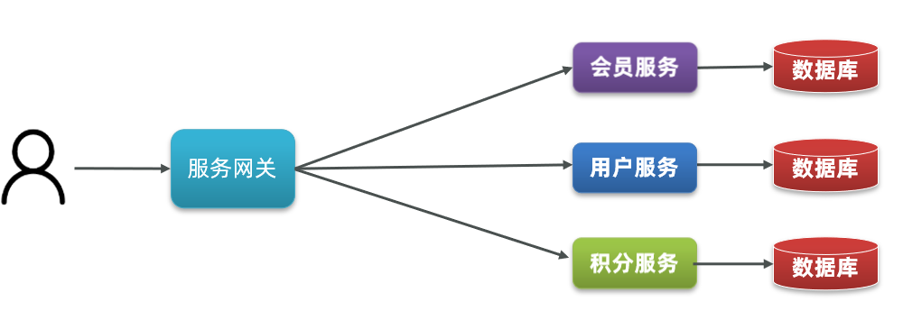](https://cdn.xn2001.com/img/2022/202205162352847.png)


微服务的上述特性**其实是在给分布式架构制定一个标准**，进一步降低服务之间的耦合度，提供服务的独立性和灵活性。做到**高内聚，低耦合**。

**因此，可以认为微服务是一种经过良好架构设计的分布式架构方案 。**

其中在 Java 领域最引人注目的就是 SpringCloud 提供的方案了。

## SpringCloud

SpringCloud 是目前国内使用最广泛的微服务框架。

官网地址：https://spring.io/projects/spring-cloud。

SpringCloud 集成了各种微服务功能组件，并基于 SpringBoot 实现了这些组件的自动装配，从而提供了良好的开箱即用体验。

其中常见的组件包括：

[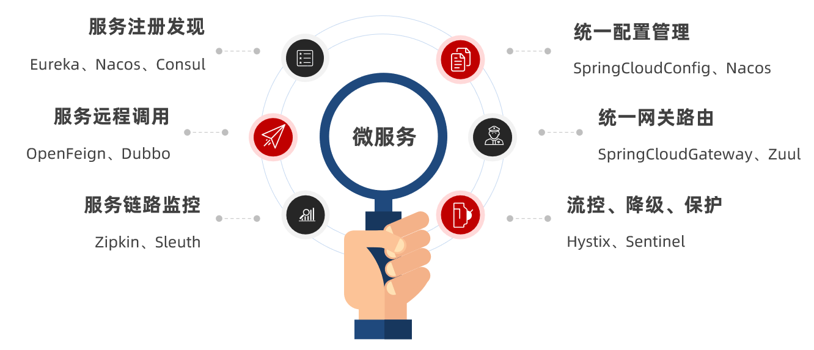](https://cdn.xn2001.com/img/2021/20210901083717.png)


另外，SpringCloud 底层是依赖于 SpringBoot 的，并且有版本的兼容关系，如下：

[](https://cdn.xn2001.com/img/2021/20210901084050.png)


## 内容知识

[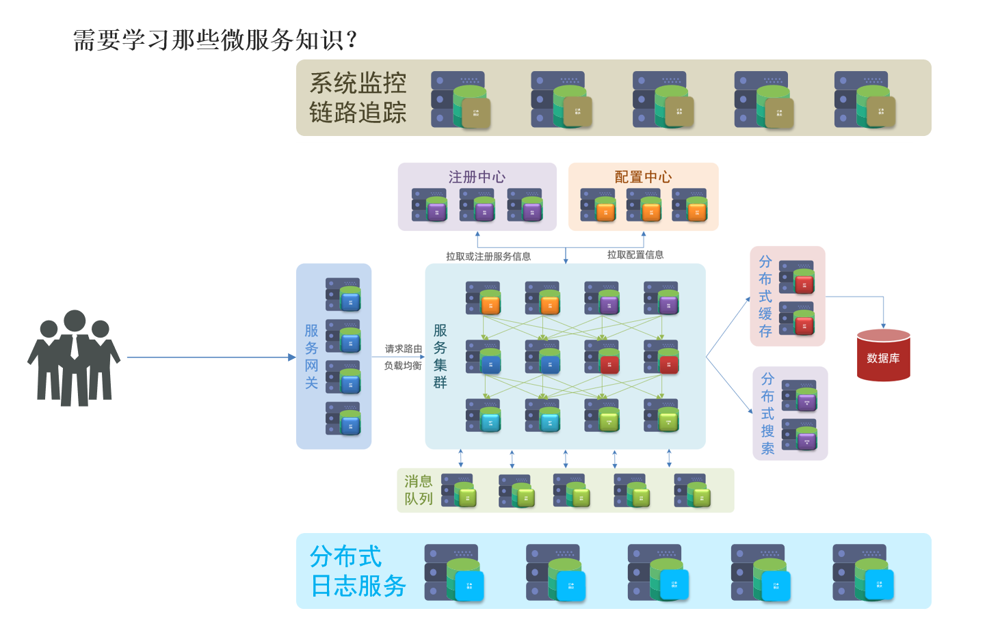](https://cdn.xn2001.com/img/2021/20210901092925.png)

需要学习的微服务技术


[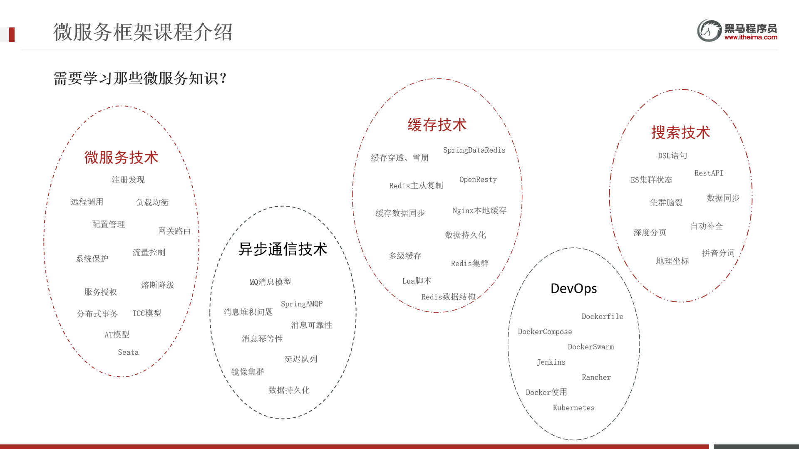](https://cdn.xn2001.com/img/2021/20210901084131.png)

技术栈


[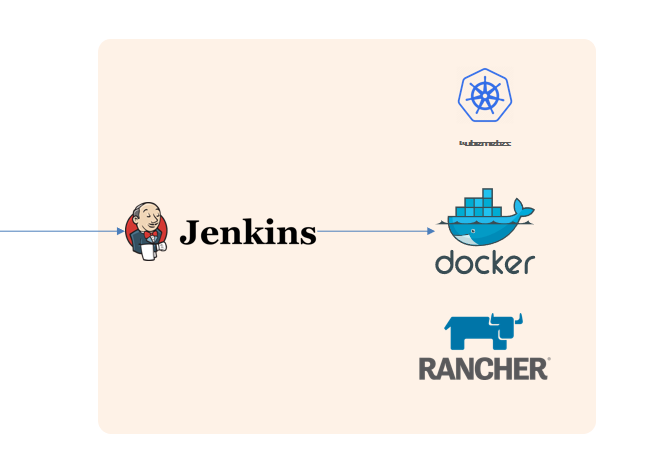](https://cdn.xn2001.com/img/2021/20210901090737.png)

自动化部署


## 技术栈对比

[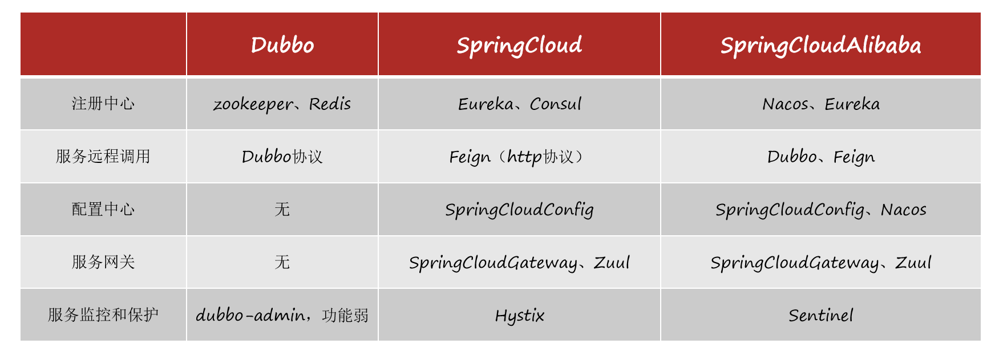](https://cdn.xn2001.com/img/2021/20210901090726.png)


# 服务拆分

**服务拆分注意事项**

单一职责：不同微服务，不要重复开发相同业务

数据独立：不要访问其它微服务的数据库

面向服务：将自己的业务暴露为接口，供其它微服务调用


我们下面做一个demo来初识微服务

[](https://cdn.xn2001.com/img/2021/20210901090745.png)


cloud-demo：父工程，管理依赖

- order-service：订单微服务，负责订单相关业务
- user-service：用户微服务，负责用户相关业务

要求：

- 订单微服务和用户微服务都必须有**各自的数据库**，相互独立
- 订单服务和用户服务**都对外暴露 Restful 的接口**
- 订单服务如果需要查询用户信息，**只能调用用户服务的 Restful 接口**，不能查询用户数据库

微服务项目下，打开 idea 中的 Service，可以很方便的启动。

[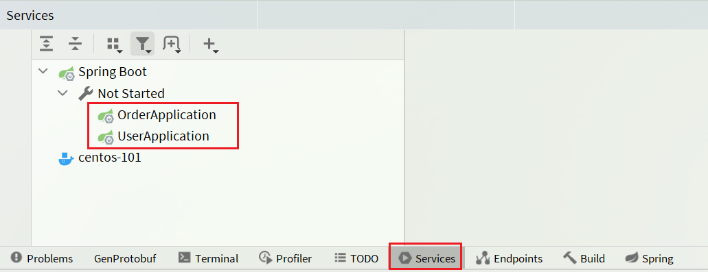](https://cdn.xn2001.com/img/2021/20210901090750.png)


启动完成后，访问 http://localhost:8080/order/101

[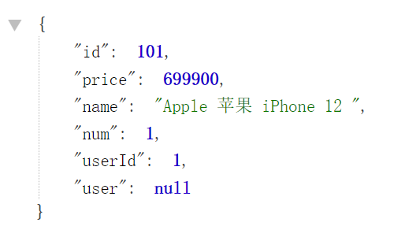](https://cdn.xn2001.com/img/2021/20210901090757.png)


# RestTemplate远程调用

正如上面的服务拆分要求中所提到，

> 订单服务如果需要查询用户信息，**只能调用用户服务的 Restful 接口**，不能查询用户数据库

因此我们需要知道 Java 如何去发送 http 请求，Spring 提供了一个 RestTemplate 工具，只需要把它创建出来即可。（即注入 Bean）

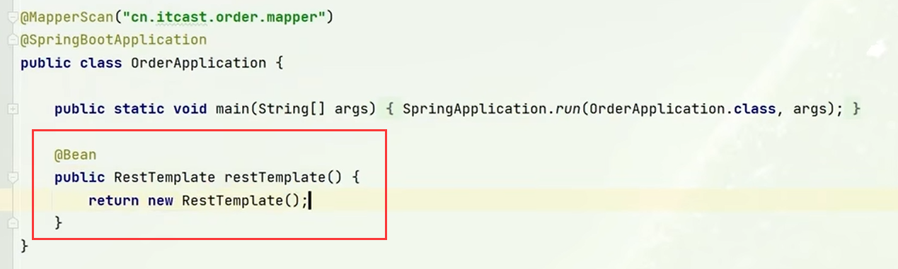


发送请求，自动序列化为 Java 对象。

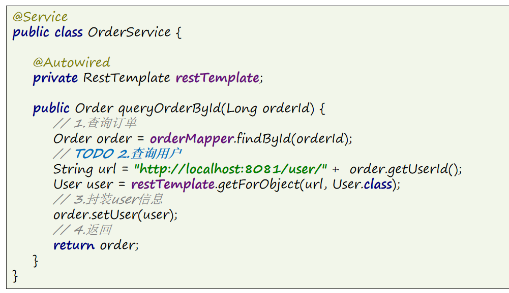

这里面需要注意的是getForObject方法，和里面的参数，这个restTemplate非常智能，可以把返回回来的json数据，直接转换为pojo类对象


启动完成后，访问：http://localhost:8080/order/101

[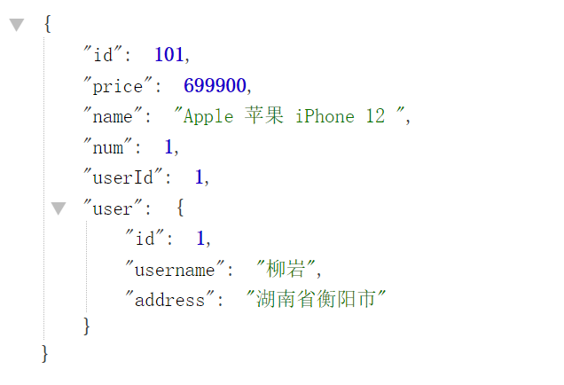](https://cdn.xn2001.com/img/2021/20210901090909.png)


在上面代码的 url 中，我们可以发现调用服务的地址采用硬编码，这在后续的开发中肯定是不理想的，这就需要**服务注册中心**（Eureka）来帮我们解决这个事情。

# Eureka注册中心

最广为人知的注册中心就是 Eureka，其结构如下：

[](https://cdn.xn2001.com/img/2021/20210901090919.png)


**order-service 如何得知 user-service 实例地址？**

- user-service 服务实例启动后，将自己的信息注册到 eureka-server(Eureka服务端)，叫做**服务注册**
- eureka-server 保存服务名称到服务实例地址列表的映射关系
- order-service *根据服务名称，拉取实例地址列表*，这个叫**服务发现**或服务拉取

**order-service 如何从多个 user-service 实例中选择具体的实例？**

order-service从实例列表中利用**负载均衡算法**选中一个实例地址，向该实例地址发起远程调用

**order-service 如何得知某个 user-service 实例是否依然健康，是不是已经宕机？**

- user-service 会**每隔一段时间(默认30秒)向 eureka-server 发起请求**，报告自己状态，称为**心跳**
- 当超过一定时间没有发送心跳时，eureka-server 会认为微服务实例故障，将该实例从服务列表中剔除
- order-service 拉取服务时，就能将故障实例排除了

------

接下来我们动手实践的步骤包括

[](https://cdn.xn2001.com/img/2021/20210901090932.png)


## 搭建注册中心

**搭建 eureka-server**

引入 SpringCloud 为 eureka 提供的 starter 依赖，注意这里是用 **server**

```xml
<dependency>
    <groupId>org.springframework.cloud</groupId>
    <artifactId>spring-cloud-starter-netflix-eureka-server</artifactId>
</dependency>
```

**编写启动类**

注意要添加一个 `@EnableEurekaServer` **注解**，开启 eureka 的**注册中心**功能

```java
@SpringBootApplication
@EnableEurekaServer
public class EurekaApplication {
    public static void main(String[] args) {
        SpringApplication.run(EurekaApplication.class, args);
    }
}
```

**编写配置文件**

编写一个 application.yml 文件，内容如下：

```yml
server:
  port: 10086
spring:
  application:
    name: eureka-server
eureka:
  client:
    service-url: 
      defaultZone: http://127.0.0.1:10086/eureka
```

其中 `default-zone` 是因为前面配置类开启了注册中心所需要配置的 eureka 的**地址信息**，因为 eureka 本身也是一个微服务，这里也要将自己注册进来，当后面 eureka **集群**时，这里就可以填写多个，使用 “,” 隔开。

启动完成后，访问 http://localhost:10086/

[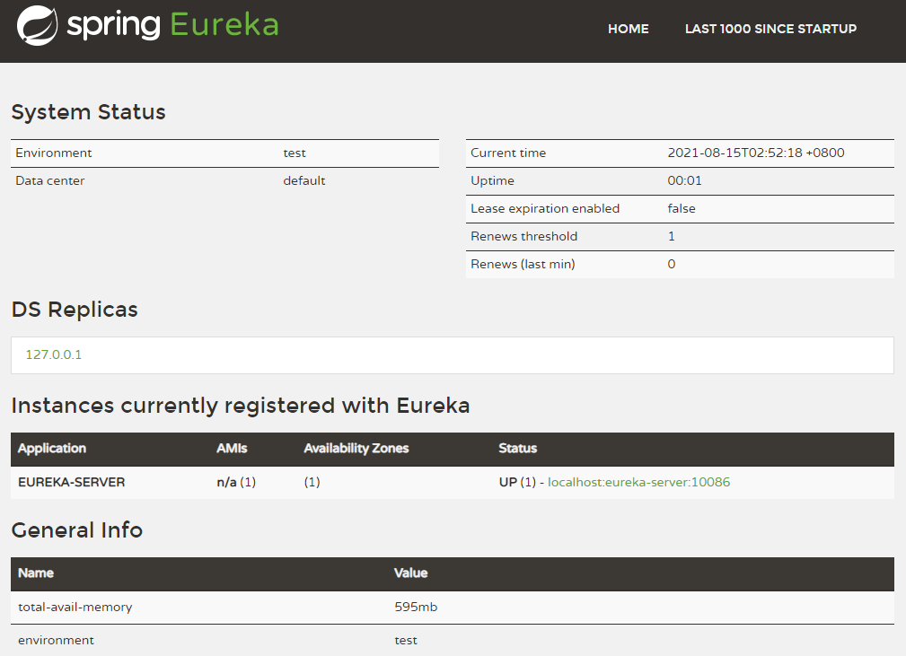](https://cdn.xn2001.com/img/2021/20210901090945.png)

## 服务注册

> 将 user-service、order-service 都注册到 eureka

引入 SpringCloud 为 eureka 提供的 starter 依赖，注意这里是用 **client**

```xml
<dependency>
    <groupId>org.springframework.cloud</groupId>
    <artifactId>spring-cloud-starter-netflix-eureka-client</artifactId>
</dependency>
```

在启动类上添加注解：`@EnableEurekaClient`

在 application.yml 文件，添加下面的配置：

```yml
spring:
  application:
  	#name：orderservice #第一个
    name: userservice #第二个
eureka:
  client:
    service-url: 
      defaultZone: http:127.0.0.1:10086/eureka
```

3个项目启动后，访问 http://localhost:10086/

[](https://cdn.xn2001.com/img/2021/20210901090958.png)


这里另外再补充个小技巧，我们可以通过 idea 的多实例启动，开两个userservice，来查看 Eureka 的集群效果。

[](https://cdn.xn2001.com/img/2021/20210901091005.png)


4个项目启动后，访问 http://localhost:10086/

[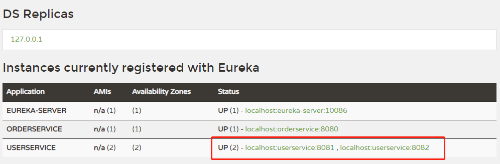](https://cdn.xn2001.com/img/2021/20210901091015.png)


## 服务拉取

> 在 order-service 中完成服务拉取，然后通过负载均衡挑选一个服务，实现远程调用

下面我们让 order-service 向 eureka-server 拉取 user-service 的信息，实现服务发现。


首先给 `RestTemplate` （这个就是之前导入的那个Bean）这个 Bean 添加一个 `@LoadBalanced` **注解**，用于开启**负载均衡**。（后面会讲）

 `@LoadBalanced` 的意思是我们根据RestTemplate发出的请求，会被ribbon去拦截和处理啦

```java
@Bean
@LoadBalanced
public RestTemplate restTemplate(){
    return new RestTemplate();
}
```

修改 OrderService 访问的url路径，用**服务名**代替ip、端口：

[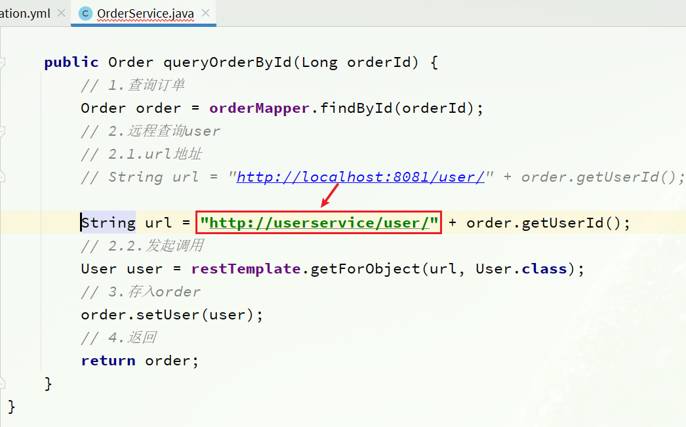](https://cdn.xn2001.com/img/2021/20210901091216.png)


spring 会自动帮助我们从 eureka-server 中，根据 userservice 这个服务名称，获取实例列表后去完成负载均衡。（很神奇，但这就是他的特性）

需要注意的是服务名称是我们配置到yml文件里面的名称，也就是这个

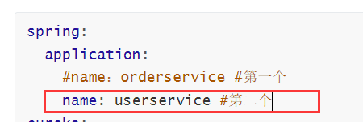

而不是整个项目的名称

# Ribbon负载均衡

本节主要是来讲解LoadBalanced的原理是Ribbon，没有新的东西

我们添加了 `@LoadBalanced` 注解，即可实现负载均衡功能，这是什么原理呢？

**SpringCloud 底层提供了一个名为 Ribbon 的组件，来实现负载均衡功能。**

[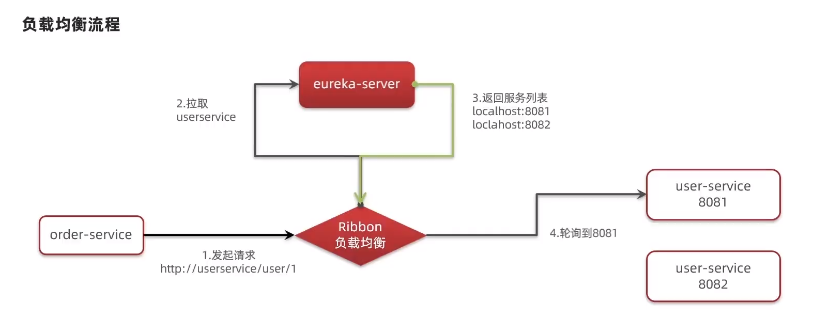](https://cdn.xn2001.com/img/2021/20210901091242.png)

## 源码跟踪

为什么我们只输入了 service 名称就可以访问了呢？为什么不需要获取ip和端口，这显然有人帮我们根据 service 名称，获取到了服务实例的ip和端口。

它就是`LoadBalancerInterceptor`，这个类会在对 RestTemplate 的请求进行拦截，然后从 Eureka 根据服务 id 获取服务列表，随后利用负载均衡算法得到真实的服务地址信息，替换服务 id。

我们进行源码跟踪：

[](https://cdn.xn2001.com/img/2021/20210901091323.png)


这里的 `intercept()` 方法，拦截了用户的 HttpRequest 请求，然后做了几件事：

- `request.getURI()`：获取请求uri，即 http://user-service/user/8
- `originalUri.getHost()`：获取uri路径的主机名，其实就是服务名 `user-service`
- `this.loadBalancer.execute()`：处理服务名称，和用户请求

这里的 `this.loadBalancer` 是 `LoadBalancerClient` 类型

继续跟入 `execute()` 方法：

[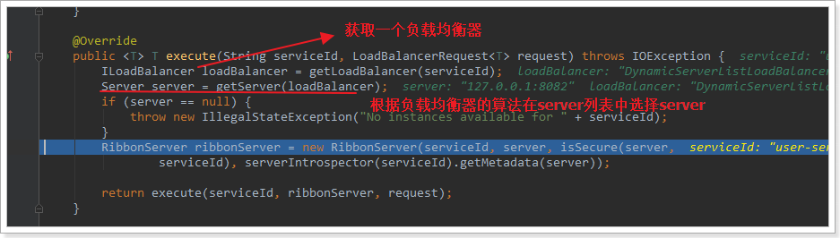](https://cdn.xn2001.com/img/2021/20210901091330.png)


- `getLoadBalancer(serviceId)`：根据服务名称获取 `ILoadBalancer`，而 `ILoadBalancer` 会拿着服务名称 去 eureka 中获取服务列表。
- `getServer(loadBalancer)`：利用内置的负载均衡算法，从服务列表中选择一个。在图中**可以看到获取了8082端口的服务**

可以看到获取服务时，通过一个 `getServer()` 方法来做负载均衡:

[](https://cdn.xn2001.com/img/2021/20210901091345.png)


我们继续跟入：

[](https://cdn.xn2001.com/img/2021/20210901091355.png)


继续跟踪源码 `chooseServer()` 方法，发现这么一段代码：

[](https://cdn.xn2001.com/img/2021/20210901091414.png)


我们看看这个 `rule` 是谁：

[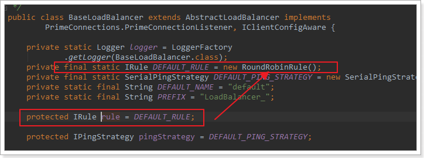](https://cdn.xn2001.com/img/2021/20210901091432.png)


这里的 rule 默认值是一个 `RoundRobinRule` ，看类的介绍：

[](https://cdn.xn2001.com/img/2021/20210901091442.png)


负载均衡默认使用了轮询算法，当然我们也可以自定义。

## 流程总结

SpringCloud Ribbon 底层采用了一个拦截器，拦截了 RestTemplate 发出的请求，对地址做了修改。

基本流程如下：

- 拦截我们的 `RestTemplate` 请求 http://userservice/user/1
- `RibbonLoadBalancerClient` 会从请求url中获取服务名称，也就是 user-service
- `DynamicServerListLoadBalancer` 根据 user-service 到 eureka 拉取服务列表
- eureka 返回列表，localhost:8081、localhost:8082
- `IRule` 利用内置负载均衡规则，从列表中选择一个，例如 localhost:8081
- `RibbonLoadBalancerClient` 修改请求地址，用 localhost:8081 替代 userservice，得到 http://localhost:8081/user/1，发起真实请求


## 负载均衡策略

负载均衡的规则都定义在 IRule 接口中，而 IRule 有很多不同的实现类：

[](https://cdn.xn2001.com/img/2021/20210901091811.png)


不同规则的含义如下：

| **内置负载均衡规则类**    | **规则描述**                                                 |
| :------------------------ | :----------------------------------------------------------- |
| RoundRobinRule            | 简单轮询服务列表来选择服务器。它是Ribbon默认的负载均衡规则。 |
| AvailabilityFilteringRule | 对以下两种服务器进行忽略：（1）在默认情况下，这台服务器如果3次连接失败，这台服务器就会被设置为“短路”状态。短路状态将持续30秒，如果再次连接失败，短路的持续时间就会几何级地增加。 （2）并发数过高的服务器。如果一个服务器的并发连接数过高，配置了AvailabilityFilteringRule 规则的客户端也会将其忽略。并发连接数的上限，可以由客户端设置。 |
| WeightedResponseTimeRule  | 为每一个服务器赋予一个权重值。服务器响应时间越长，这个服务器的权重就越小。这个规则会随机选择服务器，这个权重值会影响服务器的选择。 |
| **ZoneAvoidanceRule**     | 以区域可用的服务器为基础进行服务器的选择。使用Zone对服务器进行分类，这个Zone可以理解为一个机房、一个机架等。而后再对Zone内的多个服务做轮询。 |
| BestAvailableRule         | 忽略那些短路的服务器，并选择并发数较低的服务器。             |
| RandomRule                | 随机选择一个可用的服务器。                                   |
| RetryRule                 | 重试机制的选择逻辑                                           |

默认的实现就是 `ZoneAvoidanceRule`，**是一种轮询方案**。

## 自定义策略

通过定义 IRule 实现可以修改负载均衡规则，有**两种**方式：

1 代码方式在 order-service 中的 OrderApplication 类中，定义一个新的 IRule：

里面的RandomRule也是一种负载均衡策略，上表有

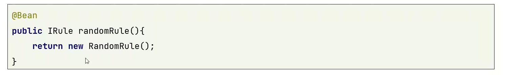


2 配置文件方式：在 order-service 的 application.yml 文件中，添加新的配置也可以修改规则：

```yml
userservice: # 给需要调用的微服务配置负载均衡规则，orderservice服务去调用userservice服务
  ribbon:
    NFLoadBalancerRuleClassName: com.netflix.loadbalancer.RandomRule # 负载均衡规则 
```

**注意**：一般用默认的负载均衡规则，不做修改。

## 饥饿加载

当我们启动 orderservice，第一次访问时，时间消耗会大很多，这是因为 Ribbon 懒加载的机制。

[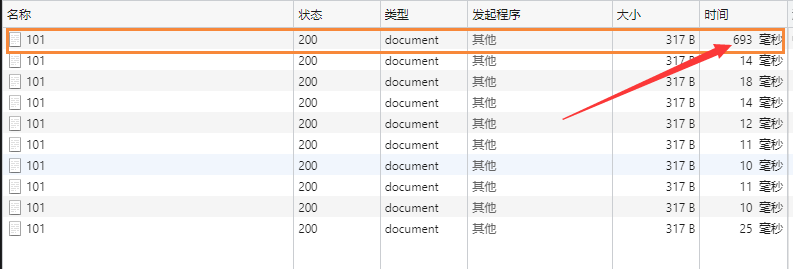](https://cdn.xn2001.com/img/2021/20210901091850.png)


Ribbon 默认是采用懒加载，即第一次访问时才会去创建 LoadBalanceClient，拉取集群地址，所以请求时间会很长。

而饥饿加载则会在项目启动时创建 LoadBalanceClient，降低第一次访问的耗时，通过下面配置开启饥饿加载：

下面的是在order-service的yml配置文件下做的修改

```yml
ribbon:
  eager-load:
    enabled: true #开启饥饿加载
    clients: userservice # 项目启动时直接去拉取userservice的集群，多个用","隔开
```

# Nacos注册中心

SpringCloudAlibaba 推出了一个名为 Nacos 的注册中心，在国外也有大量的使用。

[](https://cdn.xn2001.com/img/2021/20210901091857.png)

nacos可以去github上下载安装包，之后直接解压到非中文目录下就可以了


启动：

在nacos的bin目录下输入下面的指令

```
startup.cmd -m standalone
```

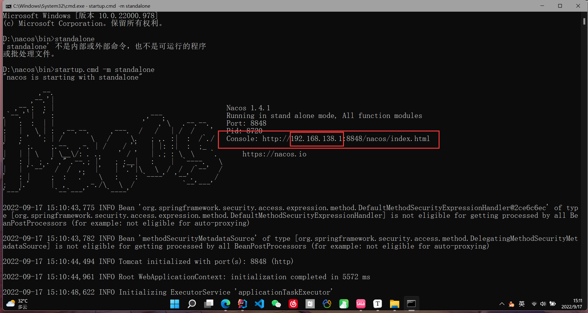

但是其实这样是正常的，虽然ip不对，但是不知道为啥，知道了会回来填坑


访问：http://localhost:8848/nacos/

[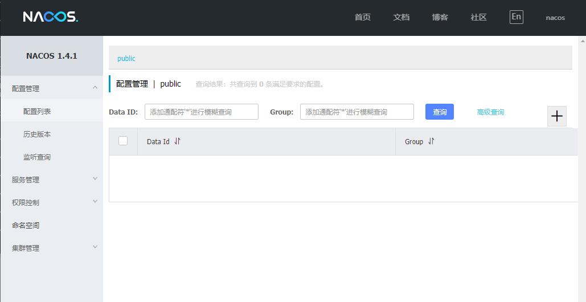](https://cdn.xn2001.com/img/2021/20210901091904.png)

注意登录账号和密码都是nacos


## 服务注册

这里上来就直接服务注册，很多东西可能有疑惑，其实 Nacos 本身就是一个 SprintBoot 项目，这点你从启动的控制台打印就可以看出来，所以就不再需要去额外搭建一个像 Eureka 的注册中心。

**引入依赖**

在 cloud-demo 父工程中引入 SpringCloudAlibaba 的依赖：

这个是nacos的版本依赖

```xml
<dependency>
    <groupId>com.alibaba.cloud</groupId>
    <artifactId>spring-cloud-alibaba-dependencies</artifactId>
    <version>2.2.6.RELEASE</version>
    <type>pom</type>
    <scope>import</scope>
</dependency>
```

然后在 user-service 和 order-service 中的pom文件中引入 nacos-discovery 依赖：

```xml
<dependency>
    <groupId>com.alibaba.cloud</groupId>
    <artifactId>spring-cloud-starter-alibaba-nacos-discovery</artifactId>
</dependency>
```

**配置nacos地址**

在 user-service 和 order-service 的 application.yml 中添加 nacos 地址：

```yaml
spring:
  cloud:
    nacos:
      server-addr: 127.0.0.1:8848
```

项目重新启动后，可以看到三个服务都被注册进了 Nacos

[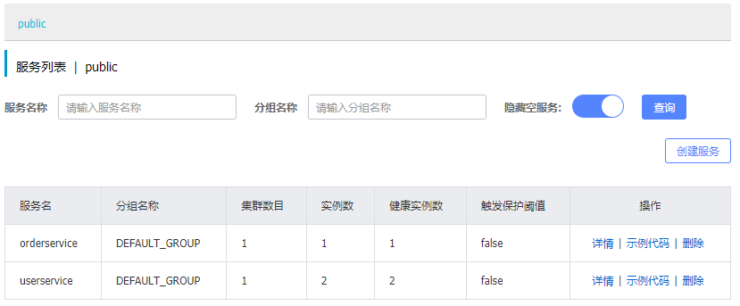](https://cdn.xn2001.com/img/2021/20210901091918.png)


浏览器访问：http://localhost:8080/order/101，可以正常访问，同时负载均衡也正常。

## 分级存储模型

一个**服务**可以有多个**实例**，例如我们的 user-service，可以有:

- 127.0.0.1:8081
- 127.0.0.1:8082
- 127.0.0.1:8083

假如这些实例分布于全国各地的不同机房，例如：

- 127.0.0.1:8081，在上海机房
- 127.0.0.1:8082，在上海机房
- 127.0.0.1:8083，在杭州机房

Nacos就将同一机房内的实例，划分为一个**集群**。

[](https://cdn.xn2001.com/img/2021/20210901091928.png)


微服务互相访问时，应该尽可能访问同集群实例，因为本地访问速度更快。**当本集群内不可用时，才访问其它集群。**例如：杭州机房内的 order-service 应该优先访问同机房的 user-service。

[](https://cdn.xn2001.com/img/2021/20210901091937.png)


### 配置集群

接下来我们给 user-service **配置集群**

修改 user-service 的 application.yml 文件，添加集群配置：

```yml
spring:
  cloud:
    nacos:
      server-addr: localhost:8848
      discovery:
        cluster-name: HZ # 集群名称可以随便 HZ杭州
```

重启两个 user-service 实例后，我们再去启动一个上海集群的实例。

需要修改yml配置文件再启动一个就可以了


查看 nacos 控制台

[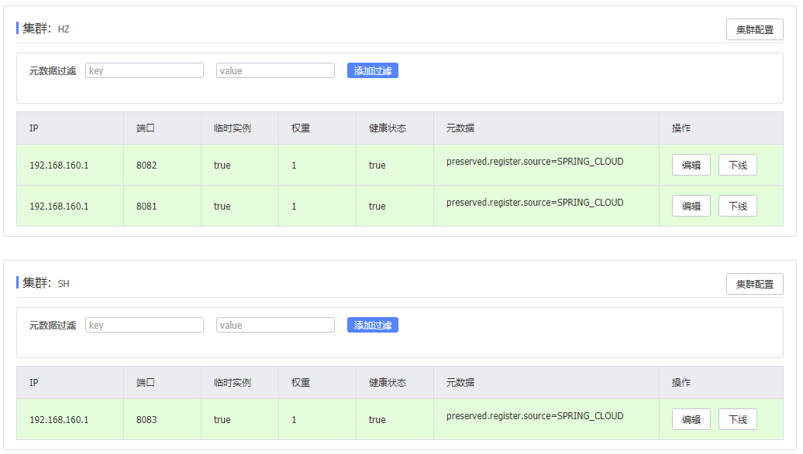](https://cdn.xn2001.com/img/2021/20210901091957.png)


## NacosRule

Ribbon的默认实现 `ZoneAvoidanceRule` ，并不能实现根据同集群优先来实现负载均衡，我们把规则改成 **NacosRule** 即可。我们是用 orderservice 调用 userservice，所以在 orderservice 配置规则。

**第一种方式：**

```java
@Bean
public IRule iRule(){
    //默认为轮询规则，这里自定义为随机规则
    return new NacosRule();
}
```

**第二种方式：**你同样可以使用配置的形式来完成，具体参考上面的 Ribbon 栏目。

```yml
userservice:
  ribbon:
    NFLoadBalancerRuleClassName: com.alibaba.cloud.nacos.ribbon.NacosRule #负载均衡规则 
```


然后，再对 orderservice 配置集群。

```yml
spring:
  cloud:
    nacos:
      server-addr: localhost:8848
      discovery:
        cluster-name: HZ # 集群名称
```

现在我启动了四个服务，分别是：

- orderservice - HZ
- userservice1 - HZ
- userservice2 - HZ
- userservice3 - SH

访问地址：http://localhost:8080/order/101

在访问中我们发现，只有同在一个 HZ 集群下的 userservice、userservice1 会被调用，并且是随机的。


我们试着把 userservice1、userservice2 停掉。依旧可以访问。

在 userservice3 控制台可以看到发出了一串的警告，因为 orderservice 本身是在 HZ 集群的，这波 HZ 集群没有了 userservice，就会去别的集群找。


## 权重配置

实际部署中会出现这样的场景：

服务器设备性能有差异，部分实例所在机器性能较好，另一些较差，我们希望性能好的机器承担更多的用户请求。但默认情况下 NacosRule 是同集群内随机挑选，不会考虑机器的性能问题。

因此，Nacos 提供了**权重配置来控制访问频率**，0~1 之间，权重越大则访问频率越高，权重修改为 0，则该实例永远不会被访问。

在 Nacos 控制台，找到 user-service 的实例列表，点击编辑，即可修改权重。

[](https://cdn.xn2001.com/img/2021/20210901092020.png)


在弹出的编辑窗口，修改权重

[](https://cdn.xn2001.com/img/2021/20210901092026.png)


另外，在服务升级的时候，有一种较好的方案：我们也可以通过调整权重来进行平滑升级，例如：先把 userservice 权重调节为 0，让用户先流向 userservice2、userservice3，升级 userservice后，再把权重从 0 调到 0.1，让一部分用户先体验，用户体验稳定后就可以往上调权重啦。

## 环境隔离

Nacos 提供了 namespace 来实现环境隔离功能。

- Nacos 中可以有多个 namespace
- namespace 下可以有 group、service 等
- 不同 namespace 之间**相互隔离**，例如不同 namespace 的服务互相不可见

[](https://cdn.xn2001.com/img/2021/20210901092032.png)


### 创建namespace

默认情况下，所有 service、data、group 都在同一个 namespace，名为 public(保留空间)：

[](https://cdn.xn2001.com/img/2021/20210901092038.png)


我们可以点击页面新增按钮，添加一个 namespace：

[](https://cdn.xn2001.com/img/2021/20210901092050.png)


然后，填写表单：

[](https://cdn.xn2001.com/img/2021/20210901092059.png)


就能在页面看到一个新的 namespace：

[](https://cdn.xn2001.com/img/2021/20210901092114.png)


### 配置namespace

给微服务配置 namespace 只能通过修改配置来实现。

例如，修改 order-service 的 application.yml 文件：

```yaml
spring:
  cloud:
    nacos:
      server-addr: localhost:8848
      discovery:
        cluster-name: HZ
        namespace: 492a7d5d-237b-46a1-a99a-fa8e98e4b0f9 # 命名空间ID
```

重启 order-service 后，访问控制台。

**public**

[](https://cdn.xn2001.com/img/2021/20210901092143.png)


**dev**

[](https://cdn.xn2001.com/img/2021/20210901092130.png)


此时访问 order-service，因为 namespace 不同，会导致找不到 userservice，控制台会报错：

[](https://cdn.xn2001.com/img/2021/20210901092138.png)

## Nacos和Eureka的比较

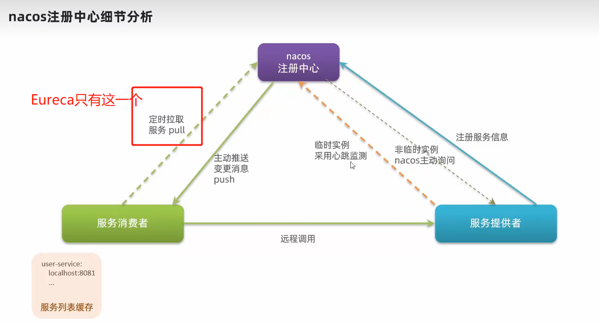

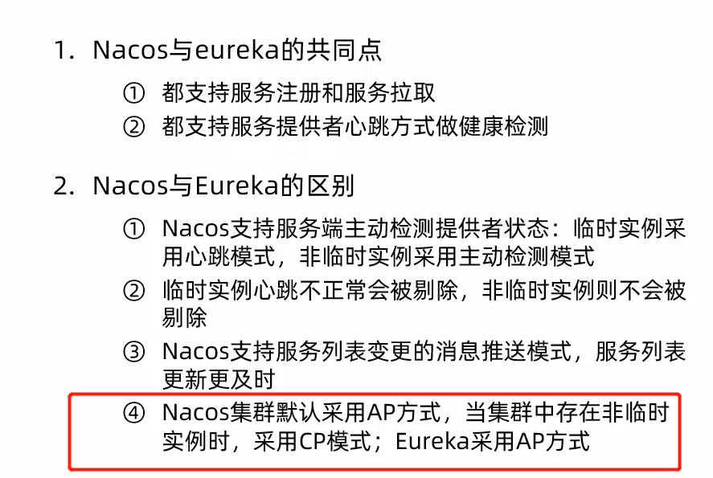

## 临时实例

服务实例默认就是临时实例

Nacos 的服务实例分为两种类型：

- **临时实例**：如果实例宕机超过一定时间，会从服务列表剔除，**默认的类型**。
- 非临时实例：如果实例宕机，不会从服务列表剔除，也可以叫永久实例。

配置一个服务实例为永久实例：

```yaml
spring:
  cloud:
    nacos:
      discovery:
        ephemeral: false # 设置为非临时实例
```

另外，Nacos 集群**默认采用AP方式(可用性)**，当集群中存在非临时实例时，**采用CP模式(一致性)**；而 Eureka 采用AP方式，不可切换。（这里说的是 CAP 原理，后面会写到）

# Nacos配置中心

Nacos除了可以做注册中心，同样可以做配置管理来使用。

当微服务部署的实例越来越多，达到数十、数百时，逐个修改微服务配置就会让人抓狂，而且很容易出错。**我们需要一种统一配置管理方案，可以集中管理所有实例的配置。**

[](https://cdn.xn2001.com/img/2021/20210901092150.png)


Nacos 一方面可以将配置集中管理，另一方可以在配置变更时，及时通知微服务，**实现配置的热更新。**

## 创建配置

在 Nacos 控制面板中添加配置文件

[](https://cdn.xn2001.com/img/2021/20210901092159.png)


然后在弹出的表单中，填写配置信息：

[](https://cdn.xn2001.com/img/2021/20210901092206.png)


**注意**：

项目的核心配置，需要热更新的配置才有放到 nacos 管理的必要。

基本不会变更的一些配置(例如数据库连接)还是保存在微服务本地比较好。

## 拉取配置

首先我们需要了解 Nacos 读取配置文件的环节是在哪一步，在没加入 Nacos 配置之前，获取配置是这样：

[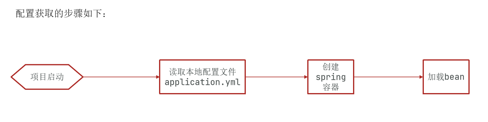](https://cdn.xn2001.com/img/2021/20210901092215.png)

加入 Nacos 配置，它的读取是在 application.yml 之前的：

[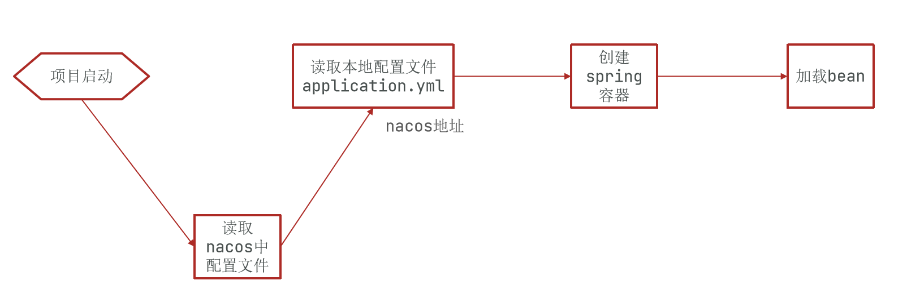](https://cdn.xn2001.com/img/2021/20210901092223.png)


这时候如果把 nacos 地址放在 application.yml 中，显然是不合适的，**Nacos 就无法根据地址去获取配置了。**

因此，nacos 地址必须放在优先级最高的 bootstrap.yml 文件。

[](https://cdn.xn2001.com/img/2021/20210901092228.png)


​                                                                                                                                                      

**引入 nacos-config 依赖**

首先，在 user-service 服务中，引入 nacos-config 的客户端依赖：

```xml
<!--nacos配置管理依赖-->
<dependency>
    <groupId>com.alibaba.cloud</groupId>
    <artifactId>spring-cloud-starter-alibaba-nacos-config</artifactId>
</dependency>
```

**添加 bootstrap.yml**

然后，在 user-service 中添加一个 bootstrap.yml 文件，内容如下：

```yaml
spring:
  application:
    name: userservice # 服务名称
  profiles:
    active: dev #开发环境，这里是dev 
  cloud:
    nacos:
      server-addr: localhost:8848 # Nacos地址
      config:
        file-extension: yaml # 文件后缀名
```


在这个例子  中，就是去读取 `userservice-dev.yaml`

[](https://cdn.xn2001.com/img/2021/20210901092237.png)


使用代码来验证是否拉取成功

在 user-service 中的 UserController 中添加业务逻辑，读取 pattern.dateformat 配置并使用：

```java
@Value("${pattern.dateformat}")
private String dateformat;

@GetMapping("now")
public String now(){
    //格式化时间
    return LocalDateTime.now().format(DateTimeFormatter.ofPattern(dateformat));
}
```


启动服务后，访问：http://localhost:8081/user/now

##  一个微服务中配置多个配置文件

多配置文件加载

在一些情况下需要加载多个配置文件。假如现在dev名称空间下有三个配置文件：service-statistics.properties、redis.properties、jdbc.properties

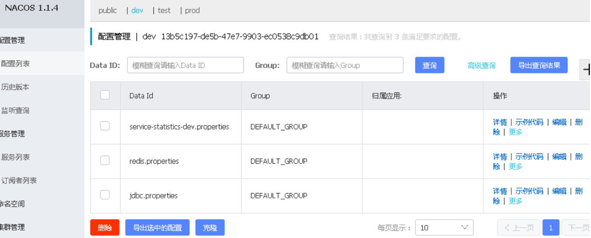

修改bootstrap.properties添加如下配置

```properties
spring.cloud.nacos.config.server-addr=127.0.0.1:8848
spring.profiles.active=dev 

# 该配置影响统一配置中心中的dataId，之前已经配置过
spring.application.name=service-statistics
spring.cloud.nacos.config.namespace=13b5c197-de5b-47e7-9903-ec0538c9db01

#第一个
spring.cloud.nacos.config.ext-config[0].data-id=redis.properties
# 开启动态刷新配置，否则配置文件修改，工程无法感知
spring.cloud.nacos.config.ext-config[0].refresh=true

#di'er'ge
spring.cloud.nacos.config.ext-config[1].data-id=jdbc.properties
# 开启动态刷新配置，否则配置文件修改，工程无法感知
spring.cloud.nacos.config.ext-config[1].refresh=true
```


## 配置热更新

我们最终的目的，是修改 nacos 中的配置后，微服务中无需重启即可让配置生效，也就是**配置热更新**。

有两种方式：1. 用 `@value` 读取配置时，搭配 `@RefreshScope`；2. 直接用 `@ConfigurationProperties` 读取配置

### @RefreshScope

方式一：在 `@Value` 注入的变量所在**类**上添加注解 `@RefreshScope`

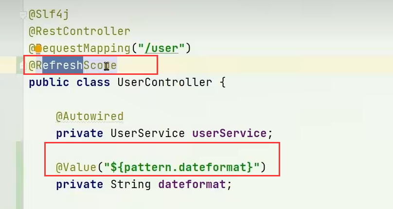


### @ConfigurationProperties

方式二：使用 `@ConfigurationProperties` 注解读取配置文件，就不需要加 `@RefreshScope` 注解。通过这个注解可以完成配置的自动加载

在 user-service 服务中，添加一个 PatternProperties 类，读取 `patterrn.dateformat` 属性

```java
@Data
@Component
@ConfigurationProperties(prefix = "pattern")
public class PatternProperties {
    public String dateformat;
}
```

下面的代码写在usercontroller

```java
@Autowired
private PatternProperties patternProperties;

@GetMapping("now2")
public String now2(){
    //格式化时间
    return LocalDateTime.now().format(DateTimeFormatter.ofPattern(patternProperties.dateformat));
}
```


## 配置共享

其实在服务启动时，nacos 会读取多个配置文件，例如：

- `[spring.application.name]-[spring.profiles.active].yaml`，例如：userservice-dev.yaml
- `[spring.application.name].yaml`，例如：userservice.yaml

这里的 `[spring.application.name].yaml` 不包含环境，**因此可以被多个环境共享**。

**添加一个环境共享配置**

我们在 nacos 中添加一个 userservice.yaml 文件： 

[](https://cdn.xn2001.com/img/2021/20210901092323.png)


**在 user-service 中读取共享配置**

在 user-service 服务中，修改 PatternProperties 类，读取新添加的属性：

[](https://cdn.xn2001.com/img/2021/20210901092314.png)


在 user-service 服务中，修改 UserController，添加一个方法：

[](https://cdn.xn2001.com/img/2021/20210901092331.png)


**运行两个 UserApplication，使用不同的profile**

修改 UserApplication2 这个启动项，改变其profile值：

[](https://cdn.xn2001.com/img/2021/20210901092345.png)


[](https://cdn.xn2001.com/img/2021/20210901092338.png)


这样，UserApplication(8081) 使用的 profile 是 dev，UserApplication2(8082) 使用的 profile 是test

启动 UserApplication 和 UserApplication2

访问地址：http://localhost:8081/user/prop，结果：

[](https://cdn.xn2001.com/img/2021/20210901092400.png)


访问地址：http://localhost:8082/user/prop，结果：

[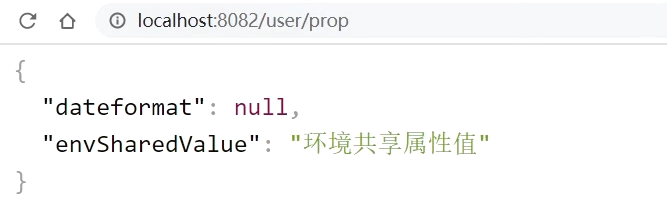](https://cdn.xn2001.com/img/2021/20210901092419.png)


可以看出来，不管是 dev，还是 test 环境，都读取到了 envSharedValue 这个属性的值。

上面的都是同一个微服务下，**那么不同微服务之间可以环境共享吗？**

通过下面的两种方式来指定：

- extension-configs
- shared-configs

```yml
spring: 
  cloud:
    nacos:
      config:
        file-extension: yaml # 文件后缀名
        extends-configs: # 多微服务间共享的配置列表
          - dataId: common.yaml # 要共享的配置文件id
spring: 
  cloud:
    nacos:
      config:
        file-extension: yaml # 文件后缀名
        shared-configs: # 多微服务间共享的配置列表
          - dataId: common.yaml # 要共享的配置文件id
```

## 配置优先级

当 nacos、服务本地同时**出现相同属性时**，优先级有高低之分。

[](https://cdn.xn2001.com/img/2021/20210901092501.png)


更细致的配置

[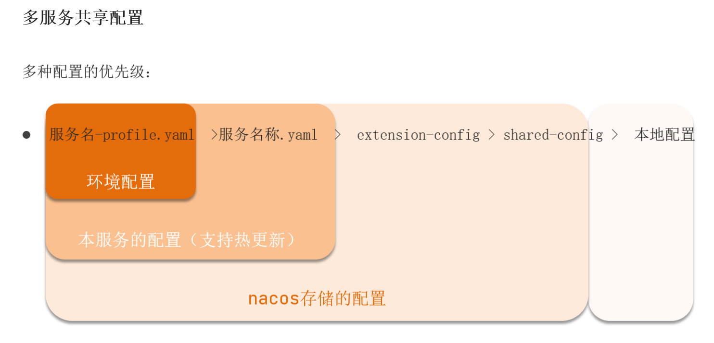](https://cdn.xn2001.com/img/2021/20210901092520.png)


# Nacos集群

## 架构介绍

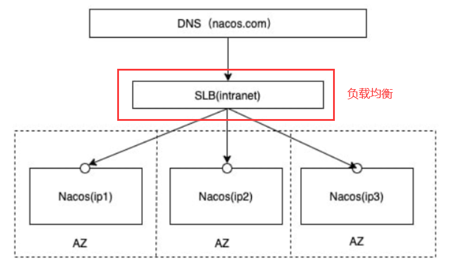

其中包含 3 个Nacos 节点，然后一个负载均衡器 Nginx 代理 3 个 Nacos，我们计划的 Nacos 集群如下图，MySQL 的主从复制后续再添加。


下面比较形象

[](https://cdn.xn2001.com/img/2021/202108182000220.png)


三个 Nacos 节点的地址

| 节点   | ip            | port |
| :----- | :------------ | :--- |
| nacos1 | 192.168.150.1 | 8845 |
| nacos2 | 192.168.150.1 | 8846 |
| nacos3 | 192.168.150.1 | 8847 |

## 初始化数据库

Nacos 默认数据存储在内嵌数据库 Derby 中，不属于生产可用的数据库。官方推荐的最佳实践是使用带有主从的高可用数据库集群，主从模式的高可用数据库。这里我们以单点的数据库为例。

首先新建一个数据库，命名为 nacos，而后导入下面的 SQL

```sql
CREATE TABLE `config_info` (
  `id` bigint(20) NOT NULL AUTO_INCREMENT COMMENT 'id',
  `data_id` varchar(255) NOT NULL COMMENT 'data_id',
  `group_id` varchar(255) DEFAULT NULL,
  `content` longtext NOT NULL COMMENT 'content',
  `md5` varchar(32) DEFAULT NULL COMMENT 'md5',
  `gmt_create` datetime NOT NULL DEFAULT CURRENT_TIMESTAMP COMMENT '创建时间',
  `gmt_modified` datetime NOT NULL DEFAULT CURRENT_TIMESTAMP COMMENT '修改时间',
  `src_user` text COMMENT 'source user',
  `src_ip` varchar(50) DEFAULT NULL COMMENT 'source ip',
  `app_name` varchar(128) DEFAULT NULL,
  `tenant_id` varchar(128) DEFAULT '' COMMENT '租户字段',
  `c_desc` varchar(256) DEFAULT NULL,
  `c_use` varchar(64) DEFAULT NULL,
  `effect` varchar(64) DEFAULT NULL,
  `type` varchar(64) DEFAULT NULL,
  `c_schema` text,
  PRIMARY KEY (`id`),
  UNIQUE KEY `uk_configinfo_datagrouptenant` (`data_id`,`group_id`,`tenant_id`)
) ENGINE=InnoDB DEFAULT CHARSET=utf8 COLLATE=utf8_bin COMMENT='config_info';

/******************************************/
/*   数据库全名 = nacos_config   */
/*   表名称 = config_info_aggr   */
/******************************************/
CREATE TABLE `config_info_aggr` (
  `id` bigint(20) NOT NULL AUTO_INCREMENT COMMENT 'id',
  `data_id` varchar(255) NOT NULL COMMENT 'data_id',
  `group_id` varchar(255) NOT NULL COMMENT 'group_id',
  `datum_id` varchar(255) NOT NULL COMMENT 'datum_id',
  `content` longtext NOT NULL COMMENT '内容',
  `gmt_modified` datetime NOT NULL COMMENT '修改时间',
  `app_name` varchar(128) DEFAULT NULL,
  `tenant_id` varchar(128) DEFAULT '' COMMENT '租户字段',
  PRIMARY KEY (`id`),
  UNIQUE KEY `uk_configinfoaggr_datagrouptenantdatum` (`data_id`,`group_id`,`tenant_id`,`datum_id`)
) ENGINE=InnoDB DEFAULT CHARSET=utf8 COLLATE=utf8_bin COMMENT='增加租户字段';


/******************************************/
/*   数据库全名 = nacos_config   */
/*   表名称 = config_info_beta   */
/******************************************/
CREATE TABLE `config_info_beta` (
  `id` bigint(20) NOT NULL AUTO_INCREMENT COMMENT 'id',
  `data_id` varchar(255) NOT NULL COMMENT 'data_id',
  `group_id` varchar(128) NOT NULL COMMENT 'group_id',
  `app_name` varchar(128) DEFAULT NULL COMMENT 'app_name',
  `content` longtext NOT NULL COMMENT 'content',
  `beta_ips` varchar(1024) DEFAULT NULL COMMENT 'betaIps',
  `md5` varchar(32) DEFAULT NULL COMMENT 'md5',
  `gmt_create` datetime NOT NULL DEFAULT CURRENT_TIMESTAMP COMMENT '创建时间',
  `gmt_modified` datetime NOT NULL DEFAULT CURRENT_TIMESTAMP COMMENT '修改时间',
  `src_user` text COMMENT 'source user',
  `src_ip` varchar(50) DEFAULT NULL COMMENT 'source ip',
  `tenant_id` varchar(128) DEFAULT '' COMMENT '租户字段',
  PRIMARY KEY (`id`),
  UNIQUE KEY `uk_configinfobeta_datagrouptenant` (`data_id`,`group_id`,`tenant_id`)
) ENGINE=InnoDB DEFAULT CHARSET=utf8 COLLATE=utf8_bin COMMENT='config_info_beta';

/******************************************/
/*   数据库全名 = nacos_config   */
/*   表名称 = config_info_tag   */
/******************************************/
CREATE TABLE `config_info_tag` (
  `id` bigint(20) NOT NULL AUTO_INCREMENT COMMENT 'id',
  `data_id` varchar(255) NOT NULL COMMENT 'data_id',
  `group_id` varchar(128) NOT NULL COMMENT 'group_id',
  `tenant_id` varchar(128) DEFAULT '' COMMENT 'tenant_id',
  `tag_id` varchar(128) NOT NULL COMMENT 'tag_id',
  `app_name` varchar(128) DEFAULT NULL COMMENT 'app_name',
  `content` longtext NOT NULL COMMENT 'content',
  `md5` varchar(32) DEFAULT NULL COMMENT 'md5',
  `gmt_create` datetime NOT NULL DEFAULT CURRENT_TIMESTAMP COMMENT '创建时间',
  `gmt_modified` datetime NOT NULL DEFAULT CURRENT_TIMESTAMP COMMENT '修改时间',
  `src_user` text COMMENT 'source user',
  `src_ip` varchar(50) DEFAULT NULL COMMENT 'source ip',
  PRIMARY KEY (`id`),
  UNIQUE KEY `uk_configinfotag_datagrouptenanttag` (`data_id`,`group_id`,`tenant_id`,`tag_id`)
) ENGINE=InnoDB DEFAULT CHARSET=utf8 COLLATE=utf8_bin COMMENT='config_info_tag';

/******************************************/
/*   数据库全名 = nacos_config   */
/*   表名称 = config_tags_relation   */
/******************************************/
CREATE TABLE `config_tags_relation` (
  `id` bigint(20) NOT NULL COMMENT 'id',
  `tag_name` varchar(128) NOT NULL COMMENT 'tag_name',
  `tag_type` varchar(64) DEFAULT NULL COMMENT 'tag_type',
  `data_id` varchar(255) NOT NULL COMMENT 'data_id',
  `group_id` varchar(128) NOT NULL COMMENT 'group_id',
  `tenant_id` varchar(128) DEFAULT '' COMMENT 'tenant_id',
  `nid` bigint(20) NOT NULL AUTO_INCREMENT,
  PRIMARY KEY (`nid`),
  UNIQUE KEY `uk_configtagrelation_configidtag` (`id`,`tag_name`,`tag_type`),
  KEY `idx_tenant_id` (`tenant_id`)
) ENGINE=InnoDB DEFAULT CHARSET=utf8 COLLATE=utf8_bin COMMENT='config_tag_relation';

/******************************************/
/*   数据库全名 = nacos_config   */
/*   表名称 = group_capacity   */
/******************************************/
CREATE TABLE `group_capacity` (
  `id` bigint(20) unsigned NOT NULL AUTO_INCREMENT COMMENT '主键ID',
  `group_id` varchar(128) NOT NULL DEFAULT '' COMMENT 'Group ID，空字符表示整个集群',
  `quota` int(10) unsigned NOT NULL DEFAULT '0' COMMENT '配额，0表示使用默认值',
  `usage` int(10) unsigned NOT NULL DEFAULT '0' COMMENT '使用量',
  `max_size` int(10) unsigned NOT NULL DEFAULT '0' COMMENT '单个配置大小上限，单位为字节，0表示使用默认值',
  `max_aggr_count` int(10) unsigned NOT NULL DEFAULT '0' COMMENT '聚合子配置最大个数，，0表示使用默认值',
  `max_aggr_size` int(10) unsigned NOT NULL DEFAULT '0' COMMENT '单个聚合数据的子配置大小上限，单位为字节，0表示使用默认值',
  `max_history_count` int(10) unsigned NOT NULL DEFAULT '0' COMMENT '最大变更历史数量',
  `gmt_create` datetime NOT NULL DEFAULT CURRENT_TIMESTAMP COMMENT '创建时间',
  `gmt_modified` datetime NOT NULL DEFAULT CURRENT_TIMESTAMP COMMENT '修改时间',
  PRIMARY KEY (`id`),
  UNIQUE KEY `uk_group_id` (`group_id`)
) ENGINE=InnoDB DEFAULT CHARSET=utf8 COLLATE=utf8_bin COMMENT='集群、各Group容量信息表';

/******************************************/
/*   数据库全名 = nacos_config   */
/*   表名称 = his_config_info   */
/******************************************/
CREATE TABLE `his_config_info` (
  `id` bigint(64) unsigned NOT NULL,
  `nid` bigint(20) unsigned NOT NULL AUTO_INCREMENT,
  `data_id` varchar(255) NOT NULL,
  `group_id` varchar(128) NOT NULL,
  `app_name` varchar(128) DEFAULT NULL COMMENT 'app_name',
  `content` longtext NOT NULL,
  `md5` varchar(32) DEFAULT NULL,
  `gmt_create` datetime NOT NULL DEFAULT CURRENT_TIMESTAMP,
  `gmt_modified` datetime NOT NULL DEFAULT CURRENT_TIMESTAMP,
  `src_user` text,
  `src_ip` varchar(50) DEFAULT NULL,
  `op_type` char(10) DEFAULT NULL,
  `tenant_id` varchar(128) DEFAULT '' COMMENT '租户字段',
  PRIMARY KEY (`nid`),
  KEY `idx_gmt_create` (`gmt_create`),
  KEY `idx_gmt_modified` (`gmt_modified`),
  KEY `idx_did` (`data_id`)
) ENGINE=InnoDB DEFAULT CHARSET=utf8 COLLATE=utf8_bin COMMENT='多租户改造';


/******************************************/
/*   数据库全名 = nacos_config   */
/*   表名称 = tenant_capacity   */
/******************************************/
CREATE TABLE `tenant_capacity` (
  `id` bigint(20) unsigned NOT NULL AUTO_INCREMENT COMMENT '主键ID',
  `tenant_id` varchar(128) NOT NULL DEFAULT '' COMMENT 'Tenant ID',
  `quota` int(10) unsigned NOT NULL DEFAULT '0' COMMENT '配额，0表示使用默认值',
  `usage` int(10) unsigned NOT NULL DEFAULT '0' COMMENT '使用量',
  `max_size` int(10) unsigned NOT NULL DEFAULT '0' COMMENT '单个配置大小上限，单位为字节，0表示使用默认值',
  `max_aggr_count` int(10) unsigned NOT NULL DEFAULT '0' COMMENT '聚合子配置最大个数',
  `max_aggr_size` int(10) unsigned NOT NULL DEFAULT '0' COMMENT '单个聚合数据的子配置大小上限，单位为字节，0表示使用默认值',
  `max_history_count` int(10) unsigned NOT NULL DEFAULT '0' COMMENT '最大变更历史数量',
  `gmt_create` datetime NOT NULL DEFAULT CURRENT_TIMESTAMP COMMENT '创建时间',
  `gmt_modified` datetime NOT NULL DEFAULT CURRENT_TIMESTAMP COMMENT '修改时间',
  PRIMARY KEY (`id`),
  UNIQUE KEY `uk_tenant_id` (`tenant_id`)
) ENGINE=InnoDB DEFAULT CHARSET=utf8 COLLATE=utf8_bin COMMENT='租户容量信息表';


CREATE TABLE `tenant_info` (
  `id` bigint(20) NOT NULL AUTO_INCREMENT COMMENT 'id',
  `kp` varchar(128) NOT NULL COMMENT 'kp',
  `tenant_id` varchar(128) default '' COMMENT 'tenant_id',
  `tenant_name` varchar(128) default '' COMMENT 'tenant_name',
  `tenant_desc` varchar(256) DEFAULT NULL COMMENT 'tenant_desc',
  `create_source` varchar(32) DEFAULT NULL COMMENT 'create_source',
  `gmt_create` bigint(20) NOT NULL COMMENT '创建时间',
  `gmt_modified` bigint(20) NOT NULL COMMENT '修改时间',
  PRIMARY KEY (`id`),
  UNIQUE KEY `uk_tenant_info_kptenantid` (`kp`,`tenant_id`),
  KEY `idx_tenant_id` (`tenant_id`)
) ENGINE=InnoDB DEFAULT CHARSET=utf8 COLLATE=utf8_bin COMMENT='tenant_info';

CREATE TABLE `users` (
	`username` varchar(50) NOT NULL PRIMARY KEY,
	`password` varchar(500) NOT NULL,
	`enabled` boolean NOT NULL
);

CREATE TABLE `roles` (
	`username` varchar(50) NOT NULL,
	`role` varchar(50) NOT NULL,
	UNIQUE INDEX `idx_user_role` (`username` ASC, `role` ASC) USING BTREE
);

CREATE TABLE `permissions` (
    `role` varchar(50) NOT NULL,
    `resource` varchar(255) NOT NULL,
    `action` varchar(8) NOT NULL,
    UNIQUE INDEX `uk_role_permission` (`role`,`resource`,`action`) USING BTREE
);

INSERT INTO users (username, password, enabled) VALUES ('nacos', '$2a$10$EuWPZHzz32dJN7jexM34MOeYirDdFAZm2kuWj7VEOJhhZkDrxfvUu', TRUE);

INSERT INTO roles (username, role) VALUES ('nacos', 'ROLE_ADMIN');
```

## 配置Nacos

1. 进入 nacos 的 conf 目录，修改配置文件 cluster.conf.example，重命名为 cluster.conf

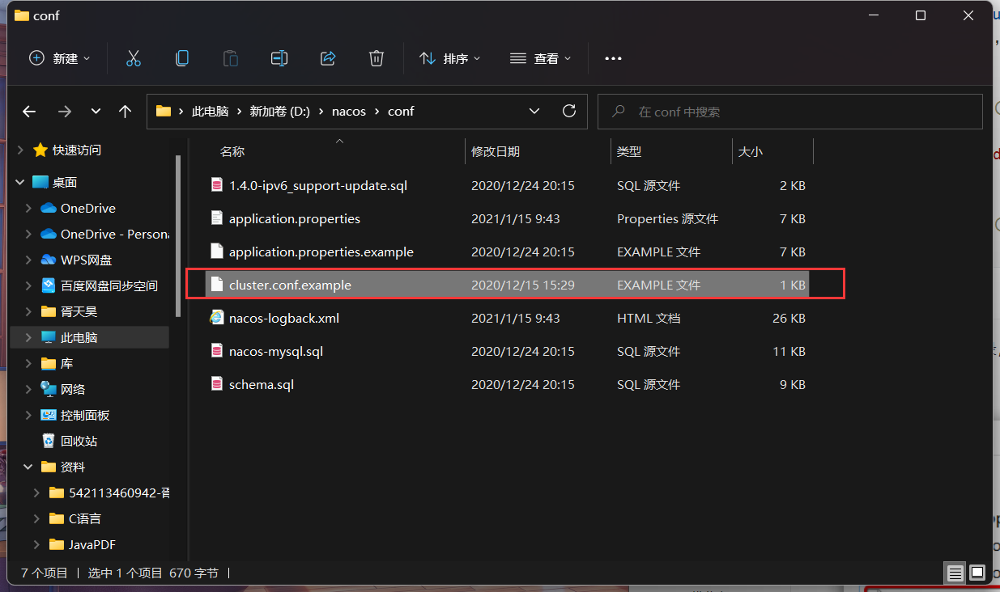

[](https://cdn.xn2001.com/img/2021/202108182004564.png)

添加内容

```
127.0.0.1:8845
127.0.0.1.8846
127.0.0.1.8847
```


2. 

然后修改 application.properties 文件，添加数据库配置

```properties
spring.datasource.platform=mysql
db.num=1
db.url.0=jdbc:mysql://127.0.0.1:3306/nacos?characterEncoding=utf8&connectTimeout=1000&socketTimeout=3000&autoReconnect=true&useUnicode=true&useSSL=false&serverTimezone=UTC
db.user.0=root
db.password.0=123456
```


3. 

将 nacos 文件夹复制三份，分别命名为：nacos1、nacos2、nacos3

[](https://cdn.xn2001.com/img/2021/202108182004103.png)


4. 

然后分别修改三个文件夹中的 application.properties，

nacos1

```properties
server.port=8845
```

nacos2

```properties
server.port=8846
```

nacos3

```properties
server.port=8847
```


------------------------

到现在就配置好啦

然后分别启动三个 nacos，就是在**每个**nacos的bin目录下执行这个指令

```
startup.cmd
```

之后我们就需要对nginx做反向代理

## Nginx反向代理

修改 nginx 文件夹下的 conf/nginx.conf 文件，配置如下

```nginx
upstream nacos-cluster {
    server 127.0.0.1:8845;
	server 127.0.0.1:8846;
	server 127.0.0.1:8847;
}

server {
    listen       80;
    server_name  localhost;

    location /nacos {
        proxy_pass http://nacos-cluster;
    }
}
```

> 上面代码的意思是只要访问/nacos这个路径，就会代理到上面 127.0.0.1:8845;那三个的路径


启动 nginx，在浏览器访问：http://localhost/nacos


那我们可以想，如果想使用nacos，我们只需要配置到80端口就可以了，之后nginx就会自动为我们分配nacos了

在代码中的 application.yml 文件配置改为如下：

```yaml
spring:
  cloud:
    nacos:
      server-addr: localhost:80 # Nacos地址
```

实际部署时，需要给做反向代理的 Nginx 服务器设置一个域名，这样后续如果有服务器迁移 ，Nacos 的客户端也无需更改配置。Nacos 的各个节点应该部署到多个不同服务器，做好容灾和隔离工作。

# Feign远程调用

我们以前利用 RestTemplate 发起远程调用的代码：

[](https://cdn.xn2001.com/img/2021/20210901092616.png)


缺点：

- 代码可读性差，编程体验不统一
- 参数复杂URL难以维护，太长的参数，不好维护


Feign 是一个**声明式**的 http 客户端

官方地址：https://github.com/OpenFeign/feign

其作用就是帮助我们**优雅的实现 http 请求的发送**，解决上面提到的问题。

[](https://cdn.xn2001.com/img/2021/20210901092639.png)


发送一个http请求需要的信息


* 服务名称: userservice

* 请求方式:GET

* 请求路径:/user/{id}

* 请求参数:Long id

* 返回值类型:User

  

  

  下面是feign的使用

  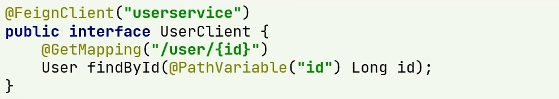

## Feign使用

**引入依赖**

我们在 order-service 引入 feign 依赖：

```xml
<dependency>
    <groupId>org.springframework.cloud</groupId>
    <artifactId>spring-cloud-starter-openfeign</artifactId>
</dependency>
```

**添加注解**

在 order-service 启动类添加注解开启 Feign

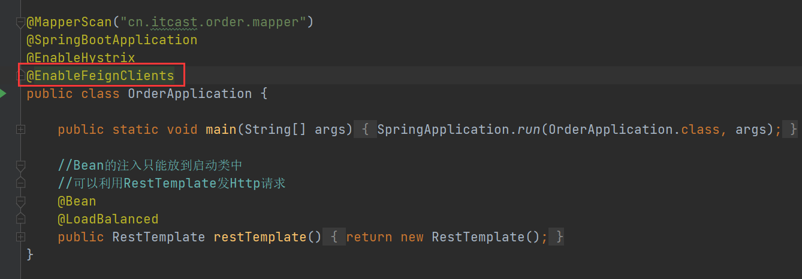


**请求接口**

在 order-service 中新建一个接口，内容如下

```java
@FeignClient("userservice")
public interface UserClient {
    @GetMapping("/user/{id}")
    User findById(@PathVariable("id") Long id);
}
```

`@FeignClient("userservice")`：其中参数填写的是微服务名

`@GetMapping("/user/{id}")`：其中参数填写的是请求路径

这个客户端主要是基于 SpringMVC 的注解 `@GetMapping` 来声明远程调用的信息

Feign 可以帮助我们发送 http 请求，无需自己使用 RestTemplate 来发送了。

所以我们就可以把restTemplate的代码给注掉啦

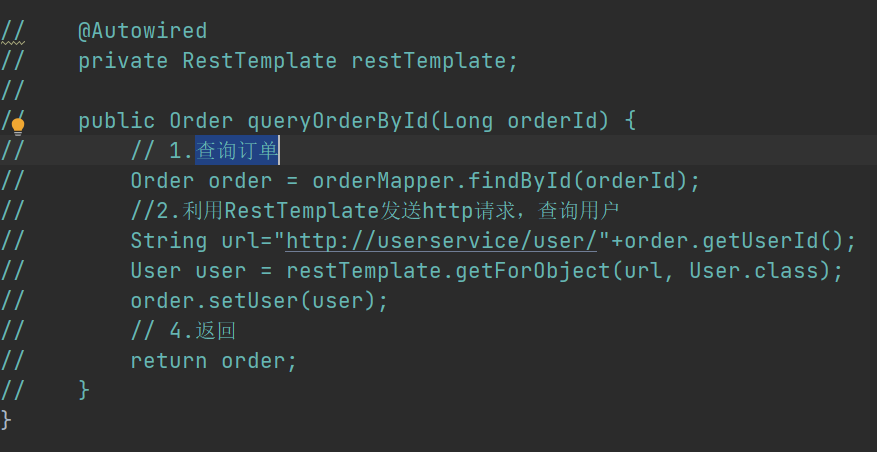

我们既然要用feign，那就要使用刚刚我们创建的feign的接口

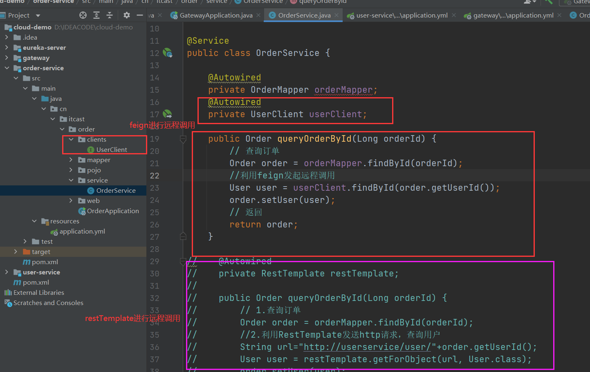


**测试**

```java
@Autowired
private UserClient userClient;

public Order queryOrderAndUserById(Long orderId) {
    // 1.查询订单
    Order order = orderMapper.findById(orderId);
    // 2.使用feign远程调用
    User user = userClient.findById(order.getUserId());
    // 3. 将用户信息封装进订单
    order.setUser(user);
    // 4.返回
    return order;
}
```

## 自定义配置

Feign 可以支持很多的自定义配置，如下表所示：

| 类型                   | 作用             | 说明                                                   |
| :--------------------- | :--------------- | :----------------------------------------------------- |
| **feign.Logger.Level** | 修改日志级别     | 包含四种不同的级别：NONE、BASIC、HEADERS、FULL         |
| feign.codec.Decoder    | 响应结果的解析器 | http远程调用的结果做解析，例如解析json字符串为java对象 |
| feign.codec.Encoder    | 请求参数编码     | 将请求参数编码，便于通过http请求发送                   |
| feign.Contract         | 支持的注解格式   | 默认是SpringMVC的注解                                  |
| feign.Retryer          | 失败重试机制     | 请求失败的重试机制，默认是没有，不过会使用Ribbon的重试 |

一般情况下，默认值就能满足我们使用，如果要自定义时，只需要创建自定义的 @Bean 覆盖默认 Bean 即可。


下面以日志为例来演示如何自定义配置。

基于配置文件修改 feign 的日志级别可以针对**单个服务**：

```yaml
feign:  
  client:
    config: 
      userservice: # 针对某个微服务的配置
        loggerLevel: FULL #  日志级别 
```

**也可以针对所有服务**：

```yaml
feign:  
  client:
    config: 
      default: # 这里用default就是全局配置，如果是写服务名称，则是针对某个微服务的配置
        loggerLevel: FULL #  日志级别 
```

而日志的级别分为四种：

- NONE：不记录任何日志信息，这是默认值。
- BASIC：仅记录请求的方法，URL以及响应状态码和执行时间
- HEADERS：在BASIC的基础上，额外记录了请求和响应的头信息
- FULL：记录所有请求和响应的明细，包括头信息、请求体、元数据


也可以基于 **Java 代码**来修改日志级别，先声明一个类，然后声明一个 Logger.Level 的对象

```java
public class DefaultFeignConfiguration  {
    @Bean
    public Logger.Level feignLogLevel(){
        return Logger.Level.BASIC; // 日志级别为BASIC
    }
}
```

如果要**全局生效**，将其放到**启动类**的 `@EnableFeignClients` 这个注解中：

```java
@EnableFeignClients(defaultConfiguration = DefaultFeignConfiguration .class) 
```

如果是**局部生效**，则把它放到对应的 `@FeignClient` 这个注解中：

```java
@FeignClient(value = "userservice", configuration = DefaultFeignConfiguration .class) 
```

## 性能优化

Feign 底层发起 http 请求，依赖于其它的框架。其底层客户端实现有：

- **URLConnection**：默认实现，不支持连接池
- **Apache HttpClient** ：支持连接池
- **OKHttp**：支持连接池

因此提高 Feign 性能的主要手段就是使用**连接池**代替默认的 URLConnection

另外，日志级别应该尽量用 basic/none，可以有效提高性能。

**这里我们用 Apache 的HttpClient来演示连接池。**

在 order-service 的 pom 文件中引入 HttpClient 依赖

```xml
<!--httpClient的依赖 -->
<dependency>
    <groupId>io.github.openfeign</groupId>
    <artifactId>feign-httpclient</artifactId>
</dependency>
```

**配置连接池**

在 order-service 的 application.yml 中添加配置

```yaml
feign:
  client:
    config:
      default: # default全局的配置
        loggerLevel: BASIC # 日志级别，BASIC就是基本的请求和响应信息
  httpclient:
    enabled: true # 开启feign对HttpClient的支持
    max-connections: 200 # 最大的连接数
    max-connections-per-route: 50 # 每个路径的最大连接数
```

## 最佳实践

### 继承方式

我们可以发现，因为我们发的请求和响应的接收的请求的代码是差不多的，所以可以进行利用（但是官方并不建议我们这样做）


一样的代码可以通过继承来共享：

1）定义一个 API 接口，利用定义方法，并基于 SpringMVC 注解做声明

2）Feign 客户端、Controller 都集成该接口


**优点**

- 简单
- 实现了代码共享

**缺点**

- 服务提供方、服务消费方紧耦合
- 参数列表中的注解映射并不会继承，因此 Controller 中必须再次声明方法、参数列表、注解


### 抽取方式

将 FeignClient 抽取为独立模块，并且把接口有关的 pojo、默认的 Feign 配置都放到这个模块中，提供给所有消费者使用。

例如：将 UserClient、User、Feign 的默认配置都抽取到一个 feign-api 包中，所有微服务引用该依赖包，即可直接使用。

[](https://cdn.xn2001.com/img/2021/20210901092811.png)


接下来我们就用该方法在代码中实现

**首先创建一个 module，命名为 feign-api**

[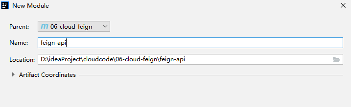](https://cdn.xn2001.com/img/2021/20210901092835.png)


在 feign-api 中然后引入feign的依赖

```xml
<dependency>
    <groupId>org.springframework.cloud</groupId>
    <artifactId>spring-cloud-starter-openfeign</artifactId>
</dependency>
```

order-service中 的 UserClient、User 都复制到 feign-api 项目中

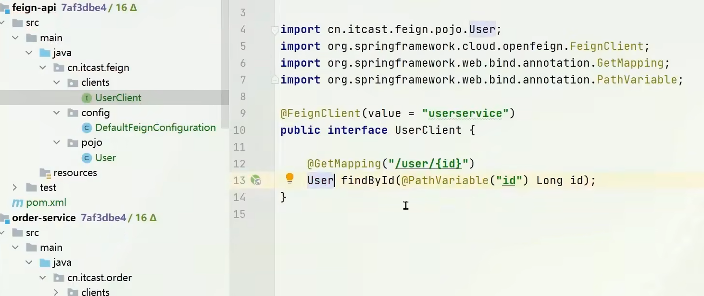


接下来在 order-service 中使用 feign-api

由于我们已经将 UserClient、User 放在 fegin-api 中共享了 ，所以可以删除 order-service 中的 UserClient、User，然后在 order-service 中引入 feign-api

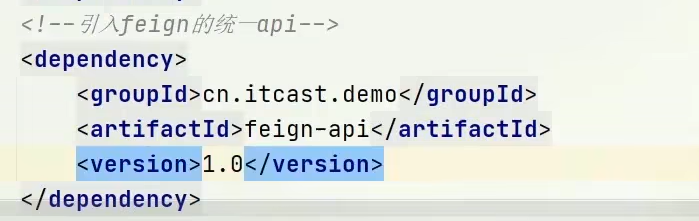

**修改注解**

当定义的 FeignClient 不在 SpringBootApplication 的扫描包范围下时，这些 FeignClient (UserClient)就不能使用。

第一种

修改 order-service 启动类上的 `@EnableFeignClients` 注解

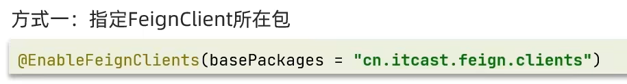

需要注意的是，引入的pom依赖，相当于把代码就导入进项目了，也就是说，在另一个项目下的路径，也可以被spring扫描


第二种

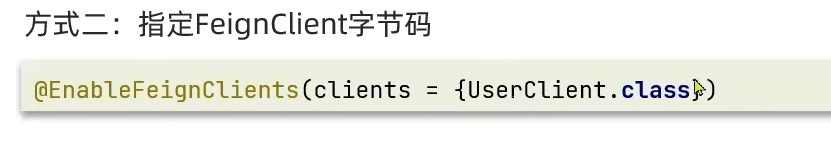

# Gateway网关

Spring Cloud Gateway 是 Spring Cloud 的一个全新项目，该项目是基于 Spring 5.0，Spring Boot 2.0 和 Project Reactor 等响应式编程和事件流技术开发的网关，它旨在为微服务架构提供一种简单有效的统一的 API 路由管理方式。

Gateway 网关是我们服务的守门神，**所有微服务的统一入口。**

网关的**核心功能特性**：

- 请求路由
- 权限控制
- 限流

[](https://cdn.xn2001.com/img/2021/20210901092857.png)


**权限控制**：网关作为微服务入口，需要校验用户是是否有请求资格，如果没有则进行拦截。

**路由和负载均衡**：一切请求都必须先经过 gateway，但网关不处理业务，而是根据某种规则，把请求转发到某个微服务，这个过程叫做路由。当然路由的目标服务有多个时，还需要做负载均衡。

**限流**：当请求流量过高时，在网关中按照下流的微服务能够接受的速度来放行请求，避免服务压力过大。

在 SpringCloud 中网关的实现包括两种：

- gateway
- zuul

Zuul 是基于 Servlet 实现，属于阻塞式编程。

而 Spring Cloud Gateway 则是基于 Spring5 中提供的WebFlux，属于响应式编程的实现，具备更好的性能。 

## 入门使用

1. 创建 SpringBoot（用Maven就可以） 工程 gateway，引入网关依赖
2. 编写启动类
3. 编写基础配置和路由规则
4. 启动网关服务进行测试

```xml
<!--网关-->
<dependency>
    <groupId>org.springframework.cloud</groupId>
    <artifactId>spring-cloud-starter-gateway</artifactId>
</dependency>
<!--nacos服务发现依赖-->
<dependency>
    <groupId>com.alibaba.cloud</groupId>
    <artifactId>spring-cloud-starter-alibaba-nacos-discovery</artifactId>
</dependency>
```

创建 application.yml 文件，内容如下：

```yaml
server:
  port: 10010 # 网关端口
spring:
  application:
    name: gateway # 服务名称
  cloud:
    nacos:
      server-addr: localhost:8848 # nacos地址
    gateway:
      routes: # 网关路由配置
        - id: user-service # 路由id，自定义，只要唯一即可
          uri: lb://userservice # 路由的目标地址 lb就是负载均衡，后面跟服务名称
          predicates: # 路由断言，也就是判断请求是否符合路由规则的条件
            - Path=/user/** # 这个是按照路径匹配，只要以/user/开头就符合要求
```

我们将符合`Path` 规则的一切请求，都代理到 `uri`参数指定的地址。

上面的例子中，我们将 `/user/**` 开头的请求，代理到 `lb://userservice`，其中 lb 是负载均衡(LoadBalance)，根据服务名拉取服务列表，实现负载均衡。

重启网关，访问 http://localhost:10010/user/1 时，符合 `/user/**` 规则，请求转发到 uri：http://userservice/user/1

[](https://cdn.xn2001.com/img/2021/202108220125749.png)


多个 predicates 的话，要同时满足规则，下文有例子。

## 流程图

[](https://cdn.xn2001.com/img/2021/202108220127419.png)


路由配置包括：

1. 路由id：路由的唯一标示
2. 路由目标（uri）：路由的目标地址，http代表固定地址，lb代表根据服务名负载均衡
3. 路由断言（predicates）：判断路由的规则
4. 路由过滤器（filters）：对请求或响应做处理（这个还没做笔记，之后会做） 

## 断言工厂

我们在配置文件中写的断言规则只是字符串，这些字符串会被 Predicate Factory 读取并处理，转变为路由判断的条件。

例如 `Path=/user/**` 是按照路径匹配，这个规则是由

`org.springframework.cloud.gateway.handler.predicate.PathRoutePredicateFactory` 类来处理的，像这样的断言工厂在 Spring Cloud Gateway 还有十几个

| 名称       | 说明                           | 示例                                                         |
| :--------- | :----------------------------- | :----------------------------------------------------------- |
| After      | 是某个时间点后的请求           | - After=2037-01-20T17:42:47.789-07:00[America/Denver]        |
| Before     | 是某个时间点之前的请求         | - Before=2031-04-13T15:14:47.433+08:00[Asia/Shanghai]        |
| Between    | 是某两个时间点之前的请求       | - Between=2037-01-20T17:42:47.789-07:00[America/Denver], 2037-01-21T17:42:47.789-07:00[America/Denver] |
| Cookie     | 请求必须包含某些cookie         | - Cookie=chocolate, ch.p                                     |
| Header     | 请求必须包含某些header         | - Header=X-Request-Id, \d+                                   |
| Host       | 请求必须是访问某个host（域名） | - Host=`**.somehost.org`, `**.anotherhost.org`               |
| Method     | 请求方式必须是指定方式         | - Method=GET,POST                                            |
| Path       | 请求路径必须符合指定规则       | - Path=/red/{segment},/blue/**                               |
| Query      | 请求参数必须包含指定参数       | - Query=name, Jack或者- Query=name                           |
| RemoteAddr | 请求者的ip必须是指定范围       | - RemoteAddr=192.168.1.1/24                                  |
| Weight     | 权重处理                       |                                                              |

> 官方文档：https://docs.spring.io/spring-cloud-gateway/docs/current/reference/html/#gateway-request-predicates-factories

一般的，我们只需要掌握 Path，加上官方文档的例子，就可以应对各种工作场景了。

```yaml
predicates:
  - Path=/order/**
  - After=2031-04-13T15:14:47.433+08:00[Asia/Shanghai]
```

像这样的规则，现在是 2021年8月22日01:32:42，很明显 After 条件不满足，可以不会转发，路由不起作用。

## 过滤器工厂

GatewayFilter 是网关中提供的一种过滤器，可以对进入网关的请求和微服务返回的响应做处理。

[](https://cdn.xn2001.com/img/2021/202108220133487.png)


Spring提供了31种不同的路由过滤器工厂。

> 官方文档：https://docs.spring.io/spring-cloud-gateway/docs/current/reference/html/#gatewayfilter-factories

| **名称**             | **说明**                     |
| :------------------- | :--------------------------- |
| AddRequestHeader     | 给当前请求添加一个请求头     |
| RemoveRequestHeader  | 移除请求中的一个请求头       |
| AddResponseHeader    | 给响应结果中添加一个响应头   |
| RemoveResponseHeader | 从响应结果中移除有一个响应头 |
| RequestRateLimiter   | 限制请求的流量               |

下面我们以 AddRequestHeader 为例：

[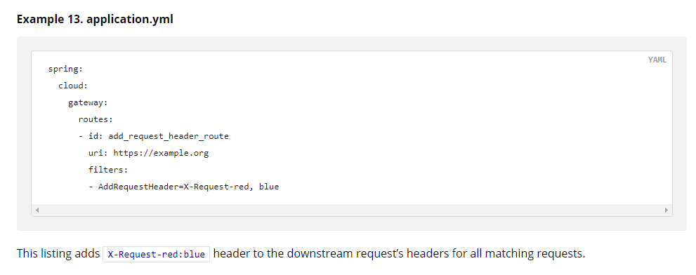](https://cdn.xn2001.com/img/2021/202108220139913.png)


**需求**：给所有进入 userservice 的请求添加一个请求头：`sign=hhh.com is eternal`

只需要修改 gateway 服务的 application.yml文件，添加路由过滤即可。

```yaml
spring:
  cloud:
    gateway:
      routes: # 网关路由配置
        - id: user-service # 路由id，自定义，只要唯一即可
          # uri: http://127.0.0.1:8081 # 路由的目标地址 http就是固定地址
          uri: lb://userservice # 路由的目标地址 lb就是负载均衡，后面跟服务名称
          predicates: # 路由断言，也就是判断请求是否符合路由规则的条件
            - Path=/user/** # 这个是按照路径匹配，只要以/user/开头就符合要求
          filters:
            - AddRequestHeader=sign, hhh.com is eternal # 添加请求头
```

如何验证，我们修改 userservice 中的一个接口

```java
@GetMapping("/{id}")
public User queryById(@PathVariable("id") Long id, @RequestHeader(value = "sign", required = false) String sign) {
    log.warn(sign);
    return userService.queryById(id);
}
```

重启两个服务，访问：http://localhost:10010/user/1

可以看到控制台打印出了这个请求头


当然，Gateway 也是有**全局过滤器**的，如果要**对所有的路由都生效**，则可以将过滤器工厂写到 default-filters 下：

```yaml
spring:
  cloud:
    gateway:
      default-filters:
        - AddRequestHeader=sign, hhh.com is eternal # 添加请求头
```

## 全局过滤器

上面介绍的过滤器工厂，网关提供了 31 种，但每一种过滤器的作用都是固定的。**如果我们希望拦截请求，做自己的业务逻辑则没办法实现**。

全局过滤器的作用也是处理一切进入网关的请求和微服务响应，**与 GatewayFilter 的作用一样**。区别在于 GlobalFilter 的逻辑可以**写代码来自定义规则**；而 GatewayFilter 通过配置定义，处理逻辑是固定的。

**需求**：定义全局过滤器，拦截请求，判断请求的参数是否满足下面条件

- 参数中是否有 authorization
- authorization 参数值是否为 admin

如果同时满足则放行，否则拦截。

```java
@Component
public class AuthorizeFilter implements GlobalFilter, Ordered {

    // 测试：http://localhost:10010/order/101?authorization=admin
    @Override
    public Mono<Void> filter(ServerWebExchange exchange, GatewayFilterChain chain) {
        // 获取第一个 authorization 参数
        String authorization = exchange.getRequest().getQueryParams().getFirst("authorization");
        if ("admin".equals(authorization)){
            // 放行
            return chain.filter(exchange);
        }
        // 设置拦截状态码信息
        exchange.getResponse().setStatusCode(HttpStatus.UNAUTHORIZED);
        // 设置拦截
        return exchange.getResponse().setComplete();
    }

    // 设置过滤器优先级，值越低优先级越高
    // 也可以使用 @Order 注解
    //@Order注解的使用是放在类上，看下面
    @Override
    public int getOrder() {
        return 0;
    }
}
```

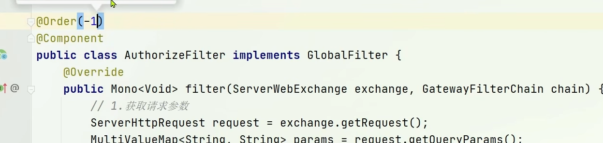

## 过滤器顺序

请求进入网关会碰到三类过滤器：DefaultFilter、当前路由的过滤器、GlobalFilter；

请求路由后，会将三者合并到一个过滤器链（集合）中，排序后依次执行每个过滤器.

[](https://cdn.xn2001.com/img/2021/202108230002747.png)


排序的规则是什么呢？

- 每一个过滤器都必须指定一个 int 类型的 order 值，**order 值越小，优先级越高，执行顺序越靠前**。
- GlobalFilter 通过实现 Ordered 接口，或者使用 @Order 注解来指定 order 值，由我们自己指定。
- 路由过滤器和 defaultFilter 的 order 由 Spring 指定，默认是按照声明顺序从1递增。
- 当过滤器的 order 值一样时，**会按照 defaultFilter > 路由过滤器 > GlobalFilter 的顺序执行。**

## 跨域问题


在 Gateway 网关中解决跨域问题还是比较方便的。基本都是cv，以后会深究一下

```yaml
spring:
  cloud:
    gateway:
      globalcors: # 全局的跨域处理
        add-to-simple-url-handler-mapping: true # 解决options请求被拦截问题
        corsConfigurations:
          '[/**]':
            allowedOrigins: # 允许哪些网站的跨域请求 allowedOrigins: “*” 允许所有网站
              - "http://localhost:8090"
            allowedMethods: # 允许的跨域ajax的请求方式
              - "GET"
              - "POST"
              - "DELETE"
              - "PUT"
              - "OPTIONS"
            allowedHeaders: "*" # 允许在请求中携带的头信息
            allowCredentials: true # 是否允许携带cookie
            maxAge: 360000 # 这次跨域检测的有效期
```

## 网关相关配置

网关解决跨域问题

```java
@Configuration
public class CorsConfig {
    @Bean
    public CorsWebFilter corsFilter() {
        CorsConfiguration config = new CorsConfiguration();
        config.addAllowedMethod("*");
        config.addAllowedOrigin("*");
        config.addAllowedHeader("*");
        UrlBasedCorsConfigurationSource source = new
            UrlBasedCorsConfigurationSource(new PathPatternParser());
        source.registerCorsConfiguration("/**", config);
        return new CorsWebFilter(source);
    }
}
```

全局Filter，统一处理会员登录与外部不允许访问的服务

```java
/**
* <p>
* 全局Filter，统一处理会员登录与外部不允许访问的服务
* </p>
*/
@Component
public class AuthGlobalFilter implements GlobalFilter, Ordered {
    private AntPathMatcher antPathMatcher = new AntPathMatcher();
    @Override
    public Mono<Void> filter(ServerWebExchange exchange, GatewayFilterChain chain)
    {
        ServerHttpRequest request = exchange.getRequest();
        String path = request.getURI().getPath();
        //谷粒学院api接口，校验用户必须登录
        if(antPathMatcher.match("/api/**/auth/**", path)) {
            List<String> tokenList = request.getHeaders().get("token");
            if(null == tokenList) {
                ServerHttpResponse response = exchange.getResponse();
                return out(response);
            } else {
                // Boolean isCheck = JwtUtils.checkToken(tokenList.get(0));
                // if(!isCheck) {
                ServerHttpResponse response = exchange.getResponse();
                return out(response);
                // }
            }
        }
        //内部服务接口，不允许外部访问
        if(antPathMatcher.match("/**/inner/**", path)) {
            ServerHttpResponse response = exchange.getResponse();
            return out(response);
        }
        return chain.filter(exchange);
    }
    @Override
    public int getOrder() {
        return 0;
    }
    private Mono<Void> out(ServerHttpResponse response) {
        JsonObject message = new JsonObject();
        message.addProperty("success", false);
        message.addProperty("code", 28004);
        message.addProperty("data", "鉴权失败");
        byte[] bits = message.toString().getBytes(StandardCharsets.UTF_8);
        DataBuffer buffer = response.bufferFactory().wrap(bits);
        //response.setStatusCode(HttpStatus.UNAUTHORIZED);
        //指定编码，否则在浏览器中会中文乱码
        response.getHeaders().add("Content-Type", "application/json;charset=UTF8");
        return response.writeWith(Mono.just(buffer));
    }
}
```

自定义异常处理

服务网关调用服务时可能会有一些异常或服务不可用，它返回错误信息不友好，需要我们覆盖处理

ErrorHandlerConfig：

```java
/**
* 覆盖默认的异常处理
*
*/
@Configuration
@EnableConfigurationProperties({ServerProperties.class, ResourceProperties.class})
public class ErrorHandlerConfig {
    private final ServerProperties serverProperties;
    private final ApplicationContext applicationContext;
    private final ResourceProperties resourceProperties;
    private final List<ViewResolver> viewResolvers;
    private final ServerCodecConfigurer serverCodecConfigurer;
    public ErrorHandlerConfig(ServerProperties serverProperties,
                              ResourceProperties resourceProperties,
                              ObjectProvider<List<ViewResolver>>
                              viewResolversProvider,
                              ServerCodecConfigurer
                              serverCodecConfigurer,
                              ApplicationContext applicationContext) {
        this.serverProperties = serverProperties;
        this.applicationContext = applicationContext;
        this.resourceProperties = resourceProperties;
        this.viewResolvers =
            viewResolversProvider.getIfAvailable(Collections::emptyList);
        this.serverCodecConfigurer = serverCodecConfigurer;
    }
    @Bean
    @Order(Ordered.HIGHEST_PRECEDENCE)
    public ErrorWebExceptionHandler errorWebExceptionHandler(ErrorAttributes
                                                             errorAttributes) {
        JsonExceptionHandler exceptionHandler = new JsonExceptionHandler(
            errorAttributes,
            this.resourceProperties,
            this.serverProperties.getError(),
            this.applicationContext);
        exceptionHandler.setViewResolvers(this.viewResolvers);
        exceptionHandler.setMessageWriters(this.serverCodecConfigurer.getWriters());
        exceptionHandler.setMessageReaders(this.serverCodecConfigurer.getReaders());
        return exceptionHandler;
    }
}
```

JsonExceptionHandler：

```java
/**
* 自定义异常处理
*
* <p>异常时用JSON代替HTML异常信息<p>
*
*/
public class JsonExceptionHandler extends DefaultErrorWebExceptionHandler {
    public JsonExceptionHandler(ErrorAttributes errorAttributes,
                                ResourceProperties resourceProperties,
                                ErrorProperties errorProperties,
                                ApplicationContext applicationContext) {
        super(errorAttributes, resourceProperties, errorProperties,
              applicationContext);
    }
    /**
* 获取异常属性
*/
    @Override
    protected Map<String, Object> getErrorAttributes(ServerRequest request,
                                                     boolean includeStackTrace) {
        Map<String, Object> map = new HashMap<>();
        map.put("success", false);
        map.put("code", 20005);
        map.put("message", "网关失败");
        map.put("data", null);
        return map;
    }
    /**
* 指定响应处理方法为JSON处理的方法
* @param errorAttributes
*/
    @Override
    protected RouterFunction<ServerResponse> getRoutingFunction(ErrorAttributes
                                                                errorAttributes) {
        return RouterFunctions.route(RequestPredicates.all(),
                                     this::renderErrorResponse);
    }
    /**
* 根据code获取对应的HttpStatus
* @param errorAttributes
*/
    @Override
    protected HttpStatus getHttpStatus(Map<String, Object> errorAttributes) {
        return HttpStatus.OK;
    }
}
```


# RabbitMQ消息中间件

## 同步异步通讯

**微服务间通讯有同步和异步两种方式**

同步通讯：就像打电话，需要实时响应。

异步通讯：就像发邮件，不需要马上回复。

[](https://cdn.xn2001.com/img/2021/20210904133345.png)


两种方式各有优劣，打电话可以立即得到响应，但是你却不能跟多个人同时通话。发送邮件可以同时与多个人收发邮件，但是往往响应会有延迟。

我们之前学习的 **Feign 调用**就属于**同步方式**，虽然调用可以实时得到结果，但存在下面的问题：

[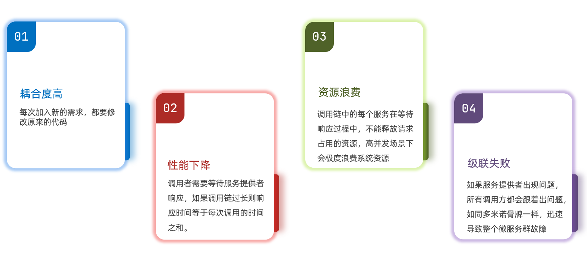](https://cdn.xn2001.com/img/2021/20210904133517.png)


**同步调用的优点**：

- 时效性较强，可以立即得到结果

**同步调用的缺点**：

- 耦合度高

- 性能和吞吐能力下降

- 有额外的资源消耗

- 有级联失败问题

  ---------------

  

异步调用则可以避免上述问题，我们以购买商品为例，用户支付后需要调用订单服务完成订单状态修改，调用物流服务，从仓库分配响应的库存并准备发货。在事件模式中，支付服务是事件发布者（publisher），在支付完成后**只需要发布一个支付成功的事件**（event），事件中带上订单id。订单服务和物流服务是事件订阅者（Consumer），订阅支付成功的事件，监听到事件后完成自己业务即可。

为了解除事件发布者与订阅者之间的耦合，两者并不是直接通信，而是有一个中间人（Broker）。发布者发布事件到Broker，不关心谁来订阅事件。订阅者从Broker订阅事件，不关心谁发来的消息。

[](https://cdn.xn2001.com/img/2021/20210904144714.png)


Broker 是一个像数据总线一样的东西，所有的服务要接收数据和发送数据都发到这个总线上，这个总线就像协议一样，让服务间的通讯变得标准和可控。

[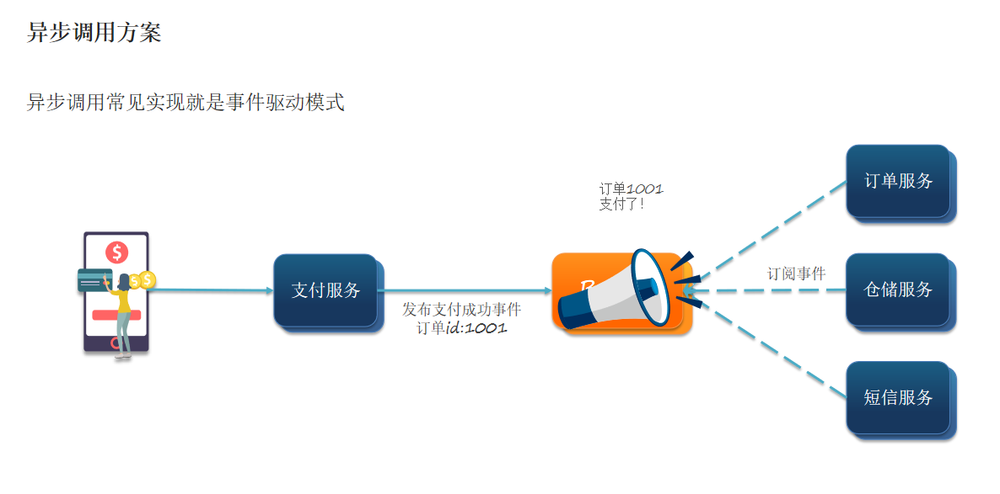](https://cdn.xn2001.com/img/2021/20210904145001.png)


**异步调用好处**：

- 吞吐量提升：无需等待订阅者处理完成，响应更快速
- 故障隔离：服务没有直接调用，不存在级联失败问题
- 调用间没有阻塞，不会造成无效的资源占用
- 耦合度极低，每个服务都可以灵活插拔，可替换
- 流量削峰：不管发布事件的流量波动多大，都由 Broker 接收，订阅者可以按照自己的速度去处理事件

**异步调用缺点**：

- 架构复杂了，业务没有明显的流程线，不好管理
- 需要依赖于 Broker 的可靠、安全、性能

## MQ消息队列

MQ，中文是消息队列（MessageQueue），字面来看就是存放消息的队列，也就是事件驱动架构中的 **Broker**

比较常见的 MQ 实现：

- ActiveMQ
- RabbitMQ
- RocketMQ
- Kafka

几种常见MQ的对比：

|            | **RabbitMQ**            | **ActiveMQ**                      | **RocketMQ** | **Kafka**  |
| :--------- | :---------------------- | :-------------------------------- | :----------- | :--------- |
| 公司/社区  | Rabbit                  | Apache                            | 阿里         | Apache     |
| 开发语言   | Erlang                  | Java                              | Java         | Scala&Java |
| 协议支持   | AMQP、XMPP、SMTP、STOMP | OpenWire、STOMP、REST、XMPP、AMQP | 自定义协议   | 自定义协议 |
| 可用性     | 高                      | 一般                              | 高           | 高         |
| 单机吞吐量 | 一般                    | 差                                | 高           | 非常高     |
| 消息延迟   | 微秒级                  | 毫秒级                            | 毫秒级       | 毫秒以内   |
| 消息可靠性 | 高                      | 一般                              | 高           | 一般       |


># RabbitMQ部署指南
>
>
>
>
>
>
>
>
>
># 1.单机部署
>
>我们在Centos7虚拟机中使用Docker来安装。
>
>## 1.1.下载镜像
>
>方式一：在线拉取
>
>``` sh
>docker pull rabbitmq:3.8-management
>```
>
>
>
>方式二：从本地加载
>
>在课前资料已经提供了镜像包：
>
>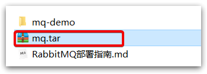 
>
>上传到虚拟机中后，使用命令加载镜像即可：
>
>```sh
>docker load -i mq.tar
>```
>
>
>
>
>
>## 1.2.安装MQ
>
>执行下面的命令来运行MQ容器：
>
>```sh
>docker run \
> -e RABBITMQ_DEFAULT_USER=itcast \
> -e RABBITMQ_DEFAULT_PASS=123321 \
> -v mq-plugins:/plugins \
> --name mq \
> --hostname mq1 \
> -p 15672:15672 \
> -p 5672:5672 \
> -d \
> rabbitmq:3.8-management
>```
>
>15672是管理平台的ui界面端口
>
>5672是消息通信的端口
>
>启动成功后访问地址：
>
>```
>http://192.168.30.128:15672
>```
>


**RabbitMQ 中的一些角色**

- publisher：生产者
- consumer：消费者
- exchange：交换机，负责消息路由
- queue：队列，存储消息
- virtualHost：虚拟主机，**隔离不同租户**的 exchange、queue、消息的隔离

**MQ 的基本结构**

[](https://cdn.xn2001.com/img/2021/20210904172912.png)


## 入门案例

RabbitMQ 官方提供了 5 个不同的 Demo 示例，对应了不同的消息模型。

[](https://cdn.xn2001.com/img/2021/20210904173739.png)


Hello World 模型

[](https://cdn.xn2001.com/img/2021/20210904200637.png)


官方的 HelloWorld 是基于最基础的消息队列模型来实现的，只包括三个角色：

- publisher：消息发布者，将消息发送到队列queue
- queue：消息队列，负责接受并缓存消息
- consumer：订阅队列，处理队列中的消息

### publisher实现

- 建立连接
- 创建 channel
- 声明队列
- 发送消息
- 关闭连接和 channel

```java
public class PublisherTest {
    @Test
    public void testSendMessage() throws IOException, TimeoutException {
        // 1.建立连接
        ConnectionFactory factory = new ConnectionFactory();
        // 1.1.设置连接参数，分别是：主机名、端口号、vhost、用户名、密码
        factory.setHost("192.168.211.128");
        factory.setPort(5672);
        factory.setVirtualHost("/");
        factory.setUsername("admin");
        factory.setPassword("123456");
        // 1.2.建立连接
        Connection connection = factory.newConnection();
        // 2.创建通道Channel
        Channel channel = connection.createChannel();
        // 3.创建队列
        String queueName = "simple.queue";
        channel.queueDeclare(queueName, false, false, false, null);
        // 4.发送消息
        String message = "Hello RabbitMQ！";
        channel.basicPublish("", queueName, null, message.getBytes());
        System.out.println("发送消息成功：[" + message + "]");
        // 5.关闭通道和连接
        channel.close();
        connection.close();
    }
}
```

### consumer实现

- 建立连接
- 创建 channel
- 声明队列
- 订阅消息

```java
public class ConsumerTest {
    public static void main(String[] args) throws IOException, TimeoutException {
        // 1.建立连接
        ConnectionFactory factory = new ConnectionFactory();
        // 1.1.设置连接参数，分别是：主机名、端口号、vhost、用户名、密码
        factory.setHost("192.168.211.128");
        factory.setPort(5672);
        factory.setVirtualHost("/");
        factory.setUsername("admin");
        factory.setPassword("123456");
        // 1.2.建立连接
        Connection connection = factory.newConnection();
        // 2.创建通道Channel
        Channel channel = connection.createChannel();
        // 3.创建队列
        String queueName = "simple.queue";
        channel.queueDeclare(queueName, false, false, false, null);
        // 4.订阅消息
        channel.basicConsume(queueName, true, new DefaultConsumer(channel) {
            @Override
            public void handleDelivery(String consumerTag, Envelope envelope,
                                       AMQP.BasicProperties properties, byte[] body) {
                // 5.处理消息
                String message = new String(body);
                System.out.println("接收到消息：[" + message + "]");
            }
        });
        System.out.println("等待接收消息中");
    }
}
```

## SpringAMQP

SpringAMQP 是基于 RabbitMQ 封装的一套模板，并且还利用 SpringBoot 对其实现了自动装配，使用起来非常方便。

SpringAMQP 的官方地址：https://spring.io/projects/spring-amqp

[](https://cdn.xn2001.com/img/2021/20210904202046.png)


[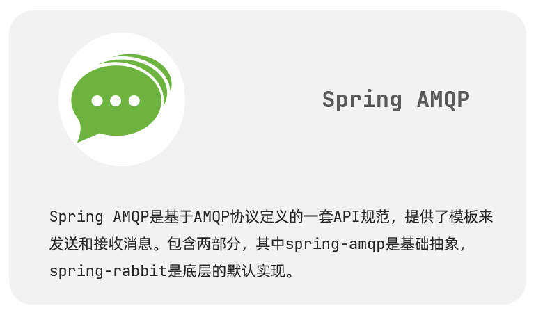](https://cdn.xn2001.com/img/2021/20210904202056.png)


SpringAMQP 提供了三个功能：

- 自动声明队列、交换机及其绑定关系
- 基于注解的监听器模式，异步接收消息
- 封装了 RabbitTemplate 工具，用于发送消息


在父工程增加这个pom依赖

```xml
<!--AMQP依赖，包含RabbitMQ-->
<dependency>
    <groupId>org.springframework.boot</groupId>
    <artifactId>spring-boot-starter-amqp</artifactId>
</dependency>
```

### BasicQueue

首先配置 MQ地址，在 publisher、consumer 服务中的 application.yml 中添加配置

```yml
spring:
  rabbitmq:
    host: 120.48.132.242 # 主机名
    port: 5672 # 端口
    virtual-host: / # 虚拟主机
    username: admin # 用户名
    password: 123456 # 密码
```

在 consumer 服务中添加监听队列

```java
@Component
public class RabbitMQListener {
    @RabbitListener(queues = "simple.queue")
    public void listenSimpleQueueMessage(String msg) throws InterruptedException {
        System.out.println("消费者接收到消息：【" + msg + "】");
    }
}
```

在 publisher 服务中添加发送消息的测试类

```java
@RunWith(SpringRunner.class)
@SpringBootTest
public class SpringAmqpTest {
    @Autowired
    private RabbitTemplate rabbitTemplate;
    @Test
    public void testSimpleQueue() {
        // 队列名称
        String queueName = "simple.queue";
        // 消息
        String message = "哈喽啊";
        // 发送消息
        rabbitTemplate.convertAndSend(queueName, message);
    }
}
```

### WorkQueue

Work queues，也被称为（Task queues），任务模型。简单来说就是**让多个消费者绑定到一个队列，共同消费队列中的消息**。

[](https://cdn.xn2001.com/img/2021/20210904211238.png)


当消息处理比较耗时的时候，可能生产消息的速度会远远大于消息的消费速度。长此以往，消息就会堆积越来越多，无法及时处理。

此时就可以使用 work 模型，多个消费者共同处理消息处理，速度就能大大提高了。


我们循环发送，模拟大量消息堆积现象，在 publisher 服务中的 SpringAmqpTest 类中添加一个测试方法：

```java
/**
 * workQueue
 * 向队列中不停发送消息，模拟消息堆积。
 */
@Test
public void testWorkQueue() throws InterruptedException {
    // 队列名称
    String queueName = "simple.queue";
    // 消息
    String message = "hello, message_";
    for (int i = 0; i < 50; i++) {
        // 发送消息
        rabbitTemplate.convertAndSend(queueName, message + i);
        Thread.sleep(20);
    }
}
```

**消息接收**

要模拟多个消费者绑定同一个队列，我们在 consumer 服务的 RabbitMQListener 中添加2个新的方法：

```java
@RabbitListener(queues = "simple.queue")
public void listenWorkQueue1(String msg) throws InterruptedException {
    System.out.println("消费者1接收到消息：【" + msg + "】" + LocalTime.now());
    Thread.sleep(20);
}

@RabbitListener(queues = "simple.queue")
public void listenWorkQueue2(String msg) throws InterruptedException {
    System.err.println("消费者2........接收到消息：【" + msg + "】" + LocalTime.now());
    Thread.sleep(200);
}
```

启动 ConsumerApplication 后，在执行 publisher 服务中刚刚编写的发送测试方法 testWorkQueue

可以看到消费者1很快完成了自己的25条消息。消费者2却在缓慢的处理自己的25条消息。

也就是说消息是**平均分配给每个消费者**，并没有考虑到消费者的处理能力。这是因为 RabbitMQ 默认有一个消息预取机制（就是先直接分配），显然这不是我们想要的结果，我们需要的是能者多劳嘛，所以去限制每次只能取一条消息，可以解决这个问题。

在 spring 中有一个简单的配置，设置 prefetch 属性，我们修改 consumer 服务的 application.yml 文件，添加配置

```yml
spring:
  rabbitmq:
    listener:
      simple:
        prefetch: 1 # 每次只能获取一条消息，处理完成才能获取下一个消息
```

Work 模型的使用：

- 多个消费者绑定到一个队列，同一条消息只会被一个消费者处理
- 通过设置 prefetch 来控制消费者预取的消息数量

### 发布/订阅

在之前我们提出了一个问题，如果想把消息都发送给消费者，目前是不可取的，因为一个消费者吸收了这条消息就没有了，所以我们引入了**一个exchange角色**


[](https://cdn.xn2001.com/img/2021/20210904213455.png)


图中可以看到，在订阅模型中，多了一个 exchange 角色，而且过程略有变化

- Publisher：生产者，也就是要发送消息的程序，但是不再发送到队列中，**而是发给 exchange（交换机）**
- Consumer：消费者，与以前一样，订阅队列，没有变化
- Queue：消息队列也与以前一样，接收消息、缓存消息
- Exchange：交换机，一方面，接收生产者发送的消息；另一方面，知道如何处理消息，例如递交给某个特别队列、递交给所有队列、或是将消息丢弃。到底如何操作，取决于 Exchange 的类型。Exchange 有以下3种类型：
  - Fanout：广播，将消息交给所有绑定到交换机的队列
  - Direct：定向，把消息交给符合指定 routing key 的队列
  - Topic：通配符，把消息交给符合 routing pattern（路由模式） 的队列

**Exchange（交换机）只负责转发消息，不具备存储消息的能力**，因此如果没有任何队列与 Exchange 绑定，或者没有符合路由规则的队列，那么消息会丢失！

#### Fanout

Fanout，英文翻译是扇出，在 MQ 中我们也可以称为广播。

[](https://cdn.xn2001.com/img/2021/20210912160350.png)


在广播模式下，消息发送流程是这样的：

- 可以有多个队列
- 每个队列都要绑定到 Exchange（交换机）
- 生产者发送的消息，只能发送到交换机，交换机来决定要发给哪个队列，生产者无法决定
- 交换机把消息发送给绑定过的所有队列
- 订阅队列的消费者都能拿到消息

接下里我们用 SpringAMQP 来简单实现 FanoutExchange

1. 在 consumer 服务中，利用代码声明队列、交换机，并将两者绑定
2. 在 consumer 服务中，编写两个消费者方法，分别监听 fanout.queue1 和 fanout.queue2
3. 在 publisher 中编写测试方法，向 fanout发送消息

**声明队列和交换机**

Spring 提供了一个接口 Exchange，来表示所有不同类型的交换机。

[](https://cdn.xn2001.com/img/2021/20210904213809.png)


在 consumer 中创建一个类，声明队列、交换机、**绑定对象 Binding**

```java
@Configuration
public class FanoutConfig {

    /**
     * 声明交换机
     * @return Fanout类型交换机
     */
    @Bean
    public FanoutExchange fanoutExchange(){
        return new FanoutExchange("hh.fanout");
    }

    /**
     * 声明队列
     * @return Queue
     */
    @Bean
    public Queue fanoutQueue1(){
        return new Queue("fanout.queue1");
    }
    @Bean
    public Queue fanoutQueue2(){
        return new Queue("fanout.queue2");
    }

    /**
     * 绑定队列和交换机
     */
    @Bean
    public Binding bindingQueue1(FanoutExchange fanoutExchange,Queue fanoutQueue1){
        return BindingBuilder.bind(fanoutQueue1).to(fanoutExchange);
    }
    @Bean
    public Binding bindingQueue2(FanoutExchange fanoutExchange,Queue fanoutQueue2){
        return BindingBuilder.bind(fanoutQueue2).to(fanoutExchange);
    }

}
```


通过这样 `@Bean` 的方式来申明确

实比较麻烦，其实我们也是可以直接通过 `@RabbitListener` 注解来完成的，代码如下：

在 consumer 服务的 SpringRabbitListener 中添加三个方法，作为消费者

```java
@RabbitListener(queues = "fanout.queue1")
public void listenFanoutQueue1(String msg) throws InterruptedException {
    System.out.println("接收到fanout.queue1的消息：【" + msg + "】" + LocalTime.now());
}

@RabbitListener(queues = "fanout.queue2")
public void listenFanoutQueue2(String msg) throws InterruptedException {
    System.err.println("接收到fanout.queue2的消息：【" + msg + "】" + LocalTime.now());
}

@RabbitListener(bindings = @QueueBinding(
    value = @Queue(value = "fanout.queue3"),
    exchange = @Exchange(value = "xn2001.fanout",type = "fanout")
))
public void listenFanoutQueue3(String msg) {
    System.out.println("接收到fanout.queue3的消息：【" + msg + "】" + LocalTime.now());
}
```


在 publisher 服务的 SpringAmqpTest 类中添加测试方法

```java
/**
 * fanout
 * 向交换机发送消息
 */
@Test
public void testFanoutExchange() {
    // 交换机名称
    String exchangeName = "hh.fanout";
    // 消息
    String message = "hello, every one!";
    rabbitTemplate.convertAndSend(exchangeName, "", message);//第二个参数还没学，为空就行
}
```

运行该方法，可以发现 fanout.queue1、fanout.queue2 都收到了交换机的消息。


总结一下：

交换机的作用是什么？

- 接收 publisher 发送的消息
- 将消息按照规则路由到与之绑定的队列
- 不能缓存消息，路由失败，消息丢失
- FanoutExchange 会将所有消息路由到**每个**绑定的队列

#### Direct

在 Fanout 模式中，一条消息，会被所有订阅的队列都消费。

但是，在某些场景下，我们希望不同的消息被不同的队列消费。这时就要用到 DirectExchange

[](https://cdn.xn2001.com/img/2021/20210912182822.png)


在 Direct 模型下：

- 队列与交换机的绑定，不能是任意绑定了，而是要指定一个`RoutingKey`（路由key），但是`RoutingKey`可能并不只有一个,所以说，Direct仍然可以实现Fanout的功能
- 消息的发送方向 Exchange发送消息时，也必须指定消息的 `RoutingKey`。
- Exchange 不再把消息交给每一个绑定的队列，而是根据消息的`Routing Key`进行判断，只有队列的`Routingkey` 与消息的 `Routing key`完全一致，才会接收到消息

在 consumer 的 SpringRabbitListener 中添加两个消费者，同时基于注解来声明队列和交换机

```java
@RabbitListener(bindings = @QueueBinding(
    value = @Queue(value = "direct.queue1"),
    exchange = @Exchange(value = "hh.direct"),
    key = {"a","b"}
))
public void listenDirectQueue1(String msg){
    System.out.println("接收到direct.queue1的消息：【" + msg + "】" + LocalTime.now());
}


@RabbitListener(bindings = @QueueBinding(
    value = @Queue(value = "direct.queue2"),
    exchange = @Exchange(value = " hh.direct"),
    key = {"a","c"}
))
public void listenDirectQueue2(String msg){
    System.out.println("接收到direct.queue2的消息：【" + msg + "】" + LocalTime.now());
}
```

这两个的方法交换机是一个，但是队列和key是不同的


在 publisher 服务的 SpringAmqpTest 类中添加测试方法

```java
/**
 * direct
 * 向交换机发送消息
 */
@Test
public void testDirectExchangeToA() {
    // 交换机名称
    String exchangeName = "hh.direct";
    // 消息
    String message = "hello, i am direct to a!";
    rabbitTemplate.convertAndSend(exchangeName, "a", message);
}

/**
 * direct
 * 向交换机发送消息
 */
@Test
public void testDirectExchangeToB() {
    // 交换机名称
    String exchangeName = "hh.direct";
    // 消息
    String message = "hello, i am direct to b!";
    rabbitTemplate.convertAndSend(exchangeName, "b", message);
}
```

#### Topic

`Topic ` 与 `Direct`相比，都是可以根据`RoutingKey`把消息路由到不同的队列。

只不过`Topic `类型可以让队列在绑定`Routing key` 的时候使用通配符

通配符规则：

`#`：匹配一个或多个词

`*`：只能匹配一个词

例如：

```
item.#`：能够匹配`item.spu.insert` 或者 `item.spu
item.*`：只能匹配`item.spu
```

[](https://cdn.xn2001.com/img/2021/20210912194016.png)


- Queue1：绑定的是 `china.#` ，因此凡是以 `china.` 开头的 `routing key` 都会被匹配到。包括 china.news 和 china.weather
- Queue2：绑定的是 `#.news` ，因此凡是以 `.news ` 结尾的 `routing key` 都会被匹配。包括 china.news 和 japan.news

```java
@RabbitListener(bindings = @QueueBinding(
    value = @Queue(value = "topic.queue1"),
    exchange = @Exchange(value = "hh.topic",type = ExchangeTypes.TOPIC),
    key = {"china.#"}
))
public void listenTopicQueue1(String msg){
    System.out.println("接收到topic.queue1的消息：【" + msg + "】" + LocalTime.now());
}

@RabbitListener(bindings = @QueueBinding(
    value = @Queue(value = "topic.queue2"),
    exchange = @Exchange(value = "hh.topic",type = ExchangeTypes.TOPIC),
    key = {"china.*"}
))
public void listenTopicQueue2(String msg){
    System.out.println("接收到topic.queue2的消息：【" + msg + "】" + LocalTime.now());
}
/**
 * topic
 * 向交换机发送消息
 */
@Test
public void testTopicExchange() {
    // 交换机名称
    String exchangeName = "hh.topic";
    // 消息
    String message1 = "hello, i am topic form china.news";
    String message2 = "hello, i am topic form china.news.2";
    rabbitTemplate.convertAndSend(exchangeName, "china.news", message1);
    rabbitTemplate.convertAndSend(exchangeName, "china.news.2", message2);
}
```

[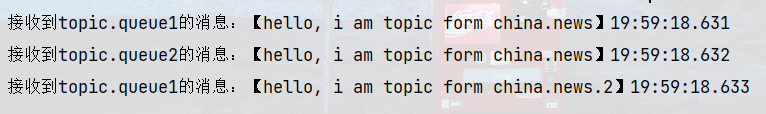](https://cdn.xn2001.com/img/2021/20210912200012.png)


### 消息转换器

Spring 会把你发送的消息序列化为字节发送给 MQ，接收消息的时候，还会把字节反序列化为 Java 对象。

**默认情况下 Spring 采用的序列化方式是 JDK 序列化。**

我们可以去试一下效果

```java
@RabbitListener(queuesToDeclare = @Queue(value = "object.queue"))
public void listenObjectQueue(Map<String,Object> msg) throws InterruptedException {
    System.err.println("object接收到消息：【" + msg + "】" + LocalTime.now());
    Thread.sleep(200);
}
@Test
public void testSendMap()  {
    // 准备消息
    Map<String,Object> msg = new HashMap<>();
    msg.put("name", "Jack");
    msg.put("age", 21);
    // 发送消息
    rabbitTemplate.convertAndSend("object.queue", msg);
}
```

[](https://cdn.xn2001.com/img/2021/20210912204117.png)


众所周知，JDK序列化存在下列问题：

- 数据体积过大
- 有安全漏洞
- 可读性差

我们推荐可以使用 JSON 来序列化

在 publisher 和 consumer 两个服务中都引入依赖

```xml
<dependency>
    <groupId>com.fasterxml.jackson.dataformat</groupId>
    <artifactId>jackson-dataformat-xml</artifactId>
    <version>2.9.10</version>
</dependency>
```

配置消息转换器。

在各自的启动类中添加一个 Bean 即可

```java
@Bean
public MessageConverter jsonMessageConverter(){
    return new Jackson2JsonMessageConverter();
}
```

[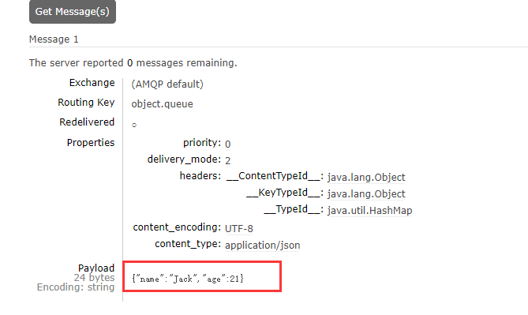](https://cdn.xn2001.com/img/2021/20210912204512.png)


# ELasticsearch搜索引擎


ELasticsearch 是一款非常强大的开源搜索引擎，具备非常多强大功能，可以帮助我们从海量数据中快速找到需要的内容，可以用来实现搜索、日志统计、分析、系统监控等功能。


## 倒排索引

**首先，倒排索引的概念是基于 MySQL 这样的正向索引而言的。**

那么我们先讲何为正向索引。例如给下表（tb_goods）中的 id 创建索引

[](https://cdn.xn2001.com/img/2021/20210918202527.png)


如果是根据 id 查询，那么直接走索引，查询速度非常快。

但如果是基于 title 做模糊查询，只能是逐行扫描数据，流程如下：

1. 用户搜索数据，条件是 title 符合 `"%手机%"`
2. 逐行获取数据，比如 id 为 1 的数据
3. 判断数据中的 title 是否符合用户搜索条件
4. 如果符合则放入结果集，不符合则丢弃。然后回到步骤1

逐行扫描，也就是全表扫描，随着数据量增加，其查询效率也会越来越低。当数据量达到数百万时，就会很慢很慢。。。。

而倒排索引中有两个非常重要的概念：

- 文档（`Document`）：用来搜索的数据，其中的每一条数据就是一个文档。例如一个网页、一个商品信息
- 词条（`Term`）：对文档数据或用户搜索数据，利用某种算法分词，得到的具备含义的词语就是词条。例如：我是中国人，就可以分为：我、是、中国人、中国、国人这样的几个词条

**创建倒排索引**是对正向索引的一种特殊处理，流程如下：

- 将每一个文档的数据利用算法分词，得到一个个词条
- 创建表，每行数据包括词条、词条所在文档 id、位置等信息
- 因为词条唯一性，可以给词条创建索引，例如 hash 表结构索引

如图：

[](https://cdn.xn2001.com/img/2021/20210918203514.png)


**倒排索引的搜索流程**如下（以搜索"华为手机"为例）

1. 用户输入条件`"华为手机"`进行搜索
2. 对用户输入内容**分词**，得到词条：`华为`、`手机`
3. 拿着词条在倒排索引中查找，可以得到包含词条的文档 id 有 1、2、3
4. 拿着文档 id 到正向索引中查找具体文档

[](https://cdn.xn2001.com/img/2021/20210918203815.png)


**虽然要先查询倒排索引，再查询正向索引，但是词条和文档id 都建立了索引，查询速度非常快！无需全表扫描。**

为什么一个叫做正向索引，一个叫做倒排索引呢？

**正向索引**是最传统的，根据 id 索引的方式。但根据词条查询时，必须先逐条获取每个文档，然后判断文档中是否包含所需要的词条，是**根据文档找词条的过程**

**倒排索引**则相反，是先找到用户要搜索的词条，根据得到的文档 id 获取该文档。是**根据词条找文档的过程**

## 文档和字段

elasticsearch 是面向**文档（Document）**存储的，可以是数据库中的一条商品数据，一个订单信息。文档数据会被序列化为 json 格式后存储在 elasticsearch

[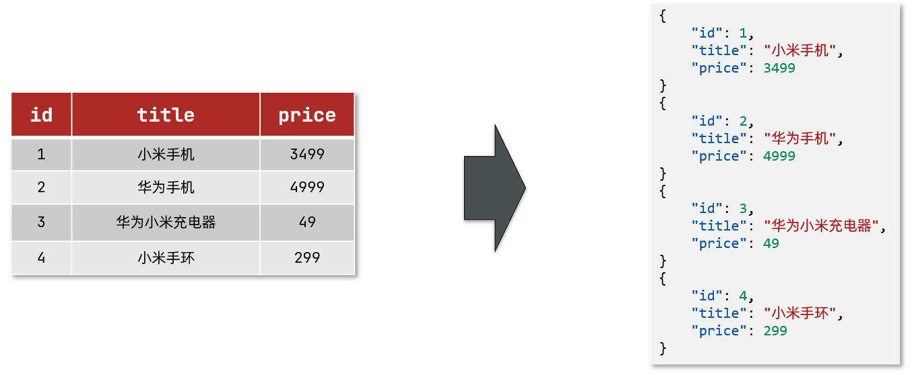](https://cdn.xn2001.com/img/2021/20210918212707.png)


而 JSON 文档中往往包含很多的**字段（Field）**，类似于数据库中的列。

## 索引和映射

**索引（Index）**，就是相同类型的文档的集合。

例如：

- 所有用户文档，就可以组织在一起，称为用户的索引；
- 所有商品的文档，可以组织在一起，称为商品的索引；
- 所有订单的文档，可以组织在一起，称为订单的索引；

[](https://cdn.xn2001.com/img/2021/20210918213357.png)


因此，我们可以把索引当做是数据库中的表。

数据库的表会有约束信息，用来定义表的结构、字段的名称、类型等信息。因此，索引库中就有**映射（mapping）**，是索引中文档的字段约束信息，类似表的结构约束。

**mysql 与 elasticsearch**

| **MySQL** | **Elasticsearch** | **说明**                                                     |
| :-------- | :---------------- | :----------------------------------------------------------- |
| Table     | Index             | 索引(index)，就是文档的集合，类似数据库的表(table)           |
| Row       | Document          | 文档（Document），就是一条条的数据，类似数据库中的行（Row），文档都是JSON格式 |
| Column    | Field             | 字段（Field），就是JSON文档中的字段，类似数据库中的列（Column） |
| Schema    | Mapping           | Mapping（映射）是索引中文档的约束，例如字段类型约束。类似数据库的表结构（Schema） |
| SQL       | DSL               | DSL是elasticsearch提供的JSON风格的请求语句，用来操作elasticsearch，实现CRUD |

- Mysql：擅长事务类型操作，可以确保数据的安全和一致性
- Elasticsearch：擅长海量数据的搜索、分析、计算


因此在企业中，往往是两者结合使用：

- 对安全性要求较高的写操作，使用 MySQL 实现
- 对查询性能要求较高的搜索需求，使用 ELasticsearch 实现
- 两者再基于某种方式，实现数据的同步，保证一致性

[](https://cdn.xn2001.com/img/2021/20210918213631.png)

## 安装Elasticsearch

因为我们还需要部署 kibana 容器，需要让 es 和 kibana 容器互联。这里先创建一个网络：

```sh
docker network create es-net 
```

之后运行命令加载：

```
docker load -i es.tar
```

同理还有kibana的tar包也需要这样做

安装

```sh
docker run -d \
--name es \
-e "ES_JAVA_OPTS=-Xms216m -Xmx216m" \
-e "discovery.type=single-node" \
-v es-data:/usr/share/elasticsearch/data \
-v es-plugins:/usr/share/elasticsearch/plugins \
--privileged \
--network es-net \
-p 9200:9200 \
-p 9300:9300 \
elasticsearch:7.12.1
```

命令解释：

- `-e "cluster.name=es-docker-cluster"`：设置集群名称
- `-e "http.host=0.0.0.0"`：监听的地址，可以外网访问
- `-e "ES_JAVA_OPTS=-Xms512m -Xmx512m"`：内存大小
- `-e "discovery.type=single-node"`：非集群模式
- `-v es-data:/usr/share/elasticsearch/data`：挂载逻辑卷，绑定es的数据目录
- `-v es-logs:/usr/share/elasticsearch/logs`：挂载逻辑卷，绑定es的日志目录
- `-v es-plugins:/usr/share/elasticsearch/plugins`：挂载逻辑卷，绑定es的插件目录
- `--privileged`：授予逻辑卷访问权
- `--network es-net` ：加入一个名为 es-net 的网络中
- `-p 9200:9200`：端口映射配置

访问地址：http://120.48.132.242:9200即可看到 elasticsearch 的响应结果

[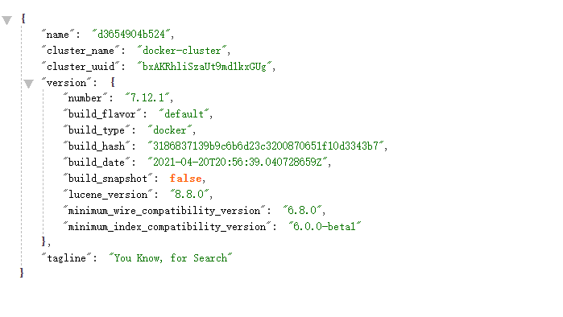](https://cdn.xn2001.com/img/2021/20210918214620.png)


## 安装kibana

kibana 可以给我们提供一个 elasticsearch 的可视化界面，便于我们学习命令。

```sh
docker run -d \
--name kibana \
-e ELASTICSEARCH_HOSTS=http://es:9200 \
--network=es-net \
-p 5601:5601  \
kibana:7.12.1
```

- `--network es-net` ：加入一个名为 es-net 的网络中，与 elasticsearch 在同一个网络中
- `-e ELASTICSEARCH_HOSTS=http://es:9200"`：设置 elasticsearch 的地址，因为 kibana 已经与 elasticsearch 在一个网络，因此可以用容器名直接访问 elasticsearch
- `-p 5601:5601`：端口映射配置

访问地址：http://120.48.132.242:5601，即可看到结果

[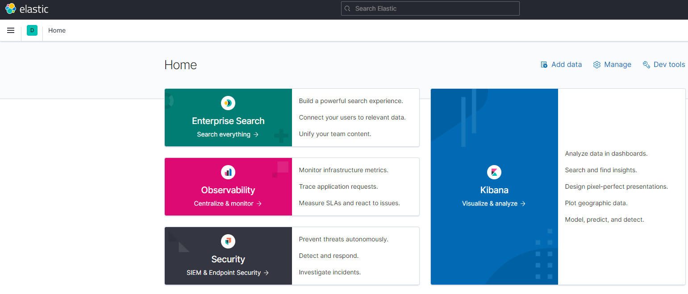](https://cdn.xn2001.com/img/2021/20210918214722.png)


控制面板：http://120.48.132.242:5601/app/dev_tools#/console

## 安装IK分词器

由于国内访问 GitHub 较慢，我们选择离线模式安装。

安装插件需要知道 elasticsearch 的 plugins 目录位置，而我们用了数据卷挂载，因此需要查看 elasticsearch 的数据卷目录，通过下面命令查看

```sh
docker volume inspect es-plugins
```

显示结果：

```json
[
    {
        "CreatedAt": "2022-05-06T10:06:34+08:00",
        "Driver": "local",
        "Labels": null,
        "Mountpoint": "/var/lib/docker/volumes/es-plugins/_data",
        "Name": "es-plugins",
        "Options": null,
        "Scope": "local"
    }
]
```

说明 plugins 目录被挂载到了 `/var/lib/docker/volumes/es-plugins/_data ` 这个目录中

[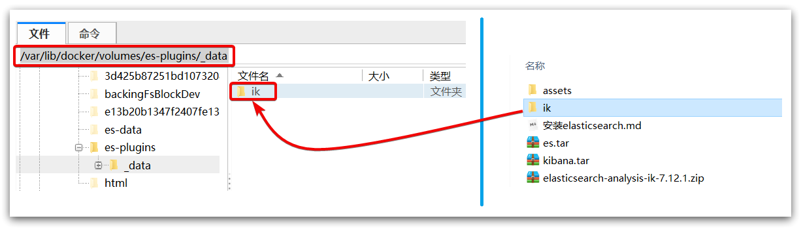](https://cdn.xn2001.com/img/2021/20210918215615.png)


重启容器

```shell
# 4、重启容器
docker restart es

# 查看es日志
docker logs -f es
```

IK分词器包含两种模式：

- `ik_smart`：智能切分，粗粒度
- `ik_max_word`：最细切分，细粒度

我们在上面的 Kibana 控制台测试

```json
GET /_analyze
{
  "analyzer": "ik_max_word",
  "text": "钟老师你好菜啊"
}
```

## 扩展词词典

在上面的IK分词器我们可以随着热点词来扩展，可以自己添加，比如 ”钟老师应该是一个热点词“，另外你也可以配置一些停用掉的敏感词，让其不进行分词。

打开IK分词器 config 目录是 `IKAnalyzer.cfg.xml`，添加一个文件名，我们以 `ext.dic` 文件名为例。

[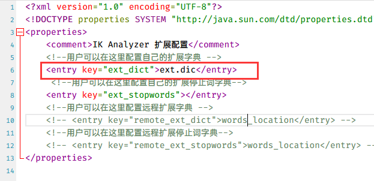](https://cdn.xn2001.com/img/2021/20210918221159.png)


我们去创建 `ext.dic` ，在其中添加热点词就好了，一个词一行。

[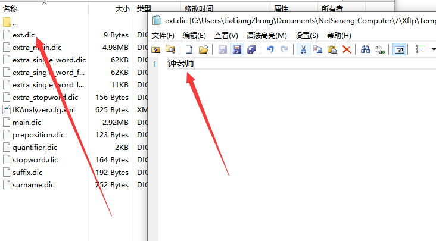](https://cdn.xn2001.com/img/2021/20210918220910.png)


重启 elasticsearch

```sh
docker restart es
```

重新测试

```json
GET /_analyze
{
  "analyzer": "ik_max_word",
  "text": "钟老师你好菜啊"
}
```

[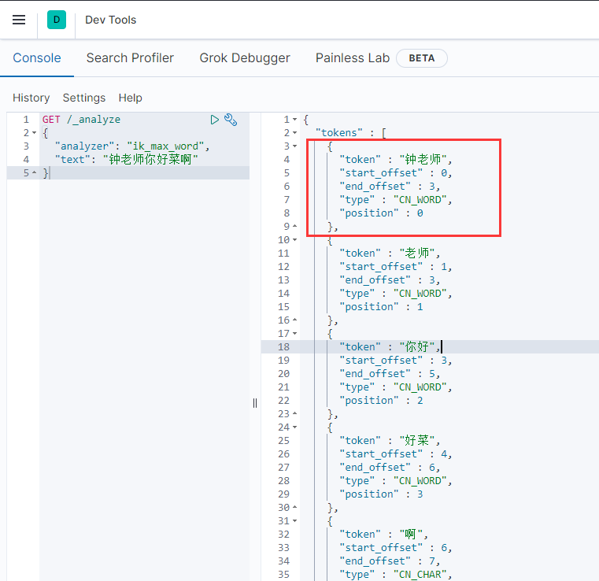](https://cdn.xn2001.com/img/2021/20210918221424.png)


## 索引库操作

### Mapping属性映射

索引库就类似数据库表，**mapping 映射就类似表的结构**

我们要向 es 中存储数据，必须先创建“库”和“表”

mapping 是对索引库中文档的约束，常见的 mapping 属性包括：

- type：字段数据类型，常见的简单类型有：
  - 字符串：text（可分词的文本）、keyword（精确值，例如：品牌、国家、ip地址）
  - 数值：long、integer、short、byte、double、float、
  - 布尔：boolean
  - 日期：date
  - 对象：object
- **index：是否创建索引，默认为 true**
- analyzer：使用哪种分词器
- properties：该字段的子字段

我们以需要存储下面的 JSON 为例来讲解

```json
{
    "age": 21,
    "weight": 52.1,
    "isMarried": false,
    "info": "你是猪猪",
    "email": "1499487526@qq.com",
    "score": [99.1, 99.5, 98.9],
    "name": {
        "firstName": "白",
        "lastName": "李"
    }
}
```

首先对应的每个字段映射（mapping）情况如下：

- age：类型为 integer；参与搜索，index 为 true；无需分词器
- weight：类型为 float；参与搜索，index 为 true；无需分词器
- isMarried：类型为boolean；参与搜索，index 为 true；无需分词器
- info：类型为字符串，需要分词，因此是 text；参与搜索，index为true；分词器可以用 ik_smart
- email：类型为字符串，但是不需要分词，因此是 keyword；不参与搜索，index 为 false；无需分词器
- score：虽然是数组，**但是我们只看元素的类型**，类型为 float；参与搜索，index 为 true；无需分词器
- name：类型为 object，需要定义多个子属性
  - name.firstName：类型为字符串，不需要分词，keyword；参与搜索，index 为 true；无需分词器
  - name.lastName：类型为字符串，不需要分词，keyword；参与搜索，index 为 true；无需分词器

### 创建索引库和映射

上面我们了解了 Mapping 属性映射，接下来我们就去看看如何创建索引库及映射。

```json
PUT /索引库名称
{
  "mappings": {
    "properties": {
      "字段名":{
        "type": "text",
        "analyzer": "ik_smart"
      },
      "字段名2":{
        "type": "keyword",
        "index": "false"
      },
      "字段名3":{
        "properties": {
          "子字段": {
            "type": "keyword"
          }
        }
      }
      // ...略
    }
  }
}


PUT /xiaoabaicai
{
  "mappings": {
    "properties": {
      "info":{
        "type": "text",
        "analyzer": "ik_smart"
      },
      "email":{
        "type": "keyword",
        "index": "false"
      },
      "name":{
        "properties": {
          "firstName": {
            "type": "keyword"
          },
          "lastName": {
            "type": "keyword"
          }
        }
      }
    }
  }
}
```


我们用真实的数据库表来创建一个索引库

[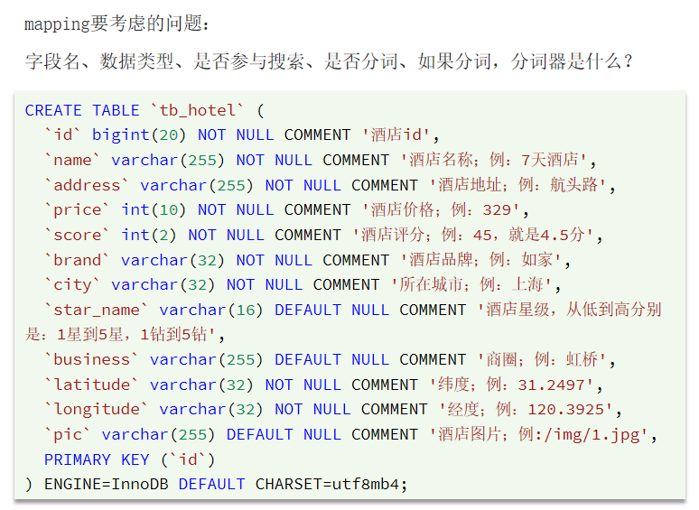](https://cdn.xn2001.com/img/2021/20210919164626.png)


- 字段名、字段数据类型，可以参考数据表结构的名称和类型
- 是否参与搜索要分析业务来判断，例如图片地址，就无需参与搜索
- 是否分词呢要看内容，内容如果是一个整体就无需分词
- 分词器，我们可以统一使用 `ik_max_word`

```json
PUT /hotel
{
  "mappings": {
    "properties": {
      "id": {
        "type": "keyword"
      },
      "name":{
        "type": "text",
        "analyzer": "ik_max_word",
        "copy_to": "all"
      },
      "address":{
        "type": "keyword",
        "index": false
      },
      "price":{
        "type": "integer"
      },
      "score":{
        "type": "integer"
      },
      "brand":{
        "type": "keyword",
        "copy_to": "all"
      },
      "city":{
        "type": "keyword",
        "copy_to": "all"
      },
      "starName":{
        "type": "keyword"
      },
      "business":{
        "type": "keyword"
      },
      "location":{
        "type": "geo_point"
      },
      "pic":{
        "type": "keyword",
        "index": false
      },
      "all":{
        "type": "text",
        "analyzer": "ik_max_word"
      }
    }
  }
}
```

特殊字段说明：

- location：地理坐标，里面包含精度、纬度
- all：一个组合字段，其目的是将多字段的值利用 `copy_to` 合并，提供给用户搜索，这样一来就只需要搜索一个字段就可以得到结果，性能更好。


> ES中支持两种地理坐标数据类型：
>
> - geo_point：由纬度（latitude）和经度（longitude）确定的一个点。例如："32.8752345, 120.2981576"
> - geo_shape：有多个 geo_point 组成的复杂几何图形。例如一条直线，"LINESTRING (-77.03653 38.897676, -77.009051 38.889939)"


### 修改索引库

倒排索引结构虽然不复杂，但是一旦数据结构改变（比如改变了分词器），就需要重新创建倒排索引，这简直是灾难。因此索引库**一旦创建，无法修改 mapping**

==虽然无法修改 mapping 中已有的字段，但是却允许添加新的字段到 mapping 中，不会对倒排索引产生影响。==

```json
PUT /索引库名/_mapping
{
  "properties": {
    "新字段名":{
      "type": "integer"
    }
  }
}
```

### 删除索引库

```json
DELETE /索引库名
```

### 查询索引库

```json
GET /数据库名
```

## DSL文档操作

### 新增文档

```json
POST /索引库名/_doc/文档id
{
    "字段1": "值1",
    "字段2": "值2",
    "字段3": {
        "子属性1": "值3",
        "子属性2": "值4"
    }
    // ...
}
POST /xiaobaicai/_doc/1
{
    "info": "我不会Java",
    "email": "1499487526@qq.com",
    "name": {
        "firstName": "昊昊",
        "lastName": "天"
    }
}
```

### 修改文档

修改文档有两种方式：

- 全量修改：直接覆盖原来的文档
- 增量修改：修改文档中的部分字段

**全量修改**是覆盖原来的文档，其本质是：

- 根据指定的 id 删除文档
- 新增一个相同 id 的文档

**注意**：如果根据 id 删除时，id 不存在，第二步的新增也会执行，也就是变成了新增操作

```json
PUT /{索引库名}/_doc/id
{
    "字段1": "值1",
    "字段2": "值2",
    // ... 略
}
PUT /xiaobaicai/_doc/1
{
    "info": "我不会敲代码",
    "email": "1499487527@qq.com",
    "name": {
        "firstName": "天",
        "lastName": "昊昊"
    }
}
```


**增量修改（局部修改）**是只修改指定 id 匹配的文档中的部分字段

```json
POST /{索引库名}/_update/文档id
{
    "doc": {
         "字段名": "新的值",
    }
}
POST /heima/_update/1
{
  "doc": {
    "email": "update@qq.com"
  }
}
```

### 查询文档

```json
GET /{索引库名称}/_doc/{id}
```

### 删除文档

```json
DELETE /{索引库名}/_doc/{id}
```


## RestClient文档操作

ES 官方提供了各种不同语言的客户端，用来操作 ES。这些客户端的本质就是组装 DSL 语句，通过 http 请求发送给 ES。官方文档地址：https://www.elastic.co/guide/en/elasticsearch/client/index.html

其中的Java Rest Client又包括两种：

- Java Low Level Rest Client
- Java High Level Rest Client

[](https://cdn.xn2001.com/img/2021/20210919234405.png)


我们下面学习的是 **Java HighLevel Rest Client 客户端 API**

### 初始化RestClient

在 elasticsearch 提供的 API 中，elasticsearch 一切交互都封装在一个名为 RestHighLevelClient 的类中，必须先完成这个对象的初始化，建立与 elasticsearch 的连接。

```xml
<dependency>
    <groupId>org.elasticsearch.client</groupId>
    <artifactId>elasticsearch-rest-high-level-client</artifactId>
</dependency>
```

SpringBoot 默认的 ES 版本是 7.6.2，我们需要覆盖默认的ES版本

```xml
<properties>
    <java.version>1.8</java.version>
    <elasticsearch.version>7.12.1</elasticsearch.version>
</properties>
```

初始化 RestHighLevelClient，初始化的代码如下：

```java
RestHighLevelClient client = new RestHighLevelClient(RestClient.builder(
        HttpHost.create("http://192.168.211.128:9200")
));
```

我们创建一个测试类 HotelIndexTest，然后将初始化的代码编写在 `@BeforeEach` 方法

```java

public class HotelIndexTest {

    private RestHighLevelClient restHighLevelClient;

    @Test
    void testInit(){
        System.out.println(this.restHighLevelClient);
    }

    @BeforeEach
    void init(){
        this.restHighLevelClient = new RestHighLevelClient(RestClient.builder(
                HttpHost.create("http://192.168.211.128:9200")
        ));
    }

    @AfterEach
    void down() throws IOException {
        this.restHighLevelClient.close();
    }
}
```

### 创建索引库


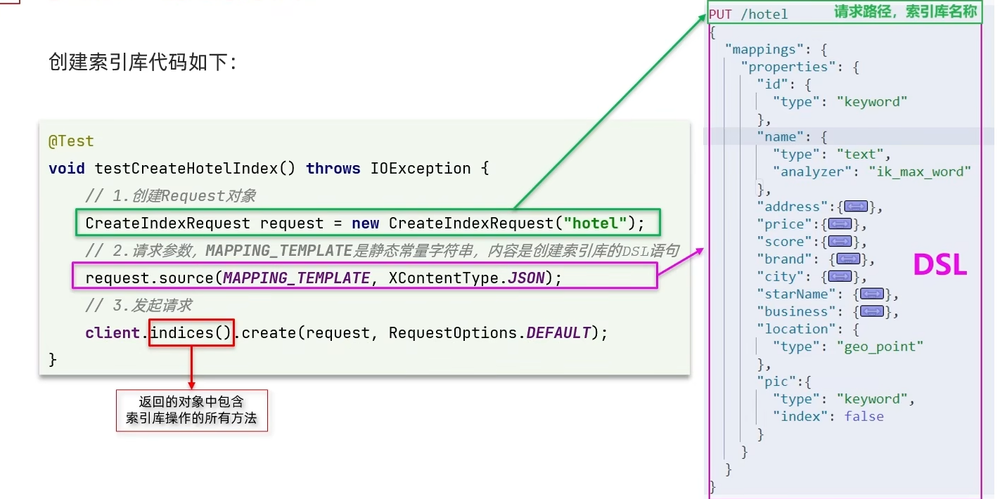

```java
@Test
void createHotelIndex() throws IOException {
    //指定索引库名
    CreateIndexRequest hotel = new CreateIndexRequest("hotel");
    //写入JSON数据，这里是Mapping映射
    hotel.source(HotelConstants.MAPPING_TEMPLATE, XContentType.JSON);
    //创建索引库
    restHighLevelClient.indices().create(hotel, RequestOptions.DEFAULT);
}


public class HotelConstants {
    public static String MAPPING_TEMPLATE = "{\n" +
            "  \"mappings\": {\n" +
            "    \"properties\": {\n" +
            "      \"id\": {\n" +
            "        \"type\": \"keyword\"\n" +
            "      },\n" +
            "      \"name\":{\n" +
            "        \"type\": \"text\",\n" +
            "        \"analyzer\": \"ik_max_word\",\n" +
            "        \"copy_to\": \"all\"\n" +
            "      },\n" +
            "      \"address\":{\n" +
            "        \"type\": \"keyword\",\n" +
            "        \"index\": false\n" +
            "      },\n" +
            "      \"price\":{\n" +
            "        \"type\": \"integer\"\n" +
            "      },\n" +
            "      \"score\":{\n" +
            "        \"type\": \"integer\"\n" +
            "      },\n" +
            "      \"brand\":{\n" +
            "        \"type\": \"keyword\",\n" +
            "        \"copy_to\": \"all\"\n" +
            "      },\n" +
            "      \"city\":{\n" +
            "        \"type\": \"keyword\",\n" +
            "        \"copy_to\": \"all\"\n" +
            "      },\n" +
            "      \"starName\":{\n" +
            "        \"type\": \"keyword\"\n" +
            "      },\n" +
            "      \"business\":{\n" +
            "        \"type\": \"keyword\"\n" +
            "      },\n" +
            "      \"location\":{\n" +
            "        \"type\": \"geo_point\"\n" +
            "      },\n" +
            "      \"pic\":{\n" +
            "        \"type\": \"keyword\",\n" +
            "        \"index\": false\n" +
            "      },\n" +
            "      \"all\":{\n" +
            "        \"type\": \"text\",\n" +
            "        \"analyzer\": \"ik_max_word\"\n" +
            "      }\n" +
            "    }\n" +
            "  }\n" +
            "}";
}
```

### 删除索引库

```java
@Test
void deleteHotelIndex() throws IOException {
    DeleteIndexRequest hotel = new DeleteIndexRequest("hotel");
    restHighLevelClient.indices().delete(hotel,RequestOptions.DEFAULT);
}
```

### 判断索引库

```java
@Test
void existHotelIndex() throws IOException {
    GetIndexRequest hotel = new GetIndexRequest("hotel");
    boolean exists = restHighLevelClient.indices().exists(hotel, RequestOptions.DEFAULT);
    System.out.println(exists);
}
```


### 新增文档

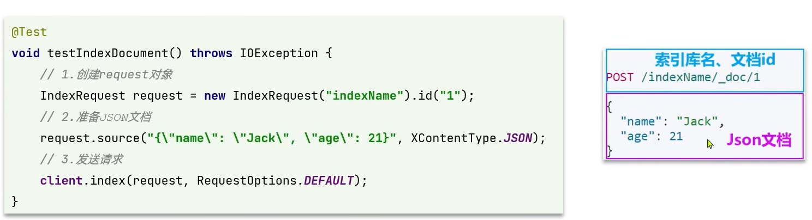

```java

@SpringBootTest
public class HotelDocumentTest {

    private RestHighLevelClient restHighLevelClient;

    @Autowired
    private IHotelService hotelService;


    @Test
    void createHotelIndex() throws IOException {
        //查询出来hotel对象
        Hotel hotel = hotelService.getById(61083L);
        HotelDoc hotelDoc = new HotelDoc(hotel);
        // 1.准备Request对象
        IndexRequest hotelIndex = new IndexRequest("hotel").id(hotelDoc.getId().toString());
        // 2.准备Json文档
        hotelIndex.source(JSON.toJSONString(hotelDoc), XContentType.JSON);
        // 3.发送请求
        restHighLevelClient.index(hotelIndex, RequestOptions.DEFAULT);
    }

    @BeforeEach
    void init(){
        this.restHighLevelClient = new RestHighLevelClient(RestClient.builder(
                HttpHost.create("http://192.168.211.128:9200")
        ));
    }

    @AfterEach
    void down() throws IOException {
        this.restHighLevelClient.close();
    }
}
```

### 查询文档

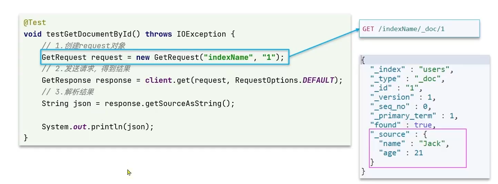

```java
@Test
void testGetDocumentById() throws IOException {
    // 1.准备Request
    GetRequest hotel = new GetRequest("hotel", "61083");
    // 2.发送请求，得到响应
    GetResponse hotelResponse = restHighLevelClient.get(hotel, RequestOptions.DEFAULT);
    // 3.解析响应结果,也就是得到_source里面的内容
    String hotelDocSourceAsString = hotelResponse.getSourceAsString();
    // 4.json转实体类
    HotelDoc hotelDoc = JSON.parseObject(hotelDocSourceAsString, HotelDoc.class);
    System.out.println(hotelDoc);
}
```

### 删除文档

```java
@Test
void testDeleteDocumentById() throws IOException {
    DeleteRequest hotel = new DeleteRequest("hotel", "61083");
    restHighLevelClient.delete(hotel,RequestOptions.DEFAULT);
}
```

### 修改文档

前面我们说过，修改文档有两种方式：

- 全量修改：直接覆盖原来的文档
- 增量修改：修改文档中的部分字段

在 RestClient 的 API 中，全量修改与新增的 API 完全一致，判断依据是 ID

- 如果新增时，ID已经存在，则修改
- 如果新增时，ID不存在，则新增

所以全量修改写法与新增文档一样，下面我们主要是介绍增量修改。

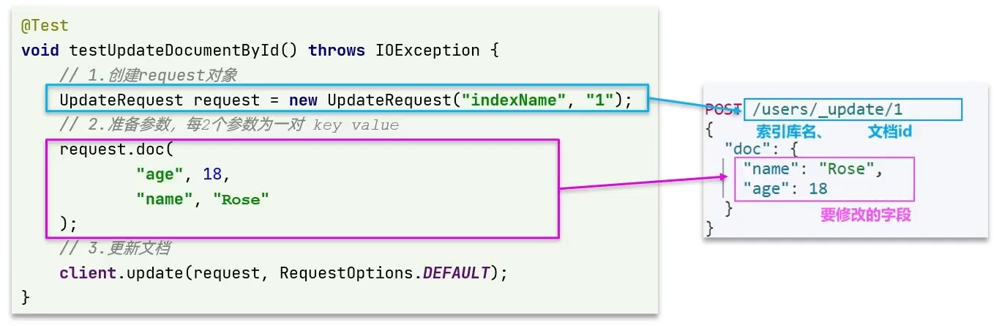

```java
@Test
void testUpdateDocument() throws IOException {
    // 1.准备Request
    UpdateRequest request = new UpdateRequest("hotel", "61083");
    // 2.准备请求参数
    request.doc(
        "price", "952",
        "starName", "四钻"
    );
    // 3.发送请求
    restHighLevelClient.update(request, RequestOptions.DEFAULT);
}
```

### 批量导入文档

前情回归：

插入单个文档


案例需求：利用 `BulkRequest` 批量将数据库数据导入到索引库中。

- 利用 mybatis-plus 查询酒店数据
- 将查询到的酒店数据（Hotel）转换为文档类型数据（HotelDoc）
- 利用 JavaRestClient 中的 BulkRequest 批处理，实现批量新增文档

批量处理 BulkRequest，其本质就是将多个普通的 CRUD 请求组合在一起发送。

因此Bulk中添加了多个IndexRequest，就是批量新增功能了。示例：

[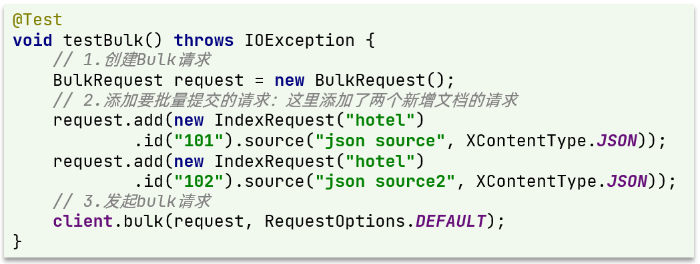](https://cdn.xn2001.com/img/2021/20210919234350.png)

实例代码

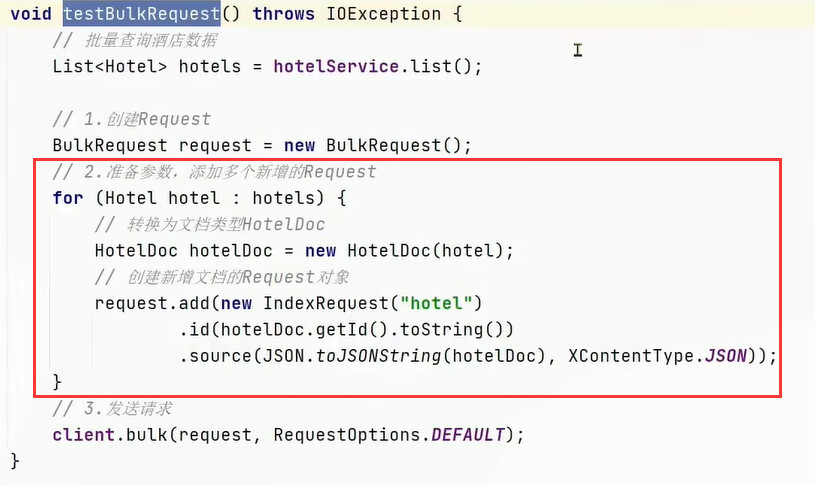


------

总之，在 Java 代码中，client 针对操作索引库还是文档，基本都是一样的代码

restHighLevelClient.indices().xxx，代表操作索引库

restHighLevelClient.xxx，代表操作文档

而其中所需要的参数，我们直接通过 **ctrl+p** 这样的快捷键去查看就可以，不需要单独记住。

## DSL文档查询

Elasticsearch 提供了基于 JSON 的 DSL([Domain Specific Language](https://www.elastic.co/guide/en/elasticsearch/reference/current/query-dsl.html))来定义查询。常见的查询类型包括：

**查询所有**：查询出所有数据，一般测试用。例如：match_all

**全文检索（full text）查询**：利用分词器对用户输入内容分词，然后去倒排索引库中匹配。例如：

- match_query
- multi_match_query

**精确查询**：根据精确词条值查找数据，一般是查找 keyword、数值、日期、boolean 等类型字段。例如：

- ids
- range
- term

**地理（geo）查询**：根据经纬度查询。例如：

- geo_distance
- geo_bounding_box

**复合（compound）查询**：复合查询可以将上述各种查询条件组合起来，合并查询条件。例如：

- bool
- function_score


------
### 查询所有

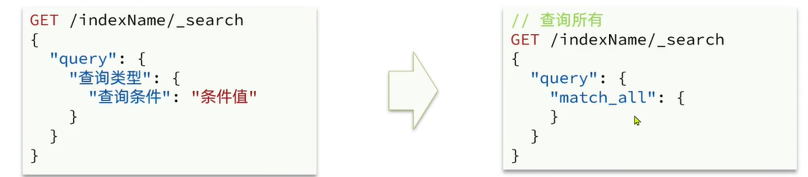

```json
// 查询所有
GET /indexName/_search
{
  "query": {
    "match_all": {
    }
  }
}
```

### 全文检索

使用场景：全文检索查询的基本流程如下：

- 对用户搜索的内容做分词，得到词条
- 根据词条去倒排索引库中匹配，得到文档id
- 根据文档id找到文档，返回给用户

比较常用的场景包括： 

-  商城的输入框搜索
- 百度输入框搜索


因为是拿着词条去匹配，因此参与搜索的字段也必须是可分词的text类型的字段。

常见的全文检索查询包括：

- match 查询：单字段查询
- multi_match 查询：多字段查询，任意一个字段符合条件就算符合查询条件

match 查询语法如下：

```json
GET /indexName/_search
{
  "query": {
    "match": {
      "FIELD": "TEXT"
    }
  }
}
```

mulit_match 查询语法如下：

```json
GET /indexName/_search
{
  "query": {
    "multi_match": {
      "query": "TEXT",
      "fields": ["FIELD1", " FIELD12"]
    }
  }
}
```

因为我们将 brand、name、business 值都利用 **copy_to** 复制到了 **all** 字段中，你根据三个字段搜索，和根据 all字段搜索效果是一样的。

```json
GET /hotel/_search
{
  "query": {
    "match": {
      "all": "7天酒店"
    }
  }
}
GET /hotel/_search
{
  "query": {
    "multi_match": {
      "query": "7天酒店",
      "fields": ["brand","name","business"]
    }
  }
}
```

**搜索字段越多，对查询性能影响越大，因此建议采用 copy_to 将多个字段合并为一个，然后使用单字段查询的方式。**

### 精准查询

精确查询一般是查找 keyword、数值、日期、boolean 等类型字段。所以**不会**对搜索条件分词。

- term：根据词条精确值查询
- range：根据值的范围查询

#### term查询

因为精确查询的字段搜是不分词的字段，因此查询的条件也必须是**不分词**的词条。查询时，用户输入的内容跟自动值完全匹配时才认为符合条件。如果用户输入的内容过多，反而搜索不到数据。

语法说明：

```json
// term查询
GET /indexName/_search
{
  "query": {
    "term": {
      "FIELD": {
        "value": "VALUE"
      }
    }
  }
}
```

示例：

下面搜索的是`brand`为`7天酒店`的文档数据

```json
GET /hotel/_search
{
  "query": {
    "term": {
      "brand": {
        "value": "7天酒店"
      }
    }
  }
}
```

#### range查询

范围查询，一般应用在对数值类型做范围过滤的时候。比如做价格范围过滤。

基本语法：

```json
// range查询
GET /indexName/_search
{
  "query": {
    "range": {
      "FIELD": {
        "gte": 10, // 这里的gte代表大于等于，gt则代表大于
        "lte": 20 // lte代表小于等于，lt则代表小于
      }
    }
  }
}
```

示例：

下面表示查询字段`price`在`1000和3000`之间的文档数据

gte是大于等于 

gt是大于

lte同理

[](https://cdn.xn2001.com/img/2021/20210921182858.png)


精确查询常见的有哪些？

- term 查询：根据词条精确匹配，一般搜索 keyword 类型、数值类型、布尔类型、日期类型字段
- range 查询：根据数值范围查询，可以是数值、日期的范围

### 地理坐标查询

地理坐标查询，其实就是根据经纬度查询，官方文档：https://www.elastic.co/guide/en/elasticsearch/reference/current/geo-queries.html

常见的使用场景包括：

- 携程：搜索我附近的酒店
- 滴滴：搜索我附近的出租车
- 微信：搜索我附近的人

附近的酒店：

[](https://cdn.xn2001.com/img/2021/20210921183030.png)


附近的车：

[](https://cdn.xn2001.com/img/2021/20210921183033.png)


> 矩形范围查询

矩形范围查询，也就是 `geo_bounding_box` 查询，查询坐标落在某个矩形范围的所有文档

[](https://cdn.xn2001.com/img/2021/20210921183124.gif)


查询时，需要指定矩形的**左上**、**右下**两个点的坐标，然后画出一个矩形，落在该矩形内的都是符合条件的点。

```json
// geo_bounding_box查询
GET /indexName/_search
{
  "query": {
    "geo_bounding_box": {
      "FIELD": {
        "top_left": { // 左上点
          "lat": 31.1,
          "lon": 121.5
        },
        "bottom_right": { // 右下点
          "lat": 30.9,
          "lon": 121.7
        }
      }
    }
  }
}
```

> 附近查询

附近查询，也叫做距离查询（geo_distance）：查询到指定中心点小于某个距离值的所有文档

在地图上找一个点作为圆心，以指定距离为半径，画一个圆，落在圆内的坐标都算符合条件：

[](https://cdn.xn2001.com/img/2021/20210921183215.gif)


```json
// geo_distance 查询
GET /indexName/_search
{
  "query": {
    "geo_distance": {
      "distance": "15km", // 半径
      "FIELD": "31.21,121.5" // 圆心
    }
  }
}
```


搜索陆家嘴附近15km的酒店（需要注意的是location字段是和文档中的字段是一致的）

[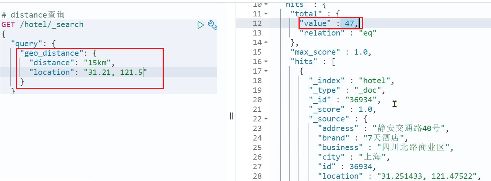](https://cdn.xn2001.com/img/2021/20210921183228.png)


```json
GET /hotel/_search
{
  "query": {
    "match_all": {}
  },
  "sort": [
    {
      "_geo_distance" : {
          "location": "31.034661,121.612282", //圆心
          "order" : "asc", //排序
          "unit" : "km" //单位
      }
    }
  ]
}
```

结果为：

```json
"hits" : [
    {
        "_index" : "hotel",
        "_type" : "_doc",
        "_id" : "2056298828",
        "_score" : null,
        "_source" : {
            ...
        },
        "sort" : [
            4.8541199685347785 //这里的结果为离圆心的距离
        ]
    },
```

注意：输出结果中的 **sort** 为距离，比较常用。

排序完成后，页面还要获取我附近每个酒店的具体**距离**值，这个值在响应结果中是独立的：

[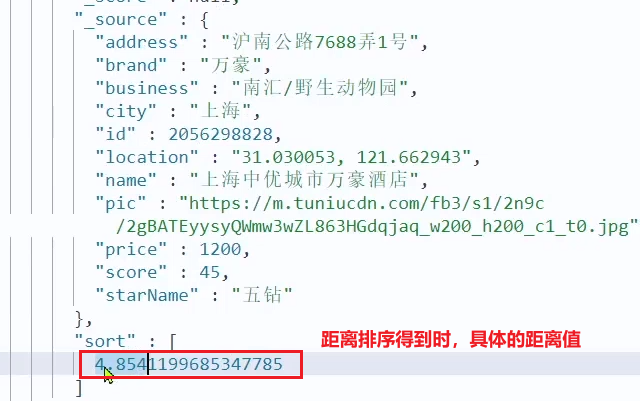](https://cdn.xn2001.com/img/2021/20211019011334.png)


### 复合查询

复合（compound）查询：复合查询可以将其它简单查询组合起来，实现更复杂的搜索逻辑。

- fuction score：算分函数查询，可以控制文档相关性算分，控制文档排名
- bool query：布尔查询，利用逻辑关系组合多个其它的查询，实现复杂搜索

### 相关性算分

> 这部分内容作为了解即可。

当我们利用 match 查询时，文档结果会根据与搜索词条的关联度打分（_score），返回结果时按照分值降序排列。例如，我们搜索 "虹桥如家"，结果如下：

```json
[
  {
    "_score" : 17.850193,
    "_source" : {
      "name" : "虹桥如家酒店真不错",
    }
  },
  {
    "_score" : 12.259849,
    "_source" : {
      "name" : "外滩如家酒店真不错",
    }
  },
  {
    "_score" : 11.91091,
    "_source" : {
      "name" : "迪士尼如家酒店真不错",
    }
  }
]
```

elasticsearch 早期使用的打分算法是 **TF-IDF 算法**，公式如下：

[](https://cdn.xn2001.com/img/2021/20210921205752.png)

在后来的5.1版本升级中，elasticsearch 将算法改进为 **BM25 算法**，公式如下：

[](https://cdn.xn2001.com/img/2021/20210921205757.png)

TF-IDF 算法有一各缺陷，就是词条频率越高，文档得分也会越高，单个词条对文档影响较大。而 BM25 则会让单个词条的算分有一个上限，曲线更加平滑：

[](https://cdn.xn2001.com/img/2021/20210921205831.png)


### 算分函数查询

根据相关度打分是比较合理的需求，但有时候也不能够满足我们的需求。

以百度为例，你搜索的结果中，并不是相关度越高排名越靠前，而是谁给的钱多排名就越靠前。

**要想认为控制相关性算分，就需要利用 elasticsearch 中的 function score 查询了。**

[](https://cdn.xn2001.com/img/2021/20210921210256.png)


function score 查询中包含四部分内容：

- **原始查询**条件：query 部分，基于这个条件搜索文档，并且基于BM25算法给文档打分，**原始算分**（query score)

- **过滤条件**：filter 部分，符合该条件的文档才会**重新算分**

- 算分函数：符合 filter 条件的文档要根据这个函数做运算，得到的

  函数算分（function score），有四种函数

  - weight：函数结果是常量
  - field_value_factor：以文档中的某个字段值作为函数结果
  - random_score：以随机数作为函数结果
  - script_score：自定义算分函数算法
  
- 运算模式 ：算分函数的结果、原始查询的相关性算分，两者之间的运算方式，包括：

  - multiply：相乘
  - replace：用 function score 替换 query score
  - sum、avg、max、min

function score 的运行流程如下：

1. 根据**原始条件**查询搜索文档，并且计算相关性算分，称为**原始算分**（query score）
2. 根据**过滤条件**，过滤文档
3. 符合**过滤条件**的文档，基于**算分函数**运算，得到**函数算分**（function score）
4. 将**原始算分**（query score）和**函数算分**（function score）基于**运算模式**做运算，得到最终结果，作为相关性算分。

因此，其中的关键点是

- 过滤条件：决定哪些文档的算分被修改
- 算分函数：决定函数算分的算法
- 运算模式：决定最终算分结果

例如：我们给“如家”这个品牌的酒店排名靠前一些

```json
GET /hotel/_search
{
  "query": {
    "function_score": {
      "query": {  .... }, // 原始查询，可以是任意条件
      "functions": [ // 算分函数
        {
          "filter": { // 满足的条件，品牌必须是如家
            "term": {
              "brand": "如家"
            }
          },
          "weight": 10 // 算分权重为10
        }
      ],
      "boost_mode": "sum" // 加权模式，求和
    }
  }
}
```

测试，在未添加算分函数时，如家得分如下

[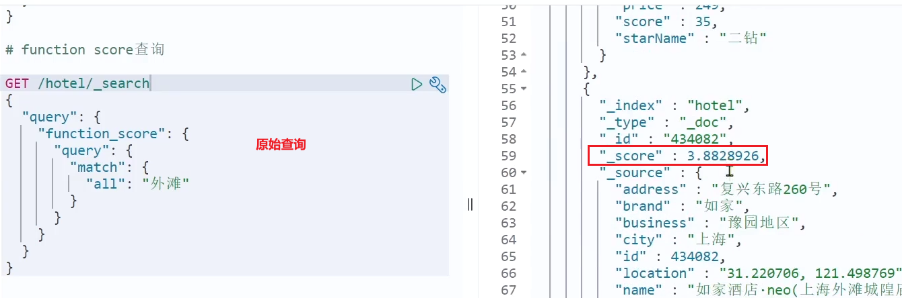](https://cdn.xn2001.com/img/2021/20210921231508.png)


添加了算分函数后，如家得分就提升了

[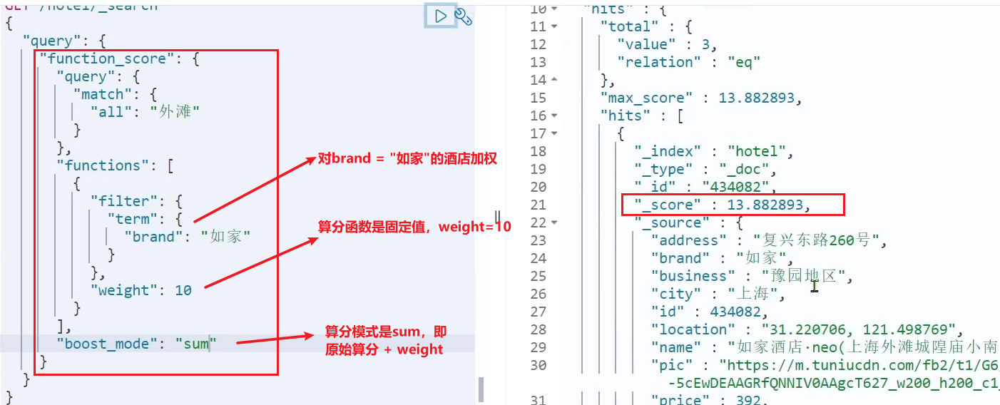](https://cdn.xn2001.com/img/2021/20210921231513.png)


### 布尔查询

布尔查询是一个或多个查询子句的组合，每一个子句就是一个**子查询**。子查询的组合方式有

- must：必须匹配每个子查询，类似“与”
- should：选择性匹配子查询，类似“或”
- must_not：必须不匹配，**不参与算分**，类似“非”
- filter：必须匹配，**不参与算分**

比如在搜索酒店时，除了关键字搜索外，我们还可能根据品牌、价格、城市等字段做过滤

**每一个不同的字段，其查询的条件、方式都不一样，必须是多个不同的查询，而要组合这些查询，就必须用 bool查询了。**

需要注意的是，搜索时，参与**打分的字段越多，查询的性能也越差**。因此这种多条件查询时，建议这样做：

- 搜索框的关键字搜索，是全文检索查询，使用 must 查询，参与算分
- 其它过滤条件，采用 filter 查询，不参与算分


下面这个查询语句的意思是：city必须为上海，brand可以是皇冠假日也可以是华美达，lte是小于等于，price要大于500，score要大于45

```json
GET /hotel/_search
{
  "query": {
    "bool": {
      "must": [
        {"term": {"city": "上海" }}
      ],
      "should": [
        {"term": {"brand": "皇冠假日" }},
        {"term": {"brand": "华美达" }}
      ],
      "must_not": [
        { "range": { "price": { "lte": 500 } }}
      ],
      "filter": [
        { "range": {"score": { "gte": 45 } }}
      ]
    }
  }
}
```


需求：搜索名字包含“如家”，价格不高于 400，在坐标 31.21,121.5 周围 10km 范围内的酒店。

- 名称搜索，属于全文检索查询，应该参与算分，放到 must 中
- 价格不高于 400，用 range 查询，属于过滤条件，不参与算分，放到 must_not 中
- 周围 10km 范围内，用 geo_distance 查询，属于过滤条件，不参与算分，放到 filter 中

[](https://cdn.xn2001.com/img/2021/20210921233252.png)


bool 查询的几种逻辑关系

- must：必须匹配的条件，可以理解为“与”
- should：选择性匹配的条件，可以理解为“或”
- must_not：必须不匹配的条件，不参与打分
- filter：必须匹配的条件，不参与打分

## 搜索结果处理

### 排序

elasticsearch 默认是根据相关度算分（_score）来排序，但是也支持自定义方式对搜索[结果排序](https://www.elastic.co/guide/en/elasticsearch/reference/current/sort-search-results.html)。可以排序字段类型有：keyword 类型、数值类型、地理坐标类型、日期类型等

keyword、数值、日期类型排序的语法基本一致。

```json
GET /indexName/_search
{
  "query": {
    "match_all": {}
  },
  "sort": [
    {
      "FIELD": "desc"  // 排序字段、排序方式ASC、DESC
    }
  ]
}
```

排序条件是一个数组，也就是可以写多个排序条件。按照声明的顺序，当第一个条件相等时，再按照第二个条件排序。

需求描述：酒店数据按照用户评价（score)降序排序，评价相同的按照价格(price)升序排序

[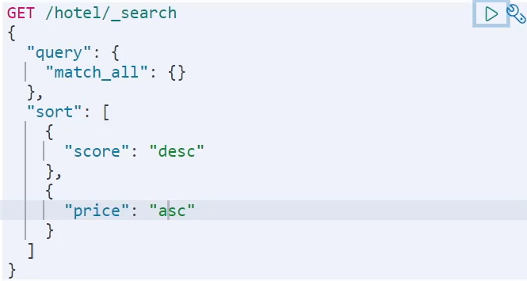](https://cdn.xn2001.com/img/2021/20210921233829.png)


地理坐标排序略有不同

```json
GET /indexName/_search
{
  "query": {
    "match_all": {}
  },
  "sort": [
    {
      "_geo_distance" : {
          "FIELD" : "纬度，经度", // 文档中geo_point类型的字段名、目标坐标点
          "order" : "asc", // 排序方式
          "unit" : "km" // 排序的距离单位
      }
    }
  ]
}
GET /hotel/_search
{
  "query": {
    "match_all": {}
  },
  "sort": [
    {
      "_geo_distance" : {
          "location": "31.034661,121.612282", 
          "order" : "asc", 
          "unit" : "km" 
      }
    }
  ]
}
```

> 获取你的位置的经纬度的方式：https://lbs.amap.com/demo/jsapi-v2/example/map/click-to-get-lnglat

假设我的位置是：31.034661，121.612282，寻找我周围距离最近的酒店。

[](https://cdn.xn2001.com/img/2021/20210921233931.png)


### 分页

elasticsearch 默认情况下只返回 top10 的数据。而如果要查询更多数据就需要修改分页参数了。

elasticsearch 通过修改 from、size 参数来控制要返回的分页结果：

- from：从第几个文档开始
- size：总共查询几个文档

类似于mysql中的`limit ?, ?`

```json
GET /hotel/_search
{
  "query": {
    "match_all": {}
  },
  "from": 0, // 分页开始的位置，默认为0
  "size": 10, // 期望获取的文档总数
  "sort": [
    {"price": "asc"}
  ]
}
```

> 深度分页问题

现在，我要查询990~1000的数据，查询逻辑要这么写

```json
GET /hotel/_search
{
  "query": {
    "match_all": {}
  },
  "from": 990, // 分页开始的位置，默认为0
  "size": 10, // 期望获取的文档总数
  "sort": [
    {"price": "asc"}
  ]
}
```

这里是查询990开始的数据，也就是 第990~第1000条 数据。

注意：elasticsearch 内部分页时，必须先查询 0~1000条，然后截取其中的 990 ~ 1000 的这10条

[](https://cdn.xn2001.com/img/2021/20210921234503.png)


查询TOP1000，如果 es 是单点模式，这并无太大影响。

但是 elasticsearch 将来一定是集群，例如我集群有5个节点，我要查询 TOP1000 的数据，并不是每个节点查询200条就可以了。节点A的 TOP200，在另一个节点可能排到10000名以外了。

**因此要想获取整个集群的 TOP1000，必须先查询出每个节点的 TOP1000，汇总结果后，重新排名，重新截取 TOP1000。**

[](https://cdn.xn2001.com/img/2021/20210921234555.png)


**当查询分页深度较大时，汇总数据过多，对内存和CPU会产生非常大的压力，因此 elasticsearch 会禁止from+ size 超过10000的请求。**

针对深度分页，ES提供了两种解决方案，[官方文档](https://www.elastic.co/guide/en/elasticsearch/reference/current/paginate-search-results.html)：

- search after：分页时需要排序，原理是从上一次的排序值开始，查询下一页数据。官方推荐使用的方式。
- scroll：原理将排序后的文档id形成快照，保存在内存。官方已经不推荐使用。

------

分页查询的常见实现方案以及优缺点

- `from + size`
  - 优点：支持随机翻页
  - 缺点：深度分页问题，默认查询上限（from + size）是10000
  - 场景：百度、京东、谷歌、淘宝这样的随机翻页搜索
- `after search`
  - 优点：没有查询上限（单次查询的size不超过10000）
  - 缺点：只能向后逐页查询，不支持随机翻页
  - 场景：没有随机翻页需求的搜索，例如手机向下滚动翻页
- `scroll`
  - 优点：没有查询上限（单次查询的size不超过10000）
  - 缺点：会有额外内存消耗，并且搜索结果是非实时的
  - 场景：海量数据的获取和迁移。从ES7.1开始不推荐，建议用 after search方案。

### 高亮

我们在百度，京东搜索时，关键字会变成红色，比较醒目，这叫高亮显示：

[](https://cdn.xn2001.com/img/2021/20210921234711.png)


高亮显示的实现分为两步：

- 1）给文档中的所有关键字都添加一个标签，例如`<em>`标签
- 2）页面给`<em>`标签编写CSS样式

```json
GET /hotel/_search
{
  "query": {
    "match": {
      "FIELD": "TEXT" // 查询条件，高亮一定要使用全文检索查询
    }
  },
  "highlight": {
    "fields": { // 指定要高亮的字段
      "FIELD": {
        "pre_tags": "<em>",  // 用来标记高亮字段的前置标签
        "post_tags": "</em>" // 用来标记高亮字段的后置标签
      }
    }
  }
}
```

**注意**：

- 高亮是对关键字高亮，因此**搜索条件必须带有关键字**，而不能是范围这样的查询。
- 默认情况下，**高亮的字段，必须与搜索指定的字段一致**，否则无法高亮
- 如果要对非搜索字段高亮，则需要添加一个属性：`required_field_match=false`

[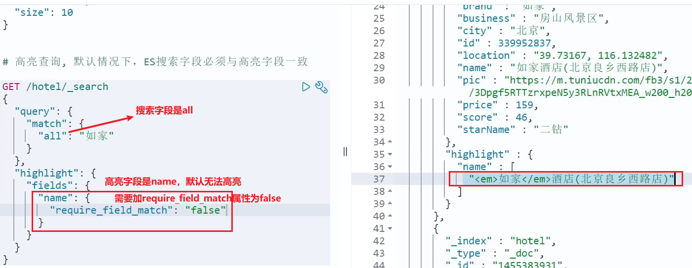](https://cdn.xn2001.com/img/2021/20210921234739.png)


> DSL 总体结构如下：

[](https://cdn.xn2001.com/img/2021/20210921235330.png)


## RestClient文档查询

### 发起查询请求

[](https://cdn.xn2001.com/img/2021/20211016170057.png)


```java
 
@SpringBootTest
public class HotelSearchTest {

    private RestHighLevelClient restHighLevelClient;

    @Autowired
    private IHotelService hotelService;

    @Test
    public void match_All() throws IOException {
        SearchRequest request = new SearchRequest("hotel");
        request.source()
                .query(QueryBuilders.matchAllQuery());
        SearchResponse response = restHighLevelClient.search(request, RequestOptions.DEFAULT);
    }

    @BeforeEach
    void init() {
        this.restHighLevelClient = new RestHighLevelClient(RestClient.builder(
                HttpHost.create("http://192.168.211.128:9200")
        ));
    }

    @AfterEach
    void down() throws IOException {
        this.restHighLevelClient.close();
    }
}
```

- 第一步，创建`SearchRequest`对象，指定索引库名

- 第二步，利用

  ```
  request.source()
  ```

  构建 DSL，DSL 中可以包含查询、分页、排序、高亮等

  - `query()`：代表查询条件，利用 `QueryBuilders.matchAllQuery()` 构建一个 match_all 查询的 DSL

- 第三步，利用 `client.search()` 发送请求，得到响应

关键的 API 有两个，一个是 `request.source()`，其中包含了查询、排序、分页、高亮等所有功能

[](https://cdn.xn2001.com/img/2021/20211016170203.png)


另一个是 `QueryBuilders`，其中包含 match、term、function_score、bool 等各种查询

[](https://cdn.xn2001.com/img/2021/20211016170234.png)


### 解析查询响应

[](https://cdn.xn2001.com/img/2021/20211016174631.png)


Elasticsearch 返回的结果是一个 JSON 字符串，结构包含

- ```
  hits
  ```

  ：命中的结果

  - `total`：总条数，其中的value是具体的总条数值

  - `max_score`：所有结果中得分最高的文档的相关性算分

  - ```
    hits
    ```

    ：搜索结果的文档数组，其中的每个文档都是一个 json 对象

    - `_source`：文档中的原始数据，也是 json 对象

因此，我们解析响应结果，就是逐层解析 JSON 字符串，流程如下

- ```
  SearchHits
  ```

  ：通过

   

  ```
  response.getHits()
  ```

   

  获取，就是 json 中的最外层的 hits，代表命中的结果

  - `SearchHits.getTotalHits().value`：获取总条数信息

  - ```
    SearchHits.getHits()
    ```

    ：获取 SearchHit 数组，也就是文档数组

    - `SearchHit.getSourceAsString()`：获取文档结果中的 `_source`，也就是原始的 json 文档数据

```java
@SpringBootTest
public class HotelSearchTest {

    private RestHighLevelClient restHighLevelClient;

    @Autowired
    private IHotelService hotelService;

    @Test
    public void match_All() throws IOException {
        SearchRequest request = new SearchRequest("hotel");
        request.source()
                .query(QueryBuilders.matchAllQuery());
        SearchResponse response = restHighLevelClient.search(request, RequestOptions.DEFAULT);
        SearchHits searchHits = response.getHits();
        System.out.println("hits.getTotalHits().条数 = " + searchHits.getTotalHits().value);
        SearchHit[] hits = searchHits.getHits();
        for (SearchHit hit : hits) {
            String sourceAsString = hit.getSourceAsString();
            HotelDoc hotelDoc = JSON.parseObject(sourceAsString, HotelDoc.class);
            System.out.println(hotelDoc);
        }
    }

    @BeforeEach
    void init() {
        this.restHighLevelClient = new RestHighLevelClient(RestClient.builder(
                HttpHost.create("http://192.168.211.128:9200")
        ));
    }

    @AfterEach
    void down() throws IOException {
        this.restHighLevelClient.close();
    }
}
```

### match查询

[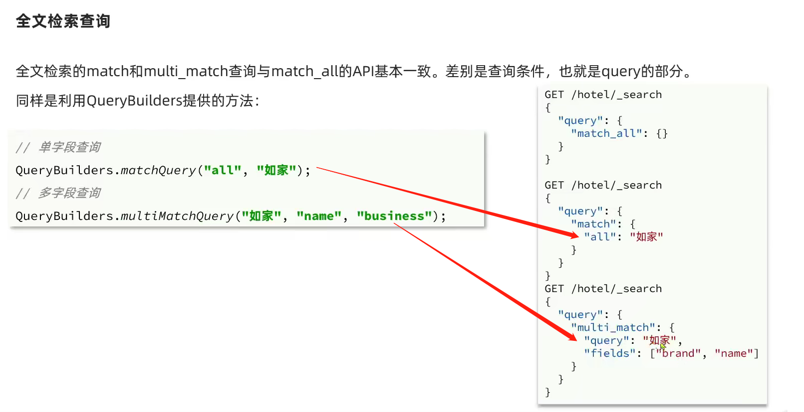](https://cdn.xn2001.com/img/2021/20211016182859.png)


```java
@Test
public void matchQuery() throws IOException {
    SearchRequest request = new SearchRequest("hotel");
    request.source()
            .query(QueryBuilders.matchQuery("all","如家"));
    SearchResponse response = restHighLevelClient.search(request, RequestOptions.DEFAULT);
    SearchHits searchHits = response.getHits();
    System.out.println("hits.getTotalHits().条数 = " + searchHits.getTotalHits().value);
    SearchHit[] hits = searchHits.getHits();
    for (SearchHit hit : hits) {
        String sourceAsString = hit.getSourceAsString();
        HotelDoc hotelDoc = JSON.parseObject(sourceAsString, HotelDoc.class);
        System.out.println(hotelDoc);
    }
}

@Test
public void multiMatchQuery() throws IOException {
    SearchRequest request = new SearchRequest("hotel");
    request.source()
            .query(QueryBuilders.multiMatchQuery("如家","name","brand"));
    SearchResponse response = restHighLevelClient.search(request, RequestOptions.DEFAULT);
    SearchHits searchHits = response.getHits();
    System.out.println("hits.getTotalHits().条数 = " + searchHits.getTotalHits().value);
    SearchHit[] hits = searchHits.getHits();
    for (SearchHit hit : hits) {
        String sourceAsString = hit.getSourceAsString();
        HotelDoc hotelDoc = JSON.parseObject(sourceAsString, HotelDoc.class);
        System.out.println(hotelDoc);
    }
}
```

### 精确查询

精确查询主要是两者

- term：词条精确匹配
- range：范围查询

[](https://cdn.xn2001.com/img/2021/20211016192658.png)


### 布尔查询

布尔查询是用 must、must_not、filter等方式组合其它查询，代码示例如下

[](https://cdn.xn2001.com/img/2021/20211016192745.png)


```java
@Test
void testBool() throws IOException {
    // 1.准备Request
    SearchRequest request = new SearchRequest("hotel");
    // 2.准备DSL
    request.source()
            .query(
                    QueryBuilders.boolQuery()
                            .must(QueryBuilders.termQuery("city", "上海"))
                            .filter(QueryBuilders.rangeQuery("price").lte(300))
            );
    // 3.发送请求
    SearchResponse response = restHighLevelClient.search(request, RequestOptions.DEFAULT);
    // 4.解析响应
    SearchHits searchHits = response.getHits();
    System.out.println("hits.getTotalHits().条数 = " + searchHits.getTotalHits().value);
    SearchHit[] hits = searchHits.getHits();
    for (SearchHit hit : hits) {
        String sourceAsString = hit.getSourceAsString();
        HotelDoc hotelDoc = JSON.parseObject(sourceAsString, HotelDoc.class);
        System.out.println(hotelDoc);
    }
}
```

### 排序、分页

搜索结果的排序和分页是与 query 同级的参数，因此同样是使用 `request.source()` 来设置。

对应的API如下

[](https://cdn.xn2001.com/img/2021/20211016202447.png)


```java
@Test
void testPageAndSort() throws IOException {
    // 页码，每页大小
    int page = 1, size = 5;

    // 1.准备Request
    SearchRequest request = new SearchRequest("hotel");
    // 2.准备DSL
    // 2.1.query
    request.source().query(QueryBuilders.matchAllQuery());
    // 2.2.排序 sort
    request.source().sort("price", SortOrder.ASC);
    // 2.3.分页 from、size
    request.source().from((page - 1) * size).size(5);
    // 3.发送请求
    SearchResponse response = restHighLevelClient.search(request, RequestOptions.DEFAULT);
    // 4.解析响应
    SearchHits searchHits = response.getHits();
    System.out.println("hits.getTotalHits().条数 = " + searchHits.getTotalHits().value);
    SearchHit[] hits = searchHits.getHits();
    for (SearchHit hit : hits) {
        String sourceAsString = hit.getSourceAsString();
        HotelDoc hotelDoc = JSON.parseObject(sourceAsString, HotelDoc.class);
        System.out.println(hotelDoc);
    }
}
```

### 高亮

- 查询的 DSL：其中除了查询条件，还需要添加高亮条件，同样是与 query 同级。
- 结果解析：结果除了要解析 `_source` 文档数据，还要解析高亮结果

**高亮请求的构建 API**

[](https://cdn.xn2001.com/img/2021/20211016202707.png)


上述代码省略了查询条件部分，但是高亮查询必须使用全文检索查询，并且要有搜索关键字，将来才可以对关键字高亮.

```java
@Test
void testHighlight() throws IOException {
    // 1.准备Request
    SearchRequest request = new SearchRequest("hotel");
    // 2.准备DSL
    // 2.1.query
    request.source().query(QueryBuilders.matchQuery("all", "如家"));
    // 2.2.高亮
    request.source().highlighter(new HighlightBuilder().field("name").requireFieldMatch(false));
    // 3.发送请求
    SearchResponse response = client.search(request, RequestOptions.DEFAULT);
    // 4.解析响应
    handleResponse(response); //代码在下文
}
```

**高亮结果解析**

高亮的结果与查询的文档结果默认是分离的，并不在一起。

因此解析高亮的代码需要额外处理：

[ 


- 第一步：从结果中获取 source。`hit.getSourceAsString()`，这部分是非高亮结果，json 字符串，需要反序列为 HotelDoc 对象
- 第二步：获取高亮结果。`hit.getHighlightFields()`，返回值是一个 Map，key 是高亮字段名称，值是HighlightField 对象，代表高亮值
- 第三步：从 map 中根据高亮字段名称，获取高亮字段值对象 HighlightField
- 第四步：从 HighlightField 中获取 Fragments，并且转为字符串。**这部分是真正的高亮字符串**
- 第五步：用高亮的结果替换 HotelDoc 中的非高亮结果

完整代码如下：

```java
private void handleResponse(SearchResponse response) {
    // 4.解析响应
    SearchHits searchHits = response.getHits();
    // 4.1.获取总条数
    long total = searchHits.getTotalHits().value;
    System.out.println("共搜索到" + total + "条数据");
    // 4.2.文档数组
    SearchHit[] hits = searchHits.getHits();
    // 4.3.遍历
    for (SearchHit hit : hits) {
        // 获取文档source
        String json = hit.getSourceAsString();
        // 反序列化
        HotelDoc hotelDoc = JSON.parseObject(json, HotelDoc.class);
        // 获取高亮结果
        Map<String, HighlightField> highlightFields = hit.getHighlightFields();
        if (!CollectionUtils.isEmpty(highlightFields)) {
            // 根据字段名获取高亮结果
            HighlightField highlightField = highlightFields.get("name");
            if (highlightField != null) {
                // 获取高亮值
                String name = highlightField.getFragments()[0].string();
                // 覆盖非高亮结果
                hotelDoc.setName(name);
            }
        }
        System.out.println("hotelDoc = " + hotelDoc);
    }
}
```

### 地理坐标查询

[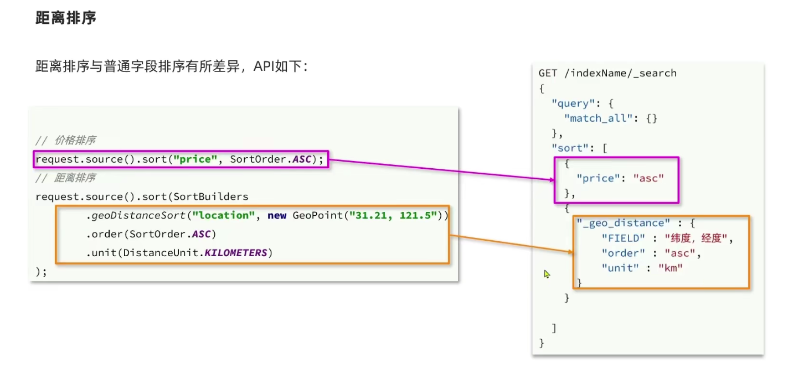](https://cdn.xn2001.com/img/2021/20211019000540.png)


### 相关性得分

function_score 查询结构如下

[](https://cdn.xn2001.com/img/2021/20211019011433.png)


对应的 JavaAPI 如下

[](https://cdn.xn2001.com/img/2021/20211019011439.png)


## DSL数据聚合

**[聚合（](https://www.elastic.co/guide/en/elasticsearch/reference/current/search-aggregations.html)[aggregations](https://www.elastic.co/guide/en/elasticsearch/reference/current/search-aggregations.html)[）](https://www.elastic.co/guide/en/elasticsearch/reference/current/search-aggregations.html)**可以让我们极其方便的实现对数据的统计、分析、运算。

- 什么品牌的手机最受欢迎？
- 这些手机的平均价格、最高价格、最低价格？
- 这些手机每月的销售情况如何？

在 Elasticsearch 实现这些统计功能比数据库的 sql 要方便的多，而且查询速度非常快，可以实现近实时搜索效果。

聚合常见的有三类

- **桶（Bucket）**聚合：用来对文档做分组
  - TermAggregation：按照文档字段值分组，例如按照品牌值分组、按照国家分组
  - Date Histogram：按照日期阶梯分组，例如一周为一组，或者一月为一组
- **度量（Metric）**聚合：用以计算一些值，比如：最大值、最小值、平均值等
  - Avg：求平均值
  - Max：求最大值
  - Min：求最小值
  - Stats：同时求 max、min、avg、sum 等
- **管道（pipeline）**聚合：其它聚合的结果为基础做聚合

> **注意**：参加聚合的字段必须是keyword、日期、数值、布尔类型

### Bucket聚合语法

例如：我们要统计所有数据中的酒店品牌有几种，其实就是按照品牌对数据分组。此时可以根据酒店品牌的名称做聚合，也就是 Bucket 聚合。

```json
GET /hotel/_search
{
  "size": 0,  // 设置size为0，结果中不包含文档，只包含聚合结果
  "aggs": { // 定义聚合
    "brandAgg": { //给聚合起个名字
      "terms": { // 聚合的类型，按照品牌值聚合，所以选择term
        "field": "brand", // 参与聚合的字段
        "size": 20 // 希望获取的聚合结果数量
      }
    }
  }
}
```

[](https://cdn.xn2001.com/img/2021/20211022184007.png)


默认情况下，Bucket 聚合会统计 Bucket 内的文档数量，记为 `_count`，并且按照 `_count` 降序排序。

我们可以指定 order 属性，自定义聚合的排序方式

```json
GET /hotel/_search
{
  "size": 0, 
  "aggs": {
    "brandAgg": {
      "terms": {
        "field": "brand",
        "order": {
          "_count": "asc" // 按照_count升序排列
        },
        "size": 20
      }
    }
  }
}
```

默认情况下，Bucket 聚合是对索引库的所有文档做聚合，但真实场景下，用户会输入搜索条件，因此聚合必须是对搜索结果聚合。那么聚合必须添加限定条件。

我们可以限定要聚合的文档范围，只要添加 query 条件即可；

```json
GET /hotel/_search
{
  "query": {
    "range": {
      "price": {
        "lte": 200 // 只对200元以下的文档聚合
      }
    }
  }, 
  "size": 0, 
  "aggs": {
    "brandAgg": {
      "terms": {
        "field": "brand",
        "size": 20
      }
    }
  }
}
```

这次，聚合得到的品牌明显变少了

[](https://cdn.xn2001.com/img/2021/20211022184549.png)


### Metric聚合语法

上面，我们对酒店按照品牌分组，形成了一个个桶。现在我们需要对桶内的酒店做运算，获取每个品牌的用户评分的 min、max、avg 等值。

这就要用到 Metric 聚合了，例如 stats 聚合：就可以获取 min、max、avg 等结果

```json
GET /hotel/_search
{
  "size": 0, 
  "aggs": {
    "brandAgg": { 
      "terms": { 
        "field": "brand", 
        "size": 20
      },
      "aggs": { // 是brands聚合的子聚合，也就是分组后对每组分别计算
        "score_stats": { // 聚合名称
          "stats": { // 聚合类型，这里stats可以计算min、max、avg等
            "field": "score" // 聚合字段，这里是score
          }
        }
      }
    }
  }
}
```

这次的 score_stats 聚合是在 brandAgg 的聚合内部嵌套的子聚合。因为我们需要在每个桶分别计算。

另外，我们还可以给聚合结果做个排序，例如按照每个桶的酒店平均分做排序

[](https://cdn.xn2001.com/img/2021/20211022184847.png)


## RestAPI数据聚合

聚合条件与 query 条件同级别，因此需要使用 `request.source()` 来指定聚合条件

[](https://cdn.xn2001.com/img/2021/20211022190429.png)


聚合的结果也与查询结果不同，API 也比较特殊。不过同样是 JSON 逐层解析

[](https://cdn.xn2001.com/img/2021/20211022190457.png)


```java
@Test
public void testAggregation() throws IOException {
    SearchRequest request = new SearchRequest("hotel");
    request.source().aggregation(AggregationBuilders.terms("brandAgg").field("brand").size(20));
    SearchResponse response = client.search(request, RequestOptions.DEFAULT);
    Terms brandAgg = response.getAggregations().get("brandAgg");
    List<? extends Terms.Bucket> buckets = brandAgg.getBuckets();
    for (Terms.Bucket bucket : buckets) {
        String key = bucket.getKeyAsString();
        System.out.println("key = " + key);
    }
}
```

## 自动补全

当用户在搜索框输入字符时，我们应该提示出与该字符有关的搜索项，提示完整词条的功能，就是自动补全了。

### 拼音分词器

如果我们需要根据拼音字母来推断，因此要用到拼音分词功能。

要实现根据字母做补全，就必须对文档按照拼音分词。插件地址：https://github.com/medcl/elasticsearch-analysis-pinyin

[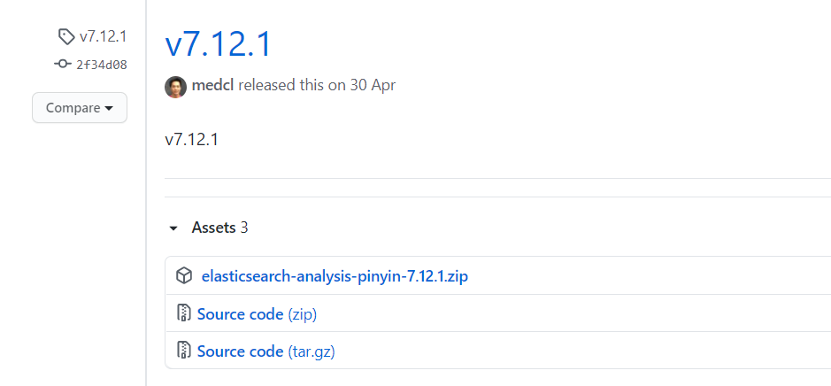](https://cdn.xn2001.com/img/2021/20211023015636.png)


使用 `docker volume inspect es-plugins` 查看插件目录，将下载的文件解压上传，重启 Elasticsearch

测试用法如下：

```json
POST /_analyze
{
  "text": "如家酒店还不错",
  "analyzer": "pinyin"
}
```

结果：

[](https://cdn.xn2001.com/img/2021/20211023021713.png)


### 自定义分词器

默认的拼音分词器会将每个汉字单独分为拼音，而我们希望的是每个词条形成一组拼音，需要对拼音分词器做个性化定制，形成自定义分词器。

elasticsearch 中分词器（analyzer）的组成包含三部分：

- character filters：在 tokenizer 之前对文本进行处理。例如删除字符、替换字符
- tokenizer：将文本按照一定的规则切割成词条（term）。例如 keyword，就是不分词；还有 ik_smart
- tokenizer filter：将 tokenizer 输出的词条做进一步处理。例如大小写转换、同义词处理、拼音处理等

文档分词时会依次由这三部分来处理文档：

[](https://cdn.xn2001.com/img/2021/20211023021451.png)


声明自定义分词器的语法如下：(这个自定义分词器可以不用自己写，直接copy会用就行)

```json
PUT /test
{
  "settings": {
    "analysis": {
      "analyzer": { // 自定义分词器
        "my_analyzer": {  // 分词器名称
          "tokenizer": "ik_max_word",
          "filter": "py"
        }
      },
      "filter": { // 自定义tokenizer filter
        "py": { // 过滤器名称
          "type": "pinyin", // 过滤器类型，这里是pinyin
		  "keep_full_pinyin": false,
          "keep_joined_full_pinyin": true,
          "keep_original": true,
          "limit_first_letter_length": 16,
          "remove_duplicated_term": true,
          "none_chinese_pinyin_tokenize": false
        }
      }
    }
  },
  "mappings": {
    "properties": {
      "name": {
        "type": "text",
        "analyzer": "my_analyzer",
        "search_analyzer": "ik_smart"
      }
    }
  }
}
```

测试

[](https://cdn.xn2001.com/img/2021/20211023021532.png)


注意**：为了避免搜索到同音字，搜索时不要使用拼音分词器**

[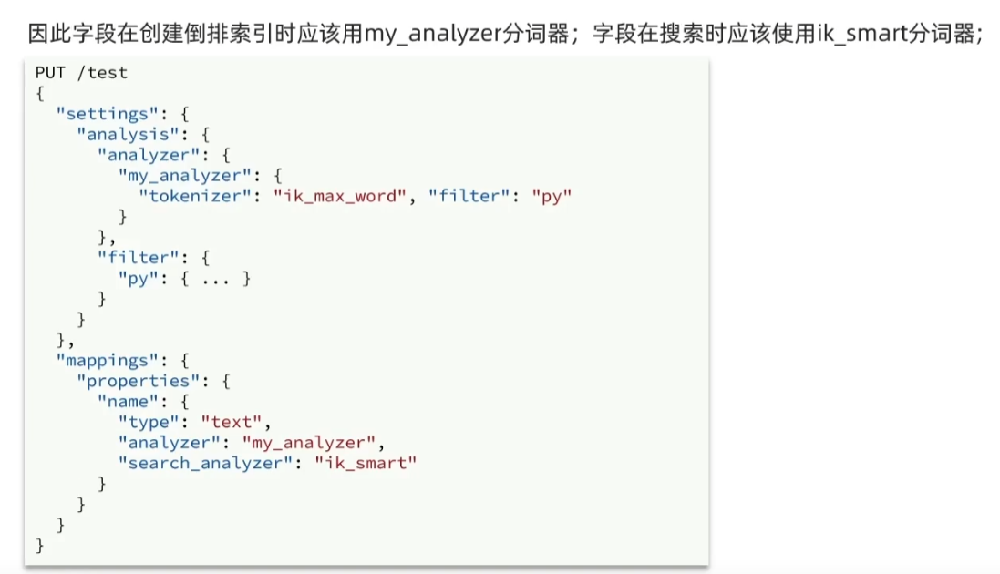](https://cdn.xn2001.com/img/2021/20211023022355.png)


### 自动补全查询

elasticsearch 提供了 [Completion Suggester](https://www.elastic.co/guide/en/elasticsearch/reference/7.6/search-suggesters.html) 查询来实现自动补全功能。这个查询会匹配以用户输入内容开头的词条并返回；为了提高补全查询的效率，对于文档中字段的类型有一些约束

- 参与补全查询的字段必须是 completion 类型。
- 字段的内容一般是用来补全的多个词条形成的数组。

```json
// 创建索引库
PUT test
{
  "mappings": {
    "properties": {
      "title":{
        "type": "completion"
      }
    }
  }
}
```

然后插入下面的数据

```json
// 示例数据
POST test/_doc
{
  "title": ["Sony", "WH-1000XM3"]
}
POST test/_doc
{
  "title": ["SK-II", "PITERA"]
}
POST test/_doc
{
  "title": ["Nintendo", "switch"]
}
```

查询的 DSL 语句如下

```json
// 自动补全查询
GET /test/_search
{
  "suggest": {
    "title_suggest": {
      "text": "s", // 关键字
      "completion": {
        "field": "title", // 补全查询的字段
        "skip_duplicates": true, // 跳过重复的
        "size": 10 // 获取前10条结果
      }
    }
  }
}
```

例如一个酒店的索引库完整案例

```json
// 酒店数据索引库
PUT /hotel
{
  "settings": {
    "analysis": {
      "analyzer": {
        "text_anlyzer": {
          "tokenizer": "ik_max_word",
          "filter": "py"
        },
        "completion_analyzer": {
          "tokenizer": "keyword",
          "filter": "py"
        }
      },
      "filter": {
        "py": {
          "type": "pinyin",
          "keep_full_pinyin": false,
          "keep_joined_full_pinyin": true,
          "keep_original": true,
          "limit_first_letter_length": 16,
          "remove_duplicated_term": true,
          "none_chinese_pinyin_tokenize": false
        }
      }
    }
  },
  "mappings": {
    "properties": {
      "id":{
        "type": "keyword"
      },
      "name":{
        "type": "text",
        "analyzer": "text_anlyzer",
        "search_analyzer": "ik_smart",
        "copy_to": "all"
      },
      "address":{
        "type": "keyword",
        "index": false
      },
      "price":{
        "type": "integer"
      },
      "score":{
        "type": "integer"
      },
      "brand":{
        "type": "keyword",
        "copy_to": "all"
      },
      "city":{
        "type": "keyword"
      },
      "starName":{
        "type": "keyword"
      },
      "business":{
        "type": "keyword",
        "copy_to": "all"
      },
      "location":{
        "type": "geo_point"
      },
      "pic":{
        "type": "keyword",
        "index": false
      },
      "all":{
        "type": "text",
        "analyzer": "text_anlyzer",
        "search_analyzer": "ik_smart"
      },
      "suggestion":{
          "type": "completion",
          "analyzer": "completion_analyzer"
      }
    }
  }
}
```

### JavaAPI

[](https://cdn.xn2001.com/img/2021/20211025113007.png)


解析响应的代码如下

[](https://cdn.xn2001.com/img/2021/20211025113011.png)


## 数据同步

elasticsearch 中的数据来自于 mysql数据库，因此 mysql 数据发生改变时，elasticsearch 也必须跟着改变，这个就是 elasticsearch 与 mysql 之间的**数据同步**

[](https://cdn.xn2001.com/img/2021/20211025163219.png)


常见的数据同步方案有三种

- 同步调用
- 异步通知
- 监听 binlog

### 同步调用

方案一：同步调用

[](https://cdn.xn2001.com/img/2021/20211025163313.png)


- hotel-demo对外提供接口，用来修改 elasticsearch 中的数据
- 酒店管理服务在完成数据库操作后，直接调用 hotel-demo 提供的接口

### 异步通知

方案二：异步通知

[](https://cdn.xn2001.com/img/2021/20211025163346.png)


- hotel-admin 对 mysql 数据库数据完成增、删、改后，发送 MQ 消息
- hotel-demo监听 MQ，接收到消息后完成 elasticsearch 数据修改

### 监听binlog

方案三：监听binlog

[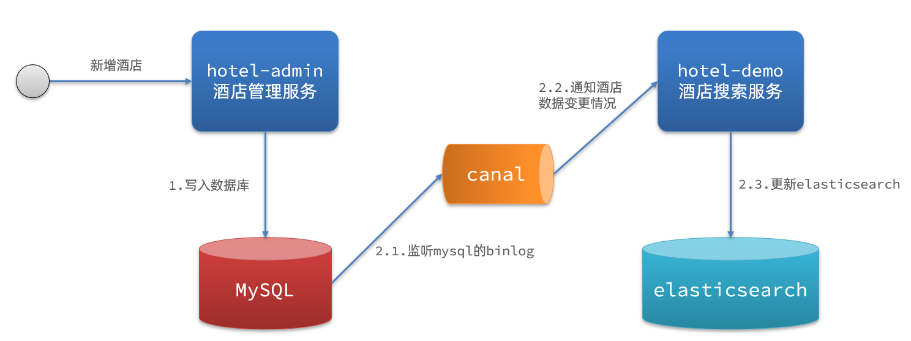](https://cdn.xn2001.com/img/2021/20211025163428.png)


- mysql 开启 binlog 功能
- mysql 完成增、删、改操作都会记录在 binlog 中
- hotel-demo 基于canal 监听 binlog 变化，实时更新 elasticsearch 中的内容

### 优缺点

方式一：同步调用

- 优点：实现简单，粗暴
- 缺点：业务耦合度高

方式二：异步通知

- 优点：低耦合，实现难度一般
- 缺点：依赖 mq 的可靠性

方式三：监听binlog

- 优点：完全解除服务间耦合
- 缺点：开启 binlog 增加数据库负担、实现复杂度高

### 实现方式

我们以**异步通知**为例，使用 MQ 消息中间件

MQ结构如图：

[](https://cdn.xn2001.com/img/2021/20211025163734.png)


**引入依赖**，在 hotel-admin、hotel-demo 中引入 rabbitmq 的依赖：

```xml
<!--amqp-->
<dependency>
    <groupId>org.springframework.boot</groupId>
    <artifactId>spring-boot-starter-amqp</artifactId>
</dependency>
```

**声明队列交换机**

```java
public class MQConstants {
    /**
     * 交换机
     */
    public final static String HOTEL_EXCHANGE = "hotel.topic";
    /**
     * 监听新增和修改的队列
     */
    public final static String HOTEL_INSERT_QUEUE = "hotel.insert.queue";
    /**
     * 监听删除的队列
     */
    public final static String HOTEL_DELETE_QUEUE = "hotel.delete.queue";
    /**
     * 新增或修改的RoutingKey
     */
    public final static String HOTEL_INSERT_KEY = "hotel.insert";
    /**
     * 删除的RoutingKey
     */
    public final static String HOTEL_DELETE_KEY = "hotel.delete";
}
```

消息接收方

```java
@Configuration
public class MqConfig {//绑定交换机与队列的关系（也可以用注解实现）
    @Bean
    public TopicExchange topicExchange() {
        return new TopicExchange(MqConstants.HOTEL_EXCHANGE, true, false);
    }

    @Bean
    public Queue insertQueue() {
        return new Queue(MqConstants.HOTEL_INSERT_QUEUE, true);
    }

    @Bean
    public Queue deleteQueue() {
        return new Queue(MqConstants.HOTEL_DELETE_QUEUE, true);
    }

    @Bean
    public Binding insertQueueBinding() {
        return BindingBuilder.bind(insertQueue()).to(topicExchange()).with(MqConstants.HOTEL_INSERT_KEY);
    }

    @Bean
    public Binding deleteQueueBinding() {
        return BindingBuilder.bind(deleteQueue()).to(topicExchange()).with(MqConstants.HOTEL_DELETE_KEY);
    }
}
```

消息发送方

```java
rabbitTemplate.convertAndSend(MQConstants.HOTEL_EXCHANGE, MQConstants.HOTEL_INSERT_KEY, hotel.getId());

rabbitTemplate.convertAndSend(MQConstants.HOTEL_EXCHANGE, MQConstants.HOTEL_DELETE_KEY, id);
```

消息接收方

```java
class HotelService{
    @Override
    public void insertById(Long id) {
        try {
            // 根据id查询酒店数据
            Hotel hotel = getById(id);
            // 转换为文档类型
            HotelDoc hotelDoc = new HotelDoc(hotel);

            IndexRequest request = new IndexRequest("hotel").id(hotel.getId().toString());
            request.source(JSON.toJSONString(hotelDoc), XContentType.JSON);
            client.index(request, RequestOptions.DEFAULT);
        } catch (IOException e) {
            throw new RuntimeException(e);
        }
    }

    @Override
    public void deleteById(Long id) {
        try {
            DeleteRequest request = new DeleteRequest("hotel", id.toString());
            client.delete(request, RequestOptions.DEFAULT);
        } catch (IOException e) {
            throw new RuntimeException(e);
        }
    }
}
```


```java

@Component
public class HotelListener {

    @Autowired
    private HotelService hotelService;

    /**
     * 监听酒店新增或修改的业务
     *
     * @param id 酒店id
     */
    @RabbitListener(queues = MqConstants.HOTEL_INSERT_QUEUE)
    public void listenHotelInsertOrUpdate(Long id) {
        hotelService.insertById(id);
    }

    /**
     * 监听酒店删除的业务
     *
     * @param id 酒店id
     */
    @RabbitListener(queues = MqConstants.HOTEL_DELETE_QUEUE)
    public void listenHotelDelete(Long id) {
        hotelService.deleteById(id);
    }
}
```

# Elasticsearch集群

单机的 Elasticsearch 做数据存储，必然面临两个问题：海量数据存储问题、单点故障问题。

解决方案：

- 海量数据存储问题：将索引库从逻辑上拆分为N个分片（shard），存储到多个节点
- 单点故障问题：将分片数据在不同节点备份（replica ）

**ES集群相关概念**：

- 集群（cluster）：一组拥有共同的 cluster name 的 节点。
- 节点（node) ：集群中的一个 Elasticearch 实例
- 分片（shard）：索引可以被拆分为不同的部分进行存储，称为分片。**在集群环境下，一个索引的不同分片可以拆分到不同的节点中，解决数据量太大，单点存储量有限的问题。**

[](https://cdn.xn2001.com/img/2022/202205071006783.png)


> 此处，我们把数据分成3片：shard0、shard1、shard2
>
> 主分片（Primary shard）：相对于副本分片的定义。
>
> 副本分片（Replica shard）每个主分片可以有一个或者多个副本，数据和主分片一样。

数据备份可以保证高可用，但是每个分片备份一份在节点上，所需要的节点数量就会翻倍，成本太高。为了在高可用和成本间寻求平衡

- 首先对数据分片，存储到不同节点
- 然后对每个分片进行备份，放到对方节点，**完成互相备份**

这样可以大大减少所需要的服务节点数量，如图，我们以3分片，每个分片备份一份为例：

[](https://cdn.xn2001.com/img/2022/202205071006790.png)


现在，每个分片都有1个备份，存储在3个节点：

- node0：保存了分片0和1
- node1：保存了分片0和2
- node2：保存了分片1和2

## 部署集群

### 搭建Elasticsearch

我们会在单机上利用 Docker 容器运行多个 Elasticsearch 实例来模拟集群。

可以直接使用 docker-compose 来完成，这要求你的Linux虚拟机至少有**4G**以上的内存空间。

docker-compose.yml

```yml
version: '2.2'
services:
  es01:
    image: elasticsearch:7.12.1
    container_name: es01
    environment:
      - node.name=es01
      - cluster.name=es-docker-cluster
      - discovery.seed_hosts=es02,es03
      - cluster.initial_master_nodes=es01,es02,es03
      - "ES_JAVA_OPTS=-Xms512m -Xmx512m"
    volumes:
      - data01:/usr/share/elasticsearch/data
    ports:
      - 9200:9200
    networks:
      - elastic
  es02:
    image: elasticsearch:7.12.1
    container_name: es02
    environment:
      - node.name=es02
      - cluster.name=es-docker-cluster
      - discovery.seed_hosts=es01,es03
      - cluster.initial_master_nodes=es01,es02,es03
      - "ES_JAVA_OPTS=-Xms512m -Xmx512m"
    volumes:
      - data02:/usr/share/elasticsearch/data
    ports:
      - 9201:9200
    networks:
      - elastic
  es03:
    image: elasticsearch:7.12.1
    container_name: es03
    environment:
      - node.name=es03
      - cluster.name=es-docker-cluster
      - discovery.seed_hosts=es01,es02
      - cluster.initial_master_nodes=es01,es02,es03
      - "ES_JAVA_OPTS=-Xms512m -Xmx512m"
    volumes:
      - data03:/usr/share/elasticsearch/data
    networks:
      - elastic
    ports:
      - 9202:9200
volumes:
  data01:
    driver: local
  data02:
    driver: local
  data03:
    driver: local
networks:
  elastic:
    driver: bridge
```

修改 Linux 系统权限，修改 `/etc/sysctl.conf` 文件

```sh
vi /etc/sysctl.conf
```

添加下面的内容

```sh
vm.max_map_count=262144
```

让配置生效：

```sh
sysctl -p
```

通过docker-compose启动集群

```sh
docker-compose up -d
```

### 集群状态监控

kibana 可以监控 Elasticsearch 集群，但是更推荐使用 [cerebro](https://github.com/lmenezes/cerebro)

下载解压打开 /bin/cerebro.bat

访问 http://localhost:9000 即可进入管理界面

[](https://cdn.xn2001.com/img/2022/202205071018030.png)


输入任意节点的地址和端口，点击 connect

[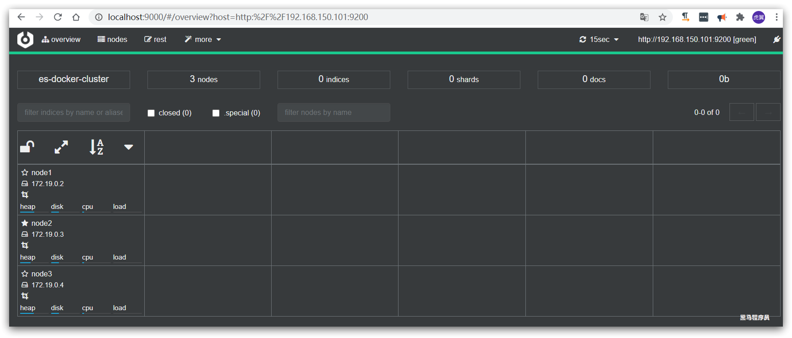](https://cdn.xn2001.com/img/2022/202205071018761.png)


绿色的线条代表集群处于绿色（健康状态）

### 创建索引库

我们还可以通过 cerebro 创建索引库，当然你需要使用 kibana 也可以。

[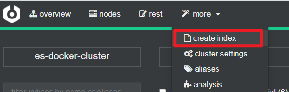](https://cdn.xn2001.com/img/2022/202205071020771.png)


填写索引库信息

[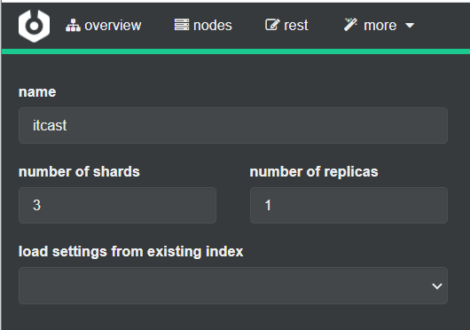](https://cdn.xn2001.com/img/2022/202205071023380.png)


回到首页，即可查看索引库分片效果

[](https://cdn.xn2001.com/img/2022/202205071024397.png)


## 集群职责划分

Elasticsearch 中集群节点有不同的职责划分

[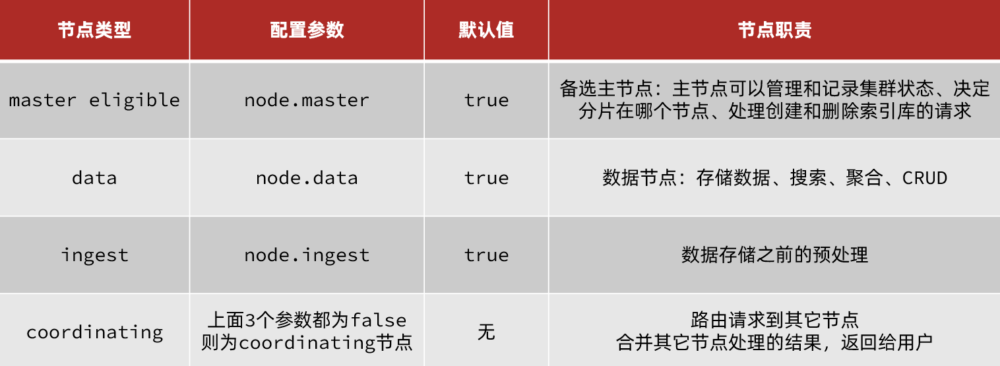](https://cdn.xn2001.com/img/2022/202205071029258.png)


（上图中的ingest节点用的比较少，所以不做介绍）

**默认情况下，集群中的任何一个节点都同时兼职上述四种角色。**

真实的集群一定要将集群职责分离

- master 节点：对 CPU 要求高，但是内存要求低
- data 节点：对 CPU 和内存要求都高
- coordinating 节点：对网络带宽、CPU 要求高

职责分离可以让我们根据不同节点的需求分配不同的硬件去部署。而且避免业务之间的互相干扰。

[](https://cdn.xn2001.com/img/2022/202205071029263.png)


## 集群脑裂问题

脑裂是因为集群中的节点失联导致的。

例如一个集群中，主节点 node1 与其它节点失联。

[](https://cdn.xn2001.com/img/2022/202205071029267.png)


此时，node2 和 node3 认为 node1 宕机，就会重新选主。

[](https://cdn.xn2001.com/img/2022/202205071344676.png)


当 node3 当选后，集群继续对外提供服务，node2 和 node3 自成集群，node1 自成集群，两个集群数据不同步，出现数据差异。

当网络恢复后，因为集群中有两个 master 节点，集群状态的不一致，出现脑裂的情况。

[](https://cdn.xn2001.com/img/2022/202205071344829.png)


解决脑裂的方案是，要求选票超过 **(eligible节点数量+1)/2** 才能当选为 master，因此 eligible 节点数量最好是奇数。对应配置项是`discovery.zen.minimum_master_nodes`，在版本 7.0 以后，已经成为默认配置，因此一般不会发生脑裂问题。

例如：3个节点形成的集群，选票必须超过 (3+1)/2 ，也就是 2 票。node3 得到 node2 和 node3 的选票，当选为 master。node1 只有自己 1 票，没有当选。集群中依然只有1个主节点，没有出现脑裂。

## 集群分布式存储

当新增文档时，应该保存到不同分片，保证数据均衡，那么 coordinating node 如何确定数据该存储到哪个分片呢？

Elasticsearch 会通过 hash 算法来计算文档应该存储到哪个分片

[](https://cdn.xn2001.com/img/2022/202205071412275.png)


- _routing 默认是文档的 id
- 算法与分片数量有关，因此索引库一旦创建，分片数量不能修改！

新增文档的流程如下图，

1. 新增一个 id=1 的文档
2. 对 id 做 hash 运算，假如得到的是 2，则应该存储到 shard-2
3. shard-2 的主分片在 node3 节点，将数据路由到 node3，node3 保存文档
4. 同步给 shard-2 的副本分片2(R-2)，在 node2 节点
5. 返回结果给 coordinating-node 节点(node1)

[](https://cdn.xn2001.com/img/2022/202205071412283.png)


## 集群分布式查询

Elasticsearch 查询分成两个阶段

- scatter phase：分散阶段，coordinating node 会把请求分发到每一个分片。
- gather phase：聚集阶段，coordinating node 汇总 data node 的搜索结果，并处理为最终结果集返回给用户。

[](https://cdn.xn2001.com/img/2022/202205071422105.png)


## 集群故障转移

集群的 master 节点会监控集群中的节点状态，如果发现有节点宕机，会立即将宕机节点的分片数据迁移到其它节点，确保数据安全，这个叫做故障转移。

例如一个集群结构如图，三个都是健康的。

[](https://cdn.xn2001.com/img/2022/202205071516134.png)


现在，node1 是主节点，其它两个节点是从节点。突然，node1 发生了故障

[](https://cdn.xn2001.com/img/2022/202205071516139.png)


宕机后的第一件事，需要重新选主，例如选中了 node2

[](https://cdn.xn2001.com/img/2022/202205071516685.png)


node2 成为主节点后，会检测集群监控状态，将 node1 上的数据迁移到 node2、node3，确保数据依旧正常访问。

[](https://cdn.xn2001.com/img/2022/202205071516805.png)

如果重新启动node1节点，会恢复为原来的状态

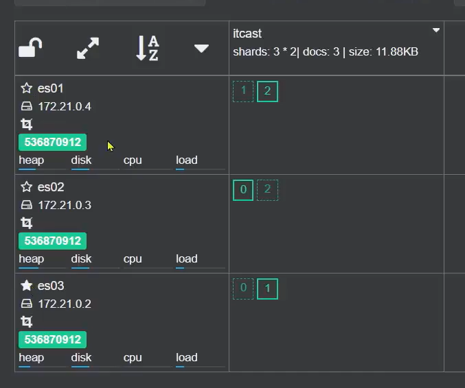

# JMeter压力测试

## 安装启动

JMeter 依赖于JDK，所以必须确保当前计算机上已经安装了 JDK，并且配置了环境变量。

Apache Jmeter官网下载，地址：http://jmeter.apache.org/download_jmeter.cgi

[](https://cdn.xn2001.com/img/2022/202205081544073.png)


解压缩即可使用，目录结构如下

[](https://cdn.xn2001.com/img/2022/202205081545678.png)


其中的 bin 目录就是执行的脚本，其中包含启动脚本

[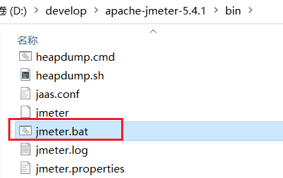](https://cdn.xn2001.com/img/2022/202205081545976.png)


双击即可运行，但是有两点注意

- 启动时速度比较慢，要耐心等待。
- 启动后终端（黑窗口）不能关闭，否则 JMeter 也跟着关闭。

[](https://cdn.xn2001.com/img/2022/202205081545691.png)


## 修改中文

默认 JMeter 的语言是英文，需要设置

[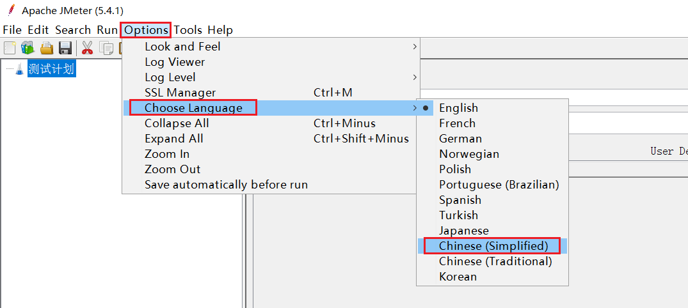](https://cdn.xn2001.com/img/2022/202205081547848.png)


[](https://cdn.xn2001.com/img/2022/202205081547110.png)


上面的配置只能保证本次运行是中文，如果要永久中文，需要修改 JMeter 的配置文件。

打开 JMeter 文件夹，在 bin 目录中找到 **jmeter.properties**，添加下面配置：

```properties
language=zh_CN
```

[](https://cdn.xn2001.com/img/2022/202205081546219.png)


## 基本使用

在测试计划上点鼠标右键，选择「添加 > 线程（用户） > 线程组」

[](https://cdn.xn2001.com/img/2022/202205081548692.png)


在新增的线程组中，填写线程信息

[](https://cdn.xn2001.com/img/2022/202205081549330.png)


在线程组这里点鼠标右键，添加 http 请求

[](https://cdn.xn2001.com/img/2022/202205081551101.png)


编写取样器内容

[](https://cdn.xn2001.com/img/2022/202205081551053.png)


添加监听报告

[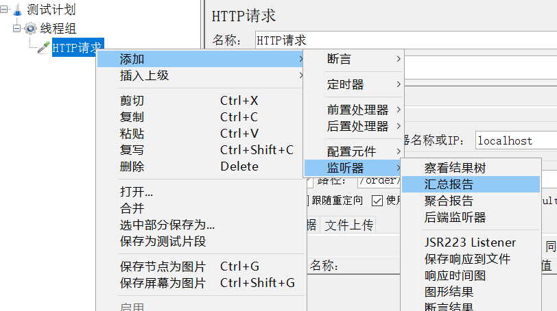](https://cdn.xn2001.com/img/2022/202205081551627.png)


汇总报告结果

[](https://cdn.xn2001.com/img/2022/202205081548975.png)


添加监听结果树

[](https://cdn.xn2001.com/img/2022/202205231440680.png)


察看结果树

[](https://cdn.xn2001.com/img/2022/202205081548982.png)


# Sentine流量组件

## 雪崩问题

> 微服务之间相互调用，因为调用链中的一个服务故障，引起整个链路都无法访问的情况。

微服务中，服务间调用关系错综复杂，一个微服务往往依赖于多个其它微服务。

[](https://cdn.xn2001.com/img/2022/202205071911137.png)


如图，如果服务提供者I 发生了故障，当前的应用的部分业务因为依赖于服务I，因此也会被阻塞。此时，其它不依赖于服务I 的业务似乎不受影响。

[](https://cdn.xn2001.com/img/2022/202205071911461.png)


但是，依赖服务I 的业务请求被阻塞，则 tomcat 的这个线程不会释放，于是越来越多的用户请求到来，越来越多的线程会阻塞。

[](https://cdn.xn2001.com/img/2022/202205071911464.png)


服务器支持的线程和并发数有限，请求一直阻塞，会导致服务器资源耗尽，**从而导致所有其它服务都不可用**。

综上，依赖于当前服务的其它服务随着时间的推移，最终也都会变的不可用，形成级联失败，这就是雪崩问题。

[](https://cdn.xn2001.com/img/2022/202205071911480.png)


解决雪崩问题的常见方式有四种

1. 超时处理
2. 线程隔离
3. 降级熔断
4. 限流

> **限流**是对服务的保护，避免因瞬间高并发流量而导致服务故障，进而避免雪崩。是一种**预防**措施。
>
> **超时处理、线程隔离、降级熔断**是在部分服务故障时，将故障控制在一定范围，避免雪崩。是一种**补救**措施。

1.超时处理：设定超时时间，**请求超过一定时间没有响应就返回错误信息，不会无休止等待。**

可能只会缓解雪崩问题，不能彻底解决雪崩问题，如果发请求的速度特别快的话就还会发生雪崩

[](https://cdn.xn2001.com/img/2022/202205071936072.png)


2.线程隔离

[](https://cdn.xn2001.com/img/2022/202205071953573.png)


是一种舱壁模式，如上图，船舱都会被隔板分离为多个独立空间，当船体破损时，只会导致部分空间进入，将故障控制在一定范围内，避免整个船体都被淹没。于此类似，我们可以**限定每个业务能使用的线程数**，避免耗尽整个 tomcat 的资源，因此也叫线程隔离。

[](https://cdn.xn2001.com/img/2022/202205071935351.png)


3.降级熔断

是一种断路器模式：由**断路器**统计业务执行的异常比例，如果超出阈值则会**熔断**该业务，拦截访问该业务的一切请求。

断路器会统计访问某个服务的请求数量，异常比例。

[](https://cdn.xn2001.com/img/2022/202205071956512.png)


当发现访问服务 D 的**请求异常比例**过高时，认为服务 D 有导致雪崩的风险，会拦截访问服务 D 的一切请求，形成熔断。

[](https://cdn.xn2001.com/img/2022/202205071956665.png)


4.限流

**流量控制**：限制业务访问的 QPS，避免服务因流量的突增而故障。

[](https://cdn.xn2001.com/img/2022/202205071935370.png)


在 SpringCloud 当中支持多种服务保护技术

- [Netfix Hystrix](https://github.com/Netflix/Hystrix)
- [Sentinel](https://github.com/alibaba/Sentinel)
- [Resilience4J](https://github.com/resilience4j/resilience4j)

早期比较流行的是 Hystrix 框架，但**目前国内实用最广泛的还是阿里巴巴的 Sentinel 框架**，这里我们做下对比：

|                | **Sentinel**                                   | **Hystrix**                   |
| :------------- | :--------------------------------------------- | :---------------------------- |
| 隔离策略       | 信号量隔离                                     | 线程池隔离/信号量隔离         |
| 熔断降级策略   | 基于慢调用比例或异常比例                       | 基于失败比率                  |
| 实时指标实现   | 滑动窗口                                       | 滑动窗口（基于 RxJava）       |
| 规则配置       | 支持多种数据源                                 | 支持多种数据源                |
| 扩展性         | 多个扩展点                                     | 插件的形式                    |
| 基于注解的支持 | 支持                                           | 支持                          |
| 限流           | 基于 QPS，支持基于调用关系的限流               | 有限的支持                    |
| 流量整形       | 支持慢启动、匀速排队模式                       | 不支持                        |
| 系统自适应保护 | 支持                                           | 不支持                        |
| 控制台         | 开箱即用，可配置规则、查看秒级监控、机器发现等 | 不完善                        |
| 常见框架的适配 | Servlet、Spring Cloud、Dubbo、gRPC 等          | Servlet、Spring Cloud Netflix |

## 初识Sentinel

Sentinel是阿里巴巴开源的一款微服务流量控制组件。官网地址：https://sentinelguard.io/zh-cn/index.html

Sentinel 具有以下特征

- **丰富的应用场景**：Sentinel 承接了阿里巴巴近 10 年的双十一大促流量的核心场景，例如秒杀（即突发流量控制在系统容量可以承受的范围）、消息削峰填谷、集群流量控制、实时熔断下游不可用应用等。
- **完备的实时监控**：Sentinel 同时提供实时的监控功能。您可以在控制台中看到接入应用的单台机器秒级数据，甚至 500 台以下规模的集群的汇总运行情况。
- **广泛的开源生态**：Sentinel 提供开箱即用的与其它开源框架/库的整合模块，例如与 Spring Cloud、Dubbo、gRPC 的整合。您只需要引入相应的依赖并进行简单的配置即可快速地接入 Sentinel。
- **完善的** **SPI** **扩展点**：Sentinel 提供简单易用、完善的 SPI 扩展接口。您可以通过实现扩展接口来快速地定制逻辑。例如定制规则管理、适配动态数据源等。

## 整合Sentinel

下载后 jar 包后，运行代码：`java -jar sentinel-dashboard-1.8.1.jar`

如果要修改 Sentinel 的默认端口、账户、密码，可以通过下列配置：

| **配置项**                       | **默认值** | **说明**   |
| :------------------------------- | :--------- | :--------- |
| server.port                      | 8080       | 服务端口   |
| sentinel.dashboard.auth.username | sentinel   | 默认用户名 |
| sentinel.dashboard.auth.password | sentinel   | 默认密码   |

例如，修改端口：

```sh
java -Dserver.port=8080 -jar sentinel-dashboard-1.8.1.jar
```

访问 http://localhost:8080 页面，就可以看到 Sentinel 的控制台了。

[](https://cdn.xn2001.com/img/2022/202205072010468.png)


账号和密码默认都是：sentinel


此时空白一片，还需要我们来整合进 SpringCloud

准备好我们的项目，在资料中，结构如下：

> 这里老师讲的疏忽了，没有走 gateway 网关，但不影响。
>
> 提供的资料中的 gateway 网关带了权限配置导致这里我们访问不了网关（之前上课留下的），需要删除掉其中的 AuthorizeFilter.jar

[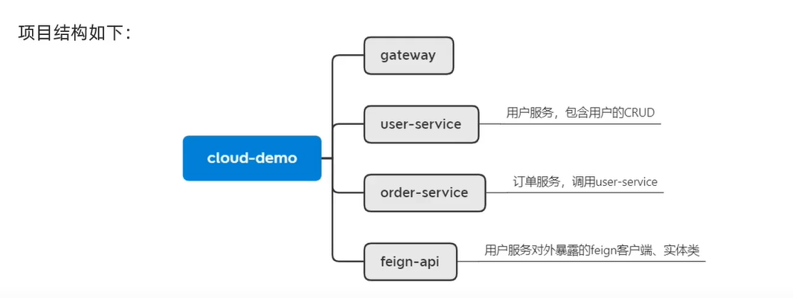](https://cdn.xn2001.com/img/2022/202205072033318.png)


我们**在 order-service 中整合 Sentinel**，并连接 Sentinel 的控制台，步骤如下

1）引入 Sentinel 依赖

```xml
<!--sentinel-->
<dependency>
    <groupId>com.alibaba.cloud</groupId> 
    <artifactId>spring-cloud-starter-alibaba-sentinel</artifactId>
</dependency>
```

2）配置控制台

修改 application.yml 文件，添加下面内容：

```yaml
server:
  port: 8088
spring:
  cloud: 
    sentinel:
      transport:
        dashboard: localhost:8080
```

3）访问 order-service 的任意端点

打开浏览器，访问 http://localhost:10010/order/101，多访问几次，多点几次刷新，这样才能触发 Sentinel 的监控。

然后再访问 Sentinel 的控制台，查看效果。

[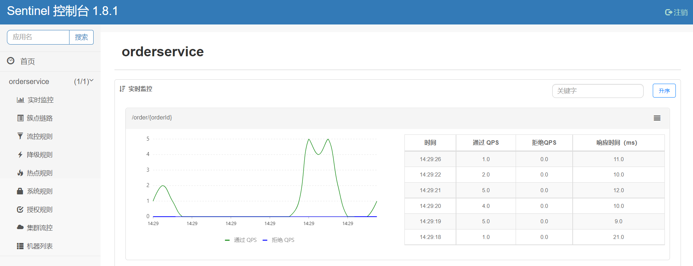](https://cdn.xn2001.com/img/2022/202205081430741.png)


## 流量控制

雪崩问题虽有四种方案，但是**限流是避免服务因突发的流量而发生故障，是对微服务雪崩问题的预防。**《预判风险所在是防范风险的前提》，我们先学习流量控制。

### 簇点链路

当请求进入微服务时，首先会访问 DispatcherServlet，然后进入 Controller、Service、Mapper，这样的一个调用链就叫做 **簇点链路**。

**簇点链路中被监控的每一个接口就是一个资源**。默认情况下 Sentinel 会监控 SpringMVC 的每一个端点（Endpoint，也就是 Controller 中的方法），因此 SpringMVC 的每一个端点（Endpoint）就是调用链路中的一个资源。

例如，我们刚才访问的 order-service 中的 OrderController 中的端点：/order/{orderId}

[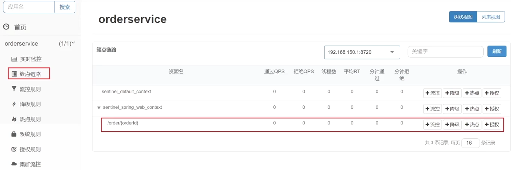](https://cdn.xn2001.com/img/2022/202205081445779.png)


流控、熔断等都是针对簇点链路中的资源来设置的，因此我们可以点击对应资源后面的按钮来设置规则：

- 流控：流量控制
- 降级：降级熔断
- 热点：热点参数限流，是限流的一种
- 授权：请求的权限控制

点击资源 /order/{orderId} 后面的流控按钮，就可以弹出表单。

[](https://cdn.xn2001.com/img/2022/202205081509045.png)


表单中可以填写限流规则，如下

[](https://cdn.xn2001.com/img/2022/202205081509055.png)


其含义是限制 /order/{orderId} 这个资源的单机 QPS 为 1，即每秒只允许 1 次请求，超出的请求会被拦截并报错。

> 需求：给 /order/{orderId} 这个资源设置流控规则，QPS 不能超过 5，然后测试。

1）首先在 sentinel 控制台添加限流规则

[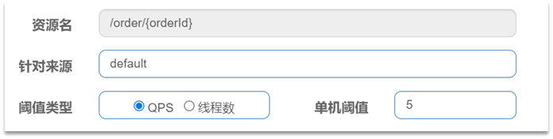](https://cdn.xn2001.com/img/2022/202205081513259.png)


2）利用 jmeter 测试，下面有讲到 JMeter 基础使用。

[](https://cdn.xn2001.com/img/2022/202205081514678.png)


20 个用户，2 秒内运行完，这样的话 QPS 就是 10，超过了我们在 sentinel 设置的 5

右键运行：

[](https://cdn.xn2001.com/img/2022/202205081512845.png)


> 注意，不要点击菜单中的执行按钮来运行。

结果：

[](https://cdn.xn2001.com/img/2022/202205081512850.png)


可以看到，成功的请求每次只有 5 个。

[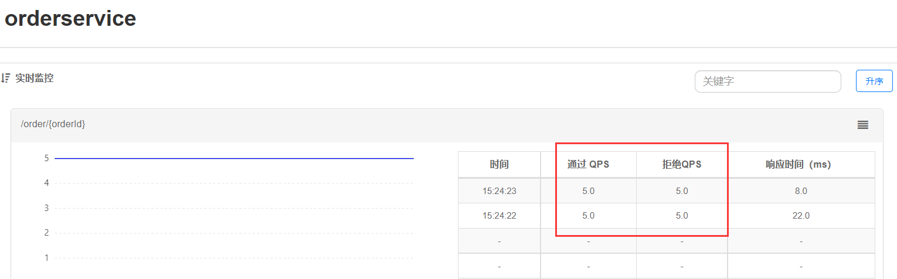](https://cdn.xn2001.com/img/2022/202205081525292.png)


### 流控模式

在添加限流规则时，点击高级选项，可以选择三种**流控模式**

#### 直接模式

- 直接：统计**当前资源的请求**，触发阈值时对当前资源直接限流，也是默认的模式
  - 直接对当前资源限流
- 关联：统计**与当前资源相关的另一个资源**，触发阈值时，对当前资源限流
  - 相当于高优先级资源触发阈值，对低优先级资源限流。
- 链路：统计**从指定链路**访问到**本资源**的请求，触发阈值时，对指定链路限流
  - 是针对请求来源的限流

[](https://cdn.xn2001.com/img/2022/202205081553073.png)


上面我们测试的就是直接模式，默认就是直接模式。

#### 关联模式

统计与当前资源相关的另一个资源，触发阈值时，对当前资源限流。

**使用场景**：比如用户支付时需要修改订单状态，同时用户要查询订单。查询和修改操作会争抢数据库锁，产生竞争。业务需求是优先支付和更新订单的业务，因此当**修改订单**业务触发阈值时，需要对**查询订单**业务限流。

[](https://cdn.xn2001.com/img/2022/202205081602290.png)


例如：配置规则，**当 /write 资源访问量触发阈值时，就会对 /read 资源限流，避免影响 /write 资源。**

[](https://cdn.xn2001.com/img/2022/202205081602252.png)


我们去程序中模拟：

- 在 OrderController 新建两个端点：/order/query 和 /order/update，无需实现业务
- 配置流控规则，当 /order/ update 资源被访问的 QPS 超过 5 时，对 /order/query 请求限流

1）定义 /order/query 端点，模拟订单查询

```java
@GetMapping("/query")
public String queryOrder() {
    return "查询订单成功";
}
```

2）定义 /order/update 端点，模拟订单更新

```java
@GetMapping("/update")
public String updateOrder() {
    return "更新订单成功";
}
```

重启服务，查看 Sentinel 控制台的簇点链路。

[](https://cdn.xn2001.com/img/2022/202205081618267.png)


3）配置流控规则

想要对哪个端点限流，就点击哪个端点后面的按钮。我们是对订单查询 /order/query 限流

[](https://cdn.xn2001.com/img/2022/202205081619163.png)


在表单中填写流控规则


[](https://cdn.xn2001.com/img/2022/202205081602274.png)


4）在 JMeter 测试

[](https://cdn.xn2001.com/img/2022/202205081619453.png)


可以看到 1000 个用户，100 秒，因此 QPS 为10，超过了我们设定的阈值：5

查看 http 请求

[](https://cdn.xn2001.com/img/2022/202205081602280.png)


请求的目标是 /order/update，但限流的目标是 /order/query，这就是关联模式；我们在浏览器访问 /order/query，可以发现确实被限流了。

[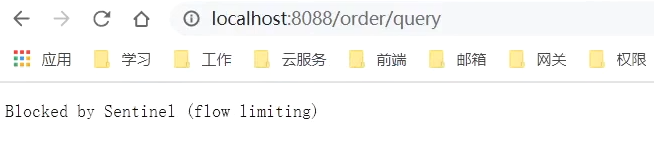](https://cdn.xn2001.com/img/2022/202205081620364.png)


#### 链路模式

只针对从指定链路访问到本资源的请求做统计，判断是否超过阈值。

例如有两条请求链路

- /test1 --> /common
- /test2 --> /common

如果只希望统计从 /test2 进入到 /common 的请求，则可以这样配置

[](https://cdn.xn2001.com/img/2022/202205081632892.png)


**实战案例**

有查询订单和创建订单业务，两者都需要查询商品。

针对从**查询订单**进入到**查询商品**的请求统计，并设置限流。

1. 在 OrderService 中添加一个 queryGoods 方法，不用实现业务
2. 在 OrderController 中，改造 /order/query 端点，调用 OrderService 中的 queryGoods 方法
3. 在 OrderController 中添加一个 /order/save 端点，调用 OrderService 的 queryGoods 方法
4. 给 queryGoods 设置限流规则，从 /order/query 进入 queryGoods 的方法限制 QPS 必须小于 2

1）添加查询商品方法

在order-service服务中，给 OrderService 类添加一个 queryGoods 方法

```java
public void queryGoods(){
    System.err.println("查询商品");
}
```

2）查询订单时，查询商品

在 order-service 的 OrderController 中，修改 /order/query 端点的业务逻辑

```java
@GetMapping("/query")
public String queryOrder() {
    // 查询商品
    orderService.queryGoods();
    // 查询订单
    System.out.println("查询订单");
    return "查询订单成功";
}  
```

3）新增订单，查询商品

在 order-service 的 OrderController 中，修改 /order/save 端点，模拟新增订单：

```java
@GetMapping("/save")
public String saveOrder() {
    // 查询商品
    orderService.queryGoods();
    // 查询订单
    System.out.println("新增订单");
    return "新增订单成功";
}
```

4）给查询商品添加资源标记

默认情况下，OrderService 中的方法是不被 Sentinel 监控的，需要我们自己通过注解来标记要监控的方法。

给 OrderService 的 queryGoods 方法添加 `@SentinelResource` 注解。

```java
@SentinelResource("goods")
public void queryGoods(){
    System.err.println("查询商品");
}
```

链路模式中，是对不同来源的两个链路做监控。但是 Sentinel 默认会给进入 SpringMVC 的所有请求设置同一个 root 资源，会导致链路模式失效(这个会设置所有的controller为同一个链路)。我们需要关闭这种对 SpringMVC 的资源聚合，修改 order-service 服务的 application.yml 文件

大概就是这种关系


```yaml
spring:
  cloud:
    sentinel:
      web-context-unify: false # 关闭context整合
```

重启服务，访问 /order/query 和 /order/save，可以查看到 Sentinel 的簇点链路规则中，出现了新的资源

[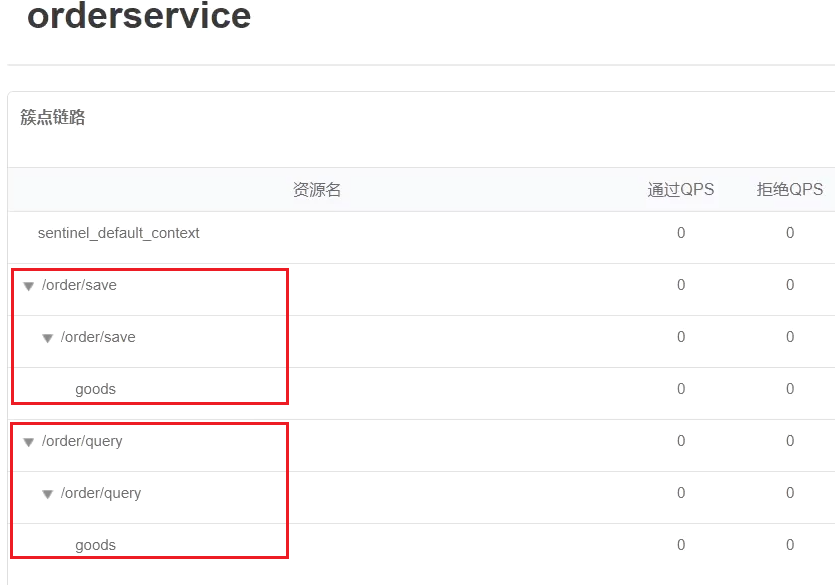](https://cdn.xn2001.com/img/2022/202205081633195.png)


5）添加流控规则

点击 goods 资源后面的流控按钮，在弹出的表单中填写下面信息

[](https://cdn.xn2001.com/img/2022/202205081633212.png)


只统计从 /order/query 进入 /goods 的资源，QPS 阈值为 2，超出则被限流。

6）Jmeter测试

[](https://cdn.xn2001.com/img/2022/202205081633203.png)


可以看到这里200个用户，50秒内发完，QPS为4，超过了我们设定的阈值2

一个 http 请求是访问 /order/save

[](https://cdn.xn2001.com/img/2022/202205081858739.png)


运行的结果是 /order/save 完全不受影响。

[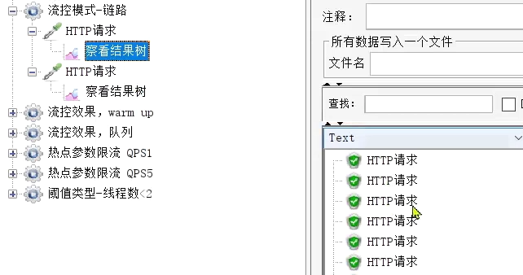](https://cdn.xn2001.com/img/2022/202205081858880.png)


访问 /order/query

[](https://cdn.xn2001.com/img/2022/202205081633221.png)


运行结果是 /order/query，每次只有2个通过。

[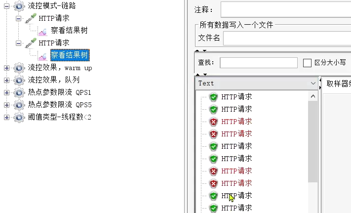](https://cdn.xn2001.com/img/2022/202205081633245.png)


## 流控效果

### 快速失败

细心的小伙伴会发现在流控的高级选项中，还有一个流控效果选项，前面我们的测试都是基本快速失败的。

[](https://cdn.xn2001.com/img/2022/202205081907653.png)


流控效果是指请求达到流控阈值时应该采取的措施，包括三种

- 快速失败：达到阈值后，新的请求会被立即拒绝并抛出 FlowException 异常，是默认的处理方式。
- Warm Up：预热模式，对超出阈值的请求同样是拒绝并抛出异常。但这种模式阈值会动态变化，从一个较小值逐渐增加到最大阈值。
- 排队等待：让所有的请求按照先后次序排队执行，两个请求的间隔不能小于指定时长。

### Warm up

阈值一般是一个微服务能承担的最大 QPS，但是一个服务刚刚启动时，一切资源尚未初始化（**冷启动**），如果直接将 QPS 跑到最大值，可能导致服务瞬间宕机。

（冷启动相当于一个人将要做剧烈运动前，先热身一下，再慢慢的剧烈起来）

Warm Up 也叫**预热模式**，是应对服务冷启动的一种方案。请求阈值**初始**值是 `maxThreshold / coldFactor`，持续指定时长后，逐渐提高到 maxThreshold 值。而 coldFactor 的默认值是 3.

例如，我设置 QPS 的 maxThreshold 为 10，预热时间为 5 秒，那么初始阈值就是 10 / 3 = 3，然后在 5 秒后逐渐增长到 10

[](https://cdn.xn2001.com/img/2022/202205081907114.png)


**案例**：给 /order/{orderId} 这个资源设置限流，最大 QPS 为 10，利用 Warm Up 效果，预热时长为 5 秒。

1）配置流控规则

[](https://cdn.xn2001.com/img/2022/202205090008173.png)


2）JMeter 测试

[](https://cdn.xn2001.com/img/2022/202205090008283.png)


刚刚启动时，大部分请求失败，成功的只有 3 个，说明 QPS 被限定在 3

[](https://cdn.xn2001.com/img/2022/202205090009927.png)


随着时间推移，成功比例越来越高

[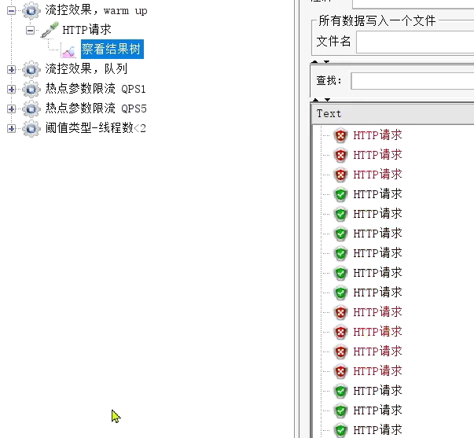](https://cdn.xn2001.com/img/2022/202205090009448.png)


到 Sentinel 控制台查看实时监控

[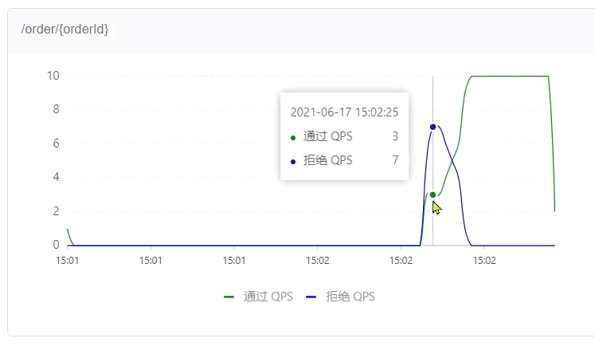](https://cdn.xn2001.com/img/2022/202205081907395.png)


一段时间后

[](https://cdn.xn2001.com/img/2022/202205081907398.png)


用官方的话讲，该方式主要用于系统长期处于低水位的情况下，当流量突然增加时，直接把系统拉升到高水位可能瞬间把系统压垮。通过"冷启动"，让通过的流量缓慢增加，在一定时间内逐渐增加到阈值上限，给冷系统一个预热的时间，避免冷系统被压垮的情况。

### 排队等待

当请求超过 QPS 阈值时，「快速失败」和 「Warm Up」会拒绝新的请求并抛出异常。

而排队等待则是让所有请求进入一个队列中，然后按照阈值允许的时间间隔依次执行。后来的请求必须等待前面执行完成，如果请求预期的等待时间超出最大时长，则会被拒绝。这种方式严格控制了请求通过的间隔时间，也即是让请求以均匀的速度通过，对应的是漏桶算法。

==这种方式适用于波动式的网络请求。==

例如：

> QPS = 5，意味着每 200ms 处理一个队列中的请求；
>
> timeout = 2000，意味着**预期等待时长**超过 2000ms 的请求会被拒绝并抛出异常。

比如现在一下子来了 12 个请求，因为每 200ms 执行一个请求，那么预期等待时长就是：

- 第6个请求的**预期等待时长** = 200 * (6 - 1) = 1000ms
- 第12个请求的预期等待时长 = 200 * (12-1) = 2200ms

又比如下图：

[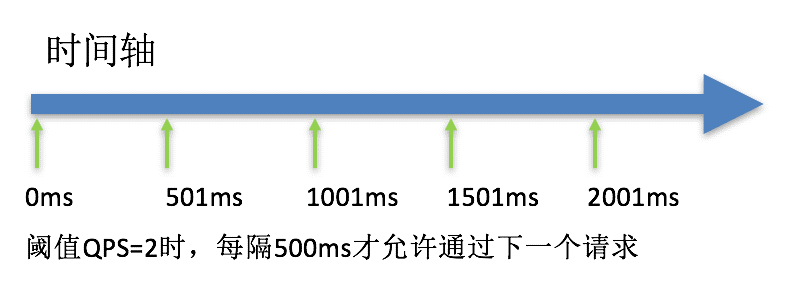](https://cdn.xn2001.com/img/2022/202205090037622.png)


现在，第 1 秒同时接收到 10 个请求，但第 2 秒只有 1 个请求，此时 QPS 的曲线这样的

[](https://cdn.xn2001.com/img/2022/202205081907396.png)


如果使用排队等待的流控效果，所有进入的请求都要排队，以固定的 200ms 的间隔执行，QPS 会变的很平滑

[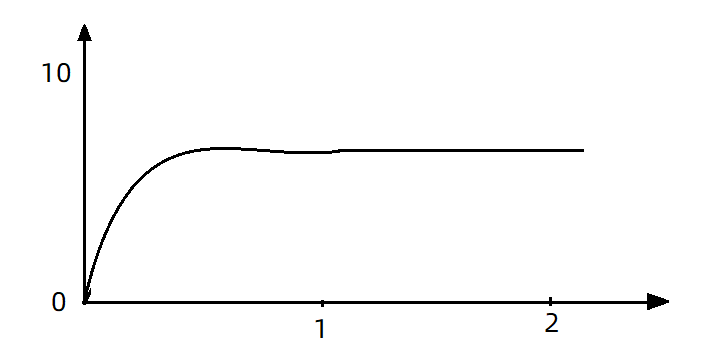](https://cdn.xn2001.com/img/2022/202205090016702.png)


这种方式主要用于处理间隔性突发的流量，例如消息队列。想象一下这样的场景，在某一秒有大量的请求到来，而接下来的几秒则处于空闲状态，我们希望系统能够在接下来的空闲期间逐渐处理这些请求，而不是在第一秒直接拒绝多余的请求。

**案例**：给 /order/{orderId} 这个资源设置限流，最大 QPS 为 10，利用排队等待的流控效果，超时时长设置为 5s

1）添加流控规则

[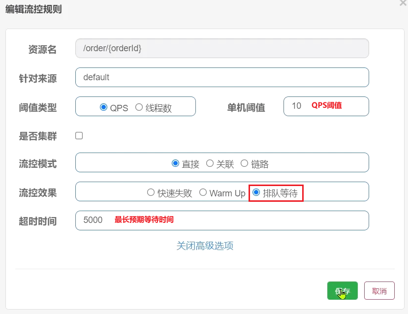](https://cdn.xn2001.com/img/2022/202205090011577.png)


2）JMeter 测试

[](https://cdn.xn2001.com/img/2022/202205081907171.png)


QPS 为 15，已经超过了我们设定的 10，如果是之前的「快速失败」 、「Warm Up」模式，超出的请求应该会直接报错。

但是我们看看「排队等待」的运行结果

[](https://cdn.xn2001.com/img/2022/202205081907254.png)


再去 Sentinel 查看实时监控的 QPS 曲线

[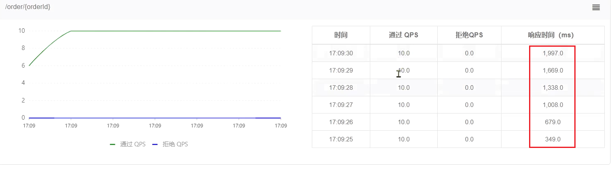](https://cdn.xn2001.com/img/2022/202205081907426.png)


QPS 非常平滑，一致保持在 10，但是超出的请求没有被拒绝，而是放入队列。因此**响应时间**（等待时间）会越来越长。

当队列满了以后，才会有部分请求失败

[](https://cdn.xn2001.com/img/2022/202205081907443.png)


## 热点参数限流

之前的限流是统计访问某个资源的所有请求，判断是否超过 QPS 阈值。而「热点参数限流」是**分别统计参数值相同的请求**，判断是否超过 QPS 阈值。

### 全局参数限流

例如，一个根据 id 查询商品的接口

[](https://cdn.xn2001.com/img/2022/202205090045292.png)


访问 /goods/{id} 的请求中，id 参数值会有变化，「热点参数限流」会根据参数值分别统计 QPS，统计结果：

[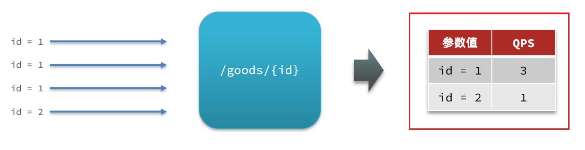](https://cdn.xn2001.com/img/2022/202205090046762.png)


当 id=1 的请求触发阈值被限流时，id值不为1的请求则不受影响。

配置示例：对 hot 这个资源的 0 号参数（也就是第一个参数）做统计，每 1s **相同参数值**的请求数不能超过 5

[](https://cdn.xn2001.com/img/2022/202205090042929.png)


### 热点参数限流

假设上面的例子是一个商品查询接口，那么刚才的配置中，对这个接口的所有商品一视同仁，QPS 都限定为 5

而在实际开发中，可能部分商品是热点商品，例如秒杀商品，我们希望这部分商品的 QPS 限制与其它商品不一样，高一些。那就需要配置「热点参数限流」的高级选项了。

[](https://cdn.xn2001.com/img/2022/202205090050071.png)


结合上一个配置，这里的含义是对 0 号的 long 类型参数限流，每 1 个相同参数的 QPS 不能超过 5，有如下两个例外

- 如果参数值是 100，则每 1s 允许的 QPS 为 10
- 如果参数值是 101，则每 1s 允许的 QPS 为 15

**案例需求**：给 /order/{orderId} 这个资源添加「热点参数限流」，规则如下

- 默认的热点参数规则是每 1s 请求量不超过 2
- 给 102 这个参数设置例外：每 1s 请求量不超过 4
- 给 103 这个参数设置例外：每 1s 请求量不超过 10

**注意事项**：热点参数限流对默认的 SpringMVC 资源无效，需要利用 `@SentinelResource` 注解标记资源。

1）标记资源

给 order-service 中的 OrderController 中的 /order/{orderId} 资源添加注解

[](https://cdn.xn2001.com/img/2022/202205090042942.png)


2）热点参数限流规则

访问该接口，可以看到我们标记的 hot 资源出现了

[](https://cdn.xn2001.com/img/2022/202205090136368.png)


点击左侧菜单中**热点规则**菜单

[](https://cdn.xn2001.com/img/2022/202205090137049.png)


点击新增，填写表单

[](https://cdn.xn2001.com/img/2022/202205090137574.png)


3）JMeter 测试

这里发起请求的 QPS 为 5，包含 3 个 http 请求

[](https://cdn.xn2001.com/img/2022/202205090138955.png)


普通参数，QPS 阈值为 2

[](https://cdn.xn2001.com/img/2022/202205090042964.png)


[](https://cdn.xn2001.com/img/2022/202205090042203.png)


例外项，QPS 阈值为 4

[](https://cdn.xn2001.com/img/2022/202205090140941.png)


[](https://cdn.xn2001.com/img/2022/202205090042238.png)


**例外项，QPS 阈值为 10**

[](https://cdn.xn2001.com/img/2022/202205090042244.png)


[](https://cdn.xn2001.com/img/2022/202205090140933.png)


## 隔离和降级

限流只是一种预防措施，虽然限流可以尽量避免因高并发而引起的服务故障，但服务还会因为其它原因而故障。

而要将这些故障控制在一定范围，避免雪崩，就要靠**线程隔离**（舱壁模式）和**熔断降级**手段了。

**线程隔离**：调用者在调用服务提供者时，给**每个调用的请求分配独立线程池**，出现故障时，最多消耗这个线程池内资源，避免把调用者的所有资源耗尽。

[](https://cdn.xn2001.com/img/2022/202205091001949.png)


**熔断降级**：是在调用方这边加入断路器，统计对**服务提供者**的调用，如果调用的失败比例过高，则熔断该业务，不允许访问该服务的提供者了。

[](https://cdn.xn2001.com/img/2022/202205091203825.png)


可以看到，不管是线程隔离还是熔断降级，都是对**客户端**（调用方）的保护。需要在**调用方**发起远程调用时做线程隔离、或者服务熔断。

而我们的微服务远程调用都是基于 Feign 来完成的，因此我们需要将 Feign 与 Sentinel 整合，在 Feign 里面实现线程隔离和服务熔断。

### Feign整合Sentinel

SpringCloud中，微服务调用都是通过Feign来实现的，因此做客户端保护必须整合 Feign 和 Sentinel

修改配置，开启 Sentinel 功能，修改 OrderService 的 application.yml 文件，开启 Feign 的 Sentinel 功能

```yaml
feign:
  sentinel:
    enabled: true # 开启feign对sentinel的支持
```

服务降级：访问失败后，服务

**编写失败降级逻辑代码**，业务失败后，不能直接报错，而应该返回用户一个友好提示或者默认结果，这个就是失败降级逻辑。

给 FeignClient 编写失败后的降级逻辑

①方式一：FallbackClass，但无法对远程调用的异常做处理。

②方式二：FallbackFactory，可以对远程调用的异常做处理，我们选择这种

这里我们演示方式二的失败降级处理。

**步骤一**：在 feing-api 项目中定义类，实现 FallbackFactory

[](https://cdn.xn2001.com/img/2022/202205091209104.png)


```java
@slf4j
public class UserclientFallbackFactory implements FallbackFactory<UserClient> {
    @0verride
    public Userclient create(Throwable throwable) {
        //创建UserClient接口实现类，实现其中的方法，编写失败降级的处理逻辑
        //这里面编写的是匿名内部类
        return new Userclient() {
            @override
            public User findById ( Long id) {
                //记录异常信息
                log.error("查询用户失败"，throwable);//根据业务需求返回默认的数据，这里是空用户
                return new User();
            }
        };
    }
}
```


**步骤二**：在 feing-api 项目中的 DefaultFeignConfiguration 类中将 UserClientFallbackFactory 注册为一个Bean

```java
@Bean
public UserClientFallbackFactory userClientFallbackFactory(){
    return new UserClientFallbackFactory();
}
```

**步骤三**：在 feing-api 项目中的 UserClient 接口中使用 UserClientFallbackFactory

```java
@FeignClient(value = "userservice", fallbackFactory = UserClientFallbackFactory.class)
public interface UserClient {
    @GetMapping("/user/{id}")
    User findById(@PathVariable("id") Long id);
}
```

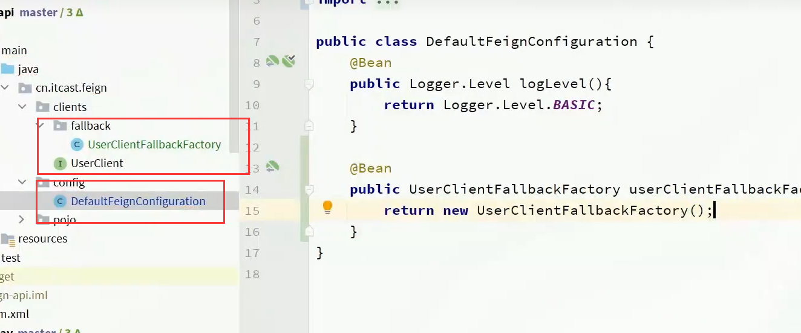


重启后，访问一次订单查询业务，然后查看 Sentinel 控制台，可以看到新的簇点链路

[](https://cdn.xn2001.com/img/2022/202205091210616.png)


### 线程隔离

线程隔离（舱壁模式）有两种方式实现

- 线程池隔离：给每个服务调用业务分配一个线程池，利用线程池本身实现隔离效果。
- 信号量隔离（Sentinel默认采用）：不创建线程池，而是计数器模式，记录业务使用的线程数量，达到信号量上限时，禁止新的请求。

两者的优缺点

- 线程池隔离：基于线程池模式，有额外开销，但隔离控制更强
- 信号量隔离：基于计数器模式，简单，开销小

[](https://cdn.xn2001.com/img/2022/202205091501180.png)


[](https://cdn.xn2001.com/img/2022/202205091502961.png)


**Sentinel 使用的是信号量隔离**，而 Hystrix 则两种线程隔离都可以，18 年Hystrix已经停止更新。

如何使用呢，在添加限流规则时，可以选择两种阈值类型

[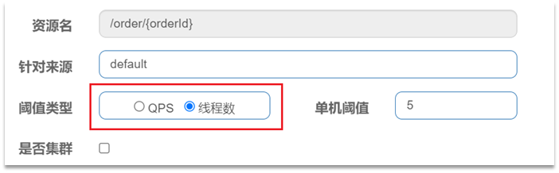](https://cdn.xn2001.com/img/2022/202205091500754.png)


- QPS：就是每秒的请求数，之前已经演示过。
- 线程数：是该资源能使用的 Tomcat 线程数的最大值。也就是通过限制线程数量，实现**线程隔离**（舱壁模式）。

**案例需求**：给 order-service 服务中的 UserClient 的查询用户接口设置流控规则，线程数不能超过 2，然后利用 JMeter 测试。

1）配置隔离规则，选择 feign 接口后面的流控按钮

[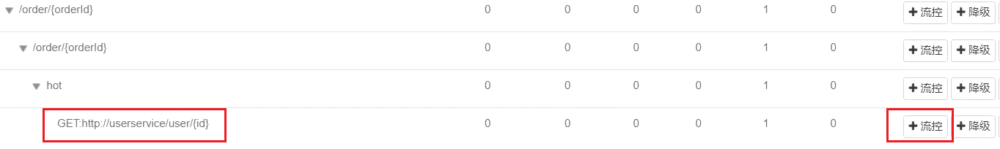](https://cdn.xn2001.com/img/2022/202205091507487.png)


[](https://cdn.xn2001.com/img/2022/202205091508076.png)


2）JMeter 测试

[](https://cdn.xn2001.com/img/2022/202205091500777.png)


一次发生 10 个请求，有较大概率并发线程数超过 2，而超出的请求会走之前定义的失败降级逻辑。

查看运行结果

[](https://cdn.xn2001.com/img/2022/202205091500739.png)


发现虽然结果都是通过了，**不过部分请求得到的响应是「降级」返回的 null 信息。也就是我们写的降级方法**。

### 熔断降级

熔断降级是解决雪崩问题的重要手段。(主要思想就是计算比例！！！像保险丝，直接熔断，访问不了了就)其思路是由**断路器**统计服务调用的异常比例、慢请求比例，如果超出阈值则会**熔断**该服务。即拦截访问该服务的一切请求；而当服务恢复时，断路器会放行访问该服务的请求。

断路器控制熔断和放行是通过状态机来完成的，如下图就是一个断路器的状态机制

[](https://cdn.xn2001.com/img/2022/202205091510676.png)


状态机包括三个状态

- closed：关闭状态，断路器放行所有请求，并开始统计异常比例、慢请求比例。会去判断是否达到熔断条件，这一步我们叫做「熔断策略」，达到该条件则切换到 open 状态，打开断路器。
- open：打开状态，服务调用被**熔断**，访问被熔断服务的请求会被拒绝，快速失败，直接走降级逻辑。Open 状态 5 秒后会进入 half-open 状态。
- half-open：半开状态，会一段时间放行一次请求，根据执行结果来判断接下来的操作。请求成功：则切换到 closed 状态；请求失败：则切换到 open 状态。

断路器熔断策略有三种：慢调用、异常比例、异常数

#### 慢调用

业务的响应时长（RT）大于指定时长的请求认定为慢调用请求。在指定时间内，如果请求数量超过设定的最小数量，慢调用比例大于设定的阈值，则触发熔断。

例如下图，设置 RT 超过 500ms 的调用是慢调用，统计最近 10000ms 内的请求，如果请求量超过 10 次，并且慢调用比例不低于 0.5，则触发熔断，熔断时长为 5s，然后进入 half-open 状态，放行一次请求做测试。

[](https://cdn.xn2001.com/img/2022/202205091520916.png)


**案例需求**：给 UserClient 的查询用户接口设置降级规则，慢调用的 RT 阈值为 50ms，统计时间为 1s ，最小请求数量为 5，失败阈值比例为 0.4，熔断时长为 5s；

1）设置慢调用

修改 user-service 中的 /user/{id} 这个接口的业务。通过休眠模拟一个延迟时间。

[](https://cdn.xn2001.com/img/2022/202205091538605.png)


此时，orderId = 101 的订单，关联的是 id 为 1 的用户，调用时长为 60ms

[](https://cdn.xn2001.com/img/2022/202205091520928.png)


orderId = 102 的订单，关联的是 id 为 2 的用户，调用时长为非常短

[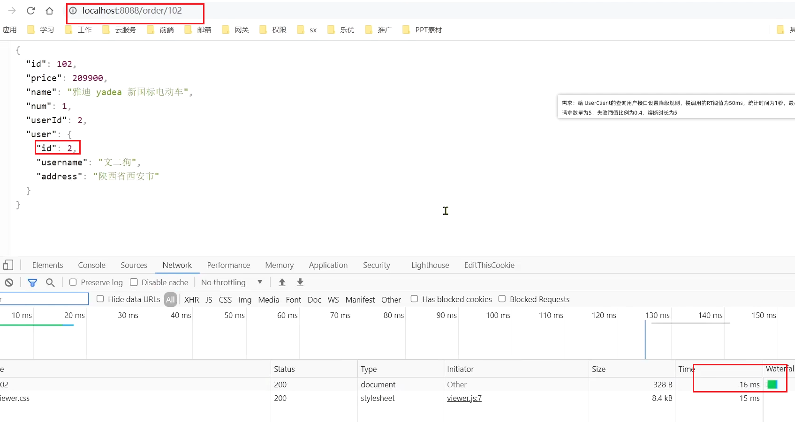](https://cdn.xn2001.com/img/2022/202205091520932.png)


2）设置熔断规则

下面，给 feign 接口设置降级规则，超过 50ms 的请求都会被认为是慢请求。

[](https://cdn.xn2001.com/img/2022/202205091624147.png)


[](https://cdn.xn2001.com/img/2022/202205091624535.png)


3）测试

在浏览器访问：http://localhost:8088/order/101，快速刷新5次，可以发现，触发了熔断，请求时长缩短至 5ms，快速失败了，并且走降级逻辑，返回的 null

[](https://cdn.xn2001.com/img/2022/202205091624280.png)


此时在浏览器访问：http://localhost:8088/order/102，也被熔断了

[](https://cdn.xn2001.com/img/2022/202205091625297.png)


#### 异常

**异常比例或异常数**：统计指定时间内的调用，如果调用次数超过指定请求数，并且出现异常的比例达到设定的比例阈值（或超过指定异常数），则触发熔断。

例如，异常比例设置如下，统计最近 1000ms 内的请求，如果请求量超过 10 次，并且异常比例不低于 0.4，则触发熔断。

[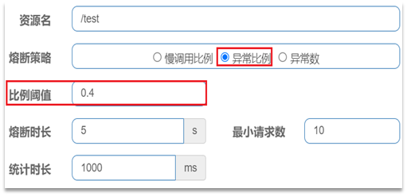](https://cdn.xn2001.com/img/2022/202205091520106.png)


异常数设置如下，统计最近 1000ms 内的请求，如果请求量超过 10 次，并且异常比例不低于 2 次，则触发熔断。

[](https://cdn.xn2001.com/img/2022/202205091520416.png)


**案例需求**：给 UserClient 的查询用户接口设置降级规则，统计时间为 1s，最小请求数量为 5，失败阈值比例为 0.4，熔断时长为 5s

1）设置异常请求

首先，修改 user-service 中的 /user/{id} 这个接口的业务。手动抛出异常，以触发异常比例的熔断，也就是说，id 为 2时，就会触发异常。

[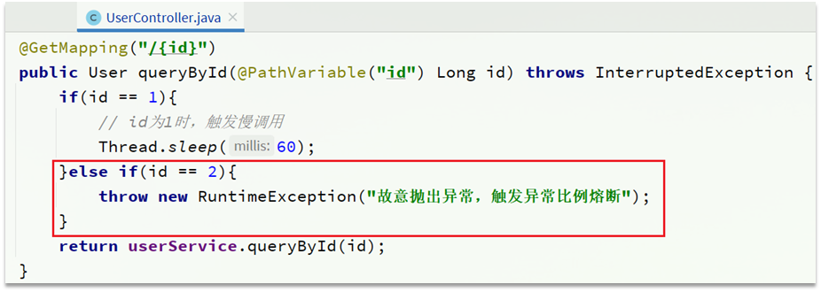](https://cdn.xn2001.com/img/2022/202205091520469.png)


2）设置熔断规则

在 5 次请求中，只要异常比例超过 0.4，也就是有 2 次以上的异常，就会触发熔断。

[](https://cdn.xn2001.com/img/2022/202205091818818.png)


[](https://cdn.xn2001.com/img/2022/202205091520694.png)


3）测试

在浏览器快速访问：http://localhost:8088/order/102，快速刷新 5 次，触发熔断降级。

[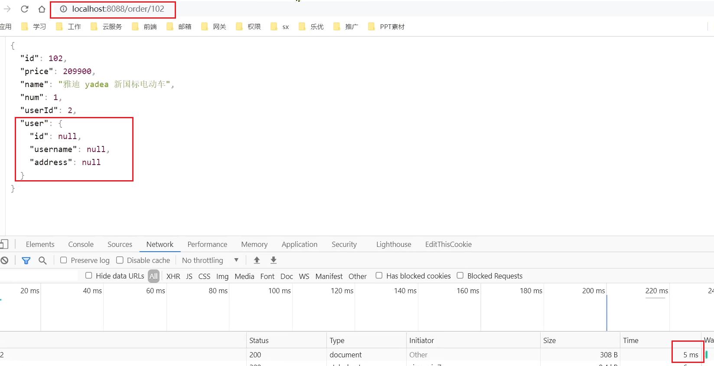](https://cdn.xn2001.com/img/2022/202205091821790.png)


此时，我们去访问本应该正常的 103，发现也被降级了。

[](https://cdn.xn2001.com/img/2022/202205091520623.png)


## 授权规则

授权规则可以对请求方来源做判断和控制。授权规则可以对调用方的来源做控制，有白名单和黑名单两种方式。

比如我们希望控制对资源 `test` 的访问设置白名单，只有来源为 `appA` 和 `appB` 的请求才可通过。

- 白名单：来源（origin）在白名单内的调用者允许访问
- 黑名单：来源（origin）在黑名单内的调用者不允许访问

点击左侧菜单的授权，可以看到授权规则

[](https://cdn.xn2001.com/img/2022/202205100008770.png)


- 资源名：就是受保护的资源，例如 /order/{orderId}
- 流控应用：是来源者的名单
  - 如果是勾选白名单，则名单中的来源被许可访问。
  - 如果是勾选黑名单，则名单中的来源被禁止访问。

比如我们允许请求从 gateway 到 order-service，不允许浏览器访问 order-service，那么白名单中就要填写**网关的来源名称（origin）**。

[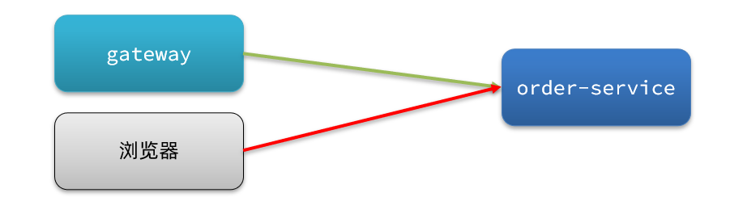](https://cdn.xn2001.com/img/2022/202205100008679.png)


Sentinel 是通过 RequestOriginParser 这个接口的 parseOrigin() 方法来获取请求的来源的。

```java
public interface RequestOriginParser {
    /**
     * 从请求request对象中获取origin，获取方式自定义
     */
    String parseOrigin(HttpServletRequest request);
}
```

这个方法的作用就是从 request 对象中，获取请求者的 origin 值并返回。默认情况下，Sentinel 不管请求者从哪里来，返回值永远是 default，也就是说一切请求的来源都被认为是一样的值 default

因此，我们需要自定义这个接口的实现，让**不同的请求，返回不同的 origin**

例如 order-service 服务中，我们定义一个 RequestOriginParser 的实现类

```java
@Component
public class HeaderOriginParser implements RequestOriginParser {
    @Override
    public String parseOrigin(HttpServletRequest request) {
        // 1.获取请求头
        String origin = request.getHeader("origin");
        // 2.非空判断
        if (StringUtils.isEmpty(origin)) {
            origin = "blank";
        }
        return origin;
    }
}
```

我们必须让**所有从 Gateway 路由到微服务的请求都带上 origin 头**。这个需要利用之前学习的一个 GatewayFilter 来实现，使用 AddRequestHeaderGatewayFilter，修改 Gateway 服务中的 application.yml

```yaml
spring:
  cloud:
    gateway:
      default-filters:
        - AddRequestHeader=origin,gateway #origin前面不能带空格
```

这样，从 Gateway 路由的所有请求都会带上 origin 头，值为 gateway。而从其它地方到达微服务的请求一般没有这个头。

接下来，我们添加一个授权规则，放行 origin 值为 gateway 的请求。

[](https://cdn.xn2001.com/img/2022/202205100104446.png)


[](https://cdn.xn2001.com/img/2022/202205100104442.png)


现在，我们直接跳过网关，访问 order-service 服务

[](https://cdn.xn2001.com/img/2022/202205100104100.png)


通过网关访问

[](https://cdn.xn2001.com/img/2022/202205100104271.png)


## 自定义异常结果

默认情况下，发生限流、降级、授权拦截时，都会抛出异常到调用方。异常结果都是 flow limmiting（限流）。这样不够友好，无法得知是限流还是降级还是授权拦截。

而如果要自定义异常时的返回结果，需要实现 BlockExceptionHandler 接口

```java
public interface BlockExceptionHandler {
    /**
     * 处理请求被限流、降级、授权拦截时抛出的异常：BlockException
     */
    void handle(HttpServletRequest request, HttpServletResponse response, BlockException e) throws Exception;
}
```

这个方法有三个参数：

- HttpServletRequest request：request 对象
- HttpServletResponse response：response 对象
- BlockException e：被 Sentinel 拦截时抛出的异常

这里的 BlockException 包含多个不同的子类

| **异常**             | **说明**           |
| :------------------- | :----------------- |
| FlowException        | 限流异常           |
| ParamFlowException   | 热点参数限流的异常 |
| DegradeException     | 降级异常           |
| AuthorityException   | 授权规则异常       |
| SystemBlockException | 系统规则异常       |

自定义异常处理，下面我们就在 order-service 定义一个自定义异常处理类

```java
@Component
public class SentinelExceptionHandler implements BlockExceptionHandler {
    @Override
    public void handle(HttpServletRequest request, HttpServletResponse response, BlockException e) throws Exception {
        String msg = "未知异常";
        int status = 429;

        if (e instanceof FlowException) {
            msg = "请求被限流了";
        } else if (e instanceof ParamFlowException) {
            msg = "请求被热点参数限流";
        } else if (e instanceof DegradeException) {
            msg = "请求被降级了";
        } else if (e instanceof AuthorityException) {
            msg = "没有权限访问";
            status = 401;
        }

        response.setContentType("application/json;charset=utf-8");
        response.setStatus(status);
        response.getWriter().println("{\"msg\": " + msg + ", \"status\": " + status + "}");
    }
}
```

重启测试，在不同场景下，会返回不同的异常消息。

限流：

[](https://cdn.xn2001.com/img/2022/202205100112438.png)


授权拦截时：

[](https://cdn.xn2001.com/img/2022/202205100122438.png)


## 规则持久化

现在，Sentinel 的所有规则都是内存存储，重启后所有规则都会丢失。在生产环境下，我们必须确保这些规则的持久化，避免丢失。

规则是否能持久化，取决于规则管理模式，Sentinel 支持三种规则管理模式

- 原始模式：Sentinel 的默认模式，将规则保存在内存，重启服务会丢失。
- pull 模式
- push 模式

### pull模式

pull 模式：控制台将配置的规则推送到 Sentinel 客户端，而客户端会将配置规则保存在本地文件或数据库中。以后会定时去本地文件或数据库中查询，更新本地规则。

[](https://cdn.xn2001.com/img/2022/202205100126168.png)


这种模式的缺点是：时效性不强，因为是定时更新的

### push模式

（这个东西不是我们现在该看的）

push 模式：控制台将配置规则推送到远程配置中心，例如 Nacos，Sentinel 客户端监听 Nacos，获取配置变更的推送消息，完成本地配置更新。这种模式是比较好的一种。

[](https://cdn.xn2001.com/img/2022/202205100128564.png)


我们简单了解一下这种方式，首先修改 OrderService，让其监听 Nacos 中的 Sentinel 规则配置。

在 order-service 中引入Sentinel 监听 Nacos 的依赖：

```xml
<dependency>
    <groupId>com.alibaba.csp</groupId>
    <artifactId>sentinel-datasource-nacos</artifactId>
</dependency>
```

配置 Nacos 地址，在 order-service 中的 application.yml 文件配置 Nacos 地址及监听的配置信息

```yaml
spring:
  cloud:
    sentinel:
      datasource:
        flow:
          nacos:
            server-addr: localhost:8848 # nacos地址
            dataId: orderservice-flow-rules
            groupId: SENTINEL_GROUP
            rule-type: flow # 还可以是：degrade、authority、param-flow
```

然后需要修改 sentinel-dashboard 源码，SentinelDashboard 默认不支持 Nacos 的持久化，需要修改源码。

> 相当于开源开一半，主要给阿里云用户商业使用。
>
> 以下以供了解，未实测。

解压 Sentinel 源码包

[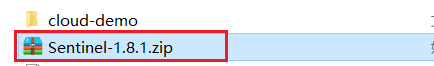](https://cdn.xn2001.com/img/2022/202205101404663.png)


然后并用 IDEA 打开这个项目，结构如下

[](https://cdn.xn2001.com/img/2022/202205101404666.png)


在 sentinel-dashboard 源码的pom文件中，nacos 的依赖默认的 scope 是 test，只能在测试时使用，这里要去除

[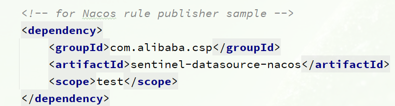](https://cdn.xn2001.com/img/2022/202205101405160.png)


将 sentinel-datasource-nacos 依赖的 scope 去掉，改成下面这样。

```xml
<dependency>
    <groupId>com.alibaba.csp</groupId>
    <artifactId>sentinel-datasource-nacos</artifactId>
</dependency>
```

在 sentinel-dashboard 的 test 包下，已经编写了对 nacos 的支持，我们需要将其拷贝到 main 中。

[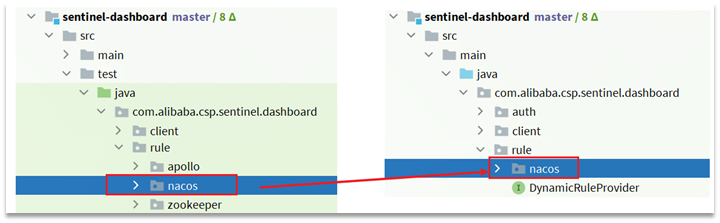](https://cdn.xn2001.com/img/2022/202205101405035.png)


然后，还需要修改测试代码中的 NacosConfig 类

[](https://cdn.xn2001.com/img/2022/202205101406914.png)


修改其中的 Nacos 地址，让其读取 application.properties 中的配置

[](https://cdn.xn2001.com/img/2022/202205101404688.png)


在 sentinel-dashboard 的 application.properties 中添加 Nacos 地址配置

```properties
nacos.addr=localhost:8848
```

另外，还需要修改 `com.alibaba.csp.sentinel.dashboard.controller.v2` 包下的 FlowControllerV2

[](https://cdn.xn2001.com/img/2022/202205101404531.png)


让我们添加的 Nacos 数据源生效

[](https://cdn.xn2001.com/img/2022/202205101407560.png)


接下来，还要修改前端页面，添加一个支持 nacos 的菜单。

修改 `src/main/webapp/resources/app/scripts/directives/sidebar/` 目录下的 sidebar.html 文件

[](https://cdn.xn2001.com/img/2022/202205101404891.png)


将其中的这部分注释打开

[](https://cdn.xn2001.com/img/2022/202205101408124.png)


修改其中的文本

[](https://cdn.xn2001.com/img/2022/202205101408073.png)


运行 IDEA 中的 maven 插件，编译和打包修改好的 sentinel-dashboard

[](https://cdn.xn2001.com/img/2022/202205101408008.png)


启动方式跟官方一样

```sh
java -jar sentinel-dashboard.jar
```

如果要修改 Nacos 地址，可以添加参数

```sh
java -jar -Dnacos.addr=localhost:8848 sentinel-dashboard.jar
```

# Seata分布式事务

## 分布式事务问题

在传统数据库事务中，必须要满足四个原则，我们把他称为 ACID

[](https://cdn.xn2001.com/img/2022/202205231445816.png)


**分布式事务**，就是指不是在单个服务或单个数据库架构下，产生的事务，例如

- 跨数据源的分布式事务
- 跨服务的分布式事务
- 综合情况

在数据库水平拆分、服务垂直拆分之后，一个业务操作通常要跨多个数据库、服务才能完成。例如电商行业中比较常见的下单付款案例，包括下面几个行为：

1. 创建新订单
2. 扣减商品库存
3. 从用户账户余额扣除金额

完成上面的操作需要访问三个不同的微服务和三个不同的数据库。

[](https://cdn.xn2001.com/img/2022/202205231447738.png)


订单的创建、库存的扣减、账户扣款在每一个服务和数据库内是一个本地事务，可以保证 ACID 原则。

但是当我们把三件事情看做一个"业务"，要满足保证“业务”的原子性，要么所有操作全部成功，要么全部失败，不允许出现部分成功部分失败的现象，这就是**分布式系统下的事务**。此时 ACID 难以满足，这是分布式事务要解决的问题。

以下是一个项目演示，如下图有一个微服务项目

[](https://cdn.xn2001.com/img/2022/202205231502038.png)


其中：seata-demo 是父工程，负责管理项目依赖

- account-service：账户服务，负责管理用户的资金账户。提供扣减余额的接口
- storage-service：库存服务，负责管理商品库存。提供扣减库存的接口
- order-service：订单服务，负责管理订单。创建订单时，需要调用 account-service 和 storage-service

我们去创建订单，发送 POST 请求

```
curl --location --request POST 'http://localhost:8082/order?userId=user202103032042012&commodityCode=100202003032041&count=20&money=200'
```

测试发现，当库存不足时，此时账户余额已经扣减，并不会回滚，出现了分布式事务问题。

[](https://cdn.xn2001.com/img/2022/202205231505539.png)


## 解决分布式事务

### CAP定理

1998年，加州大学的计算机科学家 Eric Brewer 提出，分布式系统有三个指标。

> - Consistency（一致性）
> - Availability（可用性）
> - Partition tolerance （分区容错性）

它们的第一个字母分别是 C、A、P。

Eric Brewer 说，这三个指标不可能同时做到。这个结论就叫做 CAP 定理。

[](https://cdn.xn2001.com/img/2022/202205231506789.png)


#### Consistency一致性

Consistency（一致性）：用户访问分布式系统中的任意节点，得到的数据必须一致。

比如现在包含两个节点，其中的初始数据是一致的

[](https://cdn.xn2001.com/img/2022/202205231506787.png)


当我们修改其中一个节点的数据时，两者的数据产生了差异

[](https://cdn.xn2001.com/img/2022/202205231506790.png)


要想保住一致性，就必须实现 node01 到 node02 的数据同步

[](https://cdn.xn2001.com/img/2022/202205231506801.png)


#### Availability可用性

可用性是指节点能不能被正常的访问

Availability （可用性）：用户访问集群中的任意健康节点，必须能得到响应，而不是超时或拒绝。

如图，有三个节点的集群，访问任何一个都可以及时得到响应

[](https://cdn.xn2001.com/img/2022/202205231506803.png)


当有部分节点因为网络故障或其它原因无法访问时，代表节点不可用

[](https://cdn.xn2001.com/img/2022/202205231506810.png)


#### Partition Tolerance分区容错

Partition（分区）：因为网络故障或其它原因导致分布式系统中的部分节点与其它节点失去连接，形成独立分区。

Tolerance（容错）：在集群出现分区时，整个系统也要持续对外提供服务。

[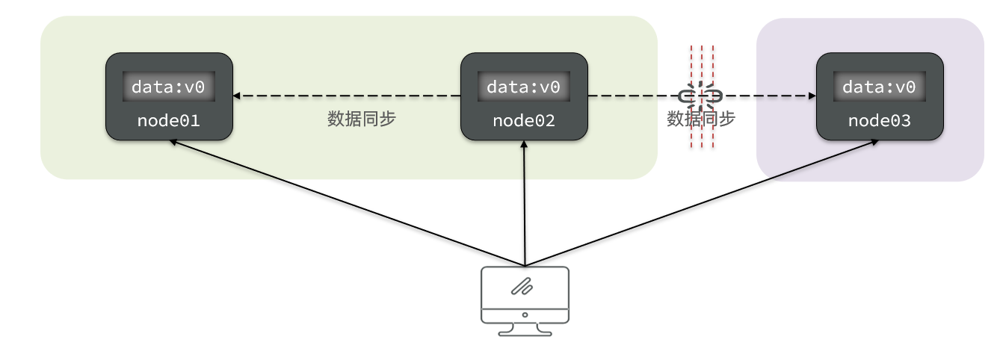](https://cdn.xn2001.com/img/2022/202205231506703.png)


在分布式系统中，系统间的网络不能 100% 保证健康，一定会有故障的时候，而服务有必须对外保证服务。**因此 Partition Tolerance 不可避免。**当节点接收到新的数据变更时，就会出现问题了。

[](https://cdn.xn2001.com/img/2022/202205231506722.png)


如果此时要保证**一致性**，就必须等待网络恢复，完成数据同步后，整个集群才对外提供服务，服务处于阻塞状态，不可用。

如果此时要保证**可用性**，就不能等待网络恢复，那 node01、node02 与 node03 之间就会出现数据不一致。

也就是说，在 P 一定会出现的情况下，A 和 C 之间只能实现一个。

### BASE理论

BASE理论就是对问题的调和

BASE 理论是对 CAP 的一种解决思路，包含三个思想：

- **Basically Available** **（基本可用）**：分布式系统在出现故障时，允许损失部分可用性，即保证核心可用。
- **Soft State（软状态）**：在一定时间内，允许出现中间状态，比如临时的不一致状态。
- **Eventually Consistent（最终一致性）**：虽然无法保证强一致性，但是在软状态结束后，最终达到数据一致。

分布式事务最大的问题是各个子事务的一致性问题，因此可以借鉴 CAP定理 和 BASE理论，有两种解决思路

- AP 模式：各子事务分别执行和提交，允许出现结果不一致，然后采用弥补措施恢复数据即可，实现最终一致。
- CP 模式：各个子事务执行后互相等待，同时提交，同时回滚，达成强一致。但事务等待过程中，处于弱可用状态。

> 前面我们所学的 Elasticsearch 集群就是 CP 模式，保证了数据的一致性。

解决分布式事务，各个子系统之间必须能感知彼此的事务状态，才能保证状态一致，因此需要一个事务协调者来协调每一个事务的参与者，也就是需要一个事务协调者。（TC）

一个全局事务中往往包含着多个分支事务

另外，这里的子系统事务，称为**分支事务**；有关联的各个**分支事务**在一起称为**全局事务**。

[](https://cdn.xn2001.com/img/2022/202205231506031.png)


## 部署Seata

Seata 是一款开源的分布式事务解决方案，致力于提供高性能和简单易用的分布式事务服务。Seata 将为用户提供了 AT、TCC、SAGA 和 XA 事务模式，为用户打造一站式的分布式解决方案。

官网地址：http://seata.io/，其中的文档、播客中提供了大量的使用说明、源码分析。

[](https://cdn.xn2001.com/img/2022/202205231707983.png)


### Seata的架构

Seata 事务管理中有三个重要的角色

- **TC (Transaction Coordinator) -** **事务协调者**：维护全局和分支事务的状态，协调全局事务提交或回滚。
- **TM (Transaction Manager) -** **事务管理器**：定义全局事务的范围、开始全局事务、提交或回滚全局事务。
- **RM (Resource Manager) -** **资源管理器**：管理分支事务处理的资源，与 TC 交谈以注册分支事务和报告分支事务的状态，并驱动分支事务提交或回滚。

[](https://cdn.xn2001.com/img/2022/202205231704030.png)


Seata 基于上述架构提供了四种不同的分布式事务解决方案

- XA 模式：强一致性分阶段事务模式，牺牲了一定的可用性，无业务侵入
- TCC 模式：最终一致的分阶段事务模式，有业务侵入
- AT 模式：最终一致的分阶段事务模式，无业务侵入，也是 Seata 的默认模式
- SAGA 模式：长事务模式，有业务侵入

无论哪种方案，都离不开 TC，也就是事务的协调者。

[](https://cdn.xn2001.com/img/2022/202205232202909.png)


### 部署TC服务

下载 seata-server 包，https://seata.io/zh-cn/blog/download.html

在非中文目录解压缩，其目录结构如下

[](https://cdn.xn2001.com/img/2022/202205241709346.png)


修改 conf 目录下的 registry.conf 文件

[](https://cdn.xn2001.com/img/2022/202205241709343.png)


```properties
registry {
  # tc服务的注册中心类，这里选择nacos，也可以是eureka、zookeeper等
  type = "nacos"

  nacos {
    # seata tc 服务注册到 nacos的服务名称，可以自定义
    application = "seata-tc-server"
    serverAddr = "127.0.0.1:8848"
    group = "DEFAULT_GROUP"
    namespace = ""
    cluster = "SH"
    username = "nacos"
    password = "nacos"
  }
}

config {
  # 读取tc服务端的配置文件的方式，这里是从nacos配置中心读取，这样如果tc是集群，可以共享配置
  type = "nacos"
  # 配置nacos地址等信息
  nacos {
    serverAddr = "127.0.0.1:8848"
    namespace = ""
    group = "DEFAULT_GROUP"
    username = "nacos"
    password = "nacos"
    dataId = "seataServer.properties"
  }
}
```

为了让 TC 服务的集群可以共享配置，我们选择了 Nacos 作为统一配置中心。因此服务端配置文件 `seataServer.properties` 文件需要在Nacos 中配好。在 Nacos 后台新建一个配置文件：http://localhost:8848/nacos/

[](https://cdn.xn2001.com/img/2022/202205241709375.png)


配置内容如下

> 注意：一定要把注释删掉！并且需要修改你的数据库信息。

```properties
# 数据存储方式，db代表数据库
store.mode=db
store.db.datasource=druid
store.db.dbType=mysql
# 这是MySQL8的驱动，MySQL5使用的是com.mysql.jdbc.Driver
store.db.driverClassName=com.mysql.cj.jdbc.Driver
# 数据库地址、用户名、密码都需要修改成你自己的数据库信息。
store.db.url=jdbc:mysql://127.0.0.1:3306/seata?useSSL=false&useUnicode=true&characterEncoding=utf-8&serverTimezone=GMT%2B8
store.db.user=root
store.db.password=123456
store.db.minConn=5
store.db.maxConn=30
store.db.globalTable=global_table
store.db.branchTable=branch_table
store.db.queryLimit=100
store.db.lockTable=lock_table
store.db.maxWait=5000
# 事务、日志等配置
server.recovery.committingRetryPeriod=1000
server.recovery.asynCommittingRetryPeriod=1000
server.recovery.rollbackingRetryPeriod=1000
server.recovery.timeoutRetryPeriod=1000
server.maxCommitRetryTimeout=-1
server.maxRollbackRetryTimeout=-1
server.rollbackRetryTimeoutUnlockEnable=false
server.undo.logSaveDays=7
server.undo.logDeletePeriod=86400000
# 客户端与服务端传输方式
transport.serialization=seata
transport.compressor=none
# 关闭metrics功能，提高性能
metrics.enabled=false
metrics.registryType=compact
metrics.exporterList=prometheus
metrics.exporterPrometheusPort=9898
```

TC 服务在管理分布式事务时，需要记录事务相关数据到数据库中，你需要提前创建好这些表。新建一个名为 seata 的数据库，运行 SQL

这些表主要记录全局事务、分支事务、全局锁信息。

```mysql
SET NAMES utf8mb4;
SET FOREIGN_KEY_CHECKS = 0;

-- ----------------------------
-- Table structure for branch_table
-- ----------------------------
DROP TABLE IF EXISTS `branch_table`;
CREATE TABLE `branch_table`  (
  `branch_id` bigint(20) NOT NULL,
  `xid` varchar(128) CHARACTER SET utf8 COLLATE utf8_general_ci NOT NULL,
  `transaction_id` bigint(20) NULL DEFAULT NULL,
  `resource_group_id` varchar(32) CHARACTER SET utf8 COLLATE utf8_general_ci NULL DEFAULT NULL,
  `resource_id` varchar(256) CHARACTER SET utf8 COLLATE utf8_general_ci NULL DEFAULT NULL,
  `branch_type` varchar(8) CHARACTER SET utf8 COLLATE utf8_general_ci NULL DEFAULT NULL,
  `status` tinyint(4) NULL DEFAULT NULL,
  `client_id` varchar(64) CHARACTER SET utf8 COLLATE utf8_general_ci NULL DEFAULT NULL,
  `application_data` varchar(2000) CHARACTER SET utf8 COLLATE utf8_general_ci NULL DEFAULT NULL,
  `gmt_create` datetime(6) NULL DEFAULT NULL,
  `gmt_modified` datetime(6) NULL DEFAULT NULL,
  PRIMARY KEY (`branch_id`) USING BTREE,
  INDEX `idx_xid`(`xid`) USING BTREE
) ENGINE = InnoDB CHARACTER SET = utf8 COLLATE = utf8_general_ci ROW_FORMAT = Compact;

-- ----------------------------
-- Records of branch_table
-- ----------------------------

-- ----------------------------
-- Table structure for global_table
-- ----------------------------
DROP TABLE IF EXISTS `global_table`;
CREATE TABLE `global_table`  (
  `xid` varchar(128) CHARACTER SET utf8 COLLATE utf8_general_ci NOT NULL,
  `transaction_id` bigint(20) NULL DEFAULT NULL,
  `status` tinyint(4) NOT NULL,
  `application_id` varchar(32) CHARACTER SET utf8 COLLATE utf8_general_ci NULL DEFAULT NULL,
  `transaction_service_group` varchar(32) CHARACTER SET utf8 COLLATE utf8_general_ci NULL DEFAULT NULL,
  `transaction_name` varchar(128) CHARACTER SET utf8 COLLATE utf8_general_ci NULL DEFAULT NULL,
  `timeout` int(11) NULL DEFAULT NULL,
  `begin_time` bigint(20) NULL DEFAULT NULL,
  `application_data` varchar(2000) CHARACTER SET utf8 COLLATE utf8_general_ci NULL DEFAULT NULL,
  `gmt_create` datetime NULL DEFAULT NULL,
  `gmt_modified` datetime NULL DEFAULT NULL,
  PRIMARY KEY (`xid`) USING BTREE,
  INDEX `idx_gmt_modified_status`(`gmt_modified`, `status`) USING BTREE,
  INDEX `idx_transaction_id`(`transaction_id`) USING BTREE
) ENGINE = InnoDB CHARACTER SET = utf8 COLLATE = utf8_general_ci ROW_FORMAT = Compact;

-- ----------------------------
-- Records of global_table
-- ----------------------------


-- ----------------------------
-- Records of lock_table
-- ----------------------------

SET FOREIGN_KEY_CHECKS = 1;
```

进入 bin 目录，运行其中的 seata-server.bat 即可。

[](https://cdn.xn2001.com/img/2022/202205241709380.png)


启动成功后，打开浏览器，访问 Nacos 地址：http://localhost:8848，然后进入服务列表页面，可以看到 seata-tc-server 的信息。

[](https://cdn.xn2001.com/img/2022/202205241709137.png)


### Seata微服务集成

这个如果想每个服务都有Seata服务，都得配置下面的属性


> 很多人说这里很难，启动老是失败，注意检查好上一步配置是否正确，比如集群是否是 SH，分区是否是 DEFAULT_GROUP，实例名是否是 seata-tc-server

首先，我们需要在微服务中引入 Seata 依赖

```xml
<dependency>
    <groupId>com.alibaba.cloud</groupId>
    <artifactId>spring-cloud-starter-alibaba-seata</artifactId>
    <exclusions>
        <!--版本较低，1.3.0，因此排除-->
        <exclusion>
            <artifactId>seata-spring-boot-starter</artifactId>
            <groupId>io.seata</groupId>
        </exclusion>
    </exclusions>
</dependency>
<!--seata starter 采用1.4.2版本-->
<dependency>
    <groupId>io.seata</groupId>
    <artifactId>seata-spring-boot-starter</artifactId>
    <version>${seata.version}</version>
</dependency>
```

需要修改 application.yml 文件，添加一些配置，例如在 order-service 服务中的 application.yml，配置 TC 服务信息，通过注册中心 Nacos，结合服务名称获取 TC 地址

```yaml
seata:
  registry: # TC服务注册中心的配置，微服务根据这些信息去注册中心获取tc服务地址
    type: nacos # 注册中心类型 nacos
    nacos:
      server-addr: 127.0.0.1:8848 # nacos地址
      namespace: "" # namespace，默认为空
      group: DEFAULT_GROUP # 分组，默认是DEFAULT_GROUP
      application: seata-tc-server # seata服务名称
      username: nacos
      password: nacos
  tx-service-group: seata-demo # 事务组名称
  service:
    vgroup-mapping: # 事务组与cluster的映射关系
      seata-demo: SH
```

微服务如何根据这些配置寻找 TC 地址的，我们知道注册到 Nacos 中的微服务，确定一个具体实例需要四个信息，`namespace+group+application+cluster`

- namespace：命名空间，为空就是默认的 public
- group：分组
- application：服务名
- cluster：集群名

以上四个信息，在刚才的 yml 文件中都能找到。

[](https://cdn.xn2001.com/img/2022/202205241726339.png)


结合起来，TC 服务的信息就是：`public@DEFAULT_GROUP@seata-tc-server@SH`，这样就能确定 TC 服务集群了。然后就可以去 Nacos拉取对应的实例信息。

启动微服务后，Seata 控制台会显示连接上的服务。

[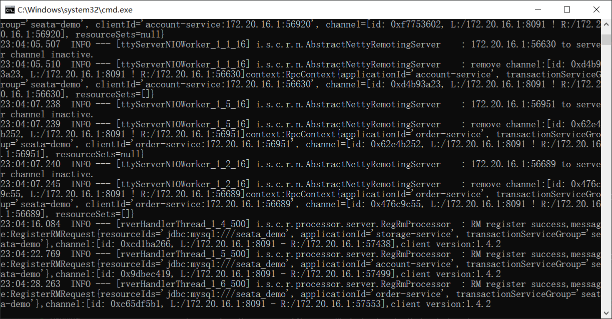](https://cdn.xn2001.com/img/2022/202205242305852.png)


### TC服务异地容灾

1.模拟异地容灾的 TC 集群

计划启动两台 Seata 的 TC 服务节点

| 节点名称 | ip地址    | 端口号 | 集群名称 |
| :------- | :-------- | :----- | :------- |
| seata    | 127.0.0.1 | 8091   | SH       |
| seata2   | 127.0.0.1 | 8092   | HZ       |

之前我们已经启动了一台 seata 服务，端口是 8091，集群名为 SH。

现在，将 seata 目录复制一份，起名为 seata2

修改 seata2/conf/registry.conf 内容如下

```nginx
registry {
  # tc服务的注册中心类，这里选择nacos，也可以是eureka、zookeeper等
  type = "nacos"

  nacos {
    # seata tc 服务注册到 nacos的服务名称，可以自定义
    application = "seata-tc-server"
    serverAddr = "127.0.0.1:8848"
    group = "DEFAULT_GROUP"
    namespace = ""
    cluster = "HZ"
    username = "nacos"
    password = "nacos"
  }
}

config {
  # 读取tc服务端的配置文件的方式，这里是从nacos配置中心读取，这样如果tc是集群，可以共享配置
  type = "nacos"
  # 配置nacos地址等信息
  nacos {
    serverAddr = "127.0.0.1:8848"
    namespace = ""
    group = "SEATA_GROUP"
    username = "nacos"
    password = "nacos"
    dataId = "seataServer.properties"
  }
}
```

进入 seata2/bin 目录，然后运行命令

```powershell
seata-server.bat -p 8092
```

打开 nacos 控制台，查看服务列表

[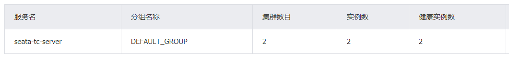](https://cdn.xn2001.com/img/2022/202205241709152.png)


[](https://cdn.xn2001.com/img/2022/202205241709154.png)


2.将事务组映射配置到 nacos

接下来，我们需要将 tx-service-group 与 cluster 的映射关系都配置到 Nacos 配置中心。

新建一个配置

[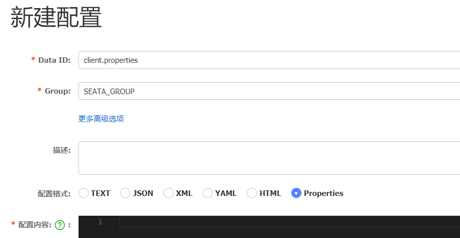](https://cdn.xn2001.com/img/2022/202205241709167.png)


配置的内容如下

```properties
# 事务组映射关系
service.vgroupMapping.seata-demo=SH
service.enableDegrade=false
service.disableGlobalTransaction=false
# 与TC服务的通信配置
transport.type=TCP
transport.server=NIO
transport.heartbeat=true
transport.enableClientBatchSendRequest=false
transport.threadFactory.bossThreadPrefix=NettyBoss
transport.threadFactory.workerThreadPrefix=NettyServerNIOWorker
transport.threadFactory.serverExecutorThreadPrefix=NettyServerBizHandler
transport.threadFactory.shareBossWorker=false
transport.threadFactory.clientSelectorThreadPrefix=NettyClientSelector
transport.threadFactory.clientSelectorThreadSize=1
transport.threadFactory.clientWorkerThreadPrefix=NettyClientWorkerThread
transport.threadFactory.bossThreadSize=1
transport.threadFactory.workerThreadSize=default
transport.shutdown.wait=3
# RM配置
client.rm.asyncCommitBufferLimit=10000
client.rm.lock.retryInterval=10
client.rm.lock.retryTimes=30
client.rm.lock.retryPolicyBranchRollbackOnConflict=true
client.rm.reportRetryCount=5
client.rm.tableMetaCheckEnable=false
client.rm.tableMetaCheckerInterval=60000
client.rm.sqlParserType=druid
client.rm.reportSuccessEnable=false
client.rm.sagaBranchRegisterEnable=false
# TM配置
client.tm.commitRetryCount=5
client.tm.rollbackRetryCount=5
client.tm.defaultGlobalTransactionTimeout=60000
client.tm.degradeCheck=false
client.tm.degradeCheckAllowTimes=10
client.tm.degradeCheckPeriod=2000

# undo日志配置
client.undo.dataValidation=true
client.undo.logSerialization=jackson
client.undo.onlyCareUpdateColumns=true
client.undo.logTable=undo_log
client.undo.compress.enable=true
client.undo.compress.type=zip
client.undo.compress.threshold=64k
client.log.exceptionRate=100
```

3.微服务读取nacos配置

接下来，需要修改每一个微服务的 application.yml 文件，让微服务读取 Nacos 中的 client.properties 文件

```yaml
seata:
  config:
    type: nacos
    nacos:
      server-addr: 127.0.0.1:8848
      username: nacos
      password: nacos
      group: SEATA_GROUP
      data-id: client.properties
```

重启微服务，现在微服务到底是连接 TC 的 SH 集群，还是 TC 的 HZ 集群，都统一由 Nacos 的 client.properties 来决定了。

大体先了解这么多，具体参考官方文档学习：https://seata.io/zh-cn/docs/overview/what-is-seata.html

## XA模式

XA 规范 是 X/Open 组织定义的分布式事务处理（DTP，Distributed Transaction Processing）标准，XA 规范描述了全局的 TM 与局部的 RM 之间的接口，几乎所有主流的数据库都对 XA 规范提供了支持。

XA 是规范，目前主流数据库都实现了这种规范，实现的原理都是**基于两阶段提交**。

正常情况：

[](https://cdn.xn2001.com/img/2022/202205242231750.png)


异常情况：

（注意是只通知执行过并且执行成功的程序进行回滚）

[](https://cdn.xn2001.com/img/2022/202205242231755.png)


一阶段：

1.事务协调者通知每个事物参与者执行本地事务

2.本地事务执行完成后报告事务执行状态给事务协调者，此时事务不提交，继续持有数据库锁

二阶段：

- 事务协调者基于一阶段的报告来判断下一步操作
  - 如果一阶段都成功，则通知所有事务参与者，提交事务
  - 如果一阶段任意一个参与者失败，则通知所有事务参与者回滚事务

Seata 对原始的 XA 模式做了简单的封装和改造，以适应自己的事务模型，基本架构如下图

[](https://cdn.xn2001.com/img/2022/202205242231760.png)


RM 一阶段的工作：

① 注册分支事务到TC

② 执行分支业务 SQL 但不提交

③ 报告执行状态到 TC

TC 二阶段的工作：

- TC 检测各分支事务执行状态

  a.如果都成功，通知所有 RM 提交事务

  b.如果有失败，通知所有 RM 回滚事务

RM 二阶段的工作：

- 接收 TC 指令，提交或回滚事务

### 优缺点

XA 模式的优点是什么？

- 事务的强一致性，满足 ACID 原则。
- 常用数据库都支持，实现简单，并且没有代码侵入。

XA 模式的缺点是什么？

- 因为一阶段需要锁定数据库资源，等待二阶段结束才释放，性能较差。
- 依赖关系型数据库实现事务。

### 实现XA模式

Seata 的 starter 已经完成了 XA 模式的自动装配，实现非常简单，步骤如下

1）修改每一个微服务的 application.yml 文件（每个参与事务的微服务），开启XA模式：

```yaml
seata:
  data-source-proxy-mode: XA
```

2）给发起全局事务的入口方法添加 `@GlobalTransactional` 注解

本例中是 OrderServiceImpl 中的 create 方法.

[](https://cdn.xn2001.com/img/2022/202205242231783.png)


3）重启服务并测试

重启 order-service，再次测试，发现无论怎样异常情况，三个微服务都能成功回滚。

## AT模式

AT 模式同样是分阶段提交的事务模型，不过缺弥补了XA模型中资源锁定周期过长的缺陷。

基本流程图：

[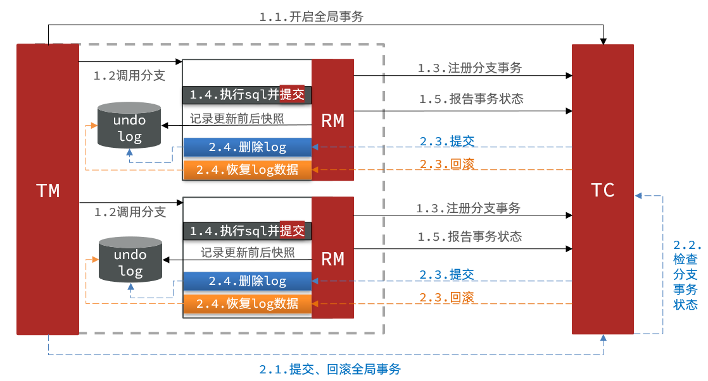](https://cdn.xn2001.com/img/2022/202205242258121.png)


阶段一 RM 的工作：

- 注册分支事务
- **记录 undo-log（数据快照）**
- **执行业务 SQL 并提交事务**
- 报告事务状态

阶段二提交时 RM 的工作：

- 删除 undo-log 即可

阶段二回滚时 RM 的工作：

- 根据 undo-log 恢复数据到更新前

### 流程梳理

我们用一个真实的业务来梳理下 AT 模式的原理。

比如，现在有一个数据库表，记录用户余额

| **id** | **money** |
| :----- | :-------- |
| 1      | 100       |

其中一个分支业务要执行的 SQL 为

```sql
update tb_account set money = money - 10 where id = 1
```

AT模式下，当前分支事务执行流程如下：

一阶段：

1）TM 发起并注册全局事务到 TC

2）TM 调用分支事务

3）分支事务准备执行业务 SQL

4）RM 拦截业务 SQL，根据 where 条件查询原始数据，形成快照。

```json
{
    "id": 1, "money": 100
}
```

5）RM 执行业务 SQL，提交本地事务，释放数据库锁。此时 `money = 90`

6）RM 报告本地事务状态给 TC

二阶段：

1）TM 通知 TC 事务结束

2）TC 检查分支事务状态。如果都成功，则立即删除快照；如果有分支事务失败，需要回滚。读取快照数据`{"id": 1, "money": 100}`，将快照恢复到数据库。此时数据库再次恢复为 100。

[](https://cdn.xn2001.com/img/2022/202205242258118.png)


### AT与XA的区别

简述 AT 模式与 XA 模式最大的区别是什么？

- XA 模式一阶段不提交事务，锁定资源；AT 模式一阶段直接提交，不锁定资源。
- XA 模式依赖数据库机制实现回滚；AT 模式利用数据快照实现数据回滚。
- XA 模式强一致；AT 模式最终一致。

### 脏写问题

> 注意：此处脏写是在多线程环境下的问题

在**多线程并发**访问 AT 模式的分布式事务时，有可能出现脏写问题。如图，当事务 1 因为某些原因要恢复快照时，另一个线程的事务 2 白更新了一次数据，出现了脏写问题。

[](https://cdn.xn2001.com/img/2022/202205242258122.png)


解决思路就是引入了全局锁的概念。在提交事务之前，先去拿全局锁，避免同一时刻有另外一个事务在操作当前数据，拿不到全局锁超过一定时间则回滚。如图，这样一来事务 2 就更新失败了，此时事务 1 恢复数据不会给另一个线程事务 2 造成改了又没改的离谱现象。

[](https://cdn.xn2001.com/img/2022/202205242258136.png)


### 优缺点

AT 模式的优点：

- 一阶段完成直接提交事务，释放数据库资源，性能比较好
- 利用全局锁实现读写隔离
- 没有代码侵入，框架自动完成回滚和提交

AT 模式的缺点：

- 两阶段之间属于软状态，属于最终一致
- 框架的快照功能会影响性能，但比XA模式要好很多

### 实现AT模式

AT 模式中的快照生成、回滚等动作都是由框架自动完成，没有任何代码侵入，因此实现非常简单。

只不过，AT模式需要一个表来记录全局锁、另一张表来记录数据快照 undo_log

1）导入数据库表，记录全局锁

lock_table 表导入到 TC 服务关联的数据库，我这里的 TC 服务数据库是 seata

```sql
-- ----------------------------
-- Table structure for lock_table
-- ----------------------------
DROP TABLE IF EXISTS `lock_table`;
CREATE TABLE `lock_table`  (
  `row_key` varchar(128) CHARACTER SET utf8 COLLATE utf8_general_ci NOT NULL,
  `xid` varchar(96) CHARACTER SET utf8 COLLATE utf8_general_ci NULL DEFAULT NULL,
  `transaction_id` bigint(20) NULL DEFAULT NULL,
  `branch_id` bigint(20) NOT NULL,
  `resource_id` varchar(256) CHARACTER SET utf8 COLLATE utf8_general_ci NULL DEFAULT NULL,
  `table_name` varchar(32) CHARACTER SET utf8 COLLATE utf8_general_ci NULL DEFAULT NULL,
  `pk` varchar(36) CHARACTER SET utf8 COLLATE utf8_general_ci NULL DEFAULT NULL,
  `gmt_create` datetime NULL DEFAULT NULL,
  `gmt_modified` datetime NULL DEFAULT NULL,
  PRIMARY KEY (`row_key`) USING BTREE,
  INDEX `idx_branch_id`(`branch_id`) USING BTREE
) ENGINE = InnoDB CHARACTER SET = utf8 COLLATE = utf8_general_ci ROW_FORMAT = Compact;
```

undo_log 表导入到微服务关联的数据库，我这里的微服务数据库是 seata_demo

```sql
-- ----------------------------
-- Table structure for undo_log
-- ----------------------------
DROP TABLE IF EXISTS `undo_log`;
CREATE TABLE `undo_log`  (
  `branch_id` bigint(20) NOT NULL COMMENT 'branch transaction id',
  `xid` varchar(100) CHARACTER SET utf8 COLLATE utf8_general_ci NOT NULL COMMENT 'global transaction id',
  `context` varchar(128) CHARACTER SET utf8 COLLATE utf8_general_ci NOT NULL COMMENT 'undo_log context,such as serialization',
  `rollback_info` longblob NOT NULL COMMENT 'rollback info',
  `log_status` int(11) NOT NULL COMMENT '0:normal status,1:defense status',
  `log_created` datetime(6) NOT NULL COMMENT 'create datetime',
  `log_modified` datetime(6) NOT NULL COMMENT 'modify datetime',
  UNIQUE INDEX `ux_undo_log`(`xid`, `branch_id`) USING BTREE
) ENGINE = InnoDB CHARACTER SET = utf8 COLLATE = utf8_general_ci COMMENT = 'AT transaction mode undo table' ROW_FORMAT = Compact;
```

2）修改 application.yml 文件，将事务模式修改为 AT 模式即可。

```yaml
seata:
  data-source-proxy-mode: AT # 默认就是AT
```

3）重启服务并测试。

## TCC模式

TCC 模式与 AT 模式非常相似，每阶段都是独立事务，不同的是 TCC 模式通过人工编码来实现数据恢复。需要实现三个方法：

- Try：资源的检测和预留；
- Confirm：完成资源操作业务；要求 Try 成功 Confirm 一定要能成功。
- Cancel：预留资源释放，可以理解为 try 的反向操作。

例如，一个扣减用户余额的业务。假设账户 A 原来余额是 100，需要余额扣减 30 元。

**阶段一（ Try ）**：检查余额是否充足，如果充足则冻结金额增加 30 元，可用余额扣除 30

初始余额

[](https://cdn.xn2001.com/img/2022/202205261907452.png)


余额充足，可以冻结

[](https://cdn.xn2001.com/img/2022/202205261907455.png)


此时，总金额 = 冻结金额 + 可用金额，数量依然是 100 不变。事务直接提交无需等待其它事务。

**阶段二（Confirm)**：假如要提交（Confirm），则冻结金额扣减 30

确认可以提交，不过之前可用金额已经扣减过了，这里只要清除冻结金额就好了

[](https://cdn.xn2001.com/img/2022/202205261907456.png)


此时，总金额 = 冻结金额 + 可用金额 = 0 + 70 = 70元

**阶段二(Canncel)**：如果要回滚（Cancel），则冻结金额扣减 30，可用余额增加 30

需要回滚，那么就要释放冻结金额，恢复可用金额

[](https://cdn.xn2001.com/img/2022/202205261907454.png)


Seata 中的 TCC 模型依然延续之前的事务架构，如图：

[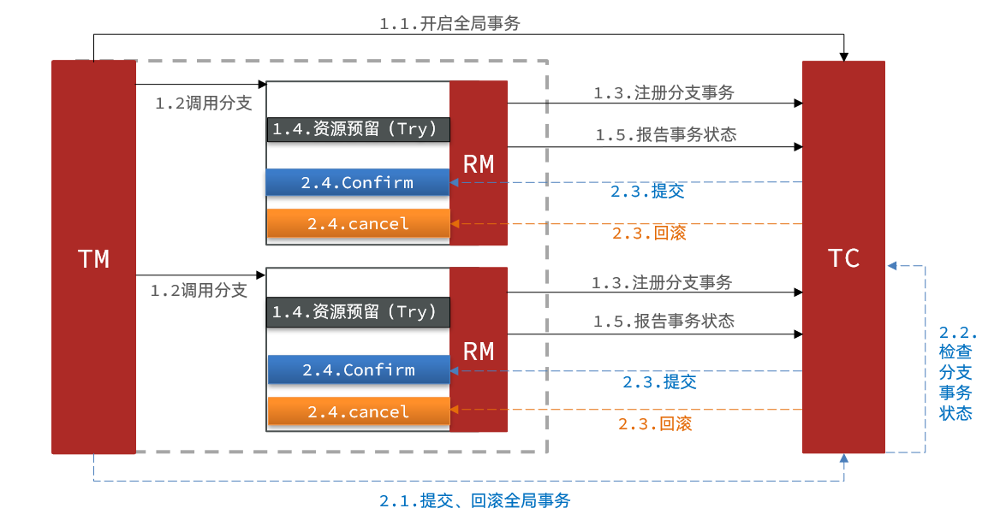](https://cdn.xn2001.com/img/2022/202205261907469.png)


### 优缺点

TCC 模式的每个阶段是做什么的？

- Try：资源检查和预留
- Confirm：业务执行和提交
- Cancel：预留资源的释放

TCC 的优点是什么？

- 一阶段完成直接提交事务，释放数据库资源，性能好
- 相比 AT 模型，无需生成快照，无需使用全局锁，性能最强
- 不依赖数据库事务，而是依赖补偿操作，可以用于非事务型数据库

TCC 的缺点是什么？

- 有代码侵入，需要人为编写 try、Confirm 和 Cancel 接口，太麻烦
- 软状态，事务是最终一致
- 需要考虑 Confirm 和 Cancel 的失败情况，做好幂等处理

### 空回滚

当某分支事务的 try 阶段**阻塞**时，可能导致全局事务超时而触发二阶段的 cancel 操作。在未执行 try 操作时先执行了 cancel 操作，这时cancel 不能做回滚，就是**空回滚**。执行 cancel 操作时，应当判断 try 是否已经执行，如果尚未执行，则应该空回滚。

[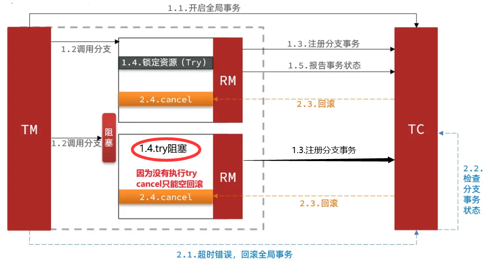](https://cdn.xn2001.com/img/2022/202205261921656.png)


### 业务悬挂

空回滚后出现的一个新问题：对于已经空回滚的业务，之前被阻塞的 try 操作恢复，继续执行 try，可此时整个业务都已经结束了，难道我们可以让他再去走 confirm 或 cancel 吗，显然不行。因此事务一直处于中间状态，这就是**业务悬挂**，我们应当去避免这种情况。所以执行 try 操作时，应当判断 cancel 是否已经执行过了，如果已经执行，**应当阻止空回滚后的 try 操作，避免悬挂。**

### 实现TCC模式

#### 设计数据表

实现 TCC 模式我们都知道要去记录冻结状态，所以这就需要一个数据表。

xid：是全局事务 id

freeze_money：用来记录用户冻结金额

state：用来记录事务状态

```sql
CREATE TABLE `account_freeze_tbl` (
  `xid` varchar(128) NOT NULL,
  `user_id` varchar(255) DEFAULT NULL COMMENT '用户id',
  `freeze_money` int(11) unsigned DEFAULT '0' COMMENT '冻结金额',
  `state` int(1) DEFAULT NULL COMMENT '事务状态，0:try，1:confirm，2:cancel',
  PRIMARY KEY (`xid`) USING BTREE
) ENGINE=InnoDB DEFAULT CHARSET=utf8 ROW_FORMAT=COMPACT;
```

- Try 业务
  - 记录冻结金额和事务状态到 account_freeze 表
  - 扣减 account 表可用金额
- Confirm 业务
  - 根据 xid 删除 account_freeze 表的冻结记录
- Cancel 业务
  - 修改 account_freeze 表，冻结金额为 0，state 为 2
  - 修改 account 表，恢复可用金额
- 如何判断是否空回滚
  - cancel 业务中，根据 xid 查询 account_freeze，如果为 null 则说明 try 还没做，需要空回滚
- 如何避免业务悬挂
  - try 业务中，根据 xid 查询 account_freeze，如果已经存在则证明 Cancel 已经执行，拒绝执行 try 业务

接下来，我们根据实际业务修改 account-service，利用 TCC 实现余额扣减功能。

#### 声明TCC接口

> Seata 全局事务的 id 可以通过 `RootContext.getXID();` 获取，
>
> 也可以通过 BusinessActionContext 参数的 getXid() 方法获取。

TCC 的 Try、Confirm、Cancel 方法都需要在接口中基于注解来声明，首先是接口上要用 `@LocalTCC`，try 逻辑方法用注解`@TwoPhaseBusinessAction(name="try 方法名", commitMethod="confirm 方法名", rollbackMethod="cancel 方法名") `注明 ，在该方法参数上加入 `@BusinessActionContextParameter(paramName="try 方法的参数")`，可以使得该参数传入 `BusinessActionContext` 类，便于 confirm 和 cancel 读取。

[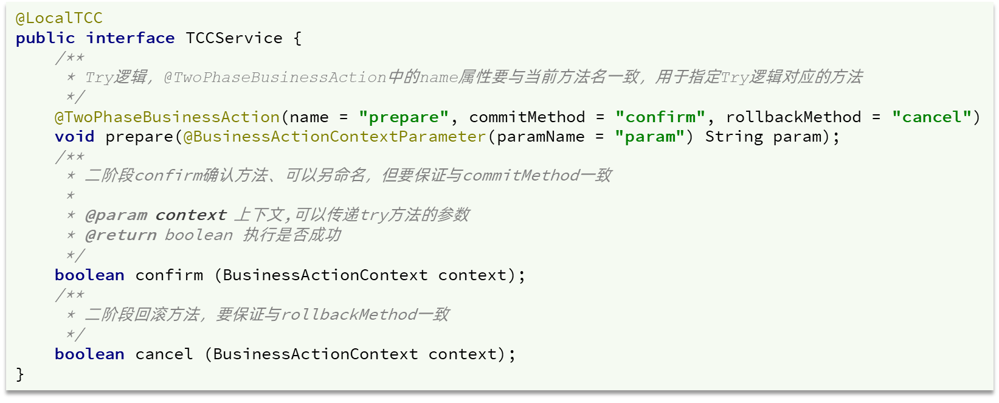](https://cdn.xn2001.com/img/2022/202205281606688.png)


我们在 account-service 项目中的 service 包中新建一个接口，声明 TCC 三个接口。

```java
@LocalTCC
public interface AccountTCCService {

    @TwoPhaseBusinessAction(name = "deduct", commitMethod = "confirm", rollbackMethod = "cancel")
    void deduct(@BusinessActionContextParameter(paramName = "userId") String userId,
                @BusinessActionContextParameter(paramName = "money")int money);

    boolean confirm(BusinessActionContext ctx);

    boolean cancel(BusinessActionContext ctx);
}
```

#### 编写实现类

在 account-service 服务中的 service.impl 包下新建一个类，实现 TCC 业务

```java
@Service
@Slf4j
public class AccountTCCServiceImpl implements AccountTCCService {
    @Autowired
    private AccountMapper accountMapper;
    @Autowired
    private AccountFreezeMapper freezeMapper;

    @Override
    @Transactional
    public void deduct(String userId, int money) {
        // 0.获取事务id
        String xid = RootContext.getXID();
        // 处理业务悬挂
        if (freezeMapper.selectById(xid) != null) {
            return;
        }
        // 1.扣减可用余额
        accountMapper.deduct(userId, money);
        // 2.记录冻结金额，事务状态
        AccountFreeze freeze = new AccountFreeze();
        freeze.setUserId(userId);
        freeze.setFreezeMoney(money);
        freeze.setState(AccountFreeze.State.TRY);
        freeze.setXid(xid);
        freezeMapper.insert(freeze);
    }

    @Override
    public boolean confirm(BusinessActionContext ctx) {
        // 1.获取事务id
        String xid = ctx.getXid();
        // 2.根据id删除冻结记录
        int count = freezeMapper.deleteById(xid);
        return count == 1;
    }

    @Override
    public boolean cancel(BusinessActionContext ctx) {
        // 0.查询冻结记录
        String xid = ctx.getXid();
        AccountFreeze freeze = freezeMapper.selectById(xid);
        // 处理空回滚
        if (freeze == null) {
            //空回滚
            freeze = new AccountFreeze();
            String userId = ctx.getActionContext("userId").toString();
            freeze.setUserId(userId);
            freeze.setFreezeMoney(0);
            freeze.setState(AccountFreeze.State.CANCEL);
            freeze.setXid(xid);
            freezeMapper.insert(freeze);
            return true;
        }
        // 幂等判断
        if(freeze.getState() == AccountFreeze.State.CANCEL){
            // 已经处理过了cancel，无需重复
            return true;
        }
        // 1.恢复可用余额
        accountMapper.refund(freeze.getUserId(), freeze.getFreezeMoney());
        // 2.将冻结金额清零，状态改为CANCEL
        freeze.setFreezeMoney(0);
        freeze.setState(AccountFreeze.State.CANCEL);
        int count = freezeMapper.updateById(freeze);
        return count == 1;
    }
}
```

## SAGA模式

Saga 模式是 Seata 即将开源的长事务解决方案，将由蚂蚁金服主要贡献。Seata 官网对于 Saga 的指南：https://seata.io/zh-cn/docs/user/saga.html

分布式事务执行过程中，依次执行各参与者的正向操作，如果所有正向操作均执行成功，那么分布式事务提交。如果任意一个正向操作执行失败，那么分布式事务会去退回去执行前面各参与者的逆向回滚操作，回滚已提交的参与者，使分布式事务回到初始状态。

[](https://cdn.xn2001.com/img/2022/202205281708899.png)


Saga 模式也分为两个阶段

- 一阶段：直接提交本地事务
- 二阶段：成功则什么都不做；失败则通过编写补偿业务来回滚

### 优缺点

优点：

- 事务参与者可以基于事件驱动实现异步调用，吞吐高
- 一阶段直接提交事务，无锁，性能好
- 不用编写 TCC 中的三个阶段，实现简单

缺点：

- 软状态持续时间不确定，时效性差
- 没有锁，没有事务隔离，会有脏写

# Redis分布式缓存

单机的 Redis 存在以下四大问题，我们将学着去解决。

[](https://cdn.xn2001.com/img/2022/202206142215082.png)


## Redis持久化

Redis持久化分为两种：

- RDB 持久化
- AOF 持久化

### RDB持久化

RDB 全称 Redis Database Backup file（Redis数据备份文件），也被叫做 Redis 数据快照。简单来说就是把内存中的所有数据都记录到磁盘中。当 Redis 实例故障重启后，从磁盘读取快照文件，恢复数据。快照文件称为 RDB 文件，**默认是保存在当前运行目录。**

RDB 持久化在四种情况下会执行

- 执行 save 命令
- 执行 bgsave 命令
- Redis 停机时
- 触发 RDB 条件时

**save 命令**

执行下面的命令，可以立即执行一次 RDB

[](https://cdn.xn2001.com/img/2022/202206142216902.png)


save 命令会导致**主进程**执行 RDB，这个过程中**其它所有命令都会被阻塞**。只有在数据迁移时可能用到。

**bgsave 命令**

这种方法比较适合在运行的过程中使用

下面的命令可以**异步**执行 RDB

[](https://cdn.xn2001.com/img/2022/202206142216906.png)

这个命令执行后会开启独立进程完成 RDB，主进程可以持续处理用户请求，不受影响。

**停机时**

Redis 停机时会执行一次 save 命令，实现 RDB 持久化。

**自动触发 RDB 条件**

Redis 内部有触发 RDB 的机制，可以在 redis.conf 文件中找到，格式如下：

```properties
# 900秒内，如果至少有1个key被修改，则执行bgsave
# save "" 则表示禁用RDB
save 900 1  


#举例，可以理解一下
save 300 10  
save 60 10000 
```

RDB 的其它配置也可以在 redis.conf 文件中设置

```properties
# 是否压缩 ,建议不开启，压缩也会消耗cpu，磁盘的话不值钱
rdbcompression yes
# RDB文件名称
dbfilename dump.rdb  
# 文件保存的路径目录
dir ./ 
```

bgsave 开始时会 **fork** 主进程得到子进程，子进程共享主进程的内存数据。完成 fork 后读取内存数据并写入 RDB 文件。

fork 采用的是 copy-on-write 技术：当主进程执行读操作时，访问共享内存；当主进程执行写操作时，则会拷贝一份数据，执行写操作。

[](https://cdn.xn2001.com/img/2022/202206142216920.png)


RDB 方式 bgsave 的基本流程？

- fork主进程得到一个子进程，共享内存空间
- 子进程读取内存数据并写入新 的RDB 文件
- 用新 RDB 文件替换旧的 RDB 文件

RDB 会在什么时候自动执行？save 60 1000代表什么含义？

- 默认是服务停止时
- 代表 60s 内至少执行 1000 次修改则触发 RDB

RDB 的缺点？

- RDB 执行间隔时间长，两次 RDB 之间写入数据有丢失的风险
- fork 子进程、压缩、写出 RDB 文件都比较耗时

### AOF持久化

AOF 全称为 Append Only File（追加文件），Redis 处理的每一个写命令都会记录在 AOF 文件，可以看做是命令日志文件。

[](https://cdn.xn2001.com/img/2022/202206142216922.png)


AOF 默认是关闭的，需要修改 redis.conf 配置文件来开启 AOF

```properties
# 是否开启AOF功能，默认是no
appendonly yes
# AOF文件的名称
appendfilename "appendonly.aof"
```

AOF 的命令记录的频率也可以通过 redis.conf 文件来配

**下面三种方法放开一种就可以了**

```properties
# 表示每执行一次写命令，立即记录到AOF文件
appendfsync always 
# 写命令执行完先放入AOF缓冲区，然后表示每隔1秒将缓冲区数据写到AOF文件，是默认方案
appendfsync everysec 
# 写命令执行完先放入AOF缓冲区，由操作系统决定何时将缓冲区内容写回磁盘
appendfsync no
```

三种策略对比

[](https://cdn.xn2001.com/img/2022/202206142216924.png)


**AOF文件重写**

因为是记录命令，AOF 文件会比 RDB 文件大的多。而且 AOF **会记录对同一个 key 的多次**写操作，但只有最后一次写操作才有意义。通过执行 bgrewriteaof 命令，可以让 AOF 文件执行重写功能，用最少的命令达到相同效果。

[](https://cdn.xn2001.com/img/2022/202206142216934.png)


如图，AOF 原本有三个命令，但是这三个都是对 num 的操作，第二次会覆盖第一次的值，因此第一个命令记录下来没有意义。

所以重写命令后，AOF文件内容就是：`mset name jack num 666`

1. 可以自己手动触发这个命令

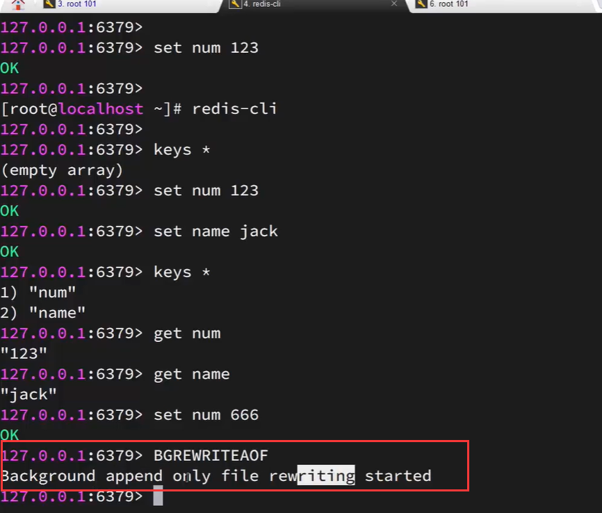

2. Redis 也会在触发阈值时自动去重写 AOF 文件。阈值也可以在 redis.conf 中配置

```properties
# AOF文件比上次文件 增长超过多少百分比则触发重写
auto-aof-rewrite-percentage 100
# AOF文件体积最小多大以上才触发重写 
auto-aof-rewrite-min-size 64mb 
```


### RDB和AOF对比

RDB 和 AOF 各有自己的优缺点，如果对数据安全性要求较高，在实际开发中往往会结合两者来使用。

[](https://cdn.xn2001.com/img/2022/202206142216414.png)


Redis 支持同时开启 RDB 和 AOF，在这种情况下当 Redis 重启的时候会优先载入 AOF 文件来恢复原始的数据，因为在通常情况下 AOF 文件保存的数据集要比 RDB 文件保存的数据集完整。

## Redis主从复制

单节点 Redis 的并发能力是有上限的，要进一步提高 Redis 的并发能力，就需要搭建主从集群，实现读写分离。

[](https://cdn.xn2001.com/img/2022/202206142243954.png)


### 搭建主从

> 跳过部署三个 Redis，很简单。

共包含三个节点，一个主节点，两个从节点。

这里我们在同一台虚拟机中开启 3 个 Redis 实例，模拟主从集群，信息如下：

|       IP        | PORT |  角色  |
| :-------------: | :--: | :----: |
| 192.168.150.101 | 7001 | master |
| 192.168.150.101 | 7002 | slave  |
| 192.168.150.101 | 7003 | slave  |

为了方便查看日志，我们打开 3 个 ssh 窗口，分别启动 Redis 实例，启动命令：

```sh
# 第1个
redis-server 7001/redis.conf
# 第2个
redis-server 7002/redis.conf
# 第3个
redis-server 7003/redis.conf
```

[](https://cdn.xn2001.com/img/2022/202206150213482.png)


如果要一键停止，可以运行下面命令：

```sh
printf '%s\n' 7001 7002 7003 | xargs -I{} -t redis-cli -p {} shutdown
```


**开启主从关系**

现在三个实例还没有任何关系，要配置主从可以使用 `replicaof` 或者 `slaveof`（5.0以前）命令。

有临时和永久两种模式：

1.修改配置文件（永久生效）

在 redis.conf 中添加一行配置：`slaveof <masterip> <masterport>`


2.使用 redis-cli 客户端连接到redis服务，执行slaveof命令（重启后失效）

```
slaveof <masterip> <masterport>
```

> 在 5.0 以后新增命令 replicaof，与 salveof 效果一致。

这里我们为了演示方便，使用方式二。通过 redis-cli 命令连接 7002，执行下面命令

```sh
# 连接 7002
redis-cli -p 7002
# 执行slaveof
slaveof 192.168.150.101 7001
```

通过 redis-cli 命令连接 7003，执行下面命令

```sh
# 连接 7003
redis-cli -p 7003
# 执行slaveof
slaveof 192.168.150.101 7001
```

然后连接 7001 节点，查看集群状态：

```sh
# 连接 7001
redis-cli -p 7001
# 查看状态
info replication
```

[](https://cdn.xn2001.com/img/2022/202206150213485.png)


执行下列操作以测试

- 利用 redis-cli 连接7001，执行`set num 123`
- 利用 redis-cli 连接7002，执行`get num`，再执行`set num 666`
- 利用 redis-cli 连接7003，执行`get num`，再执行`set num 888`

可以发现，只有在 7001 这个 master 节点上可以执行写操作，7002 和 7003 这两个 slave 节点只能执行读操作。

### 同步原理

#### 全量同步

主从第一次建立连接时，会执行**全量同步**，将 master 节点的所有数据都拷贝给 slave 节点，流程如下

[](https://cdn.xn2001.com/img/2022/202206150222378.png)


有几个概念需要知道：

- **Replication Id**：简称 replid，是数据集的标记，id 一致则说明是同一数据集。每一个 master 都有唯一的replid，slave 则会继承 master 节点的 replid；
- **offset**：偏移量，随着记录在 repl_baklog 中的数据增多而逐渐增大。slave 完成同步时也会记录当前同步的offset，即 slave 的 offset 永远小于等于 master 的 offset；当 slave 的 offset 小于 master 的 offset，说明 slave 数据落后于 master，需要更新。

因此 slave 做数据同步，必须向 master 声明自己的 replid 和 offset，master 才可以判断到底需要同步哪些数据。而 slave 原本也是一个 master，有自己的 replid 和 offset，当第一次变成 slave，与 master 建立连接时，发送的 replid 和 offset 是自己的 replid 和 offset。master 判断发现 slave 发送来的 replid 与自己的不一致，说明这是一个全新的 slave，就知道要做全量同步了。master 会将自己的 replid 和 offset 都发送给这个 slave，slave 保存这些信息。以后 slave 的replid 就与 master 一致了。因此，**master判断一个节点是否是第一次同步的依据，就是看 replid 是否一致**。

[](https://cdn.xn2001.com/img/2022/202206150222382.png)


完整流程描述：

- slave 节点请求增量同步
- master 节点判断 replid，发现不一致，拒绝增量同步，选择全量同步
- master 将完整内存数据生成 RDB，发送 RDB 到 slave
- slave 清空本地数据，加载 master 的 RDB
- master 将 RDB 期间的命令记录在 repl_baklog，并持续将 log 中的命令发送给 slave
- slave 执行接收到的命令，保持与 master 之间的同步

#### 增量同步

全量同步需要先做 RDB，然后将 RDB 文件通过网络传输给 slave，成本太高。因此除了第一次做全量同步，其它大多数时候 slave 与 master 都是做**增量同步**。

什么是增量同步？就是只更新 slave 与 master 存在差异的部分数据。

[](https://cdn.xn2001.com/img/2022/202206150222386.png)


**repl_backlog 原理**

master 怎么知道 slave 与自己的数据差异在哪里？

这就要说到全量同步时的 repl_baklog 文件了。

这个文件是一个固定大小的数组，只不过数组是环形，也就是说**角标到达数组末尾后，会再次从 0 开始读写**，这样数组头部的数据就会被覆盖。repl_baklog 中会记录 Redis 处理过的命令日志及 offset，包括 master 当前的 offset 和 slave 已经拷贝到的 offset

[](https://cdn.xn2001.com/img/2022/202206150222384.png)


slave 与 master 的 offset 之间的差异，就是 salve 需要增量拷贝的数据了。

随着不断有数据写入，master 的 offset 逐渐变大，slave 也不断的拷贝，追赶 master 的 offset，直到数组被填满：

[](https://cdn.xn2001.com/img/2022/202206150222403.png)


[](https://cdn.xn2001.com/img/2022/202206150222407.png)


此时，如果有新的数据写入，就会覆盖数组中的旧数据。不过，旧的数据只要是绿色的，说明是已经被同步到slave 的数据，即便被覆盖了也没什么影响。因为未同步的仅仅是红色部分。但是，如果 slave 出现网络阻塞，导致 master 的 offset 远远超过了 slave 的 offset，如下图

[](https://cdn.xn2001.com/img/2022/202206150222063.png)


如果 master 继续写入新数据，其 offset 就会覆盖旧的数据，直到将 slave 现在的 offset 也覆盖了

[](https://cdn.xn2001.com/img/2022/202206150222082.png)


棕色框中的红色部分，就是尚未同步，但是却已经被覆盖的数据。此时如果 slave 恢复，需要同步，却发现自己的 offset 都没有了，**无法完成增量同步了，只能做全量同步。**

[](https://cdn.xn2001.com/img/2022/202206150222104.png)


### 主从同步优化

主从同步可以保证主从数据的一致性，非常重要。可以从以下几个方面来优化 Redis 主从集群

- 在 master 中配置 `repl-diskless-sync yes` 启用无磁盘复制，避免全量同步时的磁盘 IO
- Redis 单节点上的内存占用不要太大，减少 RDB 导致的过多磁盘IO
- 适当提高 repl_baklog 的大小，发现 slave 宕机时尽快实现故障恢复，尽可能避免全量同步
- 限制一个 master 上的 slave 节点数量，如果实在是太多 slave，则可以采用**主-从-从**链式结构，减少 master 压力

[](https://cdn.xn2001.com/img/2022/202206150222112.png)


简述全量同步和增量同步区别？

- 全量同步：master 将完整内存数据生成 RDB，发送 RDB 到 slave。后续命令则记录在 repl_baklog，逐个发送给slave
- 增量同步：slave 提交自己的 offset 到 master，master 获取 repl_baklog 中从 offset 之后的命令给slave

什么时候执行全量同步？

- slave 节点第一次连接 master 节点时
- slave 节点断开时间太久，repl_baklog 中的 offset 已经被覆盖时

什么时候执行增量同步？

- slave 节点断开又恢复，并且在 repl_baklog 中能找到 offset 时

## Redis哨兵

思考一下：slave节点宕机恢复后可以找master节点同步数据，那master节点宕机怎么办?

和之前的MySQL一样，如果搭建集群，master节点挂了，在剩下的slave节点中选出一个做master就好了

### 哨兵的作用和原理

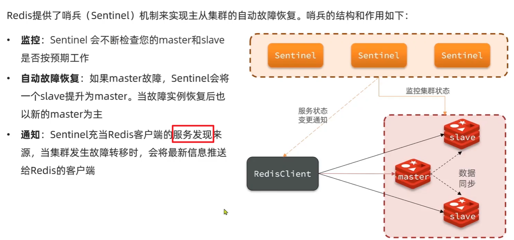

Sentinel基于心跳机制监测服务状态，每隔1秒向集群的每个实例发送ping命令（众所周知会得到pong）:

- 主观下线:如果某sentinel节点发现某实例未在规定时间响应，则认为该实例主观下线。
- 客观下线:若超过**指定数量(quorum)**的sentinel都认为该实例主观下线，则该实例客观下线。quorum值最好超
  过Sentinel实例数量的一半。


一旦发现master故障，sentinel需要在salve中选择一个作为新的master，选择依据是这样的

- 首先会判断slave节点与master节点断开时间长短，如果超过指定值(down-after-milliseconds *10）则会排除该
  slave节点
- 然后判断slave节点的slave-priority值，越小优先级越高，如果是0则永不参与选举。
- 如果slave-prority一样，则判断slave节点的offset值，越大说明数据越新，优先级越高。
- 最后是判断slave节点的运行id大小，越小优先级越高。


总结

Sentinel的三个作用是什么?

- 监控
- 故障转移
- 通知

Sentinel如何判断一个redis实例是否健康?

- 每隔1秒发送一次ping命令，如果超过一定时间没有相向则认为是主
  观下线

如果大多数sentinel都认为实例主观下线，则判定服务下线故障转移步骤有哪些?

- 首先选定一个slave作为新的master，执行slaveof no one
- 然后让所有节点都执行slaveof新master
- 修改故障节点配置，添加slaveof 新master


### 搭建哨兵集群

#### 集群结构

这里我们搭建一个三节点形成的Sentinel集群，来监管之前的Redis主从集群。如图：

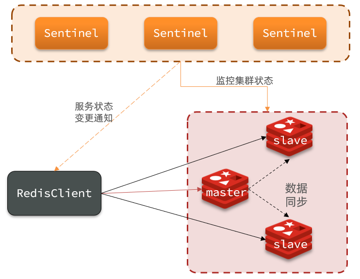


三个sentinel实例信息如下：

| 节点 |       IP        | PORT  |
| ---- | :-------------: | :---: |
| s1   | 192.168.150.101 | 27001 |
| s2   | 192.168.150.101 | 27002 |
| s3   | 192.168.150.101 | 27003 |

#### 准备实例和配置

要在同一台虚拟机开启3个实例，必须准备三份不同的配置文件和目录，配置文件所在目录也就是工作目录。

我们创建三个文件夹，名字分别叫s1、s2、s3：

```sh
# 进入/tmp目录
cd /tmp
# 创建目录
mkdir s1 s2 s3
```

如图：


然后我们在s1目录创建一个sentinel.conf文件，添加下面的内容：

```ini
port 27001
sentinel announce-ip 192.168.150.101
sentinel monitor mymaster 192.168.150.101 7001 2
sentinel down-after-milliseconds mymaster 5000
sentinel failover-timeout mymaster 60000
dir "/tmp/s1"
```

解读：

- `port 27001`：是当前sentinel实例的端口
- `sentinel monitor mymaster 192.168.150.101 7001 2`：指定主节点信息
  - `mymaster`：主节点名称，自定义，任意写
  - `192.168.150.101 7001`：主节点的ip和端口
  - `2`：选举master时的quorum值


然后将s1/sentinel.conf文件拷贝到s2、s3两个目录中（在/tmp目录执行下列命令）：

```sh
# 方式一：逐个拷贝
cp s1/sentinel.conf s2
cp s1/sentinel.conf s3
# 方式二：管道组合命令，一键拷贝
echo s2 s3 | xargs -t -n 1 cp s1/sentinel.conf
```


修改s2、s3两个文件夹内的配置文件，将端口分别修改为27002、27003：

```sh
sed -i -e 's/27001/27002/g' -e 's/s1/s2/g' s2/sentinel.conf
sed -i -e 's/27001/27003/g' -e 's/s1/s3/g' s3/sentinel.conf
```


#### 启动

为了方便查看日志，我们打开3个ssh窗口，分别启动3个redis实例，启动命令：

```sh
# 第1个
redis-sentinel s1/sentinel.conf
# 第2个
redis-sentinel s2/sentinel.conf
# 第3个
redis-sentinel s3/sentinel.conf
```


启动后：


#### 测试

尝试让master节点7001宕机，查看sentinel日志：


查看7003的日志：


查看7002的日志：


### RedisTemplate的哨兵模式

在Sentinel集群监管下的Redis主从集群，其节点会因为自动故障转移而发生变化，Redis的客户端必须感知这种变化，及时更新连接信息。Spring的RedisTemplate底层利用lettuce实现了节点的感知和自动切换。

#### 引入依赖

在项目的pom文件中引入依赖：

```xml
<dependency>
    <groupId>org.springframework.boot</groupId>
    <artifactId>spring-boot-starter-data-redis</artifactId>
</dependency>
```

#### 配置Redis地址

然后在配置文件application.yml中指定redis的sentinel相关信息：

```java
spring:
  redis:
    sentinel:
      master: mymaster
      nodes:
        - 192.168.150.101:27001
        - 192.168.150.101:27002
        - 192.168.150.101:27003
```

#### 配置读写分离

在项目的启动类中，添加一个新的bean：

```java
@Bean
public LettuceClientConfigurationBuilderCustomizer clientConfigurationBuilderCustomizer(){
    return clientConfigurationBuilder -> clientConfigurationBuilder.readFrom(ReadFrom.REPLICA_PREFERRED);
}
```

>非lamda表达式写法
>
>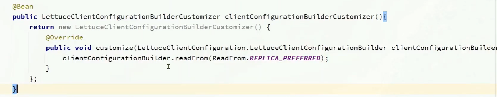

这个bean中配置的就是读写策略，包括四种：

- MASTER：从主节点读取
- MASTER_PREFERRED：优先从master节点读取，master不可用才读取replica
- REPLICA：从slave（replica）节点读取
- REPLICA _PREFERRED：优先从slave（replica）节点读取，所有的slave都不可用才读取master


至于为什么不配置redis集群的地址，这个不需要我们关系，相当于我们只要知道注册中心的地址就可以了，注册中心会自动帮我们映射到redis上，这种思路就很清晰了


## Redis分片集群

### 搭建分片集群

主从和哨兵可以解决高可用、高并发读的问题。但是依然有两个问题没有解决：

- 海量数据存储问题

- 高并发写的问题

使用分片集群可以解决上述问题，如图:

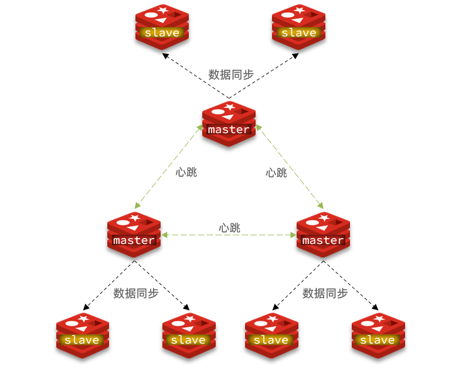


分片集群特征：

- 集群中有多个master，每个master保存不同数据

- 每个master都可以有多个slave节点

- master之间通过ping监测彼此健康状态

- 客户端请求可以访问集群任意节点，最终都会被转发到正确节点


#### 集群结构

分片集群需要的节点数量较多，这里我们搭建一个最小的分片集群，包含3个master节点，每个master包含一个slave节点，结构如下：


这里我们会在同一台虚拟机中开启6个redis实例，模拟分片集群，信息如下：

|       IP        | PORT |  角色  |
| :-------------: | :--: | :----: |
| 192.168.150.101 | 7001 | master |
| 192.168.150.101 | 7002 | master |
| 192.168.150.101 | 7003 | master |
| 192.168.150.101 | 8001 | slave  |
| 192.168.150.101 | 8002 | slave  |
| 192.168.150.101 | 8003 | slave  |


#### 准备实例和配置

删除之前的7001、7002、7003这几个目录，重新创建出7001、7002、7003、8001、8002、8003目录：

```sh
# 进入/tmp目录
cd /tmp
# 删除旧的，避免配置干扰
rm -rf 7001 7002 7003
# 创建目录
mkdir 7001 7002 7003 8001 8002 8003
```


在/tmp下准备一个新的redis.conf文件，内容如下：

```ini
port 6379
# 开启集群功能
cluster-enabled yes
# 集群的配置文件名称，不需要我们创建，由redis自己维护(只需要指明该文件的位置就可以了)
cluster-config-file /tmp/6379/nodes.conf
# 节点心跳失败的超时时间
cluster-node-timeout 5000
# 持久化文件存放目录
dir /tmp/6379
# 绑定地址
bind 0.0.0.0
# 让redis后台运行
daemonize yes
# 注册的实例ip
replica-announce-ip 192.168.150.101
# 保护模式
protected-mode no
# 数据库数量
databases 1
# 日志
logfile /tmp/6379/run.log
```

将这个文件拷贝到每个目录下：

```sh
# 进入/tmp目录
cd /tmp
# 执行拷贝
echo 7001 7002 7003 8001 8002 8003 | xargs -t -n 1 cp redis.conf
```


修改每个目录下的redis.conf，将其中的6379修改为与所在目录一致：

```sh
# 进入/tmp目录
cd /tmp
# 修改配置文件
printf '%s\n' 7001 7002 7003 8001 8002 8003 | xargs -I{} -t sed -i 's/6379/{}/g' {}/redis.conf
```


#### 启动

因为已经配置了后台启动模式，所以可以直接启动服务：

```sh
# 进入/tmp目录
cd /tmp
# 一键启动所有服务
printf '%s\n' 7001 7002 7003 8001 8002 8003 | xargs -I{} -t redis-server {}/redis.conf
```

通过ps查看状态：

```sh
ps -ef | grep redis
```

发现服务都已经正常启动：


如果要关闭所有进程，可以执行命令：

```sh
ps -ef | grep redis | awk '{print $2}' | xargs kill
```

或者（推荐这种方式）：

```sh
printf '%s\n' 7001 7002 7003 8001 8002 8003 | xargs -I{} -t redis-cli -p {} shutdown
```


#### 创建集群

虽然服务启动了，但是目前每个服务之间都是独立的，没有任何关联。

我们需要执行命令来创建集群，在Redis5.0之前创建集群比较麻烦，5.0之后集群管理命令都集成到了redis-cli中。


1）Redis 5.0之前

Redis5.0之前集群命令都是用redis安装包下的src/redis-trib.rb来实现的。因为redis-trib.rb是有ruby语言编写的所以需要安装ruby环境。

 ```sh
# 安装依赖
yum -y install zlib ruby rubygems
gem install redis
 ```


然后通过命令来管理集群：

```sh
# 进入redis的src目录
cd /tmp/redis-6.2.4/src
# 创建集群
./redis-trib.rb create --replicas 1 192.168.150.101:7001 192.168.150.101:7002 192.168.150.101:7003 192.168.150.101:8001 192.168.150.101:8002 192.168.150.101:8003
```


2）Redis 5.0以后

我们使用的是Redis 6.2.4版本，集群管理以及集成到了redis-cli中，格式如下：

```sh
redis-cli --cluster create --cluster-replicas 1 192.168.150.101:7001 192.168.150.101:7002 192.168.150.101:7003 192.168.150.101:8001 192.168.150.101:8002 192.168.150.101:8003
```

命令说明：

- `redis-cli --cluster`或者`./redis-trib.rb`：代表集群操作命令
- `create`：代表是创建集群
- `--replicas 1`或者`--cluster-replicas 1` ：指定集群中每个master的副本个数为1，此时`节点总数 ÷ (replicas + 1)` 得到的就是master的数量。因此节点列表中的前n个就是master，其它节点都是slave节点，随机分配到不同master


运行后的样子：


这里输入yes，则集群开始创建：


通过命令可以查看集群状态：

```sh
redis-cli -p 7001 cluster nodes
```


#### 测试

尝试连接7001节点，存储一个数据：

```sh
# 连接
redis-cli -p 7001
# 存储数据
set num 123
# 读取数据
get num
# 再次存储
set a 1
```

结果悲剧了：

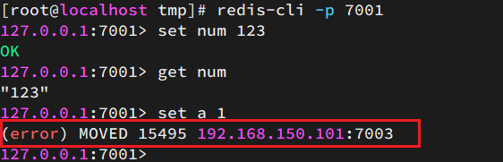

注意：！！！集群操作时，需要给`redis-cli`加上`-c`参数才可以：

```sh
redis-cli -c -p 7001
```

这次可以了：


### 散列插槽

#### 插槽原理

Redis会把每一个master节点映射到0~16383共16384个插槽（hash slot）上，查看集群信息时就能看到：


数据key不是与节点绑定，而是与插槽绑定。redis会根据key的有效部分计算插槽值，分两种情况：

- key中**包含"{}"**，且“{}”中至少包含1个字符，“{}”中的部分是有效部分
- key中**不包含“{}”**，整个key都是有效部分


例如：key是num，那么就根据num计算，如果是{itcast}num，则根据itcast计算。计算方式是利用CRC16算法得到一个hash值，然后对16384取余，得到的结果就是slot值。

 

如图，在7001这个节点执行set a 1时，对a做hash运算，对16384取余，得到的结果是15495，因此要存储到103节点。

到了7003后，执行`get num`时，对num做hash运算，对16384取余，得到的结果是2765，因此需要切换到7001节点


#### 小结

Redis如何判断某个key应该在哪个实例？

- 将16384个插槽分配到不同的实例
- 根据key的有效部分计算哈希值，对16384取余
- 余数作为插槽，寻找插槽所在实例即可

如何将同一类数据固定的保存在同一个Redis实例？

- 这一类数据使用相同的有效部分，例如key都以{typeId}为前缀


### 集群伸缩

redis-cli --cluster提供了很多操作集群的命令，可以通过下面方式查看：


比如，添加节点的命令：


#### 需求分析

需求：向集群中添加一个新的master节点，并向其中存储 num = 10

- 启动一个新的redis实例，端口为7004
- 添加7004到之前的集群，并作为一个master节点
- 给7004节点分配插槽，使得num这个key可以存储到7004实例


这里需要两个新的功能：

- 添加一个节点到集群中
- 将部分插槽分配到新插槽


#### 创建新的redis实例

创建一个文件夹：

```sh
mkdir 7004
```

拷贝配置文件：

```sh
cp redis.conf /7004
```

修改配置文件：

```sh
sed /s/6379/7004/g 7004/redis.conf
```

启动

```sh
redis-server 7004/redis.conf
```


#### 添加新节点到redis

添加节点的语法如下：


执行命令：

```sh
redis-cli --cluster add-node  192.168.150.101:7004 192.168.150.101:7001
```


通过命令查看集群状态：

```sh
redis-cli -p 7001 cluster nodes
```


如图，7004加入了集群，并且默认是一个master节点：


但是，可以看到7004节点的插槽数量为0，因此没有任何数据可以存储到7004上


#### 转移插槽

我们要将num存储到7004节点，因此需要先看看num的插槽是多少：


如上图所示，num的插槽为2765.


我们可以将0~3000的插槽从7001转移到7004，命令格式如下：


具体命令如下：

建立连接：


得到下面的反馈：


询问要移动多少个插槽，我们计划是3000个：

新的问题来了：


那个node来接收这些插槽？？

显然是7004，那么7004节点的id是多少呢？


复制这个id，然后拷贝到刚才的控制台后：


这里询问，你的插槽是从哪里移动过来的？

- all：代表全部，也就是三个节点各转移一部分
- 具体的id：目标节点的id
- done：没有了


这里我们要从7001获取，因此填写7001的id：


填完后，点击done，这样插槽转移就准备好了：


确认要转移吗？输入yes：

然后，通过命令查看结果：

 

可以看到： 


目的达成。


### 故障转移

集群初识状态是这样的：

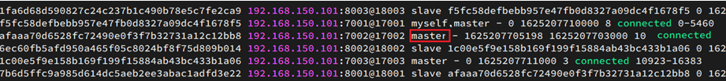

其中7001、7002、7003都是master，我们计划让7002宕机。


#### 自动故障转移

当集群中有一个master宕机会发生什么呢？

直接停止一个redis实例，例如7002：

```sh
redis-cli -p 7002 shutdown
```


1）首先是该实例与其它实例失去连接

2）然后是疑似宕机：


3）最后是确定下线，自动提升一个slave为新的master：


4）当7002再次启动，就会变为一个slave节点了：


#### 手动故障转移

利用cluster failover命令可以手动让集群中的某个master宕机，切换到执行cluster failover命令的这个slave节点，实现无感知的数据迁移。其流程如下：


这种failover命令可以指定三种模式：

- 缺省：默认的流程，如图1~6歩
- force：省略了对offset的一致性校验
- takeover：直接执行第5歩，忽略数据一致性、忽略master状态和其它master的意见


**案例需求**：在7002这个slave节点执行手动故障转移，重新夺回master地位

步骤如下：

1）利用redis-cli连接7002这个节点

2）执行cluster failover命令

如图：


效果：


### RedisTemplate访问分片集群

RedisTemplate底层同样基于lettuce实现了分片集群的支持，而使用的步骤与哨兵模式基本一致：

1）引入redis的starter依赖

2）配置分片集群地址

3）配置读写分离

>之前已经配置过1，3步骤了，这里就不写了

与哨兵模式相比，其中**只有分片集群的配置方式**略有差异，如下：

配置的是每一个节点的地址，注意是每一个都要写上

```yaml
spring:
  redis:
    cluster:
      nodes:
        - 192.168.150.101:7001
        - 192.168.150.101:7002
        - 192.168.150.101:7003
        - 192.168.150.101:8001
        - 192.168.150.101:8002
        - 192.168.150.101:8003
```


# 多级缓存

## 什么是多级缓存

传统的缓存策略一般是请求到达Tomcat后，先查询Redis，如果未命中则查询数据库，如图：

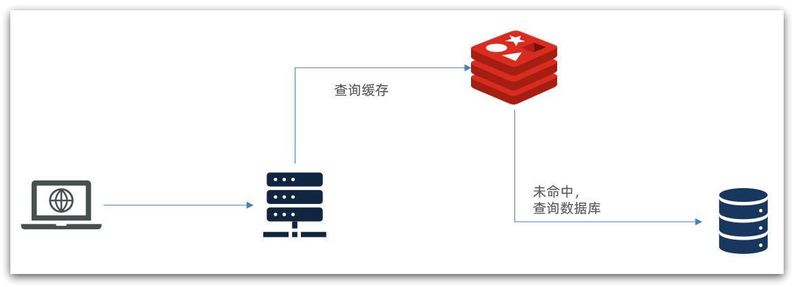

存在下面的问题：

•请求要经过Tomcat处理，Tomcat的性能成为整个系统的瓶颈

•Redis缓存失效时，会对数据库产生冲击


多级缓存就是充分利用请求处理的每个环节，分别添加缓存，减轻Tomcat压力，提升服务性能：

- 浏览器访问静态资源时，优先读取浏览器本地缓存
- 访问非静态资源（ajax查询数据）时，访问服务端
- 请求到达Nginx后，优先读取Nginx本地缓存
- 如果Nginx本地缓存未命中，则去直接查询Redis（不经过Tomcat）
- 如果Redis查询未命中，则查询Tomcat
- 请求进入Tomcat后，优先查询JVM进程缓存
- 如果JVM进程缓存未命中，则查询数据库


在多级缓存架构中，Nginx内部需要编写本地缓存查询、Redis查询、Tomcat查询的业务逻辑，因此这样的nginx服务不再是一个**反向代理服务器**，而是一个编写**业务的Web服务器了**。


因此这样的业务Nginx服务也需要搭建集群来提高并发，再有专门的Nginx服务来做反向代理，如图：


另外，我们的Tomcat服务将来也会部署为集群模式：


可见，多级缓存的关键有两个：

- 一个是在nginx中编写业务，实现nginx本地缓存、Redis、Tomcat的查询

- 另一个就是在Tomcat中实现JVM进程缓存

其中Nginx编程则会用到OpenResty框架结合Lua这样的语言。


这也是今天课程的难点和重点。


## JVM进程缓存


为了演示多级缓存的案例，我们先准备一个商品查询的业务。

### 导入案例

参考课前资料的：《案例导入说明.md》

 

>
>
># 案例导入说明
>
>
>
>为了演示多级缓存，我们先导入一个商品管理的案例，其中包含商品的CRUD功能。我们将来会给查询商品添加多级缓存。
>
>
>
># 1.安装MySQL
>
>后期做数据同步需要用到MySQL的主从功能，所以需要大家在虚拟机中，利用Docker来运行一个MySQL容器。
>
>## 1.1.准备目录
>
>为了方便后期配置MySQL，我们先准备两个目录，用于挂载容器的数据和配置文件目录：
>
>```sh
># 进入/tmp目录
>cd /tmp
># 创建文件夹
>mkdir mysql
># 进入mysql目录
>cd mysql
>```
>
>
>
>## 1.2.运行命令
>
>进入mysql目录后，执行下面的Docker命令：
>
>```sh
>docker run \
> -p 3306:3306 \
> --name mysql \
> -v $PWD/conf:/etc/mysql/conf.d \
> -v $PWD/logs:/logs \
> -v $PWD/data:/var/lib/mysql \
> -e MYSQL_ROOT_PASSWORD=123 \
> --privileged \
> -d \
> mysql:5.7.25
>```
>
>
>
>## 1.3.修改配置
>
>在/tmp/mysql/conf目录添加一个my.cnf文件，作为mysql的配置文件：
>
>```sh
># 创建文件
>touch /tmp/mysql/conf/my.cnf
>```
>
>
>
>文件的内容如下：
>
>```ini
>[mysqld]
>skip-name-resolve
>character_set_server=utf8
>datadir=/var/lib/mysql
>server-id=1000
>```
>
>
>
>## 1.4.重启
>
>配置修改后，必须重启容器：
>
>```sh
>docker restart mysql
>```
>
>
>
># 2.导入SQL
>
>接下来，利用Navicat客户端连接MySQL，然后导入课前资料提供的sql文件：
>
>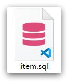 
>
>其中包含两张表：
>
>- tb_item：商品表，包含商品的基本信息
>- tb_item_stock：商品库存表，包含商品的库存信息
>
>之所以将库存分离出来，是因为库存是更新比较频繁的信息，写操作较多。而其他信息修改的频率非常低。
>
>
>
># 3.导入Demo工程
>
>下面导入课前资料提供的工程：
>
> 
>
>
>
>项目结构如图所示：
>
>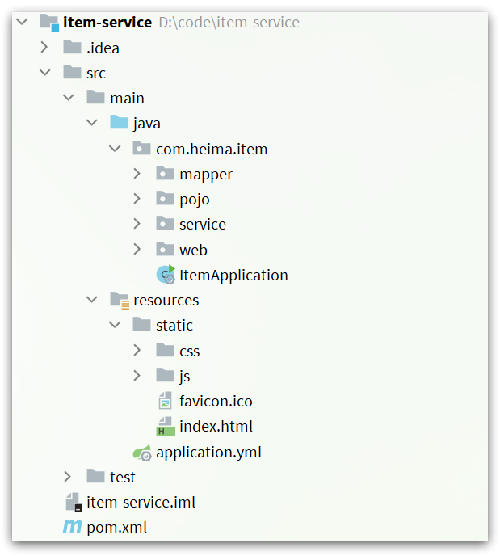
>
>
>
>其中的业务包括：
>
>- 分页查询商品
>- 新增商品
>- 修改商品
>- 修改库存
>- 删除商品
>- 根据id查询商品
>- 根据id查询库存
>
>
>
>业务全部使用mybatis-plus来实现，如有需要请自行修改业务逻辑。
>
>
>
>## 3.1.分页查询商品
>
>在`com.heima.item.web`包的`ItemController`中可以看到接口定义：
>
>
>
>
>
>## 3.2.新增商品
>
>在`com.heima.item.web`包的`ItemController`中可以看到接口定义：
>
>
>
>
>
>## 3.3.修改商品
>
>在`com.heima.item.web`包的`ItemController`中可以看到接口定义：
>
>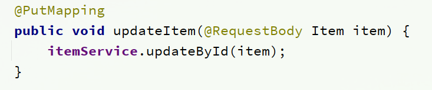
>
>
>
>## 3.4.修改库存
>
>在`com.heima.item.web`包的`ItemController`中可以看到接口定义：
>
>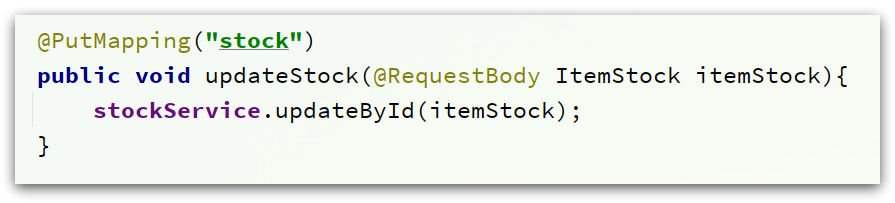
>
>
>
>
>
>## 3.5.删除商品
>
>在`com.heima.item.web`包的`ItemController`中可以看到接口定义：
>
>
>
>这里是采用了逻辑删除，将商品状态修改为3
>
>
>
>## 3.6.根据id查询商品
>
>在`com.heima.item.web`包的`ItemController`中可以看到接口定义：
>
>
>
>
>
>这里只返回了商品信息，不包含库存
>
>
>
>## 3.7.根据id查询库存
>
>在`com.heima.item.web`包的`ItemController`中可以看到接口定义：
>
>
>
>
>
>## 3.8.启动
>
>注意修改application.yml文件中配置的mysql地址信息：
>
>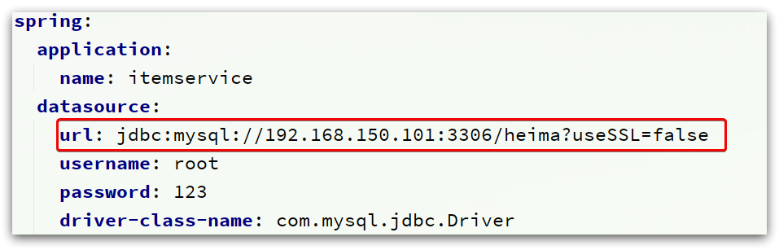
>
>需要修改为自己的虚拟机地址信息、还有账号和密码。
>
>
>
>修改后，启动服务，访问：http://localhost:8081/item/10001即可查询数据
>
>
>
># 4.导入商品查询页面
>
>商品查询是购物页面，与商品管理的页面是分离的。
>
>部署方式如图：
>
>
>
>我们需要准备一个反向代理的nginx服务器，如上图红框所示，将静态的商品页面放到nginx目录中。
>
>页面需要的数据通过ajax向服务端（nginx业务集群）查询。
>
>
>
>
>
>## 4.1.运行nginx服务
>
>这里我已经给大家准备好了nginx反向代理服务器和静态资源。
>
>我们找到课前资料的nginx目录：
>
> 
>
>将其拷贝到一个非中文目录下，运行这个nginx服务。
>
>运行命令：
>
>```powershell
>start nginx.exe
>```
>
>
>
>然后访问 http://localhost/item.html?id=10001即可：
>
>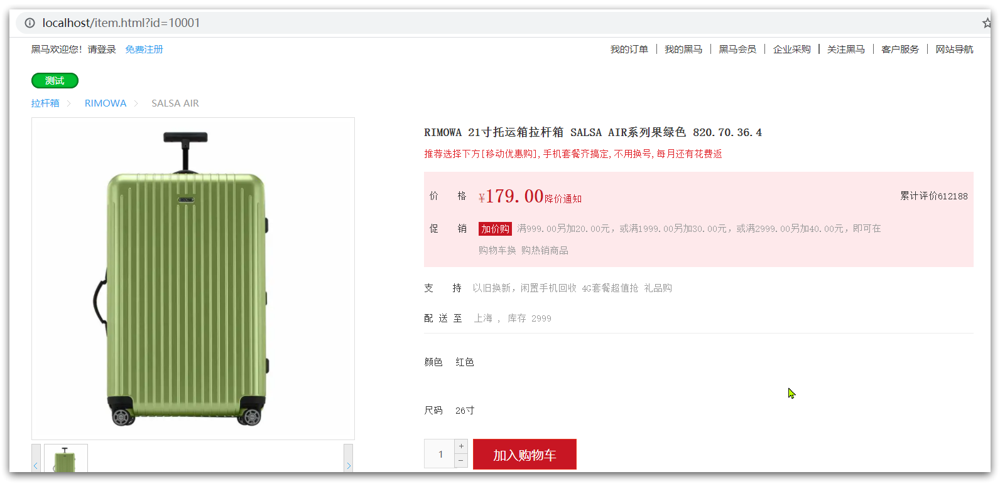
>
>
>
>## 4.2.反向代理
>
>现在，页面是假数据展示的。我们需要向服务器发送ajax请求，查询商品数据。
>
>打开控制台，可以看到页面有发起ajax查询数据：
>
>
>
>而这个请求地址同样是80端口，所以被当前的nginx反向代理了。
>
>查看nginx的conf目录下的nginx.conf文件：
>
> 
>
>其中的关键配置如下：
>
>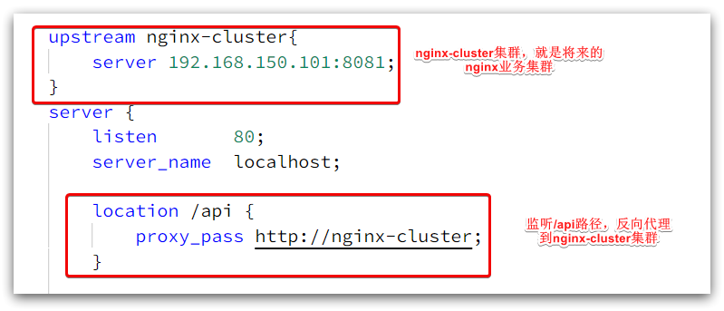
>
>其中的192.168.150.101是我的虚拟机IP，也就是我的Nginx业务集群要部署的地方：
>
>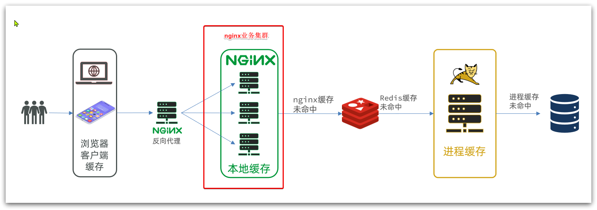
>
>
>
>完整内容如下：
>
>```nginx
>#user  nobody;
>worker_processes  1;
>
>events {
>    worker_connections  1024;
>}
>
>http {
>    include       mime.types;
>    default_type  application/octet-stream;
>
>    sendfile        on;
>    #tcp_nopush     on;
>    keepalive_timeout  65;
>
>    upstream nginx-cluster{
>        server 192.168.150.101:8081;
>    }
>    server {
>        listen       80;
>        server_name  localhost;
>
>	location /api {
>            proxy_pass http://nginx-cluster;
>        }
>
>        location / {
>            root   html;
>            index  index.html index.htm;
>        }
>
>        error_page   500 502 503 504  /50x.html;
>        location = /50x.html {
>            root   html;
>        }
>    }
>}
>```
>

### 初识Caffeine

缓存在日常开发中启动至关重要的作用，由于是存储在内存中，数据的读取速度是非常快的，能大量减少对数据库的访问，减少数据库的压力。我们把缓存分为两类：

- 分布式缓存，例如Redis：
  - 优点：存储容量更大、可靠性更好、可以在集群间共享
  - 缺点：访问缓存有网络开销
  - 场景：缓存数据量较大、可靠性要求较高、需要在集群间共享
- 进程本地缓存，例如HashMap、GuavaCache：
  - 优点：读取本地内存，没有网络开销，速度更快
  - 缺点：存储容量有限、可靠性较低、无法共享
  - 场景：性能要求较高，缓存数据量较小

我们今天会利用Caffeine框架来实现JVM进程缓存。


**Caffeine**是一个基于Java8开发的，提供了近乎最佳命中率的高性能的本地缓存库。目前Spring内部的缓存使用的就是Caffeine。GitHub地址：https://github.com/ben-manes/caffeine

Caffeine的性能非常好，下图是官方给出的性能对比：

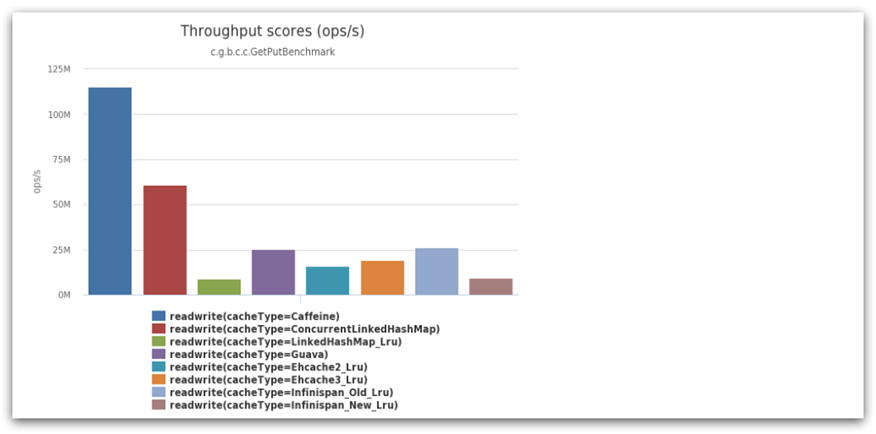

可以看到Caffeine的性能遥遥领先！

缓存使用的基本API：

```java
@Test
void testBasicOps() {
    // 构建cache对象
    Cache<String, String> cache = Caffeine.newBuilder().build();

    // 1. 第一种方法
    //存数据
    cache.put("gf", "瑶瑶");
    // 取数据         getIfPresent意思是：取 如果存在的话  
    String gf = cache.getIfPresent("gf");
    System.out.println("gf = " + gf);
    
    // 2. 第二种方法
    // 取数据，包含两个参数：
    // 参数一：缓存的key
    // 参数二：Lambda表达式，表达式参数就是缓存的key，方法体是查询数据库的逻辑
    // 优先根据key查询JVM缓存，如果未命中，则执行参数二的Lambda表达式
    String defaultGF = cache.get("defaultGF", key -> {
        // 根据key去数据库查询数据
        return "昊昊";
    });
    System.out.println("defaultGF = " + defaultGF);
}
```


Caffeine既然是缓存的一种，肯定需要有缓存的清除策略，不然的话内存总会有耗尽的时候。

Caffeine提供了三种缓存驱逐策略：

- **基于容量**：设置缓存的数量上限

  ```java
  // 创建缓存对象
  Cache<String, String> cache = Caffeine.newBuilder()
      .maximumSize(1) // 设置缓存大小上限为 1
      .build();
  ```

  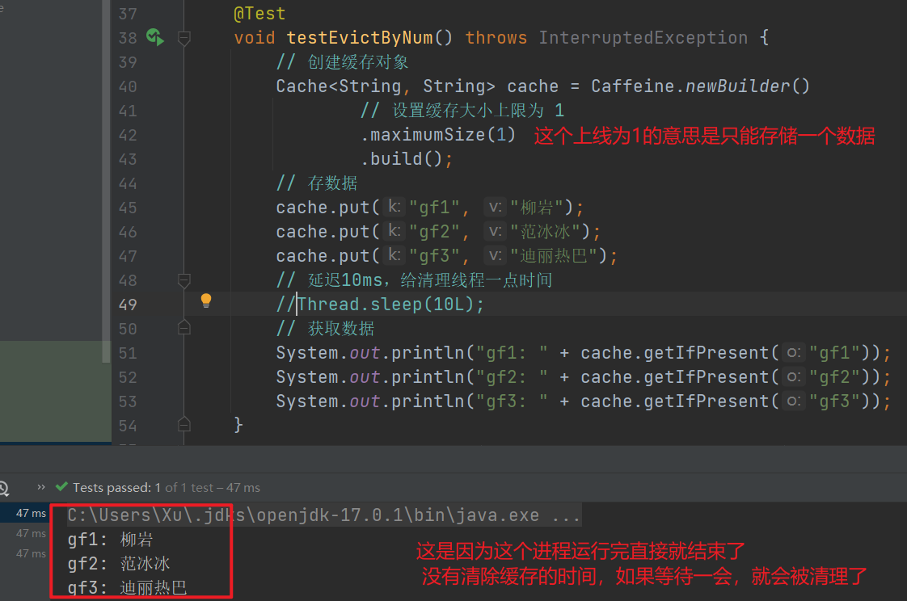

  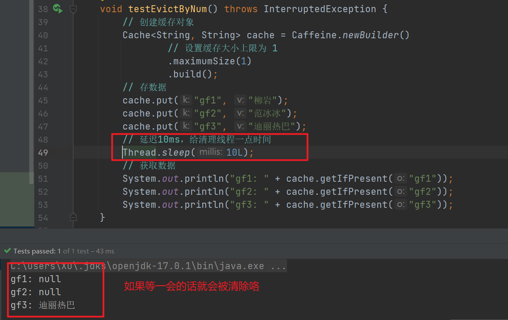

- **基于时间**：设置缓存的有效时间

  ```java
  // 创建缓存对象
  Cache<String, String> cache = Caffeine.newBuilder()
      // 设置缓存有效期为 10 秒，从最后一次写入开始计时 
      .expireAfterWrite(Duration.ofSeconds(10)) 
      .build();
  
  ```

  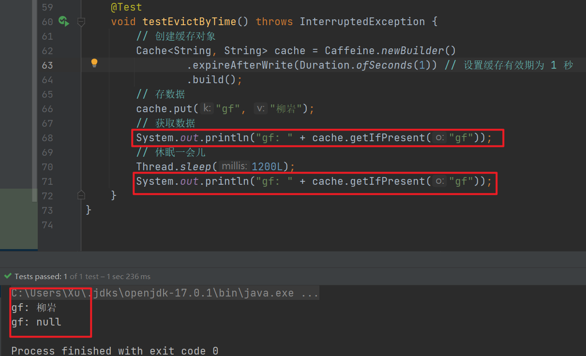

- **基于引用**：设置缓存为软引用或弱引用，利用GC来回收缓存数据。性能较差，不建议使用。


> **注意**：在默认情况下，当一个缓存元素过期的时候，Caffeine不会自动立即将其清理和驱逐。而是在一次读或写操作后，或者在空闲时间完成对失效数据的驱逐。


### 实现JVM进程缓存

#### 需求

利用Caffeine实现下列需求：

- 给根据id查询**商品**的业务添加缓存，缓存未命中时查询数据库
- 给根据id查询**商品库存**的业务添加缓存，缓存未命中时查询数据库
- 缓存初始大小为100
- 缓存上限为10000


#### 实现

首先，我们需要定义两个Caffeine的缓存对象，分别保存商品、库存的缓存数据。

在item-service的`com.heima.item.config`包下定义`CaffeineConfig`类：

```java
@Configuration
public class CaffeineConfig {

    @Bean
    public Cache<Long, Item> itemCache(){
        return Caffeine.newBuilder()
                .initialCapacity(100)
                .maximumSize(10_000)
                .build();
    }

    @Bean
    public Cache<Long, ItemStock> stockCache(){
        return Caffeine.newBuilder()
                .initialCapacity(100)
                .maximumSize(10_000)
                .build();
    }
}
```


然后，修改item-service中的`com.heima.item.web`包下的ItemController类，添加缓存逻辑：

```java
@RestController
@RequestMapping("item")
public class ItemController {

    @Autowired
    private IItemService itemService;
    @Autowired
    private IItemStockService stockService;

    @Autowired
    private Cache<Long, Item> itemCache;
    @Autowired
    private Cache<Long, ItemStock> stockCache;
    
    // ...其它略
    
    @GetMapping("/{id}")
    public Item findById(@PathVariable("id") Long id) {
        return itemCache.get(id, key -> itemService.query()
                .ne("status", 3).eq("id", key)
                .one()
        );
    }

    @GetMapping("/stock/{id}")
    public ItemStock findStockById(@PathVariable("id") Long id) {
        return stockCache.get(id, key -> stockService.getById(key));
    }
}
```


## Lua语法入门

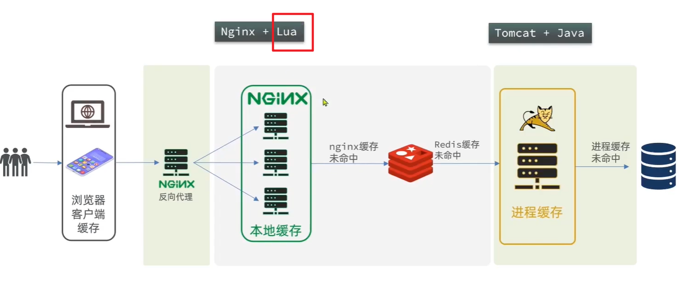

Nginx编程需要用到Lua语言，因此我们必须先入门Lua的基本语法。

### 初识Lua

Lua 是一种轻量小巧的脚本语言，用标准C语言编写并以源代码形式开放， 其设计目的是为了嵌入应用程序中，从而为应用程序提供灵活的扩展和定制功能。官网：https://www.lua.org/


Lua经常嵌入到C语言开发的程序中，例如游戏开发、游戏插件等。

Nginx本身也是C语言开发，因此也允许基于Lua做拓展。


#### HelloWorld

CentOS7默认已经安装了Lua语言环境，所以可以直接运行Lua代码。

1）在Linux虚拟机的任意目录下，新建一个hello.lua文件


2）添加下面的内容

```lua
print("Hello World!")  
```


3）运行


### 变量和循环

学习任何语言必然离不开变量，而变量的声明必须先知道数据的类型。

#### Lua的数据类型

Lua中支持的常见数据类型包括：


另外，Lua提供了type()函数来判断一个变量的数据类型：


#### 声明变量

Lua声明变量的时候无需指定数据类型，而是用local来声明变量为局部变量：

```lua
-- 声明字符串，可以用单引号或双引号，
local str = 'hello'
-- 字符串拼接可以使用 ..
local str2 = 'hello' .. 'world'
-- 声明数字
local num = 21
-- 声明布尔类型
local flag = true
```


Lua中的table类型既可以作为数组，又可以作为Java中的map来使用。数组就是特殊的table，key是数组角标而已：

```lua
-- 声明数组 ，key为角标的 table
local arr = {'java', 'python', 'lua'}
-- 声明table，类似java的map
local map =  {name='Jack', age=21}
```

Lua中的数组角标是从1开始，访问的时候与Java中类似：

```lua
-- 访问数组，lua数组的角标从1开始
print(arr[1])
```

Lua中的table可以用key来访问：

```lua
-- 访问table
print(map['name'])
print(map.name)
```


#### 循环

对于table，我们可以利用for循环来遍历。不过数组和普通table遍历略有差异。

遍历数组：

```lua
-- 声明数组 key为索引的 table
local arr = {'java', 'python', 'lua'}
-- 遍历数组
for index,value in ipairs(arr) do
    print(index, value) 
end
```

遍历普通table

```lua
-- 声明map，也就是table
local map = {name='Jack', age=21}
-- 遍历table
for key,value in pairs(map) do
   print(key, value) 
end
```


### 条件控制、函数

Lua中的条件控制和函数声明与Java类似。

#### 函数

定义函数的语法：

```lua
function 函数名( argument1, argument2..., argumentn)
    -- 函数体
    return 返回值
end
```


例如，定义一个函数，用来打印数组：

```lua
function printArr(arr)
    for index, value in ipairs(arr) do
        print(value)
    end
end
```


#### 条件控制

类似Java的条件控制，例如if、else语法：

```lua
if(布尔表达式)
then
   --[ 布尔表达式为 true 时执行该语句块 --]
else
   --[ 布尔表达式为 false 时执行该语句块 --]
end

```


与java不同，布尔表达式中的逻辑运算是基于英文单词：


#### 案例

需求：自定义一个函数，可以打印table，当参数为nil时，打印错误信息


```lua
function printArr(arr)
    if not arr then
        print('数组不能为空！')
    end
    for index, value in ipairs(arr) do
        print(value)
    end
end
```


## 实现多级缓存

多级缓存的实现离不开Nginx编程，而Nginx编程又离不开OpenResty。

### 安装OpenResty

OpenResty® 是一个基于 Nginx的高性能 Web 平台，用于方便地搭建能够处理超高并发、扩展性极高的动态 Web 应用、Web 服务和动态网关。具备下列特点：

- 具备Nginx的完整功能
- 基于Lua语言进行扩展，集成了大量精良的 Lua 库、第三方模块
- 允许使用Lua**自定义业务逻辑**、**自定义库**

官方网站： https://openresty.org/cn/


安装Lua可以参考课前资料提供的《安装OpenResty.md》：

 

># 安装OpenResty
>
>
>
># 1.安装
>
>首先你的Linux虚拟机必须联网
>
>## **1）安装开发库**
>
>首先要安装OpenResty的依赖开发库，执行命令：
>
>```sh
>yum install -y pcre-devel openssl-devel gcc --skip-broken
>```
>
>
>
>## **2）安装OpenResty仓库**
>
>你可以在你的 CentOS 系统中添加 `openresty` 仓库，这样就可以便于未来安装或更新我们的软件包（通过 `yum check-update` 命令）。运行下面的命令就可以添加我们的仓库：
>
>```
>yum-config-manager --add-repo https://openresty.org/package/centos/openresty.repo
>```
>
>
>
>如果提示说命令不存在，则运行：
>
>```
>yum install -y yum-utils 
>```
>
>然后再重复上面的命令
>
>
>
>## **3）安装OpenResty**
>
>然后就可以像下面这样安装软件包，比如 `openresty`：
>
>```bash
>yum install -y openresty
>```
>
>
>
>## **4）安装opm工具**
>
>opm是OpenResty的一个管理工具，可以帮助我们安装一个第三方的Lua模块。
>
>如果你想安装命令行工具 `opm`，那么可以像下面这样安装 `openresty-opm` 包：
>
>```bash
>yum install -y openresty-opm
>```
>
>
>
>## **5）目录结构**
>
>默认情况下，OpenResty安装的目录是：/usr/local/openresty
>
> 
>
>看到里面的nginx目录了吗，OpenResty就是在Nginx基础上集成了一些Lua模块。
>
>
>
>## **6）配置nginx的环境变量**
>
>打开配置文件：
>
>```sh
>vi /etc/profile
>```
>
>在最下面加入两行：
>
>```sh
>export NGINX_HOME=/usr/local/openresty/nginx
>export PATH=${NGINX_HOME}/sbin:$PATH
>```
>
>NGINX_HOME：后面是OpenResty安装目录下的nginx的目录
>
>然后让配置生效：
>
>```
>source /etc/profile
>```
>
>
>
># 2.启动和运行
>
>OpenResty底层是基于Nginx的，查看OpenResty目录的nginx目录，结构与windows中安装的nginx基本一致：
>
>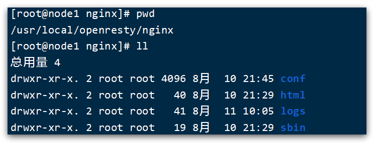
>
>所以运行方式与nginx基本一致：
>
>```sh
># 启动nginx
>nginx
># 重新加载配置
>nginx -s reload
># 停止
>nginx -s stop
>```
>
>
>
>
>
>nginx的默认配置文件注释太多，影响后续我们的编辑，这里将nginx.conf中的注释部分删除，保留有效部分。
>
>修改`/usr/local/openresty/nginx/conf/nginx.conf`文件，内容如下：
>
>```nginx
>#user  nobody;
>worker_processes  1;
>error_log  logs/error.log;
>
>events {
>        worker_connections  1024;
>}
>
>http {
>        include       mime.types;
>        default_type  application/octet-stream;
>        sendfile        on;
>        keepalive_timeout  65;
>
>        server {
>             listen       8081;
>             server_name  localhost;
>             location / {
>                 root   html;
>                 index  index.html index.htm;
>             }
>             error_page   500 502 503 504  /50x.html;
>             location = /50x.html {
>                 root   html;
>             }
>        }
>}
>```
>
>
>
>在Linux的控制台输入命令以启动nginx：
>
>```sh
>nginx
>```
>
>
>
>然后访问页面：http://192.168.30.128:8081，注意ip地址替换为你自己的虚拟机IP：
>
>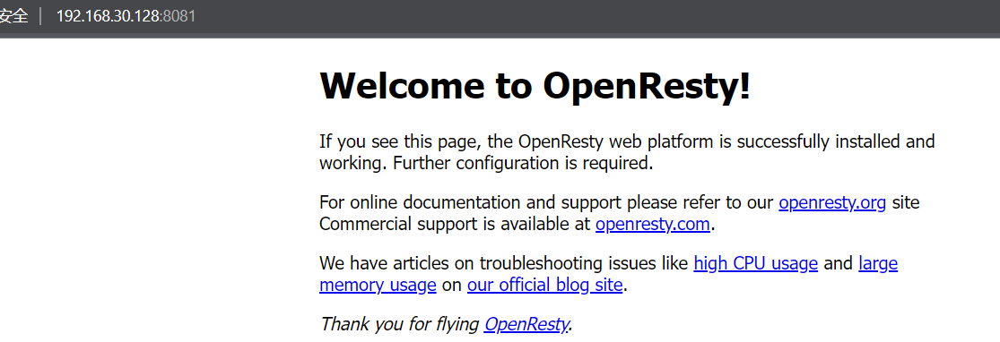
>
>
>
>
>
>
>
>
>
># 3.备注
>
>加载OpenResty的lua模块：
>
>```nginx
>#lua 模块
>lua_package_path "/usr/local/openresty/lualib/?.lua;;";
>#c模块     
>lua_package_cpath "/usr/local/openresty/lualib/?.so;;";  
>```
>
>common.lua
>
>```lua
>-- 封装函数，发送http请求，并解析响应
>local function read_http(path, params)
>    local resp = ngx.location.capture(path,{
>            method = ngx.HTTP_GET,
>                args = params,
>             })
>         if not resp then
>            -- 记录错误信息，返回404
>            ngx.log(ngx.ERR, "http not found, path: ", path , ", args: ", args)
>             ngx.exit(404)
>         end
>         return resp.body
>    end
>    -- 将方法导出
>local _M = {  
>    read_http = read_http
>}  
>    return _M
>```
>
>
>
>释放Redis连接API：
>
>```lua
>-- 关闭redis连接的工具方法，其实是放入连接池
>local function close_redis(red)
>    local pool_max_idle_time = 10000 -- 连接的空闲时间，单位是毫秒
>    local pool_size = 100 --连接池大小
>        local ok, err = red:set_keepalive(pool_max_idle_time, pool_size)
>        if not ok then
>            ngx.log(ngx.ERR, "放入redis连接池失败: ", err)
>        end
>     end
>    ```
>
>读取Redis数据的API：
>
>```lua
>-- 查询redis的方法 ip和port是redis地址，key是查询的key
>local function read_redis(ip, port, key)
>    -- 获取一个连接
>    local ok, err = red:connect(ip, port)
>        if not ok then
>            ngx.log(ngx.ERR, "连接redis失败 : ", err)
>            return nil
>         end
>         -- 查询redis
>        local resp, err = red:get(key)
>        -- 查询失败处理
>        if not resp then
>            ngx.log(ngx.ERR, "查询Redis失败: ", err, ", key = " , key)
>        end
>         --得到的数据为空处理
>        if resp == ngx.null then
>            resp = nil
>            ngx.log(ngx.ERR, "查询Redis数据为空, key = ", key)
>         end
>         close_redis(red)
>        return resp
>    end
>    ```
>
>
>
>开启共享词典：
>
>```nginx
># 共享字典，也就是本地缓存，名称叫做：item_cache，大小150m
>lua_shared_dict item_cache 150m; 
>```
>


### OpenResty快速入门

我们希望达到的多级缓存架构如图：

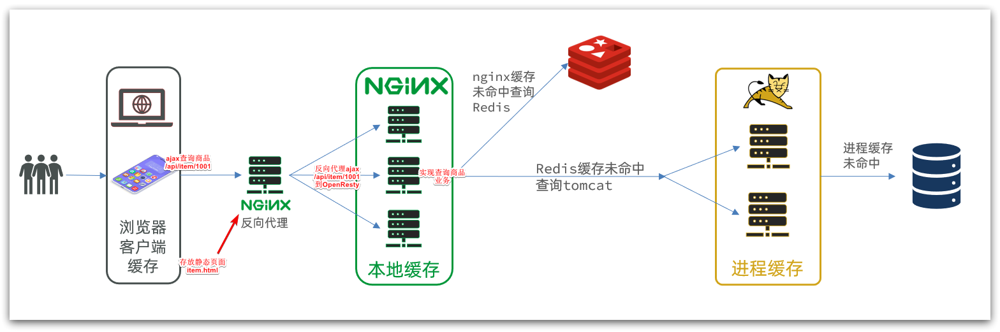

其中：

- windows上的nginx用来做反向代理服务，将前端的查询商品的ajax请求代理到OpenResty集群

- OpenResty集群用来编写多级缓存业务


#### 反向代理流程

现在，商品详情页使用的是假的商品数据。不过在浏览器中，可以看到页面有发起ajax请求查询真实商品数据。

这个请求如下：


请求地址是localhost，端口是80，就被windows上安装的Nginx服务给接收到了。然后代理给了OpenResty集群：


我们需要在OpenResty中编写业务，查询商品数据并返回到浏览器。

但是这次，我们先在OpenResty接收请求，返回假的商品数据。


#### OpenResty监听请求

OpenResty的很多功能都依赖于其目录下的Lua库，需要在nginx.conf中指定依赖库的目录，并导入依赖：

1）添加对OpenResty的Lua模块的加载

修改`/usr/local/openresty/nginx/conf/nginx.conf`文件，在其中的http下面，添加下面代码：

```nginx
#lua 模块
lua_package_path "/usr/local/openresty/lualib/?.lua;;";
#c模块     
lua_package_cpath "/usr/local/openresty/lualib/?.so;;";  
```

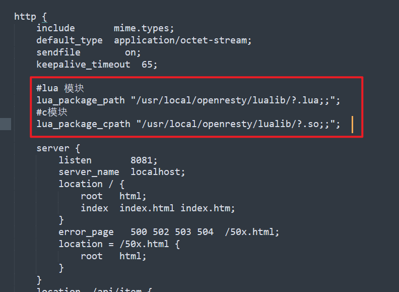

2）监听/api/item路径

修改`/usr/local/openresty/nginx/conf/nginx.conf`文件，在nginx.conf的server下面，添加对/api/item这个路径的监听：

```nginx
location  /api/item {
    # 默认的响应类型
    default_type application/json;
    # 响应结果由lua/item.lua文件来决定
    content_by_lua_file lua/item.lua;
}
```

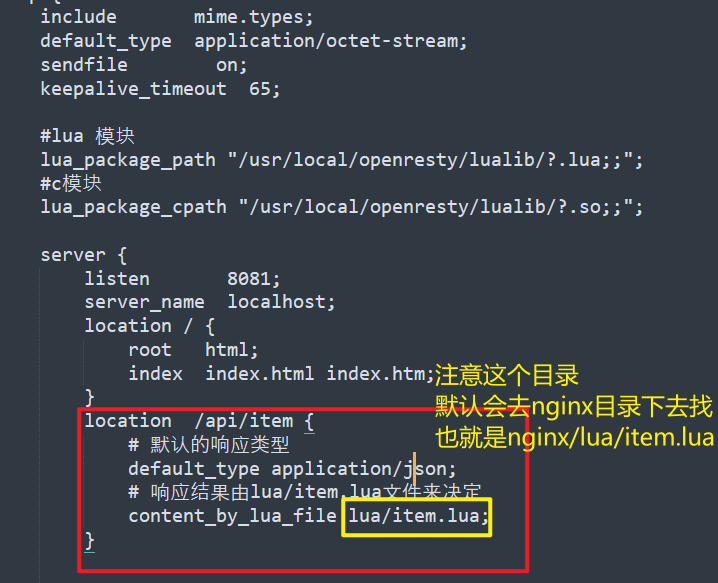

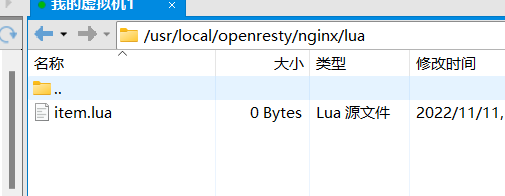


这个监听，就类似于SpringMVC中的`@GetMapping("/api/item")`做路径映射。

而`content_by_lua_file lua/item.lua`则相当于调用item.lua这个文件，执行其中的业务，把结果返回给用户。相当于java中调用service。


#### 编写item.lua

1）在`/usr/loca/openresty/nginx`目录创建文件夹：lua


2）在`/usr/loca/openresty/nginx/lua`文件夹下，新建文件：item.lua


3）编写item.lua，返回假数据

item.lua中，利用ngx.say()函数返回数据到Response中

```lua
ngx.say('{"id":10001,"name":"SALSA AIR","title":"RIMOWA 26寸托运箱拉杆箱 SALSA AIR系列果绿色 820.70.36.4","price":19900,"image":"https://m.360buyimg.com/mobilecms/s720x720_jfs/t6934/364/1195375010/84676/e9f2c55f/597ece38N0ddcbc77.jpg!q70.jpg.webp","category":"拉杆箱","brand":"RIMOWA","spec":"","status":1,"createTime":"2019-04-30T16:00:00.000+00:00","updateTime":"2019-04-30T16:00:00.000+00:00","stock":2999,"sold":31290}')
```


4）重新加载配置

```sh
nginx -s reload
```

>这个不但虚拟机的要刷新，自己的windows那个负载均衡的nginx也要刷新一下
>
>如果再没有刷新就清理一下浏览器的缓存

刷新商品页面：http://localhost/item.html?id=10001，即可看到效果：


### 请求参数处理

上一节中，我们在OpenResty接收前端请求，但是返回的是假数据。


要返回真实数据，必须根据前端传递来的商品id，查询商品信息才可以。

那么如何获取前端传递的商品参数呢？

#### 获取参数的API

OpenResty中提供了一些API用来获取不同类型的前端请求参数：


#### 获取参数并返回

在前端发起的ajax请求如图：


可以看到商品id是以路径占位符方式传递的，因此可以利用正则表达式匹配的方式来获取ID


1）获取商品id

修改`/usr/loca/openresty/nginx/nginx.conf`文件中监听/api/item的代码，利用正则表达式获取ID：

```nginx
location ~ /api/item/(\d+) {
    # 默认的响应类型
    default_type application/json;
    # 响应结果由lua/item.lua文件来决定
    content_by_lua_file lua/item.lua;
}
```


2）拼接ID并返回

修改`/usr/loca/openresty/nginx/lua/item.lua`文件，获取id并拼接到结果中返回：

```lua
-- 获取商品id
local id = ngx.var[1]
-- 拼接并返回
ngx.say('{"id":' .. id .. ',"name":"SALSA AIR","title":"RIMOWA 21寸托运箱拉杆箱 SALSA AIR系列果绿色 820.70.36.4","price":17900,"image":"https://m.360buyimg.com/mobilecms/s720x720_jfs/t6934/364/1195375010/84676/e9f2c55f/597ece38N0ddcbc77.jpg!q70.jpg.webp","category":"拉杆箱","brand":"RIMOWA","spec":"","status":1,"createTime":"2019-04-30T16:00:00.000+00:00","updateTime":"2019-04-30T16:00:00.000+00:00","stock":2999,"sold":31290}')
```


3）重新加载并测试

运行命令以重新加载OpenResty配置：

```sh
nginx -s reload
```


刷新页面可以看到结果中已经带上了ID：

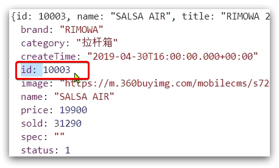 


### 查询Tomcat

拿到商品ID后，本应去缓存中查询商品信息，不过目前我们还未建立nginx、redis缓存。因此，这里我们先根据商品id去tomcat查询商品信息。我们实现如图部分：

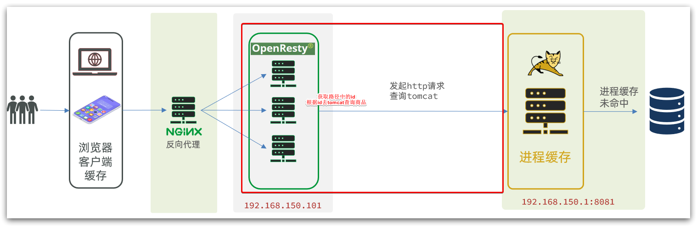


需要注意的是，我们的OpenResty是在虚拟机，Tomcat是在Windows电脑上。两者IP一定不要搞错了。


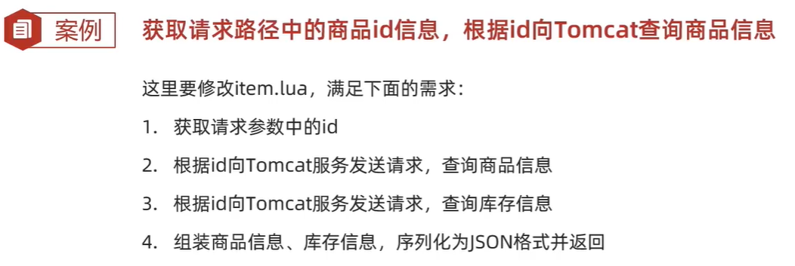

#### 发送http请求的API

nginx提供了内部API用以发送http请求：

```lua
local resp = ngx.location.capture("/path",{
    method = ngx.HTTP_GET,   -- 请求方式
    args = {a=1,b=2},  -- get方式传参数（这两个选一种就可以了）
    body="c=3&d=4"     --post方式传参数
})
```

返回的响应内容包括：

- resp.status：响应状态码
- resp.header：响应头，是一个table
- resp.body：响应体，就是响应数据

**注意：这里的path是路径，并不包含IP和端口。这个请求会被nginx内部的server监听并处理。**

但是我们希望这个请求发送到Tomcat服务器，所以还需要编写一个server来对这个路径做反向代理：

```nginx
 location /path {
     # 这里是windows电脑的ip和Java服务端口，需要确保windows防火墙处于关闭状态
     proxy_pass http://192.168.30.128:8081; 
 }
```


原理如图：


#### 封装http工具

下面，我们封装一个发送Http请求的工具，基于ngx.location.capture来实现查询tomcat。


1）添加反向代理，到windows的Java服务

因为item-service中的接口都是/item开头，所以我们监听/item路径，代理到windows上的tomcat服务。

修改 `/usr/local/openresty/nginx/conf/nginx.conf`文件，添加一个location：

**注意这里是代理到windows我们写的Java代码上的**

```nginx
location /item {
    proxy_pass http://192.168.30.1:8081;
}
```


以后，只要我们调用`ngx.location.capture("/item")`，就一定能发送请求到windows的tomcat服务。


2）封装工具类

之前我们说过，OpenResty启动时会加载以下两个目录中的工具文件：

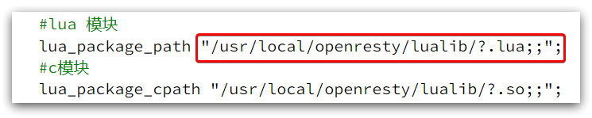

所以，自定义的http工具也需要放到这个目录下。


在`/usr/local/openresty/lualib`目录下，新建一个common.lua文件：

```sh
vi /usr/local/openresty/lualib/common.lua
```

内容如下:

```lua
-- 封装函数，发送http请求，并解析响应
local function read_http(path, params)
    local resp = ngx.location.capture(path,{
            method = ngx.HTTP_GET,
            args = params,
        })
    if not resp then
        -- 记录错误信息，返回404
        ngx.log(ngx.ERR, "http请求查询失败, path: ", path , ", args: ", args)
        ngx.exit(404)
    end
    return resp.body
end
-- 将方法导出
local _M = {  
    read_http = read_http
}  
return _M
```


这个工具将read_http函数封装到_M这个table类型的变量中，并且返回，这类似于导出。

使用的时候，可以利用`require('common')`来导入该函数库，这里的common是函数库的文件名。


3）实现商品查询

最后，我们修改`/usr/local/openresty/lua/item.lua`文件，利用刚刚封装的函数库实现对tomcat的查询：

```lua
-- 引入自定义common工具模块，返回值是common中返回的 _M
local common = require("common")
-- 从 common中获取read_http这个函数
local read_http = common.read_http
-- 获取路径参数
local id = ngx.var[1]
-- 根据id查询商品
local itemJSON = read_http("/item/".. id, nil) 
-- 根据id查询商品库存
local itemStockJSON = read_http("/item/stock/".. id, nil)
```


这里查询到的结果是json字符串，并且包含商品、库存两个json字符串，页面最终需要的是把两个json拼接为一个json：


这就需要我们先把JSON变为lua的table，完成数据整合后，再转为JSON。


#### CJSON工具类

OpenResty提供了一个cjson的模块用来处理JSON的序列化和反序列化。

官方地址： https://github.com/openresty/lua-cjson/

1）引入cjson模块：

```lua
local cjson = require "cjson"
```


2）序列化：

```lua
local obj = {
    name = 'jack',
    age = 21
}
-- 把 table 序列化为 json
local json = cjson.encode(obj)
```


3）反序列化：

```lua
local json = '{"name": "jack", "age": 21}'
-- 反序列化 json为 table
local obj = cjson.decode(json);
print(obj.name)
```


#### 实现Tomcat查询

下面，我们修改之前的item.lua中的业务，添加json处理功能：

```lua
-- 导入common函数库
local common = require('common')
local read_http = common.read_http
-- 导入cjson库
local cjson = require('cjson')

-- 获取路径参数
local id = ngx.var[1]
-- 根据id查询商品
local itemJSON = read_http("/item/".. id, nil)
-- 根据id查询商品库存
local StockJSON = read_http("/item/stock/".. id, nil)

-- JSON转化为lua的table
local item = cjson.decode(itemJSON)
local stock = cjson.decode(StockJSON)

-- 组合数据
item.stock = stock.stock
item.sold = stock.sold

-- 把item序列化为json 返回结果
ngx.say(cjson.encode(item))
```


#### 基于ID负载均衡

刚才的代码中，我们的tomcat是单机部署。而实际开发中，tomcat一定是集群模式：


因此，OpenResty需要对tomcat集群做负载均衡。

而默认的负载均衡规则是轮询模式，当我们查询/item/10001时：

- 第一次会访问8081端口的tomcat服务，在该服务内部就形成了JVM进程缓存
- 第二次会访问8082端口的tomcat服务，该服务内部没有JVM缓存（因为JVM缓存无法共享），仍然会去查询数据库
- ...

你看，因为**轮询**的原因，第一次查询8081形成的JVM缓存并未生效，直到下一次再次访问到8081时才可以生效，缓存命中率太低了。


怎么办？

如果能让同一个商品，每次查询时都访问同一个tomcat服务，那么JVM缓存就一定能生效了。

也就是说，我们需要根据商品id做负载均衡（肯定是要用到hash的咯），而不是轮询。


##### 1）原理

nginx提供了基于请求路径做负载均衡的算法：

nginx根据请求路径做hash运算，把得到的数值对tomcat服务的数量取余，余数是几，就访问第几个服务，实现负载均衡。


例如：

- 我们的请求路径是 /item/10001
- tomcat总数为2台（8081、8082）
- 对请求路径/item/1001做hash运算求余的结果为1
- 则访问第一个tomcat服务，也就是8081

只要id不变，每次hash运算结果也不会变，那就可以保证同一个商品，一直访问同一个tomcat服务，确保JVM缓存生效。


##### 2）实现

修改`/usr/local/openresty/nginx/conf/nginx.conf`文件，实现基于ID做负载均衡。

首先，定义tomcat集群，并设置基于路径做负载均衡：

```nginx 
upstream tomcat-cluster {
    hash $request_uri;
    server 192.168.30.1:8081;
    server 192.168.30.1:8082;
}
```

然后，修改对tomcat服务的反向代理，目标指向tomcat集群：

```nginx
location /item {
    proxy_pass http://tomcat-cluster;
}
```

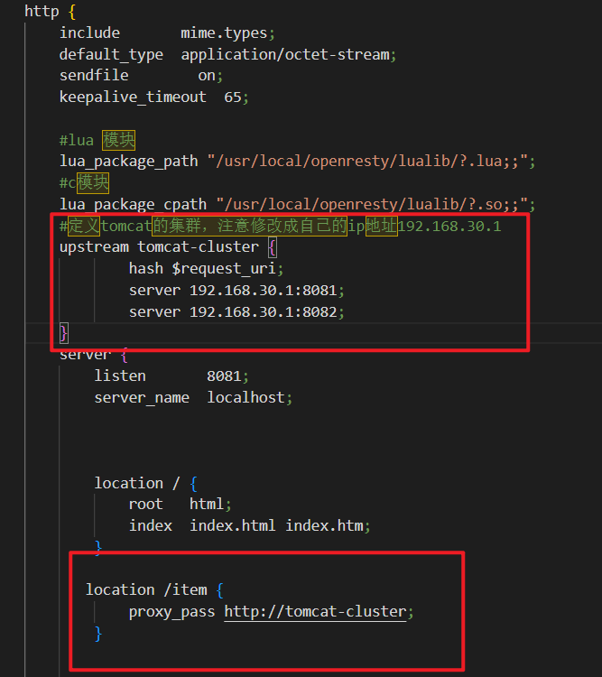


重新加载OpenResty

```sh
nginx -s reload
```


##### 3）测试

启动两台tomcat服务：


同时启动：

 

清空日志后，再次访问页面，可以看到不同id的商品，访问到了不同的tomcat服务：


### Redis缓存预热

Redis缓存会面临冷启动问题：

**冷启动**：服务刚刚启动时，Redis中并没有缓存，如果所有商品数据都在第一次查询时添加缓存，可能会给数据库带来较大压力。

**缓存预热**：在实际开发中，我们可以利用大数据统计用户访问的热点数据，在项目启动时将这些热点数据提前查询并保存到Redis中。


我们数据量较少，并且没有数据统计相关功能，目前可以在启动时将所有数据都放入缓存中。


1）利用Docker安装Redis

```sh
docker run --name redis -p 6379:6379 -d redis redis-server --appendonly yes
```


2）在item-service服务中引入Redis依赖

```xml
<dependency>
    <groupId>org.springframework.boot</groupId>
    <artifactId>spring-boot-starter-data-redis</artifactId>
</dependency>
```


3）配置Redis地址

```yaml
spring:
  redis:
    host: 192.168.30.128
```


4）编写初始化类

缓存预热需要在项目启动时完成，并且必须是拿到RedisTemplate之后。

这里我们利用InitializingBean接口来实现，因为**InitializingBean可以在对象被Spring创建**并且成员变量全部注入后执行。

```java
@Component
public class RedisHandler implements InitializingBean {

    @Autowired
    private StringRedisTemplate redisTemplate;

    @Autowired
    private IItemService itemService;
    @Autowired
    private IItemStockService stockService;

    //spring自带的json处理工具
    private static final ObjectMapper MAPPER = new ObjectMapper();
    
    
    //在服务器启动的时候会自动加载这个方法，这个方法里面完成了对redis初始化数据的操作
    @Override
    public void afterPropertiesSet() throws Exception {
        // 初始化缓存
        // 1.查询商品信息
        List<Item> itemList = itemService.list();
        // 2.放入缓存
        for (Item item : itemList) {
            // 2.1.item序列化为JSON
            String json = MAPPER.writeValueAsString(item);
            // 2.2.存入redis（注意这个key）
            redisTemplate.opsForValue().set("item:id:" + item.getId(), json);
        }

        // 3.查询库存信息
        List<ItemStock> stockList = stockService.list();
        // 4.放入缓存
        for (ItemStock stock : stockList) {
            // 2.1.item序列化为JSON
            String json = MAPPER.writeValueAsString(stock);
            // 2.2.存入redis（注意这个key）
            redisTemplate.opsForValue().set("item:stock:id:" + stock.getId(), json);
        }
    }
}
```


### 查询Redis缓存

现在，Redis缓存已经准备就绪，我们可以再OpenResty中实现查询Redis的逻辑了。如下图红框所示：


当请求进入OpenResty之后：

- 优先查询Redis缓存
- 如果Redis缓存未命中，再查询Tomcat


#### 封装Redis工具

OpenResty提供了操作Redis的模块，我们只要引入该模块就能直接使用。但是为了方便，我们将Redis操作封装到之前的common.lua工具库中。

修改`/usr/local/openresty/lualib/common.lua`文件：

1）引入Redis模块，并初始化Redis对象

```lua
-- 导入redis
local redis = require('resty.redis')
-- 初始化redis
local red = redis:new()
red:set_timeouts(1000, 1000, 1000)
```


2）封装函数，用来释放Redis连接，其实是放入连接池

```lua
-- 关闭redis连接的工具方法，其实是放入连接池
local function close_redis(red)
    local pool_max_idle_time = 10000 -- 连接的空闲时间，单位是毫秒
    local pool_size = 100 --连接池大小
    local ok, err = red:set_keepalive(pool_max_idle_time, pool_size)
    if not ok then
        ngx.log(ngx.ERR, "放入redis连接池失败: ", err)
    end
end
```


3）封装函数，根据key查询Redis数据

```lua
-- 查询redis的方法 ip和port是redis地址，key是查询的key
local function read_redis(ip, port, key)
    -- 获取一个连接
    local ok, err = red:connect(ip, port)
    if not ok then
        ngx.log(ngx.ERR, "连接redis失败 : ", err)
        return nil
    end
    -- 查询redis
    local resp, err = red:get(key)
    -- 查询失败处理
    if not resp then
        ngx.log(ngx.ERR, "查询Redis失败: ", err, ", key = " , key)
    end
    --得到的数据为空处理
    if resp == ngx.null then
        resp = nil
        ngx.log(ngx.ERR, "查询Redis数据为空, key = ", key)
    end
    close_redis(red)
    return resp
end
```


4）导出

```lua
-- 将方法导出
local _M = {  
    read_http = read_http,
    read_redis = read_redis
}  
return _M
```


完整的common.lua：

```lua
-- 导入redis
local redis = require('resty.redis')
-- 初始化redis
local red = redis:new()
red:set_timeouts(1000, 1000, 1000)

-- 关闭redis连接的工具方法，其实是放入连接池
local function close_redis(red)
    local pool_max_idle_time = 10000 -- 连接的空闲时间，单位是毫秒
    local pool_size = 100 --连接池大小
    local ok, err = red:set_keepalive(pool_max_idle_time, pool_size)
    if not ok then
        ngx.log(ngx.ERR, "放入redis连接池失败: ", err)
    end
end

-- 查询redis的方法 ip和port是redis地址，key是查询的key
local function read_redis(ip, port, key)
    -- 获取一个连接
    local ok, err = red:connect(ip, port)
    if not ok then
        ngx.log(ngx.ERR, "连接redis失败 : ", err)
        return nil
    end
    -- 查询redis
    local resp, err = red:get(key)
    -- 查询失败处理
    if not resp then
        ngx.log(ngx.ERR, "查询Redis失败: ", err, ", key = " , key)
    end
    --得到的数据为空处理
    if resp == ngx.null then
        resp = nil
        ngx.log(ngx.ERR, "查询Redis数据为空, key = ", key)
    end
    close_redis(red)
    return resp
end

-- 封装函数，发送http请求，并解析响应
local function read_http(path, params)
    local resp = ngx.location.capture(path,{
        method = ngx.HTTP_GET,
        args = params,
    })
    if not resp then
        -- 记录错误信息，返回404
        ngx.log(ngx.ERR, "http查询失败, path: ", path , ", args: ", args)
        ngx.exit(404)
    end
    return resp.body
end
-- 将方法导出
local _M = {  
    read_http = read_http,
    read_redis = read_redis
}  
return _M
```


#### 实现Redis查询

接下来，我们就可以去修改item.lua文件，实现对Redis的查询了。

查询逻辑是：

- 根据id查询Redis
- 如果查询失败则继续查询Tomcat
- 将查询结果返回

1）修改`/usr/local/openresty/lua/item.lua`文件，添加一个查询函数：

```lua
-- 导入common函数库
local common = require('common')
local read_http = common.read_http
local read_redis = common.read_redis
-- 封装查询函数
function read_data(key, path, params)
    -- 查询本地缓存
    local val = read_redis("127.0.0.1", 6379, key)
    -- 判断查询结果
    if not val then
        ngx.log(ngx.ERR, "redis查询失败，尝试查询http， key: ", key)
        -- redis查询失败，去查询http
        val = read_http(path, params)
    end
    -- 返回数据
    return val
end
```


2）而后修改商品查询、库存查询的业务：

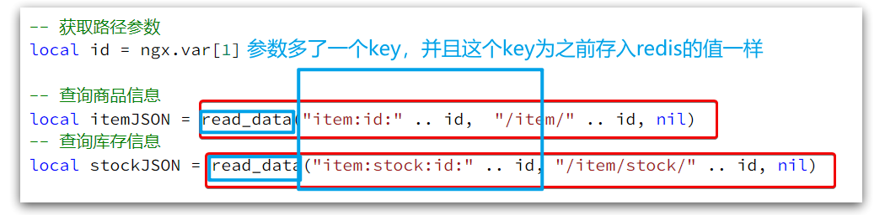


3）完整的item.lua代码：

```lua
-- 导入common函数库
local common = require('common')
local read_http = common.read_http
local read_redis = common.read_redis
-- 导入cjson库
local cjson = require('cjson')

-- 封装查询函数
function read_data(key, path, params)
    -- 查询本地缓存
    local val = read_redis("127.0.0.1", 6379, key)
    -- 判断查询结果
    if not val then
        ngx.log(ngx.ERR, "redis查询失败，尝试查询http， key: ", key)
        -- redis查询失败，去查询http
        val = read_http(path, params)
    end
    -- 返回数据
    return val
end

-- 获取路径参数
local id = ngx.var[1]

-- 查询商品信息
local itemJSON = read_data("item:id:" .. id,  "/item/" .. id, nil)
-- 查询库存信息
local stockJSON = read_data("item:stock:id:" .. id, "/item/stock/" .. id, nil)

-- JSON转化为lua的table
local item = cjson.decode(itemJSON)
local stock = cjson.decode(stockJSON)
-- 组合数据
item.stock = stock.stock
item.sold = stock.sold

-- 把item序列化为json 返回结果
ngx.say(cjson.encode(item))
```


### Nginx本地缓存

现在，整个多级缓存中只差最后一环，也就是nginx的本地缓存了。如图：


#### 本地缓存API

OpenResty为Nginx提供了**shard dict**的功能，可以在nginx的多个worker之间共享数据，实现缓存功能。

1）开启共享字典，在nginx.conf的http下添加配置：

```nginx
 # 共享字典，也就是本地缓存，名称叫做：item_cache，大小150m
 lua_shared_dict item_cache 150m; 
```


2）在item.lua中操作共享字典：

```lua
-- 获取本地缓存对象
local item_cache = ngx.shared.item_cache
-- 存储, 指定key、value、过期时间，单位s，默认为0代表永不过期
item_cache:set('key', 'value', 1000)
-- 读取
local val = item_cache:get('key')
```


#### 实现本地缓存查询

1）修改`/usr/local/openresty/lua/item.lua`文件，修改read_data查询函数，添加本地缓存逻辑：

```lua
-- 导入共享词典，本地缓存
local item_cache = ngx.shared.item_cache

-- 封装查询函数
function read_data(key, expire, path, params)
    -- 查询本地缓存
    local val = item_cache:get(key)
    if not val then
        ngx.log(ngx.ERR, "本地缓存查询失败，尝试查询Redis， key: ", key)
        -- 查询redis
        val = read_redis("127.0.0.1", 6379, key)
        -- 判断查询结果
        if not val then
            ngx.log(ngx.ERR, "redis查询失败，尝试查询http， key: ", key)
            -- redis查询失败，去查询http
            val = read_http(path, params)
        end
    end
    -- 查询成功，把数据写入本地缓存
    item_cache:set(key, val, expire)
    -- 返回数据
    return val
end
```


2）修改item.lua中查询商品和库存的业务，实现最新的read_data函数，注意这里又加了一个参数：


其实就是多了缓存时间参数，过期后nginx缓存会自动删除，下次访问即可更新缓存。

这里给商品基本信息设置超时时间为30分钟，库存为1分钟。

因为库存更新频率较高，如果缓存时间过长，可能与数据库差异较大。


3）完整的item.lua文件：

```lua
-- 导入common函数库
local common = require('common')
local read_http = common.read_http
local read_redis = common.read_redis
-- 导入cjson库
local cjson = require('cjson')
-- 导入共享词典，本地缓存
local item_cache = ngx.shared.item_cache

-- 封装查询函数
function read_data(key, expire, path, params)
    -- 查询本地缓存
    local val = item_cache:get(key)
    if not val then
        ngx.log(ngx.ERR, "本地缓存查询失败，尝试查询Redis， key: ", key)
        -- 查询redis
        val = read_redis("127.0.0.1", 6379, key)
        -- 判断查询结果
        if not val then
            ngx.log(ngx.ERR, "redis查询失败，尝试查询http， key: ", key)
            -- redis查询失败，去查询http
            val = read_http(path, params)
        end
    end
    -- 查询成功，把数据写入本地缓存
    item_cache:set(key, val, expire)
    -- 返回数据
    return val
end

-- 获取路径参数
local id = ngx.var[1]

-- 查询商品信息
local itemJSON = read_data("item:id:" .. id, 1800,  "/item/" .. id, nil)
-- 查询库存信息
local stockJSON = read_data("item:stock:id:" .. id, 60, "/item/stock/" .. id, nil)

-- JSON转化为lua的table
local item = cjson.decode(itemJSON)
local stock = cjson.decode(stockJSON)
-- 组合数据
item.stock = stock.stock
item.sold = stock.sold

-- 把item序列化为json 返回结果
ngx.say(cjson.encode(item))
```


## 缓存同步

大多数情况下，浏览器查询到的都是缓存数据，如果缓存数据与数据库数据存在较大差异，可能会产生比较严重的后果。

所以我们必须保证数据库数据、缓存数据的一致性，这就是缓存与数据库的同步。


### 数据同步策略

缓存数据同步的常见方式有三种：

**设置有效期**：给缓存设置有效期，到期后自动删除。再次查询时更新

- 优势：简单、方便
- 缺点：时效性差，缓存过期之前可能不一致
- 场景：更新频率较低，时效性要求低的业务

**同步双写**：在修改数据库的同时，直接修改缓存

- 优势：时效性强，缓存与数据库强一致
- 缺点：有代码侵入，耦合度高；
- 场景：对一致性、时效性要求较高的缓存数据

**异步通知：**修改数据库时发送事件通知，相关服务监听到通知后修改缓存数据

- 优势：低耦合，可以同时通知多个缓存服务
- 缺点：时效性一般，可能存在中间不一致状态
- 场景：时效性要求一般，有多个服务需要同步


而异步实现又可以基于MQ或者Canal来实现：

1）基于MQ的异步通知：


解读：

- 商品服务完成对数据的修改后，只需要发送一条消息到MQ中。
- 缓存服务监听MQ消息，然后完成对缓存的更新

依然有少量的代码侵入。


2）基于Canal的通知


解读：

- 商品服务完成商品修改后，业务直接结束，没有任何代码侵入
- Canal监听MySQL变化，当发现变化后，立即通知缓存服务
- 缓存服务接收到canal通知，更新缓存

代码零侵入


### 安装Canal

#### 认识Canal

**Canal [kə'næl]**，译意为水道/管道/沟渠，canal是阿里巴巴旗下的一款开源项目，基于Java开发。基于数据库增量日志解析，提供增量数据订阅&消费。GitHub的地址：https://github.com/alibaba/canal

Canal是基于mysql的主从同步来实现的，MySQL主从同步的原理如下：


- 1）MySQL master 将数据变更写入二进制日志( binary log），其中记录的数据叫做binary log events
- 2）MySQL slave 将 master 的 binary log events拷贝到它的中继日志(relay log)
- 3）MySQL slave 重放 relay log 中事件，将数据变更反映它自己的数据


而Canal就是把自己伪装成MySQL的一个slave节点，从而监听master的binary log变化。再把得到的变化信息通知给Canal的客户端，进而完成对其它数据库的同步。

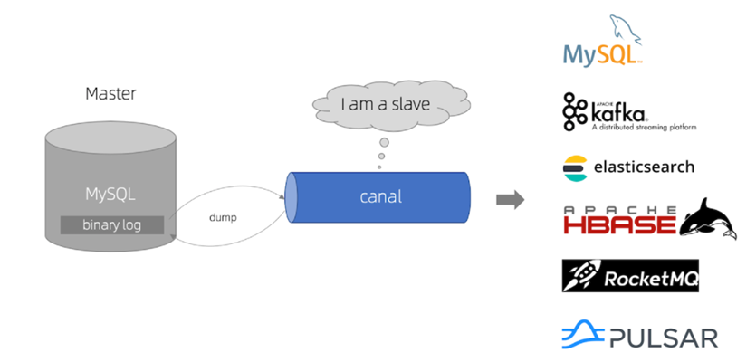


#### 安装Canal

安装和配置Canal参考课前资料文档：

 

># 安装和配置Canal
>
>
>
>下面我们就开启mysql的主从同步机制，让Canal来模拟salve
>
># 1.开启MySQL主从
>
>Canal是基于MySQL的主从同步功能，因此必须先开启MySQL的主从功能才可以。
>
>这里以之前用Docker运行的mysql为例：
>
>## 1.1.开启binlog
>
>打开mysql容器挂载的日志文件，我的在`/tmp/mysql/conf`目录:
>
>
>
>修改文件：
>
>```sh
>vi /tmp/mysql/conf/my.cnf
>```
>
>添加内容：
>
>```ini
>log-bin=/var/lib/mysql/mysql-bin
>binlog-do-db=heima
>```
>
>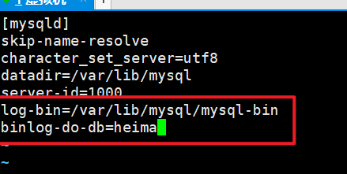
>
>**heima是数据库名称**
>
>配置解读：
>
>- `log-bin=/var/lib/mysql/mysql-bin`：设置binary log文件的存放地址和文件名，叫做mysql-bin
>- `binlog-do-db=heima`：指定对哪个database记录binary log events，这里记录heima这个库
>
>最终效果：
>
>```ini
>[mysqld]
>skip-name-resolve
>character_set_server=utf8
>datadir=/var/lib/mysql
>server-id=1000
>log-bin=/var/lib/mysql/mysql-bin
>binlog-do-db=heima
>```
>
>
>
>## 1.2.设置用户权限
>
>接下来添加一个仅用于数据同步的账户，出于安全考虑，这里仅提供对heima这个库的操作权限。
>
>```mysql
>create user canal@'%' IDENTIFIED by 'canal';
>GRANT SELECT, REPLICATION SLAVE, REPLICATION CLIENT,SUPER ON *.* TO 'canal'@'%' identified by 'canal';
>FLUSH PRIVILEGES;
>```
>
>
>
>重启mysql容器即可
>
>```
>docker restart mysql
>```
>
>
>
>测试设置是否成功：在mysql控制台，或者Navicat中，输入命令：
>
>```
>show master status;
>```
>
>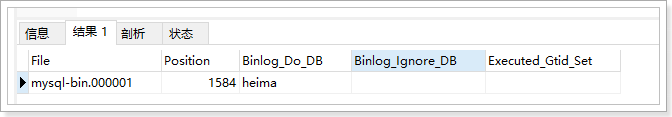 
>
>
>
># 2.安装Canal
>
>
>
>## 2.1.创建网络
>
>我们需要创建一个网络，将MySQL、Canal、MQ放到同一个Docker网络中：
>
>```sh
>docker network create heima
>```
>
>让mysql加入这个网络：
>
>```sh
>docker network connect heima mysql
>```
>
>
>
>
>
>## 2.3.安装Canal
>
>课前资料中提供了canal的镜像压缩包:
>
>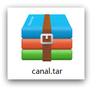 
>
>大家可以上传到虚拟机，然后通过命令导入：
>
>```
>docker load -i canal.tar
>```
>
>
>
>然后运行命令创建Canal容器：
>
>```sh
>docker run -p 11111:11111 --name canal \
>-e canal.destinations=heima \
>-e canal.instance.master.address=mysql:3306  \
>-e canal.instance.dbUsername=canal  \
>-e canal.instance.dbPassword=canal  \
>-e canal.instance.connectionCharset=UTF-8 \
>-e canal.instance.tsdb.enable=true \
>-e canal.instance.gtidon=false  \
>-e canal.instance.filter.regex=heima\\..* \
>--network heima \
>-d canal/canal-server:v1.1.5
>```
>
>
>
>说明:
>
>- `-p 11111:11111`：这是canal的默认监听端口
>- `-e canal.instance.master.address=mysql:3306`：数据库地址和端口，如果不知道mysql容器地址，可以通过`docker inspect 容器id`来查看
>- `-e canal.instance.dbUsername=canal`：数据库用户名
>- `-e canal.instance.dbPassword=canal` ：数据库密码
>- `-e canal.instance.filter.regex=`：要监听的表名称
>
>表名称监听支持的语法：
>
>```
>mysql 数据解析关注的表，Perl正则表达式.
>多个正则之间以逗号(,)分隔，转义符需要双斜杠(\\) 
>常见例子：
>1.  所有表：.*   or  .*\\..*
>2.  canal schema下所有表： canal\\..*
>3.  canal下的以canal打头的表：canal\\.canal.*
>4.  canal schema下的一张表：canal.test1
>5.  多个规则组合使用然后以逗号隔开：canal\\..*,mysql.test1,mysql.test2 
>```
>


### 监听Canal

Canal提供了各种语言的客户端，当Canal监听到binlog变化时，会通知Canal的客户端。


我们可以利用Canal提供的Java客户端，监听Canal通知消息。当收到变化的消息时，完成对缓存的更新。


不过这里我们会使用GitHub上的第三方开源的canal-starter客户端。地址：https://github.com/NormanGyllenhaal/canal-client

与SpringBoot完美整合，自动装配，比官方客户端要简单好用很多。


#### 引入依赖：

```xml
<dependency>
    <groupId>top.javatool</groupId>
    <artifactId>canal-spring-boot-starter</artifactId>
    <version>1.2.1-RELEASE</version>
</dependency>
```


#### 编写配置：

```yaml
canal:
  destination: heima # canal的集群名字，要与安装canal时设置的名称一致
  server: 192.168.30.128:11111 # canal服务地址
```


#### 修改Item实体类

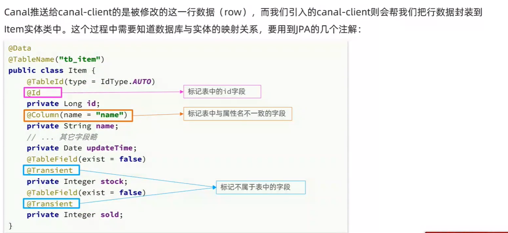

通过@Id、@Column、等注解完成Item与数据库表字段的映射：

```java
package com.heima.item.pojo;

import com.baomidou.mybatisplus.annotation.IdType;
import com.baomidou.mybatisplus.annotation.TableField;
import com.baomidou.mybatisplus.annotation.TableId;
import com.baomidou.mybatisplus.annotation.TableName;
import lombok.Data;
import org.springframework.data.annotation.Id;
import org.springframework.data.annotation.Transient;

import javax.persistence.Column;
import java.util.Date;

@Data
@TableName("tb_item")
public class Item {
    @TableId(type = IdType.AUTO)
    @Id
    private Long id;//商品id
    @Column(name = "name")
    private String name;//商品名称
    private String title;//商品标题
    private Long price;//价格（分）
    private String image;//商品图片
    private String category;//分类名称
    private String brand;//品牌名称
    private String spec;//规格
    private Integer status;//商品状态 1-正常，2-下架
    private Date createTime;//创建时间
    private Date updateTime;//更新时间
    @TableField(exist = false)
    @Transient
    private Integer stock;
    @TableField(exist = false)
    @Transient
    private Integer sold;
}
```


#### 编写监听器

通过实现`EntryHandler<T>`接口编写监听器，监听Canal消息。注意两点：

- 实现类通过`@CanalTable("tb_item")`指定监听的表信息
- EntryHandler的泛型是与表对应的实体类

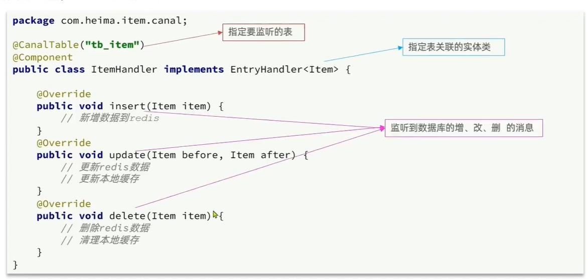

```java
package com.heima.item.canal;

import com.github.benmanes.caffeine.cache.Cache;
import com.heima.item.config.RedisHandler;
import com.heima.item.pojo.Item;
import org.springframework.beans.factory.annotation.Autowired;
import org.springframework.stereotype.Component;
import top.javatool.canal.client.annotation.CanalTable;
import top.javatool.canal.client.handler.EntryHandler;

@CanalTable("tb_item")
@Component
public class ItemHandler implements EntryHandler<Item> {

    @Autowired
    private RedisHandler redisHandler;
    @Autowired
    private Cache<Long, Item> itemCache;

    @Override
    public void insert(Item item) {
        // 写数据到JVM进程缓存
        itemCache.put(item.getId(), item);
        // 写数据到redis
        redisHandler.saveItem(item);
    }

    @Override
    public void update(Item before, Item after) {
        // 写数据到JVM进程缓存
        itemCache.put(after.getId(), after);
        // 写数据到redis
        redisHandler.saveItem(after);
    }

    @Override
    public void delete(Item item) {
        // 删除数据到JVM进程缓存
        itemCache.invalidate(item.getId());
        // 删除数据到redis
        redisHandler.deleteItemById(item.getId());
    }
}
```


在这里对Redis的操作都封装到了RedisHandler这个对象中，是我们之前做缓存预热时编写的一个类，内容如下：

```java
package com.heima.item.config;

import com.fasterxml.jackson.core.JsonProcessingException;
import com.fasterxml.jackson.databind.ObjectMapper;
import com.heima.item.pojo.Item;
import com.heima.item.pojo.ItemStock;
import com.heima.item.service.IItemService;
import com.heima.item.service.IItemStockService;
import org.springframework.beans.factory.InitializingBean;
import org.springframework.beans.factory.annotation.Autowired;
import org.springframework.data.redis.core.StringRedisTemplate;
import org.springframework.stereotype.Component;

import java.util.List;

@Component
public class RedisHandler implements InitializingBean {

    @Autowired
    private StringRedisTemplate redisTemplate;

    @Autowired
    private IItemService itemService;
    @Autowired
    private IItemStockService stockService;

    private static final ObjectMapper MAPPER = new ObjectMapper();

    @Override
    public void afterPropertiesSet() throws Exception {
        // 初始化缓存
        // 1.查询商品信息
        List<Item> itemList = itemService.list();
        // 2.放入缓存
        for (Item item : itemList) {
            // 2.1.item序列化为JSON
            String json = MAPPER.writeValueAsString(item);
            // 2.2.存入redis
            redisTemplate.opsForValue().set("item:id:" + item.getId(), json);
        }

        // 3.查询商品库存信息
        List<ItemStock> stockList = stockService.list();
        // 4.放入缓存
        for (ItemStock stock : stockList) {
            // 2.1.item序列化为JSON
            String json = MAPPER.writeValueAsString(stock);
            // 2.2.存入redis
            redisTemplate.opsForValue().set("item:stock:id:" + stock.getId(), json);
        }
    }

    public void saveItem(Item item) {
        try {
            String json = MAPPER.writeValueAsString(item);
            redisTemplate.opsForValue().set("item:id:" + item.getId(), json);
        } catch (JsonProcessingException e) {
            throw new RuntimeException(e);
        }
    }

    public void deleteItemById(Long id) {
        redisTemplate.delete("item:id:" + id);
    }
}
```

#### 总结

你可能会发现，这里通过Canal实现的实时更新只更新了redis和Tomcat的本地缓存，并没有更新OpenResty也就是Nginx服务器集群里面的缓存，这是因为OpenResty里面的缓存我们设置了超时时间，为了教学方便，我们其实是把所有数据都加入到每级缓存中，但是其实在实际中每级的缓存里面的内容可能是不一样的

知道了这些所以OpenResty存储的数据应该是不重要的，并且应该很久不会变化的，等待过期后再重写去查询，就是这样的思想，tomcat和redis里面可以放任意的数据，但是OpenResty里面存放的数据是有要求的，也就是上面提到的，但是具体这些在不同业务中会有不同的差别，需要根据实际情况来编写。

这一节真的学了好久！

# 服务异步通信-高级篇


消息队列在使用过程中，面临着很多实际问题需要思考：


## 消息可靠性

消息从发送，到消费者接收，会经理多个过程：


其中的每一步都可能导致消息丢失，常见的丢失原因包括：

- 发送时丢失：
  - 生产者发送的消息未送达exchange
  - 消息到达exchange后未到达queue
- MQ宕机，queue将消息丢失
- consumer接收到消息后未消费就宕机


针对这些问题，RabbitMQ分别给出了解决方案：

- 生产者确认机制
- mq持久化
- 消费者确认机制
- 失败重试机制


下面我们就通过案例来演示每一个步骤。

首先，导入课前资料提供的demo工程：*


项目结构如下：


### 生产者消息确认

RabbitMQ提供了publisher confirm机制来避免消息发送到MQ过程中丢失。这种机制必须给每个消息指定一个唯一ID。消息发送到MQ以后，会返回一个结果给**发送者**，表示消息是否处理成功。

返回结果有两种方式：

- publisher-confirm，发送者确认
  - 消息成功投递到交换机，返回ack
  - 消息未投递到交换机，返回nack
- publisher-return，发送者回执
  - 消息投递到交换机了，但是没有路由到队列。返回ACK，及路由失败原因。

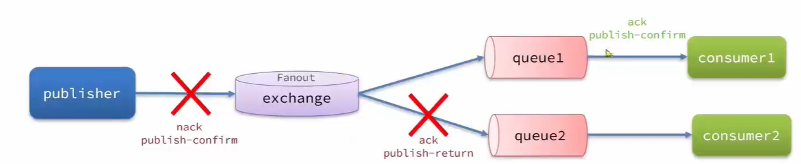


注意：

确认机制发送消息时，需要给每个消息设置一个全局唯一id，以区分不同消息，避免ack冲突


#### 修改配置

首先，修改publisher服务中的application.yml文件，添加下面的内容：

```yaml
spring:
  rabbitmq:
    publisher-confirm-type: correlated
    publisher-returns: true
    template:
      mandatory: true
   
```

说明：

- `publish-confirm-type`：开启publisher-confirm，这里支持两种类型：
  - `simple`：同步等待confirm结果，直到超时(可能会发生阻塞，所以不推荐使用这个)
  - `correlated`：异步回调，定义ConfirmCallback，MQ返回结果时会回调这个ConfirmCallback
- `publish-returns`：开启publish-return功能，同样是基于callback机制，不过是定义ReturnCallback
- `template.mandatory`：定义消息路由失败时的策略。
  - true，则调用ReturnCallback；
  - false：则直接丢弃消息


#### 定义Return回调

每个RabbitTemplate只能配置一个ReturnCallback，因此需要在项目加载时配置：

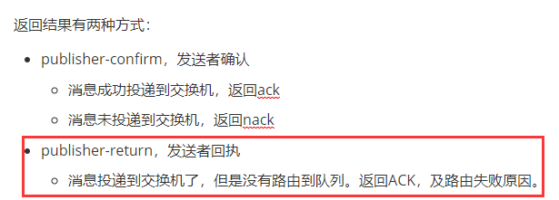

修改publisher服务，添加一个：

```java
package cn.itcast.mq.config;

import lombok.extern.slf4j.Slf4j;
import org.springframework.amqp.rabbit.core.RabbitTemplate;
import org.springframework.beans.BeansException;
import org.springframework.context.ApplicationContext;
import org.springframework.context.ApplicationContextAware;
import org.springframework.context.annotation.Configuration;

@Slf4j
@Configuration
public class CommonConfig implements ApplicationContextAware {
    //这个方法的执行是在bean工厂创建之后执行的，所以下面我们给rabbit'template设置一下配置
    @Override
    public void setApplicationContext(ApplicationContext applicationContext) throws BeansException {
        // 获取RabbitTemplate
        RabbitTemplate rabbitTemplate = applicationContext.getBean(RabbitTemplate.class);
        // 设置ReturnCallback
        rabbitTemplate.setReturnCallback((message, replyCode, replyText, exchange, routingKey) -> {
            // 投递失败，记录日志
            log.info("消息发送失败，应答码{}，原因{}，交换机{}，路由键{},消息{}",
                     replyCode, replyText, exchange, routingKey, message.toString());
            // 如果有业务需要，可以重发消息
        });
    }
}
```


#### 定义ConfirmCallback

ConfirmCallback可以在发送消息时指定，因为每个业务处理confirm成功或失败的逻辑不一定相同。

在publisher服务的cn.itcast.mq.spring.SpringAmqpTest类中，定义一个单元测试方法：

```java
package cn.itcast.mq.spring;

import lombok.extern.slf4j.Slf4j;
import org.junit.Test;
import org.junit.runner.RunWith;
import org.springframework.amqp.rabbit.connection.CorrelationData;
import org.springframework.amqp.rabbit.core.RabbitTemplate;
import org.springframework.beans.factory.annotation.Autowired;
import org.springframework.boot.test.context.SpringBootTest;
import org.springframework.test.context.junit4.SpringRunner;

import java.util.UUID;

@Slf4j
@RunWith(SpringRunner.class)
@SpringBootTest
public class SpringAmqpTest {
    @Autowired
    private RabbitTemplate rabbitTemplate;

    @Test
    public void testSendMessage2SimpleQueue() throws InterruptedException {
        // 1.消息体
        String routingKey = "simple.queue";
        String message = "hello, spring amqp!";

        // 2.全局唯一的消息ID，需要封装到CorrelationData中
        CorrelationData correlationData = new CorrelationData(UUID.randomUUID().toString());
        // 3.添加callback
        correlationData.getFuture().addCallback(result -> {
            if(result.isAck()){
                // 3.1.ack，消息成功
                log.debug("消息发送成功, ID:{}", correlationData.getId());
            }else{
                // 3.2.nack，消息失败
                log.error("消息发送失败, ID:{}, 原因{}",correlationData.getId(), result.getReason());
            }
        }, ex -> log.error("消息发送异常, ID:{}, 原因{}",correlationData.getId(),ex.getMessage()));

        rabbitTemplate.convertAndSend("amq.topic", routingKey, message);
        // 休眠一会儿，等待ack回执
        Thread.sleep(2000);
    }
}

```


#### 总结

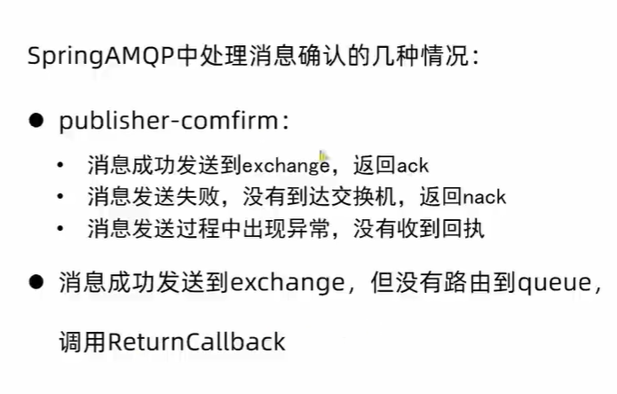

### 消息持久化

RabbitMQ默认是内存存储

生产者确认可以确保消息投递到RabbitMQ的队列中，但是消息发送到RabbitMQ以后，如果突然宕机，也可能导致消息丢失。

要想确保消息在RabbitMQ中安全保存，必须开启消息持久化机制。

- 交换机持久化
- 队列持久化
- 消息持久化

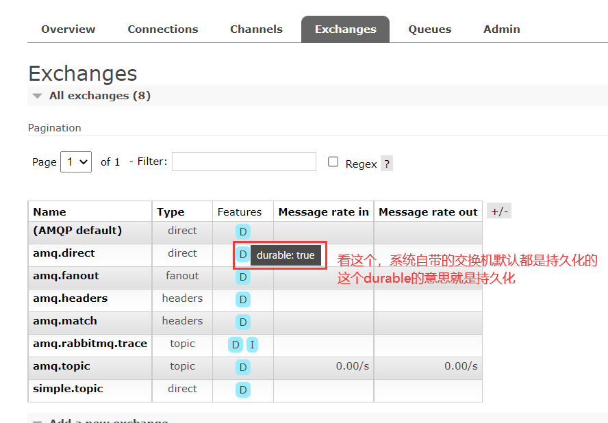

#### 交换机持久化

RabbitMQ中交换机默认是非持久化的，mq重启后就丢失。

我们可以在**消费者的代码**中在config类里面创建队列和交换机


SpringAMQP中可以通过代码指定交换机持久化：

```java
@Bean
public DirectExchange simpleExchange(){
    // 三个参数：交换机名称、是否持久化、当没有queue与其绑定时是否自动删除
    return new DirectExchange("simple.direct", true, false);
}
```

事实上，默认情况下，由SpringAMQP声明的交换机都是持久化的。


可以在RabbitMQ控制台看到持久化的交换机都会带上`D`的标示：


#### 队列持久化

RabbitMQ中队列默认是非持久化的，mq重启后就丢失。


SpringAMQP中可以通过代码指定交换机持久化：

```java
@Bean
public Queue simpleQueue(){
    // 使用QueueBuilder构建队列，durable就是持久化的
    return QueueBuilder.durable("simple.queue").build();
}
```

事实上，默认情况下，由SpringAMQP声明的队列都是持久化的。

可以在RabbitMQ控制台看到持久化的队列都会带上`D`的标示：

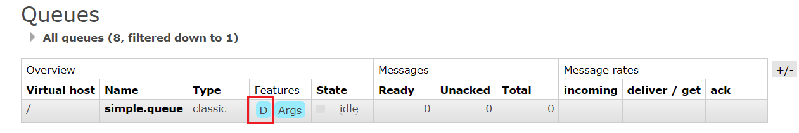


#### 消息持久化

利用SpringAMQP发送消息时，可以设置消息的属性（MessageProperties），指定delivery-mode：

- 1：非持久化
- 2：持久化

用java代码指定：


默认情况下，

SpringAMQP发出的任何消息都是持久化的，不用特意指定。

在Mq的UI界面发送消息可能会是非持久化的


### 消费者消息确认

RabbitMQ是**阅后即焚**机制，RabbitMQ**确认消息被消费者消费**（注意是消费，如果没有被消费但是消费者宕机的话，说明还是没消费，这种情况是不可取的）后会立刻删除。

而RabbitMQ是通过消费者回执来确认消费者是否成功处理消息的：消费者获取消息后，应该向RabbitMQ发送ACK回执，表明自己已经处理消息。


设想这样的场景：

- 1）RabbitMQ投递消息给消费者
- 2）消费者获取消息后，返回ACK给RabbitMQ
- 3）RabbitMQ删除消息
- 4）消费者宕机，消息尚未处理

这样，消息就丢失了。因此消费者返回ACK的时机非常重要。


而SpringAMQP则允许配置三种确认模式：

•manual：手动ack，需要在业务代码结束后，调用api发送ack。

•auto：自动ack，由spring监测listener代码是否出现异常，没有异常则返回ack；抛出异常则返回nack

•none：关闭ack，MQ假定消费者获取消息后会成功处理，因此消息投递后立即被删除


由此可知：

- none模式下，消息投递是不可靠的，可能丢失
- auto模式类似事务机制，出现异常时返回nack，消息回滚到mq；没有异常，返回ack
- manual：自己根据业务情况，判断什么时候该ack

一般，我们都是使用默认的auto即可。


#### 演示none模式

修改consumer服务的application.yml文件，添加下面内容：

```yaml
spring:
  rabbitmq:
    listener:
      simple:
        acknowledge-mode: none # 关闭ack
```

修改consumer服务的SpringRabbitListener类中的方法，模拟一个消息处理异常：

```java
@RabbitListener(queues = "simple.queue")
public void listenSimpleQueue(String msg) {
    log.info("消费者接收到simple.queue的消息：【{}】", msg);
    // 模拟异常
    System.out.println(1 / 0);
    log.debug("消息处理完成！");
}
```

测试可以发现，当消息处理抛异常时，消息依然被RabbitMQ删除了。


#### 演示auto模式

再次把确认机制修改为auto:

```yaml
spring:
  rabbitmq:
    listener:
      simple:
        acknowledge-mode: auto # 关闭ack
```

在异常位置打断点，再次发送消息，程序卡在断点时，可以发现此时消息状态为unack（未确定状态）：


抛出异常后，因为Spring会自动返回nack，所以消息恢复至Ready状态，并且没有被RabbitMQ删除：


### 消费失败重试机制

当消费者出现异常后，消息会不断requeue（重入队）到队列，再重新发送给消费者，然后再次异常，再次requeue，无限循环，导致mq的消息处理飙升，带来不必要的压力：

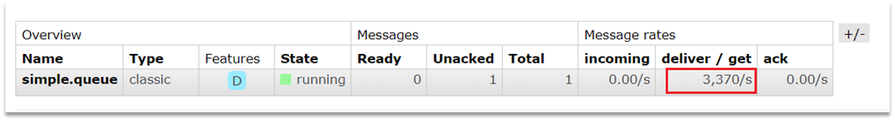

怎么办呢？


#### 本地重试

我们可以利用Spring的retry机制，在消费者出现异常时利用本地重试，而不是无限制的requeue到mq队列。

修改consumer服务的application.yml文件，添加内容：

```yaml
spring:
  rabbitmq:
    listener:
      simple:
        retry:
          enabled: true # 开启消费者失败重试
          initial-interval: 1000 # 初识的失败等待时长为1秒
          multiplier: 1 # 失败的等待时长倍数，下次等待时长 = multiplier * last-interval
          max-attempts: 3 # 最大重试次数
          stateless: true # true无状态；false有状态。如果业务中包含事务，这里改为false   （这个配置没使用没啥用）
```


重启consumer服务，重复之前的测试。可以发现：

- 在重试3次后，SpringAMQP会抛出异常AmqpRejectAndDontRequeueException，说明本地重试触发了
- 查看RabbitMQ控制台，发现消息被删除了，说明最后SpringAMQP返回的是ack，mq删除消息了


结论：

- 开启本地重试时，消息处理过程中抛出异常，不会requeue到队列，而是在消费者本地重试
- 重试达到最大次数后，Spring会返回ack，消息会被丢弃


#### 失败策略

在之前的测试中，达到最大重试次数后，消息会被丢弃，这是由Spring内部机制决定的。

在开启重试模式后，重试次数耗尽，如果消息依然失败，则需要有MessageRecovery接口来处理，它包含三种不同的实现：

- RejectAndDontRequeueRecoverer：重试耗尽后，直接reject，丢弃消息。默认就是这种方式

- ImmediateRequeueMessageRecoverer：重试耗尽后，返回nack，消息重新入队

- RepublishMessageRecoverer：重试耗尽后，将失败消息投递到指定的交换机（这个就是所谓的死信交换机）


比较优雅的一种处理方案是RepublishMessageRecoverer，失败后将消息投递到一个指定的，专门存放异常消息的队列，后续由人工集中处理。

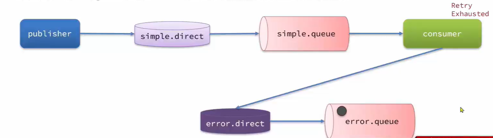  


1）在consumer服务中定义处理失败消息的交换机和队列

```java
@Bean
public DirectExchange errorMessageExchange(){
    return new DirectExchange("error.direct");
}
@Bean
public Queue errorQueue(){
    return new Queue("error.queue", true);
}
@Bean
public Binding errorBinding(Queue errorQueue, DirectExchange errorMessageExchange){
    return BindingBuilder.bind(errorQueue).to(errorMessageExchange).with("error");
}
```


2）定义一个RepublishMessageRecoverer，关联队列和交换机

```java
@Bean
public MessageRecoverer republishMessageRecoverer(RabbitTemplate rabbitTemplate){
    return new RepublishMessageRecoverer(rabbitTemplate, "error.direct", "error");
}
```


完整代码：

```java
package cn.itcast.mq.config;

import org.springframework.amqp.core.Binding;
import org.springframework.amqp.core.BindingBuilder;
import org.springframework.amqp.core.DirectExchange;
import org.springframework.amqp.core.Queue;
import org.springframework.amqp.rabbit.core.RabbitTemplate;
import org.springframework.amqp.rabbit.retry.MessageRecoverer;
import org.springframework.amqp.rabbit.retry.RepublishMessageRecoverer;
import org.springframework.context.annotation.Bean;

@Configuration
public class ErrorMessageConfig {
    @Bean
    public DirectExchange errorMessageExchange(){
        return new DirectExchange("error.direct");
    }
    @Bean
    public Queue errorQueue(){
        return new Queue("error.queue", true);
    }
    @Bean
    public Binding errorBinding(Queue errorQueue, DirectExchange errorMessageExchange){
        return BindingBuilder.bind(errorQueue).to(errorMessageExchange).with("error");
    }

    @Bean
    public MessageRecoverer republishMessageRecoverer(RabbitTemplate rabbitTemplate){
        return new RepublishMessageRecoverer(rabbitTemplate, "error.direct", "error");
    }
}
```


### 总结

如何确保RabbitMQ消息的可靠性？

- 开启生产者确认机制，确保生产者的消息能到达队列
- 开启持久化功能，确保消息未消费前在队列中不会丢失
- 开启消费者确认机制为auto，由spring确认消息处理成功后完成ack
- 开启消费者失败重试机制，并设置MessageRecoverer，多次重试失败后将消息投递到异常交换机，交由人工处理


## 死信交换机

### 初识死信交换机

#### 什么是死信交换机

什么是死信？

当一个队列中的消息满足下列情况之一时，可以成为死信（dead letter）：

- 消费者使用basic.reject或 basic.nack声明消费失败，并且消息的requeue参数设置为false
- 消息是一个过期消息，超时无人消费
- 要投递的队列消息满了，无法投递


如果这个包含死信的队列配置了`dead-letter-exchange`属性，指定了一个交换机，那么队列中的死信就会投递到这个交换机中，而这个交换机称为**死信交换机**（Dead Letter Exchange，检查DLX）。


如图，一个消息被消费者拒绝了，变成了死信：


因为simple.queue绑定了死信交换机 dl.direct，因此死信会投递给这个交换机：


如果这个死信交换机也绑定了一个队列，则消息最终会进入这个存放死信的队列：


另外，队列将死信投递给死信交换机时，必须知道两个信息：

- 死信交换机名称
- 死信交换机与死信队列绑定的RoutingKey

这样才能确保投递的消息能到达死信交换机，并且正确的路由到死信队列。

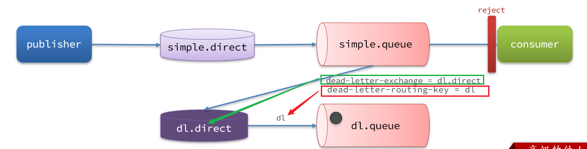


#### 利用死信交换机接收死信（拓展）

在失败重试策略中，默认的RejectAndDontRequeueRecoverer会在本地重试次数耗尽后，发送reject给RabbitMQ，消息变成死信，被丢弃。


我们可以给simple.queue添加一个死信交换机，给死信交换机绑定一个队列。这样消息变成死信后也不会丢弃，而是最终投递到死信交换机，路由到与死信交换机绑定的队列。


我们在consumer服务中，定义一组死信交换机、死信队列：

```java
// 声明普通的 simple.queue队列，并且为其指定死信交换机：dl.direct
@Bean
public Queue simpleQueue2(){
    return QueueBuilder.durable("simple.queue") // 指定队列名称，并持久化
        .deadLetterExchange("dl.direct") // 指定死信交换机
        .build();
}
// 声明死信交换机 dl.direct
@Bean
public DirectExchange dlExchange(){
    return new DirectExchange("dl.direct", true, false);
}
// 声明存储死信的队列 dl.queue
@Bean
public Queue dlQueue(){
    return new Queue("dl.queue", true);
}
// 将死信队列 与 死信交换机绑定
@Bean
public Binding dlBinding(){
    return BindingBuilder.bind(dlQueue()).to(dlExchange()).with("simple");
}
```


#### 总结

什么样的消息会成为死信？

- 消息被消费者reject或者返回nack
- 消息超时未消费
- 队列满了

死信交换机的使用场景是什么？

- 如果队列绑定了死信交换机，死信会投递到死信交换机；
- 可以利用死信交换机收集所有消费者处理失败的消息（死信），交由人工处理，进一步提高消息队列的可靠性。


### TTL

TTL，也就是Time-To-Live。如果一个队列中的消息**TTL结束**仍未消费，则会变为死信。

一个队列中的消息如果**超时**未消费，则会变为死信，超时分为两种情况：

- 消息所在的队列设置了超时时间
- 消息本身设置了超时时间


#### 接收超时死信的死信交换机

在consumer服务的SpringRabbitListener中，定义一个新的消费者，并且声明 死信交换机、死信队列：

```java
@RabbitListener(bindings = @QueueBinding(
    value = @Queue(name = "dl.ttl.queue", durable = "true"),
    exchange = @Exchange(name = "dl.ttl.direct"),
    key = "ttl"
))
public void listenDlQueue(String msg){
    log.info("接收到 dl.ttl.queue的延迟消息：{}", msg);
}
```


#### 声明一个队列，并且指定TTL

要给队列设置超时时间，需要在声明队列时配置x-message-ttl属性：

```java
@Bean
public Queue ttlQueue(){
    return QueueBuilder.durable("ttl.queue") // 指定队列名称，并持久化
        .ttl(10000) // 设置队列的超时时间，10秒
        .deadLetterExchange("dl.ttl.direct") // 指定死信交换机
        .build();
}
```

注意，这个队列设定了死信交换机为`dl.ttl.direct`


声明交换机，将ttl与交换机绑定：

```java
@Bean
public DirectExchange ttlExchange(){
    return new DirectExchange("ttl.direct");
}
@Bean
public Binding ttlBinding(){
    return BindingBuilder.bind(ttlQueue()).to(ttlExchange()).with("ttl");
}
```


发送消息，但是不要指定TTL：

```java
@Test
public void testTTLQueue() {
    // 创建消息
    String message = "hello, ttl queue";
    // 消息ID，需要封装到CorrelationData中
    CorrelationData correlationData = new CorrelationData(UUID.randomUUID().toString());
    // 发送消息
    rabbitTemplate.convertAndSend("ttl.direct", "ttl", message, correlationData);
    // 记录日志
    log.debug("发送消息成功");
}
```

发送消息的日志：


查看下接收消息的日志：

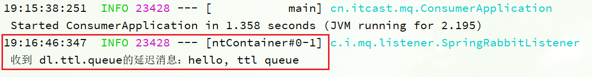


因为队列的TTL值是10000ms，也就是10秒。可以看到消息发送与接收之间的时差刚好是10秒。


#### 发送消息时，设定TTL

在发送消息时，也可以指定TTL：

```java
@Test
public void testTTLMsg() {
    // 创建消息
    Message message = MessageBuilder
        .withBody("hello, ttl message".getBytes(StandardCharsets.UTF_8))
        .setExpiration("5000")
        .build();
    // 消息ID，需要封装到CorrelationData中
    CorrelationData correlationData = new CorrelationData(UUID.randomUUID().toString());
    // 发送消息
    rabbitTemplate.convertAndSend("ttl.direct", "ttl", message, correlationData);
    log.debug("发送消息成功");
}
```


查看发送消息日志：


接收消息日志：


这次，发送与接收的延迟只有5秒。说明当队列、消息都设置了TTL时，**任意一个到期**就会成为死信。


#### 总结

消息超时的两种方式是？

- 给队列设置ttl属性，进入队列后超过ttl时间的消息变为死信
- 给消息设置ttl属性，队列接收到消息超过ttl时间后变为死信

如何实现发送一个消息20秒后消费者才收到消息？

- 给消息的目标队列指定死信交换机
- 将消费者监听的队列绑定到死信交换机
- 发送消息时给消息设置超时时间为20秒


### 延迟队列

利用TTL结合死信交换机，我们实现了消息发出后，消费者延迟收到消息的效果。这种消息模式就称为延迟队列（Delay Queue）模式。

延迟队列的使用场景包括：

- 延迟发送短信
- 用户下单，如果用户在15 分钟内未支付，则自动取消
- 预约工作会议，20分钟后自动通知所有参会人员


因为延迟队列的需求非常多，所以RabbitMQ的官方也推出了一个插件，原生支持延迟队列效果。

这个插件就是DelayExchange插件。参考RabbitMQ的插件列表页面：https://www.rabbitmq.com/community-plugins.html


使用方式可以参考官网地址：https://blog.rabbitmq.com/posts/2015/04/scheduling-messages-with-rabbitmq

#### 安装DelayExchange插件

参考课前资料：


># 2.安装DelayExchange插件
>
>官方的安装指南地址为：https://blog.rabbitmq.com/posts/2015/04/scheduling-messages-with-rabbitmq
>
>上述文档是基于linux原生安装RabbitMQ，然后安装插件。
>
>
>
>因为我们之前是基于Docker安装RabbitMQ，所以下面我们会讲解基于Docker来安装RabbitMQ插件。
>
>## 2.1.下载插件
>
>RabbitMQ有一个官方的插件社区，地址为：https://www.rabbitmq.com/community-plugins.html
>
>其中包含各种各样的插件，包括我们要使用的DelayExchange插件：
>
>
>
>
>
>大家可以去对应的GitHub页面下载3.8.9版本的插件，地址为https://github.com/rabbitmq/rabbitmq-delayed-message-exchange/releases/tag/3.8.9这个对应RabbitMQ的3.8.5以上版本。
>
>
>
>课前资料也提供了下载好的插件：
>
>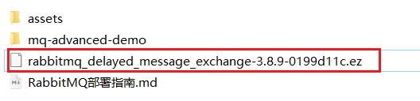
>
>
>
>## 2.2.上传插件
>
>因为我们是基于Docker安装，所以需要先查看RabbitMQ的插件目录对应的数据卷。如果不是基于Docker的同学，请参考第一章部分，重新创建Docker容器。
>
>我们之前设定的RabbitMQ的数据卷名称为`mq-plugins`，所以我们使用下面命令查看数据卷：
>
>```sh
>docker volume inspect mq-plugins
>```
>
>可以得到下面结果：
>
>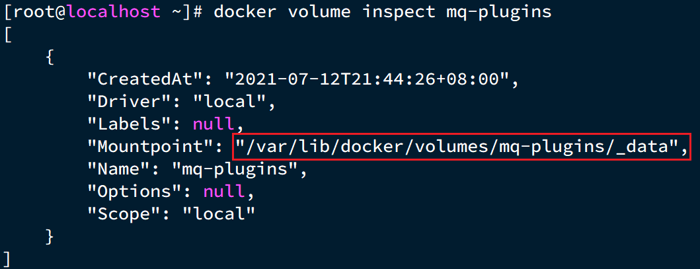
>
>接下来，将插件上传到这个目录即可：
>
>
>
>
>
>## 2.3.安装插件
>
>最后就是安装了，需要进入MQ容器内部来执行安装。我的容器名为`mq`，所以执行下面命令：
>
>```sh
>docker exec -it mq bash
>```
>
>执行时，请将其中的 `-it` 后面的`mq`替换为你自己的容器名.
>
>进入容器内部后，执行下面命令开启插件：
>
>```sh
>rabbitmq-plugins enable rabbitmq_delayed_message_exchange
>```
>
>结果如下：
>
>

#### DelayExchange原理

DelayExchange需要将一个交换机声明为delayed类型。当我们发送消息到delayExchange时，流程如下：

- 接收消息
- 判断消息是否具备x-delay属性
- 如果有x-delay属性，说明是延迟消息，持久化到硬盘，读取x-delay值，作为延迟时间
- 返回routing not found结果给消息发送者
- x-delay时间到期后，重新投递消息到指定队列


#### 使用DelayExchange

插件的使用也非常简单：声明一个交换机，交换机的类型可以是任意类型，只需要设定delayed属性为true即可，然后声明队列与其绑定即可(之后的工作spring会帮我们处理)。

##### 1）声明DelayExchange交换机

基于注解方式（推荐）：


也可以基于@Bean的方式：


##### 2）发送消息

发送消息时，一定要携带x-delay属性，指定延迟的时间：


#### 总结

延迟队列插件的使用步骤包括哪些？

•声明一个交换机，添加delayed属性为true

•发送消息时，添加x-delay头，值为超时时间


## 惰性队列

### 消息堆积问题

当生产者发送消息的速度超过了消费者处理消息的速度，就会导致队列中的消息堆积，直到队列存储消息达到上限。之后发送的消息就会成为死信，可能会被丢弃，这就是消息堆积问题。


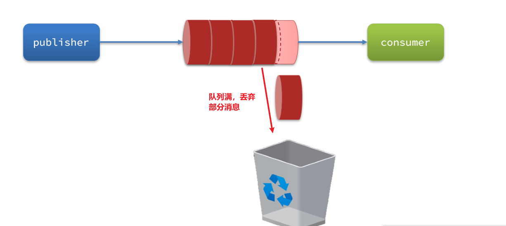


解决消息堆积有三种思路：

- 增加更多消费者，提高消费速度。也就是我们之前说的work queue模式
- 在消费者内开启线程池加快消息处理速度
- 扩大队列容积，提高堆积上限


要提升队列容积，把消息保存在内存中显然是不行的。


### 惰性队列

从RabbitMQ的3.6.0版本开始，就增加了Lazy Queues的概念，也就是惰性队列。惰性队列的特征如下：

- 接收到消息后直接存入磁盘而非内存
- 消费者要消费消息时才会从磁盘中读取并加载到内存
- 支持数百万条的消息存储


#### 基于命令行设置lazy-queue

而要设置一个队列为惰性队列，只需要在声明队列时，指定x-queue-mode属性为lazy即可。可以通过命令行将一个运行中的队列修改为惰性队列：

```sh
rabbitmqctl set_policy Lazy "^lazy-queue$" '{"queue-mode":"lazy"}' --apply-to queues  
```

命令解读：

- `rabbitmqctl` ：RabbitMQ的命令行工具
- `set_policy` ：添加一个策略
- `Lazy` ：策略名称，可以自定义
- `"^lazy-queue$"` ：用正则表达式匹配队列的名字
- `'{"queue-mode":"lazy"}'` ：设置队列模式为lazy模式
- `--apply-to queues  `：策略的作用对象，是所有的队列


#### 基于@Bean声明lazy-queue


#### 基于@RabbitListener声明LazyQueue


#### 使用发送者进行测试

```java
@Test
public void testLazyQueue(){
    for (int i = 0; i < 1000000; i++) {
        Message message = MessageBuilder
                .withBody("延迟队列".getBytes(StandardCharsets.UTF_8))
                .setDeliveryMode(MessageDeliveryMode.NON_PERSISTENT)
                .build();
        rabbitTemplate.convertAndSend("lazy.queue",message);
    }
}
```

这里我同时用了普通的队列进行对比测试，这个lazyqueue要比normalqueue快的多（不知道是不是我的心理作用），并且数据不会丢失

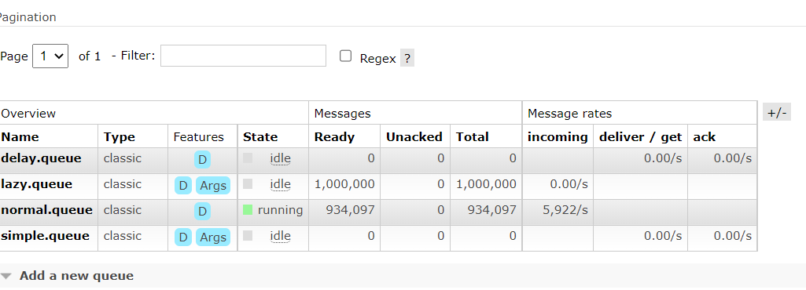


### 总结

消息堆积问题的解决方案？

- 队列上绑定多个消费者，提高消费速度
- 使用惰性队列，可以再mq中保存更多消息

惰性队列的优点有哪些？

- 基于磁盘存储，消息上限高
- 没有间歇性的page-out，性能比较稳定

惰性队列的缺点有哪些？

- 基于磁盘存储，消息时效性会降低
- 性能受限于磁盘的IO


## MQ集群


### 集群分类

RabbitMQ的是基于Erlang语言编写，而Erlang又是一个面向并发的语言，天然支持集群模式。RabbitMQ的集群有两种模式：

•**普通集群**：是一种分布式集群，将队列分散到集群的各个节点，从而提高整个集群的并发能力。

•**镜像集群**：是一种主从集群，普通集群的基础上，添加了主从备份功能，提高集群的数据可用性。


镜像集群虽然支持主从，但主从同步并不是强一致的，某些情况下可能有数据丢失的风险。因此在RabbitMQ的3.8版本以后，推出了新的功能：**仲裁队列**来代替镜像集群，底层采用Raft协议确保主从的数据一致性。


### 普通集群


#### 集群结构和特征

普通集群，或者叫标准集群（classic cluster），具备下列特征：

- 会在集群的各个节点间共享部分数据，包括：交换机、队列元信息。不包含队列中的消息。
- 当访问集群某节点时，如果队列不在该节点，会从数据所在节点传递到当前节点并返回（意思就是如果你访问的是3，但是你想取到的是1，3就会帮你转发到1）
- 队列所在节点宕机，队列中的消息就会丢失

结构如图：


#### 部署


参考课前资料：《RabbitMQ部署指南.md》

># 3.集群部署
>
>接下来，我们看看如何安装RabbitMQ的集群。
>
>## 2.1.集群分类
>
>在RabbitMQ的官方文档中，讲述了两种集群的配置方式：
>
>- 普通模式：普通模式集群不进行数据同步，每个MQ都有自己的队列、数据信息（其它元数据信息如交换机等会同步）。例如我们有2个MQ：mq1，和mq2，如果你的消息在mq1，而你连接到了mq2，那么mq2会去mq1拉取消息，然后返回给你。如果mq1宕机，消息就会丢失。
>- 镜像模式：与普通模式不同，队列会在各个mq的镜像节点之间同步，因此你连接到任何一个镜像节点，均可获取到消息。而且如果一个节点宕机，并不会导致数据丢失。不过，这种方式增加了数据同步的带宽消耗。
>
>
>
>我们先来看普通模式集群，我们的计划部署3节点的mq集群：
>
>| 主机名 | 控制台端口      | amqp通信端口    |
>| ------ | --------------- | --------------- |
>| mq1    | 8081 ---> 15672 | 8071 ---> 5672  |
>| mq2    | 8082 ---> 15672 | 8072 ---> 5672  |
>| mq3    | 8083 ---> 15672 | 8073  ---> 5672 |
>
>
>
>集群中的节点标示默认都是：`rabbit@[hostname]`，因此以上三个节点的名称分别为：
>
>- rabbit@mq1
>- rabbit@mq2
>- rabbit@mq3
>
>
>
>## 2.2.获取cookie
>
>RabbitMQ底层依赖于Erlang，而Erlang虚拟机就是一个面向分布式的语言，默认就支持集群模式。集群模式中的每个RabbitMQ 节点使用 cookie 来确定它们是否被允许相互通信。
>
>要使两个节点能够通信，它们必须具有相同的共享秘密，称为**Erlang cookie**。cookie 只是一串最多 255 个字符的字母数字字符。
>
>每个集群节点必须具有**相同的 cookie**。实例之间也需要它来相互通信。
>
>
>
>我们先在之前启动的mq容器中获取一个cookie值，作为集群的cookie。执行下面的命令：
>
>```sh
>docker exec -it mq cat /var/lib/rabbitmq/.erlang.cookie
>```
>
>可以看到cookie值如下：
>
>```sh
>FXZMCVGLBIXZCDEMMVZQ
>```
>
>
>
>接下来，停止并删除当前的mq容器，我们重新搭建集群。
>
>```sh
>docker rm -f mq
>```
>
>
>
>
>
>清原来数据卷的挂载
>
>```
>docker volume prune
>```
>
>
>
>## 2.3.准备集群配置
>
>在/tmp目录新建一个配置文件 rabbitmq.conf：
>
>```sh
>cd /tmp
># 创建文件
>touch rabbitmq.conf
>```
>
>文件内容如下：
>
>```nginx
>loopback_users.guest = false
>listeners.tcp.default = 5672
>cluster_formation.peer_discovery_backend = rabbit_peer_discovery_classic_config
>cluster_formation.classic_config.nodes.1 = rabbit@mq1
>cluster_formation.classic_config.nodes.2 = rabbit@mq2
>cluster_formation.classic_config.nodes.3 = rabbit@mq3
>```
>
>
>
>再创建一个文件，记录cookie
>
>```sh
>cd /tmp
># 创建cookie文件
>touch .erlang.cookie
># 写入cookie
>echo "FXZMCVGLBIXZCDEMMVZQ" > .erlang.cookie
># 修改cookie文件的权限
>chmod 600 .erlang.cookie
>```
>
>
>
>
>
>准备三个目录,mq1、mq2、mq3：
>
>```sh
>cd /tmp
># 创建目录
>mkdir mq1 mq2 mq3
>```
>
>
>
>然后拷贝rabbitmq.conf、cookie文件到mq1、mq2、mq3：
>
>```sh
># 进入/tmp
>cd /tmp
># 拷贝
>cp rabbitmq.conf mq1
>cp rabbitmq.conf mq2
>cp rabbitmq.conf mq3
>cp .erlang.cookie mq1
>cp .erlang.cookie mq2
>cp .erlang.cookie mq3
>```
>
>
>
>
>
>## 2.4.启动集群
>
>创建一个网络：
>
>```sh
>docker network create mq-net
>```
>
>
>
>
>
>
>
>运行命令
>
>```sh
>docker run -d --net mq-net \
>-v ${PWD}/mq1/rabbitmq.conf:/etc/rabbitmq/rabbitmq.conf \
>-v ${PWD}/.erlang.cookie:/var/lib/rabbitmq/.erlang.cookie \
>-e RABBITMQ_DEFAULT_USER=itcast \
>-e RABBITMQ_DEFAULT_PASS=123321 \
>--name mq1 \
>--hostname mq1 \
>-p 8071:5672 \
>-p 8081:15672 \
>rabbitmq:3.8-management
>```
>
>
>
>```sh
>docker run -d --net mq-net \
>-v ${PWD}/mq2/rabbitmq.conf:/etc/rabbitmq/rabbitmq.conf \
>-v ${PWD}/.erlang.cookie:/var/lib/rabbitmq/.erlang.cookie \
>-e RABBITMQ_DEFAULT_USER=itcast \
>-e RABBITMQ_DEFAULT_PASS=123321 \
>--name mq2 \
>--hostname mq2 \
>-p 8072:5672 \
>-p 8082:15672 \
>rabbitmq:3.8-management
>```
>
>
>
>```sh
>docker run -d --net mq-net \
>-v ${PWD}/mq3/rabbitmq.conf:/etc/rabbitmq/rabbitmq.conf \
>-v ${PWD}/.erlang.cookie:/var/lib/rabbitmq/.erlang.cookie \
>-e RABBITMQ_DEFAULT_USER=itcast \
>-e RABBITMQ_DEFAULT_PASS=123321 \
>--name mq3 \
>--hostname mq3 \
>-p 8073:5672 \
>-p 8083:15672 \
>rabbitmq:3.8-management
>```
>
>
>
>## 2.5.测试
>
>在mq1这个节点上添加一个队列：
>
>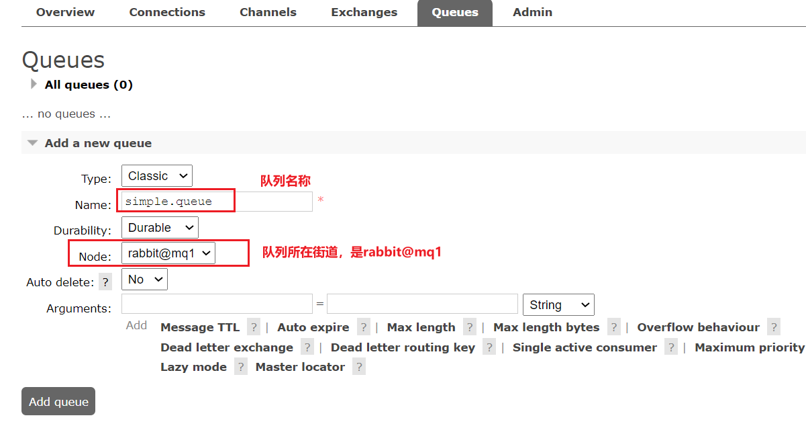
>
>如图，在mq2和mq3两个控制台也都能看到：
>
>
>
>
>
>### 2.5.1.数据共享测试
>
>点击这个队列，进入管理页面：
>
>
>
>然后利用控制台发送一条消息到这个队列：
>
>
>
>
>
>结果在mq2、mq3上都能看到这条消息：
>
>
>
>
>
>
>
>### 2.5.2.可用性测试
>
>我们让其中一台节点mq1宕机：
>
>```sh
>docker stop mq1
>```
>
>然后登录mq2或mq3的控制台，发现simple.queue也不可用了：
>
>
>
>
>
>说明数据并没有拷贝到mq2和mq3。
>

### 镜像集群


#### 集群结构和特征

镜像集群：本质是主从模式，具备下面的特征：

- 交换机、队列、队列中的消息会在各个mq的镜像节点之间同步备份。
- 创建队列的节点被称为该队列的**主节点，**备份到的其它节点叫做该队列的**镜像**节点。
- 一个队列的主节点可能是另一个队列的镜像节点
- 所有操作都是主节点完成，然后同步给镜像节点
- 主宕机后，镜像节点会替代成新的主

结构如图：


#### 部署

参考课前资料：《RabbitMQ部署指南.md》

># 4.镜像模式
>
>在刚刚的案例中，一旦创建队列的主机宕机，队列就会不可用。不具备高可用能力。如果要解决这个问题，必须使用官方提供的镜像集群方案。
>
>官方文档地址：https://www.rabbitmq.com/ha.html
>
>
>
>## 4.1.镜像模式的特征
>
>默认情况下，队列只保存在创建该队列的节点上。而镜像模式下，创建队列的节点被称为该队列的**主节点**，队列还会拷贝到集群中的其它节点，也叫做该队列的**镜像**节点。
>
>但是，不同队列可以在集群中的任意节点上创建，因此不同队列的主节点可以不同。甚至，**一个队列的主节点可能是另一个队列的镜像节点**。
>
>用户发送给队列的一切请求，例如发送消息、消息回执默认都会在主节点完成，如果是从节点接收到请求，也会路由到主节点去完成。**镜像节点仅仅起到备份数据作用**。
>
>当主节点接收到消费者的ACK时，所有镜像都会删除节点中的数据。
>
>
>
>总结如下：
>
>- 镜像队列结构是一主多从（从就是镜像）
>- 所有操作都是主节点完成，然后同步给镜像节点
>- 主宕机后，镜像节点会替代成新的主（如果在主从同步完成前，主就已经宕机，可能出现数据丢失）
>- 不具备负载均衡功能，因为所有操作都会有主节点完成（但是不同队列，其主节点可以不同，可以利用这个提高吞吐量）
>
>
>
>## 4.2.镜像模式的配置
>
>镜像模式的配置有3种模式：
>
>| ha-mode         | ha-params         | 效果                                                         |
>| :-------------- | :---------------- | :----------------------------------------------------------- |
>| 准确模式exactly | 队列的副本量count | 集群中队列副本（主服务器和镜像服务器之和）的数量。count如果为1意味着单个副本：即队列主节点。count值为2表示2个副本：1个队列主和1个队列镜像。换句话说：count = 镜像数量 + 1。如果群集中的节点数少于count，则该队列将镜像到所有节点。如果有集群总数大于count+1，并且包含镜像的节点出现故障，则将在另一个节点上创建一个新的镜像。 |
>| all             | (none)            | 队列在群集中的所有节点之间进行镜像。队列将镜像到任何新加入的节点。镜像到所有节点将对所有群集节点施加额外的压力，包括网络I / O，磁盘I / O和磁盘空间使用情况。推荐使用exactly，设置副本数为（N / 2 +1）。 |
>| nodes           | *node names*      | 指定队列创建到哪些节点，如果指定的节点全部不存在，则会出现异常。如果指定的节点在集群中存在，但是暂时不可用，会创建节点到当前客户端连接到的节点。 |
>
>这里我们以rabbitmqctl命令作为案例来讲解配置语法。
>
>语法示例：
>
>### 4.2.1.exactly模式
>
>```
>rabbitmqctl set_policy ha-two "^two\." '{"ha-mode":"exactly","ha-params":2,"ha-sync-mode":"automatic"}'
>```
>
>- `rabbitmqctl set_policy`：固定写法
>- `ha-two`：策略名称，自定义
>- `"^two\."`：匹配队列的正则表达式，符合命名规则的队列才生效，这里是任何以`two.`开头的队列名称
>- `'{"ha-mode":"exactly","ha-params":2,"ha-sync-mode":"automatic"}'`: 策略内容
>- `"ha-mode":"exactly"`：策略模式，此处是exactly模式，指定副本数量
>- `"ha-params":2`：策略参数，这里是2，就是副本数量为2，1主1镜像
>- `"ha-sync-mode":"automatic"`：同步策略，默认是manual，即新加入的镜像节点不会同步旧的消息。如果设置为automatic，则新加入的镜像节点会把主节点中所有消息都同步，会带来额外的网络开销
>
>### 4.2.2.all模式
>
>```
>rabbitmqctl set_policy ha-all "^all\." '{"ha-mode":"all"}'
>```
>
>- `ha-all`：策略名称，自定义
>- `"^all\."`：匹配所有以`all.`开头的队列名
>- `'{"ha-mode":"all"}'`：策略内容
>- `"ha-mode":"all"`：策略模式，此处是all模式，即所有节点都会称为镜像节点
>
>### 4.2.3.nodes模式
>
>```
>rabbitmqctl set_policy ha-nodes "^nodes\." '{"ha-mode":"nodes","ha-params":["rabbit@nodeA", "rabbit@nodeB"]}'
>```
>
>- `rabbitmqctl set_policy`：固定写法
>- `ha-nodes`：策略名称，自定义
>- `"^nodes\."`：匹配队列的正则表达式，符合命名规则的队列才生效，这里是任何以`nodes.`开头的队列名称
>- `'{"ha-mode":"nodes","ha-params":["rabbit@nodeA", "rabbit@nodeB"]}'`: 策略内容
>- `"ha-mode":"nodes"`：策略模式，此处是nodes模式
>- `"ha-params":["rabbit@mq1", "rabbit@mq2"]`：策略参数，这里指定副本所在节点名称
>
>
>
>## 4.3.测试
>
>我们使用exactly模式的镜像，因为集群节点数量为3，因此镜像数量就设置为2.
>
>
>
>运行下面的命令：
>
>```sh
>docker exec -it mq1 rabbitmqctl set_policy ha-two "^two\." '{"ha-mode":"exactly","ha-params":2,"ha-sync-mode":"automatic"}'
>```
>
>
>
>下面，我们创建一个新的队列：
>
>
>
>
>
>在任意一个mq控制台查看队列：
>
>
>
>
>
>### 4.3.1.测试数据共享
>
>给two.queue发送一条消息：
>
>
>
>
>
>然后在mq1、mq2、mq3的任意控制台查看消息：
>
>
>
>
>
>
>
>### 4.3.2.测试高可用
>
>现在，我们让two.queue的主节点mq1宕机：
>
>```sh
>docker stop mq1
>```
>
>
>
>查看集群状态：
>
>
>
>
>
>查看队列状态：
>
>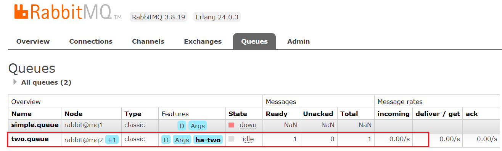
>
>发现依然是健康的！并且其主节点切换到了rabbit@mq2上

### 仲裁队列


#### 集群特征

仲裁队列：仲裁队列是3.8版本以后才有的新功能，用来替代镜像队列，具备下列特征：

- 与镜像队列一样，都是主从模式，支持主从数据同步
- 使用非常简单，没有复杂的配置
- 主从同步基于Raft协议，强一致


#### 部署

参考课前资料：《RabbitMQ部署指南.md》

># 5.仲裁队列
>
>从RabbitMQ 3.8版本开始，引入了新的仲裁队列，他具备与镜像队里类似的功能，但使用更加方便。
>
>
>
>
>
>## 5.1.添加仲裁队列
>
>在任意控制台添加一个队列，一定要选择队列类型为Quorum类型。
>
>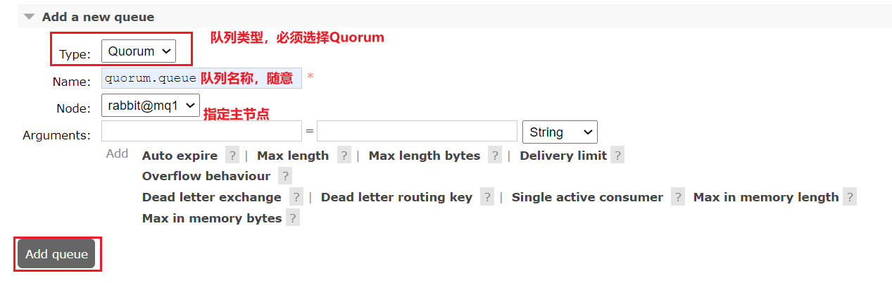
>
>
>
>在任意控制台查看队列：
>
>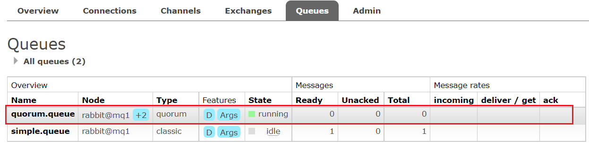
>
>
>
>可以看到，仲裁队列的 + 2字样。代表这个队列有2个镜像节点。
>
>因为仲裁队列默认的镜像数为5。如果你的集群有7个节点，那么镜像数肯定是5；而我们集群只有3个节点，因此镜像数量就是3.
>
>## 5.2.测试
>
>可以参考对镜像集群的测试，效果是一样的。
>
>## 5.3.集群扩容
>
>### 5.3.1.加入集群
>
>1）启动一个新的MQ容器：
>
>```sh
>docker run -d --net mq-net \
>-v ${PWD}/.erlang.cookie:/var/lib/rabbitmq/.erlang.cookie \
>-e RABBITMQ_DEFAULT_USER=itcast \
>-e RABBITMQ_DEFAULT_PASS=123321 \
>--name mq4 \
>--hostname mq5 \
>-p 8074:15672 \
>-p 8084:15672 \
>rabbitmq:3.8-management
>```
>
>2）进入容器控制台：
>
>```sh
>docker exec -it mq4 bash
>```
>
>3）停止mq进程
>
>```sh
>rabbitmqctl stop_app
>```
>
>
>
>4）重置RabbitMQ中的数据：
>
>```sh
>rabbitmqctl reset
>```
>
>
>
>5）加入mq1：
>
>```sh
>rabbitmqctl join_cluster rabbit@mq1
>```
>
>
>
>6）再次启动mq进程
>
>```sh
>rabbitmqctl start_app
>```
>
>
>
>
>
>
>
>
>
>### 5.3.2.增加仲裁队列副本
>
>我们先查看下quorum.queue这个队列目前的副本情况，进入mq1容器：
>
>```sh
>docker exec -it mq1 bash
>```
>
>执行命令：
>
>```sh
>rabbitmq-queues quorum_status "quorum.queue"
>```
>
>结果：
>
>
>
>现在，我们让mq4也加入进来：
>
>```sh
>rabbitmq-queues add_member "quorum.queue" "rabbit@mq4"
>```
>
>结果：
>
>
>
>
>
>再次查看：
>
>```sh
>rabbitmq-queues quorum_status "quorum.queue"
>```
>
>
>
>
>
>查看控制台，发现quorum.queue的镜像数量也从原来的 +2 变成了 +3：
>
>


#### Java代码创建仲裁队列

```java
@Bean
public Queue quorumQueue() {
    return QueueBuilder
        .durable("quorum.queue") // 持久化
        .quorum() // 仲裁队列
        .build();
}
```


#### SpringAMQP连接MQ集群

注意，这里用address来代替host、port方式

```java
spring:
  rabbitmq:
    addresses: 192.168.150.105:8071, 192.168.150.105:8072, 192.168.150.105:8073
    username: itcast
    password: 123321
    virtual-host: /
```


# 常见面试题

## 1.微服务篇

### 1.1.SpringCloud常见组件有哪些？

**问题说明**：这个题目主要考察对SpringCloud的组件基本了解

**难易程度**：简单

**参考话术**：

SpringCloud包含的组件很多，有很多功能是重复的。其中最常用组件包括：

•注册中心组件：Eureka、Nacos等

•负载均衡组件：Ribbon

•远程调用组件：OpenFeign

•网关组件：Zuul、Gateway

•服务保护组件：Hystrix、Sentinel

•服务配置管理组件：SpringCloudConfig、Nacos


### 1.2.Nacos的服务注册表结构是怎样的？

**问题说明**：考察对Nacos数据分级结构的了解，以及Nacos源码的掌握情况

**难易程度**：一般

**参考话术**：

Nacos采用了**数据的分级存储模型**，最外层是**Namespace**，用来隔离环境。然后是**Group**，用来对服务分组。接下来就是**服务**（Service）了，一个服务包含多个实例，但是可能处于不同机房，因此Service下有多个**集群**（Cluster），Cluster下是不同的**实例**（Instance）。

对应到Java代码中，Nacos采用了一个多层的Map来表示。结构为Map<String, Map<String, Service>>，其中最外层Map的key就是namespaceId，值是一个Map。内层Map的key是group拼接serviceName，值是Service对象。Service对象内部又是一个Map，key是集群名称，值是Cluster对象。而Cluster对象内部维护了Instance的集合。


如图：


### 1.3.Nacos如何支撑阿里内部数十万服务注册压力？

**问题说明**：考察对Nacos源码的掌握情况

**难易程度**：难

**参考话术**：

Nacos内部接收到注册的请求时，不会立即写数据，而是将服务注册的任务放入一个阻塞队列就立即响应给客户端。然后利用线程池读取阻塞队列中的任务，异步来完成实例更新，从而提高并发写能力。


### 1.4.Nacos如何避免并发读写冲突问题？

**问题说明**：考察对Nacos源码的掌握情况

**难易程度**：难

**参考话术**：

Nacos在更新实例列表时，会采用**CopyOnWrite**技术，首先将旧的实例列表拷贝一份，然后更新拷贝的实例列表，再用更新后的实例列表来覆盖旧的实例列表。

这样在更新的过程中，就不会对读实例列表的请求产生影响，也不会出现脏读问题了。


### 1.5.Nacos与Eureka的区别有哪些？

**问题说明**：考察对Nacos、Eureka的底层实现的掌握情况

**难易程度**：难

**参考话术**：

Nacos与Eureka有相同点，也有不同之处，可以从以下几点来描述：

- **接口方式**：Nacos与Eureka都对外暴露了Rest风格的API接口，用来实现服务注册、发现等功能
- **实例类型**：Nacos的实例有永久和临时实例之分；而Eureka只支持临时实例
- **健康检测**：Nacos对临时实例采用心跳模式检测，对永久实例采用主动请求来检测；Eureka只支持心跳模式
- **服务发现**：Nacos支持定时拉取和订阅推送两种模式；Eureka只支持定时拉取模式


### 1.6.Sentinel的限流与Gateway的限流有什么差别？

**问题说明**：考察对限流算法的掌握情况

**难易程度**：难

**参考话术**：

限流算法常见的有三种实现：滑动时间窗口、令牌桶算法、漏桶算法。Gateway则采用了基于Redis实现的令牌桶算法。

而Sentinel内部却比较复杂：

- 默认限流模式是基于滑动时间窗口算法
- 排队等待的限流模式则基于漏桶算法
- 而热点参数限流则是基于令牌桶算法


### 1.7.Sentinel的线程隔离与Hystix的线程隔离有什么差别?

**问题说明**：考察对线程隔离方案的掌握情况

**难易程度**：一般

**参考话术**：

Hystix默认是基于线程池实现的线程隔离，每一个被隔离的业务都要创建一个独立的线程池，线程过多会带来额外的CPU开销，性能一般，但是隔离性更强。

Sentinel是基于信号量（计数器）实现的线程隔离，不用创建线程池，性能较好，但是隔离性一般。


## 2.MQ篇

### 2.1.你们为什么选择了RabbitMQ而不是其它的MQ？

如图：

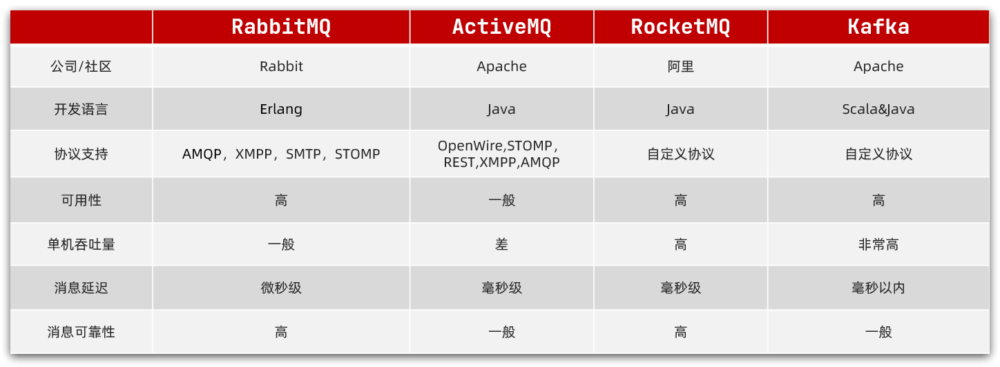


**话术：**

kafka是以吞吐量高而闻名，不过其数据稳定性一般，而且无法保证消息有序性。我们公司的日志收集也有使用，业务模块中则使用的RabbitMQ。

阿里巴巴的RocketMQ基于Kafka的原理，弥补了Kafka的缺点，继承了其高吞吐的优势，其客户端目前以Java为主。但是我们担心阿里巴巴开源产品的稳定性，所以就没有使用。

RabbitMQ基于面向并发的语言Erlang开发，吞吐量不如Kafka，但是对我们公司来讲够用了。而且**消息可靠性较好**，并且**消息延迟极低**，**集群搭建比较方便**。**支持多种协议**，并且**有各种语言的客户端**，比较灵活。**Spring对RabbitMQ的支持也比较好**，使用起来比较方便，比较符合我们公司的需求。

综合考虑我们公司的并发需求以及稳定性需求，我们选择了RabbitMQ。


### 2.2.RabbitMQ如何确保消息的不丢失？

**话术：**

RabbitMQ针对消息传递过程中可能发生问题的各个地方，给出了针对性的解决方案：

- 生产者发送消息时可能因为网络问题导致消息没有到达交换机：
  - RabbitMQ提供了publisher confirm机制
    - 生产者发送消息后，可以编写ConfirmCallback函数
    - 消息成功到达交换机后，RabbitMQ会调用ConfirmCallback通知消息的发送者，返回ACK
    - 消息如果未到达交换机，RabbitMQ也会调用ConfirmCallback通知消息的发送者，返回NACK
    - 消息超时未发送成功也会抛出异常
- 消息到达交换机后，如果未能到达队列，也会导致消息丢失：
  - RabbitMQ提供了publisher return机制
    - 生产者可以定义ReturnCallback函数
    - 消息到达交换机，未到达队列，RabbitMQ会调用ReturnCallback通知发送者，告知失败原因
- 消息到达队列后，MQ宕机也可能导致丢失消息：
  - RabbitMQ提供了持久化功能，集群的主从备份功能
    - 消息持久化，RabbitMQ会将交换机、队列、消息持久化到磁盘，宕机重启可以恢复消息
    - 镜像集群，仲裁队列，都可以提供主从备份功能，主节点宕机，从节点会自动切换为主，数据依然在
- 消息投递给消费者后，如果消费者处理不当，也可能导致消息丢失
  - SpringAMQP基于RabbitMQ提供了消费者确认机制、消费者重试机制，消费者失败处理策略：
    - 消费者的确认机制：
      - 消费者处理消息成功，未出现异常时，Spring返回ACK给RabbitMQ，消息才被移除
      - 消费者处理消息失败，抛出异常，宕机，Spring返回NACK或者不返回结果，消息不被移除
    - 消费者重试机制：
      - 默认情况下，消费者处理失败时，消息会再次回到MQ队列，然后投递给其它消费者。Spring提供的消费者重试机制，则是在处理失败后不返回NACK，而是直接在消费者本地重试。多次重试都失败后，则按照消费者失败处理策略来处理消息。避免了消息频繁入队带来的额外压力。
    - 消费者失败策略：
      - 当消费者多次本地重试失败时，消息默认会丢弃。
      - Spring提供了Republish策略，在多次重试都失败，耗尽重试次数后，将消息重新投递给指定的异常交换机，并且会携带上异常栈信息，帮助定位问题。


### 2.3.RabbitMQ如何避免消息堆积？

**话术：**

消息堆积问题产生的原因往往是因为消息发送的速度超过了消费者消息处理的速度。因此解决方案无外乎以下三点：

- 提高消费者处理速度
- 增加更多消费者
- 增加队列消息存储上限


1）提高消费者处理速度

消费者处理速度是由业务代码决定的，所以我们能做的事情包括：

- 尽可能优化业务代码，提高业务性能
- 接收到消息后，开启线程池，并发处理多个消息

优点：成本低，改改代码即可

缺点：开启线程池会带来额外的性能开销，对于高频、低时延的任务不合适。推荐任务执行周期较长的业务。


2）增加更多消费者

一个队列绑定多个消费者，共同争抢任务，自然可以提供消息处理的速度。

优点：能用钱解决的问题都不是问题。实现简单粗暴

缺点：问题是没有钱。成本太高


3）增加队列消息存储上限

在RabbitMQ的1.8版本后，加入了新的队列模式：Lazy Queue

这种队列不会将消息保存在内存中，而是在收到消息后直接写入磁盘中，理论上没有存储上限。可以解决消息堆积问题。

优点：磁盘存储更安全；存储无上限；避免内存存储带来的Page Out问题，性能更稳定；

缺点：磁盘存储受到IO性能的限制，消息时效性不如内存模式，但影响不大。


### 2.4.RabbitMQ如何保证消息的有序性？

多个有序的消息可能是一个大消息的拆分吧

**话术：**

其实RabbitMQ是**队列**存储，天然具备先进先出的特点，只要消息的发送是有序的，那么理论上接收也是有序的。不过当一个队列绑定了多个消费者时，可能出现消息轮询投递给消费者的情况，而消费者的处理顺序就无法保证了。

因此，要保证消息的有序性，需要做的下面几点：

- 保证消息发送的有序性
- 保证一组有序的消息都发送到同一个队列
- 保证一个队列只包含一个消费者


### 2.5.如何防止MQ消息被重复消费？

MQ能保证的是消息至少被消费者成功消费一次

在保证MQ消息不重复的情况下，消费者消费消息成功后，在给MQ发送消息确认的时候出现了网络异常(或者是服务中断)，MQ没有接收到确认，此时MQ不会将发送的消息删除，为了保证消息被消费，当消费者网络稳定后，MQ就会继续给消费者投递之前的消息。这时候消费者就接收到了两条一样的消息。

**话术：**

消息重复消费的原因多种多样，不可避免。所以只能从消费者端入手，只要能保证消息处理的**幂等性**（幂等性指的是同一个操作，不论执行多少次都是会得到相同的结果）就可以确保消息不被重复消费。

而幂等性的保证又有很多方案：


- 给每一条消息都添加一个唯一id，处理消息时基于数据库表的id唯一性做判断，如果插入过了一次就不会再插入了
- 加一个消息表，记录什么时候修改了什么


### 2.6.如何保证RabbitMQ的高可用？

**话术：**

要实现RabbitMQ的高可用无外乎下面两点：

- 做好交换机、队列、消息的持久化
- 搭建RabbitMQ的镜像集群，做好主从备份。当然也可以使用仲裁队列代替镜像集群。


### 2.7.使用MQ可以解决那些问题？

**话术：**

RabbitMQ能解决的问题很多，例如：

- 解耦合：将几个业务关联的微服务调用修改为基于MQ的异步通知，可以解除微服务之间的业务耦合。同时还提高了业务性能。
- 流量削峰：将突发的业务请求放入MQ中，作为缓冲区。后端的业务根据自己的处理能力从MQ中获取消息，逐个处理任务。流量曲线变的平滑很多
- 延迟队列：基于RabbitMQ的死信队列或者DelayExchange插件，可以实现消息发送后，延迟接收的效果。


## 3.Redis篇

### 3.1.Redis与Memcache的区别？

- `redis支持更丰富的数据类型`（支持更复杂的应用场景）：Redis不仅仅支持简单的k/v类型的数据，同时还提供list，set，zset，hash等数据结构的存储。memcache支持简单的数据类型，String。
- `Redis支持数据的持久化`，可以将内存中的数据保持在磁盘中，重启的时候可以再次加载进行使用,而Memecache把数据全部存在内存之中。
- `集群模式`：memcached没有原生的集群模式，需要依靠客户端来实现往集群中分片写入数据；但是 redis 目前是原生支持 cluster 模式的.
- `Redis使用单线程`：Memcached是多线程，非阻塞IO复用的网络模型；Redis使用**单线程**的**多路 IO 复用**模型。

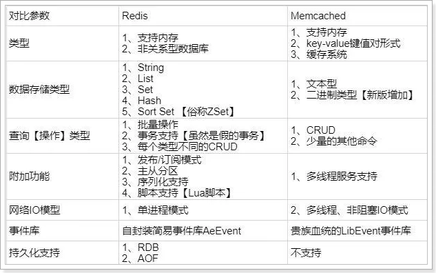

### 3.2.Redis的单线程问题

**面试官**：Redis采用单线程，如何保证高并发？

**面试话术**：

Redis快的主要原因是：

1. 完全基于内存
2. 数据结构简单，对数据操作也简单
3. 使用多路 I/O 复用模型，充分利用CPU资源


**面试官**：这样做的好处是什么？

**面试话术**：

单线程优势有下面几点：

- 代码更清晰，处理逻辑更简单
- 不用去考虑各种锁的问题，不存在加锁释放锁操作，没有因为锁而导致的性能消耗
- 不存在多进程或者多线程导致的CPU切换，充分利用CPU资源


### 3.2.Redis的持久化方案有哪些？

**相关资料：**

1）RDB 持久化

RDB持久化可以使用save或bgsave，为了不阻塞主进程业务，一般都使用bgsave，流程：

- Redis 进程会 fork 出一个**子进程**（与父进程内存数据一致）。
- 父进程继续处理客户端请求命令
- 由**子进程**将**内存**中的所有数据**写入到一个临时的 RDB 文件**中。
- 完成写入操作之后，旧的 RDB 文件会被新的 RDB 文件替换掉。

下面是一些和 RDB 持久化相关的配置：

- `save 60 10000`：如果在 60 秒内有 10000 个 key 发生改变，那就执行 RDB 持久化。
- `stop-writes-on-bgsave-error yes`：如果 Redis 执行 RDB 持久化失败（常见于操作系统内存不足），那么 Redis 将不再接受 client 写入数据的请求。
- `rdbcompression yes`：当生成 RDB 文件时，同时进行压缩。
- `dbfilename dump.rdb`：将 RDB 文件命名为 dump.rdb。
- `dir /var/lib/redis`：将 RDB 文件保存在`/var/lib/redis`目录下。

　　当然在实践中，我们通常会将`stop-writes-on-bgsave-error`设置为`false`，同时让监控系统在 Redis 执行 RDB 持久化失败时发送告警，以便人工介入解决，而不是粗暴地拒绝 client 的写入请求。

RDB持久化的优点：

- RDB持久化文件小，Redis**数据恢复时速度快**
- 子进程不影响父进程，父进程可以持续处理客户端命令
- 子进程fork时采用**copy-on-write**方式，大多数情况下，没有太多的内存消耗，效率比较好。

 RDB 持久化的缺点：

- 子进程fork时采用copy-on-write方式，如果Redis此时写操作较多，可能导致额外的内存占用，甚至内存溢出
- RDB文件压缩会减小文件体积，但通过时会对CPU有额外的消耗
- 如果业务场景很看重数据的持久性 (durability)，那么不应该采用 RDB 持久化。譬如说，如果 Redis 每 5 分钟执行一次 RDB 持久化，要是 Redis 意外奔溃了，那么最多会丢失 5 分钟的数据。


2）AOF 持久化

　　可以使用`appendonly yes`配置项来开启 AOF 持久化。Redis 执行 AOF 持久化时，会将接收到的写命令追加到 AOF 文件的末尾，因此 Redis 只要对 AOF 文件中的命令进行回放，就可以将数据库还原到原先的状态。
　　与 RDB 持久化相比，AOF 持久化的一个明显优势就是，**它可以提高数据的持久性 (durability)。**因为在 AOF 模式下，Redis 每次接收到 client 的写命令，就会将命令`write()`到 AOF 文件末尾。
　　然而，在 Linux 中，将数据`write()`到文件后，数据并不会立即刷新到磁盘，而会先暂存在 OS 的文件系统缓冲区。在合适的时机，OS 才会将缓冲区的数据刷新到磁盘（如果需要将文件内容刷新到磁盘，可以调用`fsync()`或`fdatasync()`）。
　　通过`appendfsync`配置项，可以控制 Redis 将命令同步到磁盘的频率：

- `always`：每次 Redis 将命令`write()`到 AOF 文件时，都会调用`fsync()`，将命令刷新到磁盘。这可以保证最好的数据持久性，但却会给系统带来极大的开销。
- `no`：Redis 只将命令`write()`到 AOF 文件。这会让 OS 决定何时将命令刷新到磁盘。
- `everysec`：除了将命令`write()`到 AOF 文件，Redis 还会每秒执行一次`fsync()`。在实践中，推荐使用这种设置，一定程度上可以保证数据持久性，又不会明显降低 Redis 性能。

　　然而，AOF 持久化并不是没有缺点的：Redis 会不断将接收到的写命令追加到 AOF 文件中，导致 AOF 文件越来越大。过大的 AOF 文件会消耗磁盘空间，并且导致 Redis 重启时更加缓慢。为了解决这个问题，在适当情况下，Redis 会对 AOF 文件进行重写，去除文件中冗余的命令，以减小 AOF 文件的体积。在重写 AOF 文件期间， Redis 会启动一个子进程，由子进程负责对 AOF 文件进行重写。
　　可以通过下面两个配置项，控制 Redis 重写 AOF 文件的频率：

- `auto-aof-rewrite-min-size 64mb`
- `auto-aof-rewrite-percentage 100`

　　上面两个配置的作用：当 AOF 文件的体积大于 64MB，并且 AOF 文件的体积比上一次重写之后的体积大了至少一倍，那么 Redis 就会执行 AOF 重写。

优点：

- 持久化频率高，数据可靠性高
- 没有额外的内存或CPU消耗

缺点：

- 文件体积大
- 文件大导致服务数据恢复时效率较低


**面试话术：**

Redis 提供了两种数据持久化的方式，一种是 RDB，另一种是 AOF。**默认情况下，Redis 使用的是 RDB 持久化。**

RDB持久化文件体积较小，但是保存数据的频率一般较低，可靠性差，容易丢失数据。另外RDB写数据时会采用Fork函数拷贝主进程，可能有额外的内存消耗，文件压缩也会有额外的CPU消耗。

AOF持久化**可以做到每秒钟持久化一次**，可靠性高。但是持久化文件体积较大，导致数据恢复时读取文件时间较长，效率略低


### 3.3.Redis的集群方式有哪些？

**面试话术：**

Redis集群可以分为**主从集群**和**分片集群**两类。

**主从集群**一般一主多从，主库用来写数据，从库用来读数据。结合哨兵，可以再主库宕机时从新选主，**目的是保证Redis的高可用**。


**分片集群**是数据分片，我们会让多个Redis节点组成集群，并将16383个插槽分到不同的节点上。存储数据时利用对key做hash运算，得到插槽值后存储到对应的节点即可。因为存储数据面向的是插槽而非节点本身，因此可以做到集群动态伸缩。**目的是让Redis能存储更多数据。**


1）主从集群

主从集群，也是读写分离集群。一般都是一主多从方式。

Redis 的复制（replication）功能允许用户根据一个 Redis 服务器来创建任意多个该服务器的复制品，其中被复制的服务器为主服务器（master），而通过复制创建出来的服务器复制品则为从服务器（slave）。

只要主从服务器之间的网络连接正常，主从服务器两者会具有相同的数据，主服务器就会一直将发生在自己身上的数据更新同步 给从服务器，从而一直保证主从服务器的数据相同。

- 写数据时只能通过主节点完成
- 读数据可以从任何节点完成
- 如果配置了`哨兵节点`，当master宕机时，哨兵会从salve节点选出一个新的主。

主从集群分两种：

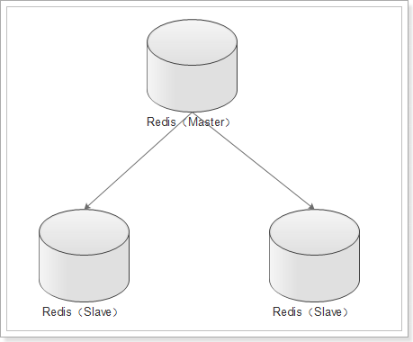 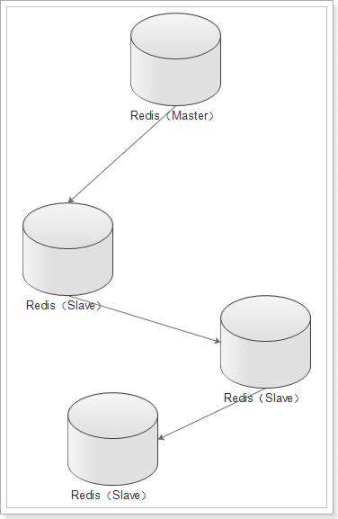 

带有哨兵的集群：


2）分片集群

主从集群中，每个节点都要保存所有信息，容易形成木桶效应。并且当数据量较大时，单个机器无法满足需求。此时我们就要使用分片集群了。


 

集群特征：

- 每个节点都保存不同数据
- 所有的redis节点彼此互联(PING-PONG机制),内部使用二进制协议优化传输速度和带宽.

- 节点的fail是通过集群中超过半数的节点检测失效时才生效.

- 客户端与redis节点直连,不需要中间proxy层连接集群中任何一个可用节点都可以访问到数据

- redis-cluster把所有的物理节点映射到[0-16383]slot（插槽）上，实现动态伸缩


为了保证Redis中每个节点的高可用，我们还可以给每个节点创建replication（slave节点），如图：


出现故障时，主从可以及时切换：


### 3.4.Redis的常用数据类型有哪些？

支持多种类型的数据结构，主要区别是value存储的数据格式不同：

- string：最基本的数据类型，二进制安全的字符串，最大512M。

- list：按照添加顺序保持顺序的字符串列表。
- set：无序的字符串集合，不存在重复的元素。
- sorted set：已排序的字符串集合。
- hash：key-value对格式


### 3.5.聊一下Redis事务机制

**相关资料：**

参考：http://redisdoc.com/topic/transaction.html


Redis事务功能是通过MULTI、EXEC、DISCARD和WATCH 四个原语实现的。Redis会将一个事务中的所有命令序列化，然后按顺序执行。但是Redis事务不支持回滚操作，命令运行出错后，正确的命令会继续执行。

- `MULTI`: 用于开启一个事务，它总是返回OK。 MULTI执行之后，客户端可以继续向服务器发送任意多条命令，这些命令不会立即被执行，而是被放到一个**待执行命令队列**中
- `EXEC`：按顺序执行命令队列内的所有命令。返回所有命令的返回值。事务执行过程中，Redis不会执行其它事务的命令。
- `DISCARD`：清空命令队列，并放弃执行事务， 并且客户端会从事务状态中退出
- `WATCH`：Redis的乐观锁机制，利用compare-and-set（CAS）原理，可以监控一个或多个键，一旦其中有一个键被修改，之后的事务就不会执行

使用事务时可能会遇上以下两种错误：

- 执行 EXEC 之前，入队的命令可能会出错。比如说，命令可能会产生语法错误（参数数量错误，参数名错误，等等），或者其他更严重的错误，比如内存不足（如果服务器使用 `maxmemory` 设置了最大内存限制的话）。
  - Redis 2.6.5 开始，服务器会对命令入队失败的情况进行记录，并在客户端调用 EXEC 命令时，拒绝执行并自动放弃这个事务。
- 命令可能在 EXEC 调用之后失败。举个例子，事务中的命令可能处理了错误类型的键，比如将列表命令用在了字符串键上面，诸如此类。
  - 即使事务中有某个/某些命令在执行时产生了错误， 事务中的其他命令仍然会继续执行，不会回滚。

为什么 Redis 不支持回滚（roll back）？

以下是这种做法的优点：

- Redis 命令只会因为错误的语法而失败（并且这些问题不能在入队时发现），或是命令用在了错误类型的键上面：这也就是说，从实用性的角度来说，失败的命令是由**编程错误**造成的，而这些错误应该在开发的过程中被发现，而不应该出现在生产环境中。
- 因为不需要对回滚进行支持，所以 Redis 的内部可以保持简单且快速。


鉴于没有任何机制能避免程序员自己造成的错误， 并且这类错误通常不会在生产环境中出现， 所以 Redis 选择了更简单、更快速的无回滚方式来处理事务。


**面试话术：**

Redis事务其实是把一系列Redis命令放入队列，然后批量执行，执行过程中不会有其它事务来打断。不过与关系型数据库的事务不同，Redis事务不支持回滚操作，事务中某个命令执行失败，其它命令依然会执行。

为了弥补不能回滚的问题，Redis会在事务入队时就检查命令，如果命令异常则会放弃整个事务。

因此，只要程序员编程是正确的，理论上说Redis会正确执行所有事务，无需回滚。


面试官：如果事务执行一半的时候Redis宕机怎么办？

Redis有持久化机制，因为可靠性问题，我们一般使用AOF持久化。事务的所有命令也会写入AOF文件，但是如果在执行EXEC命令之前，Redis已经宕机，则AOF文件中事务不完整。使用 `redis-check-aof` 程序可以移除 AOF 文件中不完整事务的信息，确保服务器可以顺利启动。


### 3.6.Redis的Key过期策略

#### **参考资料：**

##### 为什么需要内存回收？

- 1、在Redis中，set指令可以指定key的过期时间，当过期时间到达以后，key就失效了；
- 2、Redis是基于内存操作的，所有的数据都是保存在内存中，一台机器的内存是有限且很宝贵的。

基于以上两点，为了保证Redis能继续提供可靠的服务，Redis需要一种机制清理掉**不常用的、无效的、多余的**数据，失效后的数据需要及时清理，这就需要内存回收了。


Redis的内存回收主要分为过期删除策略和内存淘汰策略两部分。


##### 过期删除策略

删除达到过期时间的key。

- 1）定时删除

对于每一个设置了过期时间的key都会创建一个定时器，一旦到达过期时间就立即删除。该策略可以立即清除过期的数据，对内存较友好，但是缺点是**占用了大量的CPU资源去处理过期的数据**，会**影响Redis**的吞吐量和响应时间。

- 2）惰性删除

当访问一个key时，才判断该key是否过期，过期则删除。该策略能最大限度地节省CPU资源，但是对内存却十分不友好。有一种极端的情况是可能出现大量的过期key没有被再次访问，因此不会被清除，导致占用了大量的内存。

> 在计算机科学中，懒惰删除（英文：lazy deletion）指的是从一个散列表（也称哈希表）中删除元素的一种方法。在这个方法中，删除仅仅是指标记一个元素被删除，而不是整个清除它。被删除的位点在插入时被当作空元素，在搜索之时被当作已占据。

- 3）定期删除

每隔一段时间，扫描Redis中过期key字典，并清除部分过期的key。该策略是前两者的一个折中方案，还可以通过调整定时扫描的时间间隔和每次扫描的限定耗时，在不同情况下使得CPU和内存资源达到最优的平衡效果。

在Redis中，`同时使用了定期删除和惰性删除`。不过Redis定期删除采用的是**随机抽取的方式删除部分Key**，因此不能保证过期key 100%的删除。


Redis结合了定期删除和惰性删除，基本上能很好的处理过期数据的清理，但是实际上还是有点问题的，如果过期key较多，定期删除漏掉了一部分，而且也没有及时去查，即没有走惰性删除，那么就会有大量的过期key堆积在内存中，导致redis内存耗尽，当内存耗尽之后，有新的key到来会发生什么事呢？是直接抛弃还是其他措施呢？有什么办法可以接受更多的key？

##### 内存淘汰策略

Redis的内存淘汰策略，是指内存达到maxmemory极限时，使用某种算法来决定清理掉哪些数据，以保证新数据的存入。

Redis的内存淘汰机制包括：

- noeviction: 当内存不足以容纳新写入数据时，新写入操作会报错。
- allkeys-lru：当内存不足以容纳新写入数据时，在键空间（`server.db[i].dict`）中，移除最近最少使用的 key（这个是最常用的）。
- allkeys-random：当内存不足以容纳新写入数据时，在键空间（`server.db[i].dict`）中，随机移除某个 key。
- volatile-lru：当内存不足以容纳新写入数据时，在设置了过期时间的键空间（`server.db[i].expires`）中，移除最近最少使用的 key。
- volatile-random：当内存不足以容纳新写入数据时，在设置了过期时间的键空间（`server.db[i].expires`）中，随机移除某个 key。
- volatile-ttl：当内存不足以容纳新写入数据时，在设置了过期时间的键空间（`server.db[i].expires`）中，有更早过期时间的 key 优先移除。

> 在配置文件中，通过maxmemory-policy可以配置要使用哪一个淘汰机制。

什么时候会进行淘汰？

Redis会在每一次处理命令的时候（processCommand函数调用freeMemoryIfNeeded）判断当前redis是否达到了内存的最大限制，如果达到限制，则使用对应的算法去处理需要删除的key。

在淘汰key时，Redis默认最常用的是LRU算法（Latest Recently Used）。Redis通过在每一个redisObject保存lru属性来保存key最近的访问时间，在实现LRU算法时直接读取key的lru属性。

具体实现时，Redis遍历每一个db，从每一个db中随机抽取一批样本key，默认是3个key，再从这3个key中，删除最近最少使用的key。


#### 面试话术：

Redis过期策略包含**定期删除**和**惰性删除**两部分(是没有定时删除的，因为定时删除太耗费CPU性能了)。定期删除是在Redis内部有一个定时任务，会定期删除一些过期的key。惰性删除是当用户查询某个Key时，会检查这个Key是否已经过期，如果没过期则返回用户，如果过期则删除。

但是这两个策略都无法保证过期key一定删除，漏网之鱼越来越多，还可能导致内存溢出。**当发生内存不足问题时，Redis还会做内存回收**。内存回收采用LRU策略，就是最近最少使用。其原理就是**记录每个Key的最近使用时间，内存回收时，随机抽取一些Key，比较其使用时间，把最老的几个删除。**

Redis的逻辑是：最近使用过的，很可能再次被使用

### 3.7.Redis在项目中的哪些地方有用到?

（1）共享session

在分布式系统下，服务会部署在不同的tomcat，因此多个tomcat的session无法共享，以前存储在session中的数据无法实现共享，可以用redis代替session，解决分布式系统间数据共享问题。

（2）数据缓存

Redis采用内存存储，读写效率较高。我们可以把数据库的访问频率高的热点数据存储到redis中，这样用户请求时优先从redis中读取，减少数据库压力，提高并发能力。

（3）异步队列

Reids在内存存储引擎领域的一大优点是提供 list 和 set 操作，这使得Redis能作为一个很好的消息队列平台来使用。而且Redis中还有pub/sub这样的专用结构，用于1对N的消息通信模式。

（4）分布式锁

Redis中的乐观锁机制，可以帮助我们实现分布式锁的效果，用于解决分布式系统下的多线程安全问题

### 3.8.Redis的缓存击穿、缓存雪崩、缓存穿透

#### 1）缓存穿透

参考资料：

- 什么是缓存穿透
  - 正常情况下，我们去查询数据都是存在。那么请求去查询一条压根儿数据库中根本就不存在的数据，也就是缓存和数据库都查询不到这条数据，但是请求每次都会打到数据库上面去。这种查询不存在数据的现象我们称为**缓存穿透**。
- 穿透带来的问题
  - 试想一下，如果有黑客会对你的系统进行攻击，拿一个不存在的id 去查询数据，会产生大量的请求到数据库去查询。可能会导致你的数据库由于压力过大而宕掉。

- 解决办法
  - 缓存空值：之所以会发生穿透，就是因为缓存中没有存储这些空数据的key。从而导致每次查询都到数据库去了。那么我们就可以**为这些key对应的值设置为null 丢到缓存里面去**。后面再出现查询这个key 的请求的时候，直接返回null 。这样，就不用在到数据库中去走一圈了，但是**别忘了设置过期时间**。
  - BloomFilter（布隆过滤）：将所有可能存在的数据哈希到一个足够大的bitmap中，一个一定不存在的数据会被 这个bitmap拦截掉，从而避免了对底层存储系统的查询压力。在缓存之前在加一层 BloomFilter ，在查询的时候先去 BloomFilter 去查询 key 是否存在，如果不存在就直接返回，存在再走查缓存 -> 查 DB。


**话术：**

缓存穿透有两种解决方案：**其一**是把不存在的key设置null值到缓存中。**其二**是使用布隆过滤器，在查询缓存前先通过布隆过滤器判断key是否存在，存在再去查询缓存。

设置null值可能被恶意针对，攻击者使用大量不存在的不重复key ，那么方案一就会缓存大量不存在key数据。此时我们还可以对Key规定格式模板，然后对不存在的key做**正则规范**匹配，如果完全不符合就不用存null值到redis，而是直接返回错误。


#### 2）缓存击穿

**相关资料**：

- 什么是缓存击穿？

key可能会在某些时间点被超高并发地访问，是一种非常“热点”的数据。这个时候，需要考虑一个问题：缓存被“击穿”的问题。

当这个key在失效的瞬间，redis查询失败，持续的大并发就穿破缓存，直接请求数据库，就像在一个屏障上凿开了一个洞。

- 解决方案：
  - 使用互斥锁(mutex key)：mutex，就是互斥。简单地来说，就是在缓存失效的时候（判断拿出来的值为空），不是立即去load db，而是先使用Redis的SETNX去set一个互斥key，当操作返回成功时，再进行load db的操作并回设缓存；否则，就重试整个get缓存的方法。SETNX，是「SET if Not eXists」的缩写，也就是只有不存在的时候才设置，可以利用它来实现互斥的效果。
  - 软过期：也就是逻辑过期，不使用redis提供的过期时间，而是业务层在数据中存储过期时间信息。查询时由业务程序判断是否过期，如果数据即将过期时，将缓存的时效延长，程序可以派遣一个线程去数据库中获取最新的数据，其他线程这时看到延长了的过期时间，就会继续使用旧数据，等派遣的线程获取最新数据后再更新缓存。

推荐使用互斥锁，因为软过期会有业务逻辑侵入和额外的判断。


**面试话术**：

缓存击穿主要担心的是某个Key过期，更新缓存时引起对数据库的突发高并发访问。因此我们可以在更新缓存时采用互斥锁控制，只允许一个线程去更新缓存，其它线程等待并重新读取缓存。例如Redis的setnx命令就能实现互斥效果。


#### 3）缓存雪崩

**相关资料**：

缓存雪崩，是指在某一个时间段，缓存集中过期失效。对这批数据的访问查询，都落到了数据库上，对于数据库而言，就会产生周期性的压力波峰。

解决方案：

- 数据分类分批处理：采取不同分类数据，缓存不同周期
- 相同分类数据：采用固定时长加随机数方式设置缓存
- 热点数据缓存时间长一些，冷门数据缓存时间短一些
- 避免redis节点宕机引起雪崩，搭建主从集群，保证高可用


**面试话术：**

解决缓存雪崩问题的关键是让缓存Key的过期时间分散。因此我们可以**把数据按照业务分类，然后设置不同过期时间。**相同业务类型的key，设置固定时长加随机数。尽可能保证每个Key的过期时间都不相同。

另外，Redis宕机也可能导致缓存雪崩，因此我们还要搭建Redis主从集群及哨兵监控，保证Redis的高可用。


### 3.9.缓存冷热数据分离

**背景资料**：

Redis使用的是内存存储，当需要海量数据存储时，成本非常高。

经过调研发现，当前主流DDR3内存和主流SATA SSD的单位成本价格差距大概在20倍左右，为了优化redis机器综合成本，我们考虑实现基于**热度统计 的数据分级存储**及数据在RAM/FLASH之间的动态交换，从而大幅度降低成本，达到性能与成本的高平衡。

基本思路：基于key访问次数(LFU)的热度统计算法识别出热点数据，并将热点数据保留在redis中，对于无访问/访问次数少的数据则转存到SSD上，如果SSD上的key再次变热，则重新将其加载到redis内存中。

目前流行的高性能磁盘存储，并且遵循Redis协议的方案包括：

- SSDB：http://ssdb.io/zh_cn/
- RocksDB：https://rocksdb.org.cn/


因此，我们就需要在应用程序与缓存服务之间引入代理，实现Redis和SSD之间的切换，如图：


这样的代理方案阿里云提供的就有。当然也有一些开源方案，例如：https://github.com/JingchengLi/swapdb


### 3.10.Redis实现分布式锁

分布式锁要满足的条件：

- 多进程互斥：同一时刻，只有一个进程可以获取锁
- 保证锁可以释放：任务结束或出现异常，锁一定要释放，避免死锁
- 阻塞锁（可选）：获取锁失败时可否重试
- 重入锁（可选）：获取锁的代码递归调用时，依然可以获取锁


#### 1）最基本的分布式锁：

利用Redis的setnx命令，这个命令的特征时如果多次执行，只有第一次执行会成功，可以实现`互斥`的效果。但是为了保证服务宕机时也可以释放锁，需要利用expire命令给锁设置一个有效期

```
setnx lock thread-01 # 尝试获取锁
expire lock 10 # 设置有效期
```

**面试官问题1**：如果expire之前服务宕机怎么办？

要保证setnx和expire命令的原子性。redis的set命令可以满足：

```
set key value [NX] [EX time] 
```

需要添加nx和ex的选项：

- NX：与setnx一致，第一次执行成功
- EX：设置过期时间

**面试官问题2**：释放锁的时候，如果自己的锁已经过期了，此时会出现安全漏洞，如何解决？

在锁中存储当前进程和线程标识，释放锁时对锁的标识判断，如果是自己的则删除，不是则放弃操作。

但是这两步操作要保证原子性，需要通过Lua脚本来实现。

```
if redis.call("get",KEYS[1]) == ARGV[1] then
    redis.call("del",KEYS[1])
end
```


#### 2）可重入分布式锁

如果有重入的需求，则除了在锁中记录进程标识，还要记录重试次数，流程如下：

 

下面我们假设锁的key为“`lock`”，hashKey是当前线程的id：“`threadId`”，锁自动释放时间假设为20

获取锁的步骤：

- 1、判断lock是否存在 `EXISTS lock`
  - 存在，说明有人获取锁了，下面判断是不是自己的锁
    - 判断当前线程id作为hashKey是否存在：`HEXISTS lock threadId`
      - 不存在，说明锁已经有了，且不是自己获取的，锁获取失败，end
      - 存在，说明是自己获取的锁，重入次数+1：`HINCRBY lock threadId 1`，去到步骤3
  - 2、不存在，说明可以获取锁，`HSET key threadId 1`
  - 3、设置锁自动释放时间，`EXPIRE lock 20`

释放锁的步骤：

- 1、判断当前线程id作为hashKey是否存在：`HEXISTS lock threadId`
  - 不存在，说明锁已经失效，不用管了
  - 存在，说明锁还在，重入次数减1：`HINCRBY lock threadId -1`，获取新的重入次数
- 2、判断重入次数是否为0：
  - 为0，说明锁全部释放，删除key：`DEL lock`
  - 大于0，说明锁还在使用，重置有效时间：`EXPIRE lock 20`

对应的Lua脚本如下：

首先是获取锁：

```lua
local key = KEYS[1]; -- 锁的key
local threadId = ARGV[1]; -- 线程唯一标识
local releaseTime = ARGV[2]; -- 锁的自动释放时间

if(redis.call('exists', key) == 0) then -- 判断是否存在
	redis.call('hset', key, threadId, '1'); -- 不存在, 获取锁
	redis.call('expire', key, releaseTime); -- 设置有效期
	return 1; -- 返回结果
end;

if(redis.call('hexists', key, threadId) == 1) then -- 锁已经存在，判断threadId是否是自己	
	redis.call('hincrby', key, threadId, '1'); -- 不存在, 获取锁，重入次数+1
	redis.call('expire', key, releaseTime); -- 设置有效期
	return 1; -- 返回结果
end;
return 0; -- 代码走到这里,说明获取锁的不是自己，获取锁失败
```

然后是释放锁：

```lua
local key = KEYS[1]; -- 锁的key
local threadId = ARGV[1]; -- 线程唯一标识
local releaseTime = ARGV[2]; -- 锁的自动释放时间

if (redis.call('HEXISTS', key, threadId) == 0) then -- 判断当前锁是否还是被自己持有
    return nil; -- 如果已经不是自己，则直接返回
end;
local count = redis.call('HINCRBY', key, threadId, -1); -- 是自己的锁，则重入次数-1

if (count > 0) then -- 判断是否重入次数是否已经为0
    redis.call('EXPIRE', key, releaseTime); -- 大于0说明不能释放锁，重置有效期然后返回
    return nil;
else
    redis.call('DEL', key); -- 等于0说明可以释放锁，直接删除
    return nil;
end;
```


#### 3）高可用的锁

`面试官问题`：redis分布式锁依赖与redis，如果redis宕机则锁失效。如何解决？

此时大多数同学会回答说：搭建主从集群，做数据备份。

这样就进入了陷阱，因为面试官的下一个问题就来了：

`面试官问题`：如果搭建主从集群做数据备份时，进程A获取锁，master还没有把数据备份到slave，master宕机，slave升级为master，此时原来锁失效，其它进程也可以获取锁，出现安全问题。如何解决？

关于这个问题，Redis官网给出了解决方案，使用RedLock思路可以解决：

> 在Redis的分布式环境中，我们假设有N个Redis master。这些节点完全互相独立，不存在主从复制或者其他集群协调机制。之前我们已经描述了在Redis单实例下怎么安全地获取和释放锁。我们确保将在每（N)个实例上使用此方法获取和释放锁。在这个样例中，我们假设有5个Redis master节点，这是一个比较合理的设置，所以我们需要在5台机器上面或者5台虚拟机上面运行这些实例，这样保证他们不会同时都宕掉。
>
> 为了取到锁，客户端应该执行以下操作:
>
> 1. 获取当前Unix时间，以毫秒为单位。
> 2. 依次尝试从N个实例，使用相同的key和随机值获取锁。在步骤2，当向Redis设置锁时,客户端应该设置一个网络连接和响应超时时间，这个超时时间应该小于锁的失效时间。例如你的锁自动失效时间为10秒，则超时时间应该在5-50毫秒之间。这样可以避免服务器端Redis已经挂掉的情况下，客户端还在死死地等待响应结果。如果服务器端没有在规定时间内响应，客户端应该尽快尝试另外一个Redis实例。
> 3. 客户端使用当前时间减去开始获取锁时间（步骤1记录的时间）就得到获取锁使用的时间。当且仅当从大多数（这里是3个节点）的Redis节点都取到锁，并且使用的时间小于锁失效时间时，锁才算获取成功。
> 4. 如果取到了锁，key的真正有效时间等于有效时间减去获取锁所使用的时间（步骤3计算的结果）。
> 5. 如果因为某些原因，获取锁失败（*没有*在至少N/2+1个Redis实例取到锁或者取锁时间已经超过了有效时间），客户端应该在所有的Redis实例上进行解锁（即便某些Redis实例根本就没有加锁成功）。


### 3.11.如何实现数据库与缓存数据一致？

面试话术：

实现方案有下面几种：

- 本地缓存同步：当前微服务的数据库数据与缓存数据同步，可以直接在数据库修改时加入对Redis的修改逻辑，保证一致。
- 跨服务缓存同步：服务A调用了服务B，并对查询结果缓存。服务B数据库修改，可以通过MQ通知服务A，服务A修改Redis缓存数据
- 通用方案：使用Canal框架，伪装成MySQL的salve节点，监听MySQL的binLog变化，然后修改Redis缓存数据


