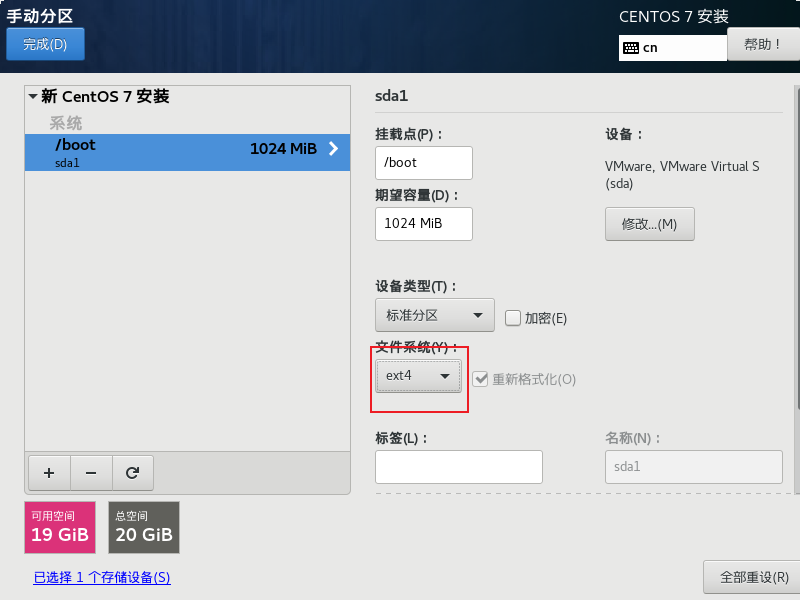
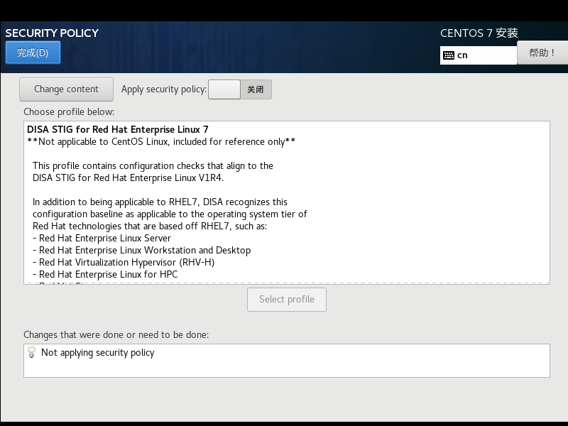

之前把linux虚拟机删除了，一直用的是云服务器，大厂的白嫖服务器都用完了呜呜，但是还没到双十一好烦，只能回归本源用自己电脑上的虚拟机了，所以我把镜像给下载回来了...话说虚拟机是真的占内存的说...

# 新建虚拟机


我装的是韩老师的Centos7


之后开始流程


取个名字


开始安装系统


选择镜像


选择install CentOS7


之后按一次回车

等会会进入这个界面


选择语言


之后等待一会

进入这个页面


点击软件选择


之后再等待一会（不要乱点）

选择安装位置进行修改


点击完成


选择文件系统为ext4



按照相同的步骤加入swap分区


添加根分区


点击完成


接收更改就可以啦

勾选掉KDUMP


打开网络


关闭安全策略，因为是我们自己做的



之后这个页面就设置完成啦

点击右下角的开始安装


安装好会提示让重启，重启就好啦


同意协议


之后就可以安装好啦


# 安装所需要的软件

## 安装wget命令

如果需要通过使用wget命令，直接通过网络下载maven安装包时，需要在linux系统中安装wget命令。

`yum -y install wget`     常规的安装wget的操作命令

## 下载maven安装包

[Index of /dist/maven/maven-3/3.5.4/binaries (apache.org)](https://archive.apache.org/dist/maven/maven-3/3.5.4/binaries/)


之后再传到虚拟机上就行了

### 解压缩maven

`tar -zvxf apache-maven-3.5.4-bin.tar.gz`

### 配置maven环境变量

`vi /etc/profile`

添加环境变量

```shell
export MAVEN_HOME=/usr/local/apache-maven-3.5.4
export MAVEN_HOME
export PATH=$PATH:$MAVEN_HOME/bin
```

编辑之后记得使用`source /etc/profile`命令是改动生效。

### 验证结果

在任意路径下执行`mvn -version`验证命令是否有效。

docker需要安装在Centos7及以上版本的Linux系统中。

在Linux中有两种安装docker的方法，一种是使用官方安装脚本自动安装docker，另一种是手动安装docker。

## 使用官方安装脚本自动安装docker

**第一步，安装docker。**

\# 官方安装脚本安装

命令：`curl -fsSL https://get.docker.com| bash -s docker --mirror Aliyun`

\# 也可以使用国内daocloud一键安装

命令：`curl -sSL https://get.daocloud.io/docker| sh`

**第二步，测试Docker。**

命令：`docker run hello-world`

若结果显示“docker: Cannot connect to the Docker daemon at unix:///var/run/docker.sock. Is the docker daemon running?”,则运行如下命令：

systemctl daemon-reload

systemctl restart docker.service

再次验证：docker run hello-world

**第三步，设置开机启动。**

\# 允许开机启动

命令：systemctl enable docker

**第四步，查看docker版本。**

\# 没启动docker之前查看docker版本

命令：docker -v

或 docker version

## 下载Jenkins

网址

[Jenkins download and deployment](https://www.jenkins.io/download/)


之后把war包上传到/usr/local/jenkins目录下


### 启动jenkins

`nohup java -jar /usr/local/jenkins/jenkins.war  >/usr/local/jenkins/jenkins.out &`

### 访问

`http://ip:8080`

### 查看Jenkins进程

`ps -ef |grep jenkins`

### 获取管理员密码

`cat /root/.jenkins/secrets/initialAdminPassword`

会出现一串数字，就是解锁Jenkins的密码

### 配置国内的镜像

`cd /root/.jenkins/updates`

`sed -i 's/http:\/\/updates.jenkins-ci.org\/download/https:\/\/mirrors.tuna.tsinghua.edu.cn\/jenkins/g' default.json && sed -i 's/http:\/\/www.google.com/https:\/\/www.baidu.com/g' default.json`

这是直接修改的配置文件，如果前边Jenkins用sudo启动的话，那么这里的两个sed前均需要加上sudo 

**重启Jenkins，安装插件**


重启再进入8080


