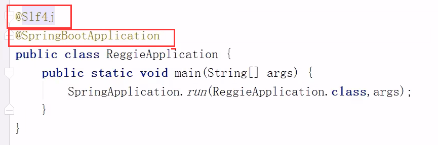
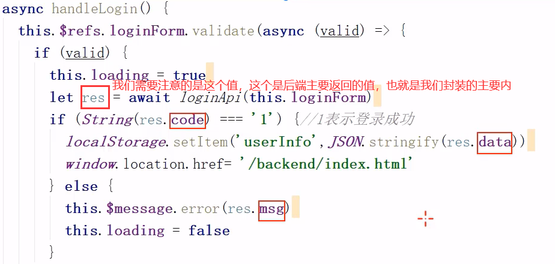
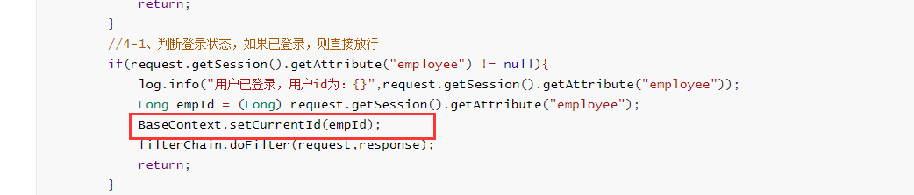
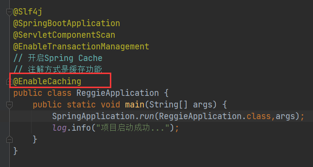
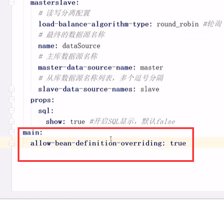
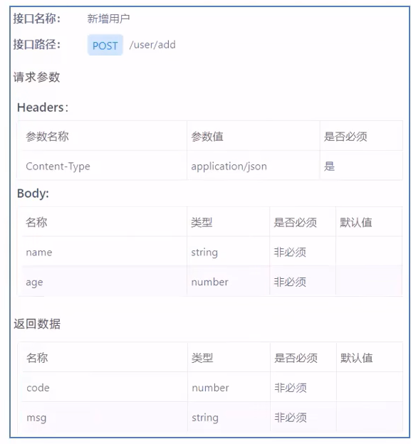

这个实战项目是我目前做的最完整的一个项目，前前后后做了两遍，感觉从中可以学到不少的东西，以前做的项目一般都是不做笔记的，但是感觉不做笔记就会感觉空落落的，这次会完整记录下本次项目的开发过程，供自己学习参考。

# Day1

## 软件开发整体介绍

### 软件开发流程


作为软件开发人员，我们的侧重点主要在编码上，也就是第三个阶段，但是一些小公司需要我们的能力更强一些，不局限于某一个步骤，也就是俗话说的脏话累活都我们干

### 角色分工


这是规范的，但是小公司的话可能大部分角色都得我们自己担任

### 软件环境

分为开发环境，测试环境，生产环境


## 瑞吉外卖项目介绍

### 项目介绍

本项目（瑞吉外卖）是专门为餐饮企业（餐厅、饭店）定制的一款软件产品，包括系统管理后台和移动端应用两部分。其中系统管理后台主要提供给餐饮企业内部员工使用，可以对餐厅的菜品、套餐、订单等进行管理维护。移动端应用主要提供给消费者使用，可以在线浏览菜品、添加购物车、下单等。

本项目共分为3期进行开发:

第一期主要实现基本需求，其中移动端应用通过H5实现，用户可以通过手机浏览器访问。

第二期主要针对移动端应用进行改进，使用微信小程序实现，用户使用起来更加方便。

第三期主要针对系统进行优化升级，提高系统的访问性能。

### 产品原型展示

产品原型，就是一款产品成型之前的一个简单的框架，就是将页面的排版布局展现出来，使产品的初步构思有一个可视化的展示。通过原型展示，可以更加直观的了解项目的需求和提供的功能。

产品原型是项目经理在需求分析时期进行制作的

注意：产品原型主要用于展示项目的功能，并不是最终的页面效果。


大概就是这个样子


### 技术选型


### 功能架构


### 角色


## 开发环境搭建

1. 创建瑞吉外卖数据库（课程资料里面有）


对于这些表的解释

**菜品和套餐分类**指的是荤菜、素菜、儿童套餐.....等等

每一个菜里面都有菜品的id

每一个套餐里面都有对应的套餐id


2. Maven项目搭建

新建一个Maven项目

在这里需要注意的是，每一次创建Maven项目，都要先检查Maven仓库的地址，以及JDK的版本，以及JRE的版本，避免未知的错误


==**JDK和SDK的区别**==

SDK是Software Development Kit的缩写，中文意思是“[软件开发工具包](https://link.zhihu.com/?target=https%3A//www.baidu.com/s%3Fwd%3D%E8%BD%AF%E4%BB%B6%E5%BC%80%E5%8F%91%E5%B7%A5%E5%85%B7%E5%8C%85%26tn%3DSE_PcZhidaonwhc_ngpagmjz%26rsv_dl%3Dgh_pc_zhidao)”。这是一个覆盖面相当广泛的名词，可以这么说：辅助开发某一类软件的相关文档、范例和工具的集合都可以叫做“SDK”。SDK是一系列文件的组合，它为软件的开发提供一个平台(它为软件开发使用各种API提供便利)。

JDK(Java Development Kit)是Sun Microsystems针对Java开发员的产品。自从Java推出以来，JDK已经成为使用最广泛的Java SDK（Software development kit）。


导入pom文件（在项目资料里面可以直接导入）

pom里面的基本上都是springboot的依赖以及之前需要用到的依赖


之后导入yml配置文件（也是从项目资料里面直接导入）

里面可以修改数据源里面的数据库账号密码


之后配置启动类

@Slf4j是打印日志的注解，属于Lombok技术（就是那个提供get set方法的注解的技术）

加了这个注解就可以使用这个方法




对于@SpringBootApplication的理解可以看我Springboot的博客


之后可以把前端页面导入（从项目资料中可以copy）


但是我们会发现一个问题，如果访问localhost:8080/页面地址，是访问不到的，这是为什么呢，这是因为默认用户是不可以访问resources下面的东西的，要不然服务器就会不安全了

所以为了能够访问下面的资源，我们需要编写一个配置类来配置MVC框架资源的映射，需要注意的是继承了WebMvcConfigurationSupport，重写了拦截器方法


之后就可以访问前端页面了

## 后台登录功能开发

### 需求分析

通过前端发axios请求，请求到后端进行登录验证，之后如果返回码为1，则说明登录成功，之后把user的信息保存到浏览器中，then前端跳转到首页，否则就发送一个错误显示的效果

这个是user信息封装到浏览器的格式


需要注意的是这个：



### 代码开发

1. 实现登录功能，首先我们要导入与数据库相对应的实体类employee


都是和数据库字段进行一一对应的

需要注意的是java的明明规则是驼峰，但是mysql是用（下划线）\_进行分割的，但是之前由于我们已经配置过mp的驼峰命名法映射，现在已经可以进行映射了（这个很方便！）

2. 之后我们创建mapper(利用mp)

   

3. 之后创建Service和ServiceImpl


4. 导入返回结果类R（从课程文件中导入）

   此类是一个通用结果类，也就是说服务端响应的所有结果最终都会包装成这种类型的数据返回给前端

   之后前端就可以根据这个进行解析了（这个就不用转换成json了，因为我们已经在controller类上加了@RestController注解，spring会自动给我们把数据封装成json）

   ```java
   @Data
   public class R<T> {
       private Integer code; //编码：1成功，0和其它数字为失败
       private String msg; //错误信息
       private T data; //数据
       private Map map = new HashMap(); //动态数据，（几乎不用）
       public static <T> R<T> success(T object) {//响应成功的时候返回
           R<T> r = new R<T>();
           r.data = object;
           r.code = 1;
           return r;
       }
       public static <T> R<T> error(String msg) {//响应失败的时候返回
           R r = new R();
           r.msg = msg;
           r.code = 0;
           return r;
       }
       public R<T> add(String key, Object value) {//操作上面的map，用到了再说
           this.map.put(key, value);
           return this;
       }
   }
   ```

5. 之后创建controller

由于前端发送的请求为：


根据这些我们可以编写controller

由于前端发回的信息是json数据

我们利用mp进行封装信息，发回的是employee，用@RequestBody注解声明是json数据


其中涉及了一个md5加密的方法md5DigestAsHex，这个会用就可以了

```java
@Slf4j
@RestController
@RequestMapping("/employee")
public class EmployeeController {
    @Autowired
    private EmployeeService employeeService;
    /**
     * 员工登录
     */
    @PostMapping("/login")
    public R<Employee> login(HttpServletRequest request,@RequestBody Employee employee){
        //1、将页面提交的密码password进行md5加密处理
        String password = employee.getPassword();
        password = DigestUtils.md5DigestAsHex(password.getBytes());//这是一个工具类
        //2、根据页面提交的用户名username查询数据库
        LambdaQueryWrapper<Employee> queryWrapper = new LambdaQueryWrapper<>();
        queryWrapper.eq(Employee::getUsername,employee.getUsername());
        Employee emp = employeeService.getOne(queryWrapper);
        //3、如果没有查询到则返回登录失败结果
        if(emp == null){
            return R.error("登录失败");
        }
        //4、密码比对，如果不一致则返回登录失败结果
        if(!emp.getPassword().equals(password)){
            return R.error("登录失败");
        }
        //5、查看员工状态，如果为已禁用状态，则返回员工已禁用结果
        if(emp.getStatus() == 0){
            return R.error("账号已禁用");
        }
        //6、登录成功，将员工id存入Session
        //	 并返回登录成功结果
        request.getSession().setAttribute("employee",emp.getId());
        return R.success(emp);
    }
}
```

之前我们说到的利用浏览器存储信息可以在这里查看


## 后台退出功能开发

### 需求分析

用户点击页面中退出按钮，发送请求，请求地址为/employee/logout，请求方式为POST。我们只需要在Controller中创建对应的处理方法即可，具体的处理逻辑:

1、清理Session中的用户id

2、返回结果

### 代码开发

```java
    /**
     * 员工退出
     */
    @PostMapping("/logout")
    public R<String> logout(HttpServletRequest request){
        //清理Session中保存的当前登录员工的id
        request.getSession().removeAttribute("employee");
        return R.success("退出成功");
    }
```

至于浏览器存储的数据userinfor，则被前端给清除掉了，不需要我们关心

# Day2

这一章主要讲的是员工管理业务开发

## 完善登录功能

```
***** 自定义过滤器的使用，用来过滤未登录的用户以及登录过用户的放行
```

### 问题分析

我们发现，如果直接进入index页面，不登陆仍然可以进入，这样会导致系统不安全，所以我们要对登录功能进行完善

我们希望看到的效果应该是，只有登录成功后才可以访问系统中的页面，如果没有登录则跳转到登录页面。

那么，具体应该怎么实现呢?

答案就是使用**过滤器**（Web）或者**拦截器**（SpringMVC），在过滤器或者拦截器中判断用户是否已经完成登录，如果没有登录则跳转到登录页面。


实现步骤:

1、创建自定义过滤器LoginCheckFilter

2、在启动类上加入注解@ServletComponentScan

3、完善过滤器的处理逻辑

### 代码实现

实现Filter接口，再实现相应的方法

关于AntPathMatcher这个路径匹配器，会用就可以了

并且，本次请求的URI也可以通过HttpServletRequest的API来获取


这个代码要看

```java
/**
 * 检查用户是否已经完成登录
 filterName是这个过滤器的名字
 urlPatterns是表明拦截的是哪些路径
 */
@WebFilter(filterName = "loginCheckFilter",urlPatterns = "/*")
@Slf4j
public class LoginCheckFilter implements Filter{
    //路径匹配器，支持通配符
    public static final AntPathMatcher PATH_MATCHER = new AntPathMatcher();
    @Override
    public void doFilter(ServletRequest servletRequest, ServletResponse servletResponse, FilterChain filterChain) throws IOException, ServletException {
        //向下转型后才会有相应的方法
        HttpServletRequest request = (HttpServletRequest) servletRequest;
        HttpServletResponse response = (HttpServletResponse) servletResponse;
        //1、获取本次请求的URI
        String requestURI = request.getRequestURI();// /backend/index.html
        log.info("拦截到请求：{}",requestURI);
        //定义不需要处理的请求路径
        String[] urls = new String[]{
                "/employee/login", //登录的时候，不需要处理
                "/employee/logout", //退出的时候
                "/backend/**", //针对页面的请求（想看就看），我们只拦截针对controller的请求
                "/front/**",//和上面的一样

        };
        //2、判断本次请求是否需要处理（下面封装的是一个方法，用来匹配）
        boolean check = check(urls, requestURI);
        //3、如果不需要处理，则直接放行
        if(check){
            log.info("本次请求{}不需要处理",requestURI);
            filterChain.doFilter(request,response);
            return;
        }
        //4-1、判断登录状态，如果已登录，则直接放行
        if(request.getSession().getAttribute("employee") != null){
            log.info("用户已登录，用户id为：{}",request.getSession().getAttribute("employee"));
            Long empId = (Long) request.getSession().getAttribute("employee");
            BaseContext.setCurrentId(empId);
            filterChain.doFilter(request,response);
            return;
        }
        //5、如果未登录则返回未登录结果，通过输出流方式向客户端页面响应数据，前端有一个拦截器，如果相应的信息为NOTLOGIN的话，前端就会跳转到登录页面，并且显示未登录的提示信息
        //这里需要注意的是，我们为什么要把R转换为json，因为之前我们是在controller中写的返回值，里面有@RestController注解，spring会自动封装成json数据响应给前端，但是这个是过滤器，需要我们手动封装成json数据
        response.getWriter().write(JSON.toJSONString(R.error("NOTLOGIN")));
        return;
    }
    /**
     * 路径匹配，检查本次请求是否需要放行
     为true说明不需要被拦截
     为false说明要被拦截
     */
    public boolean check(String[] urls,String requestURI){
        for (String url : urls) {
            boolean match = PATH_MATCHER.match(url, requestURI);
            if(match){
                return true;
            }
        }
        return false;
    }
}
```

除了编写过滤器类，还要在启动类上加上@ServletComponentScan注解

关于为什么我们需要@ServletComponentScan？问题出在嵌入式Servlet容器中。

由于嵌入式容器不支持@WebServlet，@WebFilter（就是声明过滤器的那个注解）和@WebListener注释，Spring Boot在很大程度上依赖于嵌入式容器，因此引入了新的注释@ServletComponentScan来支持一些使用这3个注释的从属jar


## 新增员工

```
***** 可以看一下这个方法的全局异常捕获
```


### 需求分析


### 数据模型

新增员工，其实就是将我们新增页面录入的员工数据插入到employee表。需要注意，employee表中对`username`字段加入了唯一约束，因为username是员工的登录账号，必须是唯一的


### 代码开发

根据前端请求写代码


在开发代码之前，需要梳理一下整个程序的执行过程:
1、页面发送ajax请求，将新增员工页面中输入的数据以json的形式提交到服务端

2、服务端Controller接收页面提交的数据并调用Service将数据进行保存

3、Service调用Mapper操作数据库，保存数据


下面是代码实现

编写EmployeeController中的方法（mp底层已经帮我们写好了save方法）

```java
 /**
     * 新增员工
     */
    @PostMapping
    public R<String> save(HttpServletRequest request,@RequestBody Employee employee){
        log.info("新增员工，员工信息：{}",employee.toString());

        //设置初始密码123456，需要进行md5加密处理
        employee.setPassword(DigestUtils.md5DigestAsHex("123456".getBytes()));

        
        employee.setCreateTime(LocalDateTime.now());
        employee.setUpdateTime(LocalDateTime.now());
        //获得当前登录用户的id
        Long empId = (Long) request.getSession().getAttribute("employee");
        employee.setCreateUser(empId);//设置创建此用户的用户
        employee.setUpdateUser(empId);//设置更新此用户的用户 

        
        employeeService.save(employee);
        return R.success("新增员工成功");
    }
```


但是如果我们添加一个账号相同的用户，会报错，抛异常

所以我们要进行异常的处理

**通常有两种方式：**

1、在Controller方法中加入try、catch进行异常捕获（这种方法如果代码里多的话就会显得很臃肿）

2、使用异常处理器进行全局异常捕获

### 全局异常捕获

基本原理是AOP代理

类上的@ControllerAdvice注解是Spring3.2中新增的注解，学名是Controller增强器，作用是给Controller控制器添加统一的操作或处理。我们熟知的作用是做**全局异常的处理**


方法上的@ExceptionHandler可以用来统一处理方法抛出的异常，可以添加参数，参数是某个异常类的class，代表这个方法专门处理该类异常

```java
/**
 * 全局异常处理
 * ControllerAdvice的annotations属性表示拦截加了后面这些注解的类,比如拦截普通的Controller和RestController
 */
@ControllerAdvice(annotations = {RestController.class, Controller.class})
//返回值为json数据
@ResponseBody
//日志
@Slf4j
public class GlobalExceptionHandler {
    /**
     * 异常处理方法
     * @return
     */
    //ExceptionHandler后面的属性表示处理这个SQLIntegrityConstraintViolationException异常
    @ExceptionHandler(SQLIntegrityConstraintViolationException.class)
    public R<String> exceptionHandler(SQLIntegrityConstraintViolationException ex){
        log.error(ex.getMessage());
        //如果异常信息里面有Duplicate entry这个关键字，就进入，说明xxx重复了
        if(ex.getMessage().contains("Duplicate entry")){
            String[] split = ex.getMessage().split(" ");
            String msg = split[2] + "已存在";
            return R.error(msg);
        }
        //如果这个异常中有其他的错误类型可以写在下面
        return R.error("未知错误");
    }
}
```

## 员工信息分页查询

```
***** MP的分页插件的运用
```


### 需求分析

系统中的员工很多的时候，如果在一个页面中全部展示出来会显得比较乱，不便于查看，所以一般的系统中都会以分页的方式来展示列表数据。

### 代码开发

在开发代码之前，需要梳理一下整个程序的执行过程:

1、页面发送ajax请求，将分页查询参数(page、pageSize、name)提交到服务端

2、服务端Controller接收页面提交的数据并调用Service查询数据

3、Service调用Mapper操作数据库，查询分页数据

4、Controller将查询到的分页数据响应给页面

5、页面接收到分页数据并通过ElementUI的Table组件展示到页面上


看前端发的请求写后端代码


需要注意的是可以看到前端页面发到后端的数据并不是以url的格式，而是json的格式，但是前端有一个全局的拦截器对数据进行了处理（只有get请求才会进行处理），封装成了url格式，之后才以url的形式（组装）发送到后端（**这个并不是重点，是前端的东西**）


==下面开始写后端的东西==

1. 配置分页插件

   ```java
   /**
    * 配置MP的分页插件,至于为什么要返回这个bean，要问mp的开发者了
    */
   @Configuration
   public class MybatisPlusConfig {
       @Bean
       public MybatisPlusInterceptor mybatisPlusInterceptor(){
           MybatisPlusInterceptor mybatisPlusInterceptor = new MybatisPlusInterceptor();
           mybatisPlusInterceptor.addInnerInterceptor(new PaginationInnerInterceptor());
           return mybatisPlusInterceptor;
       }
   
   }
   ```

2. 创建controller方法

这里需要注意的是springMVC为我们把**url里面的参数**直接封装到了**变量**里面

并且根据前端的代码可知，我们需要返回值是一个Page对象（这个对象是MP给我们封装的）


这个代码值得一看，因为MP很机智的想到有的参数可能为空，很巧妙的简化了代码

```java
 /**
     * 员工信息分页查询
     这里需要注意的是springMVC为我们把url里面的参数直接封装到了变量里面
     name这个参数是模糊查询，也就是一个搜索框，可以给用户搜索使用
     */
    @GetMapping("/page")
    public R<Page> page(int page,int pageSize,String name){
        log.info("page = {},pageSize = {},name = {}" ,page,pageSize,name);
        //构造分页构造器
        Page pageInfo = new Page(page,pageSize);
        //构造条件构造器
        LambdaQueryWrapper<Employee> queryWrapper = new LambdaQueryWrapper();
        //添加过滤条件，（如果这个条件为空，就什么都不设置）
        //这条语句相当于select * from emp like name='xxxx';
        queryWrapper.like(StringUtils.isNotEmpty(name),Employee::getName,name);
        //添加排序条件
        queryWrapper.orderByDesc(Employee::getUpdateTime);
        //执行查询
        employeeService.page(pageInfo,queryWrapper);
        return R.success(pageInfo);
    }
```

## 启用/禁用员工账号

```
***** 这个可以看看为什么前端js只能精确保存前16位，如果出现了这种情况怎么改变转换器
```

### 需求分析

在员工管理列表页面，可以对某个员工账号进行启用或者禁用操作。 

账号禁用的员工不能登录系统，启用后的员工可以正常登录。(这个已经实现了)

需要注意，只有管理员（admin用户）可以对其他普通用户进行启用、禁用操作，所以普通用户登录系统后启用、禁用按钮不显示。（前端实现）

### 代码开发

需要注意的是：

页面中是怎么做到只有管理员admin能够看到启用、禁用按钮的?

因为前端根据后端发送的数据（存在了浏览器中）做了判断


在开发代码之前，需要梳理一下整个程序的执行过程:

1、页面发送ajax请求，将参数(id. status)提交到服务端，（如果是正常就传0，如果是禁用就传1）

2、服务端Controller接收页面提交的数据并调用Service更新数据

3、Service调用Mapper操作数据库


启用、禁用员工账号，本质上就是一个更新操作，也就是对status状态字段进行操作在Controller中创建update方法，此方法是一个通用的修改员工信息的方法

此外，在下面的编辑员工信息也是更新操作，和这个是同一个类型，可以进行代码复用


```java
/**
 * 根据id修改员工信息
 */
@PutMapping
public R<String> update(HttpServletRequest request,@RequestBody Employee employee){
    log.info(employee.toString());
    
    //设置更新时间和更新人
    Long empId = (Long)request.getSession().getAttribute("employee");
    employee.setUpdateTime(LocalDateTime.now());
    employee.setUpdateUser(empId);
    
    employeeService.updateById(employee);
    return R.success("员工信息修改成功");
}
```

之后我们在测试中发现

前端在浏览器中存储的数据的精度不够准确（js只能保证数字前16位是精确的），所以发送给后端的id不正确，进而导致更新失败，怎么解决这种问题呢

==我们可以在服务端给页面响应json数据时进行处理，将long型数据统一转为String字符串==

### 代码修复

具体实现步骤:

1）提供对象转换器JacksonobjectMapper，基于Jackson进行Java对象到json数据的转换（资料中已经提供，直接复制到项目中使用)

2）在WebMvcConfig配置类中扩展Spring mvc的消息转换器，在此消息转换器中使用提供的对象转换器进行Java对象到json数据的转换（如果不改是使用的SpringMVC默认的消息转换器）


1. 添加JacksonObjectMapper（这个直接用就行）

```java
/**
 * 对象映射器:基于jackson将Java对象转为json，或者将json转为Java对象
 * 将JSON解析为Java对象的过程称为 [从JSON反序列化Java对象]
 * 从Java对象生成JSON的过程称为 [序列化Java对象到JSON]
 */
public class JacksonObjectMapper extends ObjectMapper {

    public static final String DEFAULT_DATE_FORMAT = "yyyy-MM-dd";
    public static final String DEFAULT_DATE_TIME_FORMAT = "yyyy-MM-dd HH:mm:ss";
    public static final String DEFAULT_TIME_FORMAT = "HH:mm:ss";

    public JacksonObjectMapper() {
        super();
        //收到未知属性时不报异常
        this.configure(FAIL_ON_UNKNOWN_PROPERTIES, false);

        //反序列化时，属性不存在的兼容处理
        this.getDeserializationConfig().withoutFeatures(DeserializationFeature.FAIL_ON_UNKNOWN_PROPERTIES);


        SimpleModule simpleModule = new SimpleModule()
                .addDeserializer(LocalDateTime.class, new LocalDateTimeDeserializer(DateTimeFormatter.ofPattern(DEFAULT_DATE_TIME_FORMAT)))
                .addDeserializer(LocalDate.class, new LocalDateDeserializer(DateTimeFormatter.ofPattern(DEFAULT_DATE_FORMAT)))
                .addDeserializer(LocalTime.class, new LocalTimeDeserializer(DateTimeFormatter.ofPattern(DEFAULT_TIME_FORMAT)))
                .addSerializer(BigInteger.class, ToStringSerializer.instance)
            
                .addSerializer(Long.class, ToStringSerializer.instance) //最主要的是这个，把对象中的long型数据转换位string字符串
            //剩下的这些序列化器基本上都是把日期（按照不同的标准）转换成字符串的
                .addSerializer(LocalDateTime.class, new LocalDateTimeSerializer(DateTimeFormatter.ofPattern(DEFAULT_DATE_TIME_FORMAT)))
                .addSerializer(LocalDate.class, new LocalDateSerializer(DateTimeFormatter.ofPattern(DEFAULT_DATE_FORMAT)))
                .addSerializer(LocalTime.class, new LocalTimeSerializer(DateTimeFormatter.ofPattern(DEFAULT_TIME_FORMAT)));
		//注册功能模块 例如，可以添加自定义序列化器和反序列化器
        this.registerModule(simpleModule);
    }
}

```

2. 配置WebMvcConfig

下面这个转换器的作用就是spring把R对象封装成JSON字符串的策略，也就是我们加RestController所做的操作（虽然这个操作是spring帮我们做的，但是我们仍然可以手动干预，手动干预也就是可以添加我们自己的转换器并加入进去）


配置的转换器是有顺序的，下标是0表示我们把我们自己写的转换器排到了最前面

之后就会发现后端返回前端的long型数据变成了string型数据

## 编辑员工信息

```
*** 可以看一看数据回显
```

***

### 需求分析

在员工管理列表页面点击编辑按钮，跳转到编辑页面，在编辑页面**回显**员工信息并进行修改，最后点击保存按钮完成编辑操作


在开发代码之前需要梳理一下操作过程和对应的程序的执行流程:

1、点击编辑按钮时，页面跳转到add.html（add是一个公共页面，添加和修改都能用这个页面），并在url中携带参数[员工id]


2、在add.html页面获取url中的参数[员工id] (前端的活)

3、发送ajax请求，把员工id参数请求给后端，

**4、服务端接收请求，根据员工id查询员工信息，将员工信息以json形式响应给页面**

5、页面接收服务端响应的json数据，通过Vue的数据绑定进行员工信息回显

6、点击保存按钮，发送ajax请求，将页面中的员工信息以json方式提交给服务端

**7、服务端接收员工信息，并进行处理，完成后给页面响应**

8、页面接收到服务端响应信息后进行相应处理

上面标黑的是后端需要进行的处理，其中7我们在 `启用/禁用员工账号` 的章节已经写过了（原理是更新此用户）

### 代码开发

是一个简单的查询（可以不用看）

如果忘记了@PathVariable的使用可以看看，这个是spring的注解

**@PathVariable是spring3.0的一个新功能：接收请求路径中占位符的值**
通过 @PathVariable 可以将 URL 中占位符参数绑定到控制器处理方法的入参中:URL 中的 {xxx} 占位符可以通过@PathVariable(“xxx”) 绑定到操作方法的入参中。

一般和GetMapping...xxx等联合使用，因为这个id值不是固定的，是路径变量

```java
/**
 * 根据id查询员工信息
 */
@GetMapping("/{id}")
public R<Employee> getById(@PathVariable Long id){
    log.info("根据id查询员工信息...");
    Employee employee = employeeService.getById(id);
    if(employee != null){
        return R.success(employee);
    }
    return R.error("没有查询到对应员工信息");
}
```

# Day3

分类管理业务


## 公共字段自动填充

```
***** 这个要看，有多个公共字段，并且处理方法一致可以这样做
```

这个功能是由MP进行的技术支持

### 问题分析

前面我们已经完成了后台系统的员工管理功能开发，在新增员工时需要设置创建时间、创建人、修改时间、修改人等字段，在编辑员工时需要设置修改时间和修改人等字段。这些字段属于公共字段，也就是很多表中都有这些字段，如下:


能不能对于这些公共字段在某个地方统一处理，来简化开发呢?

客案就是使用Mybatis Plus提供的==公共字段自动填充==功能。


Mybatis Plus公共字段自动填充，也就是在插入或者更新的时候为指定字段赋予指定的值，使用它的好处就是可以统一对这些字段进行处理，避免了重复代码。
实现步骤:

1、在实体类的属性上加入@TableField注解，指定自动填充的策略

2、按照框架要求编写**元数据对象处理器**，在此类中统一为公共字段赋值，此类需要实现MetaObjectHandler接口

### 代码实现

1. 添加@TableField注解

```java
	@TableField(fill = FieldFill.INSERT) //插入时填充字段
    private LocalDateTime createTime;

    @TableField(fill = FieldFill.INSERT_UPDATE) //插入和更新时填充字段
    private LocalDateTime updateTime;

    @TableField(fill = FieldFill.INSERT) //插入时填充字段
    private Long createUser;

    @TableField(fill = FieldFill.INSERT_UPDATE) //插入和更新时填充字段
    private Long updateUser;
```

2. 编写**元数据对象处理器**,实现MetaObjectHandler接口

   但是出现了新的问题，没有办法获取更新用户的id

之前我们把用户id存在了httpsession中，但是我们在MyMetaObjecthandler类中是得不到httpsession对象的，所以我们需要通过其他方式来获取登录用户id

我们可以使用ThreadLocal来解决此问题，它是JDK中提供的一个类


什么是ThreadLocal?
ThreadLocal并不是一个Thread，而是Thread的局部变量。当使用ThreadLocal维护变量时，ThreadLocal为每个使用该变量的线程提供独立的变量副本，所以每一个线程都可以独立地改变自己的副本，而不会影响其它线程所对应的副本。

ThreadLoeal为每个线程提供单独一份存储空间，具有线程隔离的效果，只有在**线程内**才能获取到对应的值，**线程外则不能访问**。

ThreadLocal常用方法:

```java
public void set(T value)   //设置当前线程的线程局部变量的值
public T get()      //返回当前线程所对应的线程局部变量的值
```

我们可以在LoginCheckFilter的doFilter方法中获取当前登录用户id，并调用ThreadLocal的set方法来设置当前线程的线程局部变量的值（用户id)，然后在MyMetaObjectHandler的updateFill方法中调用ThreadLocal的get方法来获得当前线程所对应的线程局部变量的值〔用户id)。


所以我们由此可以得到实现步骤

1，编写BaseContext工具类，基于ThreadLecal封装的工具类

2、在LogincheckFilter的doFilter方法中调用BaseContext来设置当前登录用户的id

3、在MyMetaObjectHandler的方法中调用BaseContext获取登录用户的id


1. 编写BaseContext

```java
/**
 * 基于ThreadLocal封装工具类，用户保存和获取当前登录用户id
 */
public class BaseContext {
    private static ThreadLocal<Long> threadLocal = new ThreadLocal<>();

    /**
     * 设置值
     */
    public static void setCurrentId(Long id){
        threadLocal.set(id);
    }
    /**
     * 获取值
     */
    public static Long getCurrentId(){
        return threadLocal.get();
    }
}
```

2. 在LoginCheckFilter中设置id（可以看“完善登录功能的代码”）



3. 使用利用BaseContext取出id

```java
/**
 * 自定义元数据对象处理器
 */
@Component
@Slf4j
public class MyMetaObjecthandler implements MetaObjectHandler {
    /**
     * 插入操作，自动填充
     执行insert（根据TableField）的时候执行这个方法 
     */
    @Override
    public void insertFill(MetaObject metaObject) {
        log.info("公共字段自动填充[insert]...");
        log.info(metaObject.toString());

        metaObject.setValue("createTime", LocalDateTime.now());
        metaObject.setValue("updateTime",LocalDateTime.now());
        //使用BaseContext取出id
        metaObject.setValue("createUser",BaseContext.getCurrentId());
        //使用BaseContext取出id
        metaObject.setValue("updateUser",BaseContext.getCurrentId());
    }

    /**
     * 更新操作，自动填充
	 在执行更新操作（根据TableField）的时候执行这个方法
     */
    @Override
    public void updateFill(MetaObject metaObject) {
        log.info("公共字段自动填充[update]...");
        log.info(metaObject.toString());

        long id = Thread.currentThread().getId();
        log.info("线程id为：{}",id);

        metaObject.setValue("updateTime",LocalDateTime.now());
        //使用BaseContext取出id
        metaObject.setValue("updateUser",BaseContext.getCurrentId());
        
    }
}
```

## 新增分类

```
** 就是一个简单的增加操作
```


### 需求分析

后台系统中可以管理分类信息，分类包括两种类型，分别是菜品分类和套餐分类。

当我们在后台系统中添加菜品时需要选择一个菜品分类，

当我们在后台系统中添加一个套餐时需要选择一个套餐分类

在移动端也会按照菜品分类和套餐分类来展示对应的菜品和套餐。


排序的意思是根据序号进行靠前排列或者靠后排列（置顶...）

### 数据模型

数据模型就是category（种类/分类）


需要注意的是name是unique的

### 代码开发

在开发业务功能前，先将需要用到的类和接口基本结构创建好:

- 实体类Category(直接从课程资料中导入即可)

- Mapper接口CategoryMapper
- 业务层接口CategoryService
- 业务层实现类CategoryServicelmpl
- 控制层CategoryController

上面的这些和employee的差不多，就不一一罗列了，可以查看源码


在开发代码之前，需要梳理一下整个程序的执行过程:

 1、页面(backend/page/category/list.html 这个页面)发送ajax请求，将新增分类窗口输入的数据以json形式提交到服务端

2、服务端Controller接收页面提交的数据并调用Service将数据进行保存

3、Service调用Mapper操作数据库，保存数据

可以看到新增菜品分类和新增套餐分类请求的服务端地址和提交的json数据结构相同，并且两种类型的数据都在同一张表中存储，所以服务端只需要提供一个方法统一处理即可


```java
@PostMapping
public R<String> save(@RequestBody Category category){
    log.info("category:{}",category);
    categoryService.save(category);
    return R.success("新增分类成功");
}
```


## 分类信息分页查询

```
** 和employee的分页差不多（Day2的）
```

### 需求分析

系统中的分类很多的时候，如果在一个页面中全部展示出来会显得比较乱，不便于查看，所以一般的系统中都会以分页的方式来展示列表数据。

### 代码开发

在开发代码之前，需要梳理一下整个程序的执行过程:

1、页面发送ajax请求，将分页查询参数(page. pageSize)提交到服务端

2、服务端Controller接收页面提交的数据并调用Service查询数据

3、Service调用Mapper操作数据库，查询分页数据

4、Controller将查询到的分页数据响应给页面

5、页面接收到分页数据并通过ElementUI的Table组件展示到页面上


```java
 	@GetMapping("/page")
    public R<Page> page(int page,int pageSize){
        //分页构造器
        Page<Category> pageInfo = new Page<>(page,pageSize);
        //条件构造器
        LambdaQueryWrapper<Category> queryWrapper = new LambdaQueryWrapper<>();
        //添加排序条件，根据sort进行排序
        queryWrapper.orderByAsc(Category::getSort);

        //分页查询
        categoryService.page(pageInfo,queryWrapper);
        return R.success(pageInfo);
    }
```

## 删除分类

```
**** 自定义异常以及删除的安全性校验
```

### 需求分析

在分类管理列表页面，可以对某个分类进行删除操作。**需要注意的是当分类关联了菜品或者套餐时，此分类不允许删除。**

### 代码开发

在开发代码之前，需要梳理一下整个程序（基础版本）的执行过程:

1、页面发送ajax请求，将参数id提交到服务端

2、服务端Controller接收页面提交的数据并调用Service删除数据

3、Service调用Mapper操作数据库

这个版本没有考虑这句话，会在功能完善中实现这个功能

```java
/**
 * 根据id删除分类
 */
@DeleteMapping
public R<String> delete(Long id){
    log.info("删除分类，id为：{}",id);
    categoryService.removeById(id);//这个方法是MP提供给我们的
    return R.success("分类信息删除成功");
}
```

### 功能完善

前面我们已经实现了根据id删除分类的功能，但是并没有检查删除的分类是否关联了菜品或者套餐，所以我们需要进行功能完善。
要完善分类删除功能，需要先准备基础的类和接口:

1、实体类Dish和Setmeal(从课程资料中复制即可)

2、Mapper接口DishMapper和SetmealMapper

3、Service接口DishService和SetmealService

4、 Service实现类DishServicelmpl和SetmealServicelmpl


其次，如果删除的分类是否关联了菜品或者套餐，我们需要抛出一个异常

所以我们定义CustomException

```java
/**
 * 自定义业务异常类
 */
public class CustomException extends RuntimeException {
    public CustomException(String message){
        super(message);
    }
}
```

我们还要在全局的异常处理器中处理这种异常（下面的代码是写在类GlobalExceptionHandler（全局异常处理器）中的）

```java
/**
 * 异常处理方法
 * @return
 */
@ExceptionHandler(CustomException.class)
public R<String> exceptionHandler(CustomException ex){
    log.error(ex.getMessage());
    return R.error(ex.getMessage());
}
```


下面我们可以写service的方法了

```java
@Service
public class CategoryServiceImpl extends ServiceImpl<CategoryMapper,Category> implements CategoryService{
    @Autowired
    private DishService dishService;
    @Autowired
    private SetmealService setmealService;
    
    /**
     * 根据id删除分类，删除之前需要进行判断
     */
    @Override
    public void remove(Long id) {
        LambdaQueryWrapper<Dish> dishLambdaQueryWrapper = new LambdaQueryWrapper<>();
        //添加查询条件，根据分类id进行查询
        dishLambdaQueryWrapper.eq(Dish::getCategoryId,id);
        int count1 = dishService.count(dishLambdaQueryWrapper);
        
        //查询当前分类是否关联了菜品，如果已经关联，抛出一个业务异常
        if(count1 > 0){
            //已经关联菜品，抛出一个业务异常
            throw new CustomException("当前分类下关联了菜品，不能删除");
        }
        
        //查询当前分类是否关联了套餐，如果已经关联，抛出一个业务异常
        LambdaQueryWrapper<Setmeal> setmealLambdaQueryWrapper = new LambdaQueryWrapper<>();
        //添加查询条件，根据分类id进行查询
        setmealLambdaQueryWrapper.eq(Setmeal::getCategoryId,id);
        int count2 = setmealService.count();
        if(count2 > 0){
            //已经关联套餐，抛出一个业务异常
            throw new CustomException("当前分类下关联了套餐，不能删除");
        }
        //正常删除分类
        super.removeById(id);
    }
}
```

## 修改分类

```
** 只有简单的update
```


### 需求分析

在分类管理列表页面点击修改按钮，弹出修改窗口，在修改窗口回显分类信息并进行修改，最后点击确定按钮完成修改操作

这个修改可以通过前端来进行数据回显（和上面的那个不太一样）


### 代码开发

```java
/**
 * 根据id修改分类信息
 */
@PutMapping
public R<String> update(@RequestBody Category category){
    log.info("修改分类信息：{}",category);
    categoryService.updateById(category);
    return R.success("修改分类信息成功");
}
```

# Day4

菜品管理业务功能

## 文件上传下载

```
***** 可以单独拿出来自己做一个小实验，完成一个这样的操作，了解文件上传和下载，以及图片回显的原理
```

### 文件上传介绍

文件上传，也称为upload，是指将本地图片、视频、音频等文件上传到服务器上，可以供其他用户浏览或下载的过程。文件上传在项目中应用非常广泛，我们经常发微博、发微信朋友圈都用到了文件上传功能。

文件上传时，对页面的form表单有如下要求:

1. **method="post"**                                       采用post方式提交数据
2. **enctype="multipart/form-data"**             采用multipart格式上传文件
3. **type="file"**                                                  使用input的file控件上传
   举例:

```html
<form method="post" action="/common/upload" enctype="multipart/form-data">
    <input name="myFile" type="file"/>
    <input type="submit" value="提交" />
</form>
```

上面是前端的工作，下面介绍后端服务器需要做的工作


服务端要接收客户端页面上传的文件，通常都会使用Apache的两个组件:

- commons-fileupload

- commons-io

Spring框架在spring-web包中对文件上传进行了封装，大大简化了服务端代码，我们只需要在Controller的方法中声明一个MultipartFile类型的参数即可接收上传的文件，例如:

下面这个参数里面的file表示上传上来的文件


### 文件下载介绍

文件下载，也称为download，是指将文件从服务器传输到本地计算机的过程。
通过浏览器进行文件下载，通常有两种表现形式:

- 以附件形式下载，弹出保存对话框，将文件保存到指定磁盘目录

- 直接在浏览器中打开

  

  

  通过浏览器进行文件下载，本质上就是服务端将文件以流的形式写回浏览器的过程。

### 文件上传代码实现

每上传一个文件

前端就会向后端发一次请求


需要注意的是


这个file要和上面图片的Form Data 中的name属性的值相同

并且file这个变量是个临时文件，如果不进行持久化保存，本方法执行完毕后临时文件就会被清除！！

其中的API需要解释的是

file.transferTo（File）将临时文件转存到指定位置

```java
/**
 * 文件上传和下载
 */
@RestController
@RequestMapping("/common")
@Slf4j
public class CommonController {
    //这个是在配置文件中读取的一个基础路径
    @Value("${reggie.path}")
    private String basePath;
    /**
     * 文件上传
     */
    @PostMapping("/upload")
    public R<String> upload(MultipartFile file){
        //file是一个临时文件，需要转存到指定位置，否则本次请求完成后临时文件会删除
        log.info(file.toString());
        //原始文件名
        String originalFilename = file.getOriginalFilename();//abc.jpg
        String suffix = originalFilename.substring(originalFilename.lastIndexOf("."));//.jpg
        //使用UUID重新生成文件名，防止文件名称重复造成文件覆盖
        String fileName = UUID.randomUUID().toString() + suffix;//uuid+后缀

        //创建一个目录对象(安全性校验)
        File dir = new File(basePath);
        //判断当前目录是否存在
        if(!dir.exists()){
            //目录不存在，需要创建
            dir.mkdirs();
        }
        try {
            //将临时文件转存到指定位置
            file.transferTo(new File(basePath + fileName));
        } catch (IOException e) {
            e.printStackTrace();
        }
        //因为要把文件名称存储到数据库，知道这张图片在数据的什么地方
        return R.success(fileName);
    }
}
```

### 文件下载代码实现

其实我一直不理解，为什么要一直向服务端一直写文件（可能前端做了控制），发送的数据怎么知道这是一整个的呢（留下悬念）


```java
/**
 * 文件下载
 basePath和上传的那个一样
 name是请求的图片名称（完整的保存在数据库中的名字，也就是上面上传所返回的值：uuid+后缀）
 */
@GetMapping("/download")
public void download(String name, HttpServletResponse response){

    try {
        //输入流，通过输入流读取文件内容
        FileInputStream fileInputStream = new FileInputStream(new File(basePath + name));

        //输出流，通过输出流将文件写回浏览器
        ServletOutputStream outputStream = response.getOutputStream();

       //设置响应回的是什么类型的文件（这个其实也不是很了解，听老师说image/jpeg等于图片文件）
        //更加系统的解释是response.setContentType(MIME)的作用是使客户端浏览器，区分不同种类的数据，并根据不同的MIME调用浏览器内不同的程序嵌入模块来处理相应的数据。
        response.setContentType("image/jpeg");

        //进行循环读取
        int len = 0;
        byte[] bytes = new byte[1024];
        while ((len = fileInputStream.read(bytes)) != -1){
            outputStream.write(bytes,0,len);
            outputStream.flush();
        }

        //关闭资源
        outputStream.close();
        fileInputStream.close();
    } catch (Exception e) {
        e.printStackTrace();
    }
}
```

## 新增菜品

```
*****这个操作了多张表 有些许复杂，并且用到了事务控制，挺经常用的
```


### 需求分析

后台系统中可以管理菜品信息，通过新增功能来添加一个新的菜品，在添加菜品时需要选择当前菜品所属的菜品分类，并且需要上传菜品图片

移动端会按照菜品分类来展示对应的菜品信息。


### 数据模型

新增菜品，其实就是将新增页面录入的菜品信息插入到dish表，如果添加了口味做法，还需要向dish_flavor表插入数据。所以在新增菜品时，涉及到两个表:

- dish             菜品表
- dish_flavor 菜品口味表

dish表


dish_flavor表


其中dish_flavor的表数据是这样的


### 代码开发

在开发业务功能前，先将需要用到的类和接口基本结构创建好:

实体类 DishFlavor(直接从课程资料中导入即可，Dish实体前面课程中已经导入过了)

Mapper接口DishFlavorMapper

业务层接口DishFlavorService

业务层实现类DishFlavorServicelmpl

控制层 DishController


在开发代码之前，需要梳理一下新增菜品时前端页面和服务端的交互过程:

1、页面(backend/page/food/add.html)发送ajax请求，请求服务端获取菜品分类数据并展示到下拉框中（数据回显） 


2、页面发送请求进行图片上传，请求服务端将图片保存到服务器**（上面写过了）**

3、页面发送请求进行图片下载，将上传的图片进行回显**（上面写过了）**

4、点击保存按钮，发送ajax请求，将菜品相关数据以json形式提交到服务端

开发新增菜品功能，其实就是在服务端编写代码去处理前端页面发送的这4次请求即可。

1. 编写controller回显菜品分类数据

下面的代码是写在categorecontroller里面的

```java
/**
     * 根据条件查询分类数据
     */
    @GetMapping("/list")
    public R<List<Category>> list(Category category){
        //条件构造器
        LambdaQueryWrapper<Category> queryWrapper = new LambdaQueryWrapper<>();
        //添加条件
        queryWrapper.eq(category.getType() != null,Category::getType,category.getType());
        //添加排序条件
        queryWrapper.orderByAsc(Category::getSort).orderByDesc(Category::getUpdateTime);
        List<Category> list = categoryService.list(queryWrapper);
        return R.success(list);
    }
```

4. 编写DishController


普通的属性Dish中都有，但是没有flavors这个属性，所以我们可以做一个DTO来接收

`DTO，全称为Data Transfer Object，即数据传输对象，一般用于展示层与服务层之间的数据传输。`


categoryName和copies目前没有用到，等用到了再解释


```java
/**
 * 菜品管理
 */
@RestController
@RequestMapping("/dish")
@Slf4j
public class DishController {
    @Autowired
    private DishService dishService;
    @Autowired
    private DishFlavorService dishFlavorService;
    @Autowired
    private CategoryService categoryService;
    @Autowired
    private RedisTemplate redisTemplate;
    /**
     * 新增菜品
     */
    @PostMapping
    public R<String> save(@RequestBody DishDto dishDto){
        log.info(dishDto.toString());
        dishService.saveWithFlavor(dishDto);
        //清理所有菜品的缓存数据
        //Set keys = redisTemplate.keys("dish_*");
        //redisTemplate.delete(keys);
        //清理某个分类下面的菜品缓存数据
        String key = "dish_" + dishDto.getCategoryId() + "_1";
        redisTemplate.delete(key);

        return R.success("新增菜品成功");
    }
}
```

其中的DishServiceImpl 中的saveWithFlavor

```java
/**
 * 新增菜品，同时保存对应的口味数据 
 */
@Transactional
public void saveWithFlavor(DishDto dishDto) {
    //保存菜品的基本信息到菜品表dish
    this.save(dishDto);
    //把dishId封装进表中（因为前端发回的数据里面只有dishDto里面有id，每个口味里面并没有id，所以我们要手动封装）
    Long dishId = dishDto.getId();//菜品id
    //把菜品口味里面的dishId都赋上值
    List<DishFlavor> flavors = dishDto.getFlavors();
    flavors = flavors.stream().map((item) -> {
        item.setDishId(dishId);
        return item;
    }).collect(Collectors.toList());

    //保存菜品口味数据到菜品口味表dish_flavor
    dishFlavorService.saveBatch(flavors);
}
```

### 加入事务控制

我们一般在Service层中加入事务控制

具体加入事务的方法是

1. 在需要添加事务的方法上添加@Transactional注解
2. 在启动类上添加@EnableTransactionManagement

## 菜品信息分页查询

```
**** 进行了两张表的复杂业务查询，可以看看
```

### 需求分析

系统中的菜品数据很多的时候，如果在一个页面中全部展示出来会显得比较乱，不便于查看，所以一般的系统中都会以分页的方式来展示列表数据。


上图的分页查询和之前做的两个不太一样：

1. 图片要下载

2. 菜品表里面只保存了菜品分类的id，如果想知道菜品分类的名称还要根据id到数据库中去查询

### 代码开发

在开发代码之前，需要梳理一下菜品分页查询时前端页面和服务端的交互过程:

1、页面(backend/page/food/list.html)发送ajax请求，将分页查询参数(page、pageSize、name)提交到服务端，获取分页数据,(之前做过)


2、页面发送请求，请求服务端进行图片下载，用于页面图片展示

开发菜品信息分页查询功能，其实就是在服务端编写代码去处理前端页面发送的这2次请求即可。


下面的代码是写在DishController中的

```java
/**
 * 菜品信息分页查询
 */
@GetMapping("/page")
public R<Page> page(int page,int pageSize,String name){

    //构造分页构造器对象
    Page<Dish> pageInfo = new Page<>(page,pageSize);
    Page<DishDto> dishDtoPage = new Page<>();

    //条件构造器
    LambdaQueryWrapper<Dish> queryWrapper = new LambdaQueryWrapper<>();
    //添加过滤条件
    queryWrapper.like(name != null,Dish::getName,name);
    //添加排序条件
    queryWrapper.orderByDesc(Dish::getUpdateTime);
    //执行分页查询
    dishService.page(pageInfo,queryWrapper);
    
    
    //需要注意的是，到这里我们只存储了dish字段里面的东西，之前提到过dish字段里面只有菜品分类的id，并没有菜品分类的名称（我们正是需要这个），所以我们要把菜品分类也查出来
	//记得之前导入的DishDto吗，里面就有一个categoryName字段，可以用在这里啦
    
    
    
    //进行对象拷贝，把pageInfo的信息copy进dishDtoPage，下面的“records”的意思是除了“records”这个字段不拷贝，因为我们要赋予它新的records
    BeanUtils.copyProperties(pageInfo,dishDtoPage,"records");
    List<Dish> records = pageInfo.getRecords();//这里还是用了之前的records
    List<DishDto> list = records.stream().map((item) -> {
        DishDto dishDto = new DishDto();
        BeanUtils.copyProperties(item,dishDto);
        Long categoryId = item.getCategoryId();//分类id
        //根据id查询分类对象
        Category category = categoryService.getById(categoryId);
        if(category != null){
            String categoryName = category.getName();
            dishDto.setCategoryName(categoryName);
        }
        return dishDto;
    }).collect(Collectors.toList());
    dishDtoPage.setRecords(list);
    return R.success(dishDtoPage);
}
```

## 修改菜品

```
*** 这个依然是查询了两个表，但是有了上面的基础，这个就不是很困难了
```

（其实查询两个表有时候并不需要，可以增加一个冗余字段，这也算一个巧妙的设计）

### 需求分析

在菜品管理列表页面点击修改按钮，跳转到修改菜品页面，在修改页面回显菜品相关信息并进行修改，最后点击确定按钮完成修改操作

### 代码开发

在开发代码之前，需要梳理一f下修改菜品时前端页面（add.html）和服务端的交互过程:

1、页面发送ajax请求，请求服务端获取分类数据，用于菜品分类下拉框中数据展示**（实现过了）**

2、页面发送ajax请求，请求服务端，根据id查询当前菜品信息，用于菜品信息回显

3、页面发送请求，请求服务端进行图片下载，用于图片回显**（实现过了）**

4、点击保存按钮，页面发送ajax请求，将修改后的菜品相关数据以json形式提交到服务端

开发修改菜品功能，其实就是在服务端编写代码去处理前端页面发送的这4次请求即可。


我们首先实现2. 实现数据回显功能

下面的代码是写在类DishController中的

```java
/**
 * 根据id查询菜品信息和对应的口味信息
 */
@GetMapping("/{id}")
public R<DishDto> get(@PathVariable Long id){
    DishDto dishDto = dishService.getByIdWithFlavor(id);
    return R.success(dishDto);
}
```

 下面的代码是写在DishServiceImpl中的 ，其中， getByIdWithFlavor方法是我们扩展的，在下面

```java
/**
 * 根据id查询菜品信息和对应的口味信息
 */
public DishDto getByIdWithFlavor(Long id) {
    //查询菜品基本信息，从dish表查询
    Dish dish = this.getById(id);
    DishDto dishDto = new DishDto();
    BeanUtils.copyProperties(dish,dishDto);//
    //查询当前菜品对应的口味信息，从dish_flavor表查询
    LambdaQueryWrapper<DishFlavor> queryWrapper = new LambdaQueryWrapper<>();
    queryWrapper.eq(DishFlavor::getDishId,dish.getId());
    List<DishFlavor> flavors = dishFlavorService.list(queryWrapper);
    dishDto.setFlavors(flavors);

    return dishDto;
}
```

再实现 4. 提交数据

以下代码写在DishController

```java
/**
 * 修改菜品
 */
@PutMapping
public R<String> update(@RequestBody DishDto dishDto){
    dishService.updateWithFlavor(dishDto);
    return R.success("修改菜品成功");
}
```

以下代码写在DishServiceImpl

```java
@Override
@Transactional
public void updateWithFlavor(DishDto dishDto) {
    //更新dish表基本信息
    this.updateById(dishDto);

    //清理当前菜品对应口味数据---dish_flavor表的delete操作
    LambdaQueryWrapper<DishFlavor> queryWrapper = new LambdaQueryWrapper();
    queryWrapper.eq(DishFlavor::getDishId,dishDto.getId());

    dishFlavorService.remove(queryWrapper);

    //添加当前提交过来的口味数据---dish_flavor表的insert操作
    List<DishFlavor> flavors = dishDto.getFlavors();

    //这个代码和新增的那个代码是一样的
    flavors = flavors.stream().map((item) -> {
        item.setDishId(dishDto.getId());
        return item;
    }).collect(Collectors.toList());

    dishFlavorService.saveBatch(flavors);
}
```

# Day5

套餐管理业务开发

## 新增套餐

```
*** 没什么亮点，注意好表间的关系就可以了
```

### 需求分析

套餐就是菜品的集合。

后台系统中可以管理套餐信息，通过新增套餐功能来添加一个新的套餐，在添加套餐时需要选择当前套餐所属的套餐分类和包含的菜品，并且需要上传套餐对应的图片，在移动端会按照套餐分类来展示对应的套餐。

### 数据模型

新增套餐，其实就是将新增页面录入的套餐信息插入到setmeal表，还需要向setmeal_dish表插入套餐和菜品关联数据。所以在新增套餐时，涉及到两个表:

- setmeal            套餐表
- setmeal_dish   套餐菜品关系表


### 代码开发

在开发业务功能前，先将需要用到的类和接口基本结构创建好:

- 实体类SetmealDish(直接从课程资料中导入即可，Setmeal实体前面课程中已经导入过了
- DTO SetmealDto(直接从课程资料中导入即可)
- Mapper接口SetmealDishMapper
- 业务层接口SetmealDishService
- 业务层实现类SetmealDishServicelmpl
- 控制层SetmealController（因为操作的主表是Setmeal）


代码开发-梳理交互过程
在开发代码之前，需要梳理一下新增套餐时前端页面和服务端的交互过程:

1、页面(backend/page/combo/add.html)发送ajax请求，请求服务端获取套餐分类数据并展示到下拉框中（已经做过了，在菜品管理的时候）

2、页面发送ajax请求，请求服务端获取菜品分类数据（湘菜/川菜...）并展示到添加菜品窗口中（已经做过了，查询的是菜品的分类）

**3、***页面发送ajax请求，请求服务端，根据菜品分类查询对应的菜品数据并展示到添加菜品窗口中(比如说湘菜下面有什么菜)


4、页面发送请求进行图片上传，请求服务端将图片保存到服务器（写过）

5、页面发送请求进行图片下载，将上传的图片进行回显（写过）

**6、***点击保存按钮，发送ajax请求，将套餐相关数据以json形式提交到服务端

开发新增套餐功能，其实就是在服务端编写代码去处理前端页面发送的这6次请求即可。


首先来写3. 

请求发过来的参数是 CategoryId，我们仍然可以用dish来接收，因为dish里面有CategoryId字段，至于为什么url里面的CategoryId参数可以封装到dish里面，这是mybatis为我们做的封装

```java
/**
 * 根据条件查询对应的菜品数据
 */
@GetMapping("/list")
public R<List<Dish>> list(Dish dish){
    //构造查询条件
    LambdaQueryWrapper<Dish> queryWrapper = new LambdaQueryWrapper<>();
    queryWrapper.eq(dish.getCategoryId() != null ,Dish::getCategoryId,dish.getCategoryId());
    //添加条件，查询状态为1（起售状态）的菜品
    queryWrapper.eq(Dish::getStatus,1);
    //添加排序条件
    queryWrapper.orderByAsc(Dish::getSort).orderByDesc(Dish::getUpdateTime);
    List<Dish> list = dishService.list(queryWrapper);
    return R.success(list);
}
```

再来写6.


下面的代码是写在SetmealController中的

```java
@PostMapping
public R<String> save(@RequestBody SetmealDto setmealDto){
    setmealService.saveWithDish(setmealDto);
    return R.success("新增套餐成功");
}
```

下面的代码是写在SetmealServiceImpl中的

```java
/**
 * 新增套餐，同时需要保存套餐和菜品的关联关系
 所以我们要操作两张表，也就是在本章刚开始的时候提到的setmeal和setmeal_dish表
 */
@Transactional
public void saveWithDish(SetmealDto setmealDto) {
    //保存套餐的基本信息，操作setmeal，执行insert操作
    this.save(setmealDto);
            
    //SetmealDish里面的setmealId没有值，因为setmealId的值在setmealDto中，所以我们要给里面的每一个setmealId都赋上值
    List<SetmealDish> setmealDishes = setmealDto.getSetmealDishes();
    for (SetmealDish setmealDish:setmealDishes) {
        setmealDish.setSetmealId(setmealDto.getId());
    }
    //保存套餐和菜品的关联信息，操作setmeal_dish,执行insert操作
    setmealDishService.saveBatch(setmealDishes);
}
```

## 套餐信息分页查询

```
** 和之前的分页差不多，就是逻辑复杂了一些
```


### 需求分析

系统中的套餐数据很多的时候，如果在一个页面中全部展示出来会显得比较乱，不便于查看，所以一般的系统中都会以分页的方式来展示列表数据。

### 代码开发

在开发代码之前，需要梳理一下套餐分页查询时前端页面和服务端的交互过程:

1、页面(backend/page/combo/list.htmi)发送ajax请求，将分页查询参数(page、pageSize、name)提交到服务端，获取分页数据

2、页面发送请求，请求服务端进行图片下载，用于页面图片展示（写过了）

开发套餐信息分页查询功能，其实就是在服务端编写代码去处理前端页面发送的这2次请求即可。


```java
/**
 * 套餐分页查询
 */
@GetMapping("/page")
public R<Page> page(int page,int pageSize,String name){
    //分页构造器对象
    Page<Setmeal> pageInfo = new Page<>(page,pageSize);
    Page<SetmealDto> dtoPage = new Page<>();
    LambdaQueryWrapper<Setmeal> queryWrapper = new LambdaQueryWrapper<>();
    //添加查询条件，根据name进行like模糊查询
    queryWrapper.like(name != null,Setmeal::getName,name);
    //添加排序条件，根据更新时间降序排列
    queryWrapper.orderByDesc(Setmeal::getUpdateTime);
    setmealService.page(pageInfo,queryWrapper);

    
    //我们要把pageInfo的值附进dtoPage里面，因为dtoPage里面有一个categoryName属性
    //对象拷贝
    BeanUtils.copyProperties(pageInfo,dtoPage,"records");
    List<Setmeal> records = pageInfo.getRecords();
    List<SetmealDto> list = records.stream().map((item) -> {
        SetmealDto setmealDto = new SetmealDto();
        //对象拷贝
        BeanUtils.copyProperties(item,setmealDto);
        //分类id
        Long categoryId = item.getCategoryId();
        //根据分类id查询分类对象
        Category category = categoryService.getById(categoryId);
        if(category != null){
            //分类名称
            String categoryName = category.getName();
            setmealDto.setCategoryName(categoryName);
        }
        return setmealDto;
    }).collect(Collectors.toList());

    dtoPage.setRecords(list);
    return R.success(dtoPage);
}
```

## 删除套餐

```
***** 批量删除的用法
```


### 需求分析

在套餐管理列表页面点击删除按钮，可以删除对应的套餐信息。

也可以通过复选框选择多个套餐，点击批量删除按钮一次删除多个套餐。注意，对于状态为售卖中的套餐不能删除，需要先停售，然后才能删除。

### 代码开发

在开发代码之前，需要梳理一下删除套餐时前端页面和服务端的交互过程:

1、删除单个套餐时，页面发送ajax请求，根据套餐id删除对应套餐


2、删除多个套餐时，页面发送ajax请求，根据提交的多个套餐id删除对应套餐


开发删除套餐功能，其实就是在服务端编写代码去处理前端页面发送的这2次请求即可。

观察删除单个套餐和批量删除套餐的请求信息可以发现，两种请求的地址和请求方式都是相同的，不同的则是传递的**id个数**，所以在服务端可以提供一个方法来统一处理。

==可以用一个集合来接收数据，这样的话信息不管是一个还是多个都可以接收到==

下面的代码写在SetmealController

```java
/**
 * 删除套餐
这种方法可以接收一个或者多个参数
 */
@DeleteMapping
public R<String> delete(@RequestParam List<Long> ids){
    setmealService.removeWithDish(ids);
    return R.success("套餐数据删除成功");
}
```

下面的代码写在SetmealServiceImpl

```java
/**
 * 删除套餐，同时需要删除套餐和菜品的关联数据
 */
@Transactional
public void removeWithDish(List<Long> ids) {
    //select count(*) from setmeal where id in (ids1,ids2,....) and status = 1
    //查询套餐状态，确定是否可用删除
    LambdaQueryWrapper<Setmeal> queryWrapper = new LambdaQueryWrapper();
    queryWrapper.in(Setmeal::getId,ids);
    queryWrapper.eq(Setmeal::getStatus,1);
    
    int count = this.count(queryWrapper);
    if(count > 0){
        //如果不能删除，抛出一个业务异常
        throw new CustomException("套餐正在售卖中，不能删除");
    }

    //如果可以删除，先删除套餐表中的数据---setmeal
    this.removeByIds(ids);

    //delete from setmeal_dish where setmeal_id in (ids1,ids2,....)
    LambdaQueryWrapper<SetmealDish> lambdaQueryWrapper = new LambdaQueryWrapper<>();
    lambdaQueryWrapper.in(SetmealDish::getSetmealId,ids);
    //删除关系表中的数据----setmeal_dish
    setmealDishService.remove(lambdaQueryWrapper);
}
```

# 从这里开始开发移动端---------

手机验证码登录

## 短信发送

### 短信服务介绍

目前市面上有很多第三方提供的短信服务，这些第三方短信服务会和各个运营商（移动、联通、电信）对接，我们只需要注册成为会员并且按照提供的开发文档进行调用就可以发送短信。需要说明的是，这些短信服务一般都是收费服务。

常用短信服务:

- 阿里云
- 华为云
- 腾讯云
- 京东
- 梦网
- 乐信

### 阿里云短信服务

阿里云短信服务（Short Message Service)是广大企业客户快速触达手机用户所优选使用的通信能力。调用API或用群发助手，即可发送验证码、通知类和营销类短信;国内验证短信秒级触达，到达率最高可达99%;国际/港澳台短信覆盖200多个国家和地区，安全稳定，广受出海企业选用。
应用场景:

- 验证码
- 短信通知
- 推广短信


在阿里云使用短信服务

1. 找到短信服务

2. 如果没有注册账号得先注册帐号
3. 我们需要先设置短信签名

短信签名是短信发送者的署名，表示发送方的身份。【阿里云】/【菜鸟裹裹】。。。。（但是我们现在没有条件申请这个，因为条件很苛刻）

4. 设置短信模板，就是上图签名管理的旁边有模板管理

   短信模板包括短信发送内容、场景、变量信息

（这个其实也需要申请审核，条件刻苦...）

5. 设置AccessKey（在头像上）

之后创建子用户AccessKey


之后会得到用户的账号和密码


### 代码开发

1. 导入Maven坐标
2. 调用API

会提供一个工具类（直接用就行，到时候把AccessKeyID和密码填进去就可以了）

## 手机验证码登录

### 需求分析

为了方便用户登录，移动端通常都会提供通过手机验证码登录的功能。

手机验证码登录的优点:

- 方便快捷，无需注册，直接登录

- 使用短信验证码作为登录凭证，无需记忆密码

- 安全

  

  

  登录流程:（用户端）

  输入手机号>获取验证码>输入验证码>点击登录>登录成功

  注意:通过手机验证码登录，手机号是区分不同用户的标识。

### 数据模型

通过手机验证码登录时，涉及的表为user表，即用户表。结构如下:


### 代码开发

在开发代码之前，需要梳理一下登录时前端页面和服务端的交互过程:

1、在登录页面(front/page/login.html)输入手机号，点击【获取验证码】按钮，页面发送ajax请求，在服务端调用短信服务API给指定手机号发送验证码短信

2、在登录页面输入验证码，点击【登录】按钮，发送ajax请求，在服务端处理登录请求


开发手机验证码登录功能，其实就是在服务端编写代码去处理前端页面发送的这2次请求即可。

在开发业务功能前，先将需要用到的类和接口基本结构创建好:

- 实体类User（直接从课程资料中导入即可)
- Mapper接口UserMapper
- 业务层接口UserService
- 业务层实现类Userservicelmpl
- 控制层UserController
- 工具类SMSutils（直接从课程资料中导入即可)
- validateCodeutils（直接从课程资料中导入即可)

首先对移动端的登录页面也不需要拦截

下面的代码是写在LoginCheckFilter中的


并且要在LoginCheckFilter加入拓展逻辑，判断移动端用户的登陆状态

这个和客户端很像，直接改就行

```java
//判断登录状态，如果已登录，则直接放行
if(request.getSession().getAttribute("user") != null){
    Long userId = (Long) request.getSession().getAttribute("user");
    BaseContext.setCurrentId(userId);

    filterChain.doFilter(request,response);
    return;
}
```


发送验证码的controller

其中的ValidateCodeUtils.generateValidateCode()(会用就行其中方法参数的数字是代表的生成几位的验证码)

```java
@RestController
@RequestMapping("/user")
public class UserController {
    @Autowired
    private UserService userService;
    /**
     * 发送手机短信验证码
     */
    @PostMapping("/sendMsg")
    public R<String> sendMsg(@RequestBody User user, HttpSession session){
        //获取手机号
        String phone = user.getPhone();

        if(StringUtils.isNotEmpty(phone)){
            //生成随机的4位验证码
            String code = ValidateCodeUtils.generateValidateCode(4).toString();
            //调用阿里云提供的短信服务API完成发送短信
            SMSUtils.sendMessage("瑞吉外卖","",phone,code);
            //需要将生成的验证码保存到Session
            session.setAttribute(phone,code);
            //将生成的验证码缓存到Redis中，并且设置有效期为5分钟
            return R.success("手机验证码短信发送成功");
        }

        return R.error("短信发送失败");
    }
```

移动端收到 ,填写验证码之后点确定会发送另外一个请求


拓展：

Request Payload更准确的说是http request的payload body。一般用在数据通过POST请求或者PUT请求。它是HTTP请求中空行的后面那部分。（PS:这里涉及一个http常被问到的问题，http请求由哪几部分组成，一般是请求行，请求头，空行，请求体。payload body应该是对应请求体。）


下面的代码是写在UserController中的

```java
/**
 * 移动端用户登录
 */
@PostMapping("/login")
public R<User> login(@RequestBody Map map, HttpSession session){
    //获取手机号
    String phone = map.get("phone").toString();
    //获取验证码
    String code = map.get("code").toString();
    //从Session中获取保存的验证码
    Object codeInSession = session.getAttribute(phone);

    //进行验证码的比对（页面提交的验证码和Session中保存的验证码比对）
    if(codeInSession != null && codeInSession.equals(code)){
        //如果能够比对成功，说明登录成功
        LambdaQueryWrapper<User> queryWrapper = new LambdaQueryWrapper<>();
        //查询是不是新用户
        queryWrapper.eq(User::getPhone,phone);
        User user = userService.getOne(queryWrapper);
        if(user == null){
            //判断当前手机号对应的用户是否为新用户，如果是新用户就自动完成注册
            user = new User();
            user.setPhone(phone);
            user.setStatus(1);
            userService.save(user);
        }
        //把user的id存进session
        session.setAttribute("user",user.getId());
        return R.success(user);
    }
    return R.error("登录失败");
}
```

# Day6

菜品展示、购物车、下单

## 导入用户地址簿相关功能代码

```
* 不是自己写的 可以选看
```

### 需求分析

地址簿，指的是移动端消费者用户的地址信息，用户登录成功后可以维护自己的地址信息。同一个用户可以有多个垃
址信息，但是只能有一个默认地址。


### 数据模型

用户的地址信息会存储在address_book表，即地址簿表中。具体表结构如下:


只有打勾的是必填的，其他的是可选的字段

### 导入功能代码

功能代码清单:

- 实体类AddressBook（直接从课程资料中导入即可)
- Mapper接口AddressBookMapper
- 业务层接口AddressBookService
- 业务层实现类AddressBookServicelmpl
- 控制层AddressBookController(直接从课程资料中导入即可)


## 菜品展示

```
保留
```


### 需求分析


### 代码开发

**代码开发-梳理交互过程**

在开发代码之前，需要梳理一下前端页面和服务端的交互过程:

1、页面(front/index.html)发送ajax请求，获取分类数据（菜品分类和套餐分类)（我们之前写过这个）

2、页面发送ajax请求，获取第一个分类下的菜品或者套餐（我们之前写过这个）

开发菜品展示功能，其实就是在服务端编写代码去处理前端页面发送的这2次请求即可。


注意:首页加载完成后，还发送了一次ajax请求用于加载购物车数据，此处可以将这次请求的地址暂时修改一下，从静态json文件获取数据，等后续开发购物车功能时再修改回来，如下:


我们要求，如果有口味数据的话，就把这个按钮改成选择规格，但是其实我们后端返回的数据有问题，需要修改


```java
@GetMapping("/list")
public R<List<DishDto>> list(Dish dish){
    List<DishDto> dishDtoList = null;

    //动态构造key
    String key = "dish_" + dish.getCategoryId() + "_" + dish.getStatus();//dish_1397844391040167938_1

    //先从redis中获取缓存数据
    dishDtoList = (List<DishDto>) redisTemplate.opsForValue().get(key);

    if(dishDtoList != null){
        //如果存在，直接返回，无需查询数据库
        return R.success(dishDtoList);
    }

    //构造查询条件
    LambdaQueryWrapper<Dish> queryWrapper = new LambdaQueryWrapper<>();
    queryWrapper.eq(dish.getCategoryId() != null ,Dish::getCategoryId,dish.getCategoryId());
    //添加条件，查询状态为1（起售状态）的菜品
    queryWrapper.eq(Dish::getStatus,1);

    //添加排序条件
    queryWrapper.orderByAsc(Dish::getSort).orderByDesc(Dish::getUpdateTime);

    List<Dish> list = dishService.list(queryWrapper);

    dishDtoList = list.stream().map((item) -> {
        DishDto dishDto = new DishDto();

        BeanUtils.copyProperties(item,dishDto);

        Long categoryId = item.getCategoryId();//分类id
        //根据id查询分类对象
        Category category = categoryService.getById(categoryId);

        if(category != null){
            String categoryName = category.getName();
            dishDto.setCategoryName(categoryName);
        }

        //当前菜品的id
        Long dishId = item.getId();
        LambdaQueryWrapper<DishFlavor> lambdaQueryWrapper = new LambdaQueryWrapper<>();
        lambdaQueryWrapper.eq(DishFlavor::getDishId,dishId);
        //SQL:select * from dish_flavor where dish_id = ?
        List<DishFlavor> dishFlavorList = dishFlavorService.list(lambdaQueryWrapper);
        dishDto.setFlavors(dishFlavorList);
        return dishDto;
    }).collect(Collectors.toList());

    //如果不存在，需要查询数据库，将查询到的菜品数据缓存到Redis
    redisTemplate.opsForValue().set(key,dishDtoList,60, TimeUnit.MINUTES);

    return R.success(dishDtoList);
}
```

## 购物车

```
这个业务有些复杂 但是技术并没有什么亮眼的，可以跳过
```


### 需求分析

移动端用户可以将菜品或者套餐添加到购物车。对于菜品来说，如果设置了口味信息，则需要选择规格后才能加入购物车;对于套餐来说，可以直接点击+将当前套餐加入购物车。在购物车中可以修改菜品和套餐的数量,也可以清空购物车。

### 数据模型

购物车对应的数据表为shopping_cart表，具体表结构如下:


### 代码开发

在开发代码之前，需要梳理一下购物车操作时前端页面和服务端的交互过程:

1、点击加入购物车或者+按钮，页面发送ajax请求，请求服务端，将菜品或者套餐添加到购物车

2、点击购物车图标，页面发送ajax请求，请求服务端查询购物车中的菜品和套餐

3、点击清空购物车按钮，页面发送ajax请求，请求服务端来执行清空购物车操作

开发购物车功能，其实就是在服务端编写代码去处理前端页面发送的这3次请求即可。


添加进购物车


```java
@RestController
@RequestMapping("/shoppingCart")
public class ShoppingCartController {
    @Autowired
    private ShoppingCartService shoppingCartService;
    /**
     * 添加购物车
     */
    @PostMapping("/add")
    public R<ShoppingCart> add(@RequestBody ShoppingCart shoppingCart){
        //设置用户id，指定当前是哪个用户的购物车数据
        Long currentId = BaseContext.getCurrentId();
        shoppingCart.setUserId(currentId);
        Long dishId = shoppingCart.getDishId();
        LambdaQueryWrapper<ShoppingCart> queryWrapper = new LambdaQueryWrapper<>();
        queryWrapper.eq(ShoppingCart::getUserId,currentId);
        if(dishId != null){
            //添加到购物车的是菜品
            queryWrapper.eq(ShoppingCart::getDishId,dishId);
        }else{
            //添加到购物车的是套餐
            queryWrapper.eq(ShoppingCart::getSetmealId,shoppingCart.getSetmealId());
        }
        //查询当前菜品或者套餐是否在购物车中
        //SQL:select * from shopping_cart where user_id = ? and dish_id/setmeal_id = ?
        ShoppingCart cartServiceOne = shoppingCartService.getOne(queryWrapper);
        if(cartServiceOne != null){
            //如果已经存在，就在原来数量基础上加一
            Integer number = cartServiceOne.getNumber();
            cartServiceOne.setNumber(number + 1);
            shoppingCartService.updateById(cartServiceOne);
        }else{
            //如果不存在，则添加到购物车，数量默认就是一
            shoppingCart.setNumber(1);
            shoppingCart.setCreateTime(LocalDateTime.now());
            shoppingCartService.save(shoppingCart);
            cartServiceOne = shoppingCart;
        }
        return R.success(cartServiceOne);
    }
}
```


**展示购物车列表**

下面的代码写在ShoppingCartController

```java
/**
 * 查看购物车
 */
@GetMapping("/list")
public R<List<ShoppingCart>> list(){
    LambdaQueryWrapper<ShoppingCart> queryWrapper = new LambdaQueryWrapper<>();
    queryWrapper.eq(ShoppingCart::getUserId,BaseContext.getCurrentId());
    queryWrapper.orderByAsc(ShoppingCart::getCreateTime);

    List<ShoppingCart> list = shoppingCartService.list(queryWrapper);
    return R.success(list);
}
```

**清空购物车**

```java
/**
 * 清空购物车
 */
@DeleteMapping("/clean")
public R<String> clean(){
    //SQL:delete from shopping_cart where user_id = ?
    LambdaQueryWrapper<ShoppingCart> queryWrapper = new LambdaQueryWrapper<>();
    queryWrapper.eq(ShoppingCart::getUserId,BaseContext.getCurrentId());

    shoppingCartService.remove(queryWrapper);
    return R.success("清空购物车成功");
}
```

## 用户下单

```
这个业务有些复杂 但是技术并没有什么亮眼的，可以跳过
```


### 需求分析

移动端用户将菜品或者套餐加入购物车后，可以点击购物车中的` 去结算`按钮，页面跳转到订单确认页面，点击 `去支付` 按钮完成下单操作

仅仅是把订单保存在数据库里面

### 数据模型

用户下单业务对应的数据表为orders表和order_detail表:

orders:订单表

order_detail:订单明细表

orders


order_detail


### 代码开发

在开发代码之前，需要梳理一下用户下单操作时前端页面和服务端的交互过程:

1、在购物车中点击`去结算`按钮,页面跳转到订单确认页面

2、在订单确认页面，发送ajax请求，请求服务端获取当前登录用户的默认地址

3、在订单确认页面，发送ajax请求，请求服务端获取当前登录用户的购物车数据

4、在订单确认页面点击`去支付`按钮，发送ajax请求，请求服务端完成下单操作(这个需要我们再写一个方法)

开发用户下单功能，其实就是在服务端编写代码去处理前端页面发送的请求即可。


4.


你可能会问，为什么只传这三个参数就可以了呢，因为大部分参数都根据id存储进了数据库，同样的，我们可以根据id到数据库中取出，再赋进orders里面


在开发业务功能前，先将需要用到的类和接口基本结构创建好:

- 实体类Orders、OrderDetail（直接从课程资料中导入即可)
- Mapper接口OrderMapper.OrderDetailMapper
- 业务层接口OrderService.OrderDetailService
- 业务层实现类OrderServicelmpl.OrderDetailServicelmpl
- 控制层OrderController、OrderDetailController.


编写OrderController层的方法

```java
@RestController
@RequestMapping("/order")
public class OrderController {
    @Autowired
    private OrderService orderService;
    /**
     * 用户下单
     */
    @PostMapping("/submit")
    public R<String> submit(@RequestBody Orders orders){
        orderService.submit(orders);
        return R.success("下单成功");
    }
}
```

编写OrderServiceImpl

需要解释的是里面的

这个类是mp给我们提供的，供给生成一个id

```java
@Service
public class OrderServiceImpl extends ServiceImpl<OrderMapper, Orders> implements OrderService {
    @Autowired
    private ShoppingCartService shoppingCartService;
    @Autowired
    private UserService userService;
    @Autowired
    private AddressBookService addressBookService;
    @Autowired
    private OrderDetailService orderDetailService;
    /**
     * 用户下单
     */
    @Transactional
    public void submit(Orders orders) {
        //获得当前用户id
        Long userId = BaseContext.getCurrentId();
        //查询当前用户的购物车数据
        LambdaQueryWrapper<ShoppingCart> wrapper = new LambdaQueryWrapper<>();
        wrapper.eq(ShoppingCart::getUserId,userId);
        List<ShoppingCart> shoppingCarts = shoppingCartService.list(wrapper);
        if(shoppingCarts == null || shoppingCarts.size() == 0){
            throw new CustomException("购物车为空，不能下单");
        }
        //查询用户数据
        User user = userService.getById(userId);
        //查询地址数据
        Long addressBookId = orders.getAddressBookId();
        AddressBook addressBook = addressBookService.getById(addressBookId);
        if(addressBook == null){
            throw new CustomException("用户地址信息有误，不能下单");
        }
        long orderId = IdWorker.getId();//订单号
        
        //保存OrderDetail
        AtomicInteger amount = new AtomicInteger(0);
        List<OrderDetail> orderDetails = shoppingCarts.stream().map((item) -> {
            OrderDetail orderDetail = new OrderDetail();
            orderDetail.setOrderId(orderId);
            orderDetail.setNumber(item.getNumber());
            orderDetail.setDishFlavor(item.getDishFlavor());
            orderDetail.setDishId(item.getDishId());
            orderDetail.setSetmealId(item.getSetmealId());
            orderDetail.setName(item.getName());
            orderDetail.setImage(item.getImage());
            orderDetail.setAmount(item.getAmount());
            amount.addAndGet(item.getAmount().multiply(new BigDecimal(item.getNumber())).intValue());
            return orderDetail;
        }).collect(Collectors.toList());

//下面的代码是设置orders里面的值
        orders.setId(orderId);
        orders.setOrderTime(LocalDateTime.now());
        orders.setCheckoutTime(LocalDateTime.now());
        orders.setStatus(2);
        orders.setAmount(new BigDecimal(amount.get()));//总金额
        orders.setUserId(userId);
        orders.setNumber(String.valueOf(orderId));
        orders.setUserName(user.getName());
        orders.setConsignee(addressBook.getConsignee());
        orders.setPhone(addressBook.getPhone());
        orders.setAddress((addressBook.getProvinceName() == null ? "" : addressBook.getProvinceName())
                + (addressBook.getCityName() == null ? "" : addressBook.getCityName())
                + (addressBook.getDistrictName() == null ? "" : addressBook.getDistrictName())
                + (addressBook.getDetail() == null ? "" : addressBook.getDetail()));
        //向订单表插入数据，一条数据
        this.save(orders);
        //向订单明细表插入数据，多条数据
        orderDetailService.saveBatch(orderDetails);
        //清空购物车数据
        shoppingCartService.remove(wrapper);
    }
}
```

# Day7

## 项目部署

### 手工部署项目

1. 在IDEA中开发SpringBoot项目并打成jar包


2. 将jar包上传到Linux服务器

```shell
mkdir /usr/local/app #创建目录，将项目jar包放到此目录
```

3. 启动程序


4. 检查防火墙 确保需要的端口对外开放

5. 改为后台运行SpringBoot程序，并将日志输出到日志文件目前程序运行的问题

   - 线上程序不会采用控制台霸屏的形式运行程序，而是将程序在后台运行
   - 线上程序不会将日志输出到控制台，而是输出到日志文件，方便运维查阅信息

   ```shell
   nohup 命令:英文全称 no hang up(不挂起)，用于不挂断地运行指定命令，退出终端不会影响程序的运行语法格式: 
   nohup Command [ Arg ...][&]
   
   参数说明:
   Command:要执行的命令
   Arg:一些参数，可以指定输出文件
   &:让命令在后台运行
   
   举例:
   nohup java -jar boot工程.jar &> hello.log &  #后台运行java -jar命令，并将日志输出到hello.log文件
   ```

   则此例就可写为

   

6. 停止程序

    

### 通过Shell脚本自动部署项目

**操作步骤:**

1、在Linux中安装Git，并且把代码上传到托管平台，这样才能自动从托管平台上拉取代码

2、在Linux中安装maven


3、编写Shell脚本（拉取代码、编译、打包、启动

4、为用户授予执行Shell脚本的权限

5、执行Shell脚本


具体步骤

1. clone代码

   

2. 导入shell脚本(这个脚本能大概看懂就可以)

在/usr/local/sh下创建bootStart.sh

```shell
#!/bin/sh
echo =================================
echo  自动化部署脚本启动
echo =================================

echo 停止原来运行中的工程
APP_NAME=helloworld

tpid=`ps -ef|grep $APP_NAME|grep -v grep|grep -v kill|awk '{print $2}'`
if [ ${tpid} ]; then
    echo 'Stop Process...'
    kill -15 $tpid
fi
sleep 2
tpid=`ps -ef|grep $APP_NAME|grep -v grep|grep -v kill|awk '{print $2}'`
if [ ${tpid} ]; then
    echo 'Kill Process!'
    kill -9 $tpid
else
    echo 'Stop Success!'
fi

echo 准备从Git仓库拉取最新代码
cd /usr/local/helloworld

echo 开始从Git仓库拉取最新代码
git pull
echo 代码拉取完成

echo 开始打包
output=`mvn clean package -Dmaven.test.skip=true`

cd target

echo 启动项目
nohup java -jar helloworld-1.0-SNAPSHOT.jar &> helloworld.log &
echo 项目启动完成
```

3. 为用户授权


4. 执行脚本

```shell
在sh目录下执行
./bootStart.sh
```

5. 设置静态IP


6. 重启网络服务

```bash
systemctl restart network
```

## Redis基础

在Linux系统安装Redis步骤:

1.将Redis安装包上传到Linux

2.解压安装包，命令: tar -zxvf redis-4.0.0.tar.gz-C/usr/local

3.安装Redis的依赖环境gcc，命令: yum install gcc-C++

4.进入/usr/local/redis-4.0.0，进行编译，命令:make

5.进入redis的src目录，进行安装，命令: make install


启动redis服务端


启动redis客户端


### Redis 中 5种常用的数据类型


### 在Java中操作Redis

#### Jedis

Jedis的maven坐标:

```xml
<dependency>
	<groupld>redis.clients</groupld>
    <artifactld>jedis</artifactld>
    <version>2.8.0</version>
</dependency>
```

使用Jedis操作Redis的步骤:

1. 获取连接
2. 执行操作
3. 关闭连接


首先我们先启动redis服务端


之后就可以通过java代码进行客户端连接了

```java
public void testRedis(){
    //1 获取连接
    Jedis jedis = new Jedis( "localhost" , 6379);
    //2执行具体的操作
    jedis.set( "username " , "xiaoming" );
    //3关闭连接
    jedis.close();
}
```

有很多其他的方法我就不一一演示了，因为这个不经常用

重要的是下面的这个

#### Spring Data Redis（重点）

在Spring Boot项目中，可以使用Spring Data Redis来简化Redis操作，maven坐标:

```xml
<dependency>
    <groupld>org.springframework.boot</groupld>
    <artifactld>spring-boot-starter-data-redis</artifactld>
</dependency>
```

Spring Data Redis中提供了一个高度封装的类: RedisTemplate，针对jedis客户端中大量ap进行了归类封装,将同一类型操作封装为operation接口，具体分类如下:

- ValueOperations:简单的String K-V操作
- SetOperations: set类型数据操作
- ZSetOperations: zset类型数据操作
- HashOperations:针对map类型的数据操作
- ListOperations:针对list类型的数据操作


1. 配置文件yml

```yml
#Redis相关配置
redis:
  host: localhost
  port: 6379
  #password : 123456
  database: 0
  jedis:
    #Redis连接池配置
    pool:
      max-active: 8 #最大连接数
      max-wait: 1ms #连接池最大阻塞等待时间
      max-idle: 4 #连接池中的最大空闲连接
      min-idle: 0 #连接池中的最小空闲连接
```


2. springboot自动为我们创建了一个RedisTemplate对象，所以我们可以直接自动注入


之后我们基于这个对象来操作redis

```java
@Autowired
private RedisTemplate redisTemplate;

@Test
public  void testString(){
    ValueOperations valueOperations = redisTemplate.opsForValue(); 
    valueOperations.set("city","beijing");
}
```

需要注意的是 redisTemplate在操作redis的key的时候，自动做了key的序列化


所以前面出现了乱码一样的东西，这使得我们无法通过key得到value


如何处理这个问题呢，可以手动改变序列化的方式

创建一个配置类就可以了

```java
@Configuration
public class RedisConfig extends CachingConfigurerSupport {
    //把RedisTemplate加入到spring容器中
    @Bean
    public RedisTemplate<Object, Object> redisTemplate(RedisConnectionFactory connectionFactory) {
        RedisTemplate<Object, Object> redisTemplate = new RedisTemplate<>();
        //默认的Key序列化器为：JdkSerializationRedisSerializer
        //设置string序列化器是为了让key在存储进redis中能看得懂，不会有乱码，可以用string的方式取出来
        redisTemplate.setKeySerializer(new StringRedisSerializer());
        redisTemplate.setConnectionFactory(connectionFactory);
        return redisTemplate;
    }
}
```


key有序列化器，value有没有序列化器呢，答案是也有，我们取出结果可以看出


但是这个我们可以不去修改它，在程序代码中get出来value值还会反序列化，还原成原来的样子


# Day8（开始项目优化）

## 缓存优化

我们可以把**用户访问的菜单数据，以及短信验证码**放到缓存中，这样就不用频繁的查询数据库了，提升系统性能，增强用户体验

### 把代码提交到git

对于这个代码提交到Git，是第三种方法，以前也使用过，但是一般都是用之前学git的那两种，这种方法是把自己已经写过但是没用过git的操作

1. 创建本地代码仓库


2. 把代码add进暂存区


3. 提交代码至远程仓库


4. 推送到远程仓库


5. 配置远程仓库地址


### 环境搭建

基于redis

#### maven坐标

在项目的pom.xml文件中导入spring data redis的maven坐标:

```xml
<dependency>
    <groupId>org.springframework.boot</groupId>
    <artifactId>spring-boot-starter-data-redis</artifactId>
</dependency>
```

#### 配置文件

在项目的application.yml中加入redis相关配置;

```yaml
spring:
	redis:
        host: (redis服务器ip地址)
        port: 6379
        password: (redis的密码)
        database: 0
```

#### 配置类

==主要是设置序列化器==

在项目中加入配置类RedisConfig：

```java
@Configuration
public class RedisConfig extends CachingConfigurerSupport {
    //把RedisTemplate加入到spring容器中
    @Bean
    public RedisTemplate<Object, Object> redisTemplate(RedisConnectionFactory connectionFactory) {
        RedisTemplate<Object, Object> redisTemplate = new RedisTemplate<>();
        //默认的Key序列化器为：JdkSerializationRedisSerializer
        //设置string序列化器是为了让key在存储进redis中能看得懂，不会有乱码，可以用string的方式取出来
        redisTemplate.setKeySerializer(new StringRedisSerializer());
        redisTemplate.setConnectionFactory(connectionFactory);
        return redisTemplate;
    }
}
```

### 缓存短信验证码

原来是放在session，现在我们放在redis中

#### 实现思路

前面我们已经实现了移动端手机验证码登录，随机生成的验证码我们是保存在HttpSession中的。现在需要改造为将验证码缓存在Redis中，具体的实现思路如下:

1、在服务端UserController中注入RedisTemplate对象，用于操作Redis

2、在服务端UserController的sendMsg方法中，将随机生成的验证码缓存到Redis中，并设置有效期为5分钟

3、在服务端UserController的login方法中，从Redis中获取缓存的验证码，如果登录成功（验证码就没用了）则删除Redis中的验证码

#### 代码改造


### 缓存菜品数据

#### 实现思路

前面我们已经实现了移动端菜品查看功能，对应的服务端方法为DishController的list方法，此方法会根据前端提交的查询条件进行数据库查询操作。在高并发的情况下，频繁查询数据库会导致系统性能下降，服务端响应时间增长。现在需要对此方法进行缓存优化，提高系统的性能。

具体的实现思路如下:

1、改造DishController的list方法，先从Redis中获取菜品数据，如果有则直接返回，无需查询数据库;如果没有则查询数据库，并将查询到的菜品数据放入Redis。

2、改造DishController的save和update方法，加入清理缓存的逻辑

==注意事项==

在使用缓存过程中，要注意保证数据库中的数据和缓存中的数据一致，如果数据库中的数据发生变化，需要及时清理缓存数据。

#### 代码改造

缓存菜品


更新/新增 之后删除缓存


### Spring Cache

#### Spring Cache介绍

Spring cache是一个框架，实现了基于注解的缓存功能，只需要简单地加一个注解，就能实现缓存功能。

Spring Cache提供了一层抽象，底层可以切换不同的cache实现。具体就是通过cacheManager接口来统一不同的缓存技术。

CacheManager是Spring提供的各种缓存技术抽象接口。


针对不同的缓存技术需要实现不同的CacheManager:

| CacheManager        | 描述                               |
| ------------------- | ---------------------------------- |
| EhCacheCacheManager | 使用EhCache作为缓存技术            |
| GuavaCacheManager   | 使用Google的GuavaCache作为缓存技术 |
| RedisCacheManager   | 使用Redis作为缓存技术              |

#### Spring Cache常用注解

| 注解           | 说明                                                         |
| -------------- | ------------------------------------------------------------ |
| @EnableCaching | 开启缓存注解功能                                             |
| @Cacheable     | 在方法执行前spring先查看缓存中是否有数据，如果有数据，则直接返回缓存数据;若没有数据，调用方法并将方法返回值放到缓存中 |
| @CachePut      | 将方法的返回值放到缓存中                                     |
| @CacheEvict    | 将一条或多条数据从缓存中删除                                 |

在spring boot项目中，使用缓存技术**只需**在项目中导入相关缓存技术的依赖包，**并**在启动类上使用@EnableCaching开启缓存支持即可。

例如，使用Redis（也就是上面的第三种CacheManager）作为缓存技术，只需要导入Spring data Redis的maven坐标即可。


##### @CachePut  

将方法的返回值放到缓存中


参数有

value：表示缓存名称，某一类数据，每个缓存名称下面可以有多个key

key：数据的key，所以这个不能写死，可以利用spring的表达式语言处理这个，比如

`参数.属性名`


或者`result.属性名`


##### @CacheEvict

将一条或多条数据从缓存中删除


参数有：

value：表示要删除缓存名称为xxx里面的缓存数据

key：表示key=xxx数据需要被删除，@CacheEvict同样支持spring的表达式语言，比如


##### @Cacheable

在方法执行前spring先查看缓存中是否有数据，如果有数据，则直接返回缓存数据;若没有数据，调用方法并将方法返回值放到缓存中，相当于**@CachePut  的加强版**

参数也和@CachePut 一样

但是我们会发现一个问题，如果返回值为空，仍然会把数据保存进redis

所以我们可以这样写，加一个条件参数


或者


#### Spring Cache使用方式

在Spring Boot项目中使用Spring cache的操作步骤(使用redis缓存技术):

1、导入maven坐标

spring-boot-starter-data-redis

spring-boot-starter-cache

2、配置application.yml

```yaml
spring:
	redis:
    	host: 192.168.138.100
    	port: 6379
   	    password: 123456
    	database: 0
    #设置缓存数据的过期时间
	cache:
		redis:
			timo-to-live: 1800000 #设取援存有效期
```

3、在启动类上加入@EnableCaching注解，开启缓存注解功能

4、在Controller的方法上加入@Cacheable、@CacheEvict等注解，进行缓存操作

### 缓存套餐数据

#### 实现思路

前面我们已经实现了移动端套餐查看功能，对应的服务端方法为SetmeatController的list方法，此方法会根据前端提交的查询条件进行数据库查询操作。在高并发的情况下，频繁查询数据库会导致系统性能下降，服务端响应时间增长.现在需要对此方法进行缓存优化，提高系统的性能。
具体的实现思路如下:

1、导入Spring Cache和Redis相关maven坐标

2、在application.yml中配置缓存数据的过期时间

3、在启动类上加入@EnableCaching注解，开启缓存注解功能

4、在SetmealController的list方法上加入@Cacheable注解

5、在SetmealController的save和delete方法上加入@CacheEvict注解

#### 代码改造

1. 

```xml
<dependency>
    <groupId>org.springframework.boot</groupId>
    <artifactId>spring-boot-starter-data-redis</artifactId>
</dependency>

<dependency>
            <groupId>org.springframework.boot</groupId>
            <artifactId>spring-boot-starter-cache</artifactId>
</dependency>
```

2. 设置过期时间以及redis的配置

```yaml
spring:
	redis:
    	host: 192.168.138.100
    	port: 6379
   	    password: 123456
    	database: 0
    #设置缓存数据的过期时间
	cache:
		redis:
			timo-to-live: 1800000 #设取援存有效期
```

3. 加上@EnableCaching



4. 加上@Cacheable注解


5. 加上@CacheEvict注解


# Day9

## 读写分离

### 问题说明

1. 读和写所有压力都由一台数据库承担，压力巨大

2. 数据库服务器如果磁盘损坏则会数据丢失，造成单点故障

所以我们可以进行读写分离


从库相当于主库数据的备份

### Mysql主从复制

#### 介绍

MySQL主从复制是一个异步的复制过程，底层是基于Mysql数据库自带的**二进制日志**功能。就是一台或多台MNySQL数据库(slave，即**从库**)从另一台MySQL数据库（(master，即**主库**）进行日志的复制然后再解析日志并应用到自身，最终实现从库的数据和主库的数据保持一致。MySQL主从复制是MySQL数据库自带功能，无需借助第三方工具。


MySQL复制过程分成三步:

- master将改变记录到二进制日志 ( binary log)
- slave将master的binary log拷贝到它的中继日志（relay log)
- slave重做中继日志中的事件，将改变应用到自己的数据库中


并且从库可以有多个，这个案例我们只用一个从库就可以了

#### 配置-前置条件

提前准备好两台服务器，分别安装Mysql并启动服务成功

- 主库Master 192.168.138.100
- 从库Slave 192.168.138.101

#### 配置-主库Master

第一步:修改Mysql数据库的配置文件/etc/my.cnf

```
[mysqld]  				#这个配置文件里面原来就有
log-bin=mysql-bin       #[必须]启用二进制日志
server-id=100            #[必须]设置服务器唯一ID（值不是固定的）
```

第二步:重启Mysql服务

`systemctl restart mysqld`

第三步:**登录Mysql数据库**，执行下面SQL

登录到数据库的步骤就省略了

`GRANT REPLICATION SLAVE ON *.* to 'xiaoming'@'%' identified by 'Root@123456';`

注:上面SQL的作用是创建一个用户xiaoming，密码为Root@123456，并且给xiaoming用户授予REPLICATION SLAVE权限。常用于建立复制时所需要用到的用户权限，也就是slave必须被master授权具有该权限的用户，才能通过该用户复制。

第四步:登录Mysql数据库，执行下面SQL，记录下结果中File和Position的值

`show master status;`


注:上面SQL的作用是查看Master的状态，执行完此SQL后不要再执行任何操作

#### 配置-从库Slave

第一步:修改Mysql数据库的配置文件/etc/my.cnf

```
[mysqld]   #这个配置文件里面有
server-id=101 #[必须]服务器唯一ID
```

第二步:重启MNysql服务

`systemctl restart mysqld`

第三步:登录Mysql数据库，执行下面SQL

```sql
change master to
master_host='192.168.138.100',master_user='xiaoming' ,master_password= 'Root@123456' ,master_log_file= 'mysql-bin.000005 ",master_log_pos=441;
```

```sql
start slave;
```

其中的mysql-bin.000005，和441都是在主库查出来的（在上面的那张图片上有）

第四步:登录Mysql数据库，执行下面SQL，查看从数据库的状态

```sql
show slave status;
```

只要这两个都是yes就说明我们配置成功啦


### 读写分离案例

#### 背景

面对日益增加的系统访问量，数据库的吞吐量面临着巨大瓶颈。对于同一时刻有大量并发读操作和较少写操作类型的应用系统来说，将数据库拆分为**主库**和**从库**，主库负责处理事务性的增删改操作，从库负责处理查询操作，能够有效的避免由数据更新导致的行锁，使得整个系统的查询性能得到极大的改善。

#### Sharding-JDBC介绍

读写分离框架

Sharding-JDBC定位为轻量级Java框架，在Java的JDBC层提供的额外服务。它使用客户端直连数据库，以jar包形式提供服务，无需额外部署和依赖，可理解为增强版的JDBC驱动，完全兼容JDBC和各种ORM框架。

使用Shardihg-JDBC可以在程序中轻松的实现数据库读写分离。

- 适用于任何基于JDBC的ORM框架，如:JPA, Hibernate,Mybatis, Spring JDBC Template或直接使用JDBC。
- 支持任何第三方的数据库连接池，如:DBCP,C3PO,BoneCP, Druid,HikariCP等。
- 支持任意实现JDBC规范的数据库。目前支持My5QL，Oracle，sQLServer，PostgreSQL以及任何遵循SQL92标准的数据库。

```xml
<dependency>
    <groupId>org.apache.shardingsphere</groupId>
    <artifactId>sharding-jdbc-spring-boot-starter</artifactId>
    <version>4.0.O-RC1</version>
</dependency>
```

#### 入门案例

使用Sharding-JDBC实现读写分离步骤:

1、导入maven坐标，就是上面那个

2、在配置文件中配置读写分离规则

3、在配置文件中配置允许bean定义覆盖配置项


1导入就可以了

2. 


承上


注意：其中

，

这个可以随便起名字，但是下面的名字要一一对应。

3. 在配置文件中配置允许bean定义覆盖配置项,(后创建的bean会覆盖前一个创建的bean)



### 项目实现读写分离

#### 数据库环境准备（主从复制）

直接使用我们前面在虚拟机中搭建的主从复制的数据库环境即可。

在主库中创建瑞吉外卖项目的业务数据库reggie并导入相关表结构和数据。

#### 代码改造

在项目中加入Sharding-JDBC实现读写分离步骤:

1、导入maven坐标

2、在配置文件中配置读写分离规则

3、在配置文件中配置**允许bean定义**覆盖配置项


1.

```xml
<dependency>
    <groupId>org.apache.shardingsphere</groupId>
    <artifactId>sharding-jdbc-spring-boot-starter</artifactId>
    <version>4.0.O-RC1</version>
</dependency>
```

2.

```yaml
spring:
  application:
    #指定应用的名称，可选
    name: reggie_take_out
  shardingsphere:
    datasource:
      names:
        master,slave
      # 主数据源
      master:
        type: com.alibaba.druid.pool.DruidDataSource
        driver-class-name: com.mysql.cj.jdbc.Driver
#        url: jdbc:mysql://192.168.138.100:3306/reggie?characterEncoding=utf-8
        url: jdbc:mysql://192.168.138.100:3306/reggie?useUnicode=true&characterEncoding=UTF-8&useSSL=false&serverTimezone=Asia/Shanghai

        username: root
        password: xthgyy100

      # 从数据源
      slave:
        type: com.alibaba.druid.pool.DruidDataSource
        driver-class-name: com.mysql.cj.jdbc.Driver
        url: jdbc:mysql://192.168.138.101:3306/reggie?useUnicode=true&characterEncoding=UTF-8&useSSL=false&serverTimezone=Asia/Shanghai

        username: root
        password: xthgyy100


    masterslave:
      # 读写分离配置
      load-balance-algorithm-type: round_robin #轮询
      # 最终的数据源名称
      name: dataSource
      # 主库数据源名称
      master-data-source-name: master
      # 从库数据源名称列表，多个逗号分隔
      slave-data-source-names: slave
    props:
      sql:
        show: true #开启SQL显示，默认false
```

3.

## Nginx

### Nginx概述

#### Nginx介绍

Nginx是一款轻量级的web服务器/反向代理服务器及电子邮件（IMAP/POP3）代理服务器。

其特点是占有内存少，并发能力强，事实上nginx的并发能力在同类型的网页服务器中表现较好，中国大陆使用nginx的网站有:百度、京东、新浪、网易、腾讯、淘宝等。

Nginx是由伊戈尔·赛索耶夫为俄罗斯访问量第二的Rambler.ru站点（俄文: Paw6nep)开发的，第一个公开版本0.1.0发布于2004年10月4日。

官网: https://nginx.org/

#### Nginx下载与安装

安装过程:

1、安装依赖包yum -y install gcc pcre-devel zlib-devel openssl openssl-devel

2、下载Nginx安装包wget https: //nginx.org/download/nginx-1.16.1.tar.gz

3、解压tar -zxvf nginx-1.16.1.tar.gz

4、cd nginx-1.16.1

5、  mkidr -p  /usr/local/nginx

   ./configure --prefix=/usr/local/nginx

6、make && make install

#### Nginx目录结构


conf：目录里面是一些配置文件

html：部署的静态资源文件，以后我们可以把自己的静态资源文件放到这里面

logs：日志目录

sbin：启动/停止nginx

### Nginx命令

在/usr/local/nginx/sbin目录下执行这些命令

#### 查看版本

```
./nginx -v
```

#### 检查配置文件正确性

在启动Nginx服务之前，可以先检查一下conf/nginx.conf文件配置的是否有错误，因为nginx启动默认就会加载这个配置文件，命令如下:

```
./nginx -t
```

#### 启动和停止

启动服务

```
./nginx
```

停止Nginx服务使用如下命令:

```
./nginx -s stop
```

启动完成后可以查看Nginx进程:

```
ps-ef | grep nginx
```

#### 重新加载配置文件

当修改Nginx配置文件后，需要重新加载才能生效，可以使用下面命令重新加载配置文件:

```
./nginx -s reload
```

### 把nginx命令配置到环境变量中

1. 打开/etc/profile

```
vim /etc/profile
```

2. 修改path

原来


修改后


### Nginx配置文件结构


### Nginx具体应用

#### 部署静态资源

Nginx可以作为静态web服务器来部署静态资源。静态资源指在服务端真实存在并且能够直接展示的一些文件，比如常见的html页面、css文件、js文件、图片、视频等资源。

相对于Tomcat，Nginx处理静态资源的能力更加高效，所以在生产环境下，一般都会将静态资源部署到Nginx中。将静态资源部署到Nginx非常简单，只需要将文件复制到Nginx安装目录下的html目录中即可。


比如我们在html内放进了一个hello.html页面

之后我们就可以通过192.168.138.100/hello.html访问这个页面

因为nginx有一个默认的配置，如下：


#### 反向代理

正向代理

是一个位于客户端和原始服务器(origin server)之间的服务器，为了从原始服务器取得内容，客户端向代理发送一个请求并指定目标(原始服务器)，然后代理向原始服务器转交请求并将获得的内容返回给客户端。

正向代理的典型用途是为在防火墙内的局域网客户端提供访问Internet的途径。

正向代理一般是**在客户端设置代理服务器**，通过代理服务器转发请求，最终访问到目标服务器.


反向代理

反向代理服务器位于用户与目标服务器之间，但是对于用户而言，反向代理服务器就相当于目标服务器，即用户直接访问反向代理服务器就可以获得目标服务器的资源，反向代理服务器负责将请求转发给目标服务器。

用户不需要知道目标服务器的地址，也无须在用户端作任何设定。


##### 配置反向代理


之后我们如果想访问101的hello

就可以访问100的hello

访问

其实页面已经跳转到了192.168.138.101：8080/hello

#### 负载均衡

早期的网站流量和业务功能都比较简单，单台服务器就可以满足基本需求，但是随着互联网的发展业务流量越来越大并且业务逻辑也越来越复杂，单台服务器的性能及单点故障问题就凸显出来了，因此需要多台服务器组成应用集群，进行性能的水平扩展以及避免单点故障出现。

应用集群:将同一应用部署到多台机器上，组成应用集群，接收负载均衡器分发的请求，进行业务处理并返回响应数据

负载均衡器:将用户请求根据对应的负载均衡算法分发到应用集群中的一台服务器进行处理


负载均衡基于反向代理


### 前后端分离开发

#### 问题说明


#### 前后端分离开发

##### 介绍

前后端分离开发，就是在项目开发过程中，对于前端代码的开发由专门的前端开发人员负责，后端代码则由后端开发人员负责，这样可以做到分工明确、各司其职，提高开发效率，前后端代码并行开发，可以加快项目开发进度。目前，前后端分离开发方式已经被越来越多的公司所采用，成为当前项目开发的主流开发方式。

前后端分离开发后，从工程结构上也会发生变化，即前后端代码不再混合在同一个maven工程中，而是分为前端工程和后端工程。


##### 开发流程

前后端分离开发后，面临一个问题，就是前端开发人员和后端开发人员如何进行配合来共同开发一个项目?可以按照如下流程进行:


接口(API接口)就是一个http的请求地址，主要就是去定义:请求路径、请求方式、请求参数、响应数据等内容

接口举例


#### Yapi

定义接口的框架

##### 介绍

YApi是高效、易用、功能强大的api管理平台，旨在为开发、产品、测试人员提供更优雅的接口管理服务。可以帮助开发者轻松创建、发布、维护 API，YApi还为用户提供了优秀的交互体验，开发人员只需利用平台提供的接口数据写入工具以及简单的点击操作就可以实现接口的管理。

YApi让接口开发更简单高效，让接口的管理更具可读性、可维护性，让团队协作更合理。

源码地址: https://github.com/YMFE/yapi

要使用YApi，需要自己进行部署。

==那么怎么部署呢？？？==

##### 使用

Yapi可以做测试（和postman一样）

并且可以导入接口


#### Swagger

##### 介绍

使用Swagger你只需要按照它的规范去定义接口及接口相关的信息，再通过Swagger衍生出来的一系列项目和工具,就可以做到生成各种格式的接口文档，以及在线接口调试页面等等。

窗网: https://swagger.io/


**knife4j**是为Java MVC框架集成Swagger生成Api文档的增强解决方案。也就是说它的底层还是swagger

```xml
<dependency>
    <groupId>com.github.xiaoymin</groupId>
    <artifactId>knife4j-spring-boot-starter</artifactId>
    <version>3.0.2</version>
</dependency>
```


##### 使用方式

操作步骤:
1、导入knife4j的maven坐标

2、导入knife4j相关配置类

3、设置静态资源映射，否则接口文档页面无法访问

4、在LoginCheckFilter中设置不需要处理的请求路径


1. 导入maven坐标，在上面

2. 导入相关配置类

增加了

和这两个方法


这个类不用特定创建哦，里面还写的有我们其他的东西，下面这个代码不用再写，需要改的只有哪个扫描包的地方

```java
@Slf4j
@Configuration
//开启swagger
@EnableSwagger2
@EnableKnife4j
public class WebMvcConfig extends WebMvcConfigurationSupport {
    //创建接口文档
    @Bean
    public Docket createRestApi() {
        // 文档类型
        return new Docket(DocumentationType.SWAGGER_2)
                .apiInfo(apiInfo())
                .select()
                .apis(RequestHandlerSelectors.basePackage("com.itheima.reggie.controller"))
                .paths(PathSelectors.any())
                .build();
    }

    private ApiInfo apiInfo() {
        return new ApiInfoBuilder()
                .title("瑞吉外卖")
                .version("1.0")
                .description("瑞吉外卖接口文档")
                .build();
    }
}
```

3. 设置静态资源映射，否则接口文档页面无法访问


4. 在LoginCheckFilter中设置不需要处理的请求路径


之后直接启动就可以了

访问`localhost:8080/doc.html`就可以进入页面啦

##### 常用注解

| 注解               | 说明                                                     |
| ------------------ | -------------------------------------------------------- |
| @Api               | 用在请求的类上，例如Controller，表示对类的说明           |
| @ApiModel          | 用在类上，通常是实体类，表示一个返回响应数据的信息       |
| @ApiModelProperty  | 用在属性上，描述响应类的属性                             |
| @ApiOperation      | 用在请求的方法上，说明方法的用途、作用                   |
| @ApilmplicitParams | 用在请求的方法上，表示一组参数说明                       |
| @ApilmplicitParam  | 用在@ApilmplicitParams注解中，指定一个请求参数的各个方面 |

### 项目部署

#### 部署架构


#### 部署环境说明


#### 部署前端项目

第一步:在服务器A中安装Nginx，将课程资料中的dist目录上传到Nginx的html目录下


第二步:修改Nginx配置文件nginx.conf


rewrite对发出去的请求做出处理，比如说这个/api/employee/login,进行截取就会变成/employee/login

$1的意思是截取*匹配到的 再在前面加一个/，就变成了/employee/login

#### 部署后端项目

第一步∶在服务器B中安装jdk、git、maven、MySQL，使用git clone命令将git远程仓库的代码克隆下来


第二步︰将资料中提供的reggieStart.sh文件上传到服务器B，通过chmod命令设置执行权限


第三步：修改项目中图片的存储位置


