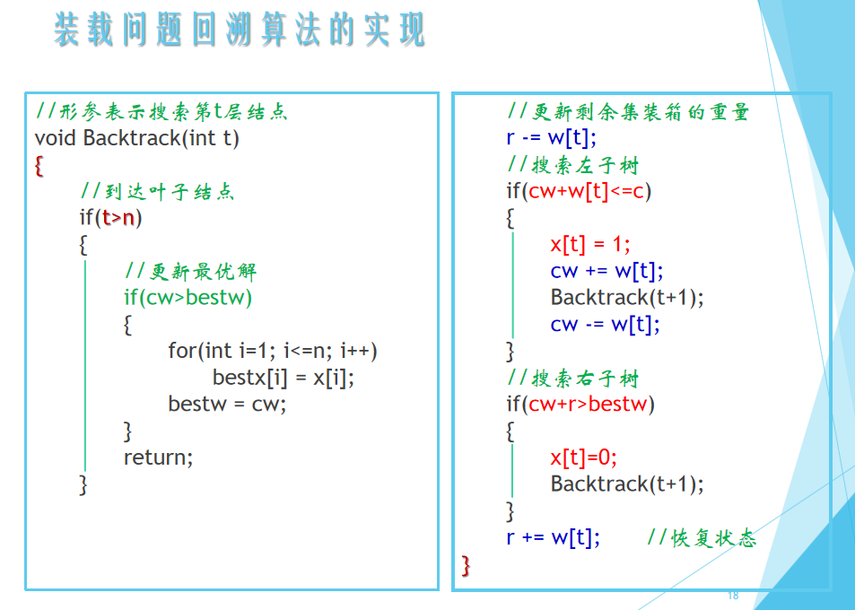

复习内容

1. 算法概述—复杂度分析（时间、空间）
2. 分治法

3. 动态规划
4. 贪心算法
5. 回溯法
6. 分支限界法

# 分治法

**基本思想：**将一个规模为n的问题分解为k个规模较小的子问题，些子问题互相独立且与原问题相同。递归地解这些子问题，然后将各个子问题的解合并得到原问题的解。

分治法在每一层递归上都有三个步骤：

- 分解：将原问题分解为若干个规模较小，相互独立，与原问题形式相同的子问题；
- 解决：若子问题规模较小而容易被解决则直接解，否则递归地解各个子问题；
- 合并：将各个子问题的解合并为原问题的解。

**分治法所能解决的问题一般具有的几个特征是：**
（1）该问题的规模缩小到一定的程度就可以容易地解决；

（2）该问题可以分解为若干个规模较小的相同问题;

（3）利用该问题分解出的子问题的解可以合并为该问题的解；

（4）原问题所分解出的各个子问题是相互独立的，即子问题之间不包含公共的子问题。


分治法的时间复杂性分析


经典例题：二分搜索、**归并排序**、棋盘覆盖、选择问题等


## 归并排序

[第14周13--第8章排序13--8.5归并排序_哔哩哔哩_bilibili](https://www.bilibili.com/video/BV1nJ411V7bd/?p=171&vd_source=2259e5459a8cfd21bcf92bc46bf3beda)

归并排序（Merge sort）是建立在归并操作上的一种有效的排序算法。该算法是采用分治法（Divide and Conquer）的一个非常典型的应用。

作为一种典型的分而治之思想的算法应用，归并排序的实现由两种方法：

- 自上而下的递归（所有递归的方法都可以用迭代重写，所以就有了第 2 种方法）；
- 自下而上的迭代；

和选择排序一样，归并排序的性能不受输入数据的影响，但表现比选择排序好的多，因为始终都是 O(nlogn) 的时间复杂度。代价是需要额外的内存空间。

### 算法步骤

1. 申请空间，使其大小为两个已经排序序列之和，该空间用来存放合并后的序列；
2. 设定两个指针，最初位置分别为两个已经排序序列的起始位置；
3. 比较两个指针所指向的元素，选择相对小的元素放入到合并空间，并移动指针到下一位置；
4. 重复步骤 3 直到某一指针达到序列尾；
5. 将另一序列剩下的所有元素直接复制到合并序列尾。

### 动图演示


```c
int min(int x, int y) {
    return x < y ? x : y;
}
void merge_sort(int arr[], int len) {
    int *a = arr;
    int *b = (int *) malloc(len * sizeof(int));
    int seg, start;
    for (seg = 1; seg < len; seg += seg) {
        for (start = 0; start < len; start += seg * 2) {
            int low = start, mid = min(start + seg, len), high = min(start + seg * 2, len);
            int k = low;
            int start1 = low, end1 = mid;
            int start2 = mid, end2 = high;
            while (start1 < end1 && start2 < end2)
                b[k++] = a[start1] < a[start2] ? a[start1++] : a[start2++];
            while (start1 < end1)
                b[k++] = a[start1++];
            while (start2 < end2)
                b[k++] = a[start2++];
        }
        int *temp = a;
        a = b;
        b = temp;
    }
    if (a != arr) {
        int i;
        for (i = 0; i < len; i++)
            b[i] = a[i];
        b = a;
    }
    free(b);
}
```

# 动态规划

**基本思想：**将待求解问题分解成若干个子问题，先求解子问题，然后从这些子问题的解得到原问题的解。求解过程中，为避免对相同的子问题重复求解，用一个表来记录所有已解的子问题的答案。不管该子问题以后是否被用到，只要它被计算过，就将其结果填入表中

**算法设计步骤：**   

1）找出最优解的性质，并刻画其结构特征；

2）递归地定义最优值； 

3）以自底向上的方式计算出最优值；

4）根据计算最优值时得到的信息，构造最优解；

**基本要素：**(1) 最优子结构性质（2）子问题重叠性质

经典例题：矩阵连乘积问题、**0-1背包问题**、最长公共子序列问题、最大子段和问题等  

## 0-1背包问题

[带你学透0-1背包问题！| 关于背包问题，你不清楚的地方，这里都讲了！| 动态规划经典问题 | 数据结构与算法_哔哩哔哩_bilibili](https://www.bilibili.com/video/BV1cg411g7Y6/?spm_id_from=333.337.search-card.all.click&vd_source=2259e5459a8cfd21bcf92bc46bf3beda)

https://programmercarl.com/%E8%83%8C%E5%8C%85%E7%90%86%E8%AE%BA%E5%9F%BA%E7%A1%8001%E8%83%8C%E5%8C%85-1.html#%E4%BA%8C%E7%BB%B4dp%E6%95%B0%E7%BB%8401%E8%83%8C%E5%8C%85

```java
public class BagProblem {
    public static void main(String[] args) {
        int[] weight = {1,3,4};
        int[] value = {15,20,30};
        int bagSize = 4;
        testWeightBagProblem(weight,value,bagSize);
    }

    /**
     * 动态规划获得结果
     * @param weight  物品的重量
     * @param value   物品的价值
     * @param bagSize 背包的容量
     */
    public static void testWeightBagProblem(int[] weight, int[] value, int bagSize){

        // 创建dp数组
        int goods = weight.length;  // 获取物品的数量
        int[][] dp = new int[goods][bagSize + 1];

        // 初始化dp数组
        // 创建数组后，其中默认的值就是0
        for (int j = weight[0]; j <= bagSize; j++) {
            dp[0][j] = value[0];
        }

        // 填充dp数组
        for (int i = 1; i < weight.length; i++) {
            for (int j = 1; j <= bagSize; j++) {
                if (j < weight[i]) {
                    /**
                     * 当前背包的容量都没有当前物品i大的时候，是不放物品i的
                     * 那么前i-1个物品能放下的最大价值就是当前情况的最大价值
                     */
                    dp[i][j] = dp[i-1][j];
                } else {
                    /**
                     * 当前背包的容量可以放下物品i
                     * 那么此时分两种情况：
                     *    1、不放物品i
                     *    2、放物品i
                     * 比较这两种情况下，哪种背包中物品的最大价值最大
                     */
                    dp[i][j] = Math.max(dp[i-1][j] , dp[i-1][j-weight[i]] + value[i]);
                }
            }
        }

        // 打印dp数组
        for (int i = 0; i < goods; i++) {
            for (int j = 0; j <= bagSize; j++) {
                System.out.print(dp[i][j] + "\t");
            }
            System.out.println("\n");
        }
    }
}

```

# 贪心算法

**基本思想：**在求最优解问题的过程中，依据某种贪心标准，从问题的初始状态出发，直接去求每一步的最优解，通过若干次的贪心选择，最终得出整个问题的最优解。

**贪心算法的基本要素：**贪心选择性质 ；最优子结构性质

经典问题：背包问题 、**最优装载问题**、单源最短路径问题、最小生成树问题等

## 最优装载问题

```java

package 算法考试;

import java.util.Arrays;

/**
 * 最优装载问题（贪心算法） 
 * @author ruochen
 * @version 1.0
 */
public class LoadingProblem {
	private static int[] x; 

	/**
	 * 
	 * @param c 总重量
	 * @param w 每个集装箱的重量
	 * @param x 记录是否装入 （1： 装入    0： 不装入）
	 * @return
	 */
	public static float Loading(float c, float[] w, int[] x) {
		int n = w.length;
		Element[] d = new Element[n];
		for (int i = 0; i < n; i++) {
			// 初始化
			d[i] = new Element(w[i], i);
		}
		Arrays.sort(d);
		// 记录最优值
		float opt = 0;
		for (int i = 0; i < n; i++) {
			// 初始化 
			x[i] = 0;
		}
		for (int i = 0; i < n && d[i].w <= c; i++) {
			x[d[i].i] = 1;
			opt += d[i].w;
			c -= d[i].w;
		}
		return opt;
	}
	
	public static void main(String[] args) {
		float c = 10;
		float[] w = new float[]{4, 2, 5, 1, 3};
//		float[] w = new float[]{1,10};
		x = new int[w.length];
		float opt = Loading(c, w, x);
		System.out.println("最优值为: " + opt);
		System.out.println("最优解为： " + Arrays.toString(x));
	}
	
	public static class Element implements Comparable<Element> {
		float w;
		int i;
		
		public Element(float w, int i) {
			this.w = w;
			this.i = i;
		}
		
		/**
		 * 按照升序排列
		 */
		@Override
		public int compareTo(Element o) {
			if (this.w < o.w) 
				return -1;
			else if (this.w == o.w)
				return 0;
			else 
				return 1;
		}
	}
}


```


# 回溯法 

**基本思想 ：**回溯法的基本做法是搜索，在问题的解空间树中，按深度优先策略，从根结点出发搜索解空间树。算法搜索至解空间树的任意一点时，先判断该结点是否包含问题的解。如果肯定不包含，则跳过对该结点为根的子树的搜索，逐层向其祖先结点回溯；否则，进入该子树，继续按深度优先策略搜索。 

经典例题：皇后问题、装载问题、图的m着色问题、 0-1背包问题、**子集和问题**

## 子集和问题

[回溯算法解决子集问题，树上节点都是目标集和！ | LeetCode：78.子集_哔哩哔哩_bilibili](https://www.bilibili.com/video/BV1U84y1q7Ci/?spm_id_from=333.788&vd_source=2259e5459a8cfd21bcf92bc46bf3beda)

[代码随想录 (programmercarl.com)](https://programmercarl.com/0078.子集.html#回溯三部曲)


```java
package 算法考试;

import 算法考试.Solution;

import java.util.ArrayList;
import java.util.Arrays;
import java.util.LinkedList;
import java.util.List;

class Zijihe {
    List<List<Integer>> result = new ArrayList<>(); // 存放符合条件的结果的集合
    LinkedList<Integer> path = new LinkedList<>(); // 用来存放符合条件的结果

    public List<List<Integer>> combinationSum(int[] candidates, int target) {
        Arrays.sort(candidates); // 对数组进行排序
        dfs(candidates, target, 0);
        return result;
    }

    private void dfs(int[] candidates, int target, int startIndex) {
        if (target == 0) { // 找到符合条件的结果，将其加入到result中
            result.add(new ArrayList<>(path));
            return;
        }

        for (int i = startIndex; i < candidates.length; i++) {
            // 剪枝：如果当前元素已经大于target，那么后面的元素肯定也大于target，不需要再枚举
            if (candidates[i] > target) {
                break;
            }

            // 剪枝：如果当前元素与前一个元素相同，那么会出现重复解，直接跳过
            if (i > startIndex && candidates[i] == candidates[i - 1]) {
                continue;
            }

            path.add(candidates[i]); // 将当前元素加入到path中
            dfs(candidates, target - candidates[i], i + 1); // 递归处理剩余元素
            path.removeLast(); // 回溯，将当前元素从path中移除
        }
    }

    public static void main(String[] args) {
        int[] nums = {2,3,5,6,7};
        int target = 5;
        Zijihe solution = new Zijihe();
        List<List<Integer>> result = solution.combinationSum(nums, target);
        System.out.println(result);//[[2, 3], [5]]
    }
}
```


# 分支限界法

**基本思想：**在分支限界法中，每一个活结点只有一次机会成为扩展结点。活结点一旦成为扩展结点，就一次性产生其所有儿子结点。在这些儿子结点中，导致不可行解或导致非最优解的儿子结点被舍弃，其余儿子结点被加入活结点表中。从活结点表中取下一结点成为当前扩展结点，并重复上述结点扩展过程。     

这个过程一直持续到找到所需的解或活结点表为空时为止。

**搜索策略：**在扩展结点处，先 生成其所有的儿子结点（分支），然后再从当前的活结点表中选择下一个扩展结点。为了有效地选择下一扩展结点，加速搜索的进程，在每一个活结点处，计算一个函数值（限界），并根据函数值，从当前活结点表中选择一个最有利的结点作为扩展结点，使搜索朝着解空间上有最优解的分支推进，以便尽快地找出一个最优解。

经典例题：单源最短路径问题、装载问题、**0-1背包问题**

## 0-1背包问题

[分支限界法求解0/1背包问题动画演示(Implementation of 0/1 Knapsack using Branch and Bound)_哔哩哔哩_bilibili](https://www.bilibili.com/video/BV1gb411G7FH/?spm_id_from=333.337.search-card.all.click&vd_source=2259e5459a8cfd21bcf92bc46bf3beda)


# 例题

## 第一题


## 第二题

假设有n个物品和一个背包，每个物品的重量为wi, 价值为pi，背包容量M。现在要将这n个物品**（允许拆分,这里允许拆分说明这是小数背包问题）**放入背包中，问怎样选择物品能使包中的物品总价值最大。

请给出用贪心算法解决此问题的贪心策略；

请给出用贪心算法解决此问题的基本步骤。

> （1）最大性价比（单位重量的价值）优先策略。
> （2）首先计算每种物品的性价比。然后，依贪心选择策略，将尽可能多的性价比最高的物品装入背包。若将这种物品全部装入背包后，背包内的物品总重量未超过C，则选择性价比次高的物品并尽可能多地装入背包。依此策略一直地进行下去，直到背包装满为止。


```java
class Item {
    int weight; // 物品的重量
    int value;  // 物品的价值
    double unitValue; // 物品单位重量的价值

    public Item(int weight, int value) {
        this.weight = weight;
        this.value = value;
        this.unitValue = (double) value / weight; // 计算物品单位重量的价值
    }
}

class Solution {
    public double fractionalKnapsack(int[] weights, int[] values, int capacity) {
        List<Item> items = new ArrayList<>();
        for (int i = 0; i < weights.length; i++) {
            items.add(new Item(weights[i], values[i]));
        }

        // 按照物品单位重量的价值逆序排序
        items.sort((a, b) -> Double.compare(b.unitValue, a.unitValue));

        double maxValue = 0.0; // 最大价值
        for (Item item : items) {
            if (capacity <= 0) {
                break;
            }

            if (item.weight <= capacity) { // 物品可以完整装入背包中
                maxValue += item.value;
                capacity -= item.weight;
            } else { // 物品只能装入部分
                maxValue += capacity * item.unitValue;
                capacity = 0;
            }
        }

        return maxValue;
    }
}
```

其中，使用贪心算法来解决小数背包问题。首先将所有物品按照单位重量的价值逆序排序，然后对物品进行逐个选择，如果背包还有剩余容量，就将物品完整装入背包中，否则只能装入部分。最终返回所有物品的最大价值。

可以通过创建一个`Solution`对象并调用`fractionalKnapsack`方法来解决小数背包问题，例如：

```java
int[] weights = {10, 20, 30};
int[] values = {60, 100, 120};
int capacity = 50;
Solution solution = new Solution();
double maxValue = solution.fractionalKnapsack(weights, values, capacity);
System.out.println(maxValue); // 输出最大价值
```

其中，`weights`为物品重量的数组，`values`为物品价值的数组，`capacity`为背包容量。可以通过输出`maxValue`来查看背包中物品的最大价值。


## 第三题

动态规划问题，这就是01背包问题的变种


## 第四题

4. 现有3个货物要装上载重量为30的轮船，其中货物的重量分别为（16, 15, 15），要求在不超过轮船载重量的前提下，将**尽可能多的货物（注意这里，是多装数量）**装上轮船。
现使用回溯法要求：
（1）描述回溯法的基本思想；
（2）画出解空间树（包含所有可能解）；
（3）说明对问题的解空间树搜索时，采用什么策略避免无效搜索？
（4）回溯法搜索问题解空间树时，在解空间树上用×标注出在搜索过程中被剪枝的结点。


cw是装上的总质量 r 剩余价值 bestw是




（1）回溯法的基本思想是在问题的解空间中，按照深度优先的策略，从根结点出发搜索整个解空间。在搜索过程中，如果发现某个结点不能满足问题的约束条件，或者已经搜索过，就回溯到上一个结点继续搜索。

（2）以下是问题的解空间树，其中每个结点表示一种可能的装载方案，左子树表示选择当前物品装载，右子树表示不选择当前物品装载。问题的最优解为装载数量最多的方案，因此需要优先搜索左子树。


（3）为了避免无效搜索，可以采用剪枝策略。在本问题中，由于要求尽可能多的装载货物，因此可以在搜索过程中，记录已经选中的货物重量之和，如果已经超过了轮船的载重量，就不再搜索当前结点的左子树，直接回溯到上一个结点继续搜索。


以下是一个使用回溯法解决该问题的Java代码实现：

```java
import java.util.Arrays;

class Solution {
    int maxCount = 0;  // 最多可以装载的货物数量
    int[] weights;     // 货物重量
    boolean[] used;    // 记录货物是否被使用过

    public int loadShip(int[] weights, int capacity) {
        Arrays.sort(weights); // 对货物重量进行排序
        this.weights = weights;
        this.used = new boolean[weights.length];
        backtracking(0, 0, capacity);
        return maxCount;
    }

    private void backtracking(int index, int count, int capacity) {
        if (capacity == 0) { // 已经无法再装载货物了，记录当前已经装载的货物数量
            maxCount = Math.max(maxCount, count);
            return;
        }

        if (index == weights.length) { // 已经遍历完所有货物，返回
            return;
        }

        if (capacity >= weights[index]) { // 货物可以装载
            used[index] = true;
            backtracking(index + 1, count + 1, capacity - weights[index]); // 选择当前货物进行装载
            used[index] = false;
        }

        backtracking(index + 1, count, capacity); // 不选择当前货物进行装载
    }
}
```

其中，`loadShip`方法用于解决该问题，输入参数为货物重量的数组`weights`和轮船的载重量`capacity`，返回值为最多可以装载的货物数量。该方法首先对货物重量进行排序，然后调用`backtracking`方法进行回溯搜索。

`backtracking`方法用于搜索问题的解空间。输入参数`index`表示当前要考虑的货物的下标，`count`表示当前已经装载的货物数量，`capacity`表示当前轮船的剩余载重量。在搜索过程中，如果已经无法再装载更多的货物，就记录当前已经装载的货物数量，然后返回。如果已经遍历完所有的货物，则直接返回。如果当前货物可以装载，就选择当前货物进行装载，然后递归调用`backtracking`方法继续搜索。如果当前货物不能装载，就不选择当前货物进行装载，直接递归调用`backtracking`方法继续搜索。在方法的最后，需要将选择当前货物进行装载的状态恢复，以免影响后续搜索。

可以通过创建一个`Solution`对象并调用`loadShip`方法来解决该问题，例如：

```java
int[] weights = {16, 15, 15};
int capacity = 30;
Solution solution = new Solution();
int maxCount = solution.loadShip(weights, capacity);
System.out.println(maxCount); // 输出最多可以装载的货物数量
```

其中，`weights`为货物重量的数组，`capacity`为轮船的载重量。可以通过输出`maxCount`来查看最多可以装载的货物数量。


## 第五题


cp+rp>=bestp

rw>wk


活结点是经过约束函数和限界函数限制后存活下来的节点

扩展结点是活结点的两个子节点


