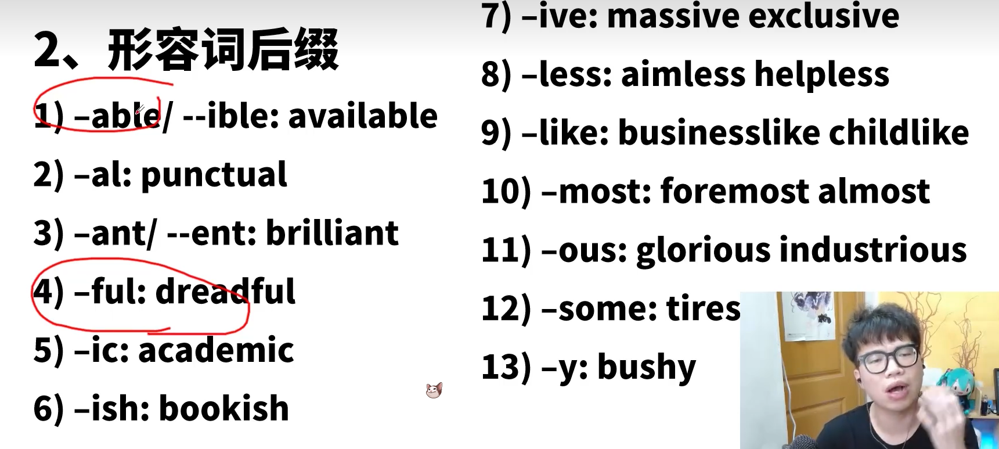
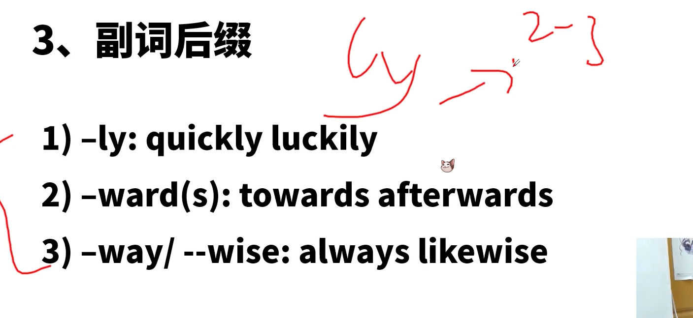
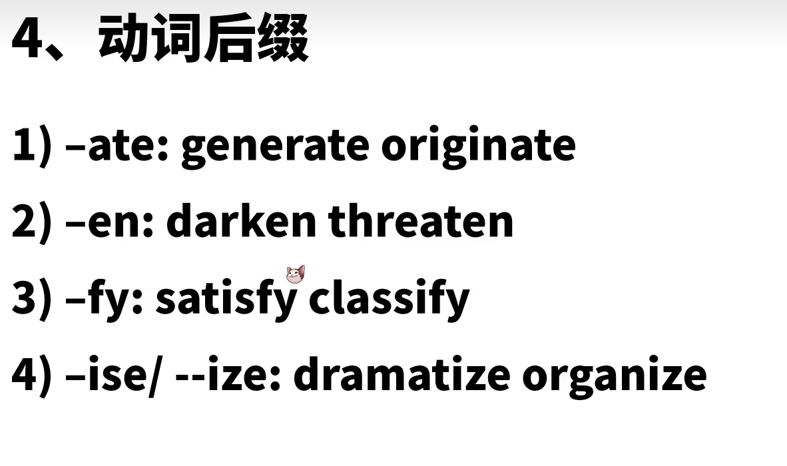

# 科研实验

实验主题
survey experiment project 
program study vote poll
实验目的：
aim objective（目的）,target
intention,purpose,to do -wonder-to see
实验手段：
approach,practice措施，means 方式方法
Initiative措施，method ，way,solution
实验结果：find(found) suggest, indicate

参与者：participant  respondent

做实验的人：professor ，colleague team

# 科技

AI （artificial intelligence） 

无人驾驶 driverless car ，autonomous vehicle，self-driving-car

# 校园

老师：tutor，lecturer，professor，assistant（助教），faculty（全体教职员工），facility （设施设备）

同学：

Freshman 新生-sophomore大二学生-junior student大三-senior student 大四
Graduate student大三大四
Undergraduate大一大二大三大四，未毕业的                     bachelor 单身汉，学士（本科毕业）
postgraduate毕业之后，研究生

college 专科

university 大学

作业：homework assignment

filde-trip 实习

curriculum 课程 

# 在线教育

Online-course
Online education
Internet based learning
study
Distance learning
Course-lesson-instruction


## **与全球变暖有关的：**

drown 溺死

drought 干旱 旱灾

dry 干的，晾干

emit排放

Emition

extremes n. 极端条件

floods n.洪水

hail n. 冰雹

tornado n. 龙卷风，大旋风

hurricane n. 飓风

typhoon n.台风

 

 

 

 

## **与医疗健康有关的：**

disease 大病

illness 小病

sickness 小病

condition慢性病（以上是不同程度的疾病）

strokes 中风

plague 瘟疫

pandemic 流行病

epidemic 流行病

physician 内科医生 surgeon 外科医生

function n 功能；v 运转

deficiency 缺乏

iron 铁

obesity 肥胖-obese 肥胖的

BMI Body mass index身体质量指标

immune system免疫系统

 


四六级真题高频词汇

① prospective潜在的，有前景的③livestock牲畜④ aspirin阿司匹林⑥ calculation计算⑩fixture固定装置

①unpredictable难以预料的②pest害虫③capability能力④scenario设想，方案⑤deteriorate恶化⑥ depleted耗尽的⑦alumnus校友⑧entity实体⑨tribe部落⑩disrupt打断

①explosion爆炸；激增②pave 铺路③parliament议会④civil文明的；国民的⑤mature成熟的⑥gross总的；严重的⑦abundant充足的⑧agenda议程⑨tactic策略；方法⑩pasta意大利面

①geological地质的②threshold门槛；阈值③substitute 替代；替代品④seminar研讨会⑤unity联合，团结，一致性⑥texture质感⑦interpretation解释⑧circulation循环；发行量⑨exert使出⑩instrument工具；乐器；手段

①devise设计②breakthrough突破③celebrity名人④subsidy补贴⑤mankind人类⑥cater承办宴席⑦altitude海拔⑧fake假货；伪造⑨surgeon外科医生⑩resilience适应力

①resurrection复兴②tenant房客；租户③dropout退学者④lever操纵杆⑤outsource外包

 


①mineral矿物的②scheme方案；密谋③controversy争论④simultaneously同时地⑤dairy奶制品⑥metal金属⑦proceed前进⑧invention发明⑨announcement公告⑩dean学院院长

①supervisor助管②deck甲板③respondent受访者④biodiversity生物多样性⑤irritated恼怒的⑥owe欠⑦autonomy自主⑧structural结构上的⑨prediction预测⑩destruction破坏

①vocal直言不讳的②adverse不利的③prolong延长④epidemic流行病⑤dip下降⑥predator捕食者⑦publication公布⑧amateur业余的⑨humanistic人文主义的⑩intolerance不宽容

①criminal罪犯；犯罪的②stimulus刺激③chart图表④sociologist社会学家⑤ladder梯子⑥antibiotic抗生素⑦wire电线⑧literacy读写能力⑨trillion万亿⑩accustomed习惯的 

①dismiss ②champion支持；冠军③harsh严厉的④classify归类⑤revolutionary革命性的⑥invisible看不见的

 


①convert改变②pupil小学生；瞳孔③click点击（鼠标）；发出咔哒声④ tropical热带的⑤poem诗⑥bind联合⑦fibre纤维⑧scooter小型摩托车⑨skyscraper摩天大楼⑩intensive密集的；加强的

①accent口音；强调②profitable有盈利的③pit坑；矿井④selective有选择的；精挑细选的⑤hypothesis假设⑥steam蒸汽⑦barrier障碍物⑧monarch君主⑨migration迁徙⑩payroll工资表

①database数据库②rear后面的，背部的；饲养，养育③capitalism资本主义④portray描绘⑤exceed超过⑥adequate足够的⑦accuse控告⑧herd兽群；放牧⑨entrepreneur企业家⑩quota定额

①genetically从基因角度②minimise最小化；贬低③incident事故④compensate补偿⑤destructive破环性的⑥universe宇宙⑦bizarre怪诞的⑧multiply成倍增加⑨correlated相关⑩foster收养的


①variable多变的；变量②addict上瘾；瘾君子③solitude独居④isolated孤独的⑤consist⑥combination结合⑦subtle微小的⑧fertiliser肥料⑨interpersonal人际的⑩modify修正，改正

①beneficial有利的②contribution贡献；捐款③exotic异国风情的④admission入场费；承认⑤dietary饮食的⑥slave奴隶⑦founder创始人⑧extinction灭绝⑨ecological生态的⑩deficit赤字

①declare宣告，声称 ②copyright版权③supplement补充物；增加④graphic图形⑤patent专利权；申请专利⑥athletic运动员；健壮的⑦storage储存⑧bilingual双语的⑨currency货币⑩momentum势头；动量

①Provider供应商②debris碎片③poetry诗歌④original最早的⑤sustainable可持续的⑥deposit放置⑦expertise专业知识⑧rarely很少⑨coast海岸⑩bulk灯泡

①memorandum备忘录②arctic北极的③election选举④genetic基因的⑤elite精英；精英的⑥immigration移民⑦retailer零售商⑧well being健康⑨adolescent青少年⑩ecosystem

①satellite卫星


培养流程


foundational 基础的

fundamental 基本的


词缀非常的多，而且有的词缀不只一个词性，我给大家的只是一部分，记住，在背单词的过程中也要不断的巩固掌握。
词性主要根据词缀判断
名词（n.):-ion、-ence、-ance、-sion、-ity、ment、-ism、-ation、-ancy、-ency、-ing
动词(v.):-ate、-ify、-ize、-en、-s、-ing
形容词（adj.):-al、-ent/ant、-able/ible、-ic、ous、-ing、-ed、-ive、-ory
副词(adv.)：ly








一个句子里面只能有一个动词，如果出现了n+v+n+__+n  那这个空应该填非谓语动词， 这个好像高中的时候学过

```
____，_____+n+_________+v+_______+n+_____+n
adv, adj      adv           adj   done/doing
```


一共125分钟

前面题一共55分钟

- 作文30分钟

- 听力25分钟

后面题一共70分钟

- 传统阅读 30 分钟

- 翻译 20 分钟
- 匹配题目 12分钟
- 选词填空 8分钟

#  作文

## 议论文：问题解决

> 标志词：how to

三个段落：11句话

第一个段落

1-2 提出问题

3 过渡句

第二个段落 6句话        第一句：论点1.第二局：论据1......

第三段 2句话         第一句话重申观点          第二句话提出期望（万能结尾）


eg:The importance of speaking ability and how to improve it

**第一段**
1.With the rapid development of <u>(education,society,technology,culture,economy,medical service医疗)</u>,
it is of great necessity for <u>youngsters</u> to <u>improve our speaking ability</u>.
2.过渡The following solutions can account for（解决） this phenomenon现象/issue问题
**第二段**
3.论点一：First and foremost,there is no doubt that <u>we should pratice it more</u>.
4.论据一：Based on a most recent survey,it is revealed(揭露) that a majority of successful social elites（精英） admit that they prefer <u>practicing new things(oral English英语口语)</u>
5.论点二：Furthermore,it is obvious that it is beneficial for <u>students to make foreign friend</u>
6.论据二：万能谚语（有志者事竟成）(where there is a will, there is a way.)
where there are friends ,there is communication.有朋友的地方就有交流
7.论点三：Last but not least,no one can deny(否认) that it is high time that <u>we can travel to an English speaking country</u>.
8.论据三： Only in this way,can we <u>experience culture ourselves(have a better life)</u>.
**第三段**
9.重申观点：In a word ,it is clear that we <u>should promote our speaking ability</u>.
10.If we try our utmost(最大的) to <u>develop our spoken English</u>,the future of our life will be both promising and rosy.

## 议论文：观点选择

> 标志词：option

eg:Suppose you have two options upon graduation:**one is to find a job somewhere** and **the other to start a business of your own**

第一段：阐述问题，列出不同观点，做出选择，过渡句

1. With the rapid development of <u>(education,society,technology,culture,economy,medical service医疗)</u>,
   nowadays <u> youngsters/students</u>   have different options on <u>graduation</u> .  
2. Some thinks that <u> to find a job some where is beneficial</u>,while others think<u> to start a business of your own</u>  is a better choice.
3. Personally,i prefer <u>the former/latter</u>.
4. The following reasons can account for my preference.

第二段：

1. First and foremost,there is no doubt that  <u>to find a job somewhere is more free</u>.
2. Based on a most recent survey,it is revealed that a majority of successful social elites（精英） admit that  <u>their careers are free</u>
3. Furthermore,it is obvious that it is beneficial for <u>making friends</u>
4. where there are jobs/work places,there are friends .有地方就有朋友
5. Last but not least,no one can deny that  <u>to find a job</u> is easier than <u>to start a company</u>
6. Though <u>some people do succeed in starting a business of their own ,most of people  failed when they just start</u>

第三段：

1. In a word ,it is clear that A is better/more suitable than B.
2. If we try our utmost to <u>work hard in our career</u>,the future of our life will be both promising and rosy.

## 议论文：现象解释

> 标志词：what why

eg:The challenges of living in a big city(直接告诉你现象)

第一段：阐述背景，提出观点，过渡句子

1. With the rapid development of <u>(education,society,technology,culture,economy,medical service医疗)</u>,
2. there is an increasing number of citizens moving from rural area to urban area.
3. There are a large number of challenges of living in a big cities.
4. The followings are some of them.

第二段：

1. First and foremost,there is no doubt that  <u>the cost of housing will be a huge problem</u>.
2. Based on a most recent survey,it is revealed that a majority of successful social elites（精英） admit that  <u>they have a huge expense on housing</u>
3. Furthermore,it is obvious that  <u>the competition is stronger in big cities</u>
4. where there are people,there is competition .有人就有竞争
5. Last but not least,no one can deny that  <u>the traffic  condition in big city is worse  than in rural area</u> 
6. Although  <u>the road are wider in big cities,there are more vehicle</u>

第三段：

1. In a word ,it is of great necessity for the residents to face the challenges.
2. If we try our utmost to <u>work hard in our career</u>,the future of our life will be both promising and rosy.

## 应用文：新闻 

> news report

Directions:For this part,you are allowed 30 minutes to write a news report to **your campus newspaper on a visit to a local farm organized by your Student Union** .You should write at least 120 words but no more than180 words. 


新闻文体：客观（第三人称：they,he,she,Student Union不要出现：IWe),过去式（一般过去时ved事件的结果，)过去进行时（事件的背景。）
新闻的结构（先出结果+再出细节+意义）


三个段落：

第一段：时间，地点，参与者，事件本身，事件结果

第二段：三个具体事件+三句补足

第三段：新闻的意义


第一段：时间，地点，参与者，事件本身，事件结果

On December First,Monday,the Student Union organized a meaningful activity to visit the local farm,in which 300 volunteets actively participated.It turns out to be a great success.

第二段：三个具体事件+三句补足

This activity was aimed at cultivating(培养) the practical ability of students **by** visiting the farmland and helping the peasants with hard labours.

- 第一个事件：
  - **In the early morning** just after the arrival of students ,the students watered the crops in the field for farmers.
- 第一个补足：
  - When asked about those volunteer's feelings about such an experience ,all of them responded with a smile ,saying "what a wonderful practice and i really appreciate this experience ,for it makes me learn to use my knowledge in practice."
- 第二个事件：
  - **After the lunch**,the farmers held an experience sharing meeting,in which the students anwsered various useful questions
- 第二个补足：
  - Some students showed how to use technology_to improve the productivity.
- 第三个事件：
  - In the evening,the students and the farmers enjoyed a feast together,which was prepared by the students.
- 第三个补足：
  - The peasants prasied the cooking of students.

第三段：新闻的意义

This activity turns out to be a beneficial event for both sides.The Student Union expressed that there will be（ more meaningful events in the future/more efforts will be made to help farmers in the rural areas）


## 应用文：信件类

说明：假设你是项目经理Jane Hart。根据以下内容给John Smith先生写一封信。写信时间为2013年5月5日，信的内容包含：
1)感谢他上周发来的邮件；
2)告诉他工程进度始终是在按照合同规定的时间进行：
3)对当地员工的培训还未完成，预计下月底可结束；
4)随信附上一份参加培训的员工名单。


Dear John Smith.																																					2013.5.5
		My name is **Jane Hart**,and I am project manager.Thank you for your E-mail last week.I'm writing this letter on the behalf of company to let you know aboutthe training progress.The followings are the details.
		First thing I want to deliver is the progress of the project is always carried on according to time on the contract.Please kindly be informed.Second matter concerned is that the training of the local emplovees isn't finished.It is expected to be done in the end of nextmonth.At lastthe list of training emplovees is on the attachment.
Thank you for your time.
																																																Sincerely yours,
																																																	Jane Hart.


## 应用文：通知

> notice

 

eg:write a notice about a lecture tomorro w.you need to mention the meaning of the lecture,time,places and participants.

​																										Notice

September 11th

​		This notice is for the purpose of holding an Academic Lecture.(描述通知) This lecture is aimed at improving the students' knoledge to pass the CET4 in the next month.(通知目的)The following details can account for this event .（过渡句）

​		First and foremost,the lecture will begin at 7:00,Sunday,Dec 8th,2019.All the students in our university must participate(be there) on time.It is related to your GPAs.FurtherMore,there will be some useful knowledge to help you pass the exam .For example ,the listening,writing and reading skills.Last but not least,this lecture will be held in the classroom 202.Please bring your notebook and your student IDs to be checked in the front door.

​		If you have any questions,you are free to contact at 19999 in the working hours.

​																																								Student Union


# 翻译

普洱(Pu'er)茶深受中国人喜爱。

最好的普洱茶产自云南的西双版纳(Xishuangbanna),

那里的气候和环境为普洱茶树的生长提供了最佳条件。

普洱茶颜色较深，味道与其他许多茶截然不同。

普洱茶泡(bw)的时间越长越有味道。

许多爱喝茶的人尤其喜欢其独特的香味和口感。

普洱茶含有多种有益健康的元素，

常饮普洱茶有助于保护心脏和血管，

还有减肥、消除疲劳和促进消化的功效。

**puer is deeply loved by Chinese people**

**The best puer tea is comes from xishuangbanna,a positon of yunnan**

**it climate and envirment has privided the best situation for puer tea tree**

**puer tea's color is deeply ,and it's flavour is different from other teas**

**the more time you brew ,the deeper flavour it will have**

The longer the puer tea is brewed, the more flavorful it is.

**it is popular from the people who love drink tea ,and they  especially love puer's unique smell and flavour.**

Many tea lovers especially like its unique aroma and taste.

**puer tea has many benifit item for healthy.**

Pu-erh tea contains a variety of healthy elements

**it help protect hear and xueguan.**

Drinking Pu'er tea regularly helps protect the heart and blood vessels.

**and it also can lose weight ,lose tired and be helpful to your stomach**

It also has the effect of losing weight, eliminating fatigue and promoting digestion.


