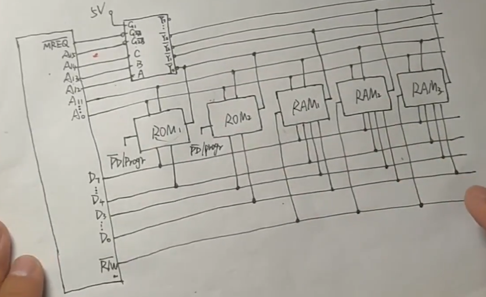
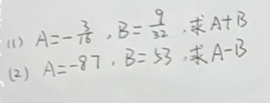
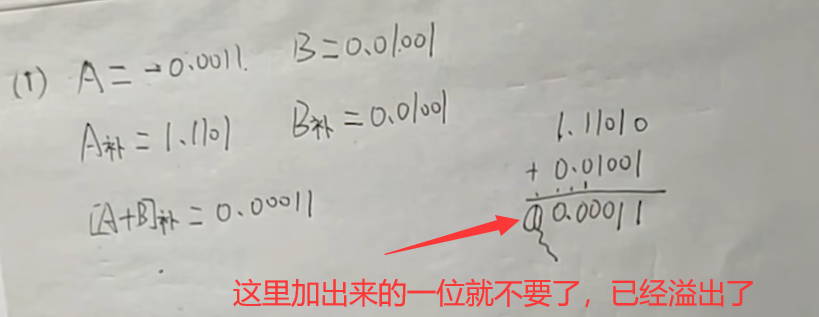
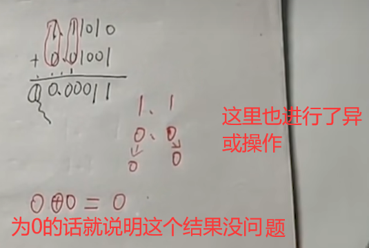
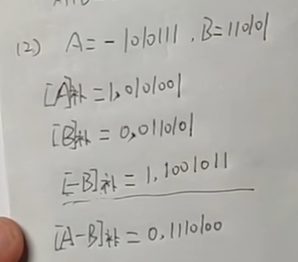
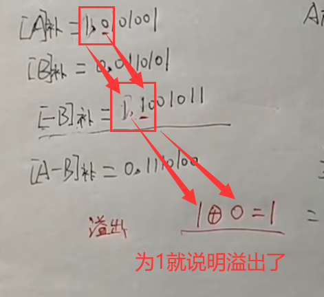
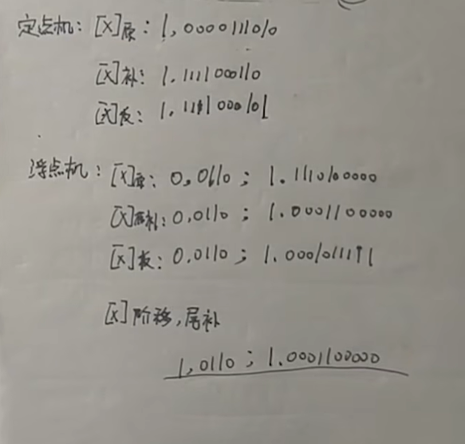

# CPU与存储器的连接（74138译码器）

> `MREQ霸`是低电平有效的控制信号
>
> R/W霸是读写命令信号

## 题目

设CPU共有**16根地址线**，**8根数据线**，并用MREQ作访存控制信号，R/W作读/写命令信号。

现有这些存储芯片:

- ROM（2K×8位、4K×4位、8K×8位)

- RAM（1K×4位、2K×8位、4K×8位）
- 及74138译码器和其他门电路（门电路自定）。

试从上述规格中选用合适的芯片,画出CPU和存储芯片的连接图.要求如下:

(1)最小4k地址作为系统程序区，4096~16383地址范围为用户地址区。

(2)指出选用的存储芯片类型及数量。

(3)详细画出片选逻辑。

## 答案

### 第一问

> 系统程序区只能用`ROM`
>
> 用户地址区只能用`RAM`

`八根数据线`  的作用是计算CPU大小

8位x4k=系统程序区的大小

8位x（16383-4096）=（16K-4K）x8位=12Kx8位=用户地址区的大小

### 第二问

系统程序区的存储芯片选择：

从题目中给的ROM里面选，优先选择`位扩展`，所以我们选择**两片4Kx4位的ROM芯片**

用户地址区的存储芯片选择：

从题目中给的RAM里面选：需要**3片4Kx8位的**

### 第三问

之后我们画地址线的示意图，但是这里请注意，如果是位扩展的话，也就是我们上面的两片4Kx4位的ROM芯片，他们不会在这里显示出来，他们公用一段区间的地址线。你可以这样理解，原来可以塞满一半房间的东西，经过位扩展，我们就可以塞满整个房间了

之后就可以画出来**前两块**的地址线示意图了

> 为什么是从A0写到A15的解释：因为题目说了有16根地址线
>
> 为什么从A0写到A11都是1：因为4K是2的12次方，从A0到A11之间全部填1这个区间的大小就是4K

**后三块**的地址线示意图：

ok。下面开始画**片选逻辑** 

初始图片：

之后我们连接CBA这三条线

之后进行连接

之后连接我们自己的芯片，都连接到4K

之后连数据线，注意之前我们提到的位扩展，这里就需要显示出来了

之后连接RAM芯片，由于他们都是8位，所以全都连上

这里需要知道

> G1是高电平，也就是1
>
> G2A和G2B是低电平，也就是0
>
> `MREQ霸`是低电平有效的控制信号，也是0

所以我们连接两个低电平的线

之后写解码器的输出位置进行连接

之后还有R/W接口没进行连接

> 这里需要注意的是ROM只能读，RAM既可以读又可以写

但是ROM也需要连接东西！！！！虽然连接的这个我也不知道是啥

最后总览：

# 设计主存地址与命中率

## 题目

设主存容量为256KB，Cache容量为2KB，每字块8个字，每个字8位。

(1) 直接映射的方式下设计主存地址

(2) 二路组相联方式下设计主存地址

(3) 全相联方式下设计主存地址

(4）若主存容量为256K×16位，块长不变，在四路组相联映射方式下设计主存地址

(5）设Cache初态为空，CPU依次从主存第0，1，2...，99号单元读出100个字(主存一次读出一个字)，并重复此次序读10次，问命中率是多少?有效命中的缓存为t，命中主存（未命中）为5t，系统的效率是多少？ 有缓存和没有缓存速度提高的倍数是多少

## 答案

> 8bit=1Byte=？个字（不固定）

### 第一问

比特构成字节构成字构成字块

先看`字块内地址`，每个字块8个字，一个字等于8bit也就是一个字节，所以说一个字块8Byte=2^3，所以字块内地址填3

再来看`Cache字块地址`，Cache的容量为2KB=2^11，之后计算里面有多少个字块，也就是`2^11/8=2^8`,所以Cache字块地址为8

最后来看`主存字块标记`,主存容量为256KB=`2^18`，所以主存字块标记=18-8-3=7

| 主存字块标记 | Cache字块地址 | 字块内地址 |
| ------------ | ------------- | ---------- |
| 7            | 8             | 3          |

### 第二问

还是先来看`字块内地址`，不变

`组地址`的计算方法：Cache字块数量/二路组相联中的2，也就是`2^8/2=2^7`，所以这里填7

`主存字块标记`计算方法：18-7-3=8

| 主存字块标记 | 组地址 | 字块内地址 |
| ------------ | ------ | ---------- |
| 8            | 7      | 3          |

### 第三问

`字块内地址`不变

`主存字块标记`=18-3=15

| 主存字块标记 | 字块内地址 |
| ------------ | ---------- |
| 15           | 3          |

### 第四问

由题知块长不变，所以字块内地址还是3

缓存也没变，所以组地址为2^8/4=6

只有主存容量改变了,换算一下256Kx16位=512Kx8位，所以是2^19x8位，主存字块标记=19-6-3=10

| 主存字块标记 | 组地址 | 字块内地址 |
| ------------ | ------ | ---------- |
| 10           | 6      | 3          |

### 第五问

每个字块有8个字，然后题目说有100个字，就算100/8≈12，然后初态为空 12+1=13

所以命中率h=100x10-13/100x10=0.987

下面计算系统的效率e

tc=t   tm=5t

平均访问时间ta=h*tc+(1-h)tm

e=tc/ta=t/(0.987xt+(1-0.987)x5t)=95%

下面计算提高的倍数 b

b=(tm/ta) -1

# 数的表示及加减法运算

## 题目

## 答案

### 第一问

上面的溢出很正常，不是下面的移除，只是单纯的数字溢出

不过需要进行验算溢出的操作

### 第二问

这个也需要判断是否溢出

# 定点数和浮点数表示

> IEEE标准：浮点数字长16位，其中阶码5位（含一位阶符），尾数11位（含1位数符）

## 题目

将十进制数字`-58`写成二进制`定点数`和`浮点数`

并分别写出它在`定点机`和`浮点机`中的机器数形式

## 答案

需要凑够**16位**

二进制定点数：-00 0011 1010  

二进制浮点数：-0.1110100000 x 2^110^

# 浮点数的加减运算

## 题目

