# CPU与存储器的连接（74138译码器）

> `MREQ霸`是低电平有效的控制信号
>
> R/W霸是读写命令信号

## 题目

设CPU共有**16根地址线**，**8根数据线**，并用MREQ作访存控制信号，R/W作读/写命令信号。

现有这些存储芯片:

- ROM（2K×8位、4K×4位、8K×8位)

- RAM（1K×4位、2K×8位、4K×8位）
- 及74138译码器和其他门电路（门电路自定）。

试从上述规格中选用合适的芯片,画出CPU和存储芯片的连接图.要求如下:

(1)最小4k地址作为系统程序区，4096~16383地址范围为用户地址区。

(2)指出选用的存储芯片类型及数量。

(3)详细画出片选逻辑。

## 答案

### 第一问

> 系统程序区只能用`ROM`
>
> 用户地址区只能用`RAM`

`八根数据线`  的作用是计算CPU大小

8位x4k=系统程序区的大小

8位x（16383-4096）=（16K-4K）x8位=12Kx8位=用户地址区的大小

### 第二问

系统程序区的存储芯片选择：

从题目中给的ROM里面选，优先选择`位扩展`，所以我们选择**两片4Kx4位的ROM芯片**

用户地址区的存储芯片选择：

从题目中给的RAM里面选：需要**3片4Kx8位的**

### 第三问

之后我们画地址线的示意图，但是这里请注意，如果是位扩展的话，也就是我们上面的两片4Kx4位的ROM芯片，他们不会在这里显示出来，他们公用一段区间的地址线。你可以这样理解，原来可以塞满一半房间的东西，经过位扩展，我们就可以塞满整个房间了

之后就可以画出来**前两块**的地址线示意图了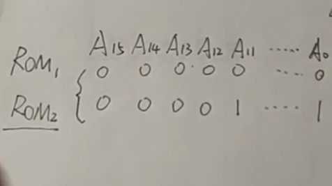

> 为什么是从A0写到A15的解释：因为题目说了有16根地址线
>
> 为什么从A0写到A11都是1：因为4K是2的12次方，从A0到A11之间全部填1这个区间的大小就是4K

**后三块**的地址线示意图：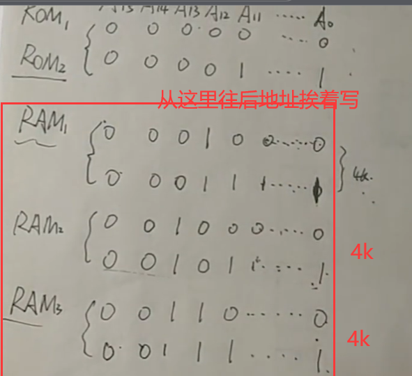

ok。下面开始画**片选逻辑** 

初始图片：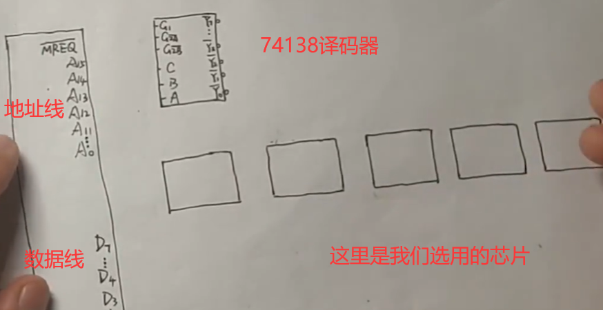

之后我们连接CBA这三条线

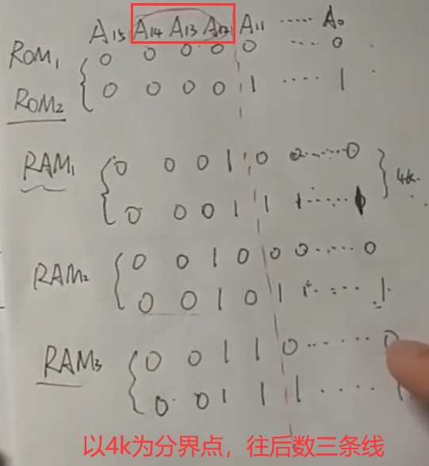

之后进行连接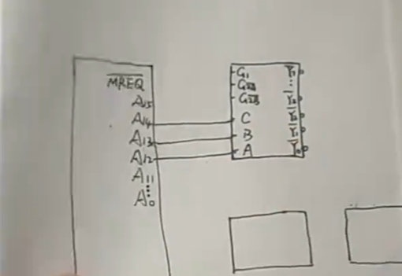

之后连接我们自己的芯片，都连接到4K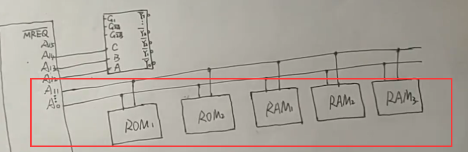

之后连数据线，注意之前我们提到的位扩展，这里就需要显示出来了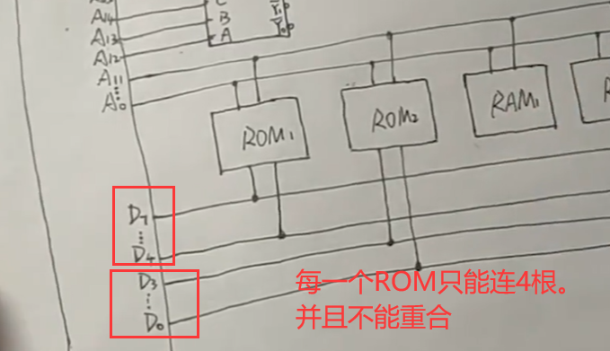

之后连接RAM芯片，由于他们都是8位，所以全都连上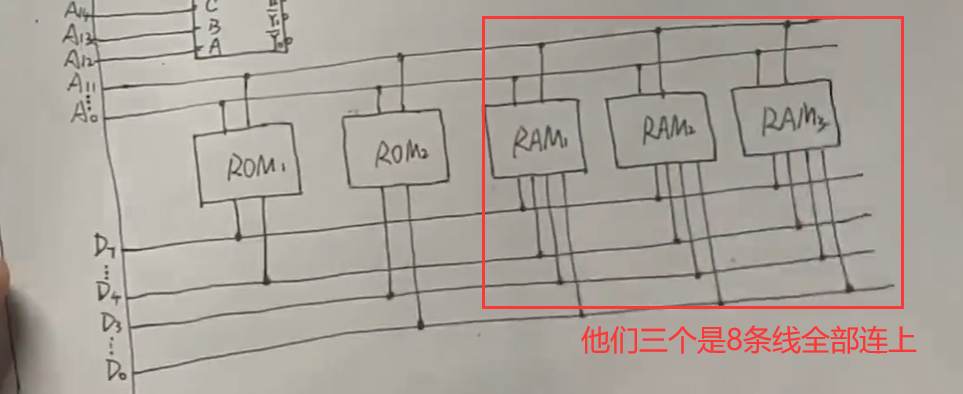

这里需要知道

> G1是高电平，也就是1
>
> G2A和G2B是低电平，也就是0
>
> `MREQ霸`是低电平有效的控制信号，也是0

所以我们连接两个低电平的线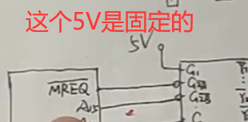

之后写解码器的输出位置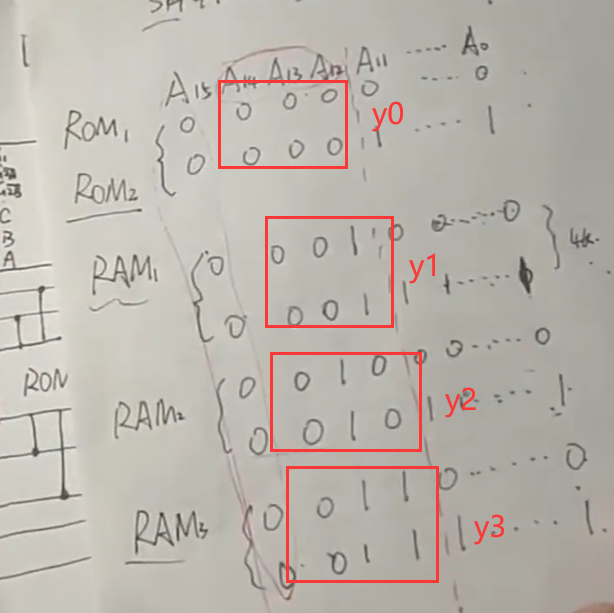进行连接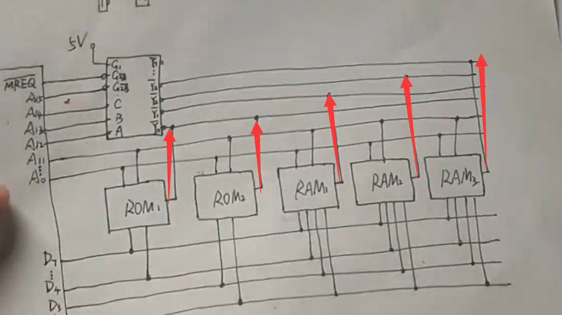

之后还有R/W接口没进行连接

> 这里需要注意的是ROM只能读，RAM既可以读又可以写

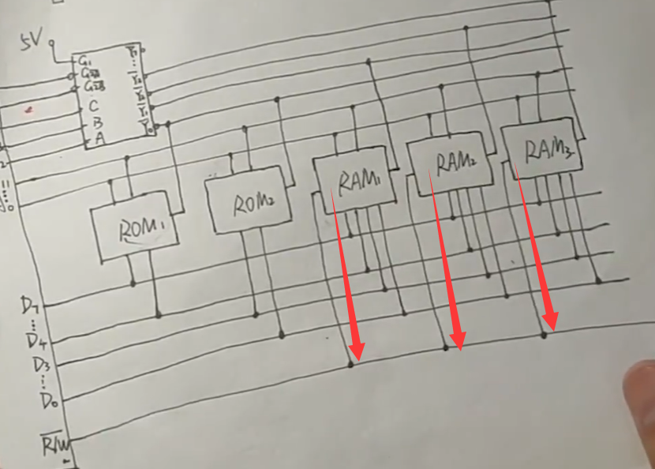

但是ROM也需要连接东西！！！！虽然连接的这个我也不知道是啥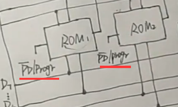

最后总览：
