l.首先感谢b站up主湖科大教书匠，带来了真正的国家精品课程，让我获益匪浅

# 第一章：概述

## 因特网概述


ISP可以从因特网管理机构申请到成块的IP地址

这一点很重要，因特网上的主机都必须要有IP地址才能进行通信

一旦某个用户能够接入到互联网，那么它也可以成为一个ISP（热点或路由器）

**因特网的组成**

共分为两大部分

**边缘部分**
由所有连接在因特网上的主机组成。这部分是用户直接使用的，用来进行通信（传送数据、音频或视频）和资源共享

**核心部分**
由大量网络和连接这些网络的路由器组成。这部分是为边缘部分提供服务的（提供连通性和交换)。

## 三种交换方式

分别是电路交换、分组交换以及报文交换

### 电路交换


由于以前打电话需要两两相连，用户多了就需要更多的线

所以对之进行了升级，利用交换机来解决这个问题（以前的接线员）

所以我们引出了电路交换的概念：


电路交换的三个步骤：

1. 建立连接（分配通信资源，也就是将两个打电话的用户通过不同的电话交换机与中继线进行连接起来，在通话过程中一直占用着这些设备）
2. 通话
3. 释放资源（归还通信资源）


==但是==

当使用电路交换来传送计算机数据时，其线路的传输效率往往很低，这是因为计算机数据是突发式地出现在传输线路上的。

也就是说计算机在编辑和输入一份待传输的文件时，通信是被占用的，（这时候并没有传输）资源被浪费了，所以计算机网络通常采用**分组交换**

### *分组交换

在因特网中，最重要的分组交换机就是路由器，它负责将各种网络互联起来，并对接收到的分组进行转发（分组交换）


假设我们让H6给H2发一段消息，通常我们**把表示该消息的整块数据**称为一个报文，在H6发送报文之前，先把**较长的报文**划分成为一个个**更小的等长数据段**，再在每个报文前面加上一些由必要的控制信息组成的首部（比如说接收方的ip地址。排序）后，就构成了一个分组（包/数据包），之后H6把一个个包传输给交换机（路由器），交换机先把包存储下来，再**根据首部进行查表** 转发到下一个分组交换机，H2收到这些分组后，去掉首部再进行拼接

上述案例的相应职责是


### 报文交换

报文交换主要用于早期的电报通信网，现在较少使用，被分组交换替代了

### 三种交换方式的对比


## 计算机网络的定义和分类

### 计算机网络的定义

计算机网络的精确定义并未统一
计算机网络的最简单的定义是:一些互相连接的、自治的计算机的集合。

- `互连`是指计算机之间可以通过有线或无线的方式进行数据通信;
- `自治`是指独立的计算机，它有自己的硬件和软件，可以单独运行使用;
- `集合`是指至少需要两台计算机;

计算机网络的较好的定义是:计算机网络主要是由一些通用的、可编程的硬件互连而成的，而这些硬件并非专门用来实现某一特定目的（例如，传送数据或视频信号)。这些可编程的硬件能够用来传送多种不同类型的数据，并能支持广泛的和日益增长的应用。

计算机网络所连接的硬件，并不限于一般的计算机，而是包括了智能手机等智能硬件。

计算机网络并非专门用来传送数据，而是能够支持很多种的应用（巴括今后可能出现的各种应用)。

### *计算机网络的分类


## 计算机网络的性能指标


### 比特与速率

计算下载速度


### *带宽


### 吞吐量

吞吐量表示在单位时间内通过某个网络（信道、接口）的数据量


### *时延

源主机讲分组发往传输线路，这需要花费一定时间，这段时间称为**发送时延**

代表分组的电信号在链路上传输，这也需要一定时间，这段时间被称为**传播时延**

路由器收到分组之后，对其进行存储转发，这也需要一定时间，这段时间被称为**处理时延**

#### 发送时延

发送时延=分组长度/发送速率

发送速率由三个因素决定


取最小值

#### 传播时延

传播时延=信道长度/电磁波传播速率

电磁波的传播速率在不同介质中有所不同


#### 处理时延

处理时延很难计算出，一般把排队时延加入到处理时延

#### 总结


### 时延带宽积

从名字来说就是**时延**与**带宽**的乘积

事实上是**传播时延**与**带宽**的乘积

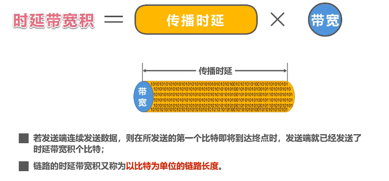

### 往返时间


一般情况下卫星链路耗时比较多，说明传播时延比较多

### *利用率


### 丢包率


## *常见的网络体系结构

开放系统互连参考模型 简称OSI 该模型有七层


事实上的标准是TCP/IP协议，替代了OSI 


为了利于教学，把网络接口层拆分**回**成物理层与数据链路层，因为TCP/IP为了适应多个接口，没有在网络接口层规定内容

### 1.物理层


### 2.数据链路层


### 3.网络层


### 4.传输层


### 5.应用层


### 总结问题


### 应用进程间基于网络的通信

从主机端的应用层按HTTP协议构建一个HTTP请求报文


之后交付给运输层处理，运输层给报文添加一个TCP首部，使之成为TCP报文段（实现可靠传输）


之后递交网络层，网络层加一个ip首部，成为IP数据报（使IP数据报可以在互联网传输）


之后交付给数据链路层，添加一个尾部，一个首部，成为帧(该首部的作用主要是为了让帧能够在一段链路上或一个网络上传输，能够被相应的目的主机接收，帧尾部是为了让目的主机检查所接收到的帧是否有误码)


之后到了物理层，物理层把帧转换为比特流，并且在之前加一段前导码（其作用是为了让目的主机做好接收帧的准备）


之后物理层把比特流转换成相应的信号发送到传输媒体，之后到达路由器处理，之后再拆包，装包.....逻辑是一样的

需要注意的是路由器进行拆包后，又进行了一次装包发送

### 专用术语

#### 实体


两个相互通信的应用也是对等实体，一个正在运行的软件是实体

#### 协议


#### 服务


透明的意思是看不见，也就是只需要用就可以了，上一层不需要知道具体的实现


#### 专业术语小结


# 第二章

## *物理层的基本概念

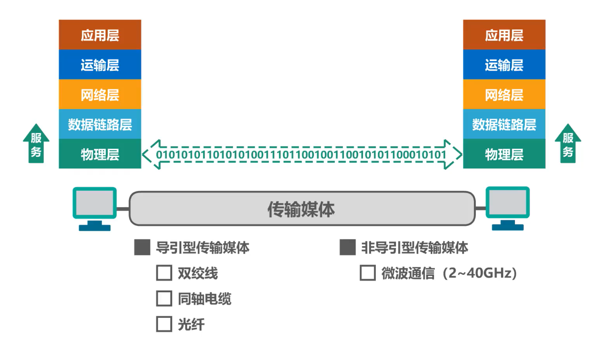

物理层协议的主要任务

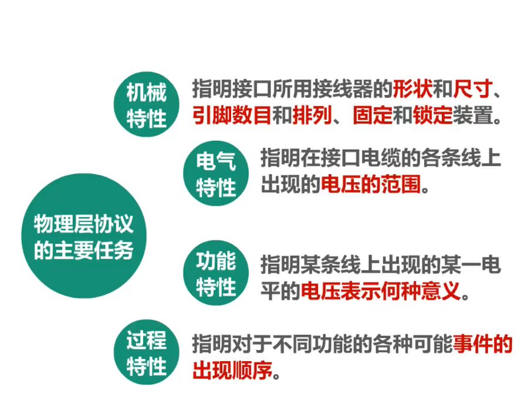

物理层考虑的是怎样才能在连接各种计算机的传输媒体上传输数据比特流

物理层为数据链路层屏蔽了各种传输媒体的差异，使数据链路层只需要考虑如何完成本层的协议和服务，而不必考虑网络具体的传输媒体是什么。

## 物理层下面的传输媒体


视频详解[2.2 物理层下面的传输媒体_哔哩哔哩_bilibili](https://www.bilibili.com/video/BV1c4411d7jb?p=15&spm_id_from=pageDriver&vd_source=2259e5459a8cfd21bcf92bc46bf3beda)

## 传输方式

重点是前面两组


## *编码与调制


> **常用术语**
>
> - **数据 (data)** —— 运送消息的实体。
>
> - **信号 (signal)** —— 数据的电气的或电磁的表现。
>
> - **模拟信号 (analogous signal)** —— 代表消息的参数的取值是连续的。
>
> - **数字信号 (digital signal)** —— 代表消息的参数的取值是离散的。
>
> - **码元 (code)** —— 在使用时间域（或简称为时域）的波形表示数字信号时，代表不同离散数值的基本波形。简单来说，码元就是构成信号的一段波形
>
> - **基带信号**（即基本频带信号）—— 来自信源的信号。像计算机输出的代表各种文字或图像文件的数据信号都属于基带信号。
>
> - 基带信号往往包含有较多的低频成分，甚至有直流成分，而许多信道并不能传输这种低频分量或直流分量。因此必须对基带信号进行**调制** (modulation)。把数字基带信号的频率范围搬移到较高的频段并转换为模拟信号，称为调制

在计算机网络中，常见的是将数字基带信号通过编码或调制的方法在相应信道进行传输


### **传输媒体与信道的关系**

> **信道的几个基本概念**
>
> - **信道** —— 一般用来表示向某一个方向传送信息的媒体。
>
> - **单向通信（单工通信）**——只能有一个方向的通信而没有反方向的交互。
>
> - **双向交替通信（半双工通信）**——通信的双方都可以发送信息，但不能双方同时发送(当然也就不能同时接收)。
>
> - **双向同时通信（全双工通信）**——通信的双方可以同时发送和接收信息。

严格来说，传输媒体不能和信道划等号

对于单工传输，传输媒体只包含一个信道，要么是发送信道，要么是接收信道


对于半双工和全双工，传输媒体中要包含两个信道，一个发送信道，另一个是接收信道


> 如果使用信道复用技术，一条传输媒体还可以包含多个信道

### 常用编码

#### **不归零编码**


> - 正电平表示比特1
>
> - 负电平表示比特0
>
> 中间的虚线是零电平，所谓不归零编码，就是指在整个码元时间内，电平不会出现零电平
>
> **实际比特1和比特0的表示要看现实怎么规定**


> 这需要发送方的发送与接收方的接收做到严格的同步
>
> - 需要**额外一根传输线来传输时钟信号**，使发送方和接收方同步，接收方按时钟信号的节拍来逐个接收码元
>
> - **但是**对于计算机网络，**宁愿利用这根传输线传输数据信号**，而不是传输时钟信号
>
> 由于**不归零编码**存在**同步问题**，因此计算机网络中的数据传输不采用这类编码！

#### **归零编码**


> **归零编码**虽然**自同步**，但**编码效率低**

#### **曼彻斯特编码**


> 在每个码元时间的中间时刻，信号都会发生跳变
>
> - 负跳变表示比特1
>
> - 正跳变表示比特0
>
> - 码元中间时刻的跳变即表示时钟，又表示数据
>
> **实际比特1和比特0的表示要看现实怎么规定**
>
> 传统以太网使用的就是曼切斯特编码

#### **差分曼彻斯特编码**


> 在每个码元时间的中间时刻，信号都会发送跳变，但与**曼彻斯特不同**
>
> - **跳变仅表示时钟**
>
> - **码元开始处电平是否变换表示数据**
>
> ```undefined
> *   变化表示比特1
> *   不变化表示比特0
> ```
>
> **实际比特1和比特0的表示要看现实怎么规定**
>
> 比曼彻斯特编码变化少，更适合较高的传输速率

#### **总结**


### 调制

**数字信号**转换为**模拟信号**，就可以在模拟信道中传输，例如WiFi，采用补码键控CCK/直接序列扩频DSSS/正交频分复用OFDM等**调制**方式。

模拟信号转换为另一种模拟信号，在模拟信道中传输，例如，语音数据加载到模拟的载波信号中传输。频分复用FDM技术，充分利用带宽资源。

#### **基本调制**


> - **调幅AM**：所调制的信号由两种不同振幅的基本波形构成。每个基本波形只能表示1比特信息量。
>
> - **调频FM**：所调制的信号由两种不同频率的基本波形构成。每个基本波形只能表示1比特信息量。
>
> - **调相PM**：所调制的信号由两种不同初相位的基本波形构成。每个基本波形只能表示1比特信息量。
>
> 但是使用基本调制方法，1个码元只能包含1个比特信息

#### **混合调制**


> 上图码元所对应的4个比特是错误的，码元不能随便对应4个比特


## *信道的极限容量

- 任何实际的信道都不是理想的，在传输信号时会产生各种失真以及带来多种干扰。
- 码元传输的速率越高，或信号传输的距离越远，或传输媒体质量越差，在信道的输出端的波形的失真就越严重。


失真影响：

- 码元传输的速率越高
- 信号传输的距离越远
- 噪声干扰越大
- 传输媒体质量越差

### 奈氏准则


### 香农公式


### 奈氏准则和香农公式对比：


## 补充：信道复用技术

本节内容视频未讲到，是《计算机网络（第7版）谢希仁》物理层的内容

### 频分复用、时分复用和统计时分复用

复用 (multiplexing) 是通信技术中的基本概念。

它允许用户使用一个共享信道进行通信，降低成本，提高利用率。


**频分复用 FDM (Frequency Division Multiplexing)**

- 将整个带宽分为多份，用户在分配到一定的频带后，在通信过程中自始至终都占用这个频带。
- **频分复用**的所有用户在同样的时间**占用不同的带宽资源**（请注意，这里的“带宽”是频率带宽而不是数据的发送速率）。


**时分复用TDM (Time Division Multiplexing)**

- **时分复用**则是将时间划分为一段段等长的**时分复用帧（TDM帧）**。每一个时分复用的用户在每一个 TDM 帧中占用固定序号的时隙。
- 每一个用户所占用的时隙是**周期性地出现**（其周期就是TDM帧的长度）的。
- TDM 信号也称为**等时** (isochronous) 信号。
- **时分复用的所有用户在不同的时间占用同样的频带宽度。**
- 


- **时分复用可能会造成线路资源的浪费**
  - 使用时分复用系统传送计算机数据时，由于计算机数据的突发性质，用户对分配到的子信道的利用率一般是不高的。


**统计时分复用 STDM (Statistic TDM)**


### 波分复用

波分复用 WDM(Wavelength Division Multiplexing)


### 码分复用

码分复用 CDM (Code Division Multiplexing)

- 常用的名词是**码分多址** CDMA (Code Division Multiple Access)。
- 各用户使用经过特殊挑选的不同码型，因此彼此不会造成干扰。
- 这种系统发送的信号有很强的抗干扰能力，其频谱类似于白噪声，不易被敌人发现。

# 第三章

## 数据链路层概述

### 概述

**链路**是从一个结点到相邻结点的一段物理线路

**数据链路**则是在链路的基础上增加了一些必要的硬件（如网络适配器）和软件（如协议的实现）

**网络中的主机、路由器等都必须实现数据链路层**


**局域网中的主机、交换机等都必须实现数据链路层**


**从层次上来看数据的流动**

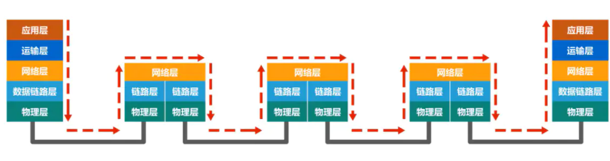

**仅从数据链路层观察帧的流动**


> 主机H1 到主机H2 所经过的网络可以是多种不同类型的（局域网，广域网）
>
> **注意：不同的链路层可能采用不同的数据链路层协议**

**数据链路层使用的信道**

数据链路层属于计算机网路的低层。**数据链路层使用的信道主要有以下两种类型：**

- 点对点信道
- 广播信道


> **局域网属于数据链路层**
>
> 局域网虽然是个网络。但我们并不把局域网放在网络层中讨论。这是因为在网络层要讨论的是多个网络互连的问题，是讨论分组怎么从一个网络，通过路由器，转发到另一个网络。
>
> 而在同一个局域网中，分组怎么从一台主机传送到另一台主机，但并不经过路由器转发。从整个互联网来看，**局域网仍属于数据链路层**的范围

### 三个重要问题

数据链路层传送的协议数据单元是**帧**

#### **封装成帧**

- **封装成帧** (framing) 就是在一段数据的前后分别添加首部和尾部，然后就构成了一个帧。
- 首部和尾部的一个重要作用就是进行**帧定界**。（为了在链路上以帧为单元来传送数据）


 （上面是一个帧的示例）

#### **差错控制**

在传输过程中可能会产生**比特差错**：1 可能会变成 0， 而 0 也可能变成 1。


接收方主机通过检测 帧尾的封装检错码，来判断是否有误码

 

#### **可靠传输**

接收方主机收到有误码的帧后，是不会接受该帧的，会将它丢弃

如果数据链路层向其上层提供的是不可靠服务，那么丢弃就丢弃了，不会再有更多措施

**如果数据链路层向其上层提供的是可靠服务，那就还需要其他措施，来确保接收方主机还可以重新收到被丢弃的这个帧的正确副本**


> 以上三个问题都是使用**点对点信道的数据链路层**来举例的

**如果使用广播信道的数据链路层除了包含上面三个问题外，还有一些问题要解决**

==第一个问题==

如图所示，主机A，B，C，D，E通过一根总线进行互连，主机A要给主机C发送数据，代表帧的信号会通过总线传输到总线上的其他各主机，那么主机B，D，E如何知道所收到的帧不是发送给它们的，主机C如何知道发送的帧是发送给自己的呢


可以用编址（地址）的来解决

将帧的目的地址添加在帧中一起传输


==第二个问题==

还有数据碰撞问题

CSMA/CD（载波监听多点接入/碰撞检测）


> 随着技术的发展，交换技术的成熟，
>
> 在 有线（局域网）领域 使用**点对点链路**和**链路层交换机**的**交换式局域网**取代了~~共享式局域网~~（上面的这幅图就是共享式局域网）
>
> 在无线局域网中仍然使用的是共享信道技术

------


## 封装成帧

### 介绍

封装成帧是指数据链路层给上层交付的协议数据单元添加帧头和帧尾使之成为帧

- **帧头和帧尾中包含有重要的控制信息**


发送方的数据链路层将上层交付下来的协议数据单元封装成帧后，还要通过物理层，将构成帧的各比特转换成电信号交给传输媒体，那么接收方的数据链路层如何从物理层交付的比特流中提取出一个个的帧？

答：需要帧头和帧尾来做**帧定界**（帧头和帧尾的作用也是为了让接收方更好的提取数据）


下面该图就是解析ppp帧的示意图


但并不是每一种数据链路层协议的帧都包含有帧定界标志，例如下面例子


> 前导码
>
> - 前同步码：作用是使接收方的时钟同步
>
> - 帧开始定界符：表明其后面紧跟着的就是MAC帧

另外以太网还规定了帧间间隔为96比特时间，因此，MAC帧不需要帧结束定界符


帧间间隔还有其他作用

### 透明传输

> **透明**
>
> 指某一个实际存在的事物看起来却好像不存在一样。

透明传输是指**数据链路层对上层交付的传输数据没有任何限制**，好像数据链路层不存在一样

帧界定标志也就是个特定数据值，如果在上层交付的协议数据单元中， 恰好也包含这个特定数值，接收方就不能正确接收


> 所以数据链路层应该对上层交付的数据有限制，其内容不能包含帧定界符的值

**解决透明传输问题**


- **解决方法**：

- 面向字节的物理链路使用**字节填充** (byte stuffing) （或**字符填充** (character stuffing)）

  面向比特的物理链路使用**比特填充**（在和帧定界相同的位置中添加一个0）的方法实现透明传输

- 发送端的数据链路层在数据中出现控制字符“SOH”或“EOT”的前面**插入一个转义字符“ESC”**(其十六进制编码是1B)。

- 如果转义字符也出现在数据当中，那么应在转义字符前面插入一个转义字符 ESC。当接收端收到连续的两个转义字符时，就删除其中前面的一个。

- 接收端的数据链路层在将数据送往网络层之前删除插入的转义字符。（翻译）

**帧的数据部分长度**


### 总结


------

## 差错检测

### 介绍


### 奇偶校验


由于漏检率过高，所以当代不使用这种方法进行校验

### 循环冗余校验CRC(Cyclic Redundancy Check)

这种方法漏检率极低


**例题**


**总结**


------

## 可靠传输

### 基本概念

**下面是比特差错**


**其他传输差错**


- 分组丢失

路由器输入队列快满了，主动丢弃收到的分组


- 分组失序

数据并未按照发送顺序依次到达接收端(最先发送的分组未必最先到达)


- 分组重复

由于某些原因，有些分组在网络中滞留了，没有及时到达接收端，这可能会造成发送端对该分组的重发，重发的分组到达接收端，但一段时间后，滞留在网络的分组也到达了接收端，这就造成**分组重复**的传输差错


### 三种可靠协议

分为：

- 停止-等待协议SW
- 回退N帧协议GBN
- 选择重传协议SR

> 这三种可靠传输实现机制的基本原理并不仅限于数据链路层，可以应用到计算机网络体系结构的各层协议中

#### 停止-等待协议

##### 停止-等待协议可能遇到的四个问题

###### **确认与否认**


###### **超时重传**


###### **确认丢失**


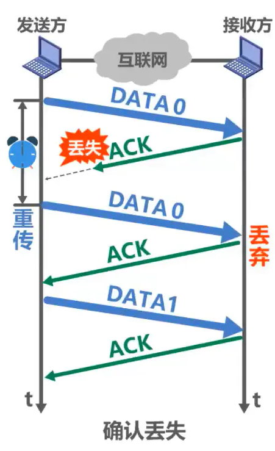


> 既然数据分组需要编号，确认分组是否需要编号？
>
> 要。如下图所示

###### **确认迟到**


> 注意，图中最下面那个数据分组与之前序号为0的那个数据分组不是同一个数据分组

**注意事项**


##### 停止-等待协议的信道利用率

假设收发双方之间是一条直通的信道

- **TD**：是发送方发送数据分组所耗费的发送时延
- **RTT**：是收发双方之间的往返时间
- **TA**：是接收方发送确认分组所耗费的发送时延

TA一般都远小于TD，可以忽略，当RTT远大于TD时，信道利用率会非常低


举例


> 像停止-等待协议这样通过确认和重传机制实现的可靠传输协议，常称为自动请求重传协议ARQ(**A**utomatic **R**epeat re**Q**uest)，意思是重传的请求是自动进行，因为不需要接收方显式地请求，发送方重传某个发送的分组

#### 回退N帧协议GBN

##### 为什么用回退N帧协议

在相同的时间内，使用停止-等待协议的发送方只能发送一个数据分组，而采用流水线传输的发送方，可以发送多个数据分组


回退N帧协议在流水线传输的基础上，利用发送窗口来限制发送方可连续发送数据分组的个数


上面的2的三次方的三是三个比特的出来的

##### 无差错情况流程

发送方将序号落在发送窗口内的0~4号数据分组，依次连续发送出去


他们经过互联网传输正确到达接收方，就是没有乱序和误码，接收方按序接收它们，每接收一个，接收窗口就向前滑动一个位置，并给发送方发送针对所接收分组的确认分组，在通过互联网的传输正确到达了发送方


发送方每接收一个、发送窗口就向前滑动一个位置，这样就有新的序号落入发送窗口，发送方可以将收到确认的数据分组从缓存中删除了，而接收方可以择机将已接收的数据分组交付上层处理


##### **累计确认**


> 累计确认
>
> 优点:
>
> - 即使确认分组丢失，发送方也可能不必重传
>
> - 减小接收方的开销
>
> - 减小对网络资源的占用
>
> 缺点：
>
> - 不能向发送方及时反映出接收方已经正确接收的数据分组信息

##### **有差错情况**(这个不太会)

例如

在传输数据分组时，5号数据分组出现误码，接收方通过数据分组中的检错码发现了错误


于是丢弃该分组，而后续到达的这剩下四个分组与接收窗口的序号不匹配


接收同样也不能接收它们，讲它们丢弃，并对之前按序接收的最后一个数据分组进行确认，发送ACK4，**每丢弃一个数据分组，就发送一个ACK4**


当收到重复的ACK4时，就知道之前所发送的数据分组出现了差错，于是可以不等超时计时器超时就立刻开始重传，具体收到几个重复确认就立刻重传，根据具体实现决定


如果收到这4个重复的确认并不会触发发送立刻重传，一段时间后。超时计时器超时，也会将发送窗口内以发送过的这些数据分组全部重传


若WT超过取值范围，例如WT=8，会出现什么情况？


**总结**


 

- 回退N帧协议在流水线传输的基础上利用发送窗口来限制发送方连续发送数据分组的数量，是一种连续ARQ协议
- 在协议的工作过程中发送窗口和接收窗口不断向前滑动，因此这类协议又称为滑动窗口协议
- 由于回退N帧协议的特性，当通信线路质量不好时，其信道利用率并不比停止-等待协议高

#### 选择重传协议SR


之后二号窗口的数据丢失


只要序号落入接收窗口内且无误码的数据分组，接收方都会接收

接收窗口发送0号和一号返回数据，接收窗口向前移两个位置


接收方接收3号并确认3号分组，但接收窗口不能向前滑动


因为还得接收2，发送方每确认收到一个分组，发送窗口就向前滑动一个位置


之后将4号5号信息发送出去，把0和1删除，并记录3号分组已被接收


接收方接收4号和5号窗口，不能向前滑动，


在4号5号向发送方发送时，发送方的2号计时器到时间了，就会向接收方重传2号数据分组

等待接收后接收方可以滑动4个窗口


发送窗口的尺寸问题

[具体流程请看视频](https://links.jianshu.com/go?to=https%3A%2F%2Fwww.bilibili.com%2Fvideo%2FBV1c4411d7jb%3Fp%3D27)


**总结**


------

## 点对点协议PPP

- 点对点协议PPP（Point-to-Point Protocol）是目前使用最广泛的点对点数据链路层协议
- PPP协议是因特网工程任务组IEIF在1992年制定的。经过1993年和1994年的修订，现在的PPP协议已成为因特网的正式标准[RFC1661，RFC1662]
- 数据链路层使用的一种协议，它的特点是：简单；只检测差错，而不是纠正差错；不使用序号，也不进行流量控制；可同时支持多种网络层协议


- PPPoE 是为宽带上网的主机使用的链路层协议


### 帧格式

必须规定特殊的字符作为帧定界符


### 透明传输

必须保证数据传输的透明性

实现透明传输的方法

- 面向字节的异步链路：字节填充法（插入“转义字符”）


- 面向比特的同步链路：比特填充法（插入“比特0”）


### 差错检测

能够对接收端收到的帧进行检测，并立即丢弃有差错的帧。


### 工作状态

- 当用户拨号接入 ISP 时，路由器的调制解调器对拨号做出确认，并建立一条物理连接。
- PC 机向路由器发送一系列的 LCP 分组（封装成多个 PPP 帧）。
- 这些分组及其响应选择一些 PPP 参数，并进行网络层配置，NCP 给新接入的 PC 机
- 分配一个临时的 IP 地址，使 PC 机成为因特网上的一个主机。
- 通信完毕时，NCP 释放网络层连接，收回原来分配出去的 IP 地址。接着，LCP 释放数据链路层连接。最后释放的是物理层的连接。


> 可见，PPP 协议已不是纯粹的数据链路层的协议，它还包含了物理层和网络层的内容。

------

## 媒体接入控制（介质访问控制）——广播信道

**媒体接入控制（介质访问控制）使用一对多的广播通信方式**

> **Medium Access Control**翻译成媒体接入控制，有些翻译成介质访问控制

**局域网的数据链路层**

- 局域网最主要的**特点**是：
  - 网络为一个单位所拥有；
  - 地理范围和站点数目均有限。
- 局域网具有如下**主要优点**：
  - 具有广播功能，从一个站点可很方便地访问全网。局域网上的主机可共享连接在局域网上的各种硬件和软件资源。
  - 便于系统的扩展和逐渐地演变，各设备的位置可灵活调整和改变。
  - 提高了系统的可靠性、可用性和残存性。


**数据链路层的两个子层**

为了使数据链路层能更好地适应多种局域网标准，IEEE 802 委员会就将局域网的数据链路层拆成**两个子层**：

1. **逻辑链路控制** LLC (Logical Link Control)子层；
2. **媒体接入控制** MAC (Medium Access Control)子层。

与接入到传输媒体有关的内容都放在 MAC子层，而 LLC 子层则与传输媒体无关。  **不管采用何种协议的局域网，对 LLC 子层来说都是透明的。**


基本概念

为什么要媒体接入控制（介质访问控制）？

**共享信道带来的问题**

若多个设备在共享信道上同时发送数据，则会造成彼此干扰，导致发送失败。


> 随着技术的发展，交换技术的成熟和成本的降低，具有更高性能的使用点对点链路和链路层交换机的交换式局域网在有线领域已完全取代了共享式局域网，但由于无线信道的广播天性，无线局域网仍然使用的是共享媒体技术

### 静态划分信道

**信道复用**


**频分复用FDM (Frequency Division Multiplexing)**

- 将整个带宽分为多份，用户在分配到一定的频带后，在通信过程中自始至终都占用这个频带。
- **频分复用**的所有用户在同样的时间**占用不同的带宽资源**（请注意，这里的“带宽”是频率带宽而不是数据的发送速率）。


 

**时分复用TDM (Time Division Multiplexing)**

- **时分复用**则是将时间划分为一段段等长的**时分复用帧（TDM帧）**。每一个时分复用的用户在每一个 TDM 帧中占用固定序号的时隙。
- 每一个用户所占用的时隙是**周期性地出现**（其周期就是TDM帧的长度）的。
- TDM 信号也称为**等时** (isochronous) 信号。
- **时分复用的所有用户在不同的时间占用同样的频带宽度。**


 

**波分复用 WDM(Wavelength Division Multiplexing)**


 

> 波分复用就是光的频分复用，使用一根光纤来同时传输多个光载波信号
>
> 光信号传输一段距离后会衰减，所以要用 掺铒光纤放大器 放大光信号

**码分复用 CDM (Code Division Multiplexing)**


 


 


 

 


 

### 动态接入控制

受控接入

**受控接入在局域网中使用得较少，本书不再讨论**

**随机接入**

**重点**

### 随机接入（CSMA/CD协议）

**总线局域网使用协议：CSMA/CD**

#### 基本概念

**最初**的**以太网**是将许多计算机都连接到一根总线上。易于实现广播通信。当初认为这样的连接方法既简单又可靠，因为总线上没有有源器件。

> **以太网（Ethernet）**是一种计算机**局域网技术**。IEEE组织的IEEE 802.3标准制定了**以太网（Ethernet）**的技术标准
>
> 以太网采用无连接的工作方式，对发送的数据帧不进行编号，也不要求对方发回确认。目的站收到有差错帧就把它丢弃，其他什么也不做


96比特时间是指发送96比特所需要的时间，也称为帧间最小间隔，其作用是使接收方可以检测出一个帧的结束，同时也使得所有其他站点都能有机会平等竞争信道并发送帧

#### 多址接入MA

表示许多主机以多点接入的方式连接在一根总线上。


#### 载波监听CS

是指每一个站在发送数据之前先要检测一下总线上是否有其他计算机在发送数据，如果有，则暂时不要发送数据，以免发生碰撞。


总线上并没有什么“载波”。因此， **“载波监听”就是用电子技术检测总线上有没有其他计算机发送的数据信号。**

#### 碰撞检测CD

- **“碰撞检测”**就是计算机**边发送数据边检测**信道上的信号电压大小。
- 当几个站同时在总线上发送数据时，总线上的信号电压摆动值将会增大（互相叠加）。
- 当一个站检测到的信号电压摆动值超过一定的门限值时，就认为总线上至少有两个站同时在发送数据，表明产生了碰撞。
- **所谓“碰撞”就是发生了冲突。因此“碰撞检测”也称为“冲突检测”。**
- 在发生碰撞时，总线上传输的信号产生了严重的失真，无法从中恢复出有用的信息来。
- **每一个正在发送数据的站，一旦发现总线上出现了碰撞，就要立即停止发送，免得继续浪费网络资源，然后等待一段随机时间后再次发送。**


> 为什么要进行碰撞检测？ 因为信号传播时延对载波监听产生了影响
>
> 
>
> 
>
> A 需要单程传播时延的 2 倍的时间，才能检测到与 B 的发送产生了冲突

#### CSMA/CD 协议工作流程


#### CSMA/CD 协议工作——争用期（碰撞窗口）


#### CSMA/CD 协议工作——最小帧长


#### CSMA/CD 协议工作——最大帧长


 

#### CSMA/CD 协议工作——截断二进制指数退避算法


#### CSMA/CD 协议工作——信道利用率


#### CSMA/CD 协议工作——帧接收流程


#### CSMA/CD 协议的重要特性

- 使用 CSMA/CD 协议的以太网不能进行全双工通信而**只能进行双向交替通信（半双工通信）。**
- 每个站在发送数据之后的一小段时间内，存在着遭遇碰撞的可能性。
- 这种**发送的不确定性**使整个以太网的平均通信量远小于以太网的最高数据率。

> CSMA/CD协议曾经用于各种总线结构以太网和双绞线以太网的早起版本中。
>
> **现在的以太网基于交换机和全双工连接，不会有碰撞，因此没有必要使用CSMA/CS协议**

### 随机接入（CSMA/CA协议）

**无线局域网使用的协议：CSMA/CA**

#### 为什么无线局域网要使用CSMA/CA协议


#### 帧间间隔IFS（InterFrame Space）


#### CSMA/CA协议的工作原理


> **源站为什么在检测到信道空闲后还要再等待一段时间DIFS？**
>
> - 考虑到可能有其他的站有高优先级的帧要发送。若有，就要让高优先级帧先发送
>
> **目的站为什么正确接收数据帧后还要等待一段时间SIFS才能发送ACK帧？**
>
> - SIFS是最短的帧间间隔，用来分隔开属于一次对话的各帧，在这段时间内，一个站点应当能够从发送方式切换到接收方式


> **信道由忙转为空闲且经过DIFS时间后，还要退避一段随机时间才能使用信道？**
>
> 防止多个站点同时发送数据而产生碰撞

**使用退避算法的时机**


#### CSMA/CA协议的退避算法


**退避算法的示例**


#### CSMA/CA协议的信道预约和虚拟载波监听


**虚拟载波监听机制能减少隐蔽站带来的碰撞问题的示例**


------

## MAC地址、IP地址以及ARP协议


### MAC地址

> - ### 使用点对点信道的数据链路层不需要使用地址
>
> - 使用广播信道的数据链路层必须使用地址来区分各主机


 

#### 广播信道的数据链路层必须使用地址（MAC）


  

> **MAC地址又称为硬件地址或物理地址**。请注意：不要被 “物理” 二字误导认为物理地址属于物理层范畴，物理地址属于数据链路层范畴

#### IEEE 802局域网的MAC地址格式


 

> **组织唯一标识符OUI**
>
> - 生产网络设备的厂商，需要向IEEE的注册管理机构申请一个或多个OUI
>
> **网络接口标识符**
>
> - 由获得OUI的厂商自行随意分配
>
> **EUI-48**
>
> - 48是这个MAC地址的位数


> 对于使用EUI-48空间的应用程序，IEEE的目标寿命为100年（直到2080年），但是鼓励采用EUI-64作为替代

**关于无效的 MAC 帧**

- 数据字段的长度与长度字段的值不一致；
- 帧的长度不是整数个字节；
- 用收到的帧检验序列 FCS 查出有差错；
- 数据字段的长度不在 46 ~ 1500 字节之间。
- 有效的 MAC 帧长度为 64 ~ 1518 字节之间。

> **对于检查出的无效**  **MAC**  **帧就简单地丢弃。以太网不负责重传丢弃的帧。**

#### IEEE 802局域网的MAC地址发送顺序


 

#### 单播MAC地址举例


> 主机B给主机C发送**单播帧**，主机B首先要构建该**单播帧**，**在帧首部中的目的地址字段填入主机C的MAC地址**，源地址字段填入自己的MAC地址，再加上帧首部的其他字段、数据载荷以及帧尾部，就构成了该**单播帧**


> 主机B将该**单播帧**发送出去，主机A和C都会收到该**单播帧**
>
> 主机A的网卡发现该**单播帧**的目的MAC地址与自己的MAC地址不匹配，丢弃该帧
>
> 主机C的网卡发现该**单播帧**的目的MAC地址与自己的MAC地址匹配，接受该帧
>
> 并将该帧交给其上层处理

#### 广播MAC地址举例


> 假设主机B要发送一个**广播帧**，主机B首先要构建该**广播帧**，**在帧首部中的目的地址字段填入广播地址**，也就是十六进制的全F，源地址字段填入自己的MAC地址，再加上帧首部中的其他字段、数据载荷以及帧尾部，就构成了该**广播帧**


> 主机B讲该**广播帧**发送出去，主机A和C都会收到该**广播帧**，**发现该帧首部中的目的地址字段的内容是广播地址**，就知道该帧是**广播帧**，主机A和主机C都接受该帧，并将该帧交给上层处理

#### 多播MAC地址举例


> 假设主机A要发送**多播帧**给该**多播地址**。将该**多播地址**的左起第一个字节写成8个比特，第一个字节的最低比特位是1，这就表明该地址是**多播地址**。
>
> 快速判断地址是不是**多播地址**，就是上图所示箭头所指的第十六进制数不能整除2（1,3,5,7,9,B,D,F），则该地址是**多播地址**
>
> 假设主机B，C和D支持多播，各用户给自己的主机配置多播组列表**如下所示**


> 主机B属于两个多播组，主机C也属于两个多播组，而主机D不属于任何多播组


> 主机A首先要构建该**多播帧**，**在帧首部中的目的地址字段填入该多播地址**，源地址点填入自己的MAC地址，再加上帧首部中的其他字段、数据载荷以及帧尾部，就构成了该**多播帧**


> 主机A将该**多播帧**发送出去，主机B、C、D都会收到该**多播帧**
>
> **主机B和C发现该多播帧的目的MAC地址在自己的多播组列表中**，主机B和C都会接受该帧
>
> 主机D发现该**多播帧**的目的MAC地址不在自己得多播组列表中，则丢弃该**多播帧**

> 给主机配置多播组列表进行私有应用时，不得使用公有的标准多播地址

### IP地址

IP地址属于网络层的范畴，不属于数据链路层的范畴

下面内容讲的是IP地址的使用，详细的IP地址内容在网络层中介绍

#### 基本概念


 

#### 从网络体系结构看IP地址与MAC地址


ip地址中有源IP地址和目的IP地址

MAC地址中有源MAC地址和目的MAC地址

#### 数据包转发过程中IP地址与MAC地址的变化情况

图上各主机和路由器各接口的IP地址和MAC地址用简单的标识符来表示


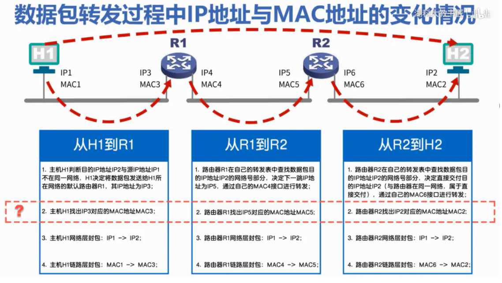


> 如何从IP地址找出其对应的MAC地址？
>
> ARP协议

### ARP协议

如何从IP地址找出其对应的MAC地址？

ARP（地址解析协议）

#### 流程


 

每个主机都会有一个ARP高速缓存表，里面记录着IP地址所对应的MAC地址，如果未找到对应的MAC地址，就会利用ARP请求报文（广播）发送请求


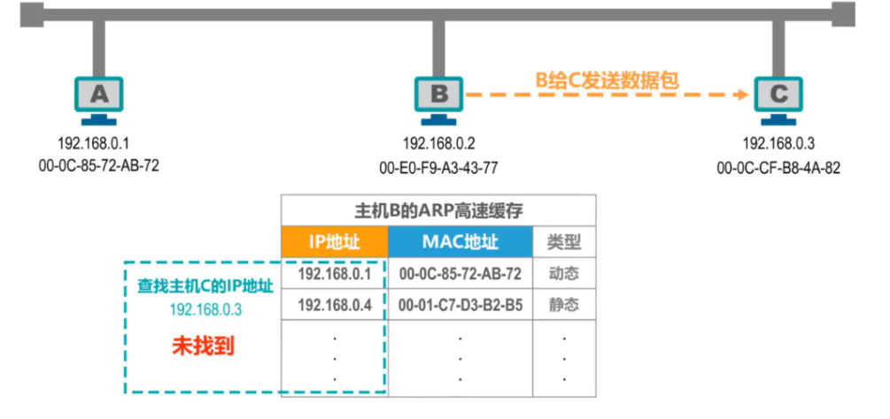

 

> 当主机B要给主机C发送数据包时，会首先在自己的ARP高速缓存表中查找主机C的IP地址所对应的MAC地址，但未找到，因此，主机B需要发送ARP请求报文，来获取主机C的MAC地址


> ARP请求报文有具体的格式，上图的只是简单描述
>
> ARP请求报文被封装在MAC帧中发送，目的地址为广播地址
>
> 主机B发送封装有ARP请求报文的广播帧，总线上的其他主机都能收到该广播帧


> 收到ARP请求报文的主机A和主机C会把ARP请求报文交给上层的ARP进程
>
> 主机A发现所询问的IP地址不是自己的IP地址，因此不用理会
>
> 主机C的发现所询问的IP地址是自己的IP地址，需要进行响应


 


 主机B把主机C的ip和mac记录到自己的ARP高速缓存表中


动态与静态的区别


需要注意的是IP地址与MAC地址的对应关系并不是永久性的

**ARP协议只能在一段链路或一个网络上使用，而不能跨网络使用**


> ARP协议的使用是逐段链路进行的

#### 总结


> ARP表中的IP地址与MAC地址的对应关系记录，是**会定期自动删除的**，**因为IP地址与MAC地址的对应关系不是永久性的**

------

## 集线器与交换机的区别

### 集线器-在物理层扩展以太网

#### 概念


> - 传统以太网最初是使用粗同轴电缆，后来演进到使用比较便宜的细同轴电缆，最后发展为使用更便宜和更灵活的双绞线。
>
> - 采用双绞线的以太网采用星形拓扑，在星形的中心则增加了一种可靠性非常高的设备，叫做**集线器** (hub)。
>
> - **集线器**是也可以看做多口中继器，每个端口都可以成为一个中继器，中继器是对减弱的信号进行放大和发送的设备
>
> - **集线器**的以太网在逻辑上仍是个总线网，需要使用CSMA/CD协议来协调各主机争用总线，只能工作在半双工模式，收发帧不能同时进行

#### 集线器HUB在物理层扩展以太网

**使用集线器扩展**：将多个以太网段连成更大的、多级星形结构的以太网


 

> - **优点**
>
> 
>
> ```undefined
> 1.  使原来属于不同碰撞域的以太网上的计算机能够进行跨碰撞域的通信。
>     
>     
> 2.  扩大了以太网覆盖的地理范围。
> ```
>
> - **缺点**
>
> 
>
> ```undefined
> 1.  碰撞域增大了，但总的吞吐量并未提高。
>     
>     
> 2.  如果不同的碰撞域使用不同的数据率，那么就不能用集线器将它们互连起来。
> ```

**碰撞域**

- **碰撞域（collision domain）**又称为**冲突域**，是指网络中一个站点发出的帧会与其他站点发出的帧产生碰撞或冲突的那部分网络。
- 碰撞域越大，发生碰撞的概率越高。

### 以太网交换机-在数据链路层扩展以太网

#### 概念

- 扩展以太网更常用的方法是在数据链路层进行。
- 早期使用**网桥**，现在使用**以太网交换机**。


 

> **网桥**
>
> - 网桥工作在数据链路层。
>
> - 它根据 MAC 帧的目的地址对收到的帧进行转发和过滤。
>
> - 当网桥收到一个帧时，并不是向所有的接口转发此帧，而是先检查此帧的目的MAC 地址，然后再确定将该帧转发到哪一个接口，或把它丢弃。
>
> **交换机**
>
> - 1990 年问世的交换式集线器 (switching hub) 可明显地提高以太网的性能。
>
> - 交换式集线器常称为**以太网交换机** (switch) 或**第二层交换机** (L2 switch)，强调这种交换机工作在数据链路层。
>
> - 以太网交换机实质上就是一个**多接口的网桥**

#### **集线器HUB与交换机SWITCH区别**


> 使用**集线器**互连而成的共享总线式以太网上的某个主机，要给另一个主机发送单播帧，该单播帧会通过共享总线传输到**总线上的其他各个主机**
>
> 使用交换机互连而成的交换式以太网上的某个主机，要给另一个主机发送单播帧，该单播帧进入交换机后，交换机会将该单播帧转发给目的主机，**而不是网络中的其他各个主机**
>
> **这个例子的前提条件是忽略ARP过程，并假设交换机的帧交换表已经学习或配置好了**


上面这个大矩形就代表交换机

 

> **以太网交换机的交换方式**
>
> - 存储转发方式
>
> 
>
> ```undefined
> *   把整个数据帧**先缓存**后再进行处理。
> ```
>
> - 直通 (cut-through) 方式
>
> 
>
> ```undefined
> *   接收数据帧的同时就**立即按数据帧的目的 MAC 地址决定该帧的转发接口**，因而提高了帧的转发速度。
>     
>     
> *   **缺点**是它不检查差错就直接将帧转发出去，因此有可能也将一些无效帧转发给其他的站。
> ```
>
> **这个例子的前提条件是忽略ARP过程，并假设交换机的帧交换表已经学习或配置好了**

**对比集线器和交换机**


> 多台主机同时给另一台主机发送单播帧
>
> 集线器以太网：会产生碰撞，遭遇碰撞的帧会传播到总线上的各主机
>
> 交换机以太网：会将它们缓存起来，然后逐个转发给目的主机，不会产生碰撞
>
> **这个例子的前提条件是忽略ARP过程，并假设交换机的帧交换表已经学习或配置好了**

**集线器扩展以太网和交换机扩展以太网区别**

**发送单播帧**


**发送广播帧**


从效果来看是一样的

**多个单播**


广播域（broadcast domain）：指这样一部分网络，其中任何一台设备发出的广播通信都能被该部分网络中的所有其他设备所接收。

#### 总结


> 工作在数据链路层的以太网交换机，其性能远远超过工作在物理层的集线器，而且价格并不贵，这就使得集线器逐渐被市场淘汰

------

## 以太网交换机自学习和转发帧的流程

### 概念


 

### 自学习和转发帧的例子

视频教程[3.9 以太网交换机自学习和转发帧的流程_哔哩哔哩_bilibili](https://www.bilibili.com/video/BV1c4411d7jb?p=37&spm_id_from=pageDriver&vd_source=2259e5459a8cfd21bcf92bc46bf3beda)

以下例子假设各主机知道网络中其他各主机的MAC地址（无需进行ARP）

**A -> B**


 

> 1. A 先向 B 发送一帧。该帧从接口 1 进入到交换机
>
> 1. 交换机收到帧后，先查找（图中左边）交换表。没有查到应从哪个接口转发这个帧给 B
>
> 1. 交换机把这个帧的源地址 A 和接口 1 写入（图中左边）交换表中
>
> 1. 交换机向除接口 1 以外的所有的接口广播这个帧
>
> 1. 接口 4到接口 2，先查找（图中右边）交换表。没有查到应从哪个接口转发这个帧给 B
>
> 1. 交换机把这个帧的源地址 A 和接口 1 写入（图中右边）交换表中
>
> 1. 除B主机之外与该帧的目的地址不相符，将丢弃该帧
>
> 1. 主机B发现是给自己的帧，接受该帧

**B -> A**


 

> 1. B 向 A 发送一帧。该帧从接口 3 进入到交换机
>
> 1. 交换机收到帧后，先查找（图中左边）交换表。发现（图中左边）交换表中的 MAC 地址有 A，表明要发送给A的帧应从接口1转发出去。于是就把这个帧传送到接口 1 转发给 A。
>
> 1. 主机 A 发现目的地址是它，就接受该帧
>
> 1. 交换机把这个帧的源地址 B 和接口 3 写入（图中左边）交换表中

**E -> A**


 

> 1. E 向 A发送一帧
>
> 1. 交换机收到帧后，先查找（图中右边）交换表。发现（图中右边）交换表中的 MAC 地址有 A，表明要发送给A的帧应从接口2转发出去。于是就把这个帧传送到接口 2 转发给 接口 4。
>
> 1. 交换机把这个帧的源地址 E 和接口 3 写入（图中右边）交换表中
>
> 1. 接口 4 到 左边的交换机，先查找（图中左边）交换表。发现（图中左边）交换表中的 MAC 地址有 A，表明要发送给A的帧应从接口1转发出去。于是就把这个帧传送到接口 1 转发给 A。
>
> 1. 交换机把这个帧的源地址 E 和接口 4 写入（图中左边）交换表中
>
> 1. 主机 A 发现目的地址是它，就接受该帧

**G -> A**


 

> 主机 A、主机 G、交换机 1的接口 1就共享同一条总线（相当于总线式网络，可以想象成用集线器连接了）
>
> 1. 主机 G 发送给 主机 A 一个帧
>
> 1. 主机 A 和 交换机接口 1都能接收到
>
> 1. 主机 A 的网卡收到后，根据帧的目的MAC地址A，就知道是发送给自己的帧，就接受该帧
>
> 1. 交换机 1收到该帧后，首先进行登记工作
>
> 1. 然后交换机 1对该帧进行转发，该帧的MAC地址是A，在（图中左边）交换表查找MAC 地址有 A
>
> 1. MAC 地址为 A的接口号是1，但是该帧正是从接口 1 进入交换机的，交换机不会再从该接口 1 讲帧转发出去，因为这是没有必要，于是丢弃该帧

随着网络中各主机都发送了帧后，网络中的各交换机就可以学习到各主机的MAC地址，以及它们与自己各接口的对应关系


 

> 考虑到可能有时要在交换机的接口更换主机，或者主机要更换其网络适配器，这就需要更改交换表中的项目。为此，在交换表中每个项目都设有一定的**有效时间**。**过期的项目就自动被删除**。
>
> **以太网交换机的这种自学习方法使得以太网交换机能够即插即用，不必人工进行配置，因此非常方便。**

### 总结

**交换机自学习和转发帧的步骤归纳**


 

------

## 以太网交换机的生成树协议STP

### 如何提高以太网的可靠性


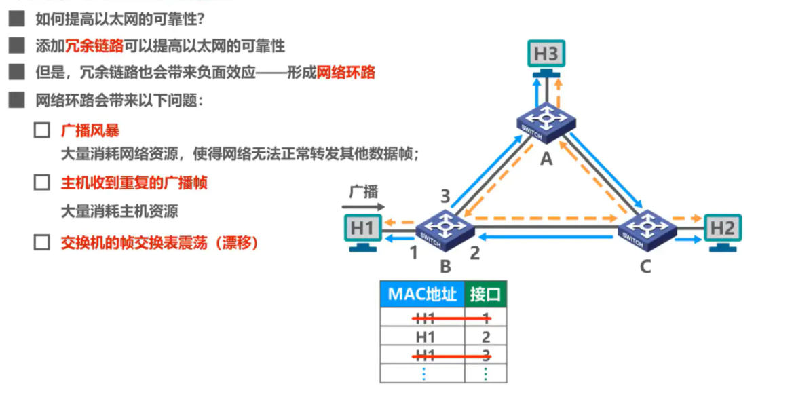


### 生成树协议STP


 

> - IEEE 802.1D 标准制定了一个**生成树协议 STP** (Spanning Tree Protocol)。
>
> - 其**要点**是：**不改变**网络的实际拓扑，但在逻辑上则切断某些链路，使得从一台主机到所有其他主机的路径是**无环路的树状结构**，从而消除了兜圈子现象。


 也就是说如果出现故障就把接口打开 ，生成新的路径

### 小结


------

## 虚拟局域网VLAN

### 为什么要虚拟局域网VLAN

**广播风暴**


除非必须要使用广播，否则网络中的主机应尽量不使用广播

所以我们为了节省资源，要把较大的广播域，分割成较小的广播域

**分割广播域的方法**


使用路由器之前


使用路由器之后


但是路由器成本较高

> 为了分割广播域，所以虚拟局域网VLAN技术应运而生

### 概念

根据业务要求分为VLAN1和VLAN2，

VLAN1中的广播数据包不会传送到VLAN2，

VLAN2中的广播数据包也不会传送到VLAN1。

也就是说：同一个VLAN内部可以广播通信，不同VLAN不可以广播通信


> - 利用以太网交换机可以很方便地实现虚拟局域网 VLAN (Virtual LAN)。
>- IEEE 802.1Q 对虚拟局域网 VLAN 的**定义**：  **虚拟局域网 VLAN** 是由一些局域网网段构成的**与物理位置无关的逻辑组**，而这些网段具有某些共同的需求。每一个 VLAN 的帧都有一个明确的标识符，指明发送这个帧的计算机是属于哪一个 VLAN。
> - 同一个VLAN内部可以广播通信，不同VLAN不可以广播通信
>- **虚拟局域网其实只是局域网给用户提供的一种服务，而并不是一种新型局域网。**
> - 由于虚拟局域网是用户和网络资源的逻辑组合，因此可按照需要将有关设备和资源非常方便地重新组合，使用户从不同的服务器或数据库中存取所需的资源。


### 虚拟局域网VLAN的实现机制

虚拟局域网VLAN技术是在交换机上实现的，需要交换机能够实现以下功能

- 能够处理带有VLAN标记的帧——IEEE 802.1 Q帧
- 交换机的各端口可以支持不同的端口类型，不同端口类型的端口对帧的处理方式有所不同


交换机的端口，有且只有一个PVID

#### **Access端口**

交换机与用户计算机之间的互连


把1端口和2端口划到VLAN1，就形成了一个小型局域网

> 同一个VLAN内部可以广播通信，不同VLAN不可以广播通信

#### **Truck端口**

交换机之间或交换机与路由器之间的互连


连接主机的交换机端口应设置为Access类型

交换机之间互连的端口应设置为Trunk类型。


**小例题**


#### **华为交换机私有的Hybrid端口类型**


### 总结


> **虚拟局域网优点**
>
> 虚拟局域网（VLAN）技术具有以下主要优点：
>
> 1. 改善了性能
>
> 1. 简化了管理
>
> 1. 降低了成本
>
> 1. 改善了安全性

# 第四章

## 网络层概述

网络层的主要任务是实现网络互连，进而实现数据包在各网络之间的传输。要实现网络层任务，需要解决以下主要问题:
1.网络层向运输层提供怎样的服务（“可靠传输”还是“不可靠传输”)，不同网络体系结构所提供的服务可能是不同的

2.网络寻址问题

3.路由选择问题（根据路由表）

不可靠传输：传输的过程中出现误码、服务器繁忙无法接收信息、传输到服务器但是是失序的


## 网络层提供的两种服务

虚电路表示这是一条逻辑上的连接。A组都沿着这条逻辑连接按照存储转发方式传送，而不是真正建立了一条物理连接

而采用电路交换的电话通信，则是先建立一条真正的连接，因此分组交换的虚连接与电路交换的连接只是类似，不完全一样


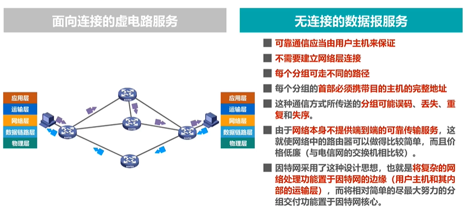

### 小结


由于TCP/IP体系结构的因特网的网际层提供的是简单灵活、无连接的、尽最大努力交付的数据报服务，因此本章主要围绕网际层如何传送P数据报这个主题进行讨论。

## IPv4地址概述

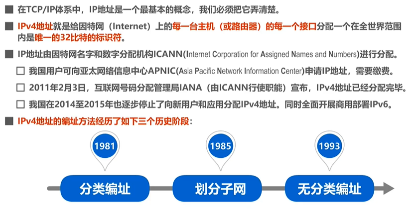

### IPv4的表示方法


## IPv4地址的编址方法的三个历史阶段:

### 1.分类编址的IPv4地址

网络号标识的是Internet上的一个子网，而主机号标识的是子网中的某台主机.

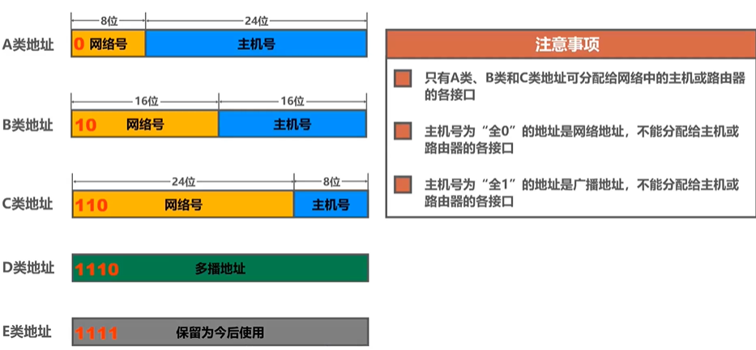

A类地址


B类地址


C类地址


此外，一般不使用的IP地址有


需要注意的是 网络地址或广播地址都不能分配给主机或路由器的各接口，因为他们无法唯一标识某一台主机或路由器的某一个接口

### 2.划分子网的IPv4地址

我们可以从原来的主机号部分借用一些位作为子网号

例如


划分之后


#### 子网掩码

32比特的子网掩码可以表明分类IP地址的主机号部分被借用了几个比特作为子网号


 **举例说明**


细节分析


**这种题如何分析**


1.先看主机网络号属于哪个范围，之后在看主机号，把主机号和网络号分开

2.把子网掩码的网络号都写1（每一位），之后看子网掩码后面的数是由多少个1构成的，说明借用了主机号多少个1

3.之后把主机号的位数都标起来

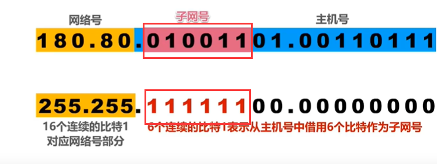


#### 默认子网掩码

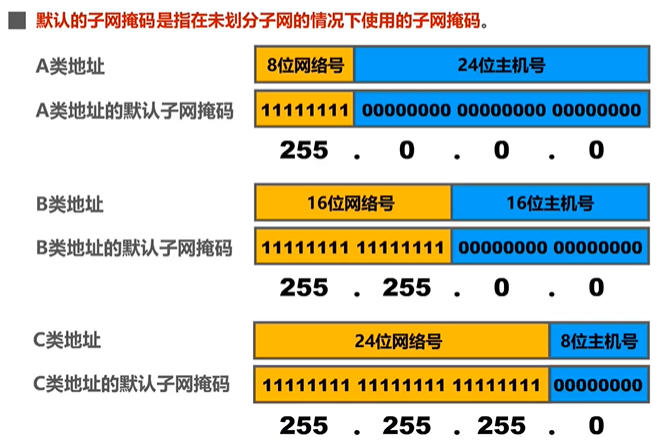

#### 小结


### 3.无分类编址的IPv4地址


 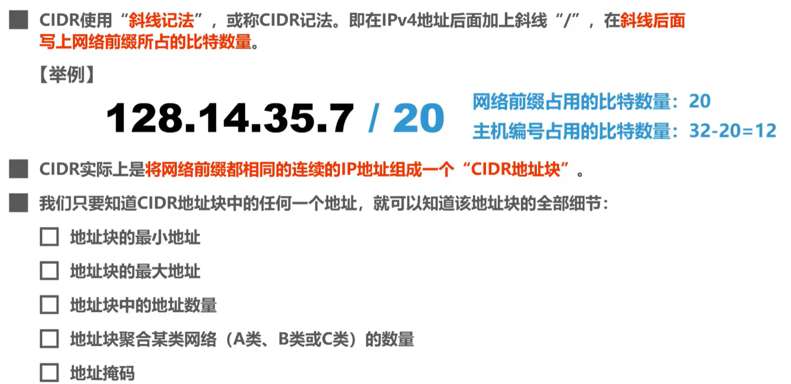

#### 举例说明 


需要注意的是

聚合C类网的数量的意思是：就是这个网络一共相当于多少个c类网的数量


地址数量/一个C类网的地址数量

#### 路由聚合（构造超网） 


找共同前缀


需要注意的是


#### 小结


## IPv4地址的应用规划

给定一个IPv4地址块，如何将他划分成几个更小的地址块，并将这些地址块分配给互联网中的不同网络，进而可以给各网络中的主机和路由器接口分配IPv4地址

一般有两种方法：


###  定长的子网掩码

举例


之后我们可以根据这个规律划分子网


由于我们划分出来了八个，但是我们只需要五个就足够啦


通过定长的子网掩码划分只能划分出2^n个子网，容易造成iP地址的浪费

### 变长的子网掩码


分配原则


### 小结


## IP数据报的发送和转发过程

首先

为了将重点放在TCP/IP协议栈的网际层发送和转发IP数据报的过程上，在之后的举例中，我们忽略使用ARP协议来获取目的主机或路由器接口的MAC地址的过程以及以太网交换机自学习和转发帧的过程。

**IP数据报的发送和转发过程包含以下两部分**:
1 主机发送IP数据报
2 路由器转发IP数据报


对于解决C通过哪儿路由器来进行传输信息的问题，可以用默认网关来解决这个问题


在发送信息的时候，子网内的IP数据报会传输给默认网关，由默认网关帮主机将IP数据报转发出去


 


之后D就可以接收到信息了

小结


## 静态路由配置及其可能产生的路由环路问题


而且 我们可以给路由器添加针对某个主机的特定主机路由条目，一般用于网络管理人员对网络的管理和测试。另外，在需要考虑某种安全问题时也可以采用特定主机路由


[4.5 静态路由配置及其可能产生的路由环路问题_哔哩哔哩_bilibili](https://www.bilibili.com/video/BV1c4411d7jb?p=49&spm_id_from=pageDriver&vd_source=2259e5459a8cfd21bcf92bc46bf3beda)(这一结不是很好理解，可以看视频)

静态路由配置错误导致路由环路


聚合了不存在的网络而导致路由环路


 网络故障而导致的路由环路


小结


## 路由选择协议概述


因特网所采用的路由协议的主要特点


常见的路由选择协议


路由选择协议是在路由器上运行的，所以我们来看看路由器的结构


路由选择处理机还会周期性的给其他路由器发送自己所知道的路由信息


输入缓冲区用来记录新进入路由器但是来不及处理的分组

输出缓冲区用来暂存处理完毕但是还来不及发送的分组

==**一般来讲，路由器的端口一般都有输入和输出功能，上面的区分只是为了更好的理解**==

### 路由选择协议RIP的基本工作原理


RIP的基本工作过程


RIP的路由条目的更新规则


总结

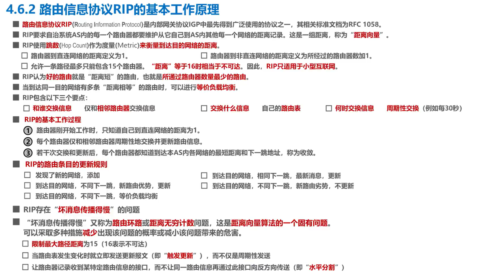

### 开放最短路径优先OSPF的基本工作原理


OSPF的基本工作过程


小结


### 边界网关协议BGP的基本工作原理

这是和上面两种协议层次所不相同的一种协议


是外部网关协议


在BGP协议刚刚运行时,BGP的邻站交换整个BGP路由表，但以后只需要在发生变化时更新有变化的部分，这样做节省网络带宽和减少路由器的处理开销都有好处。

#### 小结


## IPV4数据报的首部格式

IP数据报的首部格式及其内容，是实现IP协议主要功能的基础


IP数据报的首部常以32个比特（4字节）为单位描述

上图的每一行都是32个比特，每个小格子被称为字段或者域

每个字段或某些字段的组合用来表达IP协议的相关功能

- 版本

  占4比特，表示IP协议的版本。

  通信双方使用的IP协议的版本必须一致。目前广泛使用的IP协议版本号为4(即IPv4)。

- 首部长度
  占4比特，表示IP数据报首部的长度。该字段的取值以4字节为单位。最小十进制取值为5，表示IP数据报首部只有20字节固定部分;
  最大十进制取值为15，表示IP数据报首部包含20字节固定部分和最大40字节可变部分。

- 可选字段
  长度从1个字节到40个字节不等。用来支持排错、测量及安全等措施。
  可选字段增加了IP数据报的功能，但这同时也使得IP数据报的首部长度成为可变的。这就增加了每一个路由器处理lP数据报的开销。实际上可选字段很少被使用。

- 填充字段

  确保首部长度为4字节的整数倍，如果不是就使用全0进行填充

- 区分服务
  占8比特，用来获得更好的服务。
  该字段在旧标准中叫作服务类型，但实际上一直没有被使用过。1998年，因特网工程任务组IETF把这个字段改名为区分服务。利用该字段的不同数值可提供不同等级的服务质量。
  只有在使用区分服务时，该字段才起作用。一般情况下都不使用该字段。

- 总长度
  占16比特，表示lP数据报的总长度(首部+数据载荷）最大取值为十进制的65535，以字节为单位。

其中 说明总长度与首部长度的区别


- 生存时间TTL（IP数据报将在路由环路中兜圈,直到TTL的值减少到0时被路由器丢弃!）

  占8比特，最初以秒为单位，最大生存周期为255秒;路由器转发IP数据报时，将IP数据报首部中的该字段的值减去lIP数据报在本路由器上所耗费的时间，若不为O就转发，否则就丢弃。现在以“跳数”为单位，路由器转发IP数据报时，将IP数据报首部中的该字段的值减1，若不为0就转发，否则就丢弃。

- 

- 首部检验和

  占16比特，用来检测首部在传输过程中是否出现差错。比CRC检验码简单，称为因特网检验和。IP数据报每经过一个路由器，路由器都要重新计算首部检验和，因为某些字段（生存时间、标志、片偏移等)的取值可能发生变化。
  由于IP层本身并不提供可靠传输的服务，并且计算首部校验和是一项耗时的操作，因此在IPv6中，路由器不再计算首部校验和，从而更快转发IP数据报。

### IP数据报的切片

承接上表

标识。标志。片偏移，这三个字段共同用于IP数据报分片

因为IP数据报要封装成帧，但是每个帧有最大的传输单元，所以一个IP数据报需要封装成多个帧


如果有相应的业务还可以再分

###  小结


## 网际控制报文协议ICMP

[4.8 网际控制报文协议ICMP_哔哩哔哩_bilibili](https://www.bilibili.com/video/BV1c4411d7jb?p=55&spm_id_from=pageDriver&vd_source=2259e5459a8cfd21bcf92bc46bf3beda)


分为5种

- 终点不可达

  当路由器或主机不能交付数据报时，就向源点发送终点不可达报文。具体可再根据ICMP的代码字段细分为目的网络不可达.目的主机不可达、目的协议不可达、目的端口不可达、目的网络未知、目的主机未知等13种错误。

- 时间超过

  当路由器收到一个目的IP地址不是自己的IP数据报，会将其生存时间TTL字段的值减1。
  若结果不为0，则将该IP数据报转发出去;若结果为0，除丢弃该IP数据报外，还要向源点发送时间超过报文。

  另外，当终点在预先规定的时间内不能收到一个数据报的全部数据报片时，就把已收到的数据报片都丢弃，也会向源点发送时间超过报文。

- 源点抑制

  当路由器或主机由于拥塞而丢弃数据报时，就向源点发送源点抑制报文，使源点知道应当把数据报的发送速率放慢。

- 参数问题

  当路由器或目的主机收到IP数据报后，根据其首部中的检验和字段发现首部在传输过程中出现了误码，就丢弃该数据报，并向源点发送参数问题报文。

- 改变路由（重定向）

  路由器把改变路由报文发送给主机，让主机知道下次应将数据报发送给另外的路由器（可通过更好的路由)。

  


需要注意的是

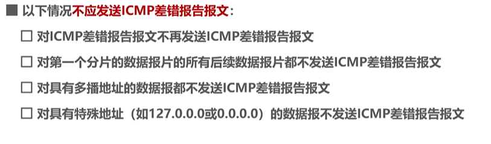

### 常见的两种ICMP询问报文


## 虚拟专用网VPN与网络地址转换NAT

### 虚拟专用网VPN


私有地址只能用于一个机构的内部通信，不能用于和因特网上的主机通信，换句话说，私有地址只能用作**本地地址**而不能用作**全球地址**

在因特网中的所有路由器，对目的地址是私有地址的IP数据报一律不进行转发


比如

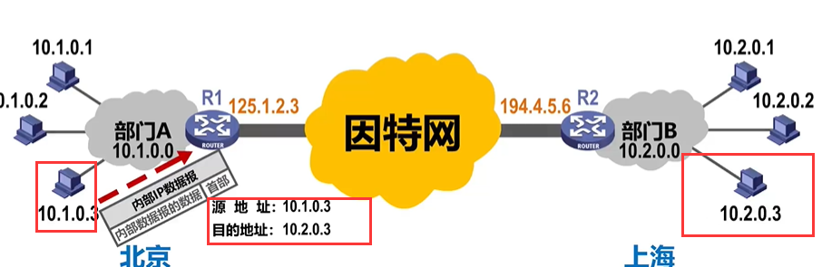

源地址发送到目的地址

R1收到该数据报后，发现其目的网络必须通过因特网才能到达，就将该内部IP数据报进行加密，这样确保了内部IP数据报的安全，然后重新添加数据报的首部，封装成为在因特网上发送的外部数据报，其首部中源地址字段的值为路由器R1的全球地址


路由器R2收到该IP数据报，去掉其首部，将其数据部分进行解密，恢复出原来的IP数据报，这样就可以从其首部提取出源此地址和目的地址。根据目的地址。将该内部IP数据报发送给相应的主机。

很显然，两个专用网内的主机间发送的数据报，是通过了公用的因特网，但在效果上就好像是在本机构的专用网上传送—样，数据报在因特网中可能要经对多个网络和路由器。但从逻辑上看，R1和R2之间好像是条直通的点对点链路。因此也被称为IP隧道技术


### 网络地址转换NAT


装有NAT软件的路由器叫NAT路由器

他至少有一个有效的外部全球IP地址

这样所有使用私有地址的主机在和外界通信时都要在NAT路由器上将其私有地址转换成全球IP地址


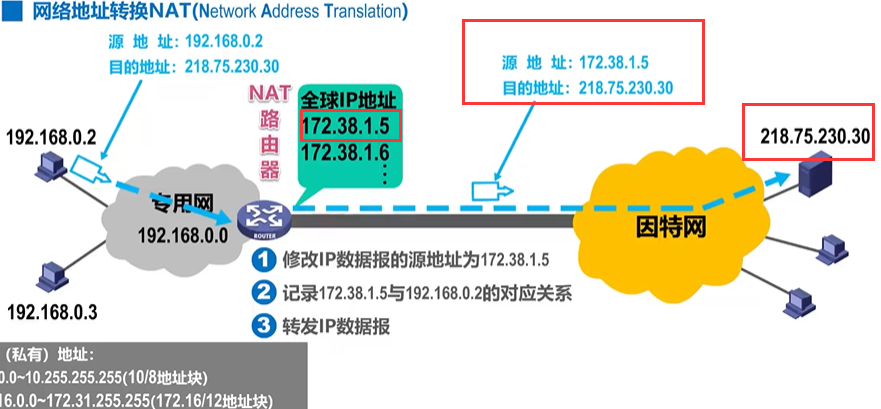

如果两台私有主机同时发消息，会生成两条对应关系


该转换方法存在一个问题:如果NAT路由器具有N个全球IP地址，那么至多只能有N个内网主机能够同时和因特网上的主机通信。


这个还没有讲到，等讲到了回来再看

==需要注意的是，外网主机不能首先发起通信==

因此使用私有地址的主机不能直接充当因特网服务器

但是

### 小结


# 第五章

## 运输层概述

运输层直接为应用进程间的逻辑通信提供服务


### 小结

## 运输层端口号、复用与分用的概念 


TCP/IP体系的应用层常用协议所使用的运输层熟知端口号：


## UDP和TCP的对比

UDP和TCP是TCP/IP体系结构运输层中的两个重要协议


  

UDP支持一对一、 一对多、 一对全的通信

TCP仅支持单播


### UDP传输特点1


UDP对应用进程交下来的报文既不合并也不拆分，而是保留这些报文的边界，换句话说

，UDP是面向应用报文的

### TCP传输特点1

发送方的TCP，把应用进程交付下来的数据块，仅仅看作是一连串的，无结构的字节流，TCP并不知道这些待传送的字节流的含义，仅将他们编号并存储到字节的发送缓存中，TCP根据发送策略，从发送缓存中提取一定数量的字节，


构建TCP报文段并发送，接收方的TCP，一方面 取出数据载荷部分并存储在接收缓存中，另一方面将缓存中的一些字节数据交付给应用进程，TCP不保证接收方应用进程所受到的数据块与发出方发出的数据库具有对应大小的关系，但接收方应用进程收到的字节流，必须和发送方应用进程发出的字节流完全一样，当然，接收方的应用进程必须有能力识别收到的字节流。把它还原成有意义的应用层数据。

也就是说TCP是面向字节流的，这正是TCP实现可靠传输、流量控制、以及拥塞控制的基础


在实际网络中，基于TCP连接的两端，可以同时进行TCP报文段的发送和接收，也就是全双工通信，上图只显示出了单向

### UDP传输特点2


### TCP传输特点2


### UDP传输特点3


### TCP传输特点3


因为TCP提供的服务多，所以自然比较复杂

### 小结


## TCP的流量控制

[5.4 TCP的流量控制_哔哩哔哩_bilibili](https://www.bilibili.com/video/BV1c4411d7jb?p=60&spm_id_from=pageDriver&vd_source=2259e5459a8cfd21bcf92bc46bf3beda)

一般来说，我们总是希望数据传输得更快一些。
但如果发送方把数据发送得过快，接收方就可能来不及接收，这就会造成数据的丢失。
所谓流量控制（flow control)就是**让发送方的发送速率不要太快，要让接收方来得及接收**
利用**滑动窗口**机制可以很方便地在TCP连接上实现对发送方的流量控制。

 ACK是TCP报文段首部中的标志位

小写ack是TCP报文段首部中的确认号字段

**小结**


## TCP的拥塞控制

[5.5 TCP的拥塞控制_哔哩哔哩_bilibili](https://www.bilibili.com/video/BV1c4411d7jb?p=61&spm_id_from=pageDriver&vd_source=2259e5459a8cfd21bcf92bc46bf3beda)

==呜呜呜这个听不懂==


四种拥塞控制算法


## TCP超时重传的选择


所以：超时重传时间RTO应略大于往返时间RTT

但是往返时间不是固定的


## TCP可靠传输的实现

[5.7 TCP可靠传输的实现_哔哩哔哩_bilibili](https://www.bilibili.com/video/BV1c4411d7jb?p=63&vd_source=2259e5459a8cfd21bcf92bc46bf3beda)

凡是已经发送过的数据，在未收到确认之前。都必须暂时保留，以便在超时重传时使用


## TCP的运输连接管理

### TCP的连接建立


TCP的连接建立要解决以下三个问题:

使TCP双方能够确知对方的存在;
使TCP双方能够协商一些参数（如最大窗口值、是否使用窗口扩大选项和时间戳选项以及服务质量等);

使TCP双方能够对运输实体资源（如缓存大小、连接表中的项目等）进行分配。

 首先注意的是

**TCP服务器进程是被动等待来自TCP客户进程的连接请求**（被动打开连接）

TCP规定SYN被设置为1的报文段不能携带数据。但要消耗掉一个序号。（每次消耗一个）

TCP规定普通的TCP确认报文段可以携带数据。但如果不携带数据。则不消耗序号。

**三报文握手**


我也存在这个问题，为什么不能简化成两报文握手

是为了防止已失效的连接请求报文段突然又传送到了TCP服务器，白白浪费服务器的资源了

### TCP的连接释放

 如果客户端出现了故障

服务器有保活计时器的工具来判断


### 小结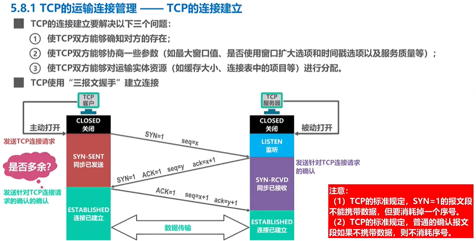

## TCP报文段的首部格式


首部


 

 


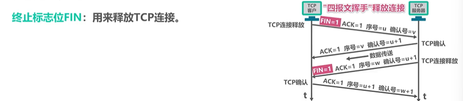


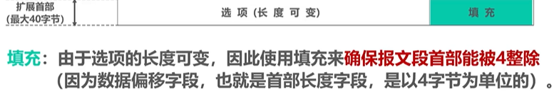

# 第六章

## 应用层概述


## 客户-服务器方式和对等方式

### C/S


C/S方式是因特网上传统的、同时也是最成熟的方式，很多我们熟悉的网络应用采用的都是C/S方式。包括万维网www、电子邮件、文件传输FTP等。


### P2P

 


### 小结


## 动态主机配置协议DHCP


## 域名系统DNS


由于域名到IP地址的映射关系并不是永久不变，为保持高速缓存中的内容正确，域名服务器应为每项内容设置计时器并删除超过合理时间的项（例如，每个项目只存放两天)。

不但在本地域名服务器中需要高速缓存，在用户主机中也很需要。许多用户主机在启动时从本地域名服务器下载域名和IP地址的全部数据库，维护存放自己最近使用的域名的高速缓存，并且只在从缓存中找不到域名时才向域名服务器查询。同理，主机也需要保持高速缓存中内容的正确性。


小结


## 文件传送协议FTP


FTP的常见用途是在计算机之间传输文件，尤其是用于批量传输文件。
FTP的另一个常见用途是让网站设计者将构成网站内容的大量文件批量上传到他们的Web服务器。


是否使用TCP 20端口建立数据连接与传输模式有关，主动方式使用TCP20端口，被动式由服务器和客户端自行协商决定。

## 电子邮件


邮件发送过程


 


小结


## 万维网


 

小结


