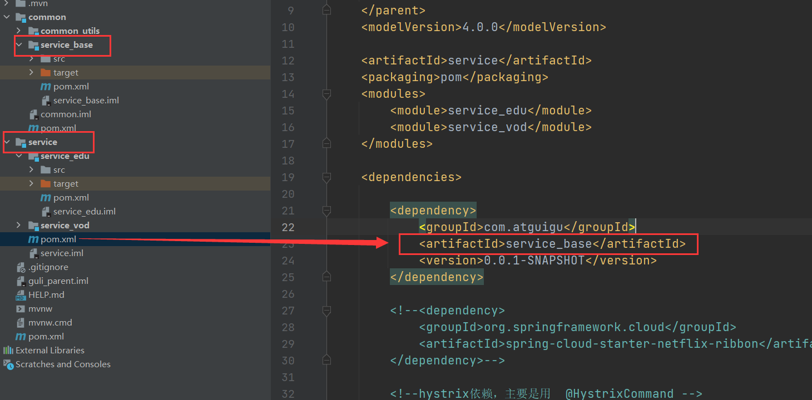
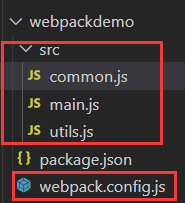
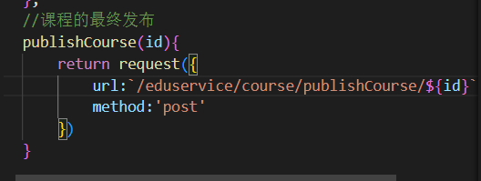
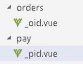
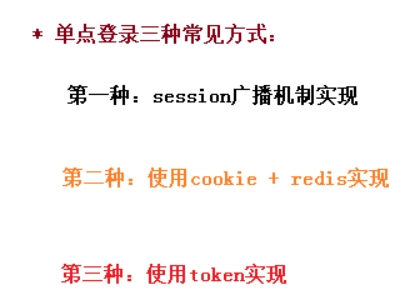

# Day1

本次项目实现的是一个在线教育平台

## 商业模式

### B2C模式

（Business To Customer 会员模式）

商家到用户，这种模式是自己制作大量自有版权的视频，放在自有平台上，让用户按月付费或者按年付费。 这种模式简单，快速，只要专心录制大量视频即可快速发展，其曾因为 lynda 的天价融资而大热。

但在中国由于版权保护意识不强，教育内容易于复制，有海量的免费资源的竞争对手众多等原因，难以取得像样的现金流。

**这种商业模式就是本次项目所使用的模式。**

谷粒学院 http://www.gulixueyuan.com/

### B2B2C模式

平台链接第三方教育机构和用户，平台一般不直接提供课程内容，而是更多承担教育的互联网载体角色，为教学过程各个环节提供全方位支持和服务。

或者来说，举个例子，京东里面有京东自营店，还有其他个体卖家。

腾讯课堂 https://ke.qq.com/

## 谷粒学院功能简介

谷粒学院，是一个B2C模式的**职业技能在线教育**系统，分为**前台用户系统**和**后台运营平台**。


## Mybatis Plus

知识点总结

### 配置环境

配置properties文件（根据自己的需要改）

数据库环境看着配就行

```properties
spring.datasource.driver-class-name=com.mysql.cj.jdbc.Driver
spring.datasource.url=jdbc:mysql://localhost:3306/mybatis_plus?serverTimezone=GMT%2B8
spring.datasource.username=root
spring.datasource.password=xth
```

### 创建实体类

根据数据库中的字段一一对应着写就行，需要注意的是：**MP自动会把下划线命名法转换为驼峰命名法**，不需要再做额外的配置，也可以根据有关注解与数据库中的字段相照应，但是最好不要这样做

### 创建Mapper


注意这里我没有加@Mapper注解，为了方便起见，最好还是用@MapperScan注解，二者其实并没有什么区别

下面是@MapperScan注解的位置，可以扫描整个包真的很省事


### 配置日志

在properties文件中加入这个就开启日志了

```properties
#mybatis日志
mybatis-plus.configuration.log-impl=org.apache.ibatis.logging.stdout.StdOutImpl
```

### 主键新增策略

你可能会问，为什么MP知道哪个是主键字段？

> 情况一：
>
> > 如果数据库中主键名称叫id，实体类中的属性名也叫id，mp默认认为字段名为id的是主键。
>
> 情况二：
>
> > 如果数据库中主键名称叫uid，实体类中的属性名叫id，需要使用注解@TableId。
> >
> > 

拉回正轨，咳咳，我们这个讨论的是MP的主键新增策略

一共有下面

六个策略，我简单的总结一下

|               |                                                              |
| ------------- | ------------------------------------------------------------ |
| AUTO          | 自动增长（需要注意的是数据库中主键字段也需要设置为自动增长，要不然会报错） |
| NONE          | 不设置MP对于主键的自动生成策略                               |
| INPUT         | 通过用户自动设置                                             |
| ID_WORKER     | 对于Long类型主键，MP默认的自动生成策略                       |
| UUID          | UUID生成策略，之前一直用的                                   |
| ID_WORKER_STR | 对于String类型主键，用的这个                                 |

### 自动填充

之前做过的两个项目都有自动填充功能，下面总结一下具体实现。

1. 在实体类的属性上加入注解

```java
@TableField(fill = FieldFill.INSERT)
private Date createTime;

@TableField(fill = FieldFill.INSERT_UPDATE)
private Date updateTime;
```

2. 实现元对象处理器接口

注意：要在类上加上@Component注解，加入springIOC容器中

代码很简单，在里面加入处理逻辑就好了

```java
@Component
public class MyMetaObjectHandler implements MetaObjectHandler {
    @Override
    public void insertFill(MetaObject metaObject) {
        //根据名称设置属性值
        this.setFieldValByName("createTime", new Date(), metaObject);
        this.setFieldValByName("updateTime", new Date(), metaObject);
    }
    @Override
    public void updateFill(MetaObject metaObject) {
        this.setFieldValByName("updateTime", new Date(), metaObject);
    }
}
```

3. 完成，之后再添加或更新就可以自动更新/添加字段了

### 乐观锁

现在都不咋用悲观锁了，但还是介绍一下把

悲观锁：当你更新这条记录的时候，其他人都不能更新这条数据

乐观锁：当要更新一条记录的时候，记下version的值，之后修改过就+1，如果最后得到的值确实是version+1。则说明实现线程安全的数据更新。

我们主要再MP中实现乐观锁


**乐观锁实现方式：**

1. 取出记录时，获取当前version
2. 更新时，带上这个version
3. 执行更新时， set version = newVersion where version = oldVersion
4. 如果version不对，就更新失败

具体步骤：

1. 在数据库中添加version字段，并且设置插入时默认值为1


2. 在实体类中加入version属性和@Version注解

```java
@Version
private Integer version;
```

3. 配置乐观锁插件

```java
@Configuration
@MapperScan("com.atguigu.mpdemo.mapper")
public class MybatisPlusConfig {
    /**
     * 乐观锁插件
     */
    @Bean
    public OptimisticLockerInterceptor optimisticLockerInterceptor() {
        return new OptimisticLockerInterceptor();
    }
}
```

4. 完成，可以测试（先查询再修改）

### 分页插件

之前就用过了，简单总结一下

1. 在MybatisPlusConfig类中配置分页插件

```java
/**
     * 分页插件
     */
@Bean
public PaginationInterceptor paginationInterceptor() {
    return new PaginationInterceptor();
}
```

2. 编写查询分页代码

```
@Test
    void testDemo5(){
        Page<User> page = new Page<User>(1,5);
        userMapper.selectPage(page, null);

        page.getRecords().forEach(System.out::println);
        System.out.println(page.getCurrent());
        System.out.println(page.getPages());
        System.out.println(page.getSize());
        System.out.println(page.getTotal());
        System.out.println(page.hasNext());
        System.out.println(page.hasPrevious());
    }
```

具体的属性可以去mp官网查，用到哪个找哪个

### 逻辑删除

比如一个员工离职，我们不想删除他的信息，我们可以给他标志位离职

在MP中有相应的插件可以帮我们完成逻辑删除

1. 在数据库中添加一个deleted字段，默认值为0（修改值为1说明被删除了）


2. 在实体类中加入字段，并加上逻辑删除的@TableLogic注解


3. 在MybatisPlusConfig类中配置逻辑删除插件

```java
@Bean
public ISqlInjector sqlInjector() {
    return new LogicSqlInjector();
}
```

4. 完成，可以测试了，执行删除代码,最终效果deleted值变成1，之后不管是查询全部还是其他查询，都会在后面加上一个条件`where deleted = 0`

### 性能分析插件

这个插件用于在你执行sql的时候，会在控制台显示执行的时间，你可以设置超过多少s的sql不执行。

1. 在MybatisPlusConfig类中配置性能分析插件

```java
/**
     * SQL 执行性能分析插件
     * 开发环境使用，线上不推荐。 maxTime 指的是 sql 最大执行时长
     */
@Bean
@Profile({"dev","test"})// 设置在dev和test下环境开启性能分析插件
public PerformanceInterceptor performanceInterceptor() {
    PerformanceInterceptor performanceInterceptor = new PerformanceInterceptor();
    performanceInterceptor.setMaxTime(100);//ms，超过此处设置的ms则sql不执行
    performanceInterceptor.setFormat(true);
    return performanceInterceptor;
}
```

2. 在配置文件中加入现在是什么环境下的

```properties
#环境设置：dev、test、prod
spring.profiles.active=test
```

# Day2

## 搭建项目结构


### 模块说明

> **guli-parent**：在线教学根目录（父工程），管理四个子模块：
>
>  **canal-client**：**canal**数据库表同步模块（统计同步数据）
>
>  **common**：公共模块父节点
>
>  common-util：工具类模块，所有模块都可以依赖于它
>
>  service-base：service服务的base包，包含service服务的公共配置类，所有service模块依赖于它
>
>  spring-security：认证与授权模块，需要认证授权的service服务依赖于它
>
> **infrastructure**：基础服务模块父节点
>
>  api-gateway：api网关服务
>
>  **service**：**api**接口服务父节点
>
> service-acl：用户权限管理api接口服务（用户管理、角色管理和权限管理等）
>
> service-cms：cms api接口服务
>
> service-edu：教学相关api接口服务
>
> service-msm：短信api接口服务
>
> service-order：订单相关api接口服务
>
> service-oss：阿里云oss api接口服务
>
> service-statistics：统计报表api接口服务
>
> service-ucenter：会员api接口服务
>
> service-vod：视频点播api接口服务

创建代码结构并配置依赖


（这里我配置依赖配置了好久，因为有的依赖下载不下来，但是我看在网上搜索了一下，在响应的依赖下加入相应的版本号就可以了）


10.2再寄，依赖冲突了，我再试试

最终还是导入了老师的仓库和源码，不得不说，配环境这个问题真的是很浪费时间

## 配置配置文件

根据自己的配置文件修改

```properties
server.port=8001
spring.application.name=service-edu
# dev?test?prod
spring.profiles.active=dev
# mysql
spring.datasource.driver-class-name=com.mysql.cj.jdbc.Driver
spring.datasource.url=jdbc:mysql://localhost:3306/guli?serverTimezone=GMT%2B8
spring.datasource.username=root
spring.datasource.password=xth
#mybatis-plus
mybatis-plus.configuration.log-impl=org.apache.ibatis.logging.stdout.StdOutImpl
```

## MP代码生成器生成大致框架

直接用就行，不过这部分代码放在测试中就可以了，只是一个生成的工具

```java
public class CodeGenerator {

    @Test
    public void run() {

        // 1、创建代码生成器
        AutoGenerator mpg = new AutoGenerator();

        // 2、全局配置
        GlobalConfig gc = new GlobalConfig();
        String projectPath = System.getProperty("user.dir");
        //输出目录
        gc.setOutputDir(projectPath + "/src/main/java");
        //设置作者
        gc.setAuthor("昊昊");
        gc.setOpen(false); //生成后是否打开资源管理器
        gc.setFileOverride(false); //重新生成时文件是否覆盖
        gc.setServiceName("%sService");	//去掉Service接口的首字母I
        gc.setIdType(IdType.ID_WORKER); //主键策略
        gc.setDateType(DateType.ONLY_DATE);//定义生成的实体类中日期类型
        gc.setSwagger2(true);//开启Swagger2模式

        mpg.setGlobalConfig(gc);

        // 3、数据源配置
        DataSourceConfig dsc = new DataSourceConfig();
        dsc.setUrl("jdbc:mysql://localhost:3306/guli?serverTimezone=GMT%2B8");
        dsc.setDriverName("com.mysql.cj.jdbc.Driver");
        dsc.setUsername("root");
        dsc.setPassword("xth");
        dsc.setDbType(DbType.MYSQL);
        mpg.setDataSource(dsc);

        // 4、包配置
        //包名com.atguigu.eduservice.controller
        //
        PackageConfig pc = new PackageConfig();
        pc.setModuleName("eduservice"); //模块名
        pc.setParent("com.atguigu");


        pc.setController("controller");
        pc.setEntity("entity");
        pc.setService("service");
        pc.setMapper("mapper");
        mpg.setPackageInfo(pc);

        // 5、策略配置
        StrategyConfig strategy = new StrategyConfig();
        strategy.setInclude("edu_teacher");
        strategy.setNaming(NamingStrategy.underline_to_camel);//数据库表映射到实体的命名策略
        strategy.setTablePrefix(pc.getModuleName() + "_"); //生成实体时去掉表前缀

        strategy.setColumnNaming(NamingStrategy.underline_to_camel);//数据库表字段映射到实体的命名策略
        strategy.setEntityLombokModel(true); // lombok 模型 @Accessors(chain = true) setter链式操作

        strategy.setRestControllerStyle(true); //restful api风格控制器
        strategy.setControllerMappingHyphenStyle(true); //url中驼峰转连字符

        mpg.setStrategy(strategy);
        // 6、执行
        mpg.execute();
    }
}

```

## 统一返回json时间的格式

默认情况下json时间格式带有时区，并且是世界标准时间，和我们的时间差了八个小时

在application.properties中设置

```properties
#返回json的全局时间格式
spring.jackson.date-format=yyyy-MM-dd HH:mm:ss
spring.jackson.time-zone=GMT+8
```

## 在service中使用swagger

创建以下工程


```java
@Configuration//配置类
@EnableSwagger2 //swagger注解
public class SwaggerConfig {

    @Bean
    public Docket webApiConfig(){
        return new Docket(DocumentationType.SWAGGER_2)
                .groupName("haohaoAPI")
                .apiInfo(webApiInfo())
                .select()
                .paths(Predicates.not(PathSelectors.regex("/admin/.*")))
                .paths(Predicates.not(PathSelectors.regex("/error.*")))
                .build();

    }

    private ApiInfo webApiInfo(){

        return new ApiInfoBuilder()
                .title("网站-课程中心API文档")
                .description("本文档描述了课程中心微服务接口定义")
                .version("1.0")
                .contact(new Contact("瑶瑶昊昊", "http://atguigu.com", "1499487526@qq.com"))
                .build();
    }
}
```

之后我们再在server中引入service_base模块



## 把pom文件中的bean交给spring管理的方法

比如说我们之前引入了service_base模块，但是如果不把config文件交给spring管理是加载不上的，所以可以这样

Springboot默认只会扫描启动类所在包极其子包下的带有@Component注解的类，但是如果超出这个范围就扫描不到了

下面配置的是既能扫描我们的包下的，又能扫描引入依赖那个包下面的 


## 统一返回结果

项目中我们会将响应封装成json返回，一般我们会将所有接口的数据格式统一， 使前端(iOS Android,Web)对数据的操作更一致、轻松。

一般情况下，统一返回数据格式没有固定的格式，只要能描述清楚返回的数据状态以及要返回的具体数据就可以。但是一般会包含状态码、返回消息、数据这几部分内容

例如，我们的系统要求返回的基本数据格式如下：

列表：

```json
{
    "success": true,
    "code": 20000,
    "message": "成功",
    "data": {
        "items": [
            {
                "id": "1",
                "name": "刘德华",
                "intro": "毕业于师范大学数学系，热爱教育事业，执教数学思维6年有余"
            }
        ]
        ....
    }
}
```

分页：

```json
{
    "success": true,
    "code": 20000,
    "message": "成功",
    "data": {
        "total": 17,
        "rows": [
            {
                "id": "1",
                "name": "刘德华",
                "intro": "毕业于师范大学数学系，热爱教育事业，执教数学思维6年有余"
            }
        ]
        ....
    }
}
```


没有返回数据：

```json
{
    "success": true,
    "code": 20000,
    "message": "成功",
    "data": {}
}
```


失败：

```json
{
    "success": false,
    "code": 20001,
    "message": "失败",
    "data": {}
}
```


所以根据规律，定义统一结果

```json
{
    "success": 布尔, //响应是否成功
    "code": 数字, //响应码
    "message": 字符串, //返回消息
    "data": HashMap //返回数据，放在键值对中
}
```

### 编码实现

1. 编写响应码

```java
public interface ResultCode {

    public static Integer SUCCESS = 20000; //成功

    public static Integer ERROR = 20001; //失败
}
```

2. 编写R返回结果类

```java
package com.atguigu.commonutils;

import io.swagger.annotations.ApiModelProperty;
import lombok.Data;

import java.util.HashMap;
import java.util.Map;

//统一返回结果的类
@Data
public class R {

    @ApiModelProperty(value = "是否成功")
    private Boolean success;

    @ApiModelProperty(value = "返回码")
    private Integer code;

    @ApiModelProperty(value = "返回消息")
    private String message;

    @ApiModelProperty(value = "返回数据")
    private Map<String, Object> data = new HashMap<String, Object>();

    //把构造方法私有
    private R() {}

    //成功静态方法
    public static R ok() {
        R r = new R();
        r.setSuccess(true);
        r.setCode(ResultCode.SUCCESS);
        r.setMessage("成功");
        return r;
    }

    //失败静态方法
    public static R error() {
        R r = new R();
        r.setSuccess(false);
        r.setCode(ResultCode.ERROR);
        r.setMessage("失败");
        return r;
    }


    //使用下面的方法，主要是满足链式编程的原理，比如,R.ok().success()....等等
    public R success(Boolean success){
        this.setSuccess(success);
        return this;
    }

    public R message(String message){
        this.setMessage(message);
        return this;
    }

    public R code(Integer code){
        this.setCode(code);
        return this;
    }

    public R data(String key, Object value){
        this.data.put(key, value);
        return this;
    }

    public R data(Map<String, Object> map){
        this.setData(map);
        return this;
    }
}
```

3. 在用到返回结果的模块引入依赖


## **跨域配置**

浏览器从一个域名的网页去请求另一个域名的资源时，域名、端口、协议任一不同，都是跨域 。前后端分离开发中，需要考虑ajax跨域的问题。


这里我们可以从服务端解决这个问题

**配置**

在Controller类上添加注解

```java
 @CrossOrigin //跨域
```

## 条件查询分页

这个业务是  

`根据讲师名称name，讲师头衔level、讲师入驻时间gmt_create（时间段）查询 `

之后再分页

开发规范中，通常把需要传属性多的请求封装成一个实体类，叫**vo**,在这个业务中，我们封装成TeacherQuery

\

那么这个类怎么写呢，答案是根据业务写

业务大概是这样


对着，然后改成代码

```java
@Data
public class TeacherQuery {

    @ApiModelProperty(value = "教师名称,模糊查询" ,example = "张三")
    private String name;

    @ApiModelProperty(value = "头衔 1高级讲师 2首席讲师" ,example = "1")
    private Integer level;

    @ApiModelProperty(value = "查询开始时间", example = "2019-01-01 10:10:10")
    private String begin;//注意，这里使用的是String类型，前端传过来的数据无需进行类型转换

    @ApiModelProperty(value = "查询结束时间", example = "2019-12-01 10:10:10")
    private String end;
}
```

需要注意的是


这个红框里面的东西，是和上面的实体类中的swagger注解的example属性相对应的


@RequestBody

需要使用post提交方式，用其他方式是取不到的

只能发送POST请求，GET方式无请求体

用法是：使用json传递数据,把json数据封装到对应对象里面

**完善代码**

```java
//4 条件查询带分页的方法
    @PostMapping("pageTeacherCondition/{current}/{limit}")
    public R pageTeacherCondition(@PathVariable long current,@PathVariable long limit,
                                  @RequestBody(required = false)  TeacherQuery teacherQuery) {
        //创建page对象
        Page<EduTeacher> pageTeacher = new Page<>(current,limit);

        //构建条件
        LambdaQueryWrapper<EduTeacher> wrapper = new LambdaQueryWrapper<EduTeacher>();
        // 多条件组合查询
        // mybatis学过 动态sql
        String name = teacherQuery.getName();
        Integer level = teacherQuery.getLevel();
        String begin = teacherQuery.getBegin();
        String end = teacherQuery.getEnd();

        wrapper.like(name!=null,EduTeacher::getName,name);
        wrapper.eq(level!=null,EduTeacher::getLevel,level);
        wrapper.ge(begin!=null,EduTeacher::getGmtCreate,begin);
        wrapper.le(end!=null,EduTeacher::getGmtCreate,end);

        //调用方法实现条件查询分页
        teacherService.page(pageTeacher,wrapper);

        long total = pageTeacher.getTotal();//总记录数
        List<EduTeacher> records = pageTeacher.getRecords(); //数据list集合
        return R.ok().data("total",total).data("rows",records);
    }

```

## 统一异常处理

```java
@ControllerAdvice
public class GlobalExceptionHandler {

    //指定出现什么异常执行这个方法
    @ExceptionHandler(Exception.class)
    @ResponseBody //为了返回数据
    public R error(Exception e) {
        e.printStackTrace();
        return R.error().message("执行了全局异常处理..");
    }

    //特定异常处理
    @ExceptionHandler(ArithmeticException.class)
    @ResponseBody
    public R arithmeticExceptionError(ArithmeticException e){
        e.printStackTrace();
        return R.error().message("执行了特定异常处理");
    }
}

```

再在需要用到全局异常处理的地方引入依赖就可以了

基本原理是，如果有特定的异常处理类，就走特定，没有特定就走全局异常

## 统一日志处理

### 配置日志级别

日志记录器（Logger）的行为是分等级的。如下表所示：

分为：OFF、FATAL、**ERROR**、**WARN**、**INFO**、**DEBUG**、ALL

默认情况下，spring boot从控制台打印出来的日志级别只有INFO及以上级别，可以配置日志级别

```properties
# 设置日志级别
logging.level.root=WARN
```

### 把日志输出到文件中

1. 删除配置文件中的关于日志的配置删除


2. resources 中创建 logback-spring.xml

```xml
<?xml version="1.0" encoding="UTF-8"?>
<configuration scan="true" scanPeriod="10 seconds">
    <!-- 日志级别从低到高分为TRACE < DEBUG < INFO < WARN < ERROR < FATAL，如果设
    置为WARN，则低于WARN的信息都不会输出 -->
    <!-- scan:当此属性设置为true时，配置文件如果发生改变，将会被重新加载，默认值
    为true -->
    <!-- scanPeriod:设置监测配置文件是否有修改的时间间隔，如果没有给出时间单位，默认
    单位是毫秒。当scan为true时，此属性生效。默认的时间间隔为1分钟。 -->
    <!-- debug:当此属性设置为true时，将打印出logback内部日志信息，实时查
    看logback运行状态。默认值为false。 -->
    <contextName>logback</contextName>
    <!-- name的值是变量的名称，value的值时变量定义的值。通过定义的值会被插入
    到logger上下文中。定义变量后，可以使“${}”来使用变量。 -->
    <property name="log.path" value="D:/All项目/谷粒学院/log" />
    <!-- 彩色日志 -->
    <!-- 配置格式变量：CONSOLE_LOG_PATTERN 彩色日志格式 -->
    <!-- magenta:洋红 -->
    <!-- boldMagenta:粗红-->
    <!-- cyan:青色 -->
    <!-- white:白色 -->
    <!-- magenta:洋红 -->
    <property name="CONSOLE_LOG_PATTERN"
              value="%yellow(%date{yyyy-MM-dd HH:mm:ss}) |%highlight(%-5level)
|%blue(%thread) |%blue(%file:%line) |%green(%logger) |%cyan(%msg%n)"/>
    <!--输出到控制台-->
    <appender name="CONSOLE" class="ch.qos.logback.core.ConsoleAppender">
        <!--此日志appender是为开发使用，只配置最底级别，控制台输出的日志级别是大于或
        等于此级别的日志信息-->
        <!-- 例如：如果此处配置了INFO级别，则后面其他位置即使配置了DEBUG级别的日
        志，也不会被输出 -->
        <filter class="ch.qos.logback.classic.filter.ThresholdFilter"> <level>INFO</level>
        </filter> <encoder> <Pattern>${CONSOLE_LOG_PATTERN}</Pattern>
        <!-- 设置字符集 -->
        <charset>UTF-8</charset>
    </encoder>
    </appender>
    <!--输出到文件-->
    <!-- 时间滚动输出 level为 INFO 日志 -->
    <appender name="INFO_FILE"
              class="ch.qos.logback.core.rolling.RollingFileAppender">
        <!-- 正在记录的日志文件的路径及文件名 -->
        <file>${log.path}/log_info.log</file>
        <!--日志文件输出格式-->
        <encoder> <pattern>%d{yyyy-MM-dd HH:mm:ss.SSS} [%thread] %-5level
            %logger{50} - %msg%n</pattern> <charset>UTF-8</charset>
        </encoder>
        <!-- 日志记录器的滚动策略，按日期，按大小记录 -->
        <rollingPolicy
                class="ch.qos.logback.core.rolling.TimeBasedRollingPolicy">
            <!-- 每天日志归档路径以及格式 -->
            <fileNamePattern>${log.path}/info/log-info-%d{yyyy-MM�dd}.%i.log</fileNamePattern> <timeBasedFileNamingAndTriggeringPolicy
                class="ch.qos.logback.core.rolling.SizeAndTimeBasedFNATP"> <maxFileSize>100MB</maxFileSize>
        </timeBasedFileNamingAndTriggeringPolicy>
            <!--日志文件保留天数-->
            <maxHistory>15</maxHistory>
        </rollingPolicy>
        <!-- 此日志文件只记录info级别的 -->
        <filter class="ch.qos.logback.classic.filter.LevelFilter">
            <level>INFO</level>
            <onMatch>ACCEPT</onMatch>
            <onMismatch>DENY</onMismatch>
        </filter>
    </appender>
    <!-- 时间滚动输出 level为 WARN 日志 -->
    <appender name="WARN_FILE"
              class="ch.qos.logback.core.rolling.RollingFileAppender">
        <!-- 正在记录的日志文件的路径及文件名 -->
        <file>${log.path}/log_warn.log</file>
        <!--日志文件输出格式-->
        <encoder> <pattern>%d{yyyy-MM-dd HH:mm:ss.SSS} [%thread] %-5level
            %logger{50} - %msg%n</pattern> <charset>UTF-8</charset> <!-- 此处设置字符集 -->
        </encoder>
        <!-- 日志记录器的滚动策略，按日期，按大小记录 -->
        <rollingPolicy
                class="ch.qos.logback.core.rolling.TimeBasedRollingPolicy"> <fileNamePattern>${log.path}/warn/log-warn-%d{yyyy-MM�dd}.%i.log</fileNamePattern> <timeBasedFileNamingAndTriggeringPolicy
                class="ch.qos.logback.core.rolling.SizeAndTimeBasedFNATP"> <maxFileSize>100MB</maxFileSize>
        </timeBasedFileNamingAndTriggeringPolicy>
            <!--日志文件保留天数-->
            <maxHistory>15</maxHistory>
        </rollingPolicy>
        <!-- 此日志文件只记录warn级别的 -->
        <filter class="ch.qos.logback.classic.filter.LevelFilter"> <level>warn</level> <onMatch>ACCEPT</onMatch> <onMismatch>DENY</onMismatch>
        </filter>
    </appender>
    <!-- 时间滚动输出 level为 ERROR 日志 -->
    <appender name="ERROR_FILE"
              class="ch.qos.logback.core.rolling.RollingFileAppender">
        <!-- 正在记录的日志文件的路径及文件名 -->
        <file>${log.path}/log_error.log</file>
        <!--日志文件输出格式-->
        <encoder> <pattern>%d{yyyy-MM-dd HH:mm:ss.SSS} [%thread] %-5level
            %logger{50} - %msg%n</pattern> <charset>UTF-8</charset> <!-- 此处设置字符集 -->
        </encoder>
        <!-- 日志记录器的滚动策略，按日期，按大小记录 -->
        <rollingPolicy
                class="ch.qos.logback.core.rolling.TimeBasedRollingPolicy"> <fileNamePattern>${log.path}/error/log-error-%d{yyyy-MM�dd}.%i.log</fileNamePattern> <timeBasedFileNamingAndTriggeringPolicy
                class="ch.qos.logback.core.rolling.SizeAndTimeBasedFNATP"> <maxFileSize>100MB</maxFileSize>
        </timeBasedFileNamingAndTriggeringPolicy>
            <!--日志文件保留天数-->
            <maxHistory>15</maxHistory>
        </rollingPolicy>
        <!-- 此日志文件只记录ERROR级别的 -->
        <filter class="ch.qos.logback.classic.filter.LevelFilter"> <level>ERROR</level> <onMatch>ACCEPT</onMatch> <onMismatch>DENY</onMismatch>
        </filter>
    </appender>
    <!--
    <logger>用来设置某一个包或者具体的某一个类的日志打印级别、以及指
    定<appender>。
    <logger>仅有一个name属性，
    一个可选的level和一个可选的addtivity属性。
    name:用来指定受此logger约束的某一个包或者具体的某一个类。
    level:用来设置打印级别，大小写无关：TRACE, DEBUG, INFO, WARN, ERROR, ALL
    和 OFF，
    如果未设置此属性，那么当前logger将会继承上级的级别。
    -->
    <!--
    使用mybatis的时候，sql语句是debug下才会打印，而这里我们只配置了info，所以想
    要查看sql语句的话，有以下两种操作：
    第一种把<root level="INFO">改成<root level="DEBUG">这样就会打印sql，不过
    这样日志那边会出现很多其他消息
    第二种就是单独给mapper下目录配置DEBUG模式，代码如下，这样配置sql语句会打
    印，其他还是正常DEBUG级别：
    -->
    <!--开发环境:打印控制台-->
    <springProfile name="dev">
        <!--可以输出项目中的debug日志，包括mybatis的sql日志-->
        <logger name="com.guli" level="INFO" />
        <!--
        root节点是必选节点，用来指定最基础的日志输出级别，只有一个level属性
        level:用来设置打印级别，大小写无关：TRACE, DEBUG, INFO, WARN, ERROR,
        ALL 和 OFF，默认是DEBUG
        可以包含零个或多个appender元素。
        -->
        <root level="INFO"> <appender-ref ref="CONSOLE" />
            <appender-ref ref="INFO_FILE" />
            <appender-ref ref="WARN_FILE" />
            <appender-ref ref="ERROR_FILE" />
        </root>
    </springProfile>
    <!--生产环境:输出到文件-->
    <springProfile name="pro"> <root level="INFO"> <appender-ref ref="CONSOLE" />
        <appender-ref ref="DEBUG_FILE" />
        <appender-ref ref="INFO_FILE" />
        <appender-ref ref="ERROR_FILE" />
        <appender-ref ref="WARN_FILE" />
    </root>
    </springProfile>
</configuration>
```

里面需要注意的是，输出路径的格式，嘿嘿因为我踩过这个坑了

### 把错误的日志单独输出

加入这两个东西，就可以输出了


之后触发异常后就会输出错误信息到这里面啦(里面输出的错误信息可以修改哦)


----------------

# Day3

## 在VSCode里面创建工作区

1. 先创建一个空文件夹
2. 用VSCode打开这个空文件夹
3. 点击
4. 保存文件就可以了
5. 运行

## ES6

ES6是一套标准，JavaScript是ES6的具体实现

### 基本语法

#### let声明变量

```javascript
// var 声明的变量没有局部作用域
// let 声明的变量 有局部作用域
	{
        var a = 0
        let b = 1 
    }
    console.log(a) // 0
    console.log(b) // ReferenceError: b is not defined
```

```javascript
// var 可以声明多次
// let 只能声明一次
var m = 1
var m = 2
let n = 3
let n = 4
console.log(m) // 2
console.log(n) // Identifier 'n' has already been declared
```

#### const声明常量（只读变量）

```javascript
// 1、声明之后不允许改变 
const PI = "3.1415926"
PI = 3 // TypeError: Assignment to constant variable.
// 2、一但声明必须初始化，否则会报错
const MY_AGE // SyntaxError: Missing initializer in const declaration
```

#### 解构赋值

解构赋值是对赋值运算符的扩展。

他是一种针对数组或者对象进行模式匹配，然后对其中的变量进行赋值。

在代码书写上简洁且易读，语义更加清晰明了；也方便了复杂对象中数据字段获取。

```javascript
//1、数组解构
// 传统
let a = 1, b = 2, c = 3
console.log(a, b, c)
// ES6
let [x, y, z] = [1, 2, 3]
console.log(x, y, z)


//2、对象解构
let user = {name: 'Helen', age: 18}
// 传统
let name1 = user.name
let age1 = user.age
console.log(name1, age1)
// ES6
let { name, age } = user//注意：结构的变量必须是user中的属性
console.log(name, age)
```

#### 模板字符串

模板字符串相当于加强版的字符串，用反引号 `,除了作为普通字符串，还可以用来定义多行字符串，还可以在字符串中加入变量和表达式。

```javascript
// 1、多行字符串
let string1 = `Hey,
can you stop angry now?`
console.log(string1)
// Hey,
// can you stop angry now?
```

```javascript
// 2、字符串插入变量和表达式。变量名写在 ${} 中，${} 中可以放入 JavaScript 表达式。
let name = "Mike"
let age = 27
let info = `My Name is ${name},I am ${age+1} years old next year.`
console.log(info)
// My Name is Mike,I am 28 years old next year.
```

```js
// 3、字符串中调用函数
function f(){
 return "have fun!"
}
let string2 = `Game start,${f()}`
console.log(string2); // Game start,have fun!
```

#### 声明对象简写

```js
const age = 12
const name = "Amy"
// 传统
const person1 = {age: age, name: name}
console.log(person1)

// ES6
const person2 = {age, name}
console.log(person2) //{age: 12, name: "Amy"}
```

#### 定义方法简写

```js
// 传统
//person1相当于类名，sayHi相当于方法名
const person1 = {
    sayHi:function(){
        console.log("Hi")
    }
}
person1.sayHi();//"Hi"


// ES6
const person2 = {
    sayHi(){
        console.log("Hi")
    }
}
person2.sayHi() //"Hi"
```

#### 对象扩展运算符

拓展运算符（...）用于取出参数对象所有可遍历属性然后拷贝到当前对象

```js
// 1、拷贝对象
let person1 = {name: "Amy", age: 15}
let person2 = { ...person1 }
console.log(person2) //{name: "Amy", age: 15}
```

```js
// 2、合并对象
let age = {age: 15}
let name = {name: "Amy"}
let person2 = {...age, ...name}
console.log(person2) //{age: 15, name: "Amy"}
```

#### 箭头函数

箭头函数提供了一种更加简洁的函数书写方式。基本语法是：

参数 => 函数体

```js
// 传统
var f1 = function(a){
 	return a 
}
console.log(f1(1))
//这二者是等价的


// ES6
var f2 = a => a
console.log(f2(1))
```

```js
// 当箭头函数没有参数或者有多个参数，要用 () 括起来。
// 当箭头函数函数体有多行语句，用 {} 包裹起来，表示代码块，
// 当只有一行语句，并且需要返回结果时，可以省略 {} , 结果会自动返回。
var f3 = (a,b) => {
 let result = a+b
 return result
}
console.log(f3(6,2)) // 8


// 前面代码相当于：
var f4 = (a,b) => a+b
```

箭头函数多用于匿名函数的定义

## Vue

[Vue | 是小白菜哦 (xiaobaicai350.github.io)](https://xiaobaicai350.github.io/2022/08/29/Vue/)

## Element-UI

element-ui 是饿了么前端出品的基于 Vue.js的 后台组件库，方便程序员进行页面快速布局和构建

官网： https://element-cn.eleme.io/#/zh-CN

下次直接用这里面的组件开发程序

[组件 | Element](https://element.eleme.cn/#/zh-CN/component/layout)

## Node.js

(1)之前学过java，运行java需要安装jdk环境

学习的这个nodejs，**是JavaScript的运行环境**，用于执行JavaScript代码环境不需要浏览器,直接使用nodejs运行JavaScript代码

(2)模拟服务器效果,比如tomcat

### 模拟服务器效果

直接拿来用就行，不需要自己写，知道有这个就行

创建demo02.js

```js
const http = require('http');
http.createServer(function (request, response) {
 // 发送 HTTP 头部
 // HTTP 状态值: 200 : OK
 // 内容类型: text/plain
 response.writeHead(200, {'Content-Type': 'text/plain'});
 // 发送响应数据 "Hello World"
 response.end('Hello Server');
}).listen(8888);
// 终端打印如下信息
console.log('Server running at http://127.0.0.1:8888/');
```


访问http://127.0.0.1:8888/


###  在vscode使用nodejs

在vscode工具中打开cmd窗口，进行js代码执行


之后在终端中写代码


#### 安装NPM

NPM全称Node Package Manager，是Node.js包管理工具，是全球最大的模块生态系统，里面所有的模块都是开源免费的；也是Node.js的包管理工具，相当于**前端的Maven **

安装Node.js的时候自动就安装好了npm，下面是我的npm的地址


#### npm项目初始化操作


使用命令`npm init`

之后一路回车，使用默认的就行。最后点击yes，会生成一个名叫`package.json`的文件,这个文件类似于maven的`pom.xml`文件

#### npm下载js依赖

命令`npm install 依赖名称` 


`package-lock.json`文件是锁定依赖的版本，只能用这个版本的依赖

**根据json文件下载依赖**

只需要下面这个


在这个项目中（这里面就是npmdemo）的命令行中，再输入命令`npm install`,之后就会下载成功

## babel转码器

babel可以把**es6**的代码转换成**es5**的代码

因为写的代码es6代码,但是es6代码浏览器兼容性很差，如果使用es5代码浏览器兼容性很好

编写es6代码,把es6代码转换es5运行

### 安装babel

初始化项目

` npm init -y`

安装babel

`npm install --global babel-cli`

正常安装后

可以查看babel的版本

`babel --version`

如果没有正常安装

可以**强制覆盖**安装

`npm install --force --global babel-cli`

查看版本可能会爆红


查不了版本号，以**管理员**身份重启vscode，终端输入`set-ExecutionPolicy RemoteSigned`就OK了


### 创建js文件,编写es6代码

1. 在es6文件夹下创建js文件

   

2. 配置`.babelrc`文件(这里面是es6转es5的配置文件)

   ```js
   {
       "presets": ["es2015"],
       "plugins": []
   }
   ```

3. 安装转换es5的插件`npm install --save-dev babel-preset-es2015`

4. 有两种转换方式，一种是根据文件名单个转换，另一种是根据文件夹把文件夹里面的es6文件全部转换为es5

   (1)`babel es6/01.js -o dist/001.js `

   

   (2)`babel es6 -d dist`

   

## 模块化操作

### es5模块化操作

目录结构


`01.js`中的代码

```js
//创建js方法
const sum=function(a,b){
    return parseInt(a)+parseInt(b)
}
const sub=function(a,b){
    return parseInt(a)-parseInt(b)
}

//设置哪些方法可以被其他js调用
module.exports={
    sum,
    sub
}
```

`02.js`中的代码

```js
//调用01.js里面的方法
//引入01.js文件
const m=require('./01.js')

//调用
console.log(m.sum(1,2))
console.log(m.sub(1,2))
```

输出结果


### es6模块化操作

注意:如果使用es6写法实现模块化操作，在nodejs环境中不能直接运行的，需要使用babel把es6代码转换es5代码,才可以在nodejs进行运行

基本结构


es5的代码是根据es6生成的

#### 第一种写法

es6的01.js的代码

```js
//定义方法，并设置哪些方法可以被其他js调用
export function sum(a,b){
   return a+b
}
export function sub(a,b){
   return a-b
}
```

02.js代码

```js
//引入01.js文件
import {sum,sub} from "./01.js"

console.log(sum(1,2))
console.log(sub(1,2))
```

之后转成es5的代码才能运行

#### 第二种写法

01.js的代码

```js
export default {
    sum(a, b) {
        return a + b
    },
    sub(a, b) {
        return a - b
    }
}
```

02.js的代码

```js
import m from "./01.js"
console.log(m.sum(1,2))
console.log(m.sub(1,2))
```

> 第二种写法是对第一种写法的进一步简化
>
> 我们后面用的最多的当然是用的最简化的写法啦

## Webpack 

Webpack 是一个前端资源加载/打包工具。它将根据模块的依赖关系进行静态分析，然后将这些模块按

照指定的规则生成对应的静态资源。

==Webpack 可以将**多种静态资源 js、css、less 转换成一个静态文件**，减少了页面的请求==

### 安装Webpack

`npm install -g webpack webpack-cli`

查看版本

`webpack -v`

### 使用Webpack打包js

一个小demo

**基本结构**



记得要先`npm init -y` 哦

分别创建这个目录结构和文件

**src下面的代码**

1. common.js

   ```
   exports.info = function (str) {
       document.write(str);
   }
   ```

   

2. utils.js

   ```
   exports.add = function (a, b) {
       return a + b;
   }
   ```

3. main.js

   ```
   const common = require('./common');
   const utils = require('./utils');
   common.info('Hello world!' + utils.add(100, 200));
   ```

   

**创建webpack的配置类**

文件名为`webpack.config.js`(里面可以修改参数)

```js
const path = require("path"); //Node.js内置模块（不可改）
module.exports = {
    entry: './src/main.js', //配置入口文件（可改）
    output: {
        path: path.resolve(__dirname, './输出'), //输出路径，__dirname：当前文件所在路径（可改）
        filename: 'haohao的webpack输出.js' //输出文件（可改）
    }
}
```

在根目录下使用`webpack`指令


**得到结果**


**测试**


之后启动index.html就可以看到效果了

### 使用Webpack打包css

Webpack 本身只能处理 JavaScript 模块，如果要处理其他类型的文件，就需要使用 loader 进行转换。

Loader 可以理解为是模块和资源的转换器。

首先我们需要安装相关Loader插件，css-loader 是将 css 装载到 javascript；style-loader 是让 javascript认识css

`npm install --save-dev style-loader css-loader`

**修改webpack.config.js**


```js
const path = require("path"); //Node.js内置模块（不可改）
module.exports = {
    entry: './src/main.js', //配置入口文件（可改）
    output: {
        path: path.resolve(__dirname, './输出'), //输出路径，__dirname：当前文件所在路径（可改）
        filename: 'haohao的webpack输出.js' //输出文件（可改）
    },
    
    
    module: {
        rules: [
            {
                test: /\.css$/, //打包规则应用到以css结尾的文件上
                use: ['style-loader', 'css-loader']
            }
        ]
    }
}
```

**在src文件夹创建style.css**

```css
body{
 background:pink;
}
```

**修改main.js**

在第一行引入style.css

```js
require('./style.css');
```

**重新打包**

之后再查看index.html

## 使用模板启动项目

`npm run dev`


### **项目的创建和基本配置**

#### 创建项目

将vue-admin-template-master重命名为guli-admin

#### 修改项目信息

package.json

```json
{
    "name": "guli-admin",
    ......
    "description": "谷粒学院后台管理系统",
    "author": "Helen <55317332@qq.com>",
    ......
}
```

#### 项目的目录结构

>├── build // 构建脚本
>
>├── config // 全局配置
>
>├── node_modules // 项目依赖模块
>
>├── src //项目源代码
>
>├── static // 静态资源
>
>└── package.jspon // 项目信息和依赖配置

src的目录结构

>src
>
>├── api // 各种接口
>
>├── assets // 图片等资源
>
>├── components // 各种公共组件，非公共组件在各自view下维护
>
>├── icons //svg icon
>
>├── router // 路由表
>
>├── store // 存储
>
>├── styles // 各种样式
>
>├── utils // 公共工具，非公共工具，在各自view下维护
>
>├── views // 各种layout
>
>├── App.vue //***项目顶层组件***
>
>├── main.js //***项目入口文件***
>
>└── permission.js //认证入口

#### 运行项目

`npm run dev`

### 我太开心了

因为下modules包下了一下午都下不下来，出现了各种各样的错误，期间成功了一次，但是之后再启动又失败了，现在找到了问题所在


这两个版本得一致，并且下载的时候不要开代理！！！如果你正在开，先关掉，再执行下面两条指令

>重置代理

`npm config set proxy null`

>清除缓存

`npm cache clean --force`

之后再下载，就ok啦

`npm install`

当我看见这个，内心无比激动


看到这个我更激动了


对接上了后端，我要哭出来了


### 项目中需要注意的点

项目中不认识./

只认识@/

@/表示的含义是从src目录

多次路由跳转到同一页面时，created 方法只会被执行一次


项目中报403错误，错误原因可能是

>1.跨域问题
>
>2.路径写错了


## 前端页面

### 讲师列表前端实现


```html
<template> 
    <div class="app-container"> <el-form label-width="120px"> <el-form-item label="讲师名称"> <el-input v-model="teacher.name"/>
    </el-form-item> <el-form-item label="讲师排序"> <el-input-number v-model="teacher.sort" controls-position="right"
                                                                 min="0"/>
    </el-form-item> <el-form-item label="讲师头衔"> <el-select v-model="teacher.level" clearable placeholder="请选择">
    <!--
数据类型一定要和取出的json中的一致，否则没法回填
因此，这里value使用动态绑定的值，保证其数据类型是number
-->
    <el-option :value="1" label="高级讲师"/>
    <el-option :value="2" label="首席讲师"/>
    </el-select>
    </el-form-item> 
    <el-form-item label="讲师资历"> <el-input v-model="teacher.career"/>
    </el-form-item> <el-form-item label="讲师简介"> <el-input v-model="teacher.intro" :rows="10" type="textarea"/>
    </el-form-item>
    <!-- 讲师头像：TODO -->
    <el-form-item> <el-button :disabled="saveBtnDisabled" type="primary"
                              @click="saveOrUpdate">保存</el-button>
        </el-form
    </el-form-item> >
        </div>
</template>
```

```
import numpy as np
from matplotlib.pyplot import*x=np. linspace(0,2*np.pi,200)
y1=np.sin(x);y2=np.cos(pow(x,2))rc( 'font' ,size=16);
plot(x,y1,'r ',label= ' $sin(x)$ ' ,linewidth=2)plot(x,y2,'b--',label='$cos(x^2)$ ')
xlabel( '$x$ ' );ylabel( '$y$ ' ,rotation=0)
savefig( 'figure2_38.png ' ,dpi=500);legend().show()
```

## EasyExcel

### 使用EasyExcel进行写操作

1. 引入依赖

```xml
<dependencies>
    <!-- https://mvnrepository.com/artifact/com.alibaba/easyexcel -->
    <dependency> 
        <groupId>com.alibaba</groupId> 
        <artifactId>easyexcel</artifactId> 
        <version>2.1.1</version>
    </dependency>
</dependencies>
```

还需要这个依赖

2. 创建实体类，找到表头


3. 开始写入（getData方法是得到一个list表）

   

### 使用EasyExcel进行读操作

1. 创建实体类

```java
public class ReadData {
    //设置列对应的属性
    @ExcelProperty(index = 0)
    private int sid;
    
    
    //设置列对应的属性
    @ExcelProperty(index = 1)
    private String sname;
}
```

2. 创建读取操作的监听器

   ```java
   //创建读取excel监听器
   public class ExcelListener extends AnalysisEventListener<ReadData> {
       //创建list集合用来封装最终的数据
       List<ReadData> list = new ArrayList<ReadData>();
       //一行一行去读取excle内容
       @Override
       public void invoke(ReadData user, AnalysisContext analysisContext) {
           System.out.println(user);
           list.add(user);
       }
       //读取excel表头信息
       @Override
       public void invokeHeadMap(Map<Integer, String> headMap, AnalysisContext context) {
           System.out.println("表头信息："+headMap);
       }
       //读取完成后执行
       @Override
       public void doAfterAllAnalysed(AnalysisContext analysisContext) {
       }
   }
   ```
   
   
   
3. 调用实现最终的读取

```java
public static void main(String[] args) throws Exception {
    // 写法1：
    String fileName = "F:\\01.xlsx";
    // 这里 需要指定读用哪个class（规定格式）去读，然后读取第一个sheet
    //文件流会自动关闭
    EasyExcel.read(fileName, ReadData.class, new ExcelListener()).sheet().doRead();
```

# Day9

## 课程最终发布实现

昨天出现了一点小问题

问题的原因是因为Maven的默认加载机制：只会把src-main-java文件夹中的`java`类型文件进行加载，`其他类型`文件不会加载。(昨天我们在mapper的xml文件中写了sql语句，没有进行加载)


**解决方式**

1. 把这个文件夹复制到target目录下的mapper文件夹下

2. 通过配置文件进行配置，让maven默认加载xml文件

   1. 在guli_edu的pom中配置如下节点

      ```xml
        <!-- 项目打包时会将java目录中的*.xml文件也进行打包,需要注意的是，这个build标签是写在dependences标签后面的 -->
          <build>
              <resources>
                  <resource>
                      <directory>src/main/java</directory>
                      <includes>
                          <include>**/*.xml</include>
                      </includes>
                      <filtering>false</filtering>
                  </resource>
              </resources>
          </build>
      ```

   2. 在Spring Boot配置文件中添加配置

      ```properties
      #配置mapper xml文件的路径，注意修改成自己的xml目录，classpath可以在target目录下看到
      mybatis-plus.mapper-locations=classpath:com/guli/edu/mapper/xml/*.xml
      ```

      

### 课程信息确认

这是那个三步走的最后一个阶段，查询出来最终的信息，并作显示，现在写前端的页面

1. 写前端api调用发请求的部分

   

2. 导入这个api的js文件

   

3. 之后再data里面加入courseId并且在create方法里面给他赋值

4. 定义方法并且在created方法中调用

5. 数据回显，利用组件进行解析结果（elementUI）

### 课程发布

课程的最终发布


这个业务主要是修改的这个字段

将Draft(默认)改成Normal


1. 编写后端代码

2. 编写前端代码

   编写api的js文件

   

   之后调用这个方法并进行跳转

## 课程列表

### 课程列表显示

### 课程删除

编写后端代码。

因为要把课程里面的视频，小节，章节，描述，课程本身都删除，所以我们把删除的方法都封装到removeCourse方法中（但是我觉得可以用更好的方法，用外键的级联删除和级联更新就可以实现 具体可以看[Mysql实现级联操作（级联更新、级联删除）_元宝321的博客-CSDN博客_mysql设置级联删除](https://blog.csdn.net/guanyibei/article/details/82528048)）


之后就是在后端中，根据课程id进行删除视频..小结....之类的

## 阿里云视频点播服务

> 服务端：后端接口
>
> 客户端：浏览器、安卓、ios


API:阿里云提供固定的地址，只需要调用这个固定的地址，向地址传递参数，就可以实现这个功能

SDK:SDK对API进行封装，更方便使用，比如之前使用的EasyExcel，可以调用阿里云提供的类和接口里面的方法进行实现相应的功能

## 添加小节实现视频上传

# Day12

##  登录实现流程

### SSO模式

single sign on

**单点登录**

在任何一个模块登录之后其他模块都可以登录上去，不需要二次登录，这就是单点登录

#### 常见的三种单点登录

第一种：

**session广播机制实现**

基于session复制，但是现在已经不怎么使用这种方式，这种方式主要是用单台主机实现，现在都是分布式集群了


第二种：

**使用cookie+redis实现**

在项目中任何一个模块进行登录，登录之后，把数据放到两个地方

1. redis：在key中，生成唯一随机值，在value中存储用户数据
2. cookie：把redis里面生成的key值放到cookie里面

当用户访问项目中的其他模块，发送请求会携带着cookie进行发送，当发送请求到服务器，会把cookie值到redis中进行查询，如果找到了对应的cookie值==redis中的key值，说明就是该用户


第三种：

**使用token实现**

token是*按照一定规则生成的字符串*（字符串中包含用户信息）

token还有一种叫法叫`令牌`，全称叫`自包含令牌`

具体步骤：

1. 在项目中某个模块进行登录，登录之后，会按照规则生成字符串，把信息都存储到字符串中并编码加密,之后服务端把字符串返回

>通过cookie把字符串返回
>
>通过url中地址栏中的数据返回

2. 客户端每次访问项目中的其他模块，每次在地址栏中带着字符串，如果服务端获取到字符串（解析过后），就算登录成功了

#### JWT

之前提到过token是按照一定规则生成的字符串，但是这个规则是怎么样的，是不确定的（可以自己写，也可以用别人规定的规则，JWT显然是后者）

JWT就是**官方给我们的一种规则**

JWT由三部分组成：


第一部分：JWT头信息

第二部分：有效载荷，包含了主体信息（用户信息）

第三部分：签名哈希（也就是防伪标志，知道这个token不是伪造的）

#### 整合JWT

加依赖

```xml
<dependencies>
    <!-- JWT-->
    <dependency>
        <groupId>io.jsonwebtoken</groupId>
        <artifactId>jjwt</artifactId>
    </dependency>
</dependencies>
```

创建工具类

```java
package com.atguigu.commonutils;

import io.jsonwebtoken.Claims;
import io.jsonwebtoken.Jws;
import io.jsonwebtoken.Jwts;
import io.jsonwebtoken.SignatureAlgorithm;
import org.springframework.http.server.reactive.ServerHttpRequest;
import org.springframework.util.StringUtils;

import javax.servlet.http.HttpServletRequest;
import java.util.Date;

/**
 * @author helen
 * @since 2019/10/16
 */
public class JwtUtils {

    public static final long EXPIRE = 1000 * 60 * 60 * 24;
    public static final String APP_SECRET = "ukc8BDbRigUDaY6pZFfWus2jZWLPHO";//密钥，做加密使用的，每个公司由自己的规则生成


    //生成token字符串的方法（这里传了两个参数，可以更改参数的类型和数量）
    public static String getJwtToken(String id, String nickname){

        String JwtToken = Jwts.builder()
                .setHeaderParam("typ", "JWT")
                .setHeaderParam("alg", "HS256")//头，不用改


                .setSubject("guli-user")//设置token分类
                .setIssuedAt(new Date())//设置过期时间
                .setExpiration(new Date(System.currentTimeMillis() + EXPIRE))


                .claim("id", id)//设置token的主体部分（用户信息）
                .claim("nickname", nickname)

                //根据密钥生成hash
                .signWith(SignatureAlgorithm.HS256, APP_SECRET)
                .compact();

        return JwtToken;
    }

    /**
     * 判断token是否存在与有效
     * @param jwtToken
     * @return
     */
    public static boolean checkToken(String jwtToken) {
        if(StringUtils.isEmpty(jwtToken)) return false;
        try {
            Jwts.parser().setSigningKey(APP_SECRET).parseClaimsJws(jwtToken);
        } catch (Exception e) {
            e.printStackTrace();
            return false;
        }
        return true;
    }

    /**
     * 判断token是否存在与有效
     * @param request
     * @return
     */
    public static boolean checkToken(HttpServletRequest request) {
        try {
            String jwtToken = request.getHeader("token");
            if(StringUtils.isEmpty(jwtToken)) return false;
            Jwts.parser().setSigningKey(APP_SECRET).parseClaimsJws(jwtToken);
        } catch (Exception e) {
            e.printStackTrace();
            return false;
        }
        return true;
    }

    /**
     * 根据token获取用户信息
     * @param request
     * @return
     */
    public static String getMemberIdByJwtToken(HttpServletRequest request) {
        String jwtToken = request.getHeader("token");
        if(StringUtils.isEmpty(jwtToken)) return "";
        Jws<Claims> claimsJws = Jwts.parser().setSigningKey(APP_SECRET).parseClaimsJws(jwtToken);
        Claims claims = claimsJws.getBody();
        return (String)claims.get("id");//根据id取到值
    }
}
```

### 整合阿里云短信微服务

发送验证码并设置超时时间

```java
@GetMapping("send/{phone}")
    public R sendMsm(@PathVariable String phone){
        //从redis中获取验证码，如果获得到直接返回
        String code = (String) redisTemplate.opsForValue().get(phone);
        if(!StringUtils.isEmpty(code)){
            return R.ok();
        }
        //如果从redis中获取不到，通过阿里云进行发送验证码
        code =RandomUtils.getFourBitRandom();
        HashMap<String, Object> param = new HashMap<>();
        param.put("code",code);
        //发送验证码
        boolean isSend=msmService.send(param,phone);
        if(isSend){
            redisTemplate.opsForValue().set(phone,code,5, TimeUnit.MINUTES);
            return R.ok();
        }else {
            return R.error();
        }
    }

```


## 登录接口和注册接口

### 编写实体类

**LoginVo**

```java
@Data
@ApiModel(value="登录对象", description="登录对象")
public class LoginVo {
    @ApiModelProperty(value = "手机号")
    private String mobile;
    @ApiModelProperty(value = "密码")
    private String password;
}
```

**RegisterVo**

```java
@Data
@ApiModel(value="注册对象", description="注册对象")
public class RegisterVo {
    @ApiModelProperty(value = "昵称")
    private String nickname;
    @ApiModelProperty(value = "手机号")
    private String mobile;
    @ApiModelProperty(value = "密码")
    private String password;
    @ApiModelProperty(value = "验证码")
    private String code;
}
```

### 创建controller编写登录和注册方法

`MemberApiController.java`

```java
@RestController
@RequestMapping("/ucenterservice/apimember")
@CrossOrigin
public class MemberApiController {
    @Autowired
    private MemberService memberService;
    
    
    @ApiOperation(value = "登录")
    @PostMapping("login")
    public R login(@RequestBody LoginVo loginVo) {
        //调用service得到token
        String token = memberService.login(loginVo);
        return R.ok().data("token", token);
    }
    
    
    @ApiOperation(value = "注册")
    @PostMapping("register")
    public R register(@RequestBody RegisterVo registerVo){
        //调用service实现注册
        memberService.register(registerVo);
        return R.ok();
    }
}
```

### 创建service接口和实现类

```java
@Service
public class MemberServiceImpl extends ServiceImpl<MemberMapper, Member> implements MemberService {
    @Autowired
    private RedisTemplate<String, String> redisTemplate;
    /**
    * 登录
    */
    @Override
    public String login(LoginVo loginVo) {
        String mobile = loginVo.getMobile();
        String password = loginVo.getPassword();
        //校验参数
        if(StringUtils.isEmpty(mobile) ||
           StringUtils.isEmpty(password) ||
           StringUtils.isEmpty(mobile)) {//如果有一个为空，说明出错了！！
            throw new GuliException(20001,"error");
        }
        //获取改对象
        Member member = baseMapper.selectOne(new QueryWrapper<Member>().eq("mobile", mobile));
        if(null == member) {//如果找不到这个对象，说明还没注册呢
            throw new GuliException(20001,"error");
        }
        //校验密码
        if(!MD5.encrypt(password).equals(member.getPassword())) {
            throw new GuliException(20001,"error");
        }
        //校验是否被禁用
        if(member.getIsDisabled()) {
            throw new GuliException(20001,"error");
        }
        //使用JWT生成token字符串
        String token = JwtUtils.getJwtToken(member.getId(), member.getNickname());
        return token;
    }
    /**
    * 注册
    */
    @Override
    public void register(RegisterVo registerVo) {
        //获取注册信息，进行校验
        String nickname = registerVo.getNickname();
        String mobile = registerVo.getMobile();
        String password = registerVo.getPassword();
        String code = registerVo.getCode();
        //校验参数是否为空，为空就出错了
        if(StringUtils.isEmpty(mobile) ||
           StringUtils.isEmpty(mobile) ||
           StringUtils.isEmpty(password) ||
           StringUtils.isEmpty(code)) {
            throw new GuliException(20001,"error");
        }
        //校验校验验证码
        //从redis获取发送的验证码
        String mobleCode = redisTemplate.opsForValue().get(mobile);
        if(!code.equals(mobleCode)) {
            throw new GuliException(20001,"error");
        }
        
        //查询数据库中是否存在相同的手机号码
        Integer count = baseMapper.selectCount(new QueryWrapper<Member>().eq("mobile", mobile));
        if(count.intValue() > 0) {//如果大于0，说明数据库中已经有这个用户了，那么他就不需要注册了
            throw new GuliException(20001,"error");
        }
        //添加注册信息到数据库
        Member member = new Member();
        member.setNickname(nickname);
        member.setMobile(registerVo.getMobile());
        member.setPassword(MD5.encrypt(password));
        member.setIsDisabled(false);
        member.setAvatar("{头像}");//设置头像
        
        //保存这个对象到数据库
        this.save(member);
       }
}
```

### 创建接口根据token获取用户信息

在MemberApiController中创建方法

```java
@ApiOperation(value = "根据token获取登录信息")
@GetMapping("auth/getLoginInfo")
public R getLoginInfo(HttpServletRequest request){
    try {
        String memberId = JwtUtils.getMemberIdByJwtToken(request);//通过发过来的请求（的请求头中）得到token，之后再解析成memeberId
        //通过getById(id)得到登录对象的具体信息
        Member member = memberService.getById(memberId);
        return R.ok().data("userInfo",member);
    }catch (Exception e){
        e.printStackTrace();
        throw new GuliException(20001,"error");
    }
}
```

# Day13

## 登录前端实现

页面中实现倒计时的方法，可以用js中的定时器方法实现


这段代码的意思是每隔3000毫秒弹出一下`haohao`

所以我们可以实现那个发验证码的方法的倒计时效果


每隔1000毫秒执行一次这个方法


### **登录和登录成功之后首页显示数据的实现过程**

1. 调用登录接口返回token字符串
2. 把第一步返回的token字符串放到cookie中
3. 创建前端拦截器：判断cookie里面是否有token字符串，如果有，把token字符串放到**请求头**中（因为我们是通过请求头获取token并获取用户id的，当然也可以用cookie，但是我们习惯用请求头）
4. 根据token值，调用接口，根据token获取用户信息，为了首页面右上角的显示，再把调用接口返回的用户信息放到cookie中
5. 从cookie中获取用户信息，在首页面显示

#### 在api文件夹中创建登录的js文件，定义接口


login.js

```js
import request from '@/utils/request'
export default {
    //登录
    submitLogin(userInfo) {
        return request({
            url: `/ucenterservice/apimember/login`,
            method: 'post',
            data: userInfo
        })
    },
    //根据token获取用户信息
    getLoginInfo() {
        return request({
            url: `/ucenterservice/apimember/auth/getLoginInfo`,
            method: 'get'
        })
    }
}
```

#### 在pages文件夹中创建登录页面，调用方法


login.vue

```vue
<template>
<div class="main">
    <div class="title">
        <a class="active" href="/login">登录</a>
        <span>·</span>
        <a href="/register">注册</a>
    </div>
    <div class="sign-up-container">
        <el-form ref="userForm" :model="user">
            <el-form-item class="input-prepend restyle" prop="mobile" :rules="[{required: true, message: '请输入手机号码', trigger: 'blur' },{validator:checkPhone, trigger:'blur'}]">
                <div >
                    <el-input type="text" placeholder="手机号" v-model="user.mobile"/>
                    <i class="iconfont icon-phone" />
    </div>
    </el-form-item>
            <el-form-item class="input-prepend" prop="password" :rules="[{ required:
                                                                        true, message: '请输入密码', trigger: 'blur' }]">
                <div>
                    <el-input type="password" placeholder="密码" v-model="user.password"/>
                    <i class="iconfont icon-password"/>
    </div>
    </el-form-item>
            <div class="btn">
                <input type="button" class="sign-in-button" value="登录"
                       @click="submitLogin()">
    </div>
    </el-form>
        <!-- 更多登录方式 -->
        <div class="more-sign">
            <h6>社交帐号登录</h6>
            <ul>
                <li><a id="weixin" class="weixin" target="_blank"
                       href="http://qy.free.idcfengye.com/api/ucenter/weixinLogin/login"><i
                                                                                            class="iconfont icon-weixin"/></a></li>
                <li><a id="qq" class="qq" target="_blank" href="#"><i class="iconfont
                    icon-qq"/></a></li>
    </ul>
    </div>
    </div>
    </div>
</template>


<script>
    import '~/assets/css/sign.css'
    import '~/assets/css/iconfont.css'
    import cookie from 'js-cookie'
    import loginApi from '@/api/login'
    export default {
        layout: 'sign',
        data () {
            return {
                user:{
                    mobile:'',
                    password:''
                },
                loginInfo:{}
            }
        },
        methods: {
            submitLogin(){//点击登录触发的方法
                loginApi.submitLogin(this.user).then(response => {
                    if(response.data.success){
                        //第二步：把token存在cookie中、也可以放在localStorage中
                        cookie.set('guli_token', response.data.data.token, { domain: 'localhost' })
                        //第四步：登录成功根据token获取用户信息
                        loginApi.getLoginInfo().then(response => {
                            this.loginInfo = response.data.data.item
                            //将用户信息记录cookie
                            cookie.set('guli_ucenter', this.loginInfo, { domain: 'localhost'})
                            //跳转页面
                            window.location.href = "/";
                        })
                    }
                })
            },
            checkPhone (rule, value, callback) {
                //debugger
                if (!(/^1[34578]\d{9}$/.test(value))) {
                    return callback(new Error('手机号码格式不正确'))
                }
                return callback()
            }
        }
    }
</script>
```

第三步：在request.js添加拦截器，用于传递token信息

```js
import axios from 'axios'
import { MessageBox, Message } from 'element-ui'
import cookie from 'js-cookie'
// 创建axios实例
const service = axios.create({
    //baseURL: 'http://qy.free.idcfengye.com/api', // api 的 base_url
    //baseURL: 'http://localhost:8210', // api 的 base_url
    baseURL: 'http://localhost:9001',
    timeout: 15000 // 请求超时时间
})
// http request 拦截器
service.interceptors.request.use(
    config => {
        //把cookie中的token字符串放入header中
        if (cookie.get('guli_token')) {
            config.headers['token'] = cookie.get('guli_token');
        }
        return config
    },
    err => {
        return Promise.reject(err);
    })
// http response 拦截器
service.interceptors.response.use(
    response => {
       
        if (response.data.code == 28004) {
            console.log("response.data.resultCode是28004")
            // 返回 错误代码-1 清除ticket信息并跳转到登录页面
            //debugger
            window.location.href="/login"
            return
        }else{
            if (response.data.code !== 20000) {
                //25000：订单支付中，不做任何提示
                if(response.data.code != 25000) {
                    Message({
                        message: response.data.message || 'error',
                        type: 'error',
                        duration: 5 * 1000
                    })
                }
            } else {
                return response;
            }
        }
    },
    error => {
        return Promise.reject(error.response) // 返回接口返回的错误信息
    });
export default service
```

#### 修改layouts中的default.vue页面

显示登录之后的用户信息

```vue
<script>
    import cookie from 'js-cookie'
    import userApi from '@/api/login'
    export default {
        data() {
            return {
                token: '',
                loginInfo: {
                    id: '',
                    age: '',
                    avatar: '',
                    mobile: '',
                    nickname: '',
                    sex: ''
                }
            }
        },
        created() {
            this.showInfo()
        },
        methods: {
            showInfo() {//渲染页面前调用的方法
                var jsonStr = cookie.get("guli_ucenter");
                if (jsonStr) {
                    this.loginInfo = JSON.parse(jsonStr)
                }
            },
            logout() {//退出登录
                //给cookie值清空就可以了
                cookie.set('guli_ucenter', "", {domain: 'localhost'})
                cookie.set('guli_token', "", {domain: 'localhost'})
                //跳转页面
                window.location.href = "/"
            }
        }
    }
</script>
```

default.vue页面显示登录之后的用户信息（直接复制粘贴就可以）

```vue
<ul class="h-r-login">
    <li v-if="!loginInfo.id" id="no-login">
        <a href="/login" title="登录">
            <em class="icon18 login-icon">&nbsp;</em>
            <span class="vam ml5">登录</span>
        </a>
        |
        <a href="/register" title="注册">
            <span class="vam ml5">注册</span>
        </a>
    </li>
    
    
    
    <li v-if="loginInfo.id" id="is-login-one" class="mr10">
        <a id="headerMsgCountId" href="#" title="消息">
            <em class="icon18 news-icon">&nbsp;</em>
        </a>
        <q class="red-point" style="display: none">&nbsp;</q>
    </li>
    <li v-if="loginInfo.id" id="is-login-two" class="h-r-user">
        <a href="/ucenter" title>
            
            <span id="userName" class="vam disIb">{{ loginInfo.nickname }}</span>
        </a>
        <a href="javascript:void(0);" title="退出" @click="logout()" class="ml5">退出</a>
    </li>
    <!-- /未登录显示第1 li；登录后显示第2，3 li -->
</ul>
```


## 微信扫码登录

### OAuth2

>OAuth2是针对特定问题的一种**解决方案**
>
>OAuth2主要可以解决两个问题：
>
>1. 开放系统间的授权（存储照片打印照片问题）
>2. 分布式访问问题（单点登录）

关于分布式访问（单点登录）问题，之前我们就做过解释(在单点登录的时候)


### 微信登录

熟悉微信登录流程


#### 后端

application.properties添加相关配置信息

```properties
# 微信开放平台 appid
wx.open.app_id=你的appid
# 微信开放平台 appsecret
wx.open.app_secret=你的appsecret
# 微信开放平台 重定向url
wx.open.redirect_url=http://你的服务器名称/api/ucenter/wx/callback
```

创建util包，创建ConstantPropertiesUtil.java常量类，这个类主要是得到配置文件中的值

```java
@Component
//@PropertySource("classpath:application.properties")
public class ConstantPropertiesUtil implements InitializingBean {
    @Value("${wx.open.app_id}")
    private String appId;
    @Value("${wx.open.app_secret}")
    private String appSecret;
    @Value("${wx.open.redirect_url}")
    private String redirectUrl;
    public static String WX_OPEN_APP_ID;
    public static String WX_OPEN_APP_SECRET;
    public static String WX_OPEN_REDIRECT_URL;
    @Override
    public void afterPropertiesSet() throws Exception {
        WX_OPEN_APP_ID = appId;
        WX_OPEN_APP_SECRET = appSecret;
        WX_OPEN_REDIRECT_URL = redirectUrl;
    }
}
```

**创建controller**

guli-microservice-ucenter微服务中创建api包 api包中创建WxApiController(访问这个controller会出现一个二维码哦)

```java
@CrossOrigin
@Controller//注意这里没有配置 @RestController
@RequestMapping("/api/ucenter/wx")
public class WxApiController {
    @GetMapping("login")
    public String genQrConnect(HttpSession session) {
        // 微信开放平台授权baseUrl
        String baseUrl = "https://open.weixin.qq.com/connect/qrconnect" +
            "?appid=%s" +
            "&redirect_uri=%s" +
            "&response_type=code" +
            "&scope=snsapi_login" +
            "&state=%s" +
            "#wechat_redirect";
        // 回调地址
        String redirectUrl = ConstantPropertiesUtil.WX_OPEN_REDIRECT_URL; //获取业务服务器重定向地址
        try {
            redirectUrl = URLEncoder.encode(redirectUrl, "UTF-8"); //url编码
        } catch (UnsupportedEncodingException e) {
            throw new GuliException(20001, e.getMessage());
        }
        // 防止csrf攻击（跨站请求伪造攻击）
        //String state = UUID.randomUUID().toString().replaceAll("-", "");//一般情况下会使用一个随机数
        String state = "imhelen";//为了让大家能够使用我搭建的外网的微信回调跳转服务器，这里填写你在ngrok的前置域名
            System.out.println("state = " + state);
        // 采用redis等进行缓存state 使用sessionId为key 30分钟后过期，可配置
        //键："wechar-open-state-" + httpServletRequest.getSession().getId()
        //值：satte
        //过期时间：30分钟

        //生成qrcodeUrl
        String qrcodeUrl = String.format(
            baseUrl,
            ConstantPropertiesUtil.WX_OPEN_APP_ID,
            redirectUrl,
            state);
        return "redirect:" + qrcodeUrl;
    }
}
```

用户点击“确认登录”后，微信服务器会向谷粒学院的业务服务器发起回调，因此接下来我们需要开发回调controller

**跳转路径在配置配置文件的时候已经配置好了**

在WxApiController中添加方法

这个是下面的得到的**result**，注释中有标注

> openId是指该微信用户的唯一标识，可以用它来查询该用户是否登录过这个业务
>
> 需要注意的是：下面的代码中最后生成的token和access_token是不一样的，access_token


```java
@GetMapping("callback")
public String callback(String code, String state, HttpSession session) {
    //得到授权临时票据code
    System.out.println("code = " + code);
    System.out.println("state = " + state);

    //从redis中将state获取出来，和当前传入的state作比较
    //如果一致则放行，如果不一致则抛出异常：非法访问
    //向认证服务器发送请求换取access_token
    String baseAccessTokenUrl =
        "https://api.weixin.qq.com/sns/oauth2/access_token" +
        "?appid=%s" +
        "&secret=%s" +
        "&code=%s" +
        "&grant_type=authorization_code";
    String accessTokenUrl = String.format(baseAccessTokenUrl,
                                          ConstantPropertiesUtil.WX_OPEN_APP_ID,
                                          ConstantPropertiesUtil.WX_OPEN_APP_SECRET,
                                          code);//给路径赋值
    String result = null;
    try {
        result = HttpClientUtils.get(accessTokenUrl);//!!发请求给该路径，得到的值的类型在上面图片，这就是换取token的那一步
        System.out.println("accessToken=============" + result);
    } catch (Exception e) {
        throw new GuliException(20001, "获取access_token失败");
    }
    //解析json字符串，取得token
    Gson gson = new Gson();
    HashMap map = gson.fromJson(result, HashMap.class);
    String accessToken = (String)map.get("access_token");
    String openid = (String)map.get("openid");
    //查询数据库当前用用户是否曾经使用过微信登录
    Member member = memberService.getByOpenid(openid);
    if(member == null){//说明是第一次登录
        System.out.println("新用户注册");
        //访问微信的资源服务器（这个是固定的地址，因为我们要获得用户的昵称和其他信息）
        String baseUserInfoUrl = "https://api.weixin.qq.com/sns/userinfo" +
            "?access_token=%s" +
            "&openid=%s";
        String userInfoUrl = String.format(baseUserInfoUrl, accessToken, openid);//给url赋值
        String resultUserInfo = null;
        try {
            resultUserInfo = HttpClientUtils.get(userInfoUrl);
            System.out.println("resultUserInfo==========" + resultUserInfo);
        } catch (Exception e) {
            throw new GuliException(20001, "获取用户信息失败");
        }
        //解析json
        HashMap<String, Object> mapUserInfo = gson.fromJson(resultUserInfo,HashMap.class);
        String nickname = (String)mapUserInfo.get("nickname");
        String headimgurl = (String)mapUserInfo.get("headimgurl");
        //向数据库中插入一条记录
        member = new Member();
        member.setNickname(nickname);
        member.setOpenid(openid);
        member.setAvatar(headimgurl);
        //保存该用户
        memberService.save(member);
    }
    
    
    //下面是用户登录用的啦，生成的token和access_token是不一样的
    
    // 生成jwt
    String token = JwtUtils.geneJsonWebToken(member.getId(),member.getNickName());
    //因为端口号不同存在蛞蝓问题，cookie不能跨域，所以这里使用url重写
    //返回首页面，通过路径传递token字符串
    return "redirect:http://localhost:3000?token=" + token;
}
```

实现service

```java
@Override
public Member getByOpenid(String openid) {
    QueryWrapper<Member> queryWrapper = new QueryWrapper<>();
    queryWrapper.eq("openid", openid);
    Member member = baseMapper.selectOne(queryWrapper);
    return member;
}
```

#### 前端

1. 在页面路径中获取token字符串

2. 把获取的token字符串放到cookie里

   >有前端拦截器，判断cookie里面是否有token，如果有，把cookie中的token取出来，放到header里面

3. 调用后端接口，根据token值获取用户信息，把获取出来的用户信息放到cookie中


```js
export default {
    data() {
        return {
            token: '',
            loginInfo: {
                id: '',
                age: '',
                avatar: '',
                mobile: '',
                nickname: '',
                sex: ''
            }
        }
    },
    created() {
        //第一步
        this.token = this.$route.query.token
        if (this.token) {
            this.wxLogin()
        }
        this.showInfo()
    },
    methods: {
        showInfo() {
            var jsonStr = cookie.get("guli_ucenter");
            if (jsonStr) {
                this.loginInfo = JSON.parse(jsonStr)
            }
        },
        logout() {
            cookie.set('guli_ucenter', "", {domain: 'localhost'})
            cookie.set('guli_token', "", {domain: 'localhost'})
            //跳转页面
            window.location.href = "/"
        },
        wxLogin() {
            if (this.token == '') return
            //第二步，把token存在cookie中
            cookie.set('guli_token', this.token, {domain: 'localhost'})
            cookie.set('guli_ucenter', '', {domain: 'localhost'})
            //第三步。登录成功根据token获取用户信息
            userApi.getLoginInfo().then(response => {
                this.loginInfo = response.data.data.item
                //将用户信息记录cookie
                cookie.set('guli_ucenter', this.loginInfo, {domain: 'localhost'})
            })
        }
    }
}
```

# Day14

## 名师列表功能


## 名师详情功能

用到了动态路由的知识点

动态路由的页面由`_`开头


## 课程列表功能

## 课程详情功能

**需要编写sql语句，根据课程id查询课程信息**

1. 课程的基本信息
2. 课程分类
3. 课程描述
4. 所属讲师

### 定义vo对象

在项目中很多时候需要把model转换成dto用于网站信息的展示，按前端的需要传递对象的数据，保 证model对外是隐私的，例如密码之类的属性能很好地避免暴露在外，同时也会减小数据传输的体积。

`CourseWebVo`

```java
@ApiModel(value="课程信息", description="网站课程详情页需要的相关字段")
@Data
public class CourseWebVo implements Serializable {
    private static final long serialVersionUID = 1L;
    private String id;
    @ApiModelProperty(value = "课程标题")
    private String title;
    @ApiModelProperty(value = "课程销售价格，设置为0则可免费观看")
    private BigDecimal price;
    @ApiModelProperty(value = "总课时")
    private Integer lessonNum;
    @ApiModelProperty(value = "课程封面图片路径")
    private String cover;
    @ApiModelProperty(value = "销售数量")
    private Long buyCount;
    @ApiModelProperty(value = "浏览数量")
    private Long viewCount;
    @ApiModelProperty(value = "课程简介")
    private String description;
    @ApiModelProperty(value = "讲师ID")
    private String teacherId;
    @ApiModelProperty(value = "讲师姓名")
    private String teacherName;
    @ApiModelProperty(value = "讲师资历,一句话说明讲师")
    private String intro;
    @ApiModelProperty(value = "讲师头像")
    private String avatar;
    @ApiModelProperty(value = "课程类别ID")
    private String subjectLevelOneId;
    @ApiModelProperty(value = "类别名称")
    private String subjectLevelOne;
    @ApiModelProperty(value = "课程类别ID")
    private String subjectLevelTwoId;
    @ApiModelProperty(value = "类别名称")
    private String subjectLevelTwo;
}
```

### 定义Mapper方法

`CourseMapper.Java`

```
CourseWebVo selectInfoWebById(String courseId);
```

`CourseMapper.xml`

```sql
<--!返回值为vo对象，但是其实这个可以直接用@Select注解实现 -->
<select id="selectInfoWebById" resultType="com.guli.edu.vo.CourseWebVo">
    SELECT
    c.id,
    c.title,
    c.cover,
    CONVERT(c.price, DECIMAL(8,2)) AS price,
    c.lesson_num AS lessonNum,
    c.cover,
    c.buy_count AS buyCount,
    c.view_count AS viewCount,
    cd.description,
    t.id AS teacherId,
    t.name AS teacherName,
    t.intro,
    t.avatar,
    s1.id AS subjectLevelOneId,
    s1.title AS subjectLevelOne,
    s2.id AS subjectLevelTwoId,
    s2.title AS subjectLevelTwo
    
    
    
    FROM
    edu_course c
    LEFT JOIN edu_course_description cd ON c.id = cd.id
    LEFT JOIN edu_teacher t ON c.teacher_id = t.id
    LEFT JOIN edu_subject s1 ON c.subject_parent_id = s1.id
    LEFT JOIN edu_subject s2 ON c.subject_id = s2.id
    
    
    WHERE
    c.id = #{id}
</select>
```

### 业务层获取数据并更新浏览量

```java
@Override
public CourseWebVo selectInfoWebById(String id) {
    //更新访问量，方法在下面
    this.updatePageViewCount(id);
    //调用mapper是返回查询的数据
    return baseMapper.selectInfoWebById(id);
}
@Override
public void updatePageViewCount(String id) {
    //设置访问量+1
    Course course = baseMapper.selectById(id);
    course.setViewCount(course.getViewCount() + 1);
    baseMapper.updateById(course);
}
```

### 接口层

`CourseController`

```java
@Autowired
private ChapterService chapterService;
@ApiOperation(value = "根据ID查询课程")
@GetMapping(value = "{courseId}")
public R getById(
    @ApiParam(name = "courseId", value = "课程ID", required = true)
    @PathVariable String courseId){
    //查询课程信息和讲师信息
    CourseWebVo courseWebVo = courseService.selectInfoWebById(courseId);
    //查询当前课程的章节信息（之前写过了）
    List<ChapterVo> chapterVoList = chapterService.nestedList(courseId);
    return R.ok().data("course", courseWebVo).data("chapterVoList", chapterVoList);
}
```

## 整合阿里云视频播放器实现视频播放

1. 引入阿里云提供给我们的链接(放在前端的head标签中)

   ```html
    <link rel="stylesheet" href="https://g.alicdn.com/de/prismplayer/2.8.1/skins/default/aliplayer-min.css" />
       <script charset="utf-8" type="text/javascript"
           src="https://g.alicdn.com/de/prismplayer/2.8.1/aliplayer-min.js"></script>
   ```

2. 在body中初始化播放器

   ```html
   <body>
       <div class="prism-player" id="J_prismPlayer"></div>
       <script>
           var player = new Aliplayer({
               id: 'J_prismPlayer',
               width: '100%',
               autoplay: false,
               cover: 'http://liveroom-img.oss-cn-qingdao.aliyuncs.com/logo.png',
               //播放配置
               //播放方式一：支持播放地址播放,此播放优先级最高，此种方式不能播放加密视频
               source : '你的视频播放地址',
   
               //播放方式二：播放凭证播放
               encryptType:'1',//如果播放加密视频，则需设置encryptType=1，非加密视频无需设置此项
               vid : '视频id',
               playauth : '视频授权码',
   
           }, function (player) {
               console.log('播放器创建好了。')
           });
       </script>
   </body>
   ```

   这两种方式取哪种都可以，但是推荐用第二种，比较安全

### 后端获取播放凭证

在vod微服务中创建controller，再创建获取凭证的方法

```java
@CrossOrigin //跨域
@RestController
@RequestMapping("/vod/video")
public class VideoController {
    @GetMapping("get-play-auth/{videoId}")
    public R getVideoPlayAuth(@PathVariable("videoId") String videoId) throws
        Exception {
        //获取阿里云存储相关常量
        String accessKeyId = ConstantPropertiesUtil.ACCESS_KEY_ID;
        String accessKeySecret = ConstantPropertiesUtil.ACCESS_KEY_SECRET;
        //初始化
        DefaultAcsClient client = AliyunVodSDKUtils.initVodClient(accessKeyId, accessKeySecret);
        //请求
        GetVideoPlayAuthRequest request = new GetVideoPlayAuthRequest();
        request.setVideoId(videoId);
        //响应
        GetVideoPlayAuthResponse response = client.getAcsResponse(request);
        //得到播放凭证
        String playAuth = response.getPlayAuth();
        //返回结果
        return R.ok().message("获取凭证成功").data("playAuth", playAuth);
    }
}
```

### 前端播放器整合

>在线配置：https://player.alicdn.com/aliplayer/setting/setting.html 
>
>功能展示：https://player.alicdn.com/aliplayer/presentation/index.html

利用动态路由创建新播放器页面

#### 修改超链接

修改原来信息页面中的超链接属性

```html
<a  :href="'/player/'+video.videoSourceId"
	:title="video.title"
	target="_blank">
```

#### 编写api

创建api/vod.js（发送请求到后端获取播放凭证）

```js
import request from '@/utils/request'
const api_name = '/vod/video'
export default {
    getPlayAuth(vid) {
        return request({
            url: `eduvod/video/getplayAuth/${vid}`,
            method: 'get'
        })
    }
}
```

### 创建动态路由跳转的页面（播放页面）

`创建 pages/player/_vid.vue`

```vue
<template>
<div>
    <!-- 阿里云视频播放器样式 -->
    <link rel="stylesheet"
          href="https://g.alicdn.com/de/prismplayer/2.8.1/skins/default/aliplayer-min.css" >
    <!-- 阿里云视频播放器脚本 -->
    <script charset="utf-8" type="text/javascript"
            src="https://g.alicdn.com/de/prismplayer/2.8.1/aliplayer-min.js" />
 <!-- 定义播放器dom -->
 	<div id="J_prismPlayer" class="prism-player" /> </div>
</template>
<script>
    import vod from '@/api/vod'
    export default {
        layout: 'video',//应用video布局
        asyncData({ params, error }) {//异步请求取得路径中的vid值
            return vod.getPlayAuth(params.vid).then(response => {
                // console.log(response.data.data)
                return {
                    vid: params.vid,//得到路径中的值，并保存
                    playAuth: response.data.data.playAuth//得到登录凭证
                }
            })
        },
        /**
        * 页面渲染完成时：此时js脚本已加载，Aliplayer已定义，可以使用
        * 如果在created生命周期函数中使用，Aliplayer is not defined错误
        */
        mounted() {
            new Aliplayer({
                id: 'J_prismPlayer',//这个id写的是播放器dom的id
                vid: this.vid, // 视频id
                playauth: this.playAuth, // 播放凭证
                encryptType: '1', // 如果播放加密视频，则需设置encryptType=1，非加密视频无需设
                置此项
                width: '100%',
                height: '500px'
            }, function(player) {
                console.log('播放器创建成功')
            })
        }
    }
</script>
```

# Day15

## 支付功能

### 课程支付需求描述

1. 课程分为`免费`课程和`付费`课程，如果是免费课程可以直接观看，如果是付费课程，需要下单支付后才可以观看
2. 如果是免费课程，在用户选择课程后进入课程详情页后，直接显示“立即观看”，点击立即观看，可以切换到播放列表进行视频播放

3. 如果是付费课程，在用户选择课程后进入到课程详情页面后，会显示“立即购买”

   （1）点击"立即购买"会生成课程的订单，跳转到订单页面。

   （2）点击"去支付"，跳转到支付页面（就是微信扫码）

   （3）扫码支付后，会跳转到课程详情页面，同时显示“立即观看”

### 准备工作

创建两张表


### 开发创建订单接口

**编写订单controller**

```java
@RestController
@RequestMapping("/orderservice/order")
@CrossOrigin
public class TOrderController {
    @Autowired
    private TOrderService orderService;
    //根据课程id和用户id创建订单，返回订单id
    @PostMapping("createOrder/{courseId}")
    public R save(@PathVariable String courseId, HttpServletRequest request) {
        String orderId = orderService.saveOrder(courseId,JwtUtils.getMemberIdByJwtToken(request));
        return R.ok().data("orderId", orderId);
    }
}
```

**在service_edu创建接口**

实现根据课程id获取课程信息，返回课程信息对象

```java
//根据课程id查询课程信息
@GetMapping("getDto/{courseId}")
public com.atguigu.commonutils.vo.CourseInfoForm getCourseInfoDto(@PathVariable String courseId) {
    CourseInfoForm courseInfoForm = courseService.getCourseInfo(courseId);
    com.atguigu.commonutils.vo.CourseInfoForm courseInfo = new com.atguigu.commonutils.vo.CourseInfoForm();
    BeanUtils.copyProperties(courseInfoForm,courseInfo);
    return courseInfo;
}
```

**在service_ucenter创建接口**

实现用户id获取用户信息，返回用户信息对象

```java
//根据token字符串获取用户信息
@PostMapping("getInfoUc/{id}")
public com.atguigu.commonutils.vo.UcenterMember getInfo(@PathVariable String id) {
    //根据用户id获取用户信息
    UcenterMember ucenterMember = memberService.getById(id);
    com.atguigu.commonutils.vo.UcenterMember memeber = new com.atguigu.commonutils.vo.UcenterMember();
    BeanUtils.copyProperties(ucenterMember,memeber);
    return memeber;
}
```

**编写订单service**

在service_order模块创建接口，实现远程调用


EduClient

```java
@Component
@FeignClient("service-edu")
public interface EduClient {
    //根据课程id查询课程信息
    @GetMapping("/eduservice/course/getDto/{courseId}")
    public com.atguigu.commonutils.vo.CourseInfoForm
        getCourseInfoDto(@PathVariable("courseId") String courseId);
}
```

UcenterClient

```java
@Component
@FeignClient("service-ucenter")
public interface UcenterClient {
    //根据课程id查询课程信息
    @PostMapping("/ucenterservice/member/getInfoUc/{id}")
    public com.atguigu.commonutils.vo.UcenterMember getInfo(@PathVariable("id") String id);
}
```

在service_order模块编写创建订单service

```java
@Service
public class TOrderServiceImpl extends ServiceImpl<TOrderMapper, TOrder>
    implements TOrderService {
    @Autowired
    private EduClient eduClient;
    @Autowired
    private UcenterClient ucenterClient;
    //创建订单
    @Override
    public String saveOrder(String courseId, String memberId) {
        //远程调用课程服务，根据课程id获取课程信息
        CourseInfoForm courseDto = eduClient.getCourseInfoDto(courseId);
        //远程调用用户服务，根据用户id获取用户信息
        UcenterMember ucenterMember = ucenterClient.getInfo(memberId);
        //创建订单
        TOrder order = new TOrder();
        order.setOrderNo(OrderNoUtil.getOrderNo());
        order.setCourseId(courseId);
        order.setCourseTitle(courseDto.getTitle());
        order.setCourseCover(courseDto.getCover());
        order.setTeacherName("test");
        order.setTotalFee(courseDto.getPrice());
        order.setMemberId(memberId);
        order.setMobile(ucenterMember.getMobile());
        order.setNickname(ucenterMember.getNickname());
        order.setStatus(0);
        order.setPayType(1);
        baseMapper.insert(order);
        return order.getOrderNo();
    }
}
```

### 开发获取订单接口

在订单controller创建根据id获取订单信息接口

```java
@GetMapping("getOrder/{orderId}")
public R get(@PathVariable String orderId) {
    QueryWrapper<TOrder> wrapper = new QueryWrapper<>();
    wrapper.eq("order_no",orderId);
    TOrder order = orderService.getOne(wrapper);
    return R.ok().data("item", order);
}
```

### 生成微信支付二维码接口

引入依赖

```xml
<dependencies>
    <dependency>
        <groupId>com.github.wxpay</groupId>
        <artifactId>wxpay-sdk</artifactId>
        <version>0.0.3</version>
    </dependency>
    <dependency>
        <groupId>com.alibaba</groupId>
        <artifactId>fastjson</artifactId>
    </dependency>
</dependencies>
```

编写controller

```java
@RestController
@RequestMapping("/orderservice/log")
@CrossOrigin
public class PayLogController {
    @Autowired
    private PayLogService payService;
    /**
    * 生成二维码
    */
    @GetMapping("/createNative/{orderNo}")
    public R createNative(@PathVariable String orderNo) {
        Map map = payService.createNative(orderNo);
        return R.ok().data(map);
    }
}
```

编写service

```java
@Service
public class PayLogServiceImpl extends ServiceImpl<PayLogMapper, PayLog>
    implements PayLogService {
    @Autowired
    private TOrderService orderService;
    @Override
    public Map createNative(String orderNo) {
        try {
            //根据订单id获取订单信息
            QueryWrapper<TOrder> wrapper = new QueryWrapper<>();
            wrapper.eq("order_no",orderNo);
            TOrder order = orderService.getOne(wrapper);
            //创建一个map设置生成二维码需要的参数
            Map m = new HashMap();
            //1、设置支付参数
            m.put("appid", "wx74862e0dfcf69954");
            m.put("mch_id", "1558950191");//商户号，和上面那个一样是固定的
            m.put("nonce_str", WXPayUtil.generateNonceStr());//生成一个随机的字符串，使每个订单号的二维码都不一样
            m.put("body", order.getCourseTitle());//生成的二维码显示的名字
            m.put("out_trade_no", orderNo);
            m.put("total_fee", order.getTotalFee().multiply(new BigDecimal("100")).longValue()+"");
            m.put("spbill_create_ip", "127.0.0.1");//支持在支付的网址，在实际项目中要用域名www.baidu.com
            m.put("notify_url","http://guli.shop/api/order/weixinPay/weixinNotify\n");//支付之后回调的地址
            m.put("trade_type", "NATIVE");//支付的类型
            //2、HTTPClient来根据URL访问第三方接口并且传递参数
            HttpClient client = new HttpClient("https://api.mch.weixin.qq.com/pay/unifiedorder");
            //client设置参数（但是必须是xml格式的）
            client.setXmlParam(WXPayUtil.generateSignedXml(m, "T6m9iK73b0kn9g5v426MKfHQH7X8rKwb"));//根据商户key对map中的参数进行加密，但是这个方法是微信提供给我们的，后面第二个参数就是相应的商户key
            client.setHttps(true);
            //执行post提交发送
            client.post();
            //3、返回第三方的数据（注意即使返回的格式也是xml，我们在下面对之进行转换）
            String xml = client.getContent();
            //把返回数据的xml格式转换为map
            Map<String, String> resultMap = WXPayUtil.xmlToMap(xml);
            //4、封装返回结果集
            Map map = new HashMap<>();
            map.put("out_trade_no", orderNo);//订单号
            map.put("course_id", order.getCourseId());//课程id
            map.put("total_fee", order.getTotalFee());//总价格
            map.put("result_code", resultMap.get("result_code"));//返回二维码的状态码
            map.put("code_url", resultMap.get("code_url"));//二维码地址
            //微信支付二维码2小时过期，可采取2小时未支付取消订单
            //redisTemplate.opsForValue().set(orderNo, map, 120,TimeUnit.MINUTES);
            return map;
        } catch (Exception e) {
            e.printStackTrace();
            return new HashMap<>();
        }
    }
}
```

### 查询用户的支付状态接口

这个接口主要是为了查询用户是否已支付，调用的主要是微信的api


编写controller

```java
@GetMapping("/queryPayStatus/{orderNo}")
public R queryPayStatus(@PathVariable String orderNo) {
    //调用查询接口
    Map<String, String> map = payService.queryPayStatus(orderNo);
    if (map == null) {//出错
        return R.error().message("支付出错");
    }
    if (map.get("trade_state").equals("SUCCESS")) {//如果成功
        //更改订单状态
        payService.updateOrderStatus(map);
        return R.ok().message("支付成功");
    }
    return R.ok().code(25000).message("支付中");
}
```

编写service，查询支付状态与更新订单状态

```java
@Override
public Map queryPayStatus(String orderNo) {
    try {
        //1、封装参数
        Map m = new HashMap<>();
        m.put("appid", "wx74862e0dfcf69954");
        m.put("mch_id", "1558950191");
        m.put("out_trade_no", orderNo);
        m.put("nonce_str", WXPayUtil.generateNonceStr());
        //2、设置请求
        HttpClient client = new
            HttpClient("https://api.mch.weixin.qq.com/pay/orderquery");
        client.setXmlParam(WXPayUtil.generateSignedXml(m,"T6m9iK73b0kn9g5v426MKfHQH7X8rKwb"));
        client.setHttps(true);
        client.post();
        //3、返回第三方的数据
        String xml = client.getContent();
        //6、转成Map
        Map<String, String> resultMap = WXPayUtil.xmlToMap(xml);
        //7、返回
        return resultMap;
    } catch (Exception e) {
        e.printStackTrace();
    }
    return null;
}
```


```java
@Override
public void updateOrderStatus(Map<String, String> map) {
    //获取订单id
    String orderNo = map.get("out_trade_no");
    //根据订单id查询订单信息
    QueryWrapper<TOrder> wrapper = new QueryWrapper<>();
    wrapper.eq("order_no",orderNo);
    TOrder order = orderService.getOne(wrapper);
    if(order.getStatus().intValue() == 1) return;
    order.setStatus(1);
    orderService.updateById(order);
    //记录支付日志
    PayLog payLog=new PayLog();
    payLog.setOrderNo(order.getOrderNo());//支付订单号
    payLog.setPayTime(new Date());//完成订单的时间
    payLog.setPayType(1);//支付类型 1为yi
    payLog.setTotalFee(order.getTotalFee());//总金额(分)
    payLog.setTradeState(map.get("trade_state"));//支付状态
    payLog.setTransactionId(map.get("transaction_id"));
    payLog.setAttr(JSONObject.toJSONString(map));
    baseMapper.insert(payLog);//插入到支付日志表
}

```

## 课程支付前端


创建`order.js`

```js
import request from '@/utils/request'
export default {
    //1、创建订单
    createOrder(cid) {
        return request({
            url: '/orderservice/order/createOrder/'+cid,
            method: 'post'
        })
    },
    //2、根据id获取订单
    getById(cid) {
        return request({
            url: '/orderservice/order/getOrder/'+cid,
            method: 'get'
        })
    },
    //3、生成微信支付二维码
    createNative(cid) {
        return request({
            url: '/orderservice/log/createNative/'+cid,
            method: 'get'
        })
    },
    //4、根据id获取订单支付状态
    queryPayStatus(cid) {
        return request({
            url: '/orderservice/log/queryPayStatus/'+cid,
            method: 'get'
        })
    }
}
```

**在课程详情页面中添加创建订单方法**

在“立即购买”位置添加事件


```js
methods:{
    //根据课程id，调用接口方法生成订单
    createOrder(){
        order.createOrder(this.courseId).then(response => {
            if(response.data.success){
                //订单创建成功，跳转到订单页面,这里实现了动态路由
                this.$router.push({ path: '/order/'+ response.data.data.orderId })
            }
        })
    },
}
```

**创建订单页面，显示订单信息**

在pages下面创建order文件夹，创建_oid.vue页面

在_oid.vue页面调用方法，获取订单信息

在页面中给值赋值，并且调用方法

```js
<script>
import orderApi from '@/api/order'

export default {
    //根据订单id获取订单信息
    asyncData({params, error}) {//异步调用取值
        return orderApi.getById(params.oid).then(response => {
            return {
                order: response.data.data.item
            }
        })
    },
    methods: {
        //点击去支付，跳转到支付页面
        toPay() {
            this.$router.push({path: '/pay/' + this.order.orderNo})
        }
    }
}
</script>
```

创建支付页面，生成二维码完成支付

```js
<script>
    import orderApi from '@/api/course'
export default {
    //根据订单id生成微信支付二维码
    asyncData({params, error}) {
        return orderApi.createNative(params.pid).then(response => {
            return {
                payObj: response.data.data
            }
        })
    },
    data() {
        return {
            timer: null, // 定时器名称
            initQCode: '',
            timer1:''
        }
    },
    mounted() {
        //在页面渲染之后执行
        //每隔三秒，去查询一次支付状态
        this.timer1 = setInterval(() => {
            this.queryPayStatus(this.payObj.out_trade_no)
        }, 3000);
    },
    methods: {
        //查询支付状态的方法
        queryPayStatus(out_trade_no) {
            orderApi.queryPayStatus(out_trade_no).then(response => {
                if (response.data.success) {
                    //如果支付成功，清除定时器，（如果不清楚定时器，定时器不管在哪个页面都仍然会运行，直到前端所在的服务器停止）
                    clearInterval(this.timer1)
                    this.$message({
                        type: 'success',
                        message: '支付成功!'
                    })
                    //跳转到课程详情页面观看视频
                    this.$router.push({path: '/course/' + this.payObj.course_id})
                }
            })
        }
    }
}
</script>
```

需要注意的是，这里用了两次动态路由

，都是根据id进行跳转的，所以都可以使用动态路由

# Day16

## 统计分析模块

```sql
#首先介绍一个函数
#Date函数,Date函数用来获取时间格式里面的日期部分
#比如查询2020-03-09有多少创建人数人
select count(*) from member where date(member.gmt_create)=‘2020-03-09’;
```

统计在线教育项目中，没一天有多少注册人数

把统计出来的注册人数，使用图表显示出来

### 后端实现服务

`在service_ucenter模块创建接口，统计某一天的注册人数`

controller

```java
@GetMapping(value = "countregister/{day}")
public R registerCount( @PathVariable String day){
    Integer count = memberService.countRegisterByDay(day);
    return R.ok().data("countRegister", count);
}

```

service

```java
@Override
public Integer countRegisterByDay(String day) {
    return baseMapper.selectRegisterCount(day);
}
```

mapper

```xml
<select id="selectRegisterCount" resultType="java.lang.Integer">
    SELECT COUNT(1)
    FROM ucenter_member
    WHERE DATE(gmt_create) = #{value}
</select>
```

`在service_statistics模块调用微服务`(这个调用的是上面查某一天注册人数的接口)

controller

```java
@PostMapping("{day}")
public R createStatisticsByDate(@PathVariable String day) {
    dailyService.createStatisticsByDay(day);
    return R.ok();
}
```

service

```java
@Service
public class StatisticsDailyServiceImpl extends ServiceImpl<StatisticsDailyMapper,StatisticsDaily> implements StatisticsDailyService {
    @Autowired
    private UcenterClient ucenterClient;
    @Override
    public void createStatisticsByDay(String day) {
        //删除已存在的统计对象
        QueryWrapper<StatisticsDaily> dayQueryWrapper = new QueryWrapper<>();
        dayQueryWrapper.eq("date_calculated", day);
        baseMapper.delete(dayQueryWrapper);
        //获取统计信息
        Integer registerNum = (Integer)ucenterClient.registerCount(day).getData().get("countRegister");
        Integer loginNum = RandomUtils.nextInt(100, 200);//TODO下面三个都是虚拟数据，模拟的数据
        Integer videoViewNum = RandomUtils.nextInt(100, 200);//TODO
        Integer courseNum = RandomUtils.nextInt(100, 200);//TODO
        //创建统计对象
        StatisticsDaily daily = new StatisticsDaily();
        daily.setRegisterNum(registerNum);
        daily.setLoginNum(loginNum);
        daily.setVideoViewNum(videoViewNum);
        daily.setCourseNum(courseNum);
        daily.setDateCalculated(day);
        baseMapper.insert(daily);
    }
}
```


### 定时任务

生成cron表达式

[在线Cron表达式生成器 (qqe2.com)](https://cron.qqe2.com/)

定时任务的意思是在固定的时候自动执行程序


1. 创建定时任务类，使用cron表达式

```java
@Component
public class ScheduledTask {
    @Autowired
    private StatisticsDailyService dailyService;
    /**
    * 每天凌晨1点执行定时
    */
    @Scheduled(cron = "0 0 1 * * ?")
    public void task2() {
        //获取上一天的日期
        String day = DateUtil.formatDate(DateUtil.addDays(new Date(), -1));
        dailyService.createStatisticsByDay(day);
    }
}
```

2. 在启动类上加上注解


### 前端页面实现

创建api

创建src/api/sta.js

```js
import request from '@/utils/request'
const api_name = '/admin/statistics/daily'
export default {
    createStatistics(day) {
        return request({
            url: `${api_name}/${day}`,
            method: 'post'
        })
    }
}
```

增加路由

src/router/index.js

```js
{
    path: '/statistics/daily',
        component: Layout,
            redirect: '/statistics/daily/create',
                name: 'Statistics',
                    meta: { title: '统计分析', icon: 'chart' },
                        children: [
                            {
                                path: 'create',
                                name: 'StatisticsDailyCreate',
                                component: () => import('@/views/statistics/daily/create'),
                                meta: { title: '生成统计' }
                            }
                        ]
},
```

创建组件

src/views/statistics/daily/create.vue 模板部分

这个是element-ui的组件，直接粘贴即用

```html
<template>
    <div class="app-container">
        <!--表单-->
        <el-form :inline="true" class="demo-form-inline">
            <el-form-item label="日期">
                <el-date-picker
                                v-model="day"
                                type="date"
                                placeholder="选择要统计的日期"
                                value-format="yyyy-MM-dd" />
            </el-form-item>
            <el-button
                       :disabled="btnDisabled"
                       type="primary"
                       @click="create()">生成</el-button>
        </el-form>
    </div>
</template>
```

script部分

```js
<script>
    import daily from '@/api/sta'
export default {
    data() {
        return {
            day: '',
            btnDisabled: false
        }
    },
    methods: {
        create() {
            this.btnDisabled = true
            daily.createStatistics(this.day).then(response => {
                this.btnDisabled = false
                this.$message({
                    type: 'success',
                    message: '生成成功'
                })
            })
        }
    }
}
</script>
```

### 前端集成ECharts

安装ECharts

`npm install --save echarts@4.1.0`

增加路由

src/router/index.js 在统计分析路由中增加子路由

```js
{
    path: 'chart',
        name: 'StatisticsDayChart',
            component: () => import('@/views/statistics/daily/chart'),
                meta: { title: '统计图表' }
} 

```

创建组件

src/views/statistics/daily/chart.vue

模板

```html
<template>
    <div class="app-container">
        <!--表单-->
        <el-form :inline="true" class="demo-form-inline">
            <el-form-item>
                <el-select v-model="searchObj.type" clearable placeholder="请选择">
                    <el-option label="学员登录数统计" value="login_num"/>
                    <el-option label="学员注册数统计" value="register_num"/>
                    <el-option label="课程播放数统计" value="video_view_num"/>
                    <el-option label="每日课程数统计" value="course_num"/>
                </el-select>
            </el-form-item>
            <el-form-item>
                <el-date-picker
                                v-model="searchObj.begin"
                                type="date"
                                placeholder="选择开始日期"
                                value-format="yyyy-MM-dd" />
            </el-form-item>
            <el-form-item>
                <el-date-picker
                                v-model="searchObj.end"
                                type="date"
                                placeholder="选择截止日期"
                                value-format="yyyy-MM-dd" />
            </el-form-item>
            <el-button
                       :disabled="btnDisabled"
                       type="primary"
                       icon="el-icon-search"
                       @click="showChart()">查询</el-button>
        </el-form>
        <div class="chart-container">
            <div id="chart" class="chart" style="height:500px;width:100%" />
        </div>
    </div>
</template>
```

js：暂时显示临时数据

```js
<script>
    import echarts from 'echarts'
export default {
    data() {
        return {
            searchObj: {
                type: '',
                begin: '',
                end: ''
            },
            btnDisabled: false,
            chart: null,
            title: '',
            xData: [],
            yData: []
        }
    },
    methods: {
        showChart() {
            this.initChartData()
            this.setChart()
        },
        // 准备图表数据
        initChartData() {
        },
        // 设置图标参数
        setChart() {
            // 基于准备好的dom，初始化echarts实例
            this.chart = echarts.init(document.getElementById('chart'))
            // console.log(this.chart)
            // 指定图表的配置项和数据
            var option = {
                // x轴是类目轴（离散数据）,必须通过data设置类目数据
                xAxis: {
                    type: 'category',
                    data: ['Mon', 'Tue', 'Wed', 'Thu', 'Fri', 'Sat', 'Sun']
                },
                // y轴是数据轴（连续数据）
                yAxis: {
                    type: 'value'
                },
                // 系列列表。每个系列通过 type 决定自己的图表类型
                series: [{
                    // 系列中的数据内容数组
                    data: [820, 932, 901, 934, 1290, 1330, 1320],
                    // 折线图
                    type: 'line'
                }]
            }
            this.chart.setOption(option)
        }
    }
}
</script>
```

### 完成后端业务

controller

```java
@GetMapping("show-chart/{begin}/{end}/{type}")
public R showChart(@PathVariable String begin,@PathVariable String end,@PathVariable String type){
    Map<String, Object> map = dailyService.getChartData(begin, end, type);
    return R.ok().data(map);
}
```

service

```java
@Override
public Map<String, Object> getChartData(String begin, String end, String type) {
    QueryWrapper<Daily> dayQueryWrapper = new QueryWrapper<>();
    dayQueryWrapper.select(type, "date_calculated");
    dayQueryWrapper.between("date_calculated", begin, end);
    List<Daily> dayList = baseMapper.selectList(dayQueryWrapper);
    Map<String, Object> map = new HashMap<>();
    List<Integer> dataList = new ArrayList<Integer>();
    List<String> dateList = new ArrayList<String>();
    map.put("dataList", dataList);
    map.put("dateList", dateList);
    for (int i = 0; i < dayList.size(); i++) {
        Daily daily = dayList.get(i);
        dateList.add(daily.getDateCalculated());
        switch (type) {
            case "register_num":
                dataList.add(daily.getRegisterNum());
                break;
            case "login_num":
                dataList.add(daily.getLoginNum());
                break;
            case "video_view_num":
                dataList.add(daily.getVideoViewNum());
                break;
            case "course_num":
                dataList.add(daily.getCourseNum());
                break;
            default:
                break;
        }
    }
    return map;
}
```

前后端整合

创建api

src/api/statistics/daily.js中添加方法

```js
showChart(searchObj) {
    return request({
        url: `${api_name}/show-chart/${searchObj.begin}/${searchObj.end}/${searchObj.type}`,
        method: 'get'
    })
}
```

chart.vue中引入api模块

```
import daily from '@/api/statistics/daily'
```

修改initChartData方法

```js
showChart() {
    this.initChartData()
    // this.setChart()//放在initChartData回调中执行
},
    // 准备图表数据
    initChartData() {
        daily.showChart(this.searchObj).then(response => {
            // 数据
            this.yData = response.data.dataList
            // 横轴时间
            this.xData = response.data.dateList
            // 当前统计类别
            switch (this.searchObj.type) {
                case 'register_num':
                    this.title = '学员注册数统计'
                    break
                case 'login_num':
                    this.title = '学员登录数统计'
                    break
                case 'video_view_num':
                    this.title = '课程播放数统计'
                    break
                case 'course_num':
                    this.title = '每日课程数统计'
                    break
            }
            this.setChart()
        })
    },
```

修改options中的数据

```js
xAxis: {
    type: 'category',
        data: this.xData//-------绑定数据
},
    // y轴是数据轴（连续数据）
    yAxis: {
        type: 'value'
    },
        // 系列列表。每个系列通过 type 决定自己的图表类型
        series: [{
            // 系列中的数据内容数组
            data: this.yData,//-------绑定数据
            // 折线图
            type: 'line'
        }],
```

# Day17

## Canal

### Canal介绍

在前面的统计分析功能中，我们采取了**服务调用**获取统计数据，这样耦合度高，效率相对较低，目前我们采取另一种实现方式，通过**实时同步数据库表**的方式实现，

例如我们要统计每天注册与登录人数，我们只需把会员表同步到统计库中，实现本地统计就可以了。

这样效率更高，耦合度更低，Canal就是一个很好的数据库同步工具。

canal是阿里巴巴旗下 的一款开源项目，纯Java开发。基于数据库增量日志解析，提供增量数据订阅&消费，目前主要支持了MySQL。

### Canal环境搭建

canal的原理是基于mysql binlog技术，所以这里一定需要开启mysql的binlog写入功能

开启mysql服务：` service mysql start`

（1）检查binlog功能是否有开启

`show variables like 'log_bin';`

（2）如果显示状态为OFF表示该功能未开启，开启binlog功能

```sql
1，修改 mysql 的配置文件 my.cnf
vi /etc/my.cnf
追加内容：
log-bin=mysql-bin #binlog文件名
binlog_format=ROW #选择row模式
server_id=1 #mysql实例id,不能和canal的slaveId重复
2，重启 mysql：
service mysql restart
3，登录 mysql 客户端，查看 log_bin 变量
mysql> show variables like 'log_bin';
+---------------+-------+
| Variable_name | Value |
+---------------+-------+
| log_bin | ON|
+---------------+-------+
1 row in set (0.00 sec)
————————————————
如果显示状态为ON表示该功能已开启
```

（3）在mysql里面添加以下的相关用户和权限

```sql
CREATE USER 'canal'@'%' IDENTIFIED BY 'canal';
GRANT SHOW VIEW, SELECT, REPLICATION SLAVE, REPLICATION CLIENT ON *.* TO
'canal'@'%';
FLUSH PRIVILEGES;
```

### 下载安装Canal服务

下载地址：
https://github.com/alibaba/canal/releases
（1）下载之后，放到目录中，解压文件

```shell
cd /usr/local/canal
canal.deployer-1.1.4.tar.gz
tar zxvf canal.deployer-1.1.4.tar.gz
```

（2）修改配置文件 vi conf/example/instance.properties

```properties
#需要改成自己的数据库信息
canal.instance.master.address=192.168.44.132:3306
#需要改成自己的数据库用户名与密码
canal.instance.dbUsername=canal
canal.instance.dbPassword=canal
#需要改成同步的数据库表规则，例如只是同步一下表
#canal.instance.filter.regex=.*\\..*
canal.instance.filter.regex=guli_ucenter.ucenter_member
```


（3）进入bin目录下启动 

`sh bin/startup.sh`

### 使用Cannal

引入依赖

```xml
<dependencies>
    <dependency>
        <groupId>org.springframework.boot</groupId>
        <artifactId>spring-boot-starter-web</artifactId>
    </dependency>
    <!--mysql-->
    <dependency>
        <groupId>mysql</groupId>
        <artifactId>mysql-connector-java</artifactId>
    </dependency>
    <dependency>
        <groupId>commons-dbutils</groupId>
        <artifactId>commons-dbutils</artifactId>
    </dependency>
    <dependency>
        <groupId>org.springframework.boot</groupId>
        <artifactId>spring-boot-starter-jdbc</artifactId>
    </dependency>
    <dependency>
        <groupId>com.alibaba.otter</groupId>
        <artifactId>canal.client</artifactId>
    </dependency>
</dependencies>
```

、创建application.properties配置文件

```properties
#服务端口
server.port=10000
# 服务名
spring.application.name=canal-client
# 环境设置：dev、test、prod
spring.profiles.active=dev
# mysql数据库连接
spring.datasource.driver-class-name=com.mysql.cj.jdbc.Driver
spring.datasource.url=jdbc:mysql://localhost:3306/guli?serverTimezone=GMT%2B8
spring.datasource.username=root
spring.datasource.password=root
```

编写canal客户端类

```java
@Component
public class CanalClient {
    //sql队列
    private Queue<String> SQL_QUEUE = new ConcurrentLinkedQueue<>();
    @Resource
    private DataSource dataSource;
    /**
* canal入库方法
*/
    public void run() {
        CanalConnector connector = CanalConnectors.newSingleConnector(new
                                                                      InetSocketAddress("192.168.44.132",
                                                                                        11111), "example", "", "");
        int batchSize = 1000;
        try {
            connector.connect();
            connector.subscribe(".*\\..*");
            connector.rollback();
            try {
                while (true) {
                    //尝试从master那边拉去数据batchSize条记录，有多少取多少
                    Message message = connector.getWithoutAck(batchSize);
                    long batchId = message.getId();
                    int size = message.getEntries().size();
                    if (batchId == -1 || size == 0) {
                        Thread.sleep(1000);
                    } else {
                        dataHandle(message.getEntries());
                    }
                    connector.ack(batchId);
                    //当队列里面堆积的sql大于一定数值的时候就模拟执行
                    if (SQL_QUEUE.size() >= 1) {
                        executeQueueSql();
                    }
                }
            } catch (InterruptedException e) {
                e.printStackTrace();
            } catch (InvalidProtocolBufferException e) {
                e.printStackTrace();
            }
        } finally {
            connector.disconnect();
        }
    }
    /**
* 模拟执行队列里面的sql语句
*/
    public void executeQueueSql() {
        int size = SQL_QUEUE.size();
        for (int i = 0; i < size; i++) {
            String sql = SQL_QUEUE.poll();
            System.out.println("[sql]----> " + sql);
            this.execute(sql.toString());
        }
    }
    /**
* 数据处理
*
* @param entrys
*/
    private void dataHandle(List<Entry> entrys) throws
        InvalidProtocolBufferException {
        for (Entry entry : entrys) {
            if (EntryType.ROWDATA == entry.getEntryType()) {
                RowChange rowChange = RowChange.parseFrom(entry.getStoreValue());
                EventType eventType = rowChange.getEventType();
                if (eventType == EventType.DELETE) {
                    saveDeleteSql(entry);
                } else if (eventType == EventType.UPDATE) {
                    saveUpdateSql(entry);
                } else if (eventType == EventType.INSERT) {
                    saveInsertSql(entry);
                }
            }
        }
    }
    /**
* 保存更新语句
*
* @param entry
*/
    private void saveUpdateSql(Entry entry) {
        try {
            RowChange rowChange = RowChange.parseFrom(entry.getStoreValue());
            List<RowData> rowDatasList = rowChange.getRowDatasList();
            for (RowData rowData : rowDatasList) {
                List<Column> newColumnList = rowData.getAfterColumnsList();
                StringBuffer sql = new StringBuffer("update " +
                                                    entry.getHeader().getTableName() + " set ");
                for (int i = 0; i < newColumnList.size(); i++) {
                    sql.append(" " + newColumnList.get(i).getName()
                               + " = '" + newColumnList.get(i).getValue() + "'");
                    if (i != newColumnList.size() - 1) {
                        sql.append(",");
                    }
                }
                sql.append(" where ");
                List<Column> oldColumnList = rowData.getBeforeColumnsList();
                for (Column column : oldColumnList) {
                    if (column.getIsKey()) {
                        //暂时只支持单一主键
                        sql.append(column.getName() + "=" + column.getValue());
                        break;
                    }
                }
                SQL_QUEUE.add(sql.toString());
            }
        } catch (InvalidProtocolBufferException e) {
            e.printStackTrace();
        }
    }
    /**
* 保存删除语句
*
* @param entry
*/
    private void saveDeleteSql(Entry entry) {
        try {
            RowChange rowChange = RowChange.parseFrom(entry.getStoreValue());
            List<RowData> rowDatasList = rowChange.getRowDatasList();
            for (RowData rowData : rowDatasList) {
                List<Column> columnList = rowData.getBeforeColumnsList();
                StringBuffer sql = new StringBuffer("delete from " +
                                                    entry.getHeader().getTableName() + " where ");
                for (Column column : columnList) {
                    if (column.getIsKey()) {
                        //暂时只支持单一主键
                        sql.append(column.getName() + "=" + column.getValue());
                        break;
                    }
                }
                SQL_QUEUE.add(sql.toString());
            }
        } catch (InvalidProtocolBufferException e) {
            e.printStackTrace();
        }
    }
    /**
* 保存插入语句
*
* @param entry
*/
    private void saveInsertSql(Entry entry) {
        try {
            RowChange rowChange = RowChange.parseFrom(entry.getStoreValue());
            List<RowData> rowDatasList = rowChange.getRowDatasList();
            for (RowData rowData : rowDatasList) {
                List<Column> columnList = rowData.getAfterColumnsList();
                StringBuffer sql = new StringBuffer("insert into " +
                                                    entry.getHeader().getTableName() + " (");
                for (int i = 0; i < columnList.size(); i++) {
                    sql.append(columnList.get(i).getName());
                    if (i != columnList.size() - 1) {
                        sql.append(",");
                    }
                }
                sql.append(") VALUES (");
                for (int i = 0; i < columnList.size(); i++) {
                    sql.append("'" + columnList.get(i).getValue() + "'");
                    if (i != columnList.size() - 1) {
                        sql.append(",");
                    }
                }
                sql.append(")");
                SQL_QUEUE.add(sql.toString());
            }
        } catch (InvalidProtocolBufferException e) {
            e.printStackTrace();
        }
    }
    /**
* 入库
* @param sql
*/
    public void execute(String sql) {
        Connection con = null;
        try {
            if(null == sql) return;
            con = dataSource.getConnection();
            QueryRunner qr = new QueryRunner();
            int row = qr.execute(con, sql);
            System.out.println("update: "+ row);
        } catch (SQLException e) {
            e.printStackTrace();
        } finally {
            DbUtils.closeQuietly(con);
        }
    }
}
```

创建启动类

```java
@SpringBootApplication
public class CanalApplication implements CommandLineRunner {
    @Resource
    private CanalClient canalClient;
    public static void main(String[] args) {
        SpringApplication.run(CanalApplication.class, args);
    }
    @Override
    public void run(String... strings) throws Exception {
        //项目启动，执行canal客户端监听
        canalClient.run();
    }
}
```

## 权限管理

需要五张表，五张表的关系如下


根据第三范可知，如果是两张表互为多对多的关系，需要多新建一张表来存储多对多的这种关系

菜单管理

（1）菜单列表

（2）菜单添加、修改

（3）菜单删除功能

角色管理（管理员..等等）

（1）角色的CRUD

（2）为角色分配菜单

用户管理(haohao...)

（1）用户的CRUD

   (2)为用户分配角色

# Day18

## Spring Security

Spring 是一个非常流行和成功的 Java 应用开发框架。Spring Security 基于 Spring 框架，提供了一套 Web 应用安全性的完整解决方案。一般来说，Web 应用的安全性包括**用户认证（Authentication）**和**用户授权（Authorization）**两个部分。

>用户认证：
>
>进入用户登录的时候，输入用户名和密码，查询数据库，验证用户名和密码是否正确，如果正确的话，认证就成功了
>
>用户授权：
>
> 登录了系统，登录用户可能为不同的角色。比如可能是管理员，管理员所可以操作的功能要比普通用户多

**Spring Security其实就是用filter**，多请求的路径进行过滤。

 （1）如果是基于Session，那么Spring-security会对cookie里的sessionid进行解析，找到服务器存储 的session信息，然后判断当前用户是否符合请求的要求。 

（2）如果是token，则是解析出token，然后将当前请求加入到Spring-security管理的权限信息中去

### 认证与授权实现思路

如果系统的模块众多，每个模块都需要就行授权与认证，所以我们选择基于token的形式进行授权与认证，用户根据用户名密码认证成功，然后获取当前用户角色的一系列权限值，并以用户名为key，权限列表为value的形式存入redis缓存中，根据用户名相关信息生成token返回，浏览器将token记录到cookie中， 每次调用api接口都默认将token携带到header请求头中，Spring-security解析header头获取token信息，解 析token获取当前用户名，根据用户名就可以从redis中获取权限列表，这样Spring-security就能够判断当前 请求是否有权限访问


------------


1、项目描述
（1）
在线教育系统，分为前台网站系统和后台运营平台，B2C模式。
前台用户系统包括课程、讲师、问答、文章几大大部分，使用了微服务技术架构，前后端分离开发。
后端的主要技术架构是：SpringBoot + SpringCloud + MyBatis-Plus + HttpClient + MySQL +
Maven+EasyExcel+ nginx
前端的架构是：Node.js + Vue.js +element-ui+NUXT+ECharts
其他涉及到的中间件包括Redis、阿里云OSS、阿里云视频点播
业务中使用了ECharts做图表展示，使用EasyExcel完成分类批量添加、注册分布式单点登录使用了JWT
（2）
项目前后端分离开发，后端采用SpringCloud微服务架构，持久层用的是MyBatis-Plus，微服务分库设
计，使用Swagger生成接口文档
接入了阿里云视频点播、阿里云OSS。
系统分为前台用户系统和后台管理系统两部分。
前台用户系统包括：首页、课程、名师、问答、文章。
后台管理系统包括：讲师管理、课程分类管理、课程管理、统计分析、Banner管理、订单管理、权限管
理等功能。
在线教育计费案例：
小A是一名杭州的创业者，带领团队研发了一个在线教育平台。他希望把视频托管在阿里云上，存量视频大约1000个，
占用存储空间近1T，每月预计新增视频100个，并新增存储约100G，课程视频的时长集中在20-40分钟，并且按照不同课
程进行分类管理。为了保障各端的观看效果，计划为用户提供“标清480P”和“高清720P”两种清晰度。目前已有用
户400人左右，每日平均视频观看次数1000次，在移动端和PC端观看次数比例大致为3:1。
2、这是一个项目还是一个产品
这是一个产品
1.0版本是单体应用：SSM
2.0版本加入了SpringCloud，将一些关键业务和访问量比较大的部分分离了出去
目前独立出来的服务有教学服务、视频点播服务、用户服务、统计分析服务、网关服务
3、测试要求
首页和视频详情页qps单机qps要求 2000+
经常用每秒查询率来衡量域名系统服务器的机器的性能，其即为QPS
QPS = 并发量 / 平均响应时间
4、企业中的项目（产品）开发流程
一个中大型项目的开发流程
1、需求调研（产品经理）
2、需求评审（产品/设计/前端/后端/测试/运营）
3、立项（项目经理、品管）
4、UI设计
5、开发
架构、数据库设计、API文档、MOCK数据、开发、单元测试
前端
后端
6、前端后端联调
7、项目提测：黑盒白盒、压力测试（qps） loadrunner
8、bug修改
9、回归测试
10、运维和部署上线
11、灰度发布
12、全量发布
13、维护和运营
5、系统中都有那些角色？数据库是怎么设计的？
前台：会员（学员）
后台：系统管理员、运营人员
后台分库，每个微服务一个独立的数据库，使用了分布式id生成器
6、视频点播是怎么实现的（流媒体你们是怎么实现的）
我们直接接入了阿里云的云视频点播。云平台上的功能包括视频上传、转码、加密、智能审核、监控统
计等。
还包括视频播放功能，阿里云还提供了一个视频播放器。
7、前后端联调经常遇到的问题：
 1、请求方式post、get
 2、json、x-wwww-form-urlencoded混乱的错误
 3、后台必要的参数，前端省略了
 4、数据类型不匹配
 5、空指针异常
 6、分布式系统中分布式id生成器生成的id 长度过大（19个字符长度的整数），js无法解析（js智能解
析16个长度：2的53次幂）
 id策略改成 ID_WORKER_STR
8、前后端分离项目中的跨域问题是如何解决的
后端服务器配置：我们的项目中是通过Spring注解解决跨域的 @CrossOrigin
也可以使用nginx反向代理、httpClient、网关
9、说说你做了哪个部分、遇到了什么问题、怎么解决的
问题1：
分布式id生成器在前端无法处理，总是在后三位进行四舍五入。
分布式id生成器生成的id是19个字符的长度，前端javascript脚本对整数的处理能力只有2的53次方，也就
是最多只能处理16个字符
解决的方案是把id在程序中设置成了字符串的性质
问题2：
项目迁移到Spring-Cloud的时候，经过网关时，前端传递的cookie后端一只获取不了，看
了cloud中zuul的源码，发现向下游传递数据的时候，zull默认过滤了敏感信息，将cookie过滤掉了
解决的方案是在配置文件中将请求头的过滤清除掉，使cookie可以向下游传递
问题3.......
10、分布式系统的id生成策略
https://www.cnblogs.com/haoxinyue/p/5208136.html
11、项目组有多少人，人员如何组成？
12、分布式系统的CAP原理
CAP定理：
指的是在一个分布式系统中，Consistency（一致性）、 Availability（可用性）、Partition tolerance（分
区容错性），三者不可同时获得。
一致性（C）：在分布式系统中的所有数据备份，在同一时刻是否同样的值。（所有节点在同一时间的
数据完全一致，越多节点，数据同步越耗时）
可用性（A）：负载过大后，集群整体是否还能响应客户端的读写请求。（服务一直可用，而且是正常响
应时间）
分区容错性（P）：分区容错性，就是高可用性，一个节点崩了，并不影响其它的节点（100个节点，挂
了几个，不影响服务，越多机器越好）
CA 满足的情况下，P不能满足的原因：
数据同步(C)需要时间，也要正常的时间内响应(A)，那么机器数量就要少，所以P就不满足

CP 满足的情况下，A不能满足的原因：
数据同步(C)需要时间, 机器数量也多(P)，但是同步数据需要时间，所以不能再正常时间内响应，所以A就
不满足
AP 满足的情况下，C不能满足的原因：
机器数量也多(P)，正常的时间内响应(A)，那么数据就不能及时同步到其他节点，所以C不满足
注册中心选择的原则：
Zookeeper：CP设计，保证了一致性，集群搭建的时候，某个节点失效，则会进行选举行的leader，或
者半数以上节点不可用，则无法提供服务，因此可用性没法满足
Eureka：AP原则，无主从节点，一个节点挂了，自动切换其他节点可以使用，去中心化
结论：
分布式系统中P,肯定要满足，所以我们只能在一致性和可用性之间进行权衡
如果要求一致性，则选择zookeeper，如金融行业
如果要求可用性，则Eureka，如教育、电商系统
没有最好的选择，最好的选择是根据业务场景来进行架构设计
13、前端渲染和后端渲染有什么区别
前端渲染是返回json给前端，通过javascript将数据绑定到页面上
后端渲染是在服务器端将页面生成直接发送给服务器，有利于SEO的优化
14、能画一下系统架构图吗


# 总结在线教育项目功能点

**一、准备**

1、把后端接口启动起来

2、启动前端项目（前台系统和后台系统）

 

**二、项目后台管理系统功能**

**1、登录功能**（SpringSecurity框架）

 

**2、权限管理模块**

（1）菜单管理：列表、添加、修改、删除

 

（2）角色管理

\* 列表、添加、修改、删除、批量删除

\* 为角色分配菜单

 

（3）用户管理

\* 列表、添加、修改、删除、批量删除

\* 为用户分配角色

 

**（4）权限管理表和关系**

*** 使用五张表**

 

 

**3、讲师管理模块**

（1）条件查询分页列表、添加、修改、删除

 

**4、课程分类模块**

（1）添加课程分类

\* 读取Excel里面课程分类数据，添加到数据库中

 

（2）课程分类列表

\* 使用树形结构显示课程分类列表

 

**5、课程管理模块**

（1）课程列表功能

**（2）添加课程**

\* 课程发布流程：第一步填写课程基本信息，第二步添加课程大纲（章节和小节），第三步课程信息确认，最终课程发布

 

\* **课程如何判断是否已经被发布了？**使用status字段

 

\* **课程添加过程中，中途把课程停止添加，重新去添加新的课程，如何找到之前没有发布完成课程，继续进行发布？** 到课程列表中根据课程状态查询未发布的课程，点击课程右边超链接把课程继续发布完成

 

**（3）添加小节上传课程视频**

 

**6、统计分析模块**

**（1）生成统计数据**

**（2）统计数据图表显示**

 

**三、项目前台用户系统功能**

1、首页数据显示

（1）显示幻灯片功能

（2）显示热门课程

（3）显示名师

 

**2、注册功能**

（1）获取手机验证码

 

**3、登录功能**

**（1）普通登录和退出**

*** SSO（单点登录）**

 

 

l **JWT**

l 使用JWT生成token字符串

l JWT有三部分组成

 

l **登录实现流程**

登录调用登录接口返回token字符串，把返回token字符串放到cookie里面，创建前l 端拦截器进行判断，如果cookie里面包含token字符串，把token字符串放到header里面。调用接口根据token获取用户信息，把用户信息放到cookie里面，进行显示

 

**（2）微信扫描登录**

l **OAuth2**

l 是针对特定问题解决方案

l 主要有两个问题：开放系统间授权，分布式访问

 

l **如何获取扫描人信息过程？**

l 扫描之后微信接口返回code（临时票据），拿着code值请求微信固定地址，得到两个值：access_token（访问凭证）和openid（微信唯一标识）,你拿着这两个值再去请求微信固定的地址，得到微信扫描人信息（比如昵称，头像等等）

 

4、名师列表功能

 

5、名师详情功能

 

6、课程列表功能

（1）条件查询分页列表功能

 

**7、课程详情页**

（1）课程信息显示（包含课程基本信息，分类，讲师，课程大纲）

（2）判断课程是否需要购买

 

**8、课程视频在线播放**

 

**9、课程支付功能（微信支付）**

（1）生成课程订单

（2）生成微信支付二维码

（3）微信最终支付

 

*** 微信支付实现流程：**

\* 如果课程是收费课程，点击立即购买，生成课程订单

\* 点击订单页面去支付，生成微信支付二维码

\* 使用微信扫描支付二维码实现支付

\* 支付之后，每隔3秒查询支付状态（是否支付成功），如果没有支付成功等待，如果支付成功之后，更新订单状态（已经支付状态），向支付记录表添加支付成功记录

# 总结在线教育项目技术点（前端）

**1、在线教育项目采用前后端分离开发**

 

**2、项目使用前端技术**

**（1）vue**

\* 基本语法

\* 常见指令 ： v-bind  v-model  v-if  v-for  v-html

\* 绑定事件： v-on-click  @click

\* 生命周期：created() 页面渲染之前   mounted()页面渲染之后

*** ES6规范**

**（2）Element-ui**

 

**（3）nodejs**

\* 是JavaScript运行环境，不需要浏览器直接运行js代码，模拟服务器效果

 

**（4）NPM**

\* 包管理工具，类似于Maven

\* npm命令： npm init    npm install  依赖名称

 

**（5）Babel**

\* 转码器，可以把ES6代码转换成ES5代码

 

**（6）前端模块化**

\* 通过一个页面或者一个js文件，调用另外一个js文件里面的方法

\* 问题：ES6的模块化无法在Node.js中执行，需要用Babel编辑成ES5后再执行

 

**（6）后台系统使用vue-admin-template**

\* 基于vue+Element-ui

 

**（7）前台系统使用Nuxt**

\* 基于vue

\* 服务器渲染技术

 

**（8）Echarts**

\* 图表工具

# 总结在线教育项目技术点（后端技术一）

**1、项目采用微服务架构**

 

**2、SpringBoot**

（1）SpringBoot本质是就是Spring，只是快速构建Spring工程脚手架

（2）细节：

\* 启动类包扫描机制

\* 设置扫描规则 @ComponentScan(***\*"包路径"\****)

\* 配置类

（3）SpringBoot配置文件

\* 配置文件类型：properties和yml

\* 配置文件加载顺序：bootstrap   application   application-dev

 

**3、SpringCloud**

（1）是很多框架总称，使用这些框架实现微服务架构，基于SpringBoot实现

（2）组成框架有哪些？

（3）项目中，使用阿里巴巴Nacos，替代SpringCloud一些组件

 

（4）Nacos

\* 使用Nacos作为注册中心

\* 使用Nacos作为配置中心

 

（5）Feign

\* 服务调用，一个微服务调用另外一个微服务，实现远程调用

 

（6）熔断器

 

（7）Gateway网关

\* SpringCloud之前zuul网关，目前Gateway网关

 

**（8）版本**

 

 

**4、MyBatisPlus**

（1）MyBatisPlus就是对MyBatis做增强

（2）自动填充

（3）乐观锁

（4）逻辑删除

（5）代码生成器

 

**5、EasyExcel**

（1）阿里巴巴提供操作excel工具，代码简洁，效率很高

（2）EasyExcel对poi进行封装，采用SAX方式解析

（3）项目应用在添加课程分类，读取excel数据

总结在线教育项目技术点（后端技术二）

1、Spring Security

（1）在项目整合框架实现权限管理功能

（2）SpringSecurity框架组成：认证和授权

（3）SpringSecurity登录认证过程

 

（4）SpringSecurity代码执行过程

 

2、Redis

（1）首页数据通过Redis进行缓存

（2）Redis数据类型

（3）使用Redis作为缓存，不太重要或者不经常改变数据适合放到Redis作为缓存 

 

3、Nginx

（1）反向代理服务器

（2）请求转发，负载均衡，动静分离

 

4、OAuth2+JWT

（1）OAuth2针对特定问题解决方案

（2）JWT包含三部分

 

5、HttpClient

（1）发送请求返回响应的工具，不需要浏览器完成请求和响应的过程

（2）应用场景：微信登录获取扫描人信息，微信支付查询支付状态

 

6、Cookie

（1）Cookie特点：

\* 客户端技术

\* 每次发送请求带着cookie值进行发送

\* cookie有默认会话级别，关闭浏览器cookie默认不存在了，

\* 但是可以设置cookie有效时长  setMaxAge

 

7、微信登录

8、微信支付

 

9、阿里云OSS

（1）文件存储服务器

（2）添加讲师时候上传讲师头像

 

10、阿里云视频点播

（1）视频上传、删除、播放

（2）整合阿里云视频播放器进行视频播放

\* 使用视频播放凭证

 

11、阿里云短信服务

（1）注册时候，发送手机验证码

 

12、Git

（1）代码提交到远程Git仓库

 

13、Docker+Jenkins

（1）手动打包运行

（2）idea打包

（3）jenkins自动化部署过程

# 总结在线教育项目问题

1、前端问题-路由切换问题

（1）多次路由跳转到同一个vue页面，页面中created方法只会执行一次

（2）解决方案：使用vue监听

 

2、前端问题-ES6模块化运行问题

（1）Nodejs不能直接运行ES6模块化代码，需要使用Babel把ES6模块化代码转换ES5代码 执行

 

3、mp生成19位id值

（1）mp生成id值是19位，JavaScript处理数字类型值时候，只会处理到16位

 

4、跨域问题

（1）访问协议，ip地址，端口号，这三个如果有任何一个不一样，产生跨域

（2）跨域解决：

\* 在Controller添加注解

\* 通过网关解决

 

5、413问题

（1）上传视频时候，因为Nginx有上传文件大小限制，如果超过Nginx大小，出现413

（2）413错误：请求体过大

（3）在Nginx配置客户端大小

（4）响应状态码：413  403  302

 

6、Maven加载问题

（1）maven加载项目时候，默认不会加载src-java文件夹里面xml类型文件的

（2）解决方案：

\* 直接复制xml文件到target目录

\* 通过配置实现
